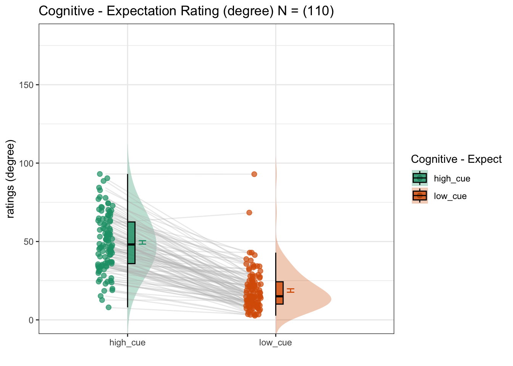

# beh :: expectation ~ cue {#beh-expect-cue}

---

output:
rmdformats::downcute:
use_bookdown: true

---

## What is the purpose of this notebook? {.unlisted .unnumbered}

Here, I plot the expectation ratings as a function of cue.

- Main model: `lmer(expect_rating ~ cue)`
- Main question: do expectations ratings differ as a function of cue type?
- If there is a main effect of cue on expectation ratings, does this cue effect differ depending on task type?
- IV: cue (high / low)
- DV: expectation rating


```r
for (taskname in c("pain", "vicarious", "cognitive")) {
    dv_keyword <- "expect"
    model_savefname <- file.path(
        analysis_dir,
        paste("lmer_task-", taskname,
            "_rating-", dv_keyword,
            "_", as.character(Sys.Date()), ".txt",
            sep = ""
        )
    )
    iv <- "param_stimulus_type"
    dv <- "event02_expect_angle"
    subject_varkey <- "src_subject_id"

    print_lmer_output = TRUE
    exclude <- "sub-0001|sub-0999"
    # load data, run model, and exclude outliers
    data <- load_task_social_df(datadir, taskname, subject_varkey, iv, dv, exclude)

    data$subject = factor(data$src_subject_id)
    data$stim_name[data$param_stimulus_type == "high_stim"] <- "high"
    data$stim_name[data$param_stimulus_type == "med_stim"] <- "med"
    data$stim_name[data$param_stimulus_type == "low_stim"] <- "low"

    data$stimlin[data$param_stimulus_type == "high_stim"] <- 0.5
    data$stimlin[data$param_stimulus_type == "med_stim"] <- 0
    data$stimlin[data$param_stimulus_type == "low_stim"] <- -0.5

    data$stimquad[data$param_stimulus_type == "high_stim"] <- -0.34
    data$stimquad[data$param_stimulus_type == "med_stim"] <- 0.66
    data$stimquad[data$param_stimulus_type == "low_stim"] <- -0.34

        data$cue_name[data$param_cue_type == "high_cue"] <- "high"
    data$cue_name[data$param_cue_type == "low_cue"] <- "low"

            data$cue_con[data$param_cue_type == "high_cue"] <- 0.5
    data$cue_con[data$param_cue_type == "low_cue"] <- -0.5
    # DATA$levels_ordered <- factor(DATA$param_stimulus_type, levels=c("low", "med", "high"))

    data$stim_ordered <- factor(
        data$stim_name,
        levels = c("low", "med", "high")
    )
    iv <- "stim_ordered"
    dv <- "event02_expect_angle"
    print(taskname)
    model <- lmer(event02_expect_angle ~ cue_con + (1|src_subject_id), data = data)
    print(summary(model))
}
```

```
## [1] "pain"
## Linear mixed model fit by REML. t-tests use Satterthwaite's method [
## lmerModLmerTest]
## Formula: event02_expect_angle ~ cue_con + (1 | src_subject_id)
##    Data: data
## 
## REML criterion at convergence: 56012.8
## 
## Scaled residuals: 
##     Min      1Q  Median      3Q     Max 
## -5.1273 -0.6288 -0.0305  0.6197  4.8504 
## 
## Random effects:
##  Groups         Name        Variance Std.Dev.
##  src_subject_id (Intercept) 831.9    28.84   
##  Residual                   529.5    23.01   
## Number of obs: 6095, groups:  src_subject_id, 114
## 
## Fixed effects:
##              Estimate Std. Error        df t value Pr(>|t|)    
## (Intercept)   60.9943     2.7230  113.0814   22.40   <2e-16 ***
## cue_con       34.4542     0.5899 5981.2865   58.41   <2e-16 ***
## ---
## Signif. codes:  0 '***' 0.001 '**' 0.01 '*' 0.05 '.' 0.1 ' ' 1
## 
## Correlation of Fixed Effects:
##         (Intr)
## cue_con 0.000 
## [1] "vicarious"
## Linear mixed model fit by REML. t-tests use Satterthwaite's method [
## lmerModLmerTest]
## Formula: event02_expect_angle ~ cue_con + (1 | src_subject_id)
##    Data: data
## 
## REML criterion at convergence: 57065.6
## 
## Scaled residuals: 
##     Min      1Q  Median      3Q     Max 
## -4.3554 -0.6080 -0.0778  0.5620  6.2802 
## 
## Random effects:
##  Groups         Name        Variance Std.Dev.
##  src_subject_id (Intercept) 116.5    10.79   
##  Residual                   293.8    17.14   
## Number of obs: 6656, groups:  src_subject_id, 114
## 
## Fixed effects:
##              Estimate Std. Error        df t value Pr(>|t|)    
## (Intercept)   31.1604     1.0368  112.8038   30.05   <2e-16 ***
## cue_con       33.7887     0.4205 6542.0225   80.36   <2e-16 ***
## ---
## Signif. codes:  0 '***' 0.001 '**' 0.01 '*' 0.05 '.' 0.1 ' ' 1
## 
## Correlation of Fixed Effects:
##         (Intr)
## cue_con 0.002 
## [1] "cognitive"
## Linear mixed model fit by REML. t-tests use Satterthwaite's method [
## lmerModLmerTest]
## Formula: event02_expect_angle ~ cue_con + (1 | src_subject_id)
##    Data: data
## 
## REML criterion at convergence: 58008
## 
## Scaled residuals: 
##     Min      1Q  Median      3Q     Max 
## -3.3780 -0.6120 -0.0800  0.5341  9.3354 
## 
## Random effects:
##  Groups         Name        Variance Std.Dev.
##  src_subject_id (Intercept) 167.4    12.94   
##  Residual                   303.3    17.41   
## Number of obs: 6737, groups:  src_subject_id, 114
## 
## Fixed effects:
##              Estimate Std. Error        df t value Pr(>|t|)    
## (Intercept)   33.8866     1.2332  112.1041   27.48   <2e-16 ***
## cue_con       31.7535     0.4246 6622.2852   74.78   <2e-16 ***
## ---
## Signif. codes:  0 '***' 0.001 '**' 0.01 '*' 0.05 '.' 0.1 ' ' 1
## 
## Correlation of Fixed Effects:
##         (Intr)
## cue_con 0.000
```


```r
# parameters _____________________________________ # nolint
subject_varkey <- "src_subject_id"
iv <- "param_cue_type"; iv_keyword <- "cue"; dv <- "event02_expect_angle"; dv_keyword <- "expect"
xlab <- ""; ylim = c(0,180); ylab <- "ratings (degree)"
subject <- "subject"
exclude <- "sub-0001|sub-0003|sub-0004|sub-0005|sub-0025|sub-0999"
subjectwise_mean <- "mean_per_sub"; group_mean <- "mean_per_sub_norm_mean"; se <- "se"
color_scheme <-     if (any(startsWith(dv_keyword, c("expect", "Expect")))) {
        color_scheme <- c("#1B9E77", "#D95F02")
    } else {
        color_scheme <- c("#4575B4", "#D73027")
    }
print_lmer_output <- FALSE
ggtitle_phrase <- " - Expectation Rating (degree)"
analysis_dir <- file.path(main_dir, "analysis", "mixedeffect", "model01_iv-cue_dv-expect", as.character(Sys.Date()))
dir.create(analysis_dir, showWarnings = FALSE, recursive = TRUE)
```


## Pain

### For the pain task, what is the effect of cue on expectation ratings? {.unlisted .unnumbered}

[ INSERT DESCRIPTION ]


## Vicarious

### For the vicarious task, what is the effect of cue on expectation ratings? {.unlisted .unnumbered}

[ INSERT DESCRIPTION ]


## Cognitive

### For the cognitive task, what is the effect of cue on expectation ratings? {.unlisted .unnumbered}

[ INSERT DESCRIPTION ]




## Individual difference analysis

### Are cue effects (on expectation ratings) similar across tasks? {.unlisted .unnumbered}

> Using the random slopes of cue effects, here we plot them side by side
> with all three tasks of pain, cognitive, vicarious. As we can see, there
> is a high correlation across the random effects of cue across
> pain-cognitive, pain-vicarious, and cognitive-vicarious. These plots
> suggest a universal mechansim in the cue-expectancy effect, although
> some may critic that the cues were identical across tasks, thereby the
> cue effects are identical due to the stimuli itself, not necessarily a
> domain-general expectation process.


```
## Warning: Removed 3 rows containing non-finite values (`stat_cor()`).
```

```
## Warning: Removed 3 rows containing missing values (`geom_point()`).
```

```
## Warning: Removed 1 rows containing non-finite values (`stat_cor()`).
```

```
## Warning: Removed 1 rows containing missing values (`geom_point()`).
```

```
## Warning: Removed 3 rows containing non-finite values (`stat_cor()`).
```

```
## Warning: Removed 3 rows containing missing values (`geom_point()`).
```


