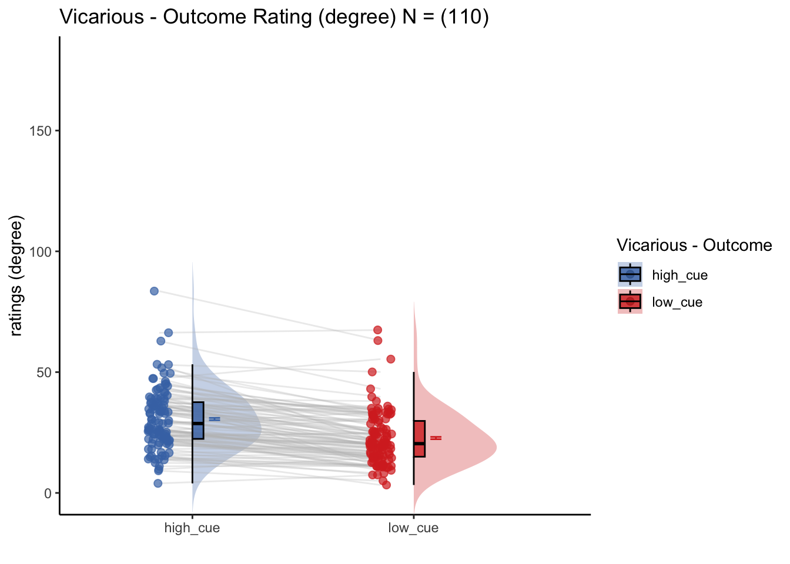

# [ beh ] outcome ~ cue {#ch03_cue}

## What is the purpose of this notebook? {.unlisted .unnumbered}
Here, I plot the outcome ratings as a function of cue. 
* Main model: `lmer(outcome_rating ~ cue)` 
* Main question: do outcome ratings differ as a function of cue type? 
* If there is a main effect of cue on outcome ratings, does this cue effect differ depending on task type?
* IV: cue (high / low)
* DV: outcome rating

FIX: plot statistics in random effect plot - what is broken?


```r
# parameters _____________________________________ # nolint
subject_varkey <- "src_subject_id"
iv <- "param_cue_type"; iv_keyword <- "cue"; dv <- "event04_actual_angle"; dv_keyword <- "outcome"
xlab <- ""; ylim = c(0,180); ylab <- "ratings (degree)"
subject <- "subject"
exclude <- "sub-0001|sub-0003|sub-0004|sub-0005|sub-0025|sub-0999"
subjectwise_mean <- "mean_per_sub"; group_mean <- "mean_per_sub_norm_mean"; se <- "se"
color_scheme <-     if (any(startsWith(dv_keyword, c("expect", "Expect")))) {
        color_scheme <- c("#1B9E77", "#D95F02")
    } else {
        color_scheme <- c("#4575B4", "#D73027")
    }
print_lmer_output <- FALSE
ggtitle_phrase <- " - Outcome Rating (degree)"
analysis_dir <- file.path(main_dir, "analysis", "mixedeffect", "model02_iv-cue_dv-outcome", as.character(Sys.Date()))
dir.create(analysis_dir, showWarnings = FALSE, recursive = TRUE)
```


## Pain
### For the vicarious task, what is the effect of cue on outcome ratings? {.unlisted .unnumbered}
[ INSERT DESCRIPTION ]


## Vicarious
### For the vicarious task, what is the effect of cue on outcome ratings? {.unlisted .unnumbered}
[ INSERT DESCRIPTION ]


## Cognitive
### For the cognitive task, what is the effect of cue on outcome ratings? {.unlisted .unnumbered}
[ INSERT DESCRIPTION ]


## Individual differences analysis: random cue effects
Using the random effects from the mixed effects model, I'm plotting the random effect of cue types per task. 


[ INSERT DESCRIPTION ]


Note:
* Pain: Warning: Removed 2 rows containing non-finite values (`stat_cor()`).
* Vicarious: Warning: Removed 1 rows containing non-finite values (`stat_cor()`).
* Cognitive: Warning: Removed 2 rows containing non-finite values (`stat_cor()`).


## Individual differences analysis 2: random intercept + random slopes of cue effect
based on Tor's suggestion, plotting the random efects with the random intercepts as well. not just the cue effects


Note:
* Pain: Warning: Removed 49 rows containing non-finite values (`stat_cor()`).
* Vicarious: Removed 8 rows containing non-finite values (`stat_cor()`).
* Cognitive: Removed 52 rows containing non-finite values (`stat_cor()`).
