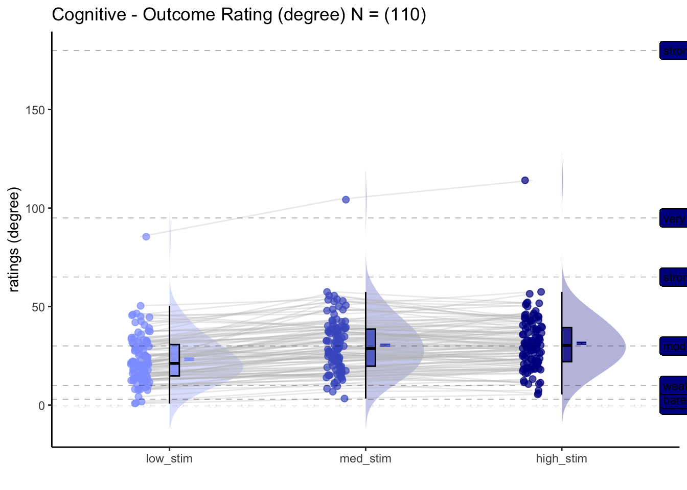

# [ beh ] outcome ~ stimulus_intensity {#ch04_outcome-stim}

## What is the purpose of this notebook? {.unlisted .unnumbered}
Here, I plot the outcome ratings as a function of stimulus intensity 
* Main model: `lmer(outcome_rating ~ stim)` 
* Main question: do outcome ratings differ as a function of stimulus intensity? We should expect to see a linear effect of stimulus intensity.
* If there is a main effect of cue on expectation ratings, does this cue effect differ depending on task type?
* IV: stim (high / med / low)
* DV: outcome rating

FIX: plot statistics in random effect plot - what is broken?


```r
# parameters _____________________________________ # nolint
subject_varkey <- "src_subject_id"
iv <- "param_stimulus_type"; iv_keyword <- "stim"; dv <- "event04_actual_angle"; dv_keyword <- "outcome"
xlab <- ""; ylim = c(0,180); ylab <- "ratings (degree)"
subject <- "subject"
exclude <- "sub-0001|sub-0003|sub-0004|sub-0005|sub-0025|sub-0999"
subjectwise_mean <- "mean_per_sub"; group_mean <- "mean_per_sub_norm_mean"; se <- "se"
color_scheme <-     if (any(startsWith(dv_keyword, c("expect", "Expect")))) {
        color_scheme <- c("#1B9E77", "#D95F02")
    } else {
        color_scheme <- c("#4575B4", "#D73027")
    }
print_lmer_output <- FALSE
ggtitle_phrase <- " - Outcome Rating (degree)"
analysis_dir <- file.path(main_dir, "analysis", "mixedeffect", paste0("model03_iv-",iv_keyword,"_dv-",dv_keyword), as.character(Sys.Date()))
dir.create(analysis_dir, showWarnings = FALSE, recursive = TRUE)
```


## Pain

### For the pain task, what is the effect of stimulus intensity on outcome ratings? {.unlisted .unnumbered}
[ INSERT DESCRIPTION ]

```
## Warning in geom_line(data = subjectwise, aes(group = .data[[subject]], x =
## as.numeric(as.factor(.data[[iv]])) - : Ignoring unknown aesthetics: fill
```

```
## Warning: Using `size` aesthetic for lines was deprecated in ggplot2 3.4.0.
## ℹ Please use `linewidth` instead.
```


## Vicarious
### For the vicarious task, what is the effect of stimulus intensity on outcome ratings? {.unlisted .unnumbered}
[ INSERT DESCRIPTION ]

```
## Warning: Model failed to converge with 1 negative eigenvalue: -8.5e+01
```

```
## Warning in geom_line(data = subjectwise, aes(group = .data[[subject]], x =
## as.numeric(as.factor(.data[[iv]])) - : Ignoring unknown aesthetics: fill
```


## Cognitive
### For the cognitive task, what is the effect of stimulus intensity on outcome ratings? {.unlisted .unnumbered}
[ INSERT DESCRIPTION ]

```
## Warning: Model failed to converge with 1 negative eigenvalue: -1.1e+02
```

```
## Warning in geom_line(data = subjectwise, aes(group = .data[[subject]], x =
## as.numeric(as.factor(.data[[iv]])) - : Ignoring unknown aesthetics: fill
```




## for loop

```r
combined_se_calc_cooksd <- data.frame()
analysis_dir <- file.path(
        main_dir,
        "analysis", "mixedeffect", "model04_iv-stim_dv-actual",as.character(Sys.Date())
    )
dir.create(analysis_dir, showWarnings = FALSE, recursive = TRUE)

# 1. [ PARAMETERS ]  __________________________________________________ # nolint
dv_keyword <- "actual"
xlab <- ""
ylab <- "judgment (degree)"
for (taskname in c("pain", "vicarious", "cognitive")) {
    ggtitle <- paste(taskname, " - actual judgment (degree)")
    title <- paste(taskname, " - actual")
    subject <- "src_subject_id"
    subject_varkey <- "src_subject_id"
    data <- load_task_social_df(datadir, 
        taskname = taskname,
        subject_varkey = "src_subject_id",
        
        iv = "param_cue_type",
        dv = "event04_actual_angle",
        exclude = "sub-0001|sub-0003|sub-0004|sub-0005|sub-0025|sub-0999"
    )

    w <- 10
    h <- 6

    # [ CONTRASTS ]  ________________________________________________________________________________ # nolint
    # contrast code ________________________________________
    data$stim[data$event03_stimulus_type == "low_stim"] <- -0.5 # social influence task
    data$stim[data$event03_stimulus_type == "med_stim"] <- 0 # no influence task
    data$stim[data$event03_stimulus_type == "high_stim"] <- 0.5 # no influence task

    data$stim_factor <- factor(data$event03_stimulus_type)

    # contrast code 1 linear
    data$stim_con_linear[data$event03_stimulus_type == "low_stim"] <- -0.5
    data$stim_con_linear[data$event03_stimulus_type == "med_stim"] <- 0
    data$stim_con_linear[data$event03_stimulus_type == "high_stim"] <- 0.5

    # contrast code 2 quadratic
    data$stim_con_quad[data$event03_stimulus_type == "low_stim"] <- -0.33
    data$stim_con_quad[data$event03_stimulus_type == "med_stim"] <- 0.66
    data$stim_con_quad[data$event03_stimulus_type == "high_stim"] <- -0.33

    # social cude contrast
    data$social_cue[data$param_cue_type == "low_cue"] <- -0.5 # social influence task
    data$social_cue[data$param_cue_type == "high_cue"] <- 0.5 # no influence task

    stim_con1 <- "stim_con_linear"
    stim_con2 <- "stim_con_quad"
    iv1 <- "param_cue_type"
    #iv1 <- "social_cue"
    dv <- "event04_actual_angle"

    # [ MODEL ] _________________________________________________ # nolint
    model_savefname <- file.path(
        analysis_dir,
        paste("lmer_task-", taskname,
            "_rating-", dv_keyword,
            "_", as.character(Sys.Date()), "_cooksd.txt",
            sep = ""
        )
    )
    cooksd <- lmer_onefactor_cooksd(
        data, taskname, iv, dv,
        subject, dv_keyword, model_savefname, print_lmer_output = TRUE
    )
    influential <- as.numeric(names(cooksd)[
        (cooksd > (4 / as.numeric(length(unique(data$src_subject_id)))))
    ])
    data_screen <- data[-influential, ]
    # [ PLOT ] reordering for plots _________________________ # nolint
    data_screen$stim_name[data_screen$param_stimulus_type == "high_stim"] <- "high"
    data_screen$stim_name[data_screen$param_stimulus_type == "med_stim"] <- "med"
    data_screen$stim_name[data_screen$param_stimulus_type == "low_stim"] <- "low"

    # DATA$levels_ordered <- factor(DATA$param_stimulus_type, levels=c("low", "med", "high"))

    data_screen$stim_ordered <- factor(
        data_screen$stim_name,
        levels = c("low", "med", "high")
    )
    model_iv1 <- "stim_ordered"
    #model_iv2 <- "cue_ordered"

    #  [ PLOT ] calculate mean and se  _________________________
    actual_subjectwise <- meanSummary(
        data_screen,
        c("src_subject_id", model_iv1), dv
    )
    actual_groupwise <- summarySEwithin(
        data = actual_subjectwise,
        measurevar = "mean_per_sub",
        withinvars = c(model_iv1), idvar = "src_subject_id"
    )
    actual_groupwise$task <- taskname
    # https://stackoverflow.com/questions/29402528/append-data-frames-together-in-a-for-loop/29419402
    combined_se_calc_cooksd <- rbind(combined_se_calc_cooksd, actual_groupwise)

    #  [ PLOT ] calculate mean and se  ----------------------------------------------------------------------------
    sub_mean <- "mean_per_sub"
    group_mean <- "mean_per_sub_norm_mean"
    se <- "se"
    subject <- "src_subject_id"
    ggtitle <- paste(taskname, " - Actual Rating (degree) Cooksd removed")
    title <- paste(taskname, " - Actual")
    xlab <- ""
    ylab <- "ratings (degree)"
    ylim <- c(-10,190)
    dv_keyword <- "actual"
    if (any(startsWith(dv_keyword, c("expect", "Expect")))) {
        color <- c("#1B9E77", "#D95F02", "#D95F02")
    } else {
        color <- c("#4575B4", "#D73027", "#D95F02" )
    } # if keyword starts with
    plot_savefname <- file.path(
        analysis_dir,
        paste("raincloud_task-", taskname,
            "_rating-", dv_keyword,
            "_", as.character(Sys.Date()), "_cooksd.png",
            sep = ""
        )
    )
    g <- plot_halfrainclouds_onefactor(
        actual_subjectwise, actual_groupwise, model_iv1,
        sub_mean, group_mean, se, subject,
        ggtitle, title, xlab, ylab, taskname,ylim,
        w, h, dv_keyword, color, plot_savefname
    )

    g <- g + 
      geom_hline(yintercept = 0, size = 0.1, linetype = "dashed") + 
      geom_label(x = 3.5, y = 0, label = c("no sensation"), hjust = 0, nudge_x = 0.1, size = 3) +
      geom_hline(yintercept = 3, size = 0.1, linetype = "dashed") + 
      geom_label(x = 3.5, y = 3, label = c("barely detectable"), hjust = 0, nudge_x = 0.1, size = 3) +
      geom_hline(yintercept = 10, size = 0.1, linetype = "dashed") + 
      geom_label(x = 3.5, y = 10, label = c("weak"), hjust = 0, nudge_x = 0.1, size = 3) +
      geom_hline(yintercept = 30, size = 0.1, linetype = "dashed") + 
      geom_label(x = 3.5, y = 30, label = c("moderate"), hjust = 0, nudge_x = 0.1, size = 3) +
      geom_hline(yintercept = 65, size = 0.1, linetype = "dashed") + 
      geom_label(x = 3.5, y = 65, label = c("strong"), hjust = 0, nudge_x = 0.1, size = 3) +
      geom_hline(yintercept = 95, size = 0.1, linetype = "dashed") + 
      geom_label(x = 3.5, y = 95, label = c("very strong"), hjust = 0, nudge_x = 0.1, size = 3) +
      geom_hline(yintercept = 180, size = 0.1, linetype = "dashed") + 
      geom_label(x = 3.5, y = 180, label = c("strongest imaginable"), hjust = 0, nudge_x = 0.1, size = 3) +
      coord_cartesian(clip = 'off')+
      theme_classic() + 
      theme(legend.position = "none") 
    
    ggsave(plot_savefname, width = w, height = h)
    
  g  

    # save fixed random effects _______________________________
#     randEffect$newcoef <- mapvalues(randEffect$term,
#         from = c("(Intercept)", "data[, iv]", 
#                  "data[, stim_con1]", "data[, stim_con2]", 
#                  "data[, iv]:data[, stim_con1]", 
#                  "data[, iv]:data[, stim_con2]"),
#         to = c("rand_intercept", "rand_cue", "rand_stimlin", 
#                "rand_stimquad", "rand_int_cue_stimlin", #"rand_int_cue_stimquad")
#     )
# 
#     #
#     # # The arguments to spread():
#     # # - data: Data object
#     # # - key: Name of column containing the new column names
#     # # - value: Name of column containing values
#     #
#     # # TODO: add fixed effects
#     #
#     rand_subset <- subset(randEffect, select = -c(grpvar, term, condsd))
#     wide_rand <- spread(rand_subset, key = newcoef, value = condval)
#     wide_fix <- do.call(
#         "rbind",
#         replicate(nrow(wide_rand), #as.data.frame(t(as.matrix(fixEffect))),
#             simplify = FALSE
#         )
#     )
#     rownames(wide_fix) <- NULL
#     new_wide_fix <- dplyr::rename(wide_fix,
#         fix_intercept = `(Intercept)`, 
#         fix_cue = `social_cue`, # `data[, iv]`,
#         fix_stimulus_linear = `stim_con_linear`, # `data[, stim_con1]`,
#         fix_stimulus_quad = `stim_con_quad`, #`data[, stim_con2]`, 
#         fix_int_cue_stimlin = `social_cue:stim_con_linear`, #`data[, iv]:data[, stim_con1]`,
#         fix_int_cue_stimquad = `social_cue:stim_con_quad` #`data[, iv]:data[, stim_con2]`
#     )
# 
#     total <- cbind(wide_rand, new_wide_fix)
#     total$task <- taskname
#     new_total <- total %>% dplyr::select(task, everything())
#     new_total <- dplyr::rename(total, subj = grp)
# 
#     plot_savefname <- file.path(analysis_dir, 
#                                 paste("randeffect_task-", taskname, 
#                                       "_", as.character(Sys.Date()), #"_outlier-cooksd.csv", sep = ""))
#     write.csv(new_total, plot_savefname, row.names = FALSE)
# 
}
```

```
## boundary (singular) fit: see help('isSingular')
```

```
## Linear mixed model fit by REML. t-tests use Satterthwaite's method [
## lmerModLmerTest]
## Formula: 
## as.formula(reformulate(c(iv, sprintf("(%s|%s)", iv, subject_keyword)),  
##     response = dv))
##    Data: df
## 
## REML criterion at convergence: 52938.5
## 
## Scaled residuals: 
##     Min      1Q  Median      3Q     Max 
## -4.5365 -0.5608 -0.0002  0.5695  4.6143 
## 
## Random effects:
##  Groups         Name                        Variance Std.Dev. Corr       
##  src_subject_id (Intercept)                 952.46   30.862              
##                 param_stimulus_typelow_stim 127.22   11.279   -0.47      
##                 param_stimulus_typemed_stim  29.79    5.458   -0.24  0.97
##  Residual                                   448.14   21.169              
## Number of obs: 5851, groups:  src_subject_id, 110
## 
## Fixed effects:
##                             Estimate Std. Error       df t value Pr(>|t|)    
## (Intercept)                  80.3242     2.9886 109.1411   26.88   <2e-16 ***
## param_stimulus_typelow_stim -29.2521     1.2974 107.5783  -22.55   <2e-16 ***
## param_stimulus_typemed_stim -13.7621     0.8652 148.5592  -15.90   <2e-16 ***
## ---
## Signif. codes:  0 '***' 0.001 '**' 0.01 '*' 0.05 '.' 0.1 ' ' 1
## 
## Correlation of Fixed Effects:
##                 (Intr) prm_stmls_typl_
## prm_stmls_typl_ -0.455                
## prm_stmls_typm_ -0.236  0.718         
## optimizer (nloptwrap) convergence code: 0 (OK)
## boundary (singular) fit: see help('isSingular')
```

```
## Warning in geom_line(data = subjectwise, aes(group = .data[[subject]], x =
## as.numeric(as.factor(.data[[iv]])) - : Ignoring unknown aesthetics: fill
```

```
## Coordinate system already present. Adding new coordinate system, which will
## replace the existing one.
## boundary (singular) fit: see help('isSingular')
```

```
## Linear mixed model fit by REML. t-tests use Satterthwaite's method [
## lmerModLmerTest]
## Formula: 
## as.formula(reformulate(c(iv, sprintf("(%s|%s)", iv, subject_keyword)),  
##     response = dv))
##    Data: df
## 
## REML criterion at convergence: 56882.7
## 
## Scaled residuals: 
##     Min      1Q  Median      3Q     Max 
## -5.5482 -0.5779 -0.1812  0.4475  6.1884 
## 
## Random effects:
##  Groups         Name                        Variance Std.Dev. Corr       
##  src_subject_id (Intercept)                 283.44   16.836              
##                 param_stimulus_typelow_stim 172.13   13.120   -0.88      
##                 param_stimulus_typemed_stim  98.63    9.931   -0.85  1.00
##  Residual                                   448.25   21.172              
## Number of obs: 6313, groups:  src_subject_id, 110
## 
## Fixed effects:
##                             Estimate Std. Error      df t value Pr(>|t|)    
## (Intercept)                   40.822      1.681 108.598   24.29   <2e-16 ***
## param_stimulus_typelow_stim  -24.936      1.426 109.210  -17.49   <2e-16 ***
## param_stimulus_typemed_stim  -17.614      1.162 114.541  -15.15   <2e-16 ***
## ---
## Signif. codes:  0 '***' 0.001 '**' 0.01 '*' 0.05 '.' 0.1 ' ' 1
## 
## Correlation of Fixed Effects:
##                 (Intr) prm_stmls_typl_
## prm_stmls_typl_ -0.837                
## prm_stmls_typm_ -0.784  0.862         
## optimizer (nloptwrap) convergence code: 0 (OK)
## boundary (singular) fit: see help('isSingular')
```

```
## Warning in geom_line(data = subjectwise, aes(group = .data[[subject]], x =
## as.numeric(as.factor(.data[[iv]])) - : Ignoring unknown aesthetics: fill
```

```
## Coordinate system already present. Adding new coordinate system, which will
## replace the existing one.
## boundary (singular) fit: see help('isSingular')
```

```
## Linear mixed model fit by REML. t-tests use Satterthwaite's method [
## lmerModLmerTest]
## Formula: 
## as.formula(reformulate(c(iv, sprintf("(%s|%s)", iv, subject_keyword)),  
##     response = dv))
##    Data: df
## 
## REML criterion at convergence: 54866.8
## 
## Scaled residuals: 
##     Min      1Q  Median      3Q     Max 
## -3.7173 -0.6283 -0.1660  0.4545  7.0548 
## 
## Random effects:
##  Groups         Name                        Variance Std.Dev. Corr       
##  src_subject_id (Intercept)                 176.9233 13.3013             
##                 param_stimulus_typelow_stim   8.2230  2.8676  -0.75      
##                 param_stimulus_typemed_stim   0.4181  0.6466   0.37  0.33
##  Residual                                   374.7596 19.3587             
## Number of obs: 6220, groups:  src_subject_id, 110
## 
## Fixed effects:
##                             Estimate Std. Error       df t value Pr(>|t|)    
## (Intercept)                  31.4642     1.3417 109.5625  23.451   <2e-16 ***
## param_stimulus_typelow_stim  -8.1551     0.6623 106.7910 -12.313   <2e-16 ***
## param_stimulus_typemed_stim  -1.0096     0.6056 718.4229  -1.667   0.0959 .  
## ---
## Signif. codes:  0 '***' 0.001 '**' 0.01 '*' 0.05 '.' 0.1 ' ' 1
## 
## Correlation of Fixed Effects:
##                 (Intr) prm_stmls_typl_
## prm_stmls_typl_ -0.500                
## prm_stmls_typm_ -0.186  0.465         
## optimizer (nloptwrap) convergence code: 0 (OK)
## boundary (singular) fit: see help('isSingular')
```

```
## Warning in geom_line(data = subjectwise, aes(group = .data[[subject]], x =
## as.numeric(as.factor(.data[[iv]])) - : Ignoring unknown aesthetics: fill
```

```
## Coordinate system already present. Adding new coordinate system, which will
## replace the existing one.
```

## Lineplot

```r
library(ggpubr)
DATA = as.data.frame(combined_se_calc_cooksd)
color = c( "#4575B4", "#D73027")
LINEIV1 = "stim_ordered"
LINEIV2 = "cue_ordered"
MEAN = "mean_per_sub_norm_mean"
ERROR = "se"
dv_keyword = "actual"
p1 = plot_lineplot_onefactor(DATA, 'pain', 
               LINEIV1, MEAN, ERROR, color, xlab = "Stimulus intensity" , ylab= "Outcome rating", ggtitle = 'pain' )
p2 = plot_lineplot_onefactor(DATA,'vicarious', 
               LINEIV1, MEAN, ERROR, color,xlab = "Stimulus intensity" , ylab= "Outcome rating",ggtitle = 'vicarious')
p3 = plot_lineplot_onefactor(DATA, 'cognitive', 
               LINEIV1, MEAN, ERROR, color,xlab = "Stimulus intensity" , ylab= "Outcome rating",ggtitle = 'cognitive')
#grid.arrange(p1, p2, p3, ncol=3 , common.legend = TRUE)
ggpubr::ggarrange(p1,p2,p3,ncol = 3, nrow = 1, common.legend = TRUE,legend = "bottom")
```


```r
plot_filename = file.path(analysis_dir,
                          paste('lineplot_task-all_rating-',dv_keyword,'.png', sep = ""))
ggsave(plot_filename, width = 15, height = 6)
```

## individual differences in outcome rating cue effect 
[ INSERT DESCRIPTION ]


