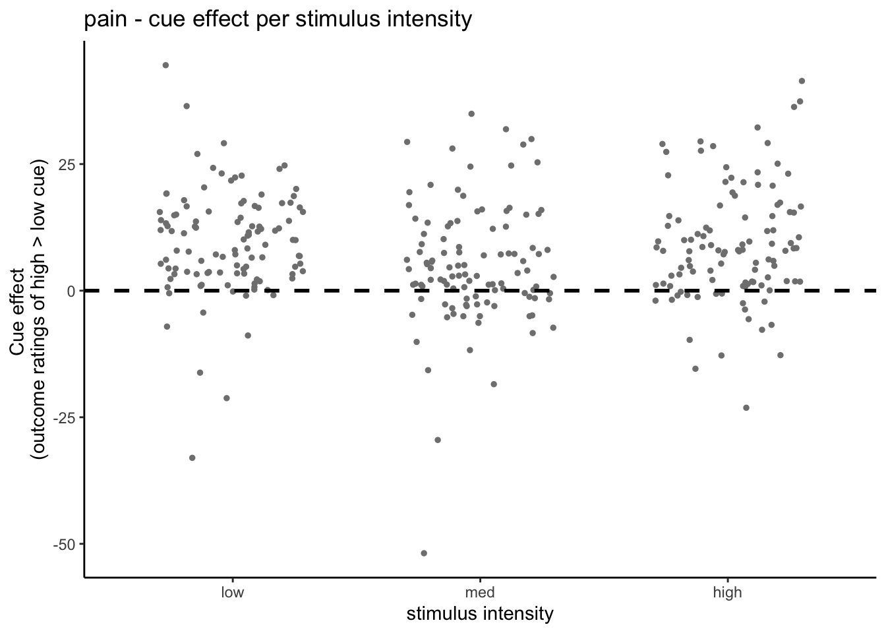
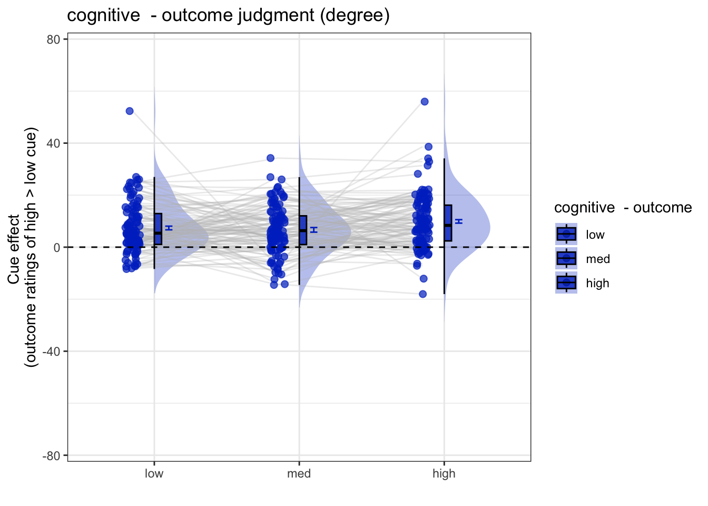

# [beh] outcome_rating ~ cue * stim {#ch05_outcome-cueXstim}

## What is the purpose of this notebook? {.unlisted .unnumbered}

Here, I plot the outcome ratings as a function of cue and stimulus intensity. 

* Main model: `lmer(outcome_rating ~ cue * stim)` 
* Main question: do outcome ratings differ as a function of cue type and stimulus intensity? 
* If there is a main effect of cue on outcome ratings, does this cue effect differ depending on task type?
* Is there an interaction between the two factors?
* IV: 
  - cue (high / low)
  - stim (high / med / low)
* DV: outcome rating


## model 03 iv-cuecontrast dv-outcome



### model 03 3-2. individual difference


### model 04 iv-cue-stim dv-outcome


### Nov 17 lmer

```r
    # stim_con1 <- "stim_con_linear"
    # stim_con2 <- "stim_con_quad"
    # iv1 <- "social_cue"
    # dv <- "event04_actual_angle"

fullmodel <- lmer(event04_actual_angle ~ 1+ social_cue + stim_con_linear + stim_con_quad + social_cue:stim_con_linear + social_cue:stim_con_quad
     + (1+ social_cue + stim_con_linear + stim_con_quad+ social_cue:stim_con_linear  | src_subject_id), data=data)
```

```
## boundary (singular) fit: see help('isSingular')
```

```r
summary(fullmodel)
```

```
## Linear mixed model fit by REML. t-tests use Satterthwaite's method [
## lmerModLmerTest]
## Formula: 
## event04_actual_angle ~ 1 + social_cue + stim_con_linear + stim_con_quad +  
##     social_cue:stim_con_linear + social_cue:stim_con_quad + (1 +  
##     social_cue + stim_con_linear + stim_con_quad + social_cue:stim_con_linear |  
##     src_subject_id)
##    Data: data
## 
## REML criterion at convergence: 54523.3
## 
## Scaled residuals: 
##     Min      1Q  Median      3Q     Max 
## -3.4932 -0.6227 -0.1494  0.4685  7.0856 
## 
## Random effects:
##  Groups         Name                       Variance Std.Dev. Corr             
##  src_subject_id (Intercept)                160.757  12.679                    
##                 social_cue                  27.920   5.284    0.37            
##                 stim_con_linear             11.126   3.336    0.60 -0.04      
##                 stim_con_quad                2.765   1.663    0.79  0.24  0.72
##                 social_cue:stim_con_linear   3.197   1.788   -0.29  0.68 -0.08
##  Residual                                  349.846  18.704                    
##       
##       
##       
##       
##       
##  -0.15
##       
## Number of obs: 6220, groups:  src_subject_id, 110
## 
## Fixed effects:
##                             Estimate Std. Error        df t value Pr(>|t|)    
## (Intercept)                  28.4134     1.2360  109.1664  22.988  < 2e-16 ***
## social_cue                    8.0490     0.7017  106.1701  11.470  < 2e-16 ***
## stim_con_linear               8.1671     0.6657  106.6467  12.268  < 2e-16 ***
## stim_con_quad                 3.0904     0.5350  111.0283   5.777 7.05e-08 ***
## social_cue:stim_con_linear    2.5872     1.1738 1373.9978   2.204   0.0277 *  
## social_cue:stim_con_quad     -1.6740     1.0200 5843.5215  -1.641   0.1008    
## ---
## Signif. codes:  0 '***' 0.001 '**' 0.01 '*' 0.05 '.' 0.1 ' ' 1
## 
## Correlation of Fixed Effects:
##                (Intr) socl_c stm_cn_l stm_cn_q scl_c:stm_cn_l
## social_cue      0.262                                        
## stim_cn_lnr     0.284 -0.015                                 
## stim_con_qd     0.232  0.049  0.106                          
## scl_c:stm_cn_l -0.041  0.074 -0.002   -0.008                 
## scl_c:stm_cn_q -0.001  0.004 -0.002    0.000    0.001        
## optimizer (nloptwrap) convergence code: 0 (OK)
## boundary (singular) fit: see help('isSingular')
```


### model 04 4-2 individual differences in cue effects


### model 04 4-3 scatter plot


### model 04 4-4 lineplot


# Clinical trials
## cue contrast average across intensity

```
## [1] "pain"
## [1] 8.203947
## [1] 0.8871599
## [1] "high vs. low cue"
## [1] "low"              "61.6884121864272" "2.860880140792"  
## [1] "high"             "70.2234946843967" "2.85365310068339"
## [1] "vicarious"
## [1] 7.69279
## [1] 0.6584873
## [1] "high vs. low cue"
## [1] "low"              "22.7808026788692" "1.0440409512757" 
## [1] "high"             "30.636407755966"  "1.20480098494488"
## [1] "cognitive"
## [1] 8.019356
## [1] 0.7038933
## [1] "high vs. low cue"
## [1] "low"              "24.308987672219"  "1.19373008209444"
## [1] "high"             "32.34623546235"   "1.37653031156445"
```

## cue contrast average across expectation

```
## [1] "pain"
## [1] 35.05694
## [1] 1.989724
## [1] "high vs. low cue"
## [1] "low"              "44.6580941421071" "3.02430373086043"
## [1] "high"             "79.4644108331637" "2.85584321656255"
## [1] "vicarious"
## [1] 33.25123
## [1] 1.503149
## [1] "high vs. low cue"
## [1] "low"              "14.9314711535258" "1.00860750130232"
## [1] "high"             "48.146271174259"  "1.54236667339445"
## [1] "cognitive"
## [1] 30.7638
## [1] 1.53046
## [1] "high vs. low cue"
## [1] "low"              "18.5956241315907" "1.20836045474955"
## [1] "high"             "49.3940294143433" "1.73640570707356"
```
