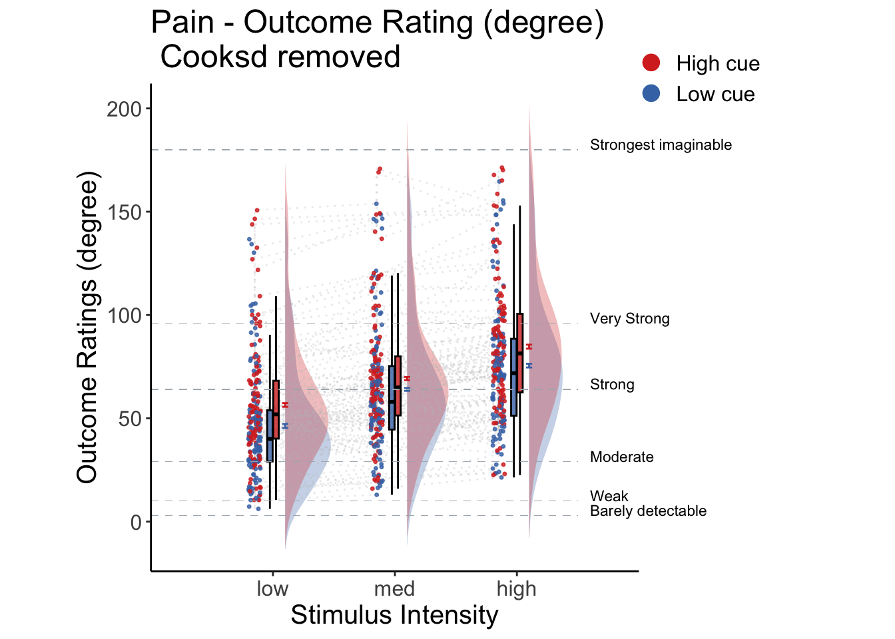

# beh :: outcome ~ cue \* stim {#beh_outcome-cueXstim}

## What is the purpose of this notebook? {.unlisted .unnumbered}

Here, I plot the outcome ratings as a function of cue and stimulus intensity.

- Main model: `lmer(outcome_rating ~ cue * stim)`
- Main question: do outcome ratings differ as a function of cue type and stimulus intensity?
- If there is a main effect of cue on outcome ratings, does this cue effect differ depending on task type?
- Is there an interaction between the two factors?
- IV:
  - cue (high / low)
  - stim (high / med / low)
- DV: outcome rating


## Cue contrasts
`lmer(Outcome ~ Cue_contrast)`
* IV: Stim X Cue_contrast
* DV: Outcome rating


## TODO: model 03 3-2. individual differences

### DELETE AFTER SANDBOX


## Cue X Stim Raincloud plots 
* IV: Cue x stim
* DV: Outcome rating


```
## TableGrob (1 x 2) "arrange": 2 grobs
##   z     cells    name              grob
## 1 1 (1-1,1-1) arrange    gtable[layout]
## 2 2 (1-1,2-2) arrange gtable[guide-box]
```



```
## TableGrob (1 x 2) "arrange": 2 grobs
##   z     cells    name              grob
## 1 1 (1-1,1-1) arrange    gtable[layout]
## 2 2 (1-1,2-2) arrange gtable[guide-box]
```


```
## TableGrob (1 x 2) "arrange": 2 grobs
##   z     cells    name              grob
## 1 1 (1-1,1-1) arrange    gtable[layout]
## 2 2 (1-1,2-2) arrange gtable[guide-box]
```


### Cue X Stim linear model


```r
    # stim_con1 <- "STIM_linear"
    # stim_con2 <- "STIM_quadratic"
    # iv1 <- "CUE_high_gt_low"
    # dv <- "OUTCOME"


library(Matrix)
library(glmmTMB)
```

```
## Warning in checkDepPackageVersion(dep_pkg = "TMB"): Package version inconsistency detected.
## glmmTMB was built with TMB version 1.9.6
## Current TMB version is 1.9.10
## Please re-install glmmTMB from source or restore original 'TMB' package (see '?reinstalling' for more information)
```

```r
library(TMB)
library(RcppEigen)

df <- data[!is.na(data$OUTCOME), ]

fullmodel <-
  lmer(
    OUTCOME ~ CUE_high_gt_low * STIM_linear + (
      CUE_high_gt_low * STIM_linear  |
        subject
    ),
    data = df

  )
```

```
## boundary (singular) fit: see help('isSingular')
```

```r
# TODO:: troubleshoot
# m <- glmmTMB(OUTCOME ~ CUE_high_gt_low * STIM_linear + ( CUE_high_gt_low * STIM_linear  | subject),   
#              data = df,
#              control = glmmTMBControl(rank_check = "adjust"))
#              #start = start_values,
#    
# summary(m)

sjPlot::tab_model(fullmodel,
                  title = "Multilevel-modeling: \nlmer(OUTCOME ~ CUE * STIM + (CUE * STIM | sub), data = pvc)",
                  CSS = list(css.table = '+font-size: 12;'))
```

<table style="border-collapse:collapse; border:none;font-size: 12;">
<caption style="font-weight: bold; text-align:left;">Multilevel-modeling: 
lmer(OUTCOME ~ CUE * STIM + (CUE * STIM | sub), data = pvc)</caption>
<tr>
<th style="border-top: double; text-align:center; font-style:italic; font-weight:normal; padding:0.2cm; border-bottom:1px solid black; text-align:left; ">&nbsp;</th>
<th colspan="3" style="border-top: double; text-align:center; font-style:italic; font-weight:normal; padding:0.2cm; border-bottom:1px solid black;">OUTCOME</th>
</tr>
<tr>
<td style=" text-align:center; border-bottom:1px solid; font-style:italic; font-weight:normal; border-bottom:1px solid black; text-align:left; ">Predictors</td>
<td style=" text-align:center; border-bottom:1px solid; font-style:italic; font-weight:normal; border-bottom:1px solid black; ">Estimates</td>
<td style=" text-align:center; border-bottom:1px solid; font-style:italic; font-weight:normal; border-bottom:1px solid black; ">CI</td>
<td style=" text-align:center; border-bottom:1px solid; font-style:italic; font-weight:normal; border-bottom:1px solid black; ">p</td>
</tr>
<tr>
<td style=" padding:0.2cm; text-align:left; vertical-align:top; text-align:left; ">(Intercept)</td>
<td style=" padding:0.2cm; text-align:left; vertical-align:top; text-align:center;  ">28.40</td>
<td style=" padding:0.2cm; text-align:left; vertical-align:top; text-align:center;  ">25.98&nbsp;&ndash;&nbsp;30.82</td>
<td style=" padding:0.2cm; text-align:left; vertical-align:top; text-align:center;  "><strong>&lt;0.001</strong></td>
</tr>
<tr>
<td style=" padding:0.2cm; text-align:left; vertical-align:top; text-align:left; ">CUE high gt low</td>
<td style=" padding:0.2cm; text-align:left; vertical-align:top; text-align:center;  ">8.06</td>
<td style=" padding:0.2cm; text-align:left; vertical-align:top; text-align:center;  ">6.69&nbsp;&ndash;&nbsp;9.44</td>
<td style=" padding:0.2cm; text-align:left; vertical-align:top; text-align:center;  "><strong>&lt;0.001</strong></td>
</tr>
<tr>
<td style=" padding:0.2cm; text-align:left; vertical-align:top; text-align:left; ">STIM linear</td>
<td style=" padding:0.2cm; text-align:left; vertical-align:top; text-align:center;  ">8.16</td>
<td style=" padding:0.2cm; text-align:left; vertical-align:top; text-align:center;  ">6.86&nbsp;&ndash;&nbsp;9.46</td>
<td style=" padding:0.2cm; text-align:left; vertical-align:top; text-align:center;  "><strong>&lt;0.001</strong></td>
</tr>
<tr>
<td style=" padding:0.2cm; text-align:left; vertical-align:top; text-align:left; ">CUE high gt low × STIM<br>linear</td>
<td style=" padding:0.2cm; text-align:left; vertical-align:top; text-align:center;  ">2.60</td>
<td style=" padding:0.2cm; text-align:left; vertical-align:top; text-align:center;  ">0.29&nbsp;&ndash;&nbsp;4.91</td>
<td style=" padding:0.2cm; text-align:left; vertical-align:top; text-align:center;  "><strong>0.027</strong></td>
</tr>
<tr>
<td colspan="4" style="font-weight:bold; text-align:left; padding-top:.8em;">Random Effects</td>
</tr>

<tr>
<td style=" padding:0.2cm; text-align:left; vertical-align:top; text-align:left; padding-top:0.1cm; padding-bottom:0.1cm;">&sigma;<sup>2</sup></td>
<td style=" padding:0.2cm; text-align:left; vertical-align:top; padding-top:0.1cm; padding-bottom:0.1cm; text-align:center;" colspan="3">352.77</td>
</tr>

<tr>
<td style=" padding:0.2cm; text-align:left; vertical-align:top; text-align:left; padding-top:0.1cm; padding-bottom:0.1cm;">&tau;<sub>00</sub> <sub>subject</sub></td>
<td style=" padding:0.2cm; text-align:left; vertical-align:top; padding-top:0.1cm; padding-bottom:0.1cm; text-align:center;" colspan="3">160.46</td>

<tr>
<td style=" padding:0.2cm; text-align:left; vertical-align:top; text-align:left; padding-top:0.1cm; padding-bottom:0.1cm;">&tau;<sub>11</sub> <sub>subject.CUE_high_gt_low</sub></td>
<td style=" padding:0.2cm; text-align:left; vertical-align:top; padding-top:0.1cm; padding-bottom:0.1cm; text-align:center;" colspan="3">27.66</td>

<tr>
<td style=" padding:0.2cm; text-align:left; vertical-align:top; text-align:left; padding-top:0.1cm; padding-bottom:0.1cm;">&tau;<sub>11</sub> <sub>subject.STIM_linear</sub></td>
<td style=" padding:0.2cm; text-align:left; vertical-align:top; padding-top:0.1cm; padding-bottom:0.1cm; text-align:center;" colspan="3">10.75</td>

<tr>
<td style=" padding:0.2cm; text-align:left; vertical-align:top; text-align:left; padding-top:0.1cm; padding-bottom:0.1cm;">&tau;<sub>11</sub> <sub>subject.CUE_high_gt_low:STIM_linear</sub></td>
<td style=" padding:0.2cm; text-align:left; vertical-align:top; padding-top:0.1cm; padding-bottom:0.1cm; text-align:center;" colspan="3">3.11</td>

<tr>
<td style=" padding:0.2cm; text-align:left; vertical-align:top; text-align:left; padding-top:0.1cm; padding-bottom:0.1cm;">&rho;<sub>01</sub></td>
<td style=" padding:0.2cm; text-align:left; vertical-align:top; padding-top:0.1cm; padding-bottom:0.1cm; text-align:center;" colspan="3">0.37</td>

<tr>
<td style=" padding:0.2cm; text-align:left; vertical-align:top; text-align:left; padding-top:0.1cm; padding-bottom:0.1cm;"></td>
<td style=" padding:0.2cm; text-align:left; vertical-align:top; padding-top:0.1cm; padding-bottom:0.1cm; text-align:center;" colspan="3">0.61</td>

<tr>
<td style=" padding:0.2cm; text-align:left; vertical-align:top; text-align:left; padding-top:0.1cm; padding-bottom:0.1cm;"></td>
<td style=" padding:0.2cm; text-align:left; vertical-align:top; padding-top:0.1cm; padding-bottom:0.1cm; text-align:center;" colspan="3">-0.28</td>

<tr>
<td style=" padding:0.2cm; text-align:left; vertical-align:top; text-align:left; padding-top:0.1cm; padding-bottom:0.1cm;">N <sub>subject</sub></td>
<td style=" padding:0.2cm; text-align:left; vertical-align:top; padding-top:0.1cm; padding-bottom:0.1cm; text-align:center;" colspan="3">110</td>
<tr>
<td style=" padding:0.2cm; text-align:left; vertical-align:top; text-align:left; padding-top:0.1cm; padding-bottom:0.1cm; border-top:1px solid;">Observations</td>
<td style=" padding:0.2cm; text-align:left; vertical-align:top; padding-top:0.1cm; padding-bottom:0.1cm; text-align:center; border-top:1px solid;" colspan="3">6220</td>
</tr>
<tr>
<td style=" padding:0.2cm; text-align:left; vertical-align:top; text-align:left; padding-top:0.1cm; padding-bottom:0.1cm;">Marginal R<sup>2</sup> / Conditional R<sup>2</sup></td>
<td style=" padding:0.2cm; text-align:left; vertical-align:top; padding-top:0.1cm; padding-bottom:0.1cm; text-align:center;" colspan="3">0.073 / NA</td>
</tr>

</table>

## Individual differences in cue effects


## Cue X Stim Lineplot 

Instead of the rain cloud plots, here, I plot the lines and confidence interval
for each cue x stim combination. Plotted per task. 


## Clinical trials

## cue contrast average across intensity


```
## [1] "pain"
## [1] 8.203947
## [1] 0.8871599
## [1] "high vs. low cue"
## [1] "low"              "61.6884121864272" "2.860880140792"  
## [1] "high"             "70.2234946843967" "2.85365310068339"
## [1] "vicarious"
## [1] 7.69279
## [1] 0.6584873
## [1] "high vs. low cue"
## [1] "low"              "22.7808026788692" "1.0440409512757" 
## [1] "high"             "30.636407755966"  "1.20480098494488"
## [1] "cognitive"
## [1] 8.019356
## [1] 0.7038933
## [1] "high vs. low cue"
## [1] "low"              "24.308987672219"  "1.19373008209444"
## [1] "high"             "32.34623546235"   "1.37653031156445"
```

## cue contrast average across expectation


```
## [1] "pain"
## [1] 35.05694
## [1] 1.989724
## [1] "high vs. low cue"
## [1] "low"              "44.6580941421071" "3.02430373086043"
## [1] "high"             "79.4644108331637" "2.85584321656255"
## [1] "vicarious"
## [1] 33.25123
## [1] 1.503149
## [1] "high vs. low cue"
## [1] "low"              "14.9314711535258" "1.00860750130232"
## [1] "high"             "48.146271174259"  "1.54236667339445"
## [1] "cognitive"
## [1] 30.7638
## [1] 1.53046
## [1] "high vs. low cue"
## [1] "low"              "18.5956241315907" "1.20836045474955"
## [1] "high"             "49.3940294143433" "1.73640570707356"
```


:::: {.refbox}

* https://stackoverflow.com/questions/29402528/append-data-frames-together-in-a-for-loop/29419402

::::

