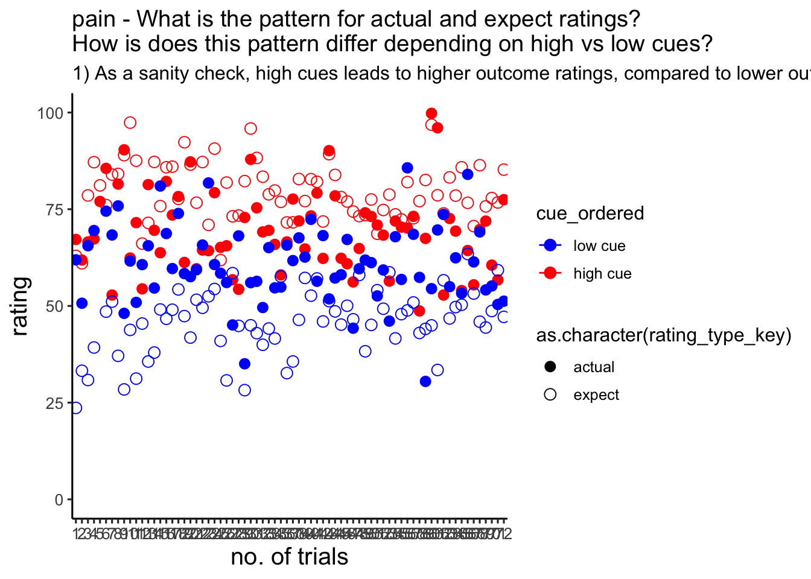
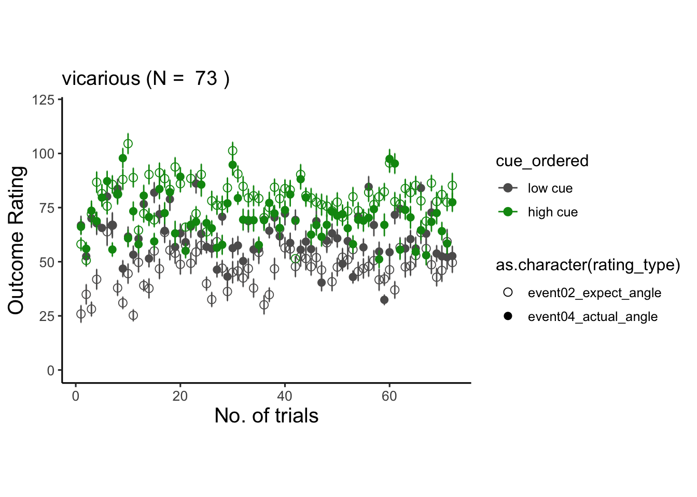
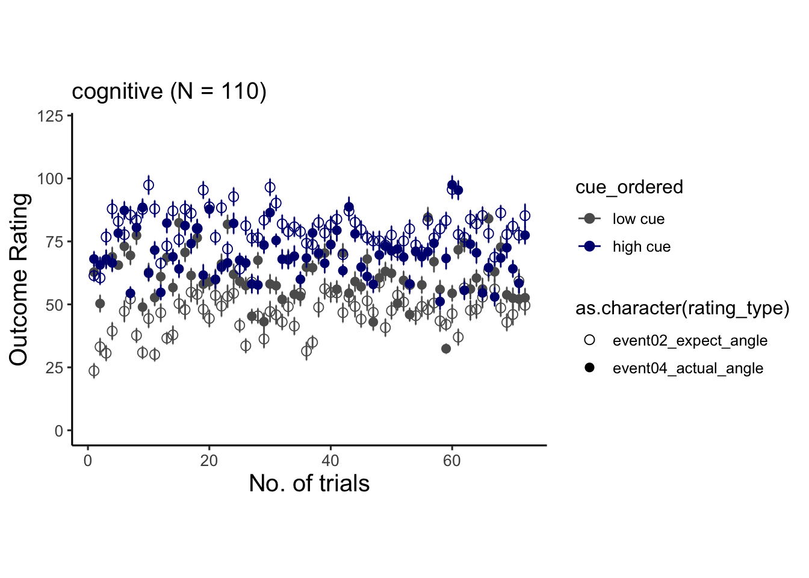
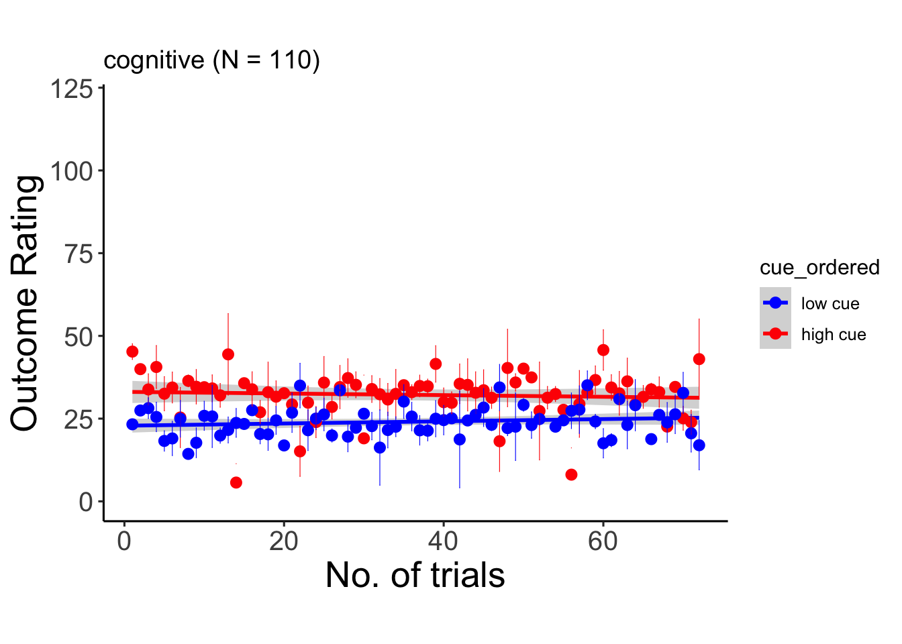
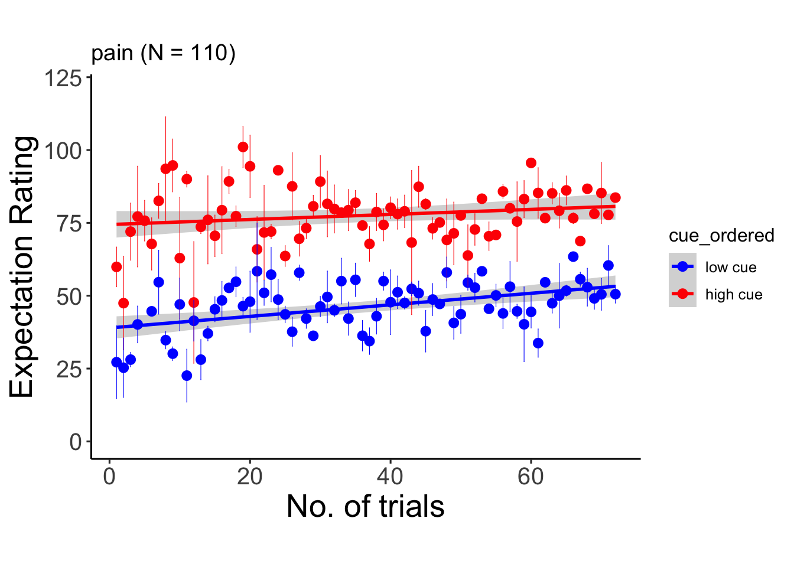
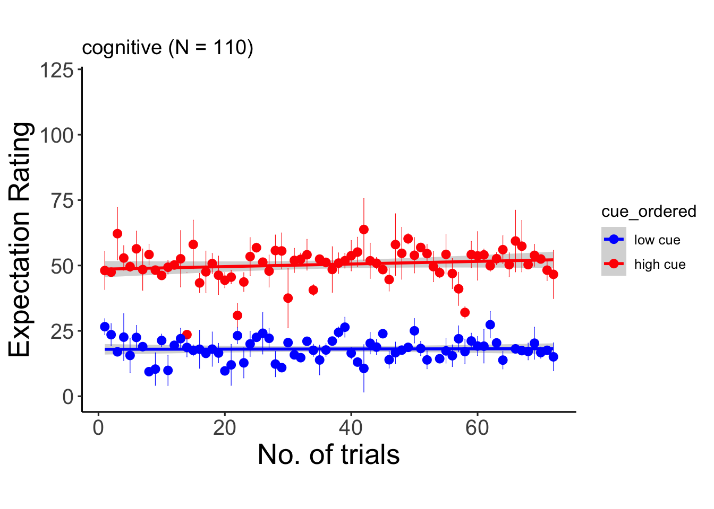
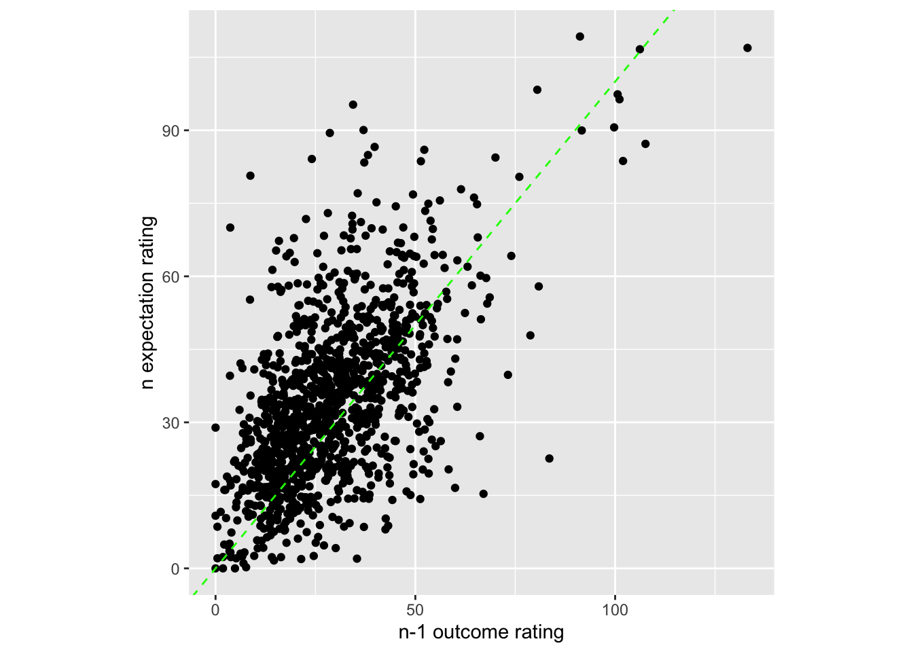
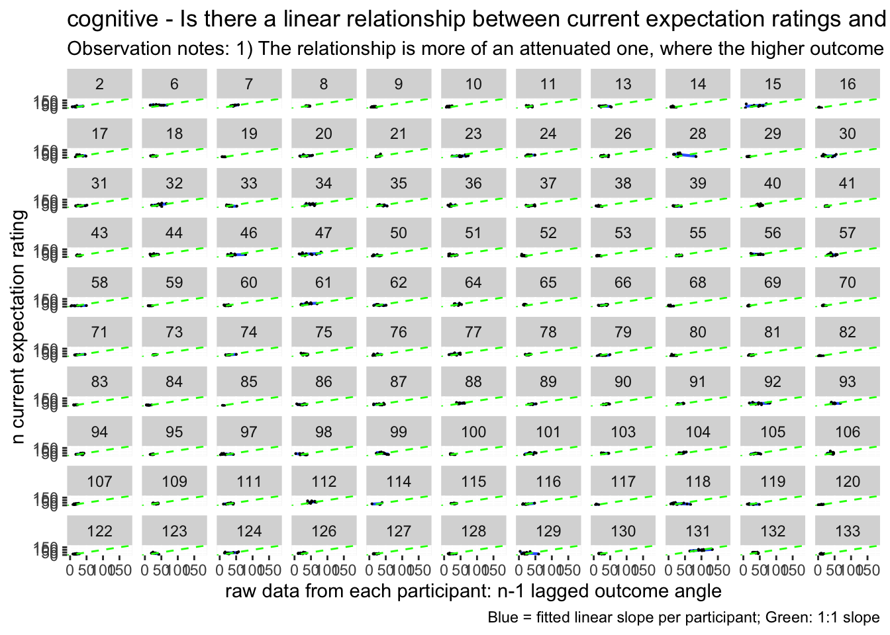

# expect-actual ~ cue * trial {#ch06_Jepma}


## Overview
The purpose of this markdown is to benchmark the plots from Jepma et al. (2018). 
Here, we plot the expectancy ratings and the actual ratings, with the high and low cues -- in one panel. 

### Some thoughts, TODOs {.unlisted .unnumbered}
* plot 2. some runs were repeated or omitted for the subjects that have more than 72 trials. I need to identify that list and work on the behavioral data. 
* I need to check whether the counterbalancing was done correctly. 


load data and combine participant data


```r
main_dir = dirname(dirname(getwd()))
datadir = file.path(main_dir, 'data', 'beh', 'beh02_preproc')
# parameters _____________________________________ # nolint
subject_varkey <- "src_subject_id"
iv <- "param_cue_type"
dv <- "event03_RT"
dv_keyword <- "RT"
xlab <- ""
taskname <- "pain"

ylab <- "ratings (degree)"
subject <- "subject"
exclude <- "sub-0001|sub-0003|sub-0004|sub-0005|sub-0025|sub-0999" #/ "sub-0999|sub-0001|sub-0002|sub-0003|sub-0004|sub-0005|sub-0006|sub-0007|sub-0008|sub-0009|sub-0010|sub-0011"

# load data _____________________________________
data <- load_task_social_df(datadir, taskname = taskname, subject_varkey = subject_varkey, iv = iv, exclude = exclude)
data$event03_RT <- data$event03_stimulusC_reseponseonset - data$event03_stimulus_displayonset
# data['event03_RT'], data.event03_RT - pandas
analysis_dir <- file.path(main_dir, "analysis", "mixedeffect", "model06_iv-cue-trial_dv-expect-actual", as.character(Sys.Date()))
dir.create(analysis_dir, showWarnings = FALSE, recursive = TRUE)
```


```r
summary(data)
```

```
##  src_subject_id     session_id    param_task_name    param_run_num   
##  Min.   :  2.00   Min.   :1.000   Length:6492        Min.   :-2.000  
##  1st Qu.: 37.00   1st Qu.:1.000   Class :character   1st Qu.: 2.000  
##  Median : 73.00   Median :3.000   Mode  :character   Median : 3.000  
##  Mean   : 69.86   Mean   :2.595                      Mean   : 3.462  
##  3rd Qu.:101.00   3rd Qu.:4.000                      3rd Qu.: 5.000  
##  Max.   :133.00   Max.   :4.000                      Max.   : 6.000  
##                                                                      
##  param_counterbalance_ver param_counterbalance_block_num param_cue_type    
##  Min.   :1.000            Min.   :1.000                  Length:6492       
##  1st Qu.:2.000            1st Qu.:1.000                  Class :character  
##  Median :3.000            Median :2.000                  Mode  :character  
##  Mean   :3.157            Mean   :1.503                                    
##  3rd Qu.:4.000            3rd Qu.:2.000                                    
##  Max.   :5.000            Max.   :2.000                                    
##                                                                            
##  param_stimulus_type param_cond_type param_trigger_onset param_start_biopac 
##  Length:6492         Min.   :1.0     Min.   :1.615e+09   Min.   :1.615e+09  
##  Class :character    1st Qu.:2.0     1st Qu.:1.627e+09   1st Qu.:1.627e+09  
##  Mode  :character    Median :3.5     Median :1.632e+09   Median :1.632e+09  
##                      Mean   :3.5     Mean   :1.634e+09   Mean   :1.634e+09  
##                      3rd Qu.:5.0     3rd Qu.:1.644e+09   3rd Qu.:1.644e+09  
##                      Max.   :6.0     Max.   :1.657e+09   Max.   :1.657e+09  
##                                                                             
##    ITI_onset           ITI_biopac         ITI_duration      event01_cue_onset  
##  Min.   :1.615e+09   Min.   :1.615e+09   Min.   : 0.00281   Min.   :1.615e+09  
##  1st Qu.:1.627e+09   1st Qu.:1.627e+09   1st Qu.: 1.56340   1st Qu.:1.627e+09  
##  Median :1.632e+09   Median :1.632e+09   Median : 3.26975   Median :1.632e+09  
##  Mean   :1.634e+09   Mean   :1.634e+09   Mean   : 4.44243   Mean   :1.634e+09  
##  3rd Qu.:1.644e+09   3rd Qu.:1.644e+09   3rd Qu.: 6.65337   3rd Qu.:1.644e+09  
##  Max.   :1.657e+09   Max.   :1.657e+09   Max.   :17.07488   Max.   :1.657e+09  
##                                                                                
##  event01_cue_biopac  event01_cue_type   event01_cue_filename
##  Min.   :1.615e+09   Length:6492        Length:6492         
##  1st Qu.:1.627e+09   Class :character   Class :character    
##  Median :1.632e+09   Mode  :character   Mode  :character    
##  Mean   :1.634e+09                                          
##  3rd Qu.:1.644e+09                                          
##  Max.   :1.657e+09                                          
##                                                             
##   ISI01_onset         ISI01_biopac       ISI01_duration   
##  Min.   :1.615e+09   Min.   :1.615e+09   Min.   :0.00396  
##  1st Qu.:1.627e+09   1st Qu.:1.627e+09   1st Qu.:0.99133  
##  Median :1.632e+09   Median :1.632e+09   Median :1.39215  
##  Mean   :1.634e+09   Mean   :1.634e+09   Mean   :1.47844  
##  3rd Qu.:1.644e+09   3rd Qu.:1.644e+09   3rd Qu.:1.98314  
##  Max.   :1.657e+09   Max.   :1.657e+09   Max.   :2.89685  
##                                                           
##  event02_expect_displayonset event02_expect_biopac event02_expect_responseonset
##  Min.   :1.615e+09           Min.   :1.615e+09     Min.   :1.615e+09           
##  1st Qu.:1.627e+09           1st Qu.:1.627e+09     1st Qu.:1.627e+09           
##  Median :1.632e+09           Median :1.632e+09     Median :1.632e+09           
##  Mean   :1.634e+09           Mean   :1.634e+09     Mean   :1.634e+09           
##  3rd Qu.:1.644e+09           3rd Qu.:1.644e+09     3rd Qu.:1.643e+09           
##  Max.   :1.657e+09           Max.   :1.657e+09     Max.   :1.657e+09           
##                                                    NA's   :661                 
##  event02_expect_RT event02_expect_angle event02_expect_angle_label
##  Min.   :0.6504    Min.   :  0.00       Length:6492               
##  1st Qu.:1.6341    1st Qu.: 30.18       Class :character          
##  Median :2.0517    Median : 58.56       Mode  :character          
##  Mean   :2.1397    Mean   : 62.94                                 
##  3rd Qu.:2.5678    3rd Qu.: 90.00                                 
##  Max.   :3.9912    Max.   :180.00                                 
##  NA's   :661       NA's   :661                                    
##   ISI02_onset         ISI02_biopac       ISI02_duration   
##  Min.   :1.615e+09   Min.   :1.615e+09   Min.   : 0.1422  
##  1st Qu.:1.627e+09   1st Qu.:1.627e+09   1st Qu.: 1.8599  
##  Median :1.632e+09   Median :1.632e+09   Median : 4.3664  
##  Mean   :1.634e+09   Mean   :1.634e+09   Mean   : 4.4542  
##  3rd Qu.:1.644e+09   3rd Qu.:1.644e+09   3rd Qu.: 6.2697  
##  Max.   :1.657e+09   Max.   :1.657e+09   Max.   :20.0723  
##                                                           
##  event03_stimulus_type event03_stimulus_displayonset event03_stimulus_biopac
##  Length:6492           Min.   :1.615e+09             Min.   :1.615e+09      
##  Class :character      1st Qu.:1.627e+09             1st Qu.:1.627e+09      
##  Mode  :character      Median :1.632e+09             Median :1.632e+09      
##                        Mean   :1.634e+09             Mean   :1.634e+09      
##                        3rd Qu.:1.644e+09             3rd Qu.:1.644e+09      
##                        Max.   :1.657e+09             Max.   :1.657e+09      
##                                                                             
##  event03_stimulus_C_stim_match event03_stimulusC_response
##  Mode:logical                  Min.   :0                 
##  NA's:6492                     1st Qu.:0                 
##                                Median :0                 
##                                Mean   :0                 
##                                3rd Qu.:0                 
##                                Max.   :0                 
##                                                          
##  event03_stimulusC_responsekeyname event03_stimulusC_reseponseonset
##  Mode:logical                      Min.   :0                       
##  NA's:6492                         1st Qu.:0                       
##                                    Median :0                       
##                                    Mean   :0                       
##                                    3rd Qu.:0                       
##                                    Max.   :0                       
##                                                                    
##  event03_stimulusC_RT  ISI03_onset         ISI03_biopac       ISI03_duration   
##  Min.   :0            Min.   :1.615e+09   Min.   :1.615e+09   Min.   : 0.4788  
##  1st Qu.:0            1st Qu.:1.627e+09   1st Qu.:1.627e+09   1st Qu.: 2.3846  
##  Median :0            Median :1.632e+09   Median :1.632e+09   Median : 4.0370  
##  Mean   :0            Mean   :1.634e+09   Mean   :1.634e+09   Mean   : 4.4870  
##  3rd Qu.:0            3rd Qu.:1.644e+09   3rd Qu.:1.644e+09   3rd Qu.: 5.8864  
##  Max.   :0            Max.   :1.657e+09   Max.   :1.657e+09   Max.   :17.6951  
##                                                                                
##  event04_actual_displayonset event04_actual_biopac event04_actual_responseonset
##  Min.   :1.615e+09           Min.   :1.615e+09     Min.   :1.615e+09           
##  1st Qu.:1.627e+09           1st Qu.:1.627e+09     1st Qu.:1.627e+09           
##  Median :1.632e+09           Median :1.632e+09     Median :1.631e+09           
##  Mean   :1.634e+09           Mean   :1.634e+09     Mean   :1.634e+09           
##  3rd Qu.:1.644e+09           3rd Qu.:1.644e+09     3rd Qu.:1.643e+09           
##  Max.   :1.657e+09           Max.   :1.657e+09     Max.   :1.657e+09           
##                                                    NA's   :638                 
##  event04_actual_RT event04_actual_angle event04_actual_angle_label
##  Min.   :0.0168    Min.   :  0.00       Length:6492               
##  1st Qu.:1.9197    1st Qu.: 38.80       Class :character          
##  Median :2.3510    Median : 60.77       Mode  :character          
##  Mean   :2.4005    Mean   : 66.33                                 
##  3rd Qu.:2.8512    3rd Qu.: 88.38                                 
##  Max.   :3.9930    Max.   :180.00                                 
##  NA's   :638       NA's   :641                                    
##  param_end_instruct_onset param_end_biopac    param_experiment_duration
##  Min.   :1.615e+09        Min.   :1.615e+09   Min.   :398.1            
##  1st Qu.:1.627e+09        1st Qu.:1.627e+09   1st Qu.:398.6            
##  Median :1.632e+09        Median :1.632e+09   Median :398.8            
##  Mean   :1.634e+09        Mean   :1.634e+09   Mean   :398.8            
##  3rd Qu.:1.644e+09        3rd Qu.:1.644e+09   3rd Qu.:399.0            
##  Max.   :1.657e+09        Max.   :1.657e+09   Max.   :399.5            
##                                                                        
##  event03_stimulus_P_trigger event03_stimulus_P_delay_between_medoc
##  Length:6492                Min.   :0                             
##  Class :character           1st Qu.:0                             
##  Mode  :character           Median :0                             
##                             Mean   :0                             
##                             3rd Qu.:0                             
##                             Max.   :0                             
##                                                                   
##  event03_stimulus_V_patientid event03_stimulus_V_filename
##  Mode:logical                 Mode:logical               
##  NA's:6492                    NA's:6492                  
##                                                          
##                                                          
##                                                          
##                                                          
##                                                          
##  event03_stimulus_C_stim_num event03_stimulus_C_stim_filename
##  Min.   :0                   Mode:logical                    
##  1st Qu.:0                   NA's:6492                       
##  Median :0                                                   
##  Mean   :0                                                   
##  3rd Qu.:0                                                   
##  Max.   :0                                                   
##                                                              
##  delay_between_medoc    subject       event03_RT        
##  Min.   :0.01409     98     :  96   Min.   :-1.657e+09  
##  1st Qu.:0.03728     6      :  72   1st Qu.:-1.644e+09  
##  Median :0.04537     9      :  72   Median :-1.632e+09  
##  Mean   :0.04818     10     :  72   Mean   :-1.634e+09  
##  3rd Qu.:0.05712     18     :  72   3rd Qu.:-1.627e+09  
##  Max.   :2.03502     29     :  72   Max.   :-1.615e+09  
##                      (Other):6036
```

```r
# data(data, package = 'visibly')

myvars <- names(data) %in% 
  c( "event02_expect_angle", "event02_expect_RT", "event04_actual_angle", "event04_actual_RT", "event01_cue_onset")
newdata <- data[myvars]
# numdata  <- unlist(lapply(data, is.numeric), use.names = FALSE) 
data_naomit <- na.omit(newdata)
cor_matrix = cor(data_naomit)
corr_heat(cor_matrix)
```

```
## No FA options specified, using psych package defaults.
```

```
## Warning in fac(r = r, nfactors = nfactors, n.obs = n.obs, rotate = rotate, : I
## am sorry, to do these rotations requires the GPArotation package to be
## installed
```

```{=html}
<div class="plotly html-widget html-fill-item" id="htmlwidget-7569267dceb20da686e3" style="width:672px;height:480px;"></div>
<script type="application/json" data-for="htmlwidget-7569267dceb20da686e3">{"x":{"visdat":{"29ba223e2407":["function () ","plotlyVisDat"]},"cur_data":"29ba223e2407","attrs":{"29ba223e2407":{"z":{},"alpha_stroke":1,"sizes":[10,100],"spans":[1,20],"type":"heatmap","colors":["#590007","#590007","#5B0107","#5C0108","#5D0207","#5D0207","#5E0308","#5F0308","#600407","#610507","#620606","#620606","#630707","#640807","#650906","#660906","#670A07","#670B07","#680C06","#690C06","#6A0D06","#6B0D06","#6C0E07","#6C0F07","#6D1006","#6E1006","#6F1107","#701207","#711306","#721306","#731405","#731405","#741506","#751606","#761705","#771705","#781806","#791906","#7A1A05","#7B1A06","#7C1B06","#7D1C06","#7E1D05","#7E1D06","#7F1E06","#801E06","#822006","#832106","#842105","#852206","#862206","#872406","#882506","#892606","#8A2605","#8B2706","#8C2806","#8D2905","#8E2A05","#8F2B06","#902C06","#912D05","#932E05","#942F06","#953006","#963107","#973206","#983307","#993407","#9A3508","#9B3608","#9C3709","#9E3809","#9F390A","#A03B0A","#A13C0B","#A23D0C","#A33E0D","#A43F0E","#A5410F","#A6420F","#A74310","#A84411","#A94612","#AA4713","#AB4914","#AC4915","#AE4A16","#AE4B17","#AF4D19","#AF4E1A","#B1501C","#B2511D","#B2521E","#B3531F","#B4531F","#B55521","#B55622","#B65824","#B65925","#B75A26","#B75B27","#B85C28","#B95D29","#BA5E2A","#BA5F2C","#BB602D","#BB612E","#BC622F","#BC6330","#BD6431","#BD6432","#BE6533","#BD6635","#BE6736","#BE6837","#BF6938","#BF6A39","#C06B3A","#C06C3B","#C16D3C","#C16D3E","#C26E3F","#C16F40","#C27041","#C27142","#C37243","#C37344","#C47446","#C47447","#C57548","#C57649","#C6774A","#C5784B","#C67A4D","#C67A4E","#C77B50","#C87C51","#C87C51","#C97E53","#C87F54","#C98056","#C98157","#CA8258","#CA8259","#CB835A","#CB845B","#CC855D","#CB865E","#CC875F","#CC8860","#CD8961","#CD8A63","#CE8B64","#CE8B65","#CF8C66","#CE8D67","#CF8E68","#CF8F6A","#D0906B","#D0916C","#D1926D","#D1936F","#D29470","#D29471","#D39572","#D29673","#D39775","#D39876","#D49977","#D49A78","#D59B7A","#D59C7B","#D69D7C","#D59E7D","#D69F7F","#D69F80","#D7A081","#D7A182","#D8A284","#D8A385","#D9A486","#DAA688","#DAA789","#DBA88B","#DAA98C","#DBAA8D","#DBAB8E","#DCAC90","#DCAD91","#DDAE93","#DDAF94","#DEB095","#DEB196","#DFB298","#DEB399","#DFB49A","#DFB59B","#E0B69D","#E0B79F","#E1B8A0","#E1B9A1","#E2BAA2","#E2BBA4","#E3BCA5","#E3BDA7","#E4BEA8","#E3BEA9","#E4BFAA","#E4C0AC","#E5C1AE","#E5C3AF","#E6C4B0","#E6C5B1","#E7C6B2","#E7C7B4","#E8C8B6","#E8C9B7","#E9CAB8","#E8CBB9","#E9CCBB","#E9CDBC","#EACEBE","#EACFBF","#EBD0C1","#EBD0C2","#EBD1C3","#EBD3C5","#ECD4C6","#EDD5C8","#ECD6C9","#EDD7CB","#EDD8CC","#EED9CD","#EEDACE","#EDDBD0","#EDDCD1","#EEDDD3","#EEDDD4","#EEDED5","#EEDFD6","#EDE0D8","#EDE0D9","#EEE1DA","#EEE2DB","#EDE3DC","#EDE3DD","#ECE4DE","#ECE4DF","#EBE5E0","#EBE5E1","#EAE6E2","#EAE5E3","#E9E6E4","#E8E6E4","#E7E7E5","#E7E7E6","#E6E6E7","#E5E6E7","#E3E7E7","#E2E7E7","#E1E6E8","#E0E6E8","#DFE5E9","#DEE6E9","#DCE5E8","#DBE5E8","#D9E4E9","#D8E4E9","#D6E3E8","#D5E3E8","#D3E2E9","#D2E1E9","#D0E0E8","#CEDFE7","#CDDFE7","#CBDEE7","#CADDE7","#C8DCE6","#C7DBE6","#C5DAE5","#C4DAE5","#C2D9E4","#C1D8E4","#BFD7E3","#BED6E3","#BCD5E2","#BBD5E2","#B9D4E1","#B7D3E1","#B5D2E0","#B3D1DF","#B2D0DE","#B0CFDE","#AFCEDD","#ADCDDD","#ACCCDC","#AACBDC","#A9CADB","#A7C9DA","#A5C8D9","#A3C7D9","#A1C6D8","#A0C5D8","#9EC4D7","#9DC4D6","#9BC3D5","#9AC2D5","#98C1D4","#97C0D4","#95BFD3","#94BED2","#92BDD1","#90BCD1","#8EBBD0","#8DBAD0","#8BB9CF","#8AB8CE","#88B6CD","#86B5CC","#85B4CC","#83B3CB","#81B2CA","#7FB1C9","#7EB0C9","#7CAFC8","#7BAEC8","#79ADC7","#78ACC6","#76ABC5","#75AAC5","#73A9C4","#72A8C4","#70A7C3","#6EA6C2","#6CA5C1","#6AA4C1","#69A3C0","#67A2C0","#66A1BF","#64A0BE","#639FBD","#619EBD","#5F9DBC","#5D9CBB","#5B9BBA","#5A9ABA","#5999B9","#5798B9","#5597B8","#5496B7","#5295B6","#5194B6","#4F93B5","#4E92B4","#4C91B3","#4B90B3","#498EB2","#488DB2","#468BB1","#458BB0","#438AAF","#4289AF","#4087AE","#3E86AC","#3D85AC","#3B84AB","#3A83AB","#3882AA","#3781A9","#3580A8","#347FA8","#327EA7","#317DA6","#2F7CA5","#2E7BA5","#2C7AA4","#2B79A4","#2A78A3","#2977A2","#2776A1","#2575A1","#2474A0","#2373A0","#22729F","#20719E","#1F709D","#1E6F9D","#1D6E9C","#1C6D9C","#1B6C9B","#196B9A","#186A99","#176999","#166898","#156798","#146697","#136697","#126596","#116496","#106395","#106294","#0F6193","#0E6093","#0C5E92","#0C5E92","#0B5D91","#0B5D91","#0A5C90","#085A8F","#08598F","#07588E","#07578D","#06568C","#06568C","#05558B","#06548B","#05538A","#05528A","#045189","#055189","#045088","#044F88","#034E87","#034D87","#044C86","#044C86","#034B85","#034A85","#024984","#024984","#034883","#034783","#024682","#024582","#024481","#024481","#034380","#034280","#02417F","#02417F","#03407E","#033F7E","#023E7D","#023E7D","#033D7C","#033C7C","#023B7B","#023A7B","#01397A","#01397A","#023879","#023779","#013678","#013577","#023477","#013376","#013376","#023275","#023175","#013074","#013074","#022F73","#022E73","#012D72","#012D72","#022C71","#022B71","#012A70","#012A70","#02296F","#02286F","#01276E","#01276E","#02266D","#02256D","#02246C","#02236C","#01226B","#01226B","#02216A","#02206A","#011F69","#021F69","#011E68","#011D68","#021C67","#021C67","#011B66","#011A66","#001965","#001865","#011764","#011764","#001663","#001563","#011462","#011462","#001361","#001260"],"inherit":true}},"layout":{"margin":{"b":40,"l":60,"t":25,"r":10},"scene":{"zaxis":{"title":"cormat"}},"xaxis":{"domain":[0,1],"automargin":true,"tickmode":"array","tickvals":[0,1,2,3,4],"ticktext":["event04_actual_angle","event02_expect_angle","event01_cue_onset","event04_actual_RT","event02_expect_RT"],"gridcolor":"transparent","zerolinecolor":"transparent","title":"","zeroline":false,"showgrid":false},"yaxis":{"domain":[0,1],"automargin":true,"tickmode":"array","tickvals":[0,1,2,3,4],"ticktext":["event04_actual_angle","event02_expect_angle","event01_cue_onset","event04_actual_RT","event02_expect_RT"],"gridcolor":"transparent","zerolinecolor":"transparent","title":"","autorange":"reversed","zeroline":false,"showgrid":false},"hovermode":"closest","showlegend":false,"legend":{"yanchor":"top","y":0.5},"plot_bgcolor":"transparent","paper_bgcolor":"transparent"},"source":"A","config":{"modeBarButtonsToAdd":["hoverclosest","hovercompare"],"showSendToCloud":false,"displayModeBar":false},"data":[{"colorbar":{"title":"cormat","ticklen":2,"len":0.5,"lenmode":"fraction","y":1,"yanchor":"top"},"colorscale":[["0","rgba(89,0,7,1)"],["0.0416666666666667","rgba(107,13,6,1)"],["0.0833333333333333","rgba(126,29,5,1)"],["0.125","rgba(147,46,5,1)"],["0.166666666666667","rgba(169,70,18,1)"],["0.208333333333333","rgba(186,94,42,1)"],["0.25","rgba(194,113,66,1)"],["0.291666666666667","rgba(203,132,91,1)"],["0.333333333333333","rgba(210,150,116,1)"],["0.375","rgba(219,171,142,1)"],["0.416666666666667","rgba(228,191,170,1)"],["0.458333333333333","rgba(237,213,199,1)"],["0.5","rgba(235,229,225,1)"],["0.541666666666667","rgba(212,227,232,1)"],["0.583333333333333","rgba(179,209,223,1)"],["0.625","rgba(146,189,209,1)"],["0.666666666666667","rgba(113,167,195,1)"],["0.708333333333333","rgba(79,147,181,1)"],["0.75","rgba(47,124,165,1)"],["0.791666666666667","rgba(21,103,152,1)"],["0.833333333333333","rgba(6,84,139,1)"],["0.875","rgba(3,67,128,1)"],["0.916666666666667","rgba(1,51,118,1)"],["0.958333333333333","rgba(1,34,107,1)"],["1","rgba(0,18,96,1)"]],"showscale":true,"z":[[1,0.64286812027634033,-0.14504336112570634,-0.16347972254149309,-0.060141478448381316],[0.64286812027634033,1,-0.12246175653222982,-0.13459621502938438,-0.067315155713631405],[-0.14504336112570634,-0.12246175653222982,1,0.080517199615948179,0.056113525117006839],[-0.16347972254149309,-0.13459621502938438,0.080517199615948179,1,0.27736553205011194],[-0.060141478448381316,-0.067315155713631405,0.056113525117006839,0.27736553205011194,1]],"type":"heatmap","xaxis":"x","yaxis":"y","frame":null,"zmin":-1,"zmax":1}],"highlight":{"on":"plotly_click","persistent":false,"dynamic":false,"selectize":false,"opacityDim":0.20000000000000001,"selected":{"opacity":1},"debounce":0},"shinyEvents":["plotly_hover","plotly_click","plotly_selected","plotly_relayout","plotly_brushed","plotly_brushing","plotly_clickannotation","plotly_doubleclick","plotly_deselect","plotly_afterplot","plotly_sunburstclick"],"base_url":"https://plot.ly"},"evals":[],"jsHooks":[]}</script>
```

```r
ISIvars <- names(data) %in% 
  c( "ISI01_duration", "ISI02_duration", "ISI03_duration")
ISIdata <- data[ISIvars]
# numdata  <- unlist(lapply(data, is.numeric), use.names = FALSE) 
ISIdata_naomit <- na.omit(ISIdata)
ISIcor_matrix = cor(ISIdata_naomit)
corr_heat(ISIcor_matrix)
```

```
## No FA options specified, using psych package defaults.
```

```{=html}
<div class="plotly html-widget html-fill-item" id="htmlwidget-b606aff950371e158272" style="width:672px;height:480px;"></div>
<script type="application/json" data-for="htmlwidget-b606aff950371e158272">{"x":{"visdat":{"29ba630494c0":["function () ","plotlyVisDat"]},"cur_data":"29ba630494c0","attrs":{"29ba630494c0":{"z":{},"alpha_stroke":1,"sizes":[10,100],"spans":[1,20],"type":"heatmap","colors":["#590007","#590007","#5B0107","#5C0108","#5D0207","#5D0207","#5E0308","#5F0308","#600407","#610507","#620606","#620606","#630707","#640807","#650906","#660906","#670A07","#670B07","#680C06","#690C06","#6A0D06","#6B0D06","#6C0E07","#6C0F07","#6D1006","#6E1006","#6F1107","#701207","#711306","#721306","#731405","#731405","#741506","#751606","#761705","#771705","#781806","#791906","#7A1A05","#7B1A06","#7C1B06","#7D1C06","#7E1D05","#7E1D06","#7F1E06","#801E06","#822006","#832106","#842105","#852206","#862206","#872406","#882506","#892606","#8A2605","#8B2706","#8C2806","#8D2905","#8E2A05","#8F2B06","#902C06","#912D05","#932E05","#942F06","#953006","#963107","#973206","#983307","#993407","#9A3508","#9B3608","#9C3709","#9E3809","#9F390A","#A03B0A","#A13C0B","#A23D0C","#A33E0D","#A43F0E","#A5410F","#A6420F","#A74310","#A84411","#A94612","#AA4713","#AB4914","#AC4915","#AE4A16","#AE4B17","#AF4D19","#AF4E1A","#B1501C","#B2511D","#B2521E","#B3531F","#B4531F","#B55521","#B55622","#B65824","#B65925","#B75A26","#B75B27","#B85C28","#B95D29","#BA5E2A","#BA5F2C","#BB602D","#BB612E","#BC622F","#BC6330","#BD6431","#BD6432","#BE6533","#BD6635","#BE6736","#BE6837","#BF6938","#BF6A39","#C06B3A","#C06C3B","#C16D3C","#C16D3E","#C26E3F","#C16F40","#C27041","#C27142","#C37243","#C37344","#C47446","#C47447","#C57548","#C57649","#C6774A","#C5784B","#C67A4D","#C67A4E","#C77B50","#C87C51","#C87C51","#C97E53","#C87F54","#C98056","#C98157","#CA8258","#CA8259","#CB835A","#CB845B","#CC855D","#CB865E","#CC875F","#CC8860","#CD8961","#CD8A63","#CE8B64","#CE8B65","#CF8C66","#CE8D67","#CF8E68","#CF8F6A","#D0906B","#D0916C","#D1926D","#D1936F","#D29470","#D29471","#D39572","#D29673","#D39775","#D39876","#D49977","#D49A78","#D59B7A","#D59C7B","#D69D7C","#D59E7D","#D69F7F","#D69F80","#D7A081","#D7A182","#D8A284","#D8A385","#D9A486","#DAA688","#DAA789","#DBA88B","#DAA98C","#DBAA8D","#DBAB8E","#DCAC90","#DCAD91","#DDAE93","#DDAF94","#DEB095","#DEB196","#DFB298","#DEB399","#DFB49A","#DFB59B","#E0B69D","#E0B79F","#E1B8A0","#E1B9A1","#E2BAA2","#E2BBA4","#E3BCA5","#E3BDA7","#E4BEA8","#E3BEA9","#E4BFAA","#E4C0AC","#E5C1AE","#E5C3AF","#E6C4B0","#E6C5B1","#E7C6B2","#E7C7B4","#E8C8B6","#E8C9B7","#E9CAB8","#E8CBB9","#E9CCBB","#E9CDBC","#EACEBE","#EACFBF","#EBD0C1","#EBD0C2","#EBD1C3","#EBD3C5","#ECD4C6","#EDD5C8","#ECD6C9","#EDD7CB","#EDD8CC","#EED9CD","#EEDACE","#EDDBD0","#EDDCD1","#EEDDD3","#EEDDD4","#EEDED5","#EEDFD6","#EDE0D8","#EDE0D9","#EEE1DA","#EEE2DB","#EDE3DC","#EDE3DD","#ECE4DE","#ECE4DF","#EBE5E0","#EBE5E1","#EAE6E2","#EAE5E3","#E9E6E4","#E8E6E4","#E7E7E5","#E7E7E6","#E6E6E7","#E5E6E7","#E3E7E7","#E2E7E7","#E1E6E8","#E0E6E8","#DFE5E9","#DEE6E9","#DCE5E8","#DBE5E8","#D9E4E9","#D8E4E9","#D6E3E8","#D5E3E8","#D3E2E9","#D2E1E9","#D0E0E8","#CEDFE7","#CDDFE7","#CBDEE7","#CADDE7","#C8DCE6","#C7DBE6","#C5DAE5","#C4DAE5","#C2D9E4","#C1D8E4","#BFD7E3","#BED6E3","#BCD5E2","#BBD5E2","#B9D4E1","#B7D3E1","#B5D2E0","#B3D1DF","#B2D0DE","#B0CFDE","#AFCEDD","#ADCDDD","#ACCCDC","#AACBDC","#A9CADB","#A7C9DA","#A5C8D9","#A3C7D9","#A1C6D8","#A0C5D8","#9EC4D7","#9DC4D6","#9BC3D5","#9AC2D5","#98C1D4","#97C0D4","#95BFD3","#94BED2","#92BDD1","#90BCD1","#8EBBD0","#8DBAD0","#8BB9CF","#8AB8CE","#88B6CD","#86B5CC","#85B4CC","#83B3CB","#81B2CA","#7FB1C9","#7EB0C9","#7CAFC8","#7BAEC8","#79ADC7","#78ACC6","#76ABC5","#75AAC5","#73A9C4","#72A8C4","#70A7C3","#6EA6C2","#6CA5C1","#6AA4C1","#69A3C0","#67A2C0","#66A1BF","#64A0BE","#639FBD","#619EBD","#5F9DBC","#5D9CBB","#5B9BBA","#5A9ABA","#5999B9","#5798B9","#5597B8","#5496B7","#5295B6","#5194B6","#4F93B5","#4E92B4","#4C91B3","#4B90B3","#498EB2","#488DB2","#468BB1","#458BB0","#438AAF","#4289AF","#4087AE","#3E86AC","#3D85AC","#3B84AB","#3A83AB","#3882AA","#3781A9","#3580A8","#347FA8","#327EA7","#317DA6","#2F7CA5","#2E7BA5","#2C7AA4","#2B79A4","#2A78A3","#2977A2","#2776A1","#2575A1","#2474A0","#2373A0","#22729F","#20719E","#1F709D","#1E6F9D","#1D6E9C","#1C6D9C","#1B6C9B","#196B9A","#186A99","#176999","#166898","#156798","#146697","#136697","#126596","#116496","#106395","#106294","#0F6193","#0E6093","#0C5E92","#0C5E92","#0B5D91","#0B5D91","#0A5C90","#085A8F","#08598F","#07588E","#07578D","#06568C","#06568C","#05558B","#06548B","#05538A","#05528A","#045189","#055189","#045088","#044F88","#034E87","#034D87","#044C86","#044C86","#034B85","#034A85","#024984","#024984","#034883","#034783","#024682","#024582","#024481","#024481","#034380","#034280","#02417F","#02417F","#03407E","#033F7E","#023E7D","#023E7D","#033D7C","#033C7C","#023B7B","#023A7B","#01397A","#01397A","#023879","#023779","#013678","#013577","#023477","#013376","#013376","#023275","#023175","#013074","#013074","#022F73","#022E73","#012D72","#012D72","#022C71","#022B71","#012A70","#012A70","#02296F","#02286F","#01276E","#01276E","#02266D","#02256D","#02246C","#02236C","#01226B","#01226B","#02216A","#02206A","#011F69","#021F69","#011E68","#011D68","#021C67","#021C67","#011B66","#011A66","#001965","#001865","#011764","#011764","#001663","#001563","#011462","#011462","#001361","#001260"],"inherit":true}},"layout":{"margin":{"b":40,"l":60,"t":25,"r":10},"scene":{"zaxis":{"title":"cormat"}},"xaxis":{"domain":[0,1],"automargin":true,"tickmode":"array","tickvals":[0,1,2],"ticktext":["ISI02_duration","ISI01_duration","ISI03_duration"],"gridcolor":"transparent","zerolinecolor":"transparent","title":"","zeroline":false,"showgrid":false},"yaxis":{"domain":[0,1],"automargin":true,"tickmode":"array","tickvals":[0,1,2],"ticktext":["ISI02_duration","ISI01_duration","ISI03_duration"],"gridcolor":"transparent","zerolinecolor":"transparent","title":"","autorange":"reversed","zeroline":false,"showgrid":false},"hovermode":"closest","showlegend":false,"legend":{"yanchor":"top","y":0.5},"plot_bgcolor":"transparent","paper_bgcolor":"transparent"},"source":"A","config":{"modeBarButtonsToAdd":["hoverclosest","hovercompare"],"showSendToCloud":false,"displayModeBar":false},"data":[{"colorbar":{"title":"cormat","ticklen":2,"len":0.5,"lenmode":"fraction","y":1,"yanchor":"top"},"colorscale":[["0","rgba(89,0,7,1)"],["0.0416666666666667","rgba(107,13,6,1)"],["0.0833333333333333","rgba(126,29,5,1)"],["0.125","rgba(147,46,5,1)"],["0.166666666666667","rgba(169,70,18,1)"],["0.208333333333333","rgba(186,94,42,1)"],["0.25","rgba(194,113,66,1)"],["0.291666666666667","rgba(203,132,91,1)"],["0.333333333333333","rgba(210,150,116,1)"],["0.375","rgba(219,171,142,1)"],["0.416666666666667","rgba(228,191,170,1)"],["0.458333333333333","rgba(237,213,199,1)"],["0.5","rgba(235,229,225,1)"],["0.541666666666667","rgba(212,227,232,1)"],["0.583333333333333","rgba(179,209,223,1)"],["0.625","rgba(146,189,209,1)"],["0.666666666666667","rgba(113,167,195,1)"],["0.708333333333333","rgba(79,147,181,1)"],["0.75","rgba(47,124,165,1)"],["0.791666666666667","rgba(21,103,152,1)"],["0.833333333333333","rgba(6,84,139,1)"],["0.875","rgba(3,67,128,1)"],["0.916666666666667","rgba(1,51,118,1)"],["0.958333333333333","rgba(1,34,107,1)"],["1","rgba(0,18,96,1)"]],"showscale":true,"z":[[1,0.1049823877106395,0.06860303616842478],[0.1049823877106395,1,-0.055944339777556466],[0.06860303616842478,-0.055944339777556466,1]],"type":"heatmap","xaxis":"x","yaxis":"y","frame":null,"zmin":-1,"zmax":1}],"highlight":{"on":"plotly_click","persistent":false,"dynamic":false,"selectize":false,"opacityDim":0.20000000000000001,"selected":{"opacity":1},"debounce":0},"shinyEvents":["plotly_hover","plotly_click","plotly_selected","plotly_relayout","plotly_brushed","plotly_brushing","plotly_clickannotation","plotly_doubleclick","plotly_deselect","plotly_afterplot","plotly_sunburstclick"],"base_url":"https://plot.ly"},"evals":[],"jsHooks":[]}</script>
```


```r
car::vif(lm(event04_actual_angle ~  event02_expect_angle + event02_expect_RT + event04_actual_RT, dat = data_naomit))
```

```
## event02_expect_angle    event02_expect_RT    event04_actual_RT 
##             1.019462             1.084419             1.099422
```


## plot 1 - one run, average across participants

```r
# subject # run # param_cue # param_stim # rating_type # rating_value

data_trial= data %>%
  arrange(src_subject_id, session_id, param_run_num) %>%
  group_by(src_subject_id) %>%
  mutate(trial_index = rep_len(1:12, length.out = n()))
```


```r
data_long = data_trial %>% 
  pivot_longer(cols = c('event02_expect_angle', 'event04_actual_angle'),
               names_to = "rating_type", 
               values_to = "rating_value")
```


```r
# # PLOT
    data_long$cue_name[data_long$param_cue_type == "high_cue"] <- "high cue"
```

```
## Warning: Unknown or uninitialised column: `cue_name`.
```

```r
    data_long$cue_name[data_long$param_cue_type == "low_cue"] <- "low cue"

    data_long$stim_name[data_long$param_stimulus_type == "high_stim"] <- "high"
```

```
## Warning: Unknown or uninitialised column: `stim_name`.
```

```r
    data_long$stim_name[data_long$param_stimulus_type == "med_stim"] <- "med"
    data_long$stim_name[data_long$param_stimulus_type == "low_stim"] <- "low"

    data_long$stim_ordered <- factor(
        data_long$stim_name,
        levels = c("low", "med", "high")
    )
    data_long$cue_ordered <- factor(
        data_long$cue_name,
        levels = c("low cue", "high cue")
    )
    subject <- "src_subject_id"
    model_iv1 <- "stim_ordered"
    model_iv2 <- "cue_ordered"
    rating <- "rating_type"
    dv <- "rating_value"
    trialorder_subjectwise <- meanSummary(
        data_long,
        c(subject, model_iv2, rating, "trial_index"), dv
    )
    
    subjectwise_naomit <- na.omit(trialorder_subjectwise)
    
    trialorder_groupwise <- summarySEwithin(
        data = subjectwise_naomit,
        measurevar = "mean_per_sub",
        withinvars = c("cue_ordered", "rating_type",  "trial_index"), idvar = subject
    )
```

```
## 
## Attaching package: 'raincloudplots'
```

```
## The following object is masked _by_ '.GlobalEnv':
## 
##     GeomFlatViolin
```

```
## Automatically converting the following non-factors to factors: rating_type, trial_index
```


```r
trialorder_subjectwise$rating_type_key <- mapvalues(trialorder_subjectwise$rating_type,
                                                from = c("event02_expect_angle", "event04_actual_angle"),
                                                to = c("expect", "actual"))
trialorder_groupwise$rating_type_key <- mapvalues(trialorder_groupwise$rating_type,
                                                from = c("event02_expect_angle", "event04_actual_angle"),
                                                to = c("expect", "actual"))
actual_trialorder_groupwise <- trialorder_groupwise[which(trialorder_groupwise$rating_type_key == "actual"),]
expect_trialorder_groupwise <-trialorder_groupwise[which(trialorder_groupwise$rating_type_key == "expect"),]
actual_trialorder_subjectwise <- trialorder_subjectwise[which(trialorder_subjectwise$rating_type_key == "actual"),]
expect_trialorder_subjectwise <-trialorder_subjectwise[which(trialorder_subjectwise$rating_type_key == "expect"),]
```

ggplot


```r
# * dataset: trialorder_groupwise
# * x-axis: trial_index (sorted)
# * y-axis: rating
# * group: cue_ordered, rating_type
# * DV: mean_per_sub_norm_mean
# * error bar: se

iv1 = "trial_index"
iv2 = "cue_ordered"
data = 
g <- ggplot(
  data = trialorder_groupwise,
  aes(x = trial_index,
      y = mean_per_sub_norm_mean, 
      color = cue_ordered,
      group = rating_type_key
      )
  ) +
    geom_point(
    data = trialorder_groupwise,
    aes(
      shape = as.character(rating_type_key),
      x =trial_index,
      y = mean_per_sub_norm_mean,
      group = rating_type_key,
      #color = cue_ordered
      ),
    #position = position_jitter(width = .05),
    size = 3
    ) +
  scale_shape_manual(values=c(16, 21))+

  # geom_point(
  #   data = trialorder_subjectwise,
  #   aes(
  #     x = as.numeric(trial_index) - .15,
  #     y = mean_per_sub,
  #     color = cue_ordered
  #     ),
  #   position = position_jitter(width = .05),
  #   size = 1, alpha = 0.8, shape = 20
  #   ) +
  geom_errorbar(
    data = trialorder_groupwise,
    aes(
      x = as.numeric(trial_index),
      y = mean_per_sub_norm_mean,
      group = rating_type_key,
      colour = cue_ordered,
      ymin = mean_per_sub_norm_mean - se,
      ymax = mean_per_sub_norm_mean + se
      ), width = .01, size = 0.5
    ) +
  scale_color_manual(values = c("high cue" = "red", 
                                "low cue" = "blue")) +
    xlab("no. of trials") +
  ylab("rating") +
  ylim(0,100) +
  theme_bw() +
  theme(    axis.text.x = element_text(size = 10),
    axis.text.y = element_text(size = 10),
    axis.title.x = element_text(size = 15),
    axis.title.y = element_text(size = 15))
```

```
## Warning: Using `size` aesthetic for lines was deprecated in ggplot2 3.4.0.
## ℹ Please use `linewidth` instead.
## This warning is displayed once every 8 hours.
## Call `lifecycle::last_lifecycle_warnings()` to see where this warning was
## generated.
```

```r
g 
```


## plot 2 - average across participant, but spread all 6 runs in one x axis
load data and combine participant data


```r
main_dir = dirname(dirname(getwd()))
datadir = file.path(main_dir, 'data', 'beh', 'beh02_preproc')
# parameters _____________________________________ # nolint
subject_varkey <- "src_subject_id"
iv <- "param_cue_type"
dv <- "event03_RT"
dv_keyword <- "RT"
xlab <- ""
taskname <- "pain"

ylab <- "ratings (degree)"
subject <- "subject"
exclude <- "sub-0999|sub-0001|sub-0002|sub-0003|sub-0004|sub-0005|sub-0006|sub-0007|sub-0008|sub-0009|sub-0010|sub-0011"

# load data _____________________________________
data <- load_task_social_df(datadir, taskname = taskname, subject_varkey = subject_varkey, iv = iv, exclude = exclude)
```


### p2 :: check number of trials per participant {.unlisted .unnumbered}


```r
data_p2= data %>%
  arrange(src_subject_id ) %>%
  group_by(src_subject_id) %>%
  mutate(trial_index = row_number())
# df_clean <- data_p2[complete.cases(data_p2$event02_expect_angle), ]
df_clean <- data_p2[complete.cases(data_p2$event04_actual_angle), ]
```


#### check if every participant has maximum of 72 trials. Anything beyond that is erroneous

```r
# Assuming participant IDs are in a column named "participant_id"
# and row numbers are in a column named "row_number"
# Replace "your_data" with the name of your dataset

# Calculate the maximum row number for each participant
max_rows <- aggregate(trial_index ~ src_subject_id, data_p2, max)

# Check if any participant's maximum row number is not 72
max_rows[max_rows$trial_index > 72,]$src_subject_id
```

```
## [1] 98
```

### p2 :: identify erroneous participant {.unlisted .unnumbered}

```r
# participants who have more than 72 trials will be flagged
# excluded for now
# TODO: resolve subject 98
count_trial <- df_clean %>% count("src_subject_id") 
count_trial[count_trial$freq > 72,]
```

```
## [1] src_subject_id freq          
## <0 rows> (or 0-length row.names)
```


```r
count_trial[count_trial$freq > 60,]$src_subject_id
```

```
##  [1]  18  29  31  33  34  36  37  38  39  43  44  46  50  51  52  53  55  57  58
## [20]  60  61  62  65  73  74  78  80  86  87  88  90  91  93  94  95  99 100 101
## [39] 105 106 109 111 115 116 122 124 126 127 128 130 132 133
```


### p2 :: convert to long form {.unlisted .unnumbered}

```r
df_clean <- df_clean[df_clean$src_subject_id != 98, ]
data_p2_long = df_clean %>% 
  pivot_longer(cols = c('event02_expect_angle', 'event04_actual_angle'),
               names_to = "rating_type", 
               values_to = "rating_value")
```

### p2 :: plot data {.unlisted .unnumbered}
I'm plotting all of the trials per participant. In this case, there is no trialwise variability, because we're plotting all 72 trials. 
Averaging across participants will be the only source of variability, reflected in the error bars

```r
# PLOT
  # I'm plotting
    data_p2_long$cue_name[data_p2_long$param_cue_type == "high_cue"] <- "high cue"
```

```
## Warning: Unknown or uninitialised column: `cue_name`.
```

```r
    data_p2_long$cue_name[data_p2_long$param_cue_type == "low_cue"] <- "low cue"

    data_p2_long$stim_name[data_p2_long$param_stimulus_type == "high_stim"] <- "high"
```

```
## Warning: Unknown or uninitialised column: `stim_name`.
```

```r
    data_p2_long$stim_name[data_p2_long$param_stimulus_type == "med_stim"] <- "med"
    data_p2_long$stim_name[data_p2_long$param_stimulus_type == "low_stim"] <- "low"
    
    data_p2_long$stim_ordered <- factor(
        data_p2_long$stim_name,
        levels = c("low", "med", "high")
    )
    data_p2_long$cue_ordered <- factor(
        data_p2_long$cue_name,
        levels = c("low cue", "high cue")
    )
    model_iv1 <- "stim_ordered"
    model_iv2 <- "cue_ordered"
    rating <- "rating_type"
    dv <- "rating_value"
    
    trialorder_subjectwise_p2 <- meanSummary(
        data_p2_long,
        c( model_iv2, rating, "trial_index"), dv
    )
    
    subjectwise_naomit_p2 <- na.omit(trialorder_subjectwise_p2)
    trialorder_groupwise_p2 <- summarySEwithin(
        data = subjectwise_naomit_p2, 
        measurevar = "mean_per_sub",
        withinvars = c("cue_ordered", "rating_type", "trial_index"), idvar = subject
    )
```

```
## Automatically converting the following non-factors to factors: rating_type, trial_index
```

```
## Warning in qt(conf.interval/2 + 0.5, datac$N - 1): NaNs produced
```

```
## Warning in qt(conf.interval/2 + 0.5, datac$N - 1): NaNs produced
```


```r
trialorder_groupwise_p2$rating_type_key <- mapvalues(trialorder_groupwise_p2$rating_type,
                                                from = c("event02_expect_angle", "event04_actual_angle"),
                                                to = c("expect", "actual"))
```

ggplot



## plot data version 2


```
## Warning: Removed 1 rows containing missing values (`geom_point()`).
```


## subset of participants

```
## # A tibble: 5,851 × 60
## # Groups:   src_subject_id [110]
##    src_subject_id session_id param_task_name param_run_num
##             <int>      <int> <chr>                   <int>
##  1              2          1 pain                        1
##  2              2          1 pain                        1
##  3              2          1 pain                        1
##  4              2          1 pain                        1
##  5              2          1 pain                        1
##  6              2          1 pain                        1
##  7              2          1 pain                        1
##  8              2          1 pain                        1
##  9              2          1 pain                        1
## 10              2          1 pain                        1
## # ℹ 5,841 more rows
## # ℹ 56 more variables: param_counterbalance_ver <int>,
## #   param_counterbalance_block_num <int>, param_cue_type <chr>,
## #   param_stimulus_type <chr>, param_cond_type <int>,
## #   param_trigger_onset <dbl>, param_start_biopac <dbl>, ITI_onset <dbl>,
## #   ITI_biopac <dbl>, ITI_duration <dbl>, event01_cue_onset <dbl>,
## #   event01_cue_biopac <dbl>, event01_cue_type <chr>, …
```

```
## Warning: Unknown or uninitialised column: `cue_name`.
```

```
## Warning: Unknown or uninitialised column: `stim_name`.
```

```
## Automatically converting the following non-factors to factors: rating_type, trial_index
```

```
## Warning in qt(conf.interval/2 + 0.5, datac$N - 1): NaNs produced
```

```
## Warning in qt(conf.interval/2 + 0.5, datac$N - 1): NaNs produced
```

```
## Warning: Removed 1 rows containing missing values (`geom_point()`).
```


## vicarious


```
## # A tibble: 5,851 × 60
## # Groups:   src_subject_id [110]
##    src_subject_id session_id param_task_name param_run_num
##             <int>      <int> <chr>                   <int>
##  1              2          1 pain                        1
##  2              2          1 pain                        1
##  3              2          1 pain                        1
##  4              2          1 pain                        1
##  5              2          1 pain                        1
##  6              2          1 pain                        1
##  7              2          1 pain                        1
##  8              2          1 pain                        1
##  9              2          1 pain                        1
## 10              2          1 pain                        1
## # ℹ 5,841 more rows
## # ℹ 56 more variables: param_counterbalance_ver <int>,
## #   param_counterbalance_block_num <int>, param_cue_type <chr>,
## #   param_stimulus_type <chr>, param_cond_type <int>,
## #   param_trigger_onset <dbl>, param_start_biopac <dbl>, ITI_onset <dbl>,
## #   ITI_biopac <dbl>, ITI_duration <dbl>, event01_cue_onset <dbl>,
## #   event01_cue_biopac <dbl>, event01_cue_type <chr>, …
```

```
## Warning: Unknown or uninitialised column: `cue_name`.
```

```
## Warning: Unknown or uninitialised column: `stim_name`.
```

```
## Automatically converting the following non-factors to factors: rating_type, trial_index
```

```
## Warning in qt(conf.interval/2 + 0.5, datac$N - 1): NaNs produced
```

```
## Warning in qt(conf.interval/2 + 0.5, datac$N - 1): NaNs produced
```

```
## Warning: Removed 1 rows containing missing values (`geom_point()`).
```



## cognitive


```
## # A tibble: 5,851 × 60
## # Groups:   src_subject_id [110]
##    src_subject_id session_id param_task_name param_run_num
##             <int>      <int> <chr>                   <int>
##  1              2          1 pain                        1
##  2              2          1 pain                        1
##  3              2          1 pain                        1
##  4              2          1 pain                        1
##  5              2          1 pain                        1
##  6              2          1 pain                        1
##  7              2          1 pain                        1
##  8              2          1 pain                        1
##  9              2          1 pain                        1
## 10              2          1 pain                        1
## # ℹ 5,841 more rows
## # ℹ 56 more variables: param_counterbalance_ver <int>,
## #   param_counterbalance_block_num <int>, param_cue_type <chr>,
## #   param_stimulus_type <chr>, param_cond_type <int>,
## #   param_trigger_onset <dbl>, param_start_biopac <dbl>, ITI_onset <dbl>,
## #   ITI_biopac <dbl>, ITI_duration <dbl>, event01_cue_onset <dbl>,
## #   event01_cue_biopac <dbl>, event01_cue_type <chr>, …
```

```
## Warning: Unknown or uninitialised column: `cue_name`.
```

```
## Warning: Unknown or uninitialised column: `stim_name`.
```

```
## Automatically converting the following non-factors to factors: rating_type, trial_index
```

```
## Warning in qt(conf.interval/2 + 0.5, datac$N - 1): NaNs produced
```

```
## Warning in qt(conf.interval/2 + 0.5, datac$N - 1): NaNs produced
```

```
## Warning: Removed 1 rows containing missing values (`geom_point()`).
```




## within subject vicarious


```
## Warning: Unknown or uninitialised column: `cue_name`.
```

```
## Warning: Unknown or uninitialised column: `stim_name`.
```

```
## Automatically converting the following non-factors to factors: trial_index, rating_type
```

```
## Warning in qt(conf.interval/2 + 0.5, datac$N - 1): NaNs produced
```

```
## Warning in qt(conf.interval/2 + 0.5, datac$N - 1): NaNs produced
```

```
## Warning in geom_point(data = trialorder_groupwise_p2, aes(shape =
## as.character(rating_type), : Ignoring unknown aesthetics: linetype
```

```
## `geom_smooth()` using formula = 'y ~ x'
```


## Tor request -- only outcome ratings. 3 tasks
### pain

```
## Warning: Unknown or uninitialised column: `cue_name`.
```

```
## Warning: Unknown or uninitialised column: `stim_name`.
```

```
## Automatically converting the following non-factors to factors: trial_index
```

```
## Warning in qt(conf.interval/2 + 0.5, datac$N - 1): NaNs produced
```

```
## Warning in qt(conf.interval/2 + 0.5, datac$N - 1): NaNs produced
```

```
## `geom_smooth()` using formula = 'y ~ x'
```


### vicarious


```
## Warning: Unknown or uninitialised column: `cue_name`.
```

```
## Warning: Unknown or uninitialised column: `stim_name`.
```

```
## Automatically converting the following non-factors to factors: trial_index
```

```
## Warning in qt(conf.interval/2 + 0.5, datac$N - 1): NaNs produced
```

```
## Warning in qt(conf.interval/2 + 0.5, datac$N - 1): NaNs produced
```

```
## `geom_smooth()` using formula = 'y ~ x'
```


### cognitive


```
## Warning: Unknown or uninitialised column: `cue_name`.
```

```
## Warning: Unknown or uninitialised column: `stim_name`.
```

```
## Automatically converting the following non-factors to factors: trial_index
```

```
## Warning in qt(conf.interval/2 + 0.5, datac$N - 1): NaNs produced
```

```
## Warning in qt(conf.interval/2 + 0.5, datac$N - 1): NaNs produced
```

```
## `geom_smooth()` using formula = 'y ~ x'
```




## Tor request -- only expect ratings. 3 tasks
### pain

```
## Linear mixed model fit by REML. t-tests use Satterthwaite's method [
## lmerModLmerTest]
## Formula: 
## event04_actual_angle ~ trial_index * param_cue_type + (param_cue_type |  
##     src_subject_id)
##    Data: df_clean
## 
## REML criterion at convergence: 51815.3
## 
## Scaled residuals: 
##     Min      1Q  Median      3Q     Max 
## -4.1391 -0.6157  0.0088  0.6196  4.0913 
## 
## Random effects:
##  Groups         Name                  Variance Std.Dev. Corr 
##  src_subject_id (Intercept)           860.95   29.342        
##                 param_cue_typelow_cue  41.77    6.463   -0.11
##  Residual                             582.58   24.137        
## Number of obs: 5571, groups:  src_subject_id, 110
## 
## Fixed effects:
##                                     Estimate Std. Error         df t value
## (Intercept)                         74.58379    2.94621  125.10816  25.315
## trial_index                         -0.14818    0.02397 5358.25599  -6.183
## param_cue_typelow_cue              -10.07630    1.42124  568.67767  -7.090
## trial_index:param_cue_typelow_cue    0.05386    0.03307 4679.39277   1.629
##                                   Pr(>|t|)    
## (Intercept)                        < 2e-16 ***
## trial_index                       6.76e-10 ***
## param_cue_typelow_cue             4.00e-12 ***
## trial_index:param_cue_typelow_cue    0.103    
## ---
## Signif. codes:  0 '***' 0.001 '**' 0.01 '*' 0.05 '.' 0.1 ' ' 1
## 
## Correlation of Fixed Effects:
##             (Intr) trl_nd prm___
## trial_index -0.258              
## prm_c_typl_ -0.241  0.524       
## trl_ndx:___  0.184 -0.688 -0.765
```

```
## Type III Analysis of Variance Table with Satterthwaite's method
##                             Sum Sq Mean Sq NumDF  DenDF F value    Pr(>F)    
## trial_index                28321.1 28321.1     1 5407.0 48.6134 3.490e-12 ***
## param_cue_type             29283.6 29283.6     1  568.7 50.2655 3.999e-12 ***
## trial_index:param_cue_type  1545.4  1545.4     1 4679.4  2.6527    0.1034    
## ---
## Signif. codes:  0 '***' 0.001 '**' 0.01 '*' 0.05 '.' 0.1 ' ' 1
```

```
## Warning: Unknown or uninitialised column: `cue_name`.
```

```
## Warning: Unknown or uninitialised column: `stim_name`.
```

```
## Automatically converting the following non-factors to factors: trial_index
```

```
## Warning in qt(conf.interval/2 + 0.5, datac$N - 1): NaNs produced
```

```
## Warning in qt(conf.interval/2 + 0.5, datac$N - 1): NaNs produced
```

```
## `geom_smooth()` using formula = 'y ~ x'
```



### vicarious


```
## Linear mixed model fit by REML. t-tests use Satterthwaite's method [
## lmerModLmerTest]
## Formula: 
## event04_actual_angle ~ trial_index * param_cue_type + (param_cue_type |  
##     src_subject_id)
##    Data: df_clean
## 
## REML criterion at convergence: 54872.6
## 
## Scaled residuals: 
##     Min      1Q  Median      3Q     Max 
## -2.8647 -0.6683 -0.2164  0.4658  5.5008 
## 
## Random effects:
##  Groups         Name                  Variance Std.Dev. Corr 
##  src_subject_id (Intercept)           132.485  11.510        
##                 param_cue_typelow_cue   4.966   2.229   -0.89
##  Residual                             578.849  24.059        
## Number of obs: 5936, groups:  src_subject_id, 110
## 
## Fixed effects:
##                                     Estimate Std. Error         df t value
## (Intercept)                         26.04180    1.42259  222.10012  18.306
## trial_index                          0.14033    0.02205 5791.42518   6.363
## param_cue_typelow_cue              -10.93655    1.27427 1283.22709  -8.583
## trial_index:param_cue_typelow_cue    0.08509    0.03037 5513.06146   2.802
##                                   Pr(>|t|)    
## (Intercept)                        < 2e-16 ***
## trial_index                       2.13e-10 ***
## param_cue_typelow_cue              < 2e-16 ***
## trial_index:param_cue_typelow_cue  0.00509 ** 
## ---
## Signif. codes:  0 '***' 0.001 '**' 0.01 '*' 0.05 '.' 0.1 ' ' 1
## 
## Correlation of Fixed Effects:
##             (Intr) trl_nd prm___
## trial_index -0.543              
## prm_c_typl_ -0.556  0.594       
## trl_ndx:___  0.387 -0.697 -0.854
```

```
## Type III Analysis of Variance Table with Satterthwaite's method
##                            Sum Sq Mean Sq NumDF  DenDF  F value    Pr(>F)    
## trial_index                 77430   77430     1 5869.4 133.7658 < 2.2e-16 ***
## param_cue_type              42638   42638     1 1283.2  73.6606 < 2.2e-16 ***
## trial_index:param_cue_type   4546    4546     1 5513.1   7.8532  0.005091 ** 
## ---
## Signif. codes:  0 '***' 0.001 '**' 0.01 '*' 0.05 '.' 0.1 ' ' 1
```

```
## Warning: Unknown or uninitialised column: `cue_name`.
```

```
## Warning: Unknown or uninitialised column: `stim_name`.
```

```
## Automatically converting the following non-factors to factors: trial_index
```

```
## Warning in qt(conf.interval/2 + 0.5, datac$N - 1): NaNs produced
```

```
## Warning in qt(conf.interval/2 + 0.5, datac$N - 1): NaNs produced
```

```
## `geom_smooth()` using formula = 'y ~ x'
```


### cognitive


```
## Linear mixed model fit by REML. t-tests use Satterthwaite's method [
## lmerModLmerTest]
## Formula: 
## event04_actual_angle ~ trial_index * param_cue_type + (param_cue_type |  
##     src_subject_id)
##    Data: df_clean
## 
## REML criterion at convergence: 52049.3
## 
## Scaled residuals: 
##     Min      1Q  Median      3Q     Max 
## -4.1640 -0.6201 -0.1508  0.4678  6.3870 
## 
## Random effects:
##  Groups         Name                  Variance Std.Dev. Corr 
##  src_subject_id (Intercept)           197.53   14.054        
##                 param_cue_typelow_cue  26.61    5.158   -0.54
##  Residual                             369.48   19.222        
## Number of obs: 5901, groups:  src_subject_id, 110
## 
## Fixed effects:
##                                     Estimate Std. Error         df t value
## (Intercept)                         34.74794    1.52822  156.81597  22.737
## trial_index                         -0.06251    0.01795 5781.38971  -3.482
## param_cue_typelow_cue              -10.41305    1.13179  632.34807  -9.201
## trial_index:param_cue_typelow_cue    0.06544    0.02468 5538.06618   2.651
##                                   Pr(>|t|)    
## (Intercept)                        < 2e-16 ***
## trial_index                       0.000502 ***
## param_cue_typelow_cue              < 2e-16 ***
## trial_index:param_cue_typelow_cue 0.008037 ** 
## ---
## Signif. codes:  0 '***' 0.001 '**' 0.01 '*' 0.05 '.' 0.1 ' ' 1
## 
## Correlation of Fixed Effects:
##             (Intr) trl_nd prm___
## trial_index -0.411              
## prm_c_typl_ -0.514  0.547       
## trl_ndx:___  0.296 -0.705 -0.776
```

```
## Type III Analysis of Variance Table with Satterthwaite's method
##                             Sum Sq Mean Sq NumDF  DenDF F value    Pr(>F)    
## trial_index                 2020.5  2020.5     1 5783.0  5.4686  0.019395 *  
## param_cue_type             31276.3 31276.3     1  632.3 84.6500 < 2.2e-16 ***
## trial_index:param_cue_type  2597.6  2597.6     1 5538.1  7.0304  0.008037 ** 
## ---
## Signif. codes:  0 '***' 0.001 '**' 0.01 '*' 0.05 '.' 0.1 ' ' 1
```

```
## Warning: Unknown or uninitialised column: `cue_name`.
```

```
## Warning: Unknown or uninitialised column: `stim_name`.
```

```
## Automatically converting the following non-factors to factors: trial_index
```

```
## Warning in qt(conf.interval/2 + 0.5, datac$N - 1): NaNs produced
```

```
## Warning in qt(conf.interval/2 + 0.5, datac$N - 1): NaNs produced
```

```
## `geom_smooth()` using formula = 'y ~ x'
```




## lmer

```
## Linear mixed model fit by REML. t-tests use Satterthwaite's method [
## lmerModLmerTest]
## Formula: 
## event04_actual_angle ~ trial_index * param_cue_type + (param_cue_type |  
##     src_subject_id)
##    Data: df_clean
## 
## REML criterion at convergence: 52049.3
## 
## Scaled residuals: 
##     Min      1Q  Median      3Q     Max 
## -4.1640 -0.6201 -0.1508  0.4678  6.3870 
## 
## Random effects:
##  Groups         Name                  Variance Std.Dev. Corr 
##  src_subject_id (Intercept)           197.53   14.054        
##                 param_cue_typelow_cue  26.61    5.158   -0.54
##  Residual                             369.48   19.222        
## Number of obs: 5901, groups:  src_subject_id, 110
## 
## Fixed effects:
##                                     Estimate Std. Error         df t value
## (Intercept)                         34.74794    1.52822  156.81597  22.737
## trial_index                         -0.06251    0.01795 5781.38971  -3.482
## param_cue_typelow_cue              -10.41305    1.13179  632.34807  -9.201
## trial_index:param_cue_typelow_cue    0.06544    0.02468 5538.06618   2.651
##                                   Pr(>|t|)    
## (Intercept)                        < 2e-16 ***
## trial_index                       0.000502 ***
## param_cue_typelow_cue              < 2e-16 ***
## trial_index:param_cue_typelow_cue 0.008037 ** 
## ---
## Signif. codes:  0 '***' 0.001 '**' 0.01 '*' 0.05 '.' 0.1 ' ' 1
## 
## Correlation of Fixed Effects:
##             (Intr) trl_nd prm___
## trial_index -0.411              
## prm_c_typl_ -0.514  0.547       
## trl_ndx:___  0.296 -0.705 -0.776
```

```
## Type III Analysis of Variance Table with Satterthwaite's method
##                             Sum Sq Mean Sq NumDF  DenDF F value    Pr(>F)    
## trial_index                 2020.5  2020.5     1 5783.0  5.4686  0.019395 *  
## param_cue_type             31276.3 31276.3     1  632.3 84.6500 < 2.2e-16 ***
## trial_index:param_cue_type  2597.6  2597.6     1 5538.1  7.0304  0.008037 ** 
## ---
## Signif. codes:  0 '***' 0.001 '**' 0.01 '*' 0.05 '.' 0.1 ' ' 1
```

### lmer histogram

```r
hist(random_slopes)
```


```r
df <- data.frame(sub = group_ids, cue_randomslope = random_slopes)
write.csv(df, file.path(main_dir,"data","RL", "cue_trial_ranef_{taskname}.csv"), row.names = FALSE)
# TODO: create a json file that also keeps track of which participants are include hree, using what model
# comment
```


## Do current expectation ratings predict outcome ratings?
### Additional analyse 01/18/2023 {.unlisted .unnumbered}
* see if current expectation ratings predict outcome ratings
* see if prior stimulus experience (N-1) predicts current expectation ratings
* see if current expectation ratings are explained as a function of prior outcome rating and current expectation rating

when loading the dataset, I need to add in trial index per dataframe.
Then, for the shift the rating? 

```r
data_a3 <- data_p2 %>% 
  group_by(src_subject_id, session_id, param_run_num) %>% 
  mutate(trial_index = row_number(param_run_num))

data_a3lag <- 
    data_a3 %>%
    group_by(src_subject_id, session_id, param_run_num) %>%
    mutate(lag.04outcomeangle = dplyr::lag(event04_actual_angle, n = 1, default = NA))
data_a3lag_omit <- data_a3lag[complete.cases(data_a3lag$lag.04outcomeangle),]
```


```r
    trialorder_subjectwise_lagoutcome <- meanSummary(
        data_a3lag_omit,
        c("src_subject_id", "session_id", "param_run_num"), "lag.04outcomeangle" )
    trialorder_subjectwise_lagoutcome <- meanSummary(
        data_a3lag_omit,
        c("src_subject_id", "session_id", "param_run_num"), "lag.04outcomeangle" )

    # subjectwise_naomit <- na.omit(trialorder_subjectwise)
    # trialorder_groupwise <- summarySEwithin(
    #     data = subjectwise_naomit,
    #     measurevar = "mean_per_sub",
    #     withinvars = c("cue_ordered", "rating_type",  "trial_index"), idvar = subject
    # )
```

```r
model.lagoutcome = lmer(event02_expect_angle ~ lag.04outcomeangle + (1 | src_subject_id) + (1|session_id) , data = data_a3lag_omit)
summary(model.lagoutcome)
```

```
## Linear mixed model fit by REML. t-tests use Satterthwaite's method [
## lmerModLmerTest]
## Formula: event02_expect_angle ~ lag.04outcomeangle + (1 | src_subject_id) +  
##     (1 | session_id)
##    Data: data_a3lag_omit
## 
## REML criterion at convergence: 49728.1
## 
## Scaled residuals: 
##     Min      1Q  Median      3Q     Max 
## -2.8551 -0.7402 -0.1322  0.6351  6.3909 
## 
## Random effects:
##  Groups         Name        Variance Std.Dev.
##  src_subject_id (Intercept) 121.4858 11.0221 
##  session_id     (Intercept)   0.2696  0.5192 
##  Residual                   531.1376 23.0464 
## Number of obs: 5427, groups:  src_subject_id, 110; session_id, 3
## 
## Fixed effects:
##                     Estimate Std. Error        df t value Pr(>|t|)    
## (Intercept)        2.873e+01  1.230e+00 6.852e+01   23.36   <2e-16 ***
## lag.04outcomeangle 1.780e-01  1.562e-02 5.374e+03   11.40   <2e-16 ***
## ---
## Signif. codes:  0 '***' 0.001 '**' 0.01 '*' 0.05 '.' 0.1 ' ' 1
## 
## Correlation of Fixed Effects:
##             (Intr)
## lg.04tcmngl -0.365
```


```r
meanSummary_2dv <- function(DATA, GROUP, DV1, DV2) {
    z <- ddply(DATA, GROUP, .fun = function(xx) {
        c(
            DV1_mean_per_sub = mean(xx[, DV1], na.rm = TRUE),
            DV1_sd = sd(xx[, DV1], na.rm = TRUE),
            DV2_mean_per_sub = mean(xx[, DV2], na.rm = TRUE),
            DV2_sd = sd(xx[, DV1], na.rm = TRUE)
        )
    })
    return(z)
}
```


```r
subjectwise_2dv = meanSummary_2dv(data_a3lag_omit,
        c("src_subject_id", "trial_index"), 
        "lag.04outcomeangle", "event02_expect_angle")
```


```r
subjectwise_naomit_2dv <- na.omit(subjectwise_2dv)
```


```r
sp <- ggplot(data=subjectwise_naomit_2dv, 
             aes(x=DV1_mean_per_sub, y=DV2_mean_per_sub)) + 
  geom_point() +
  geom_abline(intercept = 0, slope = 1, color="green", 
                 linetype="dashed", size=0.5) +
  theme(aspect.ratio=1) +
  xlab("n-1 outcome rating") +
  ylab("n expectation rating")
sp
```



```r
# plot(subjectwise_naomit_2dv$DV1_mean_per_sub, subjectwise_naomit_2dv$DV2_mean_per_sub) + lines(x = c(0,200), y = c(0,200))
```


```r
    trialorder_groupwise <- summarySEwithin(
        data = subjectwise_naomit_2dv,
        measurevar = "DV1_mean_per_sub",
        # betweenvars = "src_subject_id",
        withinvars = factor( "trial_index"),
         idvar = "src_subject_id"
    )
```

```
## Automatically converting the following non-factors to factors: src_subject_id
```


```r
    trialorder_groupwise <- summarySEwithin(
        data = subset(subjectwise_naomit_2dv, select = -c(src_subject_id)),
        measurevar = "DV1_mean_per_sub",
        # betweenvars = "src_subject_id",
        withinvars = as.factor( "trial_index")
         #idvar = "trial_index"
    )
```

```
## Automatically converting the following non-factors to factors: trial_index
```


```r
data_a3lag_omit$src_subject_id <- as.factor(data_a3lag_omit$src_subject_id)

lag.raw <- ggplot(aes(x=lag.04outcomeangle, y=event02_expect_angle), data=data_a3lag_omit) +
  geom_smooth(method='lm', se=F, size=0.75) +
  geom_point(size=0.1) + 
    geom_abline(intercept = 0, slope = 1, color="green", 
                 linetype="dashed", size=0.5) +
  facet_wrap(~src_subject_id) + 
  theme(legend.position='none') + 
  xlim(0,180) + ylim(0,180) +
  xlab("raw data from each participant: n-1 lagged outcome angle") + 
  ylab("n current expectation rating")
lag.raw +
  labs(title = paste(taskname, "- Is there a linear relationship between current expectation ratings and the previous outcome ratings?"),
       subtitle = "Plotting the raw data - with all of the datapoints ignoring run differences", 
       caption = "Blue = fitted linear slope per participant; Green: 1:1 slope")
```

```
## `geom_smooth()` using formula = 'y ~ x'
```

```
## Warning: Removed 276 rows containing non-finite values (`stat_smooth()`).
```

```
## Warning: Removed 276 rows containing missing values (`geom_point()`).
```


```r
subjectwise_naomit_2dv$src_subject_id <- as.factor(subjectwise_naomit_2dv$src_subject_id)

lag.avg <- ggplot(aes(x=DV1_mean_per_sub, y=DV2_mean_per_sub), data=subjectwise_naomit_2dv) +
  geom_smooth(method='lm', se=F, size=0.75) +
  geom_point(size=0.1) + 
    geom_abline(intercept = 0, slope = 1, color="green", 
                 linetype="dashed", size=0.5) +
  facet_wrap(~src_subject_id) + 
  theme(legend.position='none') + 
  xlim(0,180) + ylim(0,180) +
  xlab("raw data from each participant: n-1 lagged outcome angle") + 
  ylab("n current expectation rating") 

lag.avg +
  labs(title = paste(taskname, "- Is there a linear relationship between current expectation ratings and the previous outcome ratings?"),
       subtitle = "Observation notes: 1) The relationship is more of an attenuated one, where the higher outcome ratings lead to a slightly lower expectation rating, and a low outcome leads to a higher expectation rating, when considering a 1:1 relationship. This pattern could be explained by regression to the mean type mechanism, where participants are accounting for the fact that their previous experience was extreme on either ends and that this current trial will be under/over estimated. It probably will make sense to also see the relationship between current expectation ratings influencing current outcome ratings. ", 
       caption = "Blue = fitted linear slope per participant; Green: 1:1 slope")
```

```
## `geom_smooth()` using formula = 'y ~ x'
```




```r
# https://gist.github.com/even4void/5074855
```


```r
ggplot(data_a3lag_omit, aes(y = event02_expect_angle, 
                       x = lag.04outcomeangle, 
                       colour = subject), size = .3, color = 'gray') + 
  geom_point(size = .1) + 
  geom_smooth(method = 'lm', formula= y ~ x, se = FALSE, size = .3) +
  theme_bw()
```

```
## Warning: Removed 276 rows containing non-finite values (`stat_smooth()`).
```

```
## Warning: Removed 276 rows containing missing values (`geom_point()`).
```


## Additional analysis

01/23/2023


```r
model.lag_cue = lmer(event02_expect_angle ~ lag.04outcomeangle*param_cue_type + (1 | src_subject_id) + (1|session_id) , data = data_a3lag_omit)
summary(model.lag_cue)
```

```
## Linear mixed model fit by REML. t-tests use Satterthwaite's method [
## lmerModLmerTest]
## Formula: event02_expect_angle ~ lag.04outcomeangle * param_cue_type +  
##     (1 | src_subject_id) + (1 | session_id)
##    Data: data_a3lag_omit
## 
## REML criterion at convergence: 46175.7
## 
## Scaled residuals: 
##     Min      1Q  Median      3Q     Max 
## -4.3458 -0.6383 -0.0833  0.5246  9.8300 
## 
## Random effects:
##  Groups         Name        Variance  Std.Dev.
##  src_subject_id (Intercept) 128.73691 11.3462 
##  session_id     (Intercept)   0.03408  0.1846 
##  Residual                   272.07427 16.4947 
## Number of obs: 5427, groups:  src_subject_id, 110; session_id, 3
## 
## Fixed effects:
##                                            Estimate Std. Error         df
## (Intercept)                                42.76857    1.21398  129.42606
## lag.04outcomeangle                          0.23730    0.01465 5394.92176
## param_cue_typelow_cue                     -27.33964    0.71898 5316.67781
## lag.04outcomeangle:param_cue_typelow_cue   -0.15072    0.01922 5309.65154
##                                          t value Pr(>|t|)    
## (Intercept)                               35.230  < 2e-16 ***
## lag.04outcomeangle                        16.197  < 2e-16 ***
## param_cue_typelow_cue                    -38.026  < 2e-16 ***
## lag.04outcomeangle:param_cue_typelow_cue  -7.842  5.3e-15 ***
## ---
## Signif. codes:  0 '***' 0.001 '**' 0.01 '*' 0.05 '.' 0.1 ' ' 1
## 
## Correlation of Fixed Effects:
##             (Intr) lg.04t prm___
## lg.04tcmngl -0.350              
## prm_c_typl_ -0.293  0.500       
## lg.04tc:___  0.227 -0.639 -0.781
```

```r
meanSummary_2dv <- function(DATA, GROUP, DV1, DV2) {
    z <- ddply(DATA, GROUP, .fun = function(xx) {
        c(
            DV1_mean_per_sub = mean(xx[, DV1], na.rm = TRUE),
            DV1_sd = sd(xx[, DV1], na.rm = TRUE),
            DV2_mean_per_sub = mean(xx[, DV2], na.rm = TRUE),
            DV2_sd = sd(xx[, DV1], na.rm = TRUE)
        )
    })
    return(z)
}
```


```r
subjectwise_cuetype = meanSummary_2dv(data_a3lag_omit,
        c("src_subject_id", "trial_index", "param_cue_type"), 
        "lag.04outcomeangle", "event02_expect_angle")
```


```r
# subjectwise_cuetype_2dv <- na.omit(subjectwise_cuetype)
```


```r
subjectwise_cuetype$param_cue_type <- as.factor(subjectwise_cuetype$param_cue_type)
sp <- ggplot(data=subjectwise_cuetype, 
             aes(x=DV1_mean_per_sub, y=DV2_mean_per_sub,
             color = param_cue_type)) + 
  geom_point() +
  geom_abline(intercept = 0, slope = 1, color="green", 
                 linetype="dashed", size=0.5) +
  geom_smooth(method = 'lm') +
  theme(aspect.ratio=1) +
  xlab("n-1 outcome rating") +
  ylab("n expectation rating")
sp +
    labs(title = paste(taskname, "- Does the linear relationship between current expectation ratings and the previous outcome ratings differ as a function of cue?"),
       subtitle = "Plotting the raw data - with all of the datapoints averaged across runs per 12 trials", 
       caption = "high cue vs low cue. The slope is significant, theree is not interaction; Green: 1:1 slope")
```

```
## `geom_smooth()` using formula = 'y ~ x'
```

```
## Warning: Removed 49 rows containing non-finite values (`stat_smooth()`).
```

```
## Warning: Removed 49 rows containing missing values (`geom_point()`).
```


```r
# plot(subjectwise_naomit_2dv$DV1_mean_per_sub, subjectwise_naomit_2dv$DV2_mean_per_sub) + lines(x = c(0,200), y = c(0,200))
```
