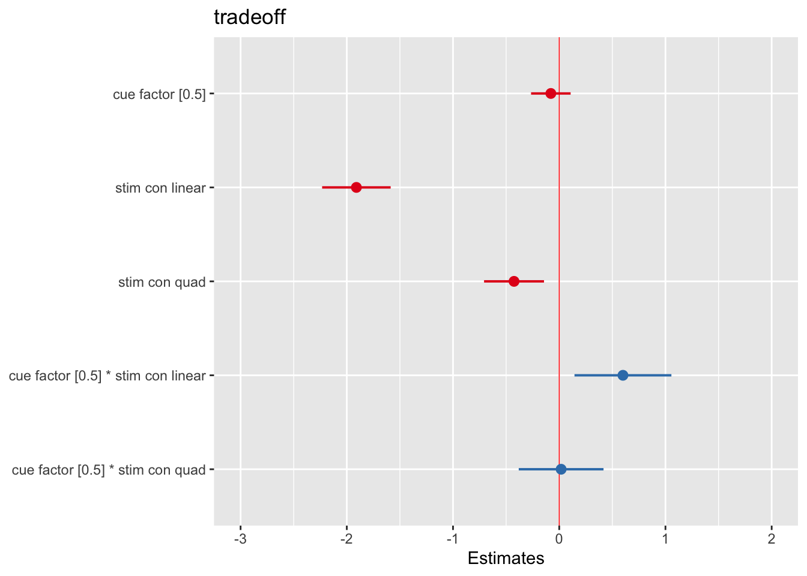
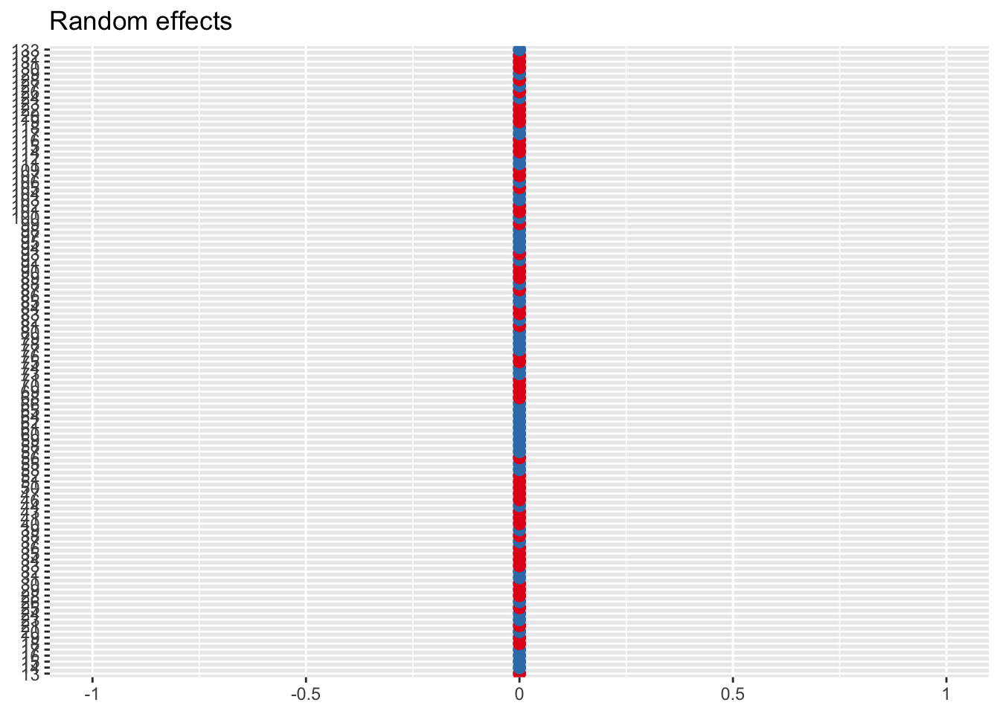

# cognitive RT tradeoff ~ cue * stim (withinsubject) {#ch09_tradeoff-cueXstim}
```
date: '2022-07-17'
```


## Overview

The purpose of this notebook is to example within subject analysis. More
specifically, we want to compare diverging methods and check if the end
results are identical.

------------------------------------------------------------------------

## Why use multilevel models?

-   content copied from
    <http://www.bristol.ac.uk/cmm/learning/multilevel-models/what-why.html>

> There are a number of reasons for using multilevel models:
>
> 1.  Correct inferences: Traditional multiple regression techniques
>     treat the units of analysis as independent observations. One
>     consequence of failing to recognise hierarchical structures is
>     that standard errors of regression coefficients will be
>     underestimated, leading to an overstatement of statistical
>     significance. Standard errors for the coefficients of higher-level
>     predictor variables will be the most affected by ignoring
>     grouping.
>
> 1.  Substantive interest in group effects: In many situations a key
>     research question concerns the extent of grouping in individual
>     outcomes, and the identification of 'outlying' groups. In
>     evaluations of school performance, for example, interest centres
>     on obtaining 'value-added' school effects on pupil attainment.
>     Such effects correspond to school-level residuals in a multilevel
>     model which adjusts for prior attainment.
>
> 1.  Estimating group effects simultaneously with the effects of
>     group-level predictors: An alternative way to allow for group
>     effects is to include dummy variables for groups in a traditional
>     (ordinary least squares) regression model. Such a model is called
>     an analysis of variance or fixed effects model. In many cases
>     there will be predictors defined at the group level, eg type of
>     school (mixed vs. single sex). In a fixed effects model, the
>     effects of group-level predictors are confounded with the effects
>     of the group dummies, ie it is not possible to separate out
>     effects due to observed and unobserved group characteristics. In a
>     multilevel (random effects) model, the effects of both types of
>     variable can be estimated.
>
> 1.  Inference to a population of groups: In a multilevel model the
>     groups in the sample are treated as a random sample from a
>     population of groups. Using a fixed effects model, inferences
>     cannot be made beyond the groups in the sample.

------------------------------------------------------------------------

load libraries


## Terminology

factor

:   In experimental designs, factor is the equivalent of independent
    variable. In R, one can factorize a categorical variable by using
    the `factor` function. Thereby we interchangeably use the term
    factor in lieu of independent variable.

    From this, the term `factorial design` originates.

level

:   within each independent variable, a researcher may determine
    different levels. Since the purpose of linear models is to compare
    at least one condition to another, a factor contains more than one
    level.

group variable

:   Unit of analysis. In most fMRI experiments that collect individual
    data, the group variable would be the individual participant.
    However, in other research questions, the group variable could
    easily be more than one individual. For instance, a dyad of
    participants that carry out conversations, multiple patients that
    see an identical doctor, a classroom full of individuals, or voting
    districts could serve as a grouping variable, depending on the
    research question.

-   <div>

        factor:
        group

    </div>

## Model versions {.tabset}


### Method 1: repeated measures and `one-sample t-tests` {.unlisted .unnumbered}

-   Data Matrix: Wide form
    -   row (83 subject)
    -   column (6 conditions: highCue x highStim, highCue x medStim,
        highCue x lowStim, lowCue x highStim,lowCue x medStim, lowCue x
        lowStim)
-   Model: Use "lm". One-sample t-test
-   Effect size (cohen's d): mean / sd (intersubject slope) \> use
    degrees of freedom.

### Method 1-1: repeated measures using `**aov**` in R {.unlisted .unnumbered}

repeated measures in R using aov link
<https://www.statology.org/repeated-measures-anova-in-r/#>[:\~:text=A%20repeated%20measures%20ANOVA%20is,show%20up%20in%20each%20group](https://www.statology.org/repeated-measures-anova-in-r/#:~:text=A%20repeated%20measures%20ANOVA%20is,show%20up%20in%20each%20group)
using aov, includes subject as error term

### Method 2: multilevel modeling using `**glmfit_multilevel**` in matlab {.unlisted .unnumbered}

-   Data Matrix: Long form
    -   Cell (1x83 subject)
        -   double (1x6 condition) (6 conditions: highCue*highStim,
            highCue*medStim, highCue*lowStim,
            lowCue*highStim,lowCue*medStim, lowCue*lowStim)

        -   e.g. X_factor{1,83}(6)
-   Model: Use
    "glmfit_multilevel\<<https://github.com/canlab/CanlabCore/blob/master/CanlabCore/Statistics_tools/glmfit_multilevel.m>\>"
-   Effect size: output from the Stats variable.
-   TODO: need to identify if multiple factors are allowed as input

### Method 3: multilevel modeling using `**lmer**` in R {.unlisted .unnumbered}

-   Data Matrix: Long form
    -   Row (498: 83 subject \* 2 cue \* 3 stimulus intensity)
    -   Columns (4: subject, cue type, stimulus intensity type,
        tradeoff)
-   Model: Use "lmer" multilevel-modeling
    -   grouping variable: subjects (i.e. src_subject_id)
    -   fixed effects - cue (2 levels, contrast-coded [high, low: 1,
        -1]) - stim_linear (3 levels, [low, med, high: -1, 0, 1]) -
        stim_quadratic (3 levels, [low, med, high: -1, 2, -1])
    -   random effects - cue - stim_linear - cue\*stim_linear
    -   NOTE: due to convergence failure, cue\*stim_quadratic term was
        removed
-   Effect size (cohen's d): beta_coefficient/ sqrt(sum of all random
    variance)

load data and combine participant data


```r
main_dir = dirname(dirname(getwd()))
datadir = file.path(main_dir, 'data', 'beh', 'beh02_preproc')
# parameters _____________________________________ # nolint
subject_varkey <- "src_subject_id"
iv <- "param_cue_type"
dv <- "event03_RT"
dv_keyword <- "RT"
xlab <- ""
taskname <- "cognitive"

ylab <- "ratings (degree)"
subject <- "subject"
exclude <- "sub-0999|sub-0001|sub-0002|sub-0003|sub-0004|sub-0005|sub-0006|sub-0007|sub-0008|sub-0009|sub-0010|sub-0011"

# load data _____________________________________
data <- load_task_social_df(datadir, taskname = taskname, subject_varkey = subject_varkey, iv = iv, exclude = exclude)
data$event03_RT <- data$event03_stimulusC_reseponseonset - data$event03_stimulus_displayonset
# data['event03_RT'], data.event03_RT - pandas
analysis_dir <- file.path(main_dir, "analysis", "mixedeffect", "model06_iv-cue-stim_dv-tradeoff_withinsubject", as.character(Sys.Date()))
dir.create(analysis_dir, showWarnings = FALSE, recursive = TRUE)

data$event03_response_samediff <- mapvalues(data$event03_stimulusC_response,
                                                from = c(1, 2),
                                                to = c("diff", "same"))

data$event03_correct <- ifelse(data$event03_C_stim_match == data$event03_response_samediff, 1, ifelse(data$event03_C_stim_match != data$event03_response_samediff, 0, "NA"))
```


```r
# 1) calculate accuracy of cognitive mental rotation task
data_perf <- data %>%
  group_by(src_subject_id, param_cue_type, param_stimulus_type) %>%
  dplyr::summarise(
    accuracy = sum(as.numeric(event03_correct), na.rm = TRUE), 
    count = sum(!is.na(as.numeric(event03_correct))),
    .groups = 'drop') %>%
  ungroup() %>%
  group_by(src_subject_id) %>%
  dplyr::mutate(zscore_acc = as.numeric(scale(accuracy)))


# 2) calculate average RT within subject, for each condition type
data_RT <- data %>%
  group_by(src_subject_id, param_cue_type, param_stimulus_type) %>%
  dplyr::summarise(subjectwise_RT = mean(as.numeric(event03_RT), na.rm = TRUE), .groups = 'drop') %>%
 ungroup() %>%
     group_by(src_subject_id) %>%
  dplyr::mutate(zscore_RT = as.numeric(scale(subjectwise_RT)))

# 3) calculate tradeoff based on RT and accuracy
df_tradeoff = merge(x = data_RT, y = data_perf, by = c("src_subject_id", "param_cue_type", "param_stimulus_type"), all = TRUE)
df_tradeoff$tradeoff = df_tradeoff$zscore_acc - df_tradeoff$zscore_RT
```


This is the data that we will use


```
##   src_subject_id param_cue_type param_stimulus_type subjectwise_RT  zscore_RT
## 1            100       high_cue           high_stim       3.461085  0.0977099
## 2            100       high_cue            low_stim       3.697358  0.9879113
## 3            100       high_cue            med_stim       3.518048  0.3123281
## 4            100        low_cue           high_stim       3.630573  0.7362880
## 5            100        low_cue            low_stim       3.348520 -0.3263990
## 6            100        low_cue            med_stim       2.955323 -1.8078382
##   accuracy count zscore_acc   tradeoff          condition con_num
## 1        8    10   0.000000 -0.0977099 high_cue_high_stim       1
## 2       10    10   1.118034  0.1301227  high_cue_low_stim       2
## 3        6    10  -1.118034 -1.4303621  high_cue_med_stim       3
## 4        8     9   0.000000 -0.7362880  low_cue_high_stim       4
## 5       10    10   1.118034  1.4444330   low_cue_low_stim       5
## 6        6     9  -1.118034  0.6898042   low_cue_med_stim       6
```

## Method 1 one-sample t

### Method 1 one-sample t {.unlisted .unnumbered}

-   Data Matrix: Wide form
    -   row (83 subject)
    -   column (6 conditions: highCue x highStim, highCue x medStim,
        highCue x lowStim, lowCue x highStim,lowCue x medStim, lowCue x
        lowStim)
-   Model: Use "lm". One-sample t-test
-   Effect size (cohen's d): mean / sd (intersubject slope) \> use
    degrees of freedom.


```r
w1.perf = df_tradeoff[c("src_subject_id","param_cue_type", "param_stimulus_type","zscore_acc" )] %>% 
   pivot_wider(names_from = c(param_cue_type, param_stimulus_type), values_from = zscore_acc) 
w1.rt = df_tradeoff[c("src_subject_id","param_cue_type", "param_stimulus_type","zscore_RT" )] %>% 
   pivot_wider(names_from = c(param_cue_type, param_stimulus_type), values_from = zscore_RT) 
w1.tradeoff = df_tradeoff[c("src_subject_id","param_cue_type", "param_stimulus_type","tradeoff" )] %>% 
   pivot_wider(names_from = c(param_cue_type, param_stimulus_type), values_from = tradeoff) 
```


```r
# library(effectsize)
# eta_squared(t.int, partial = FALSE)
```

**Creating within subject effect** Each participants data point is
transformed from long-to-wide format. Rows represent participants;
columns represent conditions. In our case, we have a 2x3 design.
Therefore, we have 6 columns. By linear combining these 6 combination
with contrast-code weights, we can obtain one column, that is the cue
effect. Ultimately, we test whether this cue effect is different from
zero, using a one sample t-test.

**1) cue effect** The cue effect is not significant, b = -0.0987 , se =
0.1798, t(82) = -0.549, p = 0.585


```{.r .fold-show}
# average

# cue effect
w1.tradeoff$cue_effect = (+1/2) * w1.tradeoff$high_cue_high_stim + 
  (+1/2) * w1.tradeoff$high_cue_med_stim + 
  (+1/2) * w1.tradeoff$high_cue_low_stim + 
  (-1/2) * w1.tradeoff$low_cue_high_stim + 
  (-1/2) * w1.tradeoff$low_cue_med_stim + 
  (-1/2) * w1.tradeoff$low_cue_low_stim 
tradeoff.cue = lm(w1.tradeoff$cue_effect ~ 1)
t.test(w1.tradeoff$cue_effect, mu = 0, alternative = "two.sided")
```

```
## 
## 	One Sample t-test
## 
## data:  w1.tradeoff$cue_effect
## t = -0.76582, df = 104, p-value = 0.4455
## alternative hypothesis: true mean is not equal to 0
## 95 percent confidence interval:
##  -0.4248327  0.1881188
## sample estimates:
## mean of x 
## -0.118357
```

```{.r .fold-show}
# output of cue effect
summary(tradeoff.cue)
```

```
## 
## Call:
## lm(formula = w1.tradeoff$cue_effect ~ 1)
## 
## Residuals:
##     Min      1Q  Median      3Q     Max 
## -3.9035 -1.2443 -0.0625  1.3321  3.3766 
## 
## Coefficients:
##             Estimate Std. Error t value Pr(>|t|)
## (Intercept)  -0.1184     0.1545  -0.766    0.446
## 
## Residual standard error: 1.584 on 104 degrees of freedom
```

We sill continue to calculate this within subject effect for the
stimulus and interaction contrast. \n

**2) linear stimulus effect** The linear stimulus effect is significant,
b = -0.8343, se = 0.0787, t(82) = -10.6, p \< 2e-16 \*\*\*


```{.r .fold-show}
# linear stim effect
w1.tradeoff$lin_stim_effect = 
  (+1/4) * w1.tradeoff$high_cue_high_stim + 
  (0) * w1.tradeoff$high_cue_med_stim + 
  (-1/4) * w1.tradeoff$high_cue_low_stim + 
  (+1/4) * w1.tradeoff$low_cue_high_stim + 
  (0) * w1.tradeoff$low_cue_med_stim + 
  (-1/4) * w1.tradeoff$low_cue_low_stim 
tradeoff.lin_stim = lm(w1.tradeoff$lin_stim_effect ~ 1)

# output of stimulus linear contrast effect
summary(tradeoff.lin_stim)
```

```
## 
## Call:
## lm(formula = w1.tradeoff$lin_stim_effect ~ 1)
## 
## Residuals:
##      Min       1Q   Median       3Q      Max 
## -1.08946 -0.58857 -0.05204  0.42664  2.14818 
## 
## Coefficients:
##             Estimate Std. Error t value Pr(>|t|)    
## (Intercept) -0.80490    0.07042  -11.43   <2e-16 ***
## ---
## Signif. codes:  0 '***' 0.001 '**' 0.01 '*' 0.05 '.' 0.1 ' ' 1
## 
## Residual standard error: 0.7216 on 104 degrees of freedom
```

**3) quadratic stimulus effect** The quadratic stimulus effect is
significant, b = -0.31599, se = 0.07563, t(82) = -4.178, p \< 2e-16
\*\*\*


```r
# quadratic stimulus effect
w1.tradeoff$quad_stim_effect = 
  (-1/6) * w1.tradeoff$high_cue_high_stim + 
  (2/6) * w1.tradeoff$high_cue_med_stim + 
  (-1/6) * w1.tradeoff$high_cue_low_stim + 
  (-1/6) * w1.tradeoff$low_cue_high_stim + 
  (2/6) * w1.tradeoff$low_cue_med_stim + 
  (-1/6) * w1.tradeoff$low_cue_low_stim 
tradeoff.quad_stim = lm(w1.tradeoff$quad_stim_effect ~ 1)
summary(tradeoff.quad_stim)
```

```
## 
## Call:
## lm(formula = w1.tradeoff$quad_stim_effect ~ 1)
## 
## Residuals:
##      Min       1Q   Median       3Q      Max 
## -1.65581 -0.55973  0.03071  0.49762  1.89672 
## 
## Coefficients:
##             Estimate Std. Error t value Pr(>|t|)    
## (Intercept) -0.27494    0.07036  -3.908 0.000166 ***
## ---
## Signif. codes:  0 '***' 0.001 '**' 0.01 '*' 0.05 '.' 0.1 ' ' 1
## 
## Residual standard error: 0.721 on 104 degrees of freedom
```

**4) interaction effect** The interaction is significant, b = 0.19646,
se = 0.07542, t(82) = 2.605, p = 0.0109 \*\*


```r
# interaction
w1.tradeoff$interaction = 
  (+1/4) * w1.tradeoff$high_cue_high_stim + 
  (0) * w1.tradeoff$high_cue_med_stim + 
  (-1/4) * w1.tradeoff$high_cue_low_stim + 
  (-1/4) * w1.tradeoff$low_cue_high_stim + 
  (0/4) * w1.tradeoff$low_cue_med_stim + 
  (+1/4) * w1.tradeoff$low_cue_low_stim 
tradeoff.int = lm(w1.tradeoff$interaction ~ 1)
summary(tradeoff.int)
```

```
## 
## Call:
## lm(formula = w1.tradeoff$interaction ~ 1)
## 
## Residuals:
##      Min       1Q   Median       3Q      Max 
## -1.52806 -0.38884 -0.02102  0.39899  1.74262 
## 
## Coefficients:
##             Estimate Std. Error t value Pr(>|t|)  
## (Intercept)  0.14994    0.06445   2.327   0.0219 *
## ---
## Signif. codes:  0 '***' 0.001 '**' 0.01 '*' 0.05 '.' 0.1 ' ' 1
## 
## Residual standard error: 0.6604 on 104 degrees of freedom
```

### Method 1 effectsize {.unlisted .unnumbered}


```r
# tradeoff$cue_effect:
cohens_d = -0.1974/(0.3597*sqrt(82))
cat(paste("\ncohen's d of the cue effect:  -0.1974/(0.3597*sqrt(82)) = ", cohens_d))
```

```
## 
## cohen's d of the cue effect:  -0.1974/(0.3597*sqrt(82)) =  -0.0606037899560042
```

```r
# tradeoff lin_effect
cat(paste("\ncohen's d of the linear stimulus intensity effect: ", -3.3371/(0.3148*sqrt(82))))
```

```
## 
## cohen's d of the linear stimulus intensity effect:  -1.17065135217398
```

```r
# tradeoff stim_quad_effect
cat(paste("\ncohen's d of the quadratic stimulus intensity effect: ",-1.8960/(0.4538*sqrt(82))))
```

```
## 
## cohen's d of the quadratic stimulus intensity effect:  -0.461388658964101
```

```r
# tradeoff interaction_effect
cat(paste("\ncohen's d of the quadratic stimulus intensity effect: ",
0.7858/(0.3017*sqrt(82))))
```

```
## 
## cohen's d of the quadratic stimulus intensity effect:  0.287627090452815
```


```r
cohens_f =  as.numeric(cohens_d)*0.5
cat(paste("\ncohen's f of the cue effect: 1/2 * cohen's d = ",as.numeric(cohens_d)*0.5 ))
```

```
## 
## cohen's f of the cue effect: 1/2 * cohen's d =  -0.0303018949780021
```

-   Keep note of this Cohen's f value, -0.03. It will appear in the next
    model as well.

## Method 1-1 aov 

contrast-coding for aov modeling (code-hidden)


```r
#contrast code 1 linear
df_tradeoff$stim_con_linear[df_tradeoff$param_stimulus_type == "low_stim"] <- -0.5
df_tradeoff$stim_con_linear[df_tradeoff$param_stimulus_type == "med_stim"] <- 0
df_tradeoff$stim_con_linear[df_tradeoff$param_stimulus_type == "high_stim"] <- 0.5

# contrast code 2 quadratic
df_tradeoff$stim_con_quad[df_tradeoff$param_stimulus_type == "low_stim"] <- -0.33
df_tradeoff$stim_con_quad[df_tradeoff$param_stimulus_type == "med_stim"] <- 0.66
df_tradeoff$stim_con_quad[df_tradeoff$param_stimulus_type == "high_stim"] <- -0.33

# social cue contrast
df_tradeoff$social_cue[df_tradeoff$param_cue_type == 'low_cue'] <- -0.5 # social influence task
df_tradeoff$social_cue[df_tradeoff$param_cue_type == 'high_cue'] <- 0.5 # no influence task
df_tradeoff$cue_factor = factor(df_tradeoff$param_cue_type)
```


```{.r .fold-show}
model_1_1 <- aov(tradeoff~factor(param_cue_type)*factor(param_stimulus_type)+Error(factor(src_subject_id)), data = df_tradeoff)
summary(model_1_1)
```

```
## 
## Error: factor(src_subject_id)
##            Df    Sum Sq   Mean Sq F value Pr(>F)
## Residuals 104 9.657e-28 9.285e-30               
## 
## Error: Within
##                                                     Df Sum Sq Mean Sq F value
## factor(param_cue_type)                               1    1.0    0.98   0.577
## factor(param_stimulus_type)                          2  295.9  147.96  87.025
## factor(param_cue_type):factor(param_stimulus_type)   2    9.5    4.73   2.780
## Residuals                                          520  884.1    1.70        
##                                                    Pr(>F)    
## factor(param_cue_type)                             0.4479    
## factor(param_stimulus_type)                        <2e-16 ***
## factor(param_cue_type):factor(param_stimulus_type) 0.0629 .  
## Residuals                                                    
## ---
## Signif. codes:  0 '***' 0.001 '**' 0.01 '*' 0.05 '.' 0.1 ' ' 1
```

```{.r .fold-show}
#knitr::kable(nice(model_1_1))
coefficients(model_1_1)
```

```
## (Intercept) :
##   (Intercept) 
## -1.022873e-16 
## 
## factor(src_subject_id) :
## numeric(0)
## 
## Within :
##                                     factor(param_cue_type)low_cue 
##                                                        -0.2150776 
##                               factor(param_stimulus_type)low_stim 
##                                                         1.3099065 
##                               factor(param_stimulus_type)med_stim 
##                                                         0.2513999 
## factor(param_cue_type)low_cue:factor(param_stimulus_type)low_stim 
##                                                         0.5997752 
## factor(param_cue_type)low_cue:factor(param_stimulus_type)med_stim 
##                                                         0.2821716
```

### Method 1-1 effectsize {.unlisted .unnumbered}

Note that the effectsize of the cue effect ("cue_factor") is 5.64e-04.
We'll check that this is equivalent to the effectsize estimate in the
next model


```r
cohens_f(model_1_1)
```

```
## # Effect Size for ANOVA (Type I)
## 
## Group  |                                          Parameter | Cohen's f (partial) |      95% CI
## -----------------------------------------------------------------------------------------------
## Within |                             factor(param_cue_type) |                0.03 | [0.00, Inf]
## Within |                        factor(param_stimulus_type) |                0.58 | [0.50, Inf]
## Within | factor(param_cue_type):factor(param_stimulus_type) |                0.10 | [0.00, Inf]
## 
## - One-sided CIs: upper bound fixed at [Inf].
```

```r
eta_squared(model_1_1, partial = FALSE)
```

```
## # Effect Size for ANOVA (Type I)
## 
## Group  |                                          Parameter |     Eta2 |       95% CI
## -------------------------------------------------------------------------------------
## Within |                             factor(param_cue_type) | 8.24e-04 | [0.00, 1.00]
## Within |                        factor(param_stimulus_type) |     0.25 | [0.20, 1.00]
## Within | factor(param_cue_type):factor(param_stimulus_type) | 7.94e-03 | [0.00, 1.00]
## 
## - One-sided CIs: upper bound fixed at [1.00].
```

## Method 1-2 aov contrast-coding


```{.r .fold-show}
# because the coefficients don't match, instead of adding one factor, I plan to contrast code each factor and include it in model
model_1_2 <- aov(tradeoff ~ 1+ cue_factor + stim_con_linear + stim_con_quad + cue_factor*stim_con_linear + cue_factor*stim_con_quad + +Error(factor(src_subject_id)), data = df_tradeoff)
summary(model_1_2)
```

```
## 
## Error: factor(src_subject_id)
##            Df    Sum Sq   Mean Sq F value Pr(>F)
## Residuals 104 9.657e-28 9.285e-30               
## 
## Error: Within
##                             Df Sum Sq Mean Sq F value   Pr(>F)    
## cue_factor                   1    1.0    0.98   0.577 0.447927    
## stim_con_linear              1  272.1  272.10 160.045  < 2e-16 ***
## stim_con_quad                1   23.8   23.81  14.006 0.000203 ***
## cue_factor:stim_con_linear   1    9.4    9.44   5.554 0.018807 *  
## cue_factor:stim_con_quad     1    0.0    0.01   0.006 0.935965    
## Residuals                  520  884.1    1.70                     
## ---
## Signif. codes:  0 '***' 0.001 '**' 0.01 '*' 0.05 '.' 0.1 ' ' 1
```

```{.r .fold-show}
coefficients(model_1_2)
```

```
## (Intercept) :
##   (Intercept) 
## -1.022873e-16 
## 
## factor(src_subject_id) :
## numeric(0)
## 
## Within :
##                 cue_factorlow_cue                   stim_con_linear 
##                        0.07890465                       -1.30990652 
##                     stim_con_quad cue_factorlow_cue:stim_con_linear 
##                       -0.40762969                       -0.59977524 
##   cue_factorlow_cue:stim_con_quad 
##                       -0.01789492
```

### Method 1-2 effectsize {.unlisted .unnumbered}

Note that the effectsize of the cue effect ("cue_factor") is 5.64e-04.
This is identical to the effect size of the cue effect from Method 1-1.
For the other estimates, we can't really compare, because the estimates
arre collapsed into omnibus models in Method 1-1, where as Method 1-2
uses orthogonalized contrast codes, parsing out the stimulus effect into
two contrasts.


```r
cohens_f(model_1_2)
```

```
## # Effect Size for ANOVA (Type I)
## 
## Group  |                  Parameter | Cohen's f (partial) |      95% CI
## -----------------------------------------------------------------------
## Within |                 cue_factor |                0.03 | [0.00, Inf]
## Within |            stim_con_linear |                0.55 | [0.48, Inf]
## Within |              stim_con_quad |                0.16 | [0.09, Inf]
## Within | cue_factor:stim_con_linear |                0.10 | [0.03, Inf]
## Within |   cue_factor:stim_con_quad |            3.52e-03 | [0.00, Inf]
## 
## - One-sided CIs: upper bound fixed at [Inf].
```

```r
eta_squared(model_1_2, partial = FALSE)
```

```
## # Effect Size for ANOVA (Type I)
## 
## Group  |                  Parameter |     Eta2 |       95% CI
## -------------------------------------------------------------
## Within |                 cue_factor | 8.24e-04 | [0.00, 1.00]
## Within |            stim_con_linear |     0.23 | [0.18, 1.00]
## Within |              stim_con_quad |     0.02 | [0.00, 1.00]
## Within | cue_factor:stim_con_linear | 7.93e-03 | [0.00, 1.00]
## Within |   cue_factor:stim_con_quad | 9.23e-06 | [0.00, 1.00]
## 
## - One-sided CIs: upper bound fixed at [1.00].
```

    UPDATE OR DELETE
    y_{ij} = \mu + \beta_{j} + \b_{i} + \epsilon_{ij}
    * y_{ij} is the response value for the ith individual at the jth period (day)


```r
Within_Data.BarGraph<-ggplot(df_tradeoff, aes(param_stimulus_type, tradeoff, fill=param_stimulus_type)) +
  geom_bar(stat="summary", fun.y="mean") + 
  scale_y_continuous() + # breaks = seq(0, 101, 10), limits =c(0,101)
  facet_grid(.~param_cue_type) +
  xlab("Cue") + ylab("Tradeoff") +
  scale_fill_brewer(palette="Dark2") +
  theme(legend.position="none")
```

```
## Warning in geom_bar(stat = "summary", fun.y = "mean"): Ignoring unknown
## parameters: `fun.y`
```

```r
Within_Data.BarGraph
```

```
## No summary function supplied, defaulting to `mean_se()`
## No summary function supplied, defaulting to `mean_se()`
```


## Method 1 effectsize

### Method 1 effectsize estimate (one-sample t-test) {.unlisted .unnumbered}


```r
# tradeoff$cue_effect:
cohens_d = -0.1974/(0.3597*sqrt(82))
cat(paste("\ncohen's d of the cue effect:  -0.1974/(0.3597*sqrt(82)) = ", cohens_d))
```

```
## 
## cohen's d of the cue effect:  -0.1974/(0.3597*sqrt(82)) =  -0.0606037899560042
```

```r
# tradeoff lin_effect
cat(paste("\ncohen's d of the linear stimulus intensity effect: ", -3.3371/(0.3148*sqrt(82))))
```

```
## 
## cohen's d of the linear stimulus intensity effect:  -1.17065135217398
```

```r
# tradeoff stim_quad_effect
cat(paste("\ncohen's d of the quadratic stimulus intensity effect: ",-1.8960/(0.4538*sqrt(82))))
```

```
## 
## cohen's d of the quadratic stimulus intensity effect:  -0.461388658964101
```

```r
# tradeoff interaction_effect
cat(paste("\ncohen's d of the quadratic stimulus intensity effect: ",
0.7858/(0.3017*sqrt(82))))
```

```
## 
## cohen's d of the quadratic stimulus intensity effect:  0.287627090452815
```

### Method 1-1 effectsize estimate (one-sample t-test) {.unlisted .unnumbered}


```r
cohens_f(model_1_1)
```

```
## # Effect Size for ANOVA (Type I)
## 
## Group  |                                          Parameter | Cohen's f (partial) |      95% CI
## -----------------------------------------------------------------------------------------------
## Within |                             factor(param_cue_type) |                0.03 | [0.00, Inf]
## Within |                        factor(param_stimulus_type) |                0.58 | [0.50, Inf]
## Within | factor(param_cue_type):factor(param_stimulus_type) |                0.10 | [0.00, Inf]
## 
## - One-sided CIs: upper bound fixed at [Inf].
```

```r
eta_squared(model_1_1, partial = FALSE)
```

```
## # Effect Size for ANOVA (Type I)
## 
## Group  |                                          Parameter |     Eta2 |       95% CI
## -------------------------------------------------------------------------------------
## Within |                             factor(param_cue_type) | 8.24e-04 | [0.00, 1.00]
## Within |                        factor(param_stimulus_type) |     0.25 | [0.20, 1.00]
## Within | factor(param_cue_type):factor(param_stimulus_type) | 7.94e-03 | [0.00, 1.00]
## 
## - One-sided CIs: upper bound fixed at [1.00].
```

### Method 1-2 effectsize estimate (one-sample t-test) {.unlisted .unnumbered}


```r
cohens_f(model_1_2)
```

```
## # Effect Size for ANOVA (Type I)
## 
## Group  |                  Parameter | Cohen's f (partial) |      95% CI
## -----------------------------------------------------------------------
## Within |                 cue_factor |                0.03 | [0.00, Inf]
## Within |            stim_con_linear |                0.55 | [0.48, Inf]
## Within |              stim_con_quad |                0.16 | [0.09, Inf]
## Within | cue_factor:stim_con_linear |                0.10 | [0.03, Inf]
## Within |   cue_factor:stim_con_quad |            3.52e-03 | [0.00, Inf]
## 
## - One-sided CIs: upper bound fixed at [Inf].
```

```r
eta_squared(model_1_2, partial = FALSE)
```

```
## # Effect Size for ANOVA (Type I)
## 
## Group  |                  Parameter |     Eta2 |       95% CI
## -------------------------------------------------------------
## Within |                 cue_factor | 8.24e-04 | [0.00, 1.00]
## Within |            stim_con_linear |     0.23 | [0.18, 1.00]
## Within |              stim_con_quad |     0.02 | [0.00, 1.00]
## Within | cue_factor:stim_con_linear | 7.93e-03 | [0.00, 1.00]
## Within |   cue_factor:stim_con_quad | 9.23e-06 | [0.00, 1.00]
## 
## - One-sided CIs: upper bound fixed at [1.00].
```

Note that the effectsize of the cue effect ("cue_factor") is 5.64e-04.
We'll check that this is equivalent to the effectsize estimate in the
next model

## Method 2 matlab {.tabset}

### Method 2 matlab {.unlisted .unnumbered}

-   Data Matrix: Long form

    -   row (83 subject) x column (6 conditions: highCue*highStim,
        highCue*medStim, highCue*lowStim,
        lowCue*highStim,lowCue*medStim, lowCue*lowStim)

-   Model: Use "lm". One-sample t-test

-   Effect size (cohen's d): mean / sd (intersubject slope) \> use
    degrees of freedom.

-   See function help here:
    <https://canlabcore.readthedocs.io/_/downloads/en/latest/pdf/>

-   `Question ::` How do I indicate that that is a 2 factor dataset?

````{=html}
<!DOCTYPE html PUBLIC "-//W3C//DTD HTML 4.01 Transitional//EN">
<html><head><meta http-equiv="Content-Type" content="text/html; charset=utf-8"><meta http-equiv="X-UA-Compatible" content="IE=edge,IE=9,chrome=1"><meta name="generator" content="MATLAB 2020b"><title>Untitled</title><style type="text/css">.rtcContent { padding: 30px; } .CodeBlock { background-color: #F7F7F7; margin: 10px 0 10px 0;}
.S0 { border-left: 1px solid rgb(233, 233, 233); border-right: 1px solid rgb(233, 233, 233); border-top: 1px solid rgb(233, 233, 233); border-bottom: 0px none rgb(0, 0, 0); border-radius: 4px 4px 0px 0px; padding: 6px 45px 0px 13px; line-height: 44.316px; min-height: 18px; white-space: nowrap; color: rgb(0, 0, 0); font-family: Menlo, Monaco, Consolas, "Courier New", monospace; font-size: 36px;  }
.S1 { border-left: 1px solid rgb(233, 233, 233); border-right: 1px solid rgb(233, 233, 233); border-top: 0px none rgb(0, 0, 0); border-bottom: 0px none rgb(0, 0, 0); border-radius: 0px; padding: 0px 45px 0px 13px; line-height: 44.316px; min-height: 18px; white-space: nowrap; color: rgb(0, 0, 0); font-family: Menlo, Monaco, Consolas, "Courier New", monospace; font-size: 36px;  }
.S2 { border-left: 1px solid rgb(233, 233, 233); border-right: 1px solid rgb(233, 233, 233); border-top: 0px none rgb(0, 0, 0); border-bottom: 1px solid rgb(233, 233, 233); border-radius: 0px; padding: 0px 45px 4px 13px; line-height: 44.316px; min-height: 18px; white-space: nowrap; color: rgb(0, 0, 0); font-family: Menlo, Monaco, Consolas, "Courier New", monospace; font-size: 36px;  }
.S3 { color: rgb(64, 64, 64); padding: 10px 0px 6px 17px; background: rgb(255, 255, 255) none repeat scroll 0% 0% / auto padding-box border-box; font-family: Menlo, Monaco, Consolas, "Courier New", monospace; font-size: 36px; overflow-x: hidden; line-height: 44.316px;  }
.embeddedOutputsErrorElement {min-height: 18px; max-height: 250px; overflow: auto;}
.embeddedOutputsErrorElement.inlineElement {}
.embeddedOutputsErrorElement.rightPaneElement {}
.embeddedOutputsWarningElement{min-height: 18px; max-height: 250px; overflow: auto;}
.embeddedOutputsWarningElement.inlineElement {}
.embeddedOutputsWarningElement.rightPaneElement {}
.diagnosticMessage-wrapper {font-family: Menlo, Monaco, Consolas, "Courier New", monospace; font-size: 12px;}
.diagnosticMessage-wrapper.diagnosticMessage-warningType {color: rgb(255,100,0);}
.diagnosticMessage-wrapper.diagnosticMessage-warningType a {color: rgb(255,100,0); text-decoration: underline;}
.diagnosticMessage-wrapper.diagnosticMessage-errorType {color: rgb(230,0,0);}
.diagnosticMessage-wrapper.diagnosticMessage-errorType a {color: rgb(230,0,0); text-decoration: underline;}
.diagnosticMessage-wrapper .diagnosticMessage-messagePart,.diagnosticMessage-wrapper .diagnosticMessage-causePart {white-space: pre-wrap;}
.diagnosticMessage-wrapper .diagnosticMessage-stackPart {white-space: pre;}
.embeddedOutputsTextElement,.embeddedOutputsVariableStringElement {white-space: pre; word-wrap: initial; min-height: 18px; max-height: 250px; overflow: auto;}
.textElement,.rtcDataTipElement .textElement {padding-top: 3px;}
.embeddedOutputsTextElement.inlineElement,.embeddedOutputsVariableStringElement.inlineElement {}
.inlineElement .textElement {}
.embeddedOutputsTextElement.rightPaneElement,.embeddedOutputsVariableStringElement.rightPaneElement {min-height: 16px;}
.rightPaneElement .textElement {padding-top: 2px; padding-left: 9px;}
.S4 { border-left: 1px solid rgb(233, 233, 233); border-right: 1px solid rgb(233, 233, 233); border-top: 1px solid rgb(233, 233, 233); border-bottom: 1px solid rgb(233, 233, 233); border-radius: 0px; padding: 6px 45px 4px 13px; line-height: 44.316px; min-height: 18px; white-space: nowrap; color: rgb(0, 0, 0); font-family: Menlo, Monaco, Consolas, "Courier New", monospace; font-size: 36px;  }
.S5 { border-left: 1px solid rgb(233, 233, 233); border-right: 1px solid rgb(233, 233, 233); border-top: 1px solid rgb(233, 233, 233); border-bottom: 1px solid rgb(233, 233, 233); border-radius: 0px 0px 4px 4px; padding: 6px 45px 4px 13px; line-height: 44.316px; min-height: 18px; white-space: nowrap; color: rgb(0, 0, 0); font-family: Menlo, Monaco, Consolas, "Courier New", monospace; font-size: 36px;  }</style></head><body><div class = rtcContent><div class="CodeBlock"><div class="inlineWrapper"><div  class = 'S0'><span style="white-space: pre;"><span>format </span><span style="color: rgb(170, 4, 249);">short</span></span></div></div><div class="inlineWrapper"><div  class = 'S1'><span style="white-space: pre;"><span style="color: rgb(2, 128, 9);">% read csv as table</span></span></div></div><div class="inlineWrapper"><div  class = 'S1'><span style="white-space: pre;"><span>filename = </span><span style="color: rgb(170, 4, 249);">'/Users/h/Dropbox/projects_dropbox/social_influence_analysis/analysis/mixedeffect/model05_iv-cue-stim_dv-tradeoff_withinsubject/model05_iv-cue-stim_dv-tradeoff_withinsubject.csv'</span><span>;</span></span></div></div><div class="inlineWrapper"><div  class = 'S1'><span style="white-space: pre;"><span>T = readtable(filename);</span></span></div></div><div class="inlineWrapper"><div  class = 'S1'><span style="white-space: pre;"><span style="color: rgb(2, 128, 9);">% assign each column to cell</span></span></div></div><div class="inlineWrapper"><div  class = 'S1'></div></div><div class="inlineWrapper"><div  class = 'S1'><span style="white-space: pre;"><span>subject_list = unique(T.src_subject_id);</span></span></div></div><div class="inlineWrapper"><div  class = 'S1'><span style="white-space: pre;"><span>Y_DV = cell(1,length(unique(T.src_subject_id)));</span></span></div></div><div class="inlineWrapper"><div  class = 'S1'><span style="white-space: pre;"><span>X_factor = cell(1, length(unique(T.src_subject_id)));</span></span></div></div><div class="inlineWrapper"><div  class = 'S1'><span style="white-space: pre;"><span style="color: rgb(14, 0, 255);">for </span><span>n = 1:length(unique(T.src_subject_id))</span></span></div></div><div class="inlineWrapper"><div  class = 'S1'><span style="white-space: pre;"><span>    </span><span style="color: rgb(2, 128, 9);">% subset value per subject</span></span></div></div><div class="inlineWrapper"><div  class = 'S1'><span style="white-space: pre;"><span>    Y_DV{n} = T(T.src_subject_id==subject_list(n),:).tradeoff;</span></span></div></div><div class="inlineWrapper"><div  class = 'S1'><span style="white-space: pre;"><span>    X_factor{n} = T(T.src_subject_id==subject_list(n),:).con_num;</span></span></div></div><div class="inlineWrapper"><div  class = 'S1'><span style="white-space: pre;"><span style="color: rgb(14, 0, 255);">end</span></span></div></div><div class="inlineWrapper"><div  class = 'S1'></div></div><div class="inlineWrapper outputs"><div  class = 'S2'><span style="white-space: pre;"><span>stats = glmfit_multilevel(Y_DV, X_factor, [], </span><span style="color: rgb(170, 4, 249);">'verbose'</span><span>, </span><span style="color: rgb(170, 4, 249);">'weighted'</span><span>);</span></span></div><div  class = 'S3'><div class="inlineElement eoOutputWrapper embeddedOutputsTextElement scrollableOutput" uid="99D2DDC7" data-scroll-top="null" data-scroll-left="null" data-testid="output_0" data-width="3186" data-height="1408" data-hashorizontaloverflow="false" style="width: 3214px; max-height: 261px;"><div class="textElement">Analysis description: Second Level of Multilevel Model  
GLS analysis

Observations:  83, Predictors:   1
Outcome names: 1st-level B1	1st-level B2	
Weighting option: weighted
Inference option: t-test

Other Options:
	Plots: No
	Robust: no
	Save: No
	Output file: glmfit_general_output.txt
	R &amp; B - type Empirical Bayes reweighting.
Total time: 0.00 s

________________________________________

Second Level of Multilevel Model 
	Outcome variables:
	1st-level B1	1st-level B2	
Adj. mean	-0.21	0.06	

2nd-level B01
	1st-level B1	1st-level B2	
Coeff	-0.21	0.06	
STE	0.12	0.04	
t	-1.73	1.76	
Z	-1.71	1.74	
p	0.08812	0.08170	

________________________________________</div></div></div></div><div class="inlineWrapper outputs"><div  class = 'S4'><span style="white-space: pre;"><span>disp(stats)</span></span></div><div  class = 'S3'><div class="inlineElement eoOutputWrapper embeddedOutputsTextElement scrollableOutput" uid="0DE12AF9" data-testid="output_1" data-width="3186" data-height="1056" data-hashorizontaloverflow="false" style="width: 3214px; max-height: 261px;"><div class="textElement">              mean: [-0.2132 0.0620]
      mean_descrip: 'Intercept of each col. of Y; (mean response if predictors are centered)'
              beta: [-0.2132 0.0620]
      beta_descrip: 'betas (regression coefficients), k predictors x nvars'
               var: [0.0152 0.0012]
       var_descrip: 'Residual variance of each col. of Y'
               ste: [0.1234 0.0352]
       ste_descrip: 'Std. error of each beta for each col. of Y, k predictors x nvars'
                 t: [-1.7271 1.7637]
               dfe: [77.8088 78.0496]
       dfe_descrip: 'error DF for each col. of Y, Satterthwaite corrected if necessary;  1 x nvars'
                 e: [83×1 double]
         e_descrip: 'weighted residuals (resid. from weighted GLS model.)'
                 p: [0.0881 0.0817]
         p_descrip: 'Two-tailed p-values'
      analysisname: 'Second Level of Multilevel Model '
            b_star: [-0.2307 0.0659]
    b_star_descrip: 'R &amp; B reweighted fixed-effects estimates'
            Y_star: [83×2 double]
    Y_star_descrip: 'Empirical Bayes estimates of individual 2nd-level effects after re-weighting'
      btwn_var_est: [2×1 double]
                 W: [83×2 double]
      inputOptions: [1×1 struct]
       first_level: [1×1 struct]</div></div></div></div><div class="inlineWrapper"><div  class = 'S5'></div></div></div></div>
<br>
<!-- 
##### SOURCE BEGIN #####
format short
% read csv as table
filename = '/Users/h/Dropbox/projects_dropbox/social_influence_analysis/analysis/mixedeffect/model05_iv-cue-stim_dv-tradeoff_withinsubject/model05_iv-cue-stim_dv-tradeoff_withinsubject.csv';
T = readtable(filename);
% assign each column to cell

subject_list = unique(T.src_subject_id);
Y_DV = cell(1,length(unique(T.src_subject_id)));
X_factor = cell(1, length(unique(T.src_subject_id)));
for n = 1:length(unique(T.src_subject_id))
    % subset value per subject
    Y_DV{n} = T(T.src_subject_id==subject_list(n),:).tradeoff;
    X_factor{n} = T(T.src_subject_id==subject_list(n),:).con_num;
end

stats = glmfit_multilevel(Y_DV, X_factor, [], 'verbose', 'weighted');
disp(stats)
##### SOURCE END #####
--></body></html>
````

## Method 3 multilevel modeling

-   Data Matrix: Long form
    -   Row (498: 83 subject \* 2 cue \* 3 stimulus intensity)
    -   Columns (4: subject, cue type, stimulus intensity type,
        tradeoff)
-   Model: Use "lmer" multilevel-modeling
    -   grouping variable: subjects (i.e. src_subject_id)
    -   fixed effects - cue (2 levels, contrast-coded [high, low: 1,
        -1]) - stim_linear (3 levels, [low, med, high: -1, 0, 1]) -
        stim_quadratic (3 levels, [low, med, high: -1, 2, -1])
    -   random effects - cue - stim_linear - cue\*stim_linear
    -   NOTE: due to convergence failure, cue\*stim_quadratic term was
        removed
-   Effect size (cohen's d): beta_coefficient/ sqrt(sum of all random
    variance)

contrast-coding for multi-level modeling (code-hidden)


```r
#contrast code 1 linear
df_tradeoff$stim_con_linear[df_tradeoff$param_stimulus_type == "low_stim"] <- -0.5
df_tradeoff$stim_con_linear[df_tradeoff$param_stimulus_type == "med_stim"] <- 0
df_tradeoff$stim_con_linear[df_tradeoff$param_stimulus_type == "high_stim"] <- 0.5

# contrast code 2 quadratic
df_tradeoff$stim_con_quad[df_tradeoff$param_stimulus_type == "low_stim"] <- -0.33
df_tradeoff$stim_con_quad[df_tradeoff$param_stimulus_type == "med_stim"] <- 0.66
df_tradeoff$stim_con_quad[df_tradeoff$param_stimulus_type == "high_stim"] <- -0.33

# social cue contrast
df_tradeoff$social_cue[df_tradeoff$param_cue_type == 'low_cue'] <- -0.5 # social influence task
df_tradeoff$social_cue[df_tradeoff$param_cue_type == 'high_cue'] <- 0.5 # no influence task
df_tradeoff$cue_factor = factor(df_tradeoff$social_cue)
```


```r
# parameters ___________________________________________________________________
df_tradeoff$subject = factor(df_tradeoff$src_subject_id)
subject_varkey <- "subject"
iv <- "cue_factor"
stim_con1 = "stim_con_linear"
stim_con2 = "stim_con_quad"
dv <- "tradeoff"
iv_keyword <- "cue-stim"
dv_keyword <- "tradeoff"
xlab <- ""
taskname <- "cognitive"
ylim = c(-1,1)
```

Method-3 multi-level modeling using **lmer**


```{.r .fold-show}
Method3_fullmodel = lmer(tradeoff ~ 1+ cue_factor + stim_con_linear + stim_con_quad + cue_factor:stim_con_linear + cue_factor:stim_con_quad + (1  |subject), data = df_tradeoff)
```

```
## boundary (singular) fit: see help('isSingular')
```

```{.r .fold-show}
# output of Method-3 model
summary(Method3_fullmodel)
```

```
## Linear mixed model fit by REML. t-tests use Satterthwaite's method [
## lmerModLmerTest]
## Formula: tradeoff ~ 1 + cue_factor + stim_con_linear + stim_con_quad +  
##     cue_factor:stim_con_linear + cue_factor:stim_con_quad + (1 |      subject)
##    Data: df_tradeoff
## 
## REML criterion at convergence: 2016.1
## 
## Scaled residuals: 
##      Min       1Q   Median       3Q      Max 
## -2.60815 -0.68446 -0.00249  0.68088  3.12799 
## 
## Random effects:
##  Groups   Name        Variance  Std.Dev. 
##  subject  (Intercept) 4.115e-31 6.415e-16
##  Residual             1.417e+00 1.190e+00
## Number of obs: 630, groups:  subject, 105
## 
## Fixed effects:
##                                Estimate Std. Error        df t value Pr(>|t|)
## (Intercept)                     0.03945    0.06707 624.00000   0.588  0.55657
## cue_factor0.5                  -0.07890    0.09484 624.00000  -0.832  0.40576
## stim_con_linear                -1.90968    0.16428 624.00000 -11.625  < 2e-16
## stim_con_quad                  -0.42552    0.14370 624.00000  -2.961  0.00318
## cue_factor0.5:stim_con_linear   0.59978    0.23232 624.00000   2.582  0.01006
## cue_factor0.5:stim_con_quad     0.01789    0.20323 624.00000   0.088  0.92986
##                                  
## (Intercept)                      
## cue_factor0.5                    
## stim_con_linear               ***
## stim_con_quad                 ** 
## cue_factor0.5:stim_con_linear *  
## cue_factor0.5:stim_con_quad      
## ---
## Signif. codes:  0 '***' 0.001 '**' 0.01 '*' 0.05 '.' 0.1 ' ' 1
## 
## Correlation of Fixed Effects:
##                    (Intr) c_f0.5 stm_cn_l stm_cn_q c_fctr0.5:stm_cn_l
## cue_fctr0.5        -0.707                                            
## stim_cn_lnr         0.000  0.000                                     
## stim_con_qd         0.000  0.000  0.000                              
## c_fctr0.5:stm_cn_l  0.000  0.000 -0.707    0.000                     
## c_fctr0.5:stm_cn_q  0.000  0.000  0.000   -0.707    0.000            
## optimizer (nloptwrap) convergence code: 0 (OK)
## boundary (singular) fit: see help('isSingular')
```


```r
cooksd <- cooks.distance(Method3_fullmodel)
influential <- as.numeric(names(cooksd)[
    (cooksd > (4 / as.numeric(length(unique(df_tradeoff$subject)))))])
data_screen <- df_tradeoff[-influential, ]

# reordering for plots _________________________________________________________
df_tradeoff$cue_name[df_tradeoff$param_cue_type == "high_cue"] <- "high cue"
df_tradeoff$cue_name[df_tradeoff$param_cue_type == "low_cue"] <- "low cue" # no influence task

df_tradeoff$stim_name[df_tradeoff$param_stimulus_type == "high_stim"] <- "high" # no influence task
df_tradeoff$stim_name[df_tradeoff$param_stimulus_type == "med_stim"] <- "med" # no influence task
df_tradeoff$stim_name[df_tradeoff$param_stimulus_type == "low_stim"] <- "low" # no influence task

df_tradeoff$stim_ordered <- factor(df_tradeoff$stim_name, levels=c("low", "med", "high"))
df_tradeoff$cue_ordered <- factor(df_tradeoff$cue_name, levels=c("low cue", "high cue"))
model_iv1 = "stim_ordered";model_iv2 = "cue_ordered"

# summary statistics for plots _________________________________________________
subjectwise <- meanSummary(df_tradeoff, c(subject, model_iv1, model_iv2), dv)
groupwise <- summarySEwithin(
        data = subjectwise,
        measurevar = "mean_per_sub", # variable created from above
        withinvars = c(model_iv1, model_iv2), # iv
        idvar = "subject"
    )

subjectwise_mean <- "mean_per_sub";    
group_mean <- "mean_per_sub_norm_mean"
se <- "se";   
ggtitle <- paste(taskname, dv_keyword);    
title <- paste(taskname, " - RT")
xlab <- "";    
ylab <- "Reaction Time (s)";    
w = 5; h = 3; 
ylim = c(-5,5)
if (any(startsWith(dv_keyword, c("expect", "Expect")))) {
        color <- c("#1B9E77", "#D95F02")
    } else {
        color <- c("#4575B4", "#D73027")
    }
plot_savefname <- file.path(
        analysis_dir,
        paste("raincloud_task-", taskname,
              "_iv-", iv_keyword,"_dv-", dv_keyword,
              "_", as.character(Sys.Date()), ".png",
              sep = ""
        )
    )
plot_rainclouds_twofactor(
        subjectwise, groupwise,
        model_iv1, model_iv2, subjectwise_mean, group_mean, se, subject,
        ggtitle, title, xlab, ylab, task_name, ylim,
        w, h, dv_keyword, color, plot_savefname
    )
```

```
## Warning in geom_line(data = subjectwise, aes(group = .data[[subject]], y
## = .data[[sub_mean]], : Ignoring unknown aesthetics: fill
```

```
## Warning: Duplicated aesthetics after name standardisation: width
```

```
## Warning: Using the `size` aesthietic with geom_polygon was deprecated in ggplot2 3.4.0.
## ℹ Please use the `linewidth` aesthetic instead.
```


```r
fixef(Method3_fullmodel)
```

```
##                   (Intercept)                 cue_factor0.5 
##                    0.03945233                   -0.07890465 
##               stim_con_linear                 stim_con_quad 
##                   -1.90968176                   -0.42552462 
## cue_factor0.5:stim_con_linear   cue_factor0.5:stim_con_quad 
##                    0.59977524                    0.01789492
```


```r
sd_raw_pre_t <- filter(df_tradeoff, cue_factor ==  "0.5") %>% summarise(s = sd(tradeoff)) %>% pull()  # treatment baseline SD
sd_raw_pre_c <- filter(df_tradeoff, cue_factor == "-0.5") %>% summarise(s = sd(tradeoff)) %>% pull()  # control baseline SD

sd_raw_pre_t
```

```
## [1] 1.327879
```

```r
sd_raw_pre_c
```

```
## [1] 1.422946
```

```r
# pooled PRE based on addition of two group conditions
sd_raw_pre_p <- sqrt((sd_raw_pre_c^2 + sd_raw_pre_t^2) / 2)
sd_raw_pre_p
```

```
## [1] 1.376234
```

## Method 3 - Effect size estimates {.unlisted .unnumbered}

d = estimate for fixed effect / (sqrt of sum of variances of random
effects)


```{.r .fold-show}
#https://www.journalofcognition.org/articles/10.5334/joc.10/
cat(paste("effectsize of lmer cue effect:", 
          0.0658 / sqrt(sum(0.0000,0.6077,1.1785,4.0424,0.8779))))
```

```
## effectsize of lmer cue effect: 0.0254084357658397
```

```{.r .fold-show}
#0.0658 / sqrt(sum(0.1519,0.6078,2.0258,4.0428,0.8779))
#0.07/sqrt(sum(0.88,0.15,0.61,2.35,4.04,-1.00,0.37,-0.61))

#cohen_f = 0.02540844**2 / (2*2)
#cohen_f
```


## Method 3 plotting {.unlisted .unnumbered}


```r
# library(sjPlot)

tab_model(Method3_fullmodel, p.val = "kr", show.df = TRUE)
```

<table style="border-collapse:collapse; border:none;">
<tr>
<th style="border-top: double; text-align:center; font-style:normal; font-weight:bold; padding:0.2cm;  text-align:left; ">&nbsp;</th>
<th colspan="4" style="border-top: double; text-align:center; font-style:normal; font-weight:bold; padding:0.2cm; ">tradeoff</th>
</tr>
<tr>
<td style=" text-align:center; border-bottom:1px solid; font-style:italic; font-weight:normal;  text-align:left; ">Predictors</td>
<td style=" text-align:center; border-bottom:1px solid; font-style:italic; font-weight:normal;  ">Estimates</td>
<td style=" text-align:center; border-bottom:1px solid; font-style:italic; font-weight:normal;  ">CI</td>
<td style=" text-align:center; border-bottom:1px solid; font-style:italic; font-weight:normal;  ">p</td>
<td style=" text-align:center; border-bottom:1px solid; font-style:italic; font-weight:normal;  ">df</td>
</tr>
<tr>
<td style=" padding:0.2cm; text-align:left; vertical-align:top; text-align:left; ">(Intercept)</td>
<td style=" padding:0.2cm; text-align:left; vertical-align:top; text-align:center;  ">0.04</td>
<td style=" padding:0.2cm; text-align:left; vertical-align:top; text-align:center;  ">&#45;0.09&nbsp;&ndash;&nbsp;0.17</td>
<td style=" padding:0.2cm; text-align:left; vertical-align:top; text-align:center;  ">0.557</td>
<td style=" padding:0.2cm; text-align:left; vertical-align:top; text-align:center;  ">346.67</td>
</tr>
<tr>
<td style=" padding:0.2cm; text-align:left; vertical-align:top; text-align:left; ">cue factor [0.5]</td>
<td style=" padding:0.2cm; text-align:left; vertical-align:top; text-align:center;  ">&#45;0.08</td>
<td style=" padding:0.2cm; text-align:left; vertical-align:top; text-align:center;  ">&#45;0.27&nbsp;&ndash;&nbsp;0.11</td>
<td style=" padding:0.2cm; text-align:left; vertical-align:top; text-align:center;  ">0.406</td>
<td style=" padding:0.2cm; text-align:left; vertical-align:top; text-align:center;  ">520.00</td>
</tr>
<tr>
<td style=" padding:0.2cm; text-align:left; vertical-align:top; text-align:left; ">stim con linear</td>
<td style=" padding:0.2cm; text-align:left; vertical-align:top; text-align:center;  ">&#45;1.91</td>
<td style=" padding:0.2cm; text-align:left; vertical-align:top; text-align:center;  ">&#45;2.23&nbsp;&ndash;&nbsp;-1.59</td>
<td style=" padding:0.2cm; text-align:left; vertical-align:top; text-align:center;  "><strong>&lt;0.001</strong></td>
<td style=" padding:0.2cm; text-align:left; vertical-align:top; text-align:center;  ">520.00</td>
</tr>
<tr>
<td style=" padding:0.2cm; text-align:left; vertical-align:top; text-align:left; ">stim con quad</td>
<td style=" padding:0.2cm; text-align:left; vertical-align:top; text-align:center;  ">&#45;0.43</td>
<td style=" padding:0.2cm; text-align:left; vertical-align:top; text-align:center;  ">&#45;0.71&nbsp;&ndash;&nbsp;-0.14</td>
<td style=" padding:0.2cm; text-align:left; vertical-align:top; text-align:center;  "><strong>0.003</strong></td>
<td style=" padding:0.2cm; text-align:left; vertical-align:top; text-align:center;  ">520.00</td>
</tr>
<tr>
<td style=" padding:0.2cm; text-align:left; vertical-align:top; text-align:left; ">cue factor [0.5] * stim<br>con linear</td>
<td style=" padding:0.2cm; text-align:left; vertical-align:top; text-align:center;  ">0.60</td>
<td style=" padding:0.2cm; text-align:left; vertical-align:top; text-align:center;  ">0.14&nbsp;&ndash;&nbsp;1.06</td>
<td style=" padding:0.2cm; text-align:left; vertical-align:top; text-align:center;  "><strong>0.010</strong></td>
<td style=" padding:0.2cm; text-align:left; vertical-align:top; text-align:center;  ">520.00</td>
</tr>
<tr>
<td style=" padding:0.2cm; text-align:left; vertical-align:top; text-align:left; ">cue factor [0.5] * stim<br>con quad</td>
<td style=" padding:0.2cm; text-align:left; vertical-align:top; text-align:center;  ">0.02</td>
<td style=" padding:0.2cm; text-align:left; vertical-align:top; text-align:center;  ">&#45;0.38&nbsp;&ndash;&nbsp;0.42</td>
<td style=" padding:0.2cm; text-align:left; vertical-align:top; text-align:center;  ">0.930</td>
<td style=" padding:0.2cm; text-align:left; vertical-align:top; text-align:center;  ">520.00</td>
</tr>
<tr>
<td colspan="5" style="font-weight:bold; text-align:left; padding-top:.8em;">Random Effects</td>
</tr>

<tr>
<td style=" padding:0.2cm; text-align:left; vertical-align:top; text-align:left; padding-top:0.1cm; padding-bottom:0.1cm;">&sigma;<sup>2</sup></td>
<td style=" padding:0.2cm; text-align:left; vertical-align:top; padding-top:0.1cm; padding-bottom:0.1cm; text-align:left;" colspan="4">1.42</td>
</tr>

<tr>
<td style=" padding:0.2cm; text-align:left; vertical-align:top; text-align:left; padding-top:0.1cm; padding-bottom:0.1cm;">&tau;<sub>00</sub> <sub>subject</sub></td>
<td style=" padding:0.2cm; text-align:left; vertical-align:top; padding-top:0.1cm; padding-bottom:0.1cm; text-align:left;" colspan="4">0.00</td>

<tr>
<td style=" padding:0.2cm; text-align:left; vertical-align:top; text-align:left; padding-top:0.1cm; padding-bottom:0.1cm;">N <sub>subject</sub></td>
<td style=" padding:0.2cm; text-align:left; vertical-align:top; padding-top:0.1cm; padding-bottom:0.1cm; text-align:left;" colspan="4">105</td>
<tr>
<td style=" padding:0.2cm; text-align:left; vertical-align:top; text-align:left; padding-top:0.1cm; padding-bottom:0.1cm; border-top:1px solid;">Observations</td>
<td style=" padding:0.2cm; text-align:left; vertical-align:top; padding-top:0.1cm; padding-bottom:0.1cm; text-align:left; border-top:1px solid;" colspan="4">630</td>
</tr>
<tr>
<td style=" padding:0.2cm; text-align:left; vertical-align:top; text-align:left; padding-top:0.1cm; padding-bottom:0.1cm;">Marginal R<sup>2</sup> / Conditional R<sup>2</sup></td>
<td style=" padding:0.2cm; text-align:left; vertical-align:top; padding-top:0.1cm; padding-bottom:0.1cm; text-align:left;" colspan="4">0.256 / NA</td>
</tr>

</table>

```r
plot_model(Method3_fullmodel, vline.color = "red")
```



```r
# sort coefficients based on sizee
# plot_model(Method3_fullmodel, sort.est = TRUE)

# sjp.lmer(Method3_fullmodel, y.offset = .4)

plot_model(Method3_fullmodel, type = "re")
```



```r
library(equatiomatic)
equatiomatic::extract_eq(Method3_fullmodel)
```

$$
\begin{aligned}
  \operatorname{tradeoff}_{i}  &\sim N \left(\mu, \sigma^2 \right) \\
    \mu &=\alpha_{j[i]} + \beta_{1}(\operatorname{cue\_factor}_{\operatorname{0.5}}) + \beta_{2}(\operatorname{stim\_con\_linear}) + \beta_{3}(\operatorname{stim\_con\_quad}) + \beta_{4}(\operatorname{cue\_factor}_{\operatorname{0.5}} \times \operatorname{stim\_con\_linear}) + \beta_{5}(\operatorname{cue\_factor}_{\operatorname{0.5}} \times \operatorname{stim\_con\_quad}) \\
    \alpha_{j}  &\sim N \left(\mu_{\alpha_{j}}, \sigma^2_{\alpha_{j}} \right)
    \text{, for subject j = 1,} \dots \text{,J}
\end{aligned}
$$

--

## Conclusion: Method 1 vs Method 3 {.unnumbered}

-   TODO: find a way to plot the results side-by-side


```r
#sjPlot::sjt.lmer(Method3_fullmodel)
```

### **Comparison between Method 1 and Method 3** {.unlisted .unnumbered}

While the coefficients vary from model to model, the t and p values are
identical. Please note that the multilevel modeling does not include the
quadratic stimulus x cue interaction term int he random slopes. Thereby
the t values do differ in this case. TODO: expand and clean \* update
the beta coefficients

#### 1) Statistics of Cue effect {.unlisted .unnumbered}

-   **Method 1 onesample-t version**: *b* = -0.1974, *se* = 0.3597,
    *t*(82) = -0.549, *p* = .585

<!-- -->

-   **Method 3 lmer version**: *b* = 0.06580, *se* = 0.11989, *t*(81.99)
    = 0.549, *p* = .5846

#### 4) Interaction effect {.unlisted .unnumbered}

-   **Method 1 onesample-t version:** *b* = 0.7858, *se* = 0.3017,
    *t*(82) = 2.605, *p* = 0.0109

-   **Method 3 lmer version**: *b* = -0.78582, *se* = 0.30170,
    *t*(81.99944) = -2.605, *p* = .0109

### In otherwords, the results are identical. {.unlisted .unnumbered}

------------------------------------------------------------------------

## References

-   multilevel modelling ::
    <http://www.bristol.ac.uk/cmm/learning/multilevel-models/what-why.html>
-   multilevel modelling :: df
    <https://bbolker.github.io/mixedmodels-misc/glmmFAQ.html#why-doesnt-lme4-display-denominator-degrees-of-freedomp-values-what-other-options-do-i-have>
-   multilevel modelling :: <https://m-clark.github.io/>
-   [Fixed vs random effects models for fMRI meta
    analysis](https://biblio.ugent.be/publication/5775681/file/5775705.pdf)
-   <https://rpsychologist.com/d3/ci/>
-   power analysis :: <https://jakewestfall.shinyapps.io/crossedpower/>
-   power analysis in lmm glmm ::
    <https://lkumle.github.io/power_notebooks/>
-   sjPlot :: <https://github.com/strengejacke/sjPlot/issues/311>
-   sjPlot :: <https://strengejacke.wordpress.com/2017/10/23/one-function-to-rule-them-all-visualization-of-regression-models-in-rstats-w-sjplot/>

## Other links

-   Markdown formatting ::
    <https://bookdown.org/yihui/rmarkdown-cookbook/embed-rmd.html>
-   CANlab glmfit_multilevel ::
    <https://github.com/canlab/CanlabCore/blob/master/CanlabCore/Statistics_tools/glmfit_multilevel.m>
-   lmer results formatting ::
    <http://www.strengejacke.de/sjPlot/articles/sjtlmer.html>
-   lmer results formatting ::
    <https://stats.stackexchange.com/questions/173335/two-regression-outputs-side-by-side-in-r>
-   lmer and formulas :: <https://rpubs.com/rslbliss/r_mlm_ws>
-   repeated measures using aov in R ::
    <https://stackoverflow.com/questions/5694664/repeated-measures-within-subjects-anova-in-r>
-   Matthew McCurdy anova using afex in R
    <https://ademos.people.uic.edu/Chapter21.html>
-   error term in repeated measures R ::
    <https://stats.stackexchange.com/questions/247582/repeated-measures-anova-in-r-errorsubject-vs-errorsubject-day>
-   effect sizes in anova R ::
    <https://cran.r-project.org/web/packages/effectsize/vignettes/anovaES.html>
