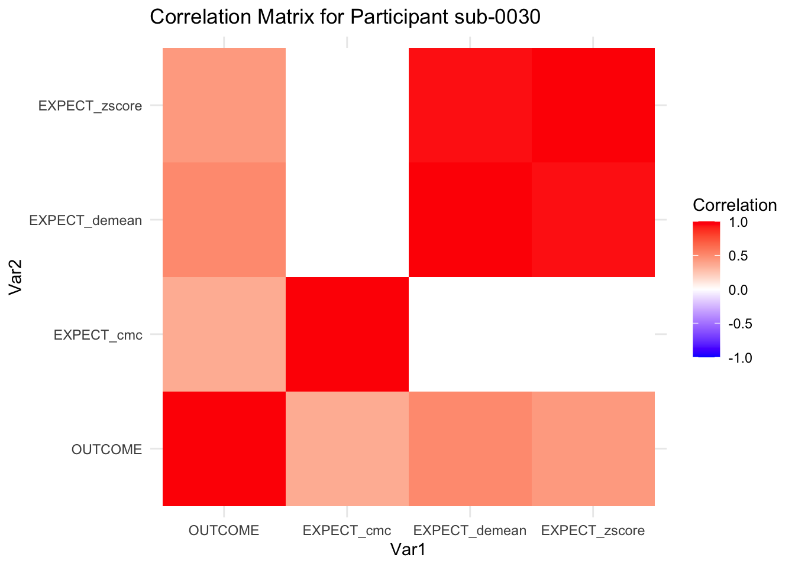
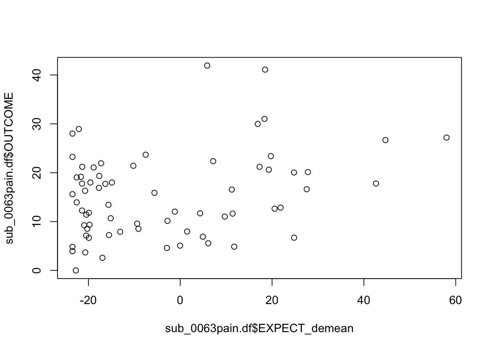
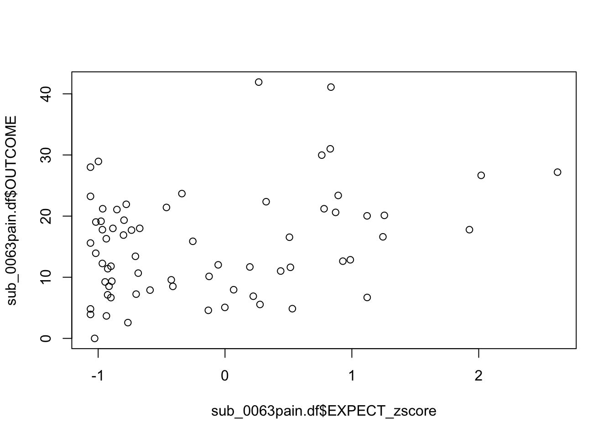
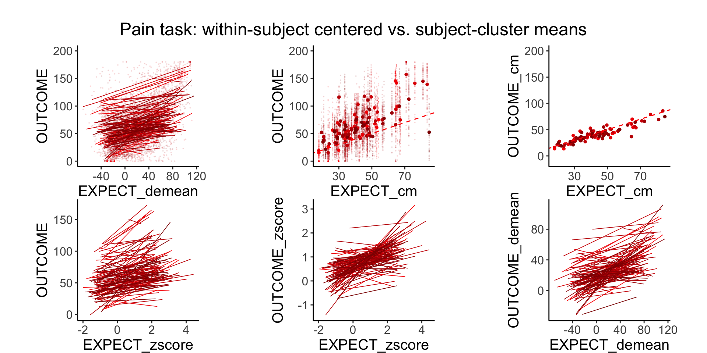
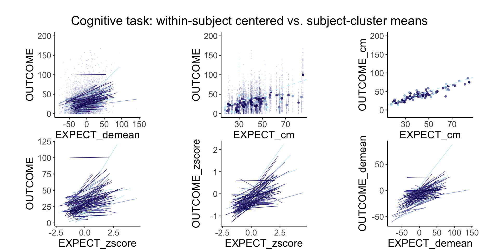
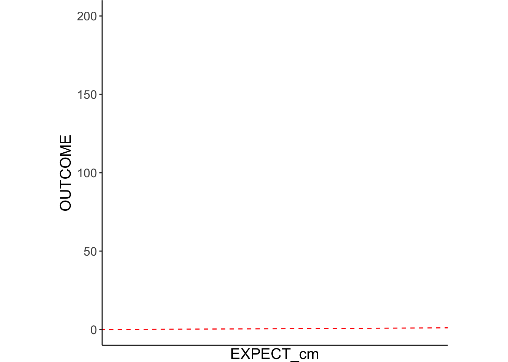
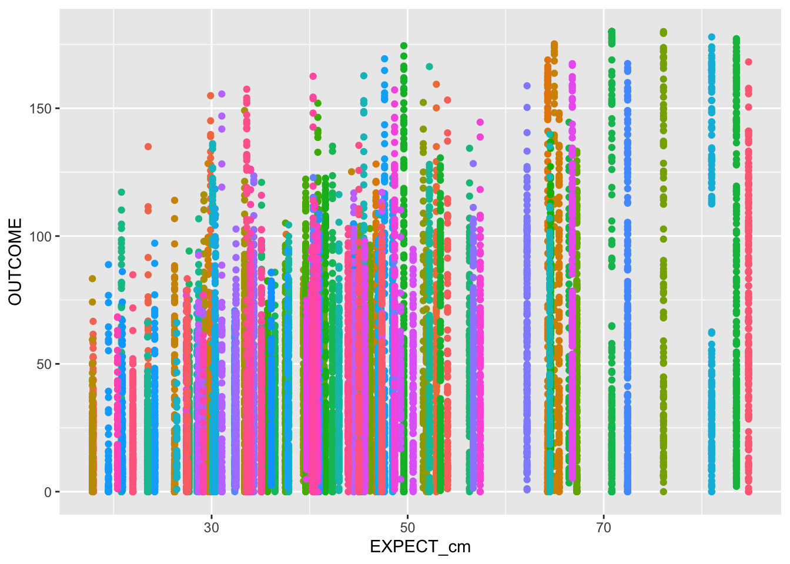
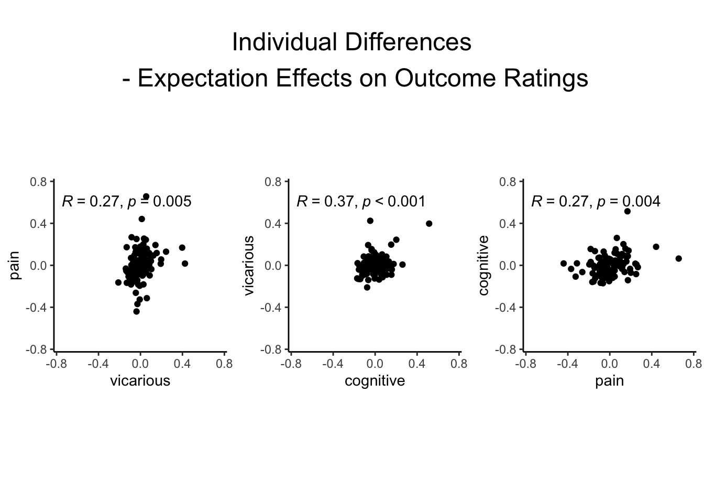

# within / between subject effect and Scaling {#scaling}

## What is the purpose of this notebook? {.unlisted .unnumbered}

> Here, we want to examine the between and within subject effects of subjective ratings. 
There are scale usage differences across individuals. It's evident in our behavioral data. 
These scale usage differences do not really reflecting the underlying experience, but compresses the scale.
This is one of the reasons why including the between-subject term improves the performance of the mediation model. 
It's also in line with Enders and Tofighi's illustration of centering in multilevel models. 
\n
The logic is that there are multiple components that go into subjective ratings
the way that an individual uses a scale ("between-subject effect")
and the fact that the rating does reflect the subjective experience ("within-subject effect")
We want to rid of the between subject effect and focus on the subjective experience. 
\n
One way to resolve this is by z-scoring.
\n
Hypothesis: After z-scoring, if we see a high correlation across tasks in terms of their cue effects, then we can safely conclude that the way that people think of expectations are highly domain general
\n
The cue effect from raw scores can be conflated with scale artifact and also common domain general expectation mechanisms.
Q. what about task-specific components?
\n
Some thoughts:
* if scaling artifact is a big driving factor, that pain to brain is going to lead to a weak signal.
* within person pain effects. only weakly tracks individual differences.
/n
* Main model: `lmer( OUTCOME ~ EXPECT)` vs. `lmer( OUTCOME ~ zscoreEXPECT)`
* Main question: Does Z-scoring lead to an improvement in predicting pain? Does the effect shrink, indicating that most pain ratings are a byproduct of participants using the scale differently? 
* {{ HYPOTHESES/EXPECTED OUTCOME }}
* If slopes increase after z-scoring, effects
* IV: 
  - {{ Zscore }} ( {{ LEVELS}} )
* DV: {{ Outcome }}


---
title: "Your Document Title"
author: "Your Name"
output: 
  bookdown::html_document2:
    toc: true
    toc_depth: 2
    number_sections: true
    theme: united
---


::::{.refbox}
* [Enders, C. K., & Tofighi, D. (2007). Centering predictor variables in cross-sectional multilevel models: A new look at an old issue. Psychological Methods, 12(2), 121–138.](https://doi.org/10.1037/1082-989X.12.2.121)
* https://philippmasur.de/2018/05/23/how-to-center-in-multilevel-models/
* displaying lmer in html tables: https://strengejacke.github.io/sjPlot/articles/tab_mixed.html
::::


## TODO: 
```
- [x] zscore the ratings (ignore sessions)
- [x] predict outcome ratings
- [x] model compare zscore vs just raw score
- [x] include between subject level scores as covariates. AS ALWAYS
- [ ]identify why model doesn't converge for OUTCOME ~ EXPECT + (EXPECT|SUB)
It might be the zero ratings 
- [ ] Drop trials with ratings of 0. 
- [ ] raw cue effect, raw stim effect, raw cue/stimeffect, raw cue/stim + 1 effect
```

### load libraries {.unlisted .unnumbered}


## computed_enderstofighi

```r
compute_enderstofighi <- function(data, sub, outcome, expect, ses, run) {
  maindata <- data %>%
    group_by(!!sym(sub)) %>%
    mutate(OUTCOME = as.numeric(!!sym(outcome))) %>%
    mutate(EXPECT = as.numeric(!!sym(expect))) %>%
    mutate(OUTCOME_cm = mean(OUTCOME, na.rm = TRUE)) %>%
    mutate(OUTCOME_demean = OUTCOME - OUTCOME_cm) %>%
    mutate(EXPECT_cm = mean(EXPECT, na.rm = TRUE)) %>%
    mutate(EXPECT_demean = EXPECT - EXPECT_cm) %>%
    #mutate(OUTCOME_zscore = as.numeric(scale(OUTCOME, center = TRUE, scale = TRUE)[, 1])) %>%
    #mutate(EXPECT_zscore = as.numeric(scale(EXPECT, center = TRUE, scale = TRUE)[, 1])) 
    mutate(OUTCOME_zscore = (OUTCOME - mean(OUTCOME, na.rm = TRUE))/sd(OUTCOME, na.rm = TRUE)) %>% #as.numeric(scale(OUTCOME, center = TRUE, scale = TRUE)[, 1])) %>%
    mutate(EXPECT_zscore = (EXPECT - mean(EXPECT, na.rm = TRUE))/sd(EXPECT, na.rm = TRUE)) #as.numeric(scale(EXPECT, center = TRUE, scale = TRUE)[, 1])) 
  
  data_p2 <- maindata %>%
    arrange(!!sym(sub)) %>%
    group_by(!!sym(sub)) %>%
    mutate(trial_index = row_number())
  
  data_a3 <- data_p2 %>%
    group_by(!!sym(sub), !!sym(ses), !!sym(run)) %>%
    mutate(trial_index = row_number(!!sym(run)))
  
  data_a3lag <- data_a3 %>%
    group_by(!!sym(sub), !!sym(ses), !!sym(run)) %>%
    mutate(lag.OUTCOME_demean = dplyr::lag(OUTCOME_demean, n = 1, default = NA))
  
  # Create Subjectwise Mean, centered in relation to the group mean
  data_a3cmc <- data_a3lag %>%
    ungroup %>%
    mutate(EXPECT_cmc = EXPECT_cm - mean(EXPECT_cm, na.rm=TRUE)) %>%
    mutate(OUTCOME_cmc = OUTCOME_cm - mean(OUTCOME_cm, na.rm=TRUE))
  
  
  # Remove NA values ___________________________________________________________
  data_centered_NA <- data_a3cmc %>% 
    filter(!is.na(OUTCOME)) %>% # Remove NA values
    filter(!is.na(EXPECT))

  return(data_centered_NA)
  
}
```


## Analysis 1: Pain display distribution of data
Let's look at the distribution of the data. X axis: Y axis: 
Here's the loaded dataset, filtered if Outcome Ratings have NA

```r
# remove NA values first
df.centered_NA <- data_centered %>% filter(!is.na(OUTCOME))  # Remove NA values
head(df.centered_NA)
```

```
## # A tibble: 6 × 75
##   src_subject_id session_id param_task_name param_run_num param_counterbalance…¹
##            <int>      <int> <chr>                   <int>                  <int>
## 1              2          1 pain                        1                      3
## 2              2          1 pain                        1                      3
## 3              2          1 pain                        1                      3
## 4              2          1 pain                        1                      3
## 5              2          1 pain                        1                      3
## 6              2          1 pain                        1                      3
## # ℹ abbreviated name: ¹​param_counterbalance_ver
## # ℹ 70 more variables: param_counterbalance_block_num <int>,
## #   param_cue_type <chr>, param_stimulus_type <chr>, param_cond_type <int>,
## #   param_trigger_onset <dbl>, param_start_biopac <dbl>, ITI_onset <dbl>,
## #   ITI_biopac <dbl>, ITI_duration <dbl>, event01_cue_onset <dbl>,
## #   event01_cue_biopac <dbl>, event01_cue_type <chr>,
## #   event01_cue_filename <chr>, ISI01_onset <dbl>, ISI01_biopac <dbl>, …
```


### Plot Outcome rating distribution
Ratings are sorted based on Median values of Outcome rating


### Identify subjects with narrow IQR
I plan to use this to filter out participants

```r
library(dplyr)

# Assuming df.centered_NA is your dataframe and it's already loaded

# Task 1: Top and Bottom 5% Subjects
sorted_data <- df.centered_NA %>%
  group_by(subject) %>%
  summarize(median_outcome = median(OUTCOME, na.rm = TRUE)) %>%
  arrange(median_outcome)

num_subjects <- nrow(sorted_data)
top_bottom_count <- ceiling(num_subjects * 0.05)

top_5_percent_subjects <- head(sorted_data, top_bottom_count)$subject
bottom_5_percent_subjects <- tail(sorted_data, top_bottom_count)$subject

# Task 2: Narrow IQR Subjects
iqr_data <- df.centered_NA %>%
  group_by(subject) %>%
  summarize(IQR = IQR(OUTCOME, na.rm = TRUE)) %>%
  arrange(IQR)

# Output the subjects
cat("Top 5% Subjects based on Median Outcome:\n", toString(as.character(top_5_percent_subjects)), "\n")
```

```
## Top 5% Subjects based on Median Outcome:
##  3, 4, 5, 60, 130, 19
```

```r
cat("Bottom 5% Subjects based on Median Outcome:\n", toString(as.character(bottom_5_percent_subjects)), "\n")
```

```
## Bottom 5% Subjects based on Median Outcome:
##  74, 46, 32, 15, 9, 50
```

```r
# If you want to see the subjects with the narrowest IQRs
# cat("Subjects with the Narrowest IQRs:\n", head(iqr_data)$subject, "\n")
cat("Subjects with the Narrowest IQRs:\n", toString(as.character(head(iqr_data)$subject)), "\n")
```

```
## Subjects with the Narrowest IQRs:
##  117, 85, 66, 29, 63, 123
```

```r
narrowest_iqr_string <- paste0('"', as.character(head(iqr_data)$subject), '"', collapse = ", ")
cat("Subjects with the Narrowest IQRs:\n", narrowest_iqr_string, "\n")
```

```
## Subjects with the Narrowest IQRs:
##  "117", "85", "66", "29", "63", "123"
```

```r
# head(iqr_data)$subject

# Create filter string based on narrow variability
subject_ids <- as.character(head(iqr_data)$subject)
formatted_subjects <- paste0("sub-", sprintf("%04d", as.numeric(subject_ids)))
filter_string <- paste(formatted_subjects, collapse = "|")
filter_string <- paste0("sub-0001|", filter_string)
# Output the filter string
cat("Filter String: ", filter_string, "\n")
```

```
## Filter String:  sub-0001|sub-0117|sub-0085|sub-0066|sub-0029|sub-0063|sub-0123
```

## Analysis 2: Z score vs. not model comparison
### lmer model compare z score vs nonzscore {-}

Q. how do the coefficients change as a function of Z scoring vs not? 

```r
model.z <- lmer(OUTCOME ~ EXPECT_zscore + (EXPECT_zscore|subject), df.centered_NA)
model.nonz <- lmer(OUTCOME ~ EXPECT + (EXPECT|subject), df.centered_NA)
```

```
## Warning in checkConv(attr(opt, "derivs"), opt$par, ctrl = control$checkConv, :
## Model failed to converge with max|grad| = 4.21058 (tol = 0.002, component 1)
```

```
## Warning in checkConv(attr(opt, "derivs"), opt$par, ctrl = control$checkConv, : Model is nearly unidentifiable: very large eigenvalue
##  - Rescale variables?
```

```r
model.cmc <- lmer(OUTCOME ~ EXPECT_demean + EXPECT_cmc + (1|subject), df.centered_NA)

print_dash("model with Z scores")
```

```
## 
## 
## ----------------------------------------
## model with Z scores
## ----------------------------------------
```

```r
summary(model.z)
```

```
## Linear mixed model fit by REML. t-tests use Satterthwaite's method [
## lmerModLmerTest]
## Formula: OUTCOME ~ EXPECT_zscore + (EXPECT_zscore | subject)
##    Data: df.centered_NA
## 
## REML criterion at convergence: 53494.5
## 
## Scaled residuals: 
##     Min      1Q  Median      3Q     Max 
## -4.5605 -0.5920  0.0064  0.5904  4.3988 
## 
## Random effects:
##  Groups   Name          Variance Std.Dev. Corr
##  subject  (Intercept)   877.15   29.62        
##           EXPECT_zscore  48.44    6.96    0.16
##  Residual               507.09   22.52        
## Number of obs: 5825, groups:  subject, 114
## 
## Fixed effects:
##               Estimate Std. Error       df t value Pr(>|t|)    
## (Intercept)    64.4462     2.7981 113.2011  23.032   <2e-16 ***
## EXPECT_zscore   7.1939     0.7309 115.3281   9.842   <2e-16 ***
## ---
## Signif. codes:  0 '***' 0.001 '**' 0.01 '*' 0.05 '.' 0.1 ' ' 1
## 
## Correlation of Fixed Effects:
##             (Intr)
## EXPECT_zscr 0.142
```

```r
print_dash("model with raw scores, i.e. non Zscores")
```

```
## 
## 
## ----------------------------------------
## model with raw scores, i.e. non Zscores
## ----------------------------------------
```

```r
summary(model.nonz)
```

```
## Linear mixed model fit by REML. t-tests use Satterthwaite's method [
## lmerModLmerTest]
## Formula: OUTCOME ~ EXPECT + (EXPECT | subject)
##    Data: df.centered_NA
## 
## REML criterion at convergence: 53378.1
## 
## Scaled residuals: 
##     Min      1Q  Median      3Q     Max 
## -4.5878 -0.5923  0.0121  0.5977  4.4260 
## 
## Random effects:
##  Groups   Name        Variance  Std.Dev. Corr 
##  subject  (Intercept) 869.44478 29.4863       
##           EXPECT        0.03975  0.1994  -0.58
##  Residual             503.76679 22.4447       
## Number of obs: 5825, groups:  subject, 114
## 
## Fixed effects:
##             Estimate Std. Error       df t value Pr(>|t|)    
## (Intercept) 47.20152    2.89746 56.84800   16.29   <2e-16 ***
## EXPECT       0.28268    0.02266 87.47735   12.47   <2e-16 ***
## ---
## Signif. codes:  0 '***' 0.001 '**' 0.01 '*' 0.05 '.' 0.1 ' ' 1
## 
## Correlation of Fixed Effects:
##        (Intr)
## EXPECT -0.597
## optimizer (nloptwrap) convergence code: 0 (OK)
## Model failed to converge with max|grad| = 4.21058 (tol = 0.002, component 1)
## Model is nearly unidentifiable: very large eigenvalue
##  - Rescale variables?
```

```r
print_dash("model with raw scores CMC and CWC")
```

```
## 
## 
## ----------------------------------------
## model with raw scores CMC and CWC
## ----------------------------------------
```

```r
summary(model.cmc)
```

```
## Linear mixed model fit by REML. t-tests use Satterthwaite's method [
## lmerModLmerTest]
## Formula: OUTCOME ~ EXPECT_demean + EXPECT_cmc + (1 | subject)
##    Data: df.centered_NA
## 
## REML criterion at convergence: 53537.7
## 
## Scaled residuals: 
##     Min      1Q  Median      3Q     Max 
## -4.3594 -0.6055  0.0008  0.6163  4.8740 
## 
## Random effects:
##  Groups   Name        Variance Std.Dev.
##  subject  (Intercept) 159.3    12.62   
##  Residual             544.4    23.33   
## Number of obs: 5825, groups:  subject, 114
## 
## Fixed effects:
##                Estimate Std. Error        df t value Pr(>|t|)    
## (Intercept)   6.474e+01  1.234e+00 1.114e+02   52.48   <2e-16 ***
## EXPECT_demean 2.964e-01  1.072e-02 5.712e+03   27.64   <2e-16 ***
## EXPECT_cmc    9.203e-01  4.250e-02 1.109e+02   21.65   <2e-16 ***
## ---
## Signif. codes:  0 '***' 0.001 '**' 0.01 '*' 0.05 '.' 0.1 ' ' 1
## 
## Correlation of Fixed Effects:
##             (Intr) EXPECT_d
## EXPECT_demn -0.001         
## EXPECT_cmc   0.007  0.001
```

```r
print_dash("model comparison")
```

```
## 
## 
## ----------------------------------------
## model comparison
## ----------------------------------------
```

```r
anova(model.z, model.nonz)
```

```
## refitting model(s) with ML (instead of REML)
```

```
## Data: df.centered_NA
## Models:
## model.z: OUTCOME ~ EXPECT_zscore + (EXPECT_zscore | subject)
## model.nonz: OUTCOME ~ EXPECT + (EXPECT | subject)
##            npar   AIC   BIC logLik deviance  Chisq Df Pr(>Chisq)
## model.z       6 53512 53552 -26750    53500                     
## model.nonz    6 53380 53420 -26684    53368 131.43  0
```


### plot :: subjectwise slopes of Zscore and nonZscore
TODO: change color scheme and increase figure size


## Analysis 3: across PVC, Are these expectation effects domain-general or domain-specific?
### load entire data of pain,vicarious,cognitive {.unlisted .unnumbered}


##  Validate: correlation matrix across centered variables

::::{.todolist}The zscores do not seem to be scaled within participant. 
Let's check what's going on.
The mean value should be 0 for all participants
::::


```r
library(dplyr)
head(df.PVC_center)
```

```
## # A tibble: 6 × 33
##   src_subject_id session_id param_run_num param_task_name event02_expect_angle
##            <int>      <int>         <int> <chr>                          <dbl>
## 1              2          1             1 pain                            5.53
## 2              2          1             1 pain                           18.9 
## 3              2          1             1 pain                          103.  
## 4              2          1             1 pain                           81.2 
## 5              2          1             1 pain                           97.2 
## 6              2          1             1 pain                          117.  
## # ℹ 28 more variables: param_cue_type <chr>, param_stimulus_type <chr>,
## #   event04_actual_angle <dbl>, trial_index <int>, trial_count_sub <int>,
## #   trial_ind <dbl>, sub <chr>, ses <chr>, run <chr>, runtype <chr>,
## #   task <chr>, trial_sub <int>, trial <chr>, cuetype <chr>,
## #   stimintensity <chr>, DEPc <chr>, DEP <chr>, OUTCOME <dbl>, EXPECT <dbl>,
## #   OUTCOME_cm <dbl>, OUTCOME_demean <dbl>, EXPECT_cm <dbl>,
## #   EXPECT_demean <dbl>, OUTCOME_zscore <dbl>, EXPECT_zscore <dbl>, …
```

```r
# Assuming df is your dataframe, and 'participant', 'col1', 'col2', 'col3' are your column names
df.PVC_center$subject <- factor(df.PVC_center$sub)
df.PVC_center$OUTCOME <- as.numeric(df.PVC_center$OUTCOME)
df.PVC_center$EXPECT_cmc <- as.numeric(df.PVC_center$EXPECT_cmc)
df.PVC_center$EXPECT_demean <- as.numeric(df.PVC_center$EXPECT_demean)
correlation_matrix_per_participant <- df.PVC_center %>%
  group_by(sub) %>%
  summarize(
    cor_matrix = list(cor(.[, c("OUTCOME", "EXPECT_cmc", "EXPECT_demean", "EXPECT_zscore")], 
                        use = "complete.obs"))
  )
# To view the correlation matrix for the first participant
# correlation_matrix_per_participant$cor_matrix[[1]]

# plot correlatin matrix _______________________________________________________
library(ggplot2)
library(reshape2)
library(dplyr)

# Assuming correlation_matrix_per_participant is the result from the previous step
for(i in 1:nrow(correlation_matrix_per_participant)) {
  participant_id <- correlation_matrix_per_participant$sub[i]
  cor_matrix <- correlation_matrix_per_participant$cor_matrix[[i]]

  # Convert the correlation matrix to long format
  long_cor_matrix <- melt(cor_matrix)
  names(long_cor_matrix) <- c("Var1", "Var2", "value")

  # Plotting
  p <- ggplot(long_cor_matrix, aes(Var1, Var2, fill = value)) +
    geom_tile() +
    scale_fill_gradient2(low = "blue", high = "red", mid = "white", 
                         midpoint = 0, limit = c(-1, 1), space = "Lab", 
                         name="Correlation") +
    theme_minimal() +
    ggtitle(paste("Correlation Matrix for Participant", participant_id))

  print(p)
}
```




### plot per participant. Outcome, Expect, demean

```r
pain.df <- df.PVC_center[df.PVC_center$runtype == "runtype-pain", ]
sub_0063pain.df <- pain.df[pain.df$sub == "sub-0060",]
head(sub_0063pain.df)
```

```
## # A tibble: 6 × 34
##   src_subject_id session_id param_run_num param_task_name event02_expect_angle
##            <int>      <int>         <int> <chr>                          <dbl>
## 1             60          1             1 pain                             0  
## 2             60          1             1 pain                            51.0
## 3             60          1             1 pain                            45.3
## 4             60          1             1 pain                            28.4
## 5             60          1             1 pain                            66.1
## 6             60          1             1 pain                             0  
## # ℹ 29 more variables: param_cue_type <chr>, param_stimulus_type <chr>,
## #   event04_actual_angle <dbl>, trial_index <int>, trial_count_sub <int>,
## #   trial_ind <dbl>, sub <chr>, ses <chr>, run <chr>, runtype <chr>,
## #   task <chr>, trial_sub <int>, trial <chr>, cuetype <chr>,
## #   stimintensity <chr>, DEPc <chr>, DEP <chr>, OUTCOME <dbl>, EXPECT <dbl>,
## #   OUTCOME_cm <dbl>, OUTCOME_demean <dbl>, EXPECT_cm <dbl>,
## #   EXPECT_demean <dbl>, OUTCOME_zscore <dbl>, EXPECT_zscore <dbl>, …
```

```r
# hist(sub_0063pain.df$EXPECT)
# hist(sub_0063pain.df$EXPECT_zscore)
# hist(sub_0063pain.df$EXPECT_cm)
# hist(sub_0063pain.df$EXPECT_demean)

plot(sub_0063pain.df$EXPECT_demean, sub_0063pain.df$OUTCOME)
```



```r
plot(sub_0063pain.df$EXPECT_zscore, sub_0063pain.df$OUTCOME)
```



```r
r <- ggplot(sub_0063pain.df, aes(x = EXPECT)) + 
  geom_histogram(bins = 30, fill = "blue", alpha = 0.7) +
  labs(title = "Histogram of Variable", x = "Expect (Raw)", y = "Outcome")+
  theme_classic()

z <- ggplot(sub_0063pain.df, aes(x = EXPECT_zscore)) + 
  geom_histogram(bins = 30, fill = "blue", alpha = 0.7) +
  labs(title = "Histogram of Variable", x = "Expect (Z)", y = "Outcome")+
  theme_classic()

cmc <- ggplot(sub_0063pain.df, aes(x = EXPECT_cm)) + 
  geom_histogram(bins = 30, fill = "blue", alpha = 0.7) +
  labs(title = "Histogram of Variable", x = "Expect (CMC)", y = "Outcome") +
  theme_classic()
arranged_plots <- (ggpubr::ggarrange(
        r, z, cmc,
        common.legend = FALSE,
        legend = "none",
        ncol = 3,
        nrow = 1,
        widths = c(1,1,1),
        heights = c(1),
        align = "v"
      ))
grid.draw(arranged_plots)
```


## Analysis 3


### lmer model compare z score vs nonzscore

```r
pain.df <- df.PVC_center[df.PVC_center$runtype == "runtype-pain", ]
vic.df <- df.PVC_center[df.PVC_center$runtype == "runtype-vicarious", ]
cog.df <- df.PVC_center[df.PVC_center$runtype == "runtype-cognitive", ]
model.pain_z <- lmer(OUTCOME ~ EXPECT_zscore + (EXPECT_zscore|sub), pain.df)
model.vic_z <- lmer(OUTCOME ~ EXPECT_zscore + (EXPECT_zscore|sub), vic.df)
model.cog_z <- lmer(OUTCOME ~ EXPECT_zscore + (EXPECT_zscore|sub), cog.df)
model.pain_raw <- lmer(OUTCOME ~ EXPECT + (EXPECT|sub), pain.df)
```

```
## Warning in checkConv(attr(opt, "derivs"), opt$par, ctrl = control$checkConv, :
## Model failed to converge with max|grad| = 5.82673 (tol = 0.002, component 1)
```

```
## Warning in checkConv(attr(opt, "derivs"), opt$par, ctrl = control$checkConv, : Model is nearly unidentifiable: very large eigenvalue
##  - Rescale variables?
```

```r
model.vic_raw <- lmer(OUTCOME ~ EXPECT + (EXPECT|sub),  vic.df)
```

```
## Warning in checkConv(attr(opt, "derivs"), opt$par, ctrl = control$checkConv, : Model failed to converge with max|grad| = 0.0529862 (tol = 0.002, component 1)

## Warning in checkConv(attr(opt, "derivs"), opt$par, ctrl = control$checkConv, : Model is nearly unidentifiable: very large eigenvalue
##  - Rescale variables?
```

```r
model.cog_raw <- lmer(OUTCOME ~ EXPECT + (EXPECT|sub), cog.df)
```

```
## Warning in checkConv(attr(opt, "derivs"), opt$par, ctrl = control$checkConv, : Model failed to converge with max|grad| = 2.36973 (tol = 0.002, component 1)

## Warning in checkConv(attr(opt, "derivs"), opt$par, ctrl = control$checkConv, : Model is nearly unidentifiable: very large eigenvalue
##  - Rescale variables?
```

```r
model.pain_cmc <- lmer(OUTCOME ~ EXPECT_demean + EXPECT_cmc + (1|sub), pain.df)
model.vic_cmc <- lmer(OUTCOME ~ EXPECT_demean + EXPECT_cmc + (1|sub),  vic.df)
model.cog_cmc <- lmer(OUTCOME ~ EXPECT_demean + EXPECT_cmc + (1|sub), cog.df)


model.pain_z <- lmer(OUTCOME ~ EXPECT_zscore + (EXPECT_zscore|sub), pain.df)
model.pain_bothz <- lmer(OUTCOME_zscore ~ EXPECT_zscore + (EXPECT_zscore|sub), pain.df)
model.pain_bothCM <- lmer(OUTCOME_demean ~ EXPECT_demean + (EXPECT_demean|sub), pain.df)
```

```
## Warning in checkConv(attr(opt, "derivs"), opt$par, ctrl = control$checkConv, : Model failed to converge with max|grad| = 0.0126555 (tol = 0.002, component 1)

## Warning in checkConv(attr(opt, "derivs"), opt$par, ctrl = control$checkConv, : Model is nearly unidentifiable: very large eigenvalue
##  - Rescale variables?
```

```r
model.pain_CM <- lmer(OUTCOME ~ EXPECT_demean + (EXPECT_demean|sub), pain.df)
```

```
## Warning in checkConv(attr(opt, "derivs"), opt$par, ctrl = control$checkConv, : Model failed to converge with max|grad| = 0.161577 (tol = 0.002, component 1)

## Warning in checkConv(attr(opt, "derivs"), opt$par, ctrl = control$checkConv, : Model is nearly unidentifiable: very large eigenvalue
##  - Rescale variables?
```

```r
print_dash("model with Z scores :: Pain")
```

```
## 
## 
## ----------------------------------------
## model with Z scores :: Pain
## ----------------------------------------
```

```r
summary(model.pain_z)
```

```
## Linear mixed model fit by REML. t-tests use Satterthwaite's method [
## lmerModLmerTest]
## Formula: OUTCOME ~ EXPECT_zscore + (EXPECT_zscore | sub)
##    Data: pain.df
## 
## REML criterion at convergence: 52401.2
## 
## Scaled residuals: 
##     Min      1Q  Median      3Q     Max 
## -4.5165 -0.5939  0.0074  0.6040  4.3649 
## 
## Random effects:
##  Groups   Name          Variance Std.Dev. Corr
##  sub      (Intercept)   636.60   25.231       
##           EXPECT_zscore  45.32    6.732   0.25
##  Residual               516.89   22.735       
## Number of obs: 5701, groups:  sub, 108
## 
## Fixed effects:
##               Estimate Std. Error       df t value Pr(>|t|)    
## (Intercept)    60.2351     2.4643 103.9474   24.44   <2e-16 ***
## EXPECT_zscore   8.1635     0.7389 102.9673   11.05   <2e-16 ***
## ---
## Signif. codes:  0 '***' 0.001 '**' 0.01 '*' 0.05 '.' 0.1 ' ' 1
## 
## Correlation of Fixed Effects:
##             (Intr)
## EXPECT_zscr 0.169
```

```r
print_dash("model with Z scores :: Vicarious")
```

```
## 
## 
## ----------------------------------------
## model with Z scores :: Vicarious
## ----------------------------------------
```

```r
summary(model.vic_z)
```

```
## Linear mixed model fit by REML. t-tests use Satterthwaite's method [
## lmerModLmerTest]
## Formula: OUTCOME ~ EXPECT_zscore + (EXPECT_zscore | sub)
##    Data: vic.df
## 
## REML criterion at convergence: 55765.7
## 
## Scaled residuals: 
##     Min      1Q  Median      3Q     Max 
## -3.0181 -0.6539 -0.2608  0.4712  5.1554 
## 
## Random effects:
##  Groups   Name          Variance Std.Dev. Corr
##  sub      (Intercept)   128.10   11.32        
##           EXPECT_zscore  20.16    4.49    0.56
##  Residual               581.72   24.12        
## Number of obs: 6023, groups:  sub, 109
## 
## Fixed effects:
##               Estimate Std. Error      df t value Pr(>|t|)    
## (Intercept)     28.910      1.148 110.354   25.19   <2e-16 ***
## EXPECT_zscore    5.741      0.593 113.213    9.68   <2e-16 ***
## ---
## Signif. codes:  0 '***' 0.001 '**' 0.01 '*' 0.05 '.' 0.1 ' ' 1
## 
## Correlation of Fixed Effects:
##             (Intr)
## EXPECT_zscr 0.483
```

```r
print_dash("model with Z scores :: Cognitive")
```

```
## 
## 
## ----------------------------------------
## model with Z scores :: Cognitive
## ----------------------------------------
```

```r
summary(model.cog_z)
```

```
## Linear mixed model fit by REML. t-tests use Satterthwaite's method [
## lmerModLmerTest]
## Formula: OUTCOME ~ EXPECT_zscore + (EXPECT_zscore | sub)
##    Data: cog.df
## 
## REML criterion at convergence: 52720.9
## 
## Scaled residuals: 
##     Min      1Q  Median      3Q     Max 
## -4.0458 -0.6033 -0.1539  0.4586  6.6938 
## 
## Random effects:
##  Groups   Name          Variance Std.Dev. Corr
##  sub      (Intercept)   163.82   12.799       
##           EXPECT_zscore  23.29    4.825   0.38
##  Residual               367.83   19.179       
## Number of obs: 5977, groups:  sub, 109
## 
## Fixed effects:
##               Estimate Std. Error       df t value Pr(>|t|)    
## (Intercept)    30.4662     1.2622 108.1152   24.14   <2e-16 ***
## EXPECT_zscore   7.1026     0.5792 108.5177   12.26   <2e-16 ***
## ---
## Signif. codes:  0 '***' 0.001 '**' 0.01 '*' 0.05 '.' 0.1 ' ' 1
## 
## Correlation of Fixed Effects:
##             (Intr)
## EXPECT_zscr 0.345
```

```r
print_dash("model with raw scores, i.e. non Zscores :: Pain")
```

```
## 
## 
## ----------------------------------------
## model with raw scores, i.e. non Zscores :: Pain
## ----------------------------------------
```

```r
summary(model.pain_raw)
```

```
## Linear mixed model fit by REML. t-tests use Satterthwaite's method [
## lmerModLmerTest]
## Formula: OUTCOME ~ EXPECT + (EXPECT | sub)
##    Data: pain.df
## 
## REML criterion at convergence: 52342.5
## 
## Scaled residuals: 
##     Min      1Q  Median      3Q     Max 
## -4.5451 -0.5990  0.0130  0.6041  4.3842 
## 
## Random effects:
##  Groups   Name        Variance Std.Dev. Corr 
##  sub      (Intercept) 885.9061 29.7642       
##           EXPECT        0.0407  0.2017  -0.58
##  Residual             513.2390 22.6548       
## Number of obs: 5701, groups:  sub, 108
## 
## Fixed effects:
##             Estimate Std. Error      df t value Pr(>|t|)    
## (Intercept)  48.2011     2.9898 50.6459   16.12   <2e-16 ***
## EXPECT        0.2798     0.0231 81.9412   12.12   <2e-16 ***
## ---
## Signif. codes:  0 '***' 0.001 '**' 0.01 '*' 0.05 '.' 0.1 ' ' 1
## 
## Correlation of Fixed Effects:
##        (Intr)
## EXPECT -0.601
## optimizer (nloptwrap) convergence code: 0 (OK)
## Model failed to converge with max|grad| = 5.82673 (tol = 0.002, component 1)
## Model is nearly unidentifiable: very large eigenvalue
##  - Rescale variables?
```

```r
print_dash("model with raw scores, i.e. non Zscores :: Vicarious")
```

```
## 
## 
## ----------------------------------------
## model with raw scores, i.e. non Zscores :: Vicarious
## ----------------------------------------
```

```r
summary(model.vic_raw)
```

```
## Linear mixed model fit by REML. t-tests use Satterthwaite's method [
## lmerModLmerTest]
## Formula: OUTCOME ~ EXPECT + (EXPECT | sub)
##    Data: vic.df
## 
## REML criterion at convergence: 55709.4
## 
## Scaled residuals: 
##     Min      1Q  Median      3Q     Max 
## -3.0287 -0.6525 -0.2573  0.4708  5.1655 
## 
## Random effects:
##  Groups   Name        Variance Std.Dev. Corr 
##  sub      (Intercept)  61.4815  7.8410       
##           EXPECT        0.0205  0.1432  -0.30
##  Residual             581.2022 24.1081       
## Number of obs: 6023, groups:  sub, 109
## 
## Fixed effects:
##              Estimate Std. Error        df t value Pr(>|t|)    
## (Intercept)  19.85080    0.92571 104.49803   21.44   <2e-16 ***
## EXPECT        0.21925    0.01981 119.99847   11.06   <2e-16 ***
## ---
## Signif. codes:  0 '***' 0.001 '**' 0.01 '*' 0.05 '.' 0.1 ' ' 1
## 
## Correlation of Fixed Effects:
##        (Intr)
## EXPECT -0.492
## optimizer (nloptwrap) convergence code: 0 (OK)
## Model failed to converge with max|grad| = 0.0529862 (tol = 0.002, component 1)
## Model is nearly unidentifiable: very large eigenvalue
##  - Rescale variables?
```

```r
print_dash("model with raw scores, i.e. non Zscores :: Cognitive")
```

```
## 
## 
## ----------------------------------------
## model with raw scores, i.e. non Zscores :: Cognitive
## ----------------------------------------
```

```r
summary(model.cog_raw)
```

```
## Linear mixed model fit by REML. t-tests use Satterthwaite's method [
## lmerModLmerTest]
## Formula: OUTCOME ~ EXPECT + (EXPECT | sub)
##    Data: cog.df
## 
## REML criterion at convergence: 52652
## 
## Scaled residuals: 
##     Min      1Q  Median      3Q     Max 
## -3.7736 -0.6043 -0.1597  0.4548  6.6799 
## 
## Random effects:
##  Groups   Name        Variance  Std.Dev. Corr 
##  sub      (Intercept)  64.12102  8.0076       
##           EXPECT        0.01698  0.1303  -0.09
##  Residual             369.70089 19.2276       
## Number of obs: 5977, groups:  sub, 109
## 
## Fixed effects:
##              Estimate Std. Error        df t value Pr(>|t|)    
## (Intercept)  19.47584    0.89942 119.72844   21.65   <2e-16 ***
## EXPECT        0.25735    0.01726 121.97945   14.91   <2e-16 ***
## ---
## Signif. codes:  0 '***' 0.001 '**' 0.01 '*' 0.05 '.' 0.1 ' ' 1
## 
## Correlation of Fixed Effects:
##        (Intr)
## EXPECT -0.339
## optimizer (nloptwrap) convergence code: 0 (OK)
## Model failed to converge with max|grad| = 2.36973 (tol = 0.002, component 1)
## Model is nearly unidentifiable: very large eigenvalue
##  - Rescale variables?
```

```r
print_dash("model with raw Pain scores CMC and CWC")
```

```
## 
## 
## ----------------------------------------
## model with raw Pain scores CMC and CWC
## ----------------------------------------
```

```r
# summary(model.pain_cmc)
sjPlot::tab_model(model.pain_cmc, p.val = "kr", show.df = TRUE)
```

<table style="border-collapse:collapse; border:none;">
<tr>
<th style="border-top: double; text-align:center; font-style:normal; font-weight:bold; padding:0.2cm;  text-align:left; ">&nbsp;</th>
<th colspan="4" style="border-top: double; text-align:center; font-style:normal; font-weight:bold; padding:0.2cm; ">OUTCOME</th>
</tr>
<tr>
<td style=" text-align:center; border-bottom:1px solid; font-style:italic; font-weight:normal;  text-align:left; ">Predictors</td>
<td style=" text-align:center; border-bottom:1px solid; font-style:italic; font-weight:normal;  ">Estimates</td>
<td style=" text-align:center; border-bottom:1px solid; font-style:italic; font-weight:normal;  ">CI</td>
<td style=" text-align:center; border-bottom:1px solid; font-style:italic; font-weight:normal;  ">p</td>
<td style=" text-align:center; border-bottom:1px solid; font-style:italic; font-weight:normal;  ">df</td>
</tr>
<tr>
<td style=" padding:0.2cm; text-align:left; vertical-align:top; text-align:left; ">(Intercept)</td>
<td style=" padding:0.2cm; text-align:left; vertical-align:top; text-align:center;  ">59.75</td>
<td style=" padding:0.2cm; text-align:left; vertical-align:top; text-align:center;  ">56.44&nbsp;&ndash;&nbsp;63.05</td>
<td style=" padding:0.2cm; text-align:left; vertical-align:top; text-align:center;  "><strong>&lt;0.001</strong></td>
<td style=" padding:0.2cm; text-align:left; vertical-align:top; text-align:center;  ">109.31</td>
</tr>
<tr>
<td style=" padding:0.2cm; text-align:left; vertical-align:top; text-align:left; ">EXPECT demean</td>
<td style=" padding:0.2cm; text-align:left; vertical-align:top; text-align:center;  ">0.30</td>
<td style=" padding:0.2cm; text-align:left; vertical-align:top; text-align:center;  ">0.28&nbsp;&ndash;&nbsp;0.32</td>
<td style=" padding:0.2cm; text-align:left; vertical-align:top; text-align:center;  "><strong>&lt;0.001</strong></td>
<td style=" padding:0.2cm; text-align:left; vertical-align:top; text-align:center;  ">5664.90</td>
</tr>
<tr>
<td style=" padding:0.2cm; text-align:left; vertical-align:top; text-align:left; ">EXPECT cmc</td>
<td style=" padding:0.2cm; text-align:left; vertical-align:top; text-align:center;  ">1.25</td>
<td style=" padding:0.2cm; text-align:left; vertical-align:top; text-align:center;  ">1.02&nbsp;&ndash;&nbsp;1.47</td>
<td style=" padding:0.2cm; text-align:left; vertical-align:top; text-align:center;  "><strong>&lt;0.001</strong></td>
<td style=" padding:0.2cm; text-align:left; vertical-align:top; text-align:center;  ">106.98</td>
</tr>
<tr>
<td colspan="5" style="font-weight:bold; text-align:left; padding-top:.8em;">Random Effects</td>
</tr>

<tr>
<td style=" padding:0.2cm; text-align:left; vertical-align:top; text-align:left; padding-top:0.1cm; padding-bottom:0.1cm;">&sigma;<sup>2</sup></td>
<td style=" padding:0.2cm; text-align:left; vertical-align:top; padding-top:0.1cm; padding-bottom:0.1cm; text-align:left;" colspan="4">554.94</td>
</tr>

<tr>
<td style=" padding:0.2cm; text-align:left; vertical-align:top; text-align:left; padding-top:0.1cm; padding-bottom:0.1cm;">&tau;<sub>00</sub> <sub>sub</sub></td>
<td style=" padding:0.2cm; text-align:left; vertical-align:top; padding-top:0.1cm; padding-bottom:0.1cm; text-align:left;" colspan="4">283.42</td>

<tr>
<td style=" padding:0.2cm; text-align:left; vertical-align:top; text-align:left; padding-top:0.1cm; padding-bottom:0.1cm;">ICC</td>
<td style=" padding:0.2cm; text-align:left; vertical-align:top; padding-top:0.1cm; padding-bottom:0.1cm; text-align:left;" colspan="4">0.34</td>

<tr>
<td style=" padding:0.2cm; text-align:left; vertical-align:top; text-align:left; padding-top:0.1cm; padding-bottom:0.1cm;">N <sub>sub</sub></td>
<td style=" padding:0.2cm; text-align:left; vertical-align:top; padding-top:0.1cm; padding-bottom:0.1cm; text-align:left;" colspan="4">108</td>
<tr>
<td style=" padding:0.2cm; text-align:left; vertical-align:top; text-align:left; padding-top:0.1cm; padding-bottom:0.1cm; border-top:1px solid;">Observations</td>
<td style=" padding:0.2cm; text-align:left; vertical-align:top; padding-top:0.1cm; padding-bottom:0.1cm; text-align:left; border-top:1px solid;" colspan="4">5701</td>
</tr>
<tr>
<td style=" padding:0.2cm; text-align:left; vertical-align:top; text-align:left; padding-top:0.1cm; padding-bottom:0.1cm;">Marginal R<sup>2</sup> / Conditional R<sup>2</sup></td>
<td style=" padding:0.2cm; text-align:left; vertical-align:top; padding-top:0.1cm; padding-bottom:0.1cm; text-align:left;" colspan="4">0.401 / 0.603</td>
</tr>

</table>

```r
print_dash("model comparison")
```

```
## 
## 
## ----------------------------------------
## model comparison
## ----------------------------------------
```

```r
anova(model.pain_z, model.pain_raw)
```

```
## refitting model(s) with ML (instead of REML)
```

```
## Data: pain.df
## Models:
## model.pain_z: OUTCOME ~ EXPECT_zscore + (EXPECT_zscore | sub)
## model.pain_raw: OUTCOME ~ EXPECT + (EXPECT | sub)
##                npar   AIC   BIC logLik deviance  Chisq Df Pr(>Chisq)
## model.pain_z      6 52418 52458 -26203    52406                     
## model.pain_raw    6 52344 52384 -26166    52332 74.224  0
```

```r
# _______________________________________________________
# # Example using broom to get a tidied summary
# library(broom)
# 
# tidy_model_pain_z <- tidy(model.pain_z)
# tidy_model_vic_z <- tidy(model.vic_z)
# # ... and so on for the other models
# 
# # Combine tidied summaries into one data frame
# all_tidy_effects <- bind_rows(
#   tidy_model_pain_z %>% mutate(model = "Pain Z"),
#   tidy_model_vic_z %>% mutate(model = "Vicarious Z"),
#   # ... and so on for the other models
# )
# 
# # Print the combined tidied model summaries
# print(all_tidy_effects)
```

### check lmer CMC model

```r
sjPlot::tab_model(model.pain_cmc, p.val = "kr", show.df = TRUE)
```

<table style="border-collapse:collapse; border:none;">
<tr>
<th style="border-top: double; text-align:center; font-style:normal; font-weight:bold; padding:0.2cm;  text-align:left; ">&nbsp;</th>
<th colspan="4" style="border-top: double; text-align:center; font-style:normal; font-weight:bold; padding:0.2cm; ">OUTCOME</th>
</tr>
<tr>
<td style=" text-align:center; border-bottom:1px solid; font-style:italic; font-weight:normal;  text-align:left; ">Predictors</td>
<td style=" text-align:center; border-bottom:1px solid; font-style:italic; font-weight:normal;  ">Estimates</td>
<td style=" text-align:center; border-bottom:1px solid; font-style:italic; font-weight:normal;  ">CI</td>
<td style=" text-align:center; border-bottom:1px solid; font-style:italic; font-weight:normal;  ">p</td>
<td style=" text-align:center; border-bottom:1px solid; font-style:italic; font-weight:normal;  ">df</td>
</tr>
<tr>
<td style=" padding:0.2cm; text-align:left; vertical-align:top; text-align:left; ">(Intercept)</td>
<td style=" padding:0.2cm; text-align:left; vertical-align:top; text-align:center;  ">59.75</td>
<td style=" padding:0.2cm; text-align:left; vertical-align:top; text-align:center;  ">56.44&nbsp;&ndash;&nbsp;63.05</td>
<td style=" padding:0.2cm; text-align:left; vertical-align:top; text-align:center;  "><strong>&lt;0.001</strong></td>
<td style=" padding:0.2cm; text-align:left; vertical-align:top; text-align:center;  ">109.31</td>
</tr>
<tr>
<td style=" padding:0.2cm; text-align:left; vertical-align:top; text-align:left; ">EXPECT demean</td>
<td style=" padding:0.2cm; text-align:left; vertical-align:top; text-align:center;  ">0.30</td>
<td style=" padding:0.2cm; text-align:left; vertical-align:top; text-align:center;  ">0.28&nbsp;&ndash;&nbsp;0.32</td>
<td style=" padding:0.2cm; text-align:left; vertical-align:top; text-align:center;  "><strong>&lt;0.001</strong></td>
<td style=" padding:0.2cm; text-align:left; vertical-align:top; text-align:center;  ">5664.90</td>
</tr>
<tr>
<td style=" padding:0.2cm; text-align:left; vertical-align:top; text-align:left; ">EXPECT cmc</td>
<td style=" padding:0.2cm; text-align:left; vertical-align:top; text-align:center;  ">1.25</td>
<td style=" padding:0.2cm; text-align:left; vertical-align:top; text-align:center;  ">1.02&nbsp;&ndash;&nbsp;1.47</td>
<td style=" padding:0.2cm; text-align:left; vertical-align:top; text-align:center;  "><strong>&lt;0.001</strong></td>
<td style=" padding:0.2cm; text-align:left; vertical-align:top; text-align:center;  ">106.98</td>
</tr>
<tr>
<td colspan="5" style="font-weight:bold; text-align:left; padding-top:.8em;">Random Effects</td>
</tr>

<tr>
<td style=" padding:0.2cm; text-align:left; vertical-align:top; text-align:left; padding-top:0.1cm; padding-bottom:0.1cm;">&sigma;<sup>2</sup></td>
<td style=" padding:0.2cm; text-align:left; vertical-align:top; padding-top:0.1cm; padding-bottom:0.1cm; text-align:left;" colspan="4">554.94</td>
</tr>

<tr>
<td style=" padding:0.2cm; text-align:left; vertical-align:top; text-align:left; padding-top:0.1cm; padding-bottom:0.1cm;">&tau;<sub>00</sub> <sub>sub</sub></td>
<td style=" padding:0.2cm; text-align:left; vertical-align:top; padding-top:0.1cm; padding-bottom:0.1cm; text-align:left;" colspan="4">283.42</td>

<tr>
<td style=" padding:0.2cm; text-align:left; vertical-align:top; text-align:left; padding-top:0.1cm; padding-bottom:0.1cm;">ICC</td>
<td style=" padding:0.2cm; text-align:left; vertical-align:top; padding-top:0.1cm; padding-bottom:0.1cm; text-align:left;" colspan="4">0.34</td>

<tr>
<td style=" padding:0.2cm; text-align:left; vertical-align:top; text-align:left; padding-top:0.1cm; padding-bottom:0.1cm;">N <sub>sub</sub></td>
<td style=" padding:0.2cm; text-align:left; vertical-align:top; padding-top:0.1cm; padding-bottom:0.1cm; text-align:left;" colspan="4">108</td>
<tr>
<td style=" padding:0.2cm; text-align:left; vertical-align:top; text-align:left; padding-top:0.1cm; padding-bottom:0.1cm; border-top:1px solid;">Observations</td>
<td style=" padding:0.2cm; text-align:left; vertical-align:top; padding-top:0.1cm; padding-bottom:0.1cm; text-align:left; border-top:1px solid;" colspan="4">5701</td>
</tr>
<tr>
<td style=" padding:0.2cm; text-align:left; vertical-align:top; text-align:left; padding-top:0.1cm; padding-bottom:0.1cm;">Marginal R<sup>2</sup> / Conditional R<sup>2</sup></td>
<td style=" padding:0.2cm; text-align:left; vertical-align:top; padding-top:0.1cm; padding-bottom:0.1cm; text-align:left;" colspan="4">0.401 / 0.603</td>
</tr>

</table>


### lmer combined coefficients into table
Since there are multiple models, I combine the coefficients (within subject expectation effects) into one table


```r
library(DT)
# Print or use kable/DT for a nicer table in R Markdown ________________________
DT::datatable(all_fixed_effects,
                            options = list(
                              pageLength = 25,
                columnDefs = list(
                  list(targets = c(4,5,6),  # Assuming 2nd and 3rd columns are numeric
                       render = JS(
                         "function(data, type, row, meta) {",
                         "return type === 'display' || type === 'filter' ?",
                         "parseFloat(data).toFixed(3) : data;",
                         "}"
                       )
                  )
                )
              ),
             caption = "Summary of Non-Intercept Fixed Effects across Models")
```

```{=html}
<div class="datatables html-widget html-fill-item" id="htmlwidget-e3b51192e91363a12ec0" style="width:100%;height:auto;"></div>
<script type="application/json" data-for="htmlwidget-e3b51192e91363a12ec0">{"x":{"filter":"none","vertical":false,"caption":"<caption>Summary of Non-Intercept Fixed Effects across Models<\/caption>","data":[["1","2","3","4","5","6","7","8","9","10","11","12","13","14","15","16"],["Pain","Vicarious","Cognitive","Pain","Vicarious","Cognitive","Pain","Pain","Vicarious","Vicarious","Cognitive","Cognitive","Pain","Pain","Pain","Pain"],["Pain Outcome ~ ExpectZ","Vicarious Outcome ~ ExpectZ","Cognitive Outcome ~ ExpectZ","Pain Outcome ~ Expect","Vicarious Outcome ~ Expect","Cognitive Outcome ~ Expect","Pain Outcome ~ demean + CMC","Pain Outcome ~ demean + CMC","Vicarious Outcome ~ demean + CMC","Vicarious Outcome ~ demean + CMC","Cognitive Outcome ~ demean + CMC","Cognitive Outcome ~ demean + CMC","Pain Outcome ~ ExpectZ","Pain OutcomeZ ~ ExpectZ","Pain Outcome_demean ~ Expect_demean","Pain Outcome ~ Expect_demean"],["EXPECT_zscore","EXPECT_zscore","EXPECT_zscore","EXPECT","EXPECT","EXPECT","EXPECT_demean","EXPECT_cmc","EXPECT_demean","EXPECT_cmc","EXPECT_demean","EXPECT_cmc","EXPECT_zscore","EXPECT_zscore","EXPECT_demean","EXPECT_demean"],[8.163467890509081,5.740994114298316,7.102600451380583,0.2798262476209707,0.2192492288904644,0.2573460289031447,0.3032840348008112,1.248386855473181,0.2233330688125646,0.5452850143554926,0.2701215194698616,0.6339551445850297,8.163467890509081,0.2754027070942442,0.2792342133316239,0.2733211565816632],[0.3319128288062573,0.1995641397288684,0.2969734100003643,0.4572662955304865,0.2342492678624501,0.3385903797802837,0.4071682737414164,0.6269353988358655,0.2338480319379488,0.7496021751200281,0.3430831405594961,0.715301415599841,0.3319128288062573,0.3347628074609175,0.3748749074444964,0.3669421754279086],[3.501178575007938e-19,1.642401095025626e-16,3.238227882441323e-22,5.920241312933025e-20,4.802659343081473e-20,2.875639855384778e-29,1.054149559552168e-162,3.320903774113289e-19,5.313052090800896e-66,1.722028052738901e-17,8.160240952144865e-136,4.932511270190545e-19,3.501178575007938e-19,2.19557172835925e-23,7.434221005436442e-24,4.993447257434274e-23]],"container":"<table class=\"display\">\n  <thead>\n    <tr>\n      <th> <\/th>\n      <th>task<\/th>\n      <th>model<\/th>\n      <th>term<\/th>\n      <th>estimate<\/th>\n      <th>beta_std<\/th>\n      <th>p.value<\/th>\n    <\/tr>\n  <\/thead>\n<\/table>","options":{"pageLength":25,"columnDefs":[{"targets":[4,5,6],"render":"function(data, type, row, meta) {\nreturn type === 'display' || type === 'filter' ?\nparseFloat(data).toFixed(3) : data;\n}"},{"className":"dt-right","targets":[4,5,6]},{"orderable":false,"targets":0},{"name":" ","targets":0},{"name":"task","targets":1},{"name":"model","targets":2},{"name":"term","targets":3},{"name":"estimate","targets":4},{"name":"beta_std","targets":5},{"name":"p.value","targets":6}],"order":[],"autoWidth":false,"orderClasses":false}},"evals":["options.columnDefs.0.render"],"jsHooks":[]}</script>
```

### plot how much of the CMCs predict outcome ratings
### plot how much of the demeans predict outcome ratings

```r
library(ggplot2)
library(gridExtra)
library(grid)

plot_endertofighi <- function(data, taskname, color_low="gray", color_high="black") {
  runtype_filter <- paste0("runtype-", taskname)
  data$sub_numeric <- as.numeric(as.factor(data$sub))
  # Plot for demean ____________________________________________________________
  g.Odemean <- ggplot(data, 
                     aes(y = OUTCOME_demean, x = EXPECT_demean, colour = sub_numeric, group = sub), size = .3, color = 'gray') +
    #geom_point(size = .1) +
    geom_smooth(method = 'lm', formula = y ~ x, se = FALSE, size = .3) +
    theme_classic() +
    scale_colour_gradient(low = color_low, high = color_high) +
    # theme(legend.position = "none") + 
        theme(legend.position = "none",
          plot.margin = margin(t = .3, r = .1, b = .1, l = .1, unit = "pt")) + 
    coord_fixed(ratio = 1) 
    # ylim(0,200)
  g.Odemean <- ggplot_largetext(g.Odemean)  # Assuming ggplot_largetext is a defined function
  

  # Plot for demean ____________________________________________________________
  g.demean <- ggplot(data, 
                     aes(y = OUTCOME, x = EXPECT_demean, colour = sub_numeric, group = sub), size = .3, color = 'gray') +
    geom_point(size = .1, alpha = .1) +
    geom_smooth(method = 'lm', formula = y ~ x, se = FALSE, size = .3) +
    theme_classic() +
    scale_colour_gradient(low = color_low, high = color_high) +
    # theme(legend.position = "none") + 
        theme(legend.position = "none",
          plot.margin = margin(t = .3, r = .1, b = .1, l = .1, unit = "pt")) + 
    coord_fixed(ratio = 1) +
    ylim(0,200)
  g.demean <- ggplot_largetext(g.demean)  # Assuming ggplot_largetext is a defined function
  
    # Plot for Cluster-wise means ________________________________________________
  g.Ocm <- ggplot(data, 
                 aes(y = OUTCOME, x = EXPECT_cm, colour = sub_numeric, group = sub), size = .3, color = 'gray') +
    #geom_point(size = .1, alpha = .1) +
  stat_summary(
    fun = mean, geom = "point",
    aes(group = sub), # Group by subject
    size = 1
  ) +
    scale_colour_gradient(low = color_low, high = color_high) +
    geom_abline(intercept = 0, slope = 1, linetype = "dashed", color = color_low) +  # Add the identity line
    geom_smooth(method = 'lm', formula = y ~ x, se = FALSE, size = 1) + #size = .3) +
    theme_classic() + 
        theme(legend.position = "none",
              plot.margin = margin(t = .3, r = .1, b = .1, l = .1, unit = "pt")) + 
    coord_fixed(ratio = 1) +
    ylim(0,200)
  g.Ocm <- ggplot_largetext(g.Ocm)  # Assuming ggplot_largetext is a defined function
  
  
  
  
  # Plot for Cluster-wise means ________________________________________________
  g.cm <- ggplot(data, 
                 aes(y = OUTCOME_cm, x = EXPECT_cm, colour = sub_numeric, group = sub), size = .3, color = 'gray') +
      stat_summary(
    fun.y = mean, geom = "point",
    aes(group =sub_numeric), #EXPECT_cm),
    size = 1
  ) +
   geom_point(size = .1, alpha = .1) +
    scale_colour_gradient(low = color_low, high = color_high) +
    geom_abline(intercept = 0, slope = 1, linetype = "dashed", color = color_low) +  # Add the identity line
    geom_smooth(method = 'lm', formula = y ~ x, se = FALSE, size = 1) + #size = .3) +
    theme_classic() + 
        theme(legend.position = "none",
              plot.margin = margin(t = .3, r = .1, b = .1, l = .1, unit = "pt")) + 
    coord_fixed(ratio = 1) +
    ylim(-10,200)
  g.cm <- ggplot_largetext(g.cm)  # Assuming ggplot_largetext is a defined function
  
  
  # Plot for Zscore ____________________________________________________________
  g.z <- ggplot(data, 
                 aes(y = OUTCOME, x = EXPECT_zscore, colour = sub_numeric, group = sub), size = .3, color = 'gray') +
    #geom_point(size = .1) +
    scale_colour_gradient(low = color_low, high = color_high) +
    geom_smooth(method = 'lm', formula = y ~ x, se = FALSE, size = .3) +
    theme_classic() + 
        theme(legend.position = "none", plot.margin = margin(t = .3, r = .1, b = .1, l = .1, unit = "pt")) + 

    coord_fixed(ratio = 1)
  g.z <- ggplot_largetext(g.z)  # Assuming ggplot_largetext is a defined function
  
  
    # Plot for Zscore ____________________________________________________________
  g.z2 <- ggplot(data, 
                 aes(y = OUTCOME_zscore, x = EXPECT_zscore, colour = sub_numeric, group = sub), size = .3, color = 'gray') +
    #geom_point(size = .1) +
    scale_colour_gradient(low = color_low, high = color_high) +
    geom_smooth(method = 'lm', formula = y ~ x, se = FALSE, size = .3) +
    theme_classic() + 
        theme(legend.position = "none", plot.margin = margin(t = .3, r = .1, b = .1, l = .1, unit = "pt")) + 

    coord_fixed(ratio = 1)
  g.z2 <- ggplot_largetext(g.z2)  # Assuming ggplot_largetext is a defined function
  
  # Combine plots
  title_text <- paste(tools::toTitleCase(taskname), "task: within-subject centered vs. subject-cluster means\n")
  title_grob <- grid::textGrob(title_text, gp = gpar(fontsize = 18), vjust = 1)

  # grid.draw(gridExtra::grid.arrange(g.demean, g.cm, g.z, ncol = 3,
  #                         widths = c(1,  1, 1), heights = c(1, 1, 1), 
  #                         top = title_grob
  # ))
  
  
    # Plot for Cluster-wise means ________________________________________________
  g.cmc <- ggplot(data, 
                 aes(y = OUTCOME_cmc, x = EXPECT_cmc, colour = sub_numeric, group = sub), size = .3, color = 'gray') +
      stat_summary(
    fun.y = mean, geom = "point",
    aes(group =sub_numeric), #EXPECT_cm),
    size = 1
  ) +
   geom_point(size = .1, alpha = .1) +
    scale_colour_gradient(low = color_low, high = color_high) +
    geom_abline(intercept = 0, slope = 1, linetype = "dashed", color = color_low) +  # Add the identity line
    geom_smooth(method = 'lm', formula = y ~ x, se = FALSE, size = 1) + #size = .3) +
    theme_classic() + 
        theme(legend.position = "none",
              plot.margin = margin(t = .3, r = .1, b = .1, l = .1, unit = "pt")) + 
    coord_fixed(ratio = 1) +
    ylim(-10,200)
  g.cmc <- ggplot_largetext(g.cmc)  # Assuming ggplot_largetext is a defined function
  
      # Plot for raw means ________________________________________________
  g.raw <- ggplot(data, 
                 aes(y = OUTCOME, x = EXPECT, colour = sub_numeric, group = sub), size = .3, color = 'gray') +
  #     stat_summary(
  #   fun.y = mean, geom = "point",
  #   aes(group =sub_numeric), #EXPECT_cm),
  #   size = .1, alpha = .1
  # ) +
   geom_point(size = .1, alpha = .1) +
    scale_colour_gradient(low = color_low, high = color_high) +
    geom_abline(intercept = 0, slope = 1, linetype = "dashed", color = color_low) +  # Add the identity line
    geom_smooth(method = 'lm', formula = y ~ x, se = FALSE, size = .3) + #size = .3) +
    theme_classic() + 
        theme(legend.position = "none",
              plot.margin = margin(t = .3, r = .1, b = .1, l = .1, unit = "pt")) + 
    coord_fixed(ratio = 1) +
    ylim(-10,200)
  g.raw <- ggplot_largetext(g.raw)  # Assuming ggplot_largetext is a defined function
  
  
  arranged_plots <- (ggpubr::ggarrange(
        g.demean, g.Ocm, g.cm, g.z, g.z2, g.Odemean, g.cmc, g.raw,
        common.legend = FALSE,
        legend = "none",
        ncol = 4,
        nrow = 2,
        widths = c(1,1,1),
        heights = c(1,1),
        align = "v"
      ))
  #return(wbeffect)
  
  annotated_plots <- ggpubr::annotate_figure(arranged_plots,
                                   top = title_grob)
  grid.draw(annotated_plots)

  
}

#plot_endertofighi(df.PVC_center[df.PVC_center$runtype == "runtype-pain", ], "pain")
```


```
## Warning: The `fun.y` argument of `stat_summary()` is deprecated as of ggplot2 3.3.0.
## ℹ Please use the `fun` argument instead.
## ℹ The deprecated feature was likely used in the cueR package.
##   Please report the issue to the authors.
## This warning is displayed once every 8 hours.
## Call `lifecycle::last_lifecycle_warnings()` to see where this warning was
## generated.
```

```
## Warning: Removed 2 rows containing missing values (`geom_smooth()`).
```




```r
subjectwise <- meanSummary_2continuous(df.PVC_center[df.PVC_center$runtype == "runtype-pain", ], 
                                            c("sub"),"OUTCOME", "EXPECT")
subjectwise$EXPECT_cm <- subjectwise$DV2_mean_per_sub
subjectwise$OUTCOME_cm <- subjectwise$DV1_mean_per_sub
color_low = "red"; color_high = "darkred"
    # Plot for Cluster-wise means ________________________________________________
# cueR::plot_ggplot_correlation(subjectwise, y = DV1_mean_per_sub, x = DV2_mean_per_sub,
#                         p_acc = 0.001, r_acc = 0.001, limit_min = 0, limit_max = 200, label_position = 180)
subjectwise$sub_numeric <- as.numeric((subjectwise$sub))
```

```
## Warning: NAs introduced by coercion
```

```r
g.manualOcm <- ggplot(subjectwise,
                 aes(y = OUTCOME_cm, x = EXPECT_cm, colour = sub_numeric, group = sub), size = .3, color = ) +
    geom_point(size = 2, alpha = 1, color = "red") +
  # stat_summary(
  #   fun.y = mean, geom = "point",
  #   aes(group = sub), # Group by subject
  #   size = 1
  # ) +
    scale_colour_gradient(low = color_low, high = color_high) +
    geom_abline(intercept = 0, slope = 1, linetype = "dashed", color = color_low) +  # Add the identity line
    #geom_smooth(method = 'lm', formula = y ~ x, se = FALSE, size = 1) + #size = .3) +
    theme_classic() +
        theme(legend.position = "none",
              plot.margin = margin(t = .3, r = .1, b = .1, l = .1, unit = "pt")) +
    coord_fixed(ratio = 1) +
    ylim(0,200)
  g.manualOcm <- ggplot_largetext(g.manualOcm)  # Assuming ggplot_largetext is a defined function
  g.manualOcm
```


```r
#### TODO: DEBUG WHY?
  mean_xy <- function(x, y) {
  data.frame(x = mean(x, na.rm = TRUE), y = mean(y, na.rm = TRUE))
}
df.PVC_center$sub_numeric <- as.numeric(df.PVC_center$sub)
```

```
## Warning: NAs introduced by coercion
```

```r
    g.Ocm <- ggplot(df.PVC_center[df.PVC_center$runtype == "runtype-pain", ],
                 aes(y = OUTCOME, x = EXPECT_cm, colour = sub_numeric, group = as.factor(sub)), size = .3, color = 'gray') +
    #geom_point(size = .1, alpha = .1) +
  stat_summary(
    fun.data = mean_xy, geom = "point",
    aes(group = as.factor(sub)), # Group by subject
    size = 1
  ) +
    scale_colour_gradient(low = color_low, high = color_high) +
    geom_abline(intercept = 0, slope = 1, linetype = "dashed", color = color_low) +  # Add the identity line
    geom_smooth(method = 'lm', formula = y ~ x, se = FALSE, size = 1) + #size = .3) +
    theme_classic() +
        theme(legend.position = "none",
              plot.margin = margin(t = .3, r = .1, b = .1, l = .1, unit = "pt")) +
    coord_fixed(ratio = 1) +
    ylim(0,200)
  g.Ocm <- ggplot_largetext(g.Ocm)  # Assuming ggplot_largetext is a defined function
  g.Ocm
```

```
## Warning: Computation failed in `stat_summary()`
## Caused by error in `h()`:
## ! error in evaluating the argument 'x' in selecting a method for function 'mean': argument "y" is missing, with no default
```



```r
# Checks
library(dplyr)
group_counts <- df.PVC_center %>% count(sub)
print(group_counts)
```

```
## # A tibble: 109 × 2
##    sub          n
##    <chr>    <int>
##  1 sub-0002    92
##  2 sub-0003   205
##  3 sub-0004   197
##  4 sub-0005   200
##  5 sub-0006   200
##  6 sub-0007   199
##  7 sub-0008   143
##  8 sub-0009   209
##  9 sub-0010   192
## 10 sub-0011   190
## # ℹ 99 more rows
```

```r
# plot
ggplot(df.PVC_center, aes(x = EXPECT_cm, y = OUTCOME, color = as.factor(sub))) +
  geom_point() + theme(legend.position = "none")
```




> Demeaning has a similar efect as zscoring, the only difference is that the mean is forced to 0 and the standard deviation 1 for the zscore. 
in a sense, both are removing the between subject effects and homing in onthe within subject effects. 


## Analysis 4: Random effects of Expectation. extract subjectwise coefficients. see if they are similar across tasks. 
#### function; extract random effect of expectation

```r
extract_fix_rand_effect <- function(model, taskname){
fixEffect <<- as.data.frame(fixef(model))
randEffect <<- as.data.frame(ranef(model))


randEffect$newcoef <- mapvalues(randEffect$term,
    from = c(as.character(unique(randEffect$term)[1]),
             as.character(unique(randEffect$term)[2])
             ),
    to = c("rand_intercept", "rand_withinexpect" )
)

rand_subset <- subset(randEffect, select = -c(grpvar, term, condsd))
wide_rand <- tidyr::spread(rand_subset, key = newcoef, value = condval)

wide_fix <- do.call(
    "rbind",
    replicate(nrow(wide_rand),
        as.data.frame(t(as.matrix(fixEffect))),
        simplify = FALSE
    )
)
rownames(wide_fix) <- NULL
new_wide_fix <- dplyr::rename(wide_fix,
    fix_intercept = colnames(wide_fix)[1],
    fix_withinexpect = colnames(wide_fix)[2],
)

total <- cbind(wide_rand, new_wide_fix)
total$task <- taskname
new_total <- total %>% dplyr::select(task, everything())
new_total <- dplyr::rename(total, subj = grp)
return(new_total)
}
```


```r
range(df.PVC_center[df.PVC_center$runtype == "runtype-pain", "EXPECT_cmc"])
```

```
## [1] -24.73651  42.19812
```

```r
range(df.PVC_center[df.PVC_center$runtype == "runtype-pain", "EXPECT_demean"])
```

```
## [1] -70.10835 114.77069
```

```r
cueR::print_dash("Correlation Pain")
```

```
## 
## 
## ----------------------------------------
## Correlation Pain
## ----------------------------------------
```

```r
cor(df.PVC_center[df.PVC_center$runtype == "runtype-pain", c("OUTCOME", "EXPECT_demean","EXPECT_cm", "EXPECT_cmc")])
```

```
##                 OUTCOME EXPECT_demean EXPECT_cm EXPECT_cmc
## OUTCOME       1.0000000     0.5363011 0.5845030  0.5845030
## EXPECT_demean 0.5363011     1.0000000 0.3406594  0.3406594
## EXPECT_cm     0.5845030     0.3406594 1.0000000  1.0000000
## EXPECT_cmc    0.5845030     0.3406594 1.0000000  1.0000000
```

```r
cueR::print_dash("Correlation Vicarious")
```

```
## 
## 
## ----------------------------------------
## Correlation Vicarious
## ----------------------------------------
```

```r
cor(df.PVC_center[df.PVC_center$runtype == "runtype-vicarious", c("OUTCOME", "EXPECT_demean","EXPECT_cm", "EXPECT_cmc")])
```

```
##                 OUTCOME EXPECT_demean  EXPECT_cm EXPECT_cmc
## OUTCOME       1.0000000     0.1824976  0.2518361  0.2518361
## EXPECT_demean 0.1824976     1.0000000 -0.2433859 -0.2433859
## EXPECT_cm     0.2518361    -0.2433859  1.0000000  1.0000000
## EXPECT_cmc    0.2518361    -0.2433859  1.0000000  1.0000000
```

```r
cueR::print_dash("Correlation Cognitive")
```

```
## 
## 
## ----------------------------------------
## Correlation Cognitive
## ----------------------------------------
```

```r
cor(df.PVC_center[df.PVC_center$runtype == "runtype-cognitive", c("OUTCOME", "EXPECT_demean","EXPECT_cm", "EXPECT_cmc")])
```

```
##                 OUTCOME EXPECT_demean  EXPECT_cm EXPECT_cmc
## OUTCOME       1.0000000     0.2925215  0.3183978  0.3183978
## EXPECT_demean 0.2925215     1.0000000 -0.2133532 -0.2133532
## EXPECT_cm     0.3183978    -0.2133532  1.0000000  1.0000000
## EXPECT_cmc    0.3183978    -0.2133532  1.0000000  1.0000000
```

```r
model.pain_cmc <- lmer(OUTCOME ~ EXPECT_demean + EXPECT_cmc + (EXPECT_demean|sub), df.PVC_center[df.PVC_center$runtype == "runtype-pain", ], )
```

```
## Warning in checkConv(attr(opt, "derivs"), opt$par, ctrl = control$checkConv, :
## Model failed to converge with max|grad| = 1.03868 (tol = 0.002, component 1)
```

```
## Warning in checkConv(attr(opt, "derivs"), opt$par, ctrl = control$checkConv, : Model is nearly unidentifiable: very large eigenvalue
##  - Rescale variables?
```

```r
model.vic_cmc <- lmer(OUTCOME ~ EXPECT_demean + EXPECT_cmc + (EXPECT_demean|sub), df.PVC_center[df.PVC_center$runtype == "runtype-vicarious", ])
```

```
## Warning in checkConv(attr(opt, "derivs"), opt$par, ctrl = control$checkConv, : Model failed to converge with max|grad| = 2.02926 (tol = 0.002, component 1)

## Warning in checkConv(attr(opt, "derivs"), opt$par, ctrl = control$checkConv, : Model is nearly unidentifiable: very large eigenvalue
##  - Rescale variables?
```

```r
model.cog_cmc <- lmer(OUTCOME ~ EXPECT_demean + EXPECT_cmc + (EXPECT_demean|sub), df.PVC_center[df.PVC_center$runtype == "runtype-cognitive", ])
```

```
## Warning in checkConv(attr(opt, "derivs"), opt$par, ctrl = control$checkConv, : Model failed to converge with max|grad| = 0.00247733 (tol = 0.002, component 1)

## Warning in checkConv(attr(opt, "derivs"), opt$par, ctrl = control$checkConv, : Model is nearly unidentifiable: very large eigenvalue
##  - Rescale variables?
```

```r
cueR::print_dash("lmer Pain")
```

```
## 
## 
## ----------------------------------------
## lmer Pain
## ----------------------------------------
```

```r
summary(model.pain_cmc)
```

```
## Linear mixed model fit by REML. t-tests use Satterthwaite's method [
## lmerModLmerTest]
## Formula: OUTCOME ~ EXPECT_demean + EXPECT_cmc + (EXPECT_demean | sub)
##    Data: df.PVC_center[df.PVC_center$runtype == "runtype-pain", ]
## 
## REML criterion at convergence: 52285.6
## 
## Scaled residuals: 
##     Min      1Q  Median      3Q     Max 
## -4.5259 -0.5983  0.0133  0.6028  4.3769 
## 
## Random effects:
##  Groups   Name          Variance  Std.Dev. Corr 
##  sub      (Intercept)   310.23596 17.6135       
##           EXPECT_demean   0.03432  0.1853  -0.24
##  Residual               515.88891 22.7132       
## Number of obs: 5701, groups:  sub, 108
## 
## Fixed effects:
##               Estimate Std. Error       df t value Pr(>|t|)    
## (Intercept)    60.1999     1.7497  91.4795   34.41   <2e-16 ***
## EXPECT_demean   0.2731     0.0218 110.6741   12.53   <2e-16 ***
## EXPECT_cmc      1.2508     0.1165  98.0229   10.73   <2e-16 ***
## ---
## Signif. codes:  0 '***' 0.001 '**' 0.01 '*' 0.05 '.' 0.1 ' ' 1
## 
## Correlation of Fixed Effects:
##             (Intr) EXPECT_d
## EXPECT_demn -0.264         
## EXPECT_cmc   0.018 -0.044  
## optimizer (nloptwrap) convergence code: 0 (OK)
## Model failed to converge with max|grad| = 1.03868 (tol = 0.002, component 1)
## Model is nearly unidentifiable: very large eigenvalue
##  - Rescale variables?
```

```r
cueR::print_dash("lmer Vicarious")
```

```
## 
## 
## ----------------------------------------
## lmer Vicarious
## ----------------------------------------
```

```r
summary(model.vic_cmc)
```

```
## Linear mixed model fit by REML. t-tests use Satterthwaite's method [
## lmerModLmerTest]
## Formula: OUTCOME ~ EXPECT_demean + EXPECT_cmc + (EXPECT_demean | sub)
##    Data: df.PVC_center[df.PVC_center$runtype == "runtype-vicarious", ]
## 
## REML criterion at convergence: 55700.6
## 
## Scaled residuals: 
##     Min      1Q  Median      3Q     Max 
## -2.9305 -0.6507 -0.2508  0.4686  5.1421 
## 
## Random effects:
##  Groups   Name          Variance  Std.Dev. Corr
##  sub      (Intercept)    50.07515  7.0764      
##           EXPECT_demean   0.01785  0.1336  0.43
##  Residual               583.37834 24.1532      
## Number of obs: 6023, groups:  sub, 109
## 
## Fixed effects:
##                Estimate Std. Error        df t value Pr(>|t|)    
## (Intercept)    29.52784    0.77616 133.06762   38.04   <2e-16 ***
## EXPECT_demean   0.21937    0.01912 121.52452   11.48   <2e-16 ***
## EXPECT_cmc      0.53845    0.04916 137.72661   10.95   <2e-16 ***
## ---
## Signif. codes:  0 '***' 0.001 '**' 0.01 '*' 0.05 '.' 0.1 ' ' 1
## 
## Correlation of Fixed Effects:
##             (Intr) EXPECT_d
## EXPECT_demn 0.404          
## EXPECT_cmc  0.044  0.119   
## optimizer (nloptwrap) convergence code: 0 (OK)
## Model failed to converge with max|grad| = 2.02926 (tol = 0.002, component 1)
## Model is nearly unidentifiable: very large eigenvalue
##  - Rescale variables?
```

```r
cueR::print_dash("lmer Cognitive")
```

```
## 
## 
## ----------------------------------------
## lmer Cognitive
## ----------------------------------------
```

```r
summary(model.cog_cmc)
```

```
## Linear mixed model fit by REML. t-tests use Satterthwaite's method [
## lmerModLmerTest]
## Formula: OUTCOME ~ EXPECT_demean + EXPECT_cmc + (EXPECT_demean | sub)
##    Data: df.PVC_center[df.PVC_center$runtype == "runtype-cognitive", ]
## 
## REML criterion at convergence: 52623.4
## 
## Scaled residuals: 
##     Min      1Q  Median      3Q     Max 
## -4.0906 -0.6040 -0.1525  0.4628  6.6981 
## 
## Random effects:
##  Groups   Name          Variance  Std.Dev. Corr
##  sub      (Intercept)    69.73672  8.3509      
##           EXPECT_demean   0.01815  0.1347  0.16
##  Residual               367.61753 19.1734      
## Number of obs: 5977, groups:  sub, 109
## 
## Fixed effects:
##                Estimate Std. Error        df t value Pr(>|t|)    
## (Intercept)    31.08096    0.85428 102.58765   36.38   <2e-16 ***
## EXPECT_demean   0.25659    0.01762 112.72401   14.56   <2e-16 ***
## EXPECT_cmc      0.65240    0.05792 107.46486   11.26   <2e-16 ***
## ---
## Signif. codes:  0 '***' 0.001 '**' 0.01 '*' 0.05 '.' 0.1 ' ' 1
## 
## Correlation of Fixed Effects:
##             (Intr) EXPECT_d
## EXPECT_demn 0.192          
## EXPECT_cmc  0.029  0.044   
## optimizer (nloptwrap) convergence code: 0 (OK)
## Model failed to converge with max|grad| = 0.00247733 (tol = 0.002, component 1)
## Model is nearly unidentifiable: very large eigenvalue
##  - Rescale variables?
```


```r
# stack random effects across pain, vicarious, cognitive task __________________
dfP <- extract_fix_rand_effect(model.pain_cmc, "pain")
dfV <- extract_fix_rand_effect(model.vic_cmc, "vicarious")
dfC <- extract_fix_rand_effect(model.cog_cmc, "cognitive")
pvc_rand <- reshape::merge_recurse(list(dfP, dfV, dfC))
colnames(pvc_rand)
```

```
## [1] "subj"              "rand_intercept"    "rand_withinexpect"
## [4] "fix_intercept"     "fix_withinexpect"  "EXPECT_cmc"       
## [7] "task"
```

```r
# subset data with just the random slopes ______________________________________
pvc_rand_within_subset <- subset(pvc_rand, select = c(task, subj, rand_withinexpect))
pvc_rand_cue <- tidyr::spread(pvc_rand_within_subset, key = task, value = rand_withinexpect)


# plot per task and aggregate __________________________________________________
pv <- cueR::plot_ggplot_correlation(data = pvc_rand_cue, x = 'vicarious', y = 'pain', 
                                    p_acc = 0.001, r_acc = 0.01, 
                                    limit_min = -.75, limit_max = .75, label_position = .6)
vc <- cueR::plot_ggplot_correlation(data = pvc_rand_cue, x = 'cognitive', y = 'vicarious', 
                                    p_acc = 0.001, r_acc = 0.01, 
                                    limit_min = -.75, limit_max = .75, label_position = .6)
cp <- cueR::plot_ggplot_correlation(data = pvc_rand_cue, x = 'pain', y = 'cognitive', 
                                    p_acc = 0.001, r_acc = 0.01, 
                                    limit_min = -.75, limit_max = .75, label_position = .6)

plots <- ggpubr::ggarrange(pv, vc, cp, ncol = 3, nrow = 1, common.legend = FALSE, legend = "bottom")
```

```
## Warning: Removed 1 rows containing non-finite values (`stat_cor()`).
```

```
## Warning: Removed 1 rows containing missing values (`geom_point()`).
```

```
## Warning: Removed 1 rows containing non-finite values (`stat_cor()`).
```

```
## Warning: Removed 1 rows containing missing values (`geom_point()`).
```

```r
title_text <- paste(tools::toTitleCase("individual differences\n - expectation effects on outcome ratings"))
title_grob <- grid::textGrob(title_text, gp = gpar(fontsize = 18), vjust = 1)
plots_title <- annotate_figure(plots, top = title_grob)


# save plots ___________________________________________________________________
# save_plotname <- file.path(
#     analysis_dir,
#     paste("randeffect_scatterplot_task-all_",
#         as.character(Sys.Date()), ".png",
#         sep = ""
#     )
# )
# ggsave(save_plotname, width = 10, height = 3)
plots_title
```



## Random effect distribution

```r
library(tidyr)
```

```
## 
## Attaching package: 'tidyr'
```

```
## The following object is masked from 'package:reshape2':
## 
##     smiths
```

```
## The following objects are masked from 'package:Matrix':
## 
##     expand, pack, unpack
```

```r
library(ggplot2)

# Reshape the data to long format ______________________________________________
long_data <- pivot_longer(pvc_rand_cue, cols = c(pain, vicarious, cognitive), names_to = "task", values_to = "expectation_randomeffects")
long_data$task <- factor(long_data$task, levels = c("pain", "vicarious", "cognitive"))
custom_colors <- c("pain" = "#941100", "vicarious" = "#008F51", "cognitive" = "#011891")

# Plotting all three distributions in one plot ______________________________________________
ggplot(long_data, aes(x = expectation_randomeffects, fill = task)) +
    geom_histogram(position = "identity", alpha = 0.5, bins = 30) +
    scale_fill_manual(values = custom_colors) +
  scale_color_manual(values = custom_colors) +
    geom_density(aes(color = task), size = 1.2, alpha = 1, fill = NA) +
    facet_wrap(~ task) +
    theme_classic() +
    ggtitle("Random effects of Expectation ratings - distributions of Pain, Vicarious, and Cognitive")
```

```
## Warning: Removed 1 rows containing non-finite values (`stat_bin()`).
```

```
## Warning: Removed 1 rows containing non-finite values (`stat_density()`).
```


```r
# overlay at once ______________________________________________
# Plotting all three distributions overlaid in one plot
ggplot(long_data, aes(x = expectation_randomeffects, fill = task)) +
    geom_histogram(position = "identity", alpha = 0.5, bins = 50, aes(y = ..density..)) +
    #geom_density(alpha = 0.5, size = .5) +
    geom_density(aes(color = task), size = 1.2, alpha = 1, fill = NA) +
    scale_fill_manual(values = custom_colors) +
    scale_color_manual(values = custom_colors) +
    theme_classic() +
    ggtitle("Random effects of Expectation ratings - distributions of Pain, Vicarious, and Cognitive")
```

```
## Warning: The dot-dot notation (`..density..`) was deprecated in ggplot2 3.4.0.
## ℹ Please use `after_stat(density)` instead.
## This warning is displayed once every 8 hours.
## Call `lifecycle::last_lifecycle_warnings()` to see where this warning was
## generated.
```

```
## Warning: Removed 1 rows containing non-finite values (`stat_bin()`).
```

```
## Warning: Removed 1 rows containing non-finite values (`stat_density()`).
```


```r
# Random effect ________________________________________________________________
# fixEffect <<- as.data.frame(fixef(model.pain_cmc))
# randEffect <<- as.data.frame(ranef(model.pain_cmc))
# 
# 
# randEffect$newcoef <- mapvalues(randEffect$term,
#     from = c(as.character(unique(randEffect$term)[1]),
#              as.character(unique(randEffect$term)[2])
#              ),
#     to = c("rand_intercept", "rand_withinexpect" )
# )
# 
# rand_subset <- subset(randEffect, select = -c(grpvar, term, condsd))
# wide_rand <- tidyr::spread(rand_subset, key = newcoef, value = condval)
# 
# wide_fix <- do.call(
#     "rbind",
#     replicate(nrow(wide_rand),
#         as.data.frame(t(as.matrix(fixEffect))),
#         simplify = FALSE
#     )
# )
# rownames(wide_fix) <- NULL
# new_wide_fix <- dplyr::rename(wide_fix,
#     fix_intercept = colnames(wide_fix)[1],
#     fix_withinexpect = colnames(wide_fix)[2],
# )
# 
# total <- cbind(wide_rand, new_wide_fix)
# total$task <- taskname
# new_total <- total %>% dplyr::select(task, everything())
# new_total <- dplyr::rename(total, subj = grp)
# 
# rand_savefname <- file.path(
#     analysis_dir,
#     paste("randeffect_task-", taskname, "_",
#         as.character(Sys.Date()), "_outlier-cooksd.csv",
#         sep = ""
#     )
# )
# write.csv(new_total, rand_savefname, row.names = FALSE)

###################################### reference
#     cooksd <- cueR::lmer_onefactor_cooksd(data, taskname, iv, dv, subject, dv_keyword, model_savefname, print_lmer_output) # run lmer
#     influential <- as.numeric(names(cooksd)[
#     (cooksd > (4 / as.numeric(length(unique(data$subject)))))])
#     data_screen <- data[-influential, ]
# 
#     ## summary statistics
#     subjectwise <- meanSummary(data_screen, c(subject, iv), dv)
#     groupwise <- summarySEwithin(
#         data = subjectwise,
#         measurevar = subjectwise_mean, # variable created from above
#         withinvars = c(iv), # iv
#         idvar = "subject"
#     )
# 
#     ## designate plot save location
#     ggtitle <- paste0(str_to_title(taskname), ggtitle_phrase, " N = (", length(unique(data$subject)), ")");
#     title <- paste0(str_to_title(taskname), " - ", str_to_title(dv_keyword))
#     w = 5; h = 3;
#     plot_savefname <- file.path(analysis_dir,
#                                 paste0("raincloud_task", taskname,"iv-", iv_keyword, "_dv-rating-", dv_keyword,"_", as.character(Sys.Date()), ".png")
#                                 )
# 
#     # plot_rainclouds_onefactor
#     p1 <- plot_halfrainclouds_onefactor(
#         subjectwise, groupwise,
#         iv, subjectwise_mean, group_mean, se, subject,
#         ggtitle, title, xlab, ylab, task_name,ylim,
#         w, h, dv_keyword, color_scheme, plot_savefname
#     )
# randEffect$newcoef <- mapvalues(randEffect$term,
#     from = c(as.character(unique(randEffect$term)[1]),
#              as.character(unique(randEffect$term)[2])
#              ),
#     to = c("rand_intercept", "rand_cue")
# )
# 
# rand_subset <- subset(randEffect, select = -c(grpvar, term, condsd))
# wide_rand <- spread(rand_subset, key = newcoef, value = condval)
# 
# wide_fix <- do.call(
#     "rbind",
#     replicate(nrow(wide_rand),
#         as.data.frame(t(as.matrix(fixEffect))),
#         simplify = FALSE
#     )
# )
# rownames(wide_fix) <- NULL
# new_wide_fix <- dplyr::rename(wide_fix,
#     fix_intercept = colnames(wide_fix)[1],
#     fix_cue = colnames(wide_fix)[2],
# )
# 
# total <- cbind(wide_rand, new_wide_fix)
# total$task <- taskname
# new_total <- total %>% dplyr::select(task, everything())
# new_total <- dplyr::rename(total, subj = grp)
# 
# rand_savefname <- file.path(
#     analysis_dir,
#     paste("randeffect_task-", taskname, "_",
#         as.character(Sys.Date()), "_outlier-cooksd.csv",
#         sep = ""
#     )
# )
# write.csv(new_total, rand_savefname, row.names = FALSE)
```


## Analysis 5: Buchel. plot the distribution of stimulus intensity as a function of pain sensitivity people


## Analysis 6: create raw/zscore cue effect
TODO: create new Rmd


```r
head(df.PVC_center)
```

```
## # A tibble: 6 × 35
##   src_subject_id session_id param_run_num param_task_name event02_expect_angle
##            <int>      <int>         <int> <chr>                          <dbl>
## 1              2          1             1 pain                            5.53
## 2              2          1             1 pain                           18.9 
## 3              2          1             1 pain                          103.  
## 4              2          1             1 pain                           81.2 
## 5              2          1             1 pain                           97.2 
## 6              2          1             1 pain                          117.  
## # ℹ 30 more variables: param_cue_type <chr>, param_stimulus_type <chr>,
## #   event04_actual_angle <dbl>, trial_index <int>, trial_count_sub <int>,
## #   trial_ind <dbl>, sub <chr>, ses <chr>, run <chr>, runtype <chr>,
## #   task <chr>, trial_sub <int>, trial <chr>, cuetype <chr>,
## #   stimintensity <chr>, DEPc <chr>, DEP <chr>, OUTCOME <dbl>, EXPECT <dbl>,
## #   OUTCOME_cm <dbl>, OUTCOME_demean <dbl>, EXPECT_cm <dbl>,
## #   EXPECT_demean <dbl>, OUTCOME_zscore <dbl>, EXPECT_zscore <dbl>, …
```


```r
dv <- "OUTCOME"

# 3. calculate difference scores and summarize _____________________________
sub_diff <- subset(df.PVC_center,
                   select = c("sub", "ses", "run", "task", "stimintensity", "cuetype", dv))
head(sub_diff)
```

```
## # A tibble: 6 × 7
##   sub      ses    run    task  stimintensity cuetype      OUTCOME
##   <chr>    <chr>  <chr>  <chr> <chr>         <chr>          <dbl>
## 1 sub-0002 ses-01 run-01 pain  low           cuetype-low     40.1
## 2 sub-0002 ses-01 run-01 pain  high          cuetype-low    107. 
## 3 sub-0002 ses-01 run-01 pain  low           cuetype-high    70.8
## 4 sub-0002 ses-01 run-01 pain  med           cuetype-high    77.7
## 5 sub-0002 ses-01 run-01 pain  high          cuetype-high   115. 
## 6 sub-0002 ses-01 run-01 pain  low           cuetype-high    76.6
```

```r
sub_diff_NA <- sub_diff %>% filter(!is.na(dv))  # drop NA
# ___ 1) first, summarize each condition _______________________________________
subjectwise <- meanSummary(sub_diff_NA, c(
    "sub", "ses", "run",
    "task", "cuetype",
    "stimintensity"), dv)
# ___ 2) spread out high and low cue columns ___________________________________
mean_outcome <- subjectwise[1:(length(subjectwise) - 1)]
wide <- mean_outcome %>%
    tidyr::spread(cuetype, mean_per_sub)
# ___ 3) calculate difference score "cue effect" _______________________________
wide$diff <- wide$`cuetype-high` - wide$`cuetype-low`
subjectwise_diff <- meanSummary(wide, c("sub", "task"), "diff")
subjectwise_NA <- subjectwise_diff %>% filter(!is.na(sd)) # drop na values
# ___ 4) calculate group wise contrast  _______________________________________
groupwise_diff <- Rmisc::summarySEwithin(
    data = subjectwise_NA,
    measurevar = "mean_per_sub", # variable created from above
    withinvars = "task", # iv
    idvar = "sub"
)
```

```
## Automatically converting the following non-factors to factors: task
```

```r
head(groupwise_diff)
```

```
##        task   N mean_per_sub       sd        se       ci
## 1 cognitive 109     8.164638 6.102858 0.5845478 1.158675
## 2      pain 108     8.184808 7.561432 0.7275991 1.442380
## 3 vicarious 109     8.212411 5.560329 0.5325829 1.055672
```

```r
# save dataframe _______________________________________________________________
sorted_df <- subjectwise_diff %>%
  dplyr::arrange(task) %>%
  dplyr::rename(cue_contrast_high_gt_low = mean_per_sub)
# write.csv(sorted_df, file = file.path(main_dir,"analysis", "mixedeffect", "dataframes", "beh_cueeffect_rawoutcome.csv"), row.names = FALSE)

# TODO: create json file for describing file metadata. BIDS format please
# column_metadata <- list(
#   sub = list(
# description = "subject id in BIDS formats"
# labels = "sub-%04d"
# ),
#   task = list(
#     description = "Task performed by the subject in cue expectancy task",
#     generation_info = "counter balanced across runs. However number of runs performed are included in computations. Subjects may have different frequencies of tasks performed. Some may have completed 6 pain runs, whereas other may have completed 2 pain runs, depending on how many sessions they attended. ",
#     labels = c("pain", "vicarious", "cognitive")
#   ),
#   cue_contrast_high_gt_low = list(
#     description = "Mean cue difference (high vs. low cue) per subject",
#     generation_info = "Calculated as the mean of cue effects across participants, per task ",
#   ),
#   sd = list(
#     description = "Standard deviasion",
#     generation_info = "How column3 was generated",
#     labels = c("Label1", "Label2", "Label3")
#   )
# )
```


> Summary: 

### plot {.unlisted .unnumbered}
We'll plot Y as a function of A and B
X axis: 
Y axis:
Each data point indicates ... 

> Conclusion:


:::: {.infobox}
Include the actual content here. here are my thoughts
::::

:::: {.refbox}
Include the actual content here. here are my thoughts
::::

