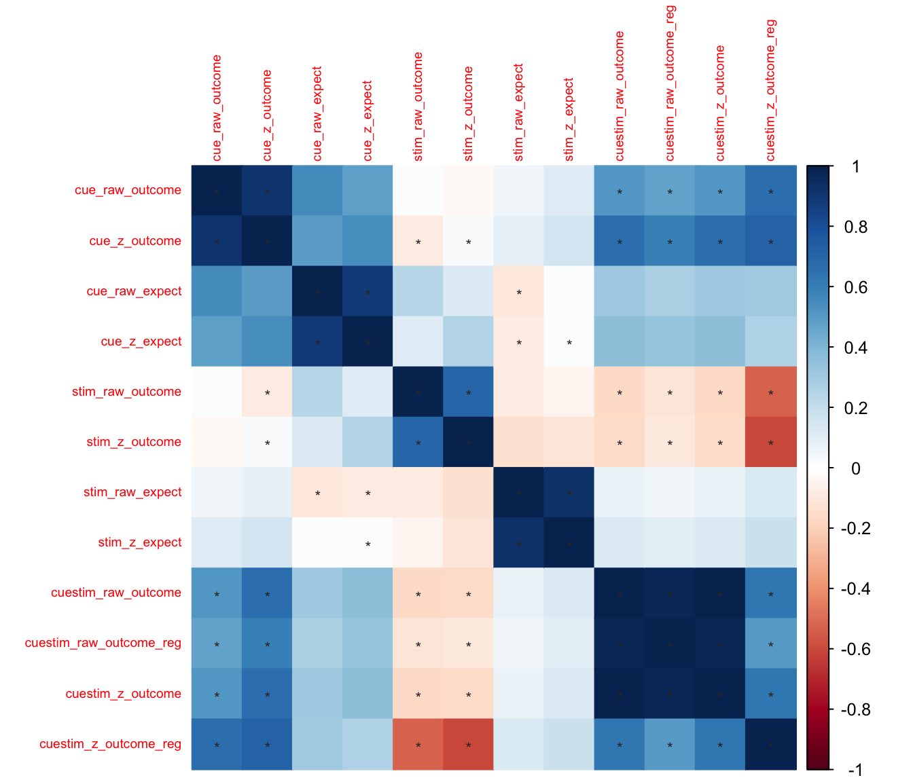

# beh ::  Different scaling methods ~  Cue effects {#cueeffects}

## What is the purpose of this notebook? {.unlisted .unnumbered}

Here, we extract the cue effects across different types of ratings
* cue effects of raw outcome rating ("cue_raw_outcome")
* cue effects of z-scored outcome rating ("cue_z_outcome")
* stim effects of raw outcome rating ("stim_raw_outcome")
* stim effects of z-scored outcome rating ("stim_z_outcome")
* cue effects / stim effect using raw outcome rating ("cuestim_raw_outcome")
* cue effects / stim effects using z score ratings  ("cuestim_z_outcome")
* regularized cue effects +1 / stim effect +1 using raw outcome rating ("cuestim_raw_outcome_reg")
* regularized cue effects / stim effects using z score ratings ("cuestim_z_outcome_reg")


### load libraries {.unlisted .unnumbered}

```r
library(car)
library(psych)
library(lme4); library(lmerTest)
library(glmmTMB)
library(plyr)
library(dplyr)
library(cueR)
library(ggplot2)
library(plotly)
library(gridExtra)
library(broom.mixed)
library(knitr)
library(grid)
library(ggpubr)

library(dplyr)
library(broom.mixed)
library(effectsize)
library(corrplot)
```


```r
compute_enderstofighi <- function(data, sub, outcome, expect, ses, run) {
  maindata <- data %>%
    group_by(!!sym(sub)) %>%
    mutate(OUTCOME = as.numeric(!!sym(outcome))) %>%
    mutate(EXPECT = as.numeric(!!sym(expect))) %>%
    mutate(OUTCOME_cm = mean(OUTCOME, na.rm = TRUE)) %>%
    mutate(OUTCOME_demean = OUTCOME - OUTCOME_cm) %>%
    mutate(EXPECT_cm = mean(EXPECT, na.rm = TRUE)) %>%
    mutate(EXPECT_demean = EXPECT - EXPECT_cm) %>%
    #mutate(OUTCOME_zscore = as.numeric(scale(OUTCOME, center = TRUE, scale = TRUE)[, 1])) %>%
    #mutate(EXPECT_zscore = as.numeric(scale(EXPECT, center = TRUE, scale = TRUE)[, 1])) 
    mutate(OUTCOME_zscore = (OUTCOME - mean(OUTCOME, na.rm = TRUE))/sd(OUTCOME, na.rm = TRUE)) %>% #as.numeric(scale(OUTCOME, center = TRUE, scale = TRUE)[, 1])) %>%
    mutate(EXPECT_zscore = (EXPECT - mean(EXPECT, na.rm = TRUE))/sd(EXPECT, na.rm = TRUE)) #as.numeric(scale(EXPECT, center = TRUE, scale = TRUE)[, 1])) 
  
  data_p2 <- maindata %>%
    arrange(!!sym(sub)) %>%
    group_by(!!sym(sub)) %>%
    mutate(trial_index = row_number())
  
  data_a3 <- data_p2 %>%
    group_by(!!sym(sub), !!sym(ses), !!sym(run)) %>%
    mutate(trial_index = row_number(!!sym(run)))
  
  data_a3lag <- data_a3 %>%
    group_by(!!sym(sub), !!sym(ses), !!sym(run)) %>%
    mutate(lag.OUTCOME_demean = dplyr::lag(OUTCOME_demean, n = 1, default = NA))
  
  # Create Subjectwise Mean, centered in relation to the group mean
  data_a3cmc <- data_a3lag %>%
    ungroup %>%
    mutate(EXPECT_cmc = EXPECT_cm - mean(EXPECT_cm, na.rm=TRUE)) %>%
    mutate(OUTCOME_cmc = OUTCOME_cm - mean(OUTCOME_cm, na.rm=TRUE))
  
  
  # Remove NA values ___________________________________________________________
  data_centered_NA <- data_a3cmc %>% 
    filter(!is.na(OUTCOME)) %>% # Remove NA values
    filter(!is.na(EXPECT))

  return(data_centered_NA)
  
}
```


### display distribution of data
Let's look at the distribution of the data. X axis: Y axis: 

```r
head(df.PVC_center)
```

```
## # A tibble: 6 × 33
##   src_subject_id session_id param_run_num param_task_name event02_expect_angle
##            <int>      <int>         <int> <chr>                          <dbl>
## 1              2          1             1 pain                            5.53
## 2              2          1             1 pain                           18.9 
## 3              2          1             1 pain                          103.  
## 4              2          1             1 pain                           81.2 
## 5              2          1             1 pain                           97.2 
## 6              2          1             1 pain                          117.  
## # ℹ 28 more variables: param_cue_type <chr>, param_stimulus_type <chr>,
## #   event04_actual_angle <dbl>, trial_index <int>, trial_count_sub <int>,
## #   trial_ind <dbl>, sub <chr>, ses <chr>, run <chr>, runtype <chr>,
## #   task <chr>, trial_sub <int>, trial <chr>, cuetype <chr>,
## #   stimintensity <chr>, DEPc <chr>, DEP <chr>, OUTCOME <dbl>, EXPECT <dbl>,
## #   OUTCOME_cm <dbl>, OUTCOME_demean <dbl>, EXPECT_cm <dbl>,
## #   EXPECT_demean <dbl>, OUTCOME_zscore <dbl>, EXPECT_zscore <dbl>, …
```

```r
#colnames(df.PVC_center)
```
> Summary: 


## function: compute cue effects

```r
#' Compute Cue Effect
#'
#' This function processes a dataframe to compute the cue effect. It involves 
#' subsetting and filtering the data, summarizing conditions, calculating 
#' difference scores, and calculating group-wise contrast. The function also 
#' allows renaming of the resultant columns.
#'
#' @param df A dataframe containing the relevant data.
#' @param dv The name of the dependent variable in the dataframe.
#' @param new_col_name The new name for the column that will be created as a result 
#'        of computing the cue effect.
#' @return A dataframe with the computed cue effect, sorted by task, with a new 
#'         column for the cue effect and its standard deviation, renamed as specified.
#' @import dplyr
#' @import tidyr
#' @import Rmisc
#' @export
#' @examples
#' # Assuming df is a dataframe with the necessary structure and "OUTCOME" is your dependent variable:
#' result <- compute_cueeffect(df, "OUTCOME", "new_cue_effect")
compute_cueeffect <- function(df, dv, new_col_name) {
  library(dplyr)
  library(tidyr)
  library(Rmisc)

  # 1) Subset and filter data __________________________________________________
  df$task <- factor(df$task)
  sub_diff <- subset(df, select = c("sub", "ses", "run", "task", "stimintensity", "cuetype", dv))
  sub_diff_NA <- sub_diff %>% filter(!is.na(dv))

  # 2) Summarize each condition and spread out columns _________________________
  subjectwise <- meanSummary(sub_diff_NA, c("sub", "ses", "run", "task", "cuetype", "stimintensity"), dv)
  mean_outcome <- subjectwise[1:(length(subjectwise) - 1)]
  wide <- mean_outcome %>% tidyr::spread(cuetype, mean_per_sub)

  # 3) Calculate difference score ______________________________________________
  wide$diff <- wide$`cuetype-high` - wide$`cuetype-low`
  subjectwise_diff <- meanSummary(wide, c("sub", "task"), "diff")
  subjectwise_NA <- subjectwise_diff %>% filter(!is.na(sd))

  # 4) Calculate group wise contrast ___________________________________________
  groupwise_diff <- summarySEwithin(data = subjectwise_NA, measurevar = "mean_per_sub", withinvars = "task", idvar = "sub")
  sd_col <- paste0(new_col_name, "_sd")
  # sort data based on task and rename _________________________________________
  sorted_df <- subjectwise_diff %>%
    arrange(task) %>%
    rename(!!new_col_name := mean_per_sub, 
           !!sd_col := sd
           )

  return(sorted_df)
}
```

## function: compute stim effects

```r
#' Compute Stimulus Effect
#'
#' This function calculates the stimulus effect based on the provided dataframe.
#' It filters the data, computes summary statistics, calculates difference scores,
#' and optionally renames the resulting columns.
#'
#' @param df Dataframe containing the data to be analyzed.
#' @param dv Name of the dependent variable column in `df`.
#' @param new_col_name New column name for the renamed mean_per_sub column.
#' @return A dataframe with the computed stimulus effect, sorted by task, 
#'         and with columns optionally renamed.
#' @import dplyr
#' @import tidyr
#' @import Rmisc
#' @export
#' @examples
#' # Assuming df is your dataframe and "OUTCOME" is your dependent variable:
#' result <- compute_stimeffect(df, "OUTCOME", "new_mean_outcome")
compute_stimeffect <- function(df, dv, new_col_name) {
  # 1) Subset and filter data __________________________________________________
  df$task <- factor(df$task)
  sub_diff <- subset(df, select = c("sub", "ses", "run", "task", "stimintensity", "cuetype", dv))
  sub_diff_NA <- sub_diff %>% filter(!is.na(dv))

 
  # 2) Summarize each condition and spread out columns _________________________
  subjectwise <- meanSummary(sub_diff_NA, c("sub", "ses", "run", "task", "cuetype", "stimintensity"), dv)
  mean_outcome <- subjectwise[1:(length(subjectwise) - 1)]
  wide <- mean_outcome %>% tidyr::spread(stimintensity, mean_per_sub)

  # 3) Calculate difference score ______________________________________________
  wide$diff <- wide$high - wide$low
  subjectwise_diff <- meanSummary(wide, c("sub", "task"), "diff")
  subjectwise_NA <- subjectwise_diff %>% filter(!is.na(sd))
  # 
  # # 4) Calculate group wise contrast _________________________________________
  groupwise_diff <- Rmisc::summarySEwithin(data = subjectwise_NA, 
                                           measurevar = "mean_per_sub", 
                                           withinvars = "task", 
                                           idvar = "sub")
  # 
  sd_col <- paste0(new_col_name, "_sd")
  # sort data based on task and rename _________________________________________
  sorted_df <- subjectwise_diff %>%
    arrange(task) %>%
    rename(!!new_col_name := mean_per_sub, 
           !!sd_col := sd
           )
  return(sorted_df)
} 
```


## compute the cue and stim effects for further analysis {.unlisted .unnumbered}


```r
# calculate cue & stim effects per participant and rename column _______________
cue_raw_outcome <- compute_cueeffect(df.PVC_center, dv = "OUTCOME", new_col_name = "cue_raw_outcome")
```

```
## 
## Attaching package: 'tidyr'
```

```
## The following objects are masked from 'package:Matrix':
## 
##     expand, pack, unpack
```

```
## Loading required package: lattice
```

```
## 
## Attaching package: 'Rmisc'
```

```
## The following objects are masked from 'package:cueR':
## 
##     normDataWithin, summarySE
```

```r
cue_z_outcome <- compute_cueeffect(df.PVC_center, dv = "OUTCOME_zscore", new_col_name = "cue_z_outcome")
cue_raw_expect <- compute_cueeffect(df.PVC_center, dv = "EXPECT", new_col_name = "cue_raw_expect")
cue_z_expect <- compute_cueeffect(df.PVC_center, dv = "EXPECT_zscore", new_col_name = "cue_z_expect")

rawstim_outcome <- compute_stimeffect(df.PVC_center, dv = "OUTCOME", new_col_name = "stim_raw_outcome")
zstim_outcome <- compute_stimeffect(df.PVC_center, dv = "OUTCOME_zscore", new_col_name = "stim_z_outcome")
rawstim_expect <- compute_stimeffect(df.PVC_center, dv = "EXPECT", new_col_name = "stim_raw_expect")
zstim_expect <- compute_stimeffect(df.PVC_center, dv = "EXPECT_zscore", new_col_name = "stim_z_expect")


# Merging all dataframes _______________________________________________________
merged_df <- cue_raw_outcome %>%
  full_join(cue_z_outcome, by = c("sub", "task")) %>%
  full_join(cue_raw_expect, by = c("sub", "task")) %>%
  full_join(cue_z_expect, by = c("sub", "task")) %>%
  full_join(rawstim_outcome, by = c("sub", "task")) %>%
  full_join(zstim_outcome, by = c("sub", "task")) %>%
  full_join(rawstim_expect, by = c("sub", "task")) %>%
  full_join(zstim_expect, by = c("sub", "task"))

# calculate cue vs stim effect ratio ___________________________________________
merged_df$cuestim_raw_outcome <- merged_df$cue_raw_outcome/merged_df$stim_raw_outcome
merged_df$cuestim_raw_outcome_reg <- (merged_df$cue_raw_outcome+1)/(merged_df$stim_raw_outcome+1)

merged_df$cuestim_z_outcome <- merged_df$cue_z_outcome/merged_df$stim_z_outcome
merged_df$cuestim_z_outcome_reg <- (merged_df$cue_z_outcome+1)/(merged_df$stim_z_outcome+1)


write.csv(merged_df, file.path(main_dir, "data", "hlm", "cue_stim_effects_scaling.csv"), row.names = FALSE)
```

```r
# Let's check what the cue & stim effects look like ____________________________
head(merged_df)
```

```
##        sub      task cue_raw_outcome cue_raw_outcome_sd cue_z_outcome
## 1 sub-0002 cognitive        4.540887           6.343282    0.12174487
## 2 sub-0003 cognitive        7.636581          17.103371    0.47159597
## 3 sub-0004 cognitive        1.627529           7.632712    0.07069328
## 4 sub-0005 cognitive       13.130997          41.442596    0.33303376
## 5 sub-0006 cognitive        5.148439          28.946650    0.15567303
## 6 sub-0007 cognitive       14.076683           9.627143    0.63495614
##   cue_z_outcome_sd cue_raw_expect cue_raw_expect_sd cue_z_expect
## 1        0.1700686       23.90350          18.73398    0.5963963
## 2        1.0562162       30.15502          25.17697    1.2605728
## 3        0.3315341       33.77405          25.34289    1.0873435
## 4        1.0510842       41.78567          37.36012    1.2517185
## 5        0.8752581       30.56264          19.98909    1.0611074
## 6        0.4342510       29.32456          11.57591    1.1869398
##   cue_z_expect_sd stim_raw_outcome stim_raw_outcome_sd stim_z_outcome
## 1       0.4674160        4.4896815           10.040412     0.12037201
## 2       1.0524748        4.0612018           11.029078     0.25079893
## 3       0.8159054        0.9329999            6.238765     0.04052574
## 4       1.1191483        4.6718609           29.829606     0.11848966
## 5       0.6940032       15.8650585           28.858031     0.47971082
## 6       0.4685462       12.5187276           11.450963     0.56468155
##   stim_z_outcome_sd stim_raw_expect stim_raw_expect_sd stim_z_expect
## 1         0.2691916       -3.343426          20.107224   -0.08341906
## 2         0.6810991       -4.285159           7.409842   -0.17913285
## 3         0.2709867       -1.031139           9.824031   -0.03319716
## 4         0.7565508       -2.959005           8.839276   -0.08863904
## 5         0.8725786        7.058330          18.466885    0.24505886
## 6         0.5165180       -4.460202           9.261081   -0.18053095
##   stim_z_expect_sd cuestim_raw_outcome cuestim_raw_outcome_reg
## 1        0.5016787           1.0114051               1.0093276
## 2        0.3097542           1.8803747               1.7064289
## 3        0.3162812           1.7444044               1.3593012
## 4        0.2647866           2.8106567               2.4914216
## 5        0.6411536           0.3245143               0.3645667
## 6        0.3748512           1.1244500               1.1152442
##   cuestim_z_outcome cuestim_z_outcome_reg
## 1         1.0114051             1.0012254
## 2         1.8803747             1.1765248
## 3         1.7444044             1.0289926
## 4         2.8106567             1.1918159
## 5         0.3245143             0.7810128
## 6         1.1244500             1.0449130
```


```r
pain.df <-merged_df[merged_df$task == 'pain', ]
cor(pain.df$cue_raw_outcome, pain.df$cue_z_outcome, use = "complete.obs")
```

```
## [1] 0.9155303
```

```r
# Reshape the dataframe to a long format _______________________________________
pain.long_df <- pivot_longer(pain.df, 
                        cols = c("cue_raw_outcome", "cue_z_outcome", 
                                 "cue_raw_expect", "cue_z_expect", 
                                 "stim_raw_outcome", "stim_z_outcome", 
                                 "stim_raw_expect", "stim_z_expect",
                                 
                                 "cuestim_raw_outcome", "cuestim_raw_outcome_reg",
                                 "cuestim_z_outcome", "cuestim_z_outcome_reg"
                                 ), 
                        names_to = "variable", 
                        values_to = "value")

pain_heatmap <- pain.long_df[, c("sub", "variable", "value")]
# Create the heatmap ___________________________________________________________
ggplotly(ggplot(pain_heatmap, aes(x = variable, y = sub, fill = value)) +
  geom_tile() +
  scale_fill_gradient(low = "blue", high = "red") +
  #facet_grid(rows = vars(sub)) +
  theme_minimal() +
  coord_fixed(ratio = .1) +
  labs(x = "Variable", y = "Subject", fill = "Value") +
   theme(axis.text.x = element_text(angle = 45, hjust = 1),
        axis.text.y = element_text(angle = 45, vjust = 1)))
```

```{=html}
<div class="plotly html-widget html-fill-item" id="htmlwidget-d6ba086e4215fe00a7de" style="width:672px;height:576px;"></div>
<script type="application/json" data-for="htmlwidget-d6ba086e4215fe00a7de">{"x":{"data":[{"x":[1,2,3,4,5,6,7,8,9,10,11,12],"y":[1,2,3,4,5,6,7,8,9,10,11,12,13,14,15,16,17,18,19,20,21,22,23,24,25,26,27,28,29,30,31,32,33,34,35,36,37,38,39,40,41,42,43,44,45,46,47,48,49,50,51,52,53,54,55,56,57,58,59,60,61,62,63,64,65,66,67,68,69,70,71,72,73,74,75,76,77,78,79,80,81,82,83,84,85,86,87,88,89,90,91,92,93,94,95,96,97,98,99,100,101,102,103,104,105,106,107,108,109,110,111,112,113,114],"z":[[0.78431399738163432,0.54010319115695915,0.34768543650951328,0.34197114370069659,0.34608832563918568,0.34607811435996383,0.34608832563918568,0.34594354092462037,0.23555997675488458,0.53527012240408456,0.33399392919261328,0.34184156519522008],[0.5761301969260505,0.37592713874786615,0.34652946634410525,0.33894674940058728,0.33955761588342998,0.34000965305331726,0.33955761588342998,0.34306070671196837,0.34783461115412084,0.45752085503653694,0.33698600749688629,0.34398555766478423],[0.74193513435327108,0.4406526387738911,0.34956514818653928,0.34103613444521136,0.344849723304332,0.34492468171655949,0.344849723304332,0.34550530764879711,0.44241877775076188,0.45328489292988944,0.33992232545755319,0.34158482847443794],[0.6027022495943517,0.42798694084294675,0.34448660877183984,0.33883272440595918,0.34227090991128184,0.34248351883709399,0.34227090991128184,0.34482995536942984,0.26068617340849826,0.48501898641251207,0.33424128095205857,0.34027919464702322],[0.60871407650640053,0.38779986526558458,0.34596330360970307,0.33806348387227708,0.33797046828664568,0.33818854514436664,0.33797046828664568,0.34179376090228686,0.3582348343911162,0.66540787774764554,0.33726688980419495,0.34645750070425296],[0.70026456045801522,0.40141051877186817,0.35123592301046141,0.33944005899322754,0.33904316116158439,0.33929902099082548,0.33904316116158439,0.34220418317035217,0.33575231590070476,0.57626653766198643,0.33648193947439287,0.34732727976708833],[0.38124029429206097,0.35839433728404146,0.33981649660346819,0.33784805930341533,0.33924713053120492,0.33998181734589844,0.33924713053120492,0.34369090544305281,0.33765642841554472,0.4113206373006722,0.33659719707207714,0.34107792545011678],[0.46050272867311631,0.39349873316891743,0.33848652381405869,0.33739500841744918,0.34318972792987817,0.34346989320691418,0.34318972792987817,0.34554922761797785,0.37448368250802339,0.41629720652246038,0.33711718011969316,0.33774798776979115],[0.79337665439408667,0.43249418953817975,0.35442388700966687,0.3410741483693483,0.33917515135933307,0.33935560501169698,0.33917515135933307,0.34163929674156263,0.2897942784118458,0.67352117805989908,0.33468113957439177,0.35252873363432996],[0.8353972475037762,0.37948340132109976,0.35035082365468218,0.33770742044638619,0.33798184029541861,0.33824231546467259,0.33798184029541861,0.34232726936355062,0.22161434849106695,0.60994285925502945,0.33332565565202493,0.34411482610611671],[0.034483974667599351,0,0.3299512908785045,0.32901963313180865,0.32802172162445503,0.32846076997673096,0.32802172162445503,0.33749823264837608,0.32351180788763961,0.70700151939593348,0.33623027906260955,0.34476234278014584],[0.90838809001234666,0.58418186458031263,0.3565450285767009,0.34553456498220209,0.34651511500773591,0.34648972364448843,0.34651511500773591,0.34617120481502228,0.37239218878228747,0.56798555145117813,0.33776954502408835,0.34494458165486602],[0.59311599345868571,0.52148187405169155,0.34113614314155327,0.33953640456289536,0.34336202274953881,0.34345125460558512,0.34336202274953881,0.345095673165977,0.3549232780066458,0.58896832639240582,0.3368444351972637,0.34063960424993178],[0.84884206989289013,0.48914577731655323,0.3532766712084987,0.3418714962148714,0.34220583537777244,0.34233726868064934,0.34220583537777244,0.34408870970132233,0.3260807360366797,0.58714133781184075,0.33617137208515185,0.34531201249811078],[0.87039805428559336,0.45113488777905464,0.35202688918250491,0.34123140974055394,0.34102130027753419,0.34120446226938272,0.34102130027753419,0.34338605322966248,0.34151239262635047,0.57417529761438946,0.33665800299784715,0.34629665872902499],[0.50172099553692773,0.37486898117500778,0.34716813773770916,0.338250112546647,0.3382211712719147,0.33854695191169332,0.3382211712719147,0.3420090069206066,0.35416537202318438,0.54638992899120098,0.33765125879320856,0.34601936907421665],[0.39751267901507675,0.3445215479002009,0.34130297947440147,0.33703751736547571,0.33686207856218059,0.33723822167063749,0.33686207856218059,0.34045852831289586,0.28882023403530743,0.55081499184700522,0.33276747752788521,0.35055544373237763],[0.53286131271330817,0.45418063222112404,0.34502634839007329,0.34077779111451084,0.3423956119372894,0.34256061743856397,0.3423956119372894,0.34440454248780994,0.3353880804285414,0.5234944720244874,0.33646395344979646,0.3432901891011641],[0.92513702406932297,0.36151235053275566,0.35808543190822767,0.33733771083850761,0.33708272126243216,0.33727840871897236,0.33708272126243216,0.34066957954634131,0.25708193953449143,0.74651673522390249,0.33360162888903472,0.35004294005952574],[0.84895546362020502,0.54498619611572796,0.35392875769723159,0.34293146500596067,0.34355168298640054,0.34362710908918837,0.34355168298640054,0.3447595601105522,0.33090866935212071,0.61338163765802289,0.33632225651811365,0.34503731115716313],[0.93927803896131834,0.42761493056290667,0.35589062123460241,0.34033491275775213,0.34057851300671621,0.34080419333344009,0.34057851300671621,0.34330132895587556,0.30944218547629621,0.54597972251461602,0.33564244482466554,0.34530091013564274],[0.58978646550659508,0.41932429487860506,0.34678721884788738,0.33970801108902299,0.33852202455964286,0.33869587647051791,0.33852202455964286,0.34135533947010832,0.22987903507426719,0.72179316544942607,0.33218693191514592,0.35137880502485047],[0.44091056559145547,0.34763919873231236,0.34224927528341442,0.33698548478439627,0.33730615104429001,0.33787559398321015,0.33730615104429001,0.34266684166339945,0.33270130893059041,0.46760571476832696,0.3363032843542042,0.342082895869667],[0.91165935689858857,0.30804172347759401,0.35293065694975273,0.3358405433744856,0.33600774400340838,0.33617945999892779,0.33600774400340838,0.3402346033640567,0.14162820480624519,0.86358030820871035,0.33094961073560714,0.34895630039963382],[0.4406486026199492,0.35332909033302951,0.34776923457829062,0.33831481685546178,0.33788906298108257,0.33849216975676238,0.33788906298108257,0.34134111327957239,0.35594659564153341,0.45073138413991903,0.33861341293087183,0.3487527761135652],[0.73762233796109711,0.47253414708893449,0.35119155187657292,0.34181703174194566,0.33953561132323645,0.33967312865801658,0.33953561132323645,0.34183181966137816,0.24453850463501869,0.75715862496010689,0.33314686889300299,0.35291629519989043],[0.42503344855840014,0.33286662760736074,0.3394894572686793,0.3363939419066746,0.33640733137422069,0.33667290312453291,0.33640733137422069,0.34085182976325401,0.32046294125228936,0.65993976090015904,0.33597300199088692,0.34704872373470969],[0.57087206278600056,0.3775183968507681,0.34167908743186209,0.33721267518626152,0.33730423204568299,0.3374662719545875,0.33730423204568299,0.34184525733787241,0.47293902152914458,0.82081589750104134,0.33952018771722142,0.34477966385424258],[0.64390408498225127,0.39860017804934272,0.34743403947834905,0.33887219834199328,0.33936283728737637,0.33964804297172607,0.33936283728737637,0.34291792108094743,0.3581399031482545,0.5401573696276839,0.33728111073251876,0.34425173044515406],[0.74381533913773112,0.43981952635547589,0.34656334390076626,0.33929385532711592,0.33926399763557835,0.3394351323957987,0.33926399763557835,0.34254470156885292,0.41413857638455476,0.68752827017898066,0.33842821828956354,0.34596245902511169],[0.71973831423767765,0.434629798278867,0.35227742323918049,0.34015200001139845,0.33938639584689811,0.33957063007825711,0.33938639584689811,0.34224315409630396,0.27075078463032426,0.65569493578321203,0.33380747665171484,0.34835157638739972],[0.85097067710484431,0.46743458354346001,0.35276020762952237,0.34152523325820006,0.34184882341335165,0.3420059477653018,0.34184882341335165,0.34391764436966143,0.29884934078682868,0.56587392924439794,0.33532324156291993,0.34529411305188806],[0.7140116602750719,0.35314767680082665,0.34804170996350747,0.3370161044606293,0.33712045255745776,0.33742852173669807,0.33712045255745776,0.34190115372350022,0.34656366408631889,0.59239467033735271,0.33681967802233725,0.34425590735824735],[0.85737010932244129,0.49364255618877328,0.35163504879381197,0.34046849471345253,0.34228153005242351,0.34240829194436562,0.34228153005242351,0.34440494518432169,0.33244875704627214,0.59113972501682899,0.33639472632147277,0.34292300676533455],[0.39189384067147259,0.32133883785416695,0.33932465669018308,0.33580312632596432,0.33516733600331516,0.33603826290616601,0.33516733600331516,0.342168436143583,0.35045429989038401,0.44194738400768424,0.33722059191674458,0.34144326300085714],[0.67531881374619296,0.35302414641869279,0.34546623134499771,0.33699673744716879,0.33728204303753628,0.33766397182864183,0.33728204303753628,0.34254796319592884,0.27324039695344382,0.53714772840514713,0.334840641287244,0.34239418029020374],[0.48271156886849043,0.35213603965691476,0.34052081416215585,0.33690935218450607,0.33767972205450553,0.3382483589357223,0.33767972205450553,0.34378573315848399,0.31251986613225075,0.46166335169824718,0.33585494438171376,0.33968996023006798],[0.61041147178221877,0.38654892869454727,0.34325005533405401,0.33743812346236263,0.33732792095519404,0.33746471563369745,0.33732792095519404,0.34132433883494823,0.38715194420369514,0.91029959992971077,0.33775833677932621,0.34712474848297858],[0.61916316552492723,0.38833413865747313,0.34400033695023569,0.33787219945811731,0.33931637867580533,0.33965228526742963,0.33931637867580533,0.34372384781521342,0.34314357881130014,0.50930168801678266,0.33668837388164657,0.34104565943062876],[0.74768378250357936,0.48410083831712664,0.34446681801389201,0.33906518584090861,0.33971807492350642,0.33984865284179006,0.33971807492350642,0.34313782032949103,0.42013933498368572,0.76694730887162499,0.33813047362240906,0.34395688490835596],[0.39843580909171822,0.27750209475075266,0.33853885453280924,0.33508269640450189,0.33499023243570736,0.33526364635081712,0.33499023243570736,0.34059584121281739,0.40063652519456677,0.69884697786118855,0.33861086244404937,0.34529326572555613],[0.99685804954497004,0.4858214372178854,0.34701806547813152,0.33866723985737324,0.34446515453876453,0.34453574057696973,0.34446515453876453,0.34556345141506678,0.27421674173725208,0.51202889900814996,0.3355216588814412,0.33904541310496472],[0.87014565109971964,0.40998394319689646,0.35402536004728491,0.3388482045424413,0.33792786466637376,0.33807777934540301,0.33792786466637376,0.34092110945921295,0.30595112325764373,0.82185474326846497,0.33550975410588346,0.35194066249667255],[0.65993482705513851,0.42556249712829897,0.34930252832178676,0.34110892576735907,0.34635279698343907,0.34630386136647839,0.34635279698343907,0.34601758364282476,0.30053042969604293,0.42111195968425036,0.33508978859476402,0.34087921607851829],[0.60143950134147017,0.4784042510034463,0.35012209900797608,0.34469042244999715,0.34267117480481751,0.34280386279475922,0.34267117480481751,0.3440414477718301,0.32804282105519877,0.55189837317799595,0.33607761591779683,0.34892614557411994],[0.66500379285418165,0.38994478008912081,0.35021517507765854,0.33886961550286193,0.33838309150642837,0.33863600083566531,0.33838309150642837,0.34169172692427885,0.32654855767783914,0.60357078597631164,0.33609707914337833,0.34829269765082566],[0.49398344792583615,0.41187728721263855,0.34172148774959504,0.33897976192035123,0.3381582909982746,0.33832288474939121,0.3381582909982746,0.34124036386613527,0.30816952076712972,0.76464912513228478,0.33557518957350663,0.3505276790899326],[0.90770510978824914,0.53697701887974902,0.35420435363810104,0.34482476775727217,0.34168274789216402,0.34178779715657348,0.34168274789216402,0.34328500319142696,0.343858774089426,0.69898614736120601,0.33674024808216718,0.35154231305213612],[0.5164068510696701,0.44938835165809105,0.34570100042165247,0.34061615389658911,0.3390628492848542,0.33921304280892539,0.3390628492848542,0.34166839895068202,0.38644396488248378,0.75029301166461426,0.33906300868158401,0.35155512363103764],[0.6106472943711575,0.44960226006971993,0.34910040636747586,0.3412393026260096,0.34091980209225092,0.34110513775695273,0.34091980209225092,0.34330398238171084,0.35230783519765041,0.57639782594962763,0.33723799637302626,0.34653873197339063],[0.63051147356773551,0.35999188341625832,0.34979784476661352,0.33841099542510122,0.33825975761011762,0.33878618202442545,0.33825975761011762,0.34190270188701666,0.38611467242189101,0.46214811295675895,0.33875411567098623,0.34667027175706761],[0.87766257724110452,0.4554876173384339,0.35125764894936062,0.33971462345703024,0.34148028281458792,0.34165586058668684,0.34148028281458792,0.34414404659683151,0.30312109558908201,0.56040750883187163,0.33560288228448809,0.34253827475052628],[0.89612493740728028,0.48063403312517355,0.35465319588310884,0.34158331874855141,0.33985793550340304,0.33999411276425673,0.33985793550340304,0.34224410704881103,0.31083562611255167,0.73926315352757976,0.33568036479540209,0.35068263306923214],[0.33789526643707785,0.33232667058784288,0.33673364841255909,0.33611935304302609,0.33615460451855672,0.33691953996668911,0.33615460451855672,0.34078014499049136,0.29457599412595731,0.44578658260508852,0.32981124037516696,0.34678122409890588],[0.77339095534032309,0.58787610390107115,0.34906410075875161,0.34656278528530882,0.3530309316108744,0.35258881717451784,0.3530309316108744,0.3485731980265207,0.2508351287798159,0.4787689027025343,0.33405122553120903,0.34220043646450826],[0.41957184646571483,0.46648165641412487,0.33845696423184013,0.34028656673785468,0.33953726997343242,0.33968108512948841,0.33953726997343242,0.34235064880994881,0.32673851354064631,0.73822089800040658,0.3362839230483276,0.34817693615440365],[0.44127135878793083,0.30299564470715407,0.34187208035212951,0.33446386265526712,0.33185164558628932,0.33356201283399922,0.33185164558628932,0.34158329412749949,0.26630019289563345,0.40373488538314967,0.33292070448431982,0.3406219206295667],[0.6825103023105572,0.37296746428285305,0.34294293994680081,0.3371793640815775,0.33744294234445227,0.33765240337691116,0.33744294234445227,0.34234671495762919,0.33353614599158304,0.70286454690836875,0.33645739910476635,0.34321217997685732],[0.67957411409735979,0.32811736221016813,0.34705447087172508,0.33628135151667105,0.33593225043792818,0.33657434388930058,0.33593225043792818,0.34303139147637435,0.48219681993626273,0.47171803106277604,0.34098936770125921,0.3402388140672668],[0.98838752451286638,0.56145289603057746,0.36230705958490705,0.34948348758917214,0.40081122856405299,0.38859565211722391,0.40081122856405299,0.35508520046324643,0.37093264879637611,0.36921652746455136,0.3378746959784239,0.33839852374120011],[0.35917130003646042,0.33300032086287312,0.33757452454981557,0.33635658453062028,0.33600087485344221,0.33725498434319118,0.33600087485344221,0.34355629615547123,0.31218015397681048,0.40066311417522726,0.33537246570768847,0.33936432859931331],[0.31320194402973417,0.34926131992286197,0.33617949283931708,0.33672505048210138,0.33694229087828775,0.33723301731333122,0.33694229087828775,0.34291083058443628,0.3345009727110741,0.61394526490956325,0.33648395981647139,0.34113346642407194],[0.66807345560859122,0.40348738816821639,0.34932704505089984,0.33927077114310178,0.3378812390283229,0.33804102797716862,0.3378812390283229,0.34052761918177499,0.16920560083016761,0.7940127951476299,0.33004654714839504,0.35535282165924748],[0.91918200120143911,0.42719857957316754,0.35719542980454327,0.33964281294840715,0.33933731126526523,0.33953436725285541,0.33933731126526523,0.34243181281244295,0.2608610735581014,0.63664714540062162,0.33382734990444646,0.34687209870452823],[0.72558190176350201,0.31799619884704744,0.35052033022047396,0.3357743775058028,0.33604196137321785,0.33628540738286383,0.33604196137321785,0.33986496311492115,0.33131990823425156,0.70421440698473781,0.33632576134966347,0.35117469867336587],[0.81313281474525578,0.37137341361131793,0.34997545397593954,0.33756915272376958,0.33796665753145033,0.33828272605478094,0.33796665753145033,0.34253884770249315,0.34854573190974908,0.56065396301294423,0.3368526051467931,0.34330520132542974],[0.62331888716756834,0.33751685143413196,0.34639641846330621,0.33655489065386951,0.33656851760797446,0.33705772007556578,0.33656851760797446,0.34186100190731156,0.34577820000453524,0.50473694068257691,0.33683201762989828,0.34357806252849837],[0.85387280062648219,0.3774351461612192,0.34840133736584783,0.33731297685851158,0.33783158680511993,0.33808228360746129,0.33783158680511993,0.342828809538476,0.37943807093440868,0.62657539949597674,0.33749911596209475,0.3421850442302824],[0.71648396605471698,0.36890798230565125,0.35215858423853463,0.33831785926711766,0.33729821220777556,0.33750092099833912,0.33729821220777556,0.33989449752120754,0.40871097066536549,0.72205363854229077,0.33948558515729188,0.35799598172165997],[0.77656056343313484,0.57089234860475147,0.3538568944001737,0.34624375846699756,0.34465255361707298,0.34469311376721329,0.34465255361707298,0.34520298132769173,0.32494880225289208,0.60568877942966126,0.33605693385836222,0.34768844670057431],[0.44826725986428911,0.37104849577214055,0.34030545065845846,0.33759528533013816,0.33812630380547665,0.3384715550777686,0.33812630380547665,0.34275534692746307,0.39273617875472366,0.53659529310909393,0.3384208330812159,0.34278456012870945],[0.64994798472454041,0.40262259269571649,0.35363919804809485,0.3400852365381517,0.3404006669927524,0.34070395545761833,0.3404006669927524,0.3432462701200476,0.37476085239369189,0.49546909257900074,0.33860264162774095,0.34510257912309916],[0.42780104885376929,0.30722983976454848,0.34885788144518326,0.3330596773323567,0.32756948594892182,0.33184889930337375,0.32756948594892182,0.34076581844483156,0.29382215894660896,0.36712188456253292,0.33073955962486395,0.34012215377626598],[0.77647800281108381,0.6190846844318082,0.35287541039971049,0.34891967348873926,0.35922222622789485,0.35822830189322796,0.35922222622789485,0.35058164439841016,0.45958310569861632,0.45283249600527214,0.34108981260660953,0.34161999824552464],[0.72516524357190792,0.48897457489521501,0.35087467307119563,0.34200627594292521,0.34089258681923346,0.34103133203079056,0.34089258681923346,0.34309658718331126,0.35073192615091853,0.66192375649649682,0.3370381627608241,0.34823804079176313],[0.48297749257396921,0.41251792913478635,0.33988224389551991,0.33804590642573912,0.33804449655142083,0.33819891536107116,0.33804449655142083,0.34195095481895393,0.31910453756840496,0.80036475356839121,0.33611222988518236,0.34586961297284735],[0.46524526465331312,0.35562032950579958,0.3447683321330462,0.33753671603424329,0.33772552108194775,0.3382110794960036,0.33772552108194775,0.34213661689072844,0.35396218485631081,0.48379420476121399,0.33763175131784556,0.34440569921152309],[0.72740972297820061,0.50444835124162546,0.35229152850618395,0.34257549653964658,0.34267977421332474,0.34279245973981287,0.34267977421332474,0.34428395382859944,0.36083922318257799,0.59107681004298329,0.3374946726329966,0.34570294004894003],[0.48749457403830643,0.33845664073337084,0.34338470525946574,0.33661385507481389,0.33660893950054294,0.33704530693957668,0.33660893950054294,0.3411197549046957,0.3761961981766454,0.52537132455855806,0.33831892385687734,0.3463385730321617],[0.96853045821987549,0.69022965837569539,0.35124057981728757,0.34624607925920031,0.34542762619965051,0.34543828043488783,0.34542762619965051,0.34563480707586758,0.29509272457313734,0.70742497920963776,0.33554751044802472,0.34671924935538556],[0.6123031687527648,0.3842935828356277,0.34636073635154119,0.33820720919152852,0.33761056316897314,0.33779587321467269,0.33761056316897314,0.34085433881162197,0.38393349317429948,0.74337266039336447,0.33820603458741766,0.35094152288860986],[0.8686434205043061,0.33516277744505235,0.35502266963713808,0.33646567372967384,0.33648396980036716,0.33667949480046905,0.33648396980036716,0.34004067878861266,0.29030016866978325,0.77549220895208926,0.3349052325619426,0.35181060621346627],[0.51575367475366518,0.39105090190612718,0.34634867311269701,0.33886664313484061,0.33819521938634561,0.33842463147739171,0.33819521938634561,0.3413905461668823,0.32496644124044843,0.6395369345784172,0.33587910858601677,0.34959156290338617],[0.43591671014195094,0.36289782100870543,0.34316772124780148,0.3379108753467282,0.3375421803537349,0.33785456629221555,0.3375421803537349,0.34106988333162114,0.329305219759846,0.57610914424577075,0.33603018226848824,0.34920903428248223],[1,0.23769859920954514,0.35876106130627933,0.3337294929495972,0.33436630553845348,0.33461068190754739,0.33436630553845348,0.33937121170957679,0.36241237159959694,0.76687892210036035,0.33738119591471555,0.34863452545295165],[0.93121694582596626,0.46068098057887757,0.35424882495867244,0.34063335678588547,0.33873188526579018,0.33885706164607865,0.33873188526579018,0.34122734305832753,0.34747687068453298,0.85957414484269856,0.33683970588565559,0.35387099753876528],[0.40927253718880963,0.38805586647432566,0.34123377459131954,0.33931579077447521,0.33818944285512426,0.33843114032902877,0.33818944285512426,0.34106080159960261,0.34639175496323837,0.62388259156016102,0.33715372372609542,0.35214076582755865],[0.72861965107561122,0.41275379247404209,0.34992796732757681,0.33918333152941016,0.33815554664064429,0.33831808032443944,0.33815554664064429,0.34109026888338045,0.33524945156880437,0.77035196139608686,0.33646949703541079,0.35170947575633099],[0.33431355394407797,0.29341308361847329,0.33625853857040394,0.33407973263517288,0.3348135564507656,0.33523257218728775,0.3348135564507656,0.33935632933101056,0.31911437480147536,0.57363440617858907,0.33450182042329968,0.34989829451641613],[0.56792310366391774,0.39520617574211309,0.34597115205777007,0.338866342365929,0.33932966292428812,0.33962877402773545,0.33932966292428812,0.34288796373268216,0.34044547816886828,0.53129232748986455,0.33667346115103791,0.34432343700097273],[0.56942043755605887,0.37758669429740777,0.34599622954550541,0.33807944728530737,0.33789366953887151,0.3381528270455802,0.33789366953887151,0.34162626819523018,0.20977942658716495,0.61456110270131181,0.33135240463028592,0.34711862251043946],[0.76909957076570179,0.55318309278814393,0.34706557975235142,0.34141212100271351,0.33997746455318228,0.34007006673363138,0.33997746455318228,0.34241465073142496,0.35162025479682513,0.92111462538105138,0.33688126254928463,0.34973187884721124],[0.63868615698524167,0.43699592364837436,0.35025110284389122,0.34090773208701236,0.3403998208336772,0.3406032139413292,0.3403998208336772,0.34296295765441692,0.34528916520105229,0.57816985416337541,0.33691174068696939,0.34708251007536234],[0.67652456380528425,0.46896869548441206,0.35203743485417505,0.34440109970876825,0.35403292223242738,0.35307827999113517,0.35403292223242738,0.34839807133922329,0.31295701464416215,0.40718752229972,0.33543717955244301,0.34072173757490959],[0.94387195452351158,0.57714719004281123,0.35289013959401344,0.34219836436532913,0.34177276565679632,0.34186021923300208,0.34177276565679632,0.34373740609353926,0.36068472960618764,0.76417441115292473,0.33716451498233752,0.34661739348356069],[0.69403988784323389,0.44583146951655434,0.34595899102991146,0.33981869572078965,0.30654204553870229,0.29169082618088393,0.3065420455387024,0.35073590573799235,0.34869691328830715,0.30241459880076776,0.33683463773920774,0.33548153445515133],[0.86147117756051395,0.32440896111570322,0.35315410023671656,0.33602395821337555,0.33600773417658092,0.33640236036692428,0.33600773417658092,0.34101480466804568,0.1619616315492578,0.56057842994235674,0.33097938166957891,0.34556066797789409],[0.56365284880516131,0.42168917530412292,0.34850371855114765,0.34213937482774803,0.34113907280499667,0.3413823319233309,0.34113907280499667,0.34326970053039124,0.30189174155436654,0.50862537878837932,0.3346850344443294,0.34788227893955009],[0.53053962864530013,0.39733932258763183,0.34390911061947982,0.33850918686789971,0.33959010769890352,0.33989209209418791,0.33959010769890352,0.34339352575335563,0.33812092840065205,0.52128772899755704,0.33657402318324908,0.3425774593157494],[null,null,null,null,null,null,null,null,null,null,null,null],[0.92643053334674164,0.50915615993562491,0.35579830167699283,0.34175158313034726,0.34314783415921485,0.34324824900795686,0.34314783415921485,0.34466394129476896,0.19414846112890463,0.57975202221702438,0.33185854736698606,0.34389381473888653],[0.70071713183323248,0.4141069209525739,0.35353557621793158,0.34086684078908625,0.34028475475380499,0.34054326291979314,0.34028475475380499,0.34287316503119003,0.45250174901557305,0.528815484519915,0.3419340270964556,0.34730360037108765],[0.87549941897371508,0.33178609918575747,0.35315480108386016,0.33629246034518856,0.33622643060515511,0.33677666105305115,0.33622643060515511,0.3416716697443038,0.3709949047017459,0.49085373406379784,0.33757741059854729,0.34370490113382779],[0.61473222200163935,0.43316084586662362,0.34666156570177814,0.33950318017123654,0.34096215671638724,0.34117776174658931,0.34096215671638724,0.34389191899228377,0.34093682533021358,0.53957085478644029,0.33667409938415477,0.34279569259935611],[0.62172444239769953,0.42237280096696844,0.35032306880770081,0.34249739919677302,0.35185813253928683,0.35094881084636426,0.35185813253928683,0.34754364882686783,0.29489294954067413,0.38881792122681658,0.33449742997989218,0.34015853266176083],[0.99760756858722055,0.36129955151418808,0.35611519457191876,0.33725255063384324,0.33704038429242666,0.33722424535097839,0.33704038429242666,0.34071245600534628,0.24813296994764816,0.77564310743826814,0.33389212228229442,0.34961980608808002],[0.55673331761334977,0.48243107335116642,0.34868063722570858,0.34228729859497542,0.34054391662543526,0.34068685974352414,0.34054391662543526,0.34272979641194662,0.27825268868969205,0.67489522478858599,0.33329365731971344,0.34990388563463898],[0.37339717442349735,0.35145364661072409,0.33838144400635223,0.33709039321060058,0.33718544353026286,0.33755923677485739,0.33718544353026286,0.34185296618949157,0.3124730544020396,0.54413386119972018,0.33529476387445933,0.34454017673787563],[0.43676480293368775,0.37893454371482266,0.33928245980518279,0.33760293846284484,0.33957055795606206,0.33999349849774047,0.33957055795606206,0.34420771072809075,0.30088860830556802,0.46620279946413479,0.33552850248463634,0.3398456916356305],[0.87122000379788911,0.53906165809699602,0.35248747482574389,0.34315488567613961,0.34137926152423226,0.34148441577503363,0.34137926152423226,0.34327440142881949,0.39838667050623672,0.72559508327218514,0.33836124545229185,0.3492718586127701],[0.47745723865671807,0.36001084791754301,0.34577395957023493,0.3381765507768637,0.33762356874786559,0.33799540740557599,0.33762356874786559,0.34092144653742301,0.29186374562004713,0.53425958797306228,0.33357890396420281,0.35051459017514969],[0.36901721076031657,0.20554867226752083,0.33774833200290305,0.33343575867848385,0.33406828487409329,0.33428436198363759,0.33406828487409329,0.33928916424379418,0.28241578631002862,0.83736106910007613,0.33445629546430899,0.34827999091728368],[0.62184151636144647,0.44370743397559587,0.34707121009764785,0.34028121346676826,0.34075345753850356,0.34094782831947196,0.34075345753850356,0.34345780992461755,0.32894743353518691,0.57281284567130264,0.33623276676677599,0.3448199934032346],[0.75617222343284007,0.38572855363293607,0.35372515163164375,0.33852035271726921,0.33815387802417374,0.33840258792989153,0.33815387802417374,0.3416204021797577,0.42250076181965618,0.61685333592671932,0.34003953749276222,0.3479485022353862]],"text":[["variable: cue_raw_expect<br />sub: sub-0002<br />value:  47.901939569","variable: cue_raw_outcome<br />sub: sub-0002<br />value:  21.778362424","variable: cue_z_expect<br />sub: sub-0002<br />value:   1.195161642","variable: cue_z_outcome<br />sub: sub-0002<br />value:   0.583895616","variable: cuestim_raw_outcome<br />sub: sub-0002<br />value:   1.024316421","variable: cuestim_raw_outcome_reg<br />sub: sub-0002<br />value:   1.023224106","variable: cuestim_z_outcome<br />sub: sub-0002<br />value:   1.024316421","variable: cuestim_z_outcome_reg<br />sub: sub-0002<br />value:   1.008828594","variable: stim_raw_expect<br />sub: sub-0002<br />value: -10.799058201","variable: stim_raw_outcome<br />sub: sub-0002<br />value:  21.261362188","variable: stim_z_expect<br />sub: sub-0002<br />value:  -0.269438362","variable: stim_z_outcome<br />sub: sub-0002<br />value:   0.570034419"],["variable: cue_raw_expect<br />sub: sub-0003<br />value:  25.632222452","variable: cue_raw_outcome<br />sub: sub-0003<br />value:   4.216216682","variable: cue_z_expect<br />sub: sub-0003<br />value:   1.071505869","variable: cue_z_outcome<br />sub: sub-0003<br />value:   0.260371857","variable: cuestim_raw_outcome<br />sub: sub-0003<br />value:   0.325717114","variable: cuestim_raw_outcome_reg<br />sub: sub-0003<br />value:   0.374072172","variable: cuestim_z_outcome<br />sub: sub-0003<br />value:   0.325717114","variable: cuestim_z_outcome_reg<br />sub: sub-0003<br />value:   0.700447720","variable: stim_raw_expect<br />sub: sub-0003<br />value:   1.211119065","variable: stim_raw_outcome<br />sub: sub-0003<br />value:  12.944412518","variable: stim_z_expect<br />sub: sub-0003<br />value:   0.050628508","variable: stim_z_outcome<br />sub: sub-0003<br />value:   0.799380341"],["variable: cue_raw_expect<br />sub: sub-0004<br />value:  43.368612339","variable: cue_raw_outcome<br />sub: sub-0004<br />value:  11.139995443","variable: cue_z_expect<br />sub: sub-0004<br />value:   1.396237072","variable: cue_z_outcome<br />sub: sub-0004<br />value:   0.483876346","variable: cuestim_raw_outcome<br />sub: sub-0004<br />value:   0.891821368","variable: cuestim_raw_outcome_reg<br />sub: sub-0004<br />value:   0.899839776","variable: cuestim_z_outcome<br />sub: sub-0004<br />value:   0.891821368","variable: cuestim_z_outcome_reg<br />sub: sub-0004<br />value:   0.961950158","variable: stim_raw_expect<br />sub: sub-0004<br />value:  11.328921840","variable: stim_raw_outcome<br />sub: sub-0004<br />value:  12.491285630","variable: stim_z_expect<br />sub: sub-0004<br />value:   0.364730615","variable: stim_z_outcome<br />sub: sub-0004<br />value:   0.542570927"],["variable: cue_raw_expect<br />sub: sub-0005<br />value:  28.474672704","variable: cue_raw_outcome<br />sub: sub-0005<br />value:   9.785127728","variable: cue_z_expect<br />sub: sub-0005<br />value:   0.852978491","variable: cue_z_outcome<br />sub: sub-0005<br />value:   0.248174442","variable: cuestim_raw_outcome<br />sub: sub-0005<br />value:   0.615962033","variable: cuestim_raw_outcome_reg<br />sub: sub-0005<br />value:   0.638705112","variable: cuestim_z_outcome<br />sub: sub-0005<br />value:   0.615962033","variable: cuestim_z_outcome_reg<br />sub: sub-0005<br />value:   0.889706764","variable: stim_raw_expect<br />sub: sub-0005<br />value:  -8.111273222","variable: stim_raw_outcome<br />sub: sub-0005<br />value:  15.885926727","variable: stim_z_expect<br />sub: sub-0005<br />value:  -0.242978792","variable: stim_z_outcome<br />sub: sub-0005<br />value:   0.402905420"],["variable: cue_raw_expect<br />sub: sub-0006<br />value:  29.117766376","variable: cue_raw_outcome<br />sub: sub-0006<br />value:   5.486259118","variable: cue_z_expect<br />sub: sub-0006<br />value:   1.010942637","variable: cue_z_outcome<br />sub: sub-0006<br />value:   0.165887688","variable: cuestim_raw_outcome<br />sub: sub-0006<br />value:   0.155937679","variable: cuestim_raw_outcome_reg<br />sub: sub-0006<br />value:   0.179265670","variable: cuestim_z_outcome<br />sub: sub-0006<br />value:   0.155937679","variable: cuestim_z_outcome_reg<br />sub: sub-0006<br />value:   0.564920725","variable: stim_raw_expect<br />sub: sub-0006<br />value:   2.323645731","variable: stim_raw_outcome<br />sub: sub-0006<br />value:  35.182382899","variable: stim_z_expect<br />sub: sub-0006<br />value:   0.080674888","variable: stim_z_outcome<br />sub: sub-0006<br />value:   1.063807603"],["variable: cue_raw_expect<br />sub: sub-0007<br />value:  38.911051805","variable: cue_raw_outcome<br />sub: sub-0007<br />value:   6.942210074","variable: cue_z_expect<br />sub: sub-0007<br />value:   1.574962230","variable: cue_z_outcome<br />sub: sub-0007<br />value:   0.313141886","variable: cuestim_raw_outcome<br />sub: sub-0007<br />value:   0.270685161","variable: cuestim_raw_outcome_reg<br />sub: sub-0007<br />value:   0.298054850","variable: cuestim_z_outcome<br />sub: sub-0007<br />value:   0.270685161","variable: cuestim_z_outcome_reg<br />sub: sub-0007<br />value:   0.608824179","variable: stim_raw_expect<br />sub: sub-0007<br />value:  -0.081341236","variable: stim_raw_outcome<br />sub: sub-0007<br />value:  25.646807014","variable: stim_z_expect<br />sub: sub-0007<br />value:  -0.003292365","variable: stim_z_outcome<br />sub: sub-0007<br />value:   1.156849106"],["variable: cue_raw_expect<br />sub: sub-0008<br />value:   4.784572485","variable: cue_raw_outcome<br />sub: sub-0008<br />value:   2.340707983","variable: cue_z_expect<br />sub: sub-0008<br />value:   0.353409952","variable: cue_z_outcome<br />sub: sub-0008<br />value:   0.142843416","variable: cuestim_raw_outcome<br />sub: sub-0008<br />value:   0.292504054","variable: cuestim_raw_outcome_reg<br />sub: sub-0008<br />value:   0.371094547","variable: cuestim_z_outcome<br />sub: sub-0008<br />value:   0.292504054","variable: cuestim_z_outcome_reg<br />sub: sub-0008<br />value:   0.767860974","variable: stim_raw_expect<br />sub: sub-0008<br />value:   0.122344387","variable: stim_raw_outcome<br />sub: sub-0008<br />value:   8.002309543","variable: stim_z_expect<br />sub: sub-0008<br />value:   0.009036904","variable: stim_z_outcome<br />sub: sub-0008<br />value:   0.488346789"],["variable: cue_raw_expect<br />sub: sub-0009<br />value:  13.263387781","variable: cue_raw_outcome<br />sub: sub-0009<br />value:   6.095875120","variable: cue_z_expect<br />sub: sub-0009<br />value:   0.211140872","variable: cue_z_outcome<br />sub: sub-0009<br />value:   0.094379918","variable: cuestim_raw_outcome<br />sub: sub-0009<br />value:   0.714249303","variable: cuestim_raw_outcome_reg<br />sub: sub-0009<br />value:   0.744218981","variable: cuestim_z_outcome<br />sub: sub-0009<br />value:   0.714249303","variable: cuestim_z_outcome_reg<br />sub: sub-0009<br />value:   0.966648339","variable: stim_raw_expect<br />sub: sub-0009<br />value:   4.061808116","variable: stim_raw_outcome<br />sub: sub-0009<br />value:   8.534660228","variable: stim_z_expect<br />sub: sub-0009<br />value:   0.064660230","variable: stim_z_outcome<br />sub: sub-0009<br />value:   0.132138621"],["variable: cue_raw_expect<br />sub: sub-0010<br />value:  48.871384874","variable: cue_raw_outcome<br />sub: sub-0010<br />value:  10.267274529","variable: cue_z_expect<br />sub: sub-0010<br />value:   1.915983272","variable: cue_z_outcome<br />sub: sub-0010<br />value:   0.487942750","variable: cuestim_raw_outcome<br />sub: sub-0010<br />value:   0.284804340","variable: cuestim_raw_outcome_reg<br />sub: sub-0010<br />value:   0.304107723","variable: cuestim_z_outcome<br />sub: sub-0010<br />value:   0.284804340","variable: cuestim_z_outcome_reg<br />sub: sub-0010<br />value:   0.548397475","variable: stim_raw_expect<br />sub: sub-0010<br />value:  -4.997537846","variable: stim_raw_outcome<br />sub: sub-0010<br />value:  36.050274168","variable: stim_z_expect<br />sub: sub-0010<br />value:  -0.195926490","variable: stim_z_outcome<br />sub: sub-0010<br />value:   1.713256021"],["variable: cue_raw_expect<br />sub: sub-0011<br />value:  53.366387462","variable: cue_raw_outcome<br />sub: sub-0011<br />value:   4.596635146","variable: cue_z_expect<br />sub: sub-0011<br />value:   1.480281894","variable: cue_z_outcome<br />sub: sub-0011<br />value:   0.127799077","variable: cuestim_raw_outcome<br />sub: sub-0011<br />value:   0.157154159","variable: cuestim_raw_outcome_reg<br />sub: sub-0011<br />value:   0.185017558","variable: cuestim_z_outcome<br />sub: sub-0011<br />value:   0.157154159","variable: cuestim_z_outcome_reg<br />sub: sub-0011<br />value:   0.621990884","variable: stim_raw_expect<br />sub: sub-0011<br />value: -12.290841884","variable: stim_raw_outcome<br />sub: sub-0011<br />value:  29.249211014","variable: stim_z_expect<br />sub: sub-0011<br />value:  -0.340924533","variable: stim_z_outcome<br />sub: sub-0011<br />value:   0.813208370"],["variable: cue_raw_expect<br />sub: sub-0013<br />value: -32.308444022","variable: cue_raw_outcome<br />sub: sub-0013<br />value: -35.997243819","variable: cue_z_expect<br />sub: sub-0013<br />value:  -0.701885130","variable: cue_z_outcome<br />sub: sub-0013<br />value:  -0.801545884","variable: cuestim_raw_outcome<br />sub: sub-0013<br />value:  -0.908293896","variable: cuestim_raw_outcome_reg<br />sub: sub-0013<br />value:  -0.861328270","variable: cuestim_z_outcome<br />sub: sub-0013<br />value:  -0.908293896","variable: cuestim_z_outcome_reg<br />sub: sub-0013<br />value:   0.105421961","variable: stim_raw_expect<br />sub: sub-0013<br />value:  -1.390725781","variable: stim_raw_outcome<br />sub: sub-0013<br />value:  39.631713881","variable: stim_z_expect<br />sub: sub-0013<br />value:  -0.030212837","variable: stim_z_outcome<br />sub: sub-0013<br />value:   0.882474149"],["variable: cue_raw_expect<br />sub: sub-0014<br />value:  61.174321659","variable: cue_raw_outcome<br />sub: sub-0014<br />value:  26.493520788","variable: cue_z_expect<br />sub: sub-0014<br />value:   2.142884801","variable: cue_z_outcome<br />sub: sub-0014<br />value:   0.965079856","variable: cuestim_raw_outcome<br />sub: sub-0014<br />value:   1.069970687","variable: cuestim_raw_outcome_reg<br />sub: sub-0014<br />value:   1.067254536","variable: cuestim_z_outcome<br />sub: sub-0014<br />value:   1.069970687","variable: cuestim_z_outcome_reg<br />sub: sub-0014<br />value:   1.033182124","variable: stim_raw_expect<br />sub: sub-0014<br />value:   3.838078059","variable: stim_raw_outcome<br />sub: sub-0014<br />value:  24.760978146","variable: stim_z_expect<br />sub: sub-0014<br />value:   0.134444632","variable: stim_z_outcome<br />sub: sub-0014<br />value:   0.901968501"],["variable: cue_raw_expect<br />sub: sub-0015<br />value:  27.449217256","variable: cue_raw_outcome<br />sub: sub-0015<br />value:  19.786413658","variable: cue_z_expect<br />sub: sub-0015<br />value:   0.494574419","variable: cue_z_outcome<br />sub: sub-0015<br />value:   0.323448108","variable: cuestim_raw_outcome<br />sub: sub-0015<br />value:   0.732679925","variable: cuestim_raw_outcome_reg<br />sub: sub-0015<br />value:   0.742225183","variable: cuestim_z_outcome<br />sub: sub-0015<br />value:   0.732679925","variable: cuestim_z_outcome_reg<br />sub: sub-0015<br />value:   0.918130975","variable: stim_raw_expect<br />sub: sub-0015<br />value:   1.969403837","variable: stim_raw_outcome<br />sub: sub-0015<br />value:  27.005535413","variable: stim_z_expect<br />sub: sub-0015<br />value:   0.035484318","variable: stim_z_outcome<br />sub: sub-0015<br />value:   0.441458947"],["variable: cue_raw_expect<br />sub: sub-0016<br />value:  54.804599228","variable: cue_raw_outcome<br />sub: sub-0016<br />value:  16.327375417","variable: cue_z_expect<br />sub: sub-0016<br />value:   1.793263967","variable: cue_z_outcome<br />sub: sub-0016<br />value:   0.573236182","variable: cuestim_raw_outcome<br />sub: sub-0016<br />value:   0.609000918","variable: cuestim_raw_outcome_reg<br />sub: sub-0016<br />value:   0.623060525","variable: cuestim_z_outcome<br />sub: sub-0016<br />value:   0.609000918","variable: cuestim_z_outcome_reg<br />sub: sub-0016<br />value:   0.810414661","variable: stim_raw_expect<br />sub: sub-0016<br />value:  -1.115923884","variable: stim_raw_outcome<br />sub: sub-0016<br />value:  26.810099847","variable: stim_z_expect<br />sub: sub-0016<br />value:  -0.036514200","variable: stim_z_outcome<br />sub: sub-0016<br />value:   0.941273101"],["variable: cue_raw_expect<br />sub: sub-0017<br />value:  57.110473525","variable: cue_raw_outcome<br />sub: sub-0017<br />value:  12.261296522","variable: cue_z_expect<br />sub: sub-0017<br />value:   1.659573006","variable: cue_z_outcome<br />sub: sub-0017<br />value:   0.504765222","variable: cuestim_raw_outcome<br />sub: sub-0017<br />value:   0.482289514","variable: cuestim_raw_outcome_reg<br />sub: sub-0017<br />value:   0.501882613","variable: cuestim_z_outcome<br />sub: sub-0017<br />value:   0.482289514","variable: cuestim_z_outcome_reg<br />sub: sub-0017<br />value:   0.735250500","variable: stim_raw_expect<br />sub: sub-0017<br />value:   0.534822361","variable: stim_raw_outcome<br />sub: sub-0017<br />value:  25.423104093","variable: stim_z_expect<br />sub: sub-0017<br />value:   0.015541401","variable: stim_z_outcome<br />sub: sub-0017<br />value:   1.046602108"],["variable: cue_raw_expect<br />sub: sub-0018<br />value:  17.672564389","variable: cue_raw_outcome<br />sub: sub-0018<br />value:   4.103024062","variable: cue_z_expect<br />sub: sub-0018<br />value:   1.139825456","variable: cue_z_outcome<br />sub: sub-0018<br />value:   0.185851623","variable: cuestim_raw_outcome<br />sub: sub-0018<br />value:   0.182755733","variable: cuestim_raw_outcome_reg<br />sub: sub-0018<br />value:   0.217604952","variable: cuestim_z_outcome<br />sub: sub-0018<br />value:   0.182755733","variable: cuestim_z_outcome_reg<br />sub: sub-0018<br />value:   0.587945898","variable: stim_raw_expect<br />sub: sub-0018<br />value:   1.888329556","variable: stim_raw_outcome<br />sub: sub-0018<br />value:  22.450863708","variable: stim_z_expect<br />sub: sub-0018<br />value:   0.121791385","variable: stim_z_outcome<br />sub: sub-0018<br />value:   1.016940039"],["variable: cue_raw_expect<br />sub: sub-0019<br />value:   6.525252614","variable: cue_raw_outcome<br />sub: sub-0019<br />value:   0.856715979","variable: cue_z_expect<br />sub: sub-0019<br />value:   0.512421138","variable: cue_z_outcome<br />sub: sub-0019<br />value:   0.056138592","variable: cuestim_raw_outcome<br />sub: sub-0019<br />value:   0.037371654","variable: cuestim_raw_outcome_reg<br />sub: sub-0019<br />value:   0.077608217","variable: cuestim_z_outcome<br />sub: sub-0019<br />value:   0.037371654","variable: cuestim_z_outcome_reg<br />sub: sub-0019<br />value:   0.422088997","variable: stim_raw_expect<br />sub: sub-0019<br />value:  -5.101732758","variable: stim_raw_outcome<br />sub: sub-0019<br />value:  22.924218973","variable: stim_z_expect<br />sub: sub-0019<br />value:  -0.400633640","variable: stim_z_outcome<br />sub: sub-0019<br />value:   1.502170395"],["variable: cue_raw_expect<br />sub: sub-0020<br />value:  21.003688390","variable: cue_raw_outcome<br />sub: sub-0020<br />value:  12.587104135","variable: cue_z_expect<br />sub: sub-0020<br />value:   0.910715205","variable: cue_z_outcome<br />sub: sub-0020<br />value:   0.456240993","variable: cuestim_raw_outcome<br />sub: sub-0020<br />value:   0.629301586","variable: cuestim_raw_outcome_reg<br />sub: sub-0020<br />value:   0.646952459","variable: cuestim_z_outcome<br />sub: sub-0020<br />value:   0.629301586","variable: cuestim_z_outcome_reg<br />sub: sub-0020<br />value:   0.844199743","variable: stim_raw_expect<br />sub: sub-0020<br />value:  -0.120304022","variable: stim_raw_outcome<br />sub: sub-0020<br />value:  20.001704125","variable: stim_z_expect<br />sub: sub-0020<br />value:  -0.005216355","variable: stim_z_outcome<br />sub: sub-0020<br />value:   0.724995777"],["variable: cue_raw_expect<br />sub: sub-0021<br />value:  62.965978947","variable: cue_raw_outcome<br />sub: sub-0021<br />value:   2.674246293","variable: cue_z_expect<br />sub: sub-0021<br />value:   2.307663935","variable: cue_z_outcome<br />sub: sub-0021<br />value:   0.088250715","variable: cuestim_raw_outcome<br />sub: sub-0021<br />value:   0.060974117","variable: cuestim_raw_outcome_reg<br />sub: sub-0021<br />value:   0.081907083","variable: cuestim_z_outcome<br />sub: sub-0021<br />value:   0.060974117","variable: cuestim_z_outcome_reg<br />sub: sub-0021<br />value:   0.444665448","variable: stim_raw_expect<br />sub: sub-0021<br />value:  -8.496823244","variable: stim_raw_outcome<br />sub: sub-0021<br />value:  43.858712698","variable: stim_z_expect<br />sub: sub-0021<br />value:  -0.311403283","variable: stim_z_outcome<br />sub: sub-0021<br />value:   1.447347148"],["variable: cue_raw_expect<br />sub: sub-0023<br />value:  54.816729116","variable: cue_raw_outcome<br />sub: sub-0023<br />value:  22.300704406","variable: cue_z_expect<br />sub: sub-0023<br />value:   1.863018585","variable: cue_z_outcome<br />sub: sub-0023<br />value:   0.686622551","variable: cuestim_raw_outcome<br />sub: sub-0023<br />value:   0.752968150","variable: cuestim_raw_outcome_reg<br />sub: sub-0023<br />value:   0.761036588","variable: cuestim_z_outcome<br />sub: sub-0023<br />value:   0.752968150","variable: cuestim_z_outcome_reg<br />sub: sub-0023<br />value:   0.882176483","variable: stim_raw_expect<br />sub: sub-0023<br />value:  -0.599472993","variable: stim_raw_outcome<br />sub: sub-0023<br />value:  29.617062029","variable: stim_z_expect<br />sub: sub-0023<br />value:  -0.020373878","variable: stim_z_outcome<br />sub: sub-0023<br />value:   0.911887908"],["variable: cue_raw_expect<br />sub: sub-0024<br />value:  64.478663415","variable: cue_raw_outcome<br />sub: sub-0024<br />value:   9.745333259","variable: cue_z_expect<br />sub: sub-0024<br />value:   2.072881917","variable: cue_z_outcome<br />sub: sub-0024<br />value:   0.408865665","variable: cuestim_raw_outcome<br />sub: sub-0024<br />value:   0.434923930","variable: cuestim_raw_outcome_reg<br />sub: sub-0024<br />value:   0.459065276","variable: cuestim_z_outcome<br />sub: sub-0024<br />value:   0.434923930","variable: cuestim_z_outcome_reg<br />sub: sub-0024<br />value:   0.726187423","variable: stim_raw_expect<br />sub: sub-0024<br />value:  -2.895773293","variable: stim_raw_outcome<br />sub: sub-0024<br />value:  22.406983338","variable: stim_z_expect<br />sub: sub-0024<br />value:  -0.093094301","variable: stim_z_outcome<br />sub: sub-0024<br />value:   0.940085465"],["variable: cue_raw_expect<br />sub: sub-0025<br />value:  27.093052917","variable: cue_raw_outcome<br />sub: sub-0025<br />value:   8.858472173","variable: cue_z_expect<br />sub: sub-0025<br />value:   1.099078021","variable: cue_z_outcome<br />sub: sub-0025<br />value:   0.341805103","variable: cuestim_raw_outcome<br />sub: sub-0025<br />value:   0.214938437","variable: cuestim_raw_outcome_reg<br />sub: sub-0025<br />value:   0.233535623","variable: cuestim_z_outcome<br />sub: sub-0025<br />value:   0.214938437","variable: cuestim_z_outcome_reg<br />sub: sub-0025<br />value:   0.518022162","variable: stim_raw_expect<br />sub: sub-0025<br />value: -11.406756610","variable: stim_raw_outcome<br />sub: sub-0025<br />value:  41.213997289","variable: stim_z_expect<br />sub: sub-0025<br />value:  -0.462735430","variable: stim_z_outcome<br />sub: sub-0025<br />value:   1.590246523"],["variable: cue_raw_expect<br />sub: sub-0026<br />value:  11.167586241","variable: cue_raw_outcome<br />sub: sub-0026<br />value:   1.190215521","variable: cue_z_expect<br />sub: sub-0026<br />value:   0.613647746","variable: cue_z_outcome<br />sub: sub-0026<br />value:   0.050572593","variable: cuestim_raw_outcome<br />sub: sub-0026<br />value:   0.084874719","variable: cuestim_raw_outcome_reg<br />sub: sub-0026<br />value:   0.145788840","variable: cuestim_z_outcome<br />sub: sub-0026<br />value:   0.084874719","variable: cuestim_z_outcome_reg<br />sub: sub-0026<br />value:   0.658315416","variable: stim_raw_expect<br />sub: sub-0026<br />value:  -0.407711789","variable: stim_raw_outcome<br />sub: sub-0026<br />value:  14.023204302","variable: stim_z_expect<br />sub: sub-0026<br />value:  -0.022403357","variable: stim_z_outcome<br />sub: sub-0026<br />value:   0.595849904"],["variable: cue_raw_expect<br />sub: sub-0028<br />value:  61.524253728","variable: cue_raw_outcome<br />sub: sub-0028<br />value:  -3.045582704","variable: cue_z_expect<br />sub: sub-0028<br />value:   1.756250329","variable: cue_z_outcome<br />sub: sub-0028<br />value:  -0.071903417","variable: cuestim_raw_outcome<br />sub: sub-0028<br />value:  -0.054017728","variable: cuestim_raw_outcome_reg<br />sub: sub-0028<br />value:  -0.035649024","variable: cuestim_z_outcome<br />sub: sub-0028<br />value:  -0.054017728","variable: cuestim_z_outcome_reg<br />sub: sub-0028<br />value:   0.398135427","variable: stim_raw_expect<br />sub: sub-0028<br />value: -20.847073393","variable: stim_raw_outcome<br />sub: sub-0028<br />value:  56.381169534","variable: stim_z_expect<br />sub: sub-0028<br />value:  -0.595093435","variable: stim_z_outcome<br />sub: sub-0028<br />value:   1.331107759"],["variable: cue_raw_expect<br />sub: sub-0029<br />value:  11.139563690","variable: cue_raw_outcome<br />sub: sub-0029<br />value:   1.798871315","variable: cue_z_expect<br />sub: sub-0029<br />value:   1.204125640","variable: cue_z_outcome<br />sub: sub-0029<br />value:   0.192773135","variable: cuestim_raw_outcome<br />sub: sub-0029<br />value:   0.147229637","variable: cuestim_raw_outcome_reg<br />sub: sub-0029<br />value:   0.211744827","variable: cuestim_z_outcome<br />sub: sub-0029<br />value:   0.147229637","variable: cuestim_z_outcome_reg<br />sub: sub-0029<br />value:   0.516500366","variable: stim_raw_expect<br />sub: sub-0029<br />value:   2.078869579","variable: stim_raw_outcome<br />sub: sub-0029<br />value:  12.218133164","variable: stim_z_expect<br />sub: sub-0029<br />value:   0.224714381","variable: stim_z_outcome<br />sub: sub-0029<br />value:   1.309336476"],["variable: cue_raw_expect<br />sub: sub-0030<br />value:  42.907266378","variable: cue_raw_outcome<br />sub: sub-0030<br />value:  14.550405714","variable: cue_z_expect<br />sub: sub-0030<br />value:   1.570215787","variable: cue_z_outcome<br />sub: sub-0030<br />value:   0.567410040","variable: cuestim_raw_outcome<br />sub: sub-0030<br />value:   0.323363254","variable: cuestim_raw_outcome_reg<br />sub: sub-0030<br />value:   0.338073679","variable: cuestim_z_outcome<br />sub: sub-0030<br />value:   0.323363254","variable: cuestim_z_outcome_reg<br />sub: sub-0030<br />value:   0.568991925","variable: stim_raw_expect<br />sub: sub-0030<br />value:  -9.838612309","variable: stim_raw_outcome<br />sub: sub-0030<br />value:  44.997090773","variable: stim_z_expect<br />sub: sub-0030<br />value:  -0.360049606","variable: stim_z_outcome<br />sub: sub-0030<br />value:   1.754714033"],["variable: cue_raw_expect<br />sub: sub-0031<br />value:   9.469188459","variable: cue_raw_outcome<br />sub: sub-0031<br />value:  -0.390027415","variable: cue_z_expect<br />sub: sub-0031<br />value:   0.318426090","variable: cue_z_outcome<br />sub: sub-0031<br />value:  -0.012705590","variable: cuestim_raw_outcome<br />sub: sub-0031<br />value:  -0.011273299","variable: cuestim_raw_outcome_reg<br />sub: sub-0031<br />value:   0.017135288","variable: cuestim_z_outcome<br />sub: sub-0031<br />value:  -0.011273299","variable: cuestim_z_outcome_reg<br />sub: sub-0031<br />value:   0.464161012","variable: stim_raw_expect<br />sub: sub-0031<br />value:  -1.716867379","variable: stim_raw_outcome<br />sub: sub-0031<br />value:  34.597450665","variable: stim_z_expect<br />sub: sub-0031<br />value:  -0.057734131","variable: stim_z_outcome<br />sub: sub-0031<br />value:   1.127051571"],["variable: cue_raw_expect<br />sub: sub-0032<br />value:  25.069752367","variable: cue_raw_outcome<br />sub: sub-0032<br />value:   4.386435824","variable: cue_z_expect<br />sub: sub-0032<br />value:   0.552653941","variable: cue_z_outcome<br />sub: sub-0032<br />value:   0.074875473","variable: cuestim_raw_outcome<br />sub: sub-0032<br />value:   0.084669441","variable: cuestim_raw_outcome_reg<br />sub: sub-0032<br />value:   0.102003080","variable: cuestim_z_outcome<br />sub: sub-0032<br />value:   0.084669441","variable: cuestim_z_outcome_reg<br />sub: sub-0032<br />value:   0.570429372","variable: stim_raw_expect<br />sub: sub-0032<br />value:  14.593715709","variable: stim_raw_outcome<br />sub: sub-0032<br />value:  51.806599721","variable: stim_z_expect<br />sub: sub-0032<br />value:   0.321713369","variable: stim_z_outcome<br />sub: sub-0032<br />value:   0.884327009"],["variable: cue_raw_expect<br />sub: sub-0033<br />value:  32.882091614","variable: cue_raw_outcome<br />sub: sub-0033<br />value:   6.641583931","variable: cue_z_expect<br />sub: sub-0033<br />value:   1.168269344","variable: cue_z_outcome<br />sub: sub-0033<br />value:   0.252397025","variable: cuestim_raw_outcome<br />sub: sub-0033<br />value:   0.304881370","variable: cuestim_raw_outcome_reg<br />sub: sub-0033<br />value:   0.335390228","variable: cuestim_z_outcome<br />sub: sub-0033<br />value:   0.304881370","variable: cuestim_z_outcome_reg<br />sub: sub-0033<br />value:   0.685173738","variable: stim_raw_expect<br />sub: sub-0033<br />value:   2.313490801","variable: stim_raw_outcome<br />sub: sub-0033<br />value:  21.784157972","variable: stim_z_expect<br />sub: sub-0033<br />value:   0.082196121","variable: stim_z_outcome<br />sub: sub-0033<br />value:   0.827853222"],["variable: cue_raw_expect<br />sub: sub-0034<br />value:  43.569740518","variable: cue_raw_outcome<br />sub: sub-0034<br />value:  11.050876223","variable: cue_z_expect<br />sub: sub-0034<br />value:   1.075129800","variable: cue_z_outcome<br />sub: sub-0034<br />value:   0.297502272","variable: cuestim_raw_outcome<br />sub: sub-0034<br />value:   0.294308352","variable: cuestim_raw_outcome_reg<br />sub: sub-0034<br />value:   0.312614881","variable: cuestim_z_outcome<br />sub: sub-0034<br />value:   0.294308352","variable: cuestim_z_outcome_reg<br />sub: sub-0034<br />value:   0.645249916","variable: stim_raw_expect<br />sub: sub-0034<br />value:   8.303748493","variable: stim_raw_outcome<br />sub: sub-0034<br />value:  37.548632726","variable: stim_z_expect<br />sub: sub-0034<br />value:   0.204903847","variable: stim_z_outcome<br />sub: sub-0034<br />value:   1.010852290"],["variable: cue_raw_expect<br />sub: sub-0035<br />value:  40.994186934","variable: cue_raw_outcome<br />sub: sub-0035<br />value:  10.495723632","variable: cue_z_expect<br />sub: sub-0035<br />value:   1.686372991","variable: cue_z_outcome<br />sub: sub-0035<br />value:   0.389299229","variable: cuestim_raw_outcome<br />sub: sub-0035<br />value:   0.307401463","variable: cuestim_raw_outcome_reg<br />sub: sub-0035<br />value:   0.327109260","variable: cuestim_z_outcome<br />sub: sub-0035<br />value:   0.307401463","variable: cuestim_z_outcome_reg<br />sub: sub-0035<br />value:   0.612992954","variable: stim_raw_expect<br />sub: sub-0035<br />value:  -7.034647451","variable: stim_raw_outcome<br />sub: sub-0035<br />value:  34.143375687","variable: stim_z_expect<br />sub: sub-0035<br />value:  -0.289383455","variable: stim_z_outcome<br />sub: sub-0035<br />value:   1.266419571"],["variable: cue_raw_expect<br />sub: sub-0036<br />value:  55.032299367","variable: cue_raw_outcome<br />sub: sub-0036<br />value:  14.004898152","variable: cue_z_expect<br />sub: sub-0036<br />value:   1.738017123","variable: cue_z_outcome<br />sub: sub-0036<br />value:   0.536195942","variable: cuestim_raw_outcome<br />sub: sub-0036<br />value:   0.570810841","variable: cuestim_raw_outcome_reg<br />sub: sub-0036<br />value:   0.587618656","variable: cuestim_z_outcome<br />sub: sub-0036<br />value:   0.570810841","variable: cuestim_z_outcome_reg<br />sub: sub-0036<br />value:   0.792115560","variable: stim_raw_expect<br />sub: sub-0036<br />value:  -4.028904950","variable: stim_raw_outcome<br />sub: sub-0036<br />value:  24.535094916","variable: stim_z_expect<br />sub: sub-0036<br />value:  -0.127239928","variable: stim_z_outcome<br />sub: sub-0036<br />value:   0.939358371"],["variable: cue_raw_expect<br />sub: sub-0037<br />value:  40.381598617","variable: cue_raw_outcome<br />sub: sub-0037<br />value:   1.779465251","variable: cue_z_expect<br />sub: sub-0037<br />value:   1.233272719","variable: cue_z_outcome<br />sub: sub-0037<br />value:   0.053848023","variable: cuestim_raw_outcome<br />sub: sub-0037<br />value:   0.065010288","variable: cuestim_raw_outcome_reg<br />sub: sub-0037<br />value:   0.097964886","variable: cuestim_z_outcome<br />sub: sub-0037<br />value:   0.065010288","variable: cuestim_z_outcome_reg<br />sub: sub-0037<br />value:   0.576408688","variable: stim_raw_expect<br />sub: sub-0037<br />value:   1.075164051","variable: stim_raw_outcome<br />sub: sub-0037<br />value:  27.372056296","variable: stim_z_expect<br />sub: sub-0037<br />value:   0.032836008","variable: stim_z_outcome<br />sub: sub-0037<br />value:   0.828300032"],["variable: cue_raw_expect<br />sub: sub-0038<br />value:  55.716855730","variable: cue_raw_outcome<br />sub: sub-0038<br />value:  16.808402246","variable: cue_z_expect<br />sub: sub-0038<br />value:   1.617657283","variable: cue_z_outcome<br />sub: sub-0038<br />value:   0.423155117","variable: cuestim_raw_outcome<br />sub: sub-0038<br />value:   0.617098085","variable: cuestim_raw_outcome_reg<br />sub: sub-0038<br />value:   0.630657985","variable: cuestim_z_outcome<br />sub: sub-0038<br />value:   0.617098085","variable: cuestim_z_outcome_reg<br />sub: sub-0038<br />value:   0.844242821","variable: stim_raw_expect<br />sub: sub-0038<br />value:  -0.434727623","variable: stim_raw_outcome<br />sub: sub-0038<br />value:  27.237813011","variable: stim_z_expect<br />sub: sub-0038<br />value:  -0.012621680","variable: stim_z_outcome<br />sub: sub-0038<br />value:   0.685717761"],["variable: cue_raw_expect<br />sub: sub-0039<br />value:   5.924197487","variable: cue_raw_outcome<br />sub: sub-0039<br />value:  -1.623171475","variable: cue_z_expect<br />sub: sub-0039<br />value:   0.300797137","variable: cue_z_outcome<br />sub: sub-0039<br />value:  -0.075905972","variable: cuestim_raw_outcome<br />sub: sub-0039<br />value:  -0.143917367","variable: cuestim_raw_outcome_reg<br />sub: sub-0039<br />value:  -0.050753078","variable: cuestim_z_outcome<br />sub: sub-0039<br />value:  -0.143917367","variable: cuestim_z_outcome_reg<br />sub: sub-0039<br />value:   0.605000269","variable: stim_raw_expect<br />sub: sub-0039<br />value:   1.491350894","variable: stim_raw_outcome<br />sub: sub-0039<br />value:  11.278496181","variable: stim_z_expect<br />sub: sub-0039<br />value:   0.075722337","variable: stim_z_outcome<br />sub: sub-0039<br />value:   0.527427467"],["variable: cue_raw_expect<br />sub: sub-0040<br />value:  36.242569813","variable: cue_raw_outcome<br />sub: sub-0040<br />value:   1.766251031","variable: cue_z_expect<br />sub: sub-0040<br />value:   0.957770110","variable: cue_z_outcome<br />sub: sub-0040<br />value:   0.051776306","variable: cuestim_raw_outcome<br />sub: sub-0040<br />value:   0.082295851","variable: cuestim_raw_outcome_reg<br />sub: sub-0040<br />value:   0.123151317","variable: cuestim_z_outcome<br />sub: sub-0040<br />value:   0.082295851","variable: cuestim_z_outcome_reg<br />sub: sub-0040<br />value:   0.645598817","variable: stim_raw_expect<br />sub: sub-0040<br />value:  -6.768330081","variable: stim_raw_outcome<br />sub: sub-0040<br />value:  21.462212371","variable: stim_z_expect<br />sub: sub-0040<br />value:  -0.178864365","variable: stim_z_outcome<br />sub: sub-0040<br />value:   0.629148441"],["variable: cue_raw_expect<br />sub: sub-0041<br />value:  15.639098992","variable: cue_raw_outcome<br />sub: sub-0041<br />value:   1.671248988","variable: cue_z_expect<br />sub: sub-0041<br />value:   0.428751803","variable: cue_z_outcome<br />sub: sub-0041<br />value:   0.042428581","variable: cuestim_raw_outcome<br />sub: sub-0041<br />value:   0.124836141","variable: cuestim_raw_outcome_reg<br />sub: sub-0041<br />value:   0.185664036","variable: cuestim_z_outcome<br />sub: sub-0041<br />value:   0.124836141","variable: cuestim_z_outcome_reg<br />sub: sub-0041<br />value:   0.778004830","variable: stim_raw_expect<br />sub: sub-0041<br />value:  -2.566549418","variable: stim_raw_outcome<br />sub: sub-0041<br />value:  13.387541276","variable: stim_z_expect<br />sub: sub-0041<br />value:  -0.070362921","variable: stim_z_outcome<br />sub: sub-0041<br />value:   0.339874176"],["variable: cue_raw_expect<br />sub: sub-0043<br />value:  29.299339162","variable: cue_raw_outcome<br />sub: sub-0043<br />value:   5.352444654","variable: cue_z_expect<br />sub: sub-0043<br />value:   0.720702611","variable: cue_z_outcome<br />sub: sub-0043<br />value:   0.098991996","variable: cuestim_raw_outcome<br />sub: sub-0043<br />value:   0.087203477","variable: cuestim_raw_outcome_reg<br />sub: sub-0043<br />value:   0.101836598","variable: cuestim_z_outcome<br />sub: sub-0043<br />value:   0.087203477","variable: cuestim_z_outcome_reg<br />sub: sub-0043<br />value:   0.514705980","variable: stim_raw_expect<br />sub: sub-0043<br />value:   5.416950081","variable: stim_raw_outcome<br />sub: sub-0043<br />value:  61.378798592","variable: stim_z_expect<br />sub: sub-0043<br />value:   0.133245670","variable: stim_z_outcome<br />sub: sub-0043<br />value:   1.135184046"],["variable: cue_raw_expect<br />sub: sub-0044<br />value:  30.235520284","variable: cue_raw_outcome<br />sub: sub-0044<br />value:   5.543411102","variable: cue_z_expect<br />sub: sub-0044<br />value:   0.800961302","variable: cue_z_outcome<br />sub: sub-0044<br />value:   0.145425722","variable: cuestim_raw_outcome<br />sub: sub-0044<br />value:   0.299911626","variable: cuestim_raw_outcome_reg<br />sub: sub-0044<br />value:   0.335844032","variable: cuestim_z_outcome<br />sub: sub-0044<br />value:   0.299911626","variable: cuestim_z_outcome_reg<br />sub: sub-0044<br />value:   0.771384867","variable: stim_raw_expect<br />sub: sub-0044<br />value:   0.709312666","variable: stim_raw_outcome<br />sub: sub-0044<br />value:  18.483481841","variable: stim_z_expect<br />sub: sub-0044<br />value:   0.018790217","variable: stim_z_outcome<br />sub: sub-0044<br />value:   0.484895247"],["variable: cue_raw_expect<br />sub: sub-0046<br />value:  43.983553405","variable: cue_raw_outcome<br />sub: sub-0046<br />value:  15.787711120","variable: cue_z_expect<br />sub: sub-0046<br />value:   0.850861445","variable: cue_z_outcome<br />sub: sub-0046<br />value:   0.273041172","variable: cuestim_raw_outcome<br />sub: sub-0046<br />value:   0.342881645","variable: cuestim_raw_outcome_reg<br />sub: sub-0046<br />value:   0.356849751","variable: cuestim_z_outcome<br />sub: sub-0046<br />value:   0.342881645","variable: cuestim_z_outcome_reg<br />sub: sub-0046<br />value:   0.708696673","variable: stim_raw_expect<br />sub: sub-0046<br />value:   8.945658172","variable: stim_raw_outcome<br />sub: sub-0046<br />value:  46.044200208","variable: stim_z_expect<br />sub: sub-0046<br />value:   0.173053677","variable: stim_z_outcome<br />sub: sub-0046<br />value:   0.796313176"],["variable: cue_raw_expect<br />sub: sub-0047<br />value:   6.624001150","variable: cue_raw_outcome<br />sub: sub-0047<br />value:  -6.312450209","variable: cue_z_expect<br />sub: sub-0047<br />value:   0.216738763","variable: cue_z_outcome<br />sub: sub-0047<br />value:  -0.152971385","variable: cuestim_raw_outcome<br />sub: sub-0047<br />value:  -0.162862387","variable: cuestim_raw_outcome_reg<br />sub: sub-0047<br />value:  -0.133614912","variable: cuestim_z_outcome<br />sub: sub-0047<br />value:  -0.162862387","variable: cuestim_z_outcome_reg<br />sub: sub-0047<br />value:   0.436777553","variable: stim_raw_expect<br />sub: sub-0047<br />value:   6.859414881","variable: stim_raw_outcome<br />sub: sub-0047<br />value:  38.759410979","variable: stim_z_expect<br />sub: sub-0047<br />value:   0.224441552","variable: stim_z_outcome<br />sub: sub-0047<br />value:   0.939267732"],["variable: cue_raw_expect<br />sub: sub-0050<br />value:  70.638079011","variable: cue_raw_outcome<br />sub: sub-0050<br />value:  15.971766030","variable: cue_z_expect<br />sub: sub-0050<br />value:   1.123772014","variable: cue_z_outcome<br />sub: sub-0050<br />value:   0.230472324","variable: cuestim_raw_outcome<br />sub: sub-0050<br />value:   0.850683501","variable: cuestim_raw_outcome_reg<br />sub: sub-0050<br />value:   0.858234190","variable: cuestim_z_outcome<br />sub: sub-0050<br />value:   0.850683501","variable: cuestim_z_outcome_reg<br />sub: sub-0050<br />value:   0.968169879","variable: stim_raw_expect<br />sub: sub-0050<br />value:  -6.663889091","variable: stim_raw_outcome<br />sub: sub-0050<br />value:  18.775215478","variable: stim_z_expect<br />sub: sub-0050<br />value:  -0.106014945","variable: stim_z_outcome<br />sub: sub-0050<br />value:   0.270926054"],["variable: cue_raw_expect<br />sub: sub-0051<br />value:  57.083473597","variable: cue_raw_outcome<br />sub: sub-0051<br />value:   7.859321474","variable: cue_z_expect<br />sub: sub-0051<br />value:   1.873352276","variable: cue_z_outcome<br />sub: sub-0051<br />value:   0.249830374","variable: cuestim_raw_outcome<br />sub: sub-0051<br />value:   0.151380309","variable: cuestim_raw_outcome_reg<br />sub: sub-0051<br />value:   0.167416895","variable: cuestim_z_outcome<br />sub: sub-0051<br />value:   0.151380309","variable: cuestim_z_outcome_reg<br />sub: sub-0051<br />value:   0.471571960","variable: stim_raw_expect<br />sub: sub-0051<br />value:  -3.269217182","variable: stim_raw_outcome<br />sub: sub-0051<br />value:  51.917726530","variable: stim_z_expect<br />sub: sub-0051<br />value:  -0.107288416","variable: stim_z_outcome<br />sub: sub-0051<br />value:   1.650349215"],["variable: cue_raw_expect<br />sub: sub-0052<br />value:  34.596922885","variable: cue_raw_outcome<br />sub: sub-0052<br />value:   9.525781537","variable: cue_z_expect<br />sub: sub-0052<br />value:   1.368144252","variable: cue_z_outcome<br />sub: sub-0052<br />value:   0.491662937","variable: cuestim_raw_outcome<br />sub: sub-0052<br />value:   1.052607297","variable: cuestim_raw_outcome_reg<br />sub: sub-0052<br />value:   1.047372584","variable: cuestim_z_outcome<br />sub: sub-0052<br />value:   1.052607297","variable: cuestim_z_outcome_reg<br />sub: sub-0052<br />value:   1.016749049","variable: stim_raw_expect<br />sub: sub-0052<br />value:  -3.849076479","variable: stim_raw_outcome<br />sub: sub-0052<br />value:   9.049701219","variable: stim_z_expect<br />sub: sub-0052<br />value:  -0.152212724","variable: stim_z_outcome<br />sub: sub-0052<br />value:   0.467090565"],["variable: cue_raw_expect<br />sub: sub-0053<br />value:  28.339594728","variable: cue_raw_outcome<br />sub: sub-0053<br />value:  15.178339076","variable: cue_z_expect<br />sub: sub-0053<br />value:   1.455814893","variable: cue_z_outcome<br />sub: sub-0053<br />value:   0.874780729","variable: cuestim_raw_outcome<br />sub: sub-0053<br />value:   0.658778938","variable: cuestim_raw_outcome_reg<br />sub: sub-0053<br />value:   0.672972761","variable: cuestim_z_outcome<br />sub: sub-0053<br />value:   0.658778938","variable: cuestim_z_outcome_reg<br />sub: sub-0053<br />value:   0.805358985","variable: stim_raw_expect<br />sub: sub-0053<br />value:  -0.906036860","variable: stim_raw_outcome<br />sub: sub-0053<br />value:  23.040109814","variable: stim_z_expect<br />sub: sub-0053<br />value:  -0.046543430","variable: stim_z_outcome<br />sub: sub-0053<br />value:   1.327882054"],["variable: cue_raw_expect<br />sub: sub-0055<br />value:  35.139157363","variable: cue_raw_outcome<br />sub: sub-0055<br />value:   5.715703706","variable: cue_z_expect<br />sub: sub-0055<br />value:   1.465771373","variable: cue_z_outcome<br />sub: sub-0055<br />value:   0.252120735","variable: cuestim_raw_outcome<br />sub: sub-0055<br />value:   0.200076571","variable: cuestim_raw_outcome_reg<br />sub: sub-0055<br />value:   0.227130642","variable: cuestim_z_outcome<br />sub: sub-0055<br />value:   0.200076571","variable: cuestim_z_outcome_reg<br />sub: sub-0055<br />value:   0.554006006","variable: stim_raw_expect<br />sub: sub-0055<br />value:  -1.065880338","variable: stim_raw_outcome<br />sub: sub-0055<br />value:  28.567581276","variable: stim_z_expect<br />sub: sub-0055<br />value:  -0.044461421","variable: stim_z_outcome<br />sub: sub-0055<br />value:   1.260121229"],["variable: cue_raw_expect<br />sub: sub-0056<br />value:  16.844867920","variable: cue_raw_outcome<br />sub: sub-0056<br />value:   8.061855175","variable: cue_z_expect<br />sub: sub-0056<br />value:   0.557189564","variable: cue_z_outcome<br />sub: sub-0056<br />value:   0.263903254","variable: cuestim_raw_outcome<br />sub: sub-0056<br />value:   0.176029341","variable: cuestim_raw_outcome_reg<br />sub: sub-0056<br />value:   0.193636169","variable: cuestim_z_outcome<br />sub: sub-0056<br />value:   0.176029341","variable: cuestim_z_outcome_reg<br />sub: sub-0056<br />value:   0.505723058","variable: stim_raw_expect<br />sub: sub-0056<br />value:  -3.031912047","variable: stim_raw_outcome<br />sub: sub-0056<br />value:  45.798360226","variable: stim_z_expect<br />sub: sub-0056<br />value:  -0.100288691","variable: stim_z_outcome<br />sub: sub-0056<br />value:   1.499200371"],["variable: cue_raw_expect<br />sub: sub-0057<br />value:  61.101262293","variable: cue_raw_outcome<br />sub: sub-0057<br />value:  21.443951331","variable: cue_z_expect<br />sub: sub-0057<br />value:   1.892499475","variable: cue_z_outcome<br />sub: sub-0057<br />value:   0.889151838","variable: cuestim_raw_outcome<br />sub: sub-0057<br />value:   0.553045506","variable: cuestim_raw_outcome_reg<br />sub: sub-0057<br />value:   0.564282775","variable: cuestim_z_outcome<br />sub: sub-0057<br />value:   0.553045506","variable: cuestim_z_outcome_reg<br />sub: sub-0057<br />value:   0.724441033","variable: stim_raw_expect<br />sub: sub-0057<br />value:   0.785818122","variable: stim_raw_outcome<br />sub: sub-0057<br />value:  38.774298139","variable: stim_z_expect<br />sub: sub-0057<br />value:   0.024339274","variable: stim_z_outcome<br />sub: sub-0057<br />value:   1.607737209"],["variable: cue_raw_expect<br />sub: sub-0058<br />value:  19.243531235","variable: cue_raw_outcome<br />sub: sub-0058<br />value:  12.074467070","variable: cue_z_expect<br />sub: sub-0058<br />value:   0.982883692","variable: cue_z_outcome<br />sub: sub-0058<br />value:   0.438950430","variable: cuestim_raw_outcome<br />sub: sub-0058<br />value:   0.272791227","variable: cuestim_raw_outcome_reg<br />sub: sub-0058<br />value:   0.288857642","variable: cuestim_z_outcome<br />sub: sub-0058<br />value:   0.272791227","variable: cuestim_z_outcome_reg<br />sub: sub-0058<br />value:   0.551510579","variable: stim_raw_expect<br />sub: sub-0058<br />value:   5.341216526","variable: stim_raw_outcome<br />sub: sub-0058<br />value:  44.262666358","variable: stim_z_expect<br />sub: sub-0058<br />value:   0.272808278","variable: stim_z_outcome<br />sub: sub-0058<br />value:   1.609107575"],["variable: cue_raw_expect<br />sub: sub-0059<br />value:  29.324565440","variable: cue_raw_outcome<br />sub: sub-0059<br />value:  12.097349157","variable: cue_z_expect<br />sub: sub-0059<br />value:   1.346522979","variable: cue_z_outcome<br />sub: sub-0059<br />value:   0.505609535","variable: cuestim_raw_outcome<br />sub: sub-0059<br />value:   0.471432109","variable: cuestim_raw_outcome_reg<br />sub: sub-0059<br />value:   0.491257729","variable: cuestim_z_outcome<br />sub: sub-0059<br />value:   0.471432109","variable: cuestim_z_outcome_reg<br />sub: sub-0059<br />value:   0.726471264","variable: stim_raw_expect<br />sub: sub-0059<br />value:   1.689626201","variable: stim_raw_outcome<br />sub: sub-0059<br />value:  25.660851109","variable: stim_z_expect<br />sub: sub-0059<br />value:   0.077584117","variable: stim_z_outcome<br />sub: sub-0059<br />value:   1.072497027"],["variable: cue_raw_expect<br />sub: sub-0060<br />value:  31.449464930","variable: cue_raw_outcome<br />sub: sub-0060<br />value:   2.511599764","variable: cue_z_expect<br />sub: sub-0060<br />value:   1.421128956","variable: cue_z_outcome<br />sub: sub-0060<br />value:   0.203061493","variable: cuestim_raw_outcome<br />sub: sub-0060<br />value:   0.186883369","variable: cuestim_raw_outcome_reg<br />sub: sub-0060<br />value:   0.243195737","variable: cuestim_z_outcome<br />sub: sub-0060<br />value:   0.186883369","variable: cuestim_z_outcome_reg<br />sub: sub-0060<br />value:   0.576574297","variable: stim_raw_expect<br />sub: sub-0060<br />value:   5.305991643","variable: stim_raw_outcome<br />sub: sub-0060<br />value:  13.439396877","variable: stim_z_expect<br />sub: sub-0060<br />value:   0.239765553","variable: stim_z_outcome<br />sub: sub-0060<br />value:   1.086568025"],["variable: cue_raw_expect<br />sub: sub-0061<br />value:  57.887569874","variable: cue_raw_outcome<br />sub: sub-0061<br />value:  12.726914191","variable: cue_z_expect<br />sub: sub-0061<br />value:   1.577286285","variable: cue_z_outcome<br />sub: sub-0061<br />value:   0.342512437","variable: cuestim_raw_outcome<br />sub: sub-0061<br />value:   0.531387529","variable: cuestim_raw_outcome_reg<br />sub: sub-0061<br />value:   0.550169333","variable: cuestim_z_outcome<br />sub: sub-0061<br />value:   0.531387529","variable: cuestim_z_outcome_reg<br />sub: sub-0061<br />value:   0.816334128","variable: stim_raw_expect<br />sub: sub-0061<br />value:  -3.571949265","variable: stim_raw_outcome<br />sub: sub-0061<br />value:  23.950344153","variable: stim_z_expect<br />sub: sub-0061<br />value:  -0.097326362","variable: stim_z_outcome<br />sub: sub-0061<br />value:   0.644562430"],["variable: cue_raw_expect<br />sub: sub-0062<br />value:  59.862514789","variable: cue_raw_outcome<br />sub: sub-0062<br />value:  15.416862039","variable: cue_z_expect<br />sub: sub-0062<br />value:   1.940512768","variable: cue_z_outcome<br />sub: sub-0062<br />value:   0.542409429","variable: cuestim_raw_outcome<br />sub: sub-0062<br />value:   0.357842730","variable: cuestim_raw_outcome_reg<br />sub: sub-0062<br />value:   0.372409805","variable: cuestim_z_outcome<br />sub: sub-0062<br />value:   0.357842730","variable: cuestim_z_outcome_reg<br />sub: sub-0062<br />value:   0.613094893","variable: stim_raw_expect<br />sub: sub-0062<br />value:  -2.746714967","variable: stim_raw_outcome<br />sub: sub-0062<br />value:  43.082786752","variable: stim_z_expect<br />sub: sub-0062<br />value:  -0.089037948","variable: stim_z_outcome<br />sub: sub-0062<br />value:   1.515776019"],["variable: cue_raw_expect<br />sub: sub-0063<br />value:   0.147893230","variable: cue_raw_outcome<br />sub: sub-0063<br />value:  -0.447787385","variable: cue_z_expect<br />sub: sub-0063<br />value:   0.023633298","variable: cue_z_outcome<br />sub: sub-0063<br />value:  -0.042078751","variable: cuestim_raw_outcome<br />sub: sub-0063<br />value:  -0.038307850","variable: cuestim_raw_outcome_reg<br />sub: sub-0063<br />value:   0.043518382","variable: cuestim_z_outcome<br />sub: sub-0063<br />value:  -0.038307850","variable: cuestim_z_outcome_reg<br />sub: sub-0063<br />value:   0.456492790","variable: stim_raw_expect<br />sub: sub-0063<br />value:  -4.486030918","variable: stim_raw_outcome<br />sub: sub-0063<br />value:  11.689180713","variable: stim_z_expect<br />sub: sub-0063<br />value:  -0.716866531","variable: stim_z_outcome<br />sub: sub-0063<br />value:   1.098436754"],["variable: cue_raw_expect<br />sub: sub-0064<br />value:  46.733486232","variable: cue_raw_outcome<br />sub: sub-0064<br />value:  26.888698820","variable: cue_z_expect<br />sub: sub-0064<br />value:   1.342639316","variable: cue_z_outcome<br />sub: sub-0064<br />value:   1.075070044","variable: cuestim_raw_outcome<br />sub: sub-0064<br />value:   1.766976852","variable: cuestim_raw_outcome_reg<br />sub: sub-0064<br />value:   1.719683243","variable: cuestim_z_outcome<br />sub: sub-0064<br />value:   1.766976852","variable: cuestim_z_outcome_reg<br />sub: sub-0064<br />value:   1.290126753","variable: stim_raw_expect<br />sub: sub-0064<br />value:  -9.165053472","variable: stim_raw_outcome<br />sub: sub-0064<br />value:  15.217346386","variable: stim_z_expect<br />sub: sub-0064<br />value:  -0.263309291","variable: stim_z_outcome<br />sub: sub-0064<br />value:   0.608423389"],["variable: cue_raw_expect<br />sub: sub-0065<br />value:   8.884953118","variable: cue_raw_outcome<br />sub: sub-0065<br />value:  13.902962182","variable: cue_z_expect<br />sub: sub-0065<br />value:   0.207978842","variable: cue_z_outcome<br />sub: sub-0065<br />value:   0.403694023","variable: cuestim_raw_outcome<br />sub: sub-0065<br />value:   0.323540683","variable: cuestim_raw_outcome_reg<br />sub: sub-0065<br />value:   0.338924794","variable: cuestim_z_outcome<br />sub: sub-0065<br />value:   0.323540683","variable: cuestim_z_outcome_reg<br />sub: sub-0065<br />value:   0.624491817","variable: stim_raw_expect<br />sub: sub-0065<br />value:  -1.045560489","variable: stim_raw_outcome<br />sub: sub-0065<br />value:  42.971295196","variable: stim_z_expect<br />sub: sub-0065<br />value:  -0.024474463","variable: stim_z_outcome<br />sub: sub-0065<br />value:   1.247738057"],["variable: cue_raw_expect<br />sub: sub-0066<br />value:  11.206180802","variable: cue_raw_outcome<br />sub: sub-0066<br />value:  -3.585368925","variable: cue_z_expect<br />sub: sub-0066<br />value:   0.573298668","variable: cue_z_outcome<br />sub: sub-0066<br />value:  -0.219168911","variable: cuestim_raw_outcome<br />sub: sub-0066<br />value:  -0.498601485","variable: cuestim_raw_outcome_reg<br />sub: sub-0066<br />value:  -0.315641069","variable: cuestim_z_outcome<br />sub: sub-0066<br />value:  -0.498601485","variable: cuestim_z_outcome_reg<br />sub: sub-0066<br />value:   0.542406795","variable: stim_raw_expect<br />sub: sub-0066<br />value:  -7.510733576","variable: stim_raw_outcome<br />sub: sub-0066<br />value:   7.190850875","variable: stim_z_expect<br />sub: sub-0066<br />value:  -0.384242735","variable: stim_z_outcome<br />sub: sub-0066<br />value:   0.439567305"],["variable: cue_raw_expect<br />sub: sub-0068<br />value:  37.011853569","variable: cue_raw_outcome<br />sub: sub-0068<br />value:   3.899616097","variable: cue_z_expect<br />sub: sub-0068<br />value:   0.687850042","variable: cue_z_outcome<br />sub: sub-0068<br />value:   0.071312137","variable: cuestim_raw_outcome<br />sub: sub-0068<br />value:   0.099507479","variable: cuestim_raw_outcome_reg<br />sub: sub-0068<br />value:   0.121913823","variable: cuestim_z_outcome<br />sub: sub-0068<br />value:   0.099507479","variable: cuestim_z_outcome_reg<br />sub: sub-0068<br />value:   0.624071007","variable: stim_raw_expect<br />sub: sub-0068<br />value:  -0.318408082","variable: stim_raw_outcome<br />sub: sub-0068<br />value:  39.189176052","variable: stim_z_expect<br />sub: sub-0068<br />value:  -0.005917483","variable: stim_z_outcome<br />sub: sub-0068<br />value:   0.716651030"],["variable: cue_raw_expect<br />sub: sub-0069<br />value:  36.697765342","variable: cue_raw_outcome<br />sub: sub-0069<br />value:  -0.898063087","variable: cue_z_expect<br />sub: sub-0069<br />value:   1.127666350","variable: cue_z_outcome<br />sub: sub-0069<br />value:  -0.024749544","variable: cuestim_raw_outcome<br />sub: sub-0069<br />value:  -0.062093382","variable: cuestim_raw_outcome_reg<br />sub: sub-0069<br />value:   0.006592267","variable: cuestim_z_outcome<br />sub: sub-0069<br />value:  -0.062093382","variable: cuestim_z_outcome_reg<br />sub: sub-0069<br />value:   0.697311828","variable: stim_raw_expect<br />sub: sub-0069<br />value:  15.584035567","variable: stim_raw_outcome<br />sub: sub-0069<br />value:  14.463104623","variable: stim_z_expect<br />sub: sub-0069<br />value:   0.478873641","variable: stim_z_outcome<br />sub: sub-0069<br />value:   0.398585852"],["variable: cue_raw_expect<br />sub: sub-0070<br />value:  69.731974905","variable: cue_raw_outcome<br />sub: sub-0070<br />value:  24.062170708","variable: cue_z_expect<br />sub: sub-0070<br />value:   2.759257450","variable: cue_z_outcome<br />sub: sub-0070<br />value:   1.387501722","variable: cuestim_raw_outcome<br />sub: sub-0070<br />value:   6.878103149","variable: cuestim_raw_outcome_reg<br />sub: sub-0070<br />value:   5.571385569","variable: cuestim_z_outcome<br />sub: sub-0070<br />value:   6.878103149","variable: cuestim_z_outcome_reg<br />sub: sub-0070<br />value:   1.986724912","variable: stim_raw_expect<br />sub: sub-0070<br />value:   3.681948991","variable: stim_raw_outcome<br />sub: sub-0070<br />value:   3.498373053","variable: stim_z_expect<br />sub: sub-0070<br />value:   0.145692779","variable: stim_z_outcome<br />sub: sub-0070<br />value:   0.201727379"],["variable: cue_raw_expect<br />sub: sub-0073<br />value:   2.423820793","variable: cue_raw_outcome<br />sub: sub-0073<br />value:  -0.375726058","variable: cue_z_expect<br />sub: sub-0073<br />value:   0.113583014","variable: cue_z_outcome<br />sub: sub-0073<br />value:  -0.016701761","variable: cuestim_raw_outcome<br />sub: sub-0073<br />value:  -0.054752531","variable: cuestim_raw_outcome_reg<br />sub: sub-0073<br />value:   0.079401344","variable: cuestim_z_outcome<br />sub: sub-0073<br />value:  -0.054752531","variable: cuestim_z_outcome_reg<br />sub: sub-0073<br />value:   0.753461627","variable: stim_raw_expect<br />sub: sub-0073<br />value:  -2.602888910","variable: stim_raw_outcome<br />sub: sub-0073<br />value:   6.862259142","variable: stim_z_expect<br />sub: sub-0073<br />value:  -0.121974351","variable: stim_z_outcome<br />sub: sub-0073<br />value:   0.305040898"],["variable: cue_raw_expect<br />sub: sub-0074<br />value:  -2.493586575","variable: cue_raw_outcome<br />sub: sub-0074<br />value:   1.363736131","variable: cue_z_expect<br />sub: sub-0074<br />value:  -0.035645511","variable: cue_z_outcome<br />sub: sub-0074<br />value:   0.022713565","variable: cuestim_raw_outcome<br />sub: sub-0074<br />value:   0.045952079","variable: cuestim_raw_outcome_reg<br />sub: sub-0074<br />value:   0.077051500","variable: cuestim_z_outcome<br />sub: sub-0074<br />value:   0.045952079","variable: cuestim_z_outcome_reg<br />sub: sub-0074<br />value:   0.684415258","variable: stim_raw_expect<br />sub: sub-0074<br />value:  -0.215199196","variable: stim_raw_outcome<br />sub: sub-0074<br />value:  29.677354037","variable: stim_z_expect<br />sub: sub-0074<br />value:  -0.003076246","variable: stim_z_outcome<br />sub: sub-0074<br />value:   0.494288086"],["variable: cue_raw_expect<br />sub: sub-0075<br />value:  35.467523552","variable: cue_raw_outcome<br />sub: sub-0075<br />value:   7.164375746","variable: cue_z_expect<br />sub: sub-0075<br />value:   1.370766841","variable: cue_z_outcome<br />sub: sub-0075<br />value:   0.295032924","variable: cuestim_raw_outcome<br />sub: sub-0075<br />value:   0.146392698","variable: cuestim_raw_outcome_reg<br />sub: sub-0075<br />value:   0.163485549","variable: cuestim_z_outcome<br />sub: sub-0075<br />value:   0.146392698","variable: cuestim_z_outcome_reg<br />sub: sub-0075<br />value:   0.429479745","variable: stim_raw_expect<br />sub: sub-0075<br />value: -17.897080132","variable: stim_raw_outcome<br />sub: sub-0075<br />value:  48.939433755","variable: stim_z_expect<br />sub: sub-0075<br />value:  -0.691695431","variable: stim_z_outcome<br />sub: sub-0075<br />value:   2.015352732"],["variable: cue_raw_expect<br />sub: sub-0076<br />value:  62.328961685","variable: cue_raw_outcome<br />sub: sub-0076<br />value:   9.700795602","variable: cue_z_expect<br />sub: sub-0076<br />value:   2.212459145","variable: cue_z_outcome<br />sub: sub-0076<br />value:   0.334830765","variable: cuestim_raw_outcome<br />sub: sub-0076<br />value:   0.302150815","variable: cuestim_raw_outcome_reg<br />sub: sub-0076<br />value:   0.323230174","variable: cuestim_z_outcome<br />sub: sub-0076<br />value:   0.302150815","variable: cuestim_z_outcome_reg<br />sub: sub-0076<br />value:   0.633174045","variable: stim_raw_expect<br />sub: sub-0076<br />value:  -8.092563905","variable: stim_raw_outcome<br />sub: sub-0076<br />value:  32.105806469","variable: stim_z_expect<br />sub: sub-0076<br />value:  -0.287257585","variable: stim_z_outcome<br />sub: sub-0076<br />value:   1.108157740"],["variable: cue_raw_expect<br />sub: sub-0077<br />value:  41.619283799","variable: cue_raw_outcome<br />sub: sub-0077<br />value:  -1.980738321","variable: cue_z_expect<br />sub: sub-0077<br />value:   1.498414252","variable: cue_z_outcome<br />sub: sub-0077<br />value:  -0.078981274","variable: cuestim_raw_outcome<br />sub: sub-0077<br />value:  -0.050357448","variable: cuestim_raw_outcome_reg<br />sub: sub-0077<br />value:  -0.024315682","variable: cuestim_z_outcome<br />sub: sub-0077<br />value:  -0.050357448","variable: cuestim_z_outcome_reg<br />sub: sub-0077<br />value:   0.358594484","variable: stim_raw_expect<br />sub: sub-0077<br />value:  -0.555482186","variable: stim_raw_outcome<br />sub: sub-0077<br />value:  39.333572504","variable: stim_z_expect<br />sub: sub-0077<br />value:  -0.019998961","variable: stim_z_outcome<br />sub: sub-0077<br />value:   1.568412976"],["variable: cue_raw_expect<br />sub: sub-0078<br />value:  50.984729435","variable: cue_raw_outcome<br />sub: sub-0078<br />value:   3.729098230","variable: cue_z_expect<br />sub: sub-0078<br />value:   1.440128066","variable: cue_z_outcome<br />sub: sub-0078<br />value:   0.113008382","variable: cuestim_raw_outcome<br />sub: sub-0078<br />value:   0.155530037","variable: cuestim_raw_outcome_reg<br />sub: sub-0078<br />value:   0.189340336","variable: cuestim_z_outcome<br />sub: sub-0078<br />value:   0.155530037","variable: cuestim_z_outcome_reg<br />sub: sub-0078<br />value:   0.644623720","variable: stim_raw_expect<br />sub: sub-0078<br />value:   1.287188664","variable: stim_raw_outcome<br />sub: sub-0078<br />value:  23.976707707","variable: stim_z_expect<br />sub: sub-0078<br />value:   0.036358269","variable: stim_z_outcome<br />sub: sub-0078<br />value:   0.726601656"],["variable: cue_raw_expect<br />sub: sub-0079<br />value:  30.680063737","variable: cue_raw_outcome<br />sub: sub-0079<br />value:   0.107413639","variable: cue_z_expect<br />sub: sub-0079<br />value:   1.057273549","variable: cue_z_outcome<br />sub: sub-0079<br />value:   0.004511327","variable: cuestim_raw_outcome<br />sub: sub-0079<br />value:   0.005969021","variable: cuestim_raw_outcome_reg<br />sub: sub-0079<br />value:   0.058299705","variable: cuestim_z_outcome<br />sub: sub-0079<br />value:   0.005969021","variable: cuestim_z_outcome_reg<br />sub: sub-0079<br />value:   0.572113591","variable: stim_raw_expect<br />sub: sub-0079<br />value:   0.991141841","variable: stim_raw_outcome<br />sub: sub-0079<br />value:  17.995184329","variable: stim_z_expect<br />sub: sub-0079<br />value:   0.034155993","variable: stim_z_outcome<br />sub: sub-0079<br />value:   0.755790007"],["variable: cue_raw_expect<br />sub: sub-0080<br />value:  55.342743647","variable: cue_raw_outcome<br />sub: sub-0080<br />value:   4.377530379","variable: cue_z_expect<br />sub: sub-0080<br />value:   1.271742574","variable: cue_z_outcome<br />sub: sub-0080<br />value:   0.085604886","variable: cuestim_raw_outcome<br />sub: sub-0080<br />value:   0.141081329","variable: cuestim_raw_outcome_reg<br />sub: sub-0080<br />value:   0.167898722","variable: cuestim_z_outcome<br />sub: sub-0080<br />value:   0.141081329","variable: cuestim_z_outcome_reg<br />sub: sub-0080<br />value:   0.675641350","variable: stim_raw_expect<br />sub: sub-0080<br />value:   4.591786090","variable: stim_raw_outcome<br />sub: sub-0080<br />value:  31.028417490","variable: stim_z_expect<br />sub: sub-0080<br />value:   0.105516450","variable: stim_z_outcome<br />sub: sub-0080<br />value:   0.606776859"],["variable: cue_raw_expect<br />sub: sub-0081<br />value:  40.646064682","variable: cue_raw_outcome<br />sub: sub-0081<br />value:   3.465367538","variable: cue_z_expect<br />sub: sub-0081<br />value:   1.673660614","variable: cue_z_outcome<br />sub: sub-0081<br />value:   0.193098586","variable: cuestim_raw_outcome<br />sub: sub-0081<br />value:   0.084025490","variable: cuestim_raw_outcome_reg<br />sub: sub-0081<br />value:   0.105709538","variable: cuestim_z_outcome<br />sub: sub-0081<br />value:   0.084025490","variable: cuestim_z_outcome_reg<br />sub: sub-0081<br />value:   0.361753821","variable: stim_raw_expect<br />sub: sub-0081<br />value:   7.723149792","variable: stim_raw_outcome<br />sub: sub-0081<br />value:  41.241860466","variable: stim_z_expect<br />sub: sub-0081<br />value:   0.318011884","variable: stim_z_outcome<br />sub: sub-0081<br />value:   2.298095322"],["variable: cue_raw_expect<br />sub: sub-0082<br />value:  47.072543716","variable: cue_raw_outcome<br />sub: sub-0082<br />value:  25.071922370","variable: cue_z_expect<br />sub: sub-0082<br />value:   1.855331266","variable: cue_z_outcome<br />sub: sub-0082<br />value:   1.040943292","variable: cuestim_raw_outcome<br />sub: sub-0082<br />value:   0.870729847","variable: cuestim_raw_outcome_reg<br />sub: sub-0082<br />value:   0.875068624","variable: cuestim_z_outcome<br />sub: sub-0082<br />value:   0.870729847","variable: cuestim_z_outcome_reg<br />sub: sub-0082<br />value:   0.929609881","variable: stim_raw_expect<br />sub: sub-0082<br />value:  -1.237008450","variable: stim_raw_outcome<br />sub: sub-0082<br />value:  28.794146047","variable: stim_z_expect<br />sub: sub-0082<br />value:  -0.048755820","variable: stim_z_outcome<br />sub: sub-0082<br />value:   1.195483646"],["variable: cue_raw_expect<br />sub: sub-0083<br />value:  11.954542287","variable: cue_raw_outcome<br />sub: sub-0083<br />value:   3.694341307","variable: cue_z_expect<br />sub: sub-0083<br />value:   0.405714063","variable: cue_z_outcome<br />sub: sub-0083<br />value:   0.115803824","variable: cuestim_raw_outcome<br />sub: sub-0083<br />value:   0.172607626","variable: cuestim_raw_outcome_reg<br />sub: sub-0083<br />value:   0.209539645","variable: cuestim_z_outcome<br />sub: sub-0083<br />value:   0.172607626","variable: cuestim_z_outcome_reg<br />sub: sub-0083<br />value:   0.667782950","variable: stim_raw_expect<br />sub: sub-0083<br />value:   6.014303590","variable: stim_raw_outcome<br />sub: sub-0083<br />value:  21.403117582","variable: stim_z_expect<br />sub: sub-0083<br />value:   0.204113841","variable: stim_z_outcome<br />sub: sub-0083<br />value:   0.670907927"],["variable: cue_raw_expect<br />sub: sub-0084<br />value:  33.528616162","variable: cue_raw_outcome<br />sub: sub-0084<br />value:   7.071867345","variable: cue_z_expect<br />sub: sub-0084<br />value:   1.832043978","variable: cue_z_outcome<br />sub: sub-0084<br />value:   0.382157445","variable: cuestim_raw_outcome<br />sub: sub-0084<br />value:   0.415899489","variable: cuestim_raw_outcome_reg<br />sub: sub-0084<br />value:   0.448342688","variable: cuestim_z_outcome<br />sub: sub-0084<br />value:   0.415899489","variable: cuestim_z_outcome_reg<br />sub: sub-0084<br />value:   0.720297702","variable: stim_raw_expect<br />sub: sub-0084<br />value:   4.091457373","variable: stim_raw_outcome<br />sub: sub-0084<br />value:  17.003789441","variable: stim_z_expect<br />sub: sub-0084<br />value:   0.223562160","variable: stim_z_outcome<br />sub: sub-0084<br />value:   0.918869715"],["variable: cue_raw_expect<br />sub: sub-0085<br />value:   9.765242597","variable: cue_raw_outcome<br />sub: sub-0085<br />value:  -3.132431059","variable: cue_z_expect<br />sub: sub-0085<br />value:   1.320579743","variable: cue_z_outcome<br />sub: sub-0085<br />value:  -0.369376612","variable: cuestim_raw_outcome<br />sub: sub-0085<br />value:  -0.956670190","variable: cuestim_raw_outcome_reg<br />sub: sub-0085<br />value:  -0.498895259","variable: cuestim_z_outcome<br />sub: sub-0085<br />value:  -0.956670190","variable: cuestim_z_outcome_reg<br />sub: sub-0085<br />value:   0.454960259","variable: stim_raw_expect<br />sub: sub-0085<br />value:  -4.566669739","variable: stim_raw_outcome<br />sub: sub-0085<br />value:   3.274306123","variable: stim_z_expect<br />sub: sub-0085<br />value:  -0.617562901","variable: stim_z_outcome<br />sub: sub-0085<br />value:   0.386106535"],["variable: cue_raw_expect<br />sub: sub-0086<br />value:  47.063712089","variable: cue_raw_outcome<br />sub: sub-0086<br />value:  30.227125050","variable: cue_z_expect<br />sub: sub-0086<br />value:   1.750340527","variable: cue_z_outcome<br />sub: sub-0086<br />value:   1.327189726","variable: cuestim_raw_outcome<br />sub: sub-0086<br />value:   2.429268440","variable: cuestim_raw_outcome_reg<br />sub: sub-0086<br />value:   2.322946941","variable: cuestim_z_outcome<br />sub: sub-0086<br />value:   2.429268440","variable: cuestim_z_outcome_reg<br />sub: sub-0086<br />value:   1.504973117","variable: stim_raw_expect<br />sub: sub-0086<br />value:  13.165014404","variable: stim_raw_outcome<br />sub: sub-0086<br />value:  12.442892087","variable: stim_z_expect<br />sub: sub-0086<br />value:   0.489618375","variable: stim_z_outcome<br />sub: sub-0086<br />value:   0.546333087"],["variable: cue_raw_expect<br />sub: sub-0087<br />value:  41.574713280","variable: cue_raw_outcome<br />sub: sub-0087<br />value:  16.309061651","variable: cue_z_expect<br />sub: sub-0087<br />value:   1.536318811","variable: cue_z_outcome<br />sub: sub-0087<br />value:   0.587653761","variable: cuestim_raw_outcome<br />sub: sub-0087<br />value:   0.468520853","variable: cuestim_raw_outcome_reg<br />sub: sub-0087<br />value:   0.483362625","variable: cuestim_z_outcome<br />sub: sub-0087<br />value:   0.468520853","variable: cuestim_z_outcome_reg<br />sub: sub-0087<br />value:   0.704285905","variable: stim_raw_expect<br />sub: sub-0087<br />value:   1.521048970","variable: stim_raw_outcome<br />sub: sub-0087<br />value:  34.809681495","variable: stim_z_expect<br />sub: sub-0087<br />value:   0.056207631","variable: stim_z_outcome<br />sub: sub-0087<br />value:   1.254274507"],["variable: cue_raw_expect<br />sub: sub-0088<br />value:  15.667545229","variable: cue_raw_outcome<br />sub: sub-0088<br />value:   8.130385552","variable: cue_z_expect<br />sub: sub-0088<br />value:   0.360443034","variable: cue_z_outcome<br />sub: sub-0088<br />value:   0.164007404","variable: cuestim_raw_outcome<br />sub: sub-0088<br />value:   0.163856587","variable: cuestim_raw_outcome_reg<br />sub: sub-0088<br />value:   0.180374987","variable: cuestim_z_outcome<br />sub: sub-0088<br />value:   0.163856587","variable: cuestim_z_outcome_reg<br />sub: sub-0088<br />value:   0.581735982","variable: stim_raw_expect<br />sub: sub-0088<br />value:  -1.862177753","variable: stim_raw_outcome<br />sub: sub-0088<br />value:  49.618911778","variable: stim_z_expect<br />sub: sub-0088<br />value:  -0.042840725","variable: stim_z_outcome<br />sub: sub-0088<br />value:   1.000920416"],["variable: cue_raw_expect<br />sub: sub-0089<br />value:  13.770703597","variable: cue_raw_outcome<br />sub: sub-0089<br />value:   2.043968427","variable: cue_z_expect<br />sub: sub-0089<br />value:   0.883114839","variable: cue_z_outcome<br />sub: sub-0089<br />value:   0.109538584","variable: cuestim_raw_outcome<br />sub: sub-0089<br />value:   0.129735328","variable: cuestim_raw_outcome_reg<br />sub: sub-0089<br />value:   0.181676202","variable: cuestim_z_outcome<br />sub: sub-0089<br />value:   0.129735328","variable: cuestim_z_outcome_reg<br />sub: sub-0089<br />value:   0.601596518","variable: stim_raw_expect<br />sub: sub-0089<br />value:   1.866594336","variable: stim_raw_outcome<br />sub: sub-0089<br />value:  15.754910092","variable: stim_z_expect<br />sub: sub-0089<br />value:   0.119704643","variable: stim_z_outcome<br />sub: sub-0089<br />value:   0.844323480"],["variable: cue_raw_expect<br />sub: sub-0090<br />value:  41.814808433","variable: cue_raw_outcome<br />sub: sub-0090<br />value:  17.964313506","variable: cue_z_expect<br />sub: sub-0090<br />value:   1.687881851","variable: cue_z_outcome<br />sub: sub-0090<br />value:   0.648544098","variable: cuestim_raw_outcome<br />sub: sub-0090<br />value:   0.659698829","variable: cuestim_raw_outcome_reg<br />sub: sub-0090<br />value:   0.671752960","variable: cuestim_z_outcome<br />sub: sub-0090<br />value:   0.659698829","variable: cuestim_z_outcome_reg<br />sub: sub-0090<br />value:   0.831300203","variable: stim_raw_expect<br />sub: sub-0090<br />value:   2.602240903","variable: stim_raw_outcome<br />sub: sub-0090<br />value:  27.231082907","variable: stim_z_expect<br />sub: sub-0090<br />value:   0.105041141","variable: stim_z_outcome<br />sub: sub-0090<br />value:   0.983091177"],["variable: cue_raw_expect<br />sub: sub-0091<br />value:  16.150743855","variable: cue_raw_outcome<br />sub: sub-0091<br />value:   0.207944236","variable: cue_z_expect<br />sub: sub-0091<br />value:   0.735106305","variable: cue_z_outcome<br />sub: sub-0091<br />value:   0.010818835","variable: cuestim_raw_outcome<br />sub: sub-0091<br />value:   0.010293009","variable: cuestim_raw_outcome_reg<br />sub: sub-0091<br />value:   0.056971854","variable: cuestim_z_outcome<br />sub: sub-0091<br />value:   0.010293009","variable: cuestim_z_outcome_reg<br />sub: sub-0091<br />value:   0.492821346","variable: stim_raw_expect<br />sub: sub-0091<br />value:   4.244998352","variable: stim_raw_outcome<br />sub: sub-0091<br />value:  20.202473709","variable: stim_z_expect<br />sub: sub-0091<br />value:   0.193212466","variable: stim_z_outcome<br />sub: sub-0091<br />value:   1.051085740"],["variable: cue_raw_expect<br />sub: sub-0092<br />value:  67.607836292","variable: cue_raw_outcome<br />sub: sub-0092<br />value:  37.837604062","variable: cue_z_expect<br />sub: sub-0092<br />value:   1.575460376","variable: cue_z_outcome<br />sub: sub-0092<br />value:   1.041191550","variable: cuestim_raw_outcome<br />sub: sub-0092<br />value:   0.953640463","variable: cuestim_raw_outcome_reg<br />sub: sub-0092<br />value:   0.954780161","variable: cuestim_z_outcome<br />sub: sub-0092<br />value:   0.953640463","variable: cuestim_z_outcome_reg<br />sub: sub-0092<br />value:   0.975802896","variable: stim_raw_expect<br />sub: sub-0092<br />value:  -4.430755527","variable: stim_raw_outcome<br />sub: sub-0092<br />value:  39.677011979","variable: stim_z_expect<br />sub: sub-0092<br />value:  -0.103249566","variable: stim_z_outcome<br />sub: sub-0092<br />value:   1.091807228"],["variable: cue_raw_expect<br />sub: sub-0093<br />value:  29.501696676","variable: cue_raw_outcome<br />sub: sub-0093<br />value:   5.111187101","variable: cue_z_expect<br />sub: sub-0093<br />value:   1.053456582","variable: cue_z_outcome<br />sub: sub-0093<br />value:   0.181262190","variable: cuestim_raw_outcome<br />sub: sub-0093<br />value:   0.117438116","variable: cuestim_raw_outcome_reg<br />sub: sub-0093<br />value:   0.137260996","variable: cuestim_z_outcome<br />sub: sub-0093<br />value:   0.117438116","variable: cuestim_z_outcome_reg<br />sub: sub-0093<br />value:   0.464429409","variable: stim_raw_expect<br />sub: sub-0093<br />value:   5.072667798","variable: stim_raw_outcome<br />sub: sub-0093<br />value:  43.522386544","variable: stim_z_expect<br />sub: sub-0093<br />value:   0.181136541","variable: stim_z_outcome<br />sub: sub-0093<br />value:   1.543469831"],["variable: cue_raw_expect<br />sub: sub-0094<br />value:  56.922777855","variable: cue_raw_outcome<br />sub: sub-0094<br />value:  -0.144405002","variable: cue_z_expect<br />sub: sub-0094<br />value:   1.980035901","variable: cue_z_outcome<br />sub: sub-0094<br />value:  -0.005032335","variable: cuestim_raw_outcome<br />sub: sub-0094<br />value:  -0.003075178","variable: cuestim_raw_outcome_reg<br />sub: sub-0094<br />value:   0.017840409","variable: cuestim_z_outcome<br />sub: sub-0094<br />value:  -0.003075178","variable: cuestim_z_outcome_reg<br />sub: sub-0094<br />value:   0.377391039","variable: stim_raw_expect<br />sub: sub-0094<br />value:  -4.943422046","variable: stim_raw_outcome<br />sub: sub-0094<br />value:  46.958260319","variable: stim_z_expect<br />sub: sub-0094<br />value:  -0.171954945","variable: stim_z_outcome<br />sub: sub-0094<br />value:   1.636436910"],["variable: cue_raw_expect<br />sub: sub-0095<br />value:  19.173660035","variable: cue_raw_outcome<br />sub: sub-0095<br />value:   5.834027129","variable: cue_z_expect<br />sub: sub-0095<br />value:   1.052166160","variable: cue_z_outcome<br />sub: sub-0095<br />value:   0.251802776","variable: cuestim_raw_outcome<br />sub: sub-0095<br />value:   0.179979623","variable: cuestim_raw_outcome_reg<br />sub: sub-0095<br />value:   0.204520161","variable: cuestim_z_outcome<br />sub: sub-0095<br />value:   0.179979623","variable: cuestim_z_outcome_reg<br />sub: sub-0095<br />value:   0.521788272","variable: stim_raw_expect<br />sub: sub-0095<br />value:  -1.235121583","variable: stim_raw_outcome<br />sub: sub-0095<br />value:  32.414931326","variable: stim_z_expect<br />sub: sub-0095<br />value:  -0.067778042","variable: stim_z_outcome<br />sub: sub-0095<br />value:   1.399062692"],["variable: cue_raw_expect<br />sub: sub-0097<br />value:  10.633386424","variable: cue_raw_outcome<br />sub: sub-0097<br />value:   2.822452039","variable: cue_z_expect<br />sub: sub-0097<br />value:   0.711895217","variable: cue_z_outcome<br />sub: sub-0097<br />value:   0.149562937","variable: cuestim_raw_outcome<br />sub: sub-0097<br />value:   0.110123110","variable: cuestim_raw_outcome_reg<br />sub: sub-0097<br />value:   0.143539478","variable: cuestim_z_outcome<br />sub: sub-0097<br />value:   0.110123110","variable: cuestim_z_outcome_reg<br />sub: sub-0097<br />value:   0.487486513","variable: stim_raw_expect<br />sub: sub-0097<br />value:  -0.770996276","variable: stim_raw_outcome<br />sub: sub-0097<br />value:  25.629970417","variable: stim_z_expect<br />sub: sub-0097<br />value:  -0.051617475","variable: stim_z_outcome<br />sub: sub-0097<br />value:   1.358143061"],["variable: cue_raw_expect<br />sub: sub-0098<br />value:  70.974177918","variable: cue_raw_outcome<br />sub: sub-0098<br />value: -10.570286717","variable: cue_z_expect<br />sub: sub-0098<br />value:   2.379936973","variable: cue_z_outcome<br />sub: sub-0098<br />value:  -0.297725483","variable: cuestim_raw_outcome<br />sub: sub-0098<br />value:  -0.229604735","variable: cuestim_raw_outcome_reg<br />sub: sub-0098<br />value:  -0.203463447","variable: cuestim_z_outcome<br />sub: sub-0098<br />value:  -0.229604735","variable: cuestim_z_outcome_reg<br />sub: sub-0098<br />value:   0.305777194","variable: stim_raw_expect<br />sub: sub-0098<br />value:   2.770522826","variable: stim_raw_outcome<br />sub: sub-0098<br />value:  46.036884778","variable: stim_z_expect<br />sub: sub-0098<br />value:   0.092902375","variable: stim_z_outcome<br />sub: sub-0098<br />value:   1.296687035"],["variable: cue_raw_expect<br />sub: sub-0099<br />value:  63.616356822","variable: cue_raw_outcome<br />sub: sub-0099<br />value:  13.282455641","variable: cue_z_expect<br />sub: sub-0099<br />value:   1.897256635","variable: cue_z_outcome<br />sub: sub-0099<br />value:   0.440790647","variable: cuestim_raw_outcome<br />sub: sub-0099<br />value:   0.237387535","variable: cuestim_raw_outcome_reg<br />sub: sub-0099<br />value:   0.250777831","variable: cuestim_z_outcome<br />sub: sub-0099<br />value:   0.237387535","variable: cuestim_z_outcome_reg<br />sub: sub-0099<br />value:   0.504330203","variable: stim_raw_expect<br />sub: sub-0099<br />value:   1.172851059","variable: stim_raw_outcome<br />sub: sub-0099<br />value:  55.952624543","variable: stim_z_expect<br />sub: sub-0099<br />value:   0.034978417","variable: stim_z_outcome<br />sub: sub-0099<br />value:   1.856839899"],["variable: cue_raw_expect<br />sub: sub-0100<br />value:   7.783221362","variable: cue_raw_outcome<br />sub: sub-0100<br />value:   5.513643931","variable: cue_z_expect<br />sub: sub-0100<br />value:   0.505018194","variable: cue_z_outcome<br />sub: sub-0100<br />value:   0.299848738","variable: cuestim_raw_outcome<br />sub: sub-0100<br />value:   0.179361700","variable: cuestim_raw_outcome_reg<br />sub: sub-0100<br />value:   0.205216422","variable: cuestim_z_outcome<br />sub: sub-0100<br />value:   0.179361700","variable: cuestim_z_outcome_reg<br />sub: sub-0100<br />value:   0.486515027","variable: stim_raw_expect<br />sub: sub-0100<br />value:   1.056774687","variable: stim_raw_outcome<br />sub: sub-0100<br />value:  30.740363997","variable: stim_z_expect<br />sub: sub-0100<br />value:   0.068569352","variable: stim_z_outcome<br />sub: sub-0100<br />value:   1.671754553"],["variable: cue_raw_expect<br />sub: sub-0101<br />value:  41.944236162","variable: cue_raw_outcome<br />sub: sub-0101<br />value:   8.155616189","variable: cue_z_expect<br />sub: sub-0101<br />value:   1.435048351","variable: cue_z_outcome<br />sub: sub-0101<br />value:   0.285679384","variable: cuestim_raw_outcome<br />sub: sub-0101<br />value:   0.175735773","variable: cuestim_raw_outcome_reg<br />sub: sub-0101<br />value:   0.193122233","variable: cuestim_z_outcome<br />sub: sub-0101<br />value:   0.175735773","variable: cuestim_z_outcome_reg<br />sub: sub-0101<br />value:   0.489667184","variable: stim_raw_expect<br />sub: sub-0101<br />value:  -0.135133348","variable: stim_raw_outcome<br />sub: sub-0101<br />value:  46.408400729","variable: stim_z_expect<br />sub: sub-0101<br />value:  -0.004623350","variable: stim_z_outcome<br />sub: sub-0101<br />value:   1.625618841"],["variable: cue_raw_expect<br />sub: sub-0103<br />value:  -0.235247648","variable: cue_raw_outcome<br />sub: sub-0103<br />value:  -4.610429108","variable: cue_z_expect<br />sub: sub-0103<br />value:  -0.027189877","variable: cue_z_outcome<br />sub: sub-0103<br />value:  -0.260259846","variable: cuestim_raw_outcome<br />sub: sub-0103<br />value:  -0.181761669","variable: cuestim_raw_outcome_reg<br />sub: sub-0103<br />value:  -0.136938960","variable: cuestim_z_outcome<br />sub: sub-0103<br />value:  -0.181761669","variable: cuestim_z_outcome_reg<br />sub: sub-0103<br />value:   0.304185205","variable: stim_raw_expect<br />sub: sub-0103<br />value:  -1.861125450","variable: stim_raw_outcome<br />sub: sub-0103<br />value:  25.365244167","variable: stim_z_expect<br />sub: sub-0103<br />value:  -0.215108515","variable: stim_z_outcome<br />sub: sub-0103<br />value:   1.431874209"],["variable: cue_raw_expect<br />sub: sub-0104<br />value:  24.754298017","variable: cue_raw_outcome<br />sub: sub-0104<br />value:   6.278522679","variable: cue_z_expect<br />sub: sub-0104<br />value:   1.011782196","variable: cue_z_outcome<br />sub: sub-0104<br />value:   0.251770603","variable: cuestim_raw_outcome<br />sub: sub-0104<br />value:   0.301332661","variable: cuestim_raw_outcome_reg<br />sub: sub-0104<br />value:   0.333329001","variable: cuestim_z_outcome<br />sub: sub-0104<br />value:   0.301332661","variable: cuestim_z_outcome_reg<br />sub: sub-0104<br />value:   0.681969158","variable: stim_raw_expect<br />sub: sub-0104<br />value:   0.420693005","variable: stim_raw_outcome<br />sub: sub-0104<br />value:  20.835851810","variable: stim_z_expect<br />sub: sub-0104<br />value:   0.017194981","variable: stim_z_outcome<br />sub: sub-0104<br />value:   0.835523774"],["variable: cue_raw_expect<br />sub: sub-0105<br />value:  24.914469952","variable: cue_raw_outcome<br />sub: sub-0105<br />value:   4.393741699","variable: cue_z_expect<br />sub: sub-0105<br />value:   1.014464771","variable: cue_z_outcome<br />sub: sub-0105<br />value:   0.167595317","variable: cuestim_raw_outcome<br />sub: sub-0105<br />value:   0.147722407","variable: cuestim_raw_outcome_reg<br />sub: sub-0105<br />value:   0.175444854","variable: cuestim_z_outcome<br />sub: sub-0105<br />value:   0.147722407","variable: cuestim_z_outcome_reg<br />sub: sub-0105<br />value:   0.547003792","variable: stim_raw_expect<br />sub: sub-0105<br />value: -13.556840306","variable: stim_raw_outcome<br />sub: sub-0105<br />value:  29.743231081","variable: stim_z_expect<br />sub: sub-0105<br />value:  -0.552006000","variable: stim_z_outcome<br />sub: sub-0105<br />value:   1.134528742"],["variable: cue_raw_expect<br />sub: sub-0106<br />value:  46.274430723","variable: cue_raw_outcome<br />sub: sub-0106<br />value:  23.177538097","variable: cue_z_expect<br />sub: sub-0106<br />value:   1.128854683","variable: cue_z_outcome<br />sub: sub-0106<br />value:   0.524096163","variable: cuestim_raw_outcome<br />sub: sub-0106<br />value:   0.370628923","variable: cuestim_raw_outcome_reg<br />sub: sub-0106<br />value:   0.380534710","variable: cuestim_z_outcome<br />sub: sub-0106<br />value:   0.370628923","variable: cuestim_z_outcome_reg<br />sub: sub-0106<br />value:   0.631338193","variable: stim_raw_expect<br />sub: sub-0106<br />value:   1.616074748","variable: stim_raw_outcome<br />sub: sub-0106<br />value:  62.535697241","variable: stim_z_expect<br />sub: sub-0106<br />value:   0.039423792","variable: stim_z_outcome<br />sub: sub-0106<br />value:   1.414072488"],["variable: cue_raw_expect<br />sub: sub-0107<br />value:  32.323922437","variable: cue_raw_outcome<br />sub: sub-0107<br />value:  10.748831427","variable: cue_z_expect<br />sub: sub-0107<br />value:   1.469614617","variable: cue_z_outcome<br />sub: sub-0107<br />value:   0.470140963","variable: cuestim_raw_outcome<br />sub: sub-0107<br />value:   0.415808974","variable: cuestim_raw_outcome_reg<br />sub: sub-0107<br />value:   0.437566224","variable: cuestim_z_outcome<br />sub: sub-0107<br />value:   0.415808974","variable: cuestim_z_outcome_reg<br />sub: sub-0107<br />value:   0.689991364","variable: stim_raw_expect<br />sub: sub-0107<br />value:   0.938829093","variable: stim_raw_outcome<br />sub: sub-0107<br />value:  25.850407486","variable: stim_z_expect<br />sub: sub-0107<br />value:   0.042684082","variable: stim_z_outcome<br />sub: sub-0107<br />value:   1.130665744"],["variable: cue_raw_expect<br />sub: sub-0109<br />value:  36.371550611","variable: cue_raw_outcome<br />sub: sub-0109<br />value:  14.169004287","variable: cue_z_expect<br />sub: sub-0109<br />value:   1.660701092","variable: cue_z_outcome<br />sub: sub-0109<br />value:   0.843831465","variable: cuestim_raw_outcome<br />sub: sub-0109<br />value:   1.874161214","variable: cuestim_raw_outcome_reg<br />sub: sub-0109<br />value:   1.772041776","variable: cuestim_z_outcome<br />sub: sub-0109<br />value:   1.874161214","variable: cuestim_z_outcome_reg<br />sub: sub-0109<br />value:   1.271393202","variable: stim_raw_expect<br />sub: sub-0109<br />value:  -2.519787020","variable: stim_raw_outcome<br />sub: sub-0109<br />value:   7.560184355","variable: stim_z_expect<br />sub: sub-0109<br />value:  -0.115051819","variable: stim_z_outcome<br />sub: sub-0109<br />value:   0.450244866"],["variable: cue_raw_expect<br />sub: sub-0111<br />value:  64.970081094","variable: cue_raw_outcome<br />sub: sub-0111<br />value:  25.741011651","variable: cue_z_expect<br />sub: sub-0111<br />value:   1.751916130","variable: cue_z_outcome<br />sub: sub-0111<br />value:   0.608201733","variable: cuestim_raw_outcome<br />sub: sub-0111<br />value:   0.562674834","variable: cuestim_raw_outcome_reg<br />sub: sub-0111<br />value:   0.572029868","variable: cuestim_z_outcome<br />sub: sub-0111<br />value:   0.562674834","variable: cuestim_z_outcome_reg<br />sub: sub-0111<br />value:   0.772835215","variable: stim_raw_expect<br />sub: sub-0111<br />value:   2.585714506","variable: stim_raw_outcome<br />sub: sub-0111<br />value:  45.747579397","variable: stim_z_expect<br />sub: sub-0111<br />value:   0.069723708","variable: stim_z_outcome<br />sub: sub-0111<br />value:   1.080911561"],["variable: cue_raw_expect<br />sub: sub-0112<br />value:  38.245189726","variable: cue_raw_outcome<br />sub: sub-0112<br />value:  11.693982330","variable: cue_z_expect<br />sub: sub-0112<br />value:   1.010481314","variable: cue_z_outcome<br />sub: sub-0112<br />value:   0.353645195","variable: cuestim_raw_outcome<br />sub: sub-0112<br />value:  -3.206005386","variable: cuestim_raw_outcome_reg<br />sub: sub-0112<br />value:  -4.794661435","variable: cuestim_z_outcome<br />sub: sub-0112<br />value:  -3.206005386","variable: cuestim_z_outcome_reg<br />sub: sub-0112<br />value:   1.521474672","variable: stim_raw_expect<br />sub: sub-0112<br />value:   1.303360751","variable: stim_raw_outcome<br />sub: sub-0112<br />value:  -3.647524231","variable: stim_z_expect<br />sub: sub-0112<br />value:   0.034436270","variable: stim_z_outcome<br />sub: sub-0112<br />value:  -0.110307112"],["variable: cue_raw_expect<br />sub: sub-0114<br />value:  56.155552830","variable: cue_raw_outcome<br />sub: sub-0114<br />value:  -1.294756024","variable: cue_z_expect<br />sub: sub-0114<br />value:   1.780152375","variable: cue_z_outcome<br />sub: sub-0114<br />value:  -0.052283271","variable: cuestim_raw_outcome<br />sub: sub-0114<br />value:  -0.054018780","variable: cuestim_raw_outcome_reg<br />sub: sub-0114<br />value:  -0.011805055","variable: cuestim_z_outcome<br />sub: sub-0114<br />value:  -0.054018780","variable: cuestim_z_outcome_reg<br />sub: sub-0114<br />value:   0.481594670","variable: stim_raw_expect<br />sub: sub-0114<br />value: -18.671977825","variable: stim_raw_outcome<br />sub: sub-0114<br />value:  23.968627827","variable: stim_z_expect<br />sub: sub-0114<br />value:  -0.591908796","variable: stim_z_outcome<br />sub: sub-0114<br />value:   0.967872131"],["variable: cue_raw_expect<br />sub: sub-0115<br />value:  24.297502784","variable: cue_raw_outcome<br />sub: sub-0115<br />value:   9.111446794","variable: cue_z_expect<br />sub: sub-0115<br />value:   1.282694435","variable: cue_z_outcome<br />sub: sub-0115<br />value:   0.601891538","variable: cuestim_raw_outcome<br />sub: sub-0115<br />value:   0.494887809","variable: cuestim_raw_outcome_reg<br />sub: sub-0115<br />value:   0.520909583","variable: cuestim_z_outcome<br />sub: sub-0115<br />value:   0.494887809","variable: cuestim_z_outcome_reg<br />sub: sub-0115<br />value:   0.722804086","variable: stim_raw_expect<br />sub: sub-0115<br />value:  -3.703455014","variable: stim_raw_outcome<br />sub: sub-0115<br />value:  18.411136081","variable: stim_z_expect<br />sub: sub-0115<br />value:  -0.195509851","variable: stim_z_outcome<br />sub: sub-0115<br />value:   1.216218156"],["variable: cue_raw_expect<br />sub: sub-0116<br />value:  20.755334545","variable: cue_raw_outcome<br />sub: sub-0116<br />value:   6.506708430","variable: cue_z_expect<br />sub: sub-0116<br />value:   0.791202692","variable: cue_z_outcome<br />sub: sub-0116<br />value:   0.213565171","variable: cuestim_raw_outcome<br />sub: sub-0116<br />value:   0.329192809","variable: cuestim_raw_outcome_reg<br />sub: sub-0116<br />value:   0.361496509","variable: cuestim_z_outcome<br />sub: sub-0116<br />value:   0.329192809","variable: cuestim_z_outcome_reg<br />sub: sub-0116<br />value:   0.736049846","variable: stim_raw_expect<br />sub: sub-0116<br />value:   0.172032611","variable: stim_raw_outcome<br />sub: sub-0116<br />value:  19.765645686","variable: stim_z_expect<br />sub: sub-0116<br />value:   0.006557961","variable: stim_z_outcome<br />sub: sub-0116<br />value:   0.648754059"],["variable: cue_raw_expect<br />sub: sub-0117<br />value:           NaN","variable: cue_raw_outcome<br />sub: sub-0117<br />value:           NaN","variable: cue_z_expect<br />sub: sub-0117<br />value:           NaN","variable: cue_z_outcome<br />sub: sub-0117<br />value:           NaN","variable: cuestim_raw_outcome<br />sub: sub-0117<br />value:           NaN","variable: cuestim_raw_outcome_reg<br />sub: sub-0117<br />value:           NaN","variable: cuestim_z_outcome<br />sub: sub-0117<br />value:           NaN","variable: cuestim_z_outcome_reg<br />sub: sub-0117<br />value:           NaN","variable: stim_raw_expect<br />sub: sub-0117<br />value:           NaN","variable: stim_raw_outcome<br />sub: sub-0117<br />value:           NaN","variable: stim_z_expect<br />sub: sub-0117<br />value:           NaN","variable: stim_z_outcome<br />sub: sub-0117<br />value:           NaN"],["variable: cue_raw_expect<br />sub: sub-0118<br />value:  63.104347474","variable: cue_raw_outcome<br />sub: sub-0118<br />value:  18.467914495","variable: cue_z_expect<br />sub: sub-0118<br />value:   2.063006363","variable: cue_z_outcome<br />sub: sub-0118<br />value:   0.560408909","variable: cuestim_raw_outcome<br />sub: sub-0118<br />value:   0.709767867","variable: cuestim_raw_outcome_reg<br />sub: sub-0118<br />value:   0.720509386","variable: cuestim_z_outcome<br />sub: sub-0118<br />value:   0.709767867","variable: cuestim_z_outcome_reg<br />sub: sub-0118<br />value:   0.871948003","variable: stim_raw_expect<br />sub: sub-0118<br />value: -15.228906904","variable: stim_raw_outcome<br />sub: sub-0118<br />value:  26.019654252","variable: stim_z_expect<br />sub: sub-0118<br />value:  -0.497863192","variable: stim_z_outcome<br />sub: sub-0118<br />value:   0.789566470"],["variable: cue_raw_expect<br />sub: sub-0119<br />value:  38.959464009","variable: cue_raw_outcome<br />sub: sub-0119<br />value:   8.300362266","variable: cue_z_expect<br />sub: sub-0119<br />value:   1.820959404","variable: cue_z_outcome<br />sub: sub-0119<br />value:   0.465766763","variable: cuestim_raw_outcome<br />sub: sub-0119<br />value:   0.403500192","variable: cuestim_raw_outcome_reg<br />sub: sub-0119<br />value:   0.431153178","variable: cuestim_z_outcome<br />sub: sub-0119<br />value:   0.403500192","variable: cuestim_z_outcome_reg<br />sub: sub-0119<br />value:   0.680386120","variable: stim_raw_expect<br />sub: sub-0119<br />value:  12.407511612","variable: stim_raw_outcome<br />sub: sub-0119<br />value:  20.570900397","variable: stim_z_expect<br />sub: sub-0119<br />value:   0.579925200","variable: stim_z_outcome<br />sub: sub-0119<br />value:   1.154316087"],["variable: cue_raw_expect<br />sub: sub-0120<br />value:  57.656173758","variable: cue_raw_outcome<br />sub: sub-0120<br />value:  -0.505613077","variable: cue_z_expect<br />sub: sub-0120<br />value:   1.780227346","variable: cue_z_outcome<br />sub: sub-0120<br />value:  -0.023561217","variable: cuestim_raw_outcome<br />sub: sub-0120<br />value:  -0.030624512","variable: cuestim_raw_outcome_reg<br />sub: sub-0120<br />value:   0.028234422","variable: cuestim_z_outcome<br />sub: sub-0120<br />value:  -0.030624512","variable: cuestim_z_outcome_reg<br />sub: sub-0120<br />value:   0.551860461","variable: stim_raw_expect<br />sub: sub-0120<br />value:   3.688608594","variable: stim_raw_outcome<br />sub: sub-0120<br />value:  16.510077979","variable: stim_z_expect<br />sub: sub-0120<br />value:   0.113891739","variable: stim_z_outcome<br />sub: sub-0120<br />value:   0.769358113"],["variable: cue_raw_expect<br />sub: sub-0122<br />value:  29.761535956","variable: cue_raw_outcome<br />sub: sub-0122<br />value:  10.338587704","variable: cue_z_expect<br />sub: sub-0122<br />value:   1.085636726","variable: cue_z_outcome<br />sub: sub-0122<br />value:   0.319894048","variable: cuestim_raw_outcome<br />sub: sub-0122<br />value:   0.475962843","variable: cuestim_raw_outcome_reg<br />sub: sub-0122<br />value:   0.499026420","variable: cuestim_z_outcome<br />sub: sub-0122<br />value:   0.475962843","variable: cuestim_z_outcome_reg<br />sub: sub-0122<br />value:   0.789363679","variable: stim_raw_expect<br />sub: sub-0122<br />value:   0.473253109","variable: stim_raw_outcome<br />sub: sub-0122<br />value:  21.721417645","variable: stim_z_expect<br />sub: sub-0122<br />value:   0.017263254","variable: stim_z_outcome<br />sub: sub-0122<br />value:   0.672098784"],["variable: cue_raw_expect<br />sub: sub-0123<br />value:  30.509503713","variable: cue_raw_outcome<br />sub: sub-0123<br />value:   9.184575203","variable: cue_z_expect<br />sub: sub-0123<br />value:   1.477312919","variable: cue_z_outcome<br />sub: sub-0123<br />value:   0.640189914","variable: cuestim_raw_outcome<br />sub: sub-0123<br />value:   1.641520868","variable: cuestim_raw_outcome_reg<br />sub: sub-0123<br />value:   1.544249434","variable: cuestim_z_outcome<br />sub: sub-0123<br />value:   1.641520868","variable: cuestim_z_outcome_reg<br />sub: sub-0123<br />value:   1.179994412","variable: stim_raw_expect<br />sub: sub-0123<br />value:  -4.452125747","variable: stim_raw_outcome<br />sub: sub-0123<br />value:   5.595162011","variable: stim_z_expect<br />sub: sub-0123<br />value:  -0.215578167","variable: stim_z_outcome<br />sub: sub-0123<br />value:   0.389998036"],["variable: cue_raw_expect<br />sub: sub-0124<br />value:  70.718256128","variable: cue_raw_outcome<br />sub: sub-0124<br />value:   2.651482879","variable: cue_z_expect<br />sub: sub-0124<br />value:   2.096904846","variable: cue_z_outcome<br />sub: sub-0124<br />value:   0.079141007","variable: cuestim_raw_outcome<br />sub: sub-0124<br />value:   0.056445271","variable: cuestim_raw_outcome_reg<br />sub: sub-0124<br />value:   0.076113150","variable: cuestim_z_outcome<br />sub: sub-0124<br />value:   0.056445271","variable: cuestim_z_outcome_reg<br />sub: sub-0124<br />value:   0.449252003","variable: stim_raw_expect<br />sub: sub-0124<br />value:  -9.454107244","variable: stim_raw_outcome<br />sub: sub-0124<br />value:  46.974402144","variable: stim_z_expect<br />sub: sub-0124<br />value:  -0.280328792","variable: stim_z_outcome<br />sub: sub-0124<br />value:   1.402083906"],["variable: cue_raw_expect<br />sub: sub-0126<br />value:  23.557310694","variable: cue_raw_outcome<br />sub: sub-0126<br />value:  15.609093987","variable: cue_z_expect<br />sub: sub-0126<br />value:   1.301619677","variable: cue_z_outcome<br />sub: sub-0126<br />value:   0.617715154","variable: cuestim_raw_outcome<br />sub: sub-0126<br />value:   0.431223106","variable: cuestim_raw_outcome_reg<br />sub: sub-0126<br />value:   0.446513935","variable: cuestim_z_outcome<br />sub: sub-0126<br />value:   0.431223106","variable: cuestim_z_outcome_reg<br />sub: sub-0126<br />value:   0.665049775","variable: stim_raw_expect<br />sub: sub-0126<br />value:  -6.232158108","variable: stim_raw_outcome<br />sub: sub-0126<br />value:  36.197257900","variable: stim_z_expect<br />sub: sub-0126<br />value:  -0.344347440","variable: stim_z_outcome<br />sub: sub-0126<br />value:   1.432472299"],["variable: cue_raw_expect<br />sub: sub-0127<br />value:   3.945582802","variable: cue_raw_outcome<br />sub: sub-0127<br />value:   1.598252433","variable: cue_z_expect<br />sub: sub-0127<br />value:   0.199900336","variable: cue_z_outcome<br />sub: sub-0127<br />value:   0.061794797","variable: cuestim_raw_outcome<br />sub: sub-0127<br />value:   0.071962464","variable: cuestim_raw_outcome_reg<br />sub: sub-0127<br />value:   0.111947659","variable: cuestim_z_outcome<br />sub: sub-0127<br />value:   0.071962464","variable: cuestim_z_outcome_reg<br />sub: sub-0127<br />value:   0.571253999","variable: stim_raw_expect<br />sub: sub-0127<br />value:  -2.571556935","variable: stim_raw_outcome<br />sub: sub-0127<br />value:  22.209528929","variable: stim_z_expect<br />sub: sub-0127<br />value:  -0.130286226","variable: stim_z_outcome<br />sub: sub-0127<br />value:   0.858708732"],["variable: cue_raw_expect<br />sub: sub-0128<br />value:  10.724108115","variable: cue_raw_outcome<br />sub: sub-0128<br />value:   4.537923067","variable: cue_z_expect<br />sub: sub-0128<br />value:   0.296283277","variable: cue_z_outcome<br />sub: sub-0128<br />value:   0.116622491","variable: cuestim_raw_outcome<br />sub: sub-0128<br />value:   0.327101545","variable: cuestim_raw_outcome_reg<br />sub: sub-0128<br />value:   0.372344097","variable: cuestim_z_outcome<br />sub: sub-0128<br />value:   0.327101545","variable: cuestim_z_outcome_reg<br />sub: sub-0128<br />value:   0.823144370","variable: stim_raw_expect<br />sub: sub-0128<br />value:  -3.810761604","variable: stim_raw_outcome<br />sub: sub-0128<br />value:  13.873132457","variable: stim_z_expect<br />sub: sub-0128<br />value:  -0.105282875","variable: stim_z_outcome<br />sub: sub-0128<br />value:   0.356532986"],["variable: cue_raw_expect<br />sub: sub-0129<br />value:  57.198398633","variable: cue_raw_outcome<br />sub: sub-0129<br />value:  21.666948151","variable: cue_z_expect<br />sub: sub-0129<br />value:   1.708842507","variable: cue_z_outcome<br />sub: sub-0129<br />value:   0.710522178","variable: cuestim_raw_outcome<br />sub: sub-0129<br />value:   0.520581138","variable: cuestim_raw_outcome_reg<br />sub: sub-0129<br />value:   0.531829637","variable: cuestim_z_outcome<br />sub: sub-0129<br />value:   0.520581138","variable: cuestim_z_outcome_reg<br />sub: sub-0129<br />value:   0.723306948","variable: stim_raw_expect<br />sub: sub-0129<br />value:   6.618744726","variable: stim_raw_outcome<br />sub: sub-0129<br />value:  41.620693844","variable: stim_z_expect<br />sub: sub-0129<br />value:   0.197739668","variable: stim_z_outcome<br />sub: sub-0129<br />value:   1.364863469"],["variable: cue_raw_expect<br />sub: sub-0130<br />value:  15.077035819","variable: cue_raw_outcome<br />sub: sub-0130<br />value:   2.513628423","variable: cue_z_expect<br />sub: sub-0130<br />value:   0.990688236","variable: cue_z_outcome<br />sub: sub-0130<br />value:   0.177982616","variable: cuestim_raw_outcome<br />sub: sub-0130<br />value:   0.118829342","variable: cuestim_raw_outcome_reg<br />sub: sub-0130<br />value:   0.158605452","variable: cuestim_z_outcome<br />sub: sub-0130<br />value:   0.118829342","variable: cuestim_z_outcome_reg<br />sub: sub-0130<br />value:   0.471608018","variable: stim_raw_expect<br />sub: sub-0130<br />value:  -4.776163997","variable: stim_raw_outcome<br />sub: sub-0130<br />value:  21.153263883","variable: stim_z_expect<br />sub: sub-0130<br />value:  -0.313834201","variable: stim_z_outcome<br />sub: sub-0130<br />value:   1.497800231"],["variable: cue_raw_expect<br />sub: sub-0131<br />value:   3.477051861","variable: cue_raw_outcome<br />sub: sub-0131<br />value: -14.009410111","variable: cue_z_expect<br />sub: sub-0131<br />value:   0.132175445","variable: cue_z_outcome<br />sub: sub-0131<br />value:  -0.329146655","variable: cuestim_raw_outcome<br />sub: sub-0131<br />value:  -0.261484429","variable: cuestim_raw_outcome_reg<br />sub: sub-0131<br />value:  -0.238370353","variable: cuestim_z_outcome<br />sub: sub-0131<br />value:  -0.261484429","variable: cuestim_z_outcome_reg<br />sub: sub-0131<br />value:   0.297000460","variable: stim_raw_expect<br />sub: sub-0131<br />value:  -5.786825637","variable: stim_raw_outcome<br />sub: sub-0131<br />value:  53.576460250","variable: stim_z_expect<br />sub: sub-0131<br />value:  -0.219978384","variable: stim_z_outcome<br />sub: sub-0131<br />value:   1.258761972"],["variable: cue_raw_expect<br />sub: sub-0132<br />value:  30.522027281","variable: cue_raw_outcome<br />sub: sub-0132<br />value:  11.466771229","variable: cue_z_expect<br />sub: sub-0132<br />value:   1.129456969","variable: cue_z_outcome<br />sub: sub-0132<br />value:   0.403121376","variable: cuestim_raw_outcome<br />sub: sub-0132<br />value:   0.453637996","variable: cuestim_raw_outcome_reg<br />sub: sub-0132<br />value:   0.474430114","variable: cuestim_z_outcome<br />sub: sub-0132<br />value:   0.453637996","variable: cuestim_z_outcome_reg<br />sub: sub-0132<br />value:   0.742926415","variable: stim_raw_expect<br />sub: sub-0132<br />value:  -0.809269177","variable: stim_raw_outcome<br />sub: sub-0132<br />value:  25.277360672","variable: stim_z_expect<br />sub: sub-0132<br />value:  -0.029946724","variable: stim_z_outcome<br />sub: sub-0132<br />value:   0.888641119"],["variable: cue_raw_expect<br />sub: sub-0133<br />value:  44.891574000","variable: cue_raw_outcome<br />sub: sub-0133<br />value:   5.264687968","variable: cue_z_expect<br />sub: sub-0133<br />value:   1.841238555","variable: cue_z_outcome<br />sub: sub-0133<br />value:   0.214759598","variable: cuestim_raw_outcome<br />sub: sub-0133<br />value:   0.175557279","variable: cuestim_raw_outcome_reg<br />sub: sub-0133<br />value:   0.202162131","variable: cuestim_z_outcome<br />sub: sub-0133<br />value:   0.175557279","variable: cuestim_z_outcome_reg<br />sub: sub-0133<br />value:   0.546376296","variable: stim_raw_expect<br />sub: sub-0133<br />value:   9.198263358","variable: stim_raw_outcome<br />sub: sub-0133<br />value:  29.988434528","variable: stim_z_expect<br />sub: sub-0133<br />value:   0.377268953","variable: stim_z_outcome<br />sub: sub-0133<br />value:   1.223302156"]],"colorscale":[[0,"#0000FF"],[0.034483974667599351,"#3F00F7"],[0.14162820480624519,"#7900DC"],[0.1619616315492578,"#8100D8"],[0.16920560083016761,"#8300D6"],[0.19414846112890463,"#8B00D0"],[0.20554867226752083,"#8E00CD"],[0.20977942658716495,"#9000CC"],[0.22161434849106695,"#9300C9"],[0.22987903507426719,"#9500C7"],[0.23555997675488458,"#9700C6"],[0.23769859920954514,"#9700C5"],[0.24453850463501869,"#9900C4"],[0.24813296994764816,"#9A00C3"],[0.2508351287798159,"#9B00C2"],[0.25708193953449143,"#9C00C1"],[0.26068617340849826,"#9D00C0"],[0.2608610735581014,"#9D00C0"],[0.26630019289563345,"#9E00BF"],[0.27075078463032426,"#9F00BE"],[0.27324039695344382,"#A000BD"],[0.27421674173725208,"#A000BD"],[0.27750209475075266,"#A100BC"],[0.27825268868969205,"#A100BC"],[0.28241578631002862,"#A200BB"],[0.28882023403530743,"#A400B9"],[0.2897942784118458,"#A400B9"],[0.29030016866978325,"#A400B9"],[0.29169082618088393,"#A400B9"],[0.29186374562004713,"#A400B9"],[0.29341308361847329,"#A500B8"],[0.29382215894660896,"#A500B8"],[0.29457599412595731,"#A500B8"],[0.29489294954067413,"#A500B8"],[0.29509272457313734,"#A500B8"],[0.29884934078682868,"#A600B7"],[0.30053042969604293,"#A600B7"],[0.30088860830556802,"#A600B7"],[0.30189174155436654,"#A600B6"],[0.30241459880076776,"#A700B6"],[0.30299564470715407,"#A700B6"],[0.30312109558908201,"#A700B6"],[0.30595112325764373,"#A700B5"],[0.30654204553870229,"#A700B5"],[0.3065420455387024,"#A700B5"],[0.30722983976454848,"#A800B5"],[0.30804172347759401,"#A800B5"],[0.30816952076712972,"#A800B5"],[0.30944218547629621,"#A800B5"],[0.31083562611255167,"#A800B4"],[0.31218015397681048,"#A900B4"],[0.3124730544020396,"#A900B4"],[0.31251986613225075,"#A900B4"],[0.31295701464416215,"#A900B4"],[0.31320194402973417,"#A900B4"],[0.31799619884704744,"#AA00B3"],[0.31910453756840496,"#AA00B2"],[0.31911437480147536,"#AA00B2"],[0.32046294125228936,"#AA00B2"],[0.32133883785416695,"#AB00B2"],[0.32351180788763961,"#AB00B1"],[0.32440896111570322,"#AB00B1"],[0.32494880225289208,"#AB00B1"],[0.32496644124044843,"#AB00B1"],[0.3260807360366797,"#AC00B1"],[0.32654855767783914,"#AC00B1"],[0.32673851354064631,"#AC00B1"],[0.32756948594892182,"#AC00B0"],[0.32802172162445503,"#AC00B0"],[0.32804282105519877,"#AC00B0"],[0.32811736221016813,"#AC00B0"],[0.32846076997673096,"#AC00B0"],[0.32894743353518691,"#AC00B0"],[0.32901963313180865,"#AC00B0"],[0.329305219759846,"#AC00B0"],[0.32981124037516696,"#AC00B0"],[0.3299512908785045,"#AC00B0"],[0.33004654714839504,"#AC00B0"],[0.33073955962486395,"#AD00B0"],[0.33090866935212071,"#AD00B0"],[0.33094961073560714,"#AD00B0"],[0.33097938166957891,"#AD00B0"],[0.33131990823425156,"#AD00AF"],[0.33135240463028592,"#AD00AF"],[0.33178609918575747,"#AD00AF"],[0.33184889930337375,"#AD00AF"],[0.33185164558628932,"#AD00AF"],[0.33185854736698606,"#AD00AF"],[0.33218693191514592,"#AD00AF"],[0.33232667058784288,"#AD00AF"],[0.33244875704627214,"#AD00AF"],[0.33270130893059041,"#AD00AF"],[0.33276747752788521,"#AD00AF"],[0.33286662760736074,"#AD00AF"],[0.33292070448431982,"#AD00AF"],[0.33300032086287312,"#AD00AF"],[0.3330596773323567,"#AD00AF"],[0.33314686889300299,"#AD00AF"],[0.33329365731971344,"#AD00AF"],[0.33332565565202493,"#AD00AF"],[0.33343575867848385,"#AD00AF"],[0.33353614599158304,"#AD00AF"],[0.33356201283399922,"#AD00AF"],[0.33357890396420281,"#AD00AF"],[0.33360162888903472,"#AD00AF"],[0.3337294929495972,"#AD00AF"],[0.33380747665171484,"#AD00AF"],[0.33382734990444646,"#AD00AF"],[0.33389212228229442,"#AD00AF"],[0.33399392919261328,"#AD00AF"],[0.33405122553120903,"#AD00AF"],[0.33406828487409329,"#AD00AF"],[0.33407973263517288,"#AD00AF"],[0.33424128095205857,"#AD00AF"],[0.33428436198363759,"#AD00AF"],[0.33431355394407797,"#AD00AF"],[0.33436630553845348,"#AD00AF"],[0.33445629546430899,"#AD00AF"],[0.33446386265526712,"#AD00AF"],[0.33449742997989218,"#AD00AF"],[0.3345009727110741,"#AD00AF"],[0.33450182042329968,"#AD00AF"],[0.33461068190754739,"#AD00AF"],[0.33468113957439177,"#AD00AF"],[0.3346850344443294,"#AD00AF"],[0.3348135564507656,"#AD00AF"],[0.334840641287244,"#AD00AF"],[0.3349052325619426,"#AD00AF"],[0.33499023243570736,"#AD00AF"],[0.33508269640450189,"#AD00AF"],[0.33508978859476402,"#AD00AF"],[0.33516277744505235,"#AD00AF"],[0.33516733600331516,"#AD00AF"],[0.33523257218728775,"#AD00AF"],[0.33524945156880437,"#AD00AF"],[0.33526364635081712,"#AD00AF"],[0.33529476387445933,"#AD00AF"],[0.33532324156291993,"#AD00AE"],[0.33537246570768847,"#AD00AE"],[0.3353880804285414,"#AD00AE"],[0.33543717955244301,"#AD00AE"],[0.33548153445515133,"#AD00AE"],[0.33550975410588346,"#AD00AE"],[0.3355216588814412,"#AD00AE"],[0.33552850248463634,"#AD00AE"],[0.33554751044802472,"#AD00AE"],[0.33557518957350663,"#AD00AE"],[0.33560288228448809,"#AE00AE"],[0.33564244482466554,"#AE00AE"],[0.33568036479540209,"#AE00AE"],[0.33575231590070476,"#AE00AE"],[0.3357743775058028,"#AE00AE"],[0.33580312632596432,"#AE00AE"],[0.3358405433744856,"#AE00AE"],[0.33585494438171376,"#AE00AE"],[0.33587910858601677,"#AE00AE"],[0.33593225043792818,"#AE00AE"],[0.33597300199088692,"#AE00AE"],[0.33600087485344221,"#AE00AE"],[0.33600773417658092,"#AE00AE"],[0.33600774400340838,"#AE00AE"],[0.33602395821337555,"#AE00AE"],[0.33603018226848824,"#AE00AE"],[0.33603826290616601,"#AE00AE"],[0.33604196137321785,"#AE00AE"],[0.33605693385836222,"#AE00AE"],[0.33607761591779683,"#AE00AE"],[0.33609707914337833,"#AE00AE"],[0.33611222988518236,"#AE00AE"],[0.33611935304302609,"#AE00AE"],[0.33615460451855672,"#AE00AE"],[0.33617137208515185,"#AE00AE"],[0.33617945999892779,"#AE00AE"],[0.33617949283931708,"#AE00AE"],[0.33622643060515511,"#AE00AE"],[0.33623027906260955,"#AE00AE"],[0.33623276676677599,"#AE00AE"],[0.33625853857040394,"#AE00AE"],[0.33628135151667105,"#AE00AE"],[0.3362839230483276,"#AE00AE"],[0.33628540738286383,"#AE00AE"],[0.33629246034518856,"#AE00AE"],[0.3363032843542042,"#AE00AE"],[0.33632225651811365,"#AE00AE"],[0.33632576134966347,"#AE00AE"],[0.33635658453062028,"#AE00AE"],[0.3363939419066746,"#AE00AE"],[0.33639472632147277,"#AE00AE"],[0.33640236036692428,"#AE00AE"],[0.33640733137422069,"#AE00AE"],[0.33645739910476635,"#AE00AE"],[0.33646395344979646,"#AE00AE"],[0.33646567372967384,"#AE00AE"],[0.33646949703541079,"#AE00AE"],[0.33648193947439287,"#AE00AE"],[0.33648395981647139,"#AE00AE"],[0.33648396980036716,"#AE00AE"],[0.33655489065386951,"#AE00AE"],[0.33656851760797446,"#AE00AE"],[0.33657402318324908,"#AE00AE"],[0.33657434388930058,"#AE00AE"],[0.33659719707207714,"#AE00AE"],[0.33660893950054294,"#AE00AE"],[0.33661385507481389,"#AE00AE"],[0.33665800299784715,"#AE00AE"],[0.33667290312453291,"#AE00AE"],[0.33667346115103791,"#AE00AE"],[0.33667409938415477,"#AE00AE"],[0.33667949480046905,"#AE00AE"],[0.33668837388164657,"#AE00AE"],[0.33672505048210138,"#AE00AE"],[0.33673364841255909,"#AE00AE"],[0.33674024808216718,"#AE00AE"],[0.33677666105305115,"#AE00AE"],[0.33681967802233725,"#AE00AE"],[0.33683201762989828,"#AE00AE"],[0.33683463773920774,"#AE00AE"],[0.33683970588565559,"#AE00AE"],[0.3368444351972637,"#AE00AE"],[0.3368526051467931,"#AE00AE"],[0.33686207856218059,"#AE00AE"],[0.33688126254928463,"#AE00AE"],[0.33690935218450607,"#AE00AE"],[0.33691174068696939,"#AE00AE"],[0.33691953996668911,"#AE00AE"],[0.33694229087828775,"#AE00AE"],[0.33698548478439627,"#AE00AE"],[0.33698600749688629,"#AE00AE"],[0.33699673744716879,"#AE00AE"],[0.3370161044606293,"#AE00AE"],[0.33703751736547571,"#AE00AE"],[0.3370381627608241,"#AE00AE"],[0.33704038429242666,"#AE00AE"],[0.33704530693957668,"#AE00AE"],[0.33705772007556578,"#AE00AE"],[0.33708272126243216,"#AE00AE"],[0.33709039321060058,"#AE00AE"],[0.33711718011969316,"#AE00AE"],[0.33712045255745776,"#AE00AE"],[0.33715372372609542,"#AE00AE"],[0.33716451498233752,"#AE00AE"],[0.3371793640815775,"#AE00AE"],[0.33718544353026286,"#AE00AE"],[0.33721267518626152,"#AE00AE"],[0.33722059191674458,"#AE00AE"],[0.33722424535097839,"#AE00AE"],[0.33723301731333122,"#AE00AE"],[0.33723799637302626,"#AE00AE"],[0.33723822167063749,"#AE00AE"],[0.33725255063384324,"#AE00AE"],[0.33725498434319118,"#AE00AE"],[0.33726688980419495,"#AE00AE"],[0.33727840871897236,"#AE00AE"],[0.33728111073251876,"#AE00AE"],[0.33728204303753628,"#AE00AE"],[0.33729821220777556,"#AE00AE"],[0.33730423204568299,"#AE00AE"],[0.33730615104429001,"#AE00AE"],[0.33731297685851158,"#AE00AE"],[0.33732792095519404,"#AE00AE"],[0.33733771083850761,"#AE00AE"],[0.33738119591471555,"#AE00AE"],[0.33739500841744918,"#AE00AE"],[0.33742852173669807,"#AE00AE"],[0.33743812346236263,"#AE00AE"],[0.33744294234445227,"#AE00AE"],[0.33746471563369745,"#AE00AE"],[0.3374662719545875,"#AE00AE"],[0.3374946726329966,"#AE00AE"],[0.33749823264837608,"#AE00AE"],[0.33749911596209475,"#AE00AE"],[0.33750092099833912,"#AE00AE"],[0.33751685143413196,"#AE00AE"],[0.33753671603424329,"#AE00AE"],[0.3375421803537349,"#AE00AE"],[0.33755923677485739,"#AE00AE"],[0.33756915272376958,"#AE00AE"],[0.33757452454981557,"#AE00AE"],[0.33757741059854729,"#AE00AE"],[0.33759528533013816,"#AE00AE"],[0.33760293846284484,"#AE00AE"],[0.33761056316897314,"#AE00AE"],[0.33762356874786559,"#AE00AE"],[0.33763175131784556,"#AE00AE"],[0.33765125879320856,"#AE00AE"],[0.33765240337691116,"#AE00AE"],[0.33765642841554472,"#AE00AE"],[0.33766397182864183,"#AE00AE"],[0.33767972205450553,"#AE00AE"],[0.33770742044638619,"#AE00AE"],[0.33772552108194775,"#AE00AE"],[0.33774798776979115,"#AE00AE"],[0.33774833200290305,"#AE00AE"],[0.33775833677932621,"#AE00AE"],[0.33776954502408835,"#AE00AE"],[0.33779587321467269,"#AE00AE"],[0.33783158680511993,"#AE00AE"],[0.33784805930341533,"#AE00AE"],[0.33785456629221555,"#AE00AE"],[0.33787219945811731,"#AE00AE"],[0.3378746959784239,"#AE00AE"],[0.33787559398321015,"#AE00AE"],[0.3378812390283229,"#AE00AE"],[0.33788906298108257,"#AE00AE"],[0.33789366953887151,"#AE00AE"],[0.33789526643707785,"#AE00AE"],[0.3379108753467282,"#AE00AE"],[0.33792786466637376,"#AE00AE"],[0.33796665753145033,"#AE00AE"],[0.33797046828664568,"#AE00AE"],[0.33798184029541861,"#AE00AE"],[0.33799540740557599,"#AE00AE"],[0.33804102797716862,"#AE00AE"],[0.33804449655142083,"#AE00AE"],[0.33804590642573912,"#AE00AE"],[0.33806348387227708,"#AE00AE"],[0.33807777934540301,"#AE00AE"],[0.33807944728530737,"#AE00AE"],[0.33808228360746129,"#AE00AE"],[0.33812092840065205,"#AE00AE"],[0.33812630380547665,"#AE00AE"],[0.33813047362240906,"#AE00AE"],[0.3381528270455802,"#AE00AE"],[0.33815387802417374,"#AE00AE"],[0.33815554664064429,"#AE00AE"],[0.3381582909982746,"#AE00AE"],[0.3381765507768637,"#AE00AE"],[0.33818854514436664,"#AE00AE"],[0.33818944285512426,"#AE00AE"],[0.33819521938634561,"#AE00AE"],[0.33819891536107116,"#AE00AE"],[0.33820603458741766,"#AE00AE"],[0.33820720919152852,"#AE00AE"],[0.3382110794960036,"#AE00AE"],[0.3382211712719147,"#AE00AE"],[0.33824231546467259,"#AE00AE"],[0.3382483589357223,"#AE00AE"],[0.338250112546647,"#AE00AE"],[0.33825975761011762,"#AE00AE"],[0.33828272605478094,"#AE00AE"],[0.33831481685546178,"#AE00AE"],[0.33831785926711766,"#AE00AE"],[0.33831808032443944,"#AE00AE"],[0.33831892385687734,"#AE00AE"],[0.33832288474939121,"#AE00AE"],[0.33836124545229185,"#AE00AE"],[0.33838144400635223,"#AE00AE"],[0.33838309150642837,"#AE00AE"],[0.33839852374120011,"#AE00AE"],[0.33840258792989153,"#AE00AE"],[0.33841099542510122,"#AE00AE"],[0.3384208330812159,"#AE00AE"],[0.33842463147739171,"#AE00AE"],[0.33842821828956354,"#AE00AE"],[0.33843114032902877,"#AE00AE"],[0.33845664073337084,"#AE00AE"],[0.33845696423184013,"#AE00AE"],[0.3384715550777686,"#AE00AE"],[0.33848652381405869,"#AE00AE"],[0.33849216975676238,"#AE00AE"],[0.33850918686789971,"#AE00AE"],[0.33852035271726921,"#AE00AE"],[0.33852202455964286,"#AE00AE"],[0.33853885453280924,"#AE00AE"],[0.33854695191169332,"#AE00AE"],[0.33860264162774095,"#AE00AE"],[0.33861086244404937,"#AE00AE"],[0.33861341293087183,"#AE00AE"],[0.33863600083566531,"#AE00AE"],[0.33866723985737324,"#AE00AE"],[0.33869587647051791,"#AE00AE"],[0.33873188526579018,"#AE00AE"],[0.33875411567098623,"#AE00AE"],[0.33878618202442545,"#AE00AE"],[0.33883272440595918,"#AE00AE"],[0.3388482045424413,"#AE00AE"],[0.33885706164607865,"#AE00AE"],[0.338866342365929,"#AE00AE"],[0.33886664313484061,"#AE00AE"],[0.33886961550286193,"#AE00AE"],[0.33887219834199328,"#AE00AE"],[0.33894674940058728,"#AE00AE"],[0.33897976192035123,"#AE00AE"],[0.33904316116158439,"#AE00AE"],[0.33904541310496472,"#AE00AE"],[0.3390628492848542,"#AE00AE"],[0.33906300868158401,"#AE00AE"],[0.33906518584090861,"#AE00AE"],[0.33917515135933307,"#AE00AE"],[0.33918333152941016,"#AE00AE"],[0.33921304280892539,"#AE00AE"],[0.33924713053120492,"#AE00AE"],[0.33926399763557835,"#AE00AE"],[0.33927077114310178,"#AE00AE"],[0.33928245980518279,"#AE00AE"],[0.33928916424379418,"#AE00AE"],[0.33929385532711592,"#AE00AE"],[0.33929902099082548,"#AE00AE"],[0.33931579077447521,"#AE00AE"],[0.33931637867580533,"#AE00AE"],[0.33932465669018308,"#AE00AE"],[0.33932966292428812,"#AE00AE"],[0.33933731126526523,"#AE00AE"],[0.33935560501169698,"#AE00AE"],[0.33935632933101056,"#AE00AE"],[0.33936283728737637,"#AE00AE"],[0.33936432859931331,"#AE00AE"],[0.33937121170957679,"#AE00AE"],[0.33938639584689811,"#AE00AE"],[0.3394351323957987,"#AE00AE"],[0.33944005899322754,"#AE00AE"],[0.33948558515729188,"#AE00AE"],[0.3394894572686793,"#AE00AE"],[0.33950318017123654,"#AE00AE"],[0.33952018771722142,"#AE00AE"],[0.33953436725285541,"#AE00AE"],[0.33953561132323645,"#AE00AE"],[0.33953640456289536,"#AE00AE"],[0.33953726997343242,"#AE00AE"],[0.33955761588342998,"#AE00AE"],[0.33957055795606206,"#AE00AE"],[0.33957063007825711,"#AE00AE"],[0.33959010769890352,"#AE00AD"],[0.33962877402773545,"#AE00AD"],[0.33964281294840715,"#AE00AD"],[0.33964804297172607,"#AE00AD"],[0.33965228526742963,"#AE00AD"],[0.33967312865801658,"#AE00AD"],[0.33968108512948841,"#AE00AD"],[0.33968996023006798,"#AE00AD"],[0.33970801108902299,"#AE00AD"],[0.33971462345703024,"#AE00AD"],[0.33971807492350642,"#AE00AD"],[0.33981649660346819,"#AE00AD"],[0.33981869572078965,"#AE00AD"],[0.3398456916356305,"#AE00AD"],[0.33984865284179006,"#AE00AD"],[0.33985793550340304,"#AE00AD"],[0.33986496311492115,"#AE00AD"],[0.33988224389551991,"#AE00AD"],[0.33989209209418791,"#AE00AD"],[0.33989449752120754,"#AE00AD"],[0.33992232545755319,"#AE00AD"],[0.33997746455318228,"#AE00AD"],[0.33998181734589844,"#AE00AD"],[0.33999349849774047,"#AE00AD"],[0.33999411276425673,"#AE00AD"],[0.34000965305331726,"#AE00AD"],[0.34003953749276222,"#AE00AD"],[0.34004067878861266,"#AE00AD"],[0.34007006673363138,"#AE00AD"],[0.3400852365381517,"#AE00AD"],[0.34012215377626598,"#AE00AD"],[0.34015200001139845,"#AE00AD"],[0.34015853266176083,"#AE00AD"],[0.3402346033640567,"#AE00AD"],[0.3402388140672668,"#AE00AD"],[0.34027919464702322,"#AE00AD"],[0.34028121346676826,"#AE00AD"],[0.34028475475380499,"#AE00AD"],[0.34028656673785468,"#AE00AD"],[0.34030545065845846,"#AE00AD"],[0.34033491275775213,"#AE00AD"],[0.3403998208336772,"#AE00AD"],[0.3404006669927524,"#AE00AD"],[0.34044547816886828,"#AE00AD"],[0.34045852831289586,"#AE00AD"],[0.34046849471345253,"#AE00AD"],[0.34052081416215585,"#AE00AD"],[0.34052761918177499,"#AE00AD"],[0.34054326291979314,"#AE00AD"],[0.34054391662543526,"#AE00AD"],[0.34057851300671621,"#AE00AD"],[0.34059584121281739,"#AF00AD"],[0.3406032139413292,"#AF00AD"],[0.34061615389658911,"#AF00AD"],[0.3406219206295667,"#AF00AD"],[0.34063335678588547,"#AF00AD"],[0.34063960424993178,"#AF00AD"],[0.34066957954634131,"#AF00AD"],[0.34068685974352414,"#AF00AD"],[0.34070395545761833,"#AF00AD"],[0.34071245600534628,"#AF00AD"],[0.34072173757490959,"#AF00AD"],[0.34075345753850356,"#AF00AD"],[0.34076581844483156,"#AF00AD"],[0.34077779111451084,"#AF00AD"],[0.34078014499049136,"#AF00AD"],[0.34080419333344009,"#AF00AD"],[0.34085182976325401,"#AF00AD"],[0.34085433881162197,"#AF00AD"],[0.34086684078908625,"#AF00AD"],[0.34087921607851829,"#AF00AD"],[0.34089258681923346,"#AF00AD"],[0.34090773208701236,"#AF00AD"],[0.34091980209225092,"#AF00AD"],[0.34092110945921295,"#AF00AD"],[0.34092144653742301,"#AF00AD"],[0.34093682533021358,"#AF00AD"],[0.34094782831947196,"#AF00AD"],[0.34096215671638724,"#AF00AD"],[0.34098936770125921,"#AF00AD"],[0.34101480466804568,"#AF00AD"],[0.34102130027753419,"#AF00AD"],[0.34103133203079056,"#AF00AD"],[0.34103613444521136,"#AF00AD"],[0.34104565943062876,"#AF00AD"],[0.34106080159960261,"#AF00AD"],[0.34106988333162114,"#AF00AD"],[0.3410741483693483,"#AF00AD"],[0.34107792545011678,"#AF00AD"],[0.34108981260660953,"#AF00AD"],[0.34109026888338045,"#AF00AD"],[0.34110513775695273,"#AF00AD"],[0.34110892576735907,"#AF00AD"],[0.3411197549046957,"#AF00AD"],[0.34113346642407194,"#AF00AD"],[0.34113614314155327,"#AF00AD"],[0.34113907280499667,"#AF00AD"],[0.34117776174658931,"#AF00AD"],[0.34120446226938272,"#AF00AD"],[0.34122734305832753,"#AF00AD"],[0.34123140974055394,"#AF00AD"],[0.34123377459131954,"#AF00AD"],[0.3412393026260096,"#AF00AD"],[0.34124036386613527,"#AF00AD"],[0.34130297947440147,"#AF00AD"],[0.34132433883494823,"#AF00AD"],[0.34134111327957239,"#AF00AD"],[0.34135533947010832,"#AF00AD"],[0.34137926152423226,"#AF00AD"],[0.3413823319233309,"#AF00AD"],[0.3413905461668823,"#AF00AD"],[0.34141212100271351,"#AF00AD"],[0.34144326300085714,"#AF00AD"],[0.34148028281458792,"#AF00AD"],[0.34148441577503363,"#AF00AD"],[0.34151239262635047,"#AF00AD"],[0.34152523325820006,"#AF00AD"],[0.34158329412749949,"#AF00AD"],[0.34158331874855141,"#AF00AD"],[0.34158482847443794,"#AF00AD"],[0.34161999824552464,"#AF00AD"],[0.3416204021797577,"#AF00AD"],[0.34162626819523018,"#AF00AD"],[0.34163929674156263,"#AF00AD"],[0.34165586058668684,"#AF00AD"],[0.34166839895068202,"#AF00AD"],[0.3416716697443038,"#AF00AD"],[0.34167908743186209,"#AF00AD"],[0.34168274789216402,"#AF00AD"],[0.34169172692427885,"#AF00AD"],[0.34172148774959504,"#AF00AD"],[0.34175158313034726,"#AF00AD"],[0.34177276565679632,"#AF00AD"],[0.34178779715657348,"#AF00AD"],[0.34179376090228686,"#AF00AD"],[0.34181703174194566,"#AF00AD"],[0.34183181966137816,"#AF00AD"],[0.34184156519522008,"#AF00AD"],[0.34184525733787241,"#AF00AD"],[0.34184882341335165,"#AF00AD"],[0.34185296618949157,"#AF00AD"],[0.34186021923300208,"#AF00AD"],[0.34186100190731156,"#AF00AD"],[0.3418714962148714,"#AF00AD"],[0.34187208035212951,"#AF00AD"],[0.34190115372350022,"#AF00AD"],[0.34190270188701666,"#AF00AD"],[0.3419340270964556,"#AF00AD"],[0.34195095481895393,"#AF00AD"],[0.34197114370069659,"#AF00AD"],[0.3420059477653018,"#AF00AD"],[0.34200627594292521,"#AF00AD"],[0.3420090069206066,"#AF00AD"],[0.342082895869667,"#AF00AD"],[0.34213661689072844,"#AF00AD"],[0.34213937482774803,"#AF00AD"],[0.342168436143583,"#AF00AD"],[0.3421850442302824,"#AF00AD"],[0.34219836436532913,"#AF00AD"],[0.34220043646450826,"#AF00AD"],[0.34220418317035217,"#AF00AD"],[0.34220583537777244,"#AF00AD"],[0.34224315409630396,"#AF00AD"],[0.34224410704881103,"#AF00AD"],[0.34224927528341442,"#AF00AD"],[0.34227090991128184,"#AF00AD"],[0.34228153005242351,"#AF00AD"],[0.34228729859497542,"#AF00AD"],[0.34232726936355062,"#AF00AD"],[0.34233726868064934,"#AF00AD"],[0.34234671495762919,"#AF00AD"],[0.34235064880994881,"#AF00AD"],[0.34239418029020374,"#AF00AD"],[0.3423956119372894,"#AF00AD"],[0.34240829194436562,"#AF00AD"],[0.34241465073142496,"#AF00AD"],[0.34243181281244295,"#AF00AD"],[0.34248351883709399,"#AF00AD"],[0.34249739919677302,"#AF00AD"],[0.34253827475052628,"#AF00AD"],[0.34253884770249315,"#AF00AD"],[0.34254470156885292,"#AF00AD"],[0.34254796319592884,"#AF00AD"],[0.34256061743856397,"#AF00AD"],[0.34257549653964658,"#AF00AD"],[0.3425774593157494,"#AF00AD"],[0.34266684166339945,"#AF00AD"],[0.34267117480481751,"#AF00AD"],[0.34267977421332474,"#AF00AD"],[0.34272979641194662,"#AF00AD"],[0.34275534692746307,"#AF00AD"],[0.34278456012870945,"#AF00AD"],[0.34279245973981287,"#AF00AD"],[0.34279569259935611,"#AF00AD"],[0.34280386279475922,"#AF00AD"],[0.342828809538476,"#AF00AD"],[0.34287316503119003,"#AF00AD"],[0.34288796373268216,"#AF00AD"],[0.34291083058443628,"#AF00AD"],[0.34291792108094743,"#AF00AD"],[0.34292300676533455,"#AF00AD"],[0.34293146500596067,"#AF00AD"],[0.34294293994680081,"#AF00AD"],[0.34296295765441692,"#AF00AD"],[0.34303139147637435,"#AF00AD"],[0.34306070671196837,"#AF00AD"],[0.34309658718331126,"#AF00AD"],[0.34313782032949103,"#AF00AD"],[0.34314357881130014,"#AF00AD"],[0.34314783415921485,"#AF00AD"],[0.34315488567613961,"#AF00AD"],[0.34316772124780148,"#AF00AD"],[0.34318972792987817,"#AF00AD"],[0.34321217997685732,"#AF00AD"],[0.3432462701200476,"#AF00AD"],[0.34324824900795686,"#AF00AD"],[0.34325005533405401,"#AF00AD"],[0.34326970053039124,"#AF00AD"],[0.34327440142881949,"#AF00AD"],[0.34328500319142696,"#AF00AD"],[0.3432901891011641,"#AF00AD"],[0.34330132895587556,"#AF00AD"],[0.34330398238171084,"#AF00AD"],[0.34330520132542974,"#AF00AD"],[0.34336202274953881,"#AF00AD"],[0.34338470525946574,"#AF00AD"],[0.34338605322966248,"#AF00AD"],[0.34339352575335563,"#AF00AD"],[0.34345125460558512,"#AF00AD"],[0.34345780992461755,"#AF00AD"],[0.34346989320691418,"#AF00AD"],[0.34355168298640054,"#AF00AD"],[0.34355629615547123,"#AF00AD"],[0.34357806252849837,"#AF00AD"],[0.34362710908918837,"#AF00AD"],[0.34369090544305281,"#AF00AD"],[0.34370490113382779,"#AF00AD"],[0.34372384781521342,"#AF00AD"],[0.34373740609353926,"#AF00AD"],[0.34378573315848399,"#AF00AD"],[0.343858774089426,"#AF00AD"],[0.34389191899228377,"#AF00AC"],[0.34389381473888653,"#AF00AC"],[0.34390911061947982,"#AF00AC"],[0.34391764436966143,"#AF00AC"],[0.34395688490835596,"#AF00AC"],[0.34398555766478423,"#AF00AC"],[0.34400033695023569,"#AF00AC"],[0.3440414477718301,"#AF00AC"],[0.34408870970132233,"#AF00AC"],[0.34411482610611671,"#AF00AC"],[0.34414404659683151,"#AF00AC"],[0.34420771072809075,"#AF00AC"],[0.34425173044515406,"#AF00AC"],[0.34425590735824735,"#AF00AC"],[0.34428395382859944,"#AF00AC"],[0.34432343700097273,"#AF00AC"],[0.34440109970876825,"#AF00AC"],[0.34440454248780994,"#AF00AC"],[0.34440494518432169,"#AF00AC"],[0.34440569921152309,"#AF00AC"],[0.34446515453876453,"#AF00AC"],[0.34446681801389201,"#AF00AC"],[0.34448660877183984,"#AF00AC"],[0.3445215479002009,"#AF00AC"],[0.34453574057696973,"#AF00AC"],[0.34454017673787563,"#AF00AC"],[0.34465255361707298,"#AF00AC"],[0.34466394129476896,"#AF00AC"],[0.34469042244999715,"#AF00AC"],[0.34469311376721329,"#AF00AC"],[0.3447595601105522,"#AF00AC"],[0.34476234278014584,"#AF00AC"],[0.3447683321330462,"#AF00AC"],[0.34477966385424258,"#AF00AC"],[0.3448199934032346,"#AF00AC"],[0.34482476775727217,"#AF00AC"],[0.34482995536942984,"#AF00AC"],[0.344849723304332,"#AF00AC"],[0.34492468171655949,"#AF00AC"],[0.34494458165486602,"#AF00AC"],[0.34502634839007329,"#AF00AC"],[0.34503731115716313,"#AF00AC"],[0.345095673165977,"#AF00AC"],[0.34510257912309916,"#AF00AC"],[0.34520298132769173,"#AF00AC"],[0.34528916520105229,"#AF00AC"],[0.34529326572555613,"#AF00AC"],[0.34529411305188806,"#AF00AC"],[0.34530091013564274,"#AF00AC"],[0.34531201249811078,"#AF00AC"],[0.34542762619965051,"#AF00AC"],[0.34543828043488783,"#AF00AC"],[0.34546623134499771,"#AF00AC"],[0.34550530764879711,"#AF00AC"],[0.34553456498220209,"#AF00AC"],[0.34554922761797785,"#AF00AC"],[0.34556066797789409,"#AF00AC"],[0.34556345141506678,"#AF00AC"],[0.34563480707586758,"#AF00AC"],[0.34570100042165247,"#B000AC"],[0.34570294004894003,"#B000AC"],[0.34577395957023493,"#B000AC"],[0.34577820000453524,"#B000AC"],[0.34586961297284735,"#B000AC"],[0.34594354092462037,"#B000AC"],[0.34595899102991146,"#B000AC"],[0.34596245902511169,"#B000AC"],[0.34596330360970307,"#B000AC"],[0.34597115205777007,"#B000AC"],[0.34599622954550541,"#B000AC"],[0.34601758364282476,"#B000AC"],[0.34601936907421665,"#B000AC"],[0.34607811435996383,"#B000AC"],[0.34608832563918568,"#B000AC"],[0.34617120481502228,"#B000AC"],[0.34624375846699756,"#B000AC"],[0.34624607925920031,"#B000AC"],[0.34629665872902499,"#B000AC"],[0.34630386136647839,"#B000AC"],[0.3463385730321617,"#B000AC"],[0.34634867311269701,"#B000AC"],[0.34635279698343907,"#B000AC"],[0.34636073635154119,"#B000AC"],[0.34639175496323837,"#B000AC"],[0.34639641846330621,"#B000AC"],[0.34645750070425296,"#B000AC"],[0.34648972364448843,"#B000AC"],[0.34651511500773591,"#B000AC"],[0.34652946634410525,"#B000AC"],[0.34653873197339063,"#B000AC"],[0.34656278528530882,"#B000AC"],[0.34656334390076626,"#B000AC"],[0.34656366408631889,"#B000AC"],[0.34661739348356069,"#B000AC"],[0.34666156570177814,"#B000AC"],[0.34667027175706761,"#B000AC"],[0.34671924935538556,"#B000AC"],[0.34678122409890588,"#B000AC"],[0.34678721884788738,"#B000AC"],[0.34687209870452823,"#B000AC"],[0.34701806547813152,"#B000AC"],[0.34704872373470969,"#B000AC"],[0.34705447087172508,"#B000AC"],[0.34706557975235142,"#B000AC"],[0.34707121009764785,"#B000AC"],[0.34708251007536234,"#B000AC"],[0.34711862251043946,"#B000AC"],[0.34712474848297858,"#B000AC"],[0.34716813773770916,"#B000AC"],[0.34730360037108765,"#B000AC"],[0.34732727976708833,"#B000AC"],[0.34743403947834905,"#B000AC"],[0.34747687068453298,"#B000AC"],[0.34754364882686783,"#B000AC"],[0.34763919873231236,"#B000AC"],[0.34768543650951328,"#B000AC"],[0.34768844670057431,"#B000AC"],[0.34776923457829062,"#B000AC"],[0.34783461115412084,"#B000AC"],[0.34788227893955009,"#B000AC"],[0.3479485022353862,"#B000AC"],[0.34804170996350747,"#B000AC"],[0.34817693615440365,"#B000AB"],[0.34823804079176313,"#B000AB"],[0.34827999091728368,"#B000AB"],[0.34829269765082566,"#B000AB"],[0.34835157638739972,"#B000AB"],[0.34839807133922329,"#B000AB"],[0.34840133736584783,"#B000AB"],[0.34850371855114765,"#B000AB"],[0.34854573190974908,"#B000AB"],[0.3485731980265207,"#B000AB"],[0.34863452545295165,"#B000AB"],[0.34868063722570858,"#B000AB"],[0.34869691328830715,"#B000AB"],[0.3487527761135652,"#B000AB"],[0.34885788144518326,"#B000AB"],[0.34891967348873926,"#B000AB"],[0.34892614557411994,"#B000AB"],[0.34895630039963382,"#B000AB"],[0.34906410075875161,"#B000AB"],[0.34910040636747586,"#B000AB"],[0.34920903428248223,"#B000AB"],[0.34926131992286197,"#B000AB"],[0.3492718586127701,"#B000AB"],[0.34930252832178676,"#B000AB"],[0.34932704505089984,"#B000AB"],[0.34948348758917214,"#B000AB"],[0.34956514818653928,"#B000AB"],[0.34959156290338617,"#B000AB"],[0.34961980608808002,"#B000AB"],[0.34973187884721124,"#B000AB"],[0.34979784476661352,"#B000AB"],[0.34989829451641613,"#B000AB"],[0.34990388563463898,"#B000AB"],[0.34992796732757681,"#B000AB"],[0.34997545397593954,"#B000AB"],[0.35004294005952574,"#B000AB"],[0.35012209900797608,"#B000AB"],[0.35021517507765854,"#B000AB"],[0.35025110284389122,"#B000AB"],[0.35032306880770081,"#B000AB"],[0.35035082365468218,"#B000AB"],[0.35045429989038401,"#B000AB"],[0.35051459017514969,"#B000AB"],[0.35052033022047396,"#B000AB"],[0.3505276790899326,"#B000AB"],[0.35055544373237763,"#B000AB"],[0.35058164439841016,"#B000AB"],[0.35068263306923214,"#B000AB"],[0.35073192615091853,"#B000AB"],[0.35073590573799235,"#B000AB"],[0.35087467307119563,"#B100AB"],[0.35094152288860986,"#B100AB"],[0.35094881084636426,"#B100AB"],[0.35117469867336587,"#B100AB"],[0.35119155187657292,"#B100AB"],[0.35123592301046141,"#B100AB"],[0.35124057981728757,"#B100AB"],[0.35125764894936062,"#B100AB"],[0.35137880502485047,"#B100AB"],[0.35145364661072409,"#B100AB"],[0.35154231305213612,"#B100AB"],[0.35155512363103764,"#B100AB"],[0.35162025479682513,"#B100AB"],[0.35163504879381197,"#B100AB"],[0.35170947575633099,"#B100AB"],[0.35181060621346627,"#B100AB"],[0.35185813253928683,"#B100AB"],[0.35194066249667255,"#B100AB"],[0.35202688918250491,"#B100AB"],[0.35203743485417505,"#B100AB"],[0.35213603965691476,"#B100AB"],[0.35214076582755865,"#B100AB"],[0.35215858423853463,"#B100AB"],[0.35227742323918049,"#B100AB"],[0.35229152850618395,"#B100AB"],[0.35230783519765041,"#B100AB"],[0.35248747482574389,"#B100AA"],[0.35252873363432996,"#B100AA"],[0.35258881717451784,"#B100AA"],[0.35276020762952237,"#B100AA"],[0.35287541039971049,"#B100AA"],[0.35289013959401344,"#B100AA"],[0.35291629519989043,"#B100AA"],[0.35293065694975273,"#B100AA"],[0.35302414641869279,"#B100AA"],[0.3530309316108744,"#B100AA"],[0.35307827999113517,"#B100AA"],[0.35314767680082665,"#B100AA"],[0.35315410023671656,"#B100AA"],[0.35315480108386016,"#B100AA"],[0.3532766712084987,"#B100AA"],[0.35332909033302951,"#B100AA"],[0.35353557621793158,"#B100AA"],[0.35363919804809485,"#B100AA"],[0.35372515163164375,"#B100AA"],[0.3538568944001737,"#B100AA"],[0.35387099753876528,"#B100AA"],[0.35392875769723159,"#B100AA"],[0.35396218485631081,"#B100AA"],[0.35402536004728491,"#B100AA"],[0.35403292223242738,"#B100AA"],[0.35416537202318438,"#B100AA"],[0.35420435363810104,"#B100AA"],[0.35424882495867244,"#B100AA"],[0.35442388700966687,"#B100AA"],[0.35465319588310884,"#B100AA"],[0.3549232780066458,"#B100AA"],[0.35502266963713808,"#B100AA"],[0.35508520046324643,"#B100AA"],[0.35535282165924748,"#B100AA"],[0.35562032950579958,"#B100AA"],[0.35579830167699283,"#B100AA"],[0.35589062123460241,"#B100AA"],[0.35594659564153341,"#B200AA"],[0.35611519457191876,"#B200AA"],[0.3565450285767009,"#B200AA"],[0.35719542980454327,"#B200A9"],[0.35799598172165997,"#B200A9"],[0.35808543190822767,"#B200A9"],[0.3581399031482545,"#B200A9"],[0.35822830189322796,"#B200A9"],[0.3582348343911162,"#B200A9"],[0.35839433728404146,"#B200A9"],[0.35876106130627933,"#B200A9"],[0.35917130003646042,"#B200A9"],[0.35922222622789485,"#B200A9"],[0.35999188341625832,"#B200A9"],[0.36001084791754301,"#B200A9"],[0.36068472960618764,"#B200A9"],[0.36083922318257799,"#B200A9"],[0.36129955151418808,"#B300A8"],[0.36151235053275566,"#B300A8"],[0.36230705958490705,"#B300A8"],[0.36241237159959694,"#B300A8"],[0.36289782100870543,"#B300A8"],[0.36712188456253292,"#B400A7"],[0.36890798230565125,"#B400A7"],[0.36901721076031657,"#B400A7"],[0.36921652746455136,"#B400A7"],[0.37093264879637611,"#B400A6"],[0.3709949047017459,"#B400A6"],[0.37104849577214055,"#B400A6"],[0.37137341361131793,"#B400A6"],[0.37239218878228747,"#B500A6"],[0.37296746428285305,"#B500A6"],[0.37339717442349735,"#B500A6"],[0.37448368250802339,"#B500A5"],[0.37476085239369189,"#B500A5"],[0.37486898117500778,"#B500A5"],[0.37592713874786615,"#B500A5"],[0.3761961981766454,"#B500A5"],[0.3774351461612192,"#B600A5"],[0.3775183968507681,"#B600A5"],[0.37758669429740777,"#B600A5"],[0.37893454371482266,"#B600A4"],[0.37943807093440868,"#B600A4"],[0.37948340132109976,"#B600A4"],[0.38124029429206097,"#B600A4"],[0.38393349317429948,"#B700A3"],[0.3842935828356277,"#B700A3"],[0.38572855363293607,"#B700A3"],[0.38611467242189101,"#B700A3"],[0.38644396488248378,"#B700A3"],[0.38654892869454727,"#B700A3"],[0.38715194420369514,"#B700A2"],[0.38779986526558458,"#B700A2"],[0.38805586647432566,"#B700A2"],[0.38833413865747313,"#B800A2"],[0.38859565211722391,"#B800A2"],[0.38881792122681658,"#B800A2"],[0.38994478008912081,"#B800A2"],[0.39105090190612718,"#B800A2"],[0.39189384067147259,"#B800A1"],[0.39273617875472366,"#B800A1"],[0.39349873316891743,"#B800A1"],[0.39520617574211309,"#B900A1"],[0.39733932258763183,"#B900A0"],[0.39751267901507675,"#B900A0"],[0.39838667050623672,"#B900A0"],[0.39843580909171822,"#B900A0"],[0.39860017804934272,"#B900A0"],[0.40063652519456677,"#BA009F"],[0.40066311417522726,"#BA009F"],[0.40081122856405299,"#BA009F"],[0.40141051877186817,"#BA009F"],[0.40262259269571649,"#BA009F"],[0.40348738816821639,"#BA009F"],[0.40373488538314967,"#BA009F"],[0.40718752229972,"#BB009E"],[0.40871097066536549,"#BB009D"],[0.40927253718880963,"#BB009D"],[0.40998394319689646,"#BB009D"],[0.4113206373006722,"#BC009D"],[0.41187728721263855,"#BC009D"],[0.41251792913478635,"#BC009D"],[0.41275379247404209,"#BC009D"],[0.4141069209525739,"#BC009C"],[0.41413857638455476,"#BC009C"],[0.41629720652246038,"#BC009C"],[0.41932429487860506,"#BD009B"],[0.41957184646571483,"#BD009B"],[0.42013933498368572,"#BD009B"],[0.42111195968425036,"#BD009B"],[0.42168917530412292,"#BD009A"],[0.42237280096696844,"#BD009A"],[0.42250076181965618,"#BD009A"],[0.42503344855840014,"#BE009A"],[0.42556249712829897,"#BE009A"],[0.42719857957316754,"#BE0099"],[0.42761493056290667,"#BE0099"],[0.42780104885376929,"#BE0099"],[0.42798694084294675,"#BE0099"],[0.43249418953817975,"#BF0098"],[0.43316084586662362,"#BF0098"],[0.434629798278867,"#BF0097"],[0.43591671014195094,"#C00097"],[0.43676480293368775,"#C00097"],[0.43699592364837436,"#C00097"],[0.43981952635547589,"#C00096"],[0.4406486026199492,"#C00096"],[0.4406526387738911,"#C00096"],[0.44091056559145547,"#C00096"],[0.44127135878793083,"#C10096"],[0.44194738400768424,"#C10096"],[0.44241877775076188,"#C10096"],[0.44370743397559587,"#C10095"],[0.44578658260508852,"#C10095"],[0.44583146951655434,"#C10095"],[0.44826725986428911,"#C20094"],[0.44938835165809105,"#C20094"],[0.44960226006971993,"#C20094"],[0.45073138413991903,"#C20094"],[0.45113488777905464,"#C20094"],[0.45250174901557305,"#C20093"],[0.45283249600527214,"#C20093"],[0.45328489292988944,"#C20093"],[0.45418063222112404,"#C30093"],[0.4554876173384339,"#C30093"],[0.45752085503653694,"#C30092"],[0.45958310569861632,"#C30092"],[0.46050272867311631,"#C40092"],[0.46068098057887757,"#C40091"],[0.46166335169824718,"#C40091"],[0.46214811295675895,"#C40091"],[0.46524526465331312,"#C40090"],[0.46620279946413479,"#C40090"],[0.46648165641412487,"#C40090"],[0.46743458354346001,"#C50090"],[0.46760571476832696,"#C50090"],[0.46896869548441206,"#C50090"],[0.47171803106277604,"#C5008F"],[0.47253414708893449,"#C5008F"],[0.47293902152914458,"#C5008F"],[0.47745723865671807,"#C6008E"],[0.4784042510034463,"#C6008D"],[0.4787689027025343,"#C6008D"],[0.48063403312517355,"#C7008D"],[0.48219681993626273,"#C7008D"],[0.48243107335116642,"#C7008D"],[0.48271156886849043,"#C7008C"],[0.48297749257396921,"#C7008C"],[0.48379420476121399,"#C7008C"],[0.48410083831712664,"#C7008C"],[0.48501898641251207,"#C7008C"],[0.4858214372178854,"#C7008C"],[0.48749457403830643,"#C8008B"],[0.48897457489521501,"#C8008B"],[0.48914577731655323,"#C8008B"],[0.49085373406379784,"#C8008B"],[0.49364255618877328,"#C9008A"],[0.49398344792583615,"#C9008A"],[0.49546909257900074,"#C9008A"],[0.50172099553692773,"#CA0088"],[0.50444835124162546,"#CA0087"],[0.50473694068257691,"#CA0087"],[0.50862537878837932,"#CB0087"],[0.50915615993562491,"#CB0086"],[0.50930168801678266,"#CB0086"],[0.51202889900814996,"#CB0086"],[0.51575367475366518,"#CC0085"],[0.5164068510696701,"#CC0085"],[0.52128772899755704,"#CD0084"],[0.52148187405169155,"#CD0084"],[0.5234944720244874,"#CD0083"],[0.52537132455855806,"#CD0083"],[0.528815484519915,"#CE0082"],[0.53053962864530013,"#CE0082"],[0.53129232748986455,"#CE0081"],[0.53286131271330817,"#CE0081"],[0.53425958797306228,"#CE0081"],[0.53527012240408456,"#CE0080"],[0.53659529310909393,"#CF0080"],[0.53697701887974902,"#CF0080"],[0.53714772840514713,"#CF0080"],[0.53906165809699602,"#CF0080"],[0.53957085478644029,"#CF007F"],[0.54010319115695915,"#CF007F"],[0.5401573696276839,"#CF007F"],[0.54413386119972018,"#D0007E"],[0.54498619611572796,"#D0007E"],[0.54597972251461602,"#D0007E"],[0.54638992899120098,"#D0007E"],[0.55081499184700522,"#D1007D"],[0.55189837317799595,"#D1007D"],[0.55318309278814393,"#D1007C"],[0.55673331761334977,"#D1007C"],[0.56040750883187163,"#D2007B"],[0.56057842994235674,"#D2007B"],[0.56065396301294423,"#D2007B"],[0.56145289603057746,"#D2007B"],[0.56365284880516131,"#D2007A"],[0.56587392924439794,"#D3007A"],[0.56792310366391774,"#D30079"],[0.56798555145117813,"#D30079"],[0.56942043755605887,"#D30079"],[0.57087206278600056,"#D30078"],[0.57089234860475147,"#D30078"],[0.57281284567130264,"#D40078"],[0.57363440617858907,"#D40078"],[0.57417529761438946,"#D40078"],[0.57610914424577075,"#D40077"],[0.5761301969260505,"#D40077"],[0.57626653766198643,"#D40077"],[0.57639782594962763,"#D40077"],[0.57714719004281123,"#D40077"],[0.57816985416337541,"#D40077"],[0.57975202221702438,"#D40076"],[0.58418186458031263,"#D50075"],[0.58714133781184075,"#D50075"],[0.58787610390107115,"#D50075"],[0.58896832639240582,"#D60074"],[0.58978646550659508,"#D60074"],[0.59107681004298329,"#D60074"],[0.59113972501682899,"#D60074"],[0.59239467033735271,"#D60073"],[0.59311599345868571,"#D60073"],[0.60143950134147017,"#D70071"],[0.6027022495943517,"#D70071"],[0.60357078597631164,"#D70071"],[0.60568877942966126,"#D80070"],[0.60871407650640053,"#D80070"],[0.60994285925502945,"#D80070"],[0.61041147178221877,"#D8006F"],[0.6106472943711575,"#D8006F"],[0.6123031687527648,"#D8006F"],[0.61338163765802289,"#D9006F"],[0.61394526490956325,"#D9006F"],[0.61456110270131181,"#D9006E"],[0.61473222200163935,"#D9006E"],[0.61685333592671932,"#D9006E"],[0.6190846844318082,"#D9006D"],[0.61916316552492723,"#D9006D"],[0.62172444239769953,"#DA006D"],[0.62184151636144647,"#DA006D"],[0.62331888716756834,"#DA006C"],[0.62388259156016102,"#DA006C"],[0.62657539949597674,"#DA006C"],[0.63051147356773551,"#DB006B"],[0.63664714540062162,"#DB0069"],[0.63868615698524167,"#DC0069"],[0.6395369345784172,"#DC0069"],[0.64390408498225127,"#DC0068"],[0.64994798472454041,"#DD0066"],[0.65569493578321203,"#DE0065"],[0.65993482705513851,"#DE0064"],[0.65993976090015904,"#DE0064"],[0.66192375649649682,"#DE0064"],[0.66500379285418165,"#DF0063"],[0.66540787774764554,"#DF0063"],[0.66807345560859122,"#DF0062"],[0.67352117805989908,"#E00061"],[0.67489522478858599,"#E00061"],[0.67531881374619296,"#E00061"],[0.67652456380528425,"#E00060"],[0.67957411409735979,"#E00060"],[0.6825103023105572,"#E1005F"],[0.68752827017898066,"#E1005E"],[0.69022965837569539,"#E2005D"],[0.69403988784323389,"#E2005C"],[0.69884697786118855,"#E3005B"],[0.69898614736120601,"#E3005B"],[0.70026456045801522,"#E3005B"],[0.70071713183323248,"#E3005B"],[0.70286454690836875,"#E3005A"],[0.70421440698473781,"#E3005A"],[0.70700151939593348,"#E30059"],[0.70742497920963776,"#E30059"],[0.7140116602750719,"#E40058"],[0.71648396605471698,"#E40057"],[0.71973831423767765,"#E50057"],[0.72179316544942607,"#E50056"],[0.72205363854229077,"#E50056"],[0.72516524357190792,"#E50055"],[0.72558190176350201,"#E50055"],[0.72559508327218514,"#E50055"],[0.72740972297820061,"#E60055"],[0.72861965107561122,"#E60054"],[0.73762233796109711,"#E70052"],[0.73822089800040658,"#E70052"],[0.73926315352757976,"#E70052"],[0.74193513435327108,"#E70051"],[0.74337266039336447,"#E70051"],[0.74381533913773112,"#E70051"],[0.74651673522390249,"#E80050"],[0.74768378250357936,"#E80050"],[0.75029301166461426,"#E8004F"],[0.75617222343284007,"#E9004E"],[0.75715862496010689,"#E9004E"],[0.76417441115292473,"#E9004C"],[0.76464912513228478,"#E9004C"],[0.76687892210036035,"#EA004C"],[0.76694730887162499,"#EA004C"],[0.76909957076570179,"#EA004B"],[0.77035196139608686,"#EA004B"],[0.77339095534032309,"#EA004A"],[0.77549220895208926,"#EB004A"],[0.77564310743826814,"#EB004A"],[0.77647800281108381,"#EB0049"],[0.77656056343313484,"#EB0049"],[0.78431399738163432,"#EB0047"],[0.79337665439408667,"#EC0045"],[0.7940127951476299,"#EC0045"],[0.80036475356839121,"#ED0044"],[0.81313281474525578,"#EE0041"],[0.82081589750104134,"#EF003F"],[0.82185474326846497,"#EF003E"],[0.8353972475037762,"#F0003B"],[0.83736106910007613,"#F1003B"],[0.84884206989289013,"#F20038"],[0.84895546362020502,"#F20038"],[0.85097067710484431,"#F20037"],[0.85387280062648219,"#F20036"],[0.85737010932244129,"#F20036"],[0.85957414484269856,"#F30035"],[0.86147117756051395,"#F30035"],[0.86358030820871035,"#F30034"],[0.8686434205043061,"#F40033"],[0.87014565109971964,"#F40032"],[0.87039805428559336,"#F40032"],[0.87122000379788911,"#F40032"],[0.87549941897371508,"#F40031"],[0.87766257724110452,"#F40030"],[0.89612493740728028,"#F6002B"],[0.90770510978824914,"#F70028"],[0.90838809001234666,"#F70028"],[0.91029959992971077,"#F70027"],[0.91165935689858857,"#F70027"],[0.91918200120143911,"#F80024"],[0.92111462538105138,"#F80024"],[0.92513702406932297,"#F90023"],[0.92643053334674164,"#F90022"],[0.93121694582596626,"#F90021"],[0.93927803896131834,"#FA001E"],[0.94387195452351158,"#FA001C"],[0.96853045821987549,"#FC0013"],[0.98838752451286638,"#FE0007"],[0.99685804954497004,"#FF0002"],[0.99760756858722055,"#FF0001"],[1,"#FF0000"]],"type":"heatmap","showscale":false,"autocolorscale":false,"showlegend":false,"xaxis":"x","yaxis":"y","hoverinfo":"text","frame":null},{"x":[1],"y":[1],"name":"99_412a922abe69b5db816e30fd4499842a","type":"scatter","mode":"markers","opacity":0,"hoverinfo":"skip","showlegend":false,"marker":{"color":[0,1],"colorscale":[[0,"#0000FF"],[0.0033444816053511519,"#0F00FE"],[0.0066889632107023705,"#1900FD"],[0.010033444816053522,"#2000FD"],[0.013377926421404673,"#2600FC"],[0.016722408026755824,"#2B00FB"],[0.020066889632107045,"#2F00FA"],[0.023411371237458196,"#3300F9"],[0.026755852842809347,"#3700F8"],[0.030100334448160501,"#3A00F8"],[0.033444816053511718,"#3E00F7"],[0.036789297658862873,"#4100F6"],[0.040133779264214055,"#4400F5"],[0.043478260869565209,"#4600F4"],[0.046822742474916391,"#4900F3"],[0.050167224080267546,"#4B00F3"],[0.053511705685618728,"#4E00F2"],[0.056856187290969917,"#5000F1"],[0.060200668896321065,"#5200F0"],[0.063545150501672254,"#5400EF"],[0.066889632107023408,"#5600EF"],[0.070234113712374591,"#5800EE"],[0.073578595317725745,"#5A00ED"],[0.076923076923076927,"#5C00EC"],[0.08026755852842811,"#5E00EB"],[0.083612040133779264,"#6000EB"],[0.086956521739130418,"#6200EA"],[0.090301003344481601,"#6300E9"],[0.093645484949832783,"#6500E8"],[0.096989966555183937,"#6700E7"],[0.10033444816053512,"#6800E6"],[0.1036789297658863,"#6A00E6"],[0.10702341137123746,"#6B00E5"],[0.11036789297658861,"#6D00E4"],[0.11371237458193979,"#6E00E3"],[0.11705685618729098,"#7000E2"],[0.12040133779264213,"#7100E2"],[0.12374581939799331,"#7200E1"],[0.12709030100334451,"#7400E0"],[0.13043478260869565,"#7500DF"],[0.13377926421404682,"#7600DE"],[0.13712374581939799,"#7800DE"],[0.14046822742474918,"#7900DD"],[0.14381270903010032,"#7A00DC"],[0.14715719063545152,"#7B00DB"],[0.15050167224080266,"#7D00DA"],[0.15384615384615385,"#7E00DA"],[0.157190635451505,"#7F00D9"],[0.16053511705685619,"#8000D8"],[0.16387959866220736,"#8100D7"],[0.16722408026755853,"#8200D6"],[0.17056856187290972,"#8400D5"],[0.17391304347826086,"#8500D5"],[0.17725752508361206,"#8600D4"],[0.1806020066889632,"#8700D3"],[0.1839464882943144,"#8800D2"],[0.18729096989966557,"#8900D1"],[0.19063545150501673,"#8A00D1"],[0.1939799331103679,"#8B00D0"],[0.19732441471571907,"#8C00CF"],[0.20066889632107024,"#8D00CE"],[0.20401337792642141,"#8E00CD"],[0.20735785953177258,"#8F00CD"],[0.21070234113712374,"#9000CC"],[0.21404682274247491,"#9100CB"],[0.21739130434782611,"#9200CA"],[0.22073578595317725,"#9300CA"],[0.22408026755852845,"#9400C9"],[0.22742474916387959,"#9400C8"],[0.23076923076923078,"#9500C7"],[0.23411371237458192,"#9600C6"],[0.23745819397993312,"#9700C6"],[0.24080267558528426,"#9800C5"],[0.24414715719063546,"#9900C4"],[0.24749163879598662,"#9A00C3"],[0.25083612040133779,"#9B00C2"],[0.25418060200668896,"#9B00C2"],[0.25752508361204013,"#9C00C1"],[0.2608695652173913,"#9D00C0"],[0.26421404682274247,"#9E00BF"],[0.26755852842809363,"#9F00BE"],[0.27090301003344486,"#9F00BE"],[0.27424749163879597,"#A000BD"],[0.27759197324414719,"#A100BC"],[0.28093645484949831,"#A200BB"],[0.28428093645484953,"#A300BA"],[0.28762541806020064,"#A300BA"],[0.29096989966555187,"#A400B9"],[0.29431438127090304,"#A500B8"],[0.2976588628762542,"#A600B7"],[0.30100334448160532,"#A600B7"],[0.30434782608695654,"#A700B6"],[0.30769230769230771,"#A800B5"],[0.31103678929765888,"#A800B4"],[0.31438127090300999,"#A900B3"],[0.31772575250836121,"#AA00B3"],[0.32107023411371238,"#AB00B2"],[0.32441471571906355,"#AB00B1"],[0.32775919732441472,"#AC00B0"],[0.33110367892976589,"#AD00AF"],[0.33444816053511706,"#AD00AF"],[0.33779264214046822,"#AE00AE"],[0.34113712374581945,"#AF00AD"],[0.34448160535117056,"#AF00AC"],[0.34782608695652173,"#B000AC"],[0.35117056856187295,"#B100AB"],[0.35451505016722412,"#B100AA"],[0.35785953177257523,"#B200A9"],[0.3612040133779264,"#B300A8"],[0.36454849498327763,"#B300A8"],[0.3678929765886288,"#B400A7"],[0.37123745819397991,"#B400A6"],[0.37458193979933113,"#B500A5"],[0.3779264214046823,"#B600A5"],[0.38127090301003347,"#B600A4"],[0.38461538461538458,"#B700A3"],[0.38795986622073581,"#B700A2"],[0.39130434782608697,"#B800A1"],[0.39464882943143814,"#B900A1"],[0.39799331103678925,"#B900A0"],[0.40133779264214048,"#BA009F"],[0.40468227424749165,"#BA009E"],[0.40802675585284282,"#BB009E"],[0.41137123745819398,"#BC009D"],[0.41471571906354515,"#BC009C"],[0.41806020066889632,"#BD009B"],[0.42140468227424749,"#BD009B"],[0.42474916387959866,"#BE009A"],[0.42809364548494983,"#BE0099"],[0.43143812709030099,"#BF0098"],[0.43478260869565222,"#BF0097"],[0.43812709030100333,"#C00097"],[0.4414715719063545,"#C10096"],[0.44481605351170567,"#C10095"],[0.44816053511705689,"#C20094"],[0.45150501672240806,"#C20094"],[0.45484949832775917,"#C30093"],[0.4581939799331104,"#C30092"],[0.46153846153846156,"#C40091"],[0.46488294314381273,"#C40091"],[0.46822742474916385,"#C50090"],[0.47157190635451507,"#C5008F"],[0.47491638795986624,"#C6008E"],[0.47826086956521741,"#C6008D"],[0.48160535117056852,"#C7008D"],[0.48494983277591974,"#C7008C"],[0.48829431438127091,"#C8008B"],[0.49163879598662208,"#C8008A"],[0.49498327759197325,"#C9008A"],[0.49832775919732442,"#C90089"],[0.50167224080267558,"#CA0088"],[0.50501672240802675,"#CA0087"],[0.50836120401337792,"#CB0087"],[0.51170568561872909,"#CB0086"],[0.51505016722408026,"#CC0085"],[0.51839464882943143,"#CC0084"],[0.52173913043478259,"#CD0084"],[0.52508361204013376,"#CD0083"],[0.52842809364548493,"#CE0082"],[0.5317725752508361,"#CE0081"],[0.53511705685618727,"#CE0080"],[0.53846153846153844,"#CF0080"],[0.54180602006688972,"#CF007F"],[0.54515050167224077,"#D0007E"],[0.54849498327759194,"#D0007D"],[0.55183946488294311,"#D1007D"],[0.55518394648829439,"#D1007C"],[0.55852842809364545,"#D2007B"],[0.56187290969899661,"#D2007A"],[0.56521739130434789,"#D3007A"],[0.56856187290969906,"#D30079"],[0.57190635451505012,"#D30078"],[0.57525083612040129,"#D40077"],[0.57859531772575257,"#D40077"],[0.58193979933110374,"#D50076"],[0.58528428093645479,"#D50075"],[0.58862876254180607,"#D60074"],[0.59197324414715724,"#D60074"],[0.59531772575250841,"#D60073"],[0.59866220735785947,"#D70072"],[0.60200668896321063,"#D70071"],[0.6053511705685618,"#D80071"],[0.60869565217391308,"#D80070"],[0.61204013377926425,"#D8006F"],[0.61538461538461542,"#D9006E"],[0.61872909698996659,"#D9006E"],[0.62207357859531776,"#DA006D"],[0.62541806020066881,"#DA006C"],[0.62876254180601998,"#DA006B"],[0.63210702341137126,"#DB006A"],[0.63545150501672243,"#DB006A"],[0.6387959866220736,"#DC0069"],[0.64214046822742477,"#DC0068"],[0.64548494983277593,"#DC0067"],[0.6488294314381271,"#DD0067"],[0.65217391304347816,"#DD0066"],[0.65551839464882944,"#DE0065"],[0.65886287625418061,"#DE0064"],[0.66220735785953178,"#DE0064"],[0.66555183946488294,"#DF0063"],[0.66889632107023411,"#DF0062"],[0.67224080267558528,"#E00061"],[0.67558528428093645,"#E00061"],[0.67892976588628773,"#E00060"],[0.6822742474916389,"#E1005F"],[0.68561872909698995,"#E1005E"],[0.68896321070234112,"#E1005E"],[0.69230769230769229,"#E2005D"],[0.69565217391304346,"#E2005C"],[0.69899665551839463,"#E3005B"],[0.70234113712374591,"#E3005B"],[0.70568561872909707,"#E3005A"],[0.70903010033444824,"#E40059"],[0.7123745819397993,"#E40058"],[0.71571906354515047,"#E40057"],[0.71906354515050164,"#E50057"],[0.72240802675585281,"#E50056"],[0.72575250836120409,"#E50055"],[0.72909698996655525,"#E60054"],[0.73244147157190642,"#E60054"],[0.73578595317725759,"#E60053"],[0.73913043478260865,"#E70052"],[0.74247491638795982,"#E70051"],[0.74581939799331098,"#E80050"],[0.74916387959866226,"#E80050"],[0.75250836120401343,"#E8004F"],[0.7558528428093646,"#E9004E"],[0.75919732441471577,"#E9004D"],[0.76254180602006694,"#E9004D"],[0.76588628762541799,"#EA004C"],[0.76923076923076916,"#EA004B"],[0.77257525083612033,"#EA004A"],[0.77591973244147161,"#EB0049"],[0.77926421404682278,"#EB0049"],[0.78260869565217395,"#EB0048"],[0.78595317725752512,"#EC0047"],[0.78929765886287628,"#EC0046"],[0.79264214046822734,"#EC0046"],[0.79598662207357851,"#ED0045"],[0.79933110367892979,"#ED0044"],[0.80267558528428096,"#ED0043"],[0.80602006688963213,"#EE0042"],[0.80936454849498329,"#EE0042"],[0.81270903010033446,"#EE0041"],[0.81605351170568563,"#EF0040"],[0.81939799331103669,"#EF003F"],[0.82274247491638797,"#EF003E"],[0.82608695652173914,"#F0003D"],[0.8294314381270903,"#F0003D"],[0.83277591973244147,"#F0003C"],[0.83612040133779264,"#F0003B"],[0.83946488294314381,"#F1003A"],[0.84280936454849498,"#F10039"],[0.84615384615384626,"#F10038"],[0.84949832775919731,"#F20038"],[0.85284280936454848,"#F20037"],[0.85618729096989965,"#F20036"],[0.85953177257525082,"#F30035"],[0.86287625418060199,"#F30034"],[0.86622073578595316,"#F30033"],[0.86956521739130443,"#F40032"],[0.8729096989966556,"#F40032"],[0.87625418060200666,"#F40031"],[0.87959866220735783,"#F50030"],[0.882943143812709,"#F5002F"],[0.88628762541806017,"#F5002E"],[0.88963210702341133,"#F5002D"],[0.89297658862876261,"#F6002C"],[0.89632107023411378,"#F6002B"],[0.89966555183946495,"#F6002A"],[0.90301003344481612,"#F70029"],[0.90635451505016718,"#F70028"],[0.90969899665551834,"#F70027"],[0.91304347826086951,"#F80026"],[0.91638795986622079,"#F80025"],[0.91973244147157196,"#F80024"],[0.92307692307692313,"#F80023"],[0.9264214046822743,"#F90022"],[0.92976588628762546,"#F90021"],[0.93311036789297652,"#F90020"],[0.93645484949832769,"#FA001F"],[0.93979933110367897,"#FA001E"],[0.94314381270903014,"#FA001D"],[0.94648829431438131,"#FA001B"],[0.94983277591973247,"#FB001A"],[0.95317725752508364,"#FB0019"],[0.95652173913043481,"#FB0018"],[0.95986622073578587,"#FC0016"],[0.96321070234113704,"#FC0015"],[0.96655518394648832,"#FC0013"],[0.96989966555183948,"#FC0012"],[0.97324414715719065,"#FD0010"],[0.97658862876254182,"#FD000F"],[0.97993311036789299,"#FD000D"],[0.98327759197324416,"#FE000B"],[0.98662207357859522,"#FE0008"],[0.98996655518394649,"#FE0006"],[0.99331103678929766,"#FE0004"],[0.99665551839464883,"#FF0002"],[1,"#FF0000"]],"colorbar":{"bgcolor":null,"bordercolor":null,"borderwidth":0,"thickness":23.039999999999996,"title":"Value","titlefont":{"color":"rgba(0,0,0,1)","family":"","size":14.611872146118724},"tickmode":"array","ticktext":["-25","0","25","50"],"tickvals":[0.10280543756989888,0.33651271745848477,0.57021999734707063,0.8039272772356566],"tickfont":{"color":"rgba(0,0,0,1)","family":"","size":11.68949771689498},"ticklen":2,"len":0.5}},"xaxis":"x","yaxis":"y","frame":null}],"layout":{"margin":{"t":24.523592085235922,"r":7.3059360730593621,"b":97.673545772920718,"l":72.32876712328769},"font":{"color":"rgba(0,0,0,1)","family":"","size":14.611872146118724},"xaxis":{"domain":[0,1],"automargin":true,"type":"linear","autorange":false,"range":[0.40000000000000002,12.6],"tickmode":"array","ticktext":["cue_raw_expect","cue_raw_outcome","cue_z_expect","cue_z_outcome","cuestim_raw_outcome","cuestim_raw_outcome_reg","cuestim_z_outcome","cuestim_z_outcome_reg","stim_raw_expect","stim_raw_outcome","stim_z_expect","stim_z_outcome"],"tickvals":[1,2,3,4.0000000000000009,5,6,7.0000000000000009,8,9,10,11,12],"categoryorder":"array","categoryarray":["cue_raw_expect","cue_raw_outcome","cue_z_expect","cue_z_outcome","cuestim_raw_outcome","cuestim_raw_outcome_reg","cuestim_z_outcome","cuestim_z_outcome_reg","stim_raw_expect","stim_raw_outcome","stim_z_expect","stim_z_outcome"],"nticks":null,"ticks":"","tickcolor":null,"ticklen":3.6529680365296811,"tickwidth":0,"showticklabels":true,"tickfont":{"color":"rgba(77,77,77,1)","family":"","size":11.68949771689498},"tickangle":-45,"showline":false,"linecolor":null,"linewidth":0,"showgrid":true,"gridcolor":"rgba(235,235,235,1)","gridwidth":0.66417600664176002,"zeroline":false,"anchor":"y","title":{"text":"Variable","font":{"color":"rgba(0,0,0,1)","family":"","size":14.611872146118724}},"scaleanchor":"y","scaleratio":10,"hoverformat":".2f"},"yaxis":{"domain":[0,1],"automargin":true,"type":"linear","autorange":false,"range":[0.40000000000000002,114.59999999999999],"tickmode":"array","ticktext":["sub-0002","sub-0003","sub-0004","sub-0005","sub-0006","sub-0007","sub-0008","sub-0009","sub-0010","sub-0011","sub-0013","sub-0014","sub-0015","sub-0016","sub-0017","sub-0018","sub-0019","sub-0020","sub-0021","sub-0023","sub-0024","sub-0025","sub-0026","sub-0028","sub-0029","sub-0030","sub-0031","sub-0032","sub-0033","sub-0034","sub-0035","sub-0036","sub-0037","sub-0038","sub-0039","sub-0040","sub-0041","sub-0043","sub-0044","sub-0046","sub-0047","sub-0050","sub-0051","sub-0052","sub-0053","sub-0055","sub-0056","sub-0057","sub-0058","sub-0059","sub-0060","sub-0061","sub-0062","sub-0063","sub-0064","sub-0065","sub-0066","sub-0068","sub-0069","sub-0070","sub-0073","sub-0074","sub-0075","sub-0076","sub-0077","sub-0078","sub-0079","sub-0080","sub-0081","sub-0082","sub-0083","sub-0084","sub-0085","sub-0086","sub-0087","sub-0088","sub-0089","sub-0090","sub-0091","sub-0092","sub-0093","sub-0094","sub-0095","sub-0097","sub-0098","sub-0099","sub-0100","sub-0101","sub-0103","sub-0104","sub-0105","sub-0106","sub-0107","sub-0109","sub-0111","sub-0112","sub-0114","sub-0115","sub-0116","sub-0117","sub-0118","sub-0119","sub-0120","sub-0122","sub-0123","sub-0124","sub-0126","sub-0127","sub-0128","sub-0129","sub-0130","sub-0131","sub-0132","sub-0133"],"tickvals":[1,2,3,4.0000000000000009,5,6,7,8,9,10,11,12,13,14,15,16,17,18,19,20,21,22,23,24,25,26,27,28,29,30,31,32,33,34,35,36,37,38,39,40,41,42,43,44,45,46,47,48,49,50,51,52,53,54,55,56,57,58.000000000000007,58.999999999999993,59.999999999999993,60.999999999999993,61.999999999999993,63,64,65,66,67,68,69,70,71,72,73,74,75,76,77,78,79,80,81,82,83,84,85,86,87,88,89,90,91,92,93,94,95,96,97,98,99,100,101,102,103,104,105,106,107,108,109,110,111,112,113,114],"categoryorder":"array","categoryarray":["sub-0002","sub-0003","sub-0004","sub-0005","sub-0006","sub-0007","sub-0008","sub-0009","sub-0010","sub-0011","sub-0013","sub-0014","sub-0015","sub-0016","sub-0017","sub-0018","sub-0019","sub-0020","sub-0021","sub-0023","sub-0024","sub-0025","sub-0026","sub-0028","sub-0029","sub-0030","sub-0031","sub-0032","sub-0033","sub-0034","sub-0035","sub-0036","sub-0037","sub-0038","sub-0039","sub-0040","sub-0041","sub-0043","sub-0044","sub-0046","sub-0047","sub-0050","sub-0051","sub-0052","sub-0053","sub-0055","sub-0056","sub-0057","sub-0058","sub-0059","sub-0060","sub-0061","sub-0062","sub-0063","sub-0064","sub-0065","sub-0066","sub-0068","sub-0069","sub-0070","sub-0073","sub-0074","sub-0075","sub-0076","sub-0077","sub-0078","sub-0079","sub-0080","sub-0081","sub-0082","sub-0083","sub-0084","sub-0085","sub-0086","sub-0087","sub-0088","sub-0089","sub-0090","sub-0091","sub-0092","sub-0093","sub-0094","sub-0095","sub-0097","sub-0098","sub-0099","sub-0100","sub-0101","sub-0103","sub-0104","sub-0105","sub-0106","sub-0107","sub-0109","sub-0111","sub-0112","sub-0114","sub-0115","sub-0116","sub-0117","sub-0118","sub-0119","sub-0120","sub-0122","sub-0123","sub-0124","sub-0126","sub-0127","sub-0128","sub-0129","sub-0130","sub-0131","sub-0132","sub-0133"],"nticks":null,"ticks":"","tickcolor":null,"ticklen":3.6529680365296811,"tickwidth":0,"showticklabels":true,"tickfont":{"color":"rgba(77,77,77,1)","family":"","size":11.68949771689498},"tickangle":-45,"showline":false,"linecolor":null,"linewidth":0,"showgrid":true,"gridcolor":"rgba(235,235,235,1)","gridwidth":0.66417600664176002,"zeroline":false,"anchor":"x","title":{"text":"Subject","font":{"color":"rgba(0,0,0,1)","family":"","size":14.611872146118724}},"scaleanchor":"x","scaleratio":0.10000000000000001,"hoverformat":".2f"},"shapes":[{"type":"rect","fillcolor":null,"line":{"color":null,"width":0,"linetype":[]},"yref":"paper","xref":"paper","x0":0,"x1":1,"y0":0,"y1":1}],"showlegend":false,"legend":{"bgcolor":null,"bordercolor":null,"borderwidth":0,"font":{"color":"rgba(0,0,0,1)","family":"","size":11.68949771689498},"title":{"text":"","font":{"color":"rgba(0,0,0,1)","family":"","size":14.611872146118724}}},"hovermode":"closest","barmode":"relative"},"config":{"doubleClick":"reset","modeBarButtonsToAdd":["hoverclosest","hovercompare"],"showSendToCloud":false},"source":"A","attrs":{"2a8d566332e":{"x":{},"y":{},"fill":{},"type":"heatmap"}},"cur_data":"2a8d566332e","visdat":{"2a8d566332e":["function (y) ","x"]},"highlight":{"on":"plotly_click","persistent":false,"dynamic":false,"selectize":false,"opacityDim":0.20000000000000001,"selected":{"opacity":1},"debounce":0},"shinyEvents":["plotly_hover","plotly_click","plotly_selected","plotly_relayout","plotly_brushed","plotly_brushing","plotly_clickannotation","plotly_doubleclick","plotly_deselect","plotly_afterplot","plotly_sunburstclick"],"base_url":"https://plot.ly"},"evals":[],"jsHooks":[]}</script>
```

```r
# correlation matrix ___________________________________________________________
pain.df.subset <- pain.df[, c("cue_raw_outcome", "cue_z_outcome", 
                                 "cue_raw_expect", "cue_z_expect", 
                                 "stim_raw_outcome", "stim_z_outcome", 
                                 "stim_raw_expect", "stim_z_expect",
                                 
                                 "cuestim_raw_outcome", "cuestim_raw_outcome_reg",
                                 "cuestim_z_outcome", "cuestim_z_outcome_reg")]
                                 #"cuestim_raw_expect", "cuestim_raw_expect_reg",
                                 #"cuestim_z_expect", "cuestim_z_expect_reg")]

M <- cor(as.matrix(pain.df.subset), use ="complete.obs")
#round(M, 2)
testRes = cor.mtest(M, conf.level = 0.95)
corrplot(M, p.mat = testRes$p, method = 'color', diag = TRUE, 
         sig.level = c( 0.05), pch.cex = 0.7,
         tl.cex = 0.6,
         insig = 'label_sig', pch.col = 'grey20')#, order = 'AOE')
```


## Illustration of the plot labels
The variable names indicate `{effect}_{raw/z}_{ratings}`

* `effect` illustrates which contrasts we compute, cue effects or stim effects
    - `cue`: high cue vs. low cue average values per participant
    - `stim`: high stim vs. low stim average values per participant
* `raw/z`: 
    - `raw`: use the raw behavioral ratings (per participant) to compute the aforementioned effects, or 
    - `z`: use the z scores (per participant) to compute the aforementioned effects
* `ratings`
    - `outcome`: outcome ratings
    - `expect`: expectation ratings
    
* example: `cue_raw_outcome` illustrate the cue effect, calculated based on raw outcome ratings. It is the average outcome rating difference between high vs. low cues, calculated per participant.
    
 
## Summary:
* Given that these cue-effect scores are between subject measures, the Z scored version and the raw scored version will have the same variance structure across participants. 
* Taking a look at the correlation matrix,
* 1) we know what raw and z scores of the same effects will have a significant correlation.
* Validation: 
    * 2) expectation ratings as a function of cue ("cue_raw_expect") are highly correlated with outcome ratings as a function of cue ("cue_raw_outcome"). 
    * 3) Stimulus effects have no correlation with the cue effects (i.e. there is no significant corerlation of "stim_raw_outcome" & "cue_raw_outcome" ). 
* 4) Question: cue effect proportional to the stim effect ("cuestim_raw_outcome") is correlated with the stim effect, but not the cue effect. why?


```r
rand_norms_100 <- rnorm(n = 100, mean = 100, sd = 25)
rand_norms_100.Z <- (rand_norms_100-mean(rand_norms_100))/sd(rand_norms_100)
cor(rand_norms_100, rand_norms_100.Z)
```

```
## [1] 1
```

```r
rand_norms_100.demean <- (rand_norms_100-mean(rand_norms_100))
cor(rand_norms_100, rand_norms_100.demean)
```

```
## [1] 1
```

