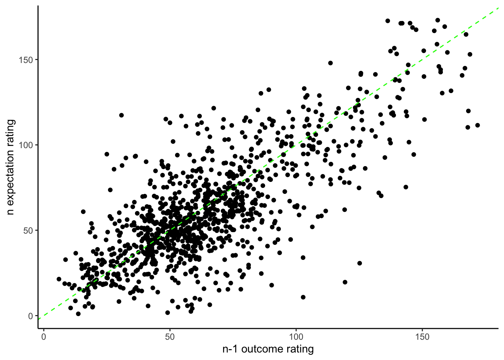
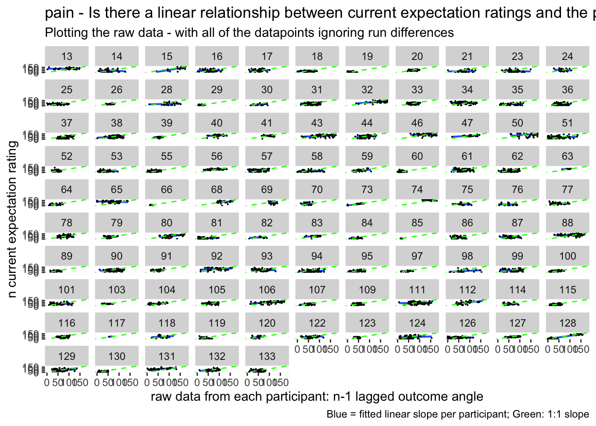
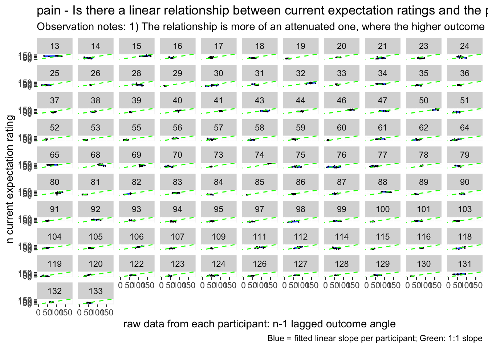
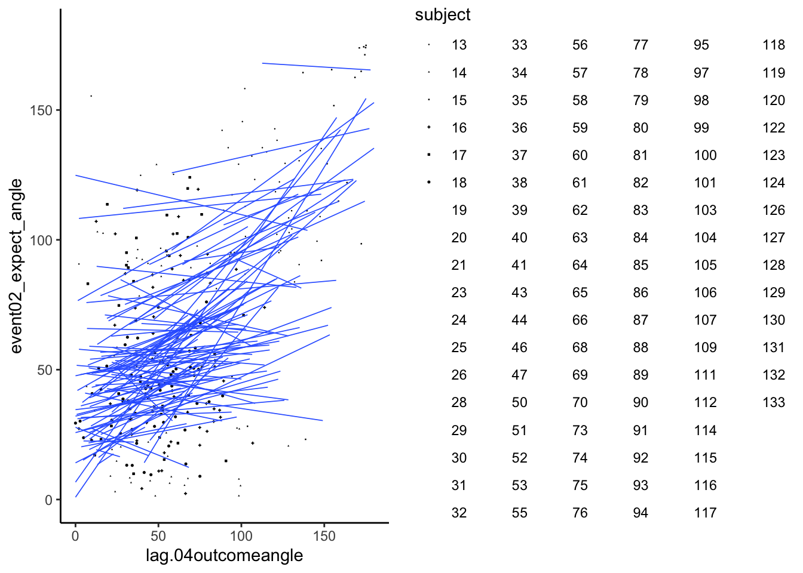
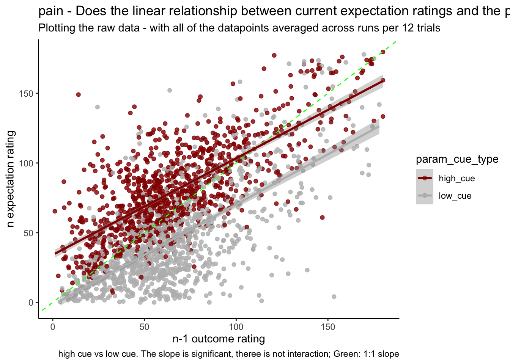
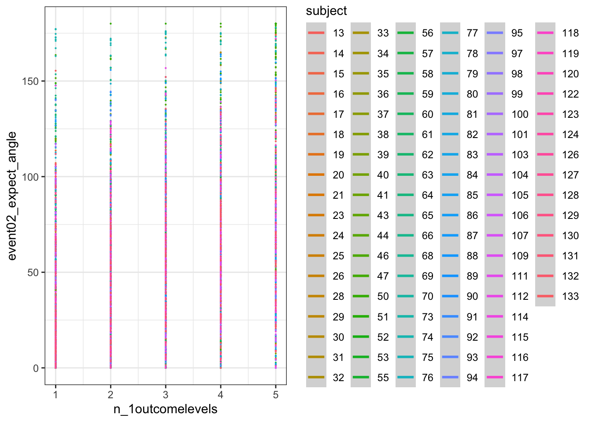
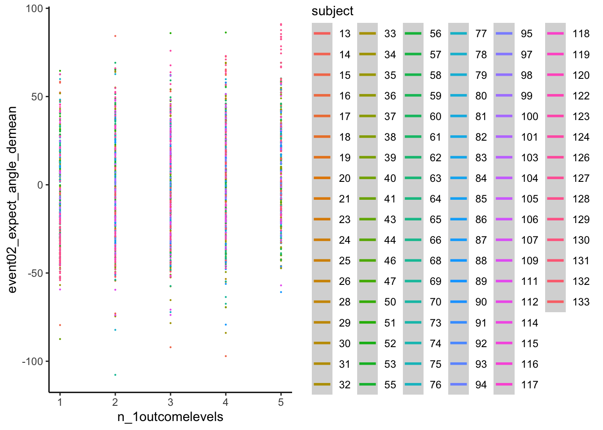
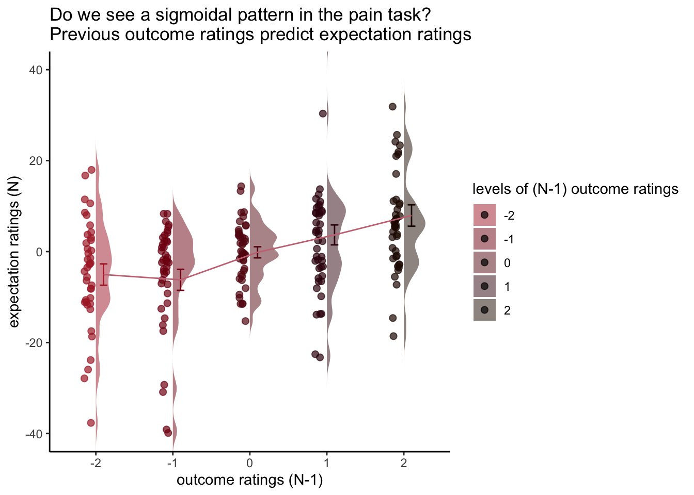

# [beh] N-1 outcome rating ~ N expectation rating {#ch11_n-1outcome}

```
date: '2022-09-13'
updated: '2023-01-18'
```


### DONE {.unlisted .unnumbered}
* plot individual ratings (check distribution)
* afterwards, normalize the ratings and bin them

### Overview  {.unlisted .unnumbered}
* My hypothesis is that the cue-expectancy follows a Bayesian mechanism, akin to what's listed in Jayazeri (2019)
* Here, I plot the expectation ratings (N) and outcome ratings (N-1) and see if the pattern is akin to a sigmoidal curve. 
* If so, I plan to dive deeper and potentially take a Bayesian approach. Jayazeri (2018)


## expectation_rating ~ N-1_outcome_rating 
### Additional analyse 01/18/2023: Q. Do previous outcome ratings predict current expectation ratings? {.unlisted .unnumbered}

* see if current expectation ratings predict outcome ratings
* see if prior stimulus experience (N-1) predicts current expectation ratings
* see if current expectation ratings are explained as a function of prior outcome rating and current expectation rating

when loading the dataset, I need to add in trial index per dataframe.
Then, for the shift the rating? 


```r
model.lagoutcome = lmer(event02_expect_angle ~ lag.04outcomeangle + (1 | src_subject_id) + (1|session_id) , data = data_a3lag_omit,REML = FALSE)
# summary(model.lagoutcome)
sjPlot::tab_model(model.lagoutcome)
```

<table style="border-collapse:collapse; border:none;">
<tr>
<th style="border-top: double; text-align:center; font-style:normal; font-weight:bold; padding:0.2cm;  text-align:left; ">&nbsp;</th>
<th colspan="3" style="border-top: double; text-align:center; font-style:normal; font-weight:bold; padding:0.2cm; ">event02_expect_angle</th>
</tr>
<tr>
<td style=" text-align:center; border-bottom:1px solid; font-style:italic; font-weight:normal;  text-align:left; ">Predictors</td>
<td style=" text-align:center; border-bottom:1px solid; font-style:italic; font-weight:normal;  ">Estimates</td>
<td style=" text-align:center; border-bottom:1px solid; font-style:italic; font-weight:normal;  ">CI</td>
<td style=" text-align:center; border-bottom:1px solid; font-style:italic; font-weight:normal;  ">p</td>
</tr>
<tr>
<td style=" padding:0.2cm; text-align:left; vertical-align:top; text-align:left; ">(Intercept)</td>
<td style=" padding:0.2cm; text-align:left; vertical-align:top; text-align:center;  ">43.60</td>
<td style=" padding:0.2cm; text-align:left; vertical-align:top; text-align:center;  ">38.85&nbsp;&ndash;&nbsp;48.34</td>
<td style=" padding:0.2cm; text-align:left; vertical-align:top; text-align:center;  "><strong>&lt;0.001</strong></td>
</tr>
<tr>
<td style=" padding:0.2cm; text-align:left; vertical-align:top; text-align:left; ">lag 04outcomeangle</td>
<td style=" padding:0.2cm; text-align:left; vertical-align:top; text-align:center;  ">0.28</td>
<td style=" padding:0.2cm; text-align:left; vertical-align:top; text-align:center;  ">0.25&nbsp;&ndash;&nbsp;0.31</td>
<td style=" padding:0.2cm; text-align:left; vertical-align:top; text-align:center;  "><strong>&lt;0.001</strong></td>
</tr>
<tr>
<td colspan="4" style="font-weight:bold; text-align:left; padding-top:.8em;">Random Effects</td>
</tr>

<tr>
<td style=" padding:0.2cm; text-align:left; vertical-align:top; text-align:left; padding-top:0.1cm; padding-bottom:0.1cm;">&sigma;<sup>2</sup></td>
<td style=" padding:0.2cm; text-align:left; vertical-align:top; padding-top:0.1cm; padding-bottom:0.1cm; text-align:left;" colspan="3">773.59</td>
</tr>

<tr>
<td style=" padding:0.2cm; text-align:left; vertical-align:top; text-align:left; padding-top:0.1cm; padding-bottom:0.1cm;">&tau;<sub>00</sub> <sub>src_subject_id</sub></td>
<td style=" padding:0.2cm; text-align:left; vertical-align:top; padding-top:0.1cm; padding-bottom:0.1cm; text-align:left;" colspan="3">472.65</td>

<tr>
<td style=" padding:0.2cm; text-align:left; vertical-align:top; text-align:left; padding-top:0.1cm; padding-bottom:0.1cm;">&tau;<sub>00</sub> <sub>session_id</sub></td>
<td style=" padding:0.2cm; text-align:left; vertical-align:top; padding-top:0.1cm; padding-bottom:0.1cm; text-align:left;" colspan="3">0.02</td>

<tr>
<td style=" padding:0.2cm; text-align:left; vertical-align:top; text-align:left; padding-top:0.1cm; padding-bottom:0.1cm;">ICC</td>
<td style=" padding:0.2cm; text-align:left; vertical-align:top; padding-top:0.1cm; padding-bottom:0.1cm; text-align:left;" colspan="3">0.38</td>

<tr>
<td style=" padding:0.2cm; text-align:left; vertical-align:top; text-align:left; padding-top:0.1cm; padding-bottom:0.1cm;">N <sub>src_subject_id</sub></td>
<td style=" padding:0.2cm; text-align:left; vertical-align:top; padding-top:0.1cm; padding-bottom:0.1cm; text-align:left;" colspan="3">104</td>

<tr>
<td style=" padding:0.2cm; text-align:left; vertical-align:top; text-align:left; padding-top:0.1cm; padding-bottom:0.1cm;">N <sub>session_id</sub></td>
<td style=" padding:0.2cm; text-align:left; vertical-align:top; padding-top:0.1cm; padding-bottom:0.1cm; text-align:left;" colspan="3">3</td>
<tr>
<td style=" padding:0.2cm; text-align:left; vertical-align:top; text-align:left; padding-top:0.1cm; padding-bottom:0.1cm; border-top:1px solid;">Observations</td>
<td style=" padding:0.2cm; text-align:left; vertical-align:top; padding-top:0.1cm; padding-bottom:0.1cm; text-align:left; border-top:1px solid;" colspan="3">4807</td>
</tr>
<tr>
<td style=" padding:0.2cm; text-align:left; vertical-align:top; text-align:left; padding-top:0.1cm; padding-bottom:0.1cm;">Marginal R<sup>2</sup> / Conditional R<sup>2</sup></td>
<td style=" padding:0.2cm; text-align:left; vertical-align:top; padding-top:0.1cm; padding-bottom:0.1cm; text-align:left;" colspan="3">0.080 / 0.429</td>
</tr>

</table>


### Not sure whether this is accurate {.unlisted .unnumbered}

```r
startvec <- c(Asym =10, xmid = 0, scal = 350)
nm1 <- nlmer(event02_expect_angle ~ SSlogis(lag.04outcomeangle,Asym, xmid, scal) ~ Asym|src_subject_id, 
             data_a3lag_omit, start = startvec)
```

```r
nform <- ~Asym/(1+exp((xmid-input)/scal))
## b. Use deriv() to construct function:
nfun <- deriv(nform,namevec=c("Asym","xmid","scal"),
              function.arg=c("input","Asym","xmid","scal"))
nm1b <- update(nm1,event02_expect_angle ~ nfun(lag.04outcomeangle, Asym, xmid, scal)  ~ Asym | src_subject_id)
sjPlot::tab_model(nm1b)
```

<table style="border-collapse:collapse; border:none;">
<tr>
<th style="border-top: double; text-align:center; font-style:normal; font-weight:bold; padding:0.2cm;  text-align:left; ">&nbsp;</th>
<th colspan="3" style="border-top: double; text-align:center; font-style:normal; font-weight:bold; padding:0.2cm; ">event02_expect_angle ~<br>nfun(lag.04outcomeangle,<br>Asym, xmid, scal)</th>
</tr>
<tr>
<td style=" text-align:center; border-bottom:1px solid; font-style:italic; font-weight:normal;  text-align:left; ">Predictors</td>
<td style=" text-align:center; border-bottom:1px solid; font-style:italic; font-weight:normal;  ">Estimates</td>
<td style=" text-align:center; border-bottom:1px solid; font-style:italic; font-weight:normal;  ">CI</td>
<td style=" text-align:center; border-bottom:1px solid; font-style:italic; font-weight:normal;  ">p</td>
</tr>
<tr>
<td style=" padding:0.2cm; text-align:left; vertical-align:top; text-align:left; ">Asym</td>
<td style=" padding:0.2cm; text-align:left; vertical-align:top; text-align:center;  ">10173.50</td>
<td style=" padding:0.2cm; text-align:left; vertical-align:top; text-align:center;  ">10031.00&nbsp;&ndash;&nbsp;10316.00</td>
<td style=" padding:0.2cm; text-align:left; vertical-align:top; text-align:center;  "><strong>&lt;0.001</strong></td>
</tr>
<tr>
<td style=" padding:0.2cm; text-align:left; vertical-align:top; text-align:left; ">xmid</td>
<td style=" padding:0.2cm; text-align:left; vertical-align:top; text-align:center;  ">1437.76</td>
<td style=" padding:0.2cm; text-align:left; vertical-align:top; text-align:center;  ">1326.22&nbsp;&ndash;&nbsp;1549.30</td>
<td style=" padding:0.2cm; text-align:left; vertical-align:top; text-align:center;  "><strong>&lt;0.001</strong></td>
</tr>
<tr>
<td style=" padding:0.2cm; text-align:left; vertical-align:top; text-align:left; ">scal</td>
<td style=" padding:0.2cm; text-align:left; vertical-align:top; text-align:center;  ">267.15</td>
<td style=" padding:0.2cm; text-align:left; vertical-align:top; text-align:center;  ">244.84&nbsp;&ndash;&nbsp;289.47</td>
<td style=" padding:0.2cm; text-align:left; vertical-align:top; text-align:center;  "><strong>&lt;0.001</strong></td>
</tr>
<tr>
<td colspan="4" style="font-weight:bold; text-align:left; padding-top:.8em;">Random Effects</td>
</tr>

<tr>
<td style=" padding:0.2cm; text-align:left; vertical-align:top; text-align:left; padding-top:0.1cm; padding-bottom:0.1cm;">&sigma;<sup>2</sup></td>
<td style=" padding:0.2cm; text-align:left; vertical-align:top; padding-top:0.1cm; padding-bottom:0.1cm; text-align:left;" colspan="3">776.12</td>
</tr>

<tr>
<td style=" padding:0.2cm; text-align:left; vertical-align:top; text-align:left; padding-top:0.1cm; padding-bottom:0.1cm;">&tau;<sub>00</sub></td>
<td style=" padding:0.2cm; text-align:left; vertical-align:top; padding-top:0.1cm; padding-bottom:0.1cm; text-align:left;" colspan="3">&nbsp;</td>

<tr>
<td style=" padding:0.2cm; text-align:left; vertical-align:top; text-align:left; padding-top:0.1cm; padding-bottom:0.1cm;">&tau;<sub>00</sub></td>
<td style=" padding:0.2cm; text-align:left; vertical-align:top; padding-top:0.1cm; padding-bottom:0.1cm; text-align:left;" colspan="3">&nbsp;</td>

<tr>
<td style=" padding:0.2cm; text-align:left; vertical-align:top; text-align:left; padding-top:0.1cm; padding-bottom:0.1cm;">&tau;<sub>11</sub> <sub>src_subject_id.Asym</sub></td>
<td style=" padding:0.2cm; text-align:left; vertical-align:top; padding-top:0.1cm; padding-bottom:0.1cm; text-align:left;" colspan="3">12680931.61</td>

<tr>
<td style=" padding:0.2cm; text-align:left; vertical-align:top; text-align:left; padding-top:0.1cm; padding-bottom:0.1cm;">&rho;<sub>01</sub></td>
<td style=" padding:0.2cm; text-align:left; vertical-align:top; padding-top:0.1cm; padding-bottom:0.1cm; text-align:left;" colspan="3">&nbsp;</td>

<tr>
<td style=" padding:0.2cm; text-align:left; vertical-align:top; text-align:left; padding-top:0.1cm; padding-bottom:0.1cm;">&rho;<sub>01</sub></td>
<td style=" padding:0.2cm; text-align:left; vertical-align:top; padding-top:0.1cm; padding-bottom:0.1cm; text-align:left;" colspan="3">&nbsp;</td>

<tr>
<td style=" padding:0.2cm; text-align:left; vertical-align:top; text-align:left; padding-top:0.1cm; padding-bottom:0.1cm;">ICC</td>
<td style=" padding:0.2cm; text-align:left; vertical-align:top; padding-top:0.1cm; padding-bottom:0.1cm; text-align:left;" colspan="3">1.00</td>

<tr>
<td style=" padding:0.2cm; text-align:left; vertical-align:top; text-align:left; padding-top:0.1cm; padding-bottom:0.1cm;">N <sub>src_subject_id</sub></td>
<td style=" padding:0.2cm; text-align:left; vertical-align:top; padding-top:0.1cm; padding-bottom:0.1cm; text-align:left;" colspan="3">104</td>
<tr>
<td style=" padding:0.2cm; text-align:left; vertical-align:top; text-align:left; padding-top:0.1cm; padding-bottom:0.1cm; border-top:1px solid;">Observations</td>
<td style=" padding:0.2cm; text-align:left; vertical-align:top; padding-top:0.1cm; padding-bottom:0.1cm; text-align:left; border-top:1px solid;" colspan="3">4807</td>
</tr>
<tr>
<td style=" padding:0.2cm; text-align:left; vertical-align:top; text-align:left; padding-top:0.1cm; padding-bottom:0.1cm;">Marginal R<sup>2</sup> / Conditional R<sup>2</sup></td>
<td style=" padding:0.2cm; text-align:left; vertical-align:top; padding-top:0.1cm; padding-bottom:0.1cm; text-align:left;" colspan="3">0.606 / 1.000</td>
</tr>

</table>


```r
bbmle::AICtab(model.lagoutcome, nm1b)
```

```
##                  dAIC df
## model.lagoutcome 0.0  5 
## nm1b             8.3  5
```





```
## Warning: Using `size` aesthetic for lines was deprecated in ggplot2 3.4.0.
## ℹ Please use `linewidth` instead.
```

```
## `geom_smooth()` using formula = 'y ~ x'
```

```
## Warning: Removed 222 rows containing non-finite values (`stat_smooth()`).
```

```
## Warning: Removed 222 rows containing missing values (`geom_point()`).
```






```r
# https://gist.github.com/even4void/5074855
```


```
## Warning: Removed 222 rows containing non-finite values (`stat_smooth()`).
```

```
## Warning: The shape palette can deal with a maximum of 6 discrete values because
## more than 6 becomes difficult to discriminate; you have 104. Consider
## specifying shapes manually if you must have them.
```

```
## Warning: Removed 4763 rows containing missing values (`geom_point()`).
```




## Current expectation_rating ~ N-1_outcomerating * cue

### Additional analysis 01/23/2023 Q. Do these models differ as a function of cue? {.unlisted .unnumbered}


```r
model.lag_cue = lmer(event02_expect_angle ~ lag.04outcomeangle*param_cue_type + (1 | src_subject_id) + (1|session_id) , data = data_a3lag_omit)
```

```
## boundary (singular) fit: see help('isSingular')
```

```r
sjPlot::tab_model(model.lag_cue)
```

<table style="border-collapse:collapse; border:none;">
<tr>
<th style="border-top: double; text-align:center; font-style:normal; font-weight:bold; padding:0.2cm;  text-align:left; ">&nbsp;</th>
<th colspan="3" style="border-top: double; text-align:center; font-style:normal; font-weight:bold; padding:0.2cm; ">event02_expect_angle</th>
</tr>
<tr>
<td style=" text-align:center; border-bottom:1px solid; font-style:italic; font-weight:normal;  text-align:left; ">Predictors</td>
<td style=" text-align:center; border-bottom:1px solid; font-style:italic; font-weight:normal;  ">Estimates</td>
<td style=" text-align:center; border-bottom:1px solid; font-style:italic; font-weight:normal;  ">CI</td>
<td style=" text-align:center; border-bottom:1px solid; font-style:italic; font-weight:normal;  ">p</td>
</tr>
<tr>
<td style=" padding:0.2cm; text-align:left; vertical-align:top; text-align:left; ">(Intercept)</td>
<td style=" padding:0.2cm; text-align:left; vertical-align:top; text-align:center;  ">62.40</td>
<td style=" padding:0.2cm; text-align:left; vertical-align:top; text-align:center;  ">57.60&nbsp;&ndash;&nbsp;67.21</td>
<td style=" padding:0.2cm; text-align:left; vertical-align:top; text-align:center;  "><strong>&lt;0.001</strong></td>
</tr>
<tr>
<td style=" padding:0.2cm; text-align:left; vertical-align:top; text-align:left; ">lag 04outcomeangle</td>
<td style=" padding:0.2cm; text-align:left; vertical-align:top; text-align:center;  ">0.26</td>
<td style=" padding:0.2cm; text-align:left; vertical-align:top; text-align:center;  ">0.23&nbsp;&ndash;&nbsp;0.29</td>
<td style=" padding:0.2cm; text-align:left; vertical-align:top; text-align:center;  "><strong>&lt;0.001</strong></td>
</tr>
<tr>
<td style=" padding:0.2cm; text-align:left; vertical-align:top; text-align:left; ">param cue type [low_cue]</td>
<td style=" padding:0.2cm; text-align:left; vertical-align:top; text-align:center;  ">&#45;34.76</td>
<td style=" padding:0.2cm; text-align:left; vertical-align:top; text-align:center;  ">&#45;37.24&nbsp;&ndash;&nbsp;-32.27</td>
<td style=" padding:0.2cm; text-align:left; vertical-align:top; text-align:center;  "><strong>&lt;0.001</strong></td>
</tr>
<tr>
<td style=" padding:0.2cm; text-align:left; vertical-align:top; text-align:left; ">lag 04outcomeangle *<br>param cue type [low_cue]</td>
<td style=" padding:0.2cm; text-align:left; vertical-align:top; text-align:center;  ">0.01</td>
<td style=" padding:0.2cm; text-align:left; vertical-align:top; text-align:center;  ">&#45;0.03&nbsp;&ndash;&nbsp;0.04</td>
<td style=" padding:0.2cm; text-align:left; vertical-align:top; text-align:center;  ">0.745</td>
</tr>
<tr>
<td colspan="4" style="font-weight:bold; text-align:left; padding-top:.8em;">Random Effects</td>
</tr>

<tr>
<td style=" padding:0.2cm; text-align:left; vertical-align:top; text-align:left; padding-top:0.1cm; padding-bottom:0.1cm;">&sigma;<sup>2</sup></td>
<td style=" padding:0.2cm; text-align:left; vertical-align:top; padding-top:0.1cm; padding-bottom:0.1cm; text-align:left;" colspan="3">472.37</td>
</tr>

<tr>
<td style=" padding:0.2cm; text-align:left; vertical-align:top; text-align:left; padding-top:0.1cm; padding-bottom:0.1cm;">&tau;<sub>00</sub> <sub>src_subject_id</sub></td>
<td style=" padding:0.2cm; text-align:left; vertical-align:top; padding-top:0.1cm; padding-bottom:0.1cm; text-align:left;" colspan="3">496.11</td>

<tr>
<td style=" padding:0.2cm; text-align:left; vertical-align:top; text-align:left; padding-top:0.1cm; padding-bottom:0.1cm;">&tau;<sub>00</sub> <sub>session_id</sub></td>
<td style=" padding:0.2cm; text-align:left; vertical-align:top; padding-top:0.1cm; padding-bottom:0.1cm; text-align:left;" colspan="3">0.00</td>

<tr>
<td style=" padding:0.2cm; text-align:left; vertical-align:top; text-align:left; padding-top:0.1cm; padding-bottom:0.1cm;">N <sub>src_subject_id</sub></td>
<td style=" padding:0.2cm; text-align:left; vertical-align:top; padding-top:0.1cm; padding-bottom:0.1cm; text-align:left;" colspan="3">104</td>

<tr>
<td style=" padding:0.2cm; text-align:left; vertical-align:top; text-align:left; padding-top:0.1cm; padding-bottom:0.1cm;">N <sub>session_id</sub></td>
<td style=" padding:0.2cm; text-align:left; vertical-align:top; padding-top:0.1cm; padding-bottom:0.1cm; text-align:left;" colspan="3">3</td>
<tr>
<td style=" padding:0.2cm; text-align:left; vertical-align:top; text-align:left; padding-top:0.1cm; padding-bottom:0.1cm; border-top:1px solid;">Observations</td>
<td style=" padding:0.2cm; text-align:left; vertical-align:top; padding-top:0.1cm; padding-bottom:0.1cm; text-align:left; border-top:1px solid;" colspan="3">4807</td>
</tr>
<tr>
<td style=" padding:0.2cm; text-align:left; vertical-align:top; text-align:left; padding-top:0.1cm; padding-bottom:0.1cm;">Marginal R<sup>2</sup> / Conditional R<sup>2</sup></td>
<td style=" padding:0.2cm; text-align:left; vertical-align:top; padding-top:0.1cm; padding-bottom:0.1cm; text-align:left;" colspan="3">0.456 / NA</td>
</tr>

</table>





## Let's demean the ratings.

* Bin ratings
* Check if the bins do their jobs? by plotting one run
* then check the min, max and see if the quantization is done properly.

> YES, it is


confirm that df discrete has 5 levels per participant
the number of counts per frequency can differ 


```
## # A tibble: 516 × 3
##    src_subject_id n_1outcomelevels     n
##    <fct>                     <dbl> <int>
##  1 13                            1     2
##  2 13                            2     7
##  3 13                            3     4
##  4 13                            4    12
##  5 13                            5    19
##  6 14                            1    11
##  7 14                            2    17
##  8 14                            3     7
##  9 14                            4     8
## 10 14                            5     1
## # … with 506 more rows
```


```
## `geom_smooth()` using formula = 'y ~ s(x, bs = "cs")'
```

```
## Warning: Removed 222 rows containing non-finite values (`stat_smooth()`).
```

```
## Warning: Computation failed in `stat_smooth()`
## Caused by error in `smooth.construct.cr.smooth.spec()`:
## ! x has insufficient unique values to support 10 knots: reduce k.
```

```
## Warning: Removed 222 rows containing missing values (`geom_point()`).
```




## DEMEAN AND THEN DISCRETIZE


```r
res <- df_discrete %>% 
  group_by(src_subject_id,n_1outcomelevels) %>% 
  tally()
res
```

```
## # A tibble: 516 × 3
## # Groups:   src_subject_id [104]
##    src_subject_id n_1outcomelevels     n
##    <fct>                     <dbl> <int>
##  1 13                            1     2
##  2 13                            2     7
##  3 13                            3     4
##  4 13                            4    12
##  5 13                            5    19
##  6 14                            1    11
##  7 14                            2    17
##  8 14                            3     7
##  9 14                            4     8
## 10 14                            5     1
## # … with 506 more rows
```


```
## `geom_smooth()` using formula = 'y ~ s(x, bs = "cs")'
```

```
## Warning: Removed 2917 rows containing non-finite values (`stat_smooth()`).
```

```
## Warning: Computation failed in `stat_smooth()`
## Caused by error in `smooth.construct.cr.smooth.spec()`:
## ! x has insufficient unique values to support 10 knots: reduce k.
```

```
## Warning: Removed 2917 rows containing missing values (`geom_point()`).
```





https://groups.google.com/g/ggplot2/c/csPNfSLKkco


