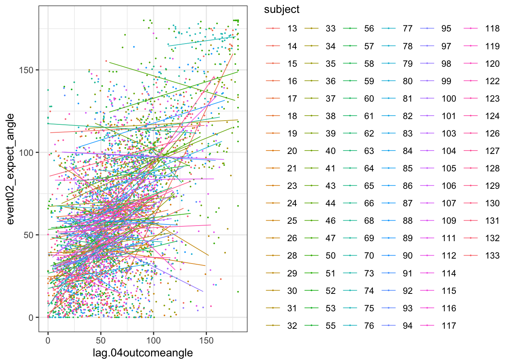
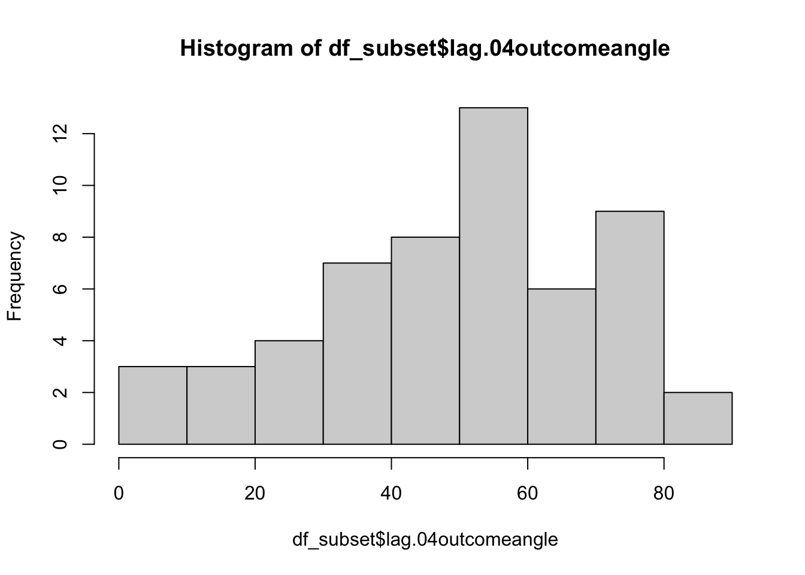

#  (N-2) shifted outcome ratings ~ (N) expectation ratings; Jayazeri (2018) {#ch12_n-1outcome}

```
title: "model12_jayazeri_N-2"
date: '2023-01-31'
updated: '2023-01-31'
```


## Overview  {.unlisted .unnumbered}
My hypothesis is that the cue-expectancy follows a Bayesian mechanism, akin to what's listed in Jayazeri (2019).
Here, I plot the expectation ratings (N) and outcome ratings (N-2) and see if the pattern is similar to a sigmoidal curve. If so, I plan to dive deeper and potentially take a Bayesian approach. 

library


load data and combine participant data


## Do previous outcome ratings predict current expectation ratings?
### Additional analyse 01/18/2023 {.unlisted .unnumbered}
* examine if prior stimulus experience (N-2) predicts current expectation ratings
* see if current expectation ratings are explained as a function of prior outcome rating and current expectation rating

when loading the dataset, I need to add in trial index per dataframe.
Then, for the shift the rating? 


```
## Linear mixed model fit by REML. t-tests use Satterthwaite's method [
## lmerModLmerTest]
## Formula: event02_expect_angle ~ lag.04outcomeangle + (1 | src_subject_id) +  
##     (1 | session_id)
##    Data: data_a3lag_omit
## 
## REML criterion at convergence: 41892
## 
## Scaled residuals: 
##     Min      1Q  Median      3Q     Max 
## -4.7836 -0.6742  0.0243  0.6639  3.4522 
## 
## Random effects:
##  Groups         Name        Variance Std.Dev.
##  src_subject_id (Intercept) 522.8    22.86   
##  session_id     (Intercept)   0.0     0.00   
##  Residual                   770.0    27.75   
## Number of obs: 4381, groups:  src_subject_id, 104; session_id, 3
## 
## Fixed effects:
##                     Estimate Std. Error        df t value Pr(>|t|)    
## (Intercept)        4.753e+01  2.548e+00 1.436e+02   18.66   <2e-16 ***
## lag.04outcomeangle 2.343e-01  1.675e-02 4.294e+03   13.98   <2e-16 ***
## ---
## Signif. codes:  0 '***' 0.001 '**' 0.01 '*' 0.05 '.' 0.1 ' ' 1
## 
## Correlation of Fixed Effects:
##             (Intr)
## lg.04tcmngl -0.433
## optimizer (nloptwrap) convergence code: 0 (OK)
## boundary (singular) fit: see help('isSingular')
```


```r
    trialorder_groupwise <- summarySEwithin(
        data = subjectwise_naomit_2dv,
        measurevar = "DV1_mean_per_sub",
        # betweenvars = "src_subject_id",
        withinvars = factor( "trial_index"),
         idvar = "src_subject_id"
    )
```

```
## Automatically converting the following non-factors to factors: src_subject_id
```


Warning: Removed 222 rows containing non-finite values (`stat_smooth()`).


```r
# https://gist.github.com/even4void/5074855
```


Warning: Removed 222 rows containing non-finite values (`stat_smooth()`).

## Do these models differ as a function of cue?
### Additional analysis 01/23/2023 {.unlisted .unnumbered}

```
## Linear mixed model fit by REML. t-tests use Satterthwaite's method [
## lmerModLmerTest]
## Formula: event02_expect_angle ~ lag.04outcomeangle * param_cue_type +  
##     (1 | src_subject_id) + (1 | session_id)
##    Data: data_a3lag_omit
## 
## REML criterion at convergence: 39852.4
## 
## Scaled residuals: 
##     Min      1Q  Median      3Q     Max 
## -5.2141 -0.6403 -0.0326  0.6247  4.6722 
## 
## Random effects:
##  Groups         Name        Variance Std.Dev.
##  src_subject_id (Intercept) 540.1    23.24   
##  session_id     (Intercept)   0.0     0.00   
##  Residual                   477.4    21.85   
## Number of obs: 4381, groups:  src_subject_id, 104; session_id, 3
## 
## Fixed effects:
##                                            Estimate Std. Error         df
## (Intercept)                               6.478e+01  2.572e+00  1.495e+02
## lag.04outcomeangle                        2.255e-01  1.631e-02  4.374e+03
## param_cue_typelow_cue                    -3.367e+01  1.346e+00  4.274e+03
## lag.04outcomeangle:param_cue_typelow_cue -3.175e-03  1.771e-02  4.274e+03
##                                          t value Pr(>|t|)    
## (Intercept)                               25.186   <2e-16 ***
## lag.04outcomeangle                        13.831   <2e-16 ***
## param_cue_typelow_cue                    -25.025   <2e-16 ***
## lag.04outcomeangle:param_cue_typelow_cue  -0.179    0.858    
## ---
## Signif. codes:  0 '***' 0.001 '**' 0.01 '*' 0.05 '.' 0.1 ' ' 1
## 
## Correlation of Fixed Effects:
##             (Intr) lg.04t prm___
## lg.04tcmngl -0.418              
## prm_c_typl_ -0.273  0.503       
## lg.04tc:___  0.243 -0.578 -0.871
## optimizer (nloptwrap) convergence code: 0 (OK)
## boundary (singular) fit: see help('isSingular')
```


```
## `geom_smooth()` using formula = 'y ~ x'
```

```
## Warning: Removed 29 rows containing non-finite values (`stat_smooth()`).
```

```
## Warning: Removed 29 rows containing missing values (`geom_point()`).
```


## Let's demean the ratings. {.unlisted .unnumbered}
bin ratings
Do the bins do their jobs?
plot one run
then check the min, max and see if the quantization is done properly.
YES, it is

```r
# per subject, session, run
df_subset = subset(data_a3lag_omit, src_subject_id == 18 )
#df_subset$lag.04outcomeangle
min(df_subset$lag.04outcomeangle)
```

```
## [1] 0
```

```r
max(df_subset$lag.04outcomeangle)
```

```
## [1] 88.7054
```

```r
range(df_subset$lag.04outcomeangle)
```

```
## [1]  0.0000 88.7054
```

```r
cut_interval(range(df_subset$lag.04outcomeangle), n = 5)
```

```
## [1] [0,17.7]  (71,88.7]
## Levels: [0,17.7] (17.7,35.5] (35.5,53.2] (53.2,71] (71,88.7]
```

```r
hist(df_subset$lag.04outcomeangle)
```



```r
df_subset$bin = cut_interval(df_subset$lag.04outcomeangle, n = 5)
df_subset$bin_num = as.numeric(cut_interval(df_subset$lag.04outcomeangle, n = 5))
```


```r
df_discrete = data_a3lag_omit %>%
  group_by(src_subject_id) %>%
  mutate(bin = cut_interval(lag.04outcomeangle, n = 5),
         n_2outcomelevels = as.numeric(cut_interval(lag.04outcomeangle, n = 5)))
```

### confirm that df discrete has 5 levels per participant
the number of counts per frequency can differ 

```r
res <- df_discrete %>% 
  group_by(src_subject_id,n_2outcomelevels) %>% 
  tally()
```


```r
res
```

```
## # A tibble: 514 × 3
## # Groups:   src_subject_id [104]
##    src_subject_id n_2outcomelevels     n
##    <fct>                     <dbl> <int>
##  1 13                            1     1
##  2 13                            2     4
##  3 13                            3     4
##  4 13                            4    12
##  5 13                            5    19
##  6 14                            1    10
##  7 14                            2    16
##  8 14                            3     7
##  9 14                            4     6
## 10 14                            5     1
## # … with 504 more rows
```


```r
pain_df  = df_discrete[df_discrete$param_task_name == "pain",]
ggplot(pain_df, aes(y = event02_expect_angle, 
                       x = n_2outcomelevels, 
                       colour = subject), size = .3, color = 'gray') + 
  geom_point(size = .1) + 
  geom_smooth(method = "gam") +
  theme_bw()
```

```
## `geom_smooth()` using formula = 'y ~ s(x, bs = "cs")'
```

```
## Warning: Removed 202 rows containing non-finite values (`stat_smooth()`).
```

```
## Warning: Computation failed in `stat_smooth()`
## Caused by error in `smooth.construct.cr.smooth.spec()`:
## ! x has insufficient unique values to support 10 knots: reduce k.
```

```
## Warning: Removed 202 rows containing missing values (`geom_point()`).
```


## Demean and discretize


```r
df_discrete = data_a3lag_omit %>%
  group_by(src_subject_id) %>%
  mutate(lag.04outcomeangle_demean = lag.04outcomeangle-mean(lag.04outcomeangle),
         event02_expect_angle_demean = event02_expect_angle-mean(event02_expect_angle)) %>%
  mutate(bin = cut_interval(lag.04outcomeangle_demean, n = 5),
         n_2outcomelevels = as.numeric(cut_interval(lag.04outcomeangle_demean, n = 5)))
```

### Check how many trials land in each outcome level  {.unlisted .unnumbered}

```r
res <- df_discrete %>% 
  group_by(src_subject_id,n_2outcomelevels) %>% 
  tally()
res
```

```
## # A tibble: 514 × 3
## # Groups:   src_subject_id [104]
##    src_subject_id n_2outcomelevels     n
##    <fct>                     <dbl> <int>
##  1 13                            1     1
##  2 13                            2     4
##  3 13                            3     4
##  4 13                            4    12
##  5 13                            5    19
##  6 14                            1    10
##  7 14                            2    16
##  8 14                            3     7
##  9 14                            4     6
## 10 14                            5     1
## # … with 504 more rows
```


```r
pain_df  = df_discrete[df_discrete$param_task_name == "pain",]
ggplot(pain_df, aes(y = event02_expect_angle_demean, 
                       x = n_2outcomelevels, 
                       colour = subject), size = .3, color = 'gray') + 
  geom_point(size = .1) + 
  geom_smooth(method = "gam") +
  theme_bw()
```

```
## `geom_smooth()` using formula = 'y ~ s(x, bs = "cs")'
```

```
## Warning: Removed 2601 rows containing non-finite values (`stat_smooth()`).
```

```
## Warning: Computation failed in `stat_smooth()`
## Caused by error in `smooth.construct.cr.smooth.spec()`:
## ! x has insufficient unique values to support 10 knots: reduce k.
```

```
## Warning: Removed 2601 rows containing missing values (`geom_point()`).
```


```r
df_discrete$n_2outcomelevels_newlev = df_discrete$n_2outcomelevels -3
    subjectwise_bin_demean <- meanSummary(df_discrete, c(
        "subject","param_task_name","n_2outcomelevels" 
    ), "event02_expect_angle_demean")
subjectwise_bin_demean_naomit <- na.omit(subjectwise_bin_demean)
    groupwise_bin_demean <- summarySEwithin(
        data = subjectwise_bin_demean_naomit,
        measurevar = "mean_per_sub", # variable created from above
        withinvars = c("n_2outcomelevels"), # iv
       idvar = "subject"
    )
```

```
## Automatically converting the following non-factors to factors: n_2outcomelevels
```

```r
subjectwise_bin_demean_naomit$n_2outcomelevels_newlev = as.numeric(subjectwise_bin_demean_naomit$n_2outcomelevels) -3
groupwise_bin_demean$n_2outcomelevels_newlev = as.numeric(groupwise_bin_demean$n_2outcomelevels) -3
```


```r
plot_halfrainclouds_sig <- function(subjectwise, groupwise, iv,sub_iv,
                                      subjectwise_mean, group_mean, se, subject,
                                      ggtitle, title, xlab, ylab, taskname, ylim,
                                      w, h, dv_keyword, color, save_fname) {
  g <- ggplot(
    data = subjectwise,
    aes(
      y = .data[[subjectwise_mean]],
      x = factor(.data[[iv]]),
      fill = factor(.data[[iv]])
    )
  ) +
    coord_cartesian(ylim = ylim, expand = TRUE) +

    geom_half_violin(
      aes(fill = factor(.data[[iv]])),
      side = 'r',
      #position = 'dodge',
      adjust = 0.5,
      trim = FALSE,
      alpha = .5,
      colour = NA
    ) +

  geom_point(
    aes(
      # group = .data[[subject]],
      x = as.numeric(as.factor(.data[[iv]])) - .1 ,
      y = .data[[subjectwise_mean]],
      color = factor(.data[[iv]])
    ),
    position = position_jitter(width = .05),
    size = 2,
    alpha = 0.7,
  ) + 

    geom_errorbar(
      data = groupwise,
      aes(
        x = as.numeric(.data[[sub_iv]]) + .1 ,
        y = as.numeric(.data[[group_mean]]),
        color = factor(.data[[iv]]),
        ymin = .data[[group_mean]] - .data[[se]],
        ymax = .data[[group_mean]] + .data[[se]]
      ),
      position = position_dodge(width=0.1), width=0.1 ,   # position = 'dodge',
      alpha = 1
    ) +
geom_line(
  data = groupwise,
  aes(
    #group = .data[[subject]],
    group = 1,
    y = as.numeric(.data[[group_mean]]),
    x = as.numeric(.data[[sub_iv]]) + .1 ,
    # fill = factor(.data[[iv]])
  ),
  linetype = "solid", color = "#C97482", alpha = 1
) +

    # legend stuff ________________________________________________________ # nolint
    guides(color = "none") +
    guides(fill = guide_legend(title = title)) +
    scale_fill_manual(values = color) +
    scale_color_manual(values = color) +
    ggtitle(ggtitle) +
    xlab(xlab) +
    ylab(ylab) +
    theme_bw()
  ggsave(save_fname, width = w, height = h)
  return(g)
}
```


```r
df_discrete$n_2outcomelevels_newlev = as.factor(df_discrete$n_2outcomelevels_newlev)
g <-
  plot_halfrainclouds_sig(
    subjectwise_bin_demean_naomit,
    groupwise_bin_demean,
    iv = "n_2outcomelevels_newlev",
    sub_iv = "n_2outcomelevels",
    subjectwise_mean = "mean_per_sub",
    group_mean = "mean_per_sub_norm_mean",
    se = "se",
    subject = "subject",
    ggtitle = "Do we see a sigmoidal pattern in the pain task?\nPrevious outcome ratings predict expectation ratings",
    title = "levels of (N-2) outcome ratings",
    xlab = "outcome ratings (N-2)",
    ylab = "expectation ratings (N)",
    taskname = "pain",
    ylim = c(-40, 40),
    w = 3,
    h = 5,
    dv_keyword = "sigmoidal",
    color = c(
      '#ad2831',
      "#800e13",
      "#640d14",
      "#38040e",
      "#250902",
      "#250902"
    ),
    save_fname = "~/Download/TEST_n-2.png"
  )
g
```


https://groups.google.com/g/ggplot2/c/csPNfSLKkco


```r
g +    geom_errorbar(
      data = groupwise_bin_demean,
      aes(
        x = as.numeric("n_2outcomelevels_newlev")  ,
        y = as.numeric("mean_per_sub_norm_mean"),
        #colour = as.numeric("n_2outcomelevels_newlev"),
        ymin = mean_per_sub_norm_mean - se,
        ymax = mean_per_sub_norm_mean + se
      ), width = .1    ) 
```

```
## Warning in FUN(X[[i]], ...): NAs introduced by coercion

## Warning in FUN(X[[i]], ...): NAs introduced by coercion
```


```r
g
```


