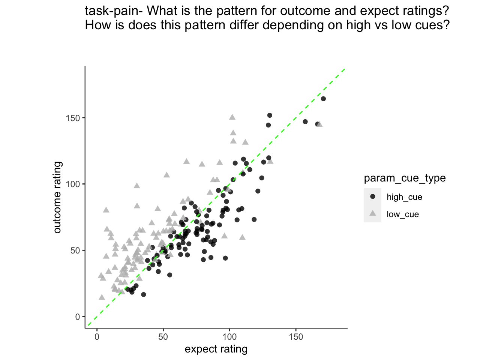
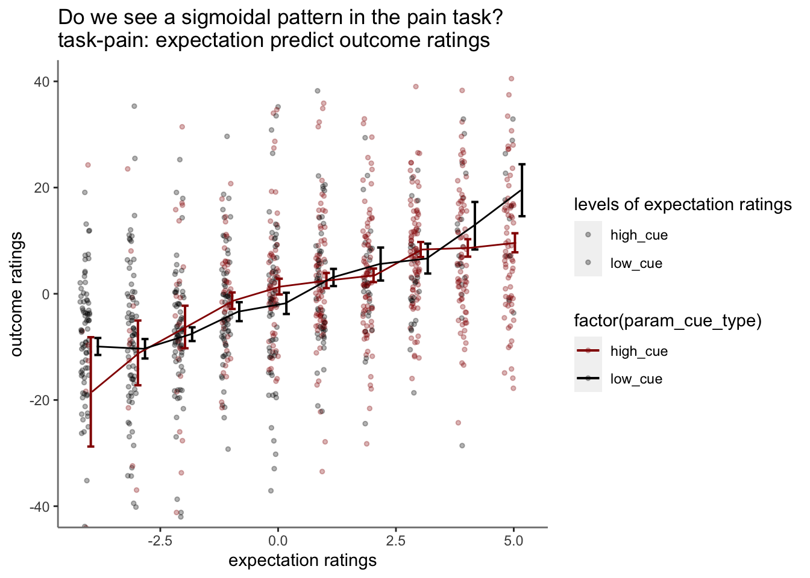

# outcome ~ expect Jayazeri (2018) {#ch13_outcome-expect}

```
date: '2022-09-13'
updated: '2023-02-07'
```


### TODO  {.unlisted .unnumbered}
* plot individual ratings (check distribution)
* afterwards, normalize the ratings and bin them
* 0207 future explore sigmoid fitting https://stackoverflow.com/questions/63568848/fitting-a-sigmoidal-curve-to-points-with-ggplot

## Overview 
* My hypothesis is that the cue-expectancy follows a Bayesian mechanism, akin to what's listed in Jayazeri (2019)
* Here, I plot the expectation ratings (N) and outcome ratings (N) and see if the pattern is akin to a sigmoidal curve. 
* If so, I plan to dive deeper and potentially take a Bayesian approach. 
* Instead of (N-1), we'll be using the cue and the expectation ratings to explain the outcome ratings


load data and combine participant data

```r
main_dir = dirname(dirname(getwd()))
datadir = file.path(main_dir, 'data', 'beh', 'beh02_preproc')
# parameters _____________________________________ # nolint
subject_varkey <- "src_subject_id"
iv <- "param_cue_type"
dv <- "event04_actual_angle"
dv_keyword <- "outcome_rating"
xlab <- ""
ylab <- "ratings (degree)"
subject <- "subject"
exclude <- "sub-0999|sub-0001|sub-0002|sub-0003|sub-0004|sub-0005|sub-0006|sub-0007|sub-0008|sub-0009|sub-0010|sub-0011"

analysis_dir <- file.path(main_dir, "analysis", "mixedeffect", "model13_iv-cue-expect_dv-outcome", as.character(Sys.Date()))
dir.create(analysis_dir, showWarnings = FALSE, recursive = TRUE)
```


## Do expectation ratings predict current outcome ratings? Does this differ as a function of cue?
* see if current expectation ratings predict outcome ratings
* ~~see if prior stimulus experience (N-1) predicts current expectation ratings~~
* ~~see if current expectation ratings are explained as a function of prior outcome rating and current expectation rating~~


## task-pain, HLM modeling
``lmer(outcome ~ cue * expectation + (1|participant))``

```
## Linear mixed model fit by REML. t-tests use Satterthwaite's method [
## lmerModLmerTest]
## Formula: event04_actual_angle ~ param_cue_type * event02_expect_angle +  
##     (1 | src_subject_id)
##    Data: df_dropna
## 
## REML criterion at convergence: 48127.4
## 
## Scaled residuals: 
##     Min      1Q  Median      3Q     Max 
## -4.2631 -0.6098 -0.0018  0.6174  4.8539 
## 
## Random effects:
##  Groups         Name        Variance Std.Dev.
##  src_subject_id (Intercept) 436.2    20.88   
##  Residual                   550.8    23.47   
## Number of obs: 5219, groups:  src_subject_id, 104
## 
## Fixed effects:
##                                             Estimate Std. Error        df
## (Intercept)                                4.502e+01  2.525e+00 2.056e+02
## param_cue_typelow_cue                      1.068e+00  1.451e+00 5.168e+03
## event02_expect_angle                       3.114e-01  1.760e-02 5.203e+03
## param_cue_typelow_cue:event02_expect_angle 2.357e-02  1.874e-02 5.130e+03
##                                            t value Pr(>|t|)    
## (Intercept)                                 17.827   <2e-16 ***
## param_cue_typelow_cue                        0.736    0.462    
## event02_expect_angle                        17.693   <2e-16 ***
## param_cue_typelow_cue:event02_expect_angle   1.258    0.209    
## ---
## Signif. codes:  0 '***' 0.001 '**' 0.01 '*' 0.05 '.' 0.1 ' ' 1
## 
## Correlation of Fixed Effects:
##             (Intr) prm___ ev02__
## prm_c_typl_ -0.477              
## evnt02_xpc_ -0.549  0.762       
## prm___:02__  0.329 -0.829 -0.595
```
## Fig. Expectation ratings predict outcome ratings 
**Purpose of this section: **
* Before binning the data, I want to check if expectation ratings explain outcome ratings.

**Observation: **
* 1. expectation ratings after a high cue reflect an overestimation, that is compensated for a lower outcome rating. 
* 2. expectation ratings after a low cue reflects an overestimating, which is compensated with a higher outcome rating


## TODO: PLOT participant rating  {.unlisted .unnumbered}
* purpose: to see the raw data distribution. Are there any alarming participants to remove?
x axis participant
y axis histogram of actual ratings

## Check bin process {.unlisted .unnumbered}

### Let's demean the ratings for one participant  {.unlisted .unnumbered}
1. bin ratings
Do the bins do their jobs?
plot one run
then check the min, max and see if the quantization is done properly.
YES, it is

* confirm that df discrete has 10 levels per participant
* the number of counts per frequency can differ 

```r
k <-df_dropna %>% group_by(src_subject_id) %>% filter(n()>= 5) %>% ungroup()

df_discrete = k %>%
  group_by(src_subject_id) %>%
  mutate(bin = cut_interval(event04_actual_angle, n = 10),
         outcomelevels = as.numeric(cut_interval(event04_actual_angle, n = 10)))

res <- df_discrete %>% 
  group_by(src_subject_id,outcomelevels) %>% 
  tally()

dset1 <- head(res)
knitr::kable(dset1, format = "html")
```

<table>
 <thead>
  <tr>
   <th style="text-align:right;"> src_subject_id </th>
   <th style="text-align:right;"> outcomelevels </th>
   <th style="text-align:right;"> n </th>
  </tr>
 </thead>
<tbody>
  <tr>
   <td style="text-align:right;"> 13 </td>
   <td style="text-align:right;"> 1 </td>
   <td style="text-align:right;"> 2 </td>
  </tr>
  <tr>
   <td style="text-align:right;"> 13 </td>
   <td style="text-align:right;"> 3 </td>
   <td style="text-align:right;"> 5 </td>
  </tr>
  <tr>
   <td style="text-align:right;"> 13 </td>
   <td style="text-align:right;"> 4 </td>
   <td style="text-align:right;"> 3 </td>
  </tr>
  <tr>
   <td style="text-align:right;"> 13 </td>
   <td style="text-align:right;"> 6 </td>
   <td style="text-align:right;"> 4 </td>
  </tr>
  <tr>
   <td style="text-align:right;"> 13 </td>
   <td style="text-align:right;"> 7 </td>
   <td style="text-align:right;"> 9 </td>
  </tr>
  <tr>
   <td style="text-align:right;"> 13 </td>
   <td style="text-align:right;"> 8 </td>
   <td style="text-align:right;"> 5 </td>
  </tr>
</tbody>
</table>


### subjectwise plot {.unlisted .unnumbered}
What is the pattern of expectation rating and outcome rating, per participant? 
Do we see a linear effect? We should also plot the data as a sigmoidal fit

```
## `geom_smooth()` using formula = 'y ~ x'
```


## binned expectation ratings per task


### Pain: binned expectation ratings
* checked warnings: None




#### Pain: low and high cues separately


### Vicarious: binned expectation ratings
* checked warnings: None


### Cognitive: binned expectation ratings


Warnings: due to mere empty trials in high or low cue groups in the expectation ratings
```
Warning in qt(conf.interval/2 + 0.5, datac$N - 1): NaNs produced
```

## not splitting into cue groups
* checked warnings: None

https://groups.google.com/g/ggplot2/c/csPNfSLKkco


