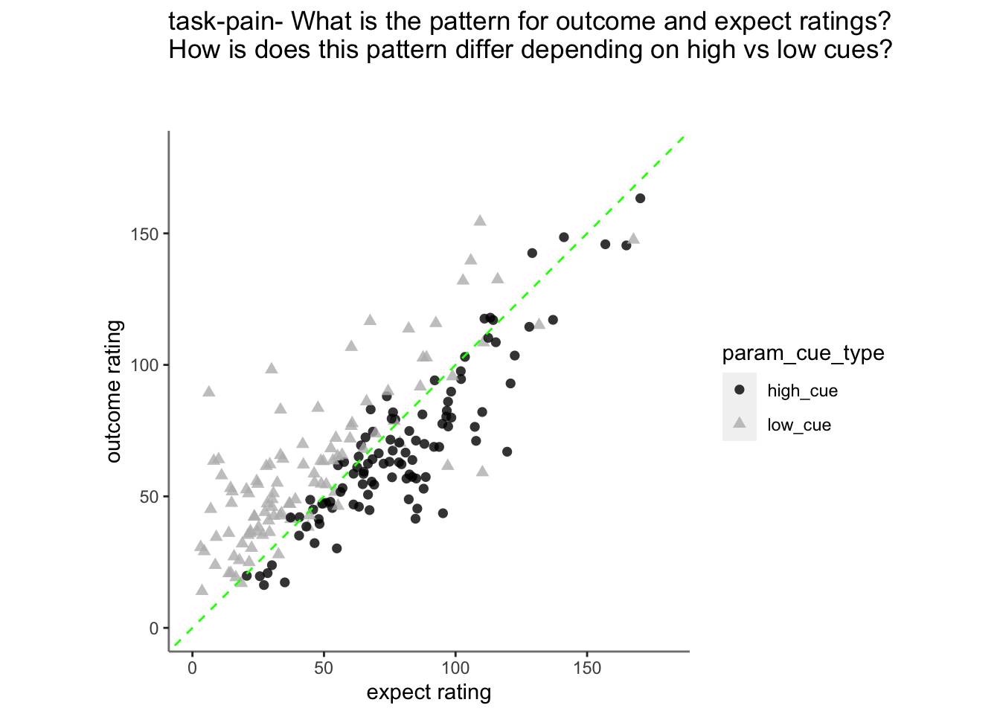
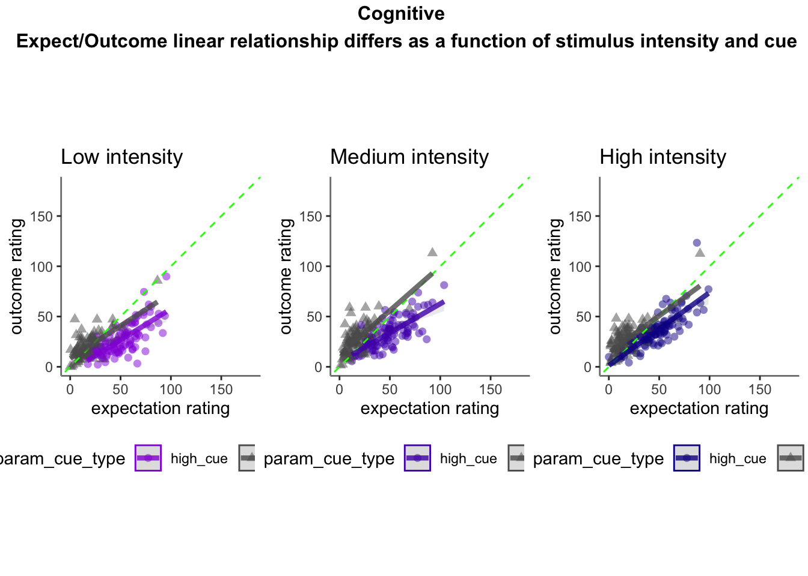

# [ beh ] outcome ~ cue * stim * expectrating * n-1outcomerating  {#ch14_factorize}


## What is the purpose of this notebook? {.unlisted .unnumbered}

1. Linear relationship between expectation and outcome ratings, as a function of stimulus intensity and cues
* Here, I model the outcome ratings as a function of cue, stimulus intensity, expectation ratings, N-1 outcome rating. 
* From this, I see that the linear relationship of expectation ratings and outcome ratings are split across a 1:1 slope, depending on high or low cues. In other words, when exposed to a high cue, participants tend to rate higher on expectations but report lower outcome ratings, and viceversa for low cues. 
Based on these results, I ask the following:

2.Are participants who are overestimating for high cues also underestimators for low cues?
* Here, I calculate Orthogonal distance from the 1:1 slope. 
* Based on that, I test whether the absolute ODR distance is equivalent across cues. If a participant equally overestimates for a high cue and underestimates a stimuli for a low cue, their ODR distance should be the same. This is reflected in the subject-level slopes, which are parallel.

### Some thoughts, TODOs {.unlisted .unnumbered}

* Standardized coefficients
* Slope difference? Intercept difference? ( cue and expectantion rating)
* Correct for the range (within participant)
hypothesis:
1. Larger expectation leads to prediction error
2. Individual differences in ratings
3. Outcome experience, based on behavioral experience
What are the brain maps associated with each component.  


### load data and combine participant data {.unlisted .unnumbered}


```r
main_dir = dirname(dirname(getwd()))
datadir = file.path(main_dir, 'data', 'beh', 'beh02_preproc')
# parameters _____________________________________ # nolint
subject_varkey <- "src_subject_id"
iv <- "param_cue_type"
dv <- "event03_RT"
dv_keyword <- "RT"
xlab <- ""
taskname <- "pain"

ylab <- "ratings (degree)"
subject <- "subject"
exclude <- "sub-0999|sub-0001|sub-0002|sub-0003|sub-0004|sub-0005|sub-0006|sub-0007|sub-0008|sub-0009|sub-0010|sub-0011"

# load data _____________________________________
data <- load_task_social_df(datadir, taskname = taskname, subject_varkey = subject_varkey, iv = iv, exclude = exclude)
data$event03_RT <- data$event03_stimulusC_reseponseonset - data$event03_stimulus_displayonset
# data['event03_RT'], data.event03_RT - pandas
analysis_dir <- file.path(main_dir, "analysis", "mixedeffect", "model14_iv-cue-stim-N1outcome-expect_dv-outcome", as.character(Sys.Date()))
dir.create(analysis_dir, showWarnings = FALSE, recursive = TRUE)
```

### summarize data {.unlisted .unnumbered}

```
##  event02_expect_RT event04_actual_RT event02_expect_angle event04_actual_angle
##  Min.   :0.6504    Min.   :0.0171    Min.   :  0.00       Min.   :  0.00      
##  1st Qu.:1.6200    1st Qu.:1.9188    1st Qu.: 29.55       1st Qu.: 37.83      
##  Median :2.0511    Median :2.3511    Median : 57.58       Median : 60.49      
##  Mean   :2.1337    Mean   :2.4011    Mean   : 61.88       Mean   : 65.47      
##  3rd Qu.:2.5589    3rd Qu.:2.8514    3rd Qu.: 88.61       3rd Qu.: 87.70      
##  Max.   :3.9912    Max.   :3.9930    Max.   :180.00       Max.   :180.00      
##  NA's   :651       NA's   :638       NA's   :651          NA's   :641
```

### Covariance matrix: ratings and RT {.unlisted .unnumbered}

```{=html}
<div class="plotly html-widget html-fill-item-overflow-hidden html-fill-item" id="htmlwidget-0c07017a0556109fcdc6" style="width:672px;height:480px;"></div>
<script type="application/json" data-for="htmlwidget-0c07017a0556109fcdc6">{"x":{"visdat":{"14fb5ec0aeda":["function () ","plotlyVisDat"]},"cur_data":"14fb5ec0aeda","attrs":{"14fb5ec0aeda":{"z":{},"alpha_stroke":1,"sizes":[10,100],"spans":[1,20],"type":"heatmap","colors":["#601200","#611300","#621401","#621501","#631600","#631700","#641801","#641901","#651A00","#661B00","#671C00","#671D00","#681E00","#681F00","#692000","#692100","#6A2200","#6A2200","#6B2300","#6B2400","#6C2500","#6D2600","#6E2700","#6E2800","#6F2900","#6F2900","#702A01","#702B00","#712C00","#712D00","#722E01","#722F00","#733000","#743000","#753101","#753200","#763300","#763400","#773501","#773600","#783700","#783700","#793801","#793900","#7A3A00","#7A3B00","#7C3D00","#7D3E00","#7D3E00","#7E3F00","#7E4000","#7F4100","#7F4200","#804300","#804400","#814500","#814600","#824700","#834701","#844800","#844900","#854A01","#854B01","#864C00","#864D00","#874E01","#874F01","#885002","#895002","#8A5101","#8A5201","#8B5302","#8B5402","#8C5503","#8C5603","#8D5704","#8D5804","#8E5905","#8F5A05","#905B06","#905C06","#915D07","#915E07","#925F08","#936009","#94610A","#94620B","#95630C","#95640D","#96650E","#97660F","#986810","#996912","#996A13","#9A6B15","#9B6C16","#9C6D17","#9C6E17","#9D6F19","#9E701A","#9F711C","#9F721D","#A0731E","#A0741F","#A17521","#A27622","#A37723","#A37824","#A47926","#A47A28","#A57B29","#A67C2A","#A77D2B","#A77E2D","#A87F2E","#A88030","#A98131","#AA8232","#AB8333","#AB8435","#AC8536","#AC8638","#AD873A","#AD873B","#AE883C","#AF893D","#B08A3F","#B08B40","#B18C42","#B18D43","#B28E44","#B28E45","#B38F47","#B39048","#B4914A","#B5924B","#B6944D","#B7954F","#B79550","#B89651","#B89652","#B99854","#B99955","#BA9A57","#BA9A58","#BB9B5A","#BC9C5B","#BD9D5C","#BD9E5D","#BE9F5F","#BE9F60","#BFA062","#BFA164","#C0A265","#C0A366","#C1A467","#C1A469","#C2A56A","#C2A66C","#C3A76D","#C4A86F","#C5A970","#C5AA71","#C6AB72","#C6AB74","#C7AC75","#C7AD77","#C8AE78","#C8AF7A","#C9B07C","#C9B07D","#CAB17E","#CBB27F","#CCB381","#CCB482","#CDB584","#CDB585","#CEB687","#CEB788","#CFB98A","#CFB98B","#D0BA8C","#D1BB8E","#D1BB8F","#D2BD91","#D3BE92","#D4BF94","#D4C095","#D5C197","#D5C198","#D6C29A","#D6C39B","#D7C49D","#D7C59E","#D8C6A0","#D8C6A1","#D9C7A2","#DAC8A3","#DBC9A5","#DBCAA7","#DCCBA8","#DCCCAA","#DDCDAB","#DDCDAD","#DECEAE","#DECFB0","#DFD0B1","#E0D1B3","#E1D2B4","#E1D3B6","#E2D4B7","#E2D4B9","#E3D5BB","#E3D6BC","#E4D7BD","#E4D8BE","#E5D9C0","#E5D9C1","#E6DAC3","#E6DBC4","#E7DCC6","#E7DDC7","#E8DEC9","#E8DECA","#E9DFCC","#E9E0CD","#EAE2CF","#EBE3D1","#EBE3D2","#ECE4D3","#ECE5D4","#EDE6D6","#ECE6D7","#EDE7D9","#EDE7DA","#EEE8DB","#EEE8DC","#EDE9DE","#EDE9DF","#EDEAE0","#EDEAE1","#EEEBE2","#EEEBE3","#EDECE4","#EDECE5","#ECEDE6","#ECEDE7","#EBECE8","#EBECE8","#EAEDE9","#EAEDE9","#E9ECEA","#E9ECEA","#E8EDEB","#E7EDEB","#E6ECEC","#E6ECEC","#E5EBED","#E4EBED","#E2EAEC","#E1EBEC","#E0EAED","#DFEAED","#DEE9EC","#DDE9EC","#DBE8ED","#DAE7ED","#D8E6EC","#D7E6EC","#D6E5EB","#D5E4EB","#D3E3EB","#D2E3EB","#D0E1EA","#CEE0E9","#CDE0E9","#CBDFE8","#CADEE8","#C8DDE7","#C7DCE7","#C5DBE6","#C3DAE6","#C1D9E5","#C0D8E4","#BED7E3","#BDD6E3","#BBD5E2","#BAD5E2","#B8D4E1","#B6D3E1","#B5D2E0","#B3D1DF","#B2D0DE","#B0CFDE","#AFCEDD","#ACCDDD","#ABCCDC","#A9CBDC","#A8CADB","#A6C9DA","#A5C8D9","#A3C7D9","#A1C6D8","#A0C5D8","#9FC4D7","#9DC3D6","#9BC2D5","#99C1D5","#97C0D4","#96BFD4","#94BED3","#93BED2","#91BDD1","#90BCD1","#8EBBD0","#8DBAD0","#8BB9CF","#89B8CE","#87B6CD","#85B5CC","#84B4CC","#82B3CB","#81B2CA","#7FB1C9","#7EB0C9","#7CAFC8","#7AAEC8","#78ADC7","#77ACC6","#75ABC5","#74AAC5","#72A9C4","#70A8C3","#6FA7C2","#6EA6C2","#6CA5C1","#6AA4C1","#68A3C0","#66A2BF","#65A1BE","#63A0BE","#629FBD","#609EBD","#5F9DBC","#5D9CBB","#5B9BBA","#599ABA","#5799B9","#5698B8","#5496B7","#5395B7","#5194B6","#5093B6","#4E92B5","#4D91B4","#4B90B3","#4A8FB3","#488EB2","#478DB1","#458CB0","#448BB0","#428AAF","#4089AF","#3E87AD","#3C86AC","#3B85AC","#3984AB","#3883AA","#3782A9","#3681A9","#3480A8","#337FA8","#317EA7","#307DA6","#2E7CA5","#2D7BA5","#2B7AA4","#2979A4","#2878A3","#2777A2","#2676A1","#2475A1","#2374A0","#2273A0","#21729F","#1F719E","#1E709D","#1D6F9D","#1C6E9C","#1A6D9C","#196C9B","#186B9A","#176A99","#166999","#156898","#146898","#136797","#126697","#116596","#106496","#0F6395","#0E6294","#0D6193","#0C6093","#0B5F92","#0B5F92","#0A5E91","#095D91","#085C90","#075A8F","#07598F","#06588E","#06588D","#05578C","#05568C","#04558B","#05548B","#04538A","#04538A","#035289","#045189","#035088","#034F88","#024E87","#024E87","#034D86","#034C86","#024B85","#024A85","#034984","#034984","#024883","#024783","#014682","#014682","#024581","#024481","#014380","#014280","#01417F","#01417F","#02407E","#023F7E","#013E7D","#013E7D","#023D7C","#023C7C","#013B7B","#013B7B","#023A7A","#01397A","#023779","#013779","#013678","#013577","#023477","#013376","#013376","#023275","#023175","#013074","#013074","#022F73","#022E73","#012D72","#012D72","#022C71","#022B71","#012A70","#012A70","#02296F","#02286F","#01276E","#01276E","#02266D","#02256D","#01246C","#01246C","#02236B","#02226B","#01216A","#01206A","#021F69","#021F69","#011E68","#011D68","#021C67","#021C67","#011B66","#011A66","#001965","#001865","#011764","#011764","#001663","#001563","#011362","#001362","#001261","#001260"],"inherit":true}},"layout":{"margin":{"b":40,"l":60,"t":25,"r":10},"scene":{"zaxis":{"title":"cormat"}},"xaxis":{"domain":[0,1],"automargin":true,"tickmode":"array","tickvals":[0,1,2,3,4],"ticktext":["event04_actual_angle","event02_expect_angle","event01_cue_onset","event02_expect_RT","event04_actual_RT"],"gridcolor":"transparent","zerolinecolor":"transparent","title":"","zeroline":false,"showgrid":false},"yaxis":{"domain":[0,1],"automargin":true,"tickmode":"array","tickvals":[0,1,2,3,4],"ticktext":["event04_actual_angle","event02_expect_angle","event01_cue_onset","event02_expect_RT","event04_actual_RT"],"gridcolor":"transparent","zerolinecolor":"transparent","title":"","autorange":"reversed","zeroline":false,"showgrid":false},"hovermode":"closest","showlegend":false,"legend":{"yanchor":"top","y":0.5},"plot_bgcolor":"transparent","paper_bgcolor":"transparent"},"source":"A","config":{"modeBarButtonsToAdd":["hoverclosest","hovercompare"],"showSendToCloud":false,"displayModeBar":false},"data":[{"colorbar":{"title":"cormat","ticklen":2,"len":0.5,"lenmode":"fraction","y":1,"yanchor":"top"},"colorscale":[["0","rgba(96,18,0,1)"],["0.0416666666666667","rgba(109,38,0,1)"],["0.0833333333333333","rgba(121,56,1,1)"],["0.125","rgba(133,75,1,1)"],["0.166666666666667","rgba(146,95,8,1)"],["0.208333333333333","rgba(161,117,33,1)"],["0.25","rgba(175,137,61,1)"],["0.291666666666667","rgba(188,156,91,1)"],["0.333333333333333","rgba(199,173,119,1)"],["0.375","rgba(212,192,149,1)"],["0.416666666666667","rgba(225,210,180,1)"],["0.458333333333333","rgba(236,228,211,1)"],["0.5","rgba(234,237,233,1)"],["0.541666666666667","rgba(212,228,235,1)"],["0.583333333333333","rgba(179,209,223,1)"],["0.625","rgba(145,189,209,1)"],["0.666666666666667","rgba(111,167,194,1)"],["0.708333333333333","rgba(78,146,181,1)"],["0.75","rgba(46,124,165,1)"],["0.791666666666667","rgba(20,104,152,1)"],["0.833333333333333","rgba(5,84,139,1)"],["0.875","rgba(1,67,128,1)"],["0.916666666666667","rgba(1,51,118,1)"],["0.958333333333333","rgba(2,35,107,1)"],["1","rgba(0,18,96,1)"]],"showscale":true,"z":[[1,0.627349219607622,-0.127331265407638,-0.0387158167304906,-0.155976302911586],[0.627349219607622,1,-0.0947326397969614,-0.0531943958485549,-0.127353687071136],[-0.127331265407638,-0.0947326397969614,1,0.0878587341493915,0.0947733899201344],[-0.0387158167304906,-0.0531943958485549,0.0878587341493915,1,0.279089611790198],[-0.155976302911586,-0.127353687071136,0.0947733899201344,0.279089611790198,1]],"type":"heatmap","xaxis":"x","yaxis":"y","frame":null,"zmin":-1,"zmax":1}],"highlight":{"on":"plotly_click","persistent":false,"dynamic":false,"selectize":false,"opacityDim":0.2,"selected":{"opacity":1},"debounce":0},"shinyEvents":["plotly_hover","plotly_click","plotly_selected","plotly_relayout","plotly_brushed","plotly_brushing","plotly_clickannotation","plotly_doubleclick","plotly_deselect","plotly_afterplot","plotly_sunburstclick"],"base_url":"https://plot.ly"},"evals":[],"jsHooks":[]}</script>
```

### Covariance matrix: fixation durations (e.g. ISIs) {.unlisted .unnumbered}

```r
ISIvars <- names(data) %in% 
  c( "ISI01_duration", "ISI02_duration", "ISI03_duration")
ISIdata <- data[ISIvars]
# numdata  <- unlist(lapply(data, is.numeric), use.names = FALSE) 
ISIdata_naomit <- na.omit(ISIdata)
ISIcor_matrix = cor(ISIdata_naomit)
corr_heat(ISIcor_matrix)
```

```
## No FA options specified, using psych package defaults.
```

```{=html}
<div class="plotly html-widget html-fill-item-overflow-hidden html-fill-item" id="htmlwidget-4c4765cae9104636eb7b" style="width:672px;height:480px;"></div>
<script type="application/json" data-for="htmlwidget-4c4765cae9104636eb7b">{"x":{"visdat":{"14fb31b4aadb":["function () ","plotlyVisDat"]},"cur_data":"14fb31b4aadb","attrs":{"14fb31b4aadb":{"z":{},"alpha_stroke":1,"sizes":[10,100],"spans":[1,20],"type":"heatmap","colors":["#601200","#611300","#621401","#621501","#631600","#631700","#641801","#641901","#651A00","#661B00","#671C00","#671D00","#681E00","#681F00","#692000","#692100","#6A2200","#6A2200","#6B2300","#6B2400","#6C2500","#6D2600","#6E2700","#6E2800","#6F2900","#6F2900","#702A01","#702B00","#712C00","#712D00","#722E01","#722F00","#733000","#743000","#753101","#753200","#763300","#763400","#773501","#773600","#783700","#783700","#793801","#793900","#7A3A00","#7A3B00","#7C3D00","#7D3E00","#7D3E00","#7E3F00","#7E4000","#7F4100","#7F4200","#804300","#804400","#814500","#814600","#824700","#834701","#844800","#844900","#854A01","#854B01","#864C00","#864D00","#874E01","#874F01","#885002","#895002","#8A5101","#8A5201","#8B5302","#8B5402","#8C5503","#8C5603","#8D5704","#8D5804","#8E5905","#8F5A05","#905B06","#905C06","#915D07","#915E07","#925F08","#936009","#94610A","#94620B","#95630C","#95640D","#96650E","#97660F","#986810","#996912","#996A13","#9A6B15","#9B6C16","#9C6D17","#9C6E17","#9D6F19","#9E701A","#9F711C","#9F721D","#A0731E","#A0741F","#A17521","#A27622","#A37723","#A37824","#A47926","#A47A28","#A57B29","#A67C2A","#A77D2B","#A77E2D","#A87F2E","#A88030","#A98131","#AA8232","#AB8333","#AB8435","#AC8536","#AC8638","#AD873A","#AD873B","#AE883C","#AF893D","#B08A3F","#B08B40","#B18C42","#B18D43","#B28E44","#B28E45","#B38F47","#B39048","#B4914A","#B5924B","#B6944D","#B7954F","#B79550","#B89651","#B89652","#B99854","#B99955","#BA9A57","#BA9A58","#BB9B5A","#BC9C5B","#BD9D5C","#BD9E5D","#BE9F5F","#BE9F60","#BFA062","#BFA164","#C0A265","#C0A366","#C1A467","#C1A469","#C2A56A","#C2A66C","#C3A76D","#C4A86F","#C5A970","#C5AA71","#C6AB72","#C6AB74","#C7AC75","#C7AD77","#C8AE78","#C8AF7A","#C9B07C","#C9B07D","#CAB17E","#CBB27F","#CCB381","#CCB482","#CDB584","#CDB585","#CEB687","#CEB788","#CFB98A","#CFB98B","#D0BA8C","#D1BB8E","#D1BB8F","#D2BD91","#D3BE92","#D4BF94","#D4C095","#D5C197","#D5C198","#D6C29A","#D6C39B","#D7C49D","#D7C59E","#D8C6A0","#D8C6A1","#D9C7A2","#DAC8A3","#DBC9A5","#DBCAA7","#DCCBA8","#DCCCAA","#DDCDAB","#DDCDAD","#DECEAE","#DECFB0","#DFD0B1","#E0D1B3","#E1D2B4","#E1D3B6","#E2D4B7","#E2D4B9","#E3D5BB","#E3D6BC","#E4D7BD","#E4D8BE","#E5D9C0","#E5D9C1","#E6DAC3","#E6DBC4","#E7DCC6","#E7DDC7","#E8DEC9","#E8DECA","#E9DFCC","#E9E0CD","#EAE2CF","#EBE3D1","#EBE3D2","#ECE4D3","#ECE5D4","#EDE6D6","#ECE6D7","#EDE7D9","#EDE7DA","#EEE8DB","#EEE8DC","#EDE9DE","#EDE9DF","#EDEAE0","#EDEAE1","#EEEBE2","#EEEBE3","#EDECE4","#EDECE5","#ECEDE6","#ECEDE7","#EBECE8","#EBECE8","#EAEDE9","#EAEDE9","#E9ECEA","#E9ECEA","#E8EDEB","#E7EDEB","#E6ECEC","#E6ECEC","#E5EBED","#E4EBED","#E2EAEC","#E1EBEC","#E0EAED","#DFEAED","#DEE9EC","#DDE9EC","#DBE8ED","#DAE7ED","#D8E6EC","#D7E6EC","#D6E5EB","#D5E4EB","#D3E3EB","#D2E3EB","#D0E1EA","#CEE0E9","#CDE0E9","#CBDFE8","#CADEE8","#C8DDE7","#C7DCE7","#C5DBE6","#C3DAE6","#C1D9E5","#C0D8E4","#BED7E3","#BDD6E3","#BBD5E2","#BAD5E2","#B8D4E1","#B6D3E1","#B5D2E0","#B3D1DF","#B2D0DE","#B0CFDE","#AFCEDD","#ACCDDD","#ABCCDC","#A9CBDC","#A8CADB","#A6C9DA","#A5C8D9","#A3C7D9","#A1C6D8","#A0C5D8","#9FC4D7","#9DC3D6","#9BC2D5","#99C1D5","#97C0D4","#96BFD4","#94BED3","#93BED2","#91BDD1","#90BCD1","#8EBBD0","#8DBAD0","#8BB9CF","#89B8CE","#87B6CD","#85B5CC","#84B4CC","#82B3CB","#81B2CA","#7FB1C9","#7EB0C9","#7CAFC8","#7AAEC8","#78ADC7","#77ACC6","#75ABC5","#74AAC5","#72A9C4","#70A8C3","#6FA7C2","#6EA6C2","#6CA5C1","#6AA4C1","#68A3C0","#66A2BF","#65A1BE","#63A0BE","#629FBD","#609EBD","#5F9DBC","#5D9CBB","#5B9BBA","#599ABA","#5799B9","#5698B8","#5496B7","#5395B7","#5194B6","#5093B6","#4E92B5","#4D91B4","#4B90B3","#4A8FB3","#488EB2","#478DB1","#458CB0","#448BB0","#428AAF","#4089AF","#3E87AD","#3C86AC","#3B85AC","#3984AB","#3883AA","#3782A9","#3681A9","#3480A8","#337FA8","#317EA7","#307DA6","#2E7CA5","#2D7BA5","#2B7AA4","#2979A4","#2878A3","#2777A2","#2676A1","#2475A1","#2374A0","#2273A0","#21729F","#1F719E","#1E709D","#1D6F9D","#1C6E9C","#1A6D9C","#196C9B","#186B9A","#176A99","#166999","#156898","#146898","#136797","#126697","#116596","#106496","#0F6395","#0E6294","#0D6193","#0C6093","#0B5F92","#0B5F92","#0A5E91","#095D91","#085C90","#075A8F","#07598F","#06588E","#06588D","#05578C","#05568C","#04558B","#05548B","#04538A","#04538A","#035289","#045189","#035088","#034F88","#024E87","#024E87","#034D86","#034C86","#024B85","#024A85","#034984","#034984","#024883","#024783","#014682","#014682","#024581","#024481","#014380","#014280","#01417F","#01417F","#02407E","#023F7E","#013E7D","#013E7D","#023D7C","#023C7C","#013B7B","#013B7B","#023A7A","#01397A","#023779","#013779","#013678","#013577","#023477","#013376","#013376","#023275","#023175","#013074","#013074","#022F73","#022E73","#012D72","#012D72","#022C71","#022B71","#012A70","#012A70","#02296F","#02286F","#01276E","#01276E","#02266D","#02256D","#01246C","#01246C","#02236B","#02226B","#01216A","#01206A","#021F69","#021F69","#011E68","#011D68","#021C67","#021C67","#011B66","#011A66","#001965","#001865","#011764","#011764","#001663","#001563","#011362","#001362","#001261","#001260"],"inherit":true}},"layout":{"margin":{"b":40,"l":60,"t":25,"r":10},"scene":{"zaxis":{"title":"cormat"}},"xaxis":{"domain":[0,1],"automargin":true,"tickmode":"array","tickvals":[0,1,2],"ticktext":["ISI02_duration","ISI01_duration","ISI03_duration"],"gridcolor":"transparent","zerolinecolor":"transparent","title":"","zeroline":false,"showgrid":false},"yaxis":{"domain":[0,1],"automargin":true,"tickmode":"array","tickvals":[0,1,2],"ticktext":["ISI02_duration","ISI01_duration","ISI03_duration"],"gridcolor":"transparent","zerolinecolor":"transparent","title":"","autorange":"reversed","zeroline":false,"showgrid":false},"hovermode":"closest","showlegend":false,"legend":{"yanchor":"top","y":0.5},"plot_bgcolor":"transparent","paper_bgcolor":"transparent"},"source":"A","config":{"modeBarButtonsToAdd":["hoverclosest","hovercompare"],"showSendToCloud":false,"displayModeBar":false},"data":[{"colorbar":{"title":"cormat","ticklen":2,"len":0.5,"lenmode":"fraction","y":1,"yanchor":"top"},"colorscale":[["0","rgba(96,18,0,1)"],["0.0416666666666667","rgba(109,38,0,1)"],["0.0833333333333333","rgba(121,56,1,1)"],["0.125","rgba(133,75,1,1)"],["0.166666666666667","rgba(146,95,8,1)"],["0.208333333333333","rgba(161,117,33,1)"],["0.25","rgba(175,137,61,1)"],["0.291666666666667","rgba(188,156,91,1)"],["0.333333333333333","rgba(199,173,119,1)"],["0.375","rgba(212,192,149,1)"],["0.416666666666667","rgba(225,210,180,1)"],["0.458333333333333","rgba(236,228,211,1)"],["0.5","rgba(234,237,233,1)"],["0.541666666666667","rgba(212,228,235,1)"],["0.583333333333333","rgba(179,209,223,1)"],["0.625","rgba(145,189,209,1)"],["0.666666666666667","rgba(111,167,194,1)"],["0.708333333333333","rgba(78,146,181,1)"],["0.75","rgba(46,124,165,1)"],["0.791666666666667","rgba(20,104,152,1)"],["0.833333333333333","rgba(5,84,139,1)"],["0.875","rgba(1,67,128,1)"],["0.916666666666667","rgba(1,51,118,1)"],["0.958333333333333","rgba(2,35,107,1)"],["1","rgba(0,18,96,1)"]],"showscale":true,"z":[[1,0.104227599726807,0.0712121554449984],[0.104227599726807,1,-0.0576788170165326],[0.0712121554449984,-0.0576788170165326,1]],"type":"heatmap","xaxis":"x","yaxis":"y","frame":null,"zmin":-1,"zmax":1}],"highlight":{"on":"plotly_click","persistent":false,"dynamic":false,"selectize":false,"opacityDim":0.2,"selected":{"opacity":1},"debounce":0},"shinyEvents":["plotly_hover","plotly_click","plotly_selected","plotly_relayout","plotly_brushed","plotly_brushing","plotly_clickannotation","plotly_doubleclick","plotly_deselect","plotly_afterplot","plotly_sunburstclick"],"base_url":"https://plot.ly"},"evals":[],"jsHooks":[]}</script>
```


## Original motivation: 
Plot pain outcome rating as a function of expectation rating and cue {.unlisted .unnumbered}


## Pain

### linear model {.unlisted .unnumbered}
* **cue_con** : high cue: 0.5, low cue: -0.5
* **stim_con_linear** : high intensity: 0.5, med intensity: 0, low intensity: -0.5
* **stim_con_quad** : high intensity: -0.33, med intensity: 0.66, low intensity: -0.33


```
## Linear mixed model fit by REML. t-tests use Satterthwaite's method [
## lmerModLmerTest]
## Formula: 
## event04_actual_angle ~ cue_con * stim_con_linear * event02_expect_angle +  
##     cue_con * stim_con_quad * event02_expect_angle + lag.04outcomeangle +  
##     (cue_con | src_subject_id)
##    Data: pvc
## 
## REML criterion at convergence: 40521.4
## 
## Scaled residuals: 
##     Min      1Q  Median      3Q     Max 
## -5.7264 -0.5846  0.0022  0.5708  5.4135 
## 
## Random effects:
##  Groups         Name        Variance Std.Dev. Corr 
##  src_subject_id (Intercept) 241.71   15.547        
##                 cue_con      29.45    5.427   -0.12
##  Residual                   342.80   18.515        
## Number of obs: 4621, groups:  src_subject_id, 104
## 
## Fixed effects:
##                                                Estimate Std. Error         df
## (Intercept)                                    32.70761    1.82870  165.11241
## cue_con                                        -1.13761    1.55202  239.76229
## stim_con_linear                                27.69729    1.42204 4422.98045
## event02_expect_angle                            0.27562    0.01325 2998.11919
## stim_con_quad                                   0.09520    1.22851 4434.26850
## lag.04outcomeangle                              0.22723    0.01141 4602.47394
## cue_con:stim_con_linear                        -4.74163    2.84181 4425.20529
## cue_con:event02_expect_angle                   -0.01895    0.01936  326.84982
## stim_con_linear:event02_expect_angle            0.08057    0.01857 4422.25132
## cue_con:stim_con_quad                          -2.00950    2.45638 4434.17642
## event02_expect_angle:stim_con_quad              0.04394    0.01618 4428.17824
## cue_con:stim_con_linear:event02_expect_angle    0.05843    0.03710 4433.65820
## cue_con:event02_expect_angle:stim_con_quad     -0.06930    0.03236 4431.10712
##                                              t value Pr(>|t|)    
## (Intercept)                                   17.886  < 2e-16 ***
## cue_con                                       -0.733  0.46428    
## stim_con_linear                               19.477  < 2e-16 ***
## event02_expect_angle                          20.805  < 2e-16 ***
## stim_con_quad                                  0.077  0.93824    
## lag.04outcomeangle                            19.912  < 2e-16 ***
## cue_con:stim_con_linear                       -1.669  0.09528 .  
## cue_con:event02_expect_angle                  -0.979  0.32854    
## stim_con_linear:event02_expect_angle           4.340 1.46e-05 ***
## cue_con:stim_con_quad                         -0.818  0.41336    
## event02_expect_angle:stim_con_quad             2.715  0.00665 ** 
## cue_con:stim_con_linear:event02_expect_angle   1.575  0.11531    
## cue_con:event02_expect_angle:stim_con_quad    -2.142  0.03227 *  
## ---
## Signif. codes:  0 '***' 0.001 '**' 0.01 '*' 0.05 '.' 0.1 ' ' 1
```

```
## 
## Correlation matrix not shown by default, as p = 13 > 12.
## Use print(x, correlation=TRUE)  or
##     vcov(x)        if you need it
```

<table style="border-collapse:collapse; border:none;">
<tr>
<th style="border-top: double; text-align:center; font-style:normal; font-weight:bold; padding:0.2cm;  text-align:left; ">&nbsp;</th>
<th colspan="4" style="border-top: double; text-align:center; font-style:normal; font-weight:bold; padding:0.2cm; ">event04_actual_angle</th>
</tr>
<tr>
<td style=" text-align:center; border-bottom:1px solid; font-style:italic; font-weight:normal;  text-align:left; ">Predictors</td>
<td style=" text-align:center; border-bottom:1px solid; font-style:italic; font-weight:normal;  ">Estimates</td>
<td style=" text-align:center; border-bottom:1px solid; font-style:italic; font-weight:normal;  ">CI</td>
<td style=" text-align:center; border-bottom:1px solid; font-style:italic; font-weight:normal;  ">p</td>
<td style=" text-align:center; border-bottom:1px solid; font-style:italic; font-weight:normal;  ">df</td>
</tr>
<tr>
<td style=" padding:0.2cm; text-align:left; vertical-align:top; text-align:left; ">(Intercept)</td>
<td style=" padding:0.2cm; text-align:left; vertical-align:top; text-align:center;  ">32.71</td>
<td style=" padding:0.2cm; text-align:left; vertical-align:top; text-align:center;  ">29.10&nbsp;&ndash;&nbsp;36.32</td>
<td style=" padding:0.2cm; text-align:left; vertical-align:top; text-align:center;  "><strong>&lt;0.001</strong></td>
<td style=" padding:0.2cm; text-align:left; vertical-align:top; text-align:center;  ">183.93</td>
</tr>
<tr>
<td style=" padding:0.2cm; text-align:left; vertical-align:top; text-align:left; ">cue con</td>
<td style=" padding:0.2cm; text-align:left; vertical-align:top; text-align:center;  ">&#45;1.14</td>
<td style=" padding:0.2cm; text-align:left; vertical-align:top; text-align:center;  ">&#45;4.22&nbsp;&ndash;&nbsp;1.94</td>
<td style=" padding:0.2cm; text-align:left; vertical-align:top; text-align:center;  ">0.468</td>
<td style=" padding:0.2cm; text-align:left; vertical-align:top; text-align:center;  ">269.07</td>
</tr>
<tr>
<td style=" padding:0.2cm; text-align:left; vertical-align:top; text-align:left; ">stim con linear</td>
<td style=" padding:0.2cm; text-align:left; vertical-align:top; text-align:center;  ">27.70</td>
<td style=" padding:0.2cm; text-align:left; vertical-align:top; text-align:center;  ">24.91&nbsp;&ndash;&nbsp;30.49</td>
<td style=" padding:0.2cm; text-align:left; vertical-align:top; text-align:center;  "><strong>&lt;0.001</strong></td>
<td style=" padding:0.2cm; text-align:left; vertical-align:top; text-align:center;  ">4442.42</td>
</tr>
<tr>
<td style=" padding:0.2cm; text-align:left; vertical-align:top; text-align:left; ">event02 expect angle</td>
<td style=" padding:0.2cm; text-align:left; vertical-align:top; text-align:center;  ">0.28</td>
<td style=" padding:0.2cm; text-align:left; vertical-align:top; text-align:center;  ">0.25&nbsp;&ndash;&nbsp;0.30</td>
<td style=" padding:0.2cm; text-align:left; vertical-align:top; text-align:center;  "><strong>&lt;0.001</strong></td>
<td style=" padding:0.2cm; text-align:left; vertical-align:top; text-align:center;  ">3125.59</td>
</tr>
<tr>
<td style=" padding:0.2cm; text-align:left; vertical-align:top; text-align:left; ">stim con quad</td>
<td style=" padding:0.2cm; text-align:left; vertical-align:top; text-align:center;  ">0.10</td>
<td style=" padding:0.2cm; text-align:left; vertical-align:top; text-align:center;  ">&#45;2.31&nbsp;&ndash;&nbsp;2.50</td>
<td style=" padding:0.2cm; text-align:left; vertical-align:top; text-align:center;  ">0.938</td>
<td style=" padding:0.2cm; text-align:left; vertical-align:top; text-align:center;  ">4452.36</td>
</tr>
<tr>
<td style=" padding:0.2cm; text-align:left; vertical-align:top; text-align:left; ">lag 04outcomeangle</td>
<td style=" padding:0.2cm; text-align:left; vertical-align:top; text-align:center;  ">0.23</td>
<td style=" padding:0.2cm; text-align:left; vertical-align:top; text-align:center;  ">0.20&nbsp;&ndash;&nbsp;0.25</td>
<td style=" padding:0.2cm; text-align:left; vertical-align:top; text-align:center;  "><strong>&lt;0.001</strong></td>
<td style=" padding:0.2cm; text-align:left; vertical-align:top; text-align:center;  ">4603.45</td>
</tr>
<tr>
<td style=" padding:0.2cm; text-align:left; vertical-align:top; text-align:left; ">cue con * stim con linear</td>
<td style=" padding:0.2cm; text-align:left; vertical-align:top; text-align:center;  ">&#45;4.74</td>
<td style=" padding:0.2cm; text-align:left; vertical-align:top; text-align:center;  ">&#45;10.31&nbsp;&ndash;&nbsp;0.83</td>
<td style=" padding:0.2cm; text-align:left; vertical-align:top; text-align:center;  ">0.095</td>
<td style=" padding:0.2cm; text-align:left; vertical-align:top; text-align:center;  ">4444.38</td>
</tr>
<tr>
<td style=" padding:0.2cm; text-align:left; vertical-align:top; text-align:left; ">cue con * event02 expect<br>angle</td>
<td style=" padding:0.2cm; text-align:left; vertical-align:top; text-align:center;  ">&#45;0.02</td>
<td style=" padding:0.2cm; text-align:left; vertical-align:top; text-align:center;  ">&#45;0.06&nbsp;&ndash;&nbsp;0.02</td>
<td style=" padding:0.2cm; text-align:left; vertical-align:top; text-align:center;  ">0.334</td>
<td style=" padding:0.2cm; text-align:left; vertical-align:top; text-align:center;  ">365.88</td>
</tr>
<tr>
<td style=" padding:0.2cm; text-align:left; vertical-align:top; text-align:left; ">stim con linear * event02<br>expect angle</td>
<td style=" padding:0.2cm; text-align:left; vertical-align:top; text-align:center;  ">0.08</td>
<td style=" padding:0.2cm; text-align:left; vertical-align:top; text-align:center;  ">0.04&nbsp;&ndash;&nbsp;0.12</td>
<td style=" padding:0.2cm; text-align:left; vertical-align:top; text-align:center;  "><strong>&lt;0.001</strong></td>
<td style=" padding:0.2cm; text-align:left; vertical-align:top; text-align:center;  ">4442.06</td>
</tr>
<tr>
<td style=" padding:0.2cm; text-align:left; vertical-align:top; text-align:left; ">cue con * stim con quad</td>
<td style=" padding:0.2cm; text-align:left; vertical-align:top; text-align:center;  ">&#45;2.01</td>
<td style=" padding:0.2cm; text-align:left; vertical-align:top; text-align:center;  ">&#45;6.83&nbsp;&ndash;&nbsp;2.81</td>
<td style=" padding:0.2cm; text-align:left; vertical-align:top; text-align:center;  ">0.413</td>
<td style=" padding:0.2cm; text-align:left; vertical-align:top; text-align:center;  ">4452.31</td>
</tr>
<tr>
<td style=" padding:0.2cm; text-align:left; vertical-align:top; text-align:left; ">event02 expect angle *<br>stim con quad</td>
<td style=" padding:0.2cm; text-align:left; vertical-align:top; text-align:center;  ">0.04</td>
<td style=" padding:0.2cm; text-align:left; vertical-align:top; text-align:center;  ">0.01&nbsp;&ndash;&nbsp;0.08</td>
<td style=" padding:0.2cm; text-align:left; vertical-align:top; text-align:center;  "><strong>0.007</strong></td>
<td style=" padding:0.2cm; text-align:left; vertical-align:top; text-align:center;  ">4447.17</td>
</tr>
<tr>
<td style=" padding:0.2cm; text-align:left; vertical-align:top; text-align:left; ">(cue con * stim con<br>linear) * event02 expect<br>angle</td>
<td style=" padding:0.2cm; text-align:left; vertical-align:top; text-align:center;  ">0.06</td>
<td style=" padding:0.2cm; text-align:left; vertical-align:top; text-align:center;  ">&#45;0.01&nbsp;&ndash;&nbsp;0.13</td>
<td style=" padding:0.2cm; text-align:left; vertical-align:top; text-align:center;  ">0.115</td>
<td style=" padding:0.2cm; text-align:left; vertical-align:top; text-align:center;  ">4452.18</td>
</tr>
<tr>
<td style=" padding:0.2cm; text-align:left; vertical-align:top; text-align:left; ">(cue con * event02 expect<br>angle) * stim con quad</td>
<td style=" padding:0.2cm; text-align:left; vertical-align:top; text-align:center;  ">&#45;0.07</td>
<td style=" padding:0.2cm; text-align:left; vertical-align:top; text-align:center;  ">&#45;0.13&nbsp;&ndash;&nbsp;-0.01</td>
<td style=" padding:0.2cm; text-align:left; vertical-align:top; text-align:center;  "><strong>0.032</strong></td>
<td style=" padding:0.2cm; text-align:left; vertical-align:top; text-align:center;  ">4449.79</td>
</tr>
<tr>
<td colspan="5" style="font-weight:bold; text-align:left; padding-top:.8em;">Random Effects</td>
</tr>

<tr>
<td style=" padding:0.2cm; text-align:left; vertical-align:top; text-align:left; padding-top:0.1cm; padding-bottom:0.1cm;">&sigma;<sup>2</sup></td>
<td style=" padding:0.2cm; text-align:left; vertical-align:top; padding-top:0.1cm; padding-bottom:0.1cm; text-align:left;" colspan="4">342.80</td>
</tr>

<tr>
<td style=" padding:0.2cm; text-align:left; vertical-align:top; text-align:left; padding-top:0.1cm; padding-bottom:0.1cm;">&tau;<sub>00</sub> <sub>src_subject_id</sub></td>
<td style=" padding:0.2cm; text-align:left; vertical-align:top; padding-top:0.1cm; padding-bottom:0.1cm; text-align:left;" colspan="4">241.71</td>

<tr>
<td style=" padding:0.2cm; text-align:left; vertical-align:top; text-align:left; padding-top:0.1cm; padding-bottom:0.1cm;">&tau;<sub>11</sub> <sub>src_subject_id.cue_con</sub></td>
<td style=" padding:0.2cm; text-align:left; vertical-align:top; padding-top:0.1cm; padding-bottom:0.1cm; text-align:left;" colspan="4">29.45</td>

<tr>
<td style=" padding:0.2cm; text-align:left; vertical-align:top; text-align:left; padding-top:0.1cm; padding-bottom:0.1cm;">&rho;<sub>01</sub> <sub>src_subject_id</sub></td>
<td style=" padding:0.2cm; text-align:left; vertical-align:top; padding-top:0.1cm; padding-bottom:0.1cm; text-align:left;" colspan="4">-0.12</td>

<tr>
<td style=" padding:0.2cm; text-align:left; vertical-align:top; text-align:left; padding-top:0.1cm; padding-bottom:0.1cm;">ICC</td>
<td style=" padding:0.2cm; text-align:left; vertical-align:top; padding-top:0.1cm; padding-bottom:0.1cm; text-align:left;" colspan="4">0.42</td>

<tr>
<td style=" padding:0.2cm; text-align:left; vertical-align:top; text-align:left; padding-top:0.1cm; padding-bottom:0.1cm;">N <sub>src_subject_id</sub></td>
<td style=" padding:0.2cm; text-align:left; vertical-align:top; padding-top:0.1cm; padding-bottom:0.1cm; text-align:left;" colspan="4">104</td>
<tr>
<td style=" padding:0.2cm; text-align:left; vertical-align:top; text-align:left; padding-top:0.1cm; padding-bottom:0.1cm; border-top:1px solid;">Observations</td>
<td style=" padding:0.2cm; text-align:left; vertical-align:top; padding-top:0.1cm; padding-bottom:0.1cm; text-align:left; border-top:1px solid;" colspan="4">4621</td>
</tr>
<tr>
<td style=" padding:0.2cm; text-align:left; vertical-align:top; text-align:left; padding-top:0.1cm; padding-bottom:0.1cm;">Marginal R<sup>2</sup> / Conditional R<sup>2</sup></td>
<td style=" padding:0.2cm; text-align:left; vertical-align:top; padding-top:0.1cm; padding-bottom:0.1cm; text-align:left;" colspan="4">0.449 / 0.681</td>
</tr>

</table>


### pain plot parameters

```r
iv1 = "event02_expect_angle"; iv2 = "event04_actual_angle";
group = "param_cue_type"; subject = "src_subject_id"; 
xlab = "expectation rating"; ylab = "outcome rating"
min = 0; max = 180
```

### Pain run, collapsed across stimulus intensity {.unlisted .unnumbered}


### loess


### ODR distance: Q. Are those overestimating for high cues also underestimators for low cues?  {.unlisted .unnumbered}
Note: Warning: Removed 1 rows containing non-finite values (`stat_half_ydensity()`).


## Vicarious


### Vicarious linear model {.unlisted .unnumbered}
<table style="border-collapse:collapse; border:none;">
<tr>
<th style="border-top: double; text-align:center; font-style:normal; font-weight:bold; padding:0.2cm;  text-align:left; ">&nbsp;</th>
<th colspan="4" style="border-top: double; text-align:center; font-style:normal; font-weight:bold; padding:0.2cm; ">event04_actual_angle</th>
</tr>
<tr>
<td style=" text-align:center; border-bottom:1px solid; font-style:italic; font-weight:normal;  text-align:left; ">Predictors</td>
<td style=" text-align:center; border-bottom:1px solid; font-style:italic; font-weight:normal;  ">Estimates</td>
<td style=" text-align:center; border-bottom:1px solid; font-style:italic; font-weight:normal;  ">CI</td>
<td style=" text-align:center; border-bottom:1px solid; font-style:italic; font-weight:normal;  ">p</td>
<td style=" text-align:center; border-bottom:1px solid; font-style:italic; font-weight:normal;  ">df</td>
</tr>
<tr>
<td style=" padding:0.2cm; text-align:left; vertical-align:top; text-align:left; ">(Intercept)</td>
<td style=" padding:0.2cm; text-align:left; vertical-align:top; text-align:center;  ">18.00</td>
<td style=" padding:0.2cm; text-align:left; vertical-align:top; text-align:center;  ">15.89&nbsp;&ndash;&nbsp;20.11</td>
<td style=" padding:0.2cm; text-align:left; vertical-align:top; text-align:center;  "><strong>&lt;0.001</strong></td>
<td style=" padding:0.2cm; text-align:left; vertical-align:top; text-align:center;  ">212.80</td>
</tr>
<tr>
<td style=" padding:0.2cm; text-align:left; vertical-align:top; text-align:left; ">cue con</td>
<td style=" padding:0.2cm; text-align:left; vertical-align:top; text-align:center;  ">1.53</td>
<td style=" padding:0.2cm; text-align:left; vertical-align:top; text-align:center;  ">&#45;0.93&nbsp;&ndash;&nbsp;3.98</td>
<td style=" padding:0.2cm; text-align:left; vertical-align:top; text-align:center;  ">0.223</td>
<td style=" padding:0.2cm; text-align:left; vertical-align:top; text-align:center;  ">4787.57</td>
</tr>
<tr>
<td style=" padding:0.2cm; text-align:left; vertical-align:top; text-align:left; ">stim con linear</td>
<td style=" padding:0.2cm; text-align:left; vertical-align:top; text-align:center;  ">18.00</td>
<td style=" padding:0.2cm; text-align:left; vertical-align:top; text-align:center;  ">15.13&nbsp;&ndash;&nbsp;20.87</td>
<td style=" padding:0.2cm; text-align:left; vertical-align:top; text-align:center;  "><strong>&lt;0.001</strong></td>
<td style=" padding:0.2cm; text-align:left; vertical-align:top; text-align:center;  ">4705.78</td>
</tr>
<tr>
<td style=" padding:0.2cm; text-align:left; vertical-align:top; text-align:left; ">event02 expect angle</td>
<td style=" padding:0.2cm; text-align:left; vertical-align:top; text-align:center;  ">0.21</td>
<td style=" padding:0.2cm; text-align:left; vertical-align:top; text-align:center;  ">0.17&nbsp;&ndash;&nbsp;0.25</td>
<td style=" padding:0.2cm; text-align:left; vertical-align:top; text-align:center;  "><strong>&lt;0.001</strong></td>
<td style=" padding:0.2cm; text-align:left; vertical-align:top; text-align:center;  ">4666.06</td>
</tr>
<tr>
<td style=" padding:0.2cm; text-align:left; vertical-align:top; text-align:left; ">stim con quad</td>
<td style=" padding:0.2cm; text-align:left; vertical-align:top; text-align:center;  ">&#45;3.24</td>
<td style=" padding:0.2cm; text-align:left; vertical-align:top; text-align:center;  ">&#45;5.72&nbsp;&ndash;&nbsp;-0.77</td>
<td style=" padding:0.2cm; text-align:left; vertical-align:top; text-align:center;  "><strong>0.010</strong></td>
<td style=" padding:0.2cm; text-align:left; vertical-align:top; text-align:center;  ">4702.26</td>
</tr>
<tr>
<td style=" padding:0.2cm; text-align:left; vertical-align:top; text-align:left; ">lag 04outcomeangle</td>
<td style=" padding:0.2cm; text-align:left; vertical-align:top; text-align:center;  ">0.09</td>
<td style=" padding:0.2cm; text-align:left; vertical-align:top; text-align:center;  ">0.07&nbsp;&ndash;&nbsp;0.12</td>
<td style=" padding:0.2cm; text-align:left; vertical-align:top; text-align:center;  "><strong>&lt;0.001</strong></td>
<td style=" padding:0.2cm; text-align:left; vertical-align:top; text-align:center;  ">4783.83</td>
</tr>
<tr>
<td style=" padding:0.2cm; text-align:left; vertical-align:top; text-align:left; ">cue con * stim con linear</td>
<td style=" padding:0.2cm; text-align:left; vertical-align:top; text-align:center;  ">&#45;5.09</td>
<td style=" padding:0.2cm; text-align:left; vertical-align:top; text-align:center;  ">&#45;10.82&nbsp;&ndash;&nbsp;0.65</td>
<td style=" padding:0.2cm; text-align:left; vertical-align:top; text-align:center;  ">0.082</td>
<td style=" padding:0.2cm; text-align:left; vertical-align:top; text-align:center;  ">4700.87</td>
</tr>
<tr>
<td style=" padding:0.2cm; text-align:left; vertical-align:top; text-align:left; ">cue con * event02 expect<br>angle</td>
<td style=" padding:0.2cm; text-align:left; vertical-align:top; text-align:center;  ">&#45;0.01</td>
<td style=" padding:0.2cm; text-align:left; vertical-align:top; text-align:center;  ">&#45;0.09&nbsp;&ndash;&nbsp;0.06</td>
<td style=" padding:0.2cm; text-align:left; vertical-align:top; text-align:center;  ">0.710</td>
<td style=" padding:0.2cm; text-align:left; vertical-align:top; text-align:center;  ">4787.17</td>
</tr>
<tr>
<td style=" padding:0.2cm; text-align:left; vertical-align:top; text-align:left; ">stim con linear * event02<br>expect angle</td>
<td style=" padding:0.2cm; text-align:left; vertical-align:top; text-align:center;  ">0.26</td>
<td style=" padding:0.2cm; text-align:left; vertical-align:top; text-align:center;  ">0.18&nbsp;&ndash;&nbsp;0.34</td>
<td style=" padding:0.2cm; text-align:left; vertical-align:top; text-align:center;  "><strong>&lt;0.001</strong></td>
<td style=" padding:0.2cm; text-align:left; vertical-align:top; text-align:center;  ">4703.32</td>
</tr>
<tr>
<td style=" padding:0.2cm; text-align:left; vertical-align:top; text-align:left; ">cue con * stim con quad</td>
<td style=" padding:0.2cm; text-align:left; vertical-align:top; text-align:center;  ">0.68</td>
<td style=" padding:0.2cm; text-align:left; vertical-align:top; text-align:center;  ">&#45;4.27&nbsp;&ndash;&nbsp;5.63</td>
<td style=" padding:0.2cm; text-align:left; vertical-align:top; text-align:center;  ">0.787</td>
<td style=" padding:0.2cm; text-align:left; vertical-align:top; text-align:center;  ">4701.55</td>
</tr>
<tr>
<td style=" padding:0.2cm; text-align:left; vertical-align:top; text-align:left; ">event02 expect angle *<br>stim con quad</td>
<td style=" padding:0.2cm; text-align:left; vertical-align:top; text-align:center;  ">&#45;0.05</td>
<td style=" padding:0.2cm; text-align:left; vertical-align:top; text-align:center;  ">&#45;0.12&nbsp;&ndash;&nbsp;0.02</td>
<td style=" padding:0.2cm; text-align:left; vertical-align:top; text-align:center;  ">0.169</td>
<td style=" padding:0.2cm; text-align:left; vertical-align:top; text-align:center;  ">4702.61</td>
</tr>
<tr>
<td style=" padding:0.2cm; text-align:left; vertical-align:top; text-align:left; ">(cue con * stim con<br>linear) * event02 expect<br>angle</td>
<td style=" padding:0.2cm; text-align:left; vertical-align:top; text-align:center;  ">0.11</td>
<td style=" padding:0.2cm; text-align:left; vertical-align:top; text-align:center;  ">&#45;0.06&nbsp;&ndash;&nbsp;0.27</td>
<td style=" padding:0.2cm; text-align:left; vertical-align:top; text-align:center;  ">0.192</td>
<td style=" padding:0.2cm; text-align:left; vertical-align:top; text-align:center;  ">4703.05</td>
</tr>
<tr>
<td style=" padding:0.2cm; text-align:left; vertical-align:top; text-align:left; ">(cue con * event02 expect<br>angle) * stim con quad</td>
<td style=" padding:0.2cm; text-align:left; vertical-align:top; text-align:center;  ">&#45;0.05</td>
<td style=" padding:0.2cm; text-align:left; vertical-align:top; text-align:center;  ">&#45;0.19&nbsp;&ndash;&nbsp;0.09</td>
<td style=" padding:0.2cm; text-align:left; vertical-align:top; text-align:center;  ">0.521</td>
<td style=" padding:0.2cm; text-align:left; vertical-align:top; text-align:center;  ">4701.63</td>
</tr>
<tr>
<td colspan="5" style="font-weight:bold; text-align:left; padding-top:.8em;">Random Effects</td>
</tr>

<tr>
<td style=" padding:0.2cm; text-align:left; vertical-align:top; text-align:left; padding-top:0.1cm; padding-bottom:0.1cm;">&sigma;<sup>2</sup></td>
<td style=" padding:0.2cm; text-align:left; vertical-align:top; padding-top:0.1cm; padding-bottom:0.1cm; text-align:left;" colspan="4">478.57</td>
</tr>

<tr>
<td style=" padding:0.2cm; text-align:left; vertical-align:top; text-align:left; padding-top:0.1cm; padding-bottom:0.1cm;">&tau;<sub>00</sub> <sub>src_subject_id</sub></td>
<td style=" padding:0.2cm; text-align:left; vertical-align:top; padding-top:0.1cm; padding-bottom:0.1cm; text-align:left;" colspan="4">67.01</td>

<tr>
<td style=" padding:0.2cm; text-align:left; vertical-align:top; text-align:left; padding-top:0.1cm; padding-bottom:0.1cm;">ICC</td>
<td style=" padding:0.2cm; text-align:left; vertical-align:top; padding-top:0.1cm; padding-bottom:0.1cm; text-align:left;" colspan="4">0.12</td>

<tr>
<td style=" padding:0.2cm; text-align:left; vertical-align:top; text-align:left; padding-top:0.1cm; padding-bottom:0.1cm;">N <sub>src_subject_id</sub></td>
<td style=" padding:0.2cm; text-align:left; vertical-align:top; padding-top:0.1cm; padding-bottom:0.1cm; text-align:left;" colspan="4">104</td>
<tr>
<td style=" padding:0.2cm; text-align:left; vertical-align:top; text-align:left; padding-top:0.1cm; padding-bottom:0.1cm; border-top:1px solid;">Observations</td>
<td style=" padding:0.2cm; text-align:left; vertical-align:top; padding-top:0.1cm; padding-bottom:0.1cm; text-align:left; border-top:1px solid;" colspan="4">4802</td>
</tr>
<tr>
<td style=" padding:0.2cm; text-align:left; vertical-align:top; text-align:left; padding-top:0.1cm; padding-bottom:0.1cm;">Marginal R<sup>2</sup> / Conditional R<sup>2</sup></td>
<td style=" padding:0.2cm; text-align:left; vertical-align:top; padding-top:0.1cm; padding-bottom:0.1cm; text-align:left;" colspan="4">0.248 / 0.340</td>
</tr>

</table>

### Vicarious run, collapsed across stimulus intensity {.unlisted .unnumbered}


### ODR distance: Q. Are those overestimating for high cues also underestimators for low cues?  {.unlisted .unnumbered}
Note: Warning: Removed 1 rows containing non-finite values (`stat_half_ydensity()`).


## Cognitive


### Cognitive linear model {.unlisted .unnumbered}
<table style="border-collapse:collapse; border:none;">
<tr>
<th style="border-top: double; text-align:center; font-style:normal; font-weight:bold; padding:0.2cm;  text-align:left; ">&nbsp;</th>
<th colspan="4" style="border-top: double; text-align:center; font-style:normal; font-weight:bold; padding:0.2cm; ">event04_actual_angle</th>
</tr>
<tr>
<td style=" text-align:center; border-bottom:1px solid; font-style:italic; font-weight:normal;  text-align:left; ">Predictors</td>
<td style=" text-align:center; border-bottom:1px solid; font-style:italic; font-weight:normal;  ">Estimates</td>
<td style=" text-align:center; border-bottom:1px solid; font-style:italic; font-weight:normal;  ">CI</td>
<td style=" text-align:center; border-bottom:1px solid; font-style:italic; font-weight:normal;  ">p</td>
<td style=" text-align:center; border-bottom:1px solid; font-style:italic; font-weight:normal;  ">df</td>
</tr>
<tr>
<td style=" padding:0.2cm; text-align:left; vertical-align:top; text-align:left; ">(Intercept)</td>
<td style=" padding:0.2cm; text-align:left; vertical-align:top; text-align:center;  ">16.71</td>
<td style=" padding:0.2cm; text-align:left; vertical-align:top; text-align:center;  ">14.56&nbsp;&ndash;&nbsp;18.86</td>
<td style=" padding:0.2cm; text-align:left; vertical-align:top; text-align:center;  "><strong>&lt;0.001</strong></td>
<td style=" padding:0.2cm; text-align:left; vertical-align:top; text-align:center;  ">203.30</td>
</tr>
<tr>
<td style=" padding:0.2cm; text-align:left; vertical-align:top; text-align:left; ">cue con</td>
<td style=" padding:0.2cm; text-align:left; vertical-align:top; text-align:center;  ">&#45;0.42</td>
<td style=" padding:0.2cm; text-align:left; vertical-align:top; text-align:center;  ">&#45;2.58&nbsp;&ndash;&nbsp;1.73</td>
<td style=" padding:0.2cm; text-align:left; vertical-align:top; text-align:center;  ">0.699</td>
<td style=" padding:0.2cm; text-align:left; vertical-align:top; text-align:center;  ">4687.64</td>
</tr>
<tr>
<td style=" padding:0.2cm; text-align:left; vertical-align:top; text-align:left; ">stim con linear</td>
<td style=" padding:0.2cm; text-align:left; vertical-align:top; text-align:center;  ">6.66</td>
<td style=" padding:0.2cm; text-align:left; vertical-align:top; text-align:center;  ">4.20&nbsp;&ndash;&nbsp;9.12</td>
<td style=" padding:0.2cm; text-align:left; vertical-align:top; text-align:center;  "><strong>&lt;0.001</strong></td>
<td style=" padding:0.2cm; text-align:left; vertical-align:top; text-align:center;  ">4618.50</td>
</tr>
<tr>
<td style=" padding:0.2cm; text-align:left; vertical-align:top; text-align:left; ">event02 expect angle</td>
<td style=" padding:0.2cm; text-align:left; vertical-align:top; text-align:center;  ">0.23</td>
<td style=" padding:0.2cm; text-align:left; vertical-align:top; text-align:center;  ">0.20&nbsp;&ndash;&nbsp;0.27</td>
<td style=" padding:0.2cm; text-align:left; vertical-align:top; text-align:center;  "><strong>&lt;0.001</strong></td>
<td style=" padding:0.2cm; text-align:left; vertical-align:top; text-align:center;  ">4590.88</td>
</tr>
<tr>
<td style=" padding:0.2cm; text-align:left; vertical-align:top; text-align:left; ">stim con quad</td>
<td style=" padding:0.2cm; text-align:left; vertical-align:top; text-align:center;  ">2.83</td>
<td style=" padding:0.2cm; text-align:left; vertical-align:top; text-align:center;  ">0.61&nbsp;&ndash;&nbsp;5.05</td>
<td style=" padding:0.2cm; text-align:left; vertical-align:top; text-align:center;  "><strong>0.012</strong></td>
<td style=" padding:0.2cm; text-align:left; vertical-align:top; text-align:center;  ">4612.54</td>
</tr>
<tr>
<td style=" padding:0.2cm; text-align:left; vertical-align:top; text-align:left; ">lag 04outcomeangle</td>
<td style=" padding:0.2cm; text-align:left; vertical-align:top; text-align:center;  ">0.13</td>
<td style=" padding:0.2cm; text-align:left; vertical-align:top; text-align:center;  ">0.11&nbsp;&ndash;&nbsp;0.16</td>
<td style=" padding:0.2cm; text-align:left; vertical-align:top; text-align:center;  "><strong>&lt;0.001</strong></td>
<td style=" padding:0.2cm; text-align:left; vertical-align:top; text-align:center;  ">4704.87</td>
</tr>
<tr>
<td style=" padding:0.2cm; text-align:left; vertical-align:top; text-align:left; ">cue con * stim con linear</td>
<td style=" padding:0.2cm; text-align:left; vertical-align:top; text-align:center;  ">&#45;0.14</td>
<td style=" padding:0.2cm; text-align:left; vertical-align:top; text-align:center;  ">&#45;5.06&nbsp;&ndash;&nbsp;4.77</td>
<td style=" padding:0.2cm; text-align:left; vertical-align:top; text-align:center;  ">0.954</td>
<td style=" padding:0.2cm; text-align:left; vertical-align:top; text-align:center;  ">4612.88</td>
</tr>
<tr>
<td style=" padding:0.2cm; text-align:left; vertical-align:top; text-align:left; ">cue con * event02 expect<br>angle</td>
<td style=" padding:0.2cm; text-align:left; vertical-align:top; text-align:center;  ">0.01</td>
<td style=" padding:0.2cm; text-align:left; vertical-align:top; text-align:center;  ">&#45;0.05&nbsp;&ndash;&nbsp;0.07</td>
<td style=" padding:0.2cm; text-align:left; vertical-align:top; text-align:center;  ">0.822</td>
<td style=" padding:0.2cm; text-align:left; vertical-align:top; text-align:center;  ">4704.43</td>
</tr>
<tr>
<td style=" padding:0.2cm; text-align:left; vertical-align:top; text-align:left; ">stim con linear * event02<br>expect angle</td>
<td style=" padding:0.2cm; text-align:left; vertical-align:top; text-align:center;  ">0.05</td>
<td style=" padding:0.2cm; text-align:left; vertical-align:top; text-align:center;  ">&#45;0.01&nbsp;&ndash;&nbsp;0.12</td>
<td style=" padding:0.2cm; text-align:left; vertical-align:top; text-align:center;  ">0.117</td>
<td style=" padding:0.2cm; text-align:left; vertical-align:top; text-align:center;  ">4617.99</td>
</tr>
<tr>
<td style=" padding:0.2cm; text-align:left; vertical-align:top; text-align:left; ">cue con * stim con quad</td>
<td style=" padding:0.2cm; text-align:left; vertical-align:top; text-align:center;  ">1.44</td>
<td style=" padding:0.2cm; text-align:left; vertical-align:top; text-align:center;  ">&#45;2.99&nbsp;&ndash;&nbsp;5.87</td>
<td style=" padding:0.2cm; text-align:left; vertical-align:top; text-align:center;  ">0.524</td>
<td style=" padding:0.2cm; text-align:left; vertical-align:top; text-align:center;  ">4612.82</td>
</tr>
<tr>
<td style=" padding:0.2cm; text-align:left; vertical-align:top; text-align:left; ">event02 expect angle *<br>stim con quad</td>
<td style=" padding:0.2cm; text-align:left; vertical-align:top; text-align:center;  ">0.04</td>
<td style=" padding:0.2cm; text-align:left; vertical-align:top; text-align:center;  ">&#45;0.02&nbsp;&ndash;&nbsp;0.11</td>
<td style=" padding:0.2cm; text-align:left; vertical-align:top; text-align:center;  ">0.159</td>
<td style=" padding:0.2cm; text-align:left; vertical-align:top; text-align:center;  ">4619.27</td>
</tr>
<tr>
<td style=" padding:0.2cm; text-align:left; vertical-align:top; text-align:left; ">(cue con * stim con<br>linear) * event02 expect<br>angle</td>
<td style=" padding:0.2cm; text-align:left; vertical-align:top; text-align:center;  ">0.05</td>
<td style=" padding:0.2cm; text-align:left; vertical-align:top; text-align:center;  ">&#45;0.09&nbsp;&ndash;&nbsp;0.18</td>
<td style=" padding:0.2cm; text-align:left; vertical-align:top; text-align:center;  ">0.498</td>
<td style=" padding:0.2cm; text-align:left; vertical-align:top; text-align:center;  ">4615.10</td>
</tr>
<tr>
<td style=" padding:0.2cm; text-align:left; vertical-align:top; text-align:left; ">(cue con * event02 expect<br>angle) * stim con quad</td>
<td style=" padding:0.2cm; text-align:left; vertical-align:top; text-align:center;  ">&#45;0.15</td>
<td style=" padding:0.2cm; text-align:left; vertical-align:top; text-align:center;  ">&#45;0.28&nbsp;&ndash;&nbsp;-0.03</td>
<td style=" padding:0.2cm; text-align:left; vertical-align:top; text-align:center;  "><strong>0.014</strong></td>
<td style=" padding:0.2cm; text-align:left; vertical-align:top; text-align:center;  ">4618.02</td>
</tr>
<tr>
<td colspan="5" style="font-weight:bold; text-align:left; padding-top:.8em;">Random Effects</td>
</tr>

<tr>
<td style=" padding:0.2cm; text-align:left; vertical-align:top; text-align:left; padding-top:0.1cm; padding-bottom:0.1cm;">&sigma;<sup>2</sup></td>
<td style=" padding:0.2cm; text-align:left; vertical-align:top; padding-top:0.1cm; padding-bottom:0.1cm; text-align:left;" colspan="4">350.93</td>
</tr>

<tr>
<td style=" padding:0.2cm; text-align:left; vertical-align:top; text-align:left; padding-top:0.1cm; padding-bottom:0.1cm;">&tau;<sub>00</sub> <sub>src_subject_id</sub></td>
<td style=" padding:0.2cm; text-align:left; vertical-align:top; padding-top:0.1cm; padding-bottom:0.1cm; text-align:left;" colspan="4">75.24</td>

<tr>
<td style=" padding:0.2cm; text-align:left; vertical-align:top; text-align:left; padding-top:0.1cm; padding-bottom:0.1cm;">ICC</td>
<td style=" padding:0.2cm; text-align:left; vertical-align:top; padding-top:0.1cm; padding-bottom:0.1cm; text-align:left;" colspan="4">0.18</td>

<tr>
<td style=" padding:0.2cm; text-align:left; vertical-align:top; text-align:left; padding-top:0.1cm; padding-bottom:0.1cm;">N <sub>src_subject_id</sub></td>
<td style=" padding:0.2cm; text-align:left; vertical-align:top; padding-top:0.1cm; padding-bottom:0.1cm; text-align:left;" colspan="4">104</td>
<tr>
<td style=" padding:0.2cm; text-align:left; vertical-align:top; text-align:left; padding-top:0.1cm; padding-bottom:0.1cm; border-top:1px solid;">Observations</td>
<td style=" padding:0.2cm; text-align:left; vertical-align:top; padding-top:0.1cm; padding-bottom:0.1cm; text-align:left; border-top:1px solid;" colspan="4">4719</td>
</tr>
<tr>
<td style=" padding:0.2cm; text-align:left; vertical-align:top; text-align:left; padding-top:0.1cm; padding-bottom:0.1cm;">Marginal R<sup>2</sup> / Conditional R<sup>2</sup></td>
<td style=" padding:0.2cm; text-align:left; vertical-align:top; padding-top:0.1cm; padding-bottom:0.1cm; text-align:left;" colspan="4">0.149 / 0.299</td>
</tr>

</table>

### cognitive parameters

```r
iv1 = "event02_expect_angle"; iv2 = "event04_actual_angle";
group = "param_cue_type"; subject = "src_subject_id"; 
xlab = "expectation rating"; ylab = "outcome rating"
min = 0; max = 180
```

### Cognitive run, collapsed across stimulus intensity {.unlisted .unnumbered}
Warning: Warning: Removed 2 rows containing missing values (`geom_line()`).





### ODR distance: Q. Are those overestimating for high cues also underestimators for low cues?  {.unlisted .unnumbered}
Note: Warning: Removed 1 rows containing non-finite values (`stat_half_ydensity()`).


```r
library(plotly)
plot_ly(x=subjectwise_naomit_2dv$param_cue_type, y=subjectwise_naomit_2dv$DV1_mean_per_sub, z=subjectwise_naomit_2dv$DV2_mean_per_sub, type="scatter3d", mode="markers", color=subjectwise_naomit_2dv$param_cue_type)
```

```
## Warning in RColorBrewer::brewer.pal(N, "Set2"): minimal value for n is 3, returning requested palette with 3 different levels

## Warning in RColorBrewer::brewer.pal(N, "Set2"): minimal value for n is 3, returning requested palette with 3 different levels
```

```{=html}
<div class="plotly html-widget html-fill-item-overflow-hidden html-fill-item" id="htmlwidget-12f0e70ead8dd99ad020" style="width:672px;height:480px;"></div>
<script type="application/json" data-for="htmlwidget-12f0e70ead8dd99ad020">{"x":{"visdat":{"14fb727108cd":["function () ","plotlyVisDat"]},"cur_data":"14fb727108cd","attrs":{"14fb727108cd":{"x":["high_cue","low_cue","high_cue","low_cue","high_cue","low_cue","high_cue","low_cue","high_cue","low_cue","high_cue","low_cue","high_cue","low_cue","high_cue","low_cue","high_cue","low_cue","high_cue","low_cue","high_cue","low_cue","high_cue","low_cue","high_cue","low_cue","high_cue","low_cue","high_cue","low_cue","high_cue","low_cue","high_cue","low_cue","high_cue","low_cue","high_cue","low_cue","high_cue","low_cue","high_cue","low_cue","high_cue","low_cue","high_cue","low_cue","high_cue","low_cue","high_cue","low_cue","high_cue","low_cue","high_cue","low_cue","high_cue","low_cue","high_cue","low_cue","high_cue","low_cue","high_cue","low_cue","high_cue","low_cue","high_cue","low_cue","high_cue","low_cue","high_cue","low_cue","high_cue","low_cue","high_cue","low_cue","high_cue","low_cue","high_cue","low_cue","high_cue","low_cue","high_cue","low_cue","high_cue","low_cue","high_cue","low_cue","high_cue","low_cue","high_cue","low_cue","high_cue","low_cue","high_cue","low_cue","high_cue","low_cue","high_cue","low_cue","high_cue","low_cue","high_cue","low_cue","high_cue","low_cue","high_cue","low_cue","high_cue","low_cue","high_cue","low_cue","high_cue","low_cue","high_cue","low_cue","high_cue","low_cue","high_cue","low_cue","high_cue","low_cue","high_cue","low_cue","high_cue","low_cue","high_cue","low_cue","high_cue","low_cue","high_cue","low_cue","high_cue","low_cue","high_cue","low_cue","high_cue","low_cue","high_cue","low_cue","high_cue","low_cue","high_cue","low_cue","high_cue","low_cue","high_cue","low_cue","high_cue","low_cue","high_cue","low_cue","high_cue","low_cue","high_cue","low_cue","high_cue","low_cue","high_cue","low_cue","high_cue","low_cue","high_cue","low_cue","high_cue","low_cue","high_cue","low_cue","high_cue","low_cue","high_cue","low_cue","high_cue","low_cue","high_cue","low_cue","high_cue","low_cue","high_cue","low_cue","high_cue","low_cue","high_cue","low_cue","high_cue","low_cue","high_cue","low_cue","high_cue","low_cue","high_cue","low_cue","high_cue","low_cue","high_cue","low_cue","high_cue","low_cue","high_cue","low_cue","high_cue","low_cue","high_cue","low_cue","high_cue","low_cue","high_cue","low_cue"],"y":[97.1837296218907,131.749524184782,78.4928418042276,13.8050635141729,141.200572515903,102.829757604198,83.5870333305724,28.4290458511546,87.8676154517167,33.2979571493358,49.6306102894185,30.2043827883765,27.1813269781976,18.6210949512762,77.1042532566459,55.788388802858,68.5752847994979,8.08033188873051,67.7396237096977,11.0729726480742,107.798858896397,42.1592506066606,61.1958806137092,37.4017398243923,57.6395028691934,48.7953894891284,92.077422512021,30.0546761805002,28.5603506551268,16.4810332849366,55.3187942398971,14.8765854429392,64.0626169933191,52.6093200676203,129.146493844876,105.808191652608,84.9448781028607,49.7441507581015,107.320492231949,65.0472418080718,66.6978056720607,24.4201579928447,76.1105106493077,20.5347707309041,73.8786290444083,33.4655499434094,97.1449359515293,41.9097255256506,57.0502931519504,50.8451591879215,120.911637956241,86.5911430985423,103.579758117161,87.6384048987434,113.214916865775,82.1974379164146,98.3137026437182,66.1765058255435,156.931011113191,115.990781390367,101.993172836724,88.9418053000346,170.230434927078,109.29828133956,82.2129071561071,25.1607593855434,63.2695188681412,29.2942616535262,47.9887356352921,17.8546443240876,54.8839183991528,21.5443579754431,94.9742835576603,78.8452783178275,83.594955777286,21.1370733789626,44.7725159693878,22.035064980419,72.633272527704,36.7603024173354,35.102190758567,3.62808669025384,96.6708784796147,34.3642118233378,74.8802911267716,15.109043830833,102.08520330617,98.8544588770374,64.7031471980327,15.8142496364346,119.613095717022,110.210146479067,25.6148559538824,8.65936534882821,137.045647742679,92.5146627561129,110.995917557545,67.5181605368661,88.667373785512,21.9123003172761,50.8266418130445,48.737674298113,164.923567819142,167.617522323661,63.1717971312007,29.4132646925404,69.0834841452027,6.94441043858921,85.4578516380942,43.9607085143815,110.135578195438,60.3225734804816,81.3506855476484,46.3907206554633,114.307912128517,60.395801410944,46.4155179087693,4.49003469394189,65.1363198342943,24.6961567339403,87.4049002489493,76.6879828547675,40.6786916145583,9.03983639458404,20.6501807257326,14.5617912696771,70.8000969190844,18.955138884507,79.4472338277338,37.0415297221091,128.020987551612,110.594539282466,45.8871021859649,30.9491857075988,76.2319842412593,33.4661767396531,66.7283865689448,54.1231759731005,122.495332291837,69.5936511015525,88.1576932499437,56.87021529005,68.4334136042708,9.92813064219136,52.4291942471262,33.8592146318645,37.3181347600583,28.953706766875,78.6249437448448,6.25057735098521,91.795293960894,24.8420886623729,40.529885402877,32.6927428638062,75.8597601082044,32.2094694368941,53.151467030582,55.3368959406372,67.2980584970015,44.5050281080988,80.9918657789415,55.1587406969285,115.298553288007,74.3451821860843,62.610133486022,30.7600490138332,65.0188424734559,27.5943843858379,112.415754924328,47.6966945356967,96.4761657669471,60.7024692072069,82.4941458935359,28.0662978834703,48.311683789162,22.4762757890538,75.6994966958297,54.5136403060568,93.7916440506168,30.2851337081588,43.2907569141931,3.12303162385732,84.7731870265762,23.4803175583148,75.2480804185089,46.2465334817721,56.3006158606494,23.5710322168907,85.0566009456653,14.5124515780101,49.3793869311316,26.656508001533,65.767110744518,59.9001972583111,61.2236560220686,48.9763343365082,98.3977550111235,39.0954563995273,30.2110572069071,13.8346388832108,95.2154515434162,97.0298879219069,82.4108380503718,53.3792578267806,68.1360123278128,21.3491016214621],"z":[76.583771704891,115.116878452995,62.9559826777983,36.0495202476493,148.543269538204,132.001356555322,63.83674360241,47.2847671709032,52.924163280531,42.7005793794513,47.5044894690598,45.9658649997066,16.2771314381024,16.9908857241695,79.2440112717149,64.267731085189,74.6223962572317,63.4664961781231,83.0691403997558,57.94768900847,71.1077088582561,62.0669303168405,46.9251228337664,41.3468554846983,63.0744363293954,63.4831918151381,94.1193054411795,98.2142531576922,20.8200456845505,19.2030502699702,61.8146837131182,47.464755018062,69.4035352205003,68.2222471011655,142.514654125861,139.642687249351,71.2071282008849,63.3479344221442,76.4408834667745,68.0146502904432,62.4115225093608,55.785324754549,67.4050832008815,52.6170034648081,88.0559867523632,82.9352856850882,86.0126858673793,69.8581421158908,53.1556044473046,54.5227405291104,92.9359749489349,91.7299988399997,103.025436541368,102.735909175929,117.941070921797,113.748985649372,89.8252641003599,86.0766872339623,145.855718164074,132.467077072947,97.6063068292205,102.78115296913,163.333731469003,154.393476462382,48.8779430061034,38.309793573653,46.0566135262241,36.3817968950911,41.3769379219184,25.6991031106463,30.2150940520193,24.9321970637324,77.6026130239268,70.3664858962095,57.4013258107555,35.2829108602159,48.6988818517011,36.7398480297452,62.4498263187539,47.1271306000057,17.2929433943709,13.9666999212832,82.559525895355,64.2438851879483,63.1733695230614,51.8531959157999,94.596532759412,95.5949503075399,54.6336107724316,27.1480966937123,66.9833145824433,59.1090127946664,19.6500803713118,23.8669609471552,117.125480373488,115.828420034352,117.576240925908,116.611924398448,57.3565235958815,35.9509847041969,47.5385303044135,46.942472237759,145.41884088437,147.553420740811,65.0908766359423,62.1263076026006,54.4427978471283,45.1536828673019,45.3478375237301,38.3839543675351,82.081563757469,76.7342336748973,56.7622464449412,55.2592741671315,117.054794486674,106.755880452369,32.2278857421989,29.0841526914393,59.3956533497832,36.5149111314308,81.1633706602997,78.6504846686886,42.1063926028682,34.5226751764252,19.8059618663981,20.8374497496434,66.3530623672268,32.0588710619643,62.2067130220474,47.1454998945799,114.465455143345,108.513153685975,44.9872627475116,42.5323802640633,81.9658139568889,65.6580724176325,50.6551930139599,51.6895916690568,103.544936742441,73.8492244825789,69.9581427756996,65.76693809313,64.149110922137,64.0836663360345,47.9381476074372,43.5344314049065,41.9910297973993,40.7606759554059,70.431014074991,89.4253820421471,68.8253962208628,54.7146616334484,35.0877779446938,27.9202499559424,57.2544493647457,55.1487784120267,45.5894822777869,46.3292781699267,44.7782654628426,42.7338868900738,66.6396018913159,65.2346694004254,108.604026016594,89.9635080262381,61.0703171956887,51.1660338557011,58.549946865078,43.9868384629167,110.272156581814,83.6077418986554,80.3432423996752,77.8015835395892,58.3481227574491,61.4968796291271,39.5390128808874,30.3681826133525,79.5553449280811,72.2149387460376,68.8086091785288,48.9083107695721,38.5131429601715,30.6820129408713,41.5027944616458,42.3409562783953,71.5603625395434,58.6513576647692,51.7094277551677,42.2065399273191,56.791147375975,53.1323488311196,47.2067755914115,35.2964379505363,72.4428746006786,71.9525455822469,58.6126241306439,54.7765028206456,79.9468828099355,48.8095106476214,23.8345857415314,20.7152236436333,43.581944737451,61.5194618215574,74.8656803564586,63.6258298634663,55.6089484741214,51.1241107069446],"mode":"markers","color":["high_cue","low_cue","high_cue","low_cue","high_cue","low_cue","high_cue","low_cue","high_cue","low_cue","high_cue","low_cue","high_cue","low_cue","high_cue","low_cue","high_cue","low_cue","high_cue","low_cue","high_cue","low_cue","high_cue","low_cue","high_cue","low_cue","high_cue","low_cue","high_cue","low_cue","high_cue","low_cue","high_cue","low_cue","high_cue","low_cue","high_cue","low_cue","high_cue","low_cue","high_cue","low_cue","high_cue","low_cue","high_cue","low_cue","high_cue","low_cue","high_cue","low_cue","high_cue","low_cue","high_cue","low_cue","high_cue","low_cue","high_cue","low_cue","high_cue","low_cue","high_cue","low_cue","high_cue","low_cue","high_cue","low_cue","high_cue","low_cue","high_cue","low_cue","high_cue","low_cue","high_cue","low_cue","high_cue","low_cue","high_cue","low_cue","high_cue","low_cue","high_cue","low_cue","high_cue","low_cue","high_cue","low_cue","high_cue","low_cue","high_cue","low_cue","high_cue","low_cue","high_cue","low_cue","high_cue","low_cue","high_cue","low_cue","high_cue","low_cue","high_cue","low_cue","high_cue","low_cue","high_cue","low_cue","high_cue","low_cue","high_cue","low_cue","high_cue","low_cue","high_cue","low_cue","high_cue","low_cue","high_cue","low_cue","high_cue","low_cue","high_cue","low_cue","high_cue","low_cue","high_cue","low_cue","high_cue","low_cue","high_cue","low_cue","high_cue","low_cue","high_cue","low_cue","high_cue","low_cue","high_cue","low_cue","high_cue","low_cue","high_cue","low_cue","high_cue","low_cue","high_cue","low_cue","high_cue","low_cue","high_cue","low_cue","high_cue","low_cue","high_cue","low_cue","high_cue","low_cue","high_cue","low_cue","high_cue","low_cue","high_cue","low_cue","high_cue","low_cue","high_cue","low_cue","high_cue","low_cue","high_cue","low_cue","high_cue","low_cue","high_cue","low_cue","high_cue","low_cue","high_cue","low_cue","high_cue","low_cue","high_cue","low_cue","high_cue","low_cue","high_cue","low_cue","high_cue","low_cue","high_cue","low_cue","high_cue","low_cue","high_cue","low_cue","high_cue","low_cue","high_cue","low_cue","high_cue","low_cue","high_cue","low_cue","high_cue","low_cue","high_cue","low_cue"],"alpha_stroke":1,"sizes":[10,100],"spans":[1,20],"type":"scatter3d"}},"layout":{"margin":{"b":40,"l":60,"t":25,"r":10},"scene":{"xaxis":{"title":[]},"yaxis":{"title":[]},"zaxis":{"title":[]}},"xaxis":{"type":"category","categoryorder":"array","categoryarray":["high_cue","low_cue"]},"hovermode":"closest","showlegend":true},"source":"A","config":{"modeBarButtonsToAdd":["hoverclosest","hovercompare"],"showSendToCloud":false},"data":[{"x":["high_cue","high_cue","high_cue","high_cue","high_cue","high_cue","high_cue","high_cue","high_cue","high_cue","high_cue","high_cue","high_cue","high_cue","high_cue","high_cue","high_cue","high_cue","high_cue","high_cue","high_cue","high_cue","high_cue","high_cue","high_cue","high_cue","high_cue","high_cue","high_cue","high_cue","high_cue","high_cue","high_cue","high_cue","high_cue","high_cue","high_cue","high_cue","high_cue","high_cue","high_cue","high_cue","high_cue","high_cue","high_cue","high_cue","high_cue","high_cue","high_cue","high_cue","high_cue","high_cue","high_cue","high_cue","high_cue","high_cue","high_cue","high_cue","high_cue","high_cue","high_cue","high_cue","high_cue","high_cue","high_cue","high_cue","high_cue","high_cue","high_cue","high_cue","high_cue","high_cue","high_cue","high_cue","high_cue","high_cue","high_cue","high_cue","high_cue","high_cue","high_cue","high_cue","high_cue","high_cue","high_cue","high_cue","high_cue","high_cue","high_cue","high_cue","high_cue","high_cue","high_cue","high_cue","high_cue","high_cue","high_cue","high_cue","high_cue","high_cue","high_cue","high_cue","high_cue"],"y":[97.1837296218907,78.4928418042276,141.200572515903,83.5870333305724,87.8676154517167,49.6306102894185,27.1813269781976,77.1042532566459,68.5752847994979,67.7396237096977,107.798858896397,61.1958806137092,57.6395028691934,92.077422512021,28.5603506551268,55.3187942398971,64.0626169933191,129.146493844876,84.9448781028607,107.320492231949,66.6978056720607,76.1105106493077,73.8786290444083,97.1449359515293,57.0502931519504,120.911637956241,103.579758117161,113.214916865775,98.3137026437182,156.931011113191,101.993172836724,170.230434927078,82.2129071561071,63.2695188681412,47.9887356352921,54.8839183991528,94.9742835576603,83.594955777286,44.7725159693878,72.633272527704,35.102190758567,96.6708784796147,74.8802911267716,102.08520330617,64.7031471980327,119.613095717022,25.6148559538824,137.045647742679,110.995917557545,88.667373785512,50.8266418130445,164.923567819142,63.1717971312007,69.0834841452027,85.4578516380942,110.135578195438,81.3506855476484,114.307912128517,46.4155179087693,65.1363198342943,87.4049002489493,40.6786916145583,20.6501807257326,70.8000969190844,79.4472338277338,128.020987551612,45.8871021859649,76.2319842412593,66.7283865689448,122.495332291837,88.1576932499437,68.4334136042708,52.4291942471262,37.3181347600583,78.6249437448448,91.795293960894,40.529885402877,75.8597601082044,53.151467030582,67.2980584970015,80.9918657789415,115.298553288007,62.610133486022,65.0188424734559,112.415754924328,96.4761657669471,82.4941458935359,48.311683789162,75.6994966958297,93.7916440506168,43.2907569141931,84.7731870265762,75.2480804185089,56.3006158606494,85.0566009456653,49.3793869311316,65.767110744518,61.2236560220686,98.3977550111235,30.2110572069071,95.2154515434162,82.4108380503718,68.1360123278128],"z":[76.583771704891,62.9559826777983,148.543269538204,63.83674360241,52.924163280531,47.5044894690598,16.2771314381024,79.2440112717149,74.6223962572317,83.0691403997558,71.1077088582561,46.9251228337664,63.0744363293954,94.1193054411795,20.8200456845505,61.8146837131182,69.4035352205003,142.514654125861,71.2071282008849,76.4408834667745,62.4115225093608,67.4050832008815,88.0559867523632,86.0126858673793,53.1556044473046,92.9359749489349,103.025436541368,117.941070921797,89.8252641003599,145.855718164074,97.6063068292205,163.333731469003,48.8779430061034,46.0566135262241,41.3769379219184,30.2150940520193,77.6026130239268,57.4013258107555,48.6988818517011,62.4498263187539,17.2929433943709,82.559525895355,63.1733695230614,94.596532759412,54.6336107724316,66.9833145824433,19.6500803713118,117.125480373488,117.576240925908,57.3565235958815,47.5385303044135,145.41884088437,65.0908766359423,54.4427978471283,45.3478375237301,82.081563757469,56.7622464449412,117.054794486674,32.2278857421989,59.3956533497832,81.1633706602997,42.1063926028682,19.8059618663981,66.3530623672268,62.2067130220474,114.465455143345,44.9872627475116,81.9658139568889,50.6551930139599,103.544936742441,69.9581427756996,64.149110922137,47.9381476074372,41.9910297973993,70.431014074991,68.8253962208628,35.0877779446938,57.2544493647457,45.5894822777869,44.7782654628426,66.6396018913159,108.604026016594,61.0703171956887,58.549946865078,110.272156581814,80.3432423996752,58.3481227574491,39.5390128808874,79.5553449280811,68.8086091785288,38.5131429601715,41.5027944616458,71.5603625395434,51.7094277551677,56.791147375975,47.2067755914115,72.4428746006786,58.6126241306439,79.9468828099355,23.8345857415314,43.581944737451,74.8656803564586,55.6089484741214],"mode":"markers","type":"scatter3d","name":"high_cue","marker":{"color":"rgba(102,194,165,1)","line":{"color":"rgba(102,194,165,1)"}},"textfont":{"color":"rgba(102,194,165,1)"},"error_y":{"color":"rgba(102,194,165,1)"},"error_x":{"color":"rgba(102,194,165,1)"},"line":{"color":"rgba(102,194,165,1)"},"frame":null},{"x":["low_cue","low_cue","low_cue","low_cue","low_cue","low_cue","low_cue","low_cue","low_cue","low_cue","low_cue","low_cue","low_cue","low_cue","low_cue","low_cue","low_cue","low_cue","low_cue","low_cue","low_cue","low_cue","low_cue","low_cue","low_cue","low_cue","low_cue","low_cue","low_cue","low_cue","low_cue","low_cue","low_cue","low_cue","low_cue","low_cue","low_cue","low_cue","low_cue","low_cue","low_cue","low_cue","low_cue","low_cue","low_cue","low_cue","low_cue","low_cue","low_cue","low_cue","low_cue","low_cue","low_cue","low_cue","low_cue","low_cue","low_cue","low_cue","low_cue","low_cue","low_cue","low_cue","low_cue","low_cue","low_cue","low_cue","low_cue","low_cue","low_cue","low_cue","low_cue","low_cue","low_cue","low_cue","low_cue","low_cue","low_cue","low_cue","low_cue","low_cue","low_cue","low_cue","low_cue","low_cue","low_cue","low_cue","low_cue","low_cue","low_cue","low_cue","low_cue","low_cue","low_cue","low_cue","low_cue","low_cue","low_cue","low_cue","low_cue","low_cue","low_cue","low_cue","low_cue"],"y":[131.749524184782,13.8050635141729,102.829757604198,28.4290458511546,33.2979571493358,30.2043827883765,18.6210949512762,55.788388802858,8.08033188873051,11.0729726480742,42.1592506066606,37.4017398243923,48.7953894891284,30.0546761805002,16.4810332849366,14.8765854429392,52.6093200676203,105.808191652608,49.7441507581015,65.0472418080718,24.4201579928447,20.5347707309041,33.4655499434094,41.9097255256506,50.8451591879215,86.5911430985423,87.6384048987434,82.1974379164146,66.1765058255435,115.990781390367,88.9418053000346,109.29828133956,25.1607593855434,29.2942616535262,17.8546443240876,21.5443579754431,78.8452783178275,21.1370733789626,22.035064980419,36.7603024173354,3.62808669025384,34.3642118233378,15.109043830833,98.8544588770374,15.8142496364346,110.210146479067,8.65936534882821,92.5146627561129,67.5181605368661,21.9123003172761,48.737674298113,167.617522323661,29.4132646925404,6.94441043858921,43.9607085143815,60.3225734804816,46.3907206554633,60.395801410944,4.49003469394189,24.6961567339403,76.6879828547675,9.03983639458404,14.5617912696771,18.955138884507,37.0415297221091,110.594539282466,30.9491857075988,33.4661767396531,54.1231759731005,69.5936511015525,56.87021529005,9.92813064219136,33.8592146318645,28.953706766875,6.25057735098521,24.8420886623729,32.6927428638062,32.2094694368941,55.3368959406372,44.5050281080988,55.1587406969285,74.3451821860843,30.7600490138332,27.5943843858379,47.6966945356967,60.7024692072069,28.0662978834703,22.4762757890538,54.5136403060568,30.2851337081588,3.12303162385732,23.4803175583148,46.2465334817721,23.5710322168907,14.5124515780101,26.656508001533,59.9001972583111,48.9763343365082,39.0954563995273,13.8346388832108,97.0298879219069,53.3792578267806,21.3491016214621],"z":[115.116878452995,36.0495202476493,132.001356555322,47.2847671709032,42.7005793794513,45.9658649997066,16.9908857241695,64.267731085189,63.4664961781231,57.94768900847,62.0669303168405,41.3468554846983,63.4831918151381,98.2142531576922,19.2030502699702,47.464755018062,68.2222471011655,139.642687249351,63.3479344221442,68.0146502904432,55.785324754549,52.6170034648081,82.9352856850882,69.8581421158908,54.5227405291104,91.7299988399997,102.735909175929,113.748985649372,86.0766872339623,132.467077072947,102.78115296913,154.393476462382,38.309793573653,36.3817968950911,25.6991031106463,24.9321970637324,70.3664858962095,35.2829108602159,36.7398480297452,47.1271306000057,13.9666999212832,64.2438851879483,51.8531959157999,95.5949503075399,27.1480966937123,59.1090127946664,23.8669609471552,115.828420034352,116.611924398448,35.9509847041969,46.942472237759,147.553420740811,62.1263076026006,45.1536828673019,38.3839543675351,76.7342336748973,55.2592741671315,106.755880452369,29.0841526914393,36.5149111314308,78.6504846686886,34.5226751764252,20.8374497496434,32.0588710619643,47.1454998945799,108.513153685975,42.5323802640633,65.6580724176325,51.6895916690568,73.8492244825789,65.76693809313,64.0836663360345,43.5344314049065,40.7606759554059,89.4253820421471,54.7146616334484,27.9202499559424,55.1487784120267,46.3292781699267,42.7338868900738,65.2346694004254,89.9635080262381,51.1660338557011,43.9868384629167,83.6077418986554,77.8015835395892,61.4968796291271,30.3681826133525,72.2149387460376,48.9083107695721,30.6820129408713,42.3409562783953,58.6513576647692,42.2065399273191,53.1323488311196,35.2964379505363,71.9525455822469,54.7765028206456,48.8095106476214,20.7152236436333,61.5194618215574,63.6258298634663,51.1241107069446],"mode":"markers","type":"scatter3d","name":"low_cue","marker":{"color":"rgba(141,160,203,1)","line":{"color":"rgba(141,160,203,1)"}},"textfont":{"color":"rgba(141,160,203,1)"},"error_y":{"color":"rgba(141,160,203,1)"},"error_x":{"color":"rgba(141,160,203,1)"},"line":{"color":"rgba(141,160,203,1)"},"frame":null}],"highlight":{"on":"plotly_click","persistent":false,"dynamic":false,"selectize":false,"opacityDim":0.2,"selected":{"opacity":1},"debounce":0},"shinyEvents":["plotly_hover","plotly_click","plotly_selected","plotly_relayout","plotly_brushed","plotly_brushing","plotly_clickannotation","plotly_doubleclick","plotly_deselect","plotly_afterplot","plotly_sunburstclick"],"base_url":"https://plot.ly"},"evals":[],"jsHooks":[]}</script>
```

