# beh :: outcome_demean ~ cue * stim * expect * n-1outcome {#demean_per_sub_n1}

## What is the purpose of this notebook? {.unlisted .unnumbered}
Here, I model the outcome ratings as a function of cue, stimulus intensity, expectation ratings, N-1 outcome rating.
* As opposed to notebook 14, I demean the ratings within participants
* In other words, calculate the average within subjects and subtract ratings 
* Main model: `lmer(outcome_rating ~ cue * stim * expectation rating + N-1 outcomerating)` 
* Main question: What constitutes a reported outcome rating? 
* Sub questions:
  - If there is a linear relationship between expectation rating and outcome rating, does this differ as a function of cue?
  - How does a N-1 outcome rating affect current expectation ratings? 
  - Later, is this effect different across tasks or are they similar?

* IV: 
  stim (high / med / low)
  cue (high / low)
  expectation rating (continuous)
  N-1 outcome rating (continuous)
* DV: outcome rating

### TODOs {.unlisted .unnumbered}
>* Standardized coefficients
* Slope difference? Intercept difference? ( cue and expectation rating)
* Correct for the range (within participant)
hypothesis:
1. Larger expectation leads to prediction error
2. Individual differences in ratings
3. Outcome experience, based on behavioral experience
What are the brain maps associated with each component.  


load data and combine participant data


```
##  event02_expect_RT event04_actual_RT event02_expect_angle event04_actual_angle
##  Min.   :0.6504    Min.   :0.0168    Min.   :  0.00       Min.   :  0.00      
##  1st Qu.:1.6341    1st Qu.:1.9197    1st Qu.: 30.18       1st Qu.: 38.80      
##  Median :2.0517    Median :2.3510    Median : 58.56       Median : 60.77      
##  Mean   :2.1397    Mean   :2.4005    Mean   : 62.94       Mean   : 66.33      
##  3rd Qu.:2.5678    3rd Qu.:2.8512    3rd Qu.: 90.00       3rd Qu.: 88.38      
##  Max.   :3.9912    Max.   :3.9930    Max.   :180.00       Max.   :180.00      
##  NA's   :661       NA's   :638       NA's   :661          NA's   :641
```


```{=html}
<div class="plotly html-widget html-fill-item" id="htmlwidget-d4a3287bd5267f8a1b33" style="width:672px;height:480px;"></div>
<script type="application/json" data-for="htmlwidget-d4a3287bd5267f8a1b33">{"x":{"visdat":{"d8730a169c5":["function () ","plotlyVisDat"]},"cur_data":"d8730a169c5","attrs":{"d8730a169c5":{"z":{},"alpha_stroke":1,"sizes":[10,100],"spans":[1,20],"type":"heatmap","colors":["#590007","#590007","#5B0107","#5C0108","#5D0207","#5D0207","#5E0308","#5F0308","#600407","#610507","#620606","#620606","#630707","#640807","#650906","#660906","#670A07","#670B07","#680C06","#690C06","#6A0D06","#6B0D06","#6C0E07","#6C0F07","#6D1006","#6E1006","#6F1107","#701207","#711306","#721306","#731405","#731405","#741506","#751606","#761705","#771705","#781806","#791906","#7A1A05","#7B1A06","#7C1B06","#7D1C06","#7E1D05","#7E1D06","#7F1E06","#801E06","#822006","#832106","#842105","#852206","#862206","#872406","#882506","#892606","#8A2605","#8B2706","#8C2806","#8D2905","#8E2A05","#8F2B06","#902C06","#912D05","#932E05","#942F06","#953006","#963107","#973206","#983307","#993407","#9A3508","#9B3608","#9C3709","#9E3809","#9F390A","#A03B0A","#A13C0B","#A23D0C","#A33E0D","#A43F0E","#A5410F","#A6420F","#A74310","#A84411","#A94612","#AA4713","#AB4914","#AC4915","#AE4A16","#AE4B17","#AF4D19","#AF4E1A","#B1501C","#B2511D","#B2521E","#B3531F","#B4531F","#B55521","#B55622","#B65824","#B65925","#B75A26","#B75B27","#B85C28","#B95D29","#BA5E2A","#BA5F2C","#BB602D","#BB612E","#BC622F","#BC6330","#BD6431","#BD6432","#BE6533","#BD6635","#BE6736","#BE6837","#BF6938","#BF6A39","#C06B3A","#C06C3B","#C16D3C","#C16D3E","#C26E3F","#C16F40","#C27041","#C27142","#C37243","#C37344","#C47446","#C47447","#C57548","#C57649","#C6774A","#C5784B","#C67A4D","#C67A4E","#C77B50","#C87C51","#C87C51","#C97E53","#C87F54","#C98056","#C98157","#CA8258","#CA8259","#CB835A","#CB845B","#CC855D","#CB865E","#CC875F","#CC8860","#CD8961","#CD8A63","#CE8B64","#CE8B65","#CF8C66","#CE8D67","#CF8E68","#CF8F6A","#D0906B","#D0916C","#D1926D","#D1936F","#D29470","#D29471","#D39572","#D29673","#D39775","#D39876","#D49977","#D49A78","#D59B7A","#D59C7B","#D69D7C","#D59E7D","#D69F7F","#D69F80","#D7A081","#D7A182","#D8A284","#D8A385","#D9A486","#DAA688","#DAA789","#DBA88B","#DAA98C","#DBAA8D","#DBAB8E","#DCAC90","#DCAD91","#DDAE93","#DDAF94","#DEB095","#DEB196","#DFB298","#DEB399","#DFB49A","#DFB59B","#E0B69D","#E0B79F","#E1B8A0","#E1B9A1","#E2BAA2","#E2BBA4","#E3BCA5","#E3BDA7","#E4BEA8","#E3BEA9","#E4BFAA","#E4C0AC","#E5C1AE","#E5C3AF","#E6C4B0","#E6C5B1","#E7C6B2","#E7C7B4","#E8C8B6","#E8C9B7","#E9CAB8","#E8CBB9","#E9CCBB","#E9CDBC","#EACEBE","#EACFBF","#EBD0C1","#EBD0C2","#EBD1C3","#EBD3C5","#ECD4C6","#EDD5C8","#ECD6C9","#EDD7CB","#EDD8CC","#EED9CD","#EEDACE","#EDDBD0","#EDDCD1","#EEDDD3","#EEDDD4","#EEDED5","#EEDFD6","#EDE0D8","#EDE0D9","#EEE1DA","#EEE2DB","#EDE3DC","#EDE3DD","#ECE4DE","#ECE4DF","#EBE5E0","#EBE5E1","#EAE6E2","#EAE5E3","#E9E6E4","#E8E6E4","#E7E7E5","#E7E7E6","#E6E6E7","#E5E6E7","#E3E7E7","#E2E7E7","#E1E6E8","#E0E6E8","#DFE5E9","#DEE6E9","#DCE5E8","#DBE5E8","#D9E4E9","#D8E4E9","#D6E3E8","#D5E3E8","#D3E2E9","#D2E1E9","#D0E0E8","#CEDFE7","#CDDFE7","#CBDEE7","#CADDE7","#C8DCE6","#C7DBE6","#C5DAE5","#C4DAE5","#C2D9E4","#C1D8E4","#BFD7E3","#BED6E3","#BCD5E2","#BBD5E2","#B9D4E1","#B7D3E1","#B5D2E0","#B3D1DF","#B2D0DE","#B0CFDE","#AFCEDD","#ADCDDD","#ACCCDC","#AACBDC","#A9CADB","#A7C9DA","#A5C8D9","#A3C7D9","#A1C6D8","#A0C5D8","#9EC4D7","#9DC4D6","#9BC3D5","#9AC2D5","#98C1D4","#97C0D4","#95BFD3","#94BED2","#92BDD1","#90BCD1","#8EBBD0","#8DBAD0","#8BB9CF","#8AB8CE","#88B6CD","#86B5CC","#85B4CC","#83B3CB","#81B2CA","#7FB1C9","#7EB0C9","#7CAFC8","#7BAEC8","#79ADC7","#78ACC6","#76ABC5","#75AAC5","#73A9C4","#72A8C4","#70A7C3","#6EA6C2","#6CA5C1","#6AA4C1","#69A3C0","#67A2C0","#66A1BF","#64A0BE","#639FBD","#619EBD","#5F9DBC","#5D9CBB","#5B9BBA","#5A9ABA","#5999B9","#5798B9","#5597B8","#5496B7","#5295B6","#5194B6","#4F93B5","#4E92B4","#4C91B3","#4B90B3","#498EB2","#488DB2","#468BB1","#458BB0","#438AAF","#4289AF","#4087AE","#3E86AC","#3D85AC","#3B84AB","#3A83AB","#3882AA","#3781A9","#3580A8","#347FA8","#327EA7","#317DA6","#2F7CA5","#2E7BA5","#2C7AA4","#2B79A4","#2A78A3","#2977A2","#2776A1","#2575A1","#2474A0","#2373A0","#22729F","#20719E","#1F709D","#1E6F9D","#1D6E9C","#1C6D9C","#1B6C9B","#196B9A","#186A99","#176999","#166898","#156798","#146697","#136697","#126596","#116496","#106395","#106294","#0F6193","#0E6093","#0C5E92","#0C5E92","#0B5D91","#0B5D91","#0A5C90","#085A8F","#08598F","#07588E","#07578D","#06568C","#06568C","#05558B","#06548B","#05538A","#05528A","#045189","#055189","#045088","#044F88","#034E87","#034D87","#044C86","#044C86","#034B85","#034A85","#024984","#024984","#034883","#034783","#024682","#024582","#024481","#024481","#034380","#034280","#02417F","#02417F","#03407E","#033F7E","#023E7D","#023E7D","#033D7C","#033C7C","#023B7B","#023A7B","#01397A","#01397A","#023879","#023779","#013678","#013577","#023477","#013376","#013376","#023275","#023175","#013074","#013074","#022F73","#022E73","#012D72","#012D72","#022C71","#022B71","#012A70","#012A70","#02296F","#02286F","#01276E","#01276E","#02266D","#02256D","#02246C","#02236C","#01226B","#01226B","#02216A","#02206A","#011F69","#021F69","#011E68","#011D68","#021C67","#021C67","#011B66","#011A66","#001965","#001865","#011764","#011764","#001663","#001563","#011462","#011462","#001361","#001260"],"inherit":true}},"layout":{"margin":{"b":40,"l":60,"t":25,"r":10},"scene":{"zaxis":{"title":"cormat"}},"xaxis":{"domain":[0,1],"automargin":true,"tickmode":"array","tickvals":[0,1,2,3,4],"ticktext":["event04_actual_angle","event02_expect_angle","event01_cue_onset","event04_actual_RT","event02_expect_RT"],"gridcolor":"transparent","zerolinecolor":"transparent","title":"","zeroline":false,"showgrid":false},"yaxis":{"domain":[0,1],"automargin":true,"tickmode":"array","tickvals":[0,1,2,3,4],"ticktext":["event04_actual_angle","event02_expect_angle","event01_cue_onset","event04_actual_RT","event02_expect_RT"],"gridcolor":"transparent","zerolinecolor":"transparent","title":"","autorange":"reversed","zeroline":false,"showgrid":false},"hovermode":"closest","showlegend":false,"legend":{"yanchor":"top","y":0.5},"plot_bgcolor":"transparent","paper_bgcolor":"transparent"},"source":"A","config":{"modeBarButtonsToAdd":["hoverclosest","hovercompare"],"showSendToCloud":false,"displayModeBar":false},"data":[{"colorbar":{"title":"cormat","ticklen":2,"len":0.5,"lenmode":"fraction","y":1,"yanchor":"top"},"colorscale":[["0","rgba(89,0,7,1)"],["0.0416666666666667","rgba(107,13,6,1)"],["0.0833333333333333","rgba(126,29,5,1)"],["0.125","rgba(147,46,5,1)"],["0.166666666666667","rgba(169,70,18,1)"],["0.208333333333333","rgba(186,94,42,1)"],["0.25","rgba(194,113,66,1)"],["0.291666666666667","rgba(203,132,91,1)"],["0.333333333333333","rgba(210,150,116,1)"],["0.375","rgba(219,171,142,1)"],["0.416666666666667","rgba(228,191,170,1)"],["0.458333333333333","rgba(237,213,199,1)"],["0.5","rgba(235,229,225,1)"],["0.541666666666667","rgba(212,227,232,1)"],["0.583333333333333","rgba(179,209,223,1)"],["0.625","rgba(146,189,209,1)"],["0.666666666666667","rgba(113,167,195,1)"],["0.708333333333333","rgba(79,147,181,1)"],["0.75","rgba(47,124,165,1)"],["0.791666666666667","rgba(21,103,152,1)"],["0.833333333333333","rgba(6,84,139,1)"],["0.875","rgba(3,67,128,1)"],["0.916666666666667","rgba(1,51,118,1)"],["0.958333333333333","rgba(1,34,107,1)"],["1","rgba(0,18,96,1)"]],"showscale":true,"z":[[1,0.64286812027634033,-0.14504336112570634,-0.16347972254149309,-0.060141478448381316],[0.64286812027634033,1,-0.12246175653222982,-0.13459621502938438,-0.067315155713631405],[-0.14504336112570634,-0.12246175653222982,1,0.080517199615948179,0.056113525117006839],[-0.16347972254149309,-0.13459621502938438,0.080517199615948179,1,0.27736553205011194],[-0.060141478448381316,-0.067315155713631405,0.056113525117006839,0.27736553205011194,1]],"type":"heatmap","xaxis":"x","yaxis":"y","frame":null,"zmin":-1,"zmax":1}],"highlight":{"on":"plotly_click","persistent":false,"dynamic":false,"selectize":false,"opacityDim":0.20000000000000001,"selected":{"opacity":1},"debounce":0},"shinyEvents":["plotly_hover","plotly_click","plotly_selected","plotly_relayout","plotly_brushed","plotly_brushing","plotly_clickannotation","plotly_doubleclick","plotly_deselect","plotly_afterplot","plotly_sunburstclick"],"base_url":"https://plot.ly"},"evals":[],"jsHooks":[]}</script>
```


```{=html}
<div class="plotly html-widget html-fill-item" id="htmlwidget-fe84b86a7bc735fd9c76" style="width:672px;height:480px;"></div>
<script type="application/json" data-for="htmlwidget-fe84b86a7bc735fd9c76">{"x":{"visdat":{"d871afec5ef":["function () ","plotlyVisDat"]},"cur_data":"d871afec5ef","attrs":{"d871afec5ef":{"z":{},"alpha_stroke":1,"sizes":[10,100],"spans":[1,20],"type":"heatmap","colors":["#590007","#590007","#5B0107","#5C0108","#5D0207","#5D0207","#5E0308","#5F0308","#600407","#610507","#620606","#620606","#630707","#640807","#650906","#660906","#670A07","#670B07","#680C06","#690C06","#6A0D06","#6B0D06","#6C0E07","#6C0F07","#6D1006","#6E1006","#6F1107","#701207","#711306","#721306","#731405","#731405","#741506","#751606","#761705","#771705","#781806","#791906","#7A1A05","#7B1A06","#7C1B06","#7D1C06","#7E1D05","#7E1D06","#7F1E06","#801E06","#822006","#832106","#842105","#852206","#862206","#872406","#882506","#892606","#8A2605","#8B2706","#8C2806","#8D2905","#8E2A05","#8F2B06","#902C06","#912D05","#932E05","#942F06","#953006","#963107","#973206","#983307","#993407","#9A3508","#9B3608","#9C3709","#9E3809","#9F390A","#A03B0A","#A13C0B","#A23D0C","#A33E0D","#A43F0E","#A5410F","#A6420F","#A74310","#A84411","#A94612","#AA4713","#AB4914","#AC4915","#AE4A16","#AE4B17","#AF4D19","#AF4E1A","#B1501C","#B2511D","#B2521E","#B3531F","#B4531F","#B55521","#B55622","#B65824","#B65925","#B75A26","#B75B27","#B85C28","#B95D29","#BA5E2A","#BA5F2C","#BB602D","#BB612E","#BC622F","#BC6330","#BD6431","#BD6432","#BE6533","#BD6635","#BE6736","#BE6837","#BF6938","#BF6A39","#C06B3A","#C06C3B","#C16D3C","#C16D3E","#C26E3F","#C16F40","#C27041","#C27142","#C37243","#C37344","#C47446","#C47447","#C57548","#C57649","#C6774A","#C5784B","#C67A4D","#C67A4E","#C77B50","#C87C51","#C87C51","#C97E53","#C87F54","#C98056","#C98157","#CA8258","#CA8259","#CB835A","#CB845B","#CC855D","#CB865E","#CC875F","#CC8860","#CD8961","#CD8A63","#CE8B64","#CE8B65","#CF8C66","#CE8D67","#CF8E68","#CF8F6A","#D0906B","#D0916C","#D1926D","#D1936F","#D29470","#D29471","#D39572","#D29673","#D39775","#D39876","#D49977","#D49A78","#D59B7A","#D59C7B","#D69D7C","#D59E7D","#D69F7F","#D69F80","#D7A081","#D7A182","#D8A284","#D8A385","#D9A486","#DAA688","#DAA789","#DBA88B","#DAA98C","#DBAA8D","#DBAB8E","#DCAC90","#DCAD91","#DDAE93","#DDAF94","#DEB095","#DEB196","#DFB298","#DEB399","#DFB49A","#DFB59B","#E0B69D","#E0B79F","#E1B8A0","#E1B9A1","#E2BAA2","#E2BBA4","#E3BCA5","#E3BDA7","#E4BEA8","#E3BEA9","#E4BFAA","#E4C0AC","#E5C1AE","#E5C3AF","#E6C4B0","#E6C5B1","#E7C6B2","#E7C7B4","#E8C8B6","#E8C9B7","#E9CAB8","#E8CBB9","#E9CCBB","#E9CDBC","#EACEBE","#EACFBF","#EBD0C1","#EBD0C2","#EBD1C3","#EBD3C5","#ECD4C6","#EDD5C8","#ECD6C9","#EDD7CB","#EDD8CC","#EED9CD","#EEDACE","#EDDBD0","#EDDCD1","#EEDDD3","#EEDDD4","#EEDED5","#EEDFD6","#EDE0D8","#EDE0D9","#EEE1DA","#EEE2DB","#EDE3DC","#EDE3DD","#ECE4DE","#ECE4DF","#EBE5E0","#EBE5E1","#EAE6E2","#EAE5E3","#E9E6E4","#E8E6E4","#E7E7E5","#E7E7E6","#E6E6E7","#E5E6E7","#E3E7E7","#E2E7E7","#E1E6E8","#E0E6E8","#DFE5E9","#DEE6E9","#DCE5E8","#DBE5E8","#D9E4E9","#D8E4E9","#D6E3E8","#D5E3E8","#D3E2E9","#D2E1E9","#D0E0E8","#CEDFE7","#CDDFE7","#CBDEE7","#CADDE7","#C8DCE6","#C7DBE6","#C5DAE5","#C4DAE5","#C2D9E4","#C1D8E4","#BFD7E3","#BED6E3","#BCD5E2","#BBD5E2","#B9D4E1","#B7D3E1","#B5D2E0","#B3D1DF","#B2D0DE","#B0CFDE","#AFCEDD","#ADCDDD","#ACCCDC","#AACBDC","#A9CADB","#A7C9DA","#A5C8D9","#A3C7D9","#A1C6D8","#A0C5D8","#9EC4D7","#9DC4D6","#9BC3D5","#9AC2D5","#98C1D4","#97C0D4","#95BFD3","#94BED2","#92BDD1","#90BCD1","#8EBBD0","#8DBAD0","#8BB9CF","#8AB8CE","#88B6CD","#86B5CC","#85B4CC","#83B3CB","#81B2CA","#7FB1C9","#7EB0C9","#7CAFC8","#7BAEC8","#79ADC7","#78ACC6","#76ABC5","#75AAC5","#73A9C4","#72A8C4","#70A7C3","#6EA6C2","#6CA5C1","#6AA4C1","#69A3C0","#67A2C0","#66A1BF","#64A0BE","#639FBD","#619EBD","#5F9DBC","#5D9CBB","#5B9BBA","#5A9ABA","#5999B9","#5798B9","#5597B8","#5496B7","#5295B6","#5194B6","#4F93B5","#4E92B4","#4C91B3","#4B90B3","#498EB2","#488DB2","#468BB1","#458BB0","#438AAF","#4289AF","#4087AE","#3E86AC","#3D85AC","#3B84AB","#3A83AB","#3882AA","#3781A9","#3580A8","#347FA8","#327EA7","#317DA6","#2F7CA5","#2E7BA5","#2C7AA4","#2B79A4","#2A78A3","#2977A2","#2776A1","#2575A1","#2474A0","#2373A0","#22729F","#20719E","#1F709D","#1E6F9D","#1D6E9C","#1C6D9C","#1B6C9B","#196B9A","#186A99","#176999","#166898","#156798","#146697","#136697","#126596","#116496","#106395","#106294","#0F6193","#0E6093","#0C5E92","#0C5E92","#0B5D91","#0B5D91","#0A5C90","#085A8F","#08598F","#07588E","#07578D","#06568C","#06568C","#05558B","#06548B","#05538A","#05528A","#045189","#055189","#045088","#044F88","#034E87","#034D87","#044C86","#044C86","#034B85","#034A85","#024984","#024984","#034883","#034783","#024682","#024582","#024481","#024481","#034380","#034280","#02417F","#02417F","#03407E","#033F7E","#023E7D","#023E7D","#033D7C","#033C7C","#023B7B","#023A7B","#01397A","#01397A","#023879","#023779","#013678","#013577","#023477","#013376","#013376","#023275","#023175","#013074","#013074","#022F73","#022E73","#012D72","#012D72","#022C71","#022B71","#012A70","#012A70","#02296F","#02286F","#01276E","#01276E","#02266D","#02256D","#02246C","#02236C","#01226B","#01226B","#02216A","#02206A","#011F69","#021F69","#011E68","#011D68","#021C67","#021C67","#011B66","#011A66","#001965","#001865","#011764","#011764","#001663","#001563","#011462","#011462","#001361","#001260"],"inherit":true}},"layout":{"margin":{"b":40,"l":60,"t":25,"r":10},"scene":{"zaxis":{"title":"cormat"}},"xaxis":{"domain":[0,1],"automargin":true,"tickmode":"array","tickvals":[0,1,2],"ticktext":["ISI02_duration","ISI01_duration","ISI03_duration"],"gridcolor":"transparent","zerolinecolor":"transparent","title":"","zeroline":false,"showgrid":false},"yaxis":{"domain":[0,1],"automargin":true,"tickmode":"array","tickvals":[0,1,2],"ticktext":["ISI02_duration","ISI01_duration","ISI03_duration"],"gridcolor":"transparent","zerolinecolor":"transparent","title":"","autorange":"reversed","zeroline":false,"showgrid":false},"hovermode":"closest","showlegend":false,"legend":{"yanchor":"top","y":0.5},"plot_bgcolor":"transparent","paper_bgcolor":"transparent"},"source":"A","config":{"modeBarButtonsToAdd":["hoverclosest","hovercompare"],"showSendToCloud":false,"displayModeBar":false},"data":[{"colorbar":{"title":"cormat","ticklen":2,"len":0.5,"lenmode":"fraction","y":1,"yanchor":"top"},"colorscale":[["0","rgba(89,0,7,1)"],["0.0416666666666667","rgba(107,13,6,1)"],["0.0833333333333333","rgba(126,29,5,1)"],["0.125","rgba(147,46,5,1)"],["0.166666666666667","rgba(169,70,18,1)"],["0.208333333333333","rgba(186,94,42,1)"],["0.25","rgba(194,113,66,1)"],["0.291666666666667","rgba(203,132,91,1)"],["0.333333333333333","rgba(210,150,116,1)"],["0.375","rgba(219,171,142,1)"],["0.416666666666667","rgba(228,191,170,1)"],["0.458333333333333","rgba(237,213,199,1)"],["0.5","rgba(235,229,225,1)"],["0.541666666666667","rgba(212,227,232,1)"],["0.583333333333333","rgba(179,209,223,1)"],["0.625","rgba(146,189,209,1)"],["0.666666666666667","rgba(113,167,195,1)"],["0.708333333333333","rgba(79,147,181,1)"],["0.75","rgba(47,124,165,1)"],["0.791666666666667","rgba(21,103,152,1)"],["0.833333333333333","rgba(6,84,139,1)"],["0.875","rgba(3,67,128,1)"],["0.916666666666667","rgba(1,51,118,1)"],["0.958333333333333","rgba(1,34,107,1)"],["1","rgba(0,18,96,1)"]],"showscale":true,"z":[[1,0.1049823877106395,0.06860303616842478],[0.1049823877106395,1,-0.055944339777556466],[0.06860303616842478,-0.055944339777556466,1]],"type":"heatmap","xaxis":"x","yaxis":"y","frame":null,"zmin":-1,"zmax":1}],"highlight":{"on":"plotly_click","persistent":false,"dynamic":false,"selectize":false,"opacityDim":0.20000000000000001,"selected":{"opacity":1},"debounce":0},"shinyEvents":["plotly_hover","plotly_click","plotly_selected","plotly_relayout","plotly_brushed","plotly_brushing","plotly_clickannotation","plotly_doubleclick","plotly_deselect","plotly_afterplot","plotly_sunburstclick"],"base_url":"https://plot.ly"},"evals":[],"jsHooks":[]}</script>
```


### groupby subject and average


## linear model 0508

```r
# model.factorize_demean = lmer(demean_outcome~ CUE_high_gt_low*stim_factor*demean_expect +EXPECT_cmc+ lag.demean_outcome+(1|src_subject_id), data = pvc)
# summary(model.factorize_demean)

model.factorize_demean = lmer(demean_outcome~ CUE_high_gt_low*stim_con_linear*demean_expect + 
                                CUE_high_gt_low*stim_con_quad*demean_expect +
                                EXPECT_cmc + (1|src_subject_id), data = pvc)
```

```
## fixed-effect model matrix is rank deficient so dropping 1 column / coefficient
```

```
## boundary (singular) fit: see help('isSingular')
```

```r
summary(model.factorize_demean)
```

```
## Linear mixed model fit by REML. t-tests use Satterthwaite's method [
## lmerModLmerTest]
## Formula: demean_outcome ~ CUE_high_gt_low * stim_con_linear * demean_expect +  
##     CUE_high_gt_low * stim_con_quad * demean_expect + EXPECT_cmc +  
##     (1 | src_subject_id)
##    Data: pvc
## 
## REML criterion at convergence: 43246.4
## 
## Scaled residuals: 
##     Min      1Q  Median      3Q     Max 
## -5.3122 -0.5823 -0.0037  0.5936  5.1434 
## 
## Random effects:
##  Groups         Name        Variance Std.Dev.
##  src_subject_id (Intercept)   0.0     0.00   
##  Residual                   370.8    19.26   
## Number of obs: 4939, groups:  src_subject_id, 110
## 
## Fixed effects:
##                                                 Estimate Std. Error         df
## (Intercept)                                   -7.897e-01  3.461e-01  4.927e+03
## CUE_high_gt_low                               -3.686e+00  6.922e-01  4.927e+03
## stim_con_linear                                3.010e+01  8.554e-01  4.927e+03
## demean_expect                                  3.306e-01  1.219e-02  4.927e+03
## stim_con_quad                                  2.020e+00  7.350e-01  4.927e+03
## CUE_high_gt_low:stim_con_linear                1.066e+00  1.711e+00  4.927e+03
## CUE_high_gt_low:demean_expect                 -4.084e-02  2.438e-02  4.927e+03
## stim_con_linear:demean_expect                  1.195e-02  2.993e-02  4.927e+03
## CUE_high_gt_low:stim_con_quad                 -3.891e+00  1.470e+00  4.927e+03
## demean_expect:stim_con_quad                    3.232e-03  2.606e-02  4.927e+03
## CUE_high_gt_low:stim_con_linear:demean_expect  2.105e-01  5.986e-02  4.927e+03
## CUE_high_gt_low:demean_expect:stim_con_quad   -3.814e-02  5.212e-02  4.927e+03
##                                               t value Pr(>|t|)    
## (Intercept)                                    -2.281 0.022563 *  
## CUE_high_gt_low                                -5.324 1.06e-07 ***
## stim_con_linear                                35.190  < 2e-16 ***
## demean_expect                                  27.118  < 2e-16 ***
## stim_con_quad                                   2.748 0.006013 ** 
## CUE_high_gt_low:stim_con_linear                 0.623 0.533311    
## CUE_high_gt_low:demean_expect                  -1.675 0.094003 .  
## stim_con_linear:demean_expect                   0.399 0.689707    
## CUE_high_gt_low:stim_con_quad                  -2.647 0.008141 ** 
## demean_expect:stim_con_quad                     0.124 0.901304    
## CUE_high_gt_low:stim_con_linear:demean_expect   3.516 0.000442 ***
## CUE_high_gt_low:demean_expect:stim_con_quad    -0.732 0.464328    
## ---
## Signif. codes:  0 '***' 0.001 '**' 0.01 '*' 0.05 '.' 0.1 ' ' 1
## 
## Correlation of Fixed Effects:
##                        (Intr) CUE_h__ stm_cn_l dmn_xp stm_cn_q
## CUE_hgh_gt_             0.092                                 
## stim_cn_lnr            -0.030 -0.028                          
## demean_xpct            -0.100 -0.609   0.016                  
## stim_con_qd            -0.026 -0.028   0.022    0.015         
## CUE_hgh_gt_lw:stm_cn_l -0.028 -0.030   0.110    0.023  0.020  
## CUE_hgh__:_            -0.609 -0.100   0.023    0.102  0.019  
## stm_cn_ln:_             0.016  0.024  -0.109   -0.040 -0.012  
## CUE_hgh_gt_lw:stm_cn_q -0.028 -0.026   0.020    0.019  0.074  
## dmn_xpct:__             0.014  0.018  -0.011   -0.007 -0.091  
## CUE___:__:_             0.024  0.016  -0.615   -0.001 -0.017  
## CUE___:_:__             0.018  0.014  -0.017    0.001 -0.603  
##                        CUE_hgh_gt_lw:stm_cn_l CUE_h__:_ st__:_
## CUE_hgh_gt_                                                   
## stim_cn_lnr                                                   
## demean_xpct                                                   
## stim_con_qd                                                   
## CUE_hgh_gt_lw:stm_cn_l                                        
## CUE_hgh__:_             0.016                                 
## stm_cn_ln:_            -0.615                 -0.001          
## CUE_hgh_gt_lw:stm_cn_q  0.022                  0.015    -0.017
## dmn_xpct:__            -0.017                  0.001     0.028
## CUE___:__:_            -0.109                 -0.040     0.101
## CUE___:_:__            -0.011                 -0.007     0.001
##                        CUE_hgh_gt_lw:stm_cn_q dm_:__ CUE___:__:
## CUE_hgh_gt_                                                    
## stim_cn_lnr                                                    
## demean_xpct                                                    
## stim_con_qd                                                    
## CUE_hgh_gt_lw:stm_cn_l                                         
## CUE_hgh__:_                                                    
## stm_cn_ln:_                                                    
## CUE_hgh_gt_lw:stm_cn_q                                         
## dmn_xpct:__            -0.603                                  
## CUE___:__:_            -0.012                  0.001           
## CUE___:_:__            -0.091                  0.104  0.028    
## fit warnings:
## fixed-effect model matrix is rank deficient so dropping 1 column / coefficient
## optimizer (nloptwrap) convergence code: 0 (OK)
## boundary (singular) fit: see help('isSingular')
```

## linear model

```
## Linear mixed model fit by REML. t-tests use Satterthwaite's method [
## lmerModLmerTest]
## Formula: demean_outcome ~ CUE_high_gt_low * stim_factor * demean_expect +  
##     lag.demean_outcome + (1 | src_subject_id)
##    Data: pvc
## 
## REML criterion at convergence: 42884.2
## 
## Scaled residuals: 
##     Min      1Q  Median      3Q     Max 
## -5.6746 -0.5825  0.0064  0.5976  5.5568 
## 
## Random effects:
##  Groups         Name        Variance Std.Dev.
##  src_subject_id (Intercept)   0.0     0.00   
##  Residual                   344.1    18.55   
## Number of obs: 4939, groups:  src_subject_id, 110
## 
## Fixed effects:
##                                                     Estimate Std. Error
## (Intercept)                                        1.359e+01  5.718e-01
## CUE_high_gt_low                                    2.734e-01  1.149e+00
## stim_factorlow_stim                               -3.049e+01  8.242e-01
## stim_factormed_stim                               -1.279e+01  8.054e-01
## demean_expect                                      2.713e-01  2.015e-02
## lag.demean_outcome                                 2.177e-01  1.111e-02
## CUE_high_gt_low:stim_factorlow_stim               -4.737e-01  1.648e+00
## CUE_high_gt_low:stim_factormed_stim               -5.026e+00  1.611e+00
## CUE_high_gt_low:demean_expect                      1.048e-01  3.980e-02
## stim_factorlow_stim:demean_expect                 -1.928e-02  2.883e-02
## stim_factormed_stim:demean_expect                 -1.078e-03  2.838e-02
## CUE_high_gt_low:stim_factorlow_stim:demean_expect -2.491e-01  5.770e-02
## CUE_high_gt_low:stim_factormed_stim:demean_expect -1.639e-01  5.677e-02
##                                                           df t value Pr(>|t|)
## (Intercept)                                        4.926e+03  23.761  < 2e-16
## CUE_high_gt_low                                    4.926e+03   0.238  0.81188
## stim_factorlow_stim                                4.926e+03 -36.993  < 2e-16
## stim_factormed_stim                                4.926e+03 -15.879  < 2e-16
## demean_expect                                      4.926e+03  13.461  < 2e-16
## lag.demean_outcome                                 4.926e+03  19.585  < 2e-16
## CUE_high_gt_low:stim_factorlow_stim                4.926e+03  -0.287  0.77384
## CUE_high_gt_low:stim_factormed_stim                4.926e+03  -3.120  0.00182
## CUE_high_gt_low:demean_expect                      4.926e+03   2.633  0.00849
## stim_factorlow_stim:demean_expect                  4.926e+03  -0.669  0.50373
## stim_factormed_stim:demean_expect                  4.926e+03  -0.038  0.96969
## CUE_high_gt_low:stim_factorlow_stim:demean_expect  4.926e+03  -4.317 1.61e-05
## CUE_high_gt_low:stim_factormed_stim:demean_expect  4.926e+03  -2.888  0.00390
##                                                      
## (Intercept)                                       ***
## CUE_high_gt_low                                      
## stim_factorlow_stim                               ***
## stim_factormed_stim                               ***
## demean_expect                                     ***
## lag.demean_outcome                                ***
## CUE_high_gt_low:stim_factorlow_stim                  
## CUE_high_gt_low:stim_factormed_stim               ** 
## CUE_high_gt_low:demean_expect                     ** 
## stim_factorlow_stim:demean_expect                    
## stim_factormed_stim:demean_expect                    
## CUE_high_gt_low:stim_factorlow_stim:demean_expect ***
## CUE_high_gt_low:stim_factormed_stim:demean_expect ** 
## ---
## Signif. codes:  0 '***' 0.001 '**' 0.01 '*' 0.05 '.' 0.1 ' ' 1
## optimizer (nloptwrap) convergence code: 0 (OK)
## boundary (singular) fit: see help('isSingular')
```

## Q. Are those overestimating for high cues also underestimators for low cues?
y axis: outcome rating
x axis: high cue

distance from 1:1 line
Using ODR, we can test whether different cues lead to different distances from the identity line

```
## boundary (singular) fit: see help('isSingular')
```

```
## Linear mixed model fit by REML. t-tests use Satterthwaite's method [
## lmerModLmerTest]
## Formula: 
## as.formula(reformulate(c(iv, sprintf("(%s|%s)", iv, subject_keyword)),  
##     response = dv))
##    Data: df
## 
## REML criterion at convergence: 42138.3
## 
## Scaled residuals: 
##     Min      1Q  Median      3Q     Max 
## -3.0513 -0.6728 -0.1352  0.5460  6.0466 
## 
## Random effects:
##  Groups         Name        Variance Std.Dev. Corr
##  src_subject_id (Intercept)  66.398   8.148       
##                 cue_namelow   2.915   1.707   1.00
##  Residual                   280.906  16.760       
## Number of obs: 4939, groups:  src_subject_id, 110
## 
## Fixed effects:
##             Estimate Std. Error       df t value Pr(>|t|)    
## (Intercept)  23.1557     0.8577 108.8675  26.998   <2e-16 ***
## cue_namelow   0.7289     0.5052 478.1364   1.443     0.15    
## ---
## Signif. codes:  0 '***' 0.001 '**' 0.01 '*' 0.05 '.' 0.1 ' ' 1
## 
## Correlation of Fixed Effects:
##             (Intr)
## cue_namelow 0.032 
## optimizer (nloptwrap) convergence code: 0 (OK)
## boundary (singular) fit: see help('isSingular')
```

## TODO: Can you test if the slopes are the same? That might tell us something about whether, expectancies translate into outcomes with the same efficacy across all three tasks. 


```
## Linear mixed model fit by REML. t-tests use Satterthwaite's method [
## lmerModLmerTest]
## Formula: 
## as.formula(reformulate(c(iv, sprintf("(%s|%s)", iv, subject_keyword)),  
##     response = dv))
##    Data: df
## 
## REML criterion at convergence: 42138.3
## 
## Scaled residuals: 
##     Min      1Q  Median      3Q     Max 
## -3.0513 -0.6728 -0.1352  0.5460  6.0466 
## 
## Random effects:
##  Groups         Name        Variance Std.Dev. Corr
##  src_subject_id (Intercept)  66.398   8.148       
##                 cue_namelow   2.915   1.707   1.00
##  Residual                   280.906  16.760       
## Number of obs: 4939, groups:  src_subject_id, 110
## 
## Fixed effects:
##             Estimate Std. Error       df t value Pr(>|t|)    
## (Intercept)  23.1557     0.8577 108.8675  26.998   <2e-16 ***
## cue_namelow   0.7289     0.5052 478.1364   1.443     0.15    
## ---
## Signif. codes:  0 '***' 0.001 '**' 0.01 '*' 0.05 '.' 0.1 ' ' 1
## 
## Correlation of Fixed Effects:
##             (Intr)
## cue_namelow 0.032 
## optimizer (nloptwrap) convergence code: 0 (OK)
## boundary (singular) fit: see help('isSingular')
```

```
## Warning in geom_line(data = subjectwise, aes(group = .data[[subject]], x =
## as.numeric(as.factor(.data[[iv]])) - : Ignoring unknown aesthetics: fill
```

```
## Warning: Removed 1 rows containing non-finite values (`stat_half_ydensity()`).
```

```
## Warning: Removed 1 rows containing non-finite values (`stat_boxplot()`).
```

```
## Warning: Removed 1 row containing missing values (`geom_line()`).
```

```
## Warning: Removed 1 rows containing missing values (`geom_point()`).
```

```
## Warning: Removed 1 rows containing non-finite values (`stat_half_ydensity()`).
```

```
## Warning: Removed 1 rows containing non-finite values (`stat_boxplot()`).
```

```
## Warning: Removed 1 row containing missing values (`geom_line()`).
```

```
## Warning: Removed 1 rows containing missing values (`geom_point()`).
```

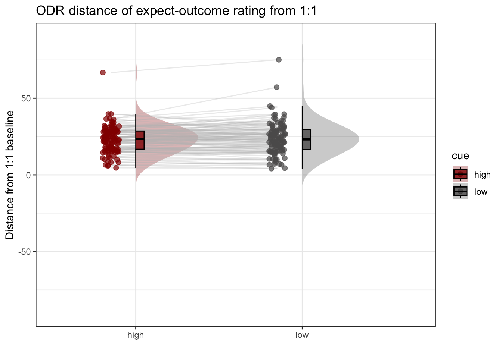


## pain run, collapsed across stimulus intensity
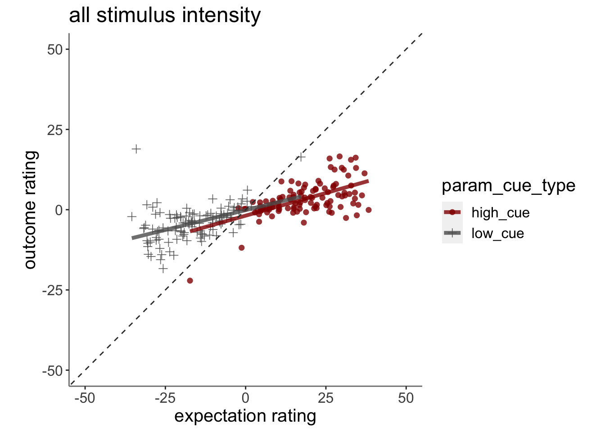

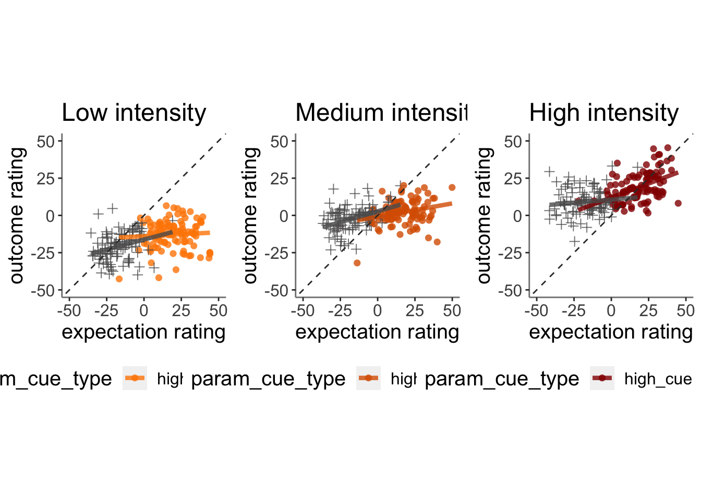

## vicarious


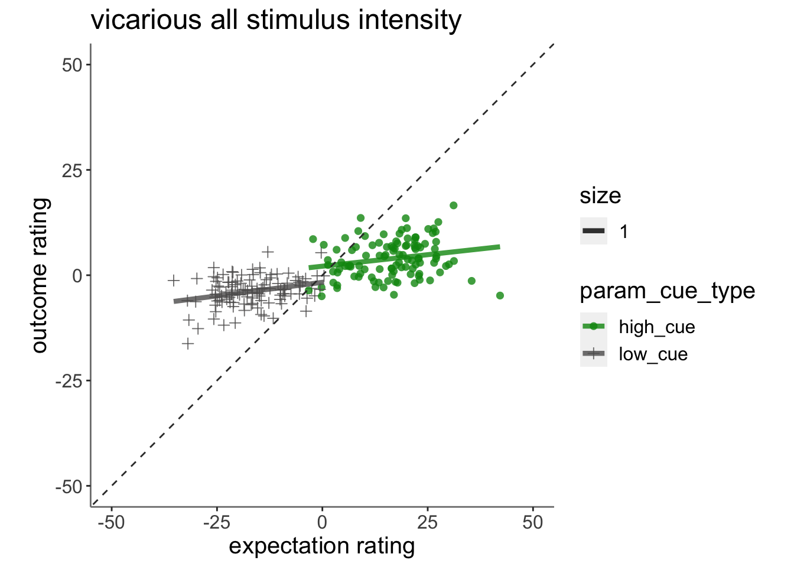

```r
model.factorize_demean = lmer(demean_outcome~ CUE_high_gt_low*stim_con_linear*demean_expect + 
                                CUE_high_gt_low*stim_con_quad*demean_expect +
                                EXPECT_cmc + (1|src_subject_id), data = pvc)
```

```
## fixed-effect model matrix is rank deficient so dropping 1 column / coefficient
```

```
## boundary (singular) fit: see help('isSingular')
```

```r
summary(model.factorize_demean)
```

```
## Linear mixed model fit by REML. t-tests use Satterthwaite's method [
## lmerModLmerTest]
## Formula: demean_outcome ~ CUE_high_gt_low * stim_con_linear * demean_expect +  
##     CUE_high_gt_low * stim_con_quad * demean_expect + EXPECT_cmc +  
##     (1 | src_subject_id)
##    Data: pvc
## 
## REML criterion at convergence: 45954.8
## 
## Scaled residuals: 
##    Min     1Q Median     3Q    Max 
## -3.475 -0.602 -0.138  0.446  5.630 
## 
## Random effects:
##  Groups         Name        Variance Std.Dev.
##  src_subject_id (Intercept)   0.0     0.00   
##  Residual                   469.7    21.67   
## Number of obs: 5111, groups:  src_subject_id, 110
## 
## Fixed effects:
##                                                 Estimate Std. Error         df
## (Intercept)                                      0.21603    0.44918 5099.00000
## CUE_high_gt_low                                  1.24687    0.89837 5099.00000
## stim_con_linear                                 23.90084    1.10386 5099.00000
## demean_expect                                    0.19711    0.01918 5099.00000
## stim_con_quad                                   -4.72799    0.95934 5099.00000
## CUE_high_gt_low:stim_con_linear                  6.38339    2.20771 5099.00000
## CUE_high_gt_low:demean_expect                   -0.02451    0.03835 5099.00000
## stim_con_linear:demean_expect                    0.03147    0.04753 5099.00000
## CUE_high_gt_low:stim_con_quad                   -3.13553    1.91869 5099.00000
## demean_expect:stim_con_quad                      0.01270    0.04060 5099.00000
## CUE_high_gt_low:stim_con_linear:demean_expect    0.37387    0.09506 5099.00000
## CUE_high_gt_low:demean_expect:stim_con_quad     -0.07222    0.08120 5099.00000
##                                               t value Pr(>|t|)    
## (Intercept)                                     0.481  0.63058    
## CUE_high_gt_low                                 1.388  0.16522    
## stim_con_linear                                21.652  < 2e-16 ***
## demean_expect                                  10.278  < 2e-16 ***
## stim_con_quad                                  -4.928 8.55e-07 ***
## CUE_high_gt_low:stim_con_linear                 2.891  0.00385 ** 
## CUE_high_gt_low:demean_expect                  -0.639  0.52280    
## stim_con_linear:demean_expect                   0.662  0.50793    
## CUE_high_gt_low:stim_con_quad                  -1.634  0.10228    
## demean_expect:stim_con_quad                     0.313  0.75449    
## CUE_high_gt_low:stim_con_linear:demean_expect   3.933 8.50e-05 ***
## CUE_high_gt_low:demean_expect:stim_con_quad    -0.889  0.37386    
## ---
## Signif. codes:  0 '***' 0.001 '**' 0.01 '*' 0.05 '.' 0.1 ' ' 1
## 
## Correlation of Fixed Effects:
##                        (Intr) CUE_h__ stm_cn_l dmn_xp stm_cn_q
## CUE_hgh_gt_            -0.193                                 
## stim_cn_lnr             0.007 -0.063                          
## demean_xpct             0.258 -0.736   0.052                  
## stim_con_qd            -0.009  0.026  -0.005   -0.009         
## CUE_hgh_gt_lw:stm_cn_l -0.063  0.007  -0.210   -0.015  0.045  
## CUE_hgh__:_            -0.736  0.258  -0.015   -0.336  0.019  
## stm_cn_ln:_             0.052 -0.015   0.261    0.019 -0.037  
## CUE_hgh_gt_lw:stm_cn_q  0.026 -0.009   0.045    0.019 -0.176  
## dmn_xpct:__            -0.010  0.019  -0.037   -0.034  0.255  
## CUE___:__:_            -0.015  0.052  -0.738   -0.023  0.011  
## CUE___:_:__             0.019 -0.010   0.011   -0.034 -0.734  
##                        CUE_hgh_gt_lw:stm_cn_l CUE_h__:_ st__:_
## CUE_hgh_gt_                                                   
## stim_cn_lnr                                                   
## demean_xpct                                                   
## stim_con_qd                                                   
## CUE_hgh_gt_lw:stm_cn_l                                        
## CUE_hgh__:_             0.052                                 
## stm_cn_ln:_            -0.738                 -0.023          
## CUE_hgh_gt_lw:stm_cn_q -0.005                 -0.009     0.011
## dmn_xpct:__             0.011                 -0.034    -0.014
## CUE___:__:_             0.261                  0.019    -0.305
## CUE___:_:__            -0.037                 -0.034     0.017
##                        CUE_hgh_gt_lw:stm_cn_q dm_:__ CUE___:__:
## CUE_hgh_gt_                                                    
## stim_cn_lnr                                                    
## demean_xpct                                                    
## stim_con_qd                                                    
## CUE_hgh_gt_lw:stm_cn_l                                         
## CUE_hgh__:_                                                    
## stm_cn_ln:_                                                    
## CUE_hgh_gt_lw:stm_cn_q                                         
## dmn_xpct:__            -0.734                                  
## CUE___:__:_            -0.037                  0.017           
## CUE___:_:__             0.255                 -0.369 -0.014    
## fit warnings:
## fixed-effect model matrix is rank deficient so dropping 1 column / coefficient
## optimizer (nloptwrap) convergence code: 0 (OK)
## boundary (singular) fit: see help('isSingular')
```

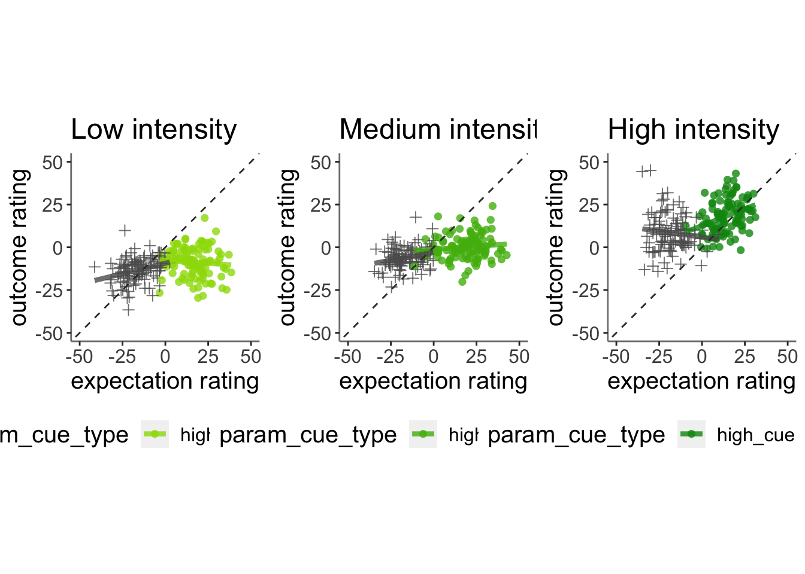

```
## Linear mixed model fit by REML. t-tests use Satterthwaite's method [
## lmerModLmerTest]
## Formula: 
## as.formula(reformulate(c(iv, sprintf("(%s|%s)", iv, subject_keyword)),  
##     response = dv))
##    Data: df
## 
## REML criterion at convergence: 42592.7
## 
## Scaled residuals: 
##     Min      1Q  Median      3Q     Max 
## -2.8941 -0.6915 -0.1167  0.5386  5.2943 
## 
## Random effects:
##  Groups         Name        Variance  Std.Dev. Corr 
##  src_subject_id (Intercept) 4.520e+01  6.72295      
##                 cue_namelow 9.234e-03  0.09609 -1.00
##  Residual                   2.325e+02 15.24653      
## Number of obs: 5111, groups:  src_subject_id, 110
## 
## Fixed effects:
##              Estimate Std. Error        df t value Pr(>|t|)    
## (Intercept)   20.3562     0.7177  111.0539  28.364   <2e-16 ***
## cue_namelow   -0.2391     0.4276 4783.4156  -0.559    0.576    
## ---
## Signif. codes:  0 '***' 0.001 '**' 0.01 '*' 0.05 '.' 0.1 ' ' 1
## 
## Correlation of Fixed Effects:
##             (Intr)
## cue_namelow -0.319
## optimizer (nloptwrap) convergence code: 0 (OK)
## boundary (singular) fit: see help('isSingular')
```

```
## Warning in geom_line(data = subjectwise, aes(group = .data[[subject]], x =
## as.numeric(as.factor(.data[[iv]])) - : Ignoring unknown aesthetics: fill
```

```
## Warning: Removed 1 rows containing non-finite values (`stat_half_ydensity()`).
```

```
## Warning: Removed 1 rows containing non-finite values (`stat_boxplot()`).
```

```
## Warning: Removed 1 row containing missing values (`geom_line()`).
```

```
## Warning: Removed 1 rows containing missing values (`geom_point()`).
```

```
## Warning: Removed 1 rows containing non-finite values (`stat_half_ydensity()`).
```

```
## Warning: Removed 1 rows containing non-finite values (`stat_boxplot()`).
```

```
## Warning: Removed 1 row containing missing values (`geom_line()`).
```

```
## Warning: Removed 1 rows containing missing values (`geom_point()`).
```

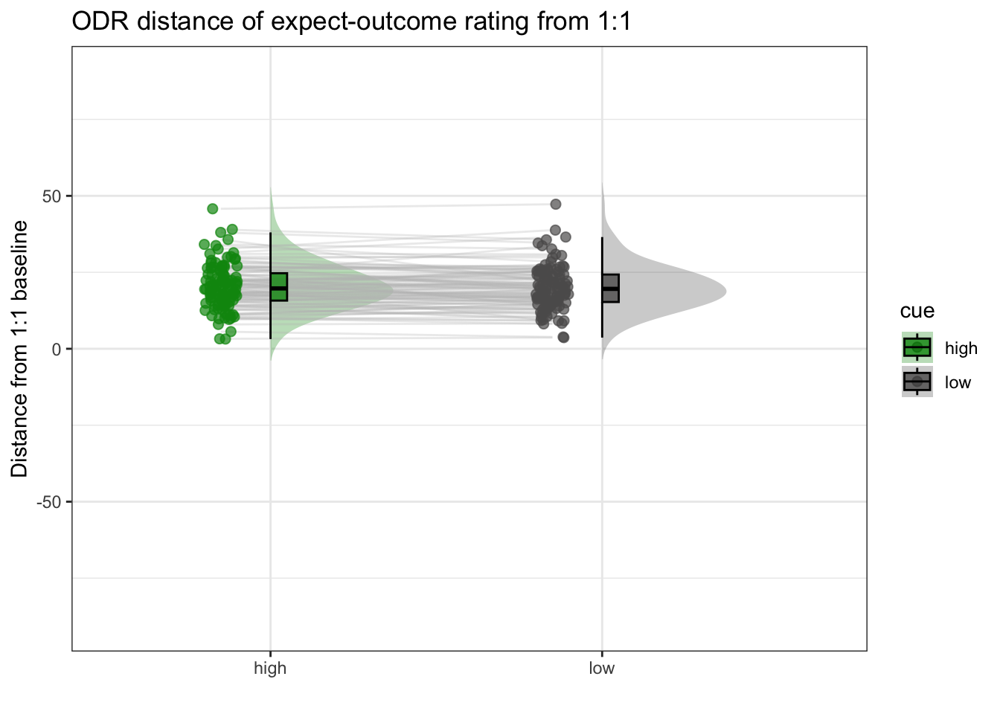

## cognitive


## linear model 0508

```r
# model.factorize_demean = lmer(demean_outcome~ CUE_high_gt_low*stim_factor*demean_expect +EXPECT_cmc+ lag.demean_outcome+(1|src_subject_id), data = pvc)
# summary(model.factorize_demean)

model.factorize_demean = lmer(demean_outcome~ CUE_high_gt_low*stim_con_linear*demean_expect + 
                                CUE_high_gt_low*stim_con_quad*demean_expect +
                                EXPECT_cmc + (1|src_subject_id), data = pvc)
```

```
## fixed-effect model matrix is rank deficient so dropping 1 column / coefficient
```

```
## boundary (singular) fit: see help('isSingular')
```

```r
summary(model.factorize_demean)
```

```
## Linear mixed model fit by REML. t-tests use Satterthwaite's method [
## lmerModLmerTest]
## Formula: demean_outcome ~ CUE_high_gt_low * stim_con_linear * demean_expect +  
##     CUE_high_gt_low * stim_con_quad * demean_expect + EXPECT_cmc +  
##     (1 | src_subject_id)
##    Data: pvc
## 
## REML criterion at convergence: 43807.3
## 
## Scaled residuals: 
##     Min      1Q  Median      3Q     Max 
## -4.1272 -0.6113 -0.1388  0.4529  7.1545 
## 
## Random effects:
##  Groups         Name        Variance Std.Dev.
##  src_subject_id (Intercept)   0.0     0.00   
##  Residual                   347.4    18.64   
## Number of obs: 5041, groups:  src_subject_id, 110
## 
## Fixed effects:
##                                                 Estimate Std. Error         df
## (Intercept)                                    6.017e-02  3.729e-01  5.029e+03
## CUE_high_gt_low                               -1.515e-02  7.458e-01  5.029e+03
## stim_con_linear                                8.066e+00  8.920e-01  5.029e+03
## demean_expect                                  2.374e-01  1.662e-02  5.029e+03
## stim_con_quad                                  3.181e+00  8.174e-01  5.029e+03
## CUE_high_gt_low:stim_con_linear                2.562e+00  1.784e+00  5.029e+03
## CUE_high_gt_low:demean_expect                 -1.247e-02  3.324e-02  5.029e+03
## stim_con_linear:demean_expect                  1.995e-02  3.894e-02  5.029e+03
## CUE_high_gt_low:stim_con_quad                 -2.304e+00  1.635e+00  5.029e+03
## demean_expect:stim_con_quad                    1.089e-03  3.710e-02  5.029e+03
## CUE_high_gt_low:stim_con_linear:demean_expect  1.105e-01  7.788e-02  5.029e+03
## CUE_high_gt_low:demean_expect:stim_con_quad   -9.891e-03  7.419e-02  5.029e+03
##                                               t value Pr(>|t|)    
## (Intercept)                                     0.161 0.871825    
## CUE_high_gt_low                                -0.020 0.983797    
## stim_con_linear                                 9.044  < 2e-16 ***
## demean_expect                                  14.286  < 2e-16 ***
## stim_con_quad                                   3.892 0.000101 ***
## CUE_high_gt_low:stim_con_linear                 1.436 0.151056    
## CUE_high_gt_low:demean_expect                  -0.375 0.707610    
## stim_con_linear:demean_expect                   0.512 0.608536    
## CUE_high_gt_low:stim_con_quad                  -1.410 0.158728    
## demean_expect:stim_con_quad                     0.029 0.976584    
## CUE_high_gt_low:stim_con_linear:demean_expect   1.419 0.156016    
## CUE_high_gt_low:demean_expect:stim_con_quad    -0.133 0.893945    
## ---
## Signif. codes:  0 '***' 0.001 '**' 0.01 '*' 0.05 '.' 0.1 ' ' 1
## 
## Correlation of Fixed Effects:
##                        (Intr) CUE_h__ stm_cn_l dmn_xp stm_cn_q
## CUE_hgh_gt_            -0.165                                 
## stim_cn_lnr            -0.006 -0.029                          
## demean_xpct             0.225 -0.709   0.015                  
## stim_con_qd             0.064 -0.036   0.004    0.050         
## CUE_hgh_gt_lw:stm_cn_l -0.029 -0.006  -0.146   -0.005  0.020  
## CUE_hgh__:_            -0.709  0.225  -0.005   -0.307 -0.079  
## stm_cn_ln:_             0.015 -0.005   0.202    0.006 -0.011  
## CUE_hgh_gt_lw:stm_cn_q -0.036  0.064   0.020   -0.079 -0.183  
## dmn_xpct:__             0.049 -0.077  -0.010    0.115  0.245  
## CUE___:__:_            -0.005  0.015  -0.698    0.014  0.003  
## CUE___:_:__            -0.077  0.049   0.003   -0.078 -0.719  
##                        CUE_hgh_gt_lw:stm_cn_l CUE_h__:_ st__:_
## CUE_hgh_gt_                                                   
## stim_cn_lnr                                                   
## demean_xpct                                                   
## stim_con_qd                                                   
## CUE_hgh_gt_lw:stm_cn_l                                        
## CUE_hgh__:_             0.015                                 
## stm_cn_ln:_            -0.698                  0.014          
## CUE_hgh_gt_lw:stm_cn_q  0.004                  0.050     0.003
## dmn_xpct:__             0.003                 -0.078    -0.004
## CUE___:__:_             0.202                  0.006    -0.273
## CUE___:_:__            -0.010                  0.115    -0.009
##                        CUE_hgh_gt_lw:stm_cn_q dm_:__ CUE___:__:
## CUE_hgh_gt_                                                    
## stim_cn_lnr                                                    
## demean_xpct                                                    
## stim_con_qd                                                    
## CUE_hgh_gt_lw:stm_cn_l                                         
## CUE_hgh__:_                                                    
## stm_cn_ln:_                                                    
## CUE_hgh_gt_lw:stm_cn_q                                         
## dmn_xpct:__            -0.719                                  
## CUE___:__:_            -0.011                 -0.009           
## CUE___:_:__             0.245                 -0.336 -0.004    
## fit warnings:
## fixed-effect model matrix is rank deficient so dropping 1 column / coefficient
## optimizer (nloptwrap) convergence code: 0 (OK)
## boundary (singular) fit: see help('isSingular')
```

```r
# model.factorize_C= lmer(demean_outcome~ CUE_high_gt_low*stim_factor*demean_expect +EXPECT_cmc+ (1|src_subject_id), data = pvc)
# summary(model.factorize_demean)
```

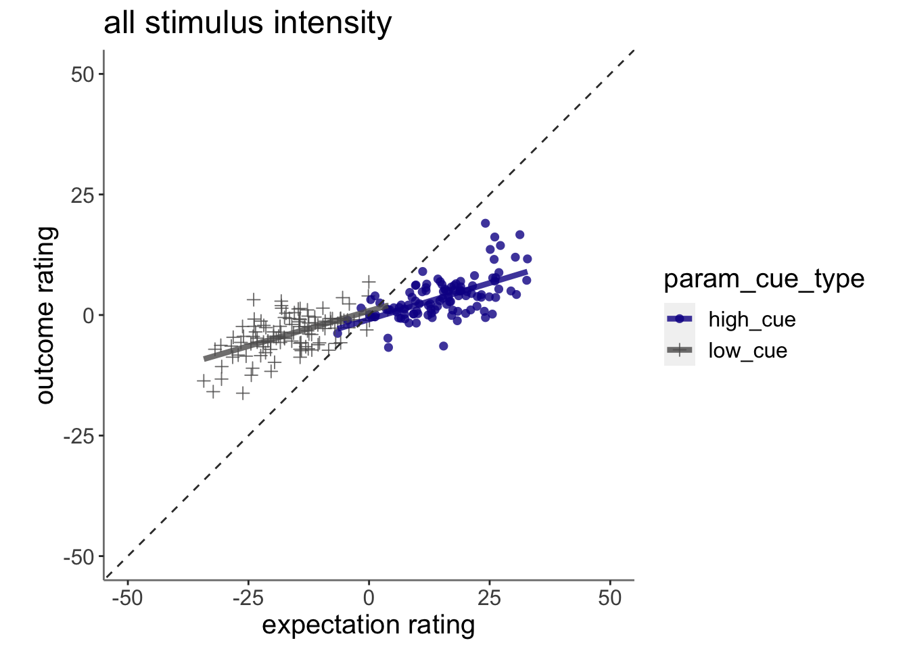

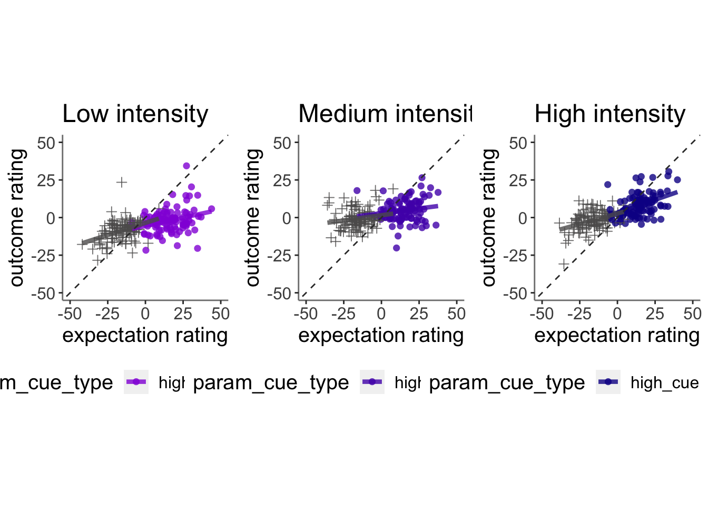


```
## Linear mixed model fit by REML. t-tests use Satterthwaite's method [
## lmerModLmerTest]
## Formula: 
## as.formula(reformulate(c(iv, sprintf("(%s|%s)", iv, subject_keyword)),  
##     response = dv))
##    Data: df
## 
## REML criterion at convergence: 40996.5
## 
## Scaled residuals: 
##     Min      1Q  Median      3Q     Max 
## -2.4634 -0.6567 -0.1325  0.5028  6.6541 
## 
## Random effects:
##  Groups         Name        Variance  Std.Dev. Corr 
##  src_subject_id (Intercept)  43.94315  6.6290       
##                 cue_namelow   0.03079  0.1755  -1.00
##  Residual                   189.43985 13.7637       
## Number of obs: 5041, groups:  src_subject_id, 110
## 
## Fixed effects:
##              Estimate Std. Error        df t value Pr(>|t|)    
## (Intercept)   18.8604     0.6959  107.7330  27.101   <2e-16 ***
## cue_namelow   -0.5008     0.3891 4141.2072  -1.287    0.198    
## ---
## Signif. codes:  0 '***' 0.001 '**' 0.01 '*' 0.05 '.' 0.1 ' ' 1
## 
## Correlation of Fixed Effects:
##             (Intr)
## cue_namelow -0.319
## optimizer (nloptwrap) convergence code: 0 (OK)
## boundary (singular) fit: see help('isSingular')
```

```
## Warning in geom_line(data = subjectwise, aes(group = .data[[subject]], x =
## as.numeric(as.factor(.data[[iv]])) - : Ignoring unknown aesthetics: fill
```

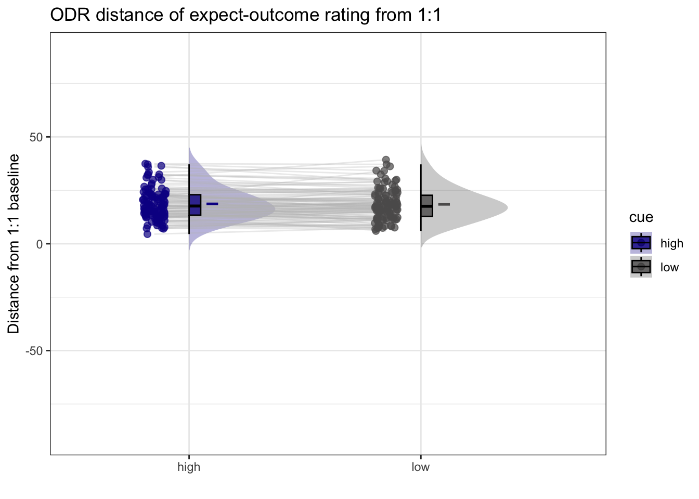

```r
# library(plotly)
# plot_ly(x=subjectwise_naomit_2dv$param_cue_type, y=subjectwise_naomit_2dv$DV1_mean_per_sub, z=subjectwise_naomit_2dv$DV2_mean_per_sub, type="scatter3d", mode="markers", color=subjectwise_naomit_2dv$param_cue_type)
```

## across tasks (PVC), is the  slope for (highvslow cue) the same?Tor question
* Adding "participant" as random effects leads to a singular boundary issue. The reason is because there is no random effects variance across participants. 
1) If I add task as a random effect, in other words, allowing for differences across tasks, I get the following results: 
* expectancy-outcome relationship differs across tasks, taskname_lin:demean_expect, t(14130) = 4.317, p < .001
* expectancy-outcome relationship differs across cue and tasks, "taskname_lin:CUE_high_gt_low:demean_expect", t(14130) = 5.758, p < .001
taskname_lin:CUE_high_gt_low                -3.790e+00  1.448e+00  1.413e+04  -2.618  0.00886 ** 
++ taskname_lin:demean_expect           9.854e-02  2.283e-02  1.413e+04   4.317 1.59e-05 ***
CUE_high_gt_low:demean_expect               -9.077e-02  1.987e-02  1.413e+04  -4.569 4.95e-06 ***
CUE_high_gt_low:taskname_quad                5.352e+00  1.334e+00  1.413e+04   4.012 6.04e-05 ***
demean_expect:taskname_quad         -1.596e-01  2.253e-02  1.413e+04  -7.084 1.47e-12 ***
taskname_lin:CUE_high_gt_low:demean_expect   2.629e-01  4.565e-02  1.413e+04   5.758 8.67e-09 ***
CUE_high_gt_low:demean_expect:taskname_quad -1.021e-01  4.505e-02  1.413e+04  -2.266  0.02348 *  

2) If I add sub as random effect and ignore singular. Plus, if I remove the cue contrast...
* expectancy-outcome relationship differs across tasks, factor(param_task_name):demean_expect, F(2, 14136) = 54.765, p < .001
 

```r
p <- load_task_social_df(datadir, taskname = 'pain', subject_varkey = subject_varkey, iv = iv, exclude = exclude)
v <- load_task_social_df(datadir, taskname = 'vicarious', subject_varkey = subject_varkey, iv = iv, exclude = exclude)
c <- load_task_social_df(datadir, taskname = 'cognitive', subject_varkey = subject_varkey, iv = iv, exclude = exclude)
p_sub <- p[, c("param_task_name", "param_cue_type", "src_subject_id","session_id", "param_run_num", "param_stimulus_type", "event04_actual_angle", "event02_expect_angle")]
v_sub <- v[, c("param_task_name", "param_cue_type", "src_subject_id","session_id", "param_run_num", "param_stimulus_type", "event04_actual_angle", "event02_expect_angle")]
c_sub <- c[, c("param_task_name", "param_cue_type", "src_subject_id", "session_id", "param_run_num","param_stimulus_type", "event04_actual_angle", "event02_expect_angle")]
pvc_sub <- do.call("rbind", list(p_sub, v_sub, c_sub))
```

```r
maindata <- pvc_sub %>%
group_by(src_subject_id) %>%
mutate(event04_actual_angle = as.numeric(event04_actual_angle)) %>%
mutate(event02_expect_angle = as.numeric(event02_expect_angle)) %>%
mutate(avg_outcome = mean(event04_actual_angle, na.rm = TRUE)) %>%
mutate(demean_outcome = event04_actual_angle - avg_outcome) %>%
mutate(avg_expect = mean(event02_expect_angle, na.rm = TRUE)) %>%
mutate(demean_expect = event02_expect_angle - avg_expect)

data_p2= maindata %>%
  arrange(src_subject_id ) %>%
  group_by(src_subject_id) %>%
  mutate(trial_index = row_number())
data_a3 <- data_p2 %>% 
  group_by(src_subject_id, session_id, param_run_num) %>% 
  mutate(trial_index = row_number(param_run_num))

data_a3lag <- 
    data_a3 %>%
    group_by(src_subject_id, session_id, param_run_num) %>%
    mutate(lag.demean_outcome = dplyr::lag(demean_outcome, n = 1, default = NA))
data_a3lag_omit <- data_a3lag[complete.cases(data_a3lag$lag.demean_outcome),]

df <- data_a3lag_omit
pvc_sub <- simple_contrasts_beh(df)
```

```
## Warning: Unknown or uninitialised column: `stim_con_linear`.
```

```
## Warning: Unknown or uninitialised column: `stim_con_quad`.
```

```
## Warning: Unknown or uninitialised column: `CUE_high_gt_low`.
```

```
## Warning: Unknown or uninitialised column: `cue_name`.
```


```r
# contrast code 1 linear
pvc_sub$taskname_lin[pvc_sub$param_task_name == "pain"] <-  0.5
```

```
## Warning: Unknown or uninitialised column: `taskname_lin`.
```

```r
pvc_sub$taskname_lin[pvc_sub$param_task_name == "vicarious"] <-  0
pvc_sub$taskname_lin[pvc_sub$param_task_name == "cognitive"] <-  -0.5

# contrast code 2 quadratic
pvc_sub$taskname_quad[pvc_sub$param_task_name == "pain"] <-  -0.33
```

```
## Warning: Unknown or uninitialised column: `taskname_quad`.
```

```r
pvc_sub$taskname_quad[pvc_sub$param_task_name == "vicarious"] <-  0.66
pvc_sub$taskname_quad[pvc_sub$param_task_name == "cognitive"] <-  -0.33

pvc_sub$sub = factor(pvc_sub$src_subject_id)
# model_test = lm(pvc_sub$demean_outcome~ pvc_sub$demean_expect)
model_task = lmer(demean_outcome~ taskname_lin*CUE_high_gt_low*demean_expect + taskname_quad*CUE_high_gt_low*demean_expect +  (1 | sub), data = pvc_sub)
model_wotask = lmer(demean_outcome~ CUE_high_gt_low*demean_expect +(1 | sub), data = pvc_sub)
```

```
## boundary (singular) fit: see help('isSingular')
```

```r
summary(model_task)
```

```
## Linear mixed model fit by REML. t-tests use Satterthwaite's method [
## lmerModLmerTest]
## Formula: demean_outcome ~ taskname_lin * CUE_high_gt_low * demean_expect +  
##     taskname_quad * CUE_high_gt_low * demean_expect + (1 | sub)
##    Data: pvc_sub
## 
## REML criterion at convergence: 139399.8
## 
## Scaled residuals: 
##     Min      1Q  Median      3Q     Max 
## -4.5727 -0.6342 -0.1226  0.5514  5.3674 
## 
## Random effects:
##  Groups   Name        Variance Std.Dev.
##  sub      (Intercept)   0.1232  0.351  
##  Residual             600.5633 24.506  
## Number of obs: 15091, groups:  sub, 111
## 
## Fixed effects:
##                                               Estimate Std. Error         df
## (Intercept)                                 -3.019e-01  2.951e-01  2.477e+02
## taskname_lin                                 1.801e+01  6.935e-01  1.447e+04
## CUE_high_gt_low                             -9.551e+00  5.853e-01  1.369e+04
## demean_expect                                4.696e-01  9.457e-03  1.156e+04
## taskname_quad                               -1.082e+01  6.465e-01  1.482e+04
## taskname_lin:CUE_high_gt_low                -4.377e+00  1.388e+00  7.418e+03
## taskname_lin:demean_expect                   1.007e-01  2.163e-02  1.758e+03
## CUE_high_gt_low:demean_expect               -8.861e-02  1.894e-02  4.064e+03
## CUE_high_gt_low:taskname_quad                5.276e+00  1.294e+00  1.247e+04
## demean_expect:taskname_quad                 -1.730e-01  2.157e-02  8.290e+03
## taskname_lin:CUE_high_gt_low:demean_expect   2.685e-01  4.314e-02  1.405e+04
## CUE_high_gt_low:demean_expect:taskname_quad -1.063e-01  4.310e-02  1.484e+04
##                                             t value Pr(>|t|)    
## (Intercept)                                  -1.023  0.30723    
## taskname_lin                                 25.973  < 2e-16 ***
## CUE_high_gt_low                             -16.319  < 2e-16 ***
## demean_expect                                49.657  < 2e-16 ***
## taskname_quad                               -16.741  < 2e-16 ***
## taskname_lin:CUE_high_gt_low                 -3.153  0.00162 ** 
## taskname_lin:demean_expect                    4.655 3.48e-06 ***
## CUE_high_gt_low:demean_expect                -4.679 2.98e-06 ***
## CUE_high_gt_low:taskname_quad                 4.078 4.56e-05 ***
## demean_expect:taskname_quad                  -8.022 1.18e-15 ***
## taskname_lin:CUE_high_gt_low:demean_expect    6.224 4.98e-10 ***
## CUE_high_gt_low:demean_expect:taskname_quad  -2.466  0.01368 *  
## ---
## Signif. codes:  0 '***' 0.001 '**' 0.01 '*' 0.05 '.' 0.1 ' ' 1
## 
## Correlation of Fixed Effects:
##                  (Intr) tsknm_l CUE_h__ dmn_xp tsknm_q ts_:CUE___ tsk_:_
## taskname_ln       0.005                                                 
## CUE_hgh_gt_      -0.188  0.369                                          
## demean_xpct       0.224 -0.360  -0.620                                  
## taskname_qd       0.087 -0.004  -0.299   0.280                          
## tsk_:CUE___       0.368  0.032   0.004   0.141 -0.253                   
## tsknm_ln:d_      -0.374  0.022   0.146  -0.281  0.256  -0.574           
## CUE_hgh_gt_lw:d_ -0.616  0.140   0.225  -0.197 -0.142  -0.362      0.151
## CUE_hgh_gt_lw:t_ -0.298 -0.253   0.088  -0.143 -0.382  -0.005     -0.097
## dmn_xpct:t_       0.271  0.240  -0.139   0.177  0.391  -0.091      0.183
## t_:CUE___:_       0.145 -0.572  -0.375   0.150 -0.099   0.023     -0.120
## CUE_h__:_:_      -0.137 -0.093   0.272  -0.123 -0.659   0.239     -0.099
##                  CUE_hgh_gt_lw:d_ CUE_hgh_gt_lw:t_ dmn_:_ t_:CUE___:
## taskname_ln                                                         
## CUE_hgh_gt_                                                         
## demean_xpct                                                         
## taskname_qd                                                         
## tsk_:CUE___                                                         
## tsknm_ln:d_                                                         
## CUE_hgh_gt_lw:d_                                                    
## CUE_hgh_gt_lw:t_  0.281                                             
## dmn_xpct:t_      -0.123           -0.660                            
## t_:CUE___:_      -0.280            0.256           -0.099           
## CUE_h__:_:_       0.176            0.391           -0.255  0.185
```

```r
anova(model_task)
```

```
## Type III Analysis of Variance Table with Satterthwaite's method
##                                              Sum Sq Mean Sq NumDF   DenDF
## taskname_lin                                 405142  405142     1 14470.1
## CUE_high_gt_low                              159941  159941     1 13687.7
## demean_expect                               1480894 1480894     1 11560.3
## taskname_quad                                168310  168310     1 14820.0
## taskname_lin:CUE_high_gt_low                   5970    5970     1  7418.2
## taskname_lin:demean_expect                    13016   13016     1  1757.8
## CUE_high_gt_low:demean_expect                 13146   13146     1  4063.7
## CUE_high_gt_low:taskname_quad                  9989    9989     1 12473.3
## demean_expect:taskname_quad                   38647   38647     1  8289.7
## taskname_lin:CUE_high_gt_low:demean_expect    23266   23266     1 14053.9
## CUE_high_gt_low:demean_expect:taskname_quad    3652    3652     1 14843.7
##                                               F value    Pr(>F)    
## taskname_lin                                 674.6035 < 2.2e-16 ***
## CUE_high_gt_low                              266.3187 < 2.2e-16 ***
## demean_expect                               2465.8423 < 2.2e-16 ***
## taskname_quad                                280.2539 < 2.2e-16 ***
## taskname_lin:CUE_high_gt_low                   9.9409  0.001623 ** 
## taskname_lin:demean_expect                    21.6722 3.477e-06 ***
## CUE_high_gt_low:demean_expect                 21.8899 2.981e-06 ***
## CUE_high_gt_low:taskname_quad                 16.6325 4.565e-05 ***
## demean_expect:taskname_quad                   64.3519 1.183e-15 ***
## taskname_lin:CUE_high_gt_low:demean_expect    38.7401 4.979e-10 ***
## CUE_high_gt_low:demean_expect:taskname_quad    6.0802  0.013681 *  
## ---
## Signif. codes:  0 '***' 0.001 '**' 0.01 '*' 0.05 '.' 0.1 ' ' 1
```

```r
anova(model_wotask, model_task)
```

```
## refitting model(s) with ML (instead of REML)
```

```
## Data: pvc_sub
## Models:
## model_wotask: demean_outcome ~ CUE_high_gt_low * demean_expect + (1 | sub)
## model_task: demean_outcome ~ taskname_lin * CUE_high_gt_low * demean_expect + taskname_quad * CUE_high_gt_low * demean_expect + (1 | sub)
##              npar    AIC    BIC logLik deviance  Chisq Df Pr(>Chisq)    
## model_wotask    6 141394 141440 -70691   141382                         
## model_task     14 139396 139502 -69684   139368 2014.4  8  < 2.2e-16 ***
## ---
## Signif. codes:  0 '***' 0.001 '**' 0.01 '*' 0.05 '.' 0.1 ' ' 1
```

```r
# summary(model_test)
```


```r
model_task1 = lmer(demean_outcome~ factor(param_task_name)*demean_expect  +  (1 | sub), data = pvc_sub)
model_wotask1 = lmer(demean_outcome~ demean_expect+ (1 | sub), data = pvc_sub)
```

```
## boundary (singular) fit: see help('isSingular')
```

```r
summary(model_task1)
```

```
## Linear mixed model fit by REML. t-tests use Satterthwaite's method [
## lmerModLmerTest]
## Formula: demean_outcome ~ factor(param_task_name) * demean_expect + (1 |  
##     sub)
##    Data: pvc_sub
## 
## REML criterion at convergence: 139725.4
## 
## Scaled residuals: 
##     Min      1Q  Median      3Q     Max 
## -4.2535 -0.6307 -0.1171  0.5506  5.2255 
## 
## Random effects:
##  Groups   Name        Variance  Std.Dev.
##  sub      (Intercept)   0.03748  0.1936 
##  Residual             613.93050 24.7776 
## Number of obs: 15091, groups:  sub, 111
## 
## Fixed effects:
##                                                  Estimate Std. Error         df
## (Intercept)                                    -8.081e+00  3.662e-01  8.076e+02
## factor(param_task_name)pain                     2.304e+01  5.519e-01  1.465e+04
## factor(param_task_name)vicarious               -1.434e+00  5.227e-01  1.508e+04
## demean_expect                                   3.702e-01  1.369e-02  9.687e+03
## factor(param_task_name)pain:demean_expect       1.136e-01  1.724e-02  3.523e+03
## factor(param_task_name)vicarious:demean_expect -8.418e-02  1.912e-02  1.410e+04
##                                                t value Pr(>|t|)    
## (Intercept)                                    -22.067  < 2e-16 ***
## factor(param_task_name)pain                     41.742  < 2e-16 ***
## factor(param_task_name)vicarious                -2.744  0.00607 ** 
## demean_expect                                   27.033  < 2e-16 ***
## factor(param_task_name)pain:demean_expect        6.589 5.07e-11 ***
## factor(param_task_name)vicarious:demean_expect  -4.403 1.08e-05 ***
## ---
## Signif. codes:  0 '***' 0.001 '**' 0.01 '*' 0.05 '.' 0.1 ' ' 1
## 
## Correlation of Fixed Effects:
##                     (Intr) fctr(prm_tsk_nm)p fctr(prm_tsk_nm)v dmn_xp
## fctr(prm_tsk_nm)p   -0.662                                           
## fctr(prm_tsk_nm)v   -0.699  0.464                                    
## demean_xpct          0.298 -0.198            -0.209                  
## fctr(prm_tsk_nm)p:_ -0.237 -0.080             0.166            -0.794
## fctr(prm_tsk_nm)v:_ -0.214  0.142             0.336            -0.716
##                     fctr(prm_tsk_nm)p:_
## fctr(prm_tsk_nm)p                      
## fctr(prm_tsk_nm)v                      
## demean_xpct                            
## fctr(prm_tsk_nm)p:_                    
## fctr(prm_tsk_nm)v:_  0.569
```

```r
anova(model_task1)
```

```
## Type III Analysis of Variance Table with Satterthwaite's method
##                                        Sum Sq Mean Sq NumDF   DenDF  F value
## factor(param_task_name)               1451299  725650     2 14837.1 1181.974
## demean_expect                         1679513 1679513     1 14954.2 2735.674
## factor(param_task_name):demean_expect   86935   43467     2  5101.8   70.802
##                                          Pr(>F)    
## factor(param_task_name)               < 2.2e-16 ***
## demean_expect                         < 2.2e-16 ***
## factor(param_task_name):demean_expect < 2.2e-16 ***
## ---
## Signif. codes:  0 '***' 0.001 '**' 0.01 '*' 0.05 '.' 0.1 ' ' 1
```

```r
anova(model_wotask1)
```

```
## Type III Analysis of Variance Table with Satterthwaite's method
##                Sum Sq Mean Sq NumDF DenDF F value    Pr(>F)    
## demean_expect 4785248 4785248     1 15089  6564.5 < 2.2e-16 ***
## ---
## Signif. codes:  0 '***' 0.001 '**' 0.01 '*' 0.05 '.' 0.1 ' ' 1
```

```r
anova(model_wotask1, model_task1)
```

```
## refitting model(s) with ML (instead of REML)
```

```
## Data: pvc_sub
## Models:
## model_wotask1: demean_outcome ~ demean_expect + (1 | sub)
## model_task1: demean_outcome ~ factor(param_task_name) * demean_expect + (1 | sub)
##               npar    AIC    BIC logLik deviance  Chisq Df Pr(>Chisq)    
## model_wotask1    4 142306 142337 -71149   142298                         
## model_task1      8 139720 139781 -69852   139704 2594.7  4  < 2.2e-16 ***
## ---
## Signif. codes:  0 '***' 0.001 '**' 0.01 '*' 0.05 '.' 0.1 ' ' 1
```


```r
library(emmeans)
# emm1 = emmeans(model_task, specs = pairwise ~ stimintensity:task)
# emm1
```

## Alireza congruent incongruent (PE)
* categorize based on congruent, incongruent
* split dataframe


```r
# %% -------------------------------------------------------------------------
#  load pain data
# ----------------------------------------------------------------------------

main_dir = dirname(dirname(getwd()))
datadir = file.path(main_dir, 'data', 'beh', 'beh02_preproc')
subject_varkey <- "src_subject_id"
iv <- "param_cue_type"
xlab <- ""
taskname <- "pain"
ylab <- "ratings (degree)"
subject <- "subject"
exclude <- "sub-0001|sub-0003|sub-0004|sub-0005|sub-0025|sub-0999"
data = data.frame()
data <- load_task_social_df(datadir, taskname = taskname, subject_varkey = subject_varkey, iv = iv, exclude = exclude)
data$event03_RT <- data$event03_stimulusC_reseponseonset - data$event03_stimulus_displayonset

dir.create(analysis_dir, showWarnings = FALSE, recursive = TRUE)

maindata <- data %>%
group_by(src_subject_id) %>%
mutate(event04_actual_angle = as.numeric(event04_actual_angle)) %>%
mutate(event02_expect_angle = as.numeric(event02_expect_angle)) %>%
mutate(avg_outcome = mean(event04_actual_angle, na.rm = TRUE)) %>%
mutate(demean_outcome = event04_actual_angle - avg_outcome) %>%
mutate(avg_expect = mean(event02_expect_angle, na.rm = TRUE)) %>%
mutate(demean_expect = event02_expect_angle - avg_expect)

# %% -------------------------------------------------------------------------
#  0. argparse
# ----------------------------------------------------------------------------

data_p2= maindata %>%
  arrange(src_subject_id ) %>%
  group_by(src_subject_id) %>%
  mutate(trial_index = row_number())
data_a3 <- data_p2 %>% 
  group_by(src_subject_id, session_id, param_run_num) %>% 
  mutate(trial_index = row_number(param_run_num))

data_a3lag <- 
    data_a3 %>%
    group_by(src_subject_id, session_id, param_run_num) %>%
    mutate(lag.demean_outcome = dplyr::lag(demean_outcome, n = 1, default = NA))
data_a3lag <- data_a3lag %>%
  mutate(EXPECT_cmc = avg_expect - mean(avg_expect)) 
data_a3lag_omit <- data_a3lag[complete.cases(data_a3lag$lag.demean_outcome),]

df <- data_a3lag_omit
pvc <- simple_contrasts_beh(df)
```

```
## Warning: Unknown or uninitialised column: `stim_con_linear`.
```

```
## Warning: Unknown or uninitialised column: `stim_con_quad`.
```

```
## Warning: Unknown or uninitialised column: `CUE_high_gt_low`.
```

```
## Warning: Unknown or uninitialised column: `cue_name`.
```

### archive this cell

```r
# previous_congruency <- is_congruent(param_cue_type[previous_index], param_stimulus_type[previous_index])

is_congruent <- function(cue, stim) {
  if (cue == "low_cue" && stim == "low_stim") {
    return("congruent")
  } else if (cue == "low_cue" && stim == "high_stim") {
    return("incongruent")
  } else if (cue == "high_cue" && stim == "low_stim") {
    return("incongruent")
  } else if (cue == "high_cue" && stim == "high_stim") {
    return("congruent")
  } else if (cue == "high_cue" && stim == "med_stim") {
    return("congruent")
  } else if (cue == "low_cue" && stim == "med_stim") {
    return("incongruent")
  } else {
    return(NA)  # Handle other cases
  }
}
```


```r
pvc.pain <- pvc[pvc$param_task_name == "pain",]
pvc.pain$pe <- pvc.pain$demean_outcome - pvc.pain$demean_expect

# define congruency patterns
pvc.pain$congruency[(pvc.pain$param_cue_type == "low_cue") & (pvc.pain$pe < 0)] <- "congruent"
```

```
## Warning: Unknown or uninitialised column: `congruency`.
```

```r
pvc.pain$congruency[(pvc.pain$param_cue_type == "high_cue") & (pvc.pain$pe > 0)] <- "congruent"

pvc.pain$congruency[(pvc.pain$param_cue_type == "low_cue") & (pvc.pain$pe > 0)] <- "incongruent"
pvc.pain$congruency[(pvc.pain$param_cue_type == "high_cue") & (pvc.pain$pe < 0)] <- "incongruent"


library(dplyr)

# definition: current cue level (high, low). 
# Find N-1 trial where cue level matches current trial
# populate that as "congruency_vector"
pvc.pain <- pvc.pain %>%
  # group by subject, session, run
  group_by(src_subject_id, session_id, param_run_num) %>%
  mutate(
    congruency_status = {
      congruency_vector <- vector("character", n())
      
      for (i in 1:n()) {
        # get the current cue. find the trial indices with the same cue level as current trial `matching_indices`
        current_cue <- param_cue_type[i]
        # identifying all existing trials that matches the current cue level
        matching_indices <- which(param_cue_type[1:(i - 1)] == current_cue)
        if (length(matching_indices) > 0) {
          # from matching_indices, grab the largest number. 
          # this maximum number would be the most recent N-1 cue trial, based on matching_indices
          previous_index <- max(matching_indices)
          # populate congruency_vector with previous N-1 trial's congruency value. (NOTE: must match current cue level)
          congruency_vector[i] <- congruency[previous_index] 
        } else {
          congruency_vector[i] <- NA
        }
      }
      congruency_vector
    }
  ) 
  # ungroup() %>%
  # mutate(
  #   congruency_status = ifelse(is.na(congruency_status), pvc$congruency, congruency_status)
  # )
```


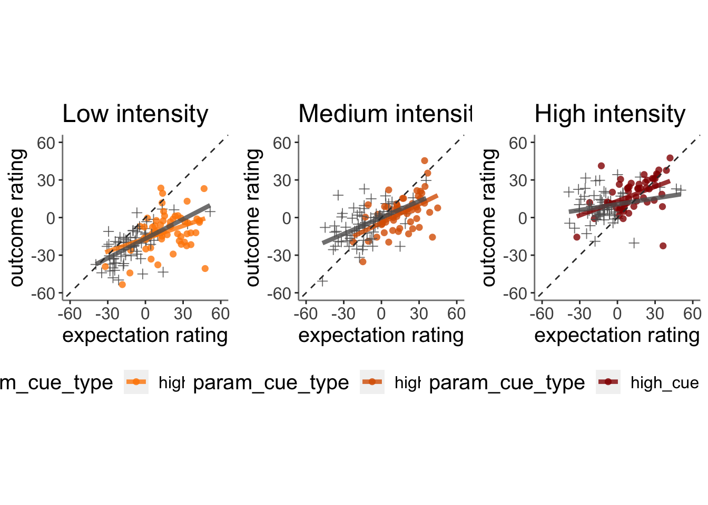


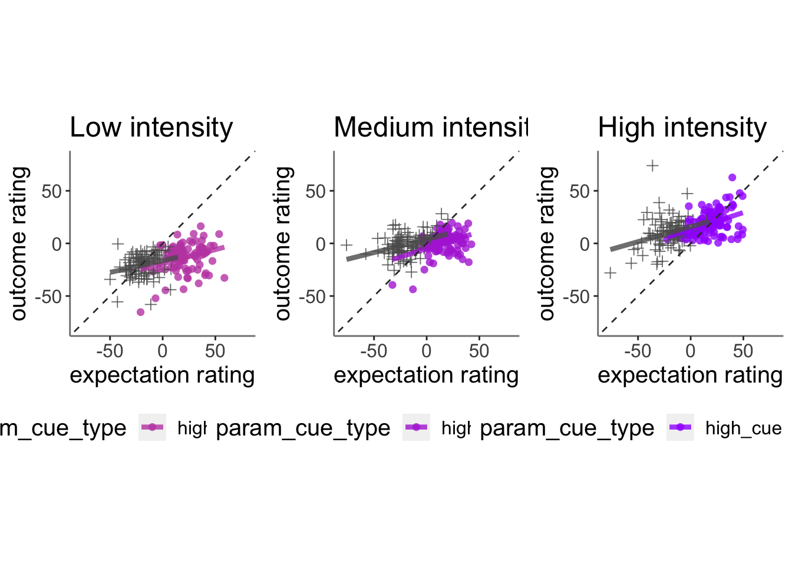


## Alireza congruent incongruent (incorrect)
* categorize based on congruent, incongruent
* split dataframe

### archive this cell

```r
# previous_congruency <- is_congruent(param_cue_type[previous_index], param_stimulus_type[previous_index])

is_congruent <- function(cue, stim) {
  if (cue == "low_cue" && stim == "low_stim") {
    return("congruent")
  } else if (cue == "low_cue" && stim == "high_stim") {
    return("incongruent")
  } else if (cue == "high_cue" && stim == "low_stim") {
    return("incongruent")
  } else if (cue == "high_cue" && stim == "high_stim") {
    return("congruent")
  } else if (cue == "high_cue" && stim == "med_stim") {
    return("congruent")
  } else if (cue == "low_cue" && stim == "med_stim") {
    return("incongruent")
  } else {
    return(NA)  # Handle other cases
  }
}
```


```r
pvc <- pvc[pvc$param_task_name == "pain",]

# define congruency patterns
pvc.pain$congruency2[(pvc.pain$param_cue_type == "low_cue") & (pvc.pain$param_stimulus_type == "low_stim")] <- "congruent"
```

```
## Warning: Unknown or uninitialised column: `congruency2`.
```

```r
pvc.pain$congruency2[(pvc.pain$param_cue_type == "high_cue") & (pvc.pain$param_stimulus_type == "low_stim")] <- "incongruent"

pvc.pain$congruency2[(pvc.pain$param_cue_type == "low_cue") & (pvc.pain$param_stimulus_type == "med_stim")] <- "incongruent"
pvc.pain$congruency2[(pvc.pain$param_cue_type == "high_cue") & (pvc.pain$param_stimulus_type == "med_stim")] <- "congruent"

pvc.pain$congruency2[(pvc.pain$param_cue_type == "low_cue") & (pvc.pain$param_stimulus_type == "high_stim")] <- "incongruent"
pvc.pain$congruency2[(pvc.pain$param_cue_type == "high_cue") & (pvc.pain$param_stimulus_type == "high_stim")] <- "congruent"


library(dplyr)

# definition: current cue level (high, low). 
# Find N-1 trial where cue level matches current trial
# populate that as "congruency_vector"
pvc.pain <- pvc.pain %>%
  # group by subject, session, run
  group_by(src_subject_id, session_id, param_run_num) %>%
  mutate(
    congruency_status2 = {
      congruency_vector <- vector("character", n())
      
      for (i in 1:n()) {
        # get the current cue. find the trial indices with the same cue level as current trial `matching_indices`
        current_cue <- param_cue_type[i]
        # identifying all existing trials that matches the current cue level
        matching_indices <- which(param_cue_type[1:(i - 1)] == current_cue)
        if (length(matching_indices) > 0) {
          # from matching_indices, grab the largest number. 
          # this maximum number would be the most recent N-1 cue trial, based on matching_indices
          previous_index <- max(matching_indices)
          # populate congruency_vector with previous N-1 trial's congruency value. (NOTE: must match current cue level)
          congruency_vector[i] <- congruency2[previous_index] 
        } else {
          congruency_vector[i] <- NA
        }
      }
      congruency_vector
    }
  ) 
  # ungroup() %>%
  # mutate(
  #   congruency_status2 = ifelse(is.na(congruency_status2), pvc$congruency2, congruency_status2)
  # )
```


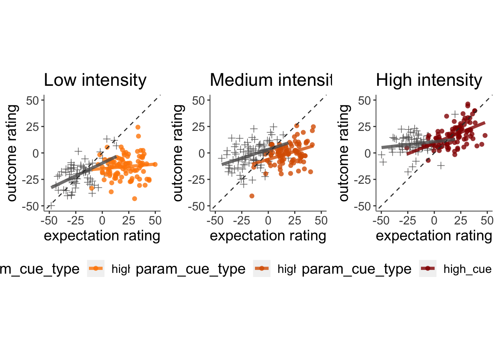


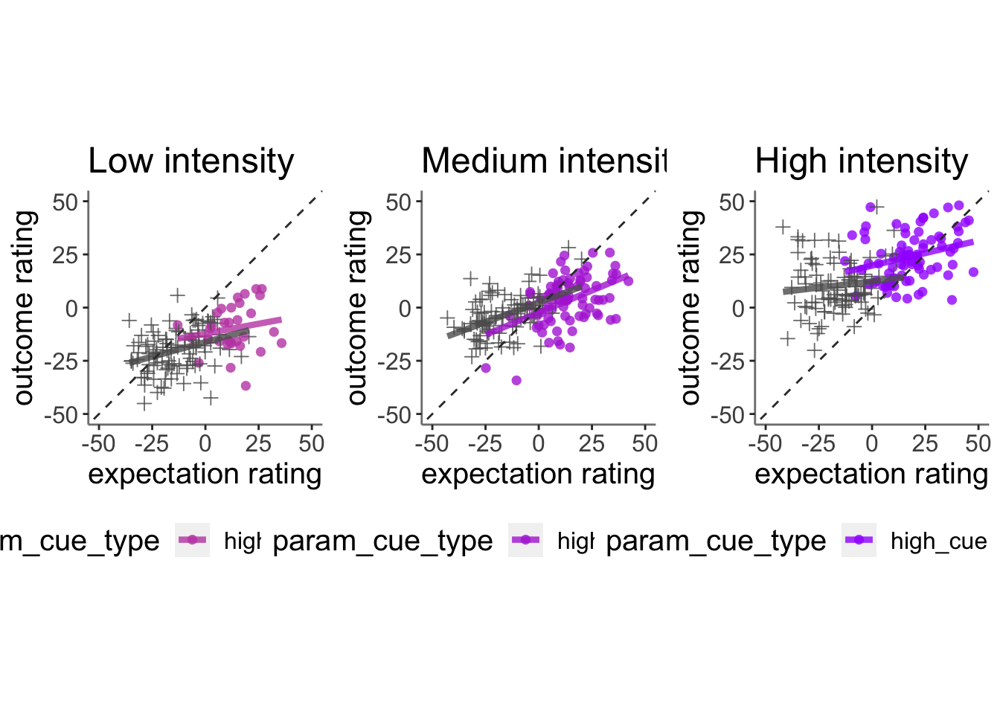
