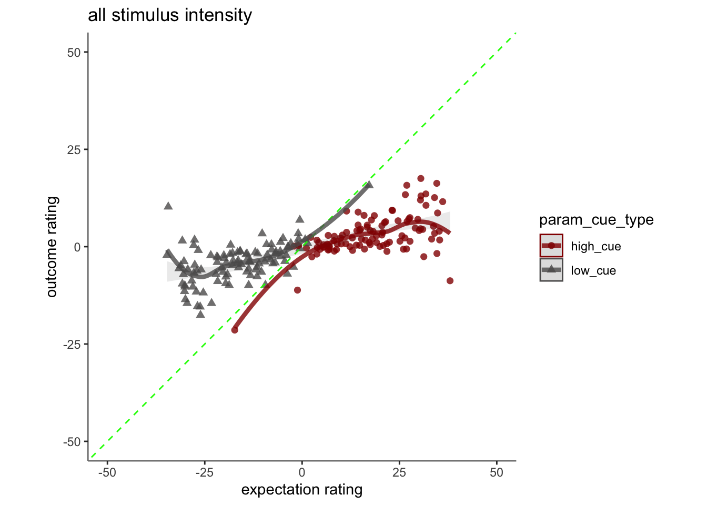
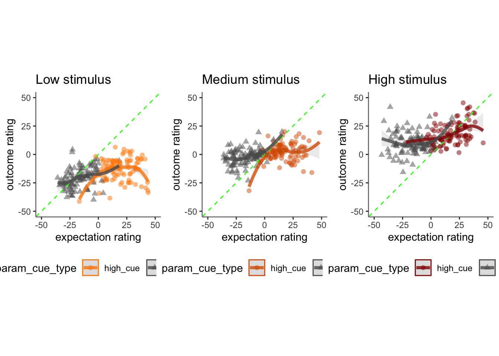
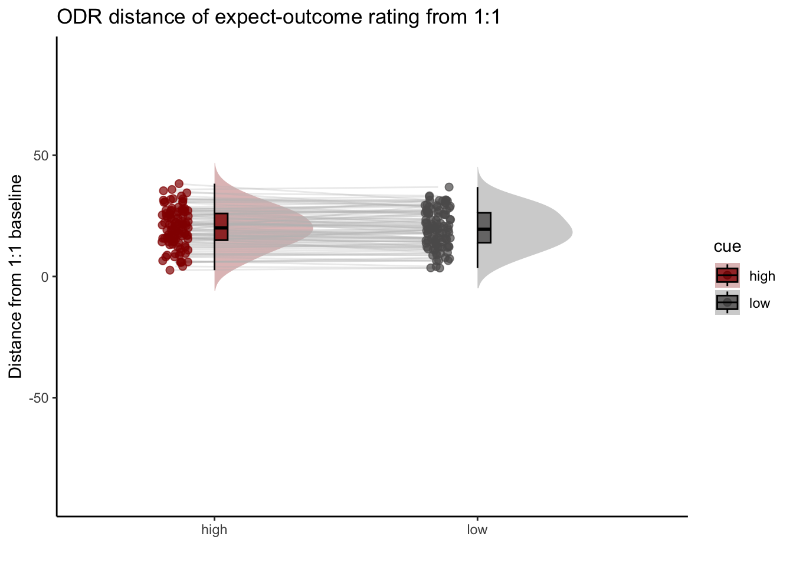
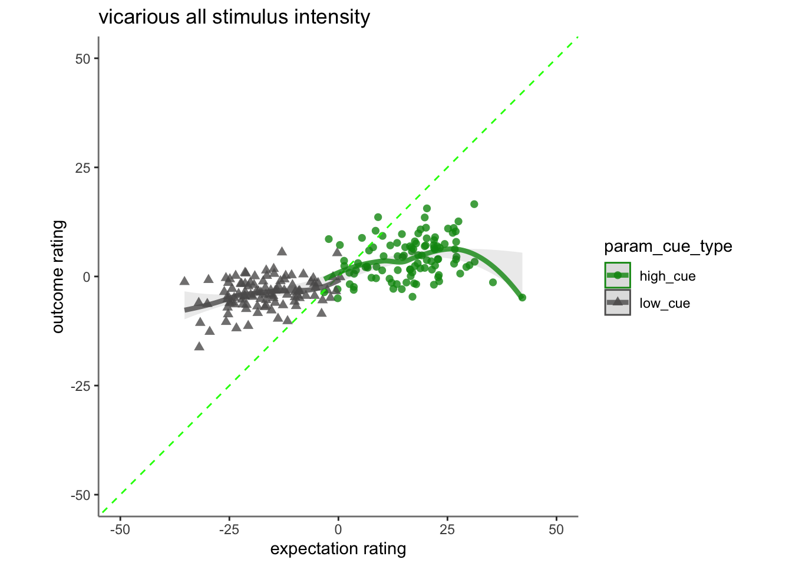
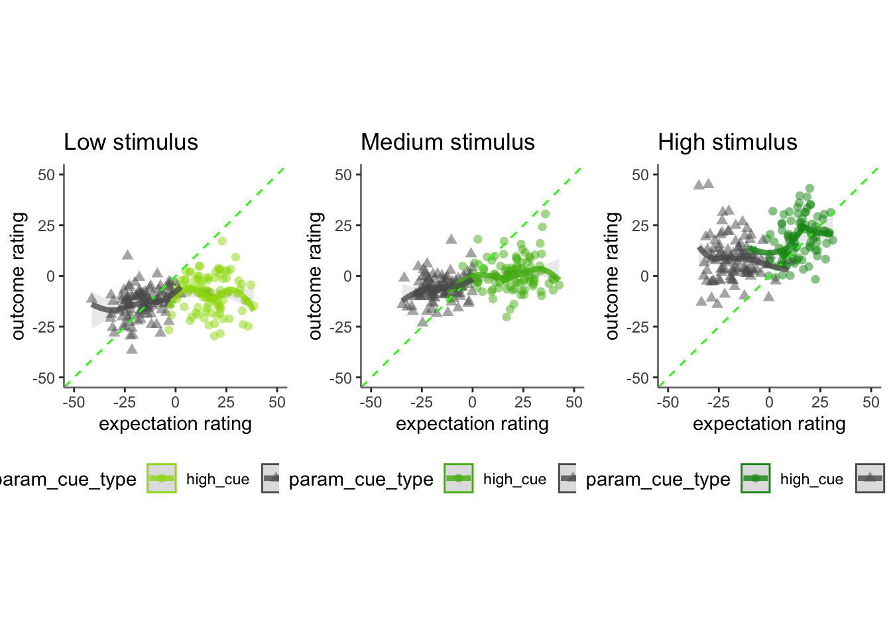
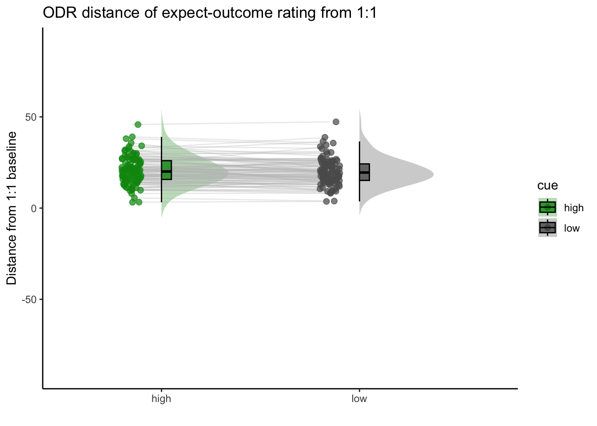
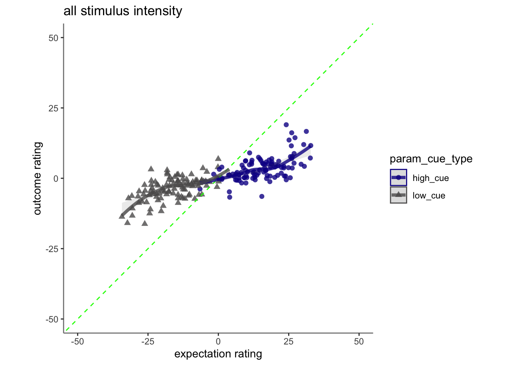
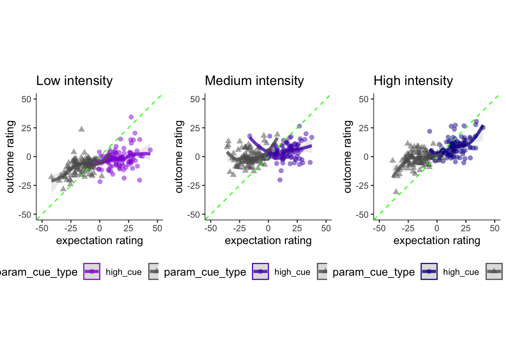
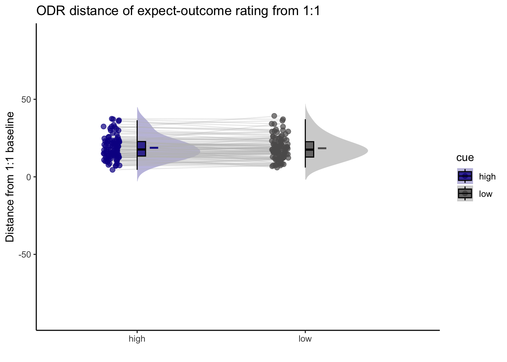

# [ beh ] outcome_demean_per_run ~ cue * stim * expectrating * n-1outcomerating  {#ch16_demean_per_run}


## What is the purpose of this notebook? {.unlisted .unnumbered}
Here, I model the outcome ratings as a function of cue, stimulus intensity, expectation ratings, N-1 outcome rating. 
* As opposed to notebook 15, I want to check if the demeaning process should be for runs as opposed to subjects. 
* In other words, calculate the average within run and subtract ratings 
* Main model: `lmer(outcome_rating ~ cue * stim * expectation rating + N-1 outcomerating)` 
* Main question: What constitutes a reported outcome rating? 
* Sub questions:
  - If there is a linear relationship between expectation rating and outcome rating, does this differ as a function of cue?
  - How does a N-1 outcome rating affect current expectation ratings? 
  - Later, is this effect different across tasks or are they similar?

* IV: 
  stim (high / med / low)
  cue (high / low)
  expectation rating (continuous)
  N-1 outcome rating (continuous)
* DV: outcome rating

### Some thoughts, TODOs {.unlisted .unnumbered}

* Standardized coefficients
* Slope difference? Intercept difference? ( cue and expectantion rating)
* Correct for the range (within participant)
hypothesis:
1. Larger expectation leads to prediction error
2. Individual differences in ratings
3. Outcome experience, based on behavioral experience
What are the brain maps associated with each component.  


load data and combine participant data


```
##  event02_expect_RT event04_actual_RT event02_expect_angle event04_actual_angle
##  Min.   :0.6504    Min.   :0.0171    Min.   :  0.00       Min.   :  0.00      
##  1st Qu.:1.6200    1st Qu.:1.9188    1st Qu.: 29.55       1st Qu.: 37.83      
##  Median :2.0511    Median :2.3511    Median : 57.58       Median : 60.49      
##  Mean   :2.1337    Mean   :2.4011    Mean   : 61.88       Mean   : 65.47      
##  3rd Qu.:2.5589    3rd Qu.:2.8514    3rd Qu.: 88.61       3rd Qu.: 87.70      
##  Max.   :3.9912    Max.   :3.9930    Max.   :180.00       Max.   :180.00      
##  NA's   :651       NA's   :638       NA's   :651          NA's   :641
```

### Covariance matrix: ratings and RT {.unlisted .unnumbered}

```{=html}
<div class="plotly html-widget html-fill-item-overflow-hidden html-fill-item" id="htmlwidget-0c07017a0556109fcdc6" style="width:672px;height:480px;"></div>
<script type="application/json" data-for="htmlwidget-0c07017a0556109fcdc6">{"x":{"visdat":{"178b195b349d":["function () ","plotlyVisDat"]},"cur_data":"178b195b349d","attrs":{"178b195b349d":{"z":{},"alpha_stroke":1,"sizes":[10,100],"spans":[1,20],"type":"heatmap","colors":["#601200","#611300","#621401","#621501","#631600","#631700","#641801","#641901","#651A00","#661B00","#671C00","#671D00","#681E00","#681F00","#692000","#692100","#6A2200","#6A2200","#6B2300","#6B2400","#6C2500","#6D2600","#6E2700","#6E2800","#6F2900","#6F2900","#702A01","#702B00","#712C00","#712D00","#722E01","#722F00","#733000","#743000","#753101","#753200","#763300","#763400","#773501","#773600","#783700","#783700","#793801","#793900","#7A3A00","#7A3B00","#7C3D00","#7D3E00","#7D3E00","#7E3F00","#7E4000","#7F4100","#7F4200","#804300","#804400","#814500","#814600","#824700","#834701","#844800","#844900","#854A01","#854B01","#864C00","#864D00","#874E01","#874F01","#885002","#895002","#8A5101","#8A5201","#8B5302","#8B5402","#8C5503","#8C5603","#8D5704","#8D5804","#8E5905","#8F5A05","#905B06","#905C06","#915D07","#915E07","#925F08","#936009","#94610A","#94620B","#95630C","#95640D","#96650E","#97660F","#986810","#996912","#996A13","#9A6B15","#9B6C16","#9C6D17","#9C6E17","#9D6F19","#9E701A","#9F711C","#9F721D","#A0731E","#A0741F","#A17521","#A27622","#A37723","#A37824","#A47926","#A47A28","#A57B29","#A67C2A","#A77D2B","#A77E2D","#A87F2E","#A88030","#A98131","#AA8232","#AB8333","#AB8435","#AC8536","#AC8638","#AD873A","#AD873B","#AE883C","#AF893D","#B08A3F","#B08B40","#B18C42","#B18D43","#B28E44","#B28E45","#B38F47","#B39048","#B4914A","#B5924B","#B6944D","#B7954F","#B79550","#B89651","#B89652","#B99854","#B99955","#BA9A57","#BA9A58","#BB9B5A","#BC9C5B","#BD9D5C","#BD9E5D","#BE9F5F","#BE9F60","#BFA062","#BFA164","#C0A265","#C0A366","#C1A467","#C1A469","#C2A56A","#C2A66C","#C3A76D","#C4A86F","#C5A970","#C5AA71","#C6AB72","#C6AB74","#C7AC75","#C7AD77","#C8AE78","#C8AF7A","#C9B07C","#C9B07D","#CAB17E","#CBB27F","#CCB381","#CCB482","#CDB584","#CDB585","#CEB687","#CEB788","#CFB98A","#CFB98B","#D0BA8C","#D1BB8E","#D1BB8F","#D2BD91","#D3BE92","#D4BF94","#D4C095","#D5C197","#D5C198","#D6C29A","#D6C39B","#D7C49D","#D7C59E","#D8C6A0","#D8C6A1","#D9C7A2","#DAC8A3","#DBC9A5","#DBCAA7","#DCCBA8","#DCCCAA","#DDCDAB","#DDCDAD","#DECEAE","#DECFB0","#DFD0B1","#E0D1B3","#E1D2B4","#E1D3B6","#E2D4B7","#E2D4B9","#E3D5BB","#E3D6BC","#E4D7BD","#E4D8BE","#E5D9C0","#E5D9C1","#E6DAC3","#E6DBC4","#E7DCC6","#E7DDC7","#E8DEC9","#E8DECA","#E9DFCC","#E9E0CD","#EAE2CF","#EBE3D1","#EBE3D2","#ECE4D3","#ECE5D4","#EDE6D6","#ECE6D7","#EDE7D9","#EDE7DA","#EEE8DB","#EEE8DC","#EDE9DE","#EDE9DF","#EDEAE0","#EDEAE1","#EEEBE2","#EEEBE3","#EDECE4","#EDECE5","#ECEDE6","#ECEDE7","#EBECE8","#EBECE8","#EAEDE9","#EAEDE9","#E9ECEA","#E9ECEA","#E8EDEB","#E7EDEB","#E6ECEC","#E6ECEC","#E5EBED","#E4EBED","#E2EAEC","#E1EBEC","#E0EAED","#DFEAED","#DEE9EC","#DDE9EC","#DBE8ED","#DAE7ED","#D8E6EC","#D7E6EC","#D6E5EB","#D5E4EB","#D3E3EB","#D2E3EB","#D0E1EA","#CEE0E9","#CDE0E9","#CBDFE8","#CADEE8","#C8DDE7","#C7DCE7","#C5DBE6","#C3DAE6","#C1D9E5","#C0D8E4","#BED7E3","#BDD6E3","#BBD5E2","#BAD5E2","#B8D4E1","#B6D3E1","#B5D2E0","#B3D1DF","#B2D0DE","#B0CFDE","#AFCEDD","#ACCDDD","#ABCCDC","#A9CBDC","#A8CADB","#A6C9DA","#A5C8D9","#A3C7D9","#A1C6D8","#A0C5D8","#9FC4D7","#9DC3D6","#9BC2D5","#99C1D5","#97C0D4","#96BFD4","#94BED3","#93BED2","#91BDD1","#90BCD1","#8EBBD0","#8DBAD0","#8BB9CF","#89B8CE","#87B6CD","#85B5CC","#84B4CC","#82B3CB","#81B2CA","#7FB1C9","#7EB0C9","#7CAFC8","#7AAEC8","#78ADC7","#77ACC6","#75ABC5","#74AAC5","#72A9C4","#70A8C3","#6FA7C2","#6EA6C2","#6CA5C1","#6AA4C1","#68A3C0","#66A2BF","#65A1BE","#63A0BE","#629FBD","#609EBD","#5F9DBC","#5D9CBB","#5B9BBA","#599ABA","#5799B9","#5698B8","#5496B7","#5395B7","#5194B6","#5093B6","#4E92B5","#4D91B4","#4B90B3","#4A8FB3","#488EB2","#478DB1","#458CB0","#448BB0","#428AAF","#4089AF","#3E87AD","#3C86AC","#3B85AC","#3984AB","#3883AA","#3782A9","#3681A9","#3480A8","#337FA8","#317EA7","#307DA6","#2E7CA5","#2D7BA5","#2B7AA4","#2979A4","#2878A3","#2777A2","#2676A1","#2475A1","#2374A0","#2273A0","#21729F","#1F719E","#1E709D","#1D6F9D","#1C6E9C","#1A6D9C","#196C9B","#186B9A","#176A99","#166999","#156898","#146898","#136797","#126697","#116596","#106496","#0F6395","#0E6294","#0D6193","#0C6093","#0B5F92","#0B5F92","#0A5E91","#095D91","#085C90","#075A8F","#07598F","#06588E","#06588D","#05578C","#05568C","#04558B","#05548B","#04538A","#04538A","#035289","#045189","#035088","#034F88","#024E87","#024E87","#034D86","#034C86","#024B85","#024A85","#034984","#034984","#024883","#024783","#014682","#014682","#024581","#024481","#014380","#014280","#01417F","#01417F","#02407E","#023F7E","#013E7D","#013E7D","#023D7C","#023C7C","#013B7B","#013B7B","#023A7A","#01397A","#023779","#013779","#013678","#013577","#023477","#013376","#013376","#023275","#023175","#013074","#013074","#022F73","#022E73","#012D72","#012D72","#022C71","#022B71","#012A70","#012A70","#02296F","#02286F","#01276E","#01276E","#02266D","#02256D","#01246C","#01246C","#02236B","#02226B","#01216A","#01206A","#021F69","#021F69","#011E68","#011D68","#021C67","#021C67","#011B66","#011A66","#001965","#001865","#011764","#011764","#001663","#001563","#011362","#001362","#001261","#001260"],"inherit":true}},"layout":{"margin":{"b":40,"l":60,"t":25,"r":10},"scene":{"zaxis":{"title":"cormat"}},"xaxis":{"domain":[0,1],"automargin":true,"tickmode":"array","tickvals":[0,1,2,3,4],"ticktext":["event04_actual_angle","event02_expect_angle","event01_cue_onset","event02_expect_RT","event04_actual_RT"],"gridcolor":"transparent","zerolinecolor":"transparent","title":"","zeroline":false,"showgrid":false},"yaxis":{"domain":[0,1],"automargin":true,"tickmode":"array","tickvals":[0,1,2,3,4],"ticktext":["event04_actual_angle","event02_expect_angle","event01_cue_onset","event02_expect_RT","event04_actual_RT"],"gridcolor":"transparent","zerolinecolor":"transparent","title":"","autorange":"reversed","zeroline":false,"showgrid":false},"hovermode":"closest","showlegend":false,"legend":{"yanchor":"top","y":0.5},"plot_bgcolor":"transparent","paper_bgcolor":"transparent"},"source":"A","config":{"modeBarButtonsToAdd":["hoverclosest","hovercompare"],"showSendToCloud":false,"displayModeBar":false},"data":[{"colorbar":{"title":"cormat","ticklen":2,"len":0.5,"lenmode":"fraction","y":1,"yanchor":"top"},"colorscale":[["0","rgba(96,18,0,1)"],["0.0416666666666667","rgba(109,38,0,1)"],["0.0833333333333333","rgba(121,56,1,1)"],["0.125","rgba(133,75,1,1)"],["0.166666666666667","rgba(146,95,8,1)"],["0.208333333333333","rgba(161,117,33,1)"],["0.25","rgba(175,137,61,1)"],["0.291666666666667","rgba(188,156,91,1)"],["0.333333333333333","rgba(199,173,119,1)"],["0.375","rgba(212,192,149,1)"],["0.416666666666667","rgba(225,210,180,1)"],["0.458333333333333","rgba(236,228,211,1)"],["0.5","rgba(234,237,233,1)"],["0.541666666666667","rgba(212,228,235,1)"],["0.583333333333333","rgba(179,209,223,1)"],["0.625","rgba(145,189,209,1)"],["0.666666666666667","rgba(111,167,194,1)"],["0.708333333333333","rgba(78,146,181,1)"],["0.75","rgba(46,124,165,1)"],["0.791666666666667","rgba(20,104,152,1)"],["0.833333333333333","rgba(5,84,139,1)"],["0.875","rgba(1,67,128,1)"],["0.916666666666667","rgba(1,51,118,1)"],["0.958333333333333","rgba(2,35,107,1)"],["1","rgba(0,18,96,1)"]],"showscale":true,"z":[[1,0.627349219607622,-0.127331265407638,-0.0387158167304906,-0.155976302911586],[0.627349219607622,1,-0.0947326397969614,-0.0531943958485549,-0.127353687071136],[-0.127331265407638,-0.0947326397969614,1,0.0878587341493915,0.0947733899201344],[-0.0387158167304906,-0.0531943958485549,0.0878587341493915,1,0.279089611790198],[-0.155976302911586,-0.127353687071136,0.0947733899201344,0.279089611790198,1]],"type":"heatmap","xaxis":"x","yaxis":"y","frame":null,"zmin":-1,"zmax":1}],"highlight":{"on":"plotly_click","persistent":false,"dynamic":false,"selectize":false,"opacityDim":0.2,"selected":{"opacity":1},"debounce":0},"shinyEvents":["plotly_hover","plotly_click","plotly_selected","plotly_relayout","plotly_brushed","plotly_brushing","plotly_clickannotation","plotly_doubleclick","plotly_deselect","plotly_afterplot","plotly_sunburstclick"],"base_url":"https://plot.ly"},"evals":[],"jsHooks":[]}</script>
```

### Covariance matrix: fixation durations (e.g. ISIs) {.unlisted .unnumbered}

```{=html}
<div class="plotly html-widget html-fill-item-overflow-hidden html-fill-item" id="htmlwidget-4c4765cae9104636eb7b" style="width:672px;height:480px;"></div>
<script type="application/json" data-for="htmlwidget-4c4765cae9104636eb7b">{"x":{"visdat":{"178b575bf089":["function () ","plotlyVisDat"]},"cur_data":"178b575bf089","attrs":{"178b575bf089":{"z":{},"alpha_stroke":1,"sizes":[10,100],"spans":[1,20],"type":"heatmap","colors":["#601200","#611300","#621401","#621501","#631600","#631700","#641801","#641901","#651A00","#661B00","#671C00","#671D00","#681E00","#681F00","#692000","#692100","#6A2200","#6A2200","#6B2300","#6B2400","#6C2500","#6D2600","#6E2700","#6E2800","#6F2900","#6F2900","#702A01","#702B00","#712C00","#712D00","#722E01","#722F00","#733000","#743000","#753101","#753200","#763300","#763400","#773501","#773600","#783700","#783700","#793801","#793900","#7A3A00","#7A3B00","#7C3D00","#7D3E00","#7D3E00","#7E3F00","#7E4000","#7F4100","#7F4200","#804300","#804400","#814500","#814600","#824700","#834701","#844800","#844900","#854A01","#854B01","#864C00","#864D00","#874E01","#874F01","#885002","#895002","#8A5101","#8A5201","#8B5302","#8B5402","#8C5503","#8C5603","#8D5704","#8D5804","#8E5905","#8F5A05","#905B06","#905C06","#915D07","#915E07","#925F08","#936009","#94610A","#94620B","#95630C","#95640D","#96650E","#97660F","#986810","#996912","#996A13","#9A6B15","#9B6C16","#9C6D17","#9C6E17","#9D6F19","#9E701A","#9F711C","#9F721D","#A0731E","#A0741F","#A17521","#A27622","#A37723","#A37824","#A47926","#A47A28","#A57B29","#A67C2A","#A77D2B","#A77E2D","#A87F2E","#A88030","#A98131","#AA8232","#AB8333","#AB8435","#AC8536","#AC8638","#AD873A","#AD873B","#AE883C","#AF893D","#B08A3F","#B08B40","#B18C42","#B18D43","#B28E44","#B28E45","#B38F47","#B39048","#B4914A","#B5924B","#B6944D","#B7954F","#B79550","#B89651","#B89652","#B99854","#B99955","#BA9A57","#BA9A58","#BB9B5A","#BC9C5B","#BD9D5C","#BD9E5D","#BE9F5F","#BE9F60","#BFA062","#BFA164","#C0A265","#C0A366","#C1A467","#C1A469","#C2A56A","#C2A66C","#C3A76D","#C4A86F","#C5A970","#C5AA71","#C6AB72","#C6AB74","#C7AC75","#C7AD77","#C8AE78","#C8AF7A","#C9B07C","#C9B07D","#CAB17E","#CBB27F","#CCB381","#CCB482","#CDB584","#CDB585","#CEB687","#CEB788","#CFB98A","#CFB98B","#D0BA8C","#D1BB8E","#D1BB8F","#D2BD91","#D3BE92","#D4BF94","#D4C095","#D5C197","#D5C198","#D6C29A","#D6C39B","#D7C49D","#D7C59E","#D8C6A0","#D8C6A1","#D9C7A2","#DAC8A3","#DBC9A5","#DBCAA7","#DCCBA8","#DCCCAA","#DDCDAB","#DDCDAD","#DECEAE","#DECFB0","#DFD0B1","#E0D1B3","#E1D2B4","#E1D3B6","#E2D4B7","#E2D4B9","#E3D5BB","#E3D6BC","#E4D7BD","#E4D8BE","#E5D9C0","#E5D9C1","#E6DAC3","#E6DBC4","#E7DCC6","#E7DDC7","#E8DEC9","#E8DECA","#E9DFCC","#E9E0CD","#EAE2CF","#EBE3D1","#EBE3D2","#ECE4D3","#ECE5D4","#EDE6D6","#ECE6D7","#EDE7D9","#EDE7DA","#EEE8DB","#EEE8DC","#EDE9DE","#EDE9DF","#EDEAE0","#EDEAE1","#EEEBE2","#EEEBE3","#EDECE4","#EDECE5","#ECEDE6","#ECEDE7","#EBECE8","#EBECE8","#EAEDE9","#EAEDE9","#E9ECEA","#E9ECEA","#E8EDEB","#E7EDEB","#E6ECEC","#E6ECEC","#E5EBED","#E4EBED","#E2EAEC","#E1EBEC","#E0EAED","#DFEAED","#DEE9EC","#DDE9EC","#DBE8ED","#DAE7ED","#D8E6EC","#D7E6EC","#D6E5EB","#D5E4EB","#D3E3EB","#D2E3EB","#D0E1EA","#CEE0E9","#CDE0E9","#CBDFE8","#CADEE8","#C8DDE7","#C7DCE7","#C5DBE6","#C3DAE6","#C1D9E5","#C0D8E4","#BED7E3","#BDD6E3","#BBD5E2","#BAD5E2","#B8D4E1","#B6D3E1","#B5D2E0","#B3D1DF","#B2D0DE","#B0CFDE","#AFCEDD","#ACCDDD","#ABCCDC","#A9CBDC","#A8CADB","#A6C9DA","#A5C8D9","#A3C7D9","#A1C6D8","#A0C5D8","#9FC4D7","#9DC3D6","#9BC2D5","#99C1D5","#97C0D4","#96BFD4","#94BED3","#93BED2","#91BDD1","#90BCD1","#8EBBD0","#8DBAD0","#8BB9CF","#89B8CE","#87B6CD","#85B5CC","#84B4CC","#82B3CB","#81B2CA","#7FB1C9","#7EB0C9","#7CAFC8","#7AAEC8","#78ADC7","#77ACC6","#75ABC5","#74AAC5","#72A9C4","#70A8C3","#6FA7C2","#6EA6C2","#6CA5C1","#6AA4C1","#68A3C0","#66A2BF","#65A1BE","#63A0BE","#629FBD","#609EBD","#5F9DBC","#5D9CBB","#5B9BBA","#599ABA","#5799B9","#5698B8","#5496B7","#5395B7","#5194B6","#5093B6","#4E92B5","#4D91B4","#4B90B3","#4A8FB3","#488EB2","#478DB1","#458CB0","#448BB0","#428AAF","#4089AF","#3E87AD","#3C86AC","#3B85AC","#3984AB","#3883AA","#3782A9","#3681A9","#3480A8","#337FA8","#317EA7","#307DA6","#2E7CA5","#2D7BA5","#2B7AA4","#2979A4","#2878A3","#2777A2","#2676A1","#2475A1","#2374A0","#2273A0","#21729F","#1F719E","#1E709D","#1D6F9D","#1C6E9C","#1A6D9C","#196C9B","#186B9A","#176A99","#166999","#156898","#146898","#136797","#126697","#116596","#106496","#0F6395","#0E6294","#0D6193","#0C6093","#0B5F92","#0B5F92","#0A5E91","#095D91","#085C90","#075A8F","#07598F","#06588E","#06588D","#05578C","#05568C","#04558B","#05548B","#04538A","#04538A","#035289","#045189","#035088","#034F88","#024E87","#024E87","#034D86","#034C86","#024B85","#024A85","#034984","#034984","#024883","#024783","#014682","#014682","#024581","#024481","#014380","#014280","#01417F","#01417F","#02407E","#023F7E","#013E7D","#013E7D","#023D7C","#023C7C","#013B7B","#013B7B","#023A7A","#01397A","#023779","#013779","#013678","#013577","#023477","#013376","#013376","#023275","#023175","#013074","#013074","#022F73","#022E73","#012D72","#012D72","#022C71","#022B71","#012A70","#012A70","#02296F","#02286F","#01276E","#01276E","#02266D","#02256D","#01246C","#01246C","#02236B","#02226B","#01216A","#01206A","#021F69","#021F69","#011E68","#011D68","#021C67","#021C67","#011B66","#011A66","#001965","#001865","#011764","#011764","#001663","#001563","#011362","#001362","#001261","#001260"],"inherit":true}},"layout":{"margin":{"b":40,"l":60,"t":25,"r":10},"scene":{"zaxis":{"title":"cormat"}},"xaxis":{"domain":[0,1],"automargin":true,"tickmode":"array","tickvals":[0,1,2],"ticktext":["ISI02_duration","ISI01_duration","ISI03_duration"],"gridcolor":"transparent","zerolinecolor":"transparent","title":"","zeroline":false,"showgrid":false},"yaxis":{"domain":[0,1],"automargin":true,"tickmode":"array","tickvals":[0,1,2],"ticktext":["ISI02_duration","ISI01_duration","ISI03_duration"],"gridcolor":"transparent","zerolinecolor":"transparent","title":"","autorange":"reversed","zeroline":false,"showgrid":false},"hovermode":"closest","showlegend":false,"legend":{"yanchor":"top","y":0.5},"plot_bgcolor":"transparent","paper_bgcolor":"transparent"},"source":"A","config":{"modeBarButtonsToAdd":["hoverclosest","hovercompare"],"showSendToCloud":false,"displayModeBar":false},"data":[{"colorbar":{"title":"cormat","ticklen":2,"len":0.5,"lenmode":"fraction","y":1,"yanchor":"top"},"colorscale":[["0","rgba(96,18,0,1)"],["0.0416666666666667","rgba(109,38,0,1)"],["0.0833333333333333","rgba(121,56,1,1)"],["0.125","rgba(133,75,1,1)"],["0.166666666666667","rgba(146,95,8,1)"],["0.208333333333333","rgba(161,117,33,1)"],["0.25","rgba(175,137,61,1)"],["0.291666666666667","rgba(188,156,91,1)"],["0.333333333333333","rgba(199,173,119,1)"],["0.375","rgba(212,192,149,1)"],["0.416666666666667","rgba(225,210,180,1)"],["0.458333333333333","rgba(236,228,211,1)"],["0.5","rgba(234,237,233,1)"],["0.541666666666667","rgba(212,228,235,1)"],["0.583333333333333","rgba(179,209,223,1)"],["0.625","rgba(145,189,209,1)"],["0.666666666666667","rgba(111,167,194,1)"],["0.708333333333333","rgba(78,146,181,1)"],["0.75","rgba(46,124,165,1)"],["0.791666666666667","rgba(20,104,152,1)"],["0.833333333333333","rgba(5,84,139,1)"],["0.875","rgba(1,67,128,1)"],["0.916666666666667","rgba(1,51,118,1)"],["0.958333333333333","rgba(2,35,107,1)"],["1","rgba(0,18,96,1)"]],"showscale":true,"z":[[1,0.104227599726807,0.0712121554449984],[0.104227599726807,1,-0.0576788170165326],[0.0712121554449984,-0.0576788170165326,1]],"type":"heatmap","xaxis":"x","yaxis":"y","frame":null,"zmin":-1,"zmax":1}],"highlight":{"on":"plotly_click","persistent":false,"dynamic":false,"selectize":false,"opacityDim":0.2,"selected":{"opacity":1},"debounce":0},"shinyEvents":["plotly_hover","plotly_click","plotly_selected","plotly_relayout","plotly_brushed","plotly_brushing","plotly_clickannotation","plotly_doubleclick","plotly_deselect","plotly_afterplot","plotly_sunburstclick"],"base_url":"https://plot.ly"},"evals":[],"jsHooks":[]}</script>
```


## Linear model with three factors: cue X stim X expectation rating

```
## boundary (singular) fit: see help('isSingular')
```

```
## Linear mixed model fit by REML. t-tests use Satterthwaite's method [
## lmerModLmerTest]
## Formula: demean_outcome ~ cue_con * stim_con_linear * demean_expect +  
##     cue_con * stim_con_quad * demean_expect + lag.demean_outcome +  
##     (cue_con * demean_expect | src_subject_id)
##    Data: pvc
## 
## REML criterion at convergence: 38841.2
## 
## Scaled residuals: 
##     Min      1Q  Median      3Q     Max 
## -6.5283 -0.6045  0.0387  0.5782  4.6628 
## 
## Random effects:
##  Groups         Name                  Variance  Std.Dev. Corr             
##  src_subject_id (Intercept)           3.373e-01  0.58079                  
##                 cue_con               2.199e+01  4.68893  0.32            
##                 demean_expect         2.179e-02  0.14763  0.01 -0.59      
##                 cue_con:demean_expect 4.177e-03  0.06463 -0.93 -0.53  0.36
##  Residual                             2.533e+02 15.91427                  
## Number of obs: 4621, groups:  src_subject_id, 104
## 
## Fixed effects:
##                                         Estimate Std. Error         df t value
## (Intercept)                           -6.822e-01  3.293e-01  2.484e+02  -2.072
## cue_con                                2.725e+00  8.407e-01  8.540e+01   3.241
## stim_con_linear                        2.954e+01  7.909e-01  4.534e+03  37.350
## demean_expect                          1.366e-01  2.110e-02  1.020e+02   6.477
## stim_con_quad                          2.391e+00  6.794e-01  4.469e+03   3.519
## lag.demean_outcome                     2.758e-02  1.117e-02  4.578e+03   2.469
## cue_con:stim_con_linear                6.842e-01  1.580e+00  4.534e+03   0.433
## cue_con:demean_expect                 -2.639e-02  2.678e-02  1.246e+02  -0.986
## stim_con_linear:demean_expect          1.358e-03  3.123e-02  4.521e+03   0.043
## cue_con:stim_con_quad                 -4.888e+00  1.362e+00  4.525e+03  -3.588
## demean_expect:stim_con_quad            2.769e-02  2.734e-02  4.526e+03   1.013
## cue_con:stim_con_linear:demean_expect  2.898e-01  6.264e-02  4.543e+03   4.626
## cue_con:demean_expect:stim_con_quad   -7.118e-02  5.460e-02  4.464e+03  -1.304
##                                       Pr(>|t|)    
## (Intercept)                           0.039318 *  
## cue_con                               0.001698 ** 
## stim_con_linear                        < 2e-16 ***
## demean_expect                         3.34e-09 ***
## stim_con_quad                         0.000437 ***
## lag.demean_outcome                    0.013594 *  
## cue_con:stim_con_linear               0.665094    
## cue_con:demean_expect                 0.326232    
## stim_con_linear:demean_expect         0.965324    
## cue_con:stim_con_quad                 0.000337 ***
## demean_expect:stim_con_quad           0.311173    
## cue_con:stim_con_linear:demean_expect 3.82e-06 ***
## cue_con:demean_expect:stim_con_quad   0.192365    
## ---
## Signif. codes:  0 '***' 0.001 '**' 0.01 '*' 0.05 '.' 0.1 ' ' 1
```

```
## 
## Correlation matrix not shown by default, as p = 13 > 12.
## Use print(x, correlation=TRUE)  or
##     vcov(x)        if you need it
```

```
## optimizer (nloptwrap) convergence code: 0 (OK)
## boundary (singular) fit: see help('isSingular')
```


## Pain run, collapsed across stimulus intensity



### Q. Are those overestimating for high cues also underestimators for low cues? {.unlisted .unnumbered}
Here, I calculate Orthogonal distance from the 1:1 slope. Based on that, we test whether the absolute ODR distance is equivalent across cues. If a participant equally overestimates for a high cue and underestimates a stimuli for a low cue, their ODR distance should be the same. This is reflected in the subject-level slopes, which are parallel


Can you test if the slopes are the same? That might tell us something about whether, expectancies translate into outcomes with the same efficacy across all three tasks. 


```
## Linear mixed model fit by REML. t-tests use Satterthwaite's method [
## lmerModLmerTest]
## Formula: 
## as.formula(reformulate(c(iv, sprintf("(%s|%s)", iv, subject_keyword)),  
##     response = dv))
##    Data: df
## 
## REML criterion at convergence: 38104.4
## 
## Scaled residuals: 
##     Min      1Q  Median      3Q     Max 
## -2.2867 -0.6574 -0.1582  0.5504  5.5552 
## 
## Random effects:
##  Groups         Name        Variance  Std.Dev. Corr 
##  src_subject_id (Intercept)  53.83321  7.3371       
##                 cue_namelow   0.03013  0.1736  -1.00
##  Residual                   211.69016 14.5496       
## Number of obs: 4621, groups:  src_subject_id, 104
## 
## Fixed effects:
##              Estimate Std. Error        df t value Pr(>|t|)    
## (Intercept)   20.1918     0.7924  103.2043  25.482   <2e-16 ***
## cue_namelow   -0.4341     0.4291 3901.7962  -1.012    0.312    
## ---
## Signif. codes:  0 '***' 0.001 '**' 0.01 '*' 0.05 '.' 0.1 ' ' 1
## 
## Correlation of Fixed Effects:
##             (Intr)
## cue_namelow -0.313
## optimizer (nloptwrap) convergence code: 0 (OK)
## boundary (singular) fit: see help('isSingular')
```




## vicarious






```
## Linear mixed model fit by REML. t-tests use Satterthwaite's method [
## lmerModLmerTest]
## Formula: 
## as.formula(reformulate(c(iv, sprintf("(%s|%s)", iv, subject_keyword)),  
##     response = dv))
##    Data: df
## 
## REML criterion at convergence: 40110.9
## 
## Scaled residuals: 
##     Min      1Q  Median      3Q     Max 
## -2.8841 -0.6851 -0.1162  0.5364  5.2303 
## 
## Random effects:
##  Groups         Name        Variance Std.Dev. Corr 
##  src_subject_id (Intercept)  47.4951  6.892        
##                 cue_namelow   0.0228  0.151   -1.00
##  Residual                   236.8877 15.391        
## Number of obs: 4802, groups:  src_subject_id, 104
## 
## Fixed effects:
##              Estimate Std. Error        df t value Pr(>|t|)    
## (Intercept)   20.5550     0.7549  105.0633  27.229   <2e-16 ***
## cue_namelow   -0.5205     0.4455 4234.0518  -1.168    0.243    
## ---
## Signif. codes:  0 '***' 0.001 '**' 0.01 '*' 0.05 '.' 0.1 ' ' 1
## 
## Correlation of Fixed Effects:
##             (Intr)
## cue_namelow -0.328
## optimizer (nloptwrap) convergence code: 0 (OK)
## boundary (singular) fit: see help('isSingular')
```

```
## Warning in geom_line(data = subjectwise, aes(group = .data[[subject]], x =
## as.numeric(as.factor(.data[[iv]])) - : Ignoring unknown aesthetics: fill
```

```
## Warning: Removed 1 rows containing non-finite values (`stat_half_ydensity()`).
```

```
## Warning: Removed 1 rows containing non-finite values (`stat_boxplot()`).
```

```
## Warning: Removed 1 row containing missing values (`geom_line()`).
```

```
## Warning: Removed 1 rows containing missing values (`geom_point()`).
```

```
## Warning: Removed 1 rows containing non-finite values (`stat_half_ydensity()`).
```

```
## Warning: Removed 1 rows containing non-finite values (`stat_boxplot()`).
```

```
## Warning: Removed 1 row containing missing values (`geom_line()`).
```

```
## Warning: Removed 1 rows containing missing values (`geom_point()`).
```



## cognitive





```
## Linear mixed model fit by REML. t-tests use Satterthwaite's method [
## lmerModLmerTest]
## Formula: 
## as.formula(reformulate(c(iv, sprintf("(%s|%s)", iv, subject_keyword)),  
##     response = dv))
##    Data: df
## 
## REML criterion at convergence: 38340.3
## 
## Scaled residuals: 
##     Min      1Q  Median      3Q     Max 
## -2.4766 -0.6631 -0.1333  0.5071  6.6831 
## 
## Random effects:
##  Groups         Name        Variance  Std.Dev. Corr 
##  src_subject_id (Intercept)  44.45232  6.6673       
##                 cue_namelow   0.02064  0.1437  -1.00
##  Residual                   187.79614 13.7039       
## Number of obs: 4719, groups:  src_subject_id, 104
## 
## Fixed effects:
##              Estimate Std. Error        df t value Pr(>|t|)    
## (Intercept)   18.9099     0.7192  101.7148  26.293   <2e-16 ***
## cue_namelow   -0.5223     0.4003 4083.1539  -1.305    0.192    
## ---
## Signif. codes:  0 '***' 0.001 '**' 0.01 '*' 0.05 '.' 0.1 ' ' 1
## 
## Correlation of Fixed Effects:
##             (Intr)
## cue_namelow -0.311
## optimizer (nloptwrap) convergence code: 0 (OK)
## boundary (singular) fit: see help('isSingular')
```

```
## Warning in geom_line(data = subjectwise, aes(group = .data[[subject]], x =
## as.numeric(as.factor(.data[[iv]])) - : Ignoring unknown aesthetics: fill
```



```
# library(plotly)
# plot_ly(x=subjectwise_naomit_2dv$param_cue_type, y=subjectwise_naomit_2dv$DV1_mean_per_sub, z=subjectwise_naomit_2dv$DV2_mean_per_sub, type="scatter3d", mode="markers", color=subjectwise_naomit_2dv$param_cue_type)
```

## across tasks (PVC), is the  slope for (highvslow cue) the same?Tor question
* Adding "participant" as random effects leads to a singular boundary issue. The reason is because there is no random effects variance across participants. 
1) If I add task as a random effect, in other words, allowing for differences across tasks, I get the following results: 
* expectancy-outcome relationship differs across tasks, taskname_lin:demean_expect, t(14130) = 4.317, p < .001
* expectancy-outcome relationship differs across cue and tasks, "taskname_lin:cue_con:demean_expect", t(14130) = 5.758, p < .001
taskname_lin:cue_con                -3.790e+00  1.448e+00  1.413e+04  -2.618  0.00886 ** 
++ taskname_lin:demean_expect           9.854e-02  2.283e-02  1.413e+04   4.317 1.59e-05 ***
cue_con:demean_expect               -9.077e-02  1.987e-02  1.413e+04  -4.569 4.95e-06 ***
cue_con:taskname_quad                5.352e+00  1.334e+00  1.413e+04   4.012 6.04e-05 ***
demean_expect:taskname_quad         -1.596e-01  2.253e-02  1.413e+04  -7.084 1.47e-12 ***
taskname_lin:cue_con:demean_expect   2.629e-01  4.565e-02  1.413e+04   5.758 8.67e-09 ***
cue_con:demean_expect:taskname_quad -1.021e-01  4.505e-02  1.413e+04  -2.266  0.02348 *  

2) If I add sub as random effect and ignore singular. Plus, if I remove the cue contrast...
* expectancy-outcome relationship differs across tasks, factor(param_task_name):demean_expect, F(2, 14136) = 54.765, p < .001
 

```r
p <- load_task_social_df(datadir, taskname = 'pain', subject_varkey = subject_varkey, iv = iv, exclude = exclude)
v <- load_task_social_df(datadir, taskname = 'vicarious', subject_varkey = subject_varkey, iv = iv, exclude = exclude)
c <- load_task_social_df(datadir, taskname = 'cognitive', subject_varkey = subject_varkey, iv = iv, exclude = exclude)
p_sub <- p[, c("param_task_name", "param_cue_type", "src_subject_id","session_id", "param_run_num", "param_stimulus_type", "event04_actual_angle", "event02_expect_angle")]
v_sub <- v[, c("param_task_name", "param_cue_type", "src_subject_id","session_id", "param_run_num", "param_stimulus_type", "event04_actual_angle", "event02_expect_angle")]
c_sub <- c[, c("param_task_name", "param_cue_type", "src_subject_id", "session_id", "param_run_num","param_stimulus_type", "event04_actual_angle", "event02_expect_angle")]
pvc_sub <- do.call("rbind", list(p_sub, v_sub, c_sub))
```


```r
maindata <- pvc_sub %>%
group_by(src_subject_id) %>%
mutate(event04_actual_angle = as.numeric(event04_actual_angle)) %>%
mutate(event02_expect_angle = as.numeric(event02_expect_angle)) %>%
mutate(avg_outcome = mean(event04_actual_angle, na.rm = TRUE)) %>%
mutate(demean_outcome = event04_actual_angle - avg_outcome) %>%
mutate(avg_expect = mean(event02_expect_angle, na.rm = TRUE)) %>%
mutate(demean_expect = event02_expect_angle - avg_expect)

data_p2= maindata %>%
  arrange(src_subject_id ) %>%
  group_by(src_subject_id) %>%
  mutate(trial_index = row_number())
data_a3 <- data_p2 %>% 
  group_by(src_subject_id, session_id, param_run_num) %>% 
  mutate(trial_index = row_number(param_run_num))

data_a3lag <- 
    data_a3 %>%
    group_by(src_subject_id, session_id, param_run_num) %>%
    mutate(lag.demean_outcome = dplyr::lag(demean_outcome, n = 1, default = NA))
data_a3lag_omit <- data_a3lag[complete.cases(data_a3lag$lag.demean_outcome),]

df <- data_a3lag_omit
pvc_sub <- simple_contrasts_beh(df)
```

```
## Warning: Unknown or uninitialised column: `stim_con_linear`.
```

```
## Warning: Unknown or uninitialised column: `stim_con_quad`.
```

```
## Warning: Unknown or uninitialised column: `cue_con`.
```

```
## Warning: Unknown or uninitialised column: `cue_name`.
```


```r
# contrast code 1 linear
pvc_sub$taskname_lin[pvc_sub$param_task_name == "pain"] <-  0.5
```

```
## Warning: Unknown or uninitialised column: `taskname_lin`.
```

```r
pvc_sub$taskname_lin[pvc_sub$param_task_name == "vicarious"] <-  0
pvc_sub$taskname_lin[pvc_sub$param_task_name == "cognitive"] <-  -0.5

# contrast code 2 quadratic
pvc_sub$taskname_quad[pvc_sub$param_task_name == "pain"] <-  -0.33
```

```
## Warning: Unknown or uninitialised column: `taskname_quad`.
```

```r
pvc_sub$taskname_quad[pvc_sub$param_task_name == "vicarious"] <-  0.66
pvc_sub$taskname_quad[pvc_sub$param_task_name == "cognitive"] <-  -0.33

pvc_sub$sub = factor(pvc_sub$src_subject_id)
# model_test = lm(pvc_sub$demean_outcome~ pvc_sub$demean_expect)
model_task = lmer(demean_outcome~ taskname_lin*cue_con*demean_expect + taskname_quad*cue_con*demean_expect +  (1 | sub), data = pvc_sub)
model_wotask = lmer(demean_outcome~ cue_con*demean_expect +(1 | sub), data = pvc_sub)
```

```
## boundary (singular) fit: see help('isSingular')
```

```r
summary(model_task)
```

```
## Linear mixed model fit by REML. t-tests use Satterthwaite's method [
## lmerModLmerTest]
## Formula: 
## demean_outcome ~ taskname_lin * cue_con * demean_expect + taskname_quad *  
##     cue_con * demean_expect + (1 | sub)
##    Data: pvc_sub
## 
## REML criterion at convergence: 139399.8
## 
## Scaled residuals: 
##     Min      1Q  Median      3Q     Max 
## -4.5727 -0.6342 -0.1226  0.5514  5.3674 
## 
## Random effects:
##  Groups   Name        Variance Std.Dev.
##  sub      (Intercept)   0.1232  0.351  
##  Residual             600.5633 24.506  
## Number of obs: 15091, groups:  sub, 111
## 
## Fixed effects:
##                                       Estimate Std. Error         df t value
## (Intercept)                         -3.019e-01  2.951e-01  2.477e+02  -1.023
## taskname_lin                         1.801e+01  6.935e-01  1.447e+04  25.973
## cue_con                             -9.551e+00  5.853e-01  1.369e+04 -16.319
## demean_expect                        4.696e-01  9.457e-03  1.156e+04  49.657
## taskname_quad                       -1.082e+01  6.465e-01  1.482e+04 -16.741
## taskname_lin:cue_con                -4.377e+00  1.388e+00  7.418e+03  -3.153
## taskname_lin:demean_expect           1.007e-01  2.163e-02  1.758e+03   4.655
## cue_con:demean_expect               -8.861e-02  1.894e-02  4.064e+03  -4.679
## cue_con:taskname_quad                5.276e+00  1.294e+00  1.247e+04   4.078
## demean_expect:taskname_quad         -1.730e-01  2.157e-02  8.290e+03  -8.022
## taskname_lin:cue_con:demean_expect   2.685e-01  4.314e-02  1.405e+04   6.224
## cue_con:demean_expect:taskname_quad -1.063e-01  4.310e-02  1.484e+04  -2.466
##                                     Pr(>|t|)    
## (Intercept)                          0.30723    
## taskname_lin                         < 2e-16 ***
## cue_con                              < 2e-16 ***
## demean_expect                        < 2e-16 ***
## taskname_quad                        < 2e-16 ***
## taskname_lin:cue_con                 0.00162 ** 
## taskname_lin:demean_expect          3.48e-06 ***
## cue_con:demean_expect               2.98e-06 ***
## cue_con:taskname_quad               4.56e-05 ***
## demean_expect:taskname_quad         1.18e-15 ***
## taskname_lin:cue_con:demean_expect  4.98e-10 ***
## cue_con:demean_expect:taskname_quad  0.01368 *  
## ---
## Signif. codes:  0 '***' 0.001 '**' 0.01 '*' 0.05 '.' 0.1 ' ' 1
## 
## Correlation of Fixed Effects:
##             (Intr) tsknm_l cue_cn dmn_xp tsknm_q tsknm_ln:c_ tsknm_ln:d_
## taskname_ln  0.005                                                      
## cue_con     -0.188  0.369                                               
## demean_xpct  0.224 -0.360  -0.620                                       
## taskname_qd  0.087 -0.004  -0.299  0.280                                
## tsknm_ln:c_  0.368  0.032   0.004  0.141 -0.253                         
## tsknm_ln:d_ -0.374  0.022   0.146 -0.281  0.256  -0.574                 
## c_cn:dmn_xp -0.616  0.140   0.225 -0.197 -0.142  -0.362       0.151     
## c_cn:tsknm_ -0.298 -0.253   0.088 -0.143 -0.382  -0.005      -0.097     
## dmn_xpct:t_  0.271  0.240  -0.139  0.177  0.391  -0.091       0.183     
## tsknm_l:_:_  0.145 -0.572  -0.375  0.150 -0.099   0.023      -0.120     
## c_cn:dmn_:_ -0.137 -0.093   0.272 -0.123 -0.659   0.239      -0.099     
##             c_cn:d_ c_cn:t_ dmn_:_ t_:_:_
## taskname_ln                              
## cue_con                                  
## demean_xpct                              
## taskname_qd                              
## tsknm_ln:c_                              
## tsknm_ln:d_                              
## c_cn:dmn_xp                              
## c_cn:tsknm_  0.281                       
## dmn_xpct:t_ -0.123  -0.660               
## tsknm_l:_:_ -0.280   0.256  -0.099       
## c_cn:dmn_:_  0.176   0.391  -0.255  0.185
```

```r
# anova(model_task)
# anova(model_wotask, model_task)
# sjPlot::tab_model(model_task, p.val = "kr", show.df = TRUE)
```


```r
model_task1 = lmer(demean_outcome~ factor(param_task_name)*demean_expect  +  (1 | sub), data = pvc_sub)
model_wotask1 = lmer(demean_outcome~ demean_expect+ (1 | sub), data = pvc_sub)
```

```
## boundary (singular) fit: see help('isSingular')
```

```r
summary(model_task1)
```

```
## Linear mixed model fit by REML. t-tests use Satterthwaite's method [
## lmerModLmerTest]
## Formula: demean_outcome ~ factor(param_task_name) * demean_expect + (1 |  
##     sub)
##    Data: pvc_sub
## 
## REML criterion at convergence: 139725.4
## 
## Scaled residuals: 
##     Min      1Q  Median      3Q     Max 
## -4.2535 -0.6307 -0.1171  0.5506  5.2255 
## 
## Random effects:
##  Groups   Name        Variance  Std.Dev.
##  sub      (Intercept)   0.03748  0.1936 
##  Residual             613.93050 24.7776 
## Number of obs: 15091, groups:  sub, 111
## 
## Fixed effects:
##                                                  Estimate Std. Error         df
## (Intercept)                                    -8.081e+00  3.662e-01  8.076e+02
## factor(param_task_name)pain                     2.304e+01  5.519e-01  1.465e+04
## factor(param_task_name)vicarious               -1.434e+00  5.227e-01  1.508e+04
## demean_expect                                   3.702e-01  1.369e-02  9.687e+03
## factor(param_task_name)pain:demean_expect       1.136e-01  1.724e-02  3.523e+03
## factor(param_task_name)vicarious:demean_expect -8.418e-02  1.912e-02  1.410e+04
##                                                t value Pr(>|t|)    
## (Intercept)                                    -22.067  < 2e-16 ***
## factor(param_task_name)pain                     41.742  < 2e-16 ***
## factor(param_task_name)vicarious                -2.744  0.00607 ** 
## demean_expect                                   27.033  < 2e-16 ***
## factor(param_task_name)pain:demean_expect        6.589 5.07e-11 ***
## factor(param_task_name)vicarious:demean_expect  -4.403 1.08e-05 ***
## ---
## Signif. codes:  0 '***' 0.001 '**' 0.01 '*' 0.05 '.' 0.1 ' ' 1
## 
## Correlation of Fixed Effects:
##                     (Intr) fctr(prm_tsk_nm)p fctr(prm_tsk_nm)v dmn_xp
## fctr(prm_tsk_nm)p   -0.662                                           
## fctr(prm_tsk_nm)v   -0.699  0.464                                    
## demean_xpct          0.298 -0.198            -0.209                  
## fctr(prm_tsk_nm)p:_ -0.237 -0.080             0.166            -0.794
## fctr(prm_tsk_nm)v:_ -0.214  0.142             0.336            -0.716
##                     fctr(prm_tsk_nm)p:_
## fctr(prm_tsk_nm)p                      
## fctr(prm_tsk_nm)v                      
## demean_xpct                            
## fctr(prm_tsk_nm)p:_                    
## fctr(prm_tsk_nm)v:_  0.569
```

```r
anova(model_task1)
```

```
## Type III Analysis of Variance Table with Satterthwaite's method
##                                        Sum Sq Mean Sq NumDF   DenDF  F value
## factor(param_task_name)               1451299  725650     2 14837.1 1181.974
## demean_expect                         1679513 1679513     1 14954.2 2735.674
## factor(param_task_name):demean_expect   86935   43467     2  5101.8   70.802
##                                          Pr(>F)    
## factor(param_task_name)               < 2.2e-16 ***
## demean_expect                         < 2.2e-16 ***
## factor(param_task_name):demean_expect < 2.2e-16 ***
## ---
## Signif. codes:  0 '***' 0.001 '**' 0.01 '*' 0.05 '.' 0.1 ' ' 1
```

```r
anova(model_wotask1)
```

```
## Type III Analysis of Variance Table with Satterthwaite's method
##                Sum Sq Mean Sq NumDF DenDF F value    Pr(>F)    
## demean_expect 4785248 4785248     1 15089  6564.5 < 2.2e-16 ***
## ---
## Signif. codes:  0 '***' 0.001 '**' 0.01 '*' 0.05 '.' 0.1 ' ' 1
```

```r
anova(model_wotask1, model_task1)
```

```
## refitting model(s) with ML (instead of REML)
```

```
## Data: pvc_sub
## Models:
## model_wotask1: demean_outcome ~ demean_expect + (1 | sub)
## model_task1: demean_outcome ~ factor(param_task_name) * demean_expect + (1 | sub)
##               npar    AIC    BIC logLik deviance  Chisq Df Pr(>Chisq)    
## model_wotask1    4 142306 142337 -71149   142298                         
## model_task1      8 139720 139781 -69852   139704 2594.7  4  < 2.2e-16 ***
## ---
## Signif. codes:  0 '***' 0.001 '**' 0.01 '*' 0.05 '.' 0.1 ' ' 1
```


```r
library(emmeans)
# emm1 = emmeans(model_task, specs = pairwise ~ stimintensity:task)
# emm1
```

