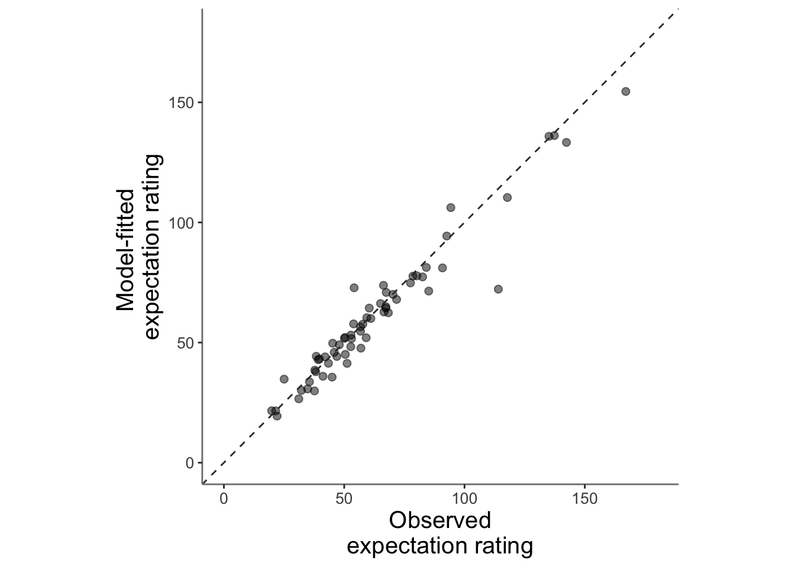
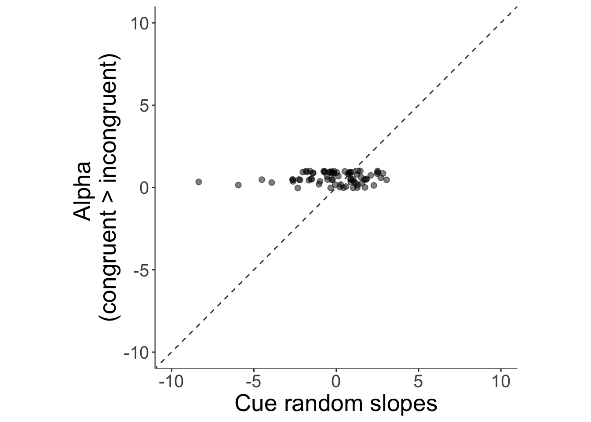
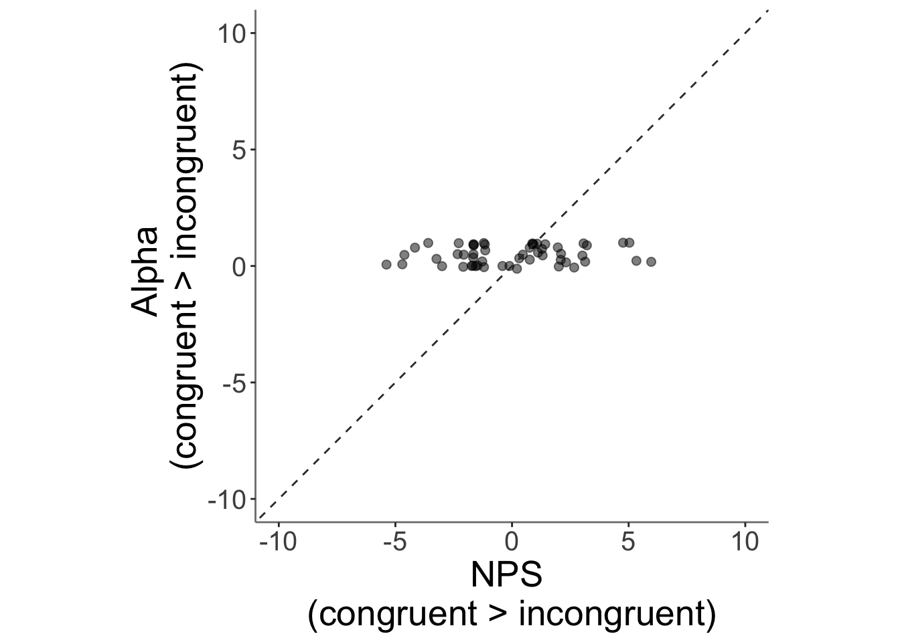
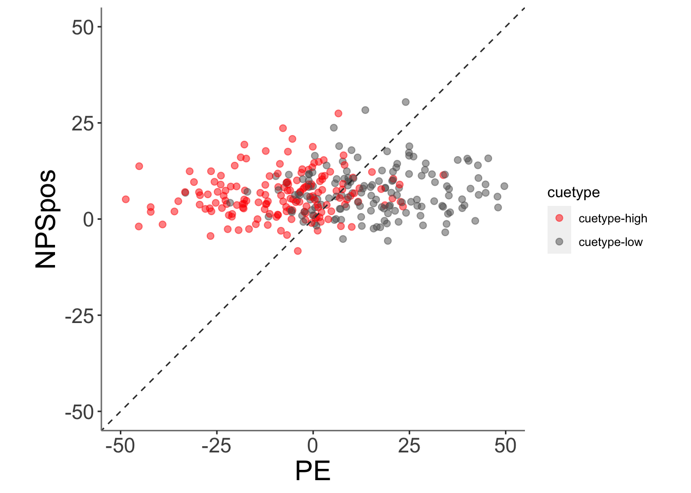

# RL :: simulation Aryan {#simulation_aryan}

---

## output: rmdformats::downcute

## What is the purpose of this notebook? {.unlisted .unnumbered}

- Here, I model Aryans model fitted results, using the same scheme as my behavioral analysis (15\*.Rmd)


## load data {.unlisted .unnumbered}


## Plot the relationship between expectation and outcome rating using model 4 simulations (Jepma)


## Plot the relationship between expectation and outcome rating using model 2 simulations (Jepma)


### model fits from model 2. expectation ratings (Jepma model)


```r
main_dir = dirname(dirname(getwd()))
data <- read.csv(file.path(main_dir, 'data/simulated/model_ver04_0508/table_pain_new.csv'))
subjectwise_2dv <- meanSummary_2continuous(data, c("src_subject_id"),
                                   "event02_expect_angle", "Exp_mdl2" )
ggplot(data = subjectwise_2dv,
       aes(x = .data[["DV1_mean_per_sub"]],
           y = .data[["DV2_mean_per_sub"]],
           size = .5
           )) +
  geom_point(size = 2, alpha = .5  ) +
  ylim(0,180) +
  xlim(0,180) +
  coord_fixed() +
  geom_abline(intercept = 0, slope = 1, color = "#373737", linetype = "dashed", linewidth = .5) +
  xlab("Observed\nexpectation rating") +
  ylab("Model-fitted \nexpectation rating")+
  theme(
    axis.line = element_line(colour = "grey50"),
    panel.background = element_blank(),
    plot.subtitle = ggtext::element_textbox_simple(size = 1),
    axis.text.x = element_text(size = 10),
    axis.text.y = element_text(size = 10),
    axis.title.x = element_text(size = 15),
    axis.title.y = element_text(size = 15)

  )
```



### model fits from model 2. outcome ratings (Jepma model)


```r
subjectwise_2dv <- meanSummary_2continuous(data, c("src_subject_id"),
                                   "event04_actual_angle", "Pain_mdl2" )
ggplot(data = subjectwise_2dv,
       aes(x = .data[["DV1_mean_per_sub"]],
           y = .data[["DV2_mean_per_sub"]],
           size = .5
           )) +
  geom_point(size = 2, alpha = .5  ) +
  ylim(0,180) +
  xlim(0,180) +
  coord_fixed() +
  geom_abline(intercept = 0, slope = 1, color = "#373737", linetype = "dashed", linewidth = .5) +
  xlab("Observed\noutcome rating") +
  ylab("Model-fitted \noutcome rating")+
  theme(
    axis.line = element_line(colour = "grey50"),
    panel.background = element_blank(),
    plot.subtitle = ggtext::element_textbox_simple(size = 1),
    axis.text.x = element_text(size = 15),
    axis.text.y = element_text(size = 15),
    axis.title.x = element_text(size = 20),
    axis.title.y = element_text(size = 20)

  )
```


## correlation betweeen alpha_incongruent and cue trial slope (randome effects of cue)


```
## Warning: Removed 3 rows containing missing values (`geom_point()`).
```





```
## Warning: Removed 2 rows containing missing values (`geom_point()`).
```


## correlation betweeen alpha_incongruent and NPS


```r
# load dataframe
NPS <- data.frame(read.csv(file.path(main_dir, 'data/NPS_curated.csv')))
NPS <- NPS %>%
  mutate(congruency = case_when(
    cuetype == "cuetype-low" & stimintensity == "low" ~ "congruent",
    cuetype == "cuetype-high" & stimintensity == "high" ~ "congruent",
    cuetype == "cuetype-low" & stimintensity == "high" ~ "incongruent",
    cuetype == "cuetype-high" & stimintensity == "low" ~ "incongruent",
    TRUE ~ "other"
  ))
NPS_congru <- NPS %>%
  group_by(sub) %>%
  summarise(avg_diff = mean(NPSpos[congruency == "congruent"]) - mean(NPSpos[congruency == "incongruent"]))

# grab alpha_incongruent
model_param <- data.frame(read.csv(file.path(main_dir, "data/RL/modelfit_jepma_0525/par_mdl2_pain.csv")))

model_param <- model_param %>%
  mutate(sub = sprintf("sub-%04d", subj_num_new_pain))

# Merge the two dataframes based on the "sub" column
merged_NPS <- merge(NPS_congru, model_param, by = "sub")
merged_NPS$alpha_c_gt_i <- merged_NPS$alpha_c - merged_NPS$alpha_i
# grab cue slope
# grab intersection of subject ids
# plot ggplot
ggplot(data = merged_NPS,
       aes(x = .data[["avg_diff"]],
           y = .data[["alpha_c_gt_i"]],
           size = .5
           )) +
  geom_point(size = 2, alpha = .5  ) +
  ylim(-10,10) +
  xlim(-10,10) +
  coord_fixed() +
  geom_abline(intercept = 0, slope = 1, color = "#373737", linetype = "dashed", linewidth = .5) +
  xlab("NPS \n(congruent > incongruent)") +
  ylab("Alpha \n(congruent > incongruent)")+
  theme(
    axis.line = element_line(colour = "grey50"),
    panel.background = element_blank(),
    plot.subtitle = ggtext::element_textbox_simple(size = 1),
    axis.text.x = element_text(size = 15),
    axis.text.y = element_text(size = 15),
    axis.title.x = element_text(size = 20),
    axis.title.y = element_text(size = 20)

  )
```



```r
# run lmer
```

## correlation bettween NPS and PE

### test similarity between NPS positive values and PE (11/06/2023)


```r
PEdf <- read.csv(file.path(main_dir, 'data/RL/modelfit_jepma_0525/table_pain.csv'))
NPS <- data.frame(read.csv(file.path(main_dir, 'data/NPS_curated.csv')))

PEdf <- PEdf %>%
  mutate(sub = sprintf("sub-%04d", src_subject_id),
         ses = sprintf("ses-%02d", session_id),
         run = sprintf("run-%02d", param_run_num),
         trial = sprintf("trial-%03d", trial_index_runwise-1)
         )
merged_NPSpe <- merge(NPS, PEdf, by = c("sub", "ses", "run", "trial"))


subjectwise_2dv <- meanSummary_2continuous(merged_NPSpe, c("src_subject_id","stimintensity", "cuetype"),
                                   "PE_mdl2", "NPSpos" )
ggplot(data = subjectwise_2dv,
       aes(x = .data[["DV1_mean_per_sub"]],
           y = .data[["DV2_mean_per_sub"]],
           color = .data[["cuetype"]],
           # shape = .data[["stimintensity"]],
           # size = .5
           )) +
  geom_point(size = 2, alpha = .5  ) +
  ylim(-50,50) +
  xlim(-50,50) +
  coord_fixed() +
  scale_color_manual(values = c("cuetype-high" ="red","cuetype-low" =  "#5D5C5C"))+
  geom_abline(intercept = 0, slope = 1, color = "#373737", linetype = "dashed", linewidth = .5) +
  xlab("PE") +
  ylab("NPSpos")+
  theme(
    axis.line = element_line(colour = "grey50"),
    panel.background = element_blank(),
    plot.subtitle = ggtext::element_textbox_simple(size = 1),
    axis.text.x = element_text(size = 15),
    axis.text.y = element_text(size = 15),
    axis.title.x = element_text(size = 20),
    axis.title.y = element_text(size = 20)

  )
```

```
## Warning: Removed 13 rows containing missing values (`geom_point()`).
```




```r
model.25 <- lmer(merged_NPSpe$NPSpos ~ merged_NPSpe$PE_mdl2 + (1|sub), data = merged_NPSpe)
summary(model.25)
```

```
## Linear mixed model fit by REML. t-tests use Satterthwaite's method [
## lmerModLmerTest]
## Formula: merged_NPSpe$NPSpos ~ merged_NPSpe$PE_mdl2 + (1 | sub)
##    Data: merged_NPSpe
## 
## REML criterion at convergence: 20826.7
## 
## Scaled residuals: 
##     Min      1Q  Median      3Q     Max 
## -5.4290 -0.5073 -0.0168  0.5202  5.5313 
## 
## Random effects:
##  Groups   Name        Variance Std.Dev.
##  sub      (Intercept) 28.52    5.340   
##  Residual             68.76    8.292   
## Number of obs: 2922, groups:  sub, 54
## 
## Fixed effects:
##                       Estimate Std. Error        df t value Pr(>|t|)    
## (Intercept)          6.501e+00  7.457e-01 5.305e+01   8.718 8.06e-12 ***
## merged_NPSpe$PE_mdl2 3.876e-02  6.866e-03 2.896e+03   5.645 1.81e-08 ***
## ---
## Signif. codes:  0 '***' 0.001 '**' 0.01 '*' 0.05 '.' 0.1 ' ' 1
## 
## Correlation of Fixed Effects:
##             (Intr)
## mr_NPS$PE_2 -0.052
```

### test relationship between PE and cue type and stimintensity (06/16/2023)


```r
model.PENPS <- lmer(NPSpos ~ PE_mdl2*cuetype*stimintensity + (1|sub), data = merged_NPSpe)
summary(model.PENPS)
```

```
## Linear mixed model fit by REML. t-tests use Satterthwaite's method [
## lmerModLmerTest]
## Formula: NPSpos ~ PE_mdl2 * cuetype * stimintensity + (1 | sub)
##    Data: merged_NPSpe
## 
## REML criterion at convergence: 20816
## 
## Scaled residuals: 
##     Min      1Q  Median      3Q     Max 
## -5.5455 -0.5260 -0.0153  0.5196  5.6086 
## 
## Random effects:
##  Groups   Name        Variance Std.Dev.
##  sub      (Intercept) 28.32    5.321   
##  Residual             68.21    8.259   
## Number of obs: 2922, groups:  sub, 54
## 
## Fixed effects:
##                                               Estimate Std. Error         df
## (Intercept)                                  7.590e+00  8.362e-01  8.488e+01
## PE_mdl2                                     -1.962e-02  3.555e-02  2.887e+03
## cuetypecuetype-low                           1.515e+00  9.025e-01  2.890e+03
## stimintensitylow                            -1.753e+00  8.436e-01  2.883e+03
## stimintensitymed                            -2.107e+00  6.415e-01  2.873e+03
## PE_mdl2:cuetypecuetype-low                   2.818e-03  4.109e-02  2.887e+03
## PE_mdl2:stimintensitylow                     4.253e-02  4.452e-02  2.883e+03
## PE_mdl2:stimintensitymed                     1.800e-03  4.896e-02  2.870e+03
## cuetypecuetype-low:stimintensitylow         -1.618e+00  1.252e+00  2.893e+03
## cuetypecuetype-low:stimintensitymed          4.626e-01  1.160e+00  2.868e+03
## PE_mdl2:cuetypecuetype-low:stimintensitylow -2.715e-02  5.295e-02  2.867e+03
## PE_mdl2:cuetypecuetype-low:stimintensitymed  2.309e-02  5.654e-02  2.863e+03
##                                             t value Pr(>|t|)    
## (Intercept)                                   9.077 3.81e-14 ***
## PE_mdl2                                      -0.552  0.58111    
## cuetypecuetype-low                            1.678  0.09337 .  
## stimintensitylow                             -2.077  0.03786 *  
## stimintensitymed                             -3.284  0.00104 ** 
## PE_mdl2:cuetypecuetype-low                    0.069  0.94533    
## PE_mdl2:stimintensitylow                      0.955  0.33953    
## PE_mdl2:stimintensitymed                      0.037  0.97068    
## cuetypecuetype-low:stimintensitylow          -1.293  0.19626    
## cuetypecuetype-low:stimintensitymed           0.399  0.69017    
## PE_mdl2:cuetypecuetype-low:stimintensitylow  -0.513  0.60816    
## PE_mdl2:cuetypecuetype-low:stimintensitymed   0.408  0.68304    
## ---
## Signif. codes:  0 '***' 0.001 '**' 0.01 '*' 0.05 '.' 0.1 ' ' 1
## 
## Correlation of Fixed Effects:
##                                (Intr) PE_md2 ctypc- stmntnstyl stmntnstym
## PE_mdl2                        -0.215                                    
## ctypctyp-lw                    -0.224  0.174                             
## stmntnstylw                    -0.252  0.234  0.273                      
## stmntnstymd                    -0.329  0.314  0.308  0.365               
## PE_mdl2:ct-                     0.184 -0.850 -0.565 -0.232     -0.276    
## PE_mdl2:stmntnstyl              0.164 -0.780 -0.096  0.285     -0.217    
## PE_mdl2:stmntnstym              0.141 -0.668 -0.096 -0.102      0.138    
## ctypctyp-lw:stmntnstyl          0.168 -0.138 -0.747 -0.704     -0.249    
## ctypctyp-lw:stmntnstym          0.180 -0.159 -0.741 -0.221     -0.557    
## PE_mdl2:ctypctyp-lw:stmntnstyl -0.136  0.636  0.359 -0.222      0.181    
## PE_mdl2:ctypctyp-lw:stmntnstym -0.121  0.572  0.337  0.095     -0.117    
##                                PE_m2:- PE_mdl2:stmntnstyl PE_mdl2:stmntnstym
## PE_mdl2                                                                     
## ctypctyp-lw                                                                 
## stmntnstylw                                                                 
## stmntnstymd                                                                 
## PE_mdl2:ct-                                                                 
## PE_mdl2:stmntnstyl              0.635                                       
## PE_mdl2:stmntnstym              0.554   0.566                               
## ctypctyp-lw:stmntnstyl          0.434  -0.235              0.042            
## ctypctyp-lw:stmntnstym          0.431   0.090             -0.099            
## PE_mdl2:ctypctyp-lw:stmntnstyl -0.705  -0.807             -0.454            
## PE_mdl2:ctypctyp-lw:stmntnstym -0.643  -0.478             -0.855            
##                                ctypctyp-lw:stmntnstyl ctypctyp-lw:stmntnstym
## PE_mdl2                                                                     
## ctypctyp-lw                                                                 
## stmntnstylw                                                                 
## stmntnstymd                                                                 
## PE_mdl2:ct-                                                                 
## PE_mdl2:stmntnstyl                                                          
## PE_mdl2:stmntnstym                                                          
## ctypctyp-lw:stmntnstyl                                                      
## ctypctyp-lw:stmntnstym          0.562                                       
## PE_mdl2:ctypctyp-lw:stmntnstyl -0.068                 -0.295                
## PE_mdl2:ctypctyp-lw:stmntnstym -0.226                 -0.264                
##                                PE_mdl2:ctypctyp-lw:stmntnstyl
## PE_mdl2                                                      
## ctypctyp-lw                                                  
## stmntnstylw                                                  
## stmntnstymd                                                  
## PE_mdl2:ct-                                                  
## PE_mdl2:stmntnstyl                                           
## PE_mdl2:stmntnstym                                           
## ctypctyp-lw:stmntnstyl                                       
## ctypctyp-lw:stmntnstym                                       
## PE_mdl2:ctypctyp-lw:stmntnstyl                               
## PE_mdl2:ctypctyp-lw:stmntnstym  0.520
```

### plot the relationship between PE and NPS as a function of cue


```r
ggplot(data = merged_NPSpe,
       aes(x = .data[["PE_mdl2"]],
           y = .data[["NPSpos"]],
           color = .data[["cuetype"]],
           size = .5
           )) +
  geom_point(size = 2, alpha = .5  ) +
  ylim(-150,150) +
  xlim(-150,150) +
  coord_fixed() +
  scale_color_manual(values = c("cuetype-high" ="red","cuetype-low" =  "#5D5C5C"))+
  geom_abline(intercept = 0, slope = 1, color = "#373737", linetype = "dashed", linewidth = .5) +
  xlab("PE") +
  ylab("NPSpos")+
  theme(
    axis.line = element_line(colour = "grey50"),
    panel.background = element_blank(),
    plot.subtitle = ggtext::element_textbox_simple(size = 1),
    axis.text.x = element_text(size = 15),
    axis.text.y = element_text(size = 15),
    axis.title.x = element_text(size = 20),
    axis.title.y = element_text(size = 20)

  )
```


### plot the relationship between PE and NPS as a function of cue and stimulus intensity


