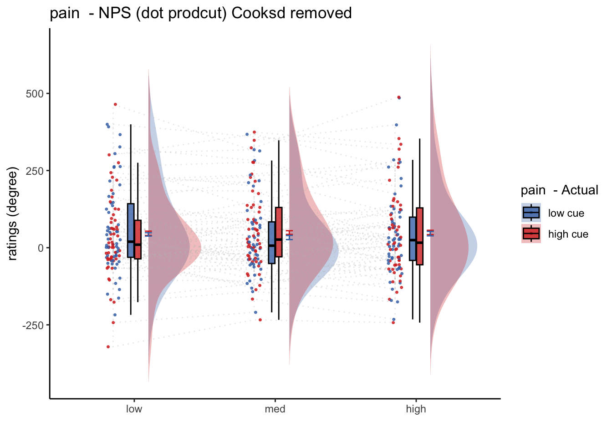
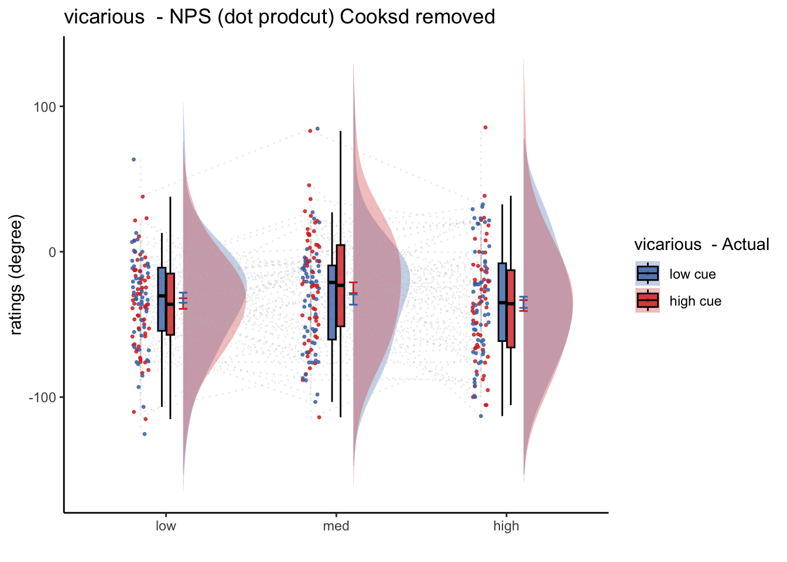

# nps_dummy ~ stim {#nps_stim}


<!-- --- -->
<!-- title: "nps_dummy ~ stim" -->
<!-- author: "Heejung Jung" -->
<!-- date: "2023-01-26" -->
<!-- output: html_document -->
<!-- --- -->

## TODO
* stack all stimulus dummy files
* treat it like a within subjct analysis

## regressors and contrasts
### What regressors were used in the neural model and how did you create contrasts? {.unlisted .unnumbered}
This Rmd is based on the univariate analysis mainly using 2 factors (cue x stimulus intensity). 

* The 6 regressors of interest are 
  1. high-cue_high-stim 
  1. high-cue_med-stim 
  1. high-cue_low-stim
  1. low-cue_high-stim 
  1. low-cue_med-stim
  1. low-cue_low-stim. 
  If interested, the variable of interest is coded "`onset03_stim`" in the behavioral data. 

* Additional regressors include 7) cue_onset "`onset01_cue`", 8) onset of the expectation rating phase "`onset02_ratingexpect`" convolved with the reaction time of the expectation rating "`pmod_expectRT`", and 9) onset of the outcome rating phase "`onset04_ratingoutcome`", convolved with the reaction time of the outcome rating "`pmod_outcomeRT`". 
* Motion covariates include a) csf, b) 24 DOF head motion variables, and c) spikes derived using a FD-spike-threshold of 0.9mm. Participants with a motion spike of more than 20 per run is excluded from the analysis. 
For the 6 regressors of interest, I build 5 contrasts that capture the cue effect, the stimulus intensity effect, and the interaction of these two factors.


## Functions


```r
main_dir = dirname(dirname(getwd()))
datadir = file.path(main_dir, 'data', 'beh', 'beh02_preproc')
analysis_dir = file.path(main_dir,'analysis','mixedeffect','model13_iv-stim_dv-nps-dummy',as.character(Sys.Date())  )
dir.create(analysis_dir, showWarnings = FALSE, recursive = TRUE)
savedir <- analysis_dir

npsdir = file.path(main_dir,'analysis','fmri','spm','univariate','model01_6cond_nonscaled','extract_nps')
model = 'nps'; model_keyword = "nps"
subjectwise_mean = "mean_per_sub"; group_mean = "mean_per_sub_norm_mean"; se = "se"
# iv = "contrast"; subject = "subject"
# dv = "nps"; dv_keyword = "nps_dot_product"
ylim = c(-800, 800)
xlab = "contrasts "; ylab = "NPS dotproduct"
ggtitle = paste0(model_keyword,
                   " :: extracted NPS value for stimulus intensity wise contrast")
legend_title = "Contrasts"
color_scheme <- c("Pain > VC" = "#941100",
         "Vicarious > PC" = "#008F51",
         "Cog > PV" = "#011891")
```


```r
pain_nps <- list(model = 'nps', model_keyword = "nps",
                 subjectwise_mean = "mean_per_sub", group_mean = "mean_per_sub_norm_mean", se = "se",
                 ylim = c(-800, 800),xlab = "contrasts", ylab = "NPS dotproduct")
#class(studentBio) <- "StudentInfo"
pain_nps
```

```
## $model
## [1] "nps"
## 
## $model_keyword
## [1] "nps"
## 
## $subjectwise_mean
## [1] "mean_per_sub"
## 
## $group_mean
## [1] "mean_per_sub_norm_mean"
## 
## $se
## [1] "se"
## 
## $ylim
## [1] -800  800
## 
## $xlab
## [1] "contrasts"
## 
## $ylab
## [1] "NPS dotproduct"
```

## Pain
* from con_0032 ~ con_0037


```
## $$
## \begin{aligned}
##   \operatorname{nps}_{i}  &\sim N \left(\mu, \sigma^2 \right) \\
##     \mu &=\alpha_{j[i]} + \beta_{1}(\operatorname{cue\_con}) + \beta_{2}(\operatorname{stim\_con\_linear}) + \beta_{3}(\operatorname{stim\_con\_quad}) + \beta_{4}(\operatorname{cue\_con} \times \operatorname{stim\_con\_linear}) + \beta_{5}(\operatorname{cue\_con} \times \operatorname{stim\_con\_quad}) \\
##     \alpha_{j}  &\sim N \left(\mu_{\alpha_{j}}, \sigma^2_{\alpha_{j}} \right)
##     \text{, for subject j = 1,} \dots \text{,J}
## \end{aligned}
## $$
## [1] "model:  Nps-Dotproduct  ratings -  pain"
## Linear mixed model fit by REML. t-tests use Satterthwaite's method [
## lmerModLmerTest]
## Formula: as.formula(model_string)
##    Data: data
## 
## REML criterion at convergence: 4300.7
## 
## Scaled residuals: 
##     Min      1Q  Median      3Q     Max 
## -3.2758 -0.5227 -0.0085  0.4592  3.5911 
## 
## Random effects:
##  Groups   Name        Variance Std.Dev.
##  subject  (Intercept) 19315    138.98  
##  Residual              6293     79.33  
## Number of obs: 360, groups:  subject, 60
## 
## Fixed effects:
##                         Estimate Std. Error      df t value Pr(>|t|)   
## (Intercept)               53.966     18.423  59.000   2.929  0.00482 **
## cue_con                    2.214      8.362 295.000   0.265  0.79137   
## stim_con_linear           16.898     10.241 295.000   1.650  0.10002   
## stim_con_quad             -1.507      8.959 295.000  -0.168  0.86656   
## cue_con:stim_con_linear  -12.486     20.483 295.000  -0.610  0.54262   
## cue_con:stim_con_quad      6.715     17.918 295.000   0.375  0.70812   
## ---
## Signif. codes:  0 '***' 0.001 '**' 0.01 '*' 0.05 '.' 0.1 ' ' 1
## 
## Correlation of Fixed Effects:
##               (Intr) cue_cn stm_cn_l stm_cn_q c_cn:stm_cn_l
## cue_con       0.000                                        
## stim_cn_lnr   0.000  0.000                                 
## stim_con_qd   0.000  0.000  0.000                          
## c_cn:stm_cn_l 0.000  0.000  0.000    0.000                 
## c_cn:stm_cn_q 0.000  0.000  0.000    0.000    0.000        
## $$
## \begin{aligned}
##   \operatorname{nps}_{i}  &\sim N \left(\mu, \sigma^2 \right) \\
##     \mu &=\alpha_{j[i]} + \beta_{1}(\operatorname{cue\_con}) + \beta_{2}(\operatorname{stim\_con\_linear}) + \beta_{3}(\operatorname{stim\_con\_quad}) + \beta_{4}(\operatorname{cue\_con} \times \operatorname{stim\_con\_linear}) + \beta_{5}(\operatorname{cue\_con} \times \operatorname{stim\_con\_quad}) \\
##     \alpha_{j}  &\sim N \left(\mu_{\alpha_{j}}, \sigma^2_{\alpha_{j}} \right)
##     \text{, for subject j = 1,} \dots \text{,J}
## \end{aligned}
## $$
```


```r
    data_screen$cue_name[data_screen$cue == "highcue"] <- "high cue"
    data_screen$cue_name[data_screen$cue == "lowcue"] <- "low cue"

    data_screen$stim_name[data_screen$stim == "highstim"] <- "high"
    data_screen$stim_name[data_screen$stim == "medstim"] <- "med"
    data_screen$stim_name[data_screen$stim == "lowstim"] <- "low"

    data_screen$stim_ordered <- factor(
        data_screen$stim_name,
        levels = c("low", "med", "high")
    )
    data_screen$cue_ordered <- factor(
        data_screen$cue_name,
        levels = c("low cue", "high cue")
    )
    model_iv1 <- "stim_ordered"
    model_iv2 <- "cue_ordered"

    #  [ PLOT ] calculate mean and se  _________________________
    actual_subjectwise <- meanSummary(
        data_screen,
        c(subject_keyword, model_iv1, model_iv2), dv
    )
    actual_groupwise <- summarySEwithin(
        data = actual_subjectwise,
        measurevar = "mean_per_sub",
        withinvars = c(model_iv1, model_iv2), idvar = subject_keyword
    )
    nps_groupwise <- summarySEwithin(
        data = data_screen,
        measurevar = "nps",
        withinvars = c(model_iv1, model_iv2), idvar = subject_keyword
    )
    actual_groupwise$task <- taskname
```


```
## Warning: Removed 1 rows containing non-finite values (`stat_half_ydensity()`).
```

```
## Warning: Removed 1 rows containing non-finite values (`stat_boxplot()`).
```

```
## Warning: Removed 615 rows containing missing values (`geom_half_violin()`).
```

```
## Warning: Removed 1 rows containing missing values (`geom_point()`).
```




```r
# classwise <- meanSummary(merge_df,
#                          c(subject_keyword, iv), dv)
# groupwise <- summarySEwithin(data = classwise,
#                              measurevar = subjectwise_mean,
#                              withinvars = c(iv))
# 
# subjectwise = subset(classwise, select = -c(sd))
```


## Vicarious
* from con_0038 ~ con_0043


```
## [1] "V_simple"
```

```
## $$
## \begin{aligned}
##   \operatorname{npspos}_{i}  &\sim N \left(\mu, \sigma^2 \right) \\
##     \mu &=\alpha_{j[i]} + \beta_{1}(\operatorname{cue\_con}) + \beta_{2}(\operatorname{stim\_con\_linear}) + \beta_{3}(\operatorname{stim\_con\_quad}) + \beta_{4}(\operatorname{cue\_con} \times \operatorname{stim\_con\_linear}) + \beta_{5}(\operatorname{cue\_con} \times \operatorname{stim\_con\_quad}) \\
##     \alpha_{j}  &\sim N \left(\mu_{\alpha_{j}}, \sigma^2_{\alpha_{j}} \right)
##     \text{, for subject j = 1,} \dots \text{,J}
## \end{aligned}
## $$
## [1] "model:  Npspos  ratings -  pain"
## Linear mixed model fit by REML. t-tests use Satterthwaite's method [
## lmerModLmerTest]
## Formula: as.formula(model_string)
##    Data: data
## 
## REML criterion at convergence: 3657.6
## 
## Scaled residuals: 
##     Min      1Q  Median      3Q     Max 
## -3.4450 -0.5393  0.0250  0.5545  3.3735 
## 
## Random effects:
##  Groups   Name        Variance Std.Dev.
##  subject  (Intercept)  508.9   22.56   
##  Residual             1381.2   37.16   
## Number of obs: 360, groups:  subject, 60
## 
## Fixed effects:
##                          Estimate Std. Error        df t value Pr(>|t|)    
## (Intercept)             -33.89545    3.50964  59.00000  -9.658 9.32e-14 ***
## cue_con                  -0.03744    3.91746 295.00000  -0.010    0.992    
## stim_con_linear           0.33135    4.79789 295.00000   0.069    0.945    
## stim_con_quad             6.65555    4.19707 295.00000   1.586    0.114    
## cue_con:stim_con_linear  -1.19125    9.59578 295.00000  -0.124    0.901    
## cue_con:stim_con_quad     7.82722    8.39413 295.00000   0.932    0.352    
## ---
## Signif. codes:  0 '***' 0.001 '**' 0.01 '*' 0.05 '.' 0.1 ' ' 1
## 
## Correlation of Fixed Effects:
##               (Intr) cue_cn stm_cn_l stm_cn_q c_cn:stm_cn_l
## cue_con       0.000                                        
## stim_cn_lnr   0.000  0.000                                 
## stim_con_qd   0.000  0.000  0.000                          
## c_cn:stm_cn_l 0.000  0.000  0.000    0.000                 
## c_cn:stm_cn_q 0.000  0.000  0.000    0.000    0.000        
## $$
## \begin{aligned}
##   \operatorname{npspos}_{i}  &\sim N \left(\mu, \sigma^2 \right) \\
##     \mu &=\alpha_{j[i]} + \beta_{1}(\operatorname{cue\_con}) + \beta_{2}(\operatorname{stim\_con\_linear}) + \beta_{3}(\operatorname{stim\_con\_quad}) + \beta_{4}(\operatorname{cue\_con} \times \operatorname{stim\_con\_linear}) + \beta_{5}(\operatorname{cue\_con} \times \operatorname{stim\_con\_quad}) \\
##     \alpha_{j}  &\sim N \left(\mu_{\alpha_{j}}, \sigma^2_{\alpha_{j}} \right)
##     \text{, for subject j = 1,} \dots \text{,J}
## \end{aligned}
## $$
```




## Cognitive
* from con_0044 ~ con_0049


```
## [1] "C_simple"
```

```
## $$
## \begin{aligned}
##   \operatorname{npspos}_{i}  &\sim N \left(\mu, \sigma^2 \right) \\
##     \mu &=\alpha_{j[i]} + \beta_{1}(\operatorname{cue\_con}) + \beta_{2}(\operatorname{stim\_con\_linear}) + \beta_{3}(\operatorname{stim\_con\_quad}) + \beta_{4}(\operatorname{cue\_con} \times \operatorname{stim\_con\_linear}) + \beta_{5}(\operatorname{cue\_con} \times \operatorname{stim\_con\_quad}) \\
##     \alpha_{j}  &\sim N \left(\mu_{\alpha_{j}}, \sigma^2_{\alpha_{j}} \right)
##     \text{, for subject j = 1,} \dots \text{,J}
## \end{aligned}
## $$
## [1] "model:  Npspos  ratings -  cognitive"
## Linear mixed model fit by REML. t-tests use Satterthwaite's method [
## lmerModLmerTest]
## Formula: as.formula(model_string)
##    Data: data
## 
## REML criterion at convergence: 3709.4
## 
## Scaled residuals: 
##     Min      1Q  Median      3Q     Max 
## -5.0056 -0.5176  0.0102  0.5407  2.8211 
## 
## Random effects:
##  Groups   Name        Variance Std.Dev.
##  subject  (Intercept) 1253     35.39   
##  Residual             1431     37.83   
## Number of obs: 360, groups:  subject, 60
## 
## Fixed effects:
##                         Estimate Std. Error      df t value Pr(>|t|)    
## (Intercept)               52.053      4.985  59.000  10.442 4.97e-15 ***
## cue_con                    2.058      3.987 295.000   0.516    0.606    
## stim_con_linear           -1.949      4.883 295.000  -0.399    0.690    
## stim_con_quad             -3.553      4.272 295.000  -0.832    0.406    
## cue_con:stim_con_linear   10.899      9.767 295.000   1.116    0.265    
## cue_con:stim_con_quad     -2.696      8.544 295.000  -0.316    0.753    
## ---
## Signif. codes:  0 '***' 0.001 '**' 0.01 '*' 0.05 '.' 0.1 ' ' 1
## 
## Correlation of Fixed Effects:
##               (Intr) cue_cn stm_cn_l stm_cn_q c_cn:stm_cn_l
## cue_con       0.000                                        
## stim_cn_lnr   0.000  0.000                                 
## stim_con_qd   0.000  0.000  0.000                          
## c_cn:stm_cn_l 0.000  0.000  0.000    0.000                 
## c_cn:stm_cn_q 0.000  0.000  0.000    0.000    0.000        
## $$
## \begin{aligned}
##   \operatorname{npspos}_{i}  &\sim N \left(\mu, \sigma^2 \right) \\
##     \mu &=\alpha_{j[i]} + \beta_{1}(\operatorname{cue\_con}) + \beta_{2}(\operatorname{stim\_con\_linear}) + \beta_{3}(\operatorname{stim\_con\_quad}) + \beta_{4}(\operatorname{cue\_con} \times \operatorname{stim\_con\_linear}) + \beta_{5}(\operatorname{cue\_con} \times \operatorname{stim\_con\_quad}) \\
##     \alpha_{j}  &\sim N \left(\mu_{\alpha_{j}}, \sigma^2_{\alpha_{j}} \right)
##     \text{, for subject j = 1,} \dots \text{,J}
## \end{aligned}
## $$
```


