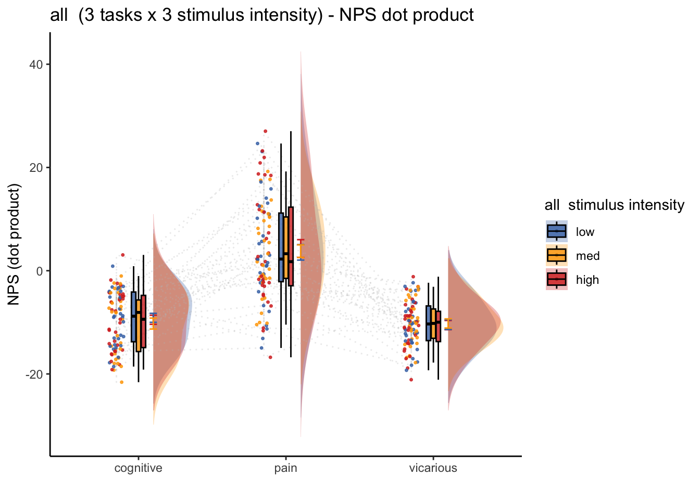
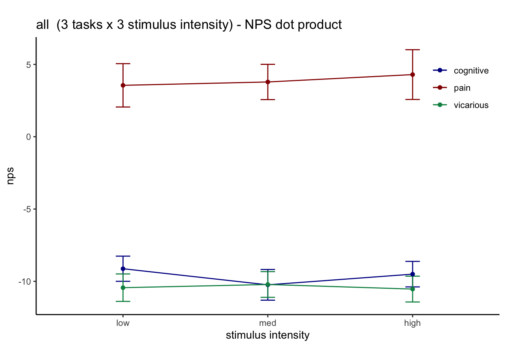

# NPSdummy ~ stim * task (contrast-scaled) {#nps_stim_task}

```
author: "Heejung Jung"
date: "2023-02-03"
```


## Function {.unlisted .unnumbered}


## Common parameters {.unlisted .unnumbered}


```r
only_select_18runs = pvc 
t = pvc[pvc$subject %in% c("sub-0032", "sub-0033", "sub-0036", "sub-0037", "sub-0038", "sub-0039",
                       "sub-0052", "sub-0056", "sub-0057", "sub-0060",
                       "sub-0061", "sub-0062",
                       "sub-0078", "sub-0080", 
                       "sub-0086", "sub-0093", "sub-0095", "sub-0098", 
                       "sub-0101", "sub-0104", "sub-0106", "sub-0107", "sub-0109", "sub-0115", "sub-0116", 
                       "sub-0124", "sub-0126", "sub-0128", "sub-0129", "sub-0130", "sub-0132"),]
```


## Raincloud plots


## Line plots



