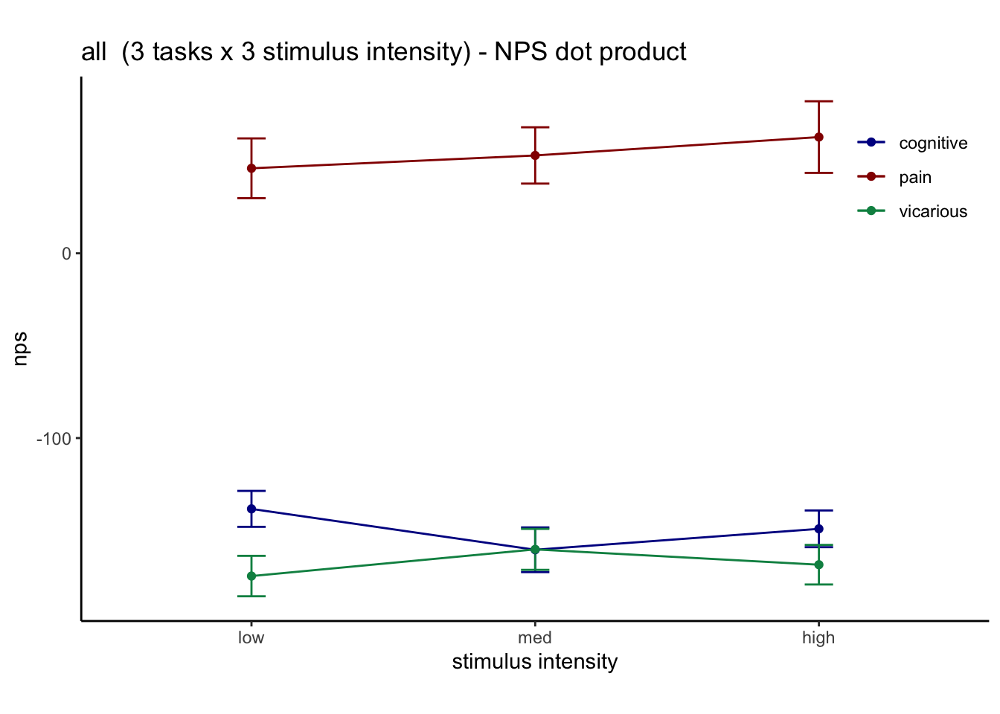

# [fMRI] NPSdummy ~ stim * task (contrast-notscaled-error) {#nps_stim_error}

```
author: "Heejung Jung"
date: "2023-02-02"
```

## Overview  {.unlisted .unnumbered}
* Dummy contrasts (pain > rest, cognitive > rest, vicarious > rest) were constructed in SPM for the stimulus phase
* Afterwards, I calculate the dot product betweeen average subjectwise dummy contrasts and NPS weightmap
* Here, results are plotted as a function of stimulus intensity and task.


### Raincloud plots


### Line plots



