---
output:
  pdf_document: default
  html_document: default
---
# NPSsimulation


### Function


### NPS data


### behavioral data


### Q. Within pain task, Does stimulus intenisty level and cue level significantly predict NPS dotproducts? {.unlisted .unnumbered}
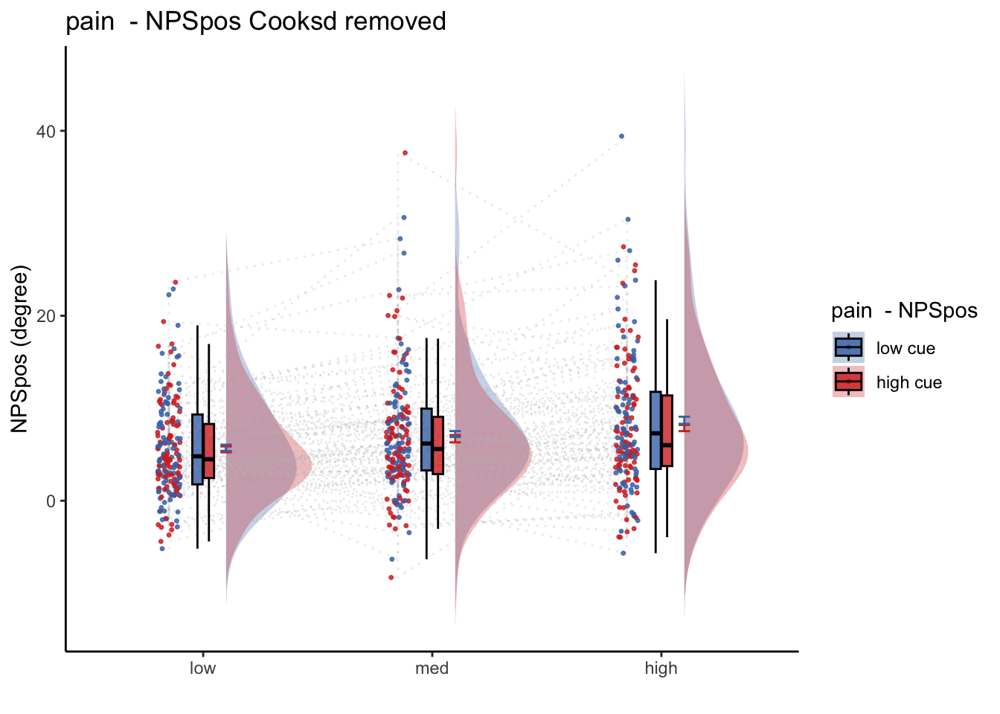


### get pain relationship, controlling for cue, cuetype, expect

```r
model.stim <- lmer(event04_actual_angle ~ 
                          STIM_linear + 
                          CUE_high_gt_low + STIM_quadratic+ EXPECT_demean +
                          EXPECT_cmc +
                          ses + 
                          (1|sub), data = df
                    ) 
# CUE_high_gt_low+STIM+EXPECT_demean
sjPlot::tab_model(model.stim,
                  title = "Multilevel-modeling: \nlmer(NPSpos ~ CUE + STIM + EXPECT_demean + SES + (1| sub), data = pvc)",
                  CSS = list(css.table = '+font-size: 12;'))
```

<table style="border-collapse:collapse; border:none;font-size: 12;">
<caption style="font-weight: bold; text-align:left;">Multilevel-modeling: 
lmer(NPSpos ~ CUE + STIM + EXPECT_demean + SES + (1| sub), data = pvc)</caption>
<tr>
<th style="border-top: double; text-align:center; font-style:italic; font-weight:normal; padding:0.2cm; border-bottom:1px solid black; text-align:left; ">&nbsp;</th>
<th colspan="3" style="border-top: double; text-align:center; font-style:italic; font-weight:normal; padding:0.2cm; border-bottom:1px solid black;">event04_actual_angle</th>
</tr>
<tr>
<td style=" text-align:center; border-bottom:1px solid; font-style:italic; font-weight:normal; border-bottom:1px solid black; text-align:left; ">Predictors</td>
<td style=" text-align:center; border-bottom:1px solid; font-style:italic; font-weight:normal; border-bottom:1px solid black; ">Estimates</td>
<td style=" text-align:center; border-bottom:1px solid; font-style:italic; font-weight:normal; border-bottom:1px solid black; ">CI</td>
<td style=" text-align:center; border-bottom:1px solid; font-style:italic; font-weight:normal; border-bottom:1px solid black; ">p</td>
</tr>
<tr>
<td style=" padding:0.2cm; text-align:left; vertical-align:top; text-align:left; ">(Intercept)</td>
<td style=" padding:0.2cm; text-align:left; vertical-align:top; text-align:center;  ">71.33</td>
<td style=" padding:0.2cm; text-align:left; vertical-align:top; text-align:center;  ">68.56&nbsp;&ndash;&nbsp;74.10</td>
<td style=" padding:0.2cm; text-align:left; vertical-align:top; text-align:center;  "><strong>&lt;0.001</strong></td>
</tr>
<tr>
<td style=" padding:0.2cm; text-align:left; vertical-align:top; text-align:left; ">STIM linear</td>
<td style=" padding:0.2cm; text-align:left; vertical-align:top; text-align:center;  ">29.89</td>
<td style=" padding:0.2cm; text-align:left; vertical-align:top; text-align:center;  ">28.43&nbsp;&ndash;&nbsp;31.34</td>
<td style=" padding:0.2cm; text-align:left; vertical-align:top; text-align:center;  "><strong>&lt;0.001</strong></td>
</tr>
<tr>
<td style=" padding:0.2cm; text-align:left; vertical-align:top; text-align:left; ">CUE high gt low</td>
<td style=" padding:0.2cm; text-align:left; vertical-align:top; text-align:center;  ">&#45;2.04</td>
<td style=" padding:0.2cm; text-align:left; vertical-align:top; text-align:center;  ">&#45;3.55&nbsp;&ndash;&nbsp;-0.53</td>
<td style=" padding:0.2cm; text-align:left; vertical-align:top; text-align:center;  "><strong>0.008</strong></td>
</tr>
<tr>
<td style=" padding:0.2cm; text-align:left; vertical-align:top; text-align:left; ">STIM quadratic</td>
<td style=" padding:0.2cm; text-align:left; vertical-align:top; text-align:center;  ">1.34</td>
<td style=" padding:0.2cm; text-align:left; vertical-align:top; text-align:center;  ">0.07&nbsp;&ndash;&nbsp;2.62</td>
<td style=" padding:0.2cm; text-align:left; vertical-align:top; text-align:center;  "><strong>0.039</strong></td>
</tr>
<tr>
<td style=" padding:0.2cm; text-align:left; vertical-align:top; text-align:left; ">EXPECT demean</td>
<td style=" padding:0.2cm; text-align:left; vertical-align:top; text-align:center;  ">0.30</td>
<td style=" padding:0.2cm; text-align:left; vertical-align:top; text-align:center;  ">0.28&nbsp;&ndash;&nbsp;0.33</td>
<td style=" padding:0.2cm; text-align:left; vertical-align:top; text-align:center;  "><strong>&lt;0.001</strong></td>
</tr>
<tr>
<td style=" padding:0.2cm; text-align:left; vertical-align:top; text-align:left; ">EXPECT cmc</td>
<td style=" padding:0.2cm; text-align:left; vertical-align:top; text-align:center;  ">0.93</td>
<td style=" padding:0.2cm; text-align:left; vertical-align:top; text-align:center;  ">0.84&nbsp;&ndash;&nbsp;1.02</td>
<td style=" padding:0.2cm; text-align:left; vertical-align:top; text-align:center;  "><strong>&lt;0.001</strong></td>
</tr>
<tr>
<td style=" padding:0.2cm; text-align:left; vertical-align:top; text-align:left; ">sesses&#45;03</td>
<td style=" padding:0.2cm; text-align:left; vertical-align:top; text-align:center;  ">&#45;7.22</td>
<td style=" padding:0.2cm; text-align:left; vertical-align:top; text-align:center;  ">&#45;8.86&nbsp;&ndash;&nbsp;-5.59</td>
<td style=" padding:0.2cm; text-align:left; vertical-align:top; text-align:center;  "><strong>&lt;0.001</strong></td>
</tr>
<tr>
<td style=" padding:0.2cm; text-align:left; vertical-align:top; text-align:left; ">sesses&#45;04</td>
<td style=" padding:0.2cm; text-align:left; vertical-align:top; text-align:center;  ">&#45;7.45</td>
<td style=" padding:0.2cm; text-align:left; vertical-align:top; text-align:center;  ">&#45;9.07&nbsp;&ndash;&nbsp;-5.83</td>
<td style=" padding:0.2cm; text-align:left; vertical-align:top; text-align:center;  "><strong>&lt;0.001</strong></td>
</tr>
<tr>
<td colspan="4" style="font-weight:bold; text-align:left; padding-top:.8em;">Random Effects</td>
</tr>

<tr>
<td style=" padding:0.2cm; text-align:left; vertical-align:top; text-align:left; padding-top:0.1cm; padding-bottom:0.1cm;">&sigma;<sup>2</sup></td>
<td style=" padding:0.2cm; text-align:left; vertical-align:top; padding-top:0.1cm; padding-bottom:0.1cm; text-align:center;" colspan="3">366.84</td>
</tr>

<tr>
<td style=" padding:0.2cm; text-align:left; vertical-align:top; text-align:left; padding-top:0.1cm; padding-bottom:0.1cm;">&tau;<sub>00</sub> <sub>sub</sub></td>
<td style=" padding:0.2cm; text-align:left; vertical-align:top; padding-top:0.1cm; padding-bottom:0.1cm; text-align:center;" colspan="3">157.35</td>

<tr>
<td style=" padding:0.2cm; text-align:left; vertical-align:top; text-align:left; padding-top:0.1cm; padding-bottom:0.1cm;">ICC</td>
<td style=" padding:0.2cm; text-align:left; vertical-align:top; padding-top:0.1cm; padding-bottom:0.1cm; text-align:center;" colspan="3">0.30</td>

<tr>
<td style=" padding:0.2cm; text-align:left; vertical-align:top; text-align:left; padding-top:0.1cm; padding-bottom:0.1cm;">N <sub>sub</sub></td>
<td style=" padding:0.2cm; text-align:left; vertical-align:top; padding-top:0.1cm; padding-bottom:0.1cm; text-align:center;" colspan="3">96</td>
<tr>
<td style=" padding:0.2cm; text-align:left; vertical-align:top; text-align:left; padding-top:0.1cm; padding-bottom:0.1cm; border-top:1px solid;">Observations</td>
<td style=" padding:0.2cm; text-align:left; vertical-align:top; padding-top:0.1cm; padding-bottom:0.1cm; text-align:center; border-top:1px solid;" colspan="3">4004</td>
</tr>
<tr>
<td style=" padding:0.2cm; text-align:left; vertical-align:top; text-align:left; padding-top:0.1cm; padding-bottom:0.1cm;">Marginal R<sup>2</sup> / Conditional R<sup>2</sup></td>
<td style=" padding:0.2cm; text-align:left; vertical-align:top; padding-top:0.1cm; padding-bottom:0.1cm; text-align:center;" colspan="3">0.645 / 0.751</td>
</tr>

</table>

```r
# re.beta <- coef(model.stim)$unit[,"x"]
fixEffect_expect <-as.data.frame(fixef(model.stim))
randEffect_expect <-as.data.frame(ranef(model.stim))
```


```r
ntrials = 12
lowintens = 48;     
medintens = 49;
highintens = 50;
stim <- 48:50
painmean = 30      # average pain; arbitrary, on a 0 - 100 scale
painslope = fixEffect_expect['STIM_linear',1]     # rise in pain per unit change in stim (per degree)
painslope_stan = 0.33621048	
stdCoef.merMod <- function(object) {
  sdy <- sd(getME(object,"y"))
  sdx <- apply(getME(object,"X"), 2, sd)
  sc <- fixef(object)*sdx/sdy
  se.fixef <- coef(summary(object))[,"Std. Error"]
  se <- se.fixef*sdx/sdy
  return(data.frame(stdcoef=sc, stdse=se))
}
stdCoef.merMod(model.stim)
```

```
##                     stdcoef       stdse
## (Intercept)      0.00000000 0.000000000
## STIM_linear      0.31648413 0.007848709
## CUE_high_gt_low -0.02640086 0.009953683
## STIM_quadratic   0.01621649 0.007849931
## EXPECT_demean    0.22157672 0.009947333
## EXPECT_cmc       0.69471095 0.034434185
## sesses-03       -0.08777975 0.010153298
## sesses-04       -0.09126342 0.010120143
```


```r
# # library(limma)

# S <- rep(stim,times=ntrials) # stim
# C <- rep(rep(c(1,-1), each = 3), times = 6) #cue
# E <- painslope * (C + rnorm(length(C))) + painmean # pseudo nociception
# Szscore <- (S - mean(S)) / sd(S)

df$S <- as.numeric(mapvalues(df$stimintensity, 
                                        from = c("low", "med", "high"), c(48, 49, 50)))
df$C <- as.numeric(mapvalues(df$cuetype, 
                                        from = c("cuetype-low", "cuetype-high"), c(-1, 1)))
df$E <- painslope * (df$C + rnorm(length(df$C))) + painmean

df$Szscore <- (df$S - mean(df$S, na.rm = TRUE)) / sd(df$S)

df$Pcalib = df$Szscore * painslope + painmean + rnorm(length(df$C))

model.stim2pain <- lmer(Pcalib ~ S  + (1|sub), df)
```

```
## boundary (singular) fit: see help('isSingular')
```

```r
b_stim2pain = fixef(model.stim2pain)[2] #0.4126089 #36.5757

df$Sprime = df$Szscore * b_stim2pain + painmean


df <- df %>%
  group_by(sub) %>%
  mutate(E = as.numeric(E)) %>%
  mutate(avg_E = mean(E, na.rm = TRUE)) %>%
  mutate(E_demean = E - avg_E) %>%
  mutate(E_cmc = avg_E - mean(avg_E))
```

## simulation **

```r
w = 0.5

error = rnorm(length(df$C))

df$P.assim <-  w * df$Sprime + (1 - w) * df$E + error

df$P.pe = df$Sprime - df$E + error

df$P.adapt <- 1
  minimal.diff <- abs(df$Sprime - df$E)/std(df$Sprime) < b_stim2pain
  large.diff <- abs(df$Sprime - df$E)/std(df$Sprime) > b_stim2pain
  df$P.adapt[minimal.diff] <- w * df$Sprime[minimal.diff] + (1 - w) * df$E[minimal.diff] + error[minimal.diff]
  df$P.adapt[large.diff] <- w * df$Sprime[large.diff] + error[large.diff]
```


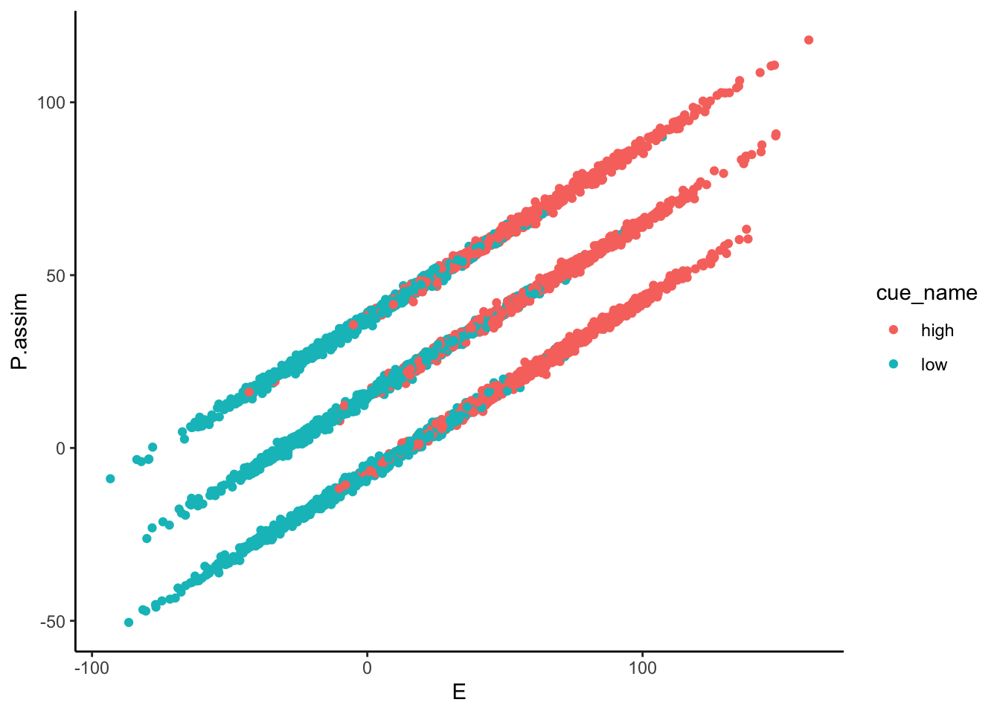

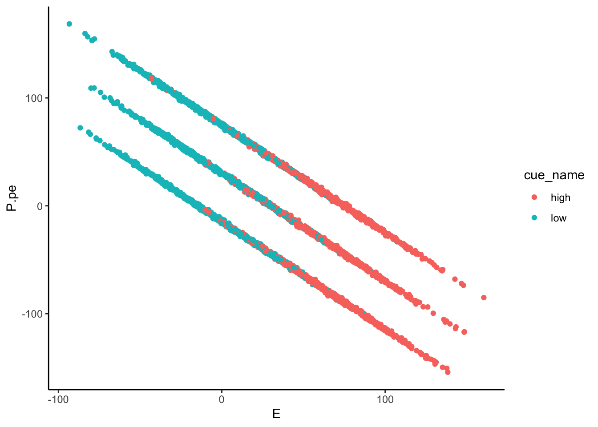
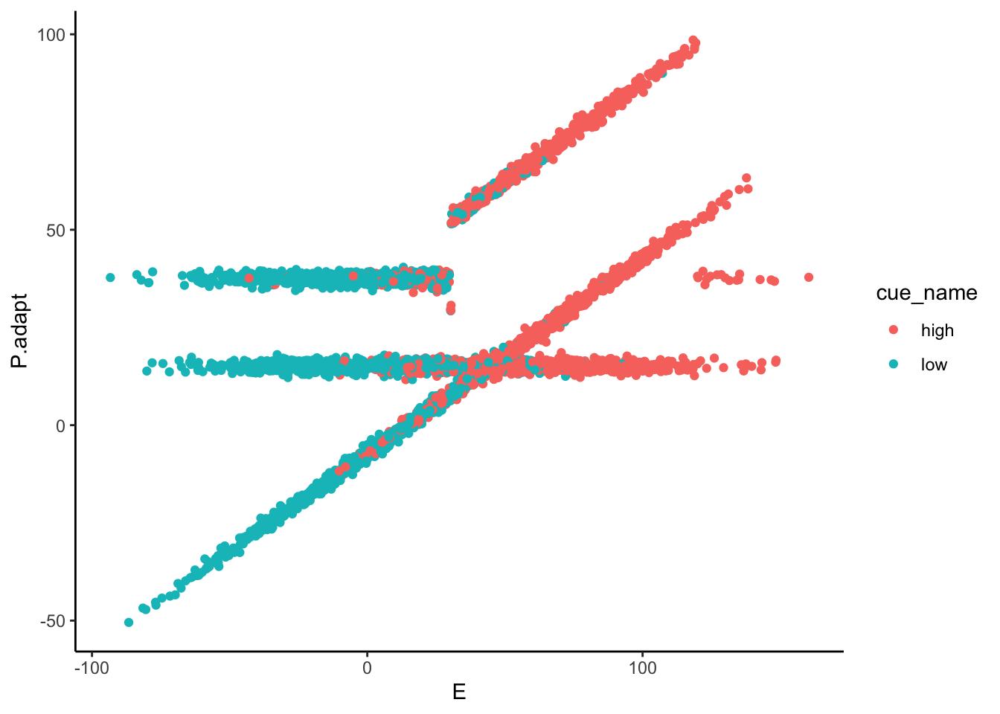

## Lineplots Original {.unlisted .unnumbered}

```
## Automatically converting the following non-factors to factors: cue_name
```

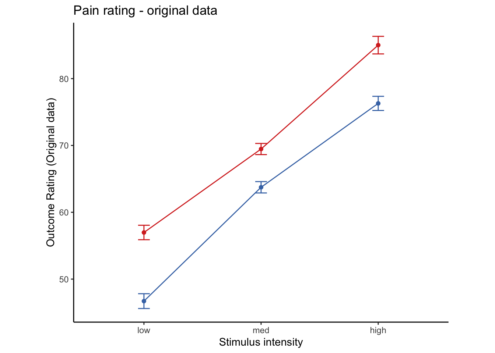


### Lineplots P.assim {.unlisted .unnumbered}

```
## Automatically converting the following non-factors to factors: cue_name
```

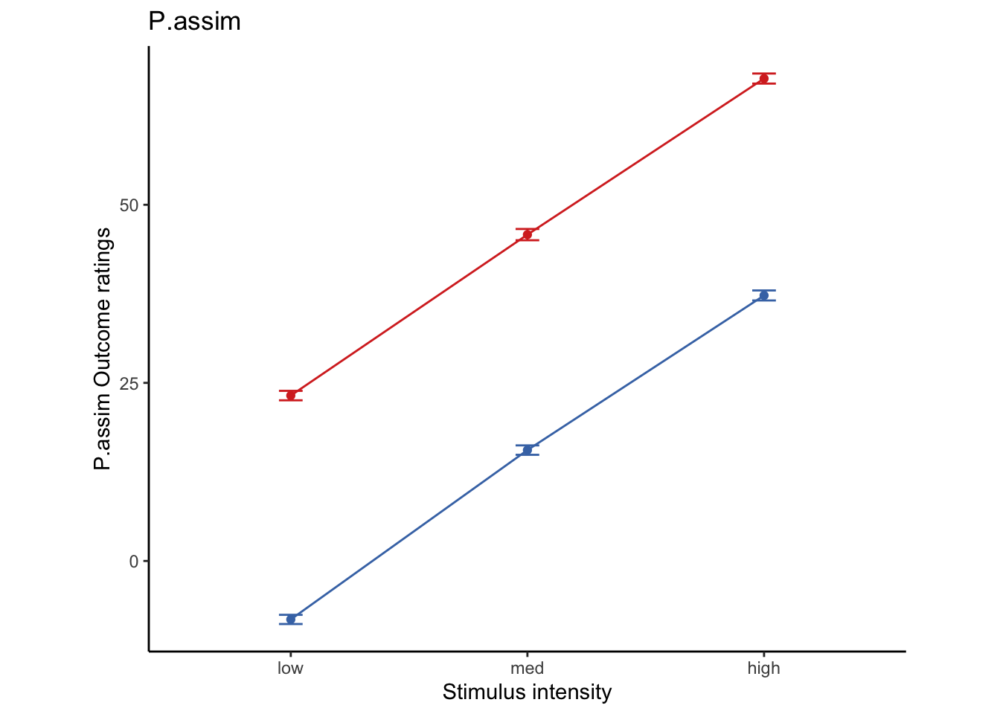
### P.assim ~ demeaned_expect * cue * stim
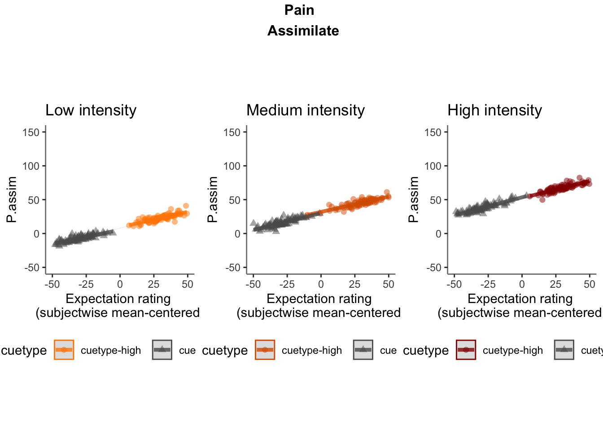

### Lineplots P.pe {.unlisted .unnumbered}

```
## Automatically converting the following non-factors to factors: cue_name
```

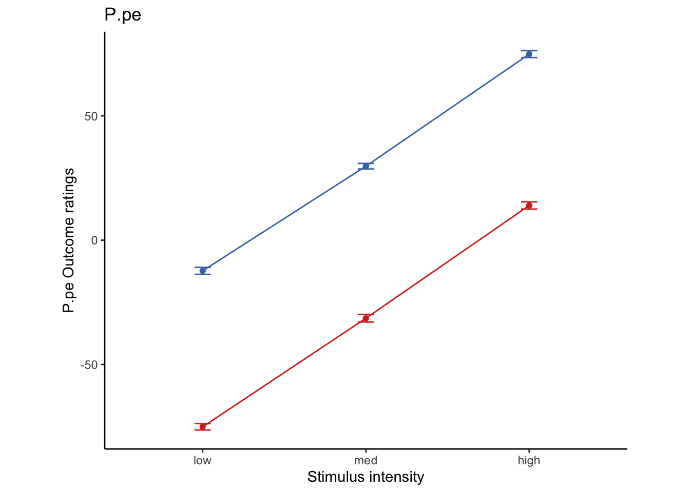

### P.pe ~ demeaned_expect * cue * stim
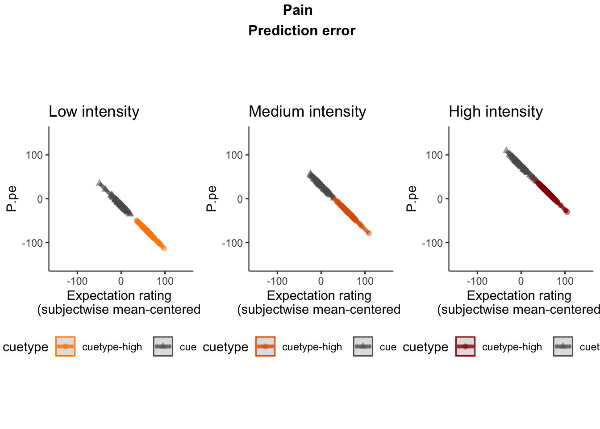


### Lineplots P.adapt {.unlisted .unnumbered}

```
## Automatically converting the following non-factors to factors: cue_name
```

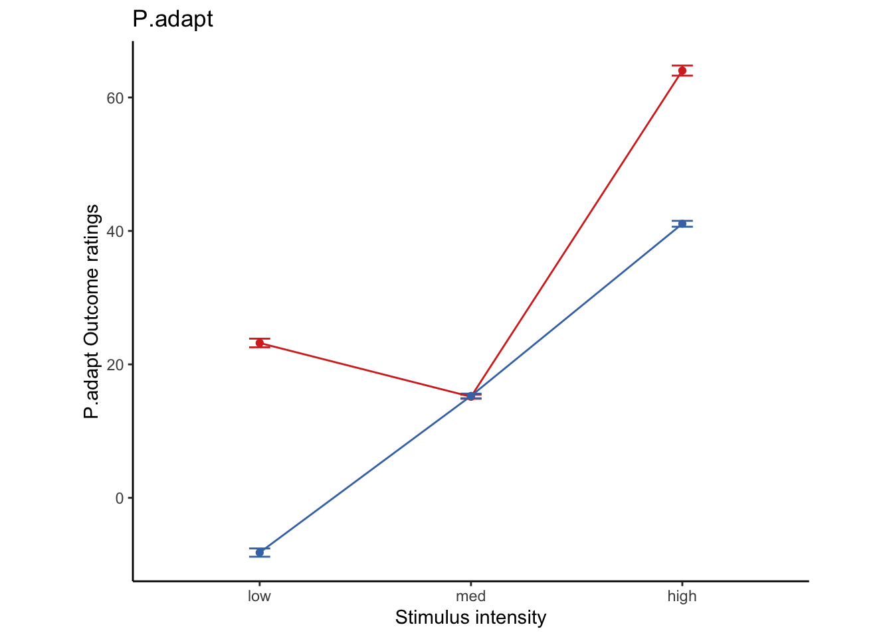


### P.adapt ~ demeaned_expect * cue * stim

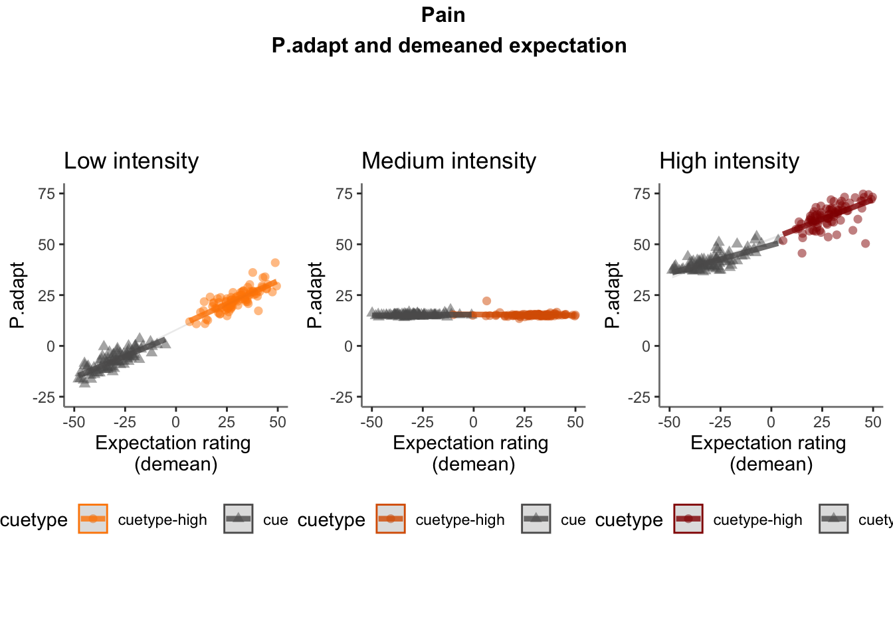
