# [fMRI] NPS ~ singletrial {#ch35_singletrial_P}


## What is the purpose of this notebook? {.unlisted .unnumbered}

* Here, I model NPS dot products as a function of cue, stimulus intensity and expectation ratings. 
* One of the findings is that low cues lead to higher NPS dotproducts in the high intensity group, and that this effect becomes non-significant across sessions. 
* 03/23/2023: For now, I'm grabbing participants that have complete data, i.e. 18 runs, all three sessions. 


## NPS ~ 3 task * 3 stimulus_intensity
### Q. What does the NPS pattern look like for the three tasks? {.unlisted .unnumbered}

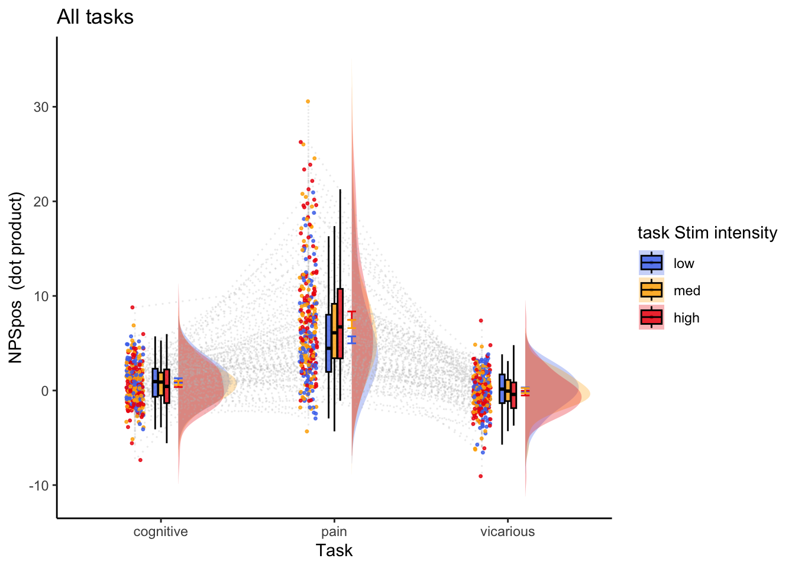


#### Contrast weight table {.unlisted .unnumbered}
<table class="table table-striped" style="font-size: 15px; ">
<caption style="font-size: initial !important;">(\#tab:unnamed-chunk-5)Contrast weights</caption>
 <thead>
  <tr>
   <th style="text-align:left;">   </th>
   <th style="text-align:right;"> pain </th>
   <th style="text-align:right;"> vicarious </th>
   <th style="text-align:right;"> cognitive </th>
  </tr>
 </thead>
<tbody>
  <tr>
   <td style="text-align:left;"> task_V_gt_C </td>
   <td style="text-align:right;"> 0.00 </td>
   <td style="text-align:right;"> 0.50 </td>
   <td style="text-align:right;"> -0.50 </td>
  </tr>
  <tr>
   <td style="text-align:left;"> task_P_gt_VC </td>
   <td style="text-align:right;"> 0.66 </td>
   <td style="text-align:right;"> -0.34 </td>
   <td style="text-align:right;"> -0.34 </td>
  </tr>
</tbody>
</table>


<table style="border-collapse:collapse; border:none;font-size: 12;">
<caption style="font-weight: bold; text-align:left;">Multilevel-modeling: 
lmer(NPSpos ~ task_V_gt_C*STIM + task_P_gt_VC*STIM + (task|sub), data = pvc)</caption>
<tr>
<th style="border-top: double; text-align:center; font-style:italic; font-weight:normal; padding:0.2cm; border-bottom:1px solid black; text-align:left; ">&nbsp;</th>
<th colspan="3" style="border-top: double; text-align:center; font-style:italic; font-weight:normal; padding:0.2cm; border-bottom:1px solid black;">NPSpos</th>
</tr>
<tr>
<td style=" text-align:center; border-bottom:1px solid; font-style:italic; font-weight:normal; border-bottom:1px solid black; text-align:left; ">Predictors</td>
<td style=" text-align:center; border-bottom:1px solid; font-style:italic; font-weight:normal; border-bottom:1px solid black; ">Estimates</td>
<td style=" text-align:center; border-bottom:1px solid; font-style:italic; font-weight:normal; border-bottom:1px solid black; ">CI</td>
<td style=" text-align:center; border-bottom:1px solid; font-style:italic; font-weight:normal; border-bottom:1px solid black; ">p</td>
</tr>
<tr>
<td style=" padding:0.2cm; text-align:left; vertical-align:top; text-align:left; ">(Intercept)</td>
<td style=" padding:0.2cm; text-align:left; vertical-align:top; text-align:center;  ">2.80</td>
<td style=" padding:0.2cm; text-align:left; vertical-align:top; text-align:center;  ">2.38&nbsp;&ndash;&nbsp;3.22</td>
<td style=" padding:0.2cm; text-align:left; vertical-align:top; text-align:center;  "><strong>&lt;0.001</strong></td>
</tr>
<tr>
<td style=" padding:0.2cm; text-align:left; vertical-align:top; text-align:left; ">task V gt C</td>
<td style=" padding:0.2cm; text-align:left; vertical-align:top; text-align:center;  ">&#45;0.86</td>
<td style=" padding:0.2cm; text-align:left; vertical-align:top; text-align:center;  ">&#45;1.36&nbsp;&ndash;&nbsp;-0.36</td>
<td style=" padding:0.2cm; text-align:left; vertical-align:top; text-align:center;  "><strong>0.001</strong></td>
</tr>
<tr>
<td style=" padding:0.2cm; text-align:left; vertical-align:top; text-align:left; ">STIM [low]</td>
<td style=" padding:0.2cm; text-align:left; vertical-align:top; text-align:center;  ">&#45;0.56</td>
<td style=" padding:0.2cm; text-align:left; vertical-align:top; text-align:center;  ">&#45;0.82&nbsp;&ndash;&nbsp;-0.31</td>
<td style=" padding:0.2cm; text-align:left; vertical-align:top; text-align:center;  "><strong>&lt;0.001</strong></td>
</tr>
<tr>
<td style=" padding:0.2cm; text-align:left; vertical-align:top; text-align:left; ">STIM [med]</td>
<td style=" padding:0.2cm; text-align:left; vertical-align:top; text-align:center;  ">&#45;0.18</td>
<td style=" padding:0.2cm; text-align:left; vertical-align:top; text-align:center;  ">&#45;0.43&nbsp;&ndash;&nbsp;0.07</td>
<td style=" padding:0.2cm; text-align:left; vertical-align:top; text-align:center;  ">0.168</td>
</tr>
<tr>
<td style=" padding:0.2cm; text-align:left; vertical-align:top; text-align:left; ">task P gt VC</td>
<td style=" padding:0.2cm; text-align:left; vertical-align:top; text-align:center;  ">7.86</td>
<td style=" padding:0.2cm; text-align:left; vertical-align:top; text-align:center;  ">6.75&nbsp;&ndash;&nbsp;8.96</td>
<td style=" padding:0.2cm; text-align:left; vertical-align:top; text-align:center;  "><strong>&lt;0.001</strong></td>
</tr>
<tr>
<td style=" padding:0.2cm; text-align:left; vertical-align:top; text-align:left; ">task V gt C * STIM [low]</td>
<td style=" padding:0.2cm; text-align:left; vertical-align:top; text-align:center;  ">0.03</td>
<td style=" padding:0.2cm; text-align:left; vertical-align:top; text-align:center;  ">&#45;0.58&nbsp;&ndash;&nbsp;0.64</td>
<td style=" padding:0.2cm; text-align:left; vertical-align:top; text-align:center;  ">0.918</td>
</tr>
<tr>
<td style=" padding:0.2cm; text-align:left; vertical-align:top; text-align:left; ">task V gt C * STIM [med]</td>
<td style=" padding:0.2cm; text-align:left; vertical-align:top; text-align:center;  ">0.03</td>
<td style=" padding:0.2cm; text-align:left; vertical-align:top; text-align:center;  ">&#45;0.58&nbsp;&ndash;&nbsp;0.64</td>
<td style=" padding:0.2cm; text-align:left; vertical-align:top; text-align:center;  ">0.926</td>
</tr>
<tr>
<td style=" padding:0.2cm; text-align:left; vertical-align:top; text-align:left; ">STIM [low] * task P gt VC</td>
<td style=" padding:0.2cm; text-align:left; vertical-align:top; text-align:center;  ">&#45;2.75</td>
<td style=" padding:0.2cm; text-align:left; vertical-align:top; text-align:center;  ">&#45;3.29&nbsp;&ndash;&nbsp;-2.20</td>
<td style=" padding:0.2cm; text-align:left; vertical-align:top; text-align:center;  "><strong>&lt;0.001</strong></td>
</tr>
<tr>
<td style=" padding:0.2cm; text-align:left; vertical-align:top; text-align:left; ">STIM [med] * task P gt VC</td>
<td style=" padding:0.2cm; text-align:left; vertical-align:top; text-align:center;  ">&#45;1.17</td>
<td style=" padding:0.2cm; text-align:left; vertical-align:top; text-align:center;  ">&#45;1.71&nbsp;&ndash;&nbsp;-0.62</td>
<td style=" padding:0.2cm; text-align:left; vertical-align:top; text-align:center;  "><strong>&lt;0.001</strong></td>
</tr>
<tr>
<td colspan="4" style="font-weight:bold; text-align:left; padding-top:.8em;">Random Effects</td>
</tr>

<tr>
<td style=" padding:0.2cm; text-align:left; vertical-align:top; text-align:left; padding-top:0.1cm; padding-bottom:0.1cm;">&sigma;<sup>2</sup></td>
<td style=" padding:0.2cm; text-align:left; vertical-align:top; padding-top:0.1cm; padding-bottom:0.1cm; text-align:center;" colspan="3">53.62</td>
</tr>

<tr>
<td style=" padding:0.2cm; text-align:left; vertical-align:top; text-align:left; padding-top:0.1cm; padding-bottom:0.1cm;">&tau;<sub>00</sub> <sub>sub</sub></td>
<td style=" padding:0.2cm; text-align:left; vertical-align:top; padding-top:0.1cm; padding-bottom:0.1cm; text-align:center;" colspan="3">2.40</td>

<tr>
<td style=" padding:0.2cm; text-align:left; vertical-align:top; text-align:left; padding-top:0.1cm; padding-bottom:0.1cm;">&tau;<sub>11</sub> <sub>sub.taskpain</sub></td>
<td style=" padding:0.2cm; text-align:left; vertical-align:top; padding-top:0.1cm; padding-bottom:0.1cm; text-align:center;" colspan="3">30.06</td>

<tr>
<td style=" padding:0.2cm; text-align:left; vertical-align:top; text-align:left; padding-top:0.1cm; padding-bottom:0.1cm;">&tau;<sub>11</sub> <sub>sub.taskvicarious</sub></td>
<td style=" padding:0.2cm; text-align:left; vertical-align:top; padding-top:0.1cm; padding-bottom:0.1cm; text-align:center;" colspan="3">1.69</td>

<tr>
<td style=" padding:0.2cm; text-align:left; vertical-align:top; text-align:left; padding-top:0.1cm; padding-bottom:0.1cm;">&rho;<sub>01</sub></td>
<td style=" padding:0.2cm; text-align:left; vertical-align:top; padding-top:0.1cm; padding-bottom:0.1cm; text-align:center;" colspan="3">-0.21</td>

<tr>
<td style=" padding:0.2cm; text-align:left; vertical-align:top; text-align:left; padding-top:0.1cm; padding-bottom:0.1cm;"></td>
<td style=" padding:0.2cm; text-align:left; vertical-align:top; padding-top:0.1cm; padding-bottom:0.1cm; text-align:center;" colspan="3">-0.62</td>

<tr>
<td style=" padding:0.2cm; text-align:left; vertical-align:top; text-align:left; padding-top:0.1cm; padding-bottom:0.1cm;">ICC</td>
<td style=" padding:0.2cm; text-align:left; vertical-align:top; padding-top:0.1cm; padding-bottom:0.1cm; text-align:center;" colspan="3">0.04</td>

<tr>
<td style=" padding:0.2cm; text-align:left; vertical-align:top; text-align:left; padding-top:0.1cm; padding-bottom:0.1cm;">N <sub>sub</sub></td>
<td style=" padding:0.2cm; text-align:left; vertical-align:top; padding-top:0.1cm; padding-bottom:0.1cm; text-align:center;" colspan="3">111</td>
<tr>
<td style=" padding:0.2cm; text-align:left; vertical-align:top; text-align:left; padding-top:0.1cm; padding-bottom:0.1cm; border-top:1px solid;">Observations</td>
<td style=" padding:0.2cm; text-align:left; vertical-align:top; padding-top:0.1cm; padding-bottom:0.1cm; text-align:center; border-top:1px solid;" colspan="3">19428</td>
</tr>
<tr>
<td style=" padding:0.2cm; text-align:left; vertical-align:top; text-align:left; padding-top:0.1cm; padding-bottom:0.1cm;">Marginal R<sup>2</sup> / Conditional R<sup>2</sup></td>
<td style=" padding:0.2cm; text-align:left; vertical-align:top; padding-top:0.1cm; padding-bottom:0.1cm; text-align:center;" colspan="3">0.147 / 0.183</td>
</tr>

</table>

#### Eta squared  {.unlisted .unnumbered}
<table class="table table-striped" style="font-size: 12px; ">
 <thead>
  <tr>
   <th style="text-align:left;"> Parameter </th>
   <th style="text-align:right;"> Eta2_partial </th>
   <th style="text-align:right;"> CI </th>
   <th style="text-align:right;"> CI_low </th>
   <th style="text-align:right;"> CI_high </th>
  </tr>
 </thead>
<tbody>
  <tr>
   <td style="text-align:left;"> task_V_gt_C </td>
   <td style="text-align:right;"> 0.1751578 </td>
   <td style="text-align:right;"> 0.95 </td>
   <td style="text-align:right;"> 0.0774378 </td>
   <td style="text-align:right;"> 1 </td>
  </tr>
  <tr>
   <td style="text-align:left;"> STIM </td>
   <td style="text-align:right;"> 0.0010482 </td>
   <td style="text-align:right;"> 0.95 </td>
   <td style="text-align:right;"> 0.0003778 </td>
   <td style="text-align:right;"> 1 </td>
  </tr>
  <tr>
   <td style="text-align:left;"> task_P_gt_VC </td>
   <td style="text-align:right;"> 0.5790305 </td>
   <td style="text-align:right;"> 0.95 </td>
   <td style="text-align:right;"> 0.4818733 </td>
   <td style="text-align:right;"> 1 </td>
  </tr>
  <tr>
   <td style="text-align:left;"> task_V_gt_C:STIM </td>
   <td style="text-align:right;"> 0.0000007 </td>
   <td style="text-align:right;"> 0.95 </td>
   <td style="text-align:right;"> 0.0000000 </td>
   <td style="text-align:right;"> 1 </td>
  </tr>
  <tr>
   <td style="text-align:left;"> STIM:task_P_gt_VC </td>
   <td style="text-align:right;"> 0.0051178 </td>
   <td style="text-align:right;"> 0.95 </td>
   <td style="text-align:right;"> 0.0035162 </td>
   <td style="text-align:right;"> 1 </td>
  </tr>
</tbody>
</table>


#### Cohen's d   {.unlisted .unnumbered}
<table class="table table-striped" style="font-size: 12px; ">
 <thead>
  <tr>
   <th style="text-align:left;">   </th>
   <th style="text-align:right;"> t </th>
   <th style="text-align:right;"> df </th>
   <th style="text-align:right;"> d </th>
  </tr>
 </thead>
<tbody>
  <tr>
   <td style="text-align:left;"> task_V_gt_C </td>
   <td style="text-align:right;"> -3.3999806 </td>
   <td style="text-align:right;"> 409.2144 </td>
   <td style="text-align:right;"> -0.3361483 </td>
  </tr>
  <tr>
   <td style="text-align:left;"> STIMlow </td>
   <td style="text-align:right;"> -4.3779053 </td>
   <td style="text-align:right;"> 19097.0393 </td>
   <td style="text-align:right;"> -0.0633597 </td>
  </tr>
  <tr>
   <td style="text-align:left;"> STIMmed </td>
   <td style="text-align:right;"> -1.3797123 </td>
   <td style="text-align:right;"> 19097.0393 </td>
   <td style="text-align:right;"> -0.0199680 </td>
  </tr>
  <tr>
   <td style="text-align:left;"> task_P_gt_VC </td>
   <td style="text-align:right;"> 13.9522425 </td>
   <td style="text-align:right;"> 126.9874 </td>
   <td style="text-align:right;"> 2.4762455 </td>
  </tr>
  <tr>
   <td style="text-align:left;"> task_V_gt_C:STIMlow </td>
   <td style="text-align:right;"> 0.1034714 </td>
   <td style="text-align:right;"> 19097.0393 </td>
   <td style="text-align:right;"> 0.0014975 </td>
  </tr>
  <tr>
   <td style="text-align:left;"> task_V_gt_C:STIMmed </td>
   <td style="text-align:right;"> 0.0933040 </td>
   <td style="text-align:right;"> 19097.0393 </td>
   <td style="text-align:right;"> 0.0013504 </td>
  </tr>
  <tr>
   <td style="text-align:left;"> STIMlow:task_P_gt_VC </td>
   <td style="text-align:right;"> -9.8736649 </td>
   <td style="text-align:right;"> 19097.0393 </td>
   <td style="text-align:right;"> -0.1428977 </td>
  </tr>
  <tr>
   <td style="text-align:left;"> STIMmed:task_P_gt_VC </td>
   <td style="text-align:right;"> -4.1879665 </td>
   <td style="text-align:right;"> 19097.0393 </td>
   <td style="text-align:right;"> -0.0606108 </td>
  </tr>
</tbody>
</table>


---

## NPS ~ paintask: 2 cue x 3 stimulus_intensity

### Q. Within pain task, Does stimulus intenisty level and cue level significantly predict NPS dotproducts? {.unlisted .unnumbered}
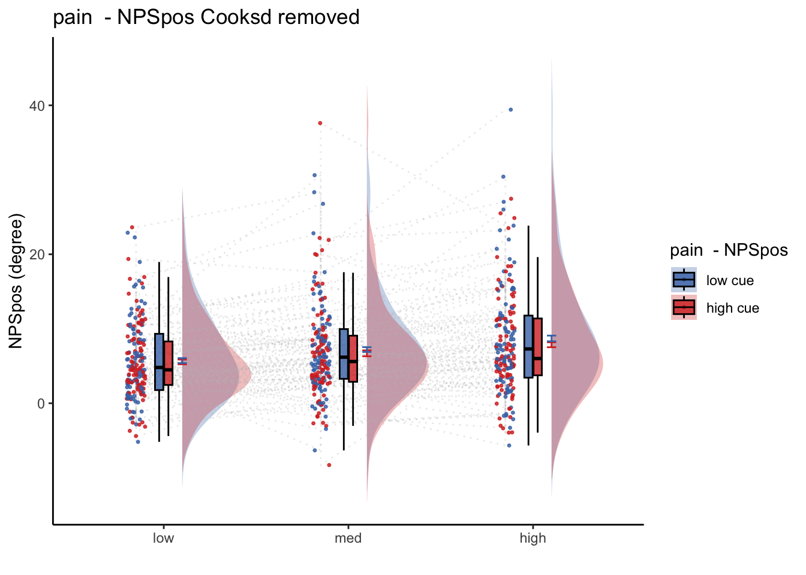


### Lineplots {.unlisted .unnumbered}
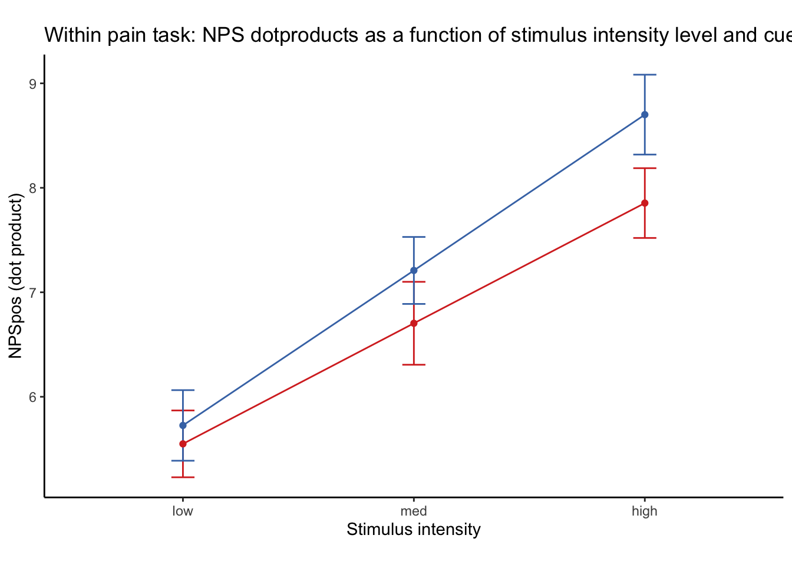


### Linear model results (NPS ~ paintask: 2 cue x 3 stimulus_intensity)

```r
model.npscuestim <- lmer(NPSpos ~ 
                          CUE_high_gt_low*STIM_linear +CUE_high_gt_low * STIM_quadratic +
                          (CUE_high_gt_low+STIM|sub), data = data_screen
                    )
sjPlot::tab_model(model.npscuestim,
                  title = "Multilevel-modeling: \nlmer(NPSpos ~ CUE * STIM + (CUE + STIM | sub), data = pvc)",
                  CSS = list(css.table = '+font-size: 12;'))
```

<table style="border-collapse:collapse; border:none;font-size: 12;">
<caption style="font-weight: bold; text-align:left;">Multilevel-modeling: 
lmer(NPSpos ~ CUE * STIM + (CUE + STIM | sub), data = pvc)</caption>
<tr>
<th style="border-top: double; text-align:center; font-style:italic; font-weight:normal; padding:0.2cm; border-bottom:1px solid black; text-align:left; ">&nbsp;</th>
<th colspan="3" style="border-top: double; text-align:center; font-style:italic; font-weight:normal; padding:0.2cm; border-bottom:1px solid black;">NPSpos</th>
</tr>
<tr>
<td style=" text-align:center; border-bottom:1px solid; font-style:italic; font-weight:normal; border-bottom:1px solid black; text-align:left; ">Predictors</td>
<td style=" text-align:center; border-bottom:1px solid; font-style:italic; font-weight:normal; border-bottom:1px solid black; ">Estimates</td>
<td style=" text-align:center; border-bottom:1px solid; font-style:italic; font-weight:normal; border-bottom:1px solid black; ">CI</td>
<td style=" text-align:center; border-bottom:1px solid; font-style:italic; font-weight:normal; border-bottom:1px solid black; ">p</td>
</tr>
<tr>
<td style=" padding:0.2cm; text-align:left; vertical-align:top; text-align:left; ">(Intercept)</td>
<td style=" padding:0.2cm; text-align:left; vertical-align:top; text-align:center;  ">6.91</td>
<td style=" padding:0.2cm; text-align:left; vertical-align:top; text-align:center;  ">5.79&nbsp;&ndash;&nbsp;8.02</td>
<td style=" padding:0.2cm; text-align:left; vertical-align:top; text-align:center;  "><strong>&lt;0.001</strong></td>
</tr>
<tr>
<td style=" padding:0.2cm; text-align:left; vertical-align:top; text-align:left; ">CUE high gt low</td>
<td style=" padding:0.2cm; text-align:left; vertical-align:top; text-align:center;  ">&#45;0.68</td>
<td style=" padding:0.2cm; text-align:left; vertical-align:top; text-align:center;  ">&#45;1.21&nbsp;&ndash;&nbsp;-0.15</td>
<td style=" padding:0.2cm; text-align:left; vertical-align:top; text-align:center;  "><strong>0.012</strong></td>
</tr>
<tr>
<td style=" padding:0.2cm; text-align:left; vertical-align:top; text-align:left; ">STIM linear</td>
<td style=" padding:0.2cm; text-align:left; vertical-align:top; text-align:center;  ">2.61</td>
<td style=" padding:0.2cm; text-align:left; vertical-align:top; text-align:center;  ">1.94&nbsp;&ndash;&nbsp;3.28</td>
<td style=" padding:0.2cm; text-align:left; vertical-align:top; text-align:center;  "><strong>&lt;0.001</strong></td>
</tr>
<tr>
<td style=" padding:0.2cm; text-align:left; vertical-align:top; text-align:left; ">STIM quadratic</td>
<td style=" padding:0.2cm; text-align:left; vertical-align:top; text-align:center;  ">&#45;0.06</td>
<td style=" padding:0.2cm; text-align:left; vertical-align:top; text-align:center;  ">&#45;0.59&nbsp;&ndash;&nbsp;0.47</td>
<td style=" padding:0.2cm; text-align:left; vertical-align:top; text-align:center;  ">0.831</td>
</tr>
<tr>
<td style=" padding:0.2cm; text-align:left; vertical-align:top; text-align:left; ">CUE high gt low * STIM<br>linear</td>
<td style=" padding:0.2cm; text-align:left; vertical-align:top; text-align:center;  ">&#45;0.66</td>
<td style=" padding:0.2cm; text-align:left; vertical-align:top; text-align:center;  ">&#45;1.83&nbsp;&ndash;&nbsp;0.52</td>
<td style=" padding:0.2cm; text-align:left; vertical-align:top; text-align:center;  ">0.276</td>
</tr>
<tr>
<td style=" padding:0.2cm; text-align:left; vertical-align:top; text-align:left; ">CUE high gt low * STIM<br>quadratic</td>
<td style=" padding:0.2cm; text-align:left; vertical-align:top; text-align:center;  ">&#45;0.51</td>
<td style=" padding:0.2cm; text-align:left; vertical-align:top; text-align:center;  ">&#45;1.55&nbsp;&ndash;&nbsp;0.52</td>
<td style=" padding:0.2cm; text-align:left; vertical-align:top; text-align:center;  ">0.332</td>
</tr>
<tr>
<td colspan="4" style="font-weight:bold; text-align:left; padding-top:.8em;">Random Effects</td>
</tr>

<tr>
<td style=" padding:0.2cm; text-align:left; vertical-align:top; text-align:left; padding-top:0.1cm; padding-bottom:0.1cm;">&sigma;<sup>2</sup></td>
<td style=" padding:0.2cm; text-align:left; vertical-align:top; padding-top:0.1cm; padding-bottom:0.1cm; text-align:center;" colspan="3">62.27</td>
</tr>

<tr>
<td style=" padding:0.2cm; text-align:left; vertical-align:top; text-align:left; padding-top:0.1cm; padding-bottom:0.1cm;">&tau;<sub>00</sub> <sub>sub</sub></td>
<td style=" padding:0.2cm; text-align:left; vertical-align:top; padding-top:0.1cm; padding-bottom:0.1cm; text-align:center;" colspan="3">38.74</td>

<tr>
<td style=" padding:0.2cm; text-align:left; vertical-align:top; text-align:left; padding-top:0.1cm; padding-bottom:0.1cm;">&tau;<sub>11</sub> <sub>sub.CUE_high_gt_low</sub></td>
<td style=" padding:0.2cm; text-align:left; vertical-align:top; padding-top:0.1cm; padding-bottom:0.1cm; text-align:center;" colspan="3">1.08</td>

<tr>
<td style=" padding:0.2cm; text-align:left; vertical-align:top; text-align:left; padding-top:0.1cm; padding-bottom:0.1cm;">&tau;<sub>11</sub> <sub>sub.STIMlow</sub></td>
<td style=" padding:0.2cm; text-align:left; vertical-align:top; padding-top:0.1cm; padding-bottom:0.1cm; text-align:center;" colspan="3">2.41</td>

<tr>
<td style=" padding:0.2cm; text-align:left; vertical-align:top; text-align:left; padding-top:0.1cm; padding-bottom:0.1cm;">&tau;<sub>11</sub> <sub>sub.STIMmed</sub></td>
<td style=" padding:0.2cm; text-align:left; vertical-align:top; padding-top:0.1cm; padding-bottom:0.1cm; text-align:center;" colspan="3">1.56</td>

<tr>
<td style=" padding:0.2cm; text-align:left; vertical-align:top; text-align:left; padding-top:0.1cm; padding-bottom:0.1cm;">&rho;<sub>01</sub></td>
<td style=" padding:0.2cm; text-align:left; vertical-align:top; padding-top:0.1cm; padding-bottom:0.1cm; text-align:center;" colspan="3">-0.58</td>

<tr>
<td style=" padding:0.2cm; text-align:left; vertical-align:top; text-align:left; padding-top:0.1cm; padding-bottom:0.1cm;"></td>
<td style=" padding:0.2cm; text-align:left; vertical-align:top; padding-top:0.1cm; padding-bottom:0.1cm; text-align:center;" colspan="3">-0.97</td>

<tr>
<td style=" padding:0.2cm; text-align:left; vertical-align:top; text-align:left; padding-top:0.1cm; padding-bottom:0.1cm;"></td>
<td style=" padding:0.2cm; text-align:left; vertical-align:top; padding-top:0.1cm; padding-bottom:0.1cm; text-align:center;" colspan="3">-0.87</td>

<tr>
<td style=" padding:0.2cm; text-align:left; vertical-align:top; text-align:left; padding-top:0.1cm; padding-bottom:0.1cm;">ICC</td>
<td style=" padding:0.2cm; text-align:left; vertical-align:top; padding-top:0.1cm; padding-bottom:0.1cm; text-align:center;" colspan="3">0.39</td>

<tr>
<td style=" padding:0.2cm; text-align:left; vertical-align:top; text-align:left; padding-top:0.1cm; padding-bottom:0.1cm;">N <sub>sub</sub></td>
<td style=" padding:0.2cm; text-align:left; vertical-align:top; padding-top:0.1cm; padding-bottom:0.1cm; text-align:center;" colspan="3">96</td>
<tr>
<td style=" padding:0.2cm; text-align:left; vertical-align:top; text-align:left; padding-top:0.1cm; padding-bottom:0.1cm; border-top:1px solid;">Observations</td>
<td style=" padding:0.2cm; text-align:left; vertical-align:top; padding-top:0.1cm; padding-bottom:0.1cm; text-align:center; border-top:1px solid;" colspan="3">4133</td>
</tr>
<tr>
<td style=" padding:0.2cm; text-align:left; vertical-align:top; text-align:left; padding-top:0.1cm; padding-bottom:0.1cm;">Marginal R<sup>2</sup> / Conditional R<sup>2</sup></td>
<td style=" padding:0.2cm; text-align:left; vertical-align:top; padding-top:0.1cm; padding-bottom:0.1cm; text-align:center;" colspan="3">0.013 / 0.393</td>
</tr>

</table>

#### Linear model eta-squared {.unlisted .unnumbered}
<table class="table table-striped" style="font-size: 12px; ">
 <thead>
  <tr>
   <th style="text-align:left;"> Parameter </th>
   <th style="text-align:right;"> Eta2_partial </th>
   <th style="text-align:right;"> CI </th>
   <th style="text-align:right;"> CI_low </th>
   <th style="text-align:right;"> CI_high </th>
  </tr>
 </thead>
<tbody>
  <tr>
   <td style="text-align:left;"> CUE_high_gt_low </td>
   <td style="text-align:right;"> 0.0544283 </td>
   <td style="text-align:right;"> 0.95 </td>
   <td style="text-align:right;"> 0.0061692 </td>
   <td style="text-align:right;"> 1 </td>
  </tr>
  <tr>
   <td style="text-align:left;"> STIM_linear </td>
   <td style="text-align:right;"> 0.2573057 </td>
   <td style="text-align:right;"> 0.95 </td>
   <td style="text-align:right;"> 0.1686383 </td>
   <td style="text-align:right;"> 1 </td>
  </tr>
  <tr>
   <td style="text-align:left;"> STIM_quadratic </td>
   <td style="text-align:right;"> 0.0001205 </td>
   <td style="text-align:right;"> 0.95 </td>
   <td style="text-align:right;"> 0.0000000 </td>
   <td style="text-align:right;"> 1 </td>
  </tr>
  <tr>
   <td style="text-align:left;"> CUE_high_gt_low:STIM_linear </td>
   <td style="text-align:right;"> 0.0002992 </td>
   <td style="text-align:right;"> 0.95 </td>
   <td style="text-align:right;"> 0.0000000 </td>
   <td style="text-align:right;"> 1 </td>
  </tr>
  <tr>
   <td style="text-align:left;"> CUE_high_gt_low:STIM_quadratic </td>
   <td style="text-align:right;"> 0.0002370 </td>
   <td style="text-align:right;"> 0.95 </td>
   <td style="text-align:right;"> 0.0000000 </td>
   <td style="text-align:right;"> 1 </td>
  </tr>
</tbody>
</table>

#### Linear model Cohen's d: NPS stimulus_intensity d = 1.16, cue d = 0.45 {.unlisted .unnumbered}
<table class="table table-striped" style="font-size: 12px; ">
 <thead>
  <tr>
   <th style="text-align:left;">   </th>
   <th style="text-align:right;"> t </th>
   <th style="text-align:right;"> df </th>
   <th style="text-align:right;"> d </th>
  </tr>
 </thead>
<tbody>
  <tr>
   <td style="text-align:left;"> CUE_high_gt_low </td>
   <td style="text-align:right;"> -2.5003847 </td>
   <td style="text-align:right;"> 108.6134 </td>
   <td style="text-align:right;"> -0.4798386 </td>
  </tr>
  <tr>
   <td style="text-align:left;"> STIM_linear </td>
   <td style="text-align:right;"> 7.6306084 </td>
   <td style="text-align:right;"> 168.0657 </td>
   <td style="text-align:right;"> 1.1771984 </td>
  </tr>
  <tr>
   <td style="text-align:left;"> STIM_quadratic </td>
   <td style="text-align:right;"> -0.2128945 </td>
   <td style="text-align:right;"> 376.0848 </td>
   <td style="text-align:right;"> -0.0219559 </td>
  </tr>
  <tr>
   <td style="text-align:left;"> CUE_high_gt_low:STIM_linear </td>
   <td style="text-align:right;"> -1.0903230 </td>
   <td style="text-align:right;"> 3971.4439 </td>
   <td style="text-align:right;"> -0.0346028 </td>
  </tr>
  <tr>
   <td style="text-align:left;"> CUE_high_gt_low:STIM_quadratic </td>
   <td style="text-align:right;"> -0.9699227 </td>
   <td style="text-align:right;"> 3968.1934 </td>
   <td style="text-align:right;"> -0.0307943 </td>
  </tr>
</tbody>
</table>


### 2 cue * 3 stimulus_intensity * expectation_rating 

```r
data_screen$EXPECT <- data_screen$event02_expect_angle
model.nps3factor <- lmer(NPSpos ~ 
                          CUE_high_gt_low*STIM_linear*EXPECT +
                           CUE_high_gt_low*STIM_quadratic*EXPECT +
                          (CUE_high_gt_low+STIM + EXPECT|sub), data = data_screen
                    )
```

```
## boundary (singular) fit: see help('isSingular')
```

```r
sjPlot::tab_model(model.nps3factor,
                  title = "Multilevel-modeling: \nlmer(NPSpos ~ CUE * STIM * EXPECTATION + (CUE + STIM + EXPECT | sub), data = pvc)",
                  CSS = list(css.table = '+font-size: 12;'))
```

<table style="border-collapse:collapse; border:none;font-size: 12;">
<caption style="font-weight: bold; text-align:left;">Multilevel-modeling: 
lmer(NPSpos ~ CUE * STIM * EXPECTATION + (CUE + STIM + EXPECT | sub), data = pvc)</caption>
<tr>
<th style="border-top: double; text-align:center; font-style:italic; font-weight:normal; padding:0.2cm; border-bottom:1px solid black; text-align:left; ">&nbsp;</th>
<th colspan="3" style="border-top: double; text-align:center; font-style:italic; font-weight:normal; padding:0.2cm; border-bottom:1px solid black;">NPSpos</th>
</tr>
<tr>
<td style=" text-align:center; border-bottom:1px solid; font-style:italic; font-weight:normal; border-bottom:1px solid black; text-align:left; ">Predictors</td>
<td style=" text-align:center; border-bottom:1px solid; font-style:italic; font-weight:normal; border-bottom:1px solid black; ">Estimates</td>
<td style=" text-align:center; border-bottom:1px solid; font-style:italic; font-weight:normal; border-bottom:1px solid black; ">CI</td>
<td style=" text-align:center; border-bottom:1px solid; font-style:italic; font-weight:normal; border-bottom:1px solid black; ">p</td>
</tr>
<tr>
<td style=" padding:0.2cm; text-align:left; vertical-align:top; text-align:left; ">(Intercept)</td>
<td style=" padding:0.2cm; text-align:left; vertical-align:top; text-align:center;  ">6.51</td>
<td style=" padding:0.2cm; text-align:left; vertical-align:top; text-align:center;  ">5.46&nbsp;&ndash;&nbsp;7.56</td>
<td style=" padding:0.2cm; text-align:left; vertical-align:top; text-align:center;  "><strong>&lt;0.001</strong></td>
</tr>
<tr>
<td style=" padding:0.2cm; text-align:left; vertical-align:top; text-align:left; ">CUE high gt low</td>
<td style=" padding:0.2cm; text-align:left; vertical-align:top; text-align:center;  ">&#45;0.61</td>
<td style=" padding:0.2cm; text-align:left; vertical-align:top; text-align:center;  ">&#45;1.81&nbsp;&ndash;&nbsp;0.59</td>
<td style=" padding:0.2cm; text-align:left; vertical-align:top; text-align:center;  ">0.320</td>
</tr>
<tr>
<td style=" padding:0.2cm; text-align:left; vertical-align:top; text-align:left; ">STIM linear</td>
<td style=" padding:0.2cm; text-align:left; vertical-align:top; text-align:center;  ">1.66</td>
<td style=" padding:0.2cm; text-align:left; vertical-align:top; text-align:center;  ">0.36&nbsp;&ndash;&nbsp;2.96</td>
<td style=" padding:0.2cm; text-align:left; vertical-align:top; text-align:center;  "><strong>0.013</strong></td>
</tr>
<tr>
<td style=" padding:0.2cm; text-align:left; vertical-align:top; text-align:left; ">EXPECT</td>
<td style=" padding:0.2cm; text-align:left; vertical-align:top; text-align:center;  ">0.00</td>
<td style=" padding:0.2cm; text-align:left; vertical-align:top; text-align:center;  ">&#45;0.01&nbsp;&ndash;&nbsp;0.02</td>
<td style=" padding:0.2cm; text-align:left; vertical-align:top; text-align:center;  ">0.642</td>
</tr>
<tr>
<td style=" padding:0.2cm; text-align:left; vertical-align:top; text-align:left; ">STIM quadratic</td>
<td style=" padding:0.2cm; text-align:left; vertical-align:top; text-align:center;  ">0.57</td>
<td style=" padding:0.2cm; text-align:left; vertical-align:top; text-align:center;  ">&#45;0.54&nbsp;&ndash;&nbsp;1.67</td>
<td style=" padding:0.2cm; text-align:left; vertical-align:top; text-align:center;  ">0.314</td>
</tr>
<tr>
<td style=" padding:0.2cm; text-align:left; vertical-align:top; text-align:left; ">CUE high gt low * STIM<br>linear</td>
<td style=" padding:0.2cm; text-align:left; vertical-align:top; text-align:center;  ">&#45;2.16</td>
<td style=" padding:0.2cm; text-align:left; vertical-align:top; text-align:center;  ">&#45;4.63&nbsp;&ndash;&nbsp;0.31</td>
<td style=" padding:0.2cm; text-align:left; vertical-align:top; text-align:center;  ">0.086</td>
</tr>
<tr>
<td style=" padding:0.2cm; text-align:left; vertical-align:top; text-align:left; ">CUE high gt low * EXPECT</td>
<td style=" padding:0.2cm; text-align:left; vertical-align:top; text-align:center;  ">&#45;0.00</td>
<td style=" padding:0.2cm; text-align:left; vertical-align:top; text-align:center;  ">&#45;0.02&nbsp;&ndash;&nbsp;0.01</td>
<td style=" padding:0.2cm; text-align:left; vertical-align:top; text-align:center;  ">0.793</td>
</tr>
<tr>
<td style=" padding:0.2cm; text-align:left; vertical-align:top; text-align:left; ">STIM linear * EXPECT</td>
<td style=" padding:0.2cm; text-align:left; vertical-align:top; text-align:center;  ">0.01</td>
<td style=" padding:0.2cm; text-align:left; vertical-align:top; text-align:center;  ">&#45;0.00&nbsp;&ndash;&nbsp;0.03</td>
<td style=" padding:0.2cm; text-align:left; vertical-align:top; text-align:center;  ">0.153</td>
</tr>
<tr>
<td style=" padding:0.2cm; text-align:left; vertical-align:top; text-align:left; ">CUE high gt low * STIM<br>quadratic</td>
<td style=" padding:0.2cm; text-align:left; vertical-align:top; text-align:center;  ">&#45;1.38</td>
<td style=" padding:0.2cm; text-align:left; vertical-align:top; text-align:center;  ">&#45;3.55&nbsp;&ndash;&nbsp;0.78</td>
<td style=" padding:0.2cm; text-align:left; vertical-align:top; text-align:center;  ">0.211</td>
</tr>
<tr>
<td style=" padding:0.2cm; text-align:left; vertical-align:top; text-align:left; ">EXPECT * STIM quadratic</td>
<td style=" padding:0.2cm; text-align:left; vertical-align:top; text-align:center;  ">&#45;0.01</td>
<td style=" padding:0.2cm; text-align:left; vertical-align:top; text-align:center;  ">&#45;0.03&nbsp;&ndash;&nbsp;0.00</td>
<td style=" padding:0.2cm; text-align:left; vertical-align:top; text-align:center;  ">0.125</td>
</tr>
<tr>
<td style=" padding:0.2cm; text-align:left; vertical-align:top; text-align:left; ">(CUE high gt low * STIM<br>linear) * EXPECT</td>
<td style=" padding:0.2cm; text-align:left; vertical-align:top; text-align:center;  ">0.01</td>
<td style=" padding:0.2cm; text-align:left; vertical-align:top; text-align:center;  ">&#45;0.02&nbsp;&ndash;&nbsp;0.05</td>
<td style=" padding:0.2cm; text-align:left; vertical-align:top; text-align:center;  ">0.400</td>
</tr>
<tr>
<td style=" padding:0.2cm; text-align:left; vertical-align:top; text-align:left; ">(CUE high gt low *<br>EXPECT) * STIM quadratic</td>
<td style=" padding:0.2cm; text-align:left; vertical-align:top; text-align:center;  ">0.02</td>
<td style=" padding:0.2cm; text-align:left; vertical-align:top; text-align:center;  ">&#45;0.01&nbsp;&ndash;&nbsp;0.05</td>
<td style=" padding:0.2cm; text-align:left; vertical-align:top; text-align:center;  ">0.204</td>
</tr>
<tr>
<td colspan="4" style="font-weight:bold; text-align:left; padding-top:.8em;">Random Effects</td>
</tr>

<tr>
<td style=" padding:0.2cm; text-align:left; vertical-align:top; text-align:left; padding-top:0.1cm; padding-bottom:0.1cm;">&sigma;<sup>2</sup></td>
<td style=" padding:0.2cm; text-align:left; vertical-align:top; padding-top:0.1cm; padding-bottom:0.1cm; text-align:center;" colspan="3">61.68</td>
</tr>

<tr>
<td style=" padding:0.2cm; text-align:left; vertical-align:top; text-align:left; padding-top:0.1cm; padding-bottom:0.1cm;">&tau;<sub>00</sub> <sub>sub</sub></td>
<td style=" padding:0.2cm; text-align:left; vertical-align:top; padding-top:0.1cm; padding-bottom:0.1cm; text-align:center;" colspan="3">18.78</td>

<tr>
<td style=" padding:0.2cm; text-align:left; vertical-align:top; text-align:left; padding-top:0.1cm; padding-bottom:0.1cm;">&tau;<sub>11</sub> <sub>sub.CUE_high_gt_low</sub></td>
<td style=" padding:0.2cm; text-align:left; vertical-align:top; padding-top:0.1cm; padding-bottom:0.1cm; text-align:center;" colspan="3">4.00</td>

<tr>
<td style=" padding:0.2cm; text-align:left; vertical-align:top; text-align:left; padding-top:0.1cm; padding-bottom:0.1cm;">&tau;<sub>11</sub> <sub>sub.STIMlow</sub></td>
<td style=" padding:0.2cm; text-align:left; vertical-align:top; padding-top:0.1cm; padding-bottom:0.1cm; text-align:center;" colspan="3">2.68</td>

<tr>
<td style=" padding:0.2cm; text-align:left; vertical-align:top; text-align:left; padding-top:0.1cm; padding-bottom:0.1cm;">&tau;<sub>11</sub> <sub>sub.STIMmed</sub></td>
<td style=" padding:0.2cm; text-align:left; vertical-align:top; padding-top:0.1cm; padding-bottom:0.1cm; text-align:center;" colspan="3">1.69</td>

<tr>
<td style=" padding:0.2cm; text-align:left; vertical-align:top; text-align:left; padding-top:0.1cm; padding-bottom:0.1cm;">&tau;<sub>11</sub> <sub>sub.EXPECT</sub></td>
<td style=" padding:0.2cm; text-align:left; vertical-align:top; padding-top:0.1cm; padding-bottom:0.1cm; text-align:center;" colspan="3">0.00</td>

<tr>
<td style=" padding:0.2cm; text-align:left; vertical-align:top; text-align:left; padding-top:0.1cm; padding-bottom:0.1cm;">&rho;<sub>01</sub></td>
<td style=" padding:0.2cm; text-align:left; vertical-align:top; padding-top:0.1cm; padding-bottom:0.1cm; text-align:center;" colspan="3">-0.82</td>

<tr>
<td style=" padding:0.2cm; text-align:left; vertical-align:top; text-align:left; padding-top:0.1cm; padding-bottom:0.1cm;"></td>
<td style=" padding:0.2cm; text-align:left; vertical-align:top; padding-top:0.1cm; padding-bottom:0.1cm; text-align:center;" colspan="3">-0.82</td>

<tr>
<td style=" padding:0.2cm; text-align:left; vertical-align:top; text-align:left; padding-top:0.1cm; padding-bottom:0.1cm;"></td>
<td style=" padding:0.2cm; text-align:left; vertical-align:top; padding-top:0.1cm; padding-bottom:0.1cm; text-align:center;" colspan="3">-0.54</td>

<tr>
<td style=" padding:0.2cm; text-align:left; vertical-align:top; text-align:left; padding-top:0.1cm; padding-bottom:0.1cm;"></td>
<td style=" padding:0.2cm; text-align:left; vertical-align:top; padding-top:0.1cm; padding-bottom:0.1cm; text-align:center;" colspan="3">0.78</td>

<tr>
<td style=" padding:0.2cm; text-align:left; vertical-align:top; text-align:left; padding-top:0.1cm; padding-bottom:0.1cm;">N <sub>sub</sub></td>
<td style=" padding:0.2cm; text-align:left; vertical-align:top; padding-top:0.1cm; padding-bottom:0.1cm; text-align:center;" colspan="3">96</td>
<tr>
<td style=" padding:0.2cm; text-align:left; vertical-align:top; text-align:left; padding-top:0.1cm; padding-bottom:0.1cm; border-top:1px solid;">Observations</td>
<td style=" padding:0.2cm; text-align:left; vertical-align:top; padding-top:0.1cm; padding-bottom:0.1cm; text-align:center; border-top:1px solid;" colspan="3">3991</td>
</tr>
<tr>
<td style=" padding:0.2cm; text-align:left; vertical-align:top; text-align:left; padding-top:0.1cm; padding-bottom:0.1cm;">Marginal R<sup>2</sup> / Conditional R<sup>2</sup></td>
<td style=" padding:0.2cm; text-align:left; vertical-align:top; padding-top:0.1cm; padding-bottom:0.1cm; text-align:center;" colspan="3">0.022 / NA</td>
</tr>

</table>

#### eta squared {.unlisted .unnumbered}
<table class="table table-striped" style="font-size: 12px; ">
 <thead>
  <tr>
   <th style="text-align:left;"> Parameter </th>
   <th style="text-align:right;"> Eta2_partial </th>
   <th style="text-align:right;"> CI </th>
   <th style="text-align:right;"> CI_low </th>
   <th style="text-align:right;"> CI_high </th>
  </tr>
 </thead>
<tbody>
  <tr>
   <td style="text-align:left;"> CUE_high_gt_low </td>
   <td style="text-align:right;"> 0.0048614 </td>
   <td style="text-align:right;"> 0.95 </td>
   <td style="text-align:right;"> 0.0000000 </td>
   <td style="text-align:right;"> 1 </td>
  </tr>
  <tr>
   <td style="text-align:left;"> STIM_linear </td>
   <td style="text-align:right;"> 0.0163037 </td>
   <td style="text-align:right;"> 0.95 </td>
   <td style="text-align:right;"> 0.0018659 </td>
   <td style="text-align:right;"> 1 </td>
  </tr>
  <tr>
   <td style="text-align:left;"> EXPECT </td>
   <td style="text-align:right;"> 0.0038038 </td>
   <td style="text-align:right;"> 0.95 </td>
   <td style="text-align:right;"> 0.0000000 </td>
   <td style="text-align:right;"> 1 </td>
  </tr>
  <tr>
   <td style="text-align:left;"> STIM_quadratic </td>
   <td style="text-align:right;"> 0.0016055 </td>
   <td style="text-align:right;"> 0.95 </td>
   <td style="text-align:right;"> 0.0000000 </td>
   <td style="text-align:right;"> 1 </td>
  </tr>
  <tr>
   <td style="text-align:left;"> CUE_high_gt_low:STIM_linear </td>
   <td style="text-align:right;"> 0.0008638 </td>
   <td style="text-align:right;"> 0.95 </td>
   <td style="text-align:right;"> 0.0000000 </td>
   <td style="text-align:right;"> 1 </td>
  </tr>
  <tr>
   <td style="text-align:left;"> CUE_high_gt_low:EXPECT </td>
   <td style="text-align:right;"> 0.0002676 </td>
   <td style="text-align:right;"> 0.95 </td>
   <td style="text-align:right;"> 0.0000000 </td>
   <td style="text-align:right;"> 1 </td>
  </tr>
  <tr>
   <td style="text-align:left;"> STIM_linear:EXPECT </td>
   <td style="text-align:right;"> 0.0037328 </td>
   <td style="text-align:right;"> 0.95 </td>
   <td style="text-align:right;"> 0.0000000 </td>
   <td style="text-align:right;"> 1 </td>
  </tr>
  <tr>
   <td style="text-align:left;"> CUE_high_gt_low:STIM_quadratic </td>
   <td style="text-align:right;"> 0.0004397 </td>
   <td style="text-align:right;"> 0.95 </td>
   <td style="text-align:right;"> 0.0000000 </td>
   <td style="text-align:right;"> 1 </td>
  </tr>
  <tr>
   <td style="text-align:left;"> EXPECT:STIM_quadratic </td>
   <td style="text-align:right;"> 0.0030427 </td>
   <td style="text-align:right;"> 0.95 </td>
   <td style="text-align:right;"> 0.0000000 </td>
   <td style="text-align:right;"> 1 </td>
  </tr>
  <tr>
   <td style="text-align:left;"> CUE_high_gt_low:STIM_linear:EXPECT </td>
   <td style="text-align:right;"> 0.0001945 </td>
   <td style="text-align:right;"> 0.95 </td>
   <td style="text-align:right;"> 0.0000000 </td>
   <td style="text-align:right;"> 1 </td>
  </tr>
  <tr>
   <td style="text-align:left;"> CUE_high_gt_low:EXPECT:STIM_quadratic </td>
   <td style="text-align:right;"> 0.0004337 </td>
   <td style="text-align:right;"> 0.95 </td>
   <td style="text-align:right;"> 0.0000000 </td>
   <td style="text-align:right;"> 1 </td>
  </tr>
</tbody>
</table>

#### Cohen's d {.unlisted .unnumbered}

```
## boundary (singular) fit: see help('isSingular')
```

<table class="table table-striped" style="font-size: 12px; ">
 <thead>
  <tr>
   <th style="text-align:left;">   </th>
   <th style="text-align:right;"> t </th>
   <th style="text-align:right;"> df </th>
   <th style="text-align:right;"> d </th>
  </tr>
 </thead>
<tbody>
  <tr>
   <td style="text-align:left;"> CUE_high_gt_low </td>
   <td style="text-align:right;"> -0.9950365 </td>
   <td style="text-align:right;"> 202.6738 </td>
   <td style="text-align:right;"> -0.1397881 </td>
  </tr>
  <tr>
   <td style="text-align:left;"> STIM_linear </td>
   <td style="text-align:right;"> 2.4959685 </td>
   <td style="text-align:right;"> 375.8842 </td>
   <td style="text-align:right;"> 0.2574791 </td>
  </tr>
  <tr>
   <td style="text-align:left;"> EXPECT </td>
   <td style="text-align:right;"> 0.4645983 </td>
   <td style="text-align:right;"> 56.5310 </td>
   <td style="text-align:right;"> 0.1235846 </td>
  </tr>
  <tr>
   <td style="text-align:left;"> STIM_quadratic </td>
   <td style="text-align:right;"> 1.0067175 </td>
   <td style="text-align:right;"> 630.2444 </td>
   <td style="text-align:right;"> 0.0802016 </td>
  </tr>
  <tr>
   <td style="text-align:left;"> CUE_high_gt_low:STIM_linear </td>
   <td style="text-align:right;"> -1.7178257 </td>
   <td style="text-align:right;"> 3413.4593 </td>
   <td style="text-align:right;"> -0.0588047 </td>
  </tr>
  <tr>
   <td style="text-align:left;"> CUE_high_gt_low:EXPECT </td>
   <td style="text-align:right;"> -0.2626946 </td>
   <td style="text-align:right;"> 257.7997 </td>
   <td style="text-align:right;"> -0.0327220 </td>
  </tr>
  <tr>
   <td style="text-align:left;"> STIM_linear:EXPECT </td>
   <td style="text-align:right;"> 1.4294626 </td>
   <td style="text-align:right;"> 545.3629 </td>
   <td style="text-align:right;"> 0.1224222 </td>
  </tr>
  <tr>
   <td style="text-align:left;"> CUE_high_gt_low:STIM_quadratic </td>
   <td style="text-align:right;"> -1.2514737 </td>
   <td style="text-align:right;"> 3560.2666 </td>
   <td style="text-align:right;"> -0.0419479 </td>
  </tr>
  <tr>
   <td style="text-align:left;"> EXPECT:STIM_quadratic </td>
   <td style="text-align:right;"> -1.5354631 </td>
   <td style="text-align:right;"> 772.4962 </td>
   <td style="text-align:right;"> -0.1104896 </td>
  </tr>
  <tr>
   <td style="text-align:left;"> CUE_high_gt_low:STIM_linear:EXPECT </td>
   <td style="text-align:right;"> 0.8410596 </td>
   <td style="text-align:right;"> 3636.9518 </td>
   <td style="text-align:right;"> 0.0278925 </td>
  </tr>
  <tr>
   <td style="text-align:left;"> CUE_high_gt_low:EXPECT:STIM_quadratic </td>
   <td style="text-align:right;"> 1.2712295 </td>
   <td style="text-align:right;"> 3724.7724 </td>
   <td style="text-align:right;"> 0.0416585 </td>
  </tr>
</tbody>
</table>


```
## Warning: Ignoring 142 observations
```

```{=html}
<div class="plotly html-widget html-fill-item-overflow-hidden html-fill-item" id="htmlwidget-933e26975d6243dc5cd3" style="width:672px;height:480px;"></div>
<script type="application/json" data-for="htmlwidget-933e26975d6243dc5cd3">{"x":{"visdat":{"171fd6d318be5":["function () ","plotlyVisDat"]},"cur_data":"171fd6d318be5","attrs":{"171fd6d318be5":{"x":{},"y":{},"z":{},"color":{},"colors":["#BF382A","#0C4B8E"],"alpha_stroke":1,"sizes":[10,100],"spans":[1,20],"type":"scatter3d","mode":"markers","inherit":true}},"layout":{"margin":{"b":40,"l":60,"t":25,"r":10},"scene":{"xaxis":{"title":"expectation"},"yaxis":{"title":"NPS"},"zaxis":{"title":"Outcome rating"}},"hovermode":"closest","showlegend":false,"legend":{"yanchor":"top","y":0.5}},"source":"A","config":{"modeBarButtonsToAdd":["hoverclosest","hovercompare"],"showSendToCloud":false},"data":[{"x":[54.6496501050374,30.8849453307286,84.7014349301001,74.8459319496874,143.834523165536,109.246031801488,100.784297867563,76.7462843735046,58.5594518705341,75.3890939617746,29.2328174575243,27.0812154068428,86.4531463425004,79.2807247406265,95.4515510987127,87.6909372109743,56.2454828054629,80.7644409068341,70.9065079995144,33.5608777121928,42.0726520082591,53.8203795520211,32.4184499496431,48.4085744224852,78.318625212609,43.8639719603119,41.1413196632279,96.546290783294,60.8085431846313,46.8052865215132,23.8925023080266,49.9554489400522,31.5169399725947,63.7497576303111,75.4917113567546,41.1413196632279,52.8089924602957,16.297488437888,68.6293777306568,8.29714496983688,55.6096855912874,49.3987053549955,84.6742593752323,39.3055692822446,12.6055773543846,53.4985588794937,158.810421500435,156.014096323205,168.231711067979,157.255887893374,140.47271167125,145.609685591287,156.58566523619,157.791923828768,153.434948822922,164.054604099077,160.520712531575,165.796062046486,160.411600725973,165.612612126555,169.59228868751,163.739795291688,165.379126011368,162.728257422319,164.681664206545,163.323914931889,162.439727948199,159.094430663084,159.605123917952,163.168331241758,160.392922556143,152.607630448107,159.52484288599,160.314892418158,159.145541960422,157.857294300155,155.517514102653,166.693242218931,157.984161202224,164.517518285952,158.369113163482,159.820541335489,159.309331486067,158.89516141507,148.877529803208,158.156023077562,153.755630807423,158.198590513648,154.885165113855,154.358994175695,156.107497691973,157.076134080823,154.19307179075,164.1808060525,14.484733560323,28.628870905535,60.4545562151245,61.4812722113292,63.434948822922,30.32360686255,38.3375228934037,55.7995158697315,59.1150546692714,14.6012722858339,8.78116273438546,86.2328760807781,23.4709931181609,0,3.46125387795416,40.4519575908746,53.3138893084545,14.0945894554091,48.2519456003639,7.59464336859144,23.5899901707433,66.8316128465025,95.2985650698999,99.4623222080256,71.4170003967337,2.0700306530411,13.978368962849,54.1416402235249,6.95295746817392,6.66961984231233,47.9273479917409,87.408133294765,47.9273479917409,26.667731675599,11.805792300589,6.95295746817392,52.3471701791164,38.480198248343,64.2592916437672,118.851508448867,92.5396804503407,111.070745232549,93.6766018867889,101.496563017586,74.6237487511738,102.977395337817,69.5799843907224,66.8316128465025,105.315451196918,31.9081069356532,63.2288497855379,66.3179122754616,66.6204760472234,87.2185863307248,7.1250163489018,70.5472129397813,67.3447672913202,73.8322823453584,80.085054321525,106.54516452221,62.1873250806634,62.0660087564897,97.609837157552,27.1811110854772,128.990994042505,78.373019017694,6.26057746711755,14.7795601801196,25.6410058243053,90.9315565980775,27.5076754748896,103.081402214054,7.18632802107237,7.09575395128617,90,93.6766018867889,117.32749753117,20.6096929375321,8.74616226255521,6.49352531253926,34.1391853783627,92.4263358316024,58.6030877514096,85.8653286262636,7.86907555179051,50.3504627799309,5.45155109871274,68.3809153700262,5.29856506989994,57.3080158174279,45.8115006837119,19.2357271422572,84.0150476848846,8.32565033042684,8.09749235226275,102.528807709152,1.41442321140216,32.029785156997,16.6522997303542,55.351669487092,22.1027368784534,20.2590386552981,45,31.122470196792,89.2778225384552,1.38035407344445,43.5311992856142,3.01278750418334,9.00850374202516,44.5103044068708,122.030746543971,23.1683871534975,114.919664369832,111.20281864381,92.0700306530411,129.305569282245,95.0491664675829,28.2074908790153,47.3441324740698,65.8977654988389,40.7755967829162,106.831668758241,98.495885878352,165.545110061282,174.889582438969,174.015047684885,171.271703586418,164.40203841534,151.683645056728,173.917663306718,162.546305867706,174.336293741979,164.888171622213,46.6272833223936,51.8699923082143,37.9760343038434,47.772842477596,49.2484545293613,31.8551323824493,50.5484662937181,29.422174225689,20.6096929375321,54.8161633787537,50.2840001419773,52.9434718105904,32.4711922908485,8.94538183353896,30.1878810735862,23.7931184980758,48.0664855011259,42.3523703347078,33.6900675259798,68.0615195322935,44.1397676530827,26.7711502144621,36.9919332004148,40.8791820492464,34.3903144087126,33.1785116593927,47.2906100426385,28.1710541663602,28.7596185337225,33.8812651906146,26.9802307182229,25.4023813187708,37.8346912670841,42.7093899573615,42.0726520082591,10.4077113124901,13.6900496174655,13.2010871757056,58.2870639987857,13.695876504409,8.29241291009267,0.230102295097214,54.3283912235543,74.1808060524999,82.1623863221016,63.3313399313117,5.75633826112338,1.61030060249899,32.347443499442,68.5828336470583,30.5702477502442,36.1294441432409,73.1683312417585,28.2223329029719,103.701510492347,92.5396804503407,26.1543357783129,13.5859912078889,2.52949420483775,5.83662852486951,74.6845488030815,14.0362434679265,0,15.149211652671,0,64.9395576732962,55.8255594040801,13.2010871757056,10.1813200065144,44.4988835111207,41.5167285310023,50.1345274350345,2.07837024536197,48.5763343749974,56.7550627596995,29.3452161732949,114.290962408351,31.8342055455592,65.2892005377698,119.032283967946,12.2550245737389,33.2449372403005,60.1409838350769,44.1884993162881,78.6900675259798,55.9902048803448,76.7989128242944,65.3851269278949,50.0472149986114,67.3447672913202,69.6051239179516,54.1416402235249,43.8639719603119,65.709037591649,58.9182701696221,59.4297522497558,58.4830600274053,64.3589941756947,50.8726282810668,53.8203795520211,26.667731675599,55.1590559958468,47.9273479917409,37.6528298208836,64.5663162536045,49.7231117897903,34.8981235610295,40.1286089684759,42.2428433673439,62.2954000528524,41.9190641134269,53.8203795520211,55.4674082132798,56.1159294473316,48.463243982717,54.7824070318073,50.0472149986114,49.7231117897903,42.5667989452628,55.6096855912874,56.4391222878072,51.6624771065963,59.509041119238,43.0474909506004,100.676355682696,28.5544155565034,88.8403247915164,42.0726520082591,97.609837157552,23.1376375797135,20.6096929375321,127.470073222312,102.375131422737,14.2645122980799,66.7407790544717,21.7580692680575,77.4965781019978,100.449428157769,19.4658670083524,70.8398268780187,56.4372562189076,16.0399433060497,107.034172879109,102.977395337817,26.565051177078,47.1210963966615,49.2244032170839,51.8427734126309,8.78116273438546,21.4171663529417,26.667731675599,6.89742755775175,40.7515454706387,23.8925023080266,11.0848912922423,6.66961984231233,12.9773953378174,8.58793559647603,36.1796204479789,12.9773953378174,23.8437167991162,13.2010871757056,6.44160009933503,20.0630726660882,32.2245330172405,30.8849453307286,37.1910075397043,35.8583597764751,19.1601731219813,19.7468366054261,15.3154511969185,27.1811110854772,29.8590161649231,12.5288077091515,28.7203267978695,32.524890287791,12.7533002545757,19.0180918370199,18.2170951978248,13.4778227532413,11.3560272183098,24.9196643698324,37.1975660152466,37.8346912670841,19.9831065219,24.8074289731418,18.9432630612515,30.6873489888616,34.5203830122378,20.1794586645109,20.5560452195835,13.7015104923465,32.2245330172405,16.260204708312,31.3969122485905,17.9986949730216,21.5409759185384,16.5451645222102,36.6861106915455,21.7158295955314,22.1427056998454,15.3154511969185,17.5602720518007,30.0581254794867,14.3700015151793,21.9295877501754,25.1278241807561,18.804593884769,13.4778227532413,22.8670562997727,25.2256456981242,24.6148730721051,25.2256456981242,22.8670562997727,28.5187277886708,9.46232220802562,27.5972958686437,24.4059097796912,32.7352262721076,15.3154511969185,1.15967520848357,11.9620513976662,3.67660188678891,50.7268472589113,49.1446237411043,58.0436923940591,75.3397677626986,0.695865939508794,34.9730731822146,57.7575321608767,5.11041756103123,17.9079328629878,36.5014411205063,68.7135948863409,38.7325185951507,63.8649278391279,31.3201182226253,13.0121975767324,25.1278241807561,14.9465268242834,82.328778516738,2.10379694685107,6.44160009933503,29.0322839679456,61.9688321287484,32.4531917323728,99.914945678475,5.13116528289632,64.5765614470945,82.1309244482095,33.5627437810924,101.805792300589,14.7795601801196,61.3711290944651,34.7831203702733,26.9802307182229,0.935358195757145,96.2383326896393,64.1588641922871,76.7462843735046,73.7962257851092,90.4620527214308,28.113208876056,96.0090059574945,33.5627437810924,68.9792568346535,30.1735200296443,92.9886324552294,59.4297522497558,25.2256456981242,82.6181815780801,3.4473868518652,100.902944831752,4.36351139166193,116.360058207353,92.9886324552294,34.8981235610295,90,58.0436923940591,32.5795700547434,73.702511562112,40.9259839041171,41.7480543996361,59.710280365911,92.3090627890257,38.3375228934037,13.3067577810692,87.921629754638,104.915843441225,93.9213988876781,67.1329437002273,32.347443499442,95.3630694200467,7.47155917659238,76.2485244631554,69.5799843907224,66.4100098292567,47.1332404786146,28.2223329029719,60.2551187030578,12.5288077091515,98.0651411807292,61.886791123944,65.5940902203088,34.7831203702733,93.2180612837942,97.8376136778985,97.609837157552,95.5497794232188,95.0491664675829,99.0085037420252,75.350095894187,42.5667989452628,76.0752267795906,58.4697782295642,98.5535427025718,71.9299875128087,149.931417178138,135.163235397419,133.690610180589,100.40771131249,148.83604938564,90.4774537773096,39.1736579704442,132.039063865836,118.332236960373,96.8974275577517,81.412064403524,145.860814621637,91.6167903106732,162.75854060106,140.860276981471,85.9483161621716,91.1984816501185,95.0898365092879,118.316354943272,79.9506514118751,129.629005304464,93.3109415146114,133.363422958383,128.405484967772,99.9546069435557,171.412064403524,143.955764996927,142.888349444888,134.023461964238,114.693985128044,120.570247750244,105.315451196918,172.817659228491,121.561811841649,53.6351001540544,67.3447672913202,57.0252796096353,84.3594505678432,28.0048573880436,100.034879226466,88.6140821491878,26.8781397520986,30.4889404998309,28.113208876056,43.3251620094708,85.8653286262636,44.1838760044144,73.0152674680114,42.1625892958652,72.5090026877574,45.4953402194361,94.3635113916619,101.913023668401,93.7805685343011,100.946731129745,64.5663162536045,52.5729486405434,64.6758185980528,93.9056991370721,60.8085431846313,36.4530399926558,91.8702180957485,71.4903500727123,48.749064522348,41.0772871094895,63.6645899961187,62.1524217402118,79.053268870255,88.389699397501,83.7866247347216,66.8316128465025,66.7407790544717,17.1718224290941,77.5209281980724,56.513831184487,97.609837157552,33.8812651906146,43.8575005769557,42.5389453494697,87.2297842027998,59.3126510111384,68.3691131634821,84.2144451353025,56.1187348093854,58.7994853960194,79.6513159120045,46.1360280396881,86.9872124958166,58.0918930643469,50.7268472589113,64.4671935144877,87.0113675447706,103.448615051687,86.0145213869483,45.6510603802295,54.9702976105488,85.8319670232525,81.9348588192708,70.1148348861446,49.3987053549955,84.0150476848846,54.3283912235543,59.4022157906658,83.1025724422482,96.8974275577517,72.5728567465751,59.4297522497558,74.7854590376886,103.477822753241,9.46232220802562,68.1560230775625,83.0189425931702,17.0519648540015,76.2437923252457,81.8019311539837,8.32565033042684,38.1182763693631,73.6104596659652,29.6871816391937,63.7469009827833,44.6744593013407,76.7594800848128,13.8668968294945,18.5077515531349,86.0468204982028,93.2310099003682,22.1502379283508,62.6076304481073,59.6277136423551,17.5602720518007,71.0567369387485,65.9892009361004,56.4391222878072,50.1944289077348,18.7257878452726,53.5469600073442,29.4584047866652,26.462186333354,25.1148348861446,54.7824070318073,30.3722863576449,39.3225833379547,64.8721758192439,26.8725389916558,59.9314171781376,29.6591092359951,20.0423167448936,47.8540249746704,28.4429286243633,80.9553334655894,12.1759125177998,10.6337744921121,18.8094257096448,116.358208106301,59.2753065292094,98.2924129100927,61.9951426119564,10.6630721252684,8.33744443884673,7.82002599736428,42.3974377975002,10.4494281577692,5.04916646758286,81.2188372656145,7.60983715755195,71.565051177078,23.3795239527766,16.6108589905459,111.417166352942,75.6243975418772,88.6196459265556,95.4069493704716,15.3154511969185,54.7045293212052,60.6158428740487,30.4067317811007,81.412064403524,73.1416012322617,5.29856506989994,21.7158295955314,25.3805327914245,80.7371748253007,8.62260408791931,90.4754727324479,14.6208739886317,27.7255804247267,90.2459031232707,98.5194221574111,76.3660272105956,36.0442350030727,39.6290053044643,35.6716087764457,32.4184499496431,83.7394225328824,69.2505753524133,101.49269351131,29.0322839679456,49.3987053549955,27.8126749193367,49.6265707093715,26.9802307182229,53.3138893084545,61.2796732021305,30.5702477502442,90.9669255716443,5.13116528289632,46.4604825118437,40.9259839041171,29.4847105242712,96.9250817383927,25.9366034792096,56.5019846469709,44.3376505526278,79.0609088168079,39.8055710922652,6.3144176677955,65.4027458408771,1.15036306132966,22.1502379283508,84.9508335324171,22.1427056998454,60.3408907640049,0,5.52754015165617,0,52.6057795743818,58.1657944544408,75.1735200296443,65.7297267406905,21.3509802476536,13.7562076747543,5.29856506989994,64.2900462191887,7.21134844757372,9.6887865603668,6.89742755775175,46.3019526725789,4.64797069138703,54.7824070318073,0,49.2244032170839,5.04916646758286,3.00066141346215,8.9239884436314,85.5834843317724,2.89857679928171,38.6598082540901,5.40694937047156,2.98863245522946,3.92139888767809,71.565051177078,80.085054321525,66.4100098292567,79.140496764678,87.9299693469589,61.574007756909,87.8434373252852,85.5474283686343,89.3069396972888,89.0646418042429,94.1512852664217,3.02501190756369,89.0759546472273,85.159887511153,102.528807709152,107.326136695162,110.987846970094,100.676355682696,90.2301022950972,95.0898365092879,101.35508280314,100.283570651135,98.0974923522627,17.7097245238628,25.6154843206422,111.711954790086,106.363136750875,92.299799421792,111.455476907917,40.6012946450045,83.942304205479,53.130102354156,106.260204708312,39.1273717189332,46.9525090493996,106.389540334035,47.9273479917409,92.7702157972002,42.1121563652387,50.0472149986114,102.528807709152,25.6410058243053,37.4824114277185,97.4715591765924,78.318625212609,107.340258231069,10.0220677725155,18.434948822922,64.3589941756947,45,109.885165113855,125.761707068707,112.61986494804,105.59796158466,79.9651207735336,104.872212053756,26.7749248886455,0.467710260038513,102.753300254576,94.381037831808,91.8476102659946,64.5473484392198,99.9546069435557,33.8840705526684,112.890551656248,106.03994330605,68.7971813561903,68.7971813561903,64.0521146779984,69.0301744475375,107.921428058034,45,21.8014094863518,106.699244233994,53.9557649969273,80.085054321525,40.3466484127316,86.3233981132111,96.0332530062007,31.0032981265641,74.1808060524999,53.1781289812256,47.772842477596,72.4397279481993,52.6164620192935,31.3633022139501,102.804266065287,48.2079116955506,19.3118565643527,17.1197155619472,51.6624771065963,59.0760045854251,38.3375228934037,54.1623470457217,58.9967018734359,56.3099324740202,40.1951284438696,55.7995158697315,52.7135814077211,44.8376894440633,55.2903154572812,62.71363719005,51.0175030328457,66.6204760472234,69.3093314860669,49.8990924537878,55.7995158697315,62.8188889145228,55.1590559958468,52.8089924602957,67.0434176754884,61.5570713756367,65.0803356301676,64.2592916437672,71.3449660386079,61.7925091209847,58.877529803208,62.5092447902577,63.1037630345066,61.3138524262606,63.2191465307341,64.2667710222918,63.0159743566593,58.4381881583507,68.0704122498246,60.7430970100652,57.970214843003,29.5454437848755,135.162310555937,103.477822753241,112.015838797776,105.2754869139,74.7665268491852,112.765009107511,84.7831109681655,122.98512147243,83.6855823322045,61.9553130520252,120.058125479487,26.3600582073531,120.51390597952,105.587505283247,102.449996507807,130.925983904117,105.437524176532,97.1250163489018,129.805571092265,94.102796923242,132.072652008259,80.085054321525,139.44920845299,89.3097228021349,52.2472688934877,132.722391041666,113.198590513648,129.897834747642,79.0091338033945,97.7969911102346,101.768288932021,118.004857388044,129.173657970444,131.18592516571,98.6226040879193,98.4269690214807,132.566798945263,106.103583736187,103.924773220409,93.9213988876781,110.609692937532,131.969523154139,103.336838377911,120.289719634089,101.539297860125,7.83761367789845,106.324623321803,62.5685380518174,83.7616673103607,85.7636052009412,71.6391724546336,126.966273971286,95.8263420295558,109.235727142257,101.913023668401,77.0226046621826,84.9305798673875,91.6233325250905,80.7273982227997,80.7644409068341,119.144198677361,112.509821972887,121.328692867804,99.0085037420252,108.729526070589,94.3635113916619,95.0491664675829,116.667731675599,109.9831065219,63.5396941898012,103.201087175706,135.811500683712,123.36636600106,144.141640223525,114.290962408351,127.652829820884,79.249033006812,141.41460180734,100.140793146113,117.399903265996,120.221838267063,100.806145637529,73.3229376384998,111.801409486352,119.659109235995,60.9677160320544,33.4325601384009,36.3044971225752,92.4895529219991,23.5179616736923,135.658543177564,106.76520250821,110.237094276063,96.0332530062007,68.0704122498246,131.00908690157,117.431461948183,129.127371718933,42.4791720922898,48.2704879231836,50.7278353216054,82.7857379607933,97.4414054897437,83.558399900665,115.225645698124,6.23833268963931,47.3718421897892,19.8614165536996,97.3523793598923,150.167465870602,61.667763039627,37.6761174941754,115.423438552905,111.758069268057,124.009795119655,133.71060209594,108.949787927114,67.8684950246497,93.3664606634298,110.609692937532,130.576186943056,132.890910262742,66.7407790544717,32.1522951412823,7.64040676102675,45.8115006837119,54.6496501050374,1.39152665254782,74.1179493242497,90.920334966849,40.6012946450045,93.4473868518652,78.8261617581853,109.9831065219,73.5040115218114,86.0786011123219,71.2742121547274,119.659109235995,34.8409440041532,103.922898849188,116.154335778313,87.9299693469589,98.2924129100927,130.925983904117,112.442753365294,107.051964854002,91.6233325250905,96.441600099335,105.59796158466,113.259220945528,102.27472609526,80.4997586846627,92.5294942048377,91.4320961841646,91.3971810272964,112.880637176418,86.8995085501922,99.7666793957727,93.9213988876781,103.424370055032,120.658762867922,98.7461622625552,98.3929251873925,87.0113675447706,118.222332902972,91.1836286927287,85.6364886083381,113.379523952777,119.599829000471,102.804266065287,90.9240453527727,94.1512852664217,82.6181815780801,110.772254682046,139.607908549492,43.1947134784868,81.0760115563686,99.0811183883695,91.1643880401239,85.3893506813394,124.249033006812,137.145524354897,87.6909372109743,75.350095894187,121.043555616288,78.0994103113331,109.669267664017,107.271742577681,117.499138731047,107.271742577681,96.9529574681739,102.479071801928,75.6299984848207,74.9059371749634,80.0453930564443,113.985903676795,86.9993385865378,86.9993385865378,67.5572466347056,73.1013513059618,67.5430610000579,179.29557918862,180,168.553540907061,180,15.4857261569098,180,73.2781983736628,180,106.610858990546,178.608473347452,120.372286357645,118.591430845837,97.1250163489018,178.159804743607,180,180,169.455241124993,115.523424501068,133.119321761813,103.866896829494,180,48.3873868054917,70.0802270331964,180,180,179.079665033151,153.538745411389,134.822614252468,180,175.080927616935,127.101863097142,180,180,180,163.950995207467,180,164.601180252287,180,180,180,180,180,162.439727948199,177.285422730999,180,16.6108589905459,80.4997586846627,139.074016095883,99.2726017772003,172.07307331731,44.8269014948798,104.872212053756,161.712720384938,169.237462776858,159.390307062468,149.726520665792,43.8308606720926,51.7003113249664,156.831612846503,28.113208876056,148.918270169622,148.83604938564,138.423871244931,60.5415952133349,105.094062825037,63.8456642216871,162.948035145998,153.752667079327,13.695876504409,43.025065989118,19.2357271422572,90.4639232986261,108.799885158653,85.1009075462122,123.0527658954,9.46232220802562,102.68038349182,23.7586809252897,90.4639232986261,41.3407184813392,77.9694039034621,7.64040676102675,28.4429286243633,45.9934688562826,119.545443784875,118.518727788671,139.860965173098,81.9025076477372,69.3624530153122,56.7550627596995,27.7473478331788,140.224905383325,45.830315486258,12.8042660652868,64.3758533129198,26.2559042877013,39.3877967706751,42.1121563652387,31.637793430058,25.2256456981242,62.0784716548738,46.9863406958822,14.4271442805497,32.347443499442,62.6076304481073,85.159887511153,64.4671935144877,26.0394165706204,24.3193086111829,58.9182701696221,63.332268324401,23.9624889745782,12.8477048587177,92.7702157972002,20.3948760820484,79.8244891569568,19.1790080258107,12.1290761981028,64.3589941756947,67.7703789087622,65.8977654988389,12.5789352374931,40.2768882102097,0,58.5704343851615,93.6913859864513,0,23.6432273265952,82.4534773755643,6.15038152850482,55.0269268177854,20.7494246475868,14.0362434679265,72.659741768931,70.3148924181577,67.5572466347056,94.2019363581596,0.924045352772706,6.21337526527838,21.4171663529417,35.8583597764751,138.152235429665,49.2244032170839,74.8459319496874,83.453709216706,33.5627437810924,83.4000830180861,75.8523946129983,37.4270513594566,31.7129360012143,62.3056084068584,33.2449372403005,36.3648998459456,31.2492135698907,26.9765039210697,48.7704873345109,26.9765039210697,79.5505718422308,52.8089924602957,63.537813666646,64.3589941756947,43.8639719603119,61.9821064535454,37.8346912670841,33.5627437810924,53.6841135760548,56.3099324740202,63.8493776135295,35.5094393617753,44.3489396197705,34.8981235610295,61.9951426119564,54.8161633787537,33.0527658954005,37.7939429986167,37.0078486943146,41.7480543996361,24.9196643698324,48.0483749402983,24.0573494500117,15.7856200197316,65.3851269278949,40.1286089684759,53.130102354156,9.91494567847495,26.667731675599,5.80281966470886,56.1817542101967,57.4371345401583,67.682813482934,29.6591092359951,31.130313561495,55.4796169877622,31.3012829929155,63.1274610083442,26.9765039210697,9.00850374202516,24.1962525877912,4.61064931866061,36.0442350030727,52.0012675574953,32.347443499442,38.8432128117708,8.2295165623949,2.82712457816127,3.92139888767809,45.9765380357616,51.8164244701274,25.088139125927,60.8085431846313,55.0269268177854,12.6294589530254,21.4171663529417,47.1210963966615,22.1427056998454,63.9605834293796,31.2424690359597,63.1005414556788,24.1022345011611,39.8949095534077,25.9308064626519,94.8207660780926,31.0032981265641,56.1159294473316,80.0054164525846,25.8345434828091,19.7637363530964,41.0772871094895,7.44140548974372,25.4336837463955,16.8316687582415,16.9847325319886,51.3762268226134,50.7268472589113,50.4325398673771,46.9978798564767,7.38181842191988,20.9372852742747,43.5311992856142,29.8590161649231,45.1623105559367,18.7257878452726,39.1273717189332,30.8849453307286,41.5167285310023,35.4554744344419,33.5627437810924,31.2005146039806,28.1272760939204,61.260204708312,1.16438804012388,37.7939429986167,36.6861106915455,13.8668968294945,86.9250830693841,53.4985588794937,0,0,2.0700306530411,2.0700306530411,54.6001184298787,9.30205471129882,31.5169399725947,50.3709946955357,25.9422954898717,14.8722120537559,48.308213533872,47.3718421897892,27.0040907027597,51.6624771065963,29.6871816391937,45.1680223321664,71.6401438988436,55.0269268177854,55.9902048803448,37.2043979793841,33.4892653825268,43.3727166776064,15.3154511969185,59.1561925868552,21.1198561534248,44.8376894440633,11.1738382418147,0,52.0239656961566,58.0918930643469,26.6686600686883,92.9886324552294,2.98863245522946,25.8278299953423,52.2060570013833,29.6591092359951,69.6361296498905,2.98863245522946,54.4352320069648,61.1573398645879,15.3988197477134,52.0832859997526,57.5815500503569,69.2744411344395,62.3056084068584,8.16297428371801,41.1859251657097,41.9190641134269,27.8240963842533,35.0696304179568,33.3051072750249,56.7550627596995,11.3550828031402,50.2239475962684,58.1657944544408,30.2218382670626,53.1761970984455,37.7709986844806,55.2903154572812,64.3673475477762,76.5221772467587,66.8316128465025,91.1503630613297,84.3824194098732,76.9708051920563,49.5480424091254,64.0811144289536,93.6913859864513,73.6104596659652,77.7554721297501,64.1588641922871,60.6547838267051,107.340258231069,94.1512852664217,68.1560230775625,85.6364886083381,88.6084733474522,93.9056991370721,84.6586053256882,108.434948822922,98.5194221574111,127.512611802856,67.682813482934,97.2700686453734,71.4130733385141,112.229621091238,98.162974283718,118.207490879015,96.2634906143345,78.6449171968598,115.17568711906,83.7616673103607,72.8802844380528,94.1512852664217,68.3691131634821,122.275644314578,80.085054321525,87.921629754638,94.1346713737364,82.390162842448,76.7462843735046,81.2538377374448,111.581549554305,87.4603195496593,77.9213462894872,93.4473868518652,82.390162842448,61.1786836162797,10.1407931461128,10.369199619743,14.2067661177604,98.6575514771659,86.2686030008396,105.38206630813,71.565051177078,35.3503498949626,13.8610275630211,7.09575395128617,108.581111208701,21.1757394171046,20.415131141888,19.4266542166695,60.4001709995294,95.3198939178069,80.5376777919744,70.0168934781,12.1270910349301,62.9140924484201,27.3923695518927,75.515266439677,31.7308846224492,61.9951426119564,10.8501046297974,77.0925913287342,14.8722120537559,65.709037591649,14.0935965814162,13.6900496174655,18.7257878452726,80.085054321525,13.6840197522475,90.2338590258733,44.6688142115846,7.64040676102675,6.92508173839268,99.3475778096649,71.0366465844245,94.666858371439,48.4238712449307,37.7900381543842,81.3773959120807,88.3082114317355,29.2328174575243,22.1094483437517,27.2161115573075,82.0730733173104,18.8802438430072,15.0413294731807,90,91.6917885682645,75.2916961003173,31.2851881081215,50.9743232864806,16.8583987677383,80.6524221903351,111.715829595531,20.7799650546965,40.4260787400991,83.0749182616073,47.1579504521576,70.057615418303,7.44140548974372,11.6737103128848,84.1019366782968,99.309940174986,96.9250817383927,86.0548137709624,4.13467137373642,9.9546069435557,41.0772871094895,72.9480351459985,22.8670562997727,46.0109970523304,48.0664855011259,42.2112923201558,22.7996440239106,3.13966014782026,58.7575309640403,18.6550339613921,22.1427056998454,31.08750532348,41.7480543996361,66.6147789427862,107.513380375712,68.2419307319425,28.5187277886708,28.425992243091,30.7472202254611,0,7.67122148326199,27.5076754748896,33.2449372403005,28.2074908790153,15.3988197477134,34.7096845427188,97.609837157552,12.2251226757358,69.6361296498905,24.1836122402098,30.477523965807,1.62333252509047,9.6887865603668,9.30994017498604,76.2534192791697,27.5434418663331,70.057615418303,26.0193935836623,77.0226046621826,37.7527311065123,1.16438804012388,44.3414568224364,0.920334966849057,12.9411858659879,45.4925017337633,0,0.975153143092563,27.9215283451262,29.5454437848755,25.6326524522238,4.87927378300673,0.463923298626087,0,18.3617741762276,2.75910765862027,47.7571566326561,65.8037474122088,60.9453959009229,109.746836605426,121.337690320543,119.744881296942,91.8550852534947,28.2074908790153,36.0786983455583,39.4515337062819,77.7449754262611,47.2776089583341,61.7925091209847,75.1277879462441,47.3037603246002,34.2004841302685,34.8981235610295,38.480198248343,59.4297522497558,32.8475432652394,31.0817298303779,31.122470196792,73.702511562112,51.3762268226134,90,41.250935477652,49.6265707093715,31.0817298303779,53.8705558567591,40.9259839041171,58.9967018734359,40.3999043337367,39.3055692822446,41.8838217277146,44.1884993162881,13.6900496174655,7.41149285917887,15.0940628250366,27.3923695518927,72.8802844380528,53.6841135760548,0,51.0175030328457,45.3274008908444,28.3987530128292,66.1074976919734,0,2.0700306530411,0.935358195757145,34.7096845427188,51.2674814048493,40.7515454706387,27.8014587799341,3.72131326474976,81.4805778425889,48.2704879231836,2.98863245522946,0,5.85005520571738,2.54994901296018,43.215156675681,1.84019525639278,24.9739109058834,0.725224299059252,23.4429207149623,8.58793559647603,2.78141366927516,2.07837024536197,8.32565033042684,3.23100990036821,5.75633826112338,22.2785018467807,30.6432240465435,10.3888578154696,44.0234619642384,3.57633437499735,14.3700015151793,7.96498529104491,48.2519456003639,3.56153308896311,0,7.83761367789845,41.8294215802835,6.23833268963931,14.0926369334888,17.8503183022168,6.52664876160445,3.01278750418334,20.6906685139331,2.12985320226545,34.8753283446022,4.61064931866061,0,13.2537156264954,68.1560230775625,35.2175929681927,33.1785116593927,3.90569913707213,1.38035407344445,29.5723907608144,63.8456642216871,15.722580103838,13.2010871757056,29.6831401791233,98.2924129100927,55.2903154572812,97.8690755517905,27.28636280995,24.9196643698324,108.434948822922,112.530979230465,105.59796158466,24.8074289731418,84.7014349301001,80.0453930564443,13.7562076747543,45.1632353974189,116.667731675599,46.784843324319,51.6624771065963,107.034172879109,104.649904105813,132.510447078001,65.709037591649,13.4243700550323,30.8849453307286,24.7107994622302,105.094062825037,104.370001515179,100.604933853172,14.2259638987518,82.2977157337338,26.8753140984286,103.920960364921,54.9702976105488,41.5761287550693,80.3401069215577,30.5977842093342,48.1161782722854,121.882007473894,62.8188889145228,66.8316128465025,18.8247100182401,58.0918930643469,45.9821171632242,66.4368601352252,96.750539462179,52.8933442822489,126.730038413019,28.2287761813696,69.5248428859903,55.2168796297267,69.616966170563,3.90569913707213,7.83761367789845,8.09749235226275,90.9353581957571,65.7297267406905,75.7932338822396,97.7335980990229,0.958835661249507,57.1402479602782,22.1027368784534,65.2248594311681,72.8972710309476,10.7192752593735,4.32506043473846,38.078882361565,12.9773953378174,93.0006614134622,60.9677160320544,105.537361639329,74.3757654188132,33.0527658954005,96.6696198423123,13.4778227532413,0.460197167978694,67.7824057304817,91.1643880401239,87.6909372109743,40.7026133360583,104.42714428055,6.49352531253926,63.7440957122987,76.8129400921709,5.80281966470886,11.7208114988095,4.21909534924846,4.62923494779759,8.06514118072924,94.8596144309724,11.9005896886669,0,87.8613174223337,28.5914308458369,2.08677727557076,60.7430970100652,19.1601731219813,50.1944289077348,9.04466653441065,49.7231117897903,93.751729070526,87.2297842027998,94.6106493186606,99.6887865603668,102.528807709152,102.255024573739,101.805792300589,109.01809183702,106.260204708312,97.1535643183944,104.147605387002,11.2188422812688,21.5014343240479,10.4077113124901,50.6774166620453,55.2903154572812,60.1111597609858,60.1409838350769,59.3935929684905,5.98495231511541,6.86152203091238,9.00850374202516,73.2347974917896,65.8977654988389,82.6181815780801,66.0140963232054,39.9527850013886,12.7712425649014,14.4271442805497,74.6845488030815,12.4771666420057,22.1427056998454,56.7550627596995,5.04916646758286,96.2383326896393,64.7743543018758,137.433201054737,45.3255406986593,90.4601971679787,142.331115386286,146.245482805463,82.9042460487138,125.193907240103,97.2445068524412,127.106655717751,138.749064522348,98.6575514771659,137.927347991741,144.950626687952,105.233473150815,147.847704858718,153.539694189801,119.744881296942,136.485724589101,132.566798945263,131.729512076816,75.0378447456735,54.0578881286177,84.4724598483438,33.4980153530291,134.188499316288,125.537677791974,39.0256767135194,32.5417535599951,23.6820877245385,58.4830600274053,127.286418592279,71.2742121547274,65.5940902203088,49.8990924537878,76.2984895076535,89.0684434019225,94.8207660780926,126.823802901554,122.055357708723,126.823802901554,100.40771131249,115.632652452224,120.406731781101,113.892502308027,5.12819104185284,32.6658945301573,95.5275401516562,24.4824858973471,93.4612538779541,15.751173663453,24.6939851280443,98.0974923522627,102.977395337817,110.389164780282,72.1496816977832,12.4790718019276,14.3700015151793,28.8724241740402,4.62237024168424,97.5019568284989,60.4545562151245,65.8977654988389,65.498768551379,64.7743543018758,64.7743543018758,52.4873881971436,66.6204760472234,59.4297522497558,63.2288497855379,61.1690316876096,66.8316128465025,64.4671935144877,64.5663162536045,62.7004277886672,67.1329437002273,64.5976186812292,38.1572265873691,0,0,0.690277197865079,0,0,0,0,52.1653087329159,50.3709946955357,54.8378509660332,52.8089924602957,47.2776089583341,44.5130787521869,45.4869212478131,41.7295120768164,37.9760343038434,47.2776089583341,46.1360280396881,42.7223910416659,43.8639719603119,159.737927467648,168.781157718731,149.312651011138,163.3229376385,142.331115386286,174.450220576781,165.350095894187,171.770483437605,165.57285571945,171.039582159586,163.015267468011,157.043417675488,148.91249467652,165.796062046486,169.777831366364,170.814657993835,169.280724740626,168.5506620115,174.680106082193,177.207297634287,176.046820498203,171.707587089907,172.874983651098,176.999338586538,172.817659228491,174.680106082193,170.991496257975,163.23479749179,175.314100160497,173.222051265801,170.537677791974,161.274212154727,163.896416263813,167.164390513599,172.162386322102,51.3771806236074,5.54977942321874,55.6096855912874,6.21337526527838,78.8261617581853,83.453709216706,18.5077515531349,91.8550852534947,0,36.869897645844,5.36306942004671,6.26349061433454,89.0684434019225,6.00900595749452,57.4582464400049,23.5079599666554,96.9529574681739,38.2614242983919,0.463923298626087,56.4372562189076,3.46125387795416,5.89806332170318,95.1104175610312,2.09525256462385,95.3210212327012,27.7699472860602,78.373019017694,29.0322839679456,64.0521146779984,41.0010261560532,61.9951426119564,43.215156675681,104.203937953514,24.6939851280443,88.5971184673485,36.869897645844,50.6944307177554,96.9810574068298,99.2726017772003,64.0521146779984,53.7336822410769,58.877529803208,76.9708051920563,51.2317456050401,42.9545915111128,130.775596782916,61.6836450567278,96.2133752652784,55.4796169877622,33.6258346162155,80.3112134396332,115.127824180756,65.498768551379,33.0527658954005,57.2647737278924,32.9851214724295,70.3929225561429,98.7811627343855,45,45.4896955931292,50.8726282810668,26.0488869473132,13.7562076747543,33.1785116593927,142.808992460296,148.60308775141,120.923995414575,139.832755987135,58.6798817773747,120.884945330729,78.9151087077577,145.730556699269,54.3283912235543,40.1951284438696,116.142990453981,55.9283901926058,123.371052005753,43.5311992856142,56.1817542101967,113.589990170743,56.6289479942471,63.6399417926469,121.003298126564,95.0694201326125,106.103583736187,42.8789036033385,3.67660188678891,67.3447672913202,57.3341054698427,111.501434324048,111.119856153425,112.355180445736,106.610858990546,82.8464356816056,105.094062825037,83.0470425318261,81.2538377374448,100.263342832771,101.129189289611,88.3832096893268,56.4372562189076,96.8974275577517,65.2892005377698,108.725787845273,112.142705699845,67.5572466347056,65.3851269278949,65.2892005377698,87.4705057951622,78.7811577187312,86.7689900996318,98.5535427025718,75.1277879462441,95.8263420295558,64.5663162536045,112.744112106626,111.715829595531,55.9283901926058,97.8376136778985,59.9418745205133,61.3332944952507,103.531694851164,74.6845488030815,58.2870639987857,109.885165113855,93.4612538779541,87.9299693469589,60.7430970100652,65.3851269278949,62.4027041313563,96.2133752652784,106.03994330605,68.2841704044686,10.1407931461128,78.6900675259798,7.38181842191988,92.0867772755708,32.7352262721076,32.4184499496431,37.3300948138227,93.2180612837942,34.7096845427188,43.3727166776064,89.5360767013739,46.3019526725789,31.0817298303779,87.9299693469589,86.2173545534037,37.2422451546692,44.5103044068708,55.5391837286282,77.8729089650699,73.9264258352536,90,79.8186799934856,8.32565033042684,130.27688821021,119.77357222069,7.86907555179051,38.3375228934037,115.947885322002,130.727219232391,120.687348988862,80.9553334655894,126.822856786534,74.7854590376886,59.6277136423551,107.24145939894,67.2003559760894,51.519801751657,113.985903676795,32.9167181440468,125.23996976046,124.330217195503,127.197566015247,10.4494281577692,100.140793146113,44.0122396003602,102.078653710513,28.8309683123904,28.113208876056,94.1512852664217,93.0127875041834,14.9314171781376,37.5126118028564,8.29241291009267,52.1653087329159,0,2.5396804503407,1.86262094930668,55.3486840879955,0,56.4372562189076,0,7.00938425662125,47.6174133632644,23.8925023080266,66.7084472431348,0,1.84019525639278,0,6.47227030290307,26.667731675599,13.8113347918617,60.8558013226386,3.00066141346215,53.9557649969273,9.30994017498604,52.3890503301609,25.6681259451166,20.8544580395783,28.2173558547293,2.52949420483775,45.9934688562826,0,4.15128526642169,63.332268324401,0,48.2892426784918,59.1150546692714,58.9564443837118,75.8523946129983,77.4711922908485,29.7448812969422,64.3589941756947,52.704997198839,3.23100990036821,96.9250817383927,95.2985650698999,65.8977654988389,75.5728557194503,86.1050218312931,77.8729089650699,95.7563382611234,74.6630886622641,73.0152674680114,84.6801060821931,73.4548354777898,87.4705057951622,76.7989128242944,67.3447672913202,81.6408466349861,101.805792300589,95.5497794232188,98.130102354156,95.7563382611234,90,98.587935596476,98.130102354156,96.0090059574945,93.9056991370721,90.4639232986261,77.5209281980724,6.28689336173646,18.2142986447466,43.036342465948,8.55354270257181,26.044194802576,4.03492751613096,7.60983715755195,21.8458937782777,42.5529513576764,41.9190641134269,37.495267549388,4.59221201091977,47.145524354897,4.82076607809266,4.20193635815963,6.80131482398158,67.9379595008185,5.31989391780685,30.0581254794867,18.7257878452726,16.0399433060497,20.6096929375321,19.7637363530964,4.15128526642169,10.6337744921121,17.0519648540015,35.3503498949626,16.1815962451826,98.5307656099481,64.2592916437672,57.2647737278924,41.4236656250027,66.4100098292567,0.920334966849057,10.1813200065144,59.3567759534565,74.5624758234681,85.2363583092738,18.2891583500028,42.3974377975002,65.8470812172278,27.9092902838683,5.75633826112338,89.3069396972888,73.7676493388438,54.5160202049682,42.3675651310135,62.5092447902577,52.4873881971436,69.3093314860669,30.6873489888616,98.130102354156,62.813319187748,99.2355590931659,24.2702732593095,26.1468412355809,23.6820877245385,30.6873489888616,71.565051177078,75.796062046486,79.5922886875099,28.536410234479,100.449428157769,34.7096845427188,67.3985462915293,44.6725991091556,84.1736579704442,48.0809358865731,45.4925017337633,78.194207699411,36.3648998459456,30.8849453307286,101.129189289611,32.6192430711928,63.1274610083442,59.710280365911,76.0197094239673,59.1150546692714,111.801409486352,90.4601971679787,58.6030877514096,96.5729949864734,23.5631398647748,43.354022502436,26.3600582073531,27.6943915931417,98.9971434210651,91.8626209493067,134.666888756079,111.10483858493,139.548042409125,110.772254682046,123.822085217494,151.481272211329,133.698047327421,153.225075111354,138.638186577865,135.982117163224,109.885165113855,146.947234104599,149.036243467926,148.60308775141,159.740961344702,154.9831065219,151.279673202131,127.470073222312,127.007848694315,140.694430717755,162.897271030948,111.630886836518,88.5855767885978,140.694430717755,144.057888128618,129.451533706282,150.693598251223,149.115054669271,134.345219597732,100.750966993188,104.260711583027,111.447736327105,142.605779574382,140.370994695536,97.9007894238398,75.350095894187,115.709953780811,124.390314408713,97.1250163489018,137.121096396661,101.446459092939,123.94728590803,71.1254502417967,98.0974923522627,126.678433765333,129.629005304464,126.869897645844,85.2560340569595,94.666858371439,151.333294495251,62.6076304481073,128.803586570896,84.3824194098732,163.96005669395,110.556045219583,39.5361571867634,113.379523952777,97.4114928591789,121.122470196792,57.970214843003,155.794114955504,131.919064113427,96.4935253125392,93.2180612837942,70.9819081629801,99.2298862437277,108.434948822922,75.350095894187,96.8974275577517,67.7703789087622,37.812952878315,51.2317456050401,44.1884993162881,55.5994237164335,41.9015430328756,38.9136486544172,34.7993005099073,24.8074289731418,18.1418783378957,50.5484662937181,12.0786537105128,51.3401917459099,15.59796158466,51.6624771065963,29.3704044102194,9.61972779969885,16.6770623615002,13.7562076747543,10.859503235322,36.5359543360373,32.4531917323728,49.5480424091254,32.4531917323728,26.3600582073531,38.3375228934037,26.4612545886105,49.1446237411043,42.5667989452628,47.4332010547372,23.6820877245385,33.5627437810924,32.286367836727,36.1796204479789,63.6399417926469,63.537813666646,30.6064070315095,37.5685920288275,45.8115006837119,49.2484545293613,45,48.5035316447845,46.4604825118437,43.036342465948,52.1653087329159,41.691786466128,46.6365770416167,49.2727807676093,22.8670562997727,37.8749836510982,22.3171865170661,75.1277879462441,71.4922484468651,72.2902754761372,106.984732531989,11.3550828031402,78.4193808177719,24.9196643698324,72.9840827516579,20.2248594311681,25.1278241807561,9.2726017772003,50.5801533411958,77.9694039034621,75.1735200296443,85.9981734198902,79.8592068538872,56.6336339989404,54.7824070318073,63.6399417926469,34.5203830122378,77.2466997454243,15.0940628250366,22.3551804457356,86.3233981132111,67.3801350519596,57.652556500558,70.5472129397813,52.9921513056854,58.5594518705341,113.470993118161,9.6887865603668,28.7203267978695,73.1683312417585,45.4869212478131,28.425992243091,94.8596144309724,34.0097951196552,91.8550852534947,29.1441986773614,34.8981235610295,37.5126118028564,79.9920201985587,36.6823507558936,44.0065311437174,44.5130787521869,19.2357271422572,43.8639719603119,93.7982952203921,53.130102354156,87.6721849109588,32.7352262721076,19.0180918370199,80.4997586846627,96.4935253125392,89.5185341941616,91.3915266525478,9.92624550665171,29.0546040990771,54.7824070318073,22.1427056998454,23.3795239527766,65.0803356301676,44.5046597805639,73.1683312417585,28.2074908790153,26.2559042877013,19.824995079131,69.5799843907224,81.4069834589695,64.5663162536045,58.0918930643469,53.3138893084545,52.474251267908,64.0521146779984,55.1590559958468,77.3196165081802,64.9971737397644,56.3741653837845,67.0178523081306,61.4812722113292,52.8089924602957,40.1286089684759,45.3292824638467,52.9434718105904,57.2647737278924,73.739795291688,61.6351191577874,84.1499447942826,77.5209281980724,51.5569464981634,57.1402479602782,45.1623105559367,72.5906972530431,49.5480424091254,54.1416402235249,48.9004937423819,51.3762268226134,34.3903144087126,27.1811110854772,47.7571566326561,68.8801438465753,72.2202475408066,36.1796204479789,48.1705784197165,50.4638428132366,52.8089924602957,25.0168934781,28.3163549432722,69.5248428859903,36.3648998459456,53.6955028774248,62.813319187748,39.0599627476994,77.5209281980724,86.6335393365702,69.6051239179516,47.145524354897,54.0065394724413,61.7925091209847,100.304846468766,35.4554744344419,66.6204760472234,65.4027458408771,88.8308606720926,92.7927023657133,128.063387069826,79.5922886875099,89.5398028320213,87.700200578208,67.0761340808234,71.7127203849381,13.0291948079437,15.6242345811868,25.9422954898717,138.945186229038,123.498015353029,50.7268472589113,132.305715710144,41.9190641134269,124.59228868751,69.9576832551064,59.5110595001691,55.1018764389705,84.9101634907121,63.0234960789303,144.462322208026,133.531199285614,110.259038655298,132.451424920652,118.572752676007,111.889556769905,62.6076304481073,134.023461964238,65.5940902203088,72.1496816977832,134.513078752187,120.173520029644,73.9600566939503,45.9821171632242,116.667731675599,120.488940499831,129.776052403732,134.507498266237,60.3437660477639,65.5155248730765,75.3397677626986,54.9702976105488,95.4741282006092,83.0749182616073,51.519801751657,33.5627437810924,38.8035865708957,77.0226046621826,28.8309683123904,69.3093314860669,52.8089924602957,61.886791123944,30.0581254794867,73.7676493388438,99.1549031352123,82.8749836510982,104.42714428055,84.0150476848846,93.2704879231836,81.4340692270084,94.8596144309724,57.796960725595,107.771320822909,67.6448195542644,63.537813666646,58.7994853960194,42.8789036033385,29.7448812969422,74.1808060524999,24.1022345011611,139.984114982579,60.4545562151245,93.6766018867889,131.382666863118,64.1588641922871,63.5406604732907,74.277419896162,50.5484662937181,62.1985412200659,60.4001709995294,52.9921513056854,116.980230718223,85.8653286262636,84.9305798673875,77.5209281980724,99.0085037420252,49.2484545293613,77.7449754262611,61.6836450567278,105.111828377787,68.0704122498246,100.40771131249,86.0786011123219,74.1179493242497,103.531694851164,116.360058207353,94.1346713737364,90.2319654512982,19.9634442785012,0,63.6399417926469,7.38181842191988,60.2551187030578,4.87927378300673,54.0578881286177,96.6696198423123,49.5480424091254,93.9213988876781,40.4519575908746,4.62923494779759,62.4027041313563,7.29978686789797,0.460197167978694,23.1683871534975,114.102234501161,32.5417535599951,93.2180612837942,46.1424994230443,11.0353541630349,10.3928921612954,2.78141366927516,91.1643880401239,9.23555909316592,12.5288077091515,90.4601971679787,53.4985588794937,51.0175030328457,25.8411358077129,5.04916646758286,72.0013050269785,61.1484915511331,89.3069396972888,78.8708107103888,12.6803834918198,59.4297522497558,11.6737103128848,47.7591076586203,16.927513064147,61.3711290944651,16.1035837361874,62.3056084068584,71.7829048021751,18.9432630612515,68.8801438465753,3.46125387795416,45.9765380357616,2.0700306530411,12.7317135612665,60.6547838267051,24.4059097796912,43.3634229583833,62.9140924484201,37.7527311065123,82.9906157433787,84.4502205767813,28.7203267978695,36.2663177589231,22.3551804457356,26.8725389916558,65.498768551379,56.5019846469709,80.3112134396332,52.7135814077211,76.5756299449677,36.869897645844,43.2049932626637,74.1179493242497,66.1074976919734,33.2449372403005,52.6699051861773,60.7671825424757,40.1286089684759,61.2796732021305,42.3523703347078,42.7223910416659,37.6528298208836,44.3489396197705,30.6873489888616,23.3795239527766,42.5667989452628,24.6148730721051,26.3582081063007,16.324623321803,4.6858998395027,55.6096855912874,59.4297522497558,65.5940902203088,54.9702976105488,46.1424994230443,46.548157698978,59.8264799703557,54.7824070318073,63.537813666646,44.0234619642384,36.0442350030727,50.0472149986114,38.3375228934037,34.8409440041532,71.7829048021751,21.8439769224375,47.3170623858713,18.8745497582033,25.2256456981242,30.0581254794867,14.203937953514,10.859503235322,22.8670562997727,16.0399433060497,13.7015104923465,30.6873489888616,62.3056084068584,45.9821171632242,44.0234619642384,27.1811110854772,29.3452161732949,36.0442350030727,11.805792300589,23.5899901707433,26.8725389916558,46.6272833223936,0.690277197865079,40.8312943086019,28.9375307444106,41.8294215802835,61.667763039627,35.0297023894512,25.2256456981242,32.8597520397218,15.0940628250366,10.4077113124901,17.975366865392,11.0353541630349,19.6692676640171,35.4839797950318,51.051732108794,39.8055710922652,18.1991650530454,30.6432240465435,40.1009075462122,37.0078486943146,47.7887076798442,52.0640417928005,46.6272833223936,15.4375241765319,72.2902754761372,5.68705337731503,60.8995225884566,5.98295650281605,2.5396804503407,4.13467137373642,55.4796169877622,53.6351001540544,70.6114322853227,25.9478853220016,8.78311535611777,14.3935929684905,18.2833730402537,49.3987053549955,95.7794858251559,72.0920671370122,96.546290783294,16.3759341173556,10.859503235322,59.5110595001691,58.9182701696221,90.2301022950972,38.3674853848615,97.4634944599853,77.9694039034621,64.7743543018758,22.1902888961225,97.1535643183944,21.9295877501754,101.580619182228,14.8682813584982,43.6980473274211,24.9439052634246,98.8878516912197,30.5245640369386,27.9092902838683,92.5294942048377,77.9213462894872,40.7755967829162,94.381037831808,18.6550339613921,27.5342482274522,35.0297023894512,33.5627437810924,16.606980578617,121.834205545559,85.5655294938988,68.4985656759521,21.1048385849296,42.1952446691367,80.4615372660139,19.3118565643527,110.47515711401,28.7466925806295,20.0423167448936,115.733228977708,95.3198939178069,122.22453301724,114.791431662937,13.5316948511641,13.4778227532413,96.4935253125392,27.5720998370607,99.0085037420252,7.83552510648855,90.7015459123452,49.1446237411043,31.0032981265641,102.452952793832,125.029702389451,92.9482507219327,14.8264799703557,55.6096855912874,20.6906685139331,55.1018764389705,50.0472149986114,23.2592209455283,74.8459319496874,51.0175030328457,18.2170951978248,26.3600582073531,35.2175929681927,36.5427637972286,44.5103044068708,61.886791123944,47.2776089583341,13.3067577810692,18.5849374319095,29.2328174575243,32.4184499496431,18.3598561011564,23.1033621589307,15.5615103253285,11.3550828031402,25.4336837463955,12.5789352374931,20.7722546820458,31.3201182226253,29.4584047866652,41.7480543996361,47.9273479917409,42.3825866367356,50.1345274350345,37.8544254246704,33.0527658954005,41.5761287550693,27.7363630215548,27.28636280995,36.3648998459456,63.6399417926469,53.130102354156,55.0659910332347,33.6258346162155,25.1278241807561,26.3582081063007,24.0799945102303,31.9563076059409,20.3948760820484,57.2647737278924,23.5899901707433,63.2191465307341,59.995079129176,65.3851269278949,32.3073344548821,38.8035865708957,88.8496369386703,66.1074976919734,63.7440957122987,68.3691131634821,32.286367836727,71.6382258237724,0,29.5114985570903,67.1663458220824,121.712936001214,63.537813666646,95.1520817022062,60.9677160320544,26.1543357783129,26.8725389916558,30.7246934707906,119.859016164923,63.9511130526868,64.7743543018758,32.7352262721076,70.5472129397813,84.4502205767813,23.1683871534975,20.9055693369155,28.8515084488669,98.6575514771659,29.9571992539462,99.9546069435557,26.991827488982,34.3903144087126,95.0006445975584,60.7671825424757,44.6744593013407,27.28636280995,24.1529187827722,63.9511130526868,95.1944289077348,45,60.3128183608063,29.7448812969422,96.0090059574945,30.1545479179162,69.0151021641178,64.3589941756947,93.4473868518652,52.3890503301609,15.3154511969185,61.504361381755,28.8309683123904,26.2559042877013,67.7608925385199,28.3484095777349,57.5288077091515,30.1013045655997,56.7550627596995,41.7107573215082,71.6382258237724,62.9187845931572,56.1187348093854,67.3447672913202,50.3709946955357,47.7571566326561,40.1009075462122,48.0809358865731,50.5275401516562,52.1653087329159,57.4582464400049,44.3489396197705,51.519801751657,50.1944289077348,60.1409838350769,59.3126510111384,61.2796732021305,53.8203795520211,50.6944307177554,52.9921513056854,56.6289479942471,55.9283901926058,62.9187845931572,69.2803309143851,27.2929075865504,67.3447672913202,46.9525090493996,22.9565823245116,53.3611324710515,44.0234619642384,18.2170951978248,81.4805778425889,36.1796204479789,54.3283912235543,37.3300948138227,35.9421118713823,46.6554865391193,47.4332010547372,59.5932682188993,49.2244032170839,28.5727526760071,40.7065692707027,53.9557649969273,42.3825866367356,23.3507297724187,27.3923695518927,63.332268324401,38.3375228934037,104.931417178138,42.8909102627422,38.078882361565,84.6150797307448,72.659741768931,76.3099503825345,55.5277861199636,89.3069396972888,87.700200578208,85.3971317337141,18.5077515531349,32.7352262721076,35.3503498949626,132.866759521385,92.1656152529029,109.746836605426,131.18592516571,28.6298490999164,128.69637224371,90.920334966849,116.154335778313,58.5927241251431,26.462186333354,117.28636280995,58.9957517576972,121.712936001214,105.446316367693,93.8785245028477,140.134527435034,96.6963776161997,70.1002024408562,119.659109235995,94.3635113916619,131.901543032876,41.7295120768164,36.5014411205063,73.2347974917896,49.0740160958829,85.7461635638808,98.0651411807292,101.084891292242,107.271742577681,103.640716756291,117.095552493752,51.6624771065963,32.7352262721076,96.6820165722579,113.892502308027,101.35508280314,86.7819387162058,130.925983904117,96.441600099335,123.371052005753,128.405484967772,103.866896829494,99.0811183883695,123.955017218998,75.8523946129983,18.434948822922,114.614873072105,51.8427734126309,87.4603195496593,88.8496369386703,102.783453941424,111.184328845046,91.3859178508122,150.340890764005,107.067404818464,139.120817950754,136.136028039688,131.229512665489,75.2076124804066,19.824995079131,127.191007539704,95.0491664675829,115.641005824305,129.805571092265,95.1731688792066,113.04677375312,51.519801751657,10.1577189650788,9.04466653441065,15.59796158466,30.2062364349793,4.13467137373642,56.4372562189076,30.7627195342389,49.3987053549955,43.5395174881564,21.8014094863518,68.929254767451,75.6243975418772,49.4238130569436,26.6686600686883,54.9702976105488,62.1873250806634,55.0269268177854,60.1111597609858,57.1402479602782,46.8156846863605,33.9550172189977,42.3825866367356,72.7432044720063,47.145524354897,66.7407790544717,42.227157522404,36.0442350030727,50.4638428132366,62.71363719005,69.7409613447019,56.1187348093854,38.6598082540901,0,63.9704078084865,62.8188889145228,53.6841135760548,66.1813495002662,43.215156675681,50.5484662937181,32.4184499496431,65.498768551379,33.7554736385653,56.4372562189076,52.9921513056854,70.5472129397813,29.1441986773614,57.2091197584962,9.9546069435557,65.8977654988389,57.2647737278924,71.2001148413473,77.2466997454243,23.9386455387872,16.1677176546416,18.434948822922,80.7644409068341,45,22.6552327086798,63.1246859015714,64.0691935373481,18.5086885241816,11.5806191822281,17.0341728791093,33.7554736385653,21.070745232549,65.8037474122088,42.227157522404,79.3662255078879,75.796062046486,50.5852979743429,31.4849773765889,54.1416402235249,25.9422954898717,75.0685828218625,30.4889404998309,23.7494944928668,62.5092447902577,68.8801438465753,73.5040115218114,76.304123495591,31.9306821037178,41.250935477652,53.3708395068778,41.0995062576181,68.8801438465753,27.6943915931417,63.2288497855379,32.1522951412823,59.522476034193,62.3056084068584,60.2551187030578,70.2531633945739,49.3987053549955,8.51942215741111,38.6598082540901,21.3706222693432,74.2143799802684,91.6233325250905,98.7811627343855,99.6887865603668,6.92508173839268,87.4705057951622,34.7993005099073,105.315451196918,49.2244032170839,60.026051339764,9.92624550665171,35.6716087764457,29.2328174575243,113.470993118161,101.40059027734,96.9529574681739,69.5541918344125,73.3229376384998,55.9902048803448,124.651315912005,83.1025724422482,21.2028186438097,100.902944831752,6.83343729090925,94.0183089935941,61.1690316876096,52.1653087329159,51.5569464981634,142.724833926317,23.6820877245385,115.127824180756,112.833654177918,34.2004841302685,65.4027458408771,63.332268324401,128.299688675034,44.1838760044144,41.0772871094895,128.948267891206,118.004857388044,110.042316744894,59.6277136423551,63.6417918936993,45.4869212478131,124.651315912005,137.788707679844,16.0399433060497,57.970214843003,111.757097214048,68.8801438465753,132.055953650012,50.7268472589113,67.3447672913202,114.152918782772,118.25283625152,121.516939972595,122.635258662533,58.0918930643469,6.98105740682979,7.38181842191988,69.2994147754484,21.070745232549,21.2505055071332,39.8055710922652,76.0752267795906,44.1884993162881,16.7652025082104,80.085054321525,60.1409838350769,97.240590129645,86.4964683552155,84.9508335324171,103.756207674754,47.9273479917409,10.4077113124901,78.8745943582413,20.6906685139331,55.7995158697315,14.8722120537559,54.1935822486131,96.6963776161997,79.8592068538872,97.8376136778985,76.9347784631527,29.0322839679456,36.6388675289486,26.3600582073531,56.5674398615991,110.637546984688,83.558399900665,40.4519575908746,28.5187277886708,26.8725389916558,97.9600857032757,22.8670562997727,9.00850374202516,47.4470486423236,25.6410058243053,32.7352262721076,33.3710520057529,57.7754669827595,30.0581254794867,58.0918930643469,63.434948822922,25.3128838018741,26.8725389916558,1.15500036804478,77.9694039034621,49.2484545293613,15.6600291318435,70.1148348861446,7.24059012964501,8.58793559647603,30.5702477502442,26.565051177078,75.1277879462441,39.4515337062819,49.0740160958829,47.4332010547372,41.0548137709624,42.7223910416659,38.7682543949599,49.7231117897903,37.0078486943146,49.8990924537878,45.4869212478131,19.0180918370199,36.3158864239452,46.4604825118437,54.3283912235543,11.626980982306,29.6591092359951,8.74616226255521,27.4907552097423,45.1632353974189,50.2239475962684,13.7015104923465,48.463243982717,40.1286089684759,69.4165405339377,8.58793559647603,4.59221201091977,21.4171663529417,77.0925913287342,45,75.6299984848207,59.1947376127909,42.0726520082591,42.8667595213854,23.3507297724187,67.682813482934,39.5984075029918,35.1621490339668,68.5828336470583,55.2903154572812,67.5572466347056,70.5472129397813,69.3093314860669,77.9052429229879,71.2742121547274,85.1792339219074,70.1148348861446,58.9182701696221,68.7971813561903,61.9951426119564,66.1074976919734,65.2892005377698,64.0521146779984,49.5480424091254,61.1690316876096,71.6382258237724,57.4582464400049,86.9993385865378,82.328778516738,93.9213988876781,68.1985905136482,68.8801438465753,82.6181815780801,78.6900675259798,85.1792339219074,84.4502205767813,107.630080218819,67.0434176754884,58.0918930643469,52.7135814077211,66.4100098292567,61.574007756909,66.4100098292567,68.3691131634821,50.6944307177554,83.9909940425055,51.4126721367385,68.067579051018,47.1090897372578,54.7824070318073,88.389699397501,55.9283901926058,78.9765440362569,78.8290222564112,85.618962168192,77.1443660270909,67.1329437002273,92.3090627890257,66.2505055071333,67.6448195542644,90.6902771978651,64.9831065219,23.2592209455283,123.881265190615,48.5763343749974,27.1811110854772,9.00850374202516,111.843976922438,39.1273717189332,34.4722138800364,102.731713561266,41.4759714161258,2.78141366927516,2.75910765862027,1.63657704161672,32.203039274405,66.958040532782,27.9092902838683,53.3138893084545,0.931556598077485,2.78141366927516,3.23100990036821,58.9967018734359,30.6064070315095,8.55354270257181,34.0716098073942,0.463923298626087,84.0150476848846,12.4790718019276,4.59221201091977,4.64797069138703,3.9692634567195,8.06514118072924,54.4073358722069,1.61679031067324,0,42.5667989452628,10.6763556826958,87.0113675447706,94.381037831808,94.3070321860023,90.4639232986261,44.1884993162881,79.1144729453413,35.2954706787948,67.3447672913202,16.6770623615002,9.6887865603668,92.7591076586203,27.9339912435103,11.6478143672966,68.4709931181609,68.7135948863409,80.4997586846627,67.6448195542644,74.6237487511738,74.1808060524999,68.5828336470583,80.9914962579748,78.6449171968598,73.0152674680114,67.3447672913202,72.2902754761372,74.6237487511738,77.7449754262611,81.2538377374448,89.5360767013739,61.5570713756367,28.0048573880436,44.8319776678336,30.6873489888616,66.3179122754616,66.7407790544717,77.4711922908485,78.194207699411,74.40203841534,77.6960764459401,64.2592916437672,84.4724598483438,86.5526131481348,63.2288497855379,65.6136288981986,65.5940902203088,34.7096845427188,73.675376678197,29.1676133795778,6.92508173839268,77.9694039034621,54.3815101607482,46.645977497564,0,26.462186333354,12.2550245737389,64.8721758192439,68.1560230775625,83.7616673103607,39.9527850013886,47.9273479917409,103.979345989596,59.9418745205133,83.7866247347216,37.3300948138227,89.5360767013739,30.1218217765394,45.8161239955856,7.09575395128617,63.0159743566593,44.0007563297427,43.5311992856142,57.1402479602782,34.269443300731,2.07837024536197,19.3118565643527,7.1250163489018,70.0365557214988,94.381037831808,70.3307323359829,80.4997586846627,1.15036306132966,32.7352262721076,6.75053946217897,59.6277136423551,23.5899901707433,81.4805778425889,0,8.74616226255521,0.693060302711245,86.0468204982028,94.9392155421262,105.111828377787,66.8325654264637,13.0652215368473,10.4077113124901,5.52754015165617,107.034172879109,86.0943008629279,13.9247732204094,99.9262455066517,11.626980982306,71.3421115258805,13.281631445692,17.0519648540015,22.4942951877213,48.2704879231836,6.77794873419905,67.3447672913202,66.0375110254218,12.4218628412577,23.2301584330507,126.266317758923,102.977395337817,79.140496764678,42.8789036033385,46.3245219122912,95.6405494321568,114.084863370967,16.5451645222102,4.01417569541103,30.6873489888616,94.5922120109198,22.4427533652944,89.5379472785692,9.9546069435557,13.2127468783352,86.5387461220459,107.396020069381,118.004857388044,102.353208234174,8.8164422389766,26.8753140984286,116.360058207353,13.0291948079437,6.21337526527838,77.9694039034621,52.4873881971436,46.4604825118437,8.8164422389766,19.3118565643527,6.89742755775175,91.610300602499,84.9508335324171,7.38181842191988,12.2859160809967,42.3974377975002,33.0527658954005,14.0926369334888,28.7203267978695,11.3550828031402,26.462186333354,23.3795239527766,23.2592209455283,16.324623321803,29.3452161732949,31.0032981265641,30.5702477502442,13.1340223063963,7.9007894238398,25.6410058243053,26.667731675599,14.7083038996827,73.8964162638126,36.1796204479789,25.3241814019472,31.2005146039806,32.5417535599951,65.0114988781058,61.1690316876096,84.8895824389688,65.3405749277893,55.2903154572812,43.5056664087335,42.2428433673439,20.2590386552981,55.1018764389705,64.8721758192439,48.0809358865731,42.5529513576764,52.4873881971436,43.215156675681,60.026051339764,84.7014349301001,71.2742121547274,66.6204760472234,63.332268324401,75.7392884169735,79.140496764678,86.2937107027877,77.7449754262611,71.8619178444027,38.4430535018366,48.4434452049594,49.3987053549955,56.5019846469709,65.5175141026529,41.4236656250027,41.4032829223715,50.4015924970082,52.1653087329159,56.7550627596995,61.4812722113292,55.1018764389705,28.5187277886708,49.2484545293613,55.6096855912874,38.9824969671543,63.0197692817771,45.8255304704421,63.8493776135295,65.4675575995686,68.8801438465753,77.9213462894872,70.8398268780187,82.7299313546266,47.9050550466645,51.0175030328457,57.8703850275531,50.1944289077348,63.5387454113895,69.5799843907224,66.1813495002662,68.4136637508983,63.0234960789303,48.5763343749974,66.1074976919734,80.5376777919744,43.215156675681,51.4495347038423,62.1985412200659,77.8729089650699,74.1179493242497,73.4548354777898,75.5728557194503,83.3303801576877,65.5940902203088,74.7854590376886,69.3903070624679,83.5064746874607,125.942111871382,130.680724972372,141.662477106596,117.090685783536,128.475459535302,121.081729830378,145.084196290591,144.570325434511,136.460482511844,123.224798801212,120.570247750244,132.510447078001,137.433201054737,137.757156632656,118.207490879015,111.843976922438,136.636577041617,113.291552756865,137.927347991741,127.007848694315,125.029702389451,139.44920845299,121.834205545559,106.260204708312,18.434948822922,22.6381062016467,23.6559712676253,8.32565033042684,13.523160650416,18.5829996032663,24.9196643698324,33.8812651906146,19.6692676640171,37.1910075397043,23.9859036767946,49.4238130569436,19.0934920004856,27.6943915931417,9.99458354741538,32.347443499442,23.3507297724187,14.8722120537559,14.3179313631279,10.4077113124901,17.4909973122426,6.08233669328205,18.2891583500028,12.2550245737389,89.5398028320213,36.3648998459456,55.1590559958468,125.069630417957,70.1148348861446,27.8014587799341,96.8615220309124,55.1018764389705,62.5092447902577,98.5194221574111,46.4604825118437,87.6815989589687,6.92508173839268,14.6012722858339,10.1813200065144,25.7407083562328,23.8683300133074,26.3600582073531,46.9525090493996,21.8439769224375,8.74616226255521,30.8052623872091,5.0694201326125,3.72131326474976,1.40288153265147,35.0297023894512,40.1286089684759,49.5480424091254,43.6980473274211,21.4171663529417,27.2995722113328,19.1601731219813,26.565051177078,8.62260408791931,13.5316948511641,39.9575489308291,25.2896600996396,21.5863362491017,9.04466653441065,24.1022345011611,18.2872796150619,27.6943915931417,6.00900595749452,3.46125387795416,55.7995158697315,23.8925023080266,21.5863362491017,39.4515337062819,2.30906278902568,28.2074908790153,23.7494944928668,5.29856506989994,21.9295877501754,17.340258231069,15.3154511969185,51.0175030328457,21.1198561534248,12.7533002545757,30.1735200296443,27.1811110854772,23.4709931181609,33.8812651906146,20.3948760820484,13.2010871757056,24.6148730721051,36.5014411205063,37.6528298208836,37.4700732223124,19.1601731219813,9.00850374202516,28.0048573880436,5.75633826112338,7.35995415883198,10.304846468766,4.39870535499553,128.550465296158,152.115509646849,132.552951357676,108.28535182732,146.4493379885,120.570247750244,115.740708356233,98.5535427025718,135.486921247813,130.902716394792,87.6909372109743,96.392373680037,77.7449754262611,75.7392884169735,95.7794858251559,62.1985412200659,84.4502205767813,67.0761340808234,68.8801438465753,75.796062046486,73.1683312417585,90,78.146995832256,91.8401952563928,106.54516452221,95.0694201326125,120.173520029644,91.610300602499,61.2403814662775,85.2560340569595,94.1346713737364,74.4384896746715,89.0759546472273,83.249460537821,91.3971810272964,100.140793146113,102.12709103493,128.771134110458,72.5090026877574,112.317186517066,111.938480467706,98.5535427025718,82.9620592368153,74.1179493242497,71.565051177078,6.28477998415957,19.0934920004856,44.1599461303033,133.698047327421,93.4238712449307,80.9188816116305,95.8067269055316,62.1985412200659,104.492319642105,62.3641243681351,90.9508799859365,74.1845999724727,76.4140087921111,128.391535661683,54.7824070318073,107.175903615747,55.8608146216373,52.2889523236101,103.403484480273,63.332268324401,35.6184898392518,84.5930506295284,74.8270846544747,80.3112134396332,30.5702477502442,25.5138704275342,78.4137234653715,63.3274521769826,98.162974283718,95.2854467493826,85.618962168192,87.0113675447706,63.1246859015714,77.4711922908485,64.8721758192439,43.4039361420243,82.8464356816056,87.8434373252852,61.9821064535454,43.451842301022,68.1123666818038,55.9902048803448,87.408133294765,101.40059027734,73.675376678197,53.6351001540544,55.730556699269,62.3056084068584,58.0918930643469,62.4027041313563,59.3645824496972,45,52.0012675574953,38.8035865708957,58.2870639987857,39.1273717189332,34.0716098073942,16.1035837361874,66.8643027426642,70.1148348861446,93.4752327767301,70.6114322853227,54.1935822486131,72.0069121820262,83.0470425318261,58.2691153775508,66.5570792850377,64.3589941756947,89.2984540876548,52.8089924602957,78.146995832256,43.0474909506004,27.9215283451262,32.5417535599951,14.4271442805497,99.914945678475,50.6944307177554,63.2269795746914,32.7352262721076,30.3722863576449,17.3683952854491,81.7075870899073,94.1346713737364,25.1278241807561,6.92508173839268,13.0652215368473,37.8544254246704,43.5311992856142,75.8523946129983,82.1623863221016,56.1187348093854,43.8639719603119,7.86907555179051,75.8523946129983,28.2074908790153,92.3184010410313,21.8014094863518,52.9921513056854,31.3201182226253,35.2175929681927,34.8981235610295,84.6369305799533,9.46232220802562,11.0234559637431,58.6030877514096,10.4077113124901,62.3056084068584,22.4942951877213,4.59221201091977,76.5756299449677,78.9151087077577,48.2519456003639,75.0685828218625,12.5024284386797,11.6336339989404,52.8933442822489,26.7730204253086,38.5833629632098,8.96041784041399,54.5200218657741,11.3560272183098,34.5203830122378,39.3877967706751,69.2681115079171],"y":[12.131972,20.78661,8.454752,12.994571,8.760264,18.022167,12.148745,-6.362205,8.007076,8.305426,12.013411,11.0759735,23.245136,9.244578,11.378832,27.017286,14.642531,16.563171,15.983847,2.9338298,12.710394,6.7252684,5.749981,30.668684,9.232164,-13.482399,5.0762725,1.2551107,-0.842015,8.287795,10.196331,9.405238,-10.636768,-9.378436,26.581701,8.581461,4.253352,5.7492447,-5.726742,11.777485,12.3075075,-13.450572,-2.375903,-17.32196,11.657625,-0.123094656,24.999844,12.273332,3.5005352,-0.2838954,9.243771,7.750137,-3.9817073,8.296214,14.081211,12.294283,12.0075035,13.82401,9.227721,17.275892,15.747844,29.908436,15.026368,24.631477,33.880585,15.938385,19.848883,12.694929,23.638384,21.791973,11.350476,3.2206862,4.8035464,1.4719397,-0.16696589,7.804299,1.2956902,10.286718,6.32331,-9.569703,9.110373,-3.4493644,8.438146,11.88784,-5.910588,11.299586,8.661653,4.8544703,5.8992376,4.82428,9.554674,10.723433,2.2078803,1.7962393,24.389372,-0.975475,2.933706,1.7679093,6.670468,10.140092,2.7665048,4.156714,0.57085836,5.7735248,-3.011897,-24.387081,8.3035145,-5.991634,10.594484,-2.0944495,3.2616282,6.6655545,6.3191357,6.581209,27.079273,10.133852,2.3929017,8.5058155,4.438652,13.309713,1.0828202,7.2698355,0.60161024,-5.470788,6.5882673,-2.2843456,-0.5349395,6.5718303,0.09479839,6.3529806,6.6124206,7.603668,-1.3106111,1.4955279,-7.84272,-1.2219648,2.1713102,0.62901974,6.169073,-2.818545,-3.5017972,6.338068,-5.237059,5.230049,2.4170756,3.4552312,-2.2339728,-2.5491168,-3.6851556,-1.5682113,2.8738039,0.26423633,5.6546693,-1.8813477,2.0316324,10.685624,4.827294,-1.4880834,1.256102,2.1704712,4.1777644,1.218467,6.0691714,2.5948558,0.7824696,4.01668,-0.293953,8.84436,7.4761376,7.8936706,5.220635,8.273012,14.240596,-0.75863546,4.8101025,6.5019264,3.833613,10.144923,-2.9430878,0.9243101,0.95319533,2.2664719,-1.9991993,3.604889,-3.5905178,2.3356886,6.037606,-5.894637,1.9524572,7.706442,-3.1951191,5.582361,-1.3835446,9.190439,6.532855,-0.4636987,6.7928185,-3.7877157,-4.8677664,3.7367306,5.1747932,5.2358117,0.7035846,5.444231,2.1586163,1.9673212,7.7246823,2.0304234,1.7351894,-0.28303772,1.4845389,6.47827,-0.76124775,3.4394526,7.446996,7.5059404,3.1620736,0.9696499,7.3885036,3.228895,-9.84218,6.7179255,-1.7436914,3.778642,5.540006,10.239243,-0.6822261,14.391463,16.13299,19.82635,26.491428,15.326316,25.499197,4.1924744,38.837643,25.235046,41.84483,14.817146,14.412008,25.413385,31.535326,14.363729,32.60188,21.520937,15.524556,14.384408,16.395006,33.177483,16.951622,21.023945,27.580288,14.6426935,22.399805,21.856056,2.4829478,-0.7922768,18.69874,13.469242,10.895076,20.513405,4.7947235,10.774956,-0.5318033,25.723543,1.6495492,6.320601,-1.0107094,-0.23792352,10.446391,4.6345887,-4.6256185,0.36042345,5.766451,4.8559136,11.193483,3.7857065,-10.006603,-6.704724,10.926377,12.908033,2.1779597,-1.3360553,4.85594,-3.366641,12.870358,13.4101925,-7.5966716,7.6804104,11.120075,24.049002,8.637578,5.0615454,6.376142,5.0893955,7.0979404,17.541107,11.120887,17.586166,5.1278877,9.834557,32.071404,11.994374,39.421314,19.676744,21.47907,12.514029,20.552588,3.514415,6.8582525,-0.02859425,0.6189719,2.8345299,-1.7073845,-3.6947503,-4.6439905,12.898355,10.012837,4.4503336,-1.9061307,-2.8324463,-2.1465225,8.234766,3.5249286,16.97286,6.23042,-0.06137022,-5.5715227,4.0823827,2.9601755,5.2951703,-5.4017115,0.6749665,10.483789,0.28494433,5.307903,4.371316,5.1845393,-0.8821215,6.7993636,11.036053,7.345184,-1.6400748,2.6448007,4.7650533,0.4652854,-6.5514708,1.4887573,2.3740563,1.0618228,0.8237509,-5.806938,-0.8867946,0.081881896,-0.99311906,2.742998,11.912955,2.3161838,5.6483665,-4.192841,1.2508944,9.511225,-9.619753,-3.984933,3.8580081,11.381981,8.49073,10.9068365,12.31212,5.87436,2.367154,2.8323524,4.3897343,7.9744925,9.586607,6.576034,-0.3107944,-1.7487259,-0.98204803,-0.106339715,-0.14150448,-2.2652729,1.662374,0.79876846,-3.148182,1.1996967,1.1058633,2.0143523,10.26607,-0.8055319,5.72533,5.339329,5.546725,6.1252604,3.6159043,3.962123,-3.1018279,-0.39579007,10.284663,1.2872617,4.6909986,-1.4187863,0.8131662,-1.7335216,1.202868,-0.95999825,-3.373136,-4.6815405,10.926426,-5.090758,-1.3972414,4.5352917,-4.205858,-0.44614863,-0.611773,1.6179887,-1.8748361,-5.4861693,1.6691005,-5.241402,4.8018513,2.0684605,3.5118794,-1.954547,7.9529324,-1.5892245,1.18381,5.051206,-3.7147994,-0.8485216,-1.564435,3.1831348,-6.345149,-1.0032339,2.073891,-3.241842,5.744853,-1.2674181,-1.1966262,0.99276495,0.18405357,-0.90425056,-4.793509,-1.445644,4.871106,-2.0781016,2.1758616,4.6899385,13.095076,2.4706573,4.7088165,-0.11613961,3.3338263,-1.193296,5.5007052,7.148467,4.9946465,7.200148,-2.3409781,-5.6509604,2.1655421,7.401244,-2.4891272,-2.6387775,7.736534,4.1666613,2.8107324,-4.700954,1.6506152,1.6752851,1.1811674,4.911797,-0.9976221,1.3830657,2.1158807,1.5684707,3.1307387,1.8015301,1.220998,4.0913873,4.737576,4.374614,1.5527581,0.024998946,4.920714,0.37575135,0.89630616,9.448189,1.9216529,-2.0190167,-1.5253199,2.4744186,2.3804479,6.3925343,3.433909,5.9954762,5.4067435,4.453593,7.3095465,2.0030763,-0.99497133,3.264694,-0.29492188,4.6328945,7.2122073,10.770848,-0.20450865,-1.2590148,7.254598,4.2970595,0.1747257,-3.0036836,0.3523239,10.553191,-1.9358045,-1.2075975,-2.8014526,7.710902,2.7249753,-0.17779903,-1.4829863,7.057013,7.8752775,0.31713945,4.5111694,4.221807,-0.3041064,5.217453,8.530893,8.067257,3.4365659,9.628481,5.9567485,0.8998907,5.876953,7.2585974,8.890649,1.5620507,3.1651466,5.594246,6.4035153,-14.629954,13.408492,1.3619931,9.057343,4.320928,6.458528,5.797722,5.236087,-6.5747094,22.012459,10.418664,8.412307,8.854486,7.5745816,5.3731146,11.975587,16.26085,11.995295,18.906294,0.97307,1.4039955,19.139408,5.199258,6.0621448,34.543297,28.61192,38.138123,51.725513,18.580204,22.989523,23.662357,21.240557,32.678246,30.119654,44.4729,23.716818,12.288342,3.9763932,15.562772,11.119339,12.04414,1.4165283,-1.2961893,1.9785725,-2.2295103,9.615406,1.5467707,7.23389,9.506169,1.3717803,4.9872794,4.6400323,3.222568,9.2748575,13.801393,14.562346,6.8972564,-1.7623862,11.492023,1.5968337,10.378495,14.751463,0.016770884,6.9646273,1.6838143,5.0744624,16.673273,10.072395,19.669365,8.344145,15.347661,15.659108,10.299681,9.141557,19.03418,0.72239286,8.612008,6.0491953,7.0414915,-4.725408,9.318885,24.724293,14.733382,21.865696,17.235592,17.30257,-6.602538,23.890171,16.478668,17.8252,40.582237,-0.80985403,-4.6259856,7.038154,5.195802,3.7504635,-13.517984,-10.791273,13.192638,35.6869,1.9046016,21.343468,17.611969,25.442677,-16.445625,10.603512,23.231768,22.999952,16.041164,8.100336,20.405851,3.3787076,0.49239194,-2.7512393,4.5556884,5.5057807,-4.238775,6.0501213,-4.322556,-0.6416925,-3.8033807,18.212019,2.0429542,7.790534,6.296592,4.3183913,1.1009942,18.975443,11.088675,5.0151744,9.05718,9.938756,-3.3057854,12.39235,3.850697,12.413624,-28.010614,11.173964,18.195143,7.553682,21.087244,-5.3194885,-17.53665,5.25844,11.724776,-0.41151655,7.3648477,9.683822,8.7730465,7.2192507,11.21525,12.779238,5.0354395,13.228354,3.8640966,7.1149454,9.77465,-2.9121752,9.957704,-1.0676247,10.8289385,10.023749,3.236109,10.5858,2.1479404,3.9328933,5.8785996,-0.8582824,10.252591,2.5627253,7.7076344,9.307492,3.1653872,0.33204818,16.101646,3.15743,7.1704893,19.912868,5.8388186,19.53512,14.2882805,13.698299,2.6419718,9.124488,12.975093,6.9233594,6.2656646,14.707224,20.974651,8.5783415,14.690618,-6.9032307,22.76855,10.099642,12.554952,21.658518,16.329006,11.886412,9.716815,7.9326935,26.731964,18.658443,25.796104,17.474684,21.215914,7.409586,-8.44448,10.480539,23.447353,19.837206,14.887843,17.155052,10.589999,12.151897,10.9486065,13.982861,27.235323,-0.77882016,6.9348135,10.335439,11.303284,11.827092,5.297549,1.0140104,13.361634,18.345304,11.03027,9.3269415,5.9406443,11.048047,9.678531,6.7469125,7.7158985,9.282946,13.307735,3.164336,8.028321,11.641039,1.4063809,9.243585,2.8655326,9.2298355,10.3050165,4.6097746,4.3640037,4.255342,5.010265,10.360293,5.5206327,5.960074,11.211457,7.854696,7.359843,11.843963,8.93211,0.5563371,0.9347481,5.636688,6.3062453,8.437039,8.213503,9.606627,0.6470049,-0.37963885,2.7671366,10.029847,6.00422,1.3475653,4.6104584,9.111031,5.9312873,7.0583706,4.2543836,8.854565,8.066111,2.3449929,13.286745,5.4794846,5.2454095,10.339333,7.1496844,3.0486042,4.893297,6.972164,-4.769289,5.9880614,6.043528,-0.49137035,12.878586,4.621895,2.633451,3.6780694,4.645556,7.7810073,-0.13326122,-1.4587079,3.889059,-0.7950207,-1.2676244,-8.190776,13.278585,10.3546715,4.988505,8.558894,11.62576,6.470103,-13.237557,-1.0322739,-0.43323377,2.662513,6.0204206,16.108519,5.091317,7.546476,4.7236333,16.305687,9.943115,6.4954963,7.175539,-2.5092995,8.202111,8.100063,4.9189973,2.1832771,28.66866,0.12134897,0.76564145,15.758298,12.744646,-1.1306834,8.626249,32.80938,-26.155745,-1.644404,32.951008,-0.649175,36.36173,7.377291,37.909336,30.483479,38.52595,-2.9078906,9.255325,-1.4473292,3.5588477,-2.4229252,-2.0144367,5.3253694,-3.7189577,-14.012608,7.206757,8.026981,7.8229647,7.1553154,5.364384,-1.9115943,7.9230857,6.426986,-1.2396197,-4.877823,3.4115233,4.821288,28.148659,15.506247,25.243467,11.3122635,27.747412,18.096695,-0.4790755,27.824142,15.333563,16.609758,23.980778,17.855295,22.08437,19.742975,23.598621,24.37235,18.896193,6.1977086,20.709764,4.902228,2.3905041,8.258272,5.313164,5.026093,1.9115433,9.794834,8.783589,5.9595222,-10.956509,4.7295775,7.1978927,10.181884,5.2900915,8.321095,18.630053,4.3940663,10.155845,2.6048055,11.023937,2.4905555,5.2452154,2.1968586,-4.9061985,5.72105,8.83456,-4.999417,-0.018914726,4.048835,3.5949745,-3.6531355,4.6686645,10.002102,1.5778757,24.426598,7.964163,13.072906,-0.73145145,7.129714,5.819856,2.7242494,7.220276,4.899791,2.2992013,-0.26147434,4.730331,25.17635,13.2014265,25.686762,17.846313,19.198338,15.109928,17.518879,25.225552,18.435047,11.9774065,20.46993,12.94914,15.824087,31.953537,31.300413,21.690632,18.805555,24.430424,12.028113,16.905176,13.697884,6.7507486,11.582991,-0.6846271,23.597227,3.3218012,2.3918478,31.628006,23.14698,18.060833,9.503313,8.117831,1.869165,4.5972776,10.5887985,10.036973,4.2484293,4.6236196,-0.5283251,0.57236665,7.1160154,7.392241,16.136543,-9.83218,-0.7825989,-3.0072963,11.194276,9.218204,6.6291556,5.7596035,3.1313868,4.2248893,-0.1083189,0.7438052,9.256904,9.289635,12.189966,2.5457976,21.969526,14.595563,19.162895,9.983305,18.997173,8.770458,13.928483,10.127341,10.199176,8.528658,14.604997,10.2594595,18.475067,15.020518,20.45983,0.17604181,21.875614,19.579176,18.90982,17.358955,28.020763,27.904013,11.436769,22.280304,9.022731,17.509502,28.651909,17.29884,21.006733,28.150476,17.981474,16.205828,19.001501,17.186422,7.990481,16.889347,6.044229,-3.6852002,46.918858,29.762375,27.012642,14.981437,13.275353,53.390774,53.314476,48.50861,38.63756,52.55995,18.201431,15.177863,22.76525,28.117413,26.365185,40.263046,15.564233,30.62794,10.296024,4.492384,22.31229,17.287352,38.22545,23.641682,29.263304,31.199783,21.698227,32.549427,38.70414,20.249777,-0.35629043,49.960083,41.31519,59.619423,6.0845284,5.620508,6.1905265,5.50325,4.5196896,3.5192297,4.4063406,4.657835,3.9510288,3.4338574,6.311339,1.3651805,9.210283,4.79454,2.2726207,8.507676,5.306103,3.0656407,0.041699022,3.557399,6.13954,4.0081115,4.576718,-0.573541,18.936619,23.997595,18.48797,-11.566524,19.278074,14.303966,16.390095,23.406683,28.65894,23.968412,20.918184,16.566513,21.705425,33.84565,49.10039,14.813958,8.588465,18.737906,10.500322,2.6141746,4.2344384,39.902264,-6.9589953,12.42098,21.898033,25.562958,15.734684,-3.986474,13.682775,1.1918569,1.7479092,3.1725898,14.085963,21.288202,1.3935229,3.922531,6.099169,14.118205,24.904915,31.148987,34.716362,44.35676,24.602495,27.375193,40.3612,19.91511,0.5247763,7.4889297,20.034935,32.915257,20.096092,4.955459,10.329838,2.5477543,6.5763197,18.662317,6.2856784,-2.2107494,12.209092,10.748142,9.218569,2.6702945,4.336212,-4.8564997,12.187727,21.201635,5.938114,14.786145,12.683311,16.197838,4.453186,8.746334,12.392303,2.6902833,-3.2269025,17.318832,-9.897688,6.8794127,14.368241,-7.0855613,6.9980125,3.1612995,16.22981,9.113035,4.493492,16.530396,12.251401,11.425176,8.052816,7.285169,0.42809454,9.315276,-16.28082,3.8413954,10.747774,11.561304,-0.29163608,8.282481,7.4427276,7.1977434,4.1438737,-6.3546014,9.435893,3.234982,15.931995,12.065076,9.446782,2.754152,6.528856,7.374807,20.885185,29.292603,8.941684,4.090574,15.196549,16.484697,5.5743957,2.3890727,0.14243889,-0.65972483,2.157324,0.63228667,1.8359765,-1.7191467,10.517419,3.4064283,6.334155,6.394961,7.072888,5.2958193,11.80581,8.181457,13.448076,19.846195,-4.3436832,14.802021,24.914253,7.741209,3.9363406,11.951976,2.6024477,3.5292177,8.793949,-5.013375,6.678184,6.688444,2.1699212,11.660669,4.183765,5.753548,17.892868,13.201371,9.262777,5.4163775,7.1834884,5.868823,12.030585,2.3776567,8.157481,9.934269,9.201199,8.86986,10.238028,12.89433,9.250902,9.615303,11.603311,4.9380317,10.414529,-1.6907542,21.51664,16.121407,-4.9460964,11.126994,10.011779,15.36578,17.447468,-22.79898,-1.9858807,4.154097,2.2937746,17.826706,-4.8930573,9.726681,-10.300752,14.068813,23.78761,1.976704,21.210258,-3.8790781,13.853634,-19.304787,4.018369,12.014166,1.0141586,0.07952227,4.0376654,1.3944767,-0.8839693,-0.9477752,5.871184,-2.6599116,0.85424334,-1.2238998,-2.6629262,-7.828632,6.1679153,3.0565865,-1.3724627,5.848001,1.4718666,6.0736275,12.519706,5.5475955,11.322862,4.7369947,7.3703866,3.0008724,8.401279,7.4809895,5.930777,7.338358,9.7839,3.454788,5.641658,-16.27121,18.486273,6.619567,10.977642,10.256253,8.014714,0.8315482,9.492795,8.573397,11.106822,14.82304,9.54964,0.1869188,5.321355,3.7095113,1.7954724,4.0101986,4.8863373,2.6809201,-10.003509,4.371781,5.6245084,2.804014,4.7937236,6.2659073,4.634986,5.716759,4.716166,10.12842,8.558366,6.3453884,6.105877,2.640411,6.001707,7.9289827,11.668563,11.857905,17.534874,10.370015,6.4327354,6.69433,7.4724517,1.7617517,6.2361,4.4445286,-1.0957371,2.0945191,4.8724775,5.2682824,14.572029,8.3153925,8.454595,7.73089,0.32388657,2.7183025,3.505582,-18.668243,10.828152,-2.3247786,12.765014,19.500706,-8.863871,16.004787,-5.8264074,0.58913803,9.9760065,-1.4958019,1.4756248,-1.6263143,5.8112803,12.230545,7.1131487,14.959029,4.6268764,14.237311,11.561323,-6.937295,10.91032,14.740512,10.799939,-2.6185253,11.020546,31.411203,5.093185,13.632658,7.6119986,-9.066481,0.55889314,4.1420727,4.6264644,-1.2156782,-1.7459593,5.001207,4.3022637,4.109731,2.2154634,7.346185,-0.2898484,3.7371786,3.6910214,5.232157,3.68646,0.93423456,3.9925277,10.044209,5.972024,5.627302,7.6215534,3.5856447,6.4703107,2.4670908,8.353877,5.7961545,8.030202,8.021195,0.23671167,7.4627557,3.1581357,6.065916,4.757414,3.1606467,2.127501,3.7003229,6.4025593,5.395354,4.935156,2.6458702,3.37871,6.497243,4.0333524,6.7996006,4.219679,-0.45941883,4.061136,6.337225,0.9355162,-1.2174242,3.5716088,1.6912779,2.60771,10.786736,1.9774059,0.9159687,0.15661071,6.7564516,-3.855587,-1.363887,1.4067869,-0.4639327,16.041193,3.8711374,-23.701504,14.763262,8.096294,11.377242,15.012961,7.180805,2.9094625,8.641793,16.97353,-9.1247835,1.4299508,6.982911,12.569623,-5.145647,-2.0868142,0.2432526,-8.761561,-7.4360185,-3.3591793,-1.3417883,1.2419711,-8.992315,-11.09777,-5.317352,-8.970813,4.7073865,-5.6232424,-7.348797,-5.8365555,0.59513986,-4.082061,-1.3324682,-11.353847,-11.532283,-4.0459905,-8.409684,-0.7213737,4.97326,6.6586084,6.4203115,8.860434,7.621412,9.198934,2.6309788,8.164032,1.5931565,0.40188178,-4.470831,-0.6716321,5.937532,3.7956152,2.4696083,6.213375,1.8725764,8.757756,1.2080771,2.4839957,5.7926335,0.48204032,0.8365924,11.590874,25.058561,6.8057404,2.7485828,0.5439216,-19.380415,9.168075,5.952156,13.612197,-1.6826441,1.3841665,-1.0518904,1.9904389,-2.6858885,0.259495,-5.5977254,-1.5513734,-4.5059505,1.795417,7.434802,6.0185137,11.715025,0.8106314,-5.80272,1.596894,-7.932655,17.791962,10.064542,-11.181004,-2.0421915,5.091854,3.6771944,7.005042,18.70402,19.170912,2.5746276,4.3855886,11.044616,-3.4829133,-16.38633,-2.8540554,15.393582,8.827887,6.5877285,16.232367,9.420407,-3.090823,3.2062416,-0.7496784,4.8237815,5.004609,2.2897232,1.4264992,-10.82827,0.5548578,6.1993155,17.656546,12.245198,7.391306,3.2993631,5.2588477,7.7656164,11.068119,2.6663477,14.429276,14.902083,6.1109033,4.7240405,11.737319,3.3018413,20.391047,14.091795,9.041308,3.7599735,12.358763,10.528816,5.5155487,4.355898,10.671889,11.107273,12.792207,3.2667274,9.9579315,2.4970987,5.1530614,4.583255,9.899031,16.739643,0.7461626,0.41892332,-2.3439164,0.029396778,5.470965,-15.833299,10.050541,6.211722,-2.4018674,7.6501,3.7117722,-5.443544,-1.4376206,6.086517,-3.2159176,-2.77244,8.870141,4.9457154,6.548494,7.458963,4.4871535,-1.7330779,-2.5802982,9.052907,0.22955969,8.308675,-15.217649,9.981286,7.425685,0.9395001,13.6011505,0.111473635,10.433258,9.174496,9.209926,6.6502495,4.7059937,-19.363943,13.422824,6.7624784,5.1999955,10.202202,11.072457,12.490653,4.2878895,4.40175,8.390373,7.536458,1.1547616,13.953516,8.263452,2.50351,9.849863,11.38317,10.969872,9.311764,4.18483,3.4280791,1.1378026,-1.763985,-25.315172,3.378717,3.7998834,8.57985,-0.63543594,1.007627,9.864569,1.1388634,11.527652,16.260534,8.532577,20.45624,6.327483,15.883482,8.999433,6.7726345,17.556486,17.578703,16.035246,18.663115,10.7849455,8.980983,14.541117,12.392424,10.757913,27.85901,24.2062,12.1872425,10.915218,6.323662,15.096513,17.404566,13.705579,11.193733,4.702437,13.156271,10.106193,16.199356,16.938335,15.652999,11.249149,9.4921875,18.22212,11.847366,12.750096,19.674547,20.591963,23.087423,20.988012,24.753214,23.904593,16.854128,13.667134,22.51046,28.554955,19.24524,17.302244,18.390097,16.176523,31.118462,13.74993,-0.24249151,-2.7138758,-2.421937,-1.911715,-1.2805266,-0.6102366,1.540054,-8.698341,7.816343,-2.4472346,2.5240335,0.2549467,3.3339822,6.6784577,3.3821661,9.649156,0.6328403,18.959206,7.2555594,1.4053973,-0.35522082,4.7865286,0.40980718,7.183512,-0.6264138,1.4567345,9.375015,5.91306,1.1638517,2.6874983,2.8513057,9.294608,11.280186,8.696719,1.6443939,1.3409034,2.1522336,-0.453121,5.866871,13.009749,3.3764372,6.2611594,2.5663269,-18.234959,5.383955,11.520568,3.9036102,3.9260678,10.558174,9.045395,25.76008,36.611694,29.335207,10.443486,2.088797,12.229528,13.917582,21.929987,38.62049,17.798828,3.3388479,15.511357,-1.9157579,0.33977774,6.8161383,-3.7515638,8.313135,-1.8587005,3.5690293,-1.2137439,11.99016,27.056019,22.692944,21.346735,29.995218,5.153037,14.920274,35.438465,4.438254,4.396746,1.8325993,0.742378,-2.8271892,5.8511925,1.7155704,-2.1231036,-1.9835924,0.9034328,1.8504653,0.18446119,1.5154035,1.8412311,10.106186,0.32162818,3.3422093,6.8378716,6.577721,4.8604827,-1.8729897,2.325996,-5.358038,4.5523677,5.9089184,3.1439223,17.343552,25.88371,13.683663,6.0566,12.6308365,7.7036786,16.348972,5.687051,11.679128,18.901546,15.817853,19.3785,5.969639,-3.6629682,17.775434,24.977354,24.28638,24.367477,19.313095,31.182653,20.995481,10.459463,42.857098,34.968346,2.4346426,18.912909,10.574428,8.876228,8.091824,22.960165,9.959097,-10.07376,-3.793031,7.4486637,16.03739,5.964891,1.3434294,0.84357095,-3.0888534,2.1307065,11.009616,18.358019,15.86033,0.85798293,9.38516,17.054827,12.535817,6.9635572,13.552236,10.093195,8.958106,6.667134,20.99733,1.5512872,-1.3851583,17.016138,-3.050261,10.703166,-2.7070699,-1.3668929,16.275127,15.436285,-0.769877,5.8003974,16.180542,31.498528,19.013992,28.261559,26.282461,20.158285,27.140585,28.953583,29.543846,27.322624,35.366467,22.68416,12.770588,15.773168,1.3752335,6.6252193,8.05451,9.517476,0.08390536,1.7422554,-0.7322121,0.71735454,11.415085,-2.9988813,10.692824,-7.5632353,3.4339826,-6.84764,12.132273,9.319039,26.010313,23.378138,-6.2310095,16.608782,20.243937,12.356551,6.368855,6.9830484,6.8367114,16.752419,13.1495905,11.298645,7.1414638,22.03812,13.52047,16.407856,-3.448835,17.21272,8.092817,12.752283,4.2486353,-0.19505456,0.912195,1.0901339,5.8759274,0.9153035,-2.2201104,8.907452,2.9528172,-4.309969,11.113091,7.3465247,-3.643991,-2.6022372,0.24498045,5.3718953,6.8378644,1.3321826,2.0964115,-0.4311693,-4.298845,11.406089,7.436119,4.3817987,7.275526,4.5992765,2.4008253,5.0820694,7.585317,7.523246,5.932174,3.8686078,9.240973,7.398381,1.1892966,5.716035,5.6097426,4.6511927,5.088482,2.2131667,7.976504,4.78536,4.9252634,3.4075022,0.16693735,6.31196,5.4306045,7.4452386,5.2552867,10.444953,4.204177,11.431852,5.1066313,6.3348446,0.9069425,6.6521206,11.768363,4.5601525,10.944051,2.9133263,-3.6402786,7.85007,-3.2864845,10.23743,8.163749,3.9697,7.755519,-3.279652,11.047321,7.598077,4.1307397,6.6909456,-2.8534014,-0.054770127,0.45486876,6.5034747,6.9526606,7.851464,8.997632,7.525011,0.06916245,11.264627,8.605909,4.343879,0.16108309,4.162154,9.129649,6.1335354,8.199773,7.3352323,7.932851,0.13198912,2.8116307,9.644927,5.8553395,2.3617318,5.99686,1.0650266,4.734833,8.927549,13.326329,18.755047,-13.543359,5.0869427,5.5222125,2.0010257,8.986169,-0.018318817,0.7143091,-5.26936,2.5776434,3.1262364,-1.2447245,6.4102283,7.557462,-4.376927,12.072986,8.574,-0.49612543,6.2937675,-7.851198,1.9713964,-0.43935645,6.9345036,-5.4346747,-0.79442745,7.6554646,4.0775003,7.6968527,4.2082806,3.5370033,-9.509031,-9.308984,5.641898,-21.011166,-12.7188635,21.139706,-22.34383,-5.2799716,-10.285143,-18.611439,-7.6026945,16.198517,5.189004,10.294213,10.173701,9.624081,15.229439,6.1011596,0.39427373,-23.276373,6.912531,-8.388033,0.45327035,14.368082,-1.5179586,12.810806,12.845241,18.200182,12.448251,14.927397,0.30435497,11.5497055,3.0531633,5.212935,9.250657,1.3749249,9.152377,7.312339,16.601759,8.396656,2.7136192,15.087324,8.62755,4.880022,-7.3516116,9.604434,-12.982912,4.997975,9.993722,5.7590027,7.936737,0.3973119,1.8633031,1.3176048,-3.986008,2.453361,-6.347417,6.6265426,8.590526,8.180296,-2.314085,7.1521125,7.9423714,1.455065,0.55744165,6.1664577,7.767875,8.335607,2.5976753,-0.906056,11.027925,9.496101,3.262109,5.024547,8.380199,4.712226,6.72871,4.0436945,1.3990245,2.1899216,0.24679844,6.702922,-4.381966,4.5808706,-3.6294165,9.264502,0.031031935,12.135475,-0.769275,10.51203,4.249863,7.981147,4.2310467,6.5489316,8.438461,1.2819449,17.085924,5.667968,12.049616,9.06828,10.605687,10.825721,0.816748,13.784521,9.607418,14.791499,1.7755874,12.023862,13.204604,16.44846,1.0416602,4.4455886,14.600258,17.388235,-0.8684889,19.950296,15.908582,8.176177,12.973844,1.7672004,6.566837,9.393595,3.3980973,16.268078,2.7598004,0.7224827,6.1967797,-1.1296966,-8.517165,15.497923,-12.964521,0.9604685,8.202395,20.462214,9.612048,-4.16021,-2.192882,10.94716,-4.7919555,6.7487054,-1.7536443,6.068348,9.540973,6.2787127,8.554533,8.418137,-0.14973705,-5.2404013,-2.3139565,-10.697388,2.66711,8.26056,-4.6092367,11.309756,-13.479397,-9.360963,-11.695056,-0.95002,-12.4861965,-3.7886882,0.20768824,-9.358479,5.388335,19.021448,-5.8015885,23.13565,33.40584,16.936907,22.384691,11.154472,21.960957,11.146827,14.988715,10.516922,19.242882,17.694206,-4.4667544,30.429474,-3.1011882,-5.295758,22.698988,13.889922,0.37560037,13.953819,22.539503,26.603827,21.798105,19.987402,20.989315,20.38243,9.449421,-12.225261,31.54668,0.06200029,31.36787,10.597301,20.743492,3.458268,2.8235328,11.267422,3.7733722,-11.652225,4.7357907,9.914198,7.2554913,20.303545,10.184736,-2.7836063,4.015112,4.7659802,0.31722423,1.234487,11.288071,-0.40932983,0.114004575,5.0299177,11.657557,-7.550774,10.729542,2.4297075,11.355138,18.32716,17.521658,4.7413816,10.404267,16.697851,13.318539,2.7472868,12.360575,6.764197,0.04585085,8.797792,19.802551,5.9780574,3.561039,6.9624753,1.7120473,6.694083,6.301696,8.805719,5.875279,9.81394,5.8694286,11.354504,6.118626,9.207292,12.902214,-0.49904218,5.5783157,-2.4226515,8.222806,7.67845,1.0252162,18.260574,-0.2149543,11.634978,10.047247,9.96096,4.4868975,3.1914055,7.437129,13.104705,15.843862,5.557326,2.3125086,7.984691,-3.226707,5.978024,8.306884,13.465224,-3.9800396,7.976656,4.4574428,6.94917,5.592683,-0.572027,8.729515,4.4739447,3.5926986,9.010869,3.7856312,9.45309,4.1545105,8.0570545,11.477742,6.7966924,6.3072376,3.1837833,5.236193,12.024932,3.4377046,3.97569,-5.6056557,-4.359129,2.2445462,3.858436,-2.1359403,0.92873967,-2.0978494,-3.6568468,13.868721,11.318169,2.2796729,4.359798,13.32893,0.6402248,11.670741,-6.343037,3.192141,-0.006828341,9.51335,6.786253,7.9637184,9.332374,7.6228266,2.3274617,1.73559,0.09240284,11.049698,1.3659556,5.539723,8.118154,3.6510706,2.7409477,4.8772035,32.339745,14.741607,9.694782,14.113456,2.7451158,-0.53994006,-1.7570696,-0.8653793,-6.1144457,4.193885,-3.0972834,2.7709694,13.390364,8.709384,-1.6725124,-5.775542,-1.9269476,-12.306062,-10.750152,0.42866516,3.6795242,1.4550812,-2.5093427,-4.473297,27.829632,4.20701,-5.2247157,7.139525,7.1752253,7.5420704,2.8326657,-12.762692,4.610524,-8.157653,-4.1192327,3.8279586,7.437394,-1.857005,1.8793212,-7.196188,-0.18359336,4.038162,8.61976,0.43701637,0.70107377,4.7342362,-6.094878,0.20897086,9.185687,2.0039635,4.082135,-1.0495534,5.2283993,4.557542,12.016504,-1.7275311,6.584793,9.574502,1.0561984,9.351914,5.3862095,-5.190047,-3.1066034,2.6566167,-3.138566,-0.43026143,-0.57500464,1.553971,-2.8064353,6.2961516,-9.755731,3.9339058,-1.9997101,11.779127,33.077625,1.8400447,16.298925,9.192493,0.6998369,6.8723836,-3.4217246,15.705052,0.54815924,9.0350065,-8.688115,-9.79846,2.3734405,9.755956,-7.8881454,4.7759933,3.3246455,48.105377,2.4018285,25.651207,13.207845,-11.519407,-9.005005,16.009432,10.469896,26.11958,-0.76301837,37.779182,-16.343466,14.410181,14.477863,17.185953,22.526846,16.178078,15.309518,8.879858,13.503748,9.191038,6.169737,-6.5511823,2.4022825,2.2608874,-3.622628,5.0456767,11.542473,12.012624,15.261308,-2.7450054,10.98589,19.324652,24.846336,9.692325,-7.8426642,-10.005026,16.832346,16.937756,18.065502,10.270955,14.536942,11.8481245,46.775723,5.8906007,8.8668585,-1.9978404,6.8912134,10.420211,0.45501727,10.455753,7.6479177,-2.2071073,-11.80247,-11.68411,-3.780603,-12.0505905,-19.22515,-1.6518897,12.2060175,-6.9988008,5.2041235,8.653606,-18.073963,-1.1601076,-4.9369655,-14.273039,-23.7811,-12.104576,-15.918976,9.510432,-23.109701,-14.309233,0.15905438,6.5413423,15.194348,24.356884,8.4722395,-5.001629,-4.296097,-5.7906165,1.5803161,8.248453,14.574564,20.489906,11.905048,-6.410117,6.634519,10.585148,25.944439,15.697329,9.741241,7.7747188,12.187354,13.230594,27.794743,12.803685,-1.938516,12.319912,8.891773,18.56119,7.430645,0.81906873,15.5484,13.611563,7.3754277,18.057735,-1.9479458,24.7993,3.9460745,20.410671,4.9617505,7.9240556,6.1288977,10.669061,5.8647404,22.270891,16.609968,0.83416134,3.4948516,12.487719,4.7877893,0.8900282,17.559635,-0.07649874,19.66005,19.98111,12.033255,19.918392,16.082628,11.99992,28.177605,5.875919,5.931839,9.070872,8.91362,10.615723,-7.0842943,8.287501,3.9045353,9.437416,1.6120862,-1.8040164,5.7063656,-14.966444,16.846502,19.230404,11.353937,6.499799,16.886211,11.39918,12.388728,8.27213,-6.535899,14.779202,-4.2226844,23.302254,19.330975,-9.59717,4.815035,15.982406,-1.0030788,1.2374647,7.506141,-3.9213698,-0.22355776,0.19696762,14.206162,1.1026281,2.9974089,3.3532,8.000099,-16.495377,15.672853,4.316321,8.386647,5.289194,-1.1445754,12.185832,28.73406,8.137677,-11.932951,0.8372654,16.448095,-3.9595916,-5.932238,5.2364764,5.2281275,9.61553,12.619237,13.37347,4.282214,14.411466,1.9670131,5.6354938,1.8024902,7.2910213,14.907279,8.8801775,7.0627832,7.731614,16.670773,16.158543,2.0389202,7.7524533,9.769626,14.180341,8.410767,5.6802173,9.896087,7.3521743,4.707534,2.7309191,-0.1951488,4.54483,1.3837588,7.552908,4.7470865,-2.2172272,10.074413,25.818432,11.621294,16.207085,15.189132,16.144083,10.127455,0.53364897,10.746047,17.93208,-2.3615797,14.809362,8.066573,6.9437237,6.751,4.216715,-5.2036567,4.044251,8.632546,9.395593,14.163607,0.2359306,7.900702,5.557106,8.114038,-2.7460551,20.694538,4.0092993,17.184793,6.131771,11.380044,0.4021132,11.396146,9.406193,8.050047,7.8280773,4.21153,1.7570424,8.65962,13.014567,28.436102,12.787644,-1.4880173,21.517023,16.517601,-2.9339323,8.410337,6.2122293,13.052091,16.790579,-4.2835693,19.609781,28.45608,6.732548,8.824702,7.1069307,7.2562165,5.128977,7.1555166,8.140195,18.386385,7.6668725,10.329444,27.528294,8.038189,20.22423,16.441164,19.061903,5.8668256,2.1456883,29.007309,5.081026,-2.5128565,2.88183,4.840307,6.1356597,3.637838,2.0418124,-4.1982446,2.3336306,-0.69642824,3.5571973,9.402661,4.969457,-1.6992576,11.0969715,-1.8660383,5.889871,2.8026528,2.1467917,6.668466,6.998557,0.5485783,2.3568017,-3.379045,4.765392,-10.200615,4.9167876,0.6252751,10.994056,2.4653814,4.5067577,8.017806,0.7798766,3.419879,10.591026,2.3637612,1.48534,-0.4080434,8.695836,4.6099668,4.6158137,3.1844664,3.7967916,-1.8284199,2.8613183,3.5832262,2.8137147,2.3476212,3.1403902,4.111799,1.0695975,11.367515,1.1315162,4.8555603,-1.1617755,5.2165313,0.001731833,4.92121,-1.8161026,4.2504306,7.011669,8.462241,-4.6605554,0.15334119,2.1331756,6.2874417,6.01174,5.4934587,3.8252156,6.7683764,1.5073953,6.629874,-2.415468,-0.6859438,2.6719618,4.8737392,1.6710553,13.913783,-1.5125757,4.2443495,-3.6168025,-2.4327488,0.8917679,1.769838,0.18863538,-3.3255684,-4.170324,-0.11839143,6.5347834,14.073591,1.728934,-5.7187014,-1.4781462,6.050685,6.6404486,-3.2538433,4.2381525,1.8449391,1.1152093,4.047321,3.2100725,-4.925684,-3.5198832,2.7853174,0.6846387,2.7495906,7.026609,-2.3601441,2.768036,6.284459,5.7323904,2.811344,2.6454048,1.3289572,1.8312954,0.25870144,3.8037763,2.650001,1.0764998,-2.1600134,3.910075,7.711159,1.8714997,6.1441054,5.364578,6.031445,1.5574732,-0.96907574,4.7638087,6.2034407,-3.8995626,1.7367034,7.4162936,2.0978243,8.865627,0.8644654,3.955486,1.2627431,0.33234575,2.3774998,6.053711,6.9777727,-1.523702,4.9545608,5.5372033,10.647539,4.4347544,3.946821,5.6406326,3.2393675,3.4640198,5.2871346,1.426569,3.0148606,3.8545082,1.9901278,3.3653328,-1.1726894,-1.123632,1.0397681,-33.366356,5.174689,1.98557,5.495474,-12.84934,5.9794607,-19.745062,2.9688196,-8.529363,7.836607,2.818785,-3.3730485,-5.3925166,3.0817273,1.0443716,0.24887432,6.145812,2.5181339,1.4537759,-2.7625678,4.4043636,5.7810235,3.0987594,6.480923,1.6560341,0.082154065,0.34147075,-2.0439615,4.737261,9.792648,4.6713324,8.886485,4.021819,7.0483284,3.1362534,9.342756,5.615663,6.0224814,2.9479675,3.8151946,3.302559,5.834769,1.1904482,3.9750676,8.3504715,9.115074,-0.42926303,5.0935135,3.6510043,0.38850722,6.6148624,2.4742947,3.595367,1.0075033,5.8802605,2.68308,2.5274563,1.060154,4.617879,8.30189,7.196502,-0.53738093,13.249505,-14.226201,19.91241,12.540832,16.356724,2.7727752,15.975968,3.3095956,7.5734644,2.4830303,16.713089,-4.3040843,11.996494,1.6116989,2.189292,-0.37832186,2.0544877,0.7262411,11.80259,6.7147913,12.099394,0.026206998,12.692134,15.315195,-1.7694823,11.945592,15.796269,12.06746,18.29912,13.102183,11.138085,-6.423361,24.07491,19.690147,4.9741836,17.36671,-19.3783,4.8811336,13.700792,7.5289445,25.171011,14.101698,-13.014168,22.307093,36.05557,9.90808,-0.4444899,23.401482,26.789127,6.706811,19.679037,1.5874803,-3.7204254,26.933971,0.12850308,6.6335382,28.917587,8.680989,10.576294,8.553668,15.204574,12.241133,18.127052,16.879206,-6.7943897,48.081116,49.899258,37.48479,25.104937,11.902225,17.422445,8.035713,29.335993,14.276266,33.47943,30.614418,12.525494,19.092081,-4.344533,-2.8297217,-3.1939456,3.8401039,4.438896,7.0384502,4.3459816,-0.48664093,4.4087067,0.9384913,0.50884527,3.663745,1.0749192,4.132136,11.308907,3.7158425,0.13539954,2.658243,2.8280308,-1.8451793,1.4630821,0.12778457,2.6016567,0.53742224,4.5444245,2.1027372,6.857254,2.9927697,0.9057972,4.0719247,-1.1948438,0.8812985,7.627084,4.6715326,6.2991595,-5.1722465,3.2606533,-1.2369456,14.329325,11.895306,10.109343,11.948044,14.281482,6.659099,3.2129781,4.441745,10.840031,2.8719287,9.406704,-1.4538875,-0.295501,1.367647,-8.792561,4.4211235,7.8455195,8.978441,5.7269993,5.0221415,8.966638,16.199081,5.8725653,12.562165,5.3144503,7.0140214,6.9279337,-7.283432,9.055489,-1.914297,0.6724813,4.5582733,13.245862,3.735405,9.315251,10.906801,6.049593,10.306683,-9.731766,5.96678,3.24648,7.5394435,10.4484005,11.057725,16.288183,14.404418,5.1785827,10.123864,7.8066273,5.0098243,20.305899,9.087548,5.4509068,9.565799,8.112176,9.731494,11.301562,11.043931,-2.2249386,14.359416,8.890296,8.322458,13.570578,9.686967,4.7978554,8.001095,4.896941,8.518747,2.99228,8.19409,9.341126,-0.7879245,0.9997829,8.414542,11.330147,5.024995,3.4154518,9.381232,6.4788485,23.79763,19.183207,17.725252,22.363964,20.338078,9.121706,16.324734,9.725581,27.14274,17.66055,14.173474,29.769962,25.437855,29.105358,8.084147,12.323279,17.559273,21.074722,9.013211,6.6975436,18.149418,10.41875,13.962562,19.689123,11.3924465,19.770588,29.25433,16.197342,25.57783,22.262777,41.023544,17.201479,23.184544,26.170853,22.14908,22.141344,20.226044,-8.5081625,8.765646,2.3898723,0.4585528,-4.136495,9.479087,6.334616,2.383615,23.255342,0.9410111,11.650657,-1.6542472,9.227254,1.921763,5.878251,15.994779,20.294542,17.587555,29.18352,16.639929,32.554314,12.899616,23.059755,23.199776,17.509184,0.8248176,22.551855,30.358109,15.05555,30.665306,13.357581,25.084185,14.299863,41.217113,31.365875,43.030922,-0.078489095,-1.8446218,6.348833,-6.123918,-1.2574812,14.421207,5.954192,5.205427,-5.6393003,4.645865,-3.8105729,1.6505004,-1.5908498,8.462753,3.4651291,-3.713083,1.195129,-4.100924,5.3681984,-5.7765183,0.78841466,4.39861,8.82306,-9.418227,3.972312,-0.040430605,1.7555875,-3.7243998,8.5723505,4.133099,-7.9932384,-4.1349587,4.8789024,7.583594,-9.411643,10.906743,6.651412,-14.59671,-2.2319202,2.1589372,4.2607327,-6.3865747,-3.641755,-2.189807,-8.924909,13.105424,5.494485,15.495391,9.819747,3.7804427,16.900814,2.993814,-0.50449884,8.050348,9.405227,13.774995,1.4448091,3.8828874,-0.63170046,-3.0588949,0.6781664,2.1511936,-11.840439,-0.3684328,1.7539221,-9.650813,2.9224463,6.9120374,0.22245015,18.197477,9.263109,-2.3634481,12.111557,21.788706,-4.474049,14.50192,-20.420364,-1.5521097,7.812404,2.1082585,5.5063453,16.009212,16.610064,11.774022,1.4280779,5.8077993,14.247402,0.57397884,-1.5716611,4.1152287,31.63791,22.608498,25.135286,26.533773,20.634499,28.14744,12.13969,11.851833,14.124473,29.918776,11.805793,22.19886,25.6372,15.836642,18.273901,16.034342,13.998251,17.850508,16.619547,15.465499,13.686992,12.372958,6.71084,8.978026,-6.879162,2.0666466,-0.9076175,3.290203,11.382466,-0.48372257,12.354772,-0.5318062,8.133616,2.1703293,-1.0122609,6.112446,-19.086277,7.388973,0.23524116,0.9558893,-1.0499293,-1.4005398,5.305176,3.6743984,5.1862683,2.372514,5.9166074,4.1270156,4.459434,-2.346003,3.462385,5.999854,-0.8958585,-0.69077456,2.2832987,1.5683022,19.223482,5.1796427,12.766938,8.807047,13.196145,19.064753,18.689959,7.3927946,3.4993742,3.5520272,15.128947,12.501598,7.591907,13.7184925,8.292201,9.45081,4.1035256,4.090575,-0.27040043,4.0992627,6.107602,-1.2218248,4.3211327,2.3799016,-5.5447516,-0.05170529,-0.3722334,6.838943,15.318097,2.5580862,2.5104673,0.6968305,-0.73768085,6.3190784,-0.9977675,1.9358131,4.229586,-3.3206193,8.747293,4.3740435,8.216515,11.232023,5.576657,0.95570916,7.217159,3.579478,5.179025,1.8893567,3.6673129,5.2290354,1.4824752,1.2183508,3.8540847,1.477098,3.2932885,7.1852674,5.7307663,3.722703,1.9747978,0.5796329,21.022532,9.577111,9.170128,4.408913,6.687599,10.48532,11.31922,22.545666,-3.5128455,5.73865,7.270006,5.5640697,28.396984,7.0586677,7.035329,7.370033,-0.62740296,0.2289707,-0.28563827,-4.307318,-3.9662278,-1.19248,-4.7072496,-5.3438263,-2.1519408,5.3452387,4.2539325,0.48594502,4.760525,-0.112043865,-2.19907,3.1388276,-6.092048,-0.8562478,-8.301535,2.2393699,-3.0408778,-8.725564,3.936585,-10.839888,1.279629,-2.7172017,-1.054196,0.070516095,-2.284,-4.1155295,-3.4729648,1.0688246,-3.201968,-2.0167818,-7.4700046,3.2770646,2.4930165,-10.407079,1.0800666,-11.119682,-6.471601,-7.7931943,-6.3076353,-0.8943157,-4.297498,-2.579436,3.6304424,7.8354406,11.020216,3.1144836,-3.333494,2.151288,-3.0716634,3.6833785,10.51576,-3.2170584,-1.3211325,6.0803046,4.248053,-5.190596,-0.7173128,-0.74058765,-1.3870382,0.51619655,-1.66584,-4.654853,-4.7624702,-5.8347025,-3.529691,-4.551777,-1.3090241,-6.515492,-3.7304425,-1.0034785,0.2335642,-13.434195,-7.1329565,-10.0616255,-13.055191,-7.4609075,8.401309,-2.5658035,5.3756022,1.5553075,-3.4089139,-2.2072923,-12.388955,-5.9470696,3.349437,-4.9882636,3.9410918,3.0257244,-2.5171063,-1.6520141,-2.7920356,9.277656,0.63980377,-2.49769,1.8610352,3.6345174,1.9687287,2.2769635,7.532719,-5.173994,-3.4980886,12.71446,-4.785754,11.312541,10.638341,5.8922577,16.546234,24.030167,2.7999597,10.693942,24.753702,12.173873,9.206425,-2.232486,-4.820603,-0.16749848,-1.4113559,7.8802733,9.28534,3.7509217,5.029127,6.0611815,1.4346415,10.454555,1.4780898,8.462976,12.769919,5.7585545,9.557508,9.780952,11.350588,16.066591,9.741008,26.115858,11.245512,1.2407131,2.7042003,2.1647773,10.25547,14.811679,6.460129,10.2716255,10.8898535,9.079014,17.579332,5.957668,22.272541,15.763202,11.326251,18.550722,3.2378423,5.841139,9.162271,7.853046,0.60378546,-1.266927,10.126966,1.4844123,6.5700526,13.135325,3.8406394,6.9997244,10.433131,7.3011074,2.6605775,9.85667,4.732014,10.753154,4.0387683,6.860169,3.2730823,8.432454,15.195838,-0.43903074,14.8805895,3.1682925,4.9523664,10.820133,18.336355,2.4540043,1.5938056,4.742775,7.0756373,3.128071,12.376604,10.9101715,5.243912,9.647212,5.312012,-0.623463,-0.9479821,4.6481175,9.457395,6.256733,3.209038,5.8531065,12.570562,2.3054838,4.1563096,4.9289365,11.155008,0.51000917,6.8377786,3.9497395,9.28784,2.5114315,6.03503,0.41459408,12.063886,6.7227497,8.390372,14.428908,10.892757,10.349951,10.717015,5.7512126,19.153227,-2.1742034,17.832842,8.63574,13.440804,9.7427,1.2092471,2.7297463,-2.6435065,-0.5228002,-0.32876438,5.289802,-0.6253022,-3.0604627,2.9673834,5.463195,-4.1616573,1.0779401,-1.5583435,-1.8847948,2.1932402,-4.550028,-4.0037327,-3.7811313,2.1940522,-1.9639168,2.9451537,7.0305424,-3.2252839,-3.7210186,-2.4473712,1.985704,-5.4643984,-3.3246894,-2.4403617,-8.623635,-3.273394,-5.640759,-0.59899974,3.269802,0.13076463,-15.605373,3.5129738,2.0778017,1.3790828,-2.3438723,-3.8521338,-1.4134951,-2.16734,6.8500433,0.35337263,5.9444456,3.2787297,-1.8082807,-1.8985372,2.4763963,-8.612752,8.282296,-0.1935059,-1.9782581,-3.1743135,2.158189,-12.959816,8.585984,6.0591884,-6.929815,1.2202848,-4.9682665,0.9840899,0.3619459,8.071633,6.3635063,3.7096648,2.6943495,0.9123038,0.66269726,3.02211,6.422156,6.713322,8.494027,4.4370317,0.6234311,9.30226,2.8410778,6.7899213,2.1465437,6.35944,9.935243,3.1956434,4.8657594,17.296343,3.4599407,3.975106,6.249494,6.2350526,-1.1008453,2.452883,-0.16402145,-0.3438482,-1.4806263,3.6019151,6.0822744,-6.493504,6.8208537,1.3964471,13.503598,0.3352016,-2.6607528,-3.077056,0.070610486,5.1479535,-1.1183102,1.5278279,0.5032429,20.376692,9.163512,3.0800474,8.275211,15.191565,20.469261,16.540773,25.089907,16.485575,5.050352,5.397334,6.898962,19.301954,12.225876,6.2310915,19.404718,26.32621,4.057472,22.076628,19.2572,4.9894733,23.627901,18.039244,35.70358,21.374653,11.007269,5.1512146,14.256372,14.141589,20.81575,-0.2002646,4.590015,6.5682116,9.947034,14.30529,6.8768277,12.101114,-4.581531,7.103209,14.068082,-2.0293703,11.013672,-2.5866165,-4.757139,-2.9898596,18.701767,18.677095,7.8067784,5.5849304,12.6464405,12.8425,8.83901,3.3980236,14.992013,4.024889,7.6737213,0.88211805,10.893673,18.740072,10.199222,-34.93074,10.206487,8.480717,18.71183,9.626815,6.972134,3.1460757,1.3258032,3.3157604,16.025694,7.707639,6.1036334,2.1915488,0.53657514,-3.6099887,4.394424,-1.1785296,7.8377247,-0.6350049,8.330342,2.6072488,-1.7298383,-1.8036875,2.1404738,-0.9882688,-0.77067375,0.28178108,-15.320011,-2.6451385,-23.790567,10.900751,12.032868,6.6657486,-9.29736,3.8130398,11.830364,4.067549,20.245514,7.3359485,26.469393,6.1155486,4.7204576,8.367542,-15.478952,-15.973033,1.1400889,-40.95723,-22.553507,-4.2374673,-3.8853886,-22.441122,1.2322828,-7.406155,-19.857449,37.036804,3.2003083,-22.922804,9.0935335,1.1816756,-4.5038238,-13.617165,17.246126,19.720129,-6.753686],"z":[77.5971168782348,59.4297522497558,22.5309792304654,41.0995062576181,99.1178627537958,80.6144817399569,80.9914962579748,60.0498634620727,23.1683871534975,96.4722703029031,49.7231117897903,61.574007756909,78.2317110679794,53.4985588794937,50.0472149986114,24.1022345011611,60.1972149536823,35.8583597764751,58.2985703304943,36.6388675289486,52.4873881971436,9.04466653441065,27.4991387310472,63.5406604732907,30.4418052151987,17.7097245238628,8.58793559647603,57.796960725595,71.4893632693038,46.3169124057933,56.5877280160973,51.1964134291043,19.6851075818423,47.1090897372578,60.3722279513457,79.5922886875099,66.8335800497948,41.9190641134269,39.8055710922652,16.260204708312,5.1731688792066,52.9921513056854,31.9081069356532,24.2277453179542,12.6572733672233,20.9055693369155,159.227745317954,141.017503032846,145.539183728628,155.080335630168,148.269115377551,155.616590226473,148.287063998786,147.035992195553,152.686725581703,155.892029037153,149.845452082084,161.785701355253,156.161259816828,159.012153029906,159.309331486067,166.437754235551,159.740961344702,162.001305026978,162.659741768931,165.291696100317,160.906507999514,159.030174447537,163.832282345358,163.96005669395,161.029592191513,168.915108707758,154.786504128521,155.897765498839,162.220247540807,153.434948822922,150.080791311442,162.512002623851,154.314661331313,158.629377730657,159.775140568832,161.119756156993,150.22642777931,158.108432005036,159.243520587245,158.198590513648,161.050212072886,159.094430663084,163.23479749179,162.52111793048,155.825218042365,153.639941792647,162.228679177091,152.844291608275,47.4332010547372,50.6944307177554,42.7223910416659,55.2903154572812,66.1074976919734,58.9182701696221,20.6906685139331,69.9576832551064,13.4778227532413,22.1427056998454,5.29856506989994,66.6204760472234,46.8476102659946,31.0435556162882,12.3039235540599,28.3163549432722,32.029785156997,36.6861106915455,42.7223910416659,44.6744593013407,8.06514118072924,78.9151087077577,87.2408923413797,9.9546069435557,20.6096929375321,33.5627437810924,50.1944289077348,13.7015104923465,6.89742755775175,6.66961984231233,19.8851651138554,55.1018764389705,25.7407083562328,83.7866247347216,46.6272833223936,15.3154511969185,58.7575309640403,90.9315565980775,99.0085037420252,59.2753065292094,90.4620527214308,107.998694973022,105.214540962311,61.6826607961027,100.181320006514,59.3126510111384,65.8977654988389,60.4276092391856,65.7722546820458,97.1535643183944,86.0943008629279,81.4805778425889,114.102234501161,84.9305798673875,108.725787845273,62.1985412200659,98.4269690214807,88.389699397501,65.8977654988389,55.2903154572812,96.0090059574945,73.3456936230767,98.7811627343855,48.8362481224687,38.4430535018366,56.7550627596995,24.7585475257067,54.7369882704027,43.6906101805894,97.3818184219199,13.2010871757056,45,53.4785519735699,51.7772775798045,93.0127875041834,94.3635113916619,128.359636647991,57.7754669827595,33.4892653825268,11.5806191822281,40.2363583092738,25.0168934781,51.6624771065963,98.5194221574111,13.9247732204094,65.7297267406905,90.7161599454704,99.5002413153373,36.3648998459456,43.5395174881564,22.0158387977756,37.0604066013385,32.7047335770019,67.7824057304817,16.6108589905459,98.5068175321314,20.7255588655605,55.6096855912874,23.3214108603857,43.8639719603119,27.28636280995,48.6302141592967,34.0097951196552,69.5541918344125,48.1161782722854,6.69637761619969,23.8925023080266,21.070745232549,16.2410710374543,163.691768664618,138.724057972748,158.582833647058,139.548042409125,148.287063998786,151.683645056728,93.6766018867889,103.701510492347,94.3635113916619,73.2347974917896,41.4236656250027,112.456938999942,172.328778516738,154.467193514488,175.176341802405,174.930579867388,174.450220576781,137.157950452158,155.772254682046,171.12671577279,168.50730648869,173.786624734722,172.234833981575,156.156283200884,55.6096855912874,31.7594800848128,71.565051177078,58.877529803208,60.2551187030578,71.2704739294106,0,56.2454828054629,56.0527140919697,60.6547838267051,51.0863513455828,79.3662255078879,75.0089152782013,2.77021579720019,4.85961443097241,57.5724450042275,52.2889523236101,13.9773577954292,75.2032377549427,50.4403320310055,66.0067894307719,88.7054004818357,9.99458354741538,59.5932682188993,36.1294441432409,39.2373671134015,47.6324348689865,18.8745497582033,46.4772141914932,34.0716098073942,27.186680812252,28.6476164568089,42.2428433673439,51.051732108794,41.4032829223715,66.5290068818391,30.8849453307286,43.5395174881564,47.6025622024998,32.029785156997,51.2317456050401,32.3806777065692,61.2796732021305,91.2188752351313,81.412064403524,121.39691224859,31.0032981265641,34.5451649222465,36.0273733851036,41.4236656250027,65.3851269278949,85.1792339219074,80.0453930564443,54.4623222080256,149.115054669271,73.3891410094541,55.2903154572812,85.8653286262636,59.9418745205133,49.0740160958829,79.5686264358144,68.8951614150704,88.7600252336873,92.7927023657133,38.6598082540901,60.7671825424757,118.789012417463,53.8203795520211,90.4939168986187,115.947885322002,88.5738436644055,66.0140963232054,26.6715487858689,65.8037474122088,56.8214883406073,67.8572943001546,75.5728557194503,61.7314872128709,62.053314768701,54.6496501050374,46.8052865215132,69.6607778873478,56.1817542101967,69.0944306630845,58.0918930643469,70.1148348861446,64.3589941756947,61.7925091209847,68.7971813561903,66.4100098292567,55.9283901926058,73.675376678197,67.7703789087622,73.9600566939503,71.7108416499972,71.7829048021751,70.8398268780187,58.2870639987857,65.2892005377698,69.7981324534377,57.8477048587177,46.9525090493996,42.8909102627422,40.0228346536193,53.6351001540544,65.2892005377698,55.1018764389705,72.0069121820262,76.7989128242944,63.332268324401,61.2796732021305,59.1150546692714,78.2791885011905,75.8523946129983,63.332268324401,66.8316128465025,47.7571566326561,54.3283912235543,69.3093314860669,62.3056084068584,72.2902754761372,59.6277136423551,58.0918930643469,54.1416402235249,66.3179122754616,92.0867772755708,9.80609275989709,85.618962168192,113.682087724538,80.085054321525,100.676355682696,100.222168633636,98.0651411807292,132.722391041666,108.943263061252,26.8725389916558,134.513078752187,90.6902771978651,121.908106935653,141.842773412631,125.049373312048,118.739795291688,78.146995832256,74.7448812969422,152.263636978445,84.6369305799533,77.9694039034621,104.991084721799,16.5451645222102,24.501231448621,16.9847325319886,8.51942215741111,33.2449372403005,20.6906685139331,22.3551804457356,26.462186333354,12.0305960965379,6.69637761619969,24.6148730721051,17.9986949730216,28.5187277886708,6.00900595749452,25.6410058243053,34.0716098073942,24.1022345011611,35.2175929681927,19.0934920004856,25.4234385529055,20.6906685139331,26.667731675599,26.667731675599,18.9432630612515,27.4907552097423,6.89742755775175,21.1198561534248,24.1022345011611,19.1601731219813,21.1198561534248,9.46232220802562,6.21337526527838,22.3551804457356,7.64040676102675,21.7158295955314,27.1811110854772,24.1022345011611,29.0322839679456,14.7671607673906,20.6096929375321,34.8981235610295,20.1794586645109,32.6658945301573,17.1197155619472,24.6148730721051,24.1022345011611,20.6096929375321,17.340258231069,15.3762512488262,18.7998851586527,20.9055693369155,27.0812154068428,18.9432630612515,20.9055693369155,10.1813200065144,22.9565823245116,17.5602720518007,8.51942215741111,4.82076607809266,16.5451645222102,29.8590161649231,19.6692676640171,15.3154511969185,9.6887865603668,21.2864051136591,31.637793430058,13.4243700550323,25.4336837463955,26.667731675599,16.260204708312,11.805792300589,21.2028186438097,39.3055692822446,13.9247732204094,46.974934010882,27.186680812252,79.8592068538872,88.389699397501,38.405484967772,66.2251346839148,86.9250830693841,62.6076304481073,19.7468366054261,67.1329437002273,76.5315851116889,34.9730731822146,89.0759546472273,24.561044085087,92.0700306530411,38.4430535018366,70.1385834463004,57.0947570770121,56.7005794628158,70.175004920869,49.2484545293613,83.558399900665,61.2796732021305,72.2202475408066,85.080927616935,42.7223910416659,100.140793146113,78.194207699411,51.3401917459099,70.1148348861446,39.8055710922652,87.700200578208,39.9240118114389,61.9821064535454,48.0984569671244,31.9081069356532,51.0175030328457,26.462186333354,57.1402479602782,15.5615103253285,48.0809358865731,85.159887511153,44.0178828367758,58.9182701696221,94.8207660780926,82.0672416858279,90.6930603027112,99.0085037420252,88.1598047436072,97.8690755517905,37.6528298208836,109.746836605426,70.8398268780187,71.0567369387485,67.6448195542644,100.222168633636,103.866896829494,45.3255406986593,89.0759546472273,94.5922120109198,73.675376678197,34.4608162713718,95.5497794232188,35.5376777919744,69.2277453179542,48.5763343749974,99.2726017772003,79.8592068538872,63.955805197424,44.8376894440633,49.6000956662633,35.8583597764751,88.8403247915164,17.3823888812279,92.0700306530411,61.9821064535454,68.3691131634821,90.9277857744617,77.1957339347132,87.0113675447706,88.3832096893268,97.3818184219199,95.0898365092879,75.0685828218625,84.7014349301001,63.434948822922,101.805792300589,84.4724598483438,60.6547838267051,57.1402479602782,101.900589688667,79.8835569499618,102.753300254576,39.0599627476994,125.429674565489,128.480198248343,158.025492008528,151.463589765521,143.176197098446,167.735226272108,115.060442326704,170.193907240103,149.593268218899,112.456938999942,149.986266653545,156.801409486352,172.162386322102,167.022604662183,173.249460537821,148.069317896282,135.347242897086,169.653316532818,141.23174560504,122.735226272108,170.033053215783,165.606407031509,135.976538035762,172.266401900977,179.292680631456,173.761667310361,161.415062568091,158.372873716083,137.109089737258,84.1687335373225,145.860814621637,124.349368453924,115.324181401947,170.185213327948,50.2239475962684,70.2531633945739,69.0944306630845,69.0944306630845,82.8176592284915,45.1632353974189,102.938056317186,77.5209281980724,69.7174409110834,83.9909940425055,63.2269795746914,53.130102354156,70.8398268780187,86.3086140135487,87.6909372109743,58.0918930643469,79.5257651717742,75.6820686368721,72.5906972530431,96.4935253125392,66.8316128465025,92.3184010410313,54.3283912235543,63.0234960789303,70.9819081629801,48.2519456003639,51.5569464981634,45.3331112439214,57.2091197584962,84.2417398356332,39.7760524037316,72.75854060106,67.1329437002273,83.5277296970969,55.6603482945353,54.9702976105488,81.7075870899073,78.5994097226605,60.3408907640049,62.3056084068584,47.1332404786146,61.8727239060796,94.647970691387,52.6164620192935,78.8708107103888,42.5389453494697,88.389699397501,64.1790080258107,69.8205413354891,66.8316128465025,64.3845156793578,48.1522354296653,66.1074976919734,68.2841704044686,66.6204760472234,58.6030877514096,59.1150546692714,80.0453930564443,82.1309244482095,48.5763343749974,53.3138893084545,65.2892005377698,90,59.4297522497558,41.9190641134269,51.4146018073397,79.3236443173042,68.7971813561903,52.9893267663969,78.6900675259798,72.4397279481993,71.3449660386079,55.1590559958468,71.7207458468758,102.479071801928,91.610300602499,46.3019526725789,115.413006136577,102.30392355406,103.531694851164,59.3935929684905,55.1018764389705,110.609692937532,40.4260787400991,100.181320006514,93.2180612837942,70.9819081629801,67.6448195542644,84.9508335324171,76.7462843735046,86.5387461220459,70.0168934781,80.6524221903351,88.1598047436072,101.853004167744,43.3727166776064,23.2592209455283,25.9308064626519,73.9264258352536,17.5374382263629,43.0474909506004,49.2244032170839,51.7098368077569,28.113208876056,9.46232220802562,42.0046967123972,53.0376153004857,57.9207503358316,57.4582464400049,14.3756024581228,12.7533002545757,51.519801751657,53.3611324710515,51.7385757016082,27.0859075515799,19.9634442785012,69.1455419604217,27.1005101626425,59.1150546692714,74.248826336547,88.6028189727036,73.8964162638126,53.7974107099911,86.9377129145999,30.3581154587666,68.5828336470583,74.5624758234681,43.3727166776064,50.2239475962684,53.3138893084545,95.0694201326125,89.0646418042429,54.7824070318073,63.434948822922,39.9527850013886,105.094062825037,67.6326171800829,72.9480351459985,59.7937635650207,66.3179122754616,60.1409838350769,65.3060148719557,39.5984075029918,42.2428433673439,84.5708410927829,27.8014587799341,35.5376777919744,50.0759881885611,86.7819387162058,30.8408922897069,69.4155483476855,61.574007756909,46.4857245891006,89.2778225384552,56.4372562189076,96.0090059574945,65.0803356301676,84.6586053256882,55.9806500101735,77.9694039034621,57.3341054698427,70.1148348861446,78.8261617581853,47.145524354897,53.3611324710515,42.7223910416659,58.7507864301093,26.7711502144621,47.6324348689865,55.5994237164335,59.4297522497558,40.392091450508,34.0716098073942,73.861581428366,50.8263420295558,45,50.2538027512623,54.9506266879516,63.3313399313117,80.3055557148058,58.0918930643469,41.1859251657097,63.2288497855379,41.9190641134269,19.9831065219,50.6774166620453,77.9543676147342,38.6963722437105,78.146995832256,63.332268324401,85.8487147335783,84.9101634907121,74.5624758234681,83.8425276604464,49.4748965062461,89.3041340604912,44.8367646025811,52.4873881971436,61.035982038114,75.796062046486,80.9553334655894,55.6096855912874,73.675376678197,71.0567369387485,94.840112488847,55.7995158697315,114.919664369832,120.036460354935,67.5572466347056,99.914945678475,85.1403855690276,91.610300602499,97.1535643183944,95.7563382611234,68.7971813561903,88.8449996319552,85.618962168192,88.6196459265556,64.5663162536045,61.9688321287484,89.5398028320213,111.370622269343,89.2747757009407,119.714773165445,94.8207660780926,104.767160767391,122.275644314578,112.355180445736,102.353208234174,109.824995079131,104.42714428055,111.843976922438,113.168387153497,86.9993385865378,96.4935253125392,92.078370245362,116.875314098429,83.7616673103607,84.7014349301001,112.229621091238,58.3160830491073,86.9993385865378,73.7589289625457,113.682087724538,121.712936001214,76.9347784631527,108.660818005742,102.030596096538,74.7034526855699,93.0250119075637,58.2870639987857,75.8505239136548,80.9553334655894,88.3832096893268,107.051964854002,85.3707650522024,94.840112488847,1.15036306132966,87.9132227244292,54.4073358722069,87.0113675447706,83.558399900665,140.284000141977,68.8801438465753,69.2803309143851,35.6716087764457,98.2713986879744,94.919072383065,100.89441839219,91.6167903106732,89.0796650331509,74.6630886622641,116.250242369689,78.0514467495815,103.187059907829,107.051964854002,106.167717654642,98.3929251873925,87.8962030531489,113.442920714962,81.7075870899073,101.996899307924,59.4297522497558,56.9472341045995,86.5387461220459,36.0273733851036,43.036342465948,121.200514603981,71.6401438988436,67.9379595008185,92.5396804503407,39.2731527410887,37.8346912670841,62.7899954325983,76.5756299449677,88.1373790506933,73.5706985484666,67.1663458220824,47.772842477596,81.2538377374448,61.2796732021305,52.4873881971436,33.7545171945371,64.6758185980528,55.6096855912874,52.9921513056854,69.1455419604217,61.0576084082825,49.3987053549955,53.3658861240326,39.3055692822446,52.4873881971436,32.7352262721076,66.9532262468799,63.6399417926469,61.2403814662775,70.2531633945739,66.0375110254218,58.9182701696221,54.1416402235249,70.175004920869,54.7824070318073,66.4100098292567,71.2742121547274,64.3589941756947,65.5940902203088,57.4042131691097,59.1150546692714,51.8560240552053,68.1123666818038,66.5856652361897,49.8048715561304,50.6944307177554,50.5484662937181,50.4015924970082,46.7950067373364,61.7776670970281,73.739795291688,65.498768551379,69.2277453179542,65.0803356301676,69.4985741914338,54.3283912235543,63.3313399313117,81.2538377374448,45.8115006837119,89.0796650331509,117.100510162643,86.0786011123219,110.501425808566,95.7794858251559,88.6140821491878,88.389699397501,87.9299693469589,101.084891292242,94.381037831808,97.094749167611,99.5002413153373,100.902944831752,99.7275785514016,53.9726266148964,85.8487147335783,84.9508335324171,92.7702157972002,102.907408671266,105.315451196918,117.222335300441,119.281427061059,76.5858975038667,78.2704964941167,75.1735200296443,94.3987053549955,87.4603195496593,100.633774492112,88.1373790506933,85.618962168192,99.2726017772003,107.490997312243,134.313855802165,116.565051177078,95.7563382611234,122.418449949643,77.0226046621826,83.558399900665,86.0468204982028,82.8749836510982,123.244937240301,97.1535643183944,71.2666383570831,95.9849523151154,81.3072188830365,119.572390760814,122.507524422639,115.641005824305,122.635258662533,74.1179493242497,114.290962408351,107.271742577681,94.5922120109198,110.854458039578,116.771150214462,111.929587750175,106.76520250821,118.058457607163,104.542774490894,106.260204708312,113.892502308027,89.3097228021349,120.372286357645,104.370001515179,112.530979230465,104.991084721799,105.8191939475,157.34476729132,140.224905383325,161.929987512809,134.139767653083,100.762537223142,135.865429337281,135,157.897263121547,160.546218583913,141.34019174591,98.8365911324084,149.511059500169,165.256437163529,143.820379552021,68.5052163758077,85.5291791645048,126.869897645844,56.888658039628,146.567439861599,98.3929251873925,81.5387118574286,157.249023657212,64.0521146779984,128.65980825409,152.078471654874,92.5812586974346,116.67566065263,128.25082521043,91.4380857074037,161.645409861432,67.1094483437517,105.359103669675,18.9497879271144,138.080935886573,126.638867528949,92.5294942048377,80.6553280979003,73.6368632491252,127.470073222312,111.843976922438,117.606677853088,144.293308599397,76.7989128242944,174.472459848344,101.586276534628,109.962474265135,129.894909553408,145.216879629727,166.468305148836,87.6721849109588,170.423009940706,136.20423842883,104.147605387002,37.7110476763899,83.3036223838003,47.7571566326561,58.9967018734359,66.4100098292567,96.9250817383927,45.1623105559367,65.0803356301676,94.8596144309724,59.1150546692714,79.8592068538872,103.701510492347,116.667731675599,93.9213988876781,73.675376678197,46.1424994230443,101.30993247402,110.363870350109,99.0085037420252,95.5947974594383,97.1250163489018,92.7591076586203,72.7282574223191,82.1309244482095,103.980290576033,115.127824180756,104.203937953514,130.601294645004,109.885165113855,105.154068050313,75.4998332334474,79.5922886875099,86.7689900996318,97.8376136778985,80.5376777919744,101.35508280314,79.8592068538872,102.977395337817,88.5913712646615,54.1416402235249,64.8721758192439,87.4705057951622,99.5384627339861,89.3041340604912,76.2984895076535,93.0006614134622,90.6930603027112,109.9831065219,90,127.512611802856,105.8191939475,110.47515711401,123.818245789803,112.355180445736,84.6517277885686,69.8782110184365,115.225645698124,127.101863097142,144.517949160949,134.345219597732,78.50730648869,102.753300254576,99.9945835474154,134.348939619771,130.27688821021,97.8940410314798,103.477822753241,76.5756299449677,108.211429360561,118.316354943272,95.0636168530301,81.2188372656145,69.7409613447019,106.654306376923,110.690668513933,75.1277879462441,19.9037495373078,107.914767970774,180,180,180,178.383209689327,180,96.7233499630519,119.054604099077,180,180,164.375765418813,175.179233921907,180,126.044235003073,160.114834886145,180,180,175.772781334673,180,168.915108707758,151.792509120985,180,176.9377129146,179.532289739961,96.8524697705538,90.6958659395088,180,177.470505795162,180,180,152.700427788667,180,177.45005098704,176.03073654328,180,180,180,180,178.451842301022,180,180,180,180,180,180,180,180,180,91.3859178508122,153.539694189801,180,157.416147479344,162.880284438053,145.922804719869,102.709388136256,152.295400052852,180,130.426078740099,138.080935886573,130.879182049246,98.2295165623949,134.674459301341,64.911860874073,57.970214843003,151.52225699164,129.207203504968,159.274441134439,140.223947596268,88.3766674749095,155.19059162454,144.024540626223,55.304846468766,16.297488437888,49.3987053549955,47.4332010547372,133.173796712091,135.165117063111,73.1683312417585,40.7573426827113,116.872538991656,42.3523703347078,63.2269795746914,23.9624889745782,101.35508280314,41.6531813582598,69.5005431862271,52.9921513056854,15.3988197477134,72.0013050269785,22.9565823245116,99.0085037420252,0,51.2674814048493,96.2383326896393,61.9688321287484,36.1796204479789,48.6173331368822,2.69141001577839,72.8802844380528,95.0898365092879,9.46232220802562,70.7539681985124,7.60983715755195,36.3158864239452,13.3067577810692,68.5828336470583,79.053268870255,6.49352531253926,19.9634442785012,70.0365557214988,53.7838155624007,2.98863245522946,76.5315851116889,14.1476053870017,23.7494944928668,3.08765128498507,34.0097951196552,47.6785512554433,24.5972541591229,3.23100990036821,0.719156116545075,0,54.7824070318073,9.03416878189817,81.6070748126075,52.019109298515,16.260204708312,89.5379472785692,60.0748494095508,52.4873881971436,30.9637565320735,16.8316687582415,69.2277453179542,52.5299267776876,66.4368601352252,1.15500036804478,56.888658039628,37.8346912670841,0.462052721430765,1.43808570740366,9.57699005929366,26.8725389916558,22.3551804457356,35.3503498949626,39.8055710922652,37.9760343038434,45.1632353974189,46.1360280396881,51.6624771065963,40.4519575908746,35.3503498949626,36.1796204479789,43.6980473274211,35.1621490339668,42.5667989452628,21.6308868365179,39.3055692822446,51.0175030328457,38.8035865708957,52.8089924602957,47.7571566326561,37.8346912670841,46.3019526725789,40.5488259971134,51.7003113249664,62.5092447902577,36.1796204479789,33.5627437810924,39.0938588862295,47.2776089583341,56.8214883406073,43.3634229583833,39.8055710922652,45.8115006837119,59.4297522497558,36.1294441432409,24.6148730721051,35.2175929681927,31.7594800848128,25.6410058243053,34.2004841302685,49.7231117897903,29.1441986773614,22.9565823245116,51.0175030328457,65.0803356301676,55.7995158697315,64.4671935144877,53.3138893084545,40.5251034937539,38.7325185951507,51.519801751657,62.3056084068584,39.3055692822446,30.9239954145749,44.1599461303033,30.0896862387767,52.1653087329159,38.6973546310964,15.8820506757503,30.6064070315095,42.3825866367356,24.1962525877912,50.8726282810668,12.0305960965379,75.0685828218625,10.1813200065144,12.3039235540599,40.5761869430564,20.9055693369155,42.3974377975002,12.0305960965379,21.6308868365179,45.6547804022677,17.2717425776809,52.9921513056854,50.4325398673771,47.4610546505303,46.784843324319,34.9527630758816,94.1346713737364,27.5972958686437,60.2264277793101,15.6600291318435,68.1985905136482,33.3051072750249,57.2224160868808,68.0704122498246,20.1794586645109,19.3118565643527,46.1424994230443,28.5187277886708,15.2754869139001,32.2245330172405,12.4790718019276,62.8188889145228,49.2177174837866,33.1785116593927,45.9765380357616,15.3762512488262,24.6148730721051,29.6591092359951,30.5702477502442,32.029785156997,30.3722863576449,43.0474909506004,18.434948822922,34.8981235610295,29.6591092359951,34.7096845427188,26.8753140984286,28.9860411726737,40.4260787400991,33.4980153530291,40.3999043337367,46.6272833223936,41.0995062576181,28.3007557660064,18.434948822922,42.227157522404,10.6347609387403,15.1118283777866,10.2613747172344,33.5627437810924,17.24145939894,20.4751571140097,53.3611324710515,18.434948822922,44.3259631020155,21.070745232549,7.9007894238398,34.2004841302685,53.7336822410769,12.0305960965379,34.8578831671712,56.7550627596995,36.6341138759674,19.7468366054261,8.85200409938944,12.0114783863654,18.9432630612515,3.4473868518652,26.4583552491757,9.9546069435557,0.693060302711245,30.0581254794867,48.7921560214678,29.8937011687992,63.3303945967985,19.9037495373078,24.6148730721051,33.9472859080303,19.4527870602187,48.3274042417266,55.9806500101735,13.2405199151872,10.859503235322,28.5187277886708,49.7773063171099,23.8683300133074,22.3551804457356,63.5416447508243,27.9215283451262,17.0107615046762,46.6554865391193,43.036342465948,63.008172511018,16.8316687582415,8.78116273438546,31.1739381993713,49.8713910315241,46.6272833223936,49.2727807676093,20.6375469846878,3.48932490579639,2.30906278902568,21.6308868365179,23.4429207149623,73.6104596659652,60.2551187030578,84.2436617388766,58.9154514202223,84.9508335324171,33.1785116593927,55.2903154572812,81.4805778425889,99.2355590931659,39.1273717189332,60.7671825424757,95.0491664675829,80.5376777919744,100.474234828226,56.7550627596995,120.805262387209,79.8592068538872,91.3803540734445,75.796062046486,90.2310301168955,55.2903154572812,93.0006614134622,58.2870639987857,26.2559042877013,115.641005824305,68.4985656759521,91.3859178508122,62.9187845931572,46.963657534052,83.7616673103607,101.63363399894,47.0095538130211,45.6547804022677,63.0000745968959,48.5967170776285,43.0474909506004,73.5450386170802,97.609837157552,134.341456822436,95.0491664675829,29.8027850463177,93.2180612837942,95.9849523151154,84.4502205767813,47.4752218118645,66.6204760472234,106.984732531989,93.4473868518652,50.5484662937181,14.3700015151793,23.1002006054734,29.248826336547,58.3924977537511,99.5011931515281,23.1674345735363,61.4272473239929,20.9179670985634,45.9765380357616,69.2803309143851,74.8459319496874,41.250935477652,9.46232220802562,39.0599627476994,10.5610106911964,50.1944289077348,79.9768183470945,20.5844516523145,60.0955208442111,40.9259839041171,18.5889693645944,39.0938588862295,17.8350149426681,82.5284408234076,24.6235647861636,56.5048153262588,37.2864185922789,76.0810455791149,23.1376375797135,36.869897645844,8.29241291009267,83.249460537821,26.6686600686883,34.8981235610295,43.5395174881564,53.7974107099911,67.0434176754884,34.8409440041532,38.1572265873691,97.6577096937139,78.6439727816902,16.8986486940382,77.0778635989121,16.6770623615002,40.1951284438696,20.9878469700938,40.2499451668596,60.1972149536823,16.7652025082104,11.3550828031402,67.1329437002273,90.4677102600385,74.7448812969422,87.2408923413797,85.3141001604973,26.565051177078,95.5947974594383,86.7161377120936,29.1441986773614,47.6174133632644,54.8161633787537,40.4260787400991,34.4220295324327,61.0576084082825,2.98863245522946,90,79.3662255078879,21.5014343240479,21.9295877501754,21.1398248086577,79.5085229876684,61.1690316876096,45.3255406986593,62.5924245621816,64.3589941756947,11.0295312239805,6.03325300620071,34.0716098073942,30.004920870824,93.9213988876781,19.6070774438571,17.619669343539,12.3532082341741,51.6624771065963,63.332268324401,110.179458664511,67.5572466347056,11.1738382418147,81.7075870899073,29.6591092359951,58.0918930643469,72.9480351459985,26.565051177078,102.977395337817,95.3413946743118,72.5211179304797,50.2239475962684,34.1744405959199,31.0032981265641,43.1737967120914,36.6861106915455,25.0168934781,117.181111085477,49.5480424091254,98.5194221574111,88.8496369386703,22.2296210912378,29.9044791557889,27.4397279481993,52.8089924602957,46.1691393279074,36.2161844375993,30.8052623872091,12.7317135612665,23.8925023080266,15.8191939475001,0,7.38181842191988,21.2864051136591,26.667731675599,0.698694382983471,64.722277764447,38.3375228934037,0,18.5829996032663,54.4623222080256,71.9299875128087,43.8575005769557,92.5294942048377,88.8449996319552,93.7062892972123,72.2902754761372,106.76520250821,54.1935822486131,53.130102354156,56.9472341045995,63.7440957122987,29.8888402390142,85.9816910064059,67.4161474793436,53.9557649969273,68.6767687699016,25.7407083562328,28.5187277886708,53.6841135760548,63.1274610083442,65.5940902203088,44.5130787521869,32.7352262721076,50.3709946955357,81.2538377374448,39.0938588862295,65.2892005377698,27.28636280995,79.140496764678,56.3099324740202,53.8203795520211,51.7003113249664,21.9295877501754,28.0048573880436,37.0565281894096,28.0178935464546,38.480198248343,39.7760524037316,36.3648998459456,35.3503498949626,41.9015430328756,15.59796158466,16.6108589905459,12.8556339729091,6.89742755775175,17.7797524591934,4.82076607809266,12.2550245737389,19.0333164102194,16.5451645222102,20.1217889815635,21.2028186438097,11.681374787391,9.34757780966493,27.186680812252,6.69637761619969,7.1250163489018,23.2291808895526,19.3348085378264,9.23555909316592,23.3795239527766,19.1601731219813,7.96008570327568,0,5.0694201326125,17.9986949730216,3.67660188678891,17.7797524591934,10.6763556826958,8.51942215741111,16.8986486940382,12.0305960965379,22.3551804457356,7.9007894238398,12.6294589530254,11.805792300589,8.5068175321314,7.24059012964501,20.0423167448936,6.66961984231233,28.0048573880436,13.4243700550323,31.0032981265641,21.9295877501754,9.57699005929366,15.8801387770753,2.58125869743464,11.4005902773395,10.1407931461128,21.2028186438097,11.626980982306,21.070745232549,3.92139888767809,21.4171663529417,26.667731675599,4.85961443097241,11.0171116187892,17.9930878179738,28.9423915917175,5.54977942321874,44.8348829368889,17.6908896200333,27.28636280995,48.0984569671244,62.3056084068584,82.2664019009771,117.392369551893,57.970214843003,111.286405113659,121.712936001214,81.73680664361,102.078653710513,53.130102354156,47.2776089583341,68.067579051018,37.6528298208836,41.0772871094895,100.140793146113,34.4005762835665,74.9059371749634,97.0349759104311,34.7096845427188,114.386371101801,56.9472341045995,61.504361381755,66.3179122754616,66.4100098292567,39.3055692822446,101.496563017586,77.9213462894872,56.5019846469709,84.1971803352911,67.2349908924885,75.1461352643676,102.753300254576,101.673710312885,61.4455844434966,52.8533133019782,51.3762268226134,111.494783624192,84.9508335324171,50.1944289077348,44.8376894440633,87.2297842027998,86.3233981132111,49.0972836052083,68.1560230775625,116.667731675599,77.9052429229879,62.1985412200659,90.2301022950972,116.048886947313,97.240590129645,79.8592068538872,16.0399433060497,83.0470425318261,29.281427061059,69.976011730123,97.671221483262,28.0048573880436,92.9886324552294,86.742778059333,47.7571566326561,29.973948660236,34.2004841302685,59.8121189264139,58.2870639987857,46.4857245891006,61.4455844434966,64.4303351872475,95.1731688792066,93.9056991370721,49.2484545293613,31.2005146039806,86.9993385865378,21.4086799054021,81.6743496695732,80.3112134396332,57.1402479602782,99.914945678475,60.2264277793101,89.7530369625737,64.2743873566343,90.9240453527727,62.3056084068584,38.2583027064558,64.2667710222918,13.4243700550323,58.0918930643469,48.1705784197165,76.7462843735046,26.4603058101988,68.3691131634821,93.3806322633172,73.256219607457,30.5702477502442,41.0995062576181,3.24406302962854,32.9694039034621,34.3493684539237,50.5275401516562,91.1503630613297,96.4674589277915,97.3818184219199,86.5526131481348,97.3818184219199,84.2205141748441,103.924773220409,88.8449996319552,94.1512852664217,101.129189289611,100.902944831752,29.1441986773614,16.4959884781886,27.3999032659959,41.3407184813392,61.8138029092686,70.3307323359829,43.5395174881564,61.1690316876096,8.51942215741111,18.2891583500028,23.7748653160852,43.3634229583833,67.8572943001546,42.0726520082591,71.9299875128087,25.4336837463955,49.0972836052083,58.0918930643469,50.7268472589113,21.4554769079166,12.4790718019276,112.494295187721,133.0474909506,107.779752459193,99.2726017772003,138.766387970967,89.3097228021349,124.08294671351,102.255024573739,96.392373680037,98.3256503304268,126.823802901554,83.917663306718,152.987334652061,91.8778774472854,110.937285274275,151.927513064147,148.165794454441,162.728257422319,103.118671796512,104.147605387002,148.714811891878,120.036460354935,92.5603008939087,127.007848694315,105.8191939475,114.034288159443,107.998694973022,96.6270594328724,122.59578683089,118.207490879015,121.882007473894,120.570247750244,126.730038413019,106.54516452221,136.142499423044,135.333111243921,106.984732531989,98.7282964135823,115.433683746396,111.843976922438,126.364899845946,116.565051177078,105.315451196918,117.847578259788,119.032283967946,112.442753365294,134.174469529558,110.690668513933,23.5899901707433,40.4728289869327,62.8188889145228,36.1796204479789,61.9688321287484,56.9472341045995,30.0581254794867,55.0841962905906,53.6351001540544,34.5203830122378,48.9004937423819,30.8849453307286,14.9314171781376,36.6388675289486,21.8439769224375,78.9151087077577,70.8305301428232,72.5090026877574,69.3093314860669,63.1274610083442,59.4297522497558,63.1274610083442,45,41.9015430328756,54.3283912235543,57.5815500503569,61.2796732021305,62.5008612689528,65.709037591649,56.7550627596995,59.9103137612233,64.9831065219,1.15500036804478,0,1.61679031067324,1.84019525639278,0.462052721430765,0.233859025873267,1.38035407344445,0,47.4332010547372,45,54.7824070318073,41.9190641134269,45.8115006837119,47.4332010547372,44.5130787521869,37.6528298208836,47.4470486423236,46.3019526725789,39.7760524037316,39.5984075029918,38.948267891206,129.255841676233,168.099410311333,129.805571092265,177.913222724429,144.516020204968,164.992734600994,113.868330013307,172.84548016271,174.015047684885,115.532806485512,127.793942998617,144.704529321205,165.008915278201,134.513078752187,158.156023077562,162.52111793048,166.934778463153,167.342726632777,120.712827715159,139.500882294407,131.576128755069,118.87242417404,123.881265190615,112.54717766764,121.081729830378,120.570247750244,133.863971960312,149.826479970356,157.435888306675,160.253163394574,164.905937174963,142.019109298515,124.200484130269,130.072890052351,167.646791765826,29.8590161649231,47.7571566326561,50.5484662937181,51.7385757016082,15.59796158466,69.4985741914338,82.3595932389732,51.0175030328457,6.23833268963931,67.4690207695346,32.7352262721076,62.4027041313563,83.9667469937993,75.515266439677,88.3634229583833,46.8262032879087,15.6795241224193,54.1935822486131,83.9667469937993,47.1090897372578,5.77948582515591,17.1027289690524,84.9508335324171,29.422174225689,28.5513918729602,31.7129360012143,11.1291892896112,53.130102354156,76.4683051488359,12.5288077091515,61.0576084082825,8.19806884601629,44.6725991091556,46.974934010882,19.4009339838051,78.9646458369651,53.6351001540544,35.3503498949626,40.7515454706387,20.9312766981251,47.2776089583341,30.4067317811007,56.4372562189076,44.8376894440633,6.91838640669367,48.9909130984298,90.2301022950972,55.4077113124901,10.1407931461128,28.9423915917175,22.6198649480404,84.9508335324171,27.5972958686437,93.2704879231836,42.0726520082591,32.347443499442,54.7824070318073,38.3375228934037,47.9780206519498,54.3283912235543,71.2742121547274,90.6930603027112,47.4332010547372,106.03994330605,74.6845488030815,95.3198939178069,122.735226272108,113.379523952777,108.287279615062,105.315451196918,96.441600099335,66.1074976919734,82.8749836510982,89.0796650331509,76.5221772467587,96.2383326896393,94.6106493186606,67.0434176754884,75.350095894187,120.406731781101,52.9921513056854,80.9553334655894,91.6233325250905,103.756207674754,110.47515711401,62.8188889145228,96.9250817383927,56.1187348093854,103.424370055032,83.3303801576877,84.4724598483438,74.1808060524999,67.6448195542644,60.2551187030578,76.5756299449677,99.6887865603668,83.3036223838003,71.0567369387485,47.2776089583341,57.7754669827595,89.5398028320213,103.029194807944,95.9849523151154,72.9480351459985,67.0178523081306,62.0907097161317,76.4683051488359,55.2903154572812,68.929254767451,89.5398028320213,59.6277136423551,75.350095894187,51.6624771065963,62.8188889145228,58.1657944544408,83.7866247347216,61.7925091209847,72.1496816977832,71.4188887912985,64.2592916437672,85.618962168192,85.6012946450045,56.9472341045995,56.4372562189076,78.9151087077577,63.6399417926469,61.9951426119564,86.7819387162058,70.8398268780187,79.8592068538872,78.5994097226605,97.4114928591789,55.9283901926058,64.8721758192439,47.1210963966615,30.3722863576449,61.4812722113292,41.0995062576181,65.5940902203088,31.9306821037178,55.1590559958468,62.9140924484201,51.7003113249664,35.2175929681927,63.6417918936993,36.0442350030727,47.9273479917409,58.9182701696221,48.9004937423819,40.4519575908746,72.9480351459985,84.2436617388766,93.6913859864513,73.3891410094541,94.3635113916619,101.173838241815,169.366225507888,136.136028039688,109.235727142257,143.546960007344,153.744095712299,154.786504128521,139.72311178979,153.332268324401,156.014096323205,80.9188816116305,100.304846468766,107.396020069381,89.3069396972888,123.562743781092,111.929587750175,127.512611802856,121.834205545559,114.71079946223,122.418449949643,68.1550857539656,87.0113675447706,89.3041340604912,69.1455419604217,94.1346713737364,55.1018764389705,105.945395900923,77.5209281980724,46.9525090493996,26.667731675599,11.9005896886669,12.2550245737389,7.64040676102675,16.3895403340348,14.484733560323,38.9824969671543,11.853004167744,15.0940628250366,41.4964683552155,26.7730204253086,48.2519456003639,6.89742755775175,47.7102031001746,10.6049338531715,44.6668887560786,16.7652025082104,28.5544155565034,3.46125387795416,31.5618118416494,13.8610275630211,3.48932490579639,41.7480543996361,28.7798063043972,89.3097228021349,63.7497576303111,9.7275785514016,27.7045999471476,60.285226834555,31.3633022139501,4.43447050610122,3.92139888767809,69.3903070624679,29.2328174575243,61.2796732021305,64.4671935144877,55.1590559958468,58.4830600274053,76.7989128242944,61.6836450567278,88.8308606720926,64.4671935144877,28.8515084488669,94.6292349477976,63.332268324401,80.5376777919744,70.0365557214988,63.6399417926469,81.4805778425889,104.649904105813,89.5360767013739,90,100.676355682696,97.4114928591789,85.7809046507516,90.9277857744617,91.8401952563928,101.084891292242,92.7591076586203,84.1499447942826,85.0404760655605,88.6196459265556,104.767160767391,40.2226936828901,89.2984540876548,80.5376777919744,81.2717035864177,73.0338518914638,90.4601971679787,25.9478853220016,22.1427056998454,50.1050904465923,59.0760045854251,41.7295120768164,28.1416012322617,21.1895784995652,26.8725389916558,64.3589941756947,35.0297023894512,7.86907555179051,4.84011248884704,43.5395174881564,66.98524558121,42.7223910416659,19.6070774438571,64.3589941756947,21.2864051136591,22.0158387977756,19.1601731219813,18.9432630612515,26.3582081063007,27.8126749193367,12.0305960965379,20.3948760820484,22.6552327086798,29.0322839679456,41.0548137709624,48.9451862290376,47.6324348689865,75.6299984848207,41.865896749528,85.618962168192,26.462186333354,23.9624889745782,44.8348829368889,72.078571941966,85.8653286262636,32.7908802415038,32.4711922908485,77.7252739047397,44.6609756755486,45.4925017337633,66.9532262468799,96.8974275577517,65.3851269278949,43.2049932626637,71.565051177078,64.1588641922871,68.7135948863409,58.9182701696221,75.9637565320735,33.2449372403005,106.54516452221,39.8055710922652,54.4623222080256,29.0322839679456,35.9421118713823,29.7448812969422,94.8207660780926,51.2674814048493,47.1210963966615,55.7995158697315,80.4997586846627,94.8990924537878,83.0189425931702,69.5005431862271,66.3179122754616,81.4464572974282,67.6448195542644,26.8725389916558,39.8949095534077,66.6492702275813,35.8064177513869,90.6930603027112,85.6364886083381,56.4372562189076,24.501231448621,51.0175030328457,60.6547838267051,93.6913859864513,34.91183021661,35.2175929681927,75.4572255091055,22.2296210912378,30.1735200296443,124.783120370273,102.479071801928,118.572752676007,160.057615418303,154.746836605426,124.508522987668,157.984161202224,132.680877504123,121.24246903596,165.796062046486,153.223135445845,123.178511659393,147.77546698276,105.154068050313,154.898391286177,167.496578101998,136.665106058104,164.869799222952,121.516939972595,141.856024055205,156.740779054472,139.72311178979,105.376251248826,164.438489674672,103.751475536845,78.1730564771267,139.735583035029,136.986340695882,112.867056299773,132.039063865836,58.4381881583507,156.620476047223,153.639941792647,62.5008612689528,44.5074982662367,98.2924129100927,93.0127875041834,97.6404067610268,133.013659304118,57.6193222934308,60.4276092391856,46.6365770416167,60.4545562151245,134.504659780564,126.364899845946,28.739795291688,50.5484662937181,145.479616987762,136.136028039688,93.0127875041834,113.229180889553,129.419846658804,46.5389194243865,81.3773959120807,129.598407502992,129.805571092265,128.157226587369,72.5335481751642,60.4276092391856,82.2457143041771,144.269222093401,58.4830600274053,92.6133462753092,149.077973817076,115.101608713823,132.367565131014,94.3635113916619,63.8609318995652,136.136028039688,46.9525090493996,76.485667213442,126.165476834464,41.2295126654891,53.4985588794937,42.0559536500124,51.6624771065963,48.4434452049594,56.1187348093854,57.7754669827595,28.4777430083595,41.536756017283,33.5627437810924,49.0740160958829,66.5290068818391,14.8722120537559,28.2016282186947,44.0234619642384,19.4658670083524,24.4059097796912,16.0399433060497,34.6056755516386,18.2891583500028,27.1811110854772,60.6547838267051,60.2551187030578,50.8472554412732,40.2768882102097,44.5074982662367,59.9418745205133,35.7538872544367,63.1246859015714,29.2328174575243,45.3255406986593,44.3179396068273,26.6705681471315,48.7704873345109,51.3762268226134,64.0691935373481,53.1761970984455,46.4604825118437,48.2704879231836,55.0269268177854,56.5107346174732,47.2776089583341,55.5888566160613,56.5107346174732,53.8203795520211,43.8575005769557,50.1944289077348,51.0863513455828,39.6290053044643,68.3691131634821,77.8729089650699,75.6299984848207,87.700200578208,88.1598047436072,70.7642728577428,85.3893506813394,29.0322839679456,54.2992416820634,33.5627437810924,110.394876082048,93.9056991370721,122.881239665275,100.984127328826,103.701510492347,103.201087175706,111.715829595531,102.855633972909,87.2072976342867,103.029194807944,115.127824180756,110.905569336916,61.2738693346956,59.4297522497558,65.3060148719557,85.3707650522024,94.840112488847,89.0759546472273,51.6624771065963,96.0332530062007,73.9600566939503,41.9015430328756,39.8055710922652,93.4473868518652,85.1009075462122,87.9299693469589,62.5766492928905,77.7252739047397,115.002826260236,43.036342465948,98.7461622625552,45.8115006837119,99.6887865603668,89.5039450396048,82.0672416858279,98.4006825363179,35.6470207499068,53.8263709542279,74.5007246234992,50.1944289077348,68.8801438465753,55.7995158697315,11.5806191822281,65.4206858843038,105.2754869139,61.574007756909,33.5627437810924,67.682813482934,86.5526131481348,78.373019017694,40.1286089684759,46.3019526725789,30.5702477502442,64.3589941756947,58.5358563691343,63.5387454113895,80.3450229043438,42.5389453494697,88.3567193455072,89.3041340604912,50.5484662937181,40.9259839041171,58.1179925261059,55.8608146216373,60.8558013226386,69.6051239179516,51.3401917459099,73.739795291688,64.505773277709,69.0490122846954,62.71363719005,41.2295126654891,43.8308606720926,37.5126118028564,55.1246716553978,42.0559536500124,55.1018764389705,58.0918930643469,51.1964134291043,59.9418745205133,37.8346912670841,60.3128183608063,55.8541802039112,51.3401917459099,44.3452195977323,49.5480424091254,17.2717425776809,55.6096855912874,50.0472149986114,58.6030877514096,54.4623222080256,46.4688007143858,54.0065394724413,57.3341054698427,49.8713910315241,55.1018764389705,31.9081069356532,51.6624771065963,44.6744593013407,47.4332010547372,44.3452195977323,17.2717425776809,19.529639414775,24.3462138661649,27.3923695518927,56.1817542101967,29.4584047866652,55.6096855912874,61.3711290944651,51.1213674266183,71.4188887912985,59.9418745205133,56.3741653837845,63.8531587644191,61.0139588273263,76.9185977859457,42.5389453494697,58.1657944544408,59.6277136423551,47.4332010547372,53.130102354156,68.2841704044686,47.772842477596,15.0940628250366,53.5469600073442,106.232350661156,126.044235003073,49.2244032170839,49.7231117897903,104.370001515179,97.8690755517905,49.3987053549955,49.2244032170839,65.8037474122088,47.7571566326561,69.4439547804165,118.964017961886,158.79718135619,35.2175929681927,102.255024573739,101.35508280314,109.885165113855,85.6364886083381,56.8214883406073,15.8191939475001,44.5130787521869,83.7866247347216,126.48601207025,127.191007539704,112.062040499182,122.98512147243,84.9508335324171,96.6696198423123,116.048886947313,71.0567369387485,94.2019363581596,64.3673475477762,54.7600302395401,97.8376136778985,74.7854590376886,62.5092447902577,91.193489423982,49.3987053549955,67.9841612022244,88.3832096893268,68.1560230775625,34.2004841302685,76.8659776936037,97.6404067610268,54.3283912235543,79.8186799934856,24.6148730721051,90,35.8583597764751,61.7776670970281,88.3700721146158,43.5311992856142,40.6012946450045,92.5294942048377,99.2726017772003,42.5667989452628,78.3262896871152,128.359636647991,36.4444417565871,72.2902754761372,32.7352262721076,100.140793146113,78.6900675259798,67.6448195542644,67.8572943001546,45.6510603802295,55.9283901926058,79.5922886875099,98.3929251873925,38.9824969671543,95.0694201326125,35.2399697604599,106.610858990546,98.8164422389766,26.3600582073531,40.5251034937539,67.1329437002273,88.3832096893268,63.6399417926469,51.0175030328457,83.7365093856655,90.7073193685442,102.68038349182,60.4885014429097,104.872212053756,111.20281864381,66.3440287323747,54.7824070318073,64.0521146779984,32.347443499442,29.0546040990771,34.7400444435786,54.6496501050374,64.8721758192439,73.9600566939503,20.6954507340633,85.8319670232525,83.2338251774469,30.8849453307286,57.5288077091515,70.7642728577428,52.8089924602957,3.92139888767809,96.6963776161997,99.6887865603668,22.1027368784534,121.908106935653,8.74616226255521,120.878999523612,34.4608162713718,77.9213462894872,123.562743781092,60.7430970100652,52.6699051861773,45.3255406986593,77.5209281980724,45.6510603802295,84.9508335324171,63.434948822922,65.6744247608739,28.3163549432722,71.7829048021751,83.1025724422482,38.480198248343,47.9273479917409,68.1560230775625,92.5499490129602,107.993087817974,88.1373790506933,66.8623624202865,63.0234960789303,44.3489396197705,78.9151087077577,96.441600099335,37.6109496698391,24.0342881594426,47.8047553308633,79.140496764678,16.8316687582415,49.5480424091254,66.1562832008838,69.5248428859903,70.0365557214988,55.9283901926058,75.2204398198804,50.5484662937181,66.7407790544717,28.425992243091,26.8725389916558,40.7755967829162,65.3851269278949,61.667763039627,39.8055710922652,64.3589941756947,80.7273982227997,31.5169399725947,45.4896955931292,67.0178523081306,50.0472149986114,65.0803356301676,51.1964134291043,29.8590161649231,47.9273479917409,77.1443660270909,28.2074908790153,18.2142986447466,31.637793430058,25.5328064855123,35.2175929681927,48.9227128905105,53.6351001540544,15.0940628250366,33.2449372403005,48.0984569671244,75.1277879462441,48.749064522348,58.6030877514096,50.1944289077348,26.7711502144621,70.1148348861446,48.9004937423819,68.8457291779545,73.675376678197,49.3987053549955,26.3600582073531,41.7107573215082,55.1018764389705,8.06514118072924,26.8753140984286,76.9708051920563,11.3550828031402,63.8456642216871,53.3138893084545,39.4198466588042,67.5572466347056,45,4.15128526642169,41.9190641134269,79.140496764678,64.8721758192439,68.8801438465753,65.5175141026529,29.2328174575243,6.66961984231233,43.215156675681,15.0940628250366,22.3551804457356,30.3722863576449,18.2142986447466,42.0726520082591,45.9765380357616,50.4155250851549,40.7755967829162,45.3255406986593,46.1424994230443,70.5472129397813,15.2551187030578,69.2277453179542,16.743780392543,37.0078486943146,48.3468186417402,4.82076607809266,25.6410058243053,34.4608162713718,58.9564443837118,18.9776531017602,46.4943335912665,52.4873881971436,31.0817298303779,45.9821171632242,54.0578881286177,43.3727166776064,52.8089924602957,26.9802307182229,128.222722420196,27.3923695518927,146.956584243149,72.2202475408066,48.2519456003639,141.881723630637,62.8188889145228,61.260204708312,62.9187845931572,155.594090220309,72.6176111187721,39.1273717189332,67.5572466347056,71.3391819942585,52.2060570013833,97.2113484475737,27.28636280995,83.0749182616073,21.7580692680575,29.3704044102194,82.6095907907123,109.160173121981,74.6237487511738,22.7650091075115,100.633774492112,57.7754669827595,82.1309244482095,48.749064522348,35.6470207499068,67.3447672913202,114.659425072211,41.9190641134269,90,35.8376529542783,94.1512852664217,83.7866247347216,35.9934605275587,36.4530399926558,111.417166352942,23.8925023080266,19.8851651138554,8.74616226255521,83.3303801576877,63.1274610083442,62.6076304481073,101.40059027734,49.8990924537878,70.1148348861446,95.3033975468219,67.5572466347056,81.3773959120807,89.5379472785692,101.129189289611,69.4716205337049,111.323231230098,21.8014094863518,116.872538991656,101.853004167744,32.029785156997,28.8515084488669,60.7671825424757,97.8690755517905,77.9694039034621,20.9878469700938,42.2428433673439,79.3236443173042,102.814894108109,34.5325917867202,79.0970551682481,94.3635113916619,75.1137331509824,28.2223329029719,38.9824969671543,27.28636280995,25.6326524522238,38.480198248343,47.1090897372578,48.9004937423819,33.5627437810924,15.0684881594922,11.1291892896112,48.749064522348,42.0949449533355,26.1543357783129,43.8639719603119,74.1808060524999,25.3221424787954,29.5454437848755,20.3392221126522,47.8047553308633,16.9847325319886,20.6906685139331,41.9335144988741,18.065303761075,7.64040676102675,13.8113347918617,5.29856506989994,9.50024131533731,21.6271262839168,59.6277136423551,60.7671825424757,47.4332010547372,53.8203795520211,21.4171663529417,17.7097245238628,27.186680812252,30.8052623872091,47.7571566326561,22.3171865170661,34.5203830122378,72.2202475408066,19.3348085378264,41.4130178311254,22.6552327086798,8.74616226255521,58.9967018734359,23.1683871534975,11.805792300589,61.886791123944,66.4641990542205,96.6963776161997,95.0006445975584,117.090685783536,73.3229376384998,76.2437923252457,22.1427056998454,62.813319187748,69.6051239179516,32.9640078044469,34.6654973333062,50.2239475962684,113.379523952777,62.8188889145228,95.0694201326125,77.7449754262611,36.0442350030727,94.840112488847,26.667731675599,109.746836605426,34.3593802975894,64.3589941756947,90,60.9677160320544,99.914945678475,98.130102354156,79.140496764678,46.4604825118437,44.0234619642384,9.6887865603668,26.3563243062187,30.4889404998309,63.332268324401,15.3154511969185,26.3600582073531,60.9677160320544,30.6873489888616,62.0784716548738,29.7448812969422,31.2424690359597,61.9951426119564,24.7107994622302,63.6399417926469,17.1027289690524,98.1961112875247,33.5627437810924,26.6696054032015,64.7743543018758,64.0633965207904,95.0898365092879,94.1680329767475,46.4772141914932,31.9563076059409,62.24145939894,52.0640417928005,30.32360686255,30.5702477502442,95.0694201326125,64.3589941756947,99.5769900592936,58.877529803208,47.6025622024998,73.8964162638126,19.2357271422572,52.9921513056854,35.5376777919744,72.4397279481993,49.2244032170839,43.8639719603119,53.3611324710515,30.9637565320735,54.1416402235249,36.3648998459456,53.130102354156,46.4604825118437,42.7223910416659,34.9720912325752,22.3551804457356,22.2296210912378,47.9440463499876,58.6798817773747,28.5544155565034,61.035982038114,55.7995158697315,36.6861106915455,58.6030877514096,53.7838155624007,50.0472149986114,9.81478667205227,25.4336837463955,36.3648998459456,4.13467137373642,26.1506223864705,9.50024131533731,29.5454437848755,30.1735200296443,9.91494567847495,22.7996440239106,26.3600582073531,34.7096845427188,28.0048573880436,13.7015104923465,18.065303761075,36.7300384130188,13.2537156264954,47.9609361341638,10.859503235322,27.4907552097423,11.0353541630349,57.4582464400049,53.2228138905749,24.9590481877957,26.0488869473132,73.1889810745738,52.5494217682633,92.7591076586203,82.5585945102563,90.4639232986261,82.700213132102,72.0852320292258,75.515266439677,93.0250119075637,62.6076304481073,120.570247750244,116.154335778313,132.162589295865,153.868999455061,71.195406115231,162.369919781181,150.400170999529,90.2310301168955,93.6766018867889,36.8238029015545,109.669267664017,63.8531587644191,97.8376136778985,124.857883167171,90.7015459123452,140.677416662045,143.820379552021,73.256219607457,77.1443660270909,62.8188889145228,132.352370334708,134.348939619771,35.3747518438761,53.8203795520211,13.1340223063963,58.6366977860499,99.9546069435557,72.018570303036,87.9299693469589,101.948553250418,16.743780392543,128.299688675034,64.9831065219,29.5998290004706,141.086351345583,107.998694973022,113.41433476381,126.869897645844,133.690610180589,153.127461008344,134.337650552628,132.072652008259,35.8064177513869,118.628870905535,32.9851214724295,87.9299693469589,62.1985412200659,107.987334652061,76.5756299449677,38.8481566207144,87.9132227244292,114.614873072105,85.3971317337141,159.188678244019,166.787253121665,105.738801437449,161.417000396734,158.629377730657,156.831612846503,99.6887865603668,167.445704846127,109.885165113855,66.4252937980874,127.146686698022,131.576128755069,122.418449949643,33.6258346162155,34.4722138800364,9.30994017498604,45.1623105559367,52.1653087329159,38.3375228934037,60.7671825424757,73.0152674680114,53.6351001540544,66.5570792850377,64.9831065219,36.869897645844,72.7282574223191,36.0442350030727,63.8456642216871,32.347443499442,47.4332010547372,61.4272473239929,45.6700955222245,46.15566589382,70.5472129397813,43.5395174881564,66.5290068818391,57.7668520837213,78.373019017694,47.4742044681704,57.8477048587177,66.6204760472234,39.9527850013886,64.3673475477762,32.3998401739193,73.4548354777898,76.7462843735046,64.8721758192439,55.7920186301507,66.8316128465025,52.1653087329159,73.1683312417585,56.8214883406073,42.854475645103,50.1944289077348,53.4572362027714,58.7575309640403,42.8909102627422,64.4671935144877,54.3815101607482,70.2531633945739,32.8597520397218,49.8713910315241,33.8182457898033,54.4623222080256,60.9677160320544,53.4089117326007,74.9059371749634,32.2245330172405,33.5627437810924,26.462186333354,61.0576084082825,50.9743232864806,32.8597520397218,41.9015430328756,57.0832818559532,41.5761287550693,47.4470486423236,48.5763343749974,48.5869821688746,42.3974377975002,61.7471637484797,61.9951426119564,64.5663162536045,65.8977654988389,45.164170838717,50.3709946955357,52.6699051861773,49.3987053549955,64.6307022758084,45.3255406986593,38.3375228934037,59.3645824496972,62.4923245251104,53.0376153004857,57.3491977034044,48.749064522348,59.7604493020923,58.9967018734359,45.4896955931292,43.7811247648687,51.1213674266183,63.8456642216871,42.5667989452628,55.9283901926058,64.7743543018758,64.7743543018758,52.3890503301609,55.6096855912874,57.970214843003,30.6873489888616,80.4615372660139,67.5572466347056,119.802785046318,140.726847258911,86.5247672232699,86.2328760807781,119.973948660236,80.3112134396332,136.627283322394,103.477822753241,77.2466997454243,35.6184898392518,85.3707650522024,54.5160202049682,6.57299498647337,126.078698345558,121.637793430058,77.6960764459401,106.54516452221,101.084891292242,122.418449949643,66.3179122754616,86.2937107027877,63.0234960789303,66.8316128465025,142.757754845331,55.0269268177854,112.890551656248,73.739795291688,141.044092162241,114.102234501161,96.1071781116051,132.242843367344,72.5090026877574,58.9182701696221,61.2796732021305,111.417166352942,60.3408907640049,66.4100098292567,78.6900675259798,113.379523952777,94.6106493186606,127.152372495315,122.347443499442,74.1808060524999,146.115929447332,127.568592028827,47.7571566326561,78.9151087077577,104.484733560323,100.140793146113,92.0700306530411,127.976034303843,49.8990924537878,123.818245789803,121.081729830378,63.7469009827833,109.903749537308,91.610300602499,67.3259119329615,45.1623105559367,64.7743543018758,51.0795889578385,40.8791820492464,75.350095894187,56.1159294473316,69.3903070624679,99.914945678475,49.4511740028866,65.1925710268582,89.7698977049028,71.7108416499972,83.1025724422482,93.9213988876781,30.8849453307286,23.8925023080266,51.1964134291043,78.6900675259798,45.8161239955856,74.8459319496874,29.0773314995167,70.3307323359829,46.6365770416167,42.3974377975002,91.1596752084836,60.8558013226386,94.1680329767475,80.9914962579748,74.6845488030815,52.0239656961566,77.0226046621826,35.6716087764457,69.0121530299062,73.0152674680114,49.0740160958829,17.5602720518007,16.324623321803,39.6290053044643,27.6943915931417,8.78116273438546,40.9259839041171,64.3589941756947,30.6873489888616,24.6148730721051,38.5873278632615,21.8449142460344,37.8346912670841,48.5763343749974,17.7797524591934,57.5815500503569,52.3471701791164,36.869897645844,56.9472341045995,36.3648998459456,55.5391837286282,56.3099324740202,56.9472341045995,24.1962525877912,49.2727807676093,49.7231117897903,9.7275785514016,32.7352262721076,64.2743873566343,49.8990924537878,51.6624771065963,50.5484662937181,53.8203795520211,38.5873278632615,24.290962408351,44.8367646025811,55.2903154572812,36.8238029015545,33.0527658954005,17.1879904827736,35.5376777919744,43.5395174881564,31.2005146039806,31.7129360012143,44.6744593013407,20.9055693369155,74.1845999724727,63.8456642216871,96.4935253125392,68.4985656759521,79.695153531234,95.3630694200467,66.4100098292567,97.3818184219199,57.5815500503569,81.869897645844,96.2133752652784,67.5572466347056,59.2753065292094,75.7354877019201,75.796062046486,86.0943008629279,61.9951426119564,75.0685828218625,49.3987053549955,97.9007894238398,76.2984895076535,50.1944289077348,55.730556699269,60.9677160320544,61.9951426119564,88.1297819042515,59.3262413216638,52.8533133019782,69.6361296498905,62.3056084068584,72.1496816977832,91.3859178508122,96.0090059574945,86.2786867352502,90.2310301168955,101.035354163035,101.129189289611,101.129189289611,73.9600566939503,83.5325410722085,70.3307323359829,103.756207674754,80.4615372660139,55.7995158697315,66.0140963232054,52.1455745753296,79.5922886875099,42.3974377975002,44.0007563297427,72.0013050269785,88.3634229583833,50.6944307177554,56.8214883406073,90,46.3019526725789,46.8052865215132,94.381037831808,98.3591533650139,96.4935253125392,79.5625246488818,90.9240453527727,97.3818184219199,98.7461622625552,99.2355590931659,53.595911436921,65.3851269278949,87.4705057951622,46.784843324319,55.0269268177854,62.1873250806634,72.2286791770913,41.0772871094895,60.6039471450568,64.0521146779984,27.4907552097423,50.6122032293249,82.5167030921775,50.4325398673771,10.6763556826958,11.9005896886669,42.5667989452628,42.5667989452628,52.5299267776876,32.4184499496431,61.2796732021305,10.241278692134,30.1218217765394,18.1418783378957,41.7480543996361,32.2245330172405,37.1066557177511,15.4375241765319,9.80609275989709,39.9527850013886,33.8840705526684,68.3691131634821,55.2903154572812,22.4054088833653,25.6410058243053,28.2074908790153,63.0234960789303,52.8089924602957,35.8064177513869,56.888658039628,50.3709946955357,23.1683871534975,76.8972100587376,52.2060570013833,45.4869212478131,22.2727535293337,45.6585431775636,35.3503498949626,39.2894068625004,49.2244032170839,18.5811112087015,26.8725389916558,82.6181815780801,66.3977060676157,76.5756299449677,73.2347974917896,85.8653286262636,86.9993385865378,59.0760045854251,92.3090627890257,89.0796650331509,64.3589941756947,71.9299875128087,93.4612538779541,68.8801438465753,96.9250817383927,88.1523897340054,101.084891292242,94.5922120109198,68.3281210680603,55.1590559958468,45.8115006837119,55.9283901926058,57.3341054698427,46.784843324319,91.610300602499,60.2551187030578,85.1792339219074,79.7778313663639,78.194207699411,80.9914962579748,80.4997586846627,54.4895669893831,73.2347974917896,48.0809358865731,52.1653087329159,64.7743543018758,44.5130787521869,15.8820506757503,66.4100098292567,59.7604493020923,57.1402479602782,67.9841612022244,34.5203830122378,23.4709931181609,53.7336822410769,73.9600566939503,118.113208876056,92.3184010410313,81.9348588192708,87.700200578208,18.7257878452726,39.3055692822446,39.0938588862295,73.9600566939503,30.6064070315095,49.2426573172887,44.3489396197705,53.130102354156,58.4381881583507,51.5569464981634,54.7824070318073,37.4270513594566,71.2742121547274,35.5376777919744,73.0152674680114,33.2449372403005,65.8037474122088,95.8263420295558,24.1962525877912,154.358994175695,92.5294942048377,57.7352442788894,64.3673475477762,55.7995158697315,55.9902048803448,15.1540680503126,64.7743543018758,80.085054321525,60.4545562151245,60.6547838267051,36.3648998459456,95.2985650698999,58.2985703304943,67.5572466347056,119.545443784875,74.9059371749634,43.3634229583833,40.7272192323908,36.2161844375993,51.3762268226134,68.0704122498246,29.5454437848755,57.7754669827595,28.628870905535,95.0491664675829,33.8812651906146,52.0239656961566,46.9525090493996,92.0700306530411,80.7273982227997,60.851928154287,63.5387454113895,57.278765370963,63.6399417926469,35.8583597764751,94.4344705061012,26.9765039210697,52.7135814077211,30.6064070315095,40.2768882102097,37.3300948138227,63.0234960789303,58.0436923940591,58.5594518705341,14.3813945910906,75.0685828218625,77.0226046621826,41.536756017283,24.501231448621,44.5130787521869,55.9902048803448,20.6096929375321,9.11786275379579,9.38551826004307,8.32565033042684,50.1944289077348,11.3550828031402,71.565051177078,45.9821171632242,33.5627437810924,104.708303899683,60.3722279513457,8.51942215741111,18.2170951978248,35.7538872544367,33.2449372403005,56.1187348093854,22.6552327086798,60.7671825424757,66.5290068818391,43.5395174881564,29.422174225689,59.4297522497558,25.3241814019472,39.3055692822446,35.3503498949626,14.4271442805497,45.9821171632242,0,13.336838377911,0,22.0158387977756,42.227157522404,32.6508022965956,12.2550245737389,78.8708107103888,57.4582464400049,66.7407790544717,44.6744593013407,41.865896749528,30.5702477502442,96.441600099335,35.2175929681927,21.6308868365179,29.8590161649231,24.9047688080952,86.5247672232699,48.1033593217434,39.9527850013886,54.8939206697354,76.5221772467587,92.9886324552294,90,102.977395337817,78.6900675259798,86.0786011123219,100.491477012332,70.1148348861446,68.8801438465753,89.5379472785692,46.4604825118437,53.7336822410769,57.5288077091515,35.2954706787948,49.2484545293613,45.1623105559367,66.6785891396143,71.9299875128087,83.3036223838003,59.6277136423551,59.1947376127909,86.3086140135487,31.8820074738941,58.6030877514096,41.0772871094895,80.5376777919744,81.3424485228341,97.3818184219199,71.565051177078,72.659741768931,57.2647737278924,91.3915266525478,88.1598047436072,63.2288497855379,54.3815101607482,48.1522354296653,60.8085431846313,58.0436923940591,58.2985703304943,75.0685828218625,85.6364886083381,75.6299984848207,71.565051177078,59.6277136423551,90.7044208113801,88.1598047436072,75.9637565320735,72.8802844380528,83.2766500369481,68.9792568346535,58.6030877514096,80.1939072401029,95.9223630214665,73.3891410094541,59.5110595001691,90.4601971679787,86.5106750942036,65.8977654988389,152.899489837357,143.972626614896,116.667731675599,135.489695593129,157.469020769535,130.751545470639,147.458246440005,136.795006737336,129.629005304464,154.052114677998,131.475971416126,99.3475778096649,151.982106453545,105.549804169702,130.902716394792,142.206057001383,142.023965696157,145.101876438971,119.032283967946,103.253715626495,131.901543032876,106.54516452221,126.916403950171,117.801458779934,30.5245640369386,26.3600582073531,42.227157522404,21.8439769224375,22.7441121066263,20.4751571140097,12.7533002545757,45.4869212478131,37.9760343038434,26.667731675599,15.0940628250366,43.5395174881564,26.667731675599,32.7352262721076,19.3118565643527,10.1407931461128,14.4271442805497,20.5560452195835,9.50024131533731,18.9432630612515,32.4184499496431,6.28885145542741,13.0291948079437,30.8052623872091,53.8203795520211,28.8309683123904,45.4896955931292,125.671608776446,65.709037591649,45.6510603802295,65.2892005377698,74.9059371749634,118.268512787129,57.5815500503569,47.4610546505303,63.537813666646,12.7533002545757,12.6294589530254,37.5126118028564,28.8309683123904,36.0442350030727,47.1090897372578,20.8544580395783,50.0759881885611,30.3722863576449,26.8725389916558,16.0399433060497,25.1148348861446,42.8909102627422,37.3300948138227,50.0472149986114,20.3948760820484,50.6944307177554,11.1291892896112,18.2170951978248,40.2226936828901,16.0399433060497,25.4336837463955,45.1623105559367,11.5806191822281,24.6148730721051,42.2428433673439,38.6598082540901,11.626980982306,37.5126118028564,14.6012722858339,13.978368962849,9.6887865603668,16.8316687582415,12.2550245737389,20.4751571140097,5.04916646758286,6.46745892779152,14.9314171781376,10.4077113124901,25.6410058243053,8.65755147716588,36.0442350030727,36.0442350030727,16.5451645222102,14.9314171781376,8.51942215741111,22.7441121066263,22.1427056998454,30.8849453307286,11.3550828031402,17.1879904827736,16.9847325319886,29.5454437848755,36.6388675289486,6.66961984231233,9.04466653441065,29.3452161732949,26.3600582073531,8.29241291009267,4.54533530874883,5.29856506989994,12.9773953378174,5.75633826112338,63.7440957122987,103.979345989596,29.2569029899348,46.1360280396881,33.5627437810924,102.479071801928,94.8207660780926,66.2505055071333,8.51942215741111,54.7824070318073,67.0434176754884,42.2897968998254,45.8115006837119,75.8523946129983,18.2170951978248,54.2992416820634,18.2891583500028,30.1137331509824,36.9623846995143,23.4709931181609,5.04916646758286,46.6365770416167,76.0752267795906,18.065303761075,16.5384305197127,96.441600099335,132.321448744557,10.6763556826958,49.5480424091254,4.15128526642169,52.9921513056854,20.9055693369155,54.1623470457217,51.3026453689036,77.0226046621826,98.9239884436314,113.291552756865,48.1891359147334,89.5379472785692,1.39718102729638,50.5721978039638,88.7914075679731,18.3617741762276,19.493061911151,103.523160650416,48.4238712449307,56.6948927249751,74.5624758234681,85.9314203231546,78.8745943582413,97.1535643183944,73.4548354777898,77.957424857115,96.2344800955412,76.6075022462489,78.146995832256,58.0693178962822,90.9469514467735,87.700200578208,83.3036223838003,98.030226023861,77.7449754262611,88.293821705553,38.4430535018366,85.8653286262636,64.3589941756947,78.3262896871152,76.9185977859457,111.627126283917,69.1666298429855,62.2850054893683,10.304846468766,84.4724598483438,77.4965781019978,78.4193808177719,75.0089152782013,42.3523703347078,77.5209281980724,95.2985650698999,75.0089152782013,68.0704122498246,84.7014349301001,62.71363719005,83.6855823322045,89.3097228021349,95.3630694200467,86.9749880924363,91.6167903106732,81.3773959120807,55.9283901926058,62.813319187748,45.9765380357616,46.0050860052542,76.2984895076535,63.2250751113545,51.0175030328457,43.6754780877088,54.4895669893831,66.5570792850377,38.8035865708957,65.5940902203088,42.3825866367356,39.4198466588042,87.6909372109743,92.5707371106905,103.531694851164,95.5721978039638,82.390162842448,84.9101634907121,65.0803356301676,53.130102354156,49.7500548331404,52.8533133019782,46.4604825118437,46.3400077808997,43.0474909506004,24.1962525877912,43.6980473274211,37.6109496698391,16.9470812940942,71.1197561569928,42.227157522404,50.2538027512623,27.28636280995,67.1663458220824,28.5324532069973,39.1273717189332,59.2753065292094,49.5480424091254,61.4812722113292,66.5570792850377,71.6382258237724,75.1735200296443,60.6547838267051,65.3851269278949,70.7642728577428,62.7070924134496,67.3985462915293,59.7604493020923,67.5572466347056,78.8708107103888,60.1409838350769,78.5994097226605,59.4112650327571,66.4100098292567,58.9524777680849,72.3699197811809,29.7157675903457,50.8726282810668,54.4623222080256,47.9273479917409,52.1653087329159,67.0434176754884,38.4430535018366,58.0918930643469,70.2531633945739,20.1794586645109,35.2399697604599,47.4146565208508,83.3303801576877,42.5853434791492,12.1270910349301,7.96498529104491,29.2569029899348,66.5203970172205,23.5631398647748,54.2154773898338,67.1329437002273,57.652556500558],"type":"scatter3d","mode":"markers","marker":{"colorbar":{"title":"CUE_high_gt_low","ticklen":2},"cmin":-0.5,"cmax":0.5,"colorscale":[["0","rgba(191,56,42,1)"],["0.0416666666666667","rgba(187,58,47,1)"],["0.0833333333333333","rgba(182,59,51,1)"],["0.125","rgba(178,60,56,1)"],["0.166666666666667","rgba(173,62,60,1)"],["0.208333333333333","rgba(169,63,64,1)"],["0.25","rgba(164,64,68,1)"],["0.291666666666667","rgba(160,65,73,1)"],["0.333333333333333","rgba(155,66,77,1)"],["0.375","rgba(150,67,81,1)"],["0.416666666666667","rgba(145,68,85,1)"],["0.458333333333333","rgba(140,69,89,1)"],["0.5","rgba(134,69,93,1)"],["0.541666666666667","rgba(129,70,97,1)"],["0.583333333333333","rgba(123,71,101,1)"],["0.625","rgba(117,71,105,1)"],["0.666666666666667","rgba(110,72,109,1)"],["0.708333333333333","rgba(103,72,113,1)"],["0.75","rgba(96,73,117,1)"],["0.791666666666667","rgba(88,73,122,1)"],["0.833333333333333","rgba(79,74,126,1)"],["0.875","rgba(69,74,130,1)"],["0.916666666666667","rgba(57,74,134,1)"],["0.958333333333333","rgba(41,75,138,1)"],["1","rgba(12,75,142,1)"]],"showscale":false,"color":[-0.5,-0.5,-0.5,-0.5,0.5,0.5,0.5,0.5,0.5,0.5,-0.5,-0.5,0.5,0.5,0.5,0.5,-0.5,0.5,0.5,-0.5,-0.5,-0.5,-0.5,-0.5,0.5,-0.5,-0.5,0.5,0.5,0.5,-0.5,-0.5,-0.5,0.5,0.5,0.5,-0.5,-0.5,0.5,-0.5,0.5,-0.5,0.5,0.5,-0.5,0.5,0.5,-0.5,0.5,0.5,-0.5,-0.5,-0.5,-0.5,-0.5,0.5,0.5,0.5,0.5,-0.5,0.5,-0.5,0.5,-0.5,-0.5,-0.5,0.5,-0.5,0.5,0.5,-0.5,-0.5,0.5,-0.5,0.5,-0.5,-0.5,0.5,0.5,0.5,0.5,-0.5,-0.5,0.5,-0.5,0.5,-0.5,0.5,-0.5,-0.5,0.5,0.5,0.5,-0.5,-0.5,-0.5,0.5,0.5,0.5,-0.5,-0.5,0.5,0.5,-0.5,-0.5,0.5,-0.5,-0.5,-0.5,-0.5,0.5,-0.5,0.5,-0.5,-0.5,0.5,0.5,0.5,0.5,-0.5,-0.5,0.5,-0.5,-0.5,0.5,0.5,0.5,-0.5,-0.5,-0.5,0.5,-0.5,-0.5,0.5,0.5,0.5,-0.5,-0.5,0.5,0.5,-0.5,-0.5,0.5,-0.5,-0.5,0.5,-0.5,0.5,-0.5,-0.5,0.5,0.5,0.5,0.5,-0.5,0.5,0.5,-0.5,0.5,0.5,-0.5,-0.5,-0.5,0.5,-0.5,0.5,-0.5,-0.5,0.5,0.5,0.5,-0.5,-0.5,-0.5,-0.5,0.5,0.5,0.5,-0.5,0.5,-0.5,0.5,-0.5,0.5,0.5,-0.5,0.5,-0.5,-0.5,0.5,-0.5,0.5,-0.5,0.5,-0.5,0.5,0.5,-0.5,0.5,-0.5,0.5,-0.5,-0.5,0.5,0.5,-0.5,0.5,0.5,-0.5,0.5,0.5,-0.5,-0.5,-0.5,-0.5,0.5,-0.5,0.5,-0.5,0.5,-0.5,-0.5,0.5,0.5,-0.5,0.5,-0.5,-0.5,0.5,-0.5,0.5,-0.5,-0.5,0.5,-0.5,-0.5,0.5,0.5,0.5,-0.5,-0.5,-0.5,-0.5,0.5,0.5,0.5,0.5,0.5,-0.5,-0.5,0.5,-0.5,-0.5,0.5,-0.5,-0.5,0.5,-0.5,-0.5,0.5,0.5,0.5,-0.5,-0.5,-0.5,0.5,-0.5,-0.5,-0.5,0.5,0.5,0.5,0.5,-0.5,-0.5,-0.5,0.5,0.5,0.5,0.5,-0.5,0.5,0.5,-0.5,-0.5,-0.5,-0.5,0.5,-0.5,-0.5,0.5,-0.5,0.5,0.5,-0.5,-0.5,0.5,0.5,0.5,-0.5,-0.5,-0.5,-0.5,0.5,-0.5,0.5,0.5,-0.5,-0.5,-0.5,-0.5,0.5,0.5,0.5,0.5,0.5,0.5,0.5,0.5,-0.5,0.5,-0.5,0.5,0.5,-0.5,-0.5,-0.5,-0.5,0.5,-0.5,-0.5,0.5,0.5,0.5,-0.5,-0.5,-0.5,0.5,0.5,0.5,-0.5,-0.5,0.5,-0.5,0.5,-0.5,0.5,0.5,-0.5,0.5,-0.5,0.5,-0.5,0.5,-0.5,0.5,-0.5,-0.5,0.5,0.5,-0.5,0.5,-0.5,0.5,0.5,-0.5,0.5,0.5,-0.5,0.5,0.5,-0.5,-0.5,-0.5,-0.5,0.5,0.5,0.5,-0.5,0.5,0.5,-0.5,-0.5,-0.5,-0.5,0.5,-0.5,0.5,-0.5,-0.5,-0.5,0.5,0.5,0.5,0.5,-0.5,-0.5,-0.5,0.5,0.5,-0.5,0.5,0.5,-0.5,-0.5,-0.5,-0.5,-0.5,0.5,0.5,0.5,0.5,-0.5,0.5,-0.5,0.5,-0.5,-0.5,-0.5,0.5,-0.5,0.5,0.5,-0.5,-0.5,0.5,-0.5,0.5,-0.5,-0.5,0.5,0.5,0.5,0.5,-0.5,-0.5,0.5,-0.5,0.5,-0.5,0.5,-0.5,-0.5,0.5,0.5,0.5,-0.5,-0.5,-0.5,-0.5,0.5,0.5,0.5,0.5,-0.5,0.5,0.5,-0.5,-0.5,-0.5,0.5,0.5,0.5,0.5,-0.5,-0.5,-0.5,0.5,-0.5,-0.5,-0.5,0.5,0.5,0.5,0.5,-0.5,0.5,-0.5,0.5,-0.5,0.5,-0.5,-0.5,-0.5,0.5,0.5,0.5,0.5,-0.5,-0.5,-0.5,0.5,0.5,-0.5,0.5,-0.5,0.5,-0.5,-0.5,-0.5,0.5,-0.5,0.5,0.5,-0.5,-0.5,0.5,0.5,0.5,-0.5,-0.5,0.5,0.5,-0.5,-0.5,0.5,-0.5,0.5,-0.5,-0.5,0.5,0.5,0.5,-0.5,-0.5,-0.5,0.5,0.5,-0.5,-0.5,0.5,-0.5,0.5,-0.5,-0.5,0.5,0.5,0.5,0.5,-0.5,-0.5,-0.5,-0.5,-0.5,0.5,0.5,0.5,0.5,0.5,-0.5,-0.5,0.5,0.5,0.5,-0.5,0.5,-0.5,0.5,0.5,-0.5,-0.5,-0.5,-0.5,-0.5,0.5,-0.5,0.5,0.5,-0.5,-0.5,0.5,-0.5,0.5,-0.5,0.5,0.5,-0.5,0.5,-0.5,0.5,0.5,0.5,-0.5,0.5,0.5,-0.5,-0.5,-0.5,-0.5,0.5,-0.5,0.5,-0.5,-0.5,-0.5,0.5,0.5,0.5,0.5,-0.5,-0.5,-0.5,0.5,0.5,-0.5,0.5,0.5,-0.5,-0.5,-0.5,-0.5,-0.5,0.5,0.5,0.5,0.5,-0.5,0.5,-0.5,0.5,-0.5,-0.5,-0.5,0.5,-0.5,0.5,0.5,-0.5,-0.5,0.5,-0.5,0.5,-0.5,-0.5,0.5,0.5,0.5,0.5,-0.5,-0.5,0.5,-0.5,0.5,-0.5,0.5,-0.5,-0.5,0.5,0.5,0.5,-0.5,0.5,0.5,-0.5,0.5,0.5,-0.5,0.5,0.5,-0.5,-0.5,0.5,-0.5,0.5,-0.5,0.5,-0.5,-0.5,0.5,0.5,-0.5,0.5,0.5,-0.5,0.5,0.5,0.5,0.5,-0.5,0.5,-0.5,-0.5,-0.5,0.5,-0.5,0.5,0.5,-0.5,0.5,0.5,-0.5,0.5,-0.5,0.5,-0.5,-0.5,-0.5,0.5,0.5,0.5,0.5,-0.5,-0.5,-0.5,0.5,-0.5,-0.5,0.5,-0.5,0.5,-0.5,-0.5,0.5,0.5,0.5,0.5,-0.5,0.5,0.5,-0.5,0.5,0.5,-0.5,-0.5,-0.5,0.5,-0.5,0.5,-0.5,-0.5,0.5,0.5,0.5,-0.5,-0.5,-0.5,-0.5,0.5,0.5,0.5,-0.5,0.5,-0.5,0.5,-0.5,0.5,0.5,-0.5,0.5,-0.5,0.5,-0.5,-0.5,0.5,-0.5,0.5,-0.5,0.5,0.5,-0.5,0.5,-0.5,-0.5,0.5,-0.5,0.5,-0.5,-0.5,-0.5,0.5,0.5,0.5,0.5,-0.5,-0.5,-0.5,0.5,-0.5,-0.5,-0.5,0.5,-0.5,0.5,-0.5,0.5,-0.5,-0.5,-0.5,0.5,-0.5,0.5,-0.5,-0.5,-0.5,0.5,-0.5,-0.5,0.5,0.5,0.5,-0.5,-0.5,-0.5,0.5,0.5,-0.5,-0.5,0.5,-0.5,0.5,-0.5,-0.5,0.5,0.5,0.5,0.5,-0.5,-0.5,-0.5,0.5,0.5,0.5,0.5,-0.5,0.5,-0.5,0.5,-0.5,-0.5,0.5,-0.5,0.5,-0.5,-0.5,0.5,-0.5,-0.5,0.5,0.5,0.5,-0.5,-0.5,-0.5,-0.5,0.5,0.5,0.5,0.5,0.5,0.5,-0.5,-0.5,0.5,0.5,0.5,-0.5,0.5,-0.5,0.5,0.5,-0.5,-0.5,-0.5,-0.5,0.5,-0.5,-0.5,0.5,-0.5,0.5,-0.5,0.5,0.5,-0.5,0.5,-0.5,-0.5,0.5,-0.5,-0.5,0.5,0.5,-0.5,-0.5,-0.5,0.5,0.5,0.5,0.5,-0.5,-0.5,-0.5,0.5,0.5,0.5,0.5,-0.5,0.5,0.5,-0.5,-0.5,0.5,-0.5,0.5,-0.5,-0.5,0.5,0.5,0.5,0.5,-0.5,0.5,0.5,-0.5,0.5,-0.5,-0.5,0.5,0.5,0.5,-0.5,-0.5,0.5,0.5,0.5,0.5,-0.5,0.5,-0.5,0.5,-0.5,-0.5,0.5,-0.5,0.5,-0.5,-0.5,0.5,-0.5,-0.5,0.5,0.5,0.5,-0.5,0.5,-0.5,-0.5,0.5,0.5,0.5,-0.5,-0.5,-0.5,0.5,0.5,0.5,-0.5,-0.5,0.5,-0.5,0.5,-0.5,0.5,0.5,-0.5,0.5,-0.5,-0.5,0.5,-0.5,0.5,-0.5,-0.5,0.5,0.5,0.5,0.5,-0.5,0.5,-0.5,-0.5,-0.5,0.5,0.5,0.5,0.5,-0.5,-0.5,-0.5,0.5,-0.5,0.5,0.5,0.5,-0.5,0.5,0.5,-0.5,-0.5,-0.5,-0.5,0.5,-0.5,0.5,-0.5,0.5,0.5,-0.5,-0.5,-0.5,-0.5,-0.5,0.5,0.5,0.5,0.5,-0.5,0.5,-0.5,0.5,-0.5,-0.5,-0.5,0.5,-0.5,0.5,0.5,-0.5,-0.5,0.5,-0.5,0.5,0.5,-0.5,0.5,-0.5,0.5,-0.5,0.5,-0.5,-0.5,0.5,0.5,0.5,-0.5,-0.5,-0.5,0.5,0.5,-0.5,0.5,0.5,-0.5,0.5,-0.5,0.5,-0.5,-0.5,-0.5,0.5,-0.5,0.5,0.5,-0.5,-0.5,0.5,0.5,0.5,-0.5,-0.5,0.5,0.5,-0.5,-0.5,-0.5,0.5,-0.5,0.5,-0.5,-0.5,0.5,0.5,0.5,0.5,-0.5,-0.5,0.5,-0.5,-0.5,0.5,0.5,0.5,-0.5,-0.5,-0.5,0.5,0.5,0.5,-0.5,-0.5,-0.5,0.5,0.5,0.5,0.5,-0.5,-0.5,-0.5,0.5,-0.5,-0.5,0.5,-0.5,0.5,-0.5,-0.5,0.5,0.5,0.5,0.5,-0.5,-0.5,-0.5,0.5,0.5,0.5,0.5,-0.5,0.5,-0.5,0.5,-0.5,0.5,-0.5,-0.5,-0.5,0.5,0.5,0.5,0.5,-0.5,-0.5,-0.5,0.5,-0.5,-0.5,0.5,0.5,0.5,-0.5,-0.5,0.5,0.5,-0.5,-0.5,0.5,0.5,-0.5,0.5,-0.5,0.5,-0.5,-0.5,-0.5,0.5,-0.5,0.5,0.5,-0.5,-0.5,0.5,-0.5,0.5,-0.5,-0.5,0.5,0.5,0.5,0.5,-0.5,-0.5,0.5,-0.5,0.5,0.5,0.5,-0.5,-0.5,-0.5,0.5,0.5,-0.5,-0.5,-0.5,0.5,0.5,0.5,0.5,-0.5,0.5,-0.5,0.5,-0.5,0.5,-0.5,-0.5,-0.5,0.5,0.5,0.5,0.5,-0.5,-0.5,-0.5,0.5,0.5,-0.5,0.5,-0.5,0.5,-0.5,-0.5,-0.5,0.5,0.5,-0.5,-0.5,0.5,0.5,0.5,-0.5,-0.5,0.5,0.5,-0.5,-0.5,0.5,-0.5,0.5,-0.5,-0.5,0.5,0.5,0.5,-0.5,-0.5,-0.5,0.5,0.5,-0.5,-0.5,0.5,-0.5,0.5,-0.5,-0.5,0.5,0.5,0.5,0.5,-0.5,-0.5,-0.5,-0.5,0.5,0.5,0.5,0.5,-0.5,0.5,0.5,-0.5,-0.5,0.5,-0.5,-0.5,-0.5,-0.5,-0.5,-0.5,0.5,0.5,0.5,0.5,0.5,0.5,-0.5,-0.5,0.5,0.5,0.5,-0.5,0.5,-0.5,0.5,0.5,-0.5,-0.5,-0.5,-0.5,-0.5,0.5,-0.5,-0.5,0.5,0.5,0.5,-0.5,-0.5,-0.5,0.5,0.5,0.5,-0.5,-0.5,0.5,-0.5,0.5,0.5,-0.5,-0.5,-0.5,0.5,0.5,0.5,0.5,-0.5,-0.5,-0.5,0.5,0.5,-0.5,0.5,0.5,-0.5,-0.5,0.5,-0.5,0.5,-0.5,0.5,-0.5,-0.5,-0.5,0.5,-0.5,0.5,0.5,-0.5,-0.5,0.5,-0.5,0.5,-0.5,-0.5,0.5,0.5,0.5,0.5,-0.5,-0.5,0.5,-0.5,0.5,-0.5,0.5,-0.5,-0.5,0.5,0.5,0.5,-0.5,0.5,-0.5,0.5,0.5,-0.5,0.5,0.5,-0.5,-0.5,-0.5,-0.5,0.5,-0.5,0.5,0.5,-0.5,-0.5,0.5,0.5,-0.5,0.5,-0.5,0.5,0.5,-0.5,0.5,0.5,-0.5,-0.5,-0.5,0.5,-0.5,0.5,-0.5,-0.5,0.5,0.5,-0.5,0.5,-0.5,-0.5,0.5,-0.5,0.5,-0.5,0.5,0.5,-0.5,0.5,0.5,0.5,0.5,-0.5,-0.5,0.5,-0.5,-0.5,-0.5,0.5,-0.5,-0.5,0.5,-0.5,0.5,-0.5,0.5,0.5,0.5,-0.5,0.5,0.5,-0.5,-0.5,-0.5,0.5,-0.5,0.5,-0.5,-0.5,0.5,0.5,0.5,-0.5,-0.5,-0.5,-0.5,0.5,0.5,0.5,-0.5,0.5,-0.5,0.5,-0.5,0.5,0.5,-0.5,0.5,-0.5,0.5,-0.5,-0.5,0.5,-0.5,0.5,-0.5,0.5,0.5,-0.5,0.5,-0.5,-0.5,0.5,-0.5,0.5,-0.5,-0.5,-0.5,0.5,0.5,0.5,0.5,-0.5,-0.5,-0.5,0.5,-0.5,-0.5,-0.5,0.5,0.5,0.5,0.5,-0.5,0.5,-0.5,0.5,-0.5,0.5,-0.5,0.5,-0.5,0.5,-0.5,-0.5,-0.5,0.5,-0.5,0.5,0.5,-0.5,-0.5,0.5,0.5,0.5,-0.5,-0.5,0.5,0.5,-0.5,-0.5,-0.5,0.5,-0.5,-0.5,0.5,0.5,0.5,-0.5,-0.5,-0.5,0.5,0.5,-0.5,-0.5,0.5,-0.5,0.5,-0.5,-0.5,0.5,0.5,0.5,0.5,-0.5,-0.5,0.5,-0.5,-0.5,0.5,-0.5,-0.5,0.5,0.5,0.5,-0.5,-0.5,-0.5,-0.5,0.5,0.5,0.5,0.5,0.5,-0.5,-0.5,0.5,0.5,0.5,-0.5,-0.5,0.5,0.5,-0.5,-0.5,-0.5,-0.5,0.5,-0.5,-0.5,0.5,-0.5,0.5,-0.5,0.5,0.5,-0.5,0.5,-0.5,-0.5,0.5,-0.5,-0.5,0.5,0.5,0.5,-0.5,-0.5,-0.5,0.5,0.5,0.5,-0.5,-0.5,0.5,0.5,0.5,0.5,-0.5,0.5,0.5,0.5,-0.5,0.5,0.5,-0.5,-0.5,-0.5,-0.5,0.5,-0.5,0.5,-0.5,0.5,-0.5,0.5,-0.5,-0.5,-0.5,-0.5,0.5,0.5,0.5,-0.5,0.5,0.5,-0.5,-0.5,-0.5,-0.5,0.5,0.5,-0.5,0.5,0.5,0.5,0.5,-0.5,-0.5,-0.5,0.5,0.5,0.5,0.5,-0.5,0.5,0.5,-0.5,-0.5,-0.5,-0.5,0.5,-0.5,0.5,-0.5,0.5,0.5,-0.5,-0.5,-0.5,-0.5,-0.5,0.5,0.5,0.5,0.5,-0.5,0.5,-0.5,0.5,-0.5,-0.5,-0.5,0.5,-0.5,0.5,0.5,-0.5,-0.5,0.5,-0.5,0.5,-0.5,-0.5,0.5,0.5,0.5,0.5,-0.5,-0.5,0.5,0.5,-0.5,-0.5,-0.5,0.5,0.5,0.5,-0.5,-0.5,0.5,0.5,0.5,-0.5,0.5,0.5,-0.5,-0.5,0.5,-0.5,-0.5,0.5,0.5,0.5,-0.5,-0.5,-0.5,-0.5,0.5,0.5,0.5,-0.5,0.5,-0.5,0.5,0.5,-0.5,0.5,-0.5,-0.5,0.5,-0.5,0.5,-0.5,0.5,-0.5,0.5,0.5,-0.5,0.5,-0.5,0.5,-0.5,-0.5,-0.5,-0.5,-0.5,0.5,0.5,0.5,0.5,-0.5,0.5,-0.5,0.5,-0.5,-0.5,-0.5,-0.5,-0.5,0.5,0.5,0.5,0.5,0.5,0.5,-0.5,-0.5,0.5,0.5,0.5,-0.5,0.5,-0.5,0.5,0.5,-0.5,-0.5,-0.5,-0.5,-0.5,0.5,-0.5,-0.5,0.5,-0.5,-0.5,0.5,-0.5,0.5,-0.5,0.5,0.5,-0.5,-0.5,0.5,0.5,0.5,0.5,-0.5,-0.5,-0.5,0.5,-0.5,-0.5,-0.5,0.5,0.5,0.5,0.5,0.5,-0.5,-0.5,-0.5,0.5,0.5,0.5,0.5,-0.5,-0.5,-0.5,0.5,-0.5,0.5,0.5,-0.5,0.5,-0.5,0.5,-0.5,-0.5,0.5,0.5,-0.5,0.5,-0.5,0.5,0.5,-0.5,0.5,0.5,-0.5,0.5,0.5,-0.5,-0.5,-0.5,-0.5,0.5,0.5,0.5,-0.5,0.5,0.5,-0.5,-0.5,-0.5,-0.5,0.5,-0.5,0.5,-0.5,-0.5,-0.5,0.5,0.5,0.5,0.5,-0.5,-0.5,-0.5,0.5,-0.5,-0.5,0.5,-0.5,0.5,-0.5,-0.5,0.5,0.5,0.5,0.5,-0.5,-0.5,-0.5,-0.5,0.5,0.5,0.5,0.5,0.5,-0.5,0.5,-0.5,0.5,0.5,-0.5,-0.5,-0.5,-0.5,0.5,0.5,0.5,0.5,-0.5,-0.5,-0.5,0.5,-0.5,0.5,0.5,0.5,0.5,-0.5,0.5,0.5,-0.5,0.5,-0.5,-0.5,0.5,0.5,0.5,-0.5,-0.5,-0.5,0.5,-0.5,0.5,-0.5,-0.5,0.5,0.5,0.5,0.5,-0.5,0.5,-0.5,-0.5,-0.5,0.5,0.5,0.5,0.5,-0.5,0.5,0.5,-0.5,-0.5,0.5,-0.5,0.5,-0.5,-0.5,0.5,-0.5,0.5,0.5,-0.5,0.5,-0.5,0.5,-0.5,0.5,0.5,-0.5,0.5,-0.5,0.5,-0.5,-0.5,0.5,-0.5,0.5,-0.5,0.5,0.5,-0.5,0.5,-0.5,-0.5,0.5,-0.5,0.5,-0.5,0.5,-0.5,0.5,-0.5,-0.5,-0.5,0.5,-0.5,0.5,-0.5,-0.5,0.5,0.5,0.5,-0.5,-0.5,0.5,-0.5,-0.5,0.5,-0.5,0.5,-0.5,-0.5,0.5,0.5,0.5,-0.5,-0.5,-0.5,0.5,0.5,-0.5,-0.5,-0.5,-0.5,-0.5,-0.5,0.5,0.5,0.5,0.5,-0.5,0.5,-0.5,0.5,-0.5,-0.5,0.5,-0.5,0.5,-0.5,-0.5,0.5,-0.5,-0.5,0.5,0.5,0.5,-0.5,-0.5,-0.5,-0.5,0.5,0.5,0.5,0.5,0.5,0.5,-0.5,-0.5,0.5,0.5,0.5,-0.5,0.5,-0.5,0.5,0.5,-0.5,-0.5,-0.5,0.5,-0.5,-0.5,0.5,-0.5,0.5,-0.5,0.5,0.5,-0.5,0.5,-0.5,-0.5,0.5,-0.5,-0.5,0.5,0.5,0.5,-0.5,-0.5,-0.5,0.5,0.5,0.5,-0.5,0.5,-0.5,0.5,-0.5,-0.5,-0.5,0.5,-0.5,0.5,0.5,0.5,-0.5,0.5,0.5,-0.5,-0.5,-0.5,0.5,-0.5,0.5,-0.5,-0.5,0.5,0.5,-0.5,-0.5,0.5,0.5,-0.5,-0.5,0.5,0.5,-0.5,0.5,-0.5,-0.5,0.5,-0.5,0.5,0.5,0.5,-0.5,0.5,-0.5,0.5,-0.5,-0.5,0.5,0.5,0.5,0.5,-0.5,0.5,-0.5,-0.5,-0.5,0.5,-0.5,0.5,-0.5,-0.5,0.5,0.5,0.5,-0.5,-0.5,-0.5,-0.5,0.5,0.5,0.5,-0.5,0.5,-0.5,0.5,-0.5,0.5,0.5,-0.5,0.5,-0.5,-0.5,0.5,-0.5,0.5,0.5,0.5,0.5,0.5,-0.5,0.5,0.5,-0.5,0.5,0.5,0.5,-0.5,0.5,-0.5,0.5,-0.5,-0.5,-0.5,0.5,-0.5,0.5,0.5,-0.5,0.5,-0.5,0.5,-0.5,0.5,-0.5,-0.5,0.5,0.5,0.5,-0.5,-0.5,-0.5,0.5,-0.5,0.5,-0.5,-0.5,0.5,0.5,0.5,0.5,-0.5,0.5,-0.5,-0.5,-0.5,0.5,-0.5,0.5,-0.5,-0.5,0.5,-0.5,-0.5,-0.5,-0.5,-0.5,-0.5,0.5,0.5,0.5,0.5,0.5,-0.5,-0.5,0.5,0.5,0.5,-0.5,0.5,0.5,-0.5,-0.5,0.5,0.5,-0.5,-0.5,0.5,-0.5,0.5,-0.5,0.5,0.5,0.5,-0.5,-0.5,-0.5,-0.5,0.5,0.5,0.5,-0.5,0.5,-0.5,0.5,-0.5,0.5,0.5,-0.5,0.5,-0.5,-0.5,0.5,-0.5,0.5,-0.5,0.5,-0.5,0.5,0.5,-0.5,0.5,-0.5,0.5,-0.5,-0.5,0.5,-0.5,0.5,-0.5,0.5,-0.5,-0.5,0.5,0.5,-0.5,0.5,-0.5,0.5,0.5,-0.5,0.5,0.5,-0.5,0.5,0.5,-0.5,-0.5,-0.5,-0.5,-0.5,0.5,0.5,-0.5,0.5,-0.5,-0.5,0.5,-0.5,0.5,-0.5,0.5,0.5,0.5,-0.5,0.5,0.5,-0.5,-0.5,-0.5,0.5,-0.5,0.5,-0.5,0.5,-0.5,-0.5,0.5,-0.5,0.5,-0.5,0.5,0.5,-0.5,0.5,-0.5,0.5,-0.5,0.5,0.5,0.5,0.5,-0.5,-0.5,0.5,-0.5,-0.5,-0.5,0.5,0.5,-0.5,0.5,0.5,-0.5,-0.5,-0.5,-0.5,0.5,-0.5,0.5,-0.5,0.5,0.5,-0.5,-0.5,-0.5,-0.5,0.5,0.5,0.5,0.5,-0.5,0.5,-0.5,0.5,-0.5,-0.5,-0.5,0.5,0.5,0.5,0.5,0.5,-0.5,0.5,-0.5,0.5,-0.5,0.5,-0.5,-0.5,0.5,0.5,0.5,-0.5,-0.5,-0.5,-0.5,0.5,0.5,0.5,0.5,-0.5,0.5,-0.5,0.5,-0.5,0.5,-0.5,-0.5,-0.5,0.5,0.5,0.5,0.5,-0.5,-0.5,-0.5,0.5,-0.5,-0.5,0.5,0.5,0.5,-0.5,-0.5,0.5,0.5,-0.5,-0.5,0.5,0.5,-0.5,0.5,-0.5,0.5,-0.5,-0.5,-0.5,0.5,-0.5,0.5,0.5,-0.5,-0.5,0.5,-0.5,0.5,-0.5,-0.5,0.5,0.5,0.5,0.5,-0.5,-0.5,0.5,-0.5,-0.5,0.5,0.5,0.5,-0.5,-0.5,-0.5,0.5,0.5,-0.5,-0.5,-0.5,0.5,0.5,0.5,0.5,-0.5,0.5,-0.5,0.5,-0.5,0.5,-0.5,-0.5,-0.5,0.5,0.5,0.5,0.5,-0.5,-0.5,-0.5,0.5,0.5,-0.5,0.5,-0.5,0.5,-0.5,-0.5,0.5,0.5,0.5,-0.5,0.5,0.5,-0.5,-0.5,0.5,-0.5,0.5,-0.5,-0.5,0.5,0.5,0.5,-0.5,-0.5,-0.5,0.5,-0.5,-0.5,0.5,0.5,-0.5,-0.5,0.5,0.5,0.5,0.5,-0.5,-0.5,-0.5,-0.5,0.5,0.5,-0.5,0.5,-0.5,0.5,-0.5,-0.5,-0.5,-0.5,-0.5,0.5,0.5,0.5,0.5,0.5,0.5,-0.5,0.5,-0.5,-0.5,0.5,0.5,0.5,-0.5,-0.5,-0.5,0.5,-0.5,0.5,0.5,0.5,-0.5,0.5,0.5,-0.5,-0.5,-0.5,0.5,-0.5,0.5,-0.5,-0.5,-0.5,0.5,0.5,0.5,0.5,-0.5,-0.5,-0.5,0.5,-0.5,0.5,-0.5,0.5,-0.5,0.5,-0.5,-0.5,-0.5,0.5,-0.5,0.5,0.5,-0.5,-0.5,0.5,-0.5,0.5,-0.5,-0.5,0.5,0.5,0.5,0.5,-0.5,-0.5,0.5,-0.5,0.5,-0.5,0.5,-0.5,-0.5,0.5,0.5,0.5,-0.5,-0.5,-0.5,0.5,-0.5,0.5,-0.5,-0.5,0.5,0.5,0.5,0.5,-0.5,0.5,-0.5,-0.5,-0.5,0.5,0.5,0.5,0.5,-0.5,-0.5,-0.5,0.5,-0.5,-0.5,0.5,0.5,0.5,-0.5,-0.5,0.5,0.5,0.5,0.5,-0.5,0.5,-0.5,0.5,-0.5,0.5,-0.5,0.5,0.5,-0.5,0.5,-0.5,0.5,-0.5,-0.5,0.5,-0.5,0.5,0.5,-0.5,0.5,0.5,-0.5,-0.5,-0.5,-0.5,0.5,-0.5,0.5,-0.5,0.5,-0.5,-0.5,0.5,0.5,-0.5,0.5,-0.5,0.5,0.5,-0.5,0.5,0.5,-0.5,-0.5,-0.5,0.5,-0.5,0.5,-0.5,-0.5,0.5,0.5,-0.5,0.5,-0.5,-0.5,0.5,-0.5,0.5,-0.5,0.5,0.5,-0.5,0.5,0.5,0.5,0.5,-0.5,-0.5,0.5,-0.5,-0.5,-0.5,0.5,-0.5,-0.5,0.5,-0.5,0.5,-0.5,0.5,0.5,-0.5,0.5,-0.5,0.5,-0.5,-0.5,-0.5,0.5,0.5,0.5,0.5,-0.5,-0.5,-0.5,0.5,-0.5,-0.5,-0.5,0.5,0.5,0.5,0.5,-0.5,0.5,-0.5,0.5,-0.5,-0.5,0.5,-0.5,0.5,-0.5,-0.5,-0.5,0.5,0.5,0.5,0.5,-0.5,-0.5,-0.5,0.5,0.5,0.5,0.5,-0.5,-0.5,0.5,0.5,0.5,-0.5,0.5,0.5,0.5,-0.5,0.5,-0.5,0.5,-0.5,-0.5,-0.5,0.5,-0.5,0.5,0.5,0.5,-0.5,0.5,-0.5,-0.5,-0.5,-0.5,-0.5,0.5,0.5,0.5,-0.5,-0.5,0.5,-0.5,0.5,-0.5,-0.5,0.5,0.5,0.5,0.5,-0.5,-0.5,0.5,-0.5,0.5,-0.5,0.5,-0.5,-0.5,0.5,0.5,0.5,-0.5,0.5,-0.5,0.5,0.5,-0.5,0.5,0.5,-0.5,0.5,-0.5,0.5,-0.5,0.5,-0.5,-0.5,0.5,0.5,-0.5,0.5,0.5,-0.5,0.5,0.5,-0.5,-0.5,-0.5,0.5,-0.5,-0.5,0.5,-0.5,0.5,-0.5,0.5,0.5,-0.5,0.5,0.5,0.5,0.5,-0.5,-0.5,0.5,-0.5,-0.5,-0.5,-0.5,-0.5,0.5,-0.5,0.5,-0.5,-0.5,0.5,0.5,0.5,0.5,-0.5,0.5,-0.5,-0.5,-0.5,0.5,0.5,0.5,0.5,-0.5,-0.5,-0.5,0.5,0.5,0.5,-0.5,0.5,0.5,-0.5,-0.5,-0.5,0.5,-0.5,0.5,-0.5,-0.5,0.5,0.5,-0.5,-0.5,-0.5,-0.5,0.5,0.5,0.5,-0.5,0.5,-0.5,0.5,-0.5,0.5,0.5,-0.5,0.5,-0.5,-0.5,0.5,-0.5,0.5,-0.5,0.5,-0.5,0.5,0.5,-0.5,-0.5,-0.5,0.5,0.5,0.5,0.5,-0.5,-0.5,-0.5,0.5,0.5,-0.5,0.5,-0.5,0.5,-0.5,-0.5,0.5,0.5,-0.5,0.5,-0.5,0.5,-0.5,0.5,-0.5,-0.5,-0.5,0.5,-0.5,0.5,0.5,-0.5,-0.5,0.5,0.5,0.5,-0.5,-0.5,0.5,0.5,-0.5,-0.5,0.5,-0.5,0.5,-0.5,-0.5,0.5,0.5,0.5,-0.5,-0.5,-0.5,0.5,-0.5,-0.5,-0.5,0.5,0.5,0.5,0.5,-0.5,0.5,-0.5,0.5,-0.5,-0.5,0.5,-0.5,0.5,-0.5,-0.5,0.5,-0.5,-0.5,0.5,0.5,0.5,-0.5,-0.5,-0.5,-0.5,0.5,0.5,0.5,0.5,0.5,0.5,-0.5,-0.5,0.5,0.5,0.5,-0.5,0.5,-0.5,0.5,0.5,-0.5,-0.5,-0.5,-0.5,-0.5,0.5,-0.5,-0.5,0.5,0.5,0.5,-0.5,-0.5,-0.5,0.5,0.5,0.5,-0.5,-0.5,0.5,0.5,0.5,0.5,-0.5,0.5,-0.5,-0.5,-0.5,-0.5,-0.5,-0.5,0.5,-0.5,0.5,-0.5,-0.5,0.5,0.5,0.5,-0.5,0.5,0.5,-0.5,0.5,0.5,-0.5,-0.5,-0.5,0.5,-0.5,0.5,-0.5,-0.5,0.5,0.5,0.5,-0.5,-0.5,-0.5,-0.5,0.5,0.5,0.5,-0.5,0.5,0.5,0.5,-0.5,0.5,0.5,0.5,-0.5,-0.5,-0.5,0.5,0.5,0.5,0.5,-0.5,-0.5,-0.5,0.5,0.5,-0.5,0.5,0.5,-0.5,-0.5,-0.5,-0.5,-0.5,0.5,-0.5,0.5,0.5,-0.5,-0.5,0.5,-0.5,0.5,-0.5,-0.5,0.5,0.5,0.5,0.5,-0.5,-0.5,0.5,-0.5,0.5,-0.5,0.5,-0.5,-0.5,0.5,0.5,0.5,-0.5,-0.5,-0.5,-0.5,0.5,0.5,0.5,0.5,-0.5,0.5,-0.5,0.5,-0.5,0.5,-0.5,-0.5,-0.5,0.5,0.5,0.5,-0.5,-0.5,-0.5,0.5,0.5,-0.5,0.5,-0.5,0.5,-0.5,-0.5,-0.5,0.5,-0.5,0.5,0.5,-0.5,-0.5,-0.5,0.5,-0.5,-0.5,0.5,0.5,0.5,-0.5,-0.5,-0.5,0.5,0.5,-0.5,-0.5,0.5,-0.5,0.5,-0.5,-0.5,0.5,0.5,0.5,0.5,-0.5,-0.5,-0.5,0.5,-0.5,-0.5,-0.5,0.5,-0.5,-0.5,0.5,0.5,0.5,0.5,0.5,-0.5,-0.5,-0.5,0.5,-0.5,0.5,-0.5,-0.5,0.5,0.5,0.5,0.5,-0.5,-0.5,-0.5,0.5,0.5,0.5,-0.5,-0.5,-0.5,0.5,0.5,-0.5,0.5,-0.5,0.5,0.5,0.5,-0.5,0.5,0.5,-0.5,-0.5,-0.5,0.5,0.5,-0.5,0.5,-0.5,-0.5,0.5,-0.5,0.5,-0.5,0.5,0.5,-0.5,0.5,0.5,0.5,0.5,-0.5,0.5,-0.5,-0.5,-0.5,0.5,-0.5,-0.5,-0.5,-0.5,0.5,0.5,-0.5,0.5,-0.5,0.5,-0.5,-0.5,-0.5,0.5,0.5,0.5,0.5,-0.5,-0.5,-0.5,0.5,-0.5,-0.5,0.5,-0.5,0.5,-0.5,-0.5,0.5,0.5,0.5,0.5,-0.5,0.5,0.5,-0.5,0.5,0.5,-0.5,-0.5,0.5,-0.5,0.5,0.5,0.5,-0.5,-0.5,-0.5,-0.5,0.5,0.5,0.5,-0.5,0.5,-0.5,0.5,-0.5,0.5,0.5,-0.5,0.5,-0.5,0.5,-0.5,-0.5,0.5,-0.5,0.5,-0.5,0.5,0.5,-0.5,0.5,-0.5,-0.5,0.5,-0.5,-0.5,0.5,0.5,-0.5,-0.5,0.5,-0.5,-0.5,0.5,0.5,-0.5,-0.5,-0.5,0.5,0.5,0.5,0.5,-0.5,-0.5,-0.5,0.5,0.5,0.5,0.5,-0.5,0.5,0.5,-0.5,-0.5,-0.5,-0.5,0.5,-0.5,-0.5,-0.5,-0.5,0.5,0.5,0.5,0.5,-0.5,0.5,-0.5,0.5,-0.5,-0.5,0.5,-0.5,-0.5,-0.5,-0.5,0.5,0.5,0.5,0.5,-0.5,0.5,-0.5,0.5,-0.5,0.5,-0.5,0.5,-0.5,0.5,-0.5,-0.5,-0.5,-0.5,0.5,0.5,0.5,0.5,0.5,0.5,-0.5,0.5,0.5,-0.5,-0.5,-0.5,-0.5,0.5,-0.5,-0.5,0.5,0.5,0.5,-0.5,-0.5,-0.5,0.5,0.5,0.5,-0.5,-0.5,0.5,-0.5,0.5,-0.5,0.5,-0.5,-0.5,-0.5,0.5,0.5,0.5,0.5,-0.5,-0.5,-0.5,-0.5,0.5,0.5,0.5,0.5,-0.5,0.5,-0.5,0.5,-0.5,0.5,-0.5,-0.5,-0.5,0.5,0.5,0.5,0.5,-0.5,-0.5,-0.5,0.5,0.5,-0.5,0.5,-0.5,0.5,-0.5,-0.5,-0.5,0.5,-0.5,0.5,0.5,-0.5,-0.5,0.5,0.5,0.5,-0.5,-0.5,0.5,0.5,-0.5,-0.5,-0.5,0.5,-0.5,0.5,-0.5,-0.5,0.5,0.5,0.5,0.5,-0.5,-0.5,0.5,-0.5,-0.5,0.5,0.5,0.5,-0.5,-0.5,-0.5,0.5,0.5,-0.5,-0.5,0.5,0.5,0.5,0.5,-0.5,0.5,-0.5,-0.5,-0.5,0.5,-0.5,0.5,-0.5,-0.5,0.5,-0.5,-0.5,0.5,-0.5,-0.5,-0.5,-0.5,0.5,0.5,0.5,0.5,0.5,0.5,-0.5,-0.5,0.5,0.5,0.5,-0.5,-0.5,-0.5,0.5,-0.5,0.5,-0.5,-0.5,0.5,0.5,0.5,0.5,-0.5,0.5,0.5,-0.5,0.5,0.5,-0.5,-0.5,-0.5,0.5,-0.5,0.5,-0.5,-0.5,0.5,0.5,0.5,-0.5,-0.5,-0.5,-0.5,0.5,0.5,0.5,-0.5,0.5,-0.5,0.5,-0.5,0.5,0.5,-0.5,0.5,-0.5,-0.5,0.5,-0.5,0.5,-0.5,0.5,-0.5,0.5,0.5,-0.5,0.5,-0.5,0.5,-0.5,-0.5,0.5,-0.5,0.5,-0.5,0.5,-0.5,-0.5,0.5,0.5,-0.5,0.5,-0.5,0.5,0.5,-0.5,0.5,0.5,-0.5,0.5,0.5,-0.5,-0.5,-0.5,-0.5,-0.5,0.5,0.5,-0.5,0.5,-0.5,-0.5,0.5,-0.5,0.5,-0.5,0.5,0.5,0.5,-0.5,0.5,0.5,-0.5,-0.5,-0.5,0.5,-0.5,0.5,-0.5,0.5,-0.5,-0.5,0.5,0.5,-0.5,0.5,-0.5,-0.5,0.5,-0.5,0.5,-0.5,-0.5,-0.5,0.5,0.5,0.5,0.5,0.5,-0.5,0.5,-0.5,-0.5,-0.5,0.5,0.5,0.5,0.5,-0.5,-0.5,-0.5,0.5,-0.5,-0.5,0.5,0.5,0.5,-0.5,-0.5,0.5,0.5,-0.5,-0.5,0.5,0.5,-0.5,0.5,-0.5,0.5,-0.5,-0.5,-0.5,0.5,-0.5,0.5,0.5,-0.5,-0.5,0.5,-0.5,0.5,-0.5,-0.5,0.5,0.5,0.5,0.5,-0.5,-0.5,0.5,-0.5,-0.5,-0.5,0.5,-0.5,-0.5,0.5,0.5,0.5,-0.5,-0.5,0.5,-0.5,0.5,-0.5,0.5,-0.5,0.5,-0.5,-0.5,-0.5,0.5,-0.5,0.5,0.5,-0.5,-0.5,0.5,0.5,0.5,-0.5,-0.5,0.5,0.5,-0.5,-0.5,0.5,-0.5,-0.5,0.5,-0.5,0.5,-0.5,-0.5,0.5,0.5,0.5,0.5,-0.5,-0.5,-0.5,-0.5,0.5,0.5,0.5,0.5,-0.5,0.5,-0.5,0.5,-0.5,-0.5,0.5,-0.5,0.5,-0.5,-0.5,0.5,-0.5,-0.5,0.5,0.5,0.5,-0.5,-0.5,-0.5,-0.5,0.5,0.5,0.5,0.5,0.5,0.5,-0.5,-0.5,0.5,0.5,0.5,-0.5,0.5,-0.5,0.5,0.5,-0.5,-0.5,-0.5,-0.5,-0.5,0.5,-0.5,-0.5,0.5,0.5,0.5,-0.5,-0.5,-0.5,0.5,0.5,0.5,-0.5,-0.5,0.5,-0.5,0.5,-0.5,0.5,0.5,-0.5,0.5,-0.5,0.5,0.5,-0.5,0.5,0.5,0.5,-0.5,0.5,-0.5,0.5,0.5,-0.5,-0.5,-0.5,-0.5,-0.5,0.5,0.5,0.5,0.5,-0.5,0.5,-0.5,0.5,-0.5,-0.5,-0.5,-0.5,0.5,0.5,-0.5,-0.5,0.5,-0.5,0.5,-0.5,-0.5,0.5,0.5,0.5,0.5,-0.5,-0.5,0.5,-0.5,0.5,-0.5,0.5,-0.5,-0.5,0.5,0.5],"line":{"colorbar":{"title":"","ticklen":2},"cmin":-0.5,"cmax":0.5,"colorscale":[["0","rgba(191,56,42,1)"],["0.0416666666666667","rgba(187,58,47,1)"],["0.0833333333333333","rgba(182,59,51,1)"],["0.125","rgba(178,60,56,1)"],["0.166666666666667","rgba(173,62,60,1)"],["0.208333333333333","rgba(169,63,64,1)"],["0.25","rgba(164,64,68,1)"],["0.291666666666667","rgba(160,65,73,1)"],["0.333333333333333","rgba(155,66,77,1)"],["0.375","rgba(150,67,81,1)"],["0.416666666666667","rgba(145,68,85,1)"],["0.458333333333333","rgba(140,69,89,1)"],["0.5","rgba(134,69,93,1)"],["0.541666666666667","rgba(129,70,97,1)"],["0.583333333333333","rgba(123,71,101,1)"],["0.625","rgba(117,71,105,1)"],["0.666666666666667","rgba(110,72,109,1)"],["0.708333333333333","rgba(103,72,113,1)"],["0.75","rgba(96,73,117,1)"],["0.791666666666667","rgba(88,73,122,1)"],["0.833333333333333","rgba(79,74,126,1)"],["0.875","rgba(69,74,130,1)"],["0.916666666666667","rgba(57,74,134,1)"],["0.958333333333333","rgba(41,75,138,1)"],["1","rgba(12,75,142,1)"]],"showscale":false,"color":[-0.5,-0.5,-0.5,-0.5,0.5,0.5,0.5,0.5,0.5,0.5,-0.5,-0.5,0.5,0.5,0.5,0.5,-0.5,0.5,0.5,-0.5,-0.5,-0.5,-0.5,-0.5,0.5,-0.5,-0.5,0.5,0.5,0.5,-0.5,-0.5,-0.5,0.5,0.5,0.5,-0.5,-0.5,0.5,-0.5,0.5,-0.5,0.5,0.5,-0.5,0.5,0.5,-0.5,0.5,0.5,-0.5,-0.5,-0.5,-0.5,-0.5,0.5,0.5,0.5,0.5,-0.5,0.5,-0.5,0.5,-0.5,-0.5,-0.5,0.5,-0.5,0.5,0.5,-0.5,-0.5,0.5,-0.5,0.5,-0.5,-0.5,0.5,0.5,0.5,0.5,-0.5,-0.5,0.5,-0.5,0.5,-0.5,0.5,-0.5,-0.5,0.5,0.5,0.5,-0.5,-0.5,-0.5,0.5,0.5,0.5,-0.5,-0.5,0.5,0.5,-0.5,-0.5,0.5,-0.5,-0.5,-0.5,-0.5,0.5,-0.5,0.5,-0.5,-0.5,0.5,0.5,0.5,0.5,-0.5,-0.5,0.5,-0.5,-0.5,0.5,0.5,0.5,-0.5,-0.5,-0.5,0.5,-0.5,-0.5,0.5,0.5,0.5,-0.5,-0.5,0.5,0.5,-0.5,-0.5,0.5,-0.5,-0.5,0.5,-0.5,0.5,-0.5,-0.5,0.5,0.5,0.5,0.5,-0.5,0.5,0.5,-0.5,0.5,0.5,-0.5,-0.5,-0.5,0.5,-0.5,0.5,-0.5,-0.5,0.5,0.5,0.5,-0.5,-0.5,-0.5,-0.5,0.5,0.5,0.5,-0.5,0.5,-0.5,0.5,-0.5,0.5,0.5,-0.5,0.5,-0.5,-0.5,0.5,-0.5,0.5,-0.5,0.5,-0.5,0.5,0.5,-0.5,0.5,-0.5,0.5,-0.5,-0.5,0.5,0.5,-0.5,0.5,0.5,-0.5,0.5,0.5,-0.5,-0.5,-0.5,-0.5,0.5,-0.5,0.5,-0.5,0.5,-0.5,-0.5,0.5,0.5,-0.5,0.5,-0.5,-0.5,0.5,-0.5,0.5,-0.5,-0.5,0.5,-0.5,-0.5,0.5,0.5,0.5,-0.5,-0.5,-0.5,-0.5,0.5,0.5,0.5,0.5,0.5,-0.5,-0.5,0.5,-0.5,-0.5,0.5,-0.5,-0.5,0.5,-0.5,-0.5,0.5,0.5,0.5,-0.5,-0.5,-0.5,0.5,-0.5,-0.5,-0.5,0.5,0.5,0.5,0.5,-0.5,-0.5,-0.5,0.5,0.5,0.5,0.5,-0.5,0.5,0.5,-0.5,-0.5,-0.5,-0.5,0.5,-0.5,-0.5,0.5,-0.5,0.5,0.5,-0.5,-0.5,0.5,0.5,0.5,-0.5,-0.5,-0.5,-0.5,0.5,-0.5,0.5,0.5,-0.5,-0.5,-0.5,-0.5,0.5,0.5,0.5,0.5,0.5,0.5,0.5,0.5,-0.5,0.5,-0.5,0.5,0.5,-0.5,-0.5,-0.5,-0.5,0.5,-0.5,-0.5,0.5,0.5,0.5,-0.5,-0.5,-0.5,0.5,0.5,0.5,-0.5,-0.5,0.5,-0.5,0.5,-0.5,0.5,0.5,-0.5,0.5,-0.5,0.5,-0.5,0.5,-0.5,0.5,-0.5,-0.5,0.5,0.5,-0.5,0.5,-0.5,0.5,0.5,-0.5,0.5,0.5,-0.5,0.5,0.5,-0.5,-0.5,-0.5,-0.5,0.5,0.5,0.5,-0.5,0.5,0.5,-0.5,-0.5,-0.5,-0.5,0.5,-0.5,0.5,-0.5,-0.5,-0.5,0.5,0.5,0.5,0.5,-0.5,-0.5,-0.5,0.5,0.5,-0.5,0.5,0.5,-0.5,-0.5,-0.5,-0.5,-0.5,0.5,0.5,0.5,0.5,-0.5,0.5,-0.5,0.5,-0.5,-0.5,-0.5,0.5,-0.5,0.5,0.5,-0.5,-0.5,0.5,-0.5,0.5,-0.5,-0.5,0.5,0.5,0.5,0.5,-0.5,-0.5,0.5,-0.5,0.5,-0.5,0.5,-0.5,-0.5,0.5,0.5,0.5,-0.5,-0.5,-0.5,-0.5,0.5,0.5,0.5,0.5,-0.5,0.5,0.5,-0.5,-0.5,-0.5,0.5,0.5,0.5,0.5,-0.5,-0.5,-0.5,0.5,-0.5,-0.5,-0.5,0.5,0.5,0.5,0.5,-0.5,0.5,-0.5,0.5,-0.5,0.5,-0.5,-0.5,-0.5,0.5,0.5,0.5,0.5,-0.5,-0.5,-0.5,0.5,0.5,-0.5,0.5,-0.5,0.5,-0.5,-0.5,-0.5,0.5,-0.5,0.5,0.5,-0.5,-0.5,0.5,0.5,0.5,-0.5,-0.5,0.5,0.5,-0.5,-0.5,0.5,-0.5,0.5,-0.5,-0.5,0.5,0.5,0.5,-0.5,-0.5,-0.5,0.5,0.5,-0.5,-0.5,0.5,-0.5,0.5,-0.5,-0.5,0.5,0.5,0.5,0.5,-0.5,-0.5,-0.5,-0.5,-0.5,0.5,0.5,0.5,0.5,0.5,-0.5,-0.5,0.5,0.5,0.5,-0.5,0.5,-0.5,0.5,0.5,-0.5,-0.5,-0.5,-0.5,-0.5,0.5,-0.5,0.5,0.5,-0.5,-0.5,0.5,-0.5,0.5,-0.5,0.5,0.5,-0.5,0.5,-0.5,0.5,0.5,0.5,-0.5,0.5,0.5,-0.5,-0.5,-0.5,-0.5,0.5,-0.5,0.5,-0.5,-0.5,-0.5,0.5,0.5,0.5,0.5,-0.5,-0.5,-0.5,0.5,0.5,-0.5,0.5,0.5,-0.5,-0.5,-0.5,-0.5,-0.5,0.5,0.5,0.5,0.5,-0.5,0.5,-0.5,0.5,-0.5,-0.5,-0.5,0.5,-0.5,0.5,0.5,-0.5,-0.5,0.5,-0.5,0.5,-0.5,-0.5,0.5,0.5,0.5,0.5,-0.5,-0.5,0.5,-0.5,0.5,-0.5,0.5,-0.5,-0.5,0.5,0.5,0.5,-0.5,0.5,0.5,-0.5,0.5,0.5,-0.5,0.5,0.5,-0.5,-0.5,0.5,-0.5,0.5,-0.5,0.5,-0.5,-0.5,0.5,0.5,-0.5,0.5,0.5,-0.5,0.5,0.5,0.5,0.5,-0.5,0.5,-0.5,-0.5,-0.5,0.5,-0.5,0.5,0.5,-0.5,0.5,0.5,-0.5,0.5,-0.5,0.5,-0.5,-0.5,-0.5,0.5,0.5,0.5,0.5,-0.5,-0.5,-0.5,0.5,-0.5,-0.5,0.5,-0.5,0.5,-0.5,-0.5,0.5,0.5,0.5,0.5,-0.5,0.5,0.5,-0.5,0.5,0.5,-0.5,-0.5,-0.5,0.5,-0.5,0.5,-0.5,-0.5,0.5,0.5,0.5,-0.5,-0.5,-0.5,-0.5,0.5,0.5,0.5,-0.5,0.5,-0.5,0.5,-0.5,0.5,0.5,-0.5,0.5,-0.5,0.5,-0.5,-0.5,0.5,-0.5,0.5,-0.5,0.5,0.5,-0.5,0.5,-0.5,-0.5,0.5,-0.5,0.5,-0.5,-0.5,-0.5,0.5,0.5,0.5,0.5,-0.5,-0.5,-0.5,0.5,-0.5,-0.5,-0.5,0.5,-0.5,0.5,-0.5,0.5,-0.5,-0.5,-0.5,0.5,-0.5,0.5,-0.5,-0.5,-0.5,0.5,-0.5,-0.5,0.5,0.5,0.5,-0.5,-0.5,-0.5,0.5,0.5,-0.5,-0.5,0.5,-0.5,0.5,-0.5,-0.5,0.5,0.5,0.5,0.5,-0.5,-0.5,-0.5,0.5,0.5,0.5,0.5,-0.5,0.5,-0.5,0.5,-0.5,-0.5,0.5,-0.5,0.5,-0.5,-0.5,0.5,-0.5,-0.5,0.5,0.5,0.5,-0.5,-0.5,-0.5,-0.5,0.5,0.5,0.5,0.5,0.5,0.5,-0.5,-0.5,0.5,0.5,0.5,-0.5,0.5,-0.5,0.5,0.5,-0.5,-0.5,-0.5,-0.5,0.5,-0.5,-0.5,0.5,-0.5,0.5,-0.5,0.5,0.5,-0.5,0.5,-0.5,-0.5,0.5,-0.5,-0.5,0.5,0.5,-0.5,-0.5,-0.5,0.5,0.5,0.5,0.5,-0.5,-0.5,-0.5,0.5,0.5,0.5,0.5,-0.5,0.5,0.5,-0.5,-0.5,0.5,-0.5,0.5,-0.5,-0.5,0.5,0.5,0.5,0.5,-0.5,0.5,0.5,-0.5,0.5,-0.5,-0.5,0.5,0.5,0.5,-0.5,-0.5,0.5,0.5,0.5,0.5,-0.5,0.5,-0.5,0.5,-0.5,-0.5,0.5,-0.5,0.5,-0.5,-0.5,0.5,-0.5,-0.5,0.5,0.5,0.5,-0.5,0.5,-0.5,-0.5,0.5,0.5,0.5,-0.5,-0.5,-0.5,0.5,0.5,0.5,-0.5,-0.5,0.5,-0.5,0.5,-0.5,0.5,0.5,-0.5,0.5,-0.5,-0.5,0.5,-0.5,0.5,-0.5,-0.5,0.5,0.5,0.5,0.5,-0.5,0.5,-0.5,-0.5,-0.5,0.5,0.5,0.5,0.5,-0.5,-0.5,-0.5,0.5,-0.5,0.5,0.5,0.5,-0.5,0.5,0.5,-0.5,-0.5,-0.5,-0.5,0.5,-0.5,0.5,-0.5,0.5,0.5,-0.5,-0.5,-0.5,-0.5,-0.5,0.5,0.5,0.5,0.5,-0.5,0.5,-0.5,0.5,-0.5,-0.5,-0.5,0.5,-0.5,0.5,0.5,-0.5,-0.5,0.5,-0.5,0.5,0.5,-0.5,0.5,-0.5,0.5,-0.5,0.5,-0.5,-0.5,0.5,0.5,0.5,-0.5,-0.5,-0.5,0.5,0.5,-0.5,0.5,0.5,-0.5,0.5,-0.5,0.5,-0.5,-0.5,-0.5,0.5,-0.5,0.5,0.5,-0.5,-0.5,0.5,0.5,0.5,-0.5,-0.5,0.5,0.5,-0.5,-0.5,-0.5,0.5,-0.5,0.5,-0.5,-0.5,0.5,0.5,0.5,0.5,-0.5,-0.5,0.5,-0.5,-0.5,0.5,0.5,0.5,-0.5,-0.5,-0.5,0.5,0.5,0.5,-0.5,-0.5,-0.5,0.5,0.5,0.5,0.5,-0.5,-0.5,-0.5,0.5,-0.5,-0.5,0.5,-0.5,0.5,-0.5,-0.5,0.5,0.5,0.5,0.5,-0.5,-0.5,-0.5,0.5,0.5,0.5,0.5,-0.5,0.5,-0.5,0.5,-0.5,0.5,-0.5,-0.5,-0.5,0.5,0.5,0.5,0.5,-0.5,-0.5,-0.5,0.5,-0.5,-0.5,0.5,0.5,0.5,-0.5,-0.5,0.5,0.5,-0.5,-0.5,0.5,0.5,-0.5,0.5,-0.5,0.5,-0.5,-0.5,-0.5,0.5,-0.5,0.5,0.5,-0.5,-0.5,0.5,-0.5,0.5,-0.5,-0.5,0.5,0.5,0.5,0.5,-0.5,-0.5,0.5,-0.5,0.5,0.5,0.5,-0.5,-0.5,-0.5,0.5,0.5,-0.5,-0.5,-0.5,0.5,0.5,0.5,0.5,-0.5,0.5,-0.5,0.5,-0.5,0.5,-0.5,-0.5,-0.5,0.5,0.5,0.5,0.5,-0.5,-0.5,-0.5,0.5,0.5,-0.5,0.5,-0.5,0.5,-0.5,-0.5,-0.5,0.5,0.5,-0.5,-0.5,0.5,0.5,0.5,-0.5,-0.5,0.5,0.5,-0.5,-0.5,0.5,-0.5,0.5,-0.5,-0.5,0.5,0.5,0.5,-0.5,-0.5,-0.5,0.5,0.5,-0.5,-0.5,0.5,-0.5,0.5,-0.5,-0.5,0.5,0.5,0.5,0.5,-0.5,-0.5,-0.5,-0.5,0.5,0.5,0.5,0.5,-0.5,0.5,0.5,-0.5,-0.5,0.5,-0.5,-0.5,-0.5,-0.5,-0.5,-0.5,0.5,0.5,0.5,0.5,0.5,0.5,-0.5,-0.5,0.5,0.5,0.5,-0.5,0.5,-0.5,0.5,0.5,-0.5,-0.5,-0.5,-0.5,-0.5,0.5,-0.5,-0.5,0.5,0.5,0.5,-0.5,-0.5,-0.5,0.5,0.5,0.5,-0.5,-0.5,0.5,-0.5,0.5,0.5,-0.5,-0.5,-0.5,0.5,0.5,0.5,0.5,-0.5,-0.5,-0.5,0.5,0.5,-0.5,0.5,0.5,-0.5,-0.5,0.5,-0.5,0.5,-0.5,0.5,-0.5,-0.5,-0.5,0.5,-0.5,0.5,0.5,-0.5,-0.5,0.5,-0.5,0.5,-0.5,-0.5,0.5,0.5,0.5,0.5,-0.5,-0.5,0.5,-0.5,0.5,-0.5,0.5,-0.5,-0.5,0.5,0.5,0.5,-0.5,0.5,-0.5,0.5,0.5,-0.5,0.5,0.5,-0.5,-0.5,-0.5,-0.5,0.5,-0.5,0.5,0.5,-0.5,-0.5,0.5,0.5,-0.5,0.5,-0.5,0.5,0.5,-0.5,0.5,0.5,-0.5,-0.5,-0.5,0.5,-0.5,0.5,-0.5,-0.5,0.5,0.5,-0.5,0.5,-0.5,-0.5,0.5,-0.5,0.5,-0.5,0.5,0.5,-0.5,0.5,0.5,0.5,0.5,-0.5,-0.5,0.5,-0.5,-0.5,-0.5,0.5,-0.5,-0.5,0.5,-0.5,0.5,-0.5,0.5,0.5,0.5,-0.5,0.5,0.5,-0.5,-0.5,-0.5,0.5,-0.5,0.5,-0.5,-0.5,0.5,0.5,0.5,-0.5,-0.5,-0.5,-0.5,0.5,0.5,0.5,-0.5,0.5,-0.5,0.5,-0.5,0.5,0.5,-0.5,0.5,-0.5,0.5,-0.5,-0.5,0.5,-0.5,0.5,-0.5,0.5,0.5,-0.5,0.5,-0.5,-0.5,0.5,-0.5,0.5,-0.5,-0.5,-0.5,0.5,0.5,0.5,0.5,-0.5,-0.5,-0.5,0.5,-0.5,-0.5,-0.5,0.5,0.5,0.5,0.5,-0.5,0.5,-0.5,0.5,-0.5,0.5,-0.5,0.5,-0.5,0.5,-0.5,-0.5,-0.5,0.5,-0.5,0.5,0.5,-0.5,-0.5,0.5,0.5,0.5,-0.5,-0.5,0.5,0.5,-0.5,-0.5,-0.5,0.5,-0.5,-0.5,0.5,0.5,0.5,-0.5,-0.5,-0.5,0.5,0.5,-0.5,-0.5,0.5,-0.5,0.5,-0.5,-0.5,0.5,0.5,0.5,0.5,-0.5,-0.5,0.5,-0.5,-0.5,0.5,-0.5,-0.5,0.5,0.5,0.5,-0.5,-0.5,-0.5,-0.5,0.5,0.5,0.5,0.5,0.5,-0.5,-0.5,0.5,0.5,0.5,-0.5,-0.5,0.5,0.5,-0.5,-0.5,-0.5,-0.5,0.5,-0.5,-0.5,0.5,-0.5,0.5,-0.5,0.5,0.5,-0.5,0.5,-0.5,-0.5,0.5,-0.5,-0.5,0.5,0.5,0.5,-0.5,-0.5,-0.5,0.5,0.5,0.5,-0.5,-0.5,0.5,0.5,0.5,0.5,-0.5,0.5,0.5,0.5,-0.5,0.5,0.5,-0.5,-0.5,-0.5,-0.5,0.5,-0.5,0.5,-0.5,0.5,-0.5,0.5,-0.5,-0.5,-0.5,-0.5,0.5,0.5,0.5,-0.5,0.5,0.5,-0.5,-0.5,-0.5,-0.5,0.5,0.5,-0.5,0.5,0.5,0.5,0.5,-0.5,-0.5,-0.5,0.5,0.5,0.5,0.5,-0.5,0.5,0.5,-0.5,-0.5,-0.5,-0.5,0.5,-0.5,0.5,-0.5,0.5,0.5,-0.5,-0.5,-0.5,-0.5,-0.5,0.5,0.5,0.5,0.5,-0.5,0.5,-0.5,0.5,-0.5,-0.5,-0.5,0.5,-0.5,0.5,0.5,-0.5,-0.5,0.5,-0.5,0.5,-0.5,-0.5,0.5,0.5,0.5,0.5,-0.5,-0.5,0.5,0.5,-0.5,-0.5,-0.5,0.5,0.5,0.5,-0.5,-0.5,0.5,0.5,0.5,-0.5,0.5,0.5,-0.5,-0.5,0.5,-0.5,-0.5,0.5,0.5,0.5,-0.5,-0.5,-0.5,-0.5,0.5,0.5,0.5,-0.5,0.5,-0.5,0.5,0.5,-0.5,0.5,-0.5,-0.5,0.5,-0.5,0.5,-0.5,0.5,-0.5,0.5,0.5,-0.5,0.5,-0.5,0.5,-0.5,-0.5,-0.5,-0.5,-0.5,0.5,0.5,0.5,0.5,-0.5,0.5,-0.5,0.5,-0.5,-0.5,-0.5,-0.5,-0.5,0.5,0.5,0.5,0.5,0.5,0.5,-0.5,-0.5,0.5,0.5,0.5,-0.5,0.5,-0.5,0.5,0.5,-0.5,-0.5,-0.5,-0.5,-0.5,0.5,-0.5,-0.5,0.5,-0.5,-0.5,0.5,-0.5,0.5,-0.5,0.5,0.5,-0.5,-0.5,0.5,0.5,0.5,0.5,-0.5,-0.5,-0.5,0.5,-0.5,-0.5,-0.5,0.5,0.5,0.5,0.5,0.5,-0.5,-0.5,-0.5,0.5,0.5,0.5,0.5,-0.5,-0.5,-0.5,0.5,-0.5,0.5,0.5,-0.5,0.5,-0.5,0.5,-0.5,-0.5,0.5,0.5,-0.5,0.5,-0.5,0.5,0.5,-0.5,0.5,0.5,-0.5,0.5,0.5,-0.5,-0.5,-0.5,-0.5,0.5,0.5,0.5,-0.5,0.5,0.5,-0.5,-0.5,-0.5,-0.5,0.5,-0.5,0.5,-0.5,-0.5,-0.5,0.5,0.5,0.5,0.5,-0.5,-0.5,-0.5,0.5,-0.5,-0.5,0.5,-0.5,0.5,-0.5,-0.5,0.5,0.5,0.5,0.5,-0.5,-0.5,-0.5,-0.5,0.5,0.5,0.5,0.5,0.5,-0.5,0.5,-0.5,0.5,0.5,-0.5,-0.5,-0.5,-0.5,0.5,0.5,0.5,0.5,-0.5,-0.5,-0.5,0.5,-0.5,0.5,0.5,0.5,0.5,-0.5,0.5,0.5,-0.5,0.5,-0.5,-0.5,0.5,0.5,0.5,-0.5,-0.5,-0.5,0.5,-0.5,0.5,-0.5,-0.5,0.5,0.5,0.5,0.5,-0.5,0.5,-0.5,-0.5,-0.5,0.5,0.5,0.5,0.5,-0.5,0.5,0.5,-0.5,-0.5,0.5,-0.5,0.5,-0.5,-0.5,0.5,-0.5,0.5,0.5,-0.5,0.5,-0.5,0.5,-0.5,0.5,0.5,-0.5,0.5,-0.5,0.5,-0.5,-0.5,0.5,-0.5,0.5,-0.5,0.5,0.5,-0.5,0.5,-0.5,-0.5,0.5,-0.5,0.5,-0.5,0.5,-0.5,0.5,-0.5,-0.5,-0.5,0.5,-0.5,0.5,-0.5,-0.5,0.5,0.5,0.5,-0.5,-0.5,0.5,-0.5,-0.5,0.5,-0.5,0.5,-0.5,-0.5,0.5,0.5,0.5,-0.5,-0.5,-0.5,0.5,0.5,-0.5,-0.5,-0.5,-0.5,-0.5,-0.5,0.5,0.5,0.5,0.5,-0.5,0.5,-0.5,0.5,-0.5,-0.5,0.5,-0.5,0.5,-0.5,-0.5,0.5,-0.5,-0.5,0.5,0.5,0.5,-0.5,-0.5,-0.5,-0.5,0.5,0.5,0.5,0.5,0.5,0.5,-0.5,-0.5,0.5,0.5,0.5,-0.5,0.5,-0.5,0.5,0.5,-0.5,-0.5,-0.5,0.5,-0.5,-0.5,0.5,-0.5,0.5,-0.5,0.5,0.5,-0.5,0.5,-0.5,-0.5,0.5,-0.5,-0.5,0.5,0.5,0.5,-0.5,-0.5,-0.5,0.5,0.5,0.5,-0.5,0.5,-0.5,0.5,-0.5,-0.5,-0.5,0.5,-0.5,0.5,0.5,0.5,-0.5,0.5,0.5,-0.5,-0.5,-0.5,0.5,-0.5,0.5,-0.5,-0.5,0.5,0.5,-0.5,-0.5,0.5,0.5,-0.5,-0.5,0.5,0.5,-0.5,0.5,-0.5,-0.5,0.5,-0.5,0.5,0.5,0.5,-0.5,0.5,-0.5,0.5,-0.5,-0.5,0.5,0.5,0.5,0.5,-0.5,0.5,-0.5,-0.5,-0.5,0.5,-0.5,0.5,-0.5,-0.5,0.5,0.5,0.5,-0.5,-0.5,-0.5,-0.5,0.5,0.5,0.5,-0.5,0.5,-0.5,0.5,-0.5,0.5,0.5,-0.5,0.5,-0.5,-0.5,0.5,-0.5,0.5,0.5,0.5,0.5,0.5,-0.5,0.5,0.5,-0.5,0.5,0.5,0.5,-0.5,0.5,-0.5,0.5,-0.5,-0.5,-0.5,0.5,-0.5,0.5,0.5,-0.5,0.5,-0.5,0.5,-0.5,0.5,-0.5,-0.5,0.5,0.5,0.5,-0.5,-0.5,-0.5,0.5,-0.5,0.5,-0.5,-0.5,0.5,0.5,0.5,0.5,-0.5,0.5,-0.5,-0.5,-0.5,0.5,-0.5,0.5,-0.5,-0.5,0.5,-0.5,-0.5,-0.5,-0.5,-0.5,-0.5,0.5,0.5,0.5,0.5,0.5,-0.5,-0.5,0.5,0.5,0.5,-0.5,0.5,0.5,-0.5,-0.5,0.5,0.5,-0.5,-0.5,0.5,-0.5,0.5,-0.5,0.5,0.5,0.5,-0.5,-0.5,-0.5,-0.5,0.5,0.5,0.5,-0.5,0.5,-0.5,0.5,-0.5,0.5,0.5,-0.5,0.5,-0.5,-0.5,0.5,-0.5,0.5,-0.5,0.5,-0.5,0.5,0.5,-0.5,0.5,-0.5,0.5,-0.5,-0.5,0.5,-0.5,0.5,-0.5,0.5,-0.5,-0.5,0.5,0.5,-0.5,0.5,-0.5,0.5,0.5,-0.5,0.5,0.5,-0.5,0.5,0.5,-0.5,-0.5,-0.5,-0.5,-0.5,0.5,0.5,-0.5,0.5,-0.5,-0.5,0.5,-0.5,0.5,-0.5,0.5,0.5,0.5,-0.5,0.5,0.5,-0.5,-0.5,-0.5,0.5,-0.5,0.5,-0.5,0.5,-0.5,-0.5,0.5,-0.5,0.5,-0.5,0.5,0.5,-0.5,0.5,-0.5,0.5,-0.5,0.5,0.5,0.5,0.5,-0.5,-0.5,0.5,-0.5,-0.5,-0.5,0.5,0.5,-0.5,0.5,0.5,-0.5,-0.5,-0.5,-0.5,0.5,-0.5,0.5,-0.5,0.5,0.5,-0.5,-0.5,-0.5,-0.5,0.5,0.5,0.5,0.5,-0.5,0.5,-0.5,0.5,-0.5,-0.5,-0.5,0.5,0.5,0.5,0.5,0.5,-0.5,0.5,-0.5,0.5,-0.5,0.5,-0.5,-0.5,0.5,0.5,0.5,-0.5,-0.5,-0.5,-0.5,0.5,0.5,0.5,0.5,-0.5,0.5,-0.5,0.5,-0.5,0.5,-0.5,-0.5,-0.5,0.5,0.5,0.5,0.5,-0.5,-0.5,-0.5,0.5,-0.5,-0.5,0.5,0.5,0.5,-0.5,-0.5,0.5,0.5,-0.5,-0.5,0.5,0.5,-0.5,0.5,-0.5,0.5,-0.5,-0.5,-0.5,0.5,-0.5,0.5,0.5,-0.5,-0.5,0.5,-0.5,0.5,-0.5,-0.5,0.5,0.5,0.5,0.5,-0.5,-0.5,0.5,-0.5,-0.5,0.5,0.5,0.5,-0.5,-0.5,-0.5,0.5,0.5,-0.5,-0.5,-0.5,0.5,0.5,0.5,0.5,-0.5,0.5,-0.5,0.5,-0.5,0.5,-0.5,-0.5,-0.5,0.5,0.5,0.5,0.5,-0.5,-0.5,-0.5,0.5,0.5,-0.5,0.5,-0.5,0.5,-0.5,-0.5,0.5,0.5,0.5,-0.5,0.5,0.5,-0.5,-0.5,0.5,-0.5,0.5,-0.5,-0.5,0.5,0.5,0.5,-0.5,-0.5,-0.5,0.5,-0.5,-0.5,0.5,0.5,-0.5,-0.5,0.5,0.5,0.5,0.5,-0.5,-0.5,-0.5,-0.5,0.5,0.5,-0.5,0.5,-0.5,0.5,-0.5,-0.5,-0.5,-0.5,-0.5,0.5,0.5,0.5,0.5,0.5,0.5,-0.5,0.5,-0.5,-0.5,0.5,0.5,0.5,-0.5,-0.5,-0.5,0.5,-0.5,0.5,0.5,0.5,-0.5,0.5,0.5,-0.5,-0.5,-0.5,0.5,-0.5,0.5,-0.5,-0.5,-0.5,0.5,0.5,0.5,0.5,-0.5,-0.5,-0.5,0.5,-0.5,0.5,-0.5,0.5,-0.5,0.5,-0.5,-0.5,-0.5,0.5,-0.5,0.5,0.5,-0.5,-0.5,0.5,-0.5,0.5,-0.5,-0.5,0.5,0.5,0.5,0.5,-0.5,-0.5,0.5,-0.5,0.5,-0.5,0.5,-0.5,-0.5,0.5,0.5,0.5,-0.5,-0.5,-0.5,0.5,-0.5,0.5,-0.5,-0.5,0.5,0.5,0.5,0.5,-0.5,0.5,-0.5,-0.5,-0.5,0.5,0.5,0.5,0.5,-0.5,-0.5,-0.5,0.5,-0.5,-0.5,0.5,0.5,0.5,-0.5,-0.5,0.5,0.5,0.5,0.5,-0.5,0.5,-0.5,0.5,-0.5,0.5,-0.5,0.5,0.5,-0.5,0.5,-0.5,0.5,-0.5,-0.5,0.5,-0.5,0.5,0.5,-0.5,0.5,0.5,-0.5,-0.5,-0.5,-0.5,0.5,-0.5,0.5,-0.5,0.5,-0.5,-0.5,0.5,0.5,-0.5,0.5,-0.5,0.5,0.5,-0.5,0.5,0.5,-0.5,-0.5,-0.5,0.5,-0.5,0.5,-0.5,-0.5,0.5,0.5,-0.5,0.5,-0.5,-0.5,0.5,-0.5,0.5,-0.5,0.5,0.5,-0.5,0.5,0.5,0.5,0.5,-0.5,-0.5,0.5,-0.5,-0.5,-0.5,0.5,-0.5,-0.5,0.5,-0.5,0.5,-0.5,0.5,0.5,-0.5,0.5,-0.5,0.5,-0.5,-0.5,-0.5,0.5,0.5,0.5,0.5,-0.5,-0.5,-0.5,0.5,-0.5,-0.5,-0.5,0.5,0.5,0.5,0.5,-0.5,0.5,-0.5,0.5,-0.5,-0.5,0.5,-0.5,0.5,-0.5,-0.5,-0.5,0.5,0.5,0.5,0.5,-0.5,-0.5,-0.5,0.5,0.5,0.5,0.5,-0.5,-0.5,0.5,0.5,0.5,-0.5,0.5,0.5,0.5,-0.5,0.5,-0.5,0.5,-0.5,-0.5,-0.5,0.5,-0.5,0.5,0.5,0.5,-0.5,0.5,-0.5,-0.5,-0.5,-0.5,-0.5,0.5,0.5,0.5,-0.5,-0.5,0.5,-0.5,0.5,-0.5,-0.5,0.5,0.5,0.5,0.5,-0.5,-0.5,0.5,-0.5,0.5,-0.5,0.5,-0.5,-0.5,0.5,0.5,0.5,-0.5,0.5,-0.5,0.5,0.5,-0.5,0.5,0.5,-0.5,0.5,-0.5,0.5,-0.5,0.5,-0.5,-0.5,0.5,0.5,-0.5,0.5,0.5,-0.5,0.5,0.5,-0.5,-0.5,-0.5,0.5,-0.5,-0.5,0.5,-0.5,0.5,-0.5,0.5,0.5,-0.5,0.5,0.5,0.5,0.5,-0.5,-0.5,0.5,-0.5,-0.5,-0.5,-0.5,-0.5,0.5,-0.5,0.5,-0.5,-0.5,0.5,0.5,0.5,0.5,-0.5,0.5,-0.5,-0.5,-0.5,0.5,0.5,0.5,0.5,-0.5,-0.5,-0.5,0.5,0.5,0.5,-0.5,0.5,0.5,-0.5,-0.5,-0.5,0.5,-0.5,0.5,-0.5,-0.5,0.5,0.5,-0.5,-0.5,-0.5,-0.5,0.5,0.5,0.5,-0.5,0.5,-0.5,0.5,-0.5,0.5,0.5,-0.5,0.5,-0.5,-0.5,0.5,-0.5,0.5,-0.5,0.5,-0.5,0.5,0.5,-0.5,-0.5,-0.5,0.5,0.5,0.5,0.5,-0.5,-0.5,-0.5,0.5,0.5,-0.5,0.5,-0.5,0.5,-0.5,-0.5,0.5,0.5,-0.5,0.5,-0.5,0.5,-0.5,0.5,-0.5,-0.5,-0.5,0.5,-0.5,0.5,0.5,-0.5,-0.5,0.5,0.5,0.5,-0.5,-0.5,0.5,0.5,-0.5,-0.5,0.5,-0.5,0.5,-0.5,-0.5,0.5,0.5,0.5,-0.5,-0.5,-0.5,0.5,-0.5,-0.5,-0.5,0.5,0.5,0.5,0.5,-0.5,0.5,-0.5,0.5,-0.5,-0.5,0.5,-0.5,0.5,-0.5,-0.5,0.5,-0.5,-0.5,0.5,0.5,0.5,-0.5,-0.5,-0.5,-0.5,0.5,0.5,0.5,0.5,0.5,0.5,-0.5,-0.5,0.5,0.5,0.5,-0.5,0.5,-0.5,0.5,0.5,-0.5,-0.5,-0.5,-0.5,-0.5,0.5,-0.5,-0.5,0.5,0.5,0.5,-0.5,-0.5,-0.5,0.5,0.5,0.5,-0.5,-0.5,0.5,0.5,0.5,0.5,-0.5,0.5,-0.5,-0.5,-0.5,-0.5,-0.5,-0.5,0.5,-0.5,0.5,-0.5,-0.5,0.5,0.5,0.5,-0.5,0.5,0.5,-0.5,0.5,0.5,-0.5,-0.5,-0.5,0.5,-0.5,0.5,-0.5,-0.5,0.5,0.5,0.5,-0.5,-0.5,-0.5,-0.5,0.5,0.5,0.5,-0.5,0.5,0.5,0.5,-0.5,0.5,0.5,0.5,-0.5,-0.5,-0.5,0.5,0.5,0.5,0.5,-0.5,-0.5,-0.5,0.5,0.5,-0.5,0.5,0.5,-0.5,-0.5,-0.5,-0.5,-0.5,0.5,-0.5,0.5,0.5,-0.5,-0.5,0.5,-0.5,0.5,-0.5,-0.5,0.5,0.5,0.5,0.5,-0.5,-0.5,0.5,-0.5,0.5,-0.5,0.5,-0.5,-0.5,0.5,0.5,0.5,-0.5,-0.5,-0.5,-0.5,0.5,0.5,0.5,0.5,-0.5,0.5,-0.5,0.5,-0.5,0.5,-0.5,-0.5,-0.5,0.5,0.5,0.5,-0.5,-0.5,-0.5,0.5,0.5,-0.5,0.5,-0.5,0.5,-0.5,-0.5,-0.5,0.5,-0.5,0.5,0.5,-0.5,-0.5,-0.5,0.5,-0.5,-0.5,0.5,0.5,0.5,-0.5,-0.5,-0.5,0.5,0.5,-0.5,-0.5,0.5,-0.5,0.5,-0.5,-0.5,0.5,0.5,0.5,0.5,-0.5,-0.5,-0.5,0.5,-0.5,-0.5,-0.5,0.5,-0.5,-0.5,0.5,0.5,0.5,0.5,0.5,-0.5,-0.5,-0.5,0.5,-0.5,0.5,-0.5,-0.5,0.5,0.5,0.5,0.5,-0.5,-0.5,-0.5,0.5,0.5,0.5,-0.5,-0.5,-0.5,0.5,0.5,-0.5,0.5,-0.5,0.5,0.5,0.5,-0.5,0.5,0.5,-0.5,-0.5,-0.5,0.5,0.5,-0.5,0.5,-0.5,-0.5,0.5,-0.5,0.5,-0.5,0.5,0.5,-0.5,0.5,0.5,0.5,0.5,-0.5,0.5,-0.5,-0.5,-0.5,0.5,-0.5,-0.5,-0.5,-0.5,0.5,0.5,-0.5,0.5,-0.5,0.5,-0.5,-0.5,-0.5,0.5,0.5,0.5,0.5,-0.5,-0.5,-0.5,0.5,-0.5,-0.5,0.5,-0.5,0.5,-0.5,-0.5,0.5,0.5,0.5,0.5,-0.5,0.5,0.5,-0.5,0.5,0.5,-0.5,-0.5,0.5,-0.5,0.5,0.5,0.5,-0.5,-0.5,-0.5,-0.5,0.5,0.5,0.5,-0.5,0.5,-0.5,0.5,-0.5,0.5,0.5,-0.5,0.5,-0.5,0.5,-0.5,-0.5,0.5,-0.5,0.5,-0.5,0.5,0.5,-0.5,0.5,-0.5,-0.5,0.5,-0.5,-0.5,0.5,0.5,-0.5,-0.5,0.5,-0.5,-0.5,0.5,0.5,-0.5,-0.5,-0.5,0.5,0.5,0.5,0.5,-0.5,-0.5,-0.5,0.5,0.5,0.5,0.5,-0.5,0.5,0.5,-0.5,-0.5,-0.5,-0.5,0.5,-0.5,-0.5,-0.5,-0.5,0.5,0.5,0.5,0.5,-0.5,0.5,-0.5,0.5,-0.5,-0.5,0.5,-0.5,-0.5,-0.5,-0.5,0.5,0.5,0.5,0.5,-0.5,0.5,-0.5,0.5,-0.5,0.5,-0.5,0.5,-0.5,0.5,-0.5,-0.5,-0.5,-0.5,0.5,0.5,0.5,0.5,0.5,0.5,-0.5,0.5,0.5,-0.5,-0.5,-0.5,-0.5,0.5,-0.5,-0.5,0.5,0.5,0.5,-0.5,-0.5,-0.5,0.5,0.5,0.5,-0.5,-0.5,0.5,-0.5,0.5,-0.5,0.5,-0.5,-0.5,-0.5,0.5,0.5,0.5,0.5,-0.5,-0.5,-0.5,-0.5,0.5,0.5,0.5,0.5,-0.5,0.5,-0.5,0.5,-0.5,0.5,-0.5,-0.5,-0.5,0.5,0.5,0.5,0.5,-0.5,-0.5,-0.5,0.5,0.5,-0.5,0.5,-0.5,0.5,-0.5,-0.5,-0.5,0.5,-0.5,0.5,0.5,-0.5,-0.5,0.5,0.5,0.5,-0.5,-0.5,0.5,0.5,-0.5,-0.5,-0.5,0.5,-0.5,0.5,-0.5,-0.5,0.5,0.5,0.5,0.5,-0.5,-0.5,0.5,-0.5,-0.5,0.5,0.5,0.5,-0.5,-0.5,-0.5,0.5,0.5,-0.5,-0.5,0.5,0.5,0.5,0.5,-0.5,0.5,-0.5,-0.5,-0.5,0.5,-0.5,0.5,-0.5,-0.5,0.5,-0.5,-0.5,0.5,-0.5,-0.5,-0.5,-0.5,0.5,0.5,0.5,0.5,0.5,0.5,-0.5,-0.5,0.5,0.5,0.5,-0.5,-0.5,-0.5,0.5,-0.5,0.5,-0.5,-0.5,0.5,0.5,0.5,0.5,-0.5,0.5,0.5,-0.5,0.5,0.5,-0.5,-0.5,-0.5,0.5,-0.5,0.5,-0.5,-0.5,0.5,0.5,0.5,-0.5,-0.5,-0.5,-0.5,0.5,0.5,0.5,-0.5,0.5,-0.5,0.5,-0.5,0.5,0.5,-0.5,0.5,-0.5,-0.5,0.5,-0.5,0.5,-0.5,0.5,-0.5,0.5,0.5,-0.5,0.5,-0.5,0.5,-0.5,-0.5,0.5,-0.5,0.5,-0.5,0.5,-0.5,-0.5,0.5,0.5,-0.5,0.5,-0.5,0.5,0.5,-0.5,0.5,0.5,-0.5,0.5,0.5,-0.5,-0.5,-0.5,-0.5,-0.5,0.5,0.5,-0.5,0.5,-0.5,-0.5,0.5,-0.5,0.5,-0.5,0.5,0.5,0.5,-0.5,0.5,0.5,-0.5,-0.5,-0.5,0.5,-0.5,0.5,-0.5,0.5,-0.5,-0.5,0.5,0.5,-0.5,0.5,-0.5,-0.5,0.5,-0.5,0.5,-0.5,-0.5,-0.5,0.5,0.5,0.5,0.5,0.5,-0.5,0.5,-0.5,-0.5,-0.5,0.5,0.5,0.5,0.5,-0.5,-0.5,-0.5,0.5,-0.5,-0.5,0.5,0.5,0.5,-0.5,-0.5,0.5,0.5,-0.5,-0.5,0.5,0.5,-0.5,0.5,-0.5,0.5,-0.5,-0.5,-0.5,0.5,-0.5,0.5,0.5,-0.5,-0.5,0.5,-0.5,0.5,-0.5,-0.5,0.5,0.5,0.5,0.5,-0.5,-0.5,0.5,-0.5,-0.5,-0.5,0.5,-0.5,-0.5,0.5,0.5,0.5,-0.5,-0.5,0.5,-0.5,0.5,-0.5,0.5,-0.5,0.5,-0.5,-0.5,-0.5,0.5,-0.5,0.5,0.5,-0.5,-0.5,0.5,0.5,0.5,-0.5,-0.5,0.5,0.5,-0.5,-0.5,0.5,-0.5,-0.5,0.5,-0.5,0.5,-0.5,-0.5,0.5,0.5,0.5,0.5,-0.5,-0.5,-0.5,-0.5,0.5,0.5,0.5,0.5,-0.5,0.5,-0.5,0.5,-0.5,-0.5,0.5,-0.5,0.5,-0.5,-0.5,0.5,-0.5,-0.5,0.5,0.5,0.5,-0.5,-0.5,-0.5,-0.5,0.5,0.5,0.5,0.5,0.5,0.5,-0.5,-0.5,0.5,0.5,0.5,-0.5,0.5,-0.5,0.5,0.5,-0.5,-0.5,-0.5,-0.5,-0.5,0.5,-0.5,-0.5,0.5,0.5,0.5,-0.5,-0.5,-0.5,0.5,0.5,0.5,-0.5,-0.5,0.5,-0.5,0.5,-0.5,0.5,0.5,-0.5,0.5,-0.5,0.5,0.5,-0.5,0.5,0.5,0.5,-0.5,0.5,-0.5,0.5,0.5,-0.5,-0.5,-0.5,-0.5,-0.5,0.5,0.5,0.5,0.5,-0.5,0.5,-0.5,0.5,-0.5,-0.5,-0.5,-0.5,0.5,0.5,-0.5,-0.5,0.5,-0.5,0.5,-0.5,-0.5,0.5,0.5,0.5,0.5,-0.5,-0.5,0.5,-0.5,0.5,-0.5,0.5,-0.5,-0.5,0.5,0.5]}},"frame":null},{"x":[0,180],"y":[-40.95723,59.619423],"type":"scatter3d","mode":"markers","opacity":0,"hoverinfo":"none","showlegend":false,"marker":{"colorbar":{"title":"CUE_high_gt_low","ticklen":2,"len":0.5,"lenmode":"fraction","y":1,"yanchor":"top"},"cmin":-0.5,"cmax":0.5,"colorscale":[["0","rgba(191,56,42,1)"],["0.0416666666666667","rgba(187,58,47,1)"],["0.0833333333333333","rgba(182,59,51,1)"],["0.125","rgba(178,60,56,1)"],["0.166666666666667","rgba(173,62,60,1)"],["0.208333333333333","rgba(169,63,64,1)"],["0.25","rgba(164,64,68,1)"],["0.291666666666667","rgba(160,65,73,1)"],["0.333333333333333","rgba(155,66,77,1)"],["0.375","rgba(150,67,81,1)"],["0.416666666666667","rgba(145,68,85,1)"],["0.458333333333333","rgba(140,69,89,1)"],["0.5","rgba(134,69,93,1)"],["0.541666666666667","rgba(129,70,97,1)"],["0.583333333333333","rgba(123,71,101,1)"],["0.625","rgba(117,71,105,1)"],["0.666666666666667","rgba(110,72,109,1)"],["0.708333333333333","rgba(103,72,113,1)"],["0.75","rgba(96,73,117,1)"],["0.791666666666667","rgba(88,73,122,1)"],["0.833333333333333","rgba(79,74,126,1)"],["0.875","rgba(69,74,130,1)"],["0.916666666666667","rgba(57,74,134,1)"],["0.958333333333333","rgba(41,75,138,1)"],["1","rgba(12,75,142,1)"]],"showscale":true,"color":[-0.5,0.5],"line":{"color":"rgba(255,127,14,1)"}},"z":[0,180],"frame":null}],"highlight":{"on":"plotly_click","persistent":false,"dynamic":false,"selectize":false,"opacityDim":0.2,"selected":{"opacity":1},"debounce":0},"shinyEvents":["plotly_hover","plotly_click","plotly_selected","plotly_relayout","plotly_brushed","plotly_brushing","plotly_clickannotation","plotly_doubleclick","plotly_deselect","plotly_afterplot","plotly_sunburstclick"],"base_url":"https://plot.ly"},"evals":[],"jsHooks":[]}</script>
```


---

## NPS ~ SES * CUE * STIM
### Q. Is the cue effect on NPS different across sessions? {.unlisted .unnumbered}

> Quick answer: Yes, the cue effect in session 1 (for high intensity group) is significantly different; whereas this different becomes non significant in session 4. 
> To unpack, a participant was informed to experience a low  stimulus intensity, when in fact they were delivered a high intensity stimulus. This violation presumably leads to a higher NPS response, given that they were delivered a much painful stimulus than expected. The fact that the cue effect is almost non significant during the last session indicates that the cue effects are not just an anchoring effect. 

#### Session wise plots
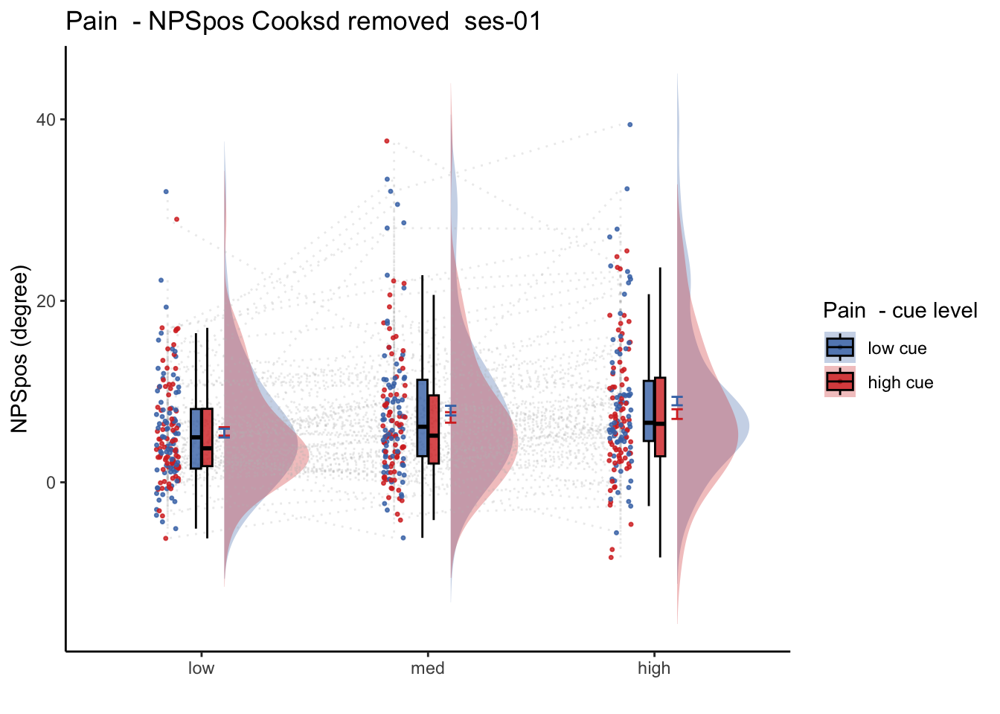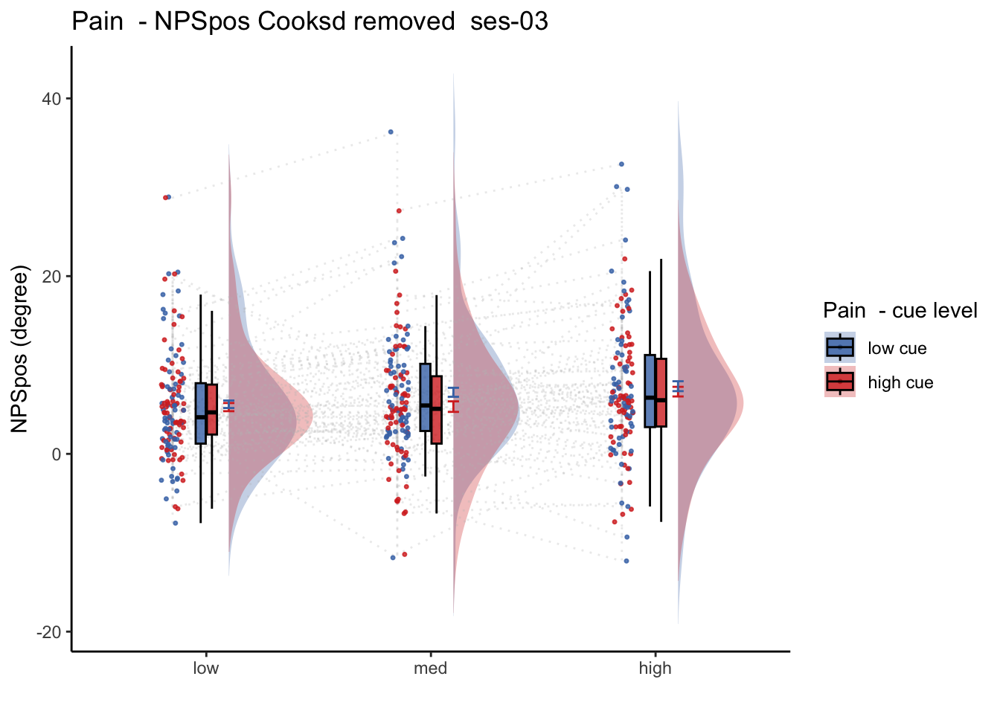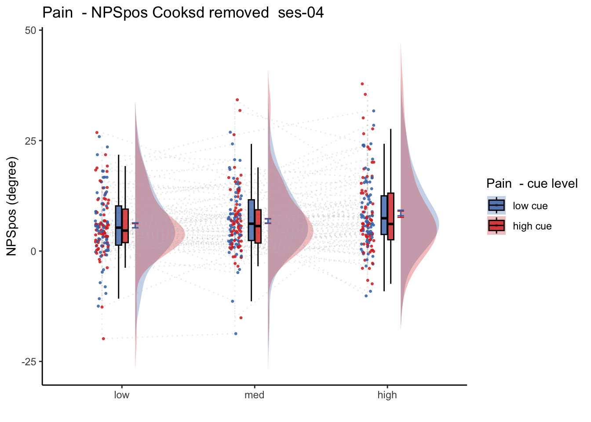


### Here are the stats models: NPS~session * cue * stimulus_intensity
1. Calculate difference score
* average high and low cue within run. 
* calculate difference between high and low cue per run
* each participant has 6 contrast scores
* run this as a function of stimulus intensity and sessions

```
## Warning: Unknown or uninitialised column: `STIM_linear`.
```

```
## Warning: Unknown or uninitialised column: `STIM_quadratic`.
```

```
## Warning: Unknown or uninitialised column: `SES_1_gt_34`.
```

```
## Warning: Unknown or uninitialised column: `SES_3_gt_4`.
```

```
## boundary (singular) fit: see help('isSingular')
```

```
## Warning: Model failed to converge with 1 negative eigenvalue: -2.0e+01
```

<table style="border-collapse:collapse; border:none;font-size: 12;">
<caption style="font-weight: bold; text-align:left;">Multilevel-modeling: 
lmer(NPSpos ~ STIM * SESSION + (STIM + SESSION | sub), data = pvc)</caption>
<tr>
<th style="border-top: double; text-align:center; font-style:italic; font-weight:normal; padding:0.2cm; border-bottom:1px solid black; text-align:left; ">&nbsp;</th>
<th colspan="3" style="border-top: double; text-align:center; font-style:italic; font-weight:normal; padding:0.2cm; border-bottom:1px solid black;">NPS_cuecontrast</th>
</tr>
<tr>
<td style=" text-align:center; border-bottom:1px solid; font-style:italic; font-weight:normal; border-bottom:1px solid black; text-align:left; ">Predictors</td>
<td style=" text-align:center; border-bottom:1px solid; font-style:italic; font-weight:normal; border-bottom:1px solid black; ">Estimates</td>
<td style=" text-align:center; border-bottom:1px solid; font-style:italic; font-weight:normal; border-bottom:1px solid black; ">CI</td>
<td style=" text-align:center; border-bottom:1px solid; font-style:italic; font-weight:normal; border-bottom:1px solid black; ">p</td>
</tr>
<tr>
<td style=" padding:0.2cm; text-align:left; vertical-align:top; text-align:left; ">(Intercept)</td>
<td style=" padding:0.2cm; text-align:left; vertical-align:top; text-align:center;  ">0.56</td>
<td style=" padding:0.2cm; text-align:left; vertical-align:top; text-align:center;  ">0.02&nbsp;&ndash;&nbsp;1.10</td>
<td style=" padding:0.2cm; text-align:left; vertical-align:top; text-align:center;  "><strong>0.042</strong></td>
</tr>
<tr>
<td style=" padding:0.2cm; text-align:left; vertical-align:top; text-align:left; ">STIM linear</td>
<td style=" padding:0.2cm; text-align:left; vertical-align:top; text-align:center;  ">0.80</td>
<td style=" padding:0.2cm; text-align:left; vertical-align:top; text-align:center;  ">&#45;0.37&nbsp;&ndash;&nbsp;1.97</td>
<td style=" padding:0.2cm; text-align:left; vertical-align:top; text-align:center;  ">0.179</td>
</tr>
<tr>
<td style=" padding:0.2cm; text-align:left; vertical-align:top; text-align:left; ">SES 3 gt 4</td>
<td style=" padding:0.2cm; text-align:left; vertical-align:top; text-align:center;  ">0.34</td>
<td style=" padding:0.2cm; text-align:left; vertical-align:top; text-align:center;  ">&#45;0.99&nbsp;&ndash;&nbsp;1.67</td>
<td style=" padding:0.2cm; text-align:left; vertical-align:top; text-align:center;  ">0.612</td>
</tr>
<tr>
<td style=" padding:0.2cm; text-align:left; vertical-align:top; text-align:left; ">STIM quadratic</td>
<td style=" padding:0.2cm; text-align:left; vertical-align:top; text-align:center;  ">0.70</td>
<td style=" padding:0.2cm; text-align:left; vertical-align:top; text-align:center;  ">&#45;0.31&nbsp;&ndash;&nbsp;1.70</td>
<td style=" padding:0.2cm; text-align:left; vertical-align:top; text-align:center;  ">0.174</td>
</tr>
<tr>
<td style=" padding:0.2cm; text-align:left; vertical-align:top; text-align:left; ">SES 1 gt 34</td>
<td style=" padding:0.2cm; text-align:left; vertical-align:top; text-align:center;  ">0.35</td>
<td style=" padding:0.2cm; text-align:left; vertical-align:top; text-align:center;  ">&#45;0.66&nbsp;&ndash;&nbsp;1.37</td>
<td style=" padding:0.2cm; text-align:left; vertical-align:top; text-align:center;  ">0.498</td>
</tr>
<tr>
<td style=" padding:0.2cm; text-align:left; vertical-align:top; text-align:left; ">STIM linear * SES 3 gt 4</td>
<td style=" padding:0.2cm; text-align:left; vertical-align:top; text-align:center;  ">0.23</td>
<td style=" padding:0.2cm; text-align:left; vertical-align:top; text-align:center;  ">&#45;2.45&nbsp;&ndash;&nbsp;2.91</td>
<td style=" padding:0.2cm; text-align:left; vertical-align:top; text-align:center;  ">0.868</td>
</tr>
<tr>
<td style=" padding:0.2cm; text-align:left; vertical-align:top; text-align:left; ">SES 3 gt 4 * STIM<br>quadratic</td>
<td style=" padding:0.2cm; text-align:left; vertical-align:top; text-align:center;  ">1.44</td>
<td style=" padding:0.2cm; text-align:left; vertical-align:top; text-align:center;  ">&#45;0.85&nbsp;&ndash;&nbsp;3.73</td>
<td style=" padding:0.2cm; text-align:left; vertical-align:top; text-align:center;  ">0.217</td>
</tr>
<tr>
<td style=" padding:0.2cm; text-align:left; vertical-align:top; text-align:left; ">STIM linear * SES 1 gt 34</td>
<td style=" padding:0.2cm; text-align:left; vertical-align:top; text-align:center;  ">0.80</td>
<td style=" padding:0.2cm; text-align:left; vertical-align:top; text-align:center;  ">&#45;1.47&nbsp;&ndash;&nbsp;3.08</td>
<td style=" padding:0.2cm; text-align:left; vertical-align:top; text-align:center;  ">0.488</td>
</tr>
<tr>
<td style=" padding:0.2cm; text-align:left; vertical-align:top; text-align:left; ">STIM quadratic * SES 1 gt<br>34</td>
<td style=" padding:0.2cm; text-align:left; vertical-align:top; text-align:center;  ">&#45;0.16</td>
<td style=" padding:0.2cm; text-align:left; vertical-align:top; text-align:center;  ">&#45;2.13&nbsp;&ndash;&nbsp;1.80</td>
<td style=" padding:0.2cm; text-align:left; vertical-align:top; text-align:center;  ">0.871</td>
</tr>
<tr>
<td colspan="4" style="font-weight:bold; text-align:left; padding-top:.8em;">Random Effects</td>
</tr>

<tr>
<td style=" padding:0.2cm; text-align:left; vertical-align:top; text-align:left; padding-top:0.1cm; padding-bottom:0.1cm;">&sigma;<sup>2</sup></td>
<td style=" padding:0.2cm; text-align:left; vertical-align:top; padding-top:0.1cm; padding-bottom:0.1cm; text-align:center;" colspan="3">52.68</td>
</tr>

<tr>
<td style=" padding:0.2cm; text-align:left; vertical-align:top; text-align:left; padding-top:0.1cm; padding-bottom:0.1cm;">&tau;<sub>00</sub> <sub>sub</sub></td>
<td style=" padding:0.2cm; text-align:left; vertical-align:top; padding-top:0.1cm; padding-bottom:0.1cm; text-align:center;" colspan="3">2.59</td>

<tr>
<td style=" padding:0.2cm; text-align:left; vertical-align:top; text-align:left; padding-top:0.1cm; padding-bottom:0.1cm;">&tau;<sub>11</sub> <sub>sub.SESses-03</sub></td>
<td style=" padding:0.2cm; text-align:left; vertical-align:top; padding-top:0.1cm; padding-bottom:0.1cm; text-align:center;" colspan="3">0.07</td>

<tr>
<td style=" padding:0.2cm; text-align:left; vertical-align:top; text-align:left; padding-top:0.1cm; padding-bottom:0.1cm;">&tau;<sub>11</sub> <sub>sub.SESses-04</sub></td>
<td style=" padding:0.2cm; text-align:left; vertical-align:top; padding-top:0.1cm; padding-bottom:0.1cm; text-align:center;" colspan="3">11.03</td>

<tr>
<td style=" padding:0.2cm; text-align:left; vertical-align:top; text-align:left; padding-top:0.1cm; padding-bottom:0.1cm;">&tau;<sub>11</sub> <sub>sub.STIMlow</sub></td>
<td style=" padding:0.2cm; text-align:left; vertical-align:top; padding-top:0.1cm; padding-bottom:0.1cm; text-align:center;" colspan="3">4.56</td>

<tr>
<td style=" padding:0.2cm; text-align:left; vertical-align:top; text-align:left; padding-top:0.1cm; padding-bottom:0.1cm;">&tau;<sub>11</sub> <sub>sub.STIMmed</sub></td>
<td style=" padding:0.2cm; text-align:left; vertical-align:top; padding-top:0.1cm; padding-bottom:0.1cm; text-align:center;" colspan="3">4.72</td>

<tr>
<td style=" padding:0.2cm; text-align:left; vertical-align:top; text-align:left; padding-top:0.1cm; padding-bottom:0.1cm;">&rho;<sub>01</sub></td>
<td style=" padding:0.2cm; text-align:left; vertical-align:top; padding-top:0.1cm; padding-bottom:0.1cm; text-align:center;" colspan="3">1.00</td>

<tr>
<td style=" padding:0.2cm; text-align:left; vertical-align:top; text-align:left; padding-top:0.1cm; padding-bottom:0.1cm;"></td>
<td style=" padding:0.2cm; text-align:left; vertical-align:top; padding-top:0.1cm; padding-bottom:0.1cm; text-align:center;" colspan="3">0.20</td>

<tr>
<td style=" padding:0.2cm; text-align:left; vertical-align:top; text-align:left; padding-top:0.1cm; padding-bottom:0.1cm;"></td>
<td style=" padding:0.2cm; text-align:left; vertical-align:top; padding-top:0.1cm; padding-bottom:0.1cm; text-align:center;" colspan="3">-0.82</td>

<tr>
<td style=" padding:0.2cm; text-align:left; vertical-align:top; text-align:left; padding-top:0.1cm; padding-bottom:0.1cm;"></td>
<td style=" padding:0.2cm; text-align:left; vertical-align:top; padding-top:0.1cm; padding-bottom:0.1cm; text-align:center;" colspan="3">0.07</td>

<tr>
<td style=" padding:0.2cm; text-align:left; vertical-align:top; text-align:left; padding-top:0.1cm; padding-bottom:0.1cm;">N <sub>sub</sub></td>
<td style=" padding:0.2cm; text-align:left; vertical-align:top; padding-top:0.1cm; padding-bottom:0.1cm; text-align:center;" colspan="3">95</td>
<tr>
<td style=" padding:0.2cm; text-align:left; vertical-align:top; text-align:left; padding-top:0.1cm; padding-bottom:0.1cm; border-top:1px solid;">Observations</td>
<td style=" padding:0.2cm; text-align:left; vertical-align:top; padding-top:0.1cm; padding-bottom:0.1cm; text-align:center; border-top:1px solid;" colspan="3">1067</td>
</tr>
<tr>
<td style=" padding:0.2cm; text-align:left; vertical-align:top; text-align:left; padding-top:0.1cm; padding-bottom:0.1cm;">Marginal R<sup>2</sup> / Conditional R<sup>2</sup></td>
<td style=" padding:0.2cm; text-align:left; vertical-align:top; padding-top:0.1cm; padding-bottom:0.1cm; text-align:center;" colspan="3">0.007 / NA</td>
</tr>

</table>
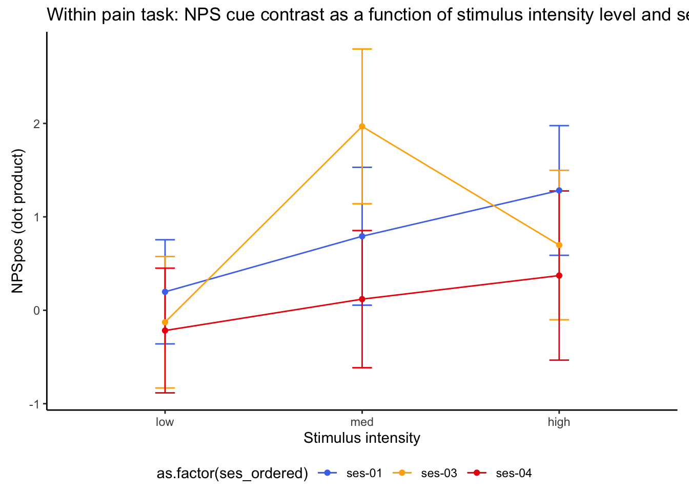


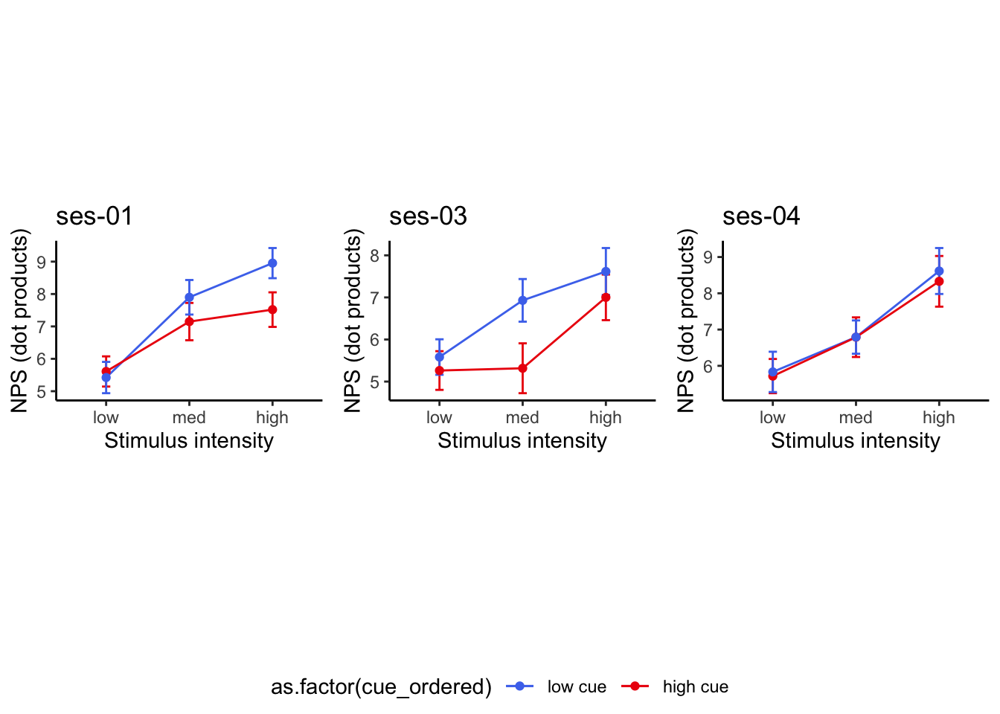

---

## OUTCOME ~ NPS
### Q. Do higher NPS values indicate higher outcome ratings? (Pain task only) {.unlisted .unnumbered}

> Yes, Higher NPS values are associated with higher outcome ratings. The linear relationship between NPS value and outcome ratings are stronger for conditions where cue level is congruent with stimulus intensity levels. In other words, NPS-outcome rating relationship is stringent in the low cue-low intensity group, as is the case for high cue-ghigh intensity group. 

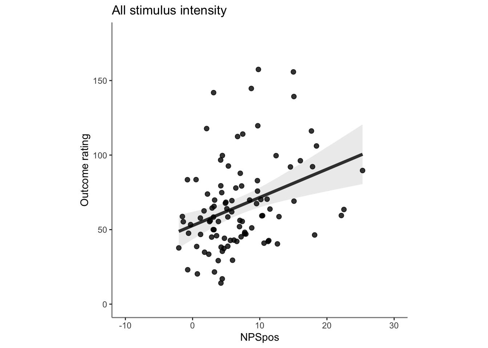

### outcome_rating * cue
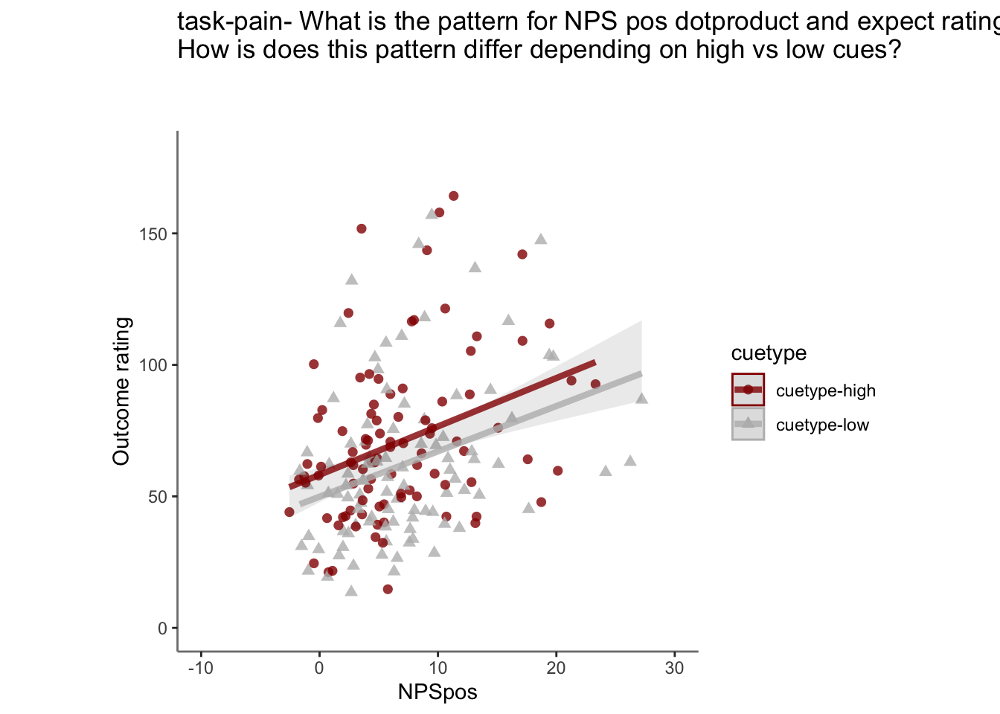


### outcome_ratings * stimulus_intensity * cue
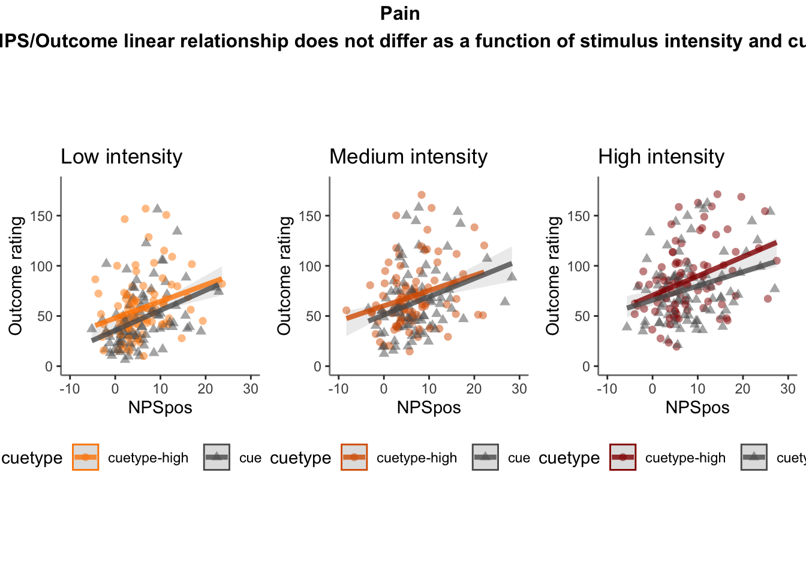

### demeaned outcome rating * cue

```
## `geom_smooth()` using formula = 'y ~ x'
```

```
## Warning: Removed 105 rows containing non-finite values (`stat_smooth()`).
```

```
## `geom_smooth()` using formula = 'y ~ x'
```

```
## Warning: Removed 105 rows containing non-finite values (`stat_smooth()`).
```

```
## Warning: Removed 105 rows containing missing values (`geom_point()`).
```

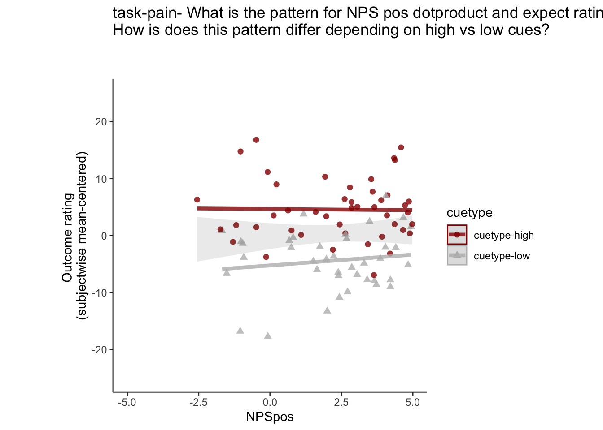

### demeaned_outcome_ratings * stimulus_intensity * cue
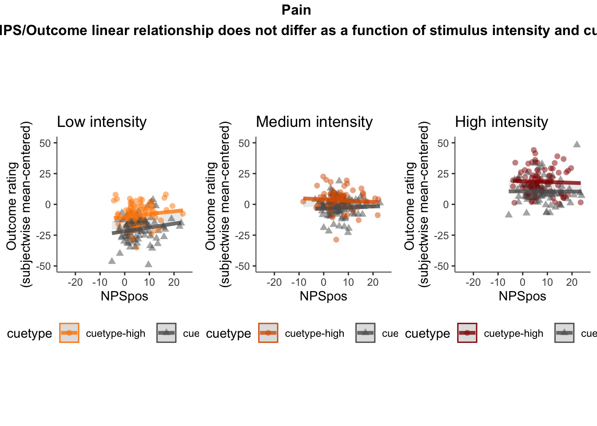

### Is this statistically significant?


```r
# organize variable names
# NPS_demean vs. NPSpos
model.npsoutcome <- lmer(OUTCOME_demean ~ CUE_high_gt_low*STIM_linear*NPSpos + CUE_high_gt_low*STIM_quadratic*NPSpos + (CUE_high_gt_low*STIM*NPSpos|sub), data = demean_dropna)
sjPlot::tab_model(model.npsoutcome,
                  title = "Multilevel-modeling: \nlmer(OUTCOME_demean ~ CUE * STIM * NPSpos + (CUE * STIM *NPSpos | sub), data = pvc)",
                  CSS = list(css.table = '+font-size: 12;'))
```

<table style="border-collapse:collapse; border:none;font-size: 12;">
<caption style="font-weight: bold; text-align:left;">Multilevel-modeling: 
lmer(OUTCOME_demean ~ CUE * STIM * NPSpos + (CUE * STIM *NPSpos | sub), data = pvc)</caption>
<tr>
<th style="border-top: double; text-align:center; font-style:italic; font-weight:normal; padding:0.2cm; border-bottom:1px solid black; text-align:left; ">&nbsp;</th>
<th colspan="3" style="border-top: double; text-align:center; font-style:italic; font-weight:normal; padding:0.2cm; border-bottom:1px solid black;">OUTCOME_demean</th>
</tr>
<tr>
<td style=" text-align:center; border-bottom:1px solid; font-style:italic; font-weight:normal; border-bottom:1px solid black; text-align:left; ">Predictors</td>
<td style=" text-align:center; border-bottom:1px solid; font-style:italic; font-weight:normal; border-bottom:1px solid black; ">Estimates</td>
<td style=" text-align:center; border-bottom:1px solid; font-style:italic; font-weight:normal; border-bottom:1px solid black; ">CI</td>
<td style=" text-align:center; border-bottom:1px solid; font-style:italic; font-weight:normal; border-bottom:1px solid black; ">p</td>
</tr>
<tr>
<td style=" padding:0.2cm; text-align:left; vertical-align:top; text-align:left; ">(Intercept)</td>
<td style=" padding:0.2cm; text-align:left; vertical-align:top; text-align:center;  ">&#45;1.11</td>
<td style=" padding:0.2cm; text-align:left; vertical-align:top; text-align:center;  ">&#45;1.88&nbsp;&ndash;&nbsp;-0.34</td>
<td style=" padding:0.2cm; text-align:left; vertical-align:top; text-align:center;  "><strong>0.005</strong></td>
</tr>
<tr>
<td style=" padding:0.2cm; text-align:left; vertical-align:top; text-align:left; ">CUE high gt low</td>
<td style=" padding:0.2cm; text-align:left; vertical-align:top; text-align:center;  ">9.11</td>
<td style=" padding:0.2cm; text-align:left; vertical-align:top; text-align:center;  ">6.99&nbsp;&ndash;&nbsp;11.23</td>
<td style=" padding:0.2cm; text-align:left; vertical-align:top; text-align:center;  "><strong>&lt;0.001</strong></td>
</tr>
<tr>
<td style=" padding:0.2cm; text-align:left; vertical-align:top; text-align:left; ">STIM linear</td>
<td style=" padding:0.2cm; text-align:left; vertical-align:top; text-align:center;  ">30.27</td>
<td style=" padding:0.2cm; text-align:left; vertical-align:top; text-align:center;  ">27.04&nbsp;&ndash;&nbsp;33.50</td>
<td style=" padding:0.2cm; text-align:left; vertical-align:top; text-align:center;  "><strong>&lt;0.001</strong></td>
</tr>
<tr>
<td style=" padding:0.2cm; text-align:left; vertical-align:top; text-align:left; ">NPSpos</td>
<td style=" padding:0.2cm; text-align:left; vertical-align:top; text-align:center;  ">0.18</td>
<td style=" padding:0.2cm; text-align:left; vertical-align:top; text-align:center;  ">0.10&nbsp;&ndash;&nbsp;0.25</td>
<td style=" padding:0.2cm; text-align:left; vertical-align:top; text-align:center;  "><strong>&lt;0.001</strong></td>
</tr>
<tr>
<td style=" padding:0.2cm; text-align:left; vertical-align:top; text-align:left; ">STIM quadratic</td>
<td style=" padding:0.2cm; text-align:left; vertical-align:top; text-align:center;  ">1.00</td>
<td style=" padding:0.2cm; text-align:left; vertical-align:top; text-align:center;  ">&#45;0.58&nbsp;&ndash;&nbsp;2.58</td>
<td style=" padding:0.2cm; text-align:left; vertical-align:top; text-align:center;  ">0.217</td>
</tr>
<tr>
<td style=" padding:0.2cm; text-align:left; vertical-align:top; text-align:left; ">CUE high gt low * STIM<br>linear</td>
<td style=" padding:0.2cm; text-align:left; vertical-align:top; text-align:center;  ">&#45;3.05</td>
<td style=" padding:0.2cm; text-align:left; vertical-align:top; text-align:center;  ">&#45;6.76&nbsp;&ndash;&nbsp;0.66</td>
<td style=" padding:0.2cm; text-align:left; vertical-align:top; text-align:center;  ">0.107</td>
</tr>
<tr>
<td style=" padding:0.2cm; text-align:left; vertical-align:top; text-align:left; ">CUE high gt low * NPSpos</td>
<td style=" padding:0.2cm; text-align:left; vertical-align:top; text-align:center;  ">&#45;0.09</td>
<td style=" padding:0.2cm; text-align:left; vertical-align:top; text-align:center;  ">&#45;0.24&nbsp;&ndash;&nbsp;0.05</td>
<td style=" padding:0.2cm; text-align:left; vertical-align:top; text-align:center;  ">0.202</td>
</tr>
<tr>
<td style=" padding:0.2cm; text-align:left; vertical-align:top; text-align:left; ">STIM linear * NPSpos</td>
<td style=" padding:0.2cm; text-align:left; vertical-align:top; text-align:center;  ">&#45;0.25</td>
<td style=" padding:0.2cm; text-align:left; vertical-align:top; text-align:center;  ">&#45;0.43&nbsp;&ndash;&nbsp;-0.07</td>
<td style=" padding:0.2cm; text-align:left; vertical-align:top; text-align:center;  "><strong>0.007</strong></td>
</tr>
<tr>
<td style=" padding:0.2cm; text-align:left; vertical-align:top; text-align:left; ">CUE high gt low * STIM<br>quadratic</td>
<td style=" padding:0.2cm; text-align:left; vertical-align:top; text-align:center;  ">&#45;3.96</td>
<td style=" padding:0.2cm; text-align:left; vertical-align:top; text-align:center;  ">&#45;7.14&nbsp;&ndash;&nbsp;-0.78</td>
<td style=" padding:0.2cm; text-align:left; vertical-align:top; text-align:center;  "><strong>0.015</strong></td>
</tr>
<tr>
<td style=" padding:0.2cm; text-align:left; vertical-align:top; text-align:left; ">NPSpos * STIM quadratic</td>
<td style=" padding:0.2cm; text-align:left; vertical-align:top; text-align:center;  ">&#45;0.03</td>
<td style=" padding:0.2cm; text-align:left; vertical-align:top; text-align:center;  ">&#45;0.18&nbsp;&ndash;&nbsp;0.11</td>
<td style=" padding:0.2cm; text-align:left; vertical-align:top; text-align:center;  ">0.654</td>
</tr>
<tr>
<td style=" padding:0.2cm; text-align:left; vertical-align:top; text-align:left; ">(CUE high gt low * STIM<br>linear) * NPSpos</td>
<td style=" padding:0.2cm; text-align:left; vertical-align:top; text-align:center;  ">0.21</td>
<td style=" padding:0.2cm; text-align:left; vertical-align:top; text-align:center;  ">&#45;0.12&nbsp;&ndash;&nbsp;0.54</td>
<td style=" padding:0.2cm; text-align:left; vertical-align:top; text-align:center;  ">0.207</td>
</tr>
<tr>
<td style=" padding:0.2cm; text-align:left; vertical-align:top; text-align:left; ">(CUE high gt low *<br>NPSpos) * STIM quadratic</td>
<td style=" padding:0.2cm; text-align:left; vertical-align:top; text-align:center;  ">&#45;0.05</td>
<td style=" padding:0.2cm; text-align:left; vertical-align:top; text-align:center;  ">&#45;0.35&nbsp;&ndash;&nbsp;0.25</td>
<td style=" padding:0.2cm; text-align:left; vertical-align:top; text-align:center;  ">0.762</td>
</tr>
<tr>
<td colspan="4" style="font-weight:bold; text-align:left; padding-top:.8em;">Random Effects</td>
</tr>

<tr>
<td style=" padding:0.2cm; text-align:left; vertical-align:top; text-align:left; padding-top:0.1cm; padding-bottom:0.1cm;">&sigma;<sup>2</sup></td>
<td style=" padding:0.2cm; text-align:left; vertical-align:top; padding-top:0.1cm; padding-bottom:0.1cm; text-align:center;" colspan="3">372.61</td>
</tr>

<tr>
<td style=" padding:0.2cm; text-align:left; vertical-align:top; text-align:left; padding-top:0.1cm; padding-bottom:0.1cm;">&tau;<sub>00</sub> <sub>sub</sub></td>
<td style=" padding:0.2cm; text-align:left; vertical-align:top; padding-top:0.1cm; padding-bottom:0.1cm; text-align:center;" colspan="3">46.33</td>

<tr>
<td style=" padding:0.2cm; text-align:left; vertical-align:top; text-align:left; padding-top:0.1cm; padding-bottom:0.1cm;">&tau;<sub>11</sub> <sub>sub.CUE_high_gt_low</sub></td>
<td style=" padding:0.2cm; text-align:left; vertical-align:top; padding-top:0.1cm; padding-bottom:0.1cm; text-align:center;" colspan="3">84.44</td>

<tr>
<td style=" padding:0.2cm; text-align:left; vertical-align:top; text-align:left; padding-top:0.1cm; padding-bottom:0.1cm;">&tau;<sub>11</sub> <sub>sub.STIMlow</sub></td>
<td style=" padding:0.2cm; text-align:left; vertical-align:top; padding-top:0.1cm; padding-bottom:0.1cm; text-align:center;" colspan="3">157.74</td>

<tr>
<td style=" padding:0.2cm; text-align:left; vertical-align:top; text-align:left; padding-top:0.1cm; padding-bottom:0.1cm;">&tau;<sub>11</sub> <sub>sub.STIMmed</sub></td>
<td style=" padding:0.2cm; text-align:left; vertical-align:top; padding-top:0.1cm; padding-bottom:0.1cm; text-align:center;" colspan="3">43.82</td>

<tr>
<td style=" padding:0.2cm; text-align:left; vertical-align:top; text-align:left; padding-top:0.1cm; padding-bottom:0.1cm;">&tau;<sub>11</sub> <sub>sub.NPSpos</sub></td>
<td style=" padding:0.2cm; text-align:left; vertical-align:top; padding-top:0.1cm; padding-bottom:0.1cm; text-align:center;" colspan="3">0.01</td>

<tr>
<td style=" padding:0.2cm; text-align:left; vertical-align:top; text-align:left; padding-top:0.1cm; padding-bottom:0.1cm;">&tau;<sub>11</sub> <sub>sub.CUE_high_gt_low:STIMlow</sub></td>
<td style=" padding:0.2cm; text-align:left; vertical-align:top; padding-top:0.1cm; padding-bottom:0.1cm; text-align:center;" colspan="3">19.20</td>

<tr>
<td style=" padding:0.2cm; text-align:left; vertical-align:top; text-align:left; padding-top:0.1cm; padding-bottom:0.1cm;">&tau;<sub>11</sub> <sub>sub.CUE_high_gt_low:STIMmed</sub></td>
<td style=" padding:0.2cm; text-align:left; vertical-align:top; padding-top:0.1cm; padding-bottom:0.1cm; text-align:center;" colspan="3">14.72</td>

<tr>
<td style=" padding:0.2cm; text-align:left; vertical-align:top; text-align:left; padding-top:0.1cm; padding-bottom:0.1cm;">&tau;<sub>11</sub> <sub>sub.CUE_high_gt_low:NPSpos</sub></td>
<td style=" padding:0.2cm; text-align:left; vertical-align:top; padding-top:0.1cm; padding-bottom:0.1cm; text-align:center;" colspan="3">0.20</td>

<tr>
<td style=" padding:0.2cm; text-align:left; vertical-align:top; text-align:left; padding-top:0.1cm; padding-bottom:0.1cm;">&tau;<sub>11</sub> <sub>sub.STIMlow:NPSpos</sub></td>
<td style=" padding:0.2cm; text-align:left; vertical-align:top; padding-top:0.1cm; padding-bottom:0.1cm; text-align:center;" colspan="3">0.03</td>

<tr>
<td style=" padding:0.2cm; text-align:left; vertical-align:top; text-align:left; padding-top:0.1cm; padding-bottom:0.1cm;">&tau;<sub>11</sub> <sub>sub.STIMmed:NPSpos</sub></td>
<td style=" padding:0.2cm; text-align:left; vertical-align:top; padding-top:0.1cm; padding-bottom:0.1cm; text-align:center;" colspan="3">0.05</td>

<tr>
<td style=" padding:0.2cm; text-align:left; vertical-align:top; text-align:left; padding-top:0.1cm; padding-bottom:0.1cm;">&tau;<sub>11</sub> <sub>sub.CUE_high_gt_low:STIMlow:NPSpos</sub></td>
<td style=" padding:0.2cm; text-align:left; vertical-align:top; padding-top:0.1cm; padding-bottom:0.1cm; text-align:center;" colspan="3">0.15</td>

<tr>
<td style=" padding:0.2cm; text-align:left; vertical-align:top; text-align:left; padding-top:0.1cm; padding-bottom:0.1cm;">&tau;<sub>11</sub> <sub>sub.CUE_high_gt_low:STIMmed:NPSpos</sub></td>
<td style=" padding:0.2cm; text-align:left; vertical-align:top; padding-top:0.1cm; padding-bottom:0.1cm; text-align:center;" colspan="3">0.33</td>

<tr>
<td style=" padding:0.2cm; text-align:left; vertical-align:top; text-align:left; padding-top:0.1cm; padding-bottom:0.1cm;">&rho;<sub>01</sub></td>
<td style=" padding:0.2cm; text-align:left; vertical-align:top; padding-top:0.1cm; padding-bottom:0.1cm; text-align:center;" colspan="3">-0.09</td>

<tr>
<td style=" padding:0.2cm; text-align:left; vertical-align:top; text-align:left; padding-top:0.1cm; padding-bottom:0.1cm;"></td>
<td style=" padding:0.2cm; text-align:left; vertical-align:top; padding-top:0.1cm; padding-bottom:0.1cm; text-align:center;" colspan="3">-0.99</td>

<tr>
<td style=" padding:0.2cm; text-align:left; vertical-align:top; text-align:left; padding-top:0.1cm; padding-bottom:0.1cm;"></td>
<td style=" padding:0.2cm; text-align:left; vertical-align:top; padding-top:0.1cm; padding-bottom:0.1cm; text-align:center;" colspan="3">-0.99</td>

<tr>
<td style=" padding:0.2cm; text-align:left; vertical-align:top; text-align:left; padding-top:0.1cm; padding-bottom:0.1cm;"></td>
<td style=" padding:0.2cm; text-align:left; vertical-align:top; padding-top:0.1cm; padding-bottom:0.1cm; text-align:center;" colspan="3">-0.97</td>

<tr>
<td style=" padding:0.2cm; text-align:left; vertical-align:top; text-align:left; padding-top:0.1cm; padding-bottom:0.1cm;"></td>
<td style=" padding:0.2cm; text-align:left; vertical-align:top; padding-top:0.1cm; padding-bottom:0.1cm; text-align:center;" colspan="3">0.48</td>

<tr>
<td style=" padding:0.2cm; text-align:left; vertical-align:top; text-align:left; padding-top:0.1cm; padding-bottom:0.1cm;"></td>
<td style=" padding:0.2cm; text-align:left; vertical-align:top; padding-top:0.1cm; padding-bottom:0.1cm; text-align:center;" colspan="3">0.34</td>

<tr>
<td style=" padding:0.2cm; text-align:left; vertical-align:top; text-align:left; padding-top:0.1cm; padding-bottom:0.1cm;"></td>
<td style=" padding:0.2cm; text-align:left; vertical-align:top; padding-top:0.1cm; padding-bottom:0.1cm; text-align:center;" colspan="3">0.60</td>

<tr>
<td style=" padding:0.2cm; text-align:left; vertical-align:top; text-align:left; padding-top:0.1cm; padding-bottom:0.1cm;"></td>
<td style=" padding:0.2cm; text-align:left; vertical-align:top; padding-top:0.1cm; padding-bottom:0.1cm; text-align:center;" colspan="3">0.10</td>

<tr>
<td style=" padding:0.2cm; text-align:left; vertical-align:top; text-align:left; padding-top:0.1cm; padding-bottom:0.1cm;"></td>
<td style=" padding:0.2cm; text-align:left; vertical-align:top; padding-top:0.1cm; padding-bottom:0.1cm; text-align:center;" colspan="3">0.10</td>

<tr>
<td style=" padding:0.2cm; text-align:left; vertical-align:top; text-align:left; padding-top:0.1cm; padding-bottom:0.1cm;"></td>
<td style=" padding:0.2cm; text-align:left; vertical-align:top; padding-top:0.1cm; padding-bottom:0.1cm; text-align:center;" colspan="3">-0.44</td>

<tr>
<td style=" padding:0.2cm; text-align:left; vertical-align:top; text-align:left; padding-top:0.1cm; padding-bottom:0.1cm;"></td>
<td style=" padding:0.2cm; text-align:left; vertical-align:top; padding-top:0.1cm; padding-bottom:0.1cm; text-align:center;" colspan="3">-0.68</td>

<tr>
<td style=" padding:0.2cm; text-align:left; vertical-align:top; text-align:left; padding-top:0.1cm; padding-bottom:0.1cm;">N <sub>sub</sub></td>
<td style=" padding:0.2cm; text-align:left; vertical-align:top; padding-top:0.1cm; padding-bottom:0.1cm; text-align:center;" colspan="3">96</td>
<tr>
<td style=" padding:0.2cm; text-align:left; vertical-align:top; text-align:left; padding-top:0.1cm; padding-bottom:0.1cm; border-top:1px solid;">Observations</td>
<td style=" padding:0.2cm; text-align:left; vertical-align:top; padding-top:0.1cm; padding-bottom:0.1cm; text-align:center; border-top:1px solid;" colspan="3">4147</td>
</tr>
<tr>
<td style=" padding:0.2cm; text-align:left; vertical-align:top; text-align:left; padding-top:0.1cm; padding-bottom:0.1cm;">Marginal R<sup>2</sup> / Conditional R<sup>2</sup></td>
<td style=" padding:0.2cm; text-align:left; vertical-align:top; padding-top:0.1cm; padding-bottom:0.1cm; text-align:center;" colspan="3">0.305 / NA</td>
</tr>

</table>


---

## NPS ~ expectation_rating
### Q. What is the relationship betweeen expectation ratings & NPS? (Pain task only) {.unlisted .unnumbered}
Do we see a linear effect between expectation rating and NPS dot products? Also, does this effect differ as a function of cue and stimulus intensity ratings, as is the case for behavioral ratings?

> Quick answer: Yes, expectation ratings predict NPS dotproducts; Also, there tends to be a different relationship depending on cues, just by looking at the figures, although this needs to be tested statistically. 

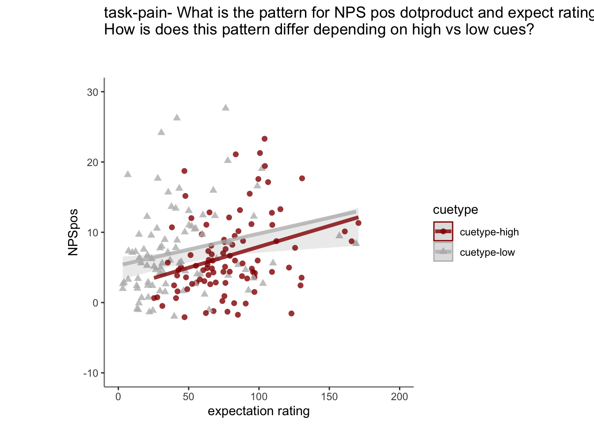


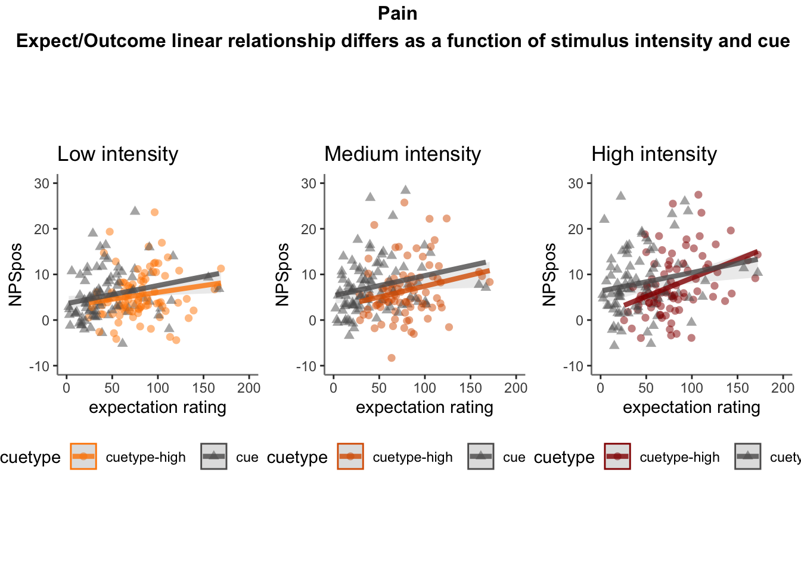


### demeaned expect rating * cue
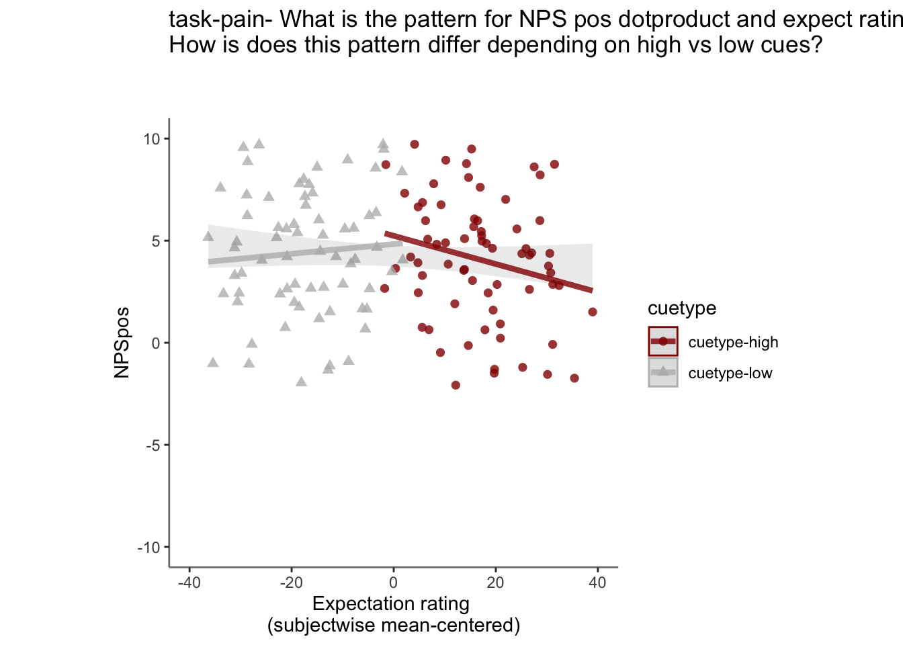


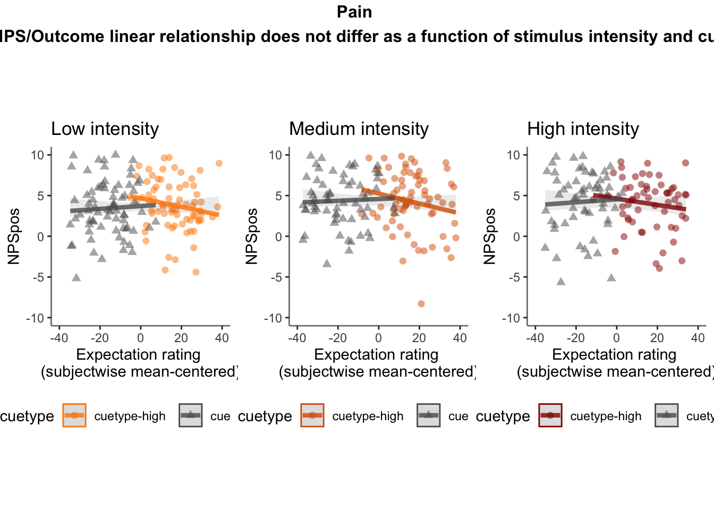


### Is this statistically significant?


```r
model.npsexpectdemean <- lmer(NPSpos ~ 
                          CUE_high_gt_low*STIM_linear*EXPECT_demean + 
                          CUE_high_gt_low*STIM_quadratic*EXPECT_demean + 
                          (CUE_high_gt_low+STIM+EXPECT_demean|sub), data = demean_dropna
                    )
sjPlot::tab_model(model.npsexpectdemean,
                  title = "Multilevel-modeling: \nlmer(NPSpos ~ CUE * STIM * EXPECT_demean + (CUE + STIM + EXPECT_demean| sub), data = pvc)",
                  CSS = list(css.table = '+font-size: 12;'))
```

<table style="border-collapse:collapse; border:none;font-size: 12;">
<caption style="font-weight: bold; text-align:left;">Multilevel-modeling: 
lmer(NPSpos ~ CUE * STIM * EXPECT_demean + (CUE + STIM + EXPECT_demean| sub), data = pvc)</caption>
<tr>
<th style="border-top: double; text-align:center; font-style:italic; font-weight:normal; padding:0.2cm; border-bottom:1px solid black; text-align:left; ">&nbsp;</th>
<th colspan="3" style="border-top: double; text-align:center; font-style:italic; font-weight:normal; padding:0.2cm; border-bottom:1px solid black;">NPSpos</th>
</tr>
<tr>
<td style=" text-align:center; border-bottom:1px solid; font-style:italic; font-weight:normal; border-bottom:1px solid black; text-align:left; ">Predictors</td>
<td style=" text-align:center; border-bottom:1px solid; font-style:italic; font-weight:normal; border-bottom:1px solid black; ">Estimates</td>
<td style=" text-align:center; border-bottom:1px solid; font-style:italic; font-weight:normal; border-bottom:1px solid black; ">CI</td>
<td style=" text-align:center; border-bottom:1px solid; font-style:italic; font-weight:normal; border-bottom:1px solid black; ">p</td>
</tr>
<tr>
<td style=" padding:0.2cm; text-align:left; vertical-align:top; text-align:left; ">(Intercept)</td>
<td style=" padding:0.2cm; text-align:left; vertical-align:top; text-align:center;  ">7.03</td>
<td style=" padding:0.2cm; text-align:left; vertical-align:top; text-align:center;  ">5.88&nbsp;&ndash;&nbsp;8.19</td>
<td style=" padding:0.2cm; text-align:left; vertical-align:top; text-align:center;  "><strong>&lt;0.001</strong></td>
</tr>
<tr>
<td style=" padding:0.2cm; text-align:left; vertical-align:top; text-align:left; ">CUE high gt low</td>
<td style=" padding:0.2cm; text-align:left; vertical-align:top; text-align:center;  ">&#45;0.55</td>
<td style=" padding:0.2cm; text-align:left; vertical-align:top; text-align:center;  ">&#45;1.29&nbsp;&ndash;&nbsp;0.20</td>
<td style=" padding:0.2cm; text-align:left; vertical-align:top; text-align:center;  ">0.151</td>
</tr>
<tr>
<td style=" padding:0.2cm; text-align:left; vertical-align:top; text-align:left; ">STIM linear</td>
<td style=" padding:0.2cm; text-align:left; vertical-align:top; text-align:center;  ">2.42</td>
<td style=" padding:0.2cm; text-align:left; vertical-align:top; text-align:center;  ">1.58&nbsp;&ndash;&nbsp;3.25</td>
<td style=" padding:0.2cm; text-align:left; vertical-align:top; text-align:center;  "><strong>&lt;0.001</strong></td>
</tr>
<tr>
<td style=" padding:0.2cm; text-align:left; vertical-align:top; text-align:left; ">EXPECT demean</td>
<td style=" padding:0.2cm; text-align:left; vertical-align:top; text-align:center;  ">&#45;0.00</td>
<td style=" padding:0.2cm; text-align:left; vertical-align:top; text-align:center;  ">&#45;0.02&nbsp;&ndash;&nbsp;0.01</td>
<td style=" padding:0.2cm; text-align:left; vertical-align:top; text-align:center;  ">0.690</td>
</tr>
<tr>
<td style=" padding:0.2cm; text-align:left; vertical-align:top; text-align:left; ">STIM quadratic</td>
<td style=" padding:0.2cm; text-align:left; vertical-align:top; text-align:center;  ">&#45;0.32</td>
<td style=" padding:0.2cm; text-align:left; vertical-align:top; text-align:center;  ">&#45;1.01&nbsp;&ndash;&nbsp;0.36</td>
<td style=" padding:0.2cm; text-align:left; vertical-align:top; text-align:center;  ">0.357</td>
</tr>
<tr>
<td style=" padding:0.2cm; text-align:left; vertical-align:top; text-align:left; ">CUE high gt low * STIM<br>linear</td>
<td style=" padding:0.2cm; text-align:left; vertical-align:top; text-align:center;  ">&#45;1.21</td>
<td style=" padding:0.2cm; text-align:left; vertical-align:top; text-align:center;  ">&#45;2.73&nbsp;&ndash;&nbsp;0.30</td>
<td style=" padding:0.2cm; text-align:left; vertical-align:top; text-align:center;  ">0.117</td>
</tr>
<tr>
<td style=" padding:0.2cm; text-align:left; vertical-align:top; text-align:left; ">CUE high gt low * EXPECT<br>demean</td>
<td style=" padding:0.2cm; text-align:left; vertical-align:top; text-align:center;  ">&#45;0.01</td>
<td style=" padding:0.2cm; text-align:left; vertical-align:top; text-align:center;  ">&#45;0.04&nbsp;&ndash;&nbsp;0.01</td>
<td style=" padding:0.2cm; text-align:left; vertical-align:top; text-align:center;  ">0.314</td>
</tr>
<tr>
<td style=" padding:0.2cm; text-align:left; vertical-align:top; text-align:left; ">STIM linear * EXPECT<br>demean</td>
<td style=" padding:0.2cm; text-align:left; vertical-align:top; text-align:center;  ">0.01</td>
<td style=" padding:0.2cm; text-align:left; vertical-align:top; text-align:center;  ">&#45;0.02&nbsp;&ndash;&nbsp;0.04</td>
<td style=" padding:0.2cm; text-align:left; vertical-align:top; text-align:center;  ">0.410</td>
</tr>
<tr>
<td style=" padding:0.2cm; text-align:left; vertical-align:top; text-align:left; ">CUE high gt low * STIM<br>quadratic</td>
<td style=" padding:0.2cm; text-align:left; vertical-align:top; text-align:center;  ">0.04</td>
<td style=" padding:0.2cm; text-align:left; vertical-align:top; text-align:center;  ">&#45;1.30&nbsp;&ndash;&nbsp;1.37</td>
<td style=" padding:0.2cm; text-align:left; vertical-align:top; text-align:center;  ">0.956</td>
</tr>
<tr>
<td style=" padding:0.2cm; text-align:left; vertical-align:top; text-align:left; ">EXPECT demean * STIM<br>quadratic</td>
<td style=" padding:0.2cm; text-align:left; vertical-align:top; text-align:center;  ">&#45;0.02</td>
<td style=" padding:0.2cm; text-align:left; vertical-align:top; text-align:center;  ">&#45;0.04&nbsp;&ndash;&nbsp;0.00</td>
<td style=" padding:0.2cm; text-align:left; vertical-align:top; text-align:center;  ">0.112</td>
</tr>
<tr>
<td style=" padding:0.2cm; text-align:left; vertical-align:top; text-align:left; ">(CUE high gt low * STIM<br>linear) * EXPECT demean</td>
<td style=" padding:0.2cm; text-align:left; vertical-align:top; text-align:center;  ">0.02</td>
<td style=" padding:0.2cm; text-align:left; vertical-align:top; text-align:center;  ">&#45;0.04&nbsp;&ndash;&nbsp;0.07</td>
<td style=" padding:0.2cm; text-align:left; vertical-align:top; text-align:center;  ">0.548</td>
</tr>
<tr>
<td style=" padding:0.2cm; text-align:left; vertical-align:top; text-align:left; ">(CUE high gt low * EXPECT<br>demean) * STIM quadratic</td>
<td style=" padding:0.2cm; text-align:left; vertical-align:top; text-align:center;  ">0.04</td>
<td style=" padding:0.2cm; text-align:left; vertical-align:top; text-align:center;  ">&#45;0.01&nbsp;&ndash;&nbsp;0.09</td>
<td style=" padding:0.2cm; text-align:left; vertical-align:top; text-align:center;  ">0.121</td>
</tr>
<tr>
<td colspan="4" style="font-weight:bold; text-align:left; padding-top:.8em;">Random Effects</td>
</tr>

<tr>
<td style=" padding:0.2cm; text-align:left; vertical-align:top; text-align:left; padding-top:0.1cm; padding-bottom:0.1cm;">&sigma;<sup>2</sup></td>
<td style=" padding:0.2cm; text-align:left; vertical-align:top; padding-top:0.1cm; padding-bottom:0.1cm; text-align:center;" colspan="3">61.71</td>
</tr>

<tr>
<td style=" padding:0.2cm; text-align:left; vertical-align:top; text-align:left; padding-top:0.1cm; padding-bottom:0.1cm;">&tau;<sub>00</sub> <sub>sub</sub></td>
<td style=" padding:0.2cm; text-align:left; vertical-align:top; padding-top:0.1cm; padding-bottom:0.1cm; text-align:center;" colspan="3">39.25</td>

<tr>
<td style=" padding:0.2cm; text-align:left; vertical-align:top; text-align:left; padding-top:0.1cm; padding-bottom:0.1cm;">&tau;<sub>11</sub> <sub>sub.CUE_high_gt_low</sub></td>
<td style=" padding:0.2cm; text-align:left; vertical-align:top; padding-top:0.1cm; padding-bottom:0.1cm; text-align:center;" colspan="3">3.84</td>

<tr>
<td style=" padding:0.2cm; text-align:left; vertical-align:top; text-align:left; padding-top:0.1cm; padding-bottom:0.1cm;">&tau;<sub>11</sub> <sub>sub.STIMlow</sub></td>
<td style=" padding:0.2cm; text-align:left; vertical-align:top; padding-top:0.1cm; padding-bottom:0.1cm; text-align:center;" colspan="3">2.92</td>

<tr>
<td style=" padding:0.2cm; text-align:left; vertical-align:top; text-align:left; padding-top:0.1cm; padding-bottom:0.1cm;">&tau;<sub>11</sub> <sub>sub.STIMmed</sub></td>
<td style=" padding:0.2cm; text-align:left; vertical-align:top; padding-top:0.1cm; padding-bottom:0.1cm; text-align:center;" colspan="3">1.92</td>

<tr>
<td style=" padding:0.2cm; text-align:left; vertical-align:top; text-align:left; padding-top:0.1cm; padding-bottom:0.1cm;">&tau;<sub>11</sub> <sub>sub.EXPECT_demean</sub></td>
<td style=" padding:0.2cm; text-align:left; vertical-align:top; padding-top:0.1cm; padding-bottom:0.1cm; text-align:center;" colspan="3">0.00</td>

<tr>
<td style=" padding:0.2cm; text-align:left; vertical-align:top; text-align:left; padding-top:0.1cm; padding-bottom:0.1cm;">&rho;<sub>01</sub></td>
<td style=" padding:0.2cm; text-align:left; vertical-align:top; padding-top:0.1cm; padding-bottom:0.1cm; text-align:center;" colspan="3">-0.89</td>

<tr>
<td style=" padding:0.2cm; text-align:left; vertical-align:top; text-align:left; padding-top:0.1cm; padding-bottom:0.1cm;"></td>
<td style=" padding:0.2cm; text-align:left; vertical-align:top; padding-top:0.1cm; padding-bottom:0.1cm; text-align:center;" colspan="3">-0.91</td>

<tr>
<td style=" padding:0.2cm; text-align:left; vertical-align:top; text-align:left; padding-top:0.1cm; padding-bottom:0.1cm;"></td>
<td style=" padding:0.2cm; text-align:left; vertical-align:top; padding-top:0.1cm; padding-bottom:0.1cm; text-align:center;" colspan="3">-0.71</td>

<tr>
<td style=" padding:0.2cm; text-align:left; vertical-align:top; text-align:left; padding-top:0.1cm; padding-bottom:0.1cm;"></td>
<td style=" padding:0.2cm; text-align:left; vertical-align:top; padding-top:0.1cm; padding-bottom:0.1cm; text-align:center;" colspan="3">0.96</td>

<tr>
<td style=" padding:0.2cm; text-align:left; vertical-align:top; text-align:left; padding-top:0.1cm; padding-bottom:0.1cm;">ICC</td>
<td style=" padding:0.2cm; text-align:left; vertical-align:top; padding-top:0.1cm; padding-bottom:0.1cm; text-align:center;" colspan="3">0.39</td>

<tr>
<td style=" padding:0.2cm; text-align:left; vertical-align:top; text-align:left; padding-top:0.1cm; padding-bottom:0.1cm;">N <sub>sub</sub></td>
<td style=" padding:0.2cm; text-align:left; vertical-align:top; padding-top:0.1cm; padding-bottom:0.1cm; text-align:center;" colspan="3">96</td>
<tr>
<td style=" padding:0.2cm; text-align:left; vertical-align:top; text-align:left; padding-top:0.1cm; padding-bottom:0.1cm; border-top:1px solid;">Observations</td>
<td style=" padding:0.2cm; text-align:left; vertical-align:top; padding-top:0.1cm; padding-bottom:0.1cm; text-align:center; border-top:1px solid;" colspan="3">4004</td>
</tr>
<tr>
<td style=" padding:0.2cm; text-align:left; vertical-align:top; text-align:left; padding-top:0.1cm; padding-bottom:0.1cm;">Marginal R<sup>2</sup> / Conditional R<sup>2</sup></td>
<td style=" padding:0.2cm; text-align:left; vertical-align:top; padding-top:0.1cm; padding-bottom:0.1cm; text-align:center;" colspan="3">0.013 / 0.402</td>
</tr>

</table>


```r
demean_dropna$EXPECT <- demean_dropna$event02_expect_angle
model.npsexpect <- lmer(NPSpos ~ 
                          CUE_high_gt_low*STIM_linear*EXPECT + 
                          CUE_high_gt_low*STIM_quadratic*EXPECT + 
                          (CUE_high_gt_low+STIM+EXPECT|sub), data = demean_dropna
                    )
sjPlot::tab_model(model.npsexpect,
                  title = "Multilevel-modeling: \nlmer(NPSpos ~ CUE * STIM * EXPECT + (CUE + STIM + EXPECT| sub), data = pvc)",
                  CSS = list(css.table = '+font-size: 12;'))
```

<table style="border-collapse:collapse; border:none;font-size: 12;">
<caption style="font-weight: bold; text-align:left;">Multilevel-modeling: 
lmer(NPSpos ~ CUE * STIM * EXPECT + (CUE + STIM + EXPECT| sub), data = pvc)</caption>
<tr>
<th style="border-top: double; text-align:center; font-style:italic; font-weight:normal; padding:0.2cm; border-bottom:1px solid black; text-align:left; ">&nbsp;</th>
<th colspan="3" style="border-top: double; text-align:center; font-style:italic; font-weight:normal; padding:0.2cm; border-bottom:1px solid black;">NPSpos</th>
</tr>
<tr>
<td style=" text-align:center; border-bottom:1px solid; font-style:italic; font-weight:normal; border-bottom:1px solid black; text-align:left; ">Predictors</td>
<td style=" text-align:center; border-bottom:1px solid; font-style:italic; font-weight:normal; border-bottom:1px solid black; ">Estimates</td>
<td style=" text-align:center; border-bottom:1px solid; font-style:italic; font-weight:normal; border-bottom:1px solid black; ">CI</td>
<td style=" text-align:center; border-bottom:1px solid; font-style:italic; font-weight:normal; border-bottom:1px solid black; ">p</td>
</tr>
<tr>
<td style=" padding:0.2cm; text-align:left; vertical-align:top; text-align:left; ">(Intercept)</td>
<td style=" padding:0.2cm; text-align:left; vertical-align:top; text-align:center;  ">6.55</td>
<td style=" padding:0.2cm; text-align:left; vertical-align:top; text-align:center;  ">5.50&nbsp;&ndash;&nbsp;7.59</td>
<td style=" padding:0.2cm; text-align:left; vertical-align:top; text-align:center;  "><strong>&lt;0.001</strong></td>
</tr>
<tr>
<td style=" padding:0.2cm; text-align:left; vertical-align:top; text-align:left; ">CUE high gt low</td>
<td style=" padding:0.2cm; text-align:left; vertical-align:top; text-align:center;  ">&#45;0.62</td>
<td style=" padding:0.2cm; text-align:left; vertical-align:top; text-align:center;  ">&#45;1.81&nbsp;&ndash;&nbsp;0.57</td>
<td style=" padding:0.2cm; text-align:left; vertical-align:top; text-align:center;  ">0.305</td>
</tr>
<tr>
<td style=" padding:0.2cm; text-align:left; vertical-align:top; text-align:left; ">STIM linear</td>
<td style=" padding:0.2cm; text-align:left; vertical-align:top; text-align:center;  ">1.63</td>
<td style=" padding:0.2cm; text-align:left; vertical-align:top; text-align:center;  ">0.34&nbsp;&ndash;&nbsp;2.93</td>
<td style=" padding:0.2cm; text-align:left; vertical-align:top; text-align:center;  "><strong>0.014</strong></td>
</tr>
<tr>
<td style=" padding:0.2cm; text-align:left; vertical-align:top; text-align:left; ">EXPECT</td>
<td style=" padding:0.2cm; text-align:left; vertical-align:top; text-align:center;  ">0.00</td>
<td style=" padding:0.2cm; text-align:left; vertical-align:top; text-align:center;  ">&#45;0.01&nbsp;&ndash;&nbsp;0.02</td>
<td style=" padding:0.2cm; text-align:left; vertical-align:top; text-align:center;  ">0.685</td>
</tr>
<tr>
<td style=" padding:0.2cm; text-align:left; vertical-align:top; text-align:left; ">STIM quadratic</td>
<td style=" padding:0.2cm; text-align:left; vertical-align:top; text-align:center;  ">0.63</td>
<td style=" padding:0.2cm; text-align:left; vertical-align:top; text-align:center;  ">&#45;0.47&nbsp;&ndash;&nbsp;1.74</td>
<td style=" padding:0.2cm; text-align:left; vertical-align:top; text-align:center;  ">0.263</td>
</tr>
<tr>
<td style=" padding:0.2cm; text-align:left; vertical-align:top; text-align:left; ">CUE high gt low * STIM<br>linear</td>
<td style=" padding:0.2cm; text-align:left; vertical-align:top; text-align:center;  ">&#45;2.19</td>
<td style=" padding:0.2cm; text-align:left; vertical-align:top; text-align:center;  ">&#45;4.66&nbsp;&ndash;&nbsp;0.27</td>
<td style=" padding:0.2cm; text-align:left; vertical-align:top; text-align:center;  ">0.081</td>
</tr>
<tr>
<td style=" padding:0.2cm; text-align:left; vertical-align:top; text-align:left; ">CUE high gt low * EXPECT</td>
<td style=" padding:0.2cm; text-align:left; vertical-align:top; text-align:center;  ">&#45;0.00</td>
<td style=" padding:0.2cm; text-align:left; vertical-align:top; text-align:center;  ">&#45;0.02&nbsp;&ndash;&nbsp;0.01</td>
<td style=" padding:0.2cm; text-align:left; vertical-align:top; text-align:center;  ">0.835</td>
</tr>
<tr>
<td style=" padding:0.2cm; text-align:left; vertical-align:top; text-align:left; ">STIM linear * EXPECT</td>
<td style=" padding:0.2cm; text-align:left; vertical-align:top; text-align:center;  ">0.01</td>
<td style=" padding:0.2cm; text-align:left; vertical-align:top; text-align:center;  ">&#45;0.00&nbsp;&ndash;&nbsp;0.03</td>
<td style=" padding:0.2cm; text-align:left; vertical-align:top; text-align:center;  ">0.140</td>
</tr>
<tr>
<td style=" padding:0.2cm; text-align:left; vertical-align:top; text-align:left; ">CUE high gt low * STIM<br>quadratic</td>
<td style=" padding:0.2cm; text-align:left; vertical-align:top; text-align:center;  ">&#45;1.34</td>
<td style=" padding:0.2cm; text-align:left; vertical-align:top; text-align:center;  ">&#45;3.51&nbsp;&ndash;&nbsp;0.82</td>
<td style=" padding:0.2cm; text-align:left; vertical-align:top; text-align:center;  ">0.225</td>
</tr>
<tr>
<td style=" padding:0.2cm; text-align:left; vertical-align:top; text-align:left; ">EXPECT * STIM quadratic</td>
<td style=" padding:0.2cm; text-align:left; vertical-align:top; text-align:center;  ">&#45;0.01</td>
<td style=" padding:0.2cm; text-align:left; vertical-align:top; text-align:center;  ">&#45;0.03&nbsp;&ndash;&nbsp;0.00</td>
<td style=" padding:0.2cm; text-align:left; vertical-align:top; text-align:center;  ">0.102</td>
</tr>
<tr>
<td style=" padding:0.2cm; text-align:left; vertical-align:top; text-align:left; ">(CUE high gt low * STIM<br>linear) * EXPECT</td>
<td style=" padding:0.2cm; text-align:left; vertical-align:top; text-align:center;  ">0.02</td>
<td style=" padding:0.2cm; text-align:left; vertical-align:top; text-align:center;  ">&#45;0.02&nbsp;&ndash;&nbsp;0.05</td>
<td style=" padding:0.2cm; text-align:left; vertical-align:top; text-align:center;  ">0.362</td>
</tr>
<tr>
<td style=" padding:0.2cm; text-align:left; vertical-align:top; text-align:left; ">(CUE high gt low *<br>EXPECT) * STIM quadratic</td>
<td style=" padding:0.2cm; text-align:left; vertical-align:top; text-align:center;  ">0.02</td>
<td style=" padding:0.2cm; text-align:left; vertical-align:top; text-align:center;  ">&#45;0.01&nbsp;&ndash;&nbsp;0.05</td>
<td style=" padding:0.2cm; text-align:left; vertical-align:top; text-align:center;  ">0.217</td>
</tr>
<tr>
<td colspan="4" style="font-weight:bold; text-align:left; padding-top:.8em;">Random Effects</td>
</tr>

<tr>
<td style=" padding:0.2cm; text-align:left; vertical-align:top; text-align:left; padding-top:0.1cm; padding-bottom:0.1cm;">&sigma;<sup>2</sup></td>
<td style=" padding:0.2cm; text-align:left; vertical-align:top; padding-top:0.1cm; padding-bottom:0.1cm; text-align:center;" colspan="3">61.69</td>
</tr>

<tr>
<td style=" padding:0.2cm; text-align:left; vertical-align:top; text-align:left; padding-top:0.1cm; padding-bottom:0.1cm;">&tau;<sub>00</sub> <sub>sub</sub></td>
<td style=" padding:0.2cm; text-align:left; vertical-align:top; padding-top:0.1cm; padding-bottom:0.1cm; text-align:center;" colspan="3">18.92</td>

<tr>
<td style=" padding:0.2cm; text-align:left; vertical-align:top; text-align:left; padding-top:0.1cm; padding-bottom:0.1cm;">&tau;<sub>11</sub> <sub>sub.CUE_high_gt_low</sub></td>
<td style=" padding:0.2cm; text-align:left; vertical-align:top; padding-top:0.1cm; padding-bottom:0.1cm; text-align:center;" colspan="3">3.72</td>

<tr>
<td style=" padding:0.2cm; text-align:left; vertical-align:top; text-align:left; padding-top:0.1cm; padding-bottom:0.1cm;">&tau;<sub>11</sub> <sub>sub.STIMlow</sub></td>
<td style=" padding:0.2cm; text-align:left; vertical-align:top; padding-top:0.1cm; padding-bottom:0.1cm; text-align:center;" colspan="3">2.53</td>

<tr>
<td style=" padding:0.2cm; text-align:left; vertical-align:top; text-align:left; padding-top:0.1cm; padding-bottom:0.1cm;">&tau;<sub>11</sub> <sub>sub.STIMmed</sub></td>
<td style=" padding:0.2cm; text-align:left; vertical-align:top; padding-top:0.1cm; padding-bottom:0.1cm; text-align:center;" colspan="3">1.65</td>

<tr>
<td style=" padding:0.2cm; text-align:left; vertical-align:top; text-align:left; padding-top:0.1cm; padding-bottom:0.1cm;">&tau;<sub>11</sub> <sub>sub.EXPECT</sub></td>
<td style=" padding:0.2cm; text-align:left; vertical-align:top; padding-top:0.1cm; padding-bottom:0.1cm; text-align:center;" colspan="3">0.00</td>

<tr>
<td style=" padding:0.2cm; text-align:left; vertical-align:top; text-align:left; padding-top:0.1cm; padding-bottom:0.1cm;">&rho;<sub>01</sub></td>
<td style=" padding:0.2cm; text-align:left; vertical-align:top; padding-top:0.1cm; padding-bottom:0.1cm; text-align:center;" colspan="3">-0.86</td>

<tr>
<td style=" padding:0.2cm; text-align:left; vertical-align:top; text-align:left; padding-top:0.1cm; padding-bottom:0.1cm;"></td>
<td style=" padding:0.2cm; text-align:left; vertical-align:top; padding-top:0.1cm; padding-bottom:0.1cm; text-align:center;" colspan="3">-0.85</td>

<tr>
<td style=" padding:0.2cm; text-align:left; vertical-align:top; text-align:left; padding-top:0.1cm; padding-bottom:0.1cm;"></td>
<td style=" padding:0.2cm; text-align:left; vertical-align:top; padding-top:0.1cm; padding-bottom:0.1cm; text-align:center;" colspan="3">-0.54</td>

<tr>
<td style=" padding:0.2cm; text-align:left; vertical-align:top; text-align:left; padding-top:0.1cm; padding-bottom:0.1cm;"></td>
<td style=" padding:0.2cm; text-align:left; vertical-align:top; padding-top:0.1cm; padding-bottom:0.1cm; text-align:center;" colspan="3">0.81</td>

<tr>
<td style=" padding:0.2cm; text-align:left; vertical-align:top; text-align:left; padding-top:0.1cm; padding-bottom:0.1cm;">N <sub>sub</sub></td>
<td style=" padding:0.2cm; text-align:left; vertical-align:top; padding-top:0.1cm; padding-bottom:0.1cm; text-align:center;" colspan="3">96</td>
<tr>
<td style=" padding:0.2cm; text-align:left; vertical-align:top; text-align:left; padding-top:0.1cm; padding-bottom:0.1cm; border-top:1px solid;">Observations</td>
<td style=" padding:0.2cm; text-align:left; vertical-align:top; padding-top:0.1cm; padding-bottom:0.1cm; text-align:center; border-top:1px solid;" colspan="3">4004</td>
</tr>
<tr>
<td style=" padding:0.2cm; text-align:left; vertical-align:top; text-align:left; padding-top:0.1cm; padding-bottom:0.1cm;">Marginal R<sup>2</sup> / Conditional R<sup>2</sup></td>
<td style=" padding:0.2cm; text-align:left; vertical-align:top; padding-top:0.1cm; padding-bottom:0.1cm; text-align:center;" colspan="3">0.022 / NA</td>
</tr>

</table>


```r
demean_dropna$EXPECT <- demean_dropna$event02_expect_angle
model.npsd_expectd <- lmer(NPS_demean ~ 
                          CUE_high_gt_low*STIM_linear*EXPECT_demean + 
                          CUE_high_gt_low*STIM_quadratic*EXPECT_demean + 
                          (CUE_high_gt_low+STIM+EXPECT_demean|sub), data = demean_dropna
                    )
```

```
## Warning: Model failed to converge with 2 negative eigenvalues: -2.7e+02 -1.1e+03
```

```r
sjPlot::tab_model(model.npsd_expectd,
                  title = "Multilevel-modeling: \nlmer(NPS_demean ~ CUE * STIM * EXPECT_demean + (CUE + STIM + EXPECT_demean| sub), data = pvc)",
                  CSS = list(css.table = '+font-size: 12;'))
```

<table style="border-collapse:collapse; border:none;font-size: 12;">
<caption style="font-weight: bold; text-align:left;">Multilevel-modeling: 
lmer(NPS_demean ~ CUE * STIM * EXPECT_demean + (CUE + STIM + EXPECT_demean| sub), data = pvc)</caption>
<tr>
<th style="border-top: double; text-align:center; font-style:italic; font-weight:normal; padding:0.2cm; border-bottom:1px solid black; text-align:left; ">&nbsp;</th>
<th colspan="3" style="border-top: double; text-align:center; font-style:italic; font-weight:normal; padding:0.2cm; border-bottom:1px solid black;">NPS_demean</th>
</tr>
<tr>
<td style=" text-align:center; border-bottom:1px solid; font-style:italic; font-weight:normal; border-bottom:1px solid black; text-align:left; ">Predictors</td>
<td style=" text-align:center; border-bottom:1px solid; font-style:italic; font-weight:normal; border-bottom:1px solid black; ">Estimates</td>
<td style=" text-align:center; border-bottom:1px solid; font-style:italic; font-weight:normal; border-bottom:1px solid black; ">CI</td>
<td style=" text-align:center; border-bottom:1px solid; font-style:italic; font-weight:normal; border-bottom:1px solid black; ">p</td>
</tr>
<tr>
<td style=" padding:0.2cm; text-align:left; vertical-align:top; text-align:left; ">(Intercept)</td>
<td style=" padding:0.2cm; text-align:left; vertical-align:top; text-align:center;  ">0.15</td>
<td style=" padding:0.2cm; text-align:left; vertical-align:top; text-align:center;  ">&#45;0.17&nbsp;&ndash;&nbsp;0.46</td>
<td style=" padding:0.2cm; text-align:left; vertical-align:top; text-align:center;  ">0.358</td>
</tr>
<tr>
<td style=" padding:0.2cm; text-align:left; vertical-align:top; text-align:left; ">CUE high gt low</td>
<td style=" padding:0.2cm; text-align:left; vertical-align:top; text-align:center;  ">&#45;0.48</td>
<td style=" padding:0.2cm; text-align:left; vertical-align:top; text-align:center;  ">&#45;1.24&nbsp;&ndash;&nbsp;0.28</td>
<td style=" padding:0.2cm; text-align:left; vertical-align:top; text-align:center;  ">0.216</td>
</tr>
<tr>
<td style=" padding:0.2cm; text-align:left; vertical-align:top; text-align:left; ">STIM linear</td>
<td style=" padding:0.2cm; text-align:left; vertical-align:top; text-align:center;  ">2.39</td>
<td style=" padding:0.2cm; text-align:left; vertical-align:top; text-align:center;  ">1.63&nbsp;&ndash;&nbsp;3.14</td>
<td style=" padding:0.2cm; text-align:left; vertical-align:top; text-align:center;  "><strong>&lt;0.001</strong></td>
</tr>
<tr>
<td style=" padding:0.2cm; text-align:left; vertical-align:top; text-align:left; ">EXPECT demean</td>
<td style=" padding:0.2cm; text-align:left; vertical-align:top; text-align:center;  ">&#45;0.00</td>
<td style=" padding:0.2cm; text-align:left; vertical-align:top; text-align:center;  ">&#45;0.02&nbsp;&ndash;&nbsp;0.01</td>
<td style=" padding:0.2cm; text-align:left; vertical-align:top; text-align:center;  ">0.692</td>
</tr>
<tr>
<td style=" padding:0.2cm; text-align:left; vertical-align:top; text-align:left; ">STIM quadratic</td>
<td style=" padding:0.2cm; text-align:left; vertical-align:top; text-align:center;  ">&#45;0.27</td>
<td style=" padding:0.2cm; text-align:left; vertical-align:top; text-align:center;  ">&#45;0.94&nbsp;&ndash;&nbsp;0.39</td>
<td style=" padding:0.2cm; text-align:left; vertical-align:top; text-align:center;  ">0.420</td>
</tr>
<tr>
<td style=" padding:0.2cm; text-align:left; vertical-align:top; text-align:left; ">CUE high gt low * STIM<br>linear</td>
<td style=" padding:0.2cm; text-align:left; vertical-align:top; text-align:center;  ">&#45;1.01</td>
<td style=" padding:0.2cm; text-align:left; vertical-align:top; text-align:center;  ">&#45;2.52&nbsp;&ndash;&nbsp;0.49</td>
<td style=" padding:0.2cm; text-align:left; vertical-align:top; text-align:center;  ">0.186</td>
</tr>
<tr>
<td style=" padding:0.2cm; text-align:left; vertical-align:top; text-align:left; ">CUE high gt low * EXPECT<br>demean</td>
<td style=" padding:0.2cm; text-align:left; vertical-align:top; text-align:center;  ">&#45;0.01</td>
<td style=" padding:0.2cm; text-align:left; vertical-align:top; text-align:center;  ">&#45;0.04&nbsp;&ndash;&nbsp;0.01</td>
<td style=" padding:0.2cm; text-align:left; vertical-align:top; text-align:center;  ">0.190</td>
</tr>
<tr>
<td style=" padding:0.2cm; text-align:left; vertical-align:top; text-align:left; ">STIM linear * EXPECT<br>demean</td>
<td style=" padding:0.2cm; text-align:left; vertical-align:top; text-align:center;  ">0.01</td>
<td style=" padding:0.2cm; text-align:left; vertical-align:top; text-align:center;  ">&#45;0.02&nbsp;&ndash;&nbsp;0.04</td>
<td style=" padding:0.2cm; text-align:left; vertical-align:top; text-align:center;  ">0.513</td>
</tr>
<tr>
<td style=" padding:0.2cm; text-align:left; vertical-align:top; text-align:left; ">CUE high gt low * STIM<br>quadratic</td>
<td style=" padding:0.2cm; text-align:left; vertical-align:top; text-align:center;  ">&#45;0.08</td>
<td style=" padding:0.2cm; text-align:left; vertical-align:top; text-align:center;  ">&#45;1.41&nbsp;&ndash;&nbsp;1.24</td>
<td style=" padding:0.2cm; text-align:left; vertical-align:top; text-align:center;  ">0.904</td>
</tr>
<tr>
<td style=" padding:0.2cm; text-align:left; vertical-align:top; text-align:left; ">EXPECT demean * STIM<br>quadratic</td>
<td style=" padding:0.2cm; text-align:left; vertical-align:top; text-align:center;  ">&#45;0.02</td>
<td style=" padding:0.2cm; text-align:left; vertical-align:top; text-align:center;  ">&#45;0.04&nbsp;&ndash;&nbsp;0.01</td>
<td style=" padding:0.2cm; text-align:left; vertical-align:top; text-align:center;  ">0.134</td>
</tr>
<tr>
<td style=" padding:0.2cm; text-align:left; vertical-align:top; text-align:left; ">(CUE high gt low * STIM<br>linear) * EXPECT demean</td>
<td style=" padding:0.2cm; text-align:left; vertical-align:top; text-align:center;  ">0.02</td>
<td style=" padding:0.2cm; text-align:left; vertical-align:top; text-align:center;  ">&#45;0.04&nbsp;&ndash;&nbsp;0.07</td>
<td style=" padding:0.2cm; text-align:left; vertical-align:top; text-align:center;  ">0.528</td>
</tr>
<tr>
<td style=" padding:0.2cm; text-align:left; vertical-align:top; text-align:left; ">(CUE high gt low * EXPECT<br>demean) * STIM quadratic</td>
<td style=" padding:0.2cm; text-align:left; vertical-align:top; text-align:center;  ">0.03</td>
<td style=" padding:0.2cm; text-align:left; vertical-align:top; text-align:center;  ">&#45;0.02&nbsp;&ndash;&nbsp;0.08</td>
<td style=" padding:0.2cm; text-align:left; vertical-align:top; text-align:center;  ">0.188</td>
</tr>
<tr>
<td colspan="4" style="font-weight:bold; text-align:left; padding-top:.8em;">Random Effects</td>
</tr>

<tr>
<td style=" padding:0.2cm; text-align:left; vertical-align:top; text-align:left; padding-top:0.1cm; padding-bottom:0.1cm;">&sigma;<sup>2</sup></td>
<td style=" padding:0.2cm; text-align:left; vertical-align:top; padding-top:0.1cm; padding-bottom:0.1cm; text-align:center;" colspan="3">60.84</td>
</tr>

<tr>
<td style=" padding:0.2cm; text-align:left; vertical-align:top; text-align:left; padding-top:0.1cm; padding-bottom:0.1cm;">&tau;<sub>00</sub> <sub>sub</sub></td>
<td style=" padding:0.2cm; text-align:left; vertical-align:top; padding-top:0.1cm; padding-bottom:0.1cm; text-align:center;" colspan="3">0.00</td>

<tr>
<td style=" padding:0.2cm; text-align:left; vertical-align:top; text-align:left; padding-top:0.1cm; padding-bottom:0.1cm;">&tau;<sub>11</sub> <sub>sub.CUE_high_gt_low</sub></td>
<td style=" padding:0.2cm; text-align:left; vertical-align:top; padding-top:0.1cm; padding-bottom:0.1cm; text-align:center;" colspan="3">3.35</td>

<tr>
<td style=" padding:0.2cm; text-align:left; vertical-align:top; text-align:left; padding-top:0.1cm; padding-bottom:0.1cm;">&tau;<sub>11</sub> <sub>sub.STIMlow</sub></td>
<td style=" padding:0.2cm; text-align:left; vertical-align:top; padding-top:0.1cm; padding-bottom:0.1cm; text-align:center;" colspan="3">0.02</td>

<tr>
<td style=" padding:0.2cm; text-align:left; vertical-align:top; text-align:left; padding-top:0.1cm; padding-bottom:0.1cm;">&tau;<sub>11</sub> <sub>sub.STIMmed</sub></td>
<td style=" padding:0.2cm; text-align:left; vertical-align:top; padding-top:0.1cm; padding-bottom:0.1cm; text-align:center;" colspan="3">0.07</td>

<tr>
<td style=" padding:0.2cm; text-align:left; vertical-align:top; text-align:left; padding-top:0.1cm; padding-bottom:0.1cm;">&tau;<sub>11</sub> <sub>sub.EXPECT_demean</sub></td>
<td style=" padding:0.2cm; text-align:left; vertical-align:top; padding-top:0.1cm; padding-bottom:0.1cm; text-align:center;" colspan="3">0.00</td>

<tr>
<td style=" padding:0.2cm; text-align:left; vertical-align:top; text-align:left; padding-top:0.1cm; padding-bottom:0.1cm;">&rho;<sub>01</sub></td>
<td style=" padding:0.2cm; text-align:left; vertical-align:top; padding-top:0.1cm; padding-bottom:0.1cm; text-align:center;" colspan="3">-0.09</td>

<tr>
<td style=" padding:0.2cm; text-align:left; vertical-align:top; text-align:left; padding-top:0.1cm; padding-bottom:0.1cm;"></td>
<td style=" padding:0.2cm; text-align:left; vertical-align:top; padding-top:0.1cm; padding-bottom:0.1cm; text-align:center;" colspan="3">0.22</td>

<tr>
<td style=" padding:0.2cm; text-align:left; vertical-align:top; text-align:left; padding-top:0.1cm; padding-bottom:0.1cm;"></td>
<td style=" padding:0.2cm; text-align:left; vertical-align:top; padding-top:0.1cm; padding-bottom:0.1cm; text-align:center;" colspan="3">-0.41</td>

<tr>
<td style=" padding:0.2cm; text-align:left; vertical-align:top; text-align:left; padding-top:0.1cm; padding-bottom:0.1cm;"></td>
<td style=" padding:0.2cm; text-align:left; vertical-align:top; padding-top:0.1cm; padding-bottom:0.1cm; text-align:center;" colspan="3">-0.50</td>

<tr>
<td style=" padding:0.2cm; text-align:left; vertical-align:top; text-align:left; padding-top:0.1cm; padding-bottom:0.1cm;">ICC</td>
<td style=" padding:0.2cm; text-align:left; vertical-align:top; padding-top:0.1cm; padding-bottom:0.1cm; text-align:center;" colspan="3">0.01</td>

<tr>
<td style=" padding:0.2cm; text-align:left; vertical-align:top; text-align:left; padding-top:0.1cm; padding-bottom:0.1cm;">N <sub>sub</sub></td>
<td style=" padding:0.2cm; text-align:left; vertical-align:top; padding-top:0.1cm; padding-bottom:0.1cm; text-align:center;" colspan="3">96</td>
<tr>
<td style=" padding:0.2cm; text-align:left; vertical-align:top; text-align:left; padding-top:0.1cm; padding-bottom:0.1cm; border-top:1px solid;">Observations</td>
<td style=" padding:0.2cm; text-align:left; vertical-align:top; padding-top:0.1cm; padding-bottom:0.1cm; text-align:center; border-top:1px solid;" colspan="3">4004</td>
</tr>
<tr>
<td style=" padding:0.2cm; text-align:left; vertical-align:top; text-align:left; padding-top:0.1cm; padding-bottom:0.1cm;">Marginal R<sup>2</sup> / Conditional R<sup>2</sup></td>
<td style=" padding:0.2cm; text-align:left; vertical-align:top; padding-top:0.1cm; padding-bottom:0.1cm; text-align:center;" colspan="3">0.021 / 0.035</td>
</tr>

</table>
