# [fMRI] NPSses04 ~ singletrial {#ch35_singletrial_Pses04}


## What is the purpose of this notebook? {.unlisted .unnumbered}

* Here, I model NPS dot products as a function of cue, stimulus intensity and expectation ratings. 
* One of the findings is that low cues lead to higher NPS dotproducts in the high intensity group, and that this effect becomes non-significant across sessions. 
* 03/23/2023: For now, I'm grabbing participants that have complete data, i.e. 18 runs, all three sessions. 


#### Contrast weight table {.unlisted .unnumbered}
<table class="table table-striped" style="font-size: 15px; ">
<caption style="font-size: initial !important;">(\#tab:unnamed-chunk-4)Contrast weights</caption>
 <thead>
  <tr>
   <th style="text-align:left;">   </th>
   <th style="text-align:right;"> pain </th>
   <th style="text-align:right;"> vicarious </th>
   <th style="text-align:right;"> cognitive </th>
  </tr>
 </thead>
<tbody>
  <tr>
   <td style="text-align:left;"> task_V_gt_C </td>
   <td style="text-align:right;"> 0.00 </td>
   <td style="text-align:right;"> 0.50 </td>
   <td style="text-align:right;"> -0.50 </td>
  </tr>
  <tr>
   <td style="text-align:left;"> task_P_gt_VC </td>
   <td style="text-align:right;"> 0.66 </td>
   <td style="text-align:right;"> -0.34 </td>
   <td style="text-align:right;"> -0.34 </td>
  </tr>
</tbody>
</table>


## NPS ~ paintask: 2 cue x 3 stimulus_intensity

### Q. Within pain task, Does stimulus intenisty level and cue level significantly predict NPS dotproducts? {.unlisted .unnumbered}
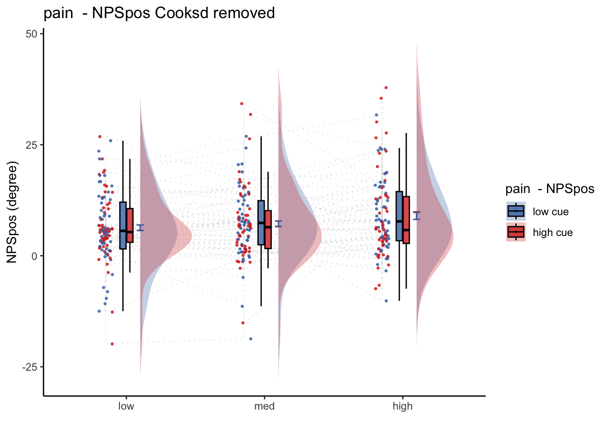


### Lineplots {.unlisted .unnumbered}
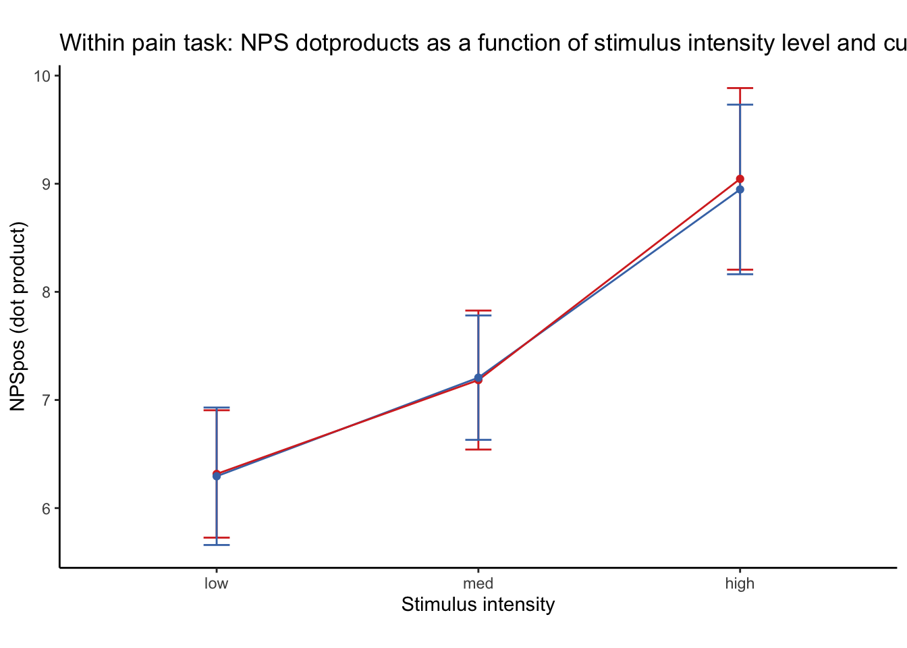


### Linear model results (NPS ~ paintask: 2 cue x 3 stimulus_intensity)

```r
model.npscuestim <- lmer(NPSpos ~ 
                          CUE_high_gt_low*STIM_linear +CUE_high_gt_low * STIM_quadratic +
                          (CUE_high_gt_low+STIM|sub), data = data_screen
                    )
sjPlot::tab_model(model.npscuestim,
                  title = "Multilevel-modeling: \nlmer(NPSpos ~ CUE * STIM + (CUE + STIM | sub), data = pvc)",
                  CSS = list(css.table = '+font-size: 12;'))
```

<table style="border-collapse:collapse; border:none;font-size: 12;">
<caption style="font-weight: bold; text-align:left;">Multilevel-modeling: 
lmer(NPSpos ~ CUE * STIM + (CUE + STIM | sub), data = pvc)</caption>
<tr>
<th style="border-top: double; text-align:center; font-style:italic; font-weight:normal; padding:0.2cm; border-bottom:1px solid black; text-align:left; ">&nbsp;</th>
<th colspan="3" style="border-top: double; text-align:center; font-style:italic; font-weight:normal; padding:0.2cm; border-bottom:1px solid black;">NPSpos</th>
</tr>
<tr>
<td style=" text-align:center; border-bottom:1px solid; font-style:italic; font-weight:normal; border-bottom:1px solid black; text-align:left; ">Predictors</td>
<td style=" text-align:center; border-bottom:1px solid; font-style:italic; font-weight:normal; border-bottom:1px solid black; ">Estimates</td>
<td style=" text-align:center; border-bottom:1px solid; font-style:italic; font-weight:normal; border-bottom:1px solid black; ">CI</td>
<td style=" text-align:center; border-bottom:1px solid; font-style:italic; font-weight:normal; border-bottom:1px solid black; ">p</td>
</tr>
<tr>
<td style=" padding:0.2cm; text-align:left; vertical-align:top; text-align:left; ">(Intercept)</td>
<td style=" padding:0.2cm; text-align:left; vertical-align:top; text-align:center;  ">7.45</td>
<td style=" padding:0.2cm; text-align:left; vertical-align:top; text-align:center;  ">5.47&nbsp;&ndash;&nbsp;9.44</td>
<td style=" padding:0.2cm; text-align:left; vertical-align:top; text-align:center;  "><strong>&lt;0.001</strong></td>
</tr>
<tr>
<td style=" padding:0.2cm; text-align:left; vertical-align:top; text-align:left; ">CUE high gt low</td>
<td style=" padding:0.2cm; text-align:left; vertical-align:top; text-align:center;  ">&#45;0.31</td>
<td style=" padding:0.2cm; text-align:left; vertical-align:top; text-align:center;  ">&#45;1.50&nbsp;&ndash;&nbsp;0.88</td>
<td style=" padding:0.2cm; text-align:left; vertical-align:top; text-align:center;  ">0.613</td>
</tr>
<tr>
<td style=" padding:0.2cm; text-align:left; vertical-align:top; text-align:left; ">STIM linear</td>
<td style=" padding:0.2cm; text-align:left; vertical-align:top; text-align:center;  ">2.70</td>
<td style=" padding:0.2cm; text-align:left; vertical-align:top; text-align:center;  ">1.25&nbsp;&ndash;&nbsp;4.15</td>
<td style=" padding:0.2cm; text-align:left; vertical-align:top; text-align:center;  "><strong>&lt;0.001</strong></td>
</tr>
<tr>
<td style=" padding:0.2cm; text-align:left; vertical-align:top; text-align:left; ">STIM quadratic</td>
<td style=" padding:0.2cm; text-align:left; vertical-align:top; text-align:center;  ">&#45;0.57</td>
<td style=" padding:0.2cm; text-align:left; vertical-align:top; text-align:center;  ">&#45;1.72&nbsp;&ndash;&nbsp;0.58</td>
<td style=" padding:0.2cm; text-align:left; vertical-align:top; text-align:center;  ">0.332</td>
</tr>
<tr>
<td style=" padding:0.2cm; text-align:left; vertical-align:top; text-align:left; ">CUE high gt low * STIM<br>linear</td>
<td style=" padding:0.2cm; text-align:left; vertical-align:top; text-align:center;  ">&#45;0.06</td>
<td style=" padding:0.2cm; text-align:left; vertical-align:top; text-align:center;  ">&#45;2.57&nbsp;&ndash;&nbsp;2.46</td>
<td style=" padding:0.2cm; text-align:left; vertical-align:top; text-align:center;  ">0.965</td>
</tr>
<tr>
<td style=" padding:0.2cm; text-align:left; vertical-align:top; text-align:left; ">CUE high gt low * STIM<br>quadratic</td>
<td style=" padding:0.2cm; text-align:left; vertical-align:top; text-align:center;  ">&#45;0.03</td>
<td style=" padding:0.2cm; text-align:left; vertical-align:top; text-align:center;  ">&#45;2.25&nbsp;&ndash;&nbsp;2.19</td>
<td style=" padding:0.2cm; text-align:left; vertical-align:top; text-align:center;  ">0.980</td>
</tr>
<tr>
<td colspan="4" style="font-weight:bold; text-align:left; padding-top:.8em;">Random Effects</td>
</tr>

<tr>
<td style=" padding:0.2cm; text-align:left; vertical-align:top; text-align:left; padding-top:0.1cm; padding-bottom:0.1cm;">&sigma;<sup>2</sup></td>
<td style=" padding:0.2cm; text-align:left; vertical-align:top; padding-top:0.1cm; padding-bottom:0.1cm; text-align:center;" colspan="3">73.34</td>
</tr>

<tr>
<td style=" padding:0.2cm; text-align:left; vertical-align:top; text-align:left; padding-top:0.1cm; padding-bottom:0.1cm;">&tau;<sub>00</sub> <sub>sub</sub></td>
<td style=" padding:0.2cm; text-align:left; vertical-align:top; padding-top:0.1cm; padding-bottom:0.1cm; text-align:center;" colspan="3">58.73</td>

<tr>
<td style=" padding:0.2cm; text-align:left; vertical-align:top; text-align:left; padding-top:0.1cm; padding-bottom:0.1cm;">&tau;<sub>11</sub> <sub>sub.CUE_high_gt_low</sub></td>
<td style=" padding:0.2cm; text-align:left; vertical-align:top; padding-top:0.1cm; padding-bottom:0.1cm; text-align:center;" colspan="3">4.52</td>

<tr>
<td style=" padding:0.2cm; text-align:left; vertical-align:top; text-align:left; padding-top:0.1cm; padding-bottom:0.1cm;">&tau;<sub>11</sub> <sub>sub.STIMlow</sub></td>
<td style=" padding:0.2cm; text-align:left; vertical-align:top; padding-top:0.1cm; padding-bottom:0.1cm; text-align:center;" colspan="3">6.70</td>

<tr>
<td style=" padding:0.2cm; text-align:left; vertical-align:top; text-align:left; padding-top:0.1cm; padding-bottom:0.1cm;">&tau;<sub>11</sub> <sub>sub.STIMmed</sub></td>
<td style=" padding:0.2cm; text-align:left; vertical-align:top; padding-top:0.1cm; padding-bottom:0.1cm; text-align:center;" colspan="3">4.94</td>

<tr>
<td style=" padding:0.2cm; text-align:left; vertical-align:top; text-align:left; padding-top:0.1cm; padding-bottom:0.1cm;">&rho;<sub>01</sub></td>
<td style=" padding:0.2cm; text-align:left; vertical-align:top; padding-top:0.1cm; padding-bottom:0.1cm; text-align:center;" colspan="3">0.52</td>

<tr>
<td style=" padding:0.2cm; text-align:left; vertical-align:top; text-align:left; padding-top:0.1cm; padding-bottom:0.1cm;"></td>
<td style=" padding:0.2cm; text-align:left; vertical-align:top; padding-top:0.1cm; padding-bottom:0.1cm; text-align:center;" colspan="3">-0.58</td>

<tr>
<td style=" padding:0.2cm; text-align:left; vertical-align:top; text-align:left; padding-top:0.1cm; padding-bottom:0.1cm;"></td>
<td style=" padding:0.2cm; text-align:left; vertical-align:top; padding-top:0.1cm; padding-bottom:0.1cm; text-align:center;" colspan="3">-0.37</td>

<tr>
<td style=" padding:0.2cm; text-align:left; vertical-align:top; text-align:left; padding-top:0.1cm; padding-bottom:0.1cm;">ICC</td>
<td style=" padding:0.2cm; text-align:left; vertical-align:top; padding-top:0.1cm; padding-bottom:0.1cm; text-align:center;" colspan="3">0.45</td>

<tr>
<td style=" padding:0.2cm; text-align:left; vertical-align:top; text-align:left; padding-top:0.1cm; padding-bottom:0.1cm;">N <sub>sub</sub></td>
<td style=" padding:0.2cm; text-align:left; vertical-align:top; padding-top:0.1cm; padding-bottom:0.1cm; text-align:center;" colspan="3">52</td>
<tr>
<td style=" padding:0.2cm; text-align:left; vertical-align:top; text-align:left; padding-top:0.1cm; padding-bottom:0.1cm; border-top:1px solid;">Observations</td>
<td style=" padding:0.2cm; text-align:left; vertical-align:top; padding-top:0.1cm; padding-bottom:0.1cm; text-align:center; border-top:1px solid;" colspan="3">1065</td>
</tr>
<tr>
<td style=" padding:0.2cm; text-align:left; vertical-align:top; text-align:left; padding-top:0.1cm; padding-bottom:0.1cm;">Marginal R<sup>2</sup> / Conditional R<sup>2</sup></td>
<td style=" padding:0.2cm; text-align:left; vertical-align:top; padding-top:0.1cm; padding-bottom:0.1cm; text-align:center;" colspan="3">0.010 / 0.455</td>
</tr>

</table>

#### Linear model eta-squared {.unlisted .unnumbered}
<table class="table table-striped" style="font-size: 12px; ">
 <thead>
  <tr>
   <th style="text-align:left;"> Parameter </th>
   <th style="text-align:right;"> Eta2_partial </th>
   <th style="text-align:right;"> CI </th>
   <th style="text-align:right;"> CI_low </th>
   <th style="text-align:right;"> CI_high </th>
  </tr>
 </thead>
<tbody>
  <tr>
   <td style="text-align:left;"> CUE_high_gt_low </td>
   <td style="text-align:right;"> 0.0051488 </td>
   <td style="text-align:right;"> 0.95 </td>
   <td style="text-align:right;"> 0.0000000 </td>
   <td style="text-align:right;"> 1 </td>
  </tr>
  <tr>
   <td style="text-align:left;"> STIM_linear </td>
   <td style="text-align:right;"> 0.1909069 </td>
   <td style="text-align:right;"> 0.95 </td>
   <td style="text-align:right;"> 0.0600978 </td>
   <td style="text-align:right;"> 1 </td>
  </tr>
  <tr>
   <td style="text-align:left;"> STIM_quadratic </td>
   <td style="text-align:right;"> 0.0064804 </td>
   <td style="text-align:right;"> 0.95 </td>
   <td style="text-align:right;"> 0.0000000 </td>
   <td style="text-align:right;"> 1 </td>
  </tr>
  <tr>
   <td style="text-align:left;"> CUE_high_gt_low:STIM_linear </td>
   <td style="text-align:right;"> 0.0000022 </td>
   <td style="text-align:right;"> 0.95 </td>
   <td style="text-align:right;"> 0.0000000 </td>
   <td style="text-align:right;"> 1 </td>
  </tr>
  <tr>
   <td style="text-align:left;"> CUE_high_gt_low:STIM_quadratic </td>
   <td style="text-align:right;"> 0.0000007 </td>
   <td style="text-align:right;"> 0.95 </td>
   <td style="text-align:right;"> 0.0000000 </td>
   <td style="text-align:right;"> 1 </td>
  </tr>
</tbody>
</table>

#### Linear model Cohen's d: NPS stimulus_intensity d = 1.16, cue d = 0.45 {.unlisted .unnumbered}
<table class="table table-striped" style="font-size: 12px; ">
 <thead>
  <tr>
   <th style="text-align:left;">   </th>
   <th style="text-align:right;"> t </th>
   <th style="text-align:right;"> df </th>
   <th style="text-align:right;"> d </th>
  </tr>
 </thead>
<tbody>
  <tr>
   <td style="text-align:left;"> CUE_high_gt_low </td>
   <td style="text-align:right;"> -0.5054160 </td>
   <td style="text-align:right;"> 49.35756 </td>
   <td style="text-align:right;"> -0.1438806 </td>
  </tr>
  <tr>
   <td style="text-align:left;"> STIM_linear </td>
   <td style="text-align:right;"> 3.6582437 </td>
   <td style="text-align:right;"> 56.71817 </td>
   <td style="text-align:right;"> 0.9714971 </td>
  </tr>
  <tr>
   <td style="text-align:left;"> STIM_quadratic </td>
   <td style="text-align:right;"> -0.9696431 </td>
   <td style="text-align:right;"> 144.14556 </td>
   <td style="text-align:right;"> -0.1615256 </td>
  </tr>
  <tr>
   <td style="text-align:left;"> CUE_high_gt_low:STIM_linear </td>
   <td style="text-align:right;"> -0.0444725 </td>
   <td style="text-align:right;"> 916.70926 </td>
   <td style="text-align:right;"> -0.0029377 </td>
  </tr>
  <tr>
   <td style="text-align:left;"> CUE_high_gt_low:STIM_quadratic </td>
   <td style="text-align:right;"> -0.0246661 </td>
   <td style="text-align:right;"> 911.16896 </td>
   <td style="text-align:right;"> -0.0016343 </td>
  </tr>
</tbody>
</table>


### 2 cue * 3 stimulus_intensity * expectation_rating 

```r
data_screen$EXPECT <- data_screen$event02_expect_angle
model.nps3factor <- lmer(NPSpos ~ 
                          CUE_high_gt_low*STIM_linear*EXPECT +
                           CUE_high_gt_low*STIM_quadratic*EXPECT +
                          (CUE_high_gt_low+STIM + EXPECT|sub), data = data_screen
                    )
```

```
## boundary (singular) fit: see help('isSingular')
```

```
## Warning: Model failed to converge with 1 negative eigenvalue: -3.4e+01
```

```r
sjPlot::tab_model(model.nps3factor,
                  title = "Multilevel-modeling: \nlmer(NPSpos ~ CUE * STIM * EXPECTATION + (CUE + STIM + EXPECT | sub), data = pvc)",
                  CSS = list(css.table = '+font-size: 12;'))
```

<table style="border-collapse:collapse; border:none;font-size: 12;">
<caption style="font-weight: bold; text-align:left;">Multilevel-modeling: 
lmer(NPSpos ~ CUE * STIM * EXPECTATION + (CUE + STIM + EXPECT | sub), data = pvc)</caption>
<tr>
<th style="border-top: double; text-align:center; font-style:italic; font-weight:normal; padding:0.2cm; border-bottom:1px solid black; text-align:left; ">&nbsp;</th>
<th colspan="3" style="border-top: double; text-align:center; font-style:italic; font-weight:normal; padding:0.2cm; border-bottom:1px solid black;">NPSpos</th>
</tr>
<tr>
<td style=" text-align:center; border-bottom:1px solid; font-style:italic; font-weight:normal; border-bottom:1px solid black; text-align:left; ">Predictors</td>
<td style=" text-align:center; border-bottom:1px solid; font-style:italic; font-weight:normal; border-bottom:1px solid black; ">Estimates</td>
<td style=" text-align:center; border-bottom:1px solid; font-style:italic; font-weight:normal; border-bottom:1px solid black; ">CI</td>
<td style=" text-align:center; border-bottom:1px solid; font-style:italic; font-weight:normal; border-bottom:1px solid black; ">p</td>
</tr>
<tr>
<td style=" padding:0.2cm; text-align:left; vertical-align:top; text-align:left; ">(Intercept)</td>
<td style=" padding:0.2cm; text-align:left; vertical-align:top; text-align:center;  ">7.35</td>
<td style=" padding:0.2cm; text-align:left; vertical-align:top; text-align:center;  ">5.11&nbsp;&ndash;&nbsp;9.60</td>
<td style=" padding:0.2cm; text-align:left; vertical-align:top; text-align:center;  "><strong>&lt;0.001</strong></td>
</tr>
<tr>
<td style=" padding:0.2cm; text-align:left; vertical-align:top; text-align:left; ">CUE high gt low</td>
<td style=" padding:0.2cm; text-align:left; vertical-align:top; text-align:center;  ">&#45;0.89</td>
<td style=" padding:0.2cm; text-align:left; vertical-align:top; text-align:center;  ">&#45;3.43&nbsp;&ndash;&nbsp;1.65</td>
<td style=" padding:0.2cm; text-align:left; vertical-align:top; text-align:center;  ">0.494</td>
</tr>
<tr>
<td style=" padding:0.2cm; text-align:left; vertical-align:top; text-align:left; ">STIM linear</td>
<td style=" padding:0.2cm; text-align:left; vertical-align:top; text-align:center;  ">&#45;0.08</td>
<td style=" padding:0.2cm; text-align:left; vertical-align:top; text-align:center;  ">&#45;3.03&nbsp;&ndash;&nbsp;2.87</td>
<td style=" padding:0.2cm; text-align:left; vertical-align:top; text-align:center;  ">0.957</td>
</tr>
<tr>
<td style=" padding:0.2cm; text-align:left; vertical-align:top; text-align:left; ">EXPECT</td>
<td style=" padding:0.2cm; text-align:left; vertical-align:top; text-align:center;  ">&#45;0.00</td>
<td style=" padding:0.2cm; text-align:left; vertical-align:top; text-align:center;  ">&#45;0.03&nbsp;&ndash;&nbsp;0.02</td>
<td style=" padding:0.2cm; text-align:left; vertical-align:top; text-align:center;  ">0.781</td>
</tr>
<tr>
<td style=" padding:0.2cm; text-align:left; vertical-align:top; text-align:left; ">STIM quadratic</td>
<td style=" padding:0.2cm; text-align:left; vertical-align:top; text-align:center;  ">&#45;0.66</td>
<td style=" padding:0.2cm; text-align:left; vertical-align:top; text-align:center;  ">&#45;3.09&nbsp;&ndash;&nbsp;1.77</td>
<td style=" padding:0.2cm; text-align:left; vertical-align:top; text-align:center;  ">0.595</td>
</tr>
<tr>
<td style=" padding:0.2cm; text-align:left; vertical-align:top; text-align:left; ">CUE high gt low * STIM<br>linear</td>
<td style=" padding:0.2cm; text-align:left; vertical-align:top; text-align:center;  ">&#45;8.90</td>
<td style=" padding:0.2cm; text-align:left; vertical-align:top; text-align:center;  ">&#45;14.40&nbsp;&ndash;&nbsp;-3.40</td>
<td style=" padding:0.2cm; text-align:left; vertical-align:top; text-align:center;  "><strong>0.002</strong></td>
</tr>
<tr>
<td style=" padding:0.2cm; text-align:left; vertical-align:top; text-align:left; ">CUE high gt low * EXPECT</td>
<td style=" padding:0.2cm; text-align:left; vertical-align:top; text-align:center;  ">0.01</td>
<td style=" padding:0.2cm; text-align:left; vertical-align:top; text-align:center;  ">&#45;0.02&nbsp;&ndash;&nbsp;0.05</td>
<td style=" padding:0.2cm; text-align:left; vertical-align:top; text-align:center;  ">0.501</td>
</tr>
<tr>
<td style=" padding:0.2cm; text-align:left; vertical-align:top; text-align:left; ">STIM linear * EXPECT</td>
<td style=" padding:0.2cm; text-align:left; vertical-align:top; text-align:center;  ">0.03</td>
<td style=" padding:0.2cm; text-align:left; vertical-align:top; text-align:center;  ">&#45;0.01&nbsp;&ndash;&nbsp;0.07</td>
<td style=" padding:0.2cm; text-align:left; vertical-align:top; text-align:center;  ">0.178</td>
</tr>
<tr>
<td style=" padding:0.2cm; text-align:left; vertical-align:top; text-align:left; ">CUE high gt low * STIM<br>quadratic</td>
<td style=" padding:0.2cm; text-align:left; vertical-align:top; text-align:center;  ">&#45;2.19</td>
<td style=" padding:0.2cm; text-align:left; vertical-align:top; text-align:center;  ">&#45;6.91&nbsp;&ndash;&nbsp;2.54</td>
<td style=" padding:0.2cm; text-align:left; vertical-align:top; text-align:center;  ">0.364</td>
</tr>
<tr>
<td style=" padding:0.2cm; text-align:left; vertical-align:top; text-align:left; ">EXPECT * STIM quadratic</td>
<td style=" padding:0.2cm; text-align:left; vertical-align:top; text-align:center;  ">&#45;0.00</td>
<td style=" padding:0.2cm; text-align:left; vertical-align:top; text-align:center;  ">&#45;0.04&nbsp;&ndash;&nbsp;0.03</td>
<td style=" padding:0.2cm; text-align:left; vertical-align:top; text-align:center;  ">0.879</td>
</tr>
<tr>
<td style=" padding:0.2cm; text-align:left; vertical-align:top; text-align:left; ">(CUE high gt low * STIM<br>linear) * EXPECT</td>
<td style=" padding:0.2cm; text-align:left; vertical-align:top; text-align:center;  ">0.13</td>
<td style=" padding:0.2cm; text-align:left; vertical-align:top; text-align:center;  ">0.05&nbsp;&ndash;&nbsp;0.21</td>
<td style=" padding:0.2cm; text-align:left; vertical-align:top; text-align:center;  "><strong>0.001</strong></td>
</tr>
<tr>
<td style=" padding:0.2cm; text-align:left; vertical-align:top; text-align:left; ">(CUE high gt low *<br>EXPECT) * STIM quadratic</td>
<td style=" padding:0.2cm; text-align:left; vertical-align:top; text-align:center;  ">0.03</td>
<td style=" padding:0.2cm; text-align:left; vertical-align:top; text-align:center;  ">&#45;0.03&nbsp;&ndash;&nbsp;0.10</td>
<td style=" padding:0.2cm; text-align:left; vertical-align:top; text-align:center;  ">0.300</td>
</tr>
<tr>
<td colspan="4" style="font-weight:bold; text-align:left; padding-top:.8em;">Random Effects</td>
</tr>

<tr>
<td style=" padding:0.2cm; text-align:left; vertical-align:top; text-align:left; padding-top:0.1cm; padding-bottom:0.1cm;">&sigma;<sup>2</sup></td>
<td style=" padding:0.2cm; text-align:left; vertical-align:top; padding-top:0.1cm; padding-bottom:0.1cm; text-align:center;" colspan="3">72.11</td>
</tr>

<tr>
<td style=" padding:0.2cm; text-align:left; vertical-align:top; text-align:left; padding-top:0.1cm; padding-bottom:0.1cm;">&tau;<sub>00</sub> <sub>sub</sub></td>
<td style=" padding:0.2cm; text-align:left; vertical-align:top; padding-top:0.1cm; padding-bottom:0.1cm; text-align:center;" colspan="3">36.66</td>

<tr>
<td style=" padding:0.2cm; text-align:left; vertical-align:top; text-align:left; padding-top:0.1cm; padding-bottom:0.1cm;">&tau;<sub>11</sub> <sub>sub.CUE_high_gt_low</sub></td>
<td style=" padding:0.2cm; text-align:left; vertical-align:top; padding-top:0.1cm; padding-bottom:0.1cm; text-align:center;" colspan="3">2.10</td>

<tr>
<td style=" padding:0.2cm; text-align:left; vertical-align:top; text-align:left; padding-top:0.1cm; padding-bottom:0.1cm;">&tau;<sub>11</sub> <sub>sub.STIMlow</sub></td>
<td style=" padding:0.2cm; text-align:left; vertical-align:top; padding-top:0.1cm; padding-bottom:0.1cm; text-align:center;" colspan="3">6.43</td>

<tr>
<td style=" padding:0.2cm; text-align:left; vertical-align:top; text-align:left; padding-top:0.1cm; padding-bottom:0.1cm;">&tau;<sub>11</sub> <sub>sub.STIMmed</sub></td>
<td style=" padding:0.2cm; text-align:left; vertical-align:top; padding-top:0.1cm; padding-bottom:0.1cm; text-align:center;" colspan="3">5.44</td>

<tr>
<td style=" padding:0.2cm; text-align:left; vertical-align:top; text-align:left; padding-top:0.1cm; padding-bottom:0.1cm;">&tau;<sub>11</sub> <sub>sub.EXPECT</sub></td>
<td style=" padding:0.2cm; text-align:left; vertical-align:top; padding-top:0.1cm; padding-bottom:0.1cm; text-align:center;" colspan="3">0.00</td>

<tr>
<td style=" padding:0.2cm; text-align:left; vertical-align:top; text-align:left; padding-top:0.1cm; padding-bottom:0.1cm;">&rho;<sub>01</sub></td>
<td style=" padding:0.2cm; text-align:left; vertical-align:top; padding-top:0.1cm; padding-bottom:0.1cm; text-align:center;" colspan="3">0.28</td>

<tr>
<td style=" padding:0.2cm; text-align:left; vertical-align:top; text-align:left; padding-top:0.1cm; padding-bottom:0.1cm;"></td>
<td style=" padding:0.2cm; text-align:left; vertical-align:top; padding-top:0.1cm; padding-bottom:0.1cm; text-align:center;" colspan="3">-0.61</td>

<tr>
<td style=" padding:0.2cm; text-align:left; vertical-align:top; text-align:left; padding-top:0.1cm; padding-bottom:0.1cm;"></td>
<td style=" padding:0.2cm; text-align:left; vertical-align:top; padding-top:0.1cm; padding-bottom:0.1cm; text-align:center;" colspan="3">-0.29</td>

<tr>
<td style=" padding:0.2cm; text-align:left; vertical-align:top; text-align:left; padding-top:0.1cm; padding-bottom:0.1cm;"></td>
<td style=" padding:0.2cm; text-align:left; vertical-align:top; padding-top:0.1cm; padding-bottom:0.1cm; text-align:center;" colspan="3">0.88</td>

<tr>
<td style=" padding:0.2cm; text-align:left; vertical-align:top; text-align:left; padding-top:0.1cm; padding-bottom:0.1cm;">N <sub>sub</sub></td>
<td style=" padding:0.2cm; text-align:left; vertical-align:top; padding-top:0.1cm; padding-bottom:0.1cm; text-align:center;" colspan="3">52</td>
<tr>
<td style=" padding:0.2cm; text-align:left; vertical-align:top; text-align:left; padding-top:0.1cm; padding-bottom:0.1cm; border-top:1px solid;">Observations</td>
<td style=" padding:0.2cm; text-align:left; vertical-align:top; padding-top:0.1cm; padding-bottom:0.1cm; text-align:center; border-top:1px solid;" colspan="3">1048</td>
</tr>
<tr>
<td style=" padding:0.2cm; text-align:left; vertical-align:top; text-align:left; padding-top:0.1cm; padding-bottom:0.1cm;">Marginal R<sup>2</sup> / Conditional R<sup>2</sup></td>
<td style=" padding:0.2cm; text-align:left; vertical-align:top; padding-top:0.1cm; padding-bottom:0.1cm; text-align:center;" colspan="3">0.032 / NA</td>
</tr>

</table>

#### eta squared {.unlisted .unnumbered}

```
## Warning: Model failed to converge with 1 negative eigenvalue: -3.4e+01
```

<table class="table table-striped" style="font-size: 12px; ">
 <thead>
  <tr>
   <th style="text-align:left;"> Parameter </th>
   <th style="text-align:right;"> Eta2_partial </th>
   <th style="text-align:right;"> CI </th>
   <th style="text-align:right;"> CI_low </th>
   <th style="text-align:right;"> CI_high </th>
  </tr>
 </thead>
<tbody>
  <tr>
   <td style="text-align:left;"> CUE_high_gt_low </td>
   <td style="text-align:right;"> 0.0042515 </td>
   <td style="text-align:right;"> 0.95 </td>
   <td style="text-align:right;"> 0.0000000 </td>
   <td style="text-align:right;"> 1 </td>
  </tr>
  <tr>
   <td style="text-align:left;"> STIM_linear </td>
   <td style="text-align:right;"> 0.0000241 </td>
   <td style="text-align:right;"> 0.95 </td>
   <td style="text-align:right;"> 0.0000000 </td>
   <td style="text-align:right;"> 1 </td>
  </tr>
  <tr>
   <td style="text-align:left;"> EXPECT </td>
   <td style="text-align:right;"> 0.0008306 </td>
   <td style="text-align:right;"> 0.95 </td>
   <td style="text-align:right;"> 0.0000000 </td>
   <td style="text-align:right;"> 1 </td>
  </tr>
  <tr>
   <td style="text-align:left;"> STIM_quadratic </td>
   <td style="text-align:right;"> 0.0012481 </td>
   <td style="text-align:right;"> 0.95 </td>
   <td style="text-align:right;"> 0.0000000 </td>
   <td style="text-align:right;"> 1 </td>
  </tr>
  <tr>
   <td style="text-align:left;"> CUE_high_gt_low:STIM_linear </td>
   <td style="text-align:right;"> 0.0115479 </td>
   <td style="text-align:right;"> 0.95 </td>
   <td style="text-align:right;"> 0.0026863 </td>
   <td style="text-align:right;"> 1 </td>
  </tr>
  <tr>
   <td style="text-align:left;"> CUE_high_gt_low:EXPECT </td>
   <td style="text-align:right;"> 0.0041285 </td>
   <td style="text-align:right;"> 0.95 </td>
   <td style="text-align:right;"> 0.0000000 </td>
   <td style="text-align:right;"> 1 </td>
  </tr>
  <tr>
   <td style="text-align:left;"> STIM_linear:EXPECT </td>
   <td style="text-align:right;"> 0.0127555 </td>
   <td style="text-align:right;"> 0.95 </td>
   <td style="text-align:right;"> 0.0000000 </td>
   <td style="text-align:right;"> 1 </td>
  </tr>
  <tr>
   <td style="text-align:left;"> CUE_high_gt_low:STIM_quadratic </td>
   <td style="text-align:right;"> 0.0008924 </td>
   <td style="text-align:right;"> 0.95 </td>
   <td style="text-align:right;"> 0.0000000 </td>
   <td style="text-align:right;"> 1 </td>
  </tr>
  <tr>
   <td style="text-align:left;"> EXPECT:STIM_quadratic </td>
   <td style="text-align:right;"> 0.0000898 </td>
   <td style="text-align:right;"> 0.95 </td>
   <td style="text-align:right;"> 0.0000000 </td>
   <td style="text-align:right;"> 1 </td>
  </tr>
  <tr>
   <td style="text-align:left;"> CUE_high_gt_low:STIM_linear:EXPECT </td>
   <td style="text-align:right;"> 0.0116769 </td>
   <td style="text-align:right;"> 0.95 </td>
   <td style="text-align:right;"> 0.0028550 </td>
   <td style="text-align:right;"> 1 </td>
  </tr>
  <tr>
   <td style="text-align:left;"> CUE_high_gt_low:EXPECT:STIM_quadratic </td>
   <td style="text-align:right;"> 0.0011455 </td>
   <td style="text-align:right;"> 0.95 </td>
   <td style="text-align:right;"> 0.0000000 </td>
   <td style="text-align:right;"> 1 </td>
  </tr>
</tbody>
</table>

#### Cohen's d {.unlisted .unnumbered}

```
## boundary (singular) fit: see help('isSingular')
```

```
## Warning: Model failed to converge with 1 negative eigenvalue: -3.4e+01
```

<table class="table table-striped" style="font-size: 12px; ">
 <thead>
  <tr>
   <th style="text-align:left;">   </th>
   <th style="text-align:right;"> t </th>
   <th style="text-align:right;"> df </th>
   <th style="text-align:right;"> d </th>
  </tr>
 </thead>
<tbody>
  <tr>
   <td style="text-align:left;"> CUE_high_gt_low </td>
   <td style="text-align:right;"> -0.6841367 </td>
   <td style="text-align:right;"> 109.62025 </td>
   <td style="text-align:right;"> -0.1306855 </td>
  </tr>
  <tr>
   <td style="text-align:left;"> STIM_linear </td>
   <td style="text-align:right;"> -0.0535606 </td>
   <td style="text-align:right;"> 118.79228 </td>
   <td style="text-align:right;"> -0.0098284 </td>
  </tr>
  <tr>
   <td style="text-align:left;"> EXPECT </td>
   <td style="text-align:right;"> -0.2785735 </td>
   <td style="text-align:right;"> 93.34973 </td>
   <td style="text-align:right;"> -0.0576651 </td>
  </tr>
  <tr>
   <td style="text-align:left;"> STIM_quadratic </td>
   <td style="text-align:right;"> -0.5310507 </td>
   <td style="text-align:right;"> 225.67653 </td>
   <td style="text-align:right;"> -0.0707005 </td>
  </tr>
  <tr>
   <td style="text-align:left;"> CUE_high_gt_low:STIM_linear </td>
   <td style="text-align:right;"> -3.1751545 </td>
   <td style="text-align:right;"> 862.94066 </td>
   <td style="text-align:right;"> -0.2161745 </td>
  </tr>
  <tr>
   <td style="text-align:left;"> CUE_high_gt_low:EXPECT </td>
   <td style="text-align:right;"> 0.6737079 </td>
   <td style="text-align:right;"> 109.48503 </td>
   <td style="text-align:right;"> 0.1287728 </td>
  </tr>
  <tr>
   <td style="text-align:left;"> STIM_linear:EXPECT </td>
   <td style="text-align:right;"> 1.3480570 </td>
   <td style="text-align:right;"> 140.65082 </td>
   <td style="text-align:right;"> 0.2273354 </td>
  </tr>
  <tr>
   <td style="text-align:left;"> CUE_high_gt_low:STIM_quadratic </td>
   <td style="text-align:right;"> -0.9083575 </td>
   <td style="text-align:right;"> 923.79518 </td>
   <td style="text-align:right;"> -0.0597722 </td>
  </tr>
  <tr>
   <td style="text-align:left;"> EXPECT:STIM_quadratic </td>
   <td style="text-align:right;"> -0.1519717 </td>
   <td style="text-align:right;"> 257.26620 </td>
   <td style="text-align:right;"> -0.0189497 </td>
  </tr>
  <tr>
   <td style="text-align:left;"> CUE_high_gt_low:STIM_linear:EXPECT </td>
   <td style="text-align:right;"> 3.2510315 </td>
   <td style="text-align:right;"> 894.57159 </td>
   <td style="text-align:right;"> 0.2173920 </td>
  </tr>
  <tr>
   <td style="text-align:left;"> CUE_high_gt_low:EXPECT:STIM_quadratic </td>
   <td style="text-align:right;"> 1.0361864 </td>
   <td style="text-align:right;"> 936.23069 </td>
   <td style="text-align:right;"> 0.0677293 </td>
  </tr>
</tbody>
</table>


---

## NPS_ses01 ~ SES * CUE * STIM
### Q. Is the cue effect on NPS different across sessions? {.unlisted .unnumbered}

> Quick answer: Yes, the cue effect in session 1 (for high intensity group) is significantly different; whereas this different becomes non significant in session 4. 
> To unpack, a participant was informed to experience a low  stimulus intensity, when in fact they were delivered a high intensity stimulus. This violation presumably leads to a higher NPS response, given that they were delivered a much painful stimulus than expected. The fact that the cue effect is almost non significant during the last session indicates that the cue effects are not just an anchoring effect. 

#### Session wise plots
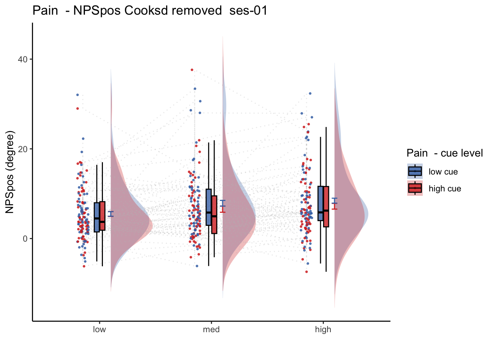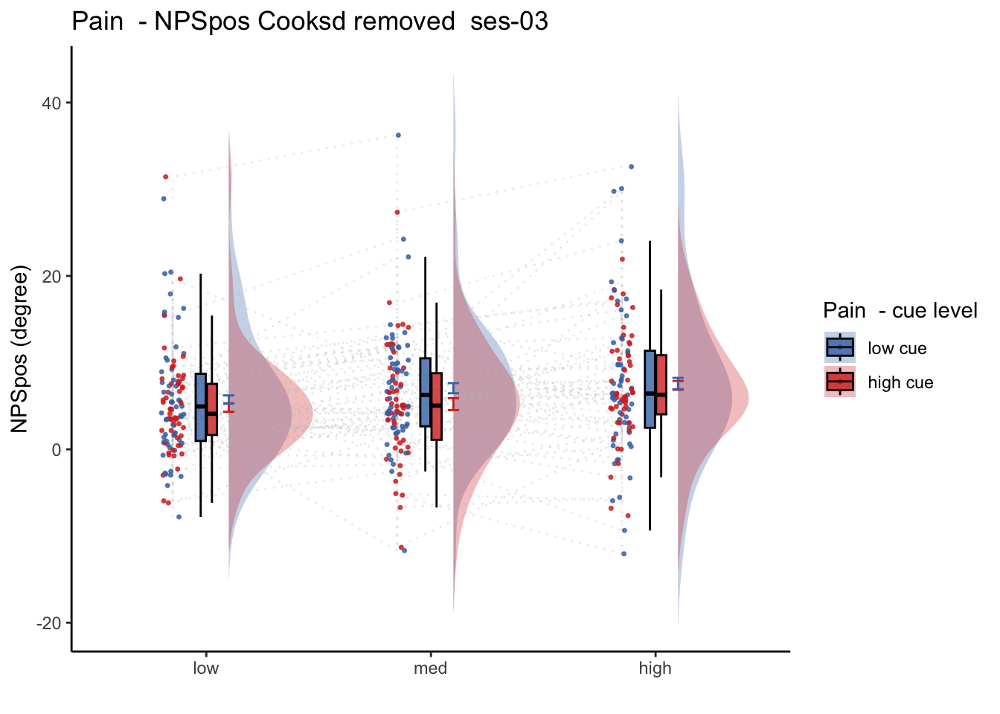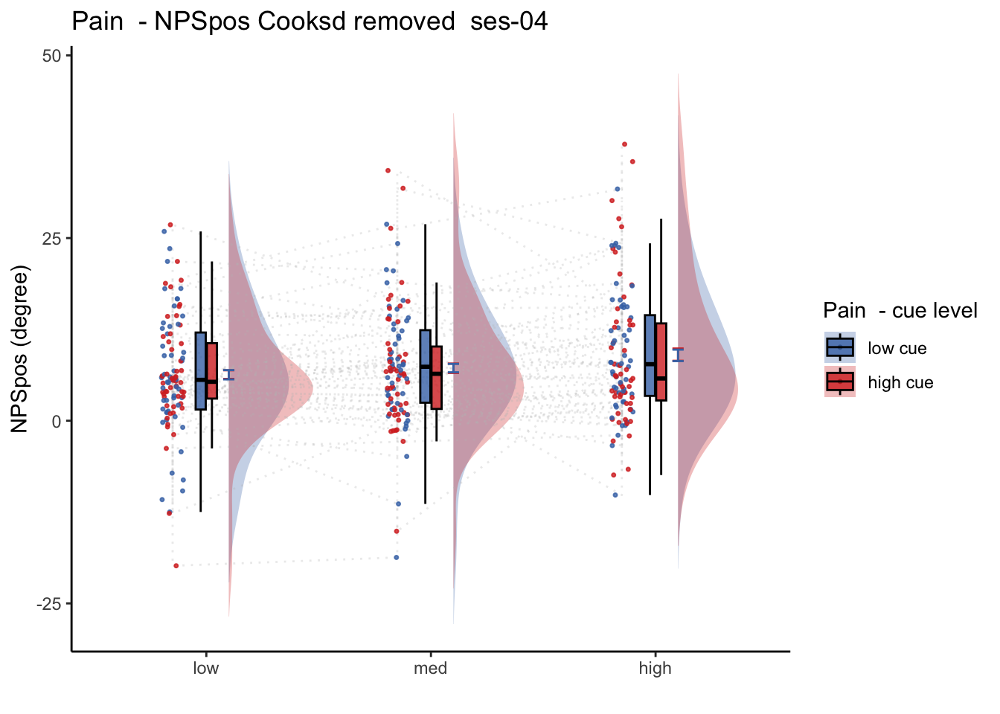


### Here are the stats models: NPS~session * cue * stimulus_intensity
1. Calculate difference score
* average high and low cue within run. 
* calculate difference between high and low cue per run
* each participant has 6 contrast scores
* run this as a function of stimulus intensity and sessions

---

## OUTCOME ~ NPS
### Q. Do higher NPS values indicate higher outcome ratings? (Pain task only) {.unlisted .unnumbered}

> Yes, Higher NPS values are associated with higher outcome ratings. The linear relationship between NPS value and outcome ratings are stronger for conditions where cue level is congruent with stimulus intensity levels. In other words, NPS-outcome rating relationship is stringent in the low cue-low intensity group, as is the case for high cue-ghigh intensity group. 

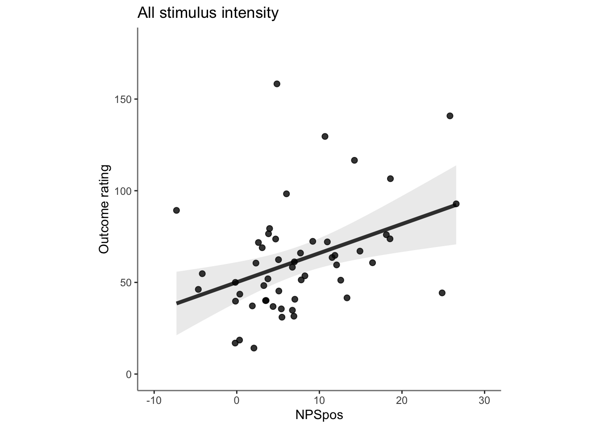

### outcome_rating * cue
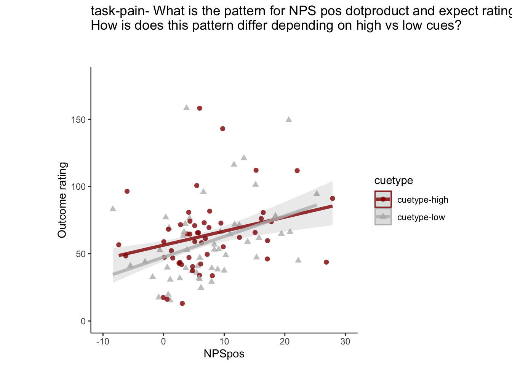


### outcome_ratings * stimulus_intensity * cue
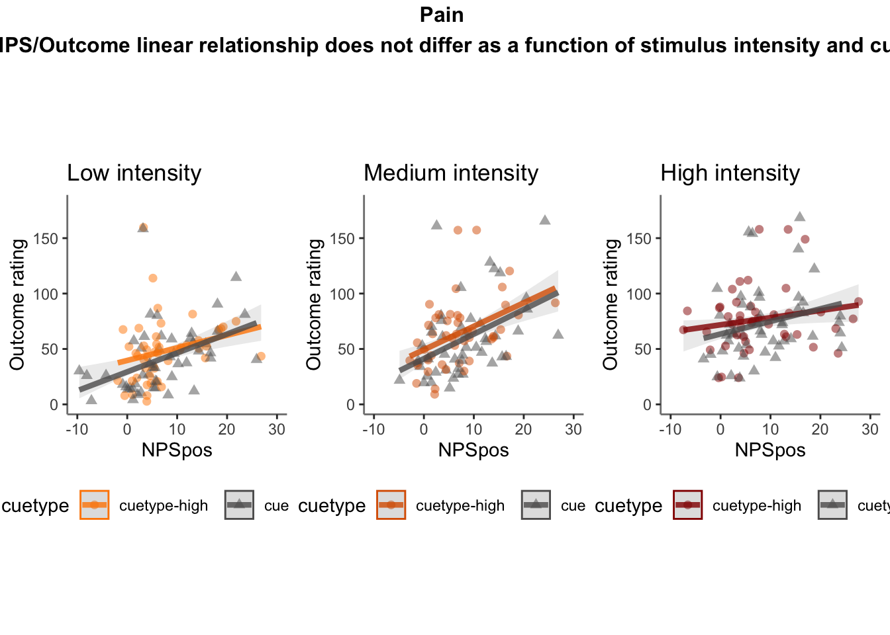

### demeaned outcome rating * cue

```
## `geom_smooth()` using formula = 'y ~ x'
```

```
## Warning: Removed 66 rows containing non-finite values (`stat_smooth()`).
```

```
## `geom_smooth()` using formula = 'y ~ x'
```

```
## Warning: Removed 66 rows containing non-finite values (`stat_smooth()`).
```

```
## Warning: Removed 66 rows containing missing values (`geom_point()`).
```

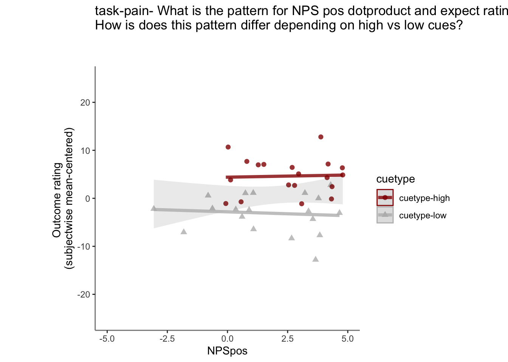

### demeaned_outcome_ratings * stimulus_intensity * cue
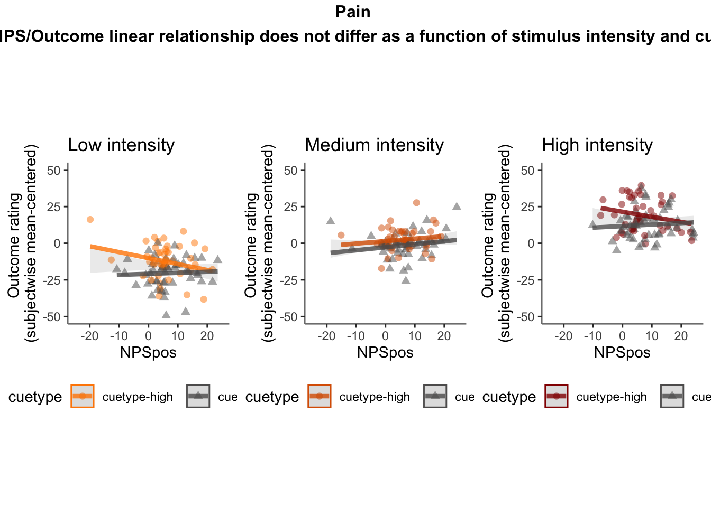

### Is this statistically significant?


```r
# organize variable names
# NPS_demean vs. NPSpos
model.npsoutcome <- lmer(OUTCOME_demean ~ CUE_high_gt_low*STIM_linear*NPSpos + CUE_high_gt_low*STIM_quadratic*NPSpos + (CUE_high_gt_low*STIM*NPSpos|sub), data = demean_dropna)
```

```
## Warning: Model failed to converge with 2 negative eigenvalues: -1.9e-01 -8.4e+00
```

```r
sjPlot::tab_model(model.npsoutcome,
                  title = "Multilevel-modeling: \nlmer(OUTCOME_demean ~ CUE * STIM * NPSpos + (CUE * STIM *NPSpos | sub), data = pvc)",
                  CSS = list(css.table = '+font-size: 12;'))
```

<table style="border-collapse:collapse; border:none;font-size: 12;">
<caption style="font-weight: bold; text-align:left;">Multilevel-modeling: 
lmer(OUTCOME_demean ~ CUE * STIM * NPSpos + (CUE * STIM *NPSpos | sub), data = pvc)</caption>
<tr>
<th style="border-top: double; text-align:center; font-style:italic; font-weight:normal; padding:0.2cm; border-bottom:1px solid black; text-align:left; ">&nbsp;</th>
<th colspan="3" style="border-top: double; text-align:center; font-style:italic; font-weight:normal; padding:0.2cm; border-bottom:1px solid black;">OUTCOME_demean</th>
</tr>
<tr>
<td style=" text-align:center; border-bottom:1px solid; font-style:italic; font-weight:normal; border-bottom:1px solid black; text-align:left; ">Predictors</td>
<td style=" text-align:center; border-bottom:1px solid; font-style:italic; font-weight:normal; border-bottom:1px solid black; ">Estimates</td>
<td style=" text-align:center; border-bottom:1px solid; font-style:italic; font-weight:normal; border-bottom:1px solid black; ">CI</td>
<td style=" text-align:center; border-bottom:1px solid; font-style:italic; font-weight:normal; border-bottom:1px solid black; ">p</td>
</tr>
<tr>
<td style=" padding:0.2cm; text-align:left; vertical-align:top; text-align:left; ">(Intercept)</td>
<td style=" padding:0.2cm; text-align:left; vertical-align:top; text-align:center;  ">&#45;0.94</td>
<td style=" padding:0.2cm; text-align:left; vertical-align:top; text-align:center;  ">&#45;2.07&nbsp;&ndash;&nbsp;0.20</td>
<td style=" padding:0.2cm; text-align:left; vertical-align:top; text-align:center;  ">0.106</td>
</tr>
<tr>
<td style=" padding:0.2cm; text-align:left; vertical-align:top; text-align:left; ">CUE high gt low</td>
<td style=" padding:0.2cm; text-align:left; vertical-align:top; text-align:center;  ">6.85</td>
<td style=" padding:0.2cm; text-align:left; vertical-align:top; text-align:center;  ">4.13&nbsp;&ndash;&nbsp;9.56</td>
<td style=" padding:0.2cm; text-align:left; vertical-align:top; text-align:center;  "><strong>&lt;0.001</strong></td>
</tr>
<tr>
<td style=" padding:0.2cm; text-align:left; vertical-align:top; text-align:left; ">STIM linear</td>
<td style=" padding:0.2cm; text-align:left; vertical-align:top; text-align:center;  ">33.25</td>
<td style=" padding:0.2cm; text-align:left; vertical-align:top; text-align:center;  ">28.03&nbsp;&ndash;&nbsp;38.48</td>
<td style=" padding:0.2cm; text-align:left; vertical-align:top; text-align:center;  "><strong>&lt;0.001</strong></td>
</tr>
<tr>
<td style=" padding:0.2cm; text-align:left; vertical-align:top; text-align:left; ">NPSpos</td>
<td style=" padding:0.2cm; text-align:left; vertical-align:top; text-align:center;  ">0.10</td>
<td style=" padding:0.2cm; text-align:left; vertical-align:top; text-align:center;  ">0.01&nbsp;&ndash;&nbsp;0.19</td>
<td style=" padding:0.2cm; text-align:left; vertical-align:top; text-align:center;  "><strong>0.030</strong></td>
</tr>
<tr>
<td style=" padding:0.2cm; text-align:left; vertical-align:top; text-align:left; ">STIM quadratic</td>
<td style=" padding:0.2cm; text-align:left; vertical-align:top; text-align:center;  ">0.83</td>
<td style=" padding:0.2cm; text-align:left; vertical-align:top; text-align:center;  ">&#45;2.15&nbsp;&ndash;&nbsp;3.80</td>
<td style=" padding:0.2cm; text-align:left; vertical-align:top; text-align:center;  ">0.586</td>
</tr>
<tr>
<td style=" padding:0.2cm; text-align:left; vertical-align:top; text-align:left; ">CUE high gt low * STIM<br>linear</td>
<td style=" padding:0.2cm; text-align:left; vertical-align:top; text-align:center;  ">0.69</td>
<td style=" padding:0.2cm; text-align:left; vertical-align:top; text-align:center;  ">&#45;5.29&nbsp;&ndash;&nbsp;6.68</td>
<td style=" padding:0.2cm; text-align:left; vertical-align:top; text-align:center;  ">0.820</td>
</tr>
<tr>
<td style=" padding:0.2cm; text-align:left; vertical-align:top; text-align:left; ">CUE high gt low * NPSpos</td>
<td style=" padding:0.2cm; text-align:left; vertical-align:top; text-align:center;  ">&#45;0.07</td>
<td style=" padding:0.2cm; text-align:left; vertical-align:top; text-align:center;  ">&#45;0.29&nbsp;&ndash;&nbsp;0.14</td>
<td style=" padding:0.2cm; text-align:left; vertical-align:top; text-align:center;  ">0.510</td>
</tr>
<tr>
<td style=" padding:0.2cm; text-align:left; vertical-align:top; text-align:left; ">STIM linear * NPSpos</td>
<td style=" padding:0.2cm; text-align:left; vertical-align:top; text-align:center;  ">&#45;0.03</td>
<td style=" padding:0.2cm; text-align:left; vertical-align:top; text-align:center;  ">&#45;0.32&nbsp;&ndash;&nbsp;0.26</td>
<td style=" padding:0.2cm; text-align:left; vertical-align:top; text-align:center;  ">0.854</td>
</tr>
<tr>
<td style=" padding:0.2cm; text-align:left; vertical-align:top; text-align:left; ">CUE high gt low * STIM<br>quadratic</td>
<td style=" padding:0.2cm; text-align:left; vertical-align:top; text-align:center;  ">&#45;3.38</td>
<td style=" padding:0.2cm; text-align:left; vertical-align:top; text-align:center;  ">&#45;8.38&nbsp;&ndash;&nbsp;1.62</td>
<td style=" padding:0.2cm; text-align:left; vertical-align:top; text-align:center;  ">0.185</td>
</tr>
<tr>
<td style=" padding:0.2cm; text-align:left; vertical-align:top; text-align:left; ">NPSpos * STIM quadratic</td>
<td style=" padding:0.2cm; text-align:left; vertical-align:top; text-align:center;  ">&#45;0.01</td>
<td style=" padding:0.2cm; text-align:left; vertical-align:top; text-align:center;  ">&#45;0.22&nbsp;&ndash;&nbsp;0.21</td>
<td style=" padding:0.2cm; text-align:left; vertical-align:top; text-align:center;  ">0.949</td>
</tr>
<tr>
<td style=" padding:0.2cm; text-align:left; vertical-align:top; text-align:left; ">(CUE high gt low * STIM<br>linear) * NPSpos</td>
<td style=" padding:0.2cm; text-align:left; vertical-align:top; text-align:center;  ">&#45;0.05</td>
<td style=" padding:0.2cm; text-align:left; vertical-align:top; text-align:center;  ">&#45;0.54&nbsp;&ndash;&nbsp;0.44</td>
<td style=" padding:0.2cm; text-align:left; vertical-align:top; text-align:center;  ">0.830</td>
</tr>
<tr>
<td style=" padding:0.2cm; text-align:left; vertical-align:top; text-align:left; ">(CUE high gt low *<br>NPSpos) * STIM quadratic</td>
<td style=" padding:0.2cm; text-align:left; vertical-align:top; text-align:center;  ">0.10</td>
<td style=" padding:0.2cm; text-align:left; vertical-align:top; text-align:center;  ">&#45;0.30&nbsp;&ndash;&nbsp;0.50</td>
<td style=" padding:0.2cm; text-align:left; vertical-align:top; text-align:center;  ">0.625</td>
</tr>
<tr>
<td colspan="4" style="font-weight:bold; text-align:left; padding-top:.8em;">Random Effects</td>
</tr>

<tr>
<td style=" padding:0.2cm; text-align:left; vertical-align:top; text-align:left; padding-top:0.1cm; padding-bottom:0.1cm;">&sigma;<sup>2</sup></td>
<td style=" padding:0.2cm; text-align:left; vertical-align:top; padding-top:0.1cm; padding-bottom:0.1cm; text-align:center;" colspan="3">225.77</td>
</tr>

<tr>
<td style=" padding:0.2cm; text-align:left; vertical-align:top; text-align:left; padding-top:0.1cm; padding-bottom:0.1cm;">&tau;<sub>00</sub> <sub>sub</sub></td>
<td style=" padding:0.2cm; text-align:left; vertical-align:top; padding-top:0.1cm; padding-bottom:0.1cm; text-align:center;" colspan="3">71.35</td>

<tr>
<td style=" padding:0.2cm; text-align:left; vertical-align:top; text-align:left; padding-top:0.1cm; padding-bottom:0.1cm;">&tau;<sub>11</sub> <sub>sub.CUE_high_gt_low</sub></td>
<td style=" padding:0.2cm; text-align:left; vertical-align:top; padding-top:0.1cm; padding-bottom:0.1cm; text-align:center;" colspan="3">22.32</td>

<tr>
<td style=" padding:0.2cm; text-align:left; vertical-align:top; text-align:left; padding-top:0.1cm; padding-bottom:0.1cm;">&tau;<sub>11</sub> <sub>sub.STIMlow</sub></td>
<td style=" padding:0.2cm; text-align:left; vertical-align:top; padding-top:0.1cm; padding-bottom:0.1cm; text-align:center;" colspan="3">245.73</td>

<tr>
<td style=" padding:0.2cm; text-align:left; vertical-align:top; text-align:left; padding-top:0.1cm; padding-bottom:0.1cm;">&tau;<sub>11</sub> <sub>sub.STIMmed</sub></td>
<td style=" padding:0.2cm; text-align:left; vertical-align:top; padding-top:0.1cm; padding-bottom:0.1cm; text-align:center;" colspan="3">126.99</td>

<tr>
<td style=" padding:0.2cm; text-align:left; vertical-align:top; text-align:left; padding-top:0.1cm; padding-bottom:0.1cm;">&tau;<sub>11</sub> <sub>sub.NPSpos</sub></td>
<td style=" padding:0.2cm; text-align:left; vertical-align:top; padding-top:0.1cm; padding-bottom:0.1cm; text-align:center;" colspan="3">0.07</td>

<tr>
<td style=" padding:0.2cm; text-align:left; vertical-align:top; text-align:left; padding-top:0.1cm; padding-bottom:0.1cm;">&tau;<sub>11</sub> <sub>sub.CUE_high_gt_low:STIMlow</sub></td>
<td style=" padding:0.2cm; text-align:left; vertical-align:top; padding-top:0.1cm; padding-bottom:0.1cm; text-align:center;" colspan="3">53.41</td>

<tr>
<td style=" padding:0.2cm; text-align:left; vertical-align:top; text-align:left; padding-top:0.1cm; padding-bottom:0.1cm;">&tau;<sub>11</sub> <sub>sub.CUE_high_gt_low:STIMmed</sub></td>
<td style=" padding:0.2cm; text-align:left; vertical-align:top; padding-top:0.1cm; padding-bottom:0.1cm; text-align:center;" colspan="3">1.46</td>

<tr>
<td style=" padding:0.2cm; text-align:left; vertical-align:top; text-align:left; padding-top:0.1cm; padding-bottom:0.1cm;">&tau;<sub>11</sub> <sub>sub.CUE_high_gt_low:NPSpos</sub></td>
<td style=" padding:0.2cm; text-align:left; vertical-align:top; padding-top:0.1cm; padding-bottom:0.1cm; text-align:center;" colspan="3">0.12</td>

<tr>
<td style=" padding:0.2cm; text-align:left; vertical-align:top; text-align:left; padding-top:0.1cm; padding-bottom:0.1cm;">&tau;<sub>11</sub> <sub>sub.STIMlow:NPSpos</sub></td>
<td style=" padding:0.2cm; text-align:left; vertical-align:top; padding-top:0.1cm; padding-bottom:0.1cm; text-align:center;" colspan="3">0.18</td>

<tr>
<td style=" padding:0.2cm; text-align:left; vertical-align:top; text-align:left; padding-top:0.1cm; padding-bottom:0.1cm;">&tau;<sub>11</sub> <sub>sub.STIMmed:NPSpos</sub></td>
<td style=" padding:0.2cm; text-align:left; vertical-align:top; padding-top:0.1cm; padding-bottom:0.1cm; text-align:center;" colspan="3">0.15</td>

<tr>
<td style=" padding:0.2cm; text-align:left; vertical-align:top; text-align:left; padding-top:0.1cm; padding-bottom:0.1cm;">&tau;<sub>11</sub> <sub>sub.CUE_high_gt_low:STIMlow:NPSpos</sub></td>
<td style=" padding:0.2cm; text-align:left; vertical-align:top; padding-top:0.1cm; padding-bottom:0.1cm; text-align:center;" colspan="3">0.45</td>

<tr>
<td style=" padding:0.2cm; text-align:left; vertical-align:top; text-align:left; padding-top:0.1cm; padding-bottom:0.1cm;">&tau;<sub>11</sub> <sub>sub.CUE_high_gt_low:STIMmed:NPSpos</sub></td>
<td style=" padding:0.2cm; text-align:left; vertical-align:top; padding-top:0.1cm; padding-bottom:0.1cm; text-align:center;" colspan="3">0.22</td>

<tr>
<td style=" padding:0.2cm; text-align:left; vertical-align:top; text-align:left; padding-top:0.1cm; padding-bottom:0.1cm;">&rho;<sub>01</sub></td>
<td style=" padding:0.2cm; text-align:left; vertical-align:top; padding-top:0.1cm; padding-bottom:0.1cm; text-align:center;" colspan="3">0.28</td>

<tr>
<td style=" padding:0.2cm; text-align:left; vertical-align:top; text-align:left; padding-top:0.1cm; padding-bottom:0.1cm;"></td>
<td style=" padding:0.2cm; text-align:left; vertical-align:top; padding-top:0.1cm; padding-bottom:0.1cm; text-align:center;" colspan="3">-0.97</td>

<tr>
<td style=" padding:0.2cm; text-align:left; vertical-align:top; text-align:left; padding-top:0.1cm; padding-bottom:0.1cm;"></td>
<td style=" padding:0.2cm; text-align:left; vertical-align:top; padding-top:0.1cm; padding-bottom:0.1cm; text-align:center;" colspan="3">-0.96</td>

<tr>
<td style=" padding:0.2cm; text-align:left; vertical-align:top; text-align:left; padding-top:0.1cm; padding-bottom:0.1cm;"></td>
<td style=" padding:0.2cm; text-align:left; vertical-align:top; padding-top:0.1cm; padding-bottom:0.1cm; text-align:center;" colspan="3">-0.33</td>

<tr>
<td style=" padding:0.2cm; text-align:left; vertical-align:top; text-align:left; padding-top:0.1cm; padding-bottom:0.1cm;"></td>
<td style=" padding:0.2cm; text-align:left; vertical-align:top; padding-top:0.1cm; padding-bottom:0.1cm; text-align:center;" colspan="3">-0.61</td>

<tr>
<td style=" padding:0.2cm; text-align:left; vertical-align:top; text-align:left; padding-top:0.1cm; padding-bottom:0.1cm;"></td>
<td style=" padding:0.2cm; text-align:left; vertical-align:top; padding-top:0.1cm; padding-bottom:0.1cm; text-align:center;" colspan="3">0.60</td>

<tr>
<td style=" padding:0.2cm; text-align:left; vertical-align:top; text-align:left; padding-top:0.1cm; padding-bottom:0.1cm;"></td>
<td style=" padding:0.2cm; text-align:left; vertical-align:top; padding-top:0.1cm; padding-bottom:0.1cm; text-align:center;" colspan="3">-0.19</td>

<tr>
<td style=" padding:0.2cm; text-align:left; vertical-align:top; text-align:left; padding-top:0.1cm; padding-bottom:0.1cm;"></td>
<td style=" padding:0.2cm; text-align:left; vertical-align:top; padding-top:0.1cm; padding-bottom:0.1cm; text-align:center;" colspan="3">0.18</td>

<tr>
<td style=" padding:0.2cm; text-align:left; vertical-align:top; text-align:left; padding-top:0.1cm; padding-bottom:0.1cm;"></td>
<td style=" padding:0.2cm; text-align:left; vertical-align:top; padding-top:0.1cm; padding-bottom:0.1cm; text-align:center;" colspan="3">0.65</td>

<tr>
<td style=" padding:0.2cm; text-align:left; vertical-align:top; text-align:left; padding-top:0.1cm; padding-bottom:0.1cm;"></td>
<td style=" padding:0.2cm; text-align:left; vertical-align:top; padding-top:0.1cm; padding-bottom:0.1cm; text-align:center;" colspan="3">-0.07</td>

<tr>
<td style=" padding:0.2cm; text-align:left; vertical-align:top; text-align:left; padding-top:0.1cm; padding-bottom:0.1cm;"></td>
<td style=" padding:0.2cm; text-align:left; vertical-align:top; padding-top:0.1cm; padding-bottom:0.1cm; text-align:center;" colspan="3">-0.77</td>

<tr>
<td style=" padding:0.2cm; text-align:left; vertical-align:top; text-align:left; padding-top:0.1cm; padding-bottom:0.1cm;">N <sub>sub</sub></td>
<td style=" padding:0.2cm; text-align:left; vertical-align:top; padding-top:0.1cm; padding-bottom:0.1cm; text-align:center;" colspan="3">52</td>
<tr>
<td style=" padding:0.2cm; text-align:left; vertical-align:top; text-align:left; padding-top:0.1cm; padding-bottom:0.1cm; border-top:1px solid;">Observations</td>
<td style=" padding:0.2cm; text-align:left; vertical-align:top; padding-top:0.1cm; padding-bottom:0.1cm; text-align:center; border-top:1px solid;" colspan="3">1065</td>
</tr>
<tr>
<td style=" padding:0.2cm; text-align:left; vertical-align:top; text-align:left; padding-top:0.1cm; padding-bottom:0.1cm;">Marginal R<sup>2</sup> / Conditional R<sup>2</sup></td>
<td style=" padding:0.2cm; text-align:left; vertical-align:top; padding-top:0.1cm; padding-bottom:0.1cm; text-align:center;" colspan="3">0.467 / NA</td>
</tr>

</table>


---

## NPS ~ expectation_rating
### Q. What is the relationship betweeen expectation ratings & NPS? (Pain task only) {.unlisted .unnumbered}
Do we see a linear effect between expectation rating and NPS dot products? Also, does this effect differ as a function of cue and stimulus intensity ratings, as is the case for behavioral ratings?

> Quick answer: Yes, expectation ratings predict NPS dotproducts; Also, there tends to be a different relationship depending on cues, just by looking at the figures, although this needs to be tested statistically. 

### NPS ~ expect * cue
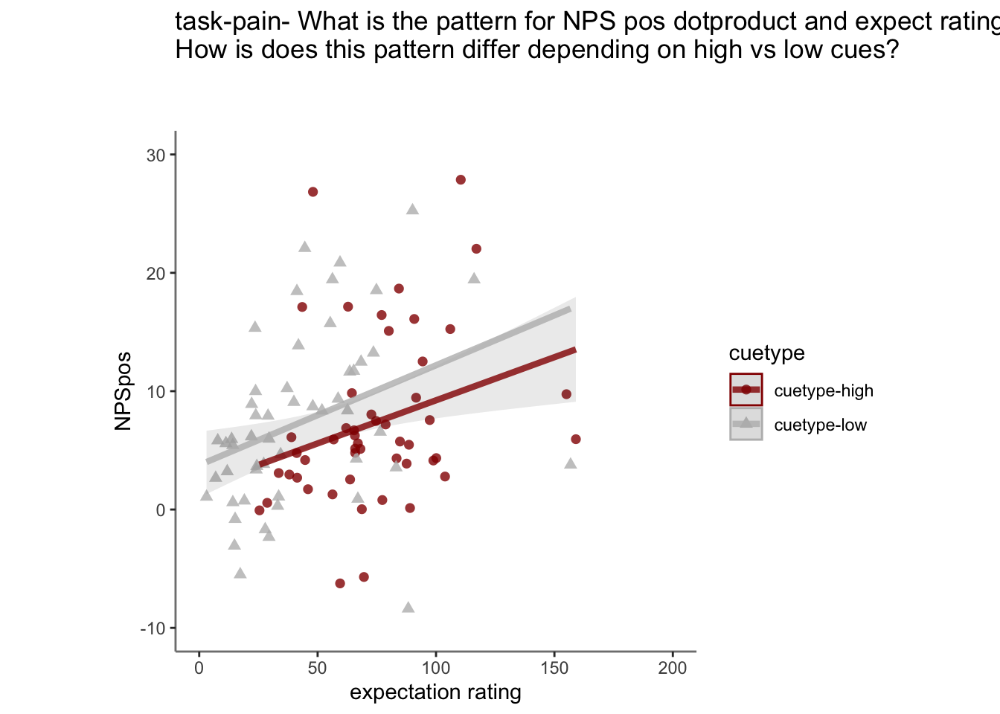

### NPS ~ expect * cue * stim
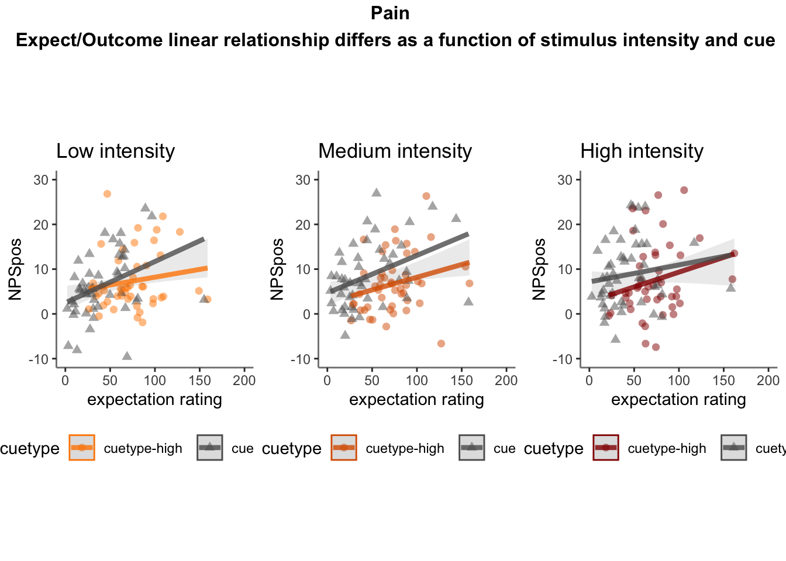


### NPS ~ demeaned_expect * cue
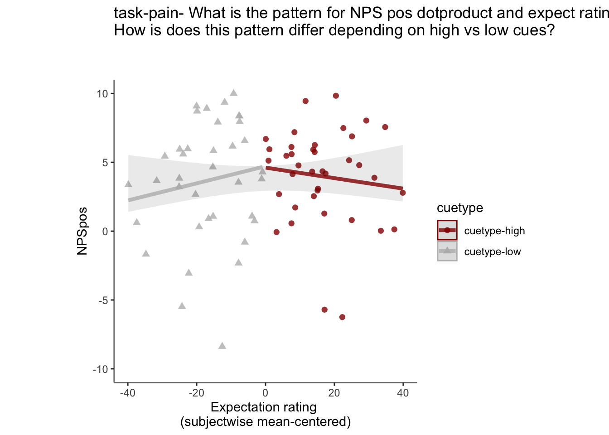

### NPS ~ demeaned_expect * cue * stim
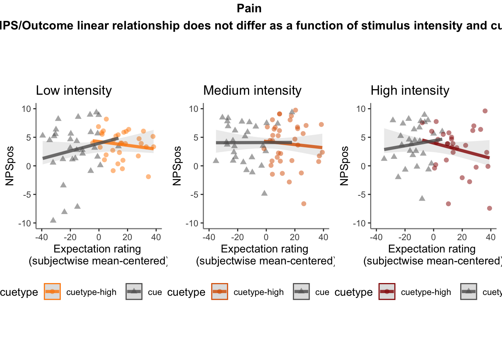


### NPS_demean ~ demeaned_expect * cue
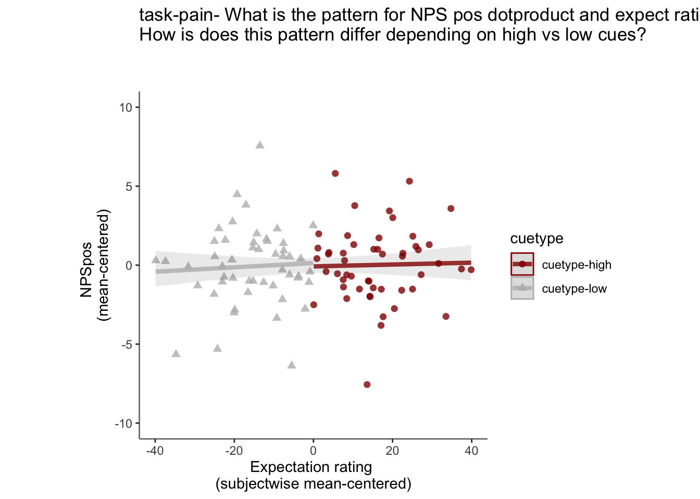

### NPS ~ demeaned_expect * cue * stim
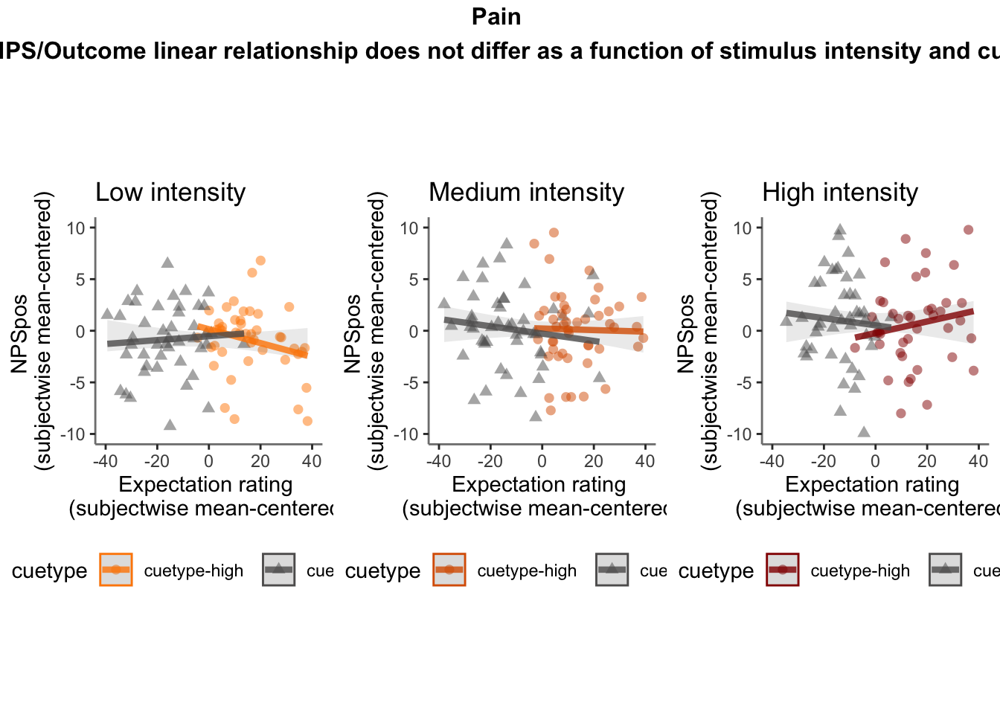

### Is this statistically significant?


```r
model.npsexpectdemean <- lmer(NPSpos ~ 
                          CUE_high_gt_low*STIM_linear*EXPECT_demean + 
                          CUE_high_gt_low*STIM_quadratic*EXPECT_demean + 
                          (CUE_high_gt_low+STIM+EXPECT_demean|sub), data = demean_dropna
                    )
sjPlot::tab_model(model.npsexpectdemean,
                  title = "Multilevel-modeling: \nlmer(NPSpos ~ CUE * STIM * EXPECT_demean + (CUE + STIM + EXPECT_demean| sub), data = pvc)",
                  CSS = list(css.table = '+font-size: 12;'))
```

<table style="border-collapse:collapse; border:none;font-size: 12;">
<caption style="font-weight: bold; text-align:left;">Multilevel-modeling: 
lmer(NPSpos ~ CUE * STIM * EXPECT_demean + (CUE + STIM + EXPECT_demean| sub), data = pvc)</caption>
<tr>
<th style="border-top: double; text-align:center; font-style:italic; font-weight:normal; padding:0.2cm; border-bottom:1px solid black; text-align:left; ">&nbsp;</th>
<th colspan="3" style="border-top: double; text-align:center; font-style:italic; font-weight:normal; padding:0.2cm; border-bottom:1px solid black;">NPSpos</th>
</tr>
<tr>
<td style=" text-align:center; border-bottom:1px solid; font-style:italic; font-weight:normal; border-bottom:1px solid black; text-align:left; ">Predictors</td>
<td style=" text-align:center; border-bottom:1px solid; font-style:italic; font-weight:normal; border-bottom:1px solid black; ">Estimates</td>
<td style=" text-align:center; border-bottom:1px solid; font-style:italic; font-weight:normal; border-bottom:1px solid black; ">CI</td>
<td style=" text-align:center; border-bottom:1px solid; font-style:italic; font-weight:normal; border-bottom:1px solid black; ">p</td>
</tr>
<tr>
<td style=" padding:0.2cm; text-align:left; vertical-align:top; text-align:left; ">(Intercept)</td>
<td style=" padding:0.2cm; text-align:left; vertical-align:top; text-align:center;  ">7.37</td>
<td style=" padding:0.2cm; text-align:left; vertical-align:top; text-align:center;  ">5.30&nbsp;&ndash;&nbsp;9.44</td>
<td style=" padding:0.2cm; text-align:left; vertical-align:top; text-align:center;  "><strong>&lt;0.001</strong></td>
</tr>
<tr>
<td style=" padding:0.2cm; text-align:left; vertical-align:top; text-align:left; ">CUE high gt low</td>
<td style=" padding:0.2cm; text-align:left; vertical-align:top; text-align:center;  ">0.20</td>
<td style=" padding:0.2cm; text-align:left; vertical-align:top; text-align:center;  ">&#45;1.26&nbsp;&ndash;&nbsp;1.67</td>
<td style=" padding:0.2cm; text-align:left; vertical-align:top; text-align:center;  ">0.783</td>
</tr>
<tr>
<td style=" padding:0.2cm; text-align:left; vertical-align:top; text-align:left; ">STIM linear</td>
<td style=" padding:0.2cm; text-align:left; vertical-align:top; text-align:center;  ">1.67</td>
<td style=" padding:0.2cm; text-align:left; vertical-align:top; text-align:center;  ">&#45;0.18&nbsp;&ndash;&nbsp;3.52</td>
<td style=" padding:0.2cm; text-align:left; vertical-align:top; text-align:center;  ">0.077</td>
</tr>
<tr>
<td style=" padding:0.2cm; text-align:left; vertical-align:top; text-align:left; ">EXPECT demean</td>
<td style=" padding:0.2cm; text-align:left; vertical-align:top; text-align:center;  ">&#45;0.02</td>
<td style=" padding:0.2cm; text-align:left; vertical-align:top; text-align:center;  ">&#45;0.05&nbsp;&ndash;&nbsp;0.01</td>
<td style=" padding:0.2cm; text-align:left; vertical-align:top; text-align:center;  ">0.200</td>
</tr>
<tr>
<td style=" padding:0.2cm; text-align:left; vertical-align:top; text-align:left; ">STIM quadratic</td>
<td style=" padding:0.2cm; text-align:left; vertical-align:top; text-align:center;  ">&#45;1.00</td>
<td style=" padding:0.2cm; text-align:left; vertical-align:top; text-align:center;  ">&#45;2.48&nbsp;&ndash;&nbsp;0.48</td>
<td style=" padding:0.2cm; text-align:left; vertical-align:top; text-align:center;  ">0.187</td>
</tr>
<tr>
<td style=" padding:0.2cm; text-align:left; vertical-align:top; text-align:left; ">CUE high gt low * STIM<br>linear</td>
<td style=" padding:0.2cm; text-align:left; vertical-align:top; text-align:center;  ">&#45;1.06</td>
<td style=" padding:0.2cm; text-align:left; vertical-align:top; text-align:center;  ">&#45;4.40&nbsp;&ndash;&nbsp;2.29</td>
<td style=" padding:0.2cm; text-align:left; vertical-align:top; text-align:center;  ">0.535</td>
</tr>
<tr>
<td style=" padding:0.2cm; text-align:left; vertical-align:top; text-align:left; ">CUE high gt low * EXPECT<br>demean</td>
<td style=" padding:0.2cm; text-align:left; vertical-align:top; text-align:center;  ">0.01</td>
<td style=" padding:0.2cm; text-align:left; vertical-align:top; text-align:center;  ">&#45;0.06&nbsp;&ndash;&nbsp;0.07</td>
<td style=" padding:0.2cm; text-align:left; vertical-align:top; text-align:center;  ">0.788</td>
</tr>
<tr>
<td style=" padding:0.2cm; text-align:left; vertical-align:top; text-align:left; ">STIM linear * EXPECT<br>demean</td>
<td style=" padding:0.2cm; text-align:left; vertical-align:top; text-align:center;  ">0.02</td>
<td style=" padding:0.2cm; text-align:left; vertical-align:top; text-align:center;  ">&#45;0.04&nbsp;&ndash;&nbsp;0.09</td>
<td style=" padding:0.2cm; text-align:left; vertical-align:top; text-align:center;  ">0.461</td>
</tr>
<tr>
<td style=" padding:0.2cm; text-align:left; vertical-align:top; text-align:left; ">CUE high gt low * STIM<br>quadratic</td>
<td style=" padding:0.2cm; text-align:left; vertical-align:top; text-align:center;  ">0.83</td>
<td style=" padding:0.2cm; text-align:left; vertical-align:top; text-align:center;  ">&#45;2.05&nbsp;&ndash;&nbsp;3.70</td>
<td style=" padding:0.2cm; text-align:left; vertical-align:top; text-align:center;  ">0.573</td>
</tr>
<tr>
<td style=" padding:0.2cm; text-align:left; vertical-align:top; text-align:left; ">EXPECT demean * STIM<br>quadratic</td>
<td style=" padding:0.2cm; text-align:left; vertical-align:top; text-align:center;  ">&#45;0.04</td>
<td style=" padding:0.2cm; text-align:left; vertical-align:top; text-align:center;  ">&#45;0.10&nbsp;&ndash;&nbsp;0.02</td>
<td style=" padding:0.2cm; text-align:left; vertical-align:top; text-align:center;  ">0.238</td>
</tr>
<tr>
<td style=" padding:0.2cm; text-align:left; vertical-align:top; text-align:left; ">(CUE high gt low * STIM<br>linear) * EXPECT demean</td>
<td style=" padding:0.2cm; text-align:left; vertical-align:top; text-align:center;  ">0.12</td>
<td style=" padding:0.2cm; text-align:left; vertical-align:top; text-align:center;  ">&#45;0.02&nbsp;&ndash;&nbsp;0.26</td>
<td style=" padding:0.2cm; text-align:left; vertical-align:top; text-align:center;  ">0.088</td>
</tr>
<tr>
<td style=" padding:0.2cm; text-align:left; vertical-align:top; text-align:left; ">(CUE high gt low * EXPECT<br>demean) * STIM quadratic</td>
<td style=" padding:0.2cm; text-align:left; vertical-align:top; text-align:center;  ">0.06</td>
<td style=" padding:0.2cm; text-align:left; vertical-align:top; text-align:center;  ">&#45;0.06&nbsp;&ndash;&nbsp;0.19</td>
<td style=" padding:0.2cm; text-align:left; vertical-align:top; text-align:center;  ">0.321</td>
</tr>
<tr>
<td colspan="4" style="font-weight:bold; text-align:left; padding-top:.8em;">Random Effects</td>
</tr>

<tr>
<td style=" padding:0.2cm; text-align:left; vertical-align:top; text-align:left; padding-top:0.1cm; padding-bottom:0.1cm;">&sigma;<sup>2</sup></td>
<td style=" padding:0.2cm; text-align:left; vertical-align:top; padding-top:0.1cm; padding-bottom:0.1cm; text-align:center;" colspan="3">72.24</td>
</tr>

<tr>
<td style=" padding:0.2cm; text-align:left; vertical-align:top; text-align:left; padding-top:0.1cm; padding-bottom:0.1cm;">&tau;<sub>00</sub> <sub>sub</sub></td>
<td style=" padding:0.2cm; text-align:left; vertical-align:top; padding-top:0.1cm; padding-bottom:0.1cm; text-align:center;" colspan="3">58.53</td>

<tr>
<td style=" padding:0.2cm; text-align:left; vertical-align:top; text-align:left; padding-top:0.1cm; padding-bottom:0.1cm;">&tau;<sub>11</sub> <sub>sub.CUE_high_gt_low</sub></td>
<td style=" padding:0.2cm; text-align:left; vertical-align:top; padding-top:0.1cm; padding-bottom:0.1cm; text-align:center;" colspan="3">3.37</td>

<tr>
<td style=" padding:0.2cm; text-align:left; vertical-align:top; text-align:left; padding-top:0.1cm; padding-bottom:0.1cm;">&tau;<sub>11</sub> <sub>sub.STIMlow</sub></td>
<td style=" padding:0.2cm; text-align:left; vertical-align:top; padding-top:0.1cm; padding-bottom:0.1cm; text-align:center;" colspan="3">6.67</td>

<tr>
<td style=" padding:0.2cm; text-align:left; vertical-align:top; text-align:left; padding-top:0.1cm; padding-bottom:0.1cm;">&tau;<sub>11</sub> <sub>sub.STIMmed</sub></td>
<td style=" padding:0.2cm; text-align:left; vertical-align:top; padding-top:0.1cm; padding-bottom:0.1cm; text-align:center;" colspan="3">5.06</td>

<tr>
<td style=" padding:0.2cm; text-align:left; vertical-align:top; text-align:left; padding-top:0.1cm; padding-bottom:0.1cm;">&tau;<sub>11</sub> <sub>sub.EXPECT_demean</sub></td>
<td style=" padding:0.2cm; text-align:left; vertical-align:top; padding-top:0.1cm; padding-bottom:0.1cm; text-align:center;" colspan="3">0.00</td>

<tr>
<td style=" padding:0.2cm; text-align:left; vertical-align:top; text-align:left; padding-top:0.1cm; padding-bottom:0.1cm;">&rho;<sub>01</sub></td>
<td style=" padding:0.2cm; text-align:left; vertical-align:top; padding-top:0.1cm; padding-bottom:0.1cm; text-align:center;" colspan="3">0.39</td>

<tr>
<td style=" padding:0.2cm; text-align:left; vertical-align:top; text-align:left; padding-top:0.1cm; padding-bottom:0.1cm;"></td>
<td style=" padding:0.2cm; text-align:left; vertical-align:top; padding-top:0.1cm; padding-bottom:0.1cm; text-align:center;" colspan="3">-0.62</td>

<tr>
<td style=" padding:0.2cm; text-align:left; vertical-align:top; text-align:left; padding-top:0.1cm; padding-bottom:0.1cm;"></td>
<td style=" padding:0.2cm; text-align:left; vertical-align:top; padding-top:0.1cm; padding-bottom:0.1cm; text-align:center;" colspan="3">-0.25</td>

<tr>
<td style=" padding:0.2cm; text-align:left; vertical-align:top; text-align:left; padding-top:0.1cm; padding-bottom:0.1cm;"></td>
<td style=" padding:0.2cm; text-align:left; vertical-align:top; padding-top:0.1cm; padding-bottom:0.1cm; text-align:center;" colspan="3">0.62</td>

<tr>
<td style=" padding:0.2cm; text-align:left; vertical-align:top; text-align:left; padding-top:0.1cm; padding-bottom:0.1cm;">N <sub>sub</sub></td>
<td style=" padding:0.2cm; text-align:left; vertical-align:top; padding-top:0.1cm; padding-bottom:0.1cm; text-align:center;" colspan="3">52</td>
<tr>
<td style=" padding:0.2cm; text-align:left; vertical-align:top; text-align:left; padding-top:0.1cm; padding-bottom:0.1cm; border-top:1px solid;">Observations</td>
<td style=" padding:0.2cm; text-align:left; vertical-align:top; padding-top:0.1cm; padding-bottom:0.1cm; text-align:center; border-top:1px solid;" colspan="3">1048</td>
</tr>
<tr>
<td style=" padding:0.2cm; text-align:left; vertical-align:top; text-align:left; padding-top:0.1cm; padding-bottom:0.1cm;">Marginal R<sup>2</sup> / Conditional R<sup>2</sup></td>
<td style=" padding:0.2cm; text-align:left; vertical-align:top; padding-top:0.1cm; padding-bottom:0.1cm; text-align:center;" colspan="3">0.025 / NA</td>
</tr>

</table>


```r
demean_dropna$EXPECT <- demean_dropna$event02_expect_angle
model.npsexpect <- lmer(NPSpos ~ 
                          CUE_high_gt_low*STIM_linear*EXPECT + 
                          CUE_high_gt_low*STIM_quadratic*EXPECT + 
                          (CUE_high_gt_low+STIM+EXPECT|sub), data = demean_dropna
                    )
```

```
## Warning: Model failed to converge with 1 negative eigenvalue: -3.4e+01
```

```r
sjPlot::tab_model(model.npsexpect,
                  title = "Multilevel-modeling: \nlmer(NPSpos ~ CUE * STIM * EXPECT + (CUE + STIM + EXPECT| sub), data = pvc)",
                  CSS = list(css.table = '+font-size: 12;'))
```

<table style="border-collapse:collapse; border:none;font-size: 12;">
<caption style="font-weight: bold; text-align:left;">Multilevel-modeling: 
lmer(NPSpos ~ CUE * STIM * EXPECT + (CUE + STIM + EXPECT| sub), data = pvc)</caption>
<tr>
<th style="border-top: double; text-align:center; font-style:italic; font-weight:normal; padding:0.2cm; border-bottom:1px solid black; text-align:left; ">&nbsp;</th>
<th colspan="3" style="border-top: double; text-align:center; font-style:italic; font-weight:normal; padding:0.2cm; border-bottom:1px solid black;">NPSpos</th>
</tr>
<tr>
<td style=" text-align:center; border-bottom:1px solid; font-style:italic; font-weight:normal; border-bottom:1px solid black; text-align:left; ">Predictors</td>
<td style=" text-align:center; border-bottom:1px solid; font-style:italic; font-weight:normal; border-bottom:1px solid black; ">Estimates</td>
<td style=" text-align:center; border-bottom:1px solid; font-style:italic; font-weight:normal; border-bottom:1px solid black; ">CI</td>
<td style=" text-align:center; border-bottom:1px solid; font-style:italic; font-weight:normal; border-bottom:1px solid black; ">p</td>
</tr>
<tr>
<td style=" padding:0.2cm; text-align:left; vertical-align:top; text-align:left; ">(Intercept)</td>
<td style=" padding:0.2cm; text-align:left; vertical-align:top; text-align:center;  ">7.35</td>
<td style=" padding:0.2cm; text-align:left; vertical-align:top; text-align:center;  ">5.11&nbsp;&ndash;&nbsp;9.60</td>
<td style=" padding:0.2cm; text-align:left; vertical-align:top; text-align:center;  "><strong>&lt;0.001</strong></td>
</tr>
<tr>
<td style=" padding:0.2cm; text-align:left; vertical-align:top; text-align:left; ">CUE high gt low</td>
<td style=" padding:0.2cm; text-align:left; vertical-align:top; text-align:center;  ">&#45;0.89</td>
<td style=" padding:0.2cm; text-align:left; vertical-align:top; text-align:center;  ">&#45;3.43&nbsp;&ndash;&nbsp;1.65</td>
<td style=" padding:0.2cm; text-align:left; vertical-align:top; text-align:center;  ">0.494</td>
</tr>
<tr>
<td style=" padding:0.2cm; text-align:left; vertical-align:top; text-align:left; ">STIM linear</td>
<td style=" padding:0.2cm; text-align:left; vertical-align:top; text-align:center;  ">&#45;0.08</td>
<td style=" padding:0.2cm; text-align:left; vertical-align:top; text-align:center;  ">&#45;3.03&nbsp;&ndash;&nbsp;2.87</td>
<td style=" padding:0.2cm; text-align:left; vertical-align:top; text-align:center;  ">0.957</td>
</tr>
<tr>
<td style=" padding:0.2cm; text-align:left; vertical-align:top; text-align:left; ">EXPECT</td>
<td style=" padding:0.2cm; text-align:left; vertical-align:top; text-align:center;  ">&#45;0.00</td>
<td style=" padding:0.2cm; text-align:left; vertical-align:top; text-align:center;  ">&#45;0.03&nbsp;&ndash;&nbsp;0.02</td>
<td style=" padding:0.2cm; text-align:left; vertical-align:top; text-align:center;  ">0.781</td>
</tr>
<tr>
<td style=" padding:0.2cm; text-align:left; vertical-align:top; text-align:left; ">STIM quadratic</td>
<td style=" padding:0.2cm; text-align:left; vertical-align:top; text-align:center;  ">&#45;0.66</td>
<td style=" padding:0.2cm; text-align:left; vertical-align:top; text-align:center;  ">&#45;3.09&nbsp;&ndash;&nbsp;1.77</td>
<td style=" padding:0.2cm; text-align:left; vertical-align:top; text-align:center;  ">0.595</td>
</tr>
<tr>
<td style=" padding:0.2cm; text-align:left; vertical-align:top; text-align:left; ">CUE high gt low * STIM<br>linear</td>
<td style=" padding:0.2cm; text-align:left; vertical-align:top; text-align:center;  ">&#45;8.90</td>
<td style=" padding:0.2cm; text-align:left; vertical-align:top; text-align:center;  ">&#45;14.40&nbsp;&ndash;&nbsp;-3.40</td>
<td style=" padding:0.2cm; text-align:left; vertical-align:top; text-align:center;  "><strong>0.002</strong></td>
</tr>
<tr>
<td style=" padding:0.2cm; text-align:left; vertical-align:top; text-align:left; ">CUE high gt low * EXPECT</td>
<td style=" padding:0.2cm; text-align:left; vertical-align:top; text-align:center;  ">0.01</td>
<td style=" padding:0.2cm; text-align:left; vertical-align:top; text-align:center;  ">&#45;0.02&nbsp;&ndash;&nbsp;0.05</td>
<td style=" padding:0.2cm; text-align:left; vertical-align:top; text-align:center;  ">0.501</td>
</tr>
<tr>
<td style=" padding:0.2cm; text-align:left; vertical-align:top; text-align:left; ">STIM linear * EXPECT</td>
<td style=" padding:0.2cm; text-align:left; vertical-align:top; text-align:center;  ">0.03</td>
<td style=" padding:0.2cm; text-align:left; vertical-align:top; text-align:center;  ">&#45;0.01&nbsp;&ndash;&nbsp;0.07</td>
<td style=" padding:0.2cm; text-align:left; vertical-align:top; text-align:center;  ">0.178</td>
</tr>
<tr>
<td style=" padding:0.2cm; text-align:left; vertical-align:top; text-align:left; ">CUE high gt low * STIM<br>quadratic</td>
<td style=" padding:0.2cm; text-align:left; vertical-align:top; text-align:center;  ">&#45;2.19</td>
<td style=" padding:0.2cm; text-align:left; vertical-align:top; text-align:center;  ">&#45;6.91&nbsp;&ndash;&nbsp;2.54</td>
<td style=" padding:0.2cm; text-align:left; vertical-align:top; text-align:center;  ">0.364</td>
</tr>
<tr>
<td style=" padding:0.2cm; text-align:left; vertical-align:top; text-align:left; ">EXPECT * STIM quadratic</td>
<td style=" padding:0.2cm; text-align:left; vertical-align:top; text-align:center;  ">&#45;0.00</td>
<td style=" padding:0.2cm; text-align:left; vertical-align:top; text-align:center;  ">&#45;0.04&nbsp;&ndash;&nbsp;0.03</td>
<td style=" padding:0.2cm; text-align:left; vertical-align:top; text-align:center;  ">0.879</td>
</tr>
<tr>
<td style=" padding:0.2cm; text-align:left; vertical-align:top; text-align:left; ">(CUE high gt low * STIM<br>linear) * EXPECT</td>
<td style=" padding:0.2cm; text-align:left; vertical-align:top; text-align:center;  ">0.13</td>
<td style=" padding:0.2cm; text-align:left; vertical-align:top; text-align:center;  ">0.05&nbsp;&ndash;&nbsp;0.21</td>
<td style=" padding:0.2cm; text-align:left; vertical-align:top; text-align:center;  "><strong>0.001</strong></td>
</tr>
<tr>
<td style=" padding:0.2cm; text-align:left; vertical-align:top; text-align:left; ">(CUE high gt low *<br>EXPECT) * STIM quadratic</td>
<td style=" padding:0.2cm; text-align:left; vertical-align:top; text-align:center;  ">0.03</td>
<td style=" padding:0.2cm; text-align:left; vertical-align:top; text-align:center;  ">&#45;0.03&nbsp;&ndash;&nbsp;0.10</td>
<td style=" padding:0.2cm; text-align:left; vertical-align:top; text-align:center;  ">0.300</td>
</tr>
<tr>
<td colspan="4" style="font-weight:bold; text-align:left; padding-top:.8em;">Random Effects</td>
</tr>

<tr>
<td style=" padding:0.2cm; text-align:left; vertical-align:top; text-align:left; padding-top:0.1cm; padding-bottom:0.1cm;">&sigma;<sup>2</sup></td>
<td style=" padding:0.2cm; text-align:left; vertical-align:top; padding-top:0.1cm; padding-bottom:0.1cm; text-align:center;" colspan="3">72.11</td>
</tr>

<tr>
<td style=" padding:0.2cm; text-align:left; vertical-align:top; text-align:left; padding-top:0.1cm; padding-bottom:0.1cm;">&tau;<sub>00</sub> <sub>sub</sub></td>
<td style=" padding:0.2cm; text-align:left; vertical-align:top; padding-top:0.1cm; padding-bottom:0.1cm; text-align:center;" colspan="3">36.66</td>

<tr>
<td style=" padding:0.2cm; text-align:left; vertical-align:top; text-align:left; padding-top:0.1cm; padding-bottom:0.1cm;">&tau;<sub>11</sub> <sub>sub.CUE_high_gt_low</sub></td>
<td style=" padding:0.2cm; text-align:left; vertical-align:top; padding-top:0.1cm; padding-bottom:0.1cm; text-align:center;" colspan="3">2.10</td>

<tr>
<td style=" padding:0.2cm; text-align:left; vertical-align:top; text-align:left; padding-top:0.1cm; padding-bottom:0.1cm;">&tau;<sub>11</sub> <sub>sub.STIMlow</sub></td>
<td style=" padding:0.2cm; text-align:left; vertical-align:top; padding-top:0.1cm; padding-bottom:0.1cm; text-align:center;" colspan="3">6.43</td>

<tr>
<td style=" padding:0.2cm; text-align:left; vertical-align:top; text-align:left; padding-top:0.1cm; padding-bottom:0.1cm;">&tau;<sub>11</sub> <sub>sub.STIMmed</sub></td>
<td style=" padding:0.2cm; text-align:left; vertical-align:top; padding-top:0.1cm; padding-bottom:0.1cm; text-align:center;" colspan="3">5.44</td>

<tr>
<td style=" padding:0.2cm; text-align:left; vertical-align:top; text-align:left; padding-top:0.1cm; padding-bottom:0.1cm;">&tau;<sub>11</sub> <sub>sub.EXPECT</sub></td>
<td style=" padding:0.2cm; text-align:left; vertical-align:top; padding-top:0.1cm; padding-bottom:0.1cm; text-align:center;" colspan="3">0.00</td>

<tr>
<td style=" padding:0.2cm; text-align:left; vertical-align:top; text-align:left; padding-top:0.1cm; padding-bottom:0.1cm;">&rho;<sub>01</sub></td>
<td style=" padding:0.2cm; text-align:left; vertical-align:top; padding-top:0.1cm; padding-bottom:0.1cm; text-align:center;" colspan="3">0.28</td>

<tr>
<td style=" padding:0.2cm; text-align:left; vertical-align:top; text-align:left; padding-top:0.1cm; padding-bottom:0.1cm;"></td>
<td style=" padding:0.2cm; text-align:left; vertical-align:top; padding-top:0.1cm; padding-bottom:0.1cm; text-align:center;" colspan="3">-0.61</td>

<tr>
<td style=" padding:0.2cm; text-align:left; vertical-align:top; text-align:left; padding-top:0.1cm; padding-bottom:0.1cm;"></td>
<td style=" padding:0.2cm; text-align:left; vertical-align:top; padding-top:0.1cm; padding-bottom:0.1cm; text-align:center;" colspan="3">-0.29</td>

<tr>
<td style=" padding:0.2cm; text-align:left; vertical-align:top; text-align:left; padding-top:0.1cm; padding-bottom:0.1cm;"></td>
<td style=" padding:0.2cm; text-align:left; vertical-align:top; padding-top:0.1cm; padding-bottom:0.1cm; text-align:center;" colspan="3">0.88</td>

<tr>
<td style=" padding:0.2cm; text-align:left; vertical-align:top; text-align:left; padding-top:0.1cm; padding-bottom:0.1cm;">N <sub>sub</sub></td>
<td style=" padding:0.2cm; text-align:left; vertical-align:top; padding-top:0.1cm; padding-bottom:0.1cm; text-align:center;" colspan="3">52</td>
<tr>
<td style=" padding:0.2cm; text-align:left; vertical-align:top; text-align:left; padding-top:0.1cm; padding-bottom:0.1cm; border-top:1px solid;">Observations</td>
<td style=" padding:0.2cm; text-align:left; vertical-align:top; padding-top:0.1cm; padding-bottom:0.1cm; text-align:center; border-top:1px solid;" colspan="3">1048</td>
</tr>
<tr>
<td style=" padding:0.2cm; text-align:left; vertical-align:top; text-align:left; padding-top:0.1cm; padding-bottom:0.1cm;">Marginal R<sup>2</sup> / Conditional R<sup>2</sup></td>
<td style=" padding:0.2cm; text-align:left; vertical-align:top; padding-top:0.1cm; padding-bottom:0.1cm; text-align:center;" colspan="3">0.032 / NA</td>
</tr>

</table>


```r
demean_dropna$EXPECT <- demean_dropna$event02_expect_angle
model.npsd_expectd <- lmer(NPS_demean ~ 
                          CUE_high_gt_low*STIM_linear*EXPECT_demean + 
                          CUE_high_gt_low*STIM_quadratic*EXPECT_demean + 
                          (CUE_high_gt_low+STIM+EXPECT_demean|sub), data = demean_dropna
                    )
sjPlot::tab_model(model.npsd_expectd,
                  title = "Multilevel-modeling: \nlmer(NPS_demean ~ CUE * STIM * EXPECT_demean + (CUE + STIM + EXPECT_demean| sub), data = pvc)",
                  CSS = list(css.table = '+font-size: 12;'))
```

<table style="border-collapse:collapse; border:none;font-size: 12;">
<caption style="font-weight: bold; text-align:left;">Multilevel-modeling: 
lmer(NPS_demean ~ CUE * STIM * EXPECT_demean + (CUE + STIM + EXPECT_demean| sub), data = pvc)</caption>
<tr>
<th style="border-top: double; text-align:center; font-style:italic; font-weight:normal; padding:0.2cm; border-bottom:1px solid black; text-align:left; ">&nbsp;</th>
<th colspan="3" style="border-top: double; text-align:center; font-style:italic; font-weight:normal; padding:0.2cm; border-bottom:1px solid black;">NPS_demean</th>
</tr>
<tr>
<td style=" text-align:center; border-bottom:1px solid; font-style:italic; font-weight:normal; border-bottom:1px solid black; text-align:left; ">Predictors</td>
<td style=" text-align:center; border-bottom:1px solid; font-style:italic; font-weight:normal; border-bottom:1px solid black; ">Estimates</td>
<td style=" text-align:center; border-bottom:1px solid; font-style:italic; font-weight:normal; border-bottom:1px solid black; ">CI</td>
<td style=" text-align:center; border-bottom:1px solid; font-style:italic; font-weight:normal; border-bottom:1px solid black; ">p</td>
</tr>
<tr>
<td style=" padding:0.2cm; text-align:left; vertical-align:top; text-align:left; ">(Intercept)</td>
<td style=" padding:0.2cm; text-align:left; vertical-align:top; text-align:center;  ">&#45;0.08</td>
<td style=" padding:0.2cm; text-align:left; vertical-align:top; text-align:center;  ">&#45;0.74&nbsp;&ndash;&nbsp;0.57</td>
<td style=" padding:0.2cm; text-align:left; vertical-align:top; text-align:center;  ">0.810</td>
</tr>
<tr>
<td style=" padding:0.2cm; text-align:left; vertical-align:top; text-align:left; ">CUE high gt low</td>
<td style=" padding:0.2cm; text-align:left; vertical-align:top; text-align:center;  ">0.23</td>
<td style=" padding:0.2cm; text-align:left; vertical-align:top; text-align:center;  ">&#45;1.21&nbsp;&ndash;&nbsp;1.67</td>
<td style=" padding:0.2cm; text-align:left; vertical-align:top; text-align:center;  ">0.754</td>
</tr>
<tr>
<td style=" padding:0.2cm; text-align:left; vertical-align:top; text-align:left; ">STIM linear</td>
<td style=" padding:0.2cm; text-align:left; vertical-align:top; text-align:center;  ">1.78</td>
<td style=" padding:0.2cm; text-align:left; vertical-align:top; text-align:center;  ">&#45;0.06&nbsp;&ndash;&nbsp;3.63</td>
<td style=" padding:0.2cm; text-align:left; vertical-align:top; text-align:center;  ">0.058</td>
</tr>
<tr>
<td style=" padding:0.2cm; text-align:left; vertical-align:top; text-align:left; ">EXPECT demean</td>
<td style=" padding:0.2cm; text-align:left; vertical-align:top; text-align:center;  ">&#45;0.02</td>
<td style=" padding:0.2cm; text-align:left; vertical-align:top; text-align:center;  ">&#45;0.05&nbsp;&ndash;&nbsp;0.01</td>
<td style=" padding:0.2cm; text-align:left; vertical-align:top; text-align:center;  ">0.180</td>
</tr>
<tr>
<td style=" padding:0.2cm; text-align:left; vertical-align:top; text-align:left; ">STIM quadratic</td>
<td style=" padding:0.2cm; text-align:left; vertical-align:top; text-align:center;  ">&#45;0.90</td>
<td style=" padding:0.2cm; text-align:left; vertical-align:top; text-align:center;  ">&#45;2.33&nbsp;&ndash;&nbsp;0.53</td>
<td style=" padding:0.2cm; text-align:left; vertical-align:top; text-align:center;  ">0.216</td>
</tr>
<tr>
<td style=" padding:0.2cm; text-align:left; vertical-align:top; text-align:left; ">CUE high gt low * STIM<br>linear</td>
<td style=" padding:0.2cm; text-align:left; vertical-align:top; text-align:center;  ">&#45;0.96</td>
<td style=" padding:0.2cm; text-align:left; vertical-align:top; text-align:center;  ">&#45;4.20&nbsp;&ndash;&nbsp;2.28</td>
<td style=" padding:0.2cm; text-align:left; vertical-align:top; text-align:center;  ">0.561</td>
</tr>
<tr>
<td style=" padding:0.2cm; text-align:left; vertical-align:top; text-align:left; ">CUE high gt low * EXPECT<br>demean</td>
<td style=" padding:0.2cm; text-align:left; vertical-align:top; text-align:center;  ">0.01</td>
<td style=" padding:0.2cm; text-align:left; vertical-align:top; text-align:center;  ">&#45;0.04&nbsp;&ndash;&nbsp;0.06</td>
<td style=" padding:0.2cm; text-align:left; vertical-align:top; text-align:center;  ">0.709</td>
</tr>
<tr>
<td style=" padding:0.2cm; text-align:left; vertical-align:top; text-align:left; ">STIM linear * EXPECT<br>demean</td>
<td style=" padding:0.2cm; text-align:left; vertical-align:top; text-align:center;  ">0.02</td>
<td style=" padding:0.2cm; text-align:left; vertical-align:top; text-align:center;  ">&#45;0.04&nbsp;&ndash;&nbsp;0.09</td>
<td style=" padding:0.2cm; text-align:left; vertical-align:top; text-align:center;  ">0.481</td>
</tr>
<tr>
<td style=" padding:0.2cm; text-align:left; vertical-align:top; text-align:left; ">CUE high gt low * STIM<br>quadratic</td>
<td style=" padding:0.2cm; text-align:left; vertical-align:top; text-align:center;  ">0.74</td>
<td style=" padding:0.2cm; text-align:left; vertical-align:top; text-align:center;  ">&#45;2.04&nbsp;&ndash;&nbsp;3.51</td>
<td style=" padding:0.2cm; text-align:left; vertical-align:top; text-align:center;  ">0.602</td>
</tr>
<tr>
<td style=" padding:0.2cm; text-align:left; vertical-align:top; text-align:left; ">EXPECT demean * STIM<br>quadratic</td>
<td style=" padding:0.2cm; text-align:left; vertical-align:top; text-align:center;  ">&#45;0.04</td>
<td style=" padding:0.2cm; text-align:left; vertical-align:top; text-align:center;  ">&#45;0.09&nbsp;&ndash;&nbsp;0.02</td>
<td style=" padding:0.2cm; text-align:left; vertical-align:top; text-align:center;  ">0.229</td>
</tr>
<tr>
<td style=" padding:0.2cm; text-align:left; vertical-align:top; text-align:left; ">(CUE high gt low * STIM<br>linear) * EXPECT demean</td>
<td style=" padding:0.2cm; text-align:left; vertical-align:top; text-align:center;  ">0.11</td>
<td style=" padding:0.2cm; text-align:left; vertical-align:top; text-align:center;  ">&#45;0.02&nbsp;&ndash;&nbsp;0.24</td>
<td style=" padding:0.2cm; text-align:left; vertical-align:top; text-align:center;  ">0.109</td>
</tr>
<tr>
<td style=" padding:0.2cm; text-align:left; vertical-align:top; text-align:left; ">(CUE high gt low * EXPECT<br>demean) * STIM quadratic</td>
<td style=" padding:0.2cm; text-align:left; vertical-align:top; text-align:center;  ">0.05</td>
<td style=" padding:0.2cm; text-align:left; vertical-align:top; text-align:center;  ">&#45;0.07&nbsp;&ndash;&nbsp;0.17</td>
<td style=" padding:0.2cm; text-align:left; vertical-align:top; text-align:center;  ">0.405</td>
</tr>
<tr>
<td colspan="4" style="font-weight:bold; text-align:left; padding-top:.8em;">Random Effects</td>
</tr>

<tr>
<td style=" padding:0.2cm; text-align:left; vertical-align:top; text-align:left; padding-top:0.1cm; padding-bottom:0.1cm;">&sigma;<sup>2</sup></td>
<td style=" padding:0.2cm; text-align:left; vertical-align:top; padding-top:0.1cm; padding-bottom:0.1cm; text-align:center;" colspan="3">68.35</td>
</tr>

<tr>
<td style=" padding:0.2cm; text-align:left; vertical-align:top; text-align:left; padding-top:0.1cm; padding-bottom:0.1cm;">&tau;<sub>00</sub> <sub>sub</sub></td>
<td style=" padding:0.2cm; text-align:left; vertical-align:top; padding-top:0.1cm; padding-bottom:0.1cm; text-align:center;" colspan="3">3.09</td>

<tr>
<td style=" padding:0.2cm; text-align:left; vertical-align:top; text-align:left; padding-top:0.1cm; padding-bottom:0.1cm;">&tau;<sub>11</sub> <sub>sub.CUE_high_gt_low</sub></td>
<td style=" padding:0.2cm; text-align:left; vertical-align:top; padding-top:0.1cm; padding-bottom:0.1cm; text-align:center;" colspan="3">3.81</td>

<tr>
<td style=" padding:0.2cm; text-align:left; vertical-align:top; text-align:left; padding-top:0.1cm; padding-bottom:0.1cm;">&tau;<sub>11</sub> <sub>sub.STIMlow</sub></td>
<td style=" padding:0.2cm; text-align:left; vertical-align:top; padding-top:0.1cm; padding-bottom:0.1cm; text-align:center;" colspan="3">8.21</td>

<tr>
<td style=" padding:0.2cm; text-align:left; vertical-align:top; text-align:left; padding-top:0.1cm; padding-bottom:0.1cm;">&tau;<sub>11</sub> <sub>sub.STIMmed</sub></td>
<td style=" padding:0.2cm; text-align:left; vertical-align:top; padding-top:0.1cm; padding-bottom:0.1cm; text-align:center;" colspan="3">6.20</td>

<tr>
<td style=" padding:0.2cm; text-align:left; vertical-align:top; text-align:left; padding-top:0.1cm; padding-bottom:0.1cm;">&tau;<sub>11</sub> <sub>sub.EXPECT_demean</sub></td>
<td style=" padding:0.2cm; text-align:left; vertical-align:top; padding-top:0.1cm; padding-bottom:0.1cm; text-align:center;" colspan="3">0.00</td>

<tr>
<td style=" padding:0.2cm; text-align:left; vertical-align:top; text-align:left; padding-top:0.1cm; padding-bottom:0.1cm;">&rho;<sub>01</sub></td>
<td style=" padding:0.2cm; text-align:left; vertical-align:top; padding-top:0.1cm; padding-bottom:0.1cm; text-align:center;" colspan="3">0.60</td>

<tr>
<td style=" padding:0.2cm; text-align:left; vertical-align:top; text-align:left; padding-top:0.1cm; padding-bottom:0.1cm;"></td>
<td style=" padding:0.2cm; text-align:left; vertical-align:top; padding-top:0.1cm; padding-bottom:0.1cm; text-align:center;" colspan="3">-0.99</td>

<tr>
<td style=" padding:0.2cm; text-align:left; vertical-align:top; text-align:left; padding-top:0.1cm; padding-bottom:0.1cm;"></td>
<td style=" padding:0.2cm; text-align:left; vertical-align:top; padding-top:0.1cm; padding-bottom:0.1cm; text-align:center;" colspan="3">-0.99</td>

<tr>
<td style=" padding:0.2cm; text-align:left; vertical-align:top; text-align:left; padding-top:0.1cm; padding-bottom:0.1cm;"></td>
<td style=" padding:0.2cm; text-align:left; vertical-align:top; padding-top:0.1cm; padding-bottom:0.1cm; text-align:center;" colspan="3">-0.46</td>

<tr>
<td style=" padding:0.2cm; text-align:left; vertical-align:top; text-align:left; padding-top:0.1cm; padding-bottom:0.1cm;">N <sub>sub</sub></td>
<td style=" padding:0.2cm; text-align:left; vertical-align:top; padding-top:0.1cm; padding-bottom:0.1cm; text-align:center;" colspan="3">52</td>
<tr>
<td style=" padding:0.2cm; text-align:left; vertical-align:top; text-align:left; padding-top:0.1cm; padding-bottom:0.1cm; border-top:1px solid;">Observations</td>
<td style=" padding:0.2cm; text-align:left; vertical-align:top; padding-top:0.1cm; padding-bottom:0.1cm; text-align:center; border-top:1px solid;" colspan="3">1048</td>
</tr>
<tr>
<td style=" padding:0.2cm; text-align:left; vertical-align:top; text-align:left; padding-top:0.1cm; padding-bottom:0.1cm;">Marginal R<sup>2</sup> / Conditional R<sup>2</sup></td>
<td style=" padding:0.2cm; text-align:left; vertical-align:top; padding-top:0.1cm; padding-bottom:0.1cm; text-align:center;" colspan="3">0.026 / NA</td>
</tr>

</table>
