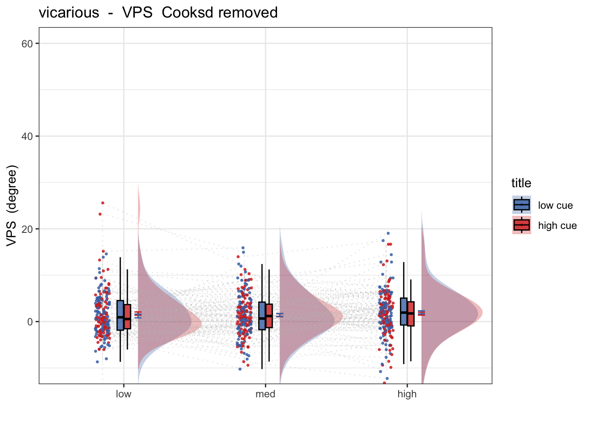
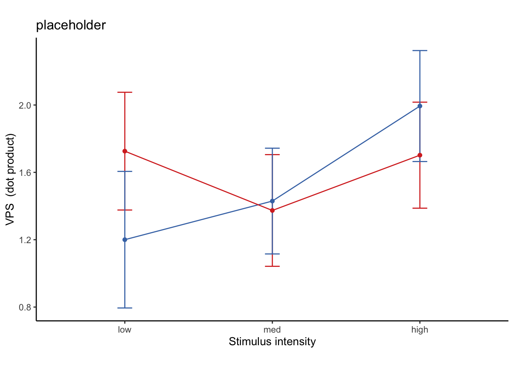
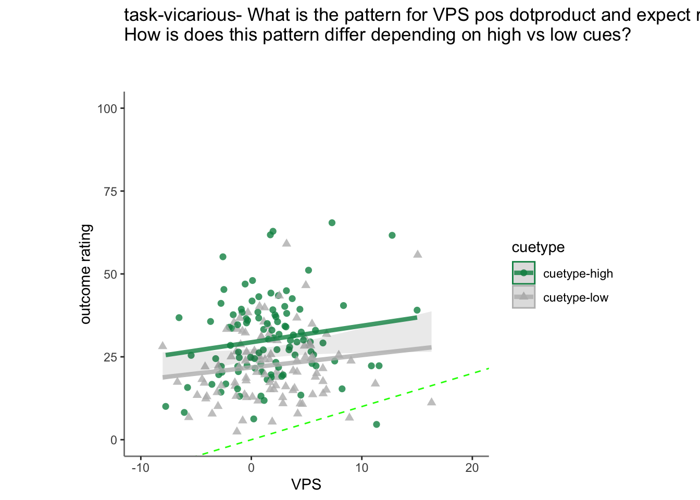
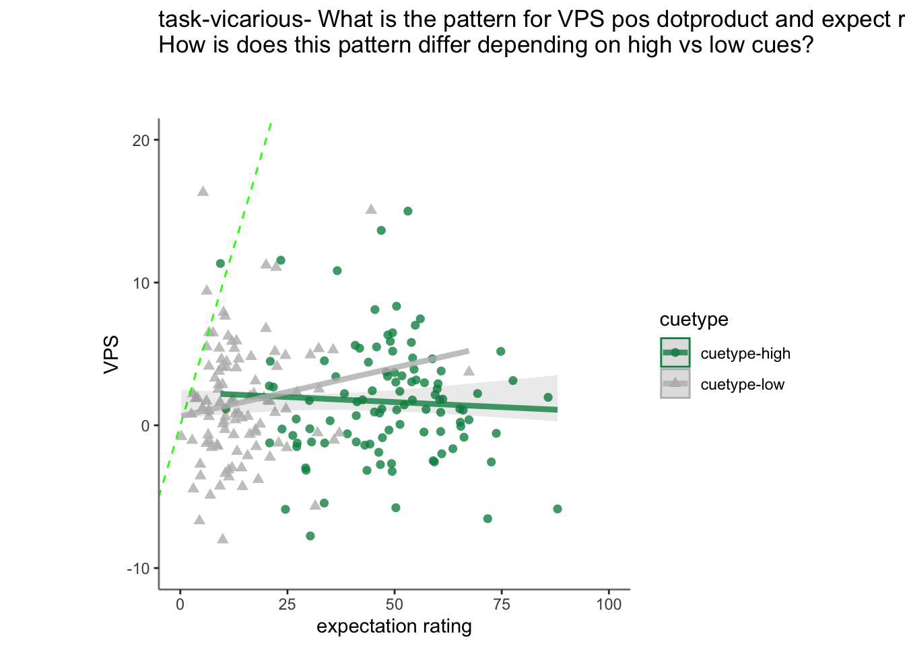

# fMRI Pain signature ~ single trial {#ch36_singletrial_V}

```
author: "Heejung Jung
date: "2023-03-04"
```
color_scheme = c("#C6FF8A", "#63C76E", "#008F51")


## Function {.unlisted .unnumbered}


## Step 1: Common parameters {.unlisted .unnumbered}

```r
# step 1: load data
for (signature_key in c("VPS")) {
     #c("NPS", "NPSpos", "NPSneg", "VPS", #"VPSnooccip", "ThermalPain", "MechPain", "GeneralAversive", "AversiveVisual"
                      #  "ZhouVPS", "PINES",  "GSR", "GeuterPaincPDM")) {
  dv_keyword = signature_key
  signature_name = signature_key
  # step 1: common parameters _______
  main_dir <- dirname(dirname(getwd()))

  analysis_folder  = paste0("model36_iv-task-stim_dv-", signature_key)

  sig_name <-
    Sys.glob(file.path(
      main_dir,
      "analysis/fmri/nilearn/signature_extract",
      paste0(
        "signature-",
        signature_key,
        "_sub-all_runtype-pvc_event-stimulus.tsv"
      )
    )) # nolint
  print(sig_name)
  analysis_dir <-
    file.path(main_dir,
              "analysis",
              "mixedeffect",
              analysis_folder,
              as.character(Sys.Date())) # nolint
  dir.create(analysis_dir,
             showWarnings = FALSE,
             recursive = TRUE)
  savedir <- analysis_dir
  
  # step 2: load data
  df = read.csv(sig_name)
  sig_df = df %>% separate(
    singletrial_fname,
    sep = "_",
    c(
      "sub",
      "ses",
      "run",
      "runtype",
      "event",
      "trial",
      "cuetype",
      "stimintensity"
    )
  )
  sig_df = sig_df %>% separate(
    stimintensity,
    into = c(NA, "stimintensity"),
    extra = "drop",
    fill = "left"
  )
  pvc <- simple_contrasts_singletrial(sig_df)
  pvc$task[pvc$runtype == "runtype-pain"] <- "pain"
  pvc$task[pvc$runtype == "runtype-vicarious"] <- "vicarious"
  pvc$task[pvc$runtype == "runtype-cognitive"] <- "cognitive"
  pvc$task <- factor(pvc$task)
  
  
  # step 3: parameters
  
  taskname = "all"
  plot_keyword = "stimulusintensity"
  ggtitle_phrase =  "(3 tasks x 3 stimulus intensity)"
  
  pvc$task = factor(pvc$task)
  plot_keys <- list(
    sub_mean = "mean_per_sub",
    group_mean = "mean_per_sub_norm_mean",
    legend_keyword = "stimulus intensity",
    se = "se",
    subject = "sub",
    ggtitle = paste0(
      str_to_title(signature_key),
      " dot product: ",
      str_to_title(taskname),
      ' ',
      ggtitle_phrase,
      " (N = ",
      length(unique(pvc$sub)),
      ")"
    ),
    title = paste0(
      str_to_title(signature_key),
      " - ",
      str_to_title(plot_keyword)
    ),
    xlab = "",
    ylab = paste(signature_key, " (dot product)"),
    ylim = c(-250, 500)
  )
  
  # step 4: within between summary
  groupwise <- data.frame()
  subjectwise <- data.frame()
  summary <- summary_for_plots_PVC(
    df = pvc,
    # taskname = taskname,
    groupwise_measurevar = plot_keys$sub_mean,
    # "mean_per_sub",
    subject_keyword = plot_keys$subject,
    # "sub",
    model_iv1 =  "task",
    model_iv2 =  "stim_ordered",
    dv = signature_key #"VPS"
  )
  subjectwise <<- as.data.frame(summary[[1]])
  groupwise <<- as.data.frame(summary[[2]])
  if (any(startsWith(dv_keyword, c("expect", "Expect")))) {
    plot_keys$color <- c("#1B9E77", "#D95F02", "#D95F02")
  } else {
    plot_keys$color <- c("#4575B4", "#FFA500", "#D73027")
  }
  
  # step 5: plot
  
  iv2 = "stim_ordered"
  iv1 = "task"
  taskname = "all"
  if (any(startsWith(dv_keyword, c("expect", "Expect")))) {
    color <- c("#1B9E77", "#D95F02", "#D95F02")
  } else {
    color <- c("#4575B4", "#FFA500", "#D73027")
  }
  subject_mean <- "mean_per_sub"
  sub_mean = subject_mean
  group_mean <- "mean_per_sub_norm_mean"
  se <- "se"
  ylim <- c(-25, 26)
  subject <- "sub"
  ggtitle_phrase <-  "(3 tasks x 3 stimulus intensity)"
  ggtitle <-
    paste0(
      str_to_title(signature_name),
      " dot product: ",
      str_to_title(taskname),
      ' ',
      ggtitle_phrase,
      " (N = ",
      length(unique(pvc$sub)),
      ")"
    )
  
  title <-
    paste0(str_to_title(dv_keyword),
           " - ",
           str_to_title(plot_keys$legend_keyword))
  xlab <- ""
  plot_keyword = "stimintensity"
  ylab <- paste(signature_name, " (dot product)")
  plot2_savefname <- file.path(
    analysis_dir,
    paste(
      "signature_task-",
      taskname,
      "_event-",
      plot_keyword,
      "_dv-",
      signature_key,
      "_",
      as.character(Sys.Date()),
      ".png",
      sep = ""
    )
  )
  p <- plot_halfrainclouds_twofactor(
    subjectwise,
    groupwise,
    iv1,
    iv2,
    subject_mean,
    group_mean,
    se,
    subject,
    ggtitle,
    title,
    xlab,
    ylab,
    taskname,
    ylim,
    w = 10,
    h = 6,
    dv_keyword,
    color,
    plot2_savefname
  )
  p
}
```

```
## [1] "/Users/h/Dropbox (Dartmouth College)/projects_dropbox/social_influence_analysis/analysis/fmri/nilearn/signature_extract/signature-VPS_sub-all_runtype-pvc_event-stimulus.tsv"
```

```
## Warning: Removed 1 rows containing missing values (`geom_half_violin()`).
```

### Load behavioral data {.unlisted .unnumbered}

```r
main_dir = dirname(dirname(getwd()))
print(main_dir)
```

```
## [1] "/Users/h/Dropbox (Dartmouth College)/projects_dropbox/social_influence_analysis"
```

```r
datadir = file.path(main_dir, 'data', 'beh', 'beh02_preproc')
taskname = '*'
subject_varkey <- "src_subject_id"
iv <- "param_stimulus_type"; 
iv_keyword <- "stim"; 
dv <- "event04_actual_angle"; dv_keyword <- "outcome"
exclude <- "sub-0001|sub-0003|sub-0004|sub-0005|sub-0025|sub-0999"

p.df <- load_task_social_df(datadir, taskname = "pain", subject_varkey, iv, dv, exclude)
v.df <- load_task_social_df(datadir, taskname = "vicarious", subject_varkey, iv, dv, exclude)
c.df <- load_task_social_df(datadir, taskname = "cognitive", subject_varkey, iv, dv, exclude)

p.df2= p.df %>%
  arrange(src_subject_id ) %>%
  group_by(src_subject_id) %>%
  mutate(trial_index = row_number())
data_p <- p.df2 %>% 
  group_by(src_subject_id, session_id, param_run_num) %>% 
  mutate(trial_index = row_number(param_run_num))

v.df2= v.df %>%
  arrange(src_subject_id ) %>%
  group_by(src_subject_id) %>%
  mutate(trial_index = row_number())
data_v <- v.df2 %>% 
  group_by(src_subject_id, session_id, param_run_num) %>% 
  mutate(trial_index = row_number(param_run_num))

c.df2= c.df %>%
  arrange(src_subject_id ) %>%
  group_by(src_subject_id) %>%
  mutate(trial_index = row_number()-1)
data_c <- c.df2 %>% 
  group_by(src_subject_id, session_id, param_run_num) %>% 
  mutate(trial_index = row_number(param_run_num) )
p.sub <- data_p[,c("src_subject_id", "session_id", "param_run_num", "param_task_name", "event02_expect_angle", "param_cue_type", "param_stimulus_type", "event04_actual_angle", "trial_index")]
v.sub <- data_v[,c("src_subject_id", "session_id", "param_run_num", "param_task_name", "event02_expect_angle", "param_cue_type", "param_stimulus_type", "event04_actual_angle", "trial_index")]
c.sub <- data_c[,c("src_subject_id", "session_id", "param_run_num", "param_task_name", "event02_expect_angle", "param_cue_type", "param_stimulus_type", "event04_actual_angle", "trial_index")]
# sub, ses, run, runtype, event, trial, cuetype, stimintensity
# src_subject_id, session_id, param_run_num, param_task_name, event02_expect_angle, param_cue_type, param_stimulus_type, event04_actual_angle
pvc.sub = rbind(p.sub, v.sub, c.sub)
```


```r
pvc.sub$trial_ind <- pvc.sub$trial_index -1 
pvc.sub$sub <- sprintf("sub-%04d", pvc.sub$src_subject_id)
pvc.sub$ses <- sprintf("ses-%02d", pvc.sub$session_id)
pvc.sub$run <- sprintf("run-%02d", pvc.sub$param_run_num)
pvc.sub$runtype <- sprintf("runtype-%s", pvc.sub$param_task_name)
pvc.sub$trial <- sprintf("trial-%03d", pvc.sub$trial_ind)
pvc.sub[c('cue', 'DEPc')]  <- str_split_fixed(pvc.sub$param_cue_type , '_', 2)
pvc.sub$cuetype <- sprintf("cuetype-%s", pvc.sub$cue)
pvc.sub[c('stimintensity', 'DEP')]  <- str_split_fixed(pvc.sub$param_stimulus_type , '_', 2)

# merge
pvc.beh <- pvc.sub[,c("sub", "ses", "run", "runtype", "trial", "cuetype", "stimintensity","event02_expect_angle", "event04_actual_angle")]
df_merge <- merge(pvc, pvc.beh, 
                  by.x = c("sub", "ses", "run", "runtype", "trial", "cuetype", "stimintensity"),
                  by.y = c("sub", "ses", "run", "runtype", "trial", "cuetype", "stimintensity")
                  )
```


## PVC all task comparison

```r
# contrast code 1 linear
pvc$task_con_linear[pvc$task == "pain"] <- 0.5
pvc$task_con_linear[pvc$task == "vicarious"] <- 0
pvc$task_con_linear[pvc$task == "cognitive"] <- -0.5

# contrast code 2 quadratic
pvc$task_con_quad[pvc$task == "pain"] <- 0.66
pvc$task_con_quad[pvc$task == "vicarious"] <- -.34
pvc$task_con_quad[pvc$task == "cognitive"] <- -.34

model.alltask <-
  lmer(VPS ~ task_con_linear*stim_factor + 
         task_con_quad*stim_factor + (task|sub), data = pvc)
summary(model.alltask)
```

```
## Linear mixed model fit by REML. t-tests use Satterthwaite's method [
## lmerModLmerTest]
## Formula: VPS ~ task_con_linear * stim_factor + task_con_quad * stim_factor +  
##     (task | sub)
##    Data: pvc
## 
## REML criterion at convergence: 139761.6
## 
## Scaled residuals: 
##     Min      1Q  Median      3Q     Max 
## -9.1820 -0.5261  0.0098  0.5486  8.9135 
## 
## Random effects:
##  Groups   Name          Variance Std.Dev. Corr       
##  sub      (Intercept)   16.59    4.074               
##           taskpain      35.89    5.991    -0.51      
##           taskvicarious 16.74    4.091    -0.68  0.36
##  Residual               74.67    8.641               
## Number of obs: 19428, groups:  sub, 111
## 
## Fixed effects:
##                                  Estimate Std. Error         df t value
## (Intercept)                        1.2430     0.3015   130.6173   4.123
## task_con_linear                   -5.3018     0.9419   164.6488  -5.629
## stim_factorlow                     0.2913     0.1522 19090.4418   1.914
## stim_factormed                     0.2269     0.1522 19090.4418   1.491
## task_con_quad                     -2.1060     0.9129   148.6413  -2.307
## task_con_linear:stim_factorlow    -0.5887     0.7313 19090.4422  -0.805
## task_con_linear:stim_factormed    -1.5442     0.7313 19090.4422  -2.112
## stim_factorlow:task_con_quad       2.6128     0.6391 19090.4422   4.088
## stim_factormed:task_con_quad       2.2080     0.6391 19090.4422   3.455
##                                Pr(>|t|)    
## (Intercept)                    6.61e-05 ***
## task_con_linear                7.65e-08 ***
## stim_factorlow                 0.055677 .  
## stim_factormed                 0.136103    
## task_con_quad                  0.022436 *  
## task_con_linear:stim_factorlow 0.420798    
## task_con_linear:stim_factormed 0.034733 *  
## stim_factorlow:task_con_quad   4.36e-05 ***
## stim_factormed:task_con_quad   0.000552 ***
## ---
## Signif. codes:  0 '***' 0.001 '**' 0.01 '*' 0.05 '.' 0.1 ' ' 1
## 
## Correlation of Fixed Effects:
##                      (Intr) tsk_cn_l stm_fctrl stm_fctrm tsk_cn_q
## task_cn_lnr          -0.192                                      
## stim_fctrlw          -0.252  0.010                               
## stim_fctrmd          -0.252  0.010    0.500                      
## task_con_qd           0.289 -0.766   -0.019    -0.019            
## tsk_cn_lnr:stm_fctrl  0.006 -0.388   -0.025    -0.012     0.300  
## tsk_cn_lnr:stm_fctrm  0.006 -0.388   -0.012    -0.025     0.300  
## stm_fctrl:__         -0.014  0.333    0.054     0.027    -0.350  
## stm_fctrm:__         -0.014  0.333    0.027     0.054    -0.350  
##                      tsk_cn_lnr:stm_fctrl tsk_cn_lnr:stm_fctrm stm_fctrl:__
## task_cn_lnr                                                                
## stim_fctrlw                                                                
## stim_fctrmd                                                                
## task_con_qd                                                                
## tsk_cn_lnr:stm_fctrl                                                       
## tsk_cn_lnr:stm_fctrm  0.500                                                
## stm_fctrl:__         -0.858               -0.429                           
## stm_fctrm:__         -0.429               -0.858                0.500
```

```r
print("eta squared")
```

```
## [1] "eta squared"
```

```r
eta_squared(model.alltask, partial = TRUE)
```

```
## # Effect Size for ANOVA (Type III)
## 
## Parameter                   | Eta2 (partial) |       95% CI
## -----------------------------------------------------------
## task_con_linear             |           0.33 | [0.21, 1.00]
## stim_factor                 |       2.12e-04 | [0.00, 1.00]
## task_con_quad               |       3.42e-03 | [0.00, 1.00]
## task_con_linear:stim_factor |       2.38e-04 | [0.00, 1.00]
## stim_factor:task_con_quad   |       1.01e-03 | [0.00, 1.00]
## 
## - One-sided CIs: upper bound fixed at [1.00].
```

```r
parameters::model_parameters(model.alltask)
```

```
## # Fixed Effects
## 
## Parameter                           | Coefficient |   SE |         95% CI | t(19412) |      p
## ---------------------------------------------------------------------------------------------
## (Intercept)                         |        1.24 | 0.30 | [ 0.65,  1.83] |     4.12 | < .001
## task con linear                     |       -5.30 | 0.94 | [-7.15, -3.46] |    -5.63 | < .001
## stim factor [low]                   |        0.29 | 0.15 | [-0.01,  0.59] |     1.91 | 0.056 
## stim factor [med]                   |        0.23 | 0.15 | [-0.07,  0.53] |     1.49 | 0.136 
## task con quad                       |       -2.11 | 0.91 | [-3.90, -0.32] |    -2.31 | 0.021 
## task con linear * stim factor [low] |       -0.59 | 0.73 | [-2.02,  0.84] |    -0.81 | 0.421 
## task con linear * stim factor [med] |       -1.54 | 0.73 | [-2.98, -0.11] |    -2.11 | 0.035 
## stim factor [low] * task con quad   |        2.61 | 0.64 | [ 1.36,  3.87] |     4.09 | < .001
## stim factor [med] * task con quad   |        2.21 | 0.64 | [ 0.96,  3.46] |     3.45 | < .001
## 
## # Random Effects
## 
## Parameter                          | Coefficient
## ------------------------------------------------
## SD (Intercept: sub)                |        4.07
## SD (taskpain: sub)                 |        5.99
## SD (taskvicarious: sub)            |        4.09
## Cor (Intercept~taskpain: sub)      |       -0.51
## Cor (Intercept~taskvicarious: sub) |       -0.68
## Cor (taskpain~taskvicarious: sub)  |        0.36
## SD (Residual)                      |        8.64
```

```
## 
## Uncertainty intervals (equal-tailed) and p-values (two-tailed) computed
##   using a Wald t-distribution approximation.
```

```r
lme.dscore(model.alltask, pvc, type = "lme4")
```

```
##                                         t         df           d
## task_con_linear                -5.6291153   164.6488 -0.87738633
## stim_factorlow                  1.9136684 19090.4418  0.02770057
## stim_factormed                  1.4905241 19090.4418  0.02157551
## task_con_quad                  -2.3069934   148.6413 -0.37844832
## task_con_linear:stim_factorlow -0.8050546 19090.4422 -0.01165326
## task_con_linear:stim_factormed -2.1116090 19090.4422 -0.03056578
## stim_factorlow:task_con_quad    4.0883679 19090.4422  0.05917959
## stim_factormed:task_con_quad    3.4549197 19090.4422  0.05001036
```

```r
plot_halfrainclouds_twofactor(
  subjectwise,  groupwise,
  iv1 = "task",  iv2 = "stim_ordered",
  sub_mean = "mean_per_sub",  group_mean = "mean_per_sub_norm_mean",
  se = "se",  subject = "sub",
  ggtitle = "All tasks",
  title = "task Stim intensity",
  xlab = "Task",  ylab = paste(signature_key, ' (dot product)'),
  task_name = "all",
  ylim = c(-50, 50),
  w = 10,
  h = 6,
  dv_keyword = "stimulusintensity",
  color = c("red", "yellow", "blue"),
  save_fname = "/Users/h/Desktop/plot_35.png"
) 
```


## Vicarious only Stim x cue interaction


### 2x3 stimulus intensity * cue 

```
## $$
## \begin{aligned}
##   \operatorname{VPS}_{i}  &\sim N \left(\mu, \sigma^2 \right) \\
##     \mu &=\alpha_{j[i]} + \beta_{1}(\operatorname{social\_cue}) + \beta_{2}(\operatorname{stim\_con\_linear}) + \beta_{3}(\operatorname{stim\_con\_quad}) + \beta_{4}(\operatorname{social\_cue} \times \operatorname{stim\_con\_linear}) + \beta_{5}(\operatorname{social\_cue} \times \operatorname{stim\_con\_quad}) \\
##     \alpha_{j}  &\sim N \left(\mu_{\alpha_{j}}, \sigma^2_{\alpha_{j}} \right)
##     \text{, for sub j = 1,} \dots \text{,J}
## \end{aligned}
## $$
```




### Linear model

```
## $$
## \begin{aligned}
##   \operatorname{VPS}_{i}  &\sim N \left(\mu, \sigma^2 \right) \\
##     \mu &=\alpha_{j[i]} + \beta_{1j[i]}(\operatorname{social\_cue}) + \beta_{2j[i]}(\operatorname{stim\_con\_linear}) + \beta_{3j[i]}(\operatorname{stim\_con\_quad}) + \beta_{4j[i]}(\operatorname{social\_cue} \times \operatorname{stim\_con\_linear}) + \beta_{5j[i]}(\operatorname{social\_cue} \times \operatorname{stim\_con\_quad}) \\    
## \left(
##   \begin{array}{c} 
##     \begin{aligned}
##       &\alpha_{j} \\
##       &\beta_{1j} \\
##       &\beta_{2j} \\
##       &\beta_{3j} \\
##       &\beta_{4j} \\
##       &\beta_{5j}
##     \end{aligned}
##   \end{array}
## \right)
##   &\sim N \left(
## \left(
##   \begin{array}{c} 
##     \begin{aligned}
##       &\mu_{\alpha_{j}} \\
##       &\mu_{\beta_{1j}} \\
##       &\mu_{\beta_{2j}} \\
##       &\mu_{\beta_{3j}} \\
##       &\mu_{\beta_{4j}} \\
##       &\mu_{\beta_{5j}}
##     \end{aligned}
##   \end{array}
## \right)
## , 
## \left(
##   \begin{array}{cccccc}
##      \sigma^2_{\alpha_{j}} & \rho_{\alpha_{j}\beta_{1j}} & \rho_{\alpha_{j}\beta_{2j}} & \rho_{\alpha_{j}\beta_{3j}} & \rho_{\alpha_{j}\beta_{4j}} & \rho_{\alpha_{j}\beta_{5j}} \\ 
##      \rho_{\beta_{1j}\alpha_{j}} & \sigma^2_{\beta_{1j}} & \rho_{\beta_{1j}\beta_{2j}} & \rho_{\beta_{1j}\beta_{3j}} & \rho_{\beta_{1j}\beta_{4j}} & \rho_{\beta_{1j}\beta_{5j}} \\ 
##      \rho_{\beta_{2j}\alpha_{j}} & \rho_{\beta_{2j}\beta_{1j}} & \sigma^2_{\beta_{2j}} & \rho_{\beta_{2j}\beta_{3j}} & \rho_{\beta_{2j}\beta_{4j}} & \rho_{\beta_{2j}\beta_{5j}} \\ 
##      \rho_{\beta_{3j}\alpha_{j}} & \rho_{\beta_{3j}\beta_{1j}} & \rho_{\beta_{3j}\beta_{2j}} & \sigma^2_{\beta_{3j}} & \rho_{\beta_{3j}\beta_{4j}} & \rho_{\beta_{3j}\beta_{5j}} \\ 
##      \rho_{\beta_{4j}\alpha_{j}} & \rho_{\beta_{4j}\beta_{1j}} & \rho_{\beta_{4j}\beta_{2j}} & \rho_{\beta_{4j}\beta_{3j}} & \sigma^2_{\beta_{4j}} & \rho_{\beta_{4j}\beta_{5j}} \\ 
##      \rho_{\beta_{5j}\alpha_{j}} & \rho_{\beta_{5j}\beta_{1j}} & \rho_{\beta_{5j}\beta_{2j}} & \rho_{\beta_{5j}\beta_{3j}} & \rho_{\beta_{5j}\beta_{4j}} & \sigma^2_{\beta_{5j}}
##   \end{array}
## \right)
##  \right)
##     \text{, for sub j = 1,} \dots \text{,J}
## \end{aligned}
## $$
## [1] "model:  Vps  ratings -  vicarious"
## Linear mixed model fit by REML. t-tests use Satterthwaite's method [
## lmerModLmerTest]
## Formula: as.formula(model_string)
##    Data: data
## 
## REML criterion at convergence: 30671.7
## 
## Scaled residuals: 
##     Min      1Q  Median      3Q     Max 
## -5.6737 -0.5707  0.0062  0.5748  8.2022 
## 
## Random effects:
##  Groups   Name                       Variance Std.Dev. Corr                   
##  sub      (Intercept)                12.0560  3.4722                          
##           social_cue                  0.1352  0.3677    0.42                  
##           stim_con_linear             0.8497  0.9218    0.49  0.47            
##           stim_con_quad               0.7899  0.8888   -0.15 -0.63 -0.88      
##           social_cue:stim_con_linear  2.6145  1.6169    0.10 -0.72 -0.63  0.92
##           social_cue:stim_con_quad    0.6420  0.8012   -0.65  0.08  0.32 -0.65
##  Residual                            55.4371  7.4456                          
##       
##       
##       
##       
##       
##       
##  -0.74
##       
## Number of obs: 4438, groups:  sub, 104
## 
## Fixed effects:
##                             Estimate Std. Error        df t value Pr(>|t|)    
## (Intercept)                  1.54307    0.36375  96.80309   4.242 5.07e-05 ***
## social_cue                   0.06073    0.22720 310.35883   0.267    0.789    
## stim_con_linear              0.39210    0.29027 127.42101   1.351    0.179    
## stim_con_quad               -0.22162    0.25817 152.40459  -0.858    0.392    
## social_cue:stim_con_linear  -0.05307    0.57324 184.18191  -0.093    0.926    
## social_cue:stim_con_quad    -0.08882    0.48805 551.63068  -0.182    0.856    
## ---
## Signif. codes:  0 '***' 0.001 '**' 0.01 '*' 0.05 '.' 0.1 ' ' 1
## 
## Correlation of Fixed Effects:
##                (Intr) socl_c stm_cn_l stm_cn_q scl_c:stm_cn_l
## social_cue      0.061                                        
## stim_cn_lnr     0.153  0.035                                 
## stim_con_qd    -0.045 -0.038 -0.114                          
## scl_c:stm_cn_l  0.031 -0.028 -0.074    0.094                 
## scl_c:stm_cn_q -0.100  0.010  0.016   -0.052   -0.044        
## optimizer (nloptwrap) convergence code: 0 (OK)
## boundary (singular) fit: see help('isSingular')
## 
## $$
## \begin{aligned}
##   \operatorname{VPS}_{i}  &\sim N \left(\mu, \sigma^2 \right) \\
##     \mu &=\alpha_{j[i]} + \beta_{1j[i]}(\operatorname{social\_cue}) + \beta_{2j[i]}(\operatorname{stim\_con\_linear}) + \beta_{3j[i]}(\operatorname{stim\_con\_quad}) + \beta_{4j[i]}(\operatorname{social\_cue} \times \operatorname{stim\_con\_linear}) + \beta_{5j[i]}(\operatorname{social\_cue} \times \operatorname{stim\_con\_quad}) \\    
## \left(
##   \begin{array}{c} 
##     \begin{aligned}
##       &\alpha_{j} \\
##       &\beta_{1j} \\
##       &\beta_{2j} \\
##       &\beta_{3j} \\
##       &\beta_{4j} \\
##       &\beta_{5j}
##     \end{aligned}
##   \end{array}
## \right)
##   &\sim N \left(
## \left(
##   \begin{array}{c} 
##     \begin{aligned}
##       &\mu_{\alpha_{j}} \\
##       &\mu_{\beta_{1j}} \\
##       &\mu_{\beta_{2j}} \\
##       &\mu_{\beta_{3j}} \\
##       &\mu_{\beta_{4j}} \\
##       &\mu_{\beta_{5j}}
##     \end{aligned}
##   \end{array}
## \right)
## , 
## \left(
##   \begin{array}{cccccc}
##      \sigma^2_{\alpha_{j}} & \rho_{\alpha_{j}\beta_{1j}} & \rho_{\alpha_{j}\beta_{2j}} & \rho_{\alpha_{j}\beta_{3j}} & \rho_{\alpha_{j}\beta_{4j}} & \rho_{\alpha_{j}\beta_{5j}} \\ 
##      \rho_{\beta_{1j}\alpha_{j}} & \sigma^2_{\beta_{1j}} & \rho_{\beta_{1j}\beta_{2j}} & \rho_{\beta_{1j}\beta_{3j}} & \rho_{\beta_{1j}\beta_{4j}} & \rho_{\beta_{1j}\beta_{5j}} \\ 
##      \rho_{\beta_{2j}\alpha_{j}} & \rho_{\beta_{2j}\beta_{1j}} & \sigma^2_{\beta_{2j}} & \rho_{\beta_{2j}\beta_{3j}} & \rho_{\beta_{2j}\beta_{4j}} & \rho_{\beta_{2j}\beta_{5j}} \\ 
##      \rho_{\beta_{3j}\alpha_{j}} & \rho_{\beta_{3j}\beta_{1j}} & \rho_{\beta_{3j}\beta_{2j}} & \sigma^2_{\beta_{3j}} & \rho_{\beta_{3j}\beta_{4j}} & \rho_{\beta_{3j}\beta_{5j}} \\ 
##      \rho_{\beta_{4j}\alpha_{j}} & \rho_{\beta_{4j}\beta_{1j}} & \rho_{\beta_{4j}\beta_{2j}} & \rho_{\beta_{4j}\beta_{3j}} & \sigma^2_{\beta_{4j}} & \rho_{\beta_{4j}\beta_{5j}} \\ 
##      \rho_{\beta_{5j}\alpha_{j}} & \rho_{\beta_{5j}\beta_{1j}} & \rho_{\beta_{5j}\beta_{2j}} & \rho_{\beta_{5j}\beta_{3j}} & \rho_{\beta_{5j}\beta_{4j}} & \sigma^2_{\beta_{5j}}
##   \end{array}
## \right)
##  \right)
##     \text{, for sub j = 1,} \dots \text{,J}
## \end{aligned}
## $$
```

### VPS stimulus intensity Cohen's d = 0.2131521

```
## Linear mixed model fit by REML. t-tests use Satterthwaite's method [
## lmerModLmerTest]
## Formula: 
## VPS ~ stim_con_linear + stim_con_quad + (stim_con_linear + stim_con_quad |  
##     sub)
##    Data: data_screen
## 
## REML criterion at convergence: 30557.2
## 
## Scaled residuals: 
##     Min      1Q  Median      3Q     Max 
## -5.6636 -0.5740  0.0071  0.5821  8.2935 
## 
## Random effects:
##  Groups   Name            Variance Std.Dev. Corr       
##  sub      (Intercept)     12.0464  3.4708              
##           stim_con_linear  0.6547  0.8091    0.56      
##           stim_con_quad    0.4444  0.6667   -0.18 -0.92
##  Residual                 55.7439  7.4662              
## Number of obs: 4420, groups:  sub, 104
## 
## Fixed effects:
##                 Estimate Std. Error       df t value Pr(>|t|)    
## (Intercept)       1.5395     0.3638  96.9481   4.232 5.27e-05 ***
## stim_con_linear   0.3853     0.2876 157.9802   1.340    0.182    
## stim_con_quad    -0.2258     0.2518 146.0413  -0.897    0.371    
## ---
## Signif. codes:  0 '***' 0.001 '**' 0.01 '*' 0.05 '.' 0.1 ' ' 1
## 
## Correlation of Fixed Effects:
##             (Intr) stm_cn_l
## stim_cn_lnr  0.153         
## stim_con_qd -0.042 -0.085  
## optimizer (nloptwrap) convergence code: 0 (OK)
## boundary (singular) fit: see help('isSingular')
```

```
## [1] "eta squared"
```

```
## # Effect Size for ANOVA (Type III)
## 
## Parameter       | Eta2 (partial) |       95% CI
## -----------------------------------------------
## stim_con_linear |           0.01 | [0.00, 1.00]
## stim_con_quad   |       5.47e-03 | [0.00, 1.00]
## 
## - One-sided CIs: upper bound fixed at [1.00].
```

```
## # Fixed Effects
## 
## Parameter       | Coefficient |   SE |        95% CI | t(4410) |      p
## -----------------------------------------------------------------------
## (Intercept)     |        1.54 | 0.36 | [ 0.83, 2.25] |    4.23 | < .001
## stim con linear |        0.39 | 0.29 | [-0.18, 0.95] |    1.34 | 0.180 
## stim con quad   |       -0.23 | 0.25 | [-0.72, 0.27] |   -0.90 | 0.370 
## 
## # Random Effects
## 
## Parameter                                | Coefficient
## ------------------------------------------------------
## SD (Intercept: sub)                      |        3.47
## SD (stim_con_linear: sub)                |        0.81
## SD (stim_con_quad: sub)                  |        0.67
## Cor (Intercept~stim_con_linear: sub)     |        0.56
## Cor (Intercept~stim_con_quad: sub)       |       -0.18
## Cor (stim_con_linear~stim_con_quad: sub) |       -0.92
## SD (Residual)                            |        7.47
```

```
##                          t       df          d
## stim_con_linear  1.3395560 157.9802  0.2131521
## stim_con_quad   -0.8965857 146.0413 -0.1483829
```

### VPS stimulus & cue effect size: stim_d = 0.217, cue_d = 0.013

```
## Linear mixed model fit by REML. t-tests use Satterthwaite's method [
## lmerModLmerTest]
## Formula: 
## VPS ~ cue_con * stim_con_linear + cue_con * stim_con_quad + (cue_con +  
##     stim_factor | sub)
##    Data: data_screen
## 
## REML criterion at convergence: 30556.8
## 
## Scaled residuals: 
##     Min      1Q  Median      3Q     Max 
## -5.6760 -0.5728  0.0047  0.5794  8.2526 
## 
## Random effects:
##  Groups   Name           Variance Std.Dev. Corr             
##  sub      (Intercept)    14.25491 3.7756                    
##           cue_con         0.02276 0.1509    0.97            
##           stim_factorlow  0.65847 0.8115   -0.67 -0.48      
##           stim_factormed  1.08257 1.0405   -0.47 -0.25  0.97
##  Residual                55.77751 7.4684                    
## Number of obs: 4420, groups:  sub, 104
## 
## Fixed effects:
##                           Estimate Std. Error         df t value Pr(>|t|)    
## (Intercept)                1.53878    0.36362   96.91906   4.232 5.27e-05 ***
## cue_con                    0.08422    0.22548 2920.30961   0.374    0.709    
## stim_con_linear            0.38699    0.28783  153.46942   1.345    0.181    
## stim_con_quad             -0.22599    0.25176  138.57153  -0.898    0.371    
## cue_con:stim_con_linear    0.02662    0.54974 4231.82383   0.048    0.961    
## cue_con:stim_con_quad     -0.08653    0.48351 4233.57506  -0.179    0.858    
## ---
## Signif. codes:  0 '***' 0.001 '**' 0.01 '*' 0.05 '.' 0.1 ' ' 1
## 
## Correlation of Fixed Effects:
##               (Intr) cue_cn stm_cn_l stm_cn_q c_cn:stm_cn_l
## cue_con        0.059                                       
## stim_cn_lnr    0.154  0.020                                
## stim_con_qd   -0.044 -0.003 -0.084                         
## c_cn:stm_cn_l  0.006  0.011 -0.009   -0.008                
## c_cn:stm_cn_q  0.002  0.007 -0.006   -0.011   -0.007       
## optimizer (nloptwrap) convergence code: 0 (OK)
## boundary (singular) fit: see help('isSingular')
```

```
## [1] "eta squared"
```

```
## # Effect Size for ANOVA (Type III)
## 
## Parameter               | Eta2 (partial) |       95% CI
## -------------------------------------------------------
## cue_con                 |       4.78e-05 | [0.00, 1.00]
## stim_con_linear         |           0.01 | [0.00, 1.00]
## stim_con_quad           |       5.78e-03 | [0.00, 1.00]
## cue_con:stim_con_linear |       5.54e-07 | [0.00, 1.00]
## cue_con:stim_con_quad   |       7.56e-06 | [0.00, 1.00]
## 
## - One-sided CIs: upper bound fixed at [1.00].
```

```
##                                   t        df            d
## cue_con                  0.37351722 2920.3096  0.013823760
## stim_con_linear          1.34450856  153.4694  0.217061418
## stim_con_quad           -0.89765922  138.5715 -0.152512167
## cue_con:stim_con_linear  0.04842557 4231.8238  0.001488816
## cue_con:stim_con_quad   -0.17895831 4233.5751 -0.005500830
```


### Lineplots

```r
plot_lineplot_twofactor(actual_groupwise, taskname = "vicarious", 
                        iv1 = "stim_ordered", iv2 = "cue_ordered", 
                        mean = "mean_per_sub_norm_mean", error = "se",
                        color = c("#4575B4", "#D73027"), ggtitle = "placeholder", 
                        xlab = "Stimulus intensity", ylab = paste(signature_key, " (dot product)"))
```



### Linear model with Stim x Cue x Expectation rating

```r
model.vps3factor <- lmer(VPS ~ cue_con*stim_con_linear*event02_expect_angle + cue_con*stim_con_quad*event02_expect_angle + (cue_con|sub), data = data_screen)
```

```
## boundary (singular) fit: see help('isSingular')
```

```r
summary(model.vps3factor)
```

```
## Linear mixed model fit by REML. t-tests use Satterthwaite's method [
## lmerModLmerTest]
## Formula: VPS ~ cue_con * stim_con_linear * event02_expect_angle + cue_con *  
##     stim_con_quad * event02_expect_angle + (cue_con | sub)
##    Data: data_screen
## 
## REML criterion at convergence: 29312.5
## 
## Scaled residuals: 
##     Min      1Q  Median      3Q     Max 
## -5.8143 -0.5715  0.0017  0.5741  8.0847 
## 
## Random effects:
##  Groups   Name        Variance Std.Dev. Corr
##  sub      (Intercept) 12.03471 3.4691       
##           cue_con      0.01688 0.1299   1.00
##  Residual             56.37759 7.5085       
## Number of obs: 4230, groups:  sub, 104
## 
## Fixed effects:
##                                                Estimate Std. Error         df
## (Intercept)                                   1.237e+00  4.276e-01  1.753e+02
## cue_con                                      -1.486e-01  4.825e-01  3.376e+03
## stim_con_linear                               3.205e-01  5.562e-01  4.123e+03
## event02_expect_angle                          1.098e-02  7.785e-03  3.439e+03
## stim_con_quad                                -1.352e-01  4.869e-01  4.120e+03
## cue_con:stim_con_linear                       3.279e-01  1.113e+00  4.125e+03
## cue_con:event02_expect_angle                 -2.978e-03  1.461e-02  3.433e+03
## stim_con_linear:event02_expect_angle          8.301e-03  1.695e-02  4.125e+03
## cue_con:stim_con_quad                         3.254e-01  9.743e-01  4.120e+03
## event02_expect_angle:stim_con_quad           -5.259e-03  1.400e-02  4.121e+03
## cue_con:stim_con_linear:event02_expect_angle -2.059e-02  3.394e-02  4.127e+03
## cue_con:event02_expect_angle:stim_con_quad    3.381e-04  2.801e-02  4.121e+03
##                                              t value Pr(>|t|)   
## (Intercept)                                    2.893   0.0043 **
## cue_con                                       -0.308   0.7581   
## stim_con_linear                                0.576   0.5645   
## event02_expect_angle                           1.411   0.1584   
## stim_con_quad                                 -0.278   0.7813   
## cue_con:stim_con_linear                        0.295   0.7684   
## cue_con:event02_expect_angle                  -0.204   0.8385   
## stim_con_linear:event02_expect_angle           0.490   0.6243   
## cue_con:stim_con_quad                          0.334   0.7384   
## event02_expect_angle:stim_con_quad            -0.376   0.7073   
## cue_con:stim_con_linear:event02_expect_angle  -0.607   0.5440   
## cue_con:event02_expect_angle:stim_con_quad     0.012   0.9904   
## ---
## Signif. codes:  0 '***' 0.001 '**' 0.01 '*' 0.05 '.' 0.1 ' ' 1
## 
## Correlation of Fixed Effects:
##               (Intr) cue_cn stm_cn_l ev02__ stm_cn_q c_cn:stm_cn_l c_c:02__
## cue_con        0.307                                                       
## stim_cn_lnr    0.009  0.024                                                
## evnt02_xpc_   -0.449 -0.140 -0.015                                         
## stim_con_qd    0.003  0.013 -0.014    0.025                                
## c_cn:stm_cn_l  0.016  0.018  0.469   -0.008 -0.021                         
## c_cn:vn02__   -0.042 -0.724 -0.015   -0.424 -0.014   -0.027                
## stm_c_:02__   -0.014 -0.007 -0.728    0.056  0.018   -0.108        -0.034  
## c_cn:stm_cn_q  0.008  0.007 -0.023   -0.007  0.476   -0.015         0.021  
## evnt02__:__    0.018 -0.011  0.019   -0.081 -0.730    0.012         0.056  
## c_c:__:02__   -0.007 -0.029 -0.110   -0.031  0.011   -0.729         0.069  
## c_c:02__:__   -0.006  0.028  0.013    0.046 -0.124    0.020        -0.079  
##               s__:02 c_cn:stm_cn_q e02__: c_:__:
## cue_con                                         
## stim_cn_lnr                                     
## evnt02_xpc_                                     
## stim_con_qd                                     
## c_cn:stm_cn_l                                   
## c_cn:vn02__                                     
## stm_c_:02__                                     
## c_cn:stm_cn_q  0.013                            
## evnt02__:__   -0.046 -0.124                     
## c_c:__:02__   -0.421  0.017         0.020       
## c_c:02__:__    0.018 -0.730        -0.400 -0.046
## optimizer (nloptwrap) convergence code: 0 (OK)
## boundary (singular) fit: see help('isSingular')
```

```r
print("eta squared")
```

```
## [1] "eta squared"
```

```r
eta_squared(model.vps3factor, partial = TRUE)
```

```
## # Effect Size for ANOVA (Type III)
## 
## Parameter                                    | Eta2 (partial) |       95% CI
## ----------------------------------------------------------------------------
## cue_con                                      |       2.81e-05 | [0.00, 1.00]
## stim_con_linear                              |       8.05e-05 | [0.00, 1.00]
## event02_expect_angle                         |       5.78e-04 | [0.00, 1.00]
## stim_con_quad                                |       1.87e-05 | [0.00, 1.00]
## cue_con:stim_con_linear                      |       2.10e-05 | [0.00, 1.00]
## cue_con:event02_expect_angle                 |       1.21e-05 | [0.00, 1.00]
## stim_con_linear:event02_expect_angle         |       5.82e-05 | [0.00, 1.00]
## cue_con:stim_con_quad                        |       2.71e-05 | [0.00, 1.00]
## event02_expect_angle:stim_con_quad           |       3.42e-05 | [0.00, 1.00]
## cue_con:stim_con_linear:event02_expect_angle |       8.92e-05 | [0.00, 1.00]
## cue_con:event02_expect_angle:stim_con_quad   |       3.53e-08 | [0.00, 1.00]
## 
## - One-sided CIs: upper bound fixed at [1.00].
```

```r
#parameters::model_parameters(model.vps3factor)
lme.dscore(model.vps3factor, data_screen, type = "lme4")
```

```
## boundary (singular) fit: see help('isSingular')
```

```
##                                                        t       df             d
## cue_con                                      -0.30798646 3375.733 -0.0106017499
## stim_con_linear                               0.57627798 4122.869  0.0179499090
## event02_expect_angle                          1.41074769 3438.911  0.0481137115
## stim_con_quad                                -0.27769899 4120.037 -0.0086527414
## cue_con:stim_con_linear                       0.29454204 4124.835  0.0091722107
## cue_con:event02_expect_angle                 -0.20381014 3432.844 -0.0069571080
## stim_con_linear:event02_expect_angle          0.48977791 4124.654  0.0152523026
## cue_con:stim_con_quad                         0.33395313 4120.459  0.0104050147
## event02_expect_angle:stim_con_quad           -0.37557287 4121.327 -0.0117005343
## cue_con:stim_con_linear:event02_expect_angle -0.60681060 4126.822 -0.0188918854
## cue_con:event02_expect_angle:stim_con_quad    0.01206889 4121.074  0.0003760037
```


## Vicarious only: Outcome ratings & VPS

```r
# plot parameters
iv1 = "event04_actual_angle"; iv2 = signature_key
subject = "sub"
xlab = "Outcome rating"; ylab = signature_key
ggtitle = "All stimulus intensity"
alpha = 0.8; lm_method = "lm"
p.sig <- df_merge[df_merge$runtype == "runtype-vicarious",]
df_dropna <- p.sig[!is.na(p.sig[, iv1]) & !is.na(p.sig[, iv2]), ]
subjectwise_2dv <- meanSummary_2dv(
        df_dropna,
        c(subject),
        iv1, iv2
    )
    subjectwise_naomit_2dv <- na.omit(subjectwise_2dv)
    g <- ggplot(
        data = subjectwise_naomit_2dv,
        aes(
            x = .data[["DV1_mean_per_sub"]],
            y = .data[["DV2_mean_per_sub"]],
        )
    ) +
        geom_point(
          size = 2,
            alpha = alpha) +
        # geom_abline(
        #     intercept = 0, slope = 1, color = "green",
        #     linetype = "dashed", linewidth = 0.5
        # ) +
        theme(aspect.ratio = 1) +
        #scale_color_manual(values = color_scheme) +
        scale_shape_manual(values = c(16, 17)) +
        xlab(xlab) +
        ylab(ylab) +
        ylim(-10, 30) +
        xlim(0,180) +
        ggtitle(ggtitle) +
        theme(
            axis.line = element_line(colour = "grey50"),
            panel.background = element_blank(),
            plot.subtitle = ggtext::element_textbox_simple(size = 11)
        ) +
              geom_ribbon(stat = "smooth", method = lm_method, se = TRUE, alpha = 0.1,
              aes(color = NULL)) +
        geom_line(stat = "smooth", method = lm_method, alpha = 0.8, size = 1.5)
```

```
## Warning: Using `size` aesthetic for lines was deprecated in ggplot2 3.4.0.
## ℹ Please use `linewidth` instead.
```

```r
    g
```

```
## `geom_smooth()` using formula = 'y ~ x'
## `geom_smooth()` using formula = 'y ~ x'
```


### outcome ratings * cue

```r
p.sig <- df_merge[df_merge$runtype == "runtype-vicarious",]
iv2 = "event04_actual_angle"; iv1 = signature_key
df_dropna <-
  p.sig[!is.na(p.sig$event04_actual_angle) & !is.na(p.sig$VPS),]
total <-
  plot_twovariable(
    df_dropna, iv1, iv2,
    group = "cuetype", subject = "sub",
    ymin =0, ymax = 100, xmin = -10, xmax = 20,
    ylab = "outcome rating",
    xlab = signature_key, 
    ggtitle = "all stimulus intensity", 
    color_scheme = c("cuetype-high" ="#008F51","cuetype-low" =  "#BBBBBB"), 
    alpha = .8, fit_lm = TRUE, lm_method ="lm"
  )
total + labs(title =paste0("task-",taskname, "- What is the pattern for VPS pos dotproduct and expect ratings? \nHow is does this pattern differ depending on high vs low cues?\n\n")
          )
```

```
## `geom_smooth()` using formula = 'y ~ x'
## `geom_smooth()` using formula = 'y ~ x'
```


### outcome ratings * stim * cue


## Vicarious only: Expectation ratings & VPS

```r
p.sig <- df_merge[df_merge$runtype == "runtype-vicarious",]
iv1 = "event02_expect_angle"; iv2 = signature_key
df_dropna <-
  p.sig[!is.na(p.sig$event02_expect_angle) & !is.na(p.sig$VPS),]
total <-
  plot_twovariable(
    df_dropna, iv1, iv2,
    group = "cuetype", subject = "sub",
    xmin =0, xmax = 100, ymin = -10, ymax = 20,
    xlab = "expectation rating",
    ylab = signature_key, 
    ggtitle = "all stimulus intensity", 
    color_scheme = c("cuetype-high" ="#008F51","cuetype-low" =  "#BBBBBB"), 
    alpha = .8, fit_lm = TRUE, lm_method = "lm"
  )


total + labs(title =paste0("task-",taskname, "- What is the pattern for VPS pos dotproduct and expect ratings? \nHow is does this pattern differ depending on high vs low cues?\n\n")
          )
```

```
## `geom_smooth()` using formula = 'y ~ x'
## `geom_smooth()` using formula = 'y ~ x'
```



```r
  # geom_line(method="lm", alpha=0.3, size=1, span=0.5) # geom_smooth(method=lm, se = TRUE) 
# +geom_smooth(method = "lm", alpha=0.1, size=0, span=0.5)
```


