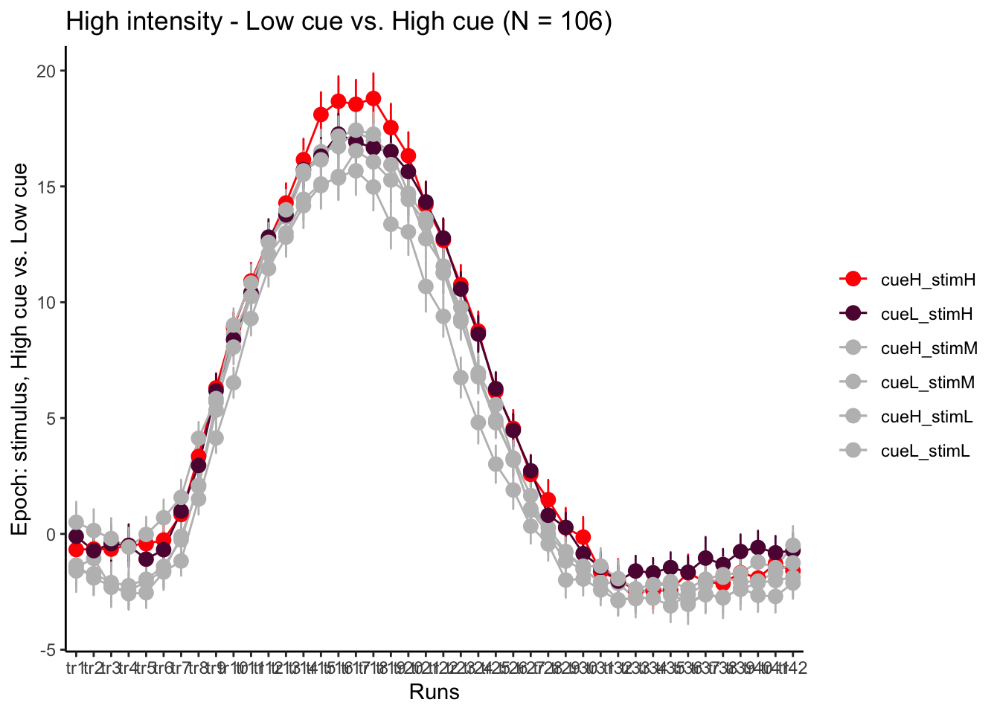
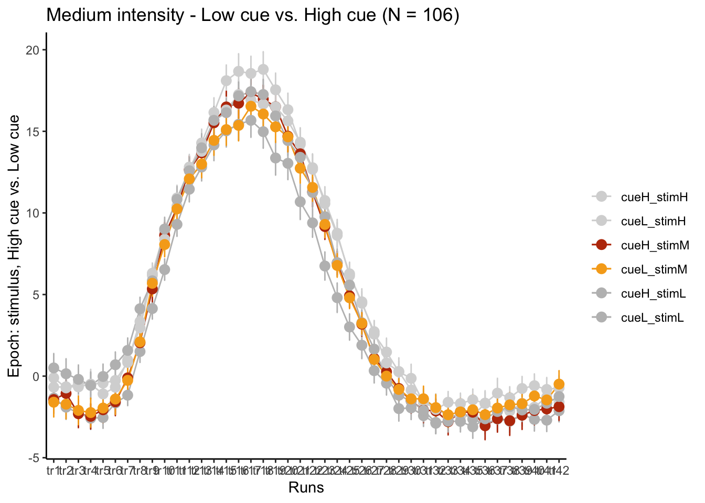

# fMRI :: FIR ~ task {#fir_ttl2}

TODO

- load tsv
- concatenate
- per time column, calculate mean and variance
- plot


```r
plot_timeseries_onefactor <-  function(df, iv1,  mean, error, xlab, ylab, ggtitle, color) {

n_points <- 100  # Number of points for interpolation
    g <- ggplot(
      data = df,
      aes(
        x = .data[[iv1]],
        y = .data[[mean]],
        group = 1,
        color = color
      ),
      cex.lab = 1.5,
      cex.axis = 2,
      cex.main = 1.5,
      cex.sub = 1.5
    ) +

      geom_errorbar(aes(
        ymin = (.data[[mean]] - .data[[error]]),
        ymax = (.data[[mean]] + .data[[error]]),
        color = color
      ), width = .1, alpha=0.8) +

      geom_line() +
      geom_point(color=color) +
      ggtitle(ggtitle) +
      xlab(xlab) +
      ylab(ylab) +

      theme_classic() +

      theme(aspect.ratio = .6) +
      expand_limits(x = 3.25) +

      scale_color_manual("",
                         values =  color) +
            # scale_fill_manual("",
                         # values =  color) +
      theme(
        legend.position = c(.99, .99),
        legend.justification = c("right", "top"),
        legend.box.just = "right",
        legend.margin = margin(6, 6, 6, 6)
      ) +
      theme(legend.key = element_rect(fill = "white", colour = "white")) +
      theme_bw()

    return(g)
  }
```

## parameters {TODO: ignore}


```r
# parameters
main_dir <- dirname(dirname(getwd()))

datadir <- file.path(main_dir, 'analysis/fmri/nilearn/glm/fir')
analysis_folder  = paste0("model52_iv-6cond_dv-firglasserSPM_ttl2")
analysis_dir <-
  file.path(main_dir,
            "analysis",
            "mixedeffect",
            analysis_folder,
            as.character(Sys.Date())) # nolint
dir.create(analysis_dir,
           showWarnings = FALSE,
           recursive = TRUE)
save_dir <- analysis_dir
```

# taskwise stim effect


```r
roi_list <- c('rINS', 'TPJ', 'dACC', 'PHG', 'V1', 'SM', 'MT', 'RSC', 'LOC', 'FFC', 'PIT', 'pSTS', 'AIP', 'premotor')
run_types <- c("pain", "vicarious", "cognitive")
  plot_list <- list()
  TR_length <- 42
for (ROI in roi_list) {

    datadir = file.path(main_dir, "analysis/fmri/spm/fir/ttl2par")
 taskname = 'pain'
exclude <- "sub-0001"
filename <- paste0("sub-*",  "*roi-", ROI, "_tr-42.csv")
  common_path <- Sys.glob(file.path(datadir, "sub-*",  filename
  ))
  filter_path <- common_path[!str_detect(common_path, pattern = exclude)]

df <- do.call("rbind.fill", lapply(filter_path, FUN = function(files) {
    read.table(files, header = TRUE, sep = ",")
    }))

for (run_type in run_types) {
  print(run_type)
  filtered_df <- df[!(df$condition == "rating" | df$condition == "cue" | df$runtype != run_type), ]

  parsed_df <- filtered_df %>%
    separate(condition, into = c("cue", "stim"), sep = "_", remove = FALSE)
  # --------------------- subset regions based on ROI ----------------------------
  df_long <- pivot_longer(parsed_df, cols = starts_with("tr"), names_to = "tr_num", values_to = "tr_value")

  # ----------------------------- clean factor -----------------------------------
  df_long$tr_ordered <- factor(
          df_long$tr_num,
          levels = c(paste0("tr", 1:TR_length))
      )
  df_long$stim_ordered <- factor(
          df_long$stim,
          levels = c("stimH", "stimM", "stimL")
      )

  # --------------------------- summary statistics -------------------------------
  subjectwise <- meanSummary(df_long,
                                        c("sub","tr_ordered", "stim_ordered"), "tr_value")
  groupwise <- summarySEwithin(
    data = subjectwise,
    measurevar = "mean_per_sub",
    withinvars = c( "stim_ordered", "tr_ordered"),
    idvar = "sub"
  )
  groupwise$task <- run_type
  # https://stackoverflow.com/questions/29402528/append-data-frames-together-in-a-for-loop/29419402

  # ... Rest of your data processing code ...

  # subset <- groupwise[groupwise$runtype == run_type, ]
  LINEIV1 = "tr_ordered"
  LINEIV2 = "stim_ordered"
  MEAN = "mean_per_sub_norm_mean"
  ERROR = "se"
  dv_keyword = "actual"
  sorted_indices <- order(groupwise$tr_ordered)
  groupwise_sorted <- groupwise[sorted_indices, ]
  p1 <- plot_timeseries_bar(groupwise_sorted,
                            LINEIV1, LINEIV2, MEAN, ERROR,
                            xlab = "TRs",
                            ylab = paste0(ROI, " activation (A.U.)"),
                            ggtitle = paste0(ROI, ": ",run_type, " (N = ", length(unique(subjectwise$sub)),") time series, Epoch - stimulus"),
                            color = c("#5f0f40","#ae2012", "#fcbf49"))
  time_points <- seq(1, 0.46 * TR_length, 0.46)
  #p1 <- p1 + scale_x_discrete(labels = setNames(time_points, colnames(df_long)[7:(7 + TR_length)])) + theme_classic()

  plot_list[[run_type]] <- p1 + theme_classic()
}

  # --------------------------- plot three tasks -------------------------------
library(gridExtra)
plot_list <- lapply(plot_list, function(plot) {
  plot + theme(plot.margin = margin(5, 5, 5, 5))  # Adjust plot margins if needed
})
combined_plot <- ggpubr::ggarrange(plot_list[["pain"]],plot_list[["vicarious"]],plot_list[["cognitive"]],
                  common.legend = TRUE,legend = "bottom", ncol = 3, nrow = 1,
                  widths = c(3, 3, 3), heights = c(.5,.5,.5), align = "v")
combined_plot
ggsave(file.path(save_dir, paste0("roi-", ROI,"_epoch-stim_desc-highstimGTlowstim.png")), combined_plot, width = 12, height = 4)

}
```

```
## [1] "pain"
```

```
## 
## Attaching package: 'raincloudplots'
```

```
## The following object is masked _by_ '.GlobalEnv':
## 
##     GeomFlatViolin
```

```
## [1] "vicarious"
## [1] "cognitive"
```

```
## 
## Attaching package: 'gridExtra'
```

```
## The following object is masked from 'package:dplyr':
## 
##     combine
```

```
## [1] "pain"
## [1] "vicarious"
## [1] "cognitive"
```

```
## [1] "pain"
## [1] "vicarious"
## [1] "cognitive"
```

```
## [1] "pain"
## [1] "vicarious"
## [1] "cognitive"
```

```
## [1] "pain"
## [1] "vicarious"
## [1] "cognitive"
```

```
## [1] "pain"
## [1] "vicarious"
## [1] "cognitive"
```

```
## [1] "pain"
## [1] "vicarious"
## [1] "cognitive"
```

```
## [1] "pain"
## [1] "vicarious"
## [1] "cognitive"
```

```
## [1] "pain"
## [1] "vicarious"
## [1] "cognitive"
```

```
## [1] "pain"
## [1] "vicarious"
## [1] "cognitive"
```

```
## [1] "pain"
## [1] "vicarious"
## [1] "cognitive"
```

```
## [1] "pain"
## [1] "vicarious"
## [1] "cognitive"
```

```
## [1] "pain"
## [1] "vicarious"
## [1] "cognitive"
```

```
## [1] "pain"
## [1] "vicarious"
## [1] "cognitive"
```

### PCA subjectwise


```r
# install.packages("ggplot2")    # Install ggplot2 if you haven't already
# install.packages("FactoMineR") # Install FactoMineR if you haven't already
library(ggplot2)
library(FactoMineR)
run_types = c("pain")
for (run_type in run_types) {
  print(run_type)
  filtered_df <- df[!(df$condition == "rating" | df$condition == "cue" | df$runtype != run_type), ]

  parsed_df <- filtered_df %>%
    separate(condition, into = c("cue", "stim"), sep = "_", remove = FALSE)
  # --------------------- subset regions based on ROI ----------------------------
  df_long <- pivot_longer(parsed_df, cols = starts_with("tr"), names_to = "tr_num", values_to = "tr_value")

  # ----------------------------- clean factor -----------------------------------
  df_long$tr_ordered <- factor(
          df_long$tr_num,
          levels = c(paste0("tr", 1:TR_length))
      )
  df_long$stim_ordered <- factor(
          df_long$stim,
          levels = c("stimH", "stimM", "stimL")
      )

  # --------------------------- summary statistics -------------------------------
  subjectwise <- meanSummary(df_long,
                                        c("sub","tr_ordered", "stim_ordered"), "tr_value")

# Assuming your original dataframe is named 'df'

# Convert the dataframe to wide format
df_wide <- pivot_wider(subjectwise,
                       id_cols = c("tr_ordered", "stim_ordered"),
                       names_from = c("sub"),
                       values_from = "mean_per_sub")

# df_wide <- pivot_wider(subjectwise,
#                        id_cols = c("sub", "ROIindex","stim_ordered"),
#                        names_from = "tr_ordered",
#                        values_from = "mean_per_sub")
stim_high.df <- df_wide[df_wide$stim_ordered == "stimH",]
stim_med.df <- df_wide[df_wide$stim_ordered == "stimM",]
stim_low.df <- df_wide[df_wide$stim_ordered == "stimL",]
# selected_columns <- subset(stim_high.df, select = 2:(ncol(stim_high.df) - 1))
meanhighdf <- data.frame(subset(stim_high.df, select = 3:(ncol(stim_high.df) - 1)))
high.pca_result <- prcomp(meanhighdf)
high.pca_scores <- as.data.frame(high.pca_result$x)
# Access the proportion of variance explained by each principal component
high.variance_explained <- high.pca_result$sdev^2 / sum(high.pca_result$sdev^2)
plot(high.variance_explained)
# Access the standard deviations of each principal component
high.stdev <- high.pca_result$sdev

meanmeddf <- data.frame(subset(stim_med.df, select = 3:(ncol(stim_med.df) - 1)))
med.pca <- prcomp(meanmeddf)
med.pca_scores <- as.data.frame(med.pca$x)

meanlowdf <- data.frame(subset(stim_low.df, select = 3:(ncol(stim_low.df) - 1)))
low.pca <- prcomp(meanlowdf)
low.pca_scores <- as.data.frame(low.pca$x)
library(plotly)  # You can use plotly to create an interactive 3D plot
# plot_ly(high.pca_scores, x = ~PC1, y = ~PC2, z = ~PC3, type = "scatter3d", mode = "markers")
# plot_ly(low.pca_scores, x = ~PC1, y = ~PC2, z = ~PC3, type = "scatter3d", mode = "markers")
combined_pca_scores <- rbind(high.pca_scores, med.pca_scores, low.pca_scores)

# Add a new column to indicate the stim_ordered category (high_stim or low_stim)
combined_pca_scores$stim_ordered <- c(rep("high_stim", nrow(high.pca_scores)),
                                      rep("med_stim", nrow(med.pca_scores)),
                                      rep("low_stim", nrow(low.pca_scores)))

# Create the 3D PCA plot
plot_ly(combined_pca_scores, x = ~PC1, y = ~PC2, z = ~PC3, type = "scatter3d", mode = "markers",
        color = ~stim_ordered)
# data_matrix <- groupwise[groupwise$stim_ordered == "high_stim",c("tr_ordered", "mean_per_sub_norm_mean")]
# sorted_indices <- order(data_matrix$tr_ordered)
# df_ordered <- data_matrix[sorted_indices, ]
# pca_result <- PCA(data_matrix$mean_per_sub_norm_mean)
# datapoints <- df$datapoints
}
```

```
## [1] "pain"
```

```
## 
## Attaching package: 'plotly'
```

```
## The following object is masked from 'package:ggplot2':
## 
##     last_plot
```

```
## The following objects are masked from 'package:plyr':
## 
##     arrange, mutate, rename, summarise
```

```
## The following object is masked from 'package:reshape':
## 
##     rename
```

```
## The following object is masked from 'package:stats':
## 
##     filter
```

```
## The following object is masked from 'package:graphics':
## 
##     layout
```


```r
plot_ly(combined_pca_scores, x = ~PC1, y = ~PC2, z = ~PC3, type = "scatter3d", mode = "markers",
        color = ~stim_ordered)
```

```{=html}
<div class="plotly html-widget html-fill-item" id="htmlwidget-af3c96d22fb548b7d248" style="width:672px;height:480px;"></div>
<script type="application/json" data-for="htmlwidget-af3c96d22fb548b7d248">{"x":{"visdat":{"29921a7965a7":["function () ","plotlyVisDat"]},"cur_data":"29921a7965a7","attrs":{"29921a7965a7":{"x":{},"y":{},"z":{},"mode":"markers","color":{},"alpha_stroke":1,"sizes":[10,100],"spans":[1,20],"type":"scatter3d"}},"layout":{"margin":{"b":40,"l":60,"t":25,"r":10},"scene":{"xaxis":{"title":"PC1"},"yaxis":{"title":"PC2"},"zaxis":{"title":"PC3"}},"hovermode":"closest","showlegend":true},"source":"A","config":{"modeBarButtonsToAdd":["hoverclosest","hovercompare"],"showSendToCloud":false},"data":[{"x":[-3.5788109233784819,-2.0533347388596508,-6.5336218647865598,-2.7083216152222849,-0.8237495447086165,1.0655748176928745,3.5832988818958524,5.5563725928506917,12.885062337428746,17.164931474166693,26.318430905717509,22.124327309718247,35.004207885933894,40.558945380024475,58.529141037493446,64.663134539960524,75.574527605961364,80.504681380370528,88.853870004454848,88.474313313103664,90.870391787896637,92.487071169826365,91.578581425689961,80.506727557836783,79.630063963028817,71.482883358234119,66.461675896748062,51.86721571890569,31.162107340353895,10.660676316876559,-15.439539064936159,-31.490238750398635,-63.430947755775946,-80.61203482905448,-100.8353665232453,-116.34121468973694,-128.03202901695411,-140.62301423580092,-150.52905134311825,-151.59358717604783,-145.81099929470383,-147.13235263544212],"y":[-35.799086995981995,-40.762489650462321,-51.943208835590674,-52.21806866486066,-60.020978980189966,-59.713727196356842,-63.765093576372969,-63.012208382804147,-68.154743793542835,-58.743133103019048,-48.555550398250006,-54.69018356241196,-46.069270743051106,-42.045770006073873,-27.797390325514606,-26.995409904715338,-13.916191815317477,-7.4124700487557558,11.429275355703664,17.121117406962117,26.327938273260436,42.321370478231955,42.977995658382234,56.459525411413459,63.498300398301872,71.960100980349338,64.470761099784852,49.35218716039622,51.538679580944525,40.852807250062995,38.356454462271962,36.088401666324643,38.02882853099203,34.601746501051309,36.528602437331429,31.113200797482548,26.389499705204546,18.696845742053558,10.977683013121531,12.863126172777573,1.9568677900900378,-2.2963398892233036],"z":[-20.368503983741295,-21.888162194383774,-25.968037199696546,-25.101881294833703,-23.885738856181103,-21.158121479978981,-20.622217996634834,-13.953720977137348,-13.096391751480825,-8.8966820595222647,0.34077690684816997,0.61485990703649906,14.755912745603011,21.629297858872029,27.496511515079202,34.504693974335716,33.136603233913021,38.151524374152295,35.179539959984886,27.822283474719885,20.044042082498962,18.156917899465654,14.268748250323528,11.186305471004029,2.0557724533876449,-7.3188258482323256,-18.236587362937126,-35.527744846727138,-32.706286932286204,-36.624545340348376,-40.854960187380833,-36.401260869286794,-30.051021786625803,-20.495095826176584,-3.3876880999761529,2.4659565243325599,12.892098280121754,19.634708309930531,28.388527367522538,28.101953981149173,30.437012729858221,35.279427593428707],"mode":"markers","type":"scatter3d","name":"high_stim","marker":{"color":"rgba(102,194,165,1)","line":{"color":"rgba(102,194,165,1)"}},"textfont":{"color":"rgba(102,194,165,1)"},"error_y":{"color":"rgba(102,194,165,1)"},"error_x":{"color":"rgba(102,194,165,1)"},"line":{"color":"rgba(102,194,165,1)"},"frame":null},{"x":[-27.632028230350532,-25.731525601711713,-25.299975170275072,-25.186809037560455,-23.190695001267848,-18.714852981660076,-16.55342686097643,-5.0427579982985167,-2.5890864976130286,7.1557849615622384,10.083579323217338,15.069773962025495,21.351099134012422,26.730591023251005,37.556582097691994,44.78142377883664,51.198376881716577,52.96024834403034,56.867843328561669,61.16685274269507,55.114354917589452,53.990358400640709,54.749928352466256,49.77035747808231,40.04583021963915,39.359048989428693,38.173043512008789,27.826457484642887,23.86870039769709,18.288836395540034,-2.5735371544542152,-13.433993856144752,-24.054673094068445,-39.580455144127626,-44.622157733759749,-63.459942825754887,-63.510197460095149,-70.010374365201471,-71.899606526203698,-75.272211756018677,-75.798648291621902,-71.952116138171846],"y":[-37.102745040665155,-41.340295373177149,-42.336580300145776,-39.804649201559208,-47.352420897833923,-39.330599410608592,-44.698058781433666,-45.02332243567173,-37.243082738739574,-41.662043127370012,-39.628405295853455,-41.120345561609426,-31.559728676254196,-33.969592054887684,-34.48795962747387,-36.470004295599473,-25.368378853670052,-14.531406919543105,0.70553831635619491,7.4019566042573892,18.441679983069232,31.063225606071413,33.655743143016096,32.744628795618539,33.427484144797027,33.49654443767718,35.889854547859436,42.247560240578565,43.734744530717862,43.994528304917473,47.92128378432264,43.725371341232766,37.149976316356117,34.429599696987211,29.827582968062544,24.053173425286673,18.310636228456655,21.644152022919471,18.352394324321754,15.700065016024539,16.416793762640186,8.6951010505489492],"z":[12.944966892698959,24.228006333311228,22.226845407650163,27.988087566390607,17.796756595861737,20.889840850123164,13.972857024967388,9.0928043277548305,6.6988219346300033,1.2435680706410839,-7.1896146780466461,-3.2260773933458826,-13.272562029074438,-14.122783303383567,-18.187305562670325,-22.555863326985712,-17.918953623211195,-19.312581921894708,-15.538754071029466,-15.253948888685114,-10.052919062076107,-17.038299687496391,-8.8265517205285757,-3.9878522169802624,4.6343921578681888,13.106450940197163,18.530075732600633,25.725376690627176,30.496485197553167,17.043818902974721,18.908667534385472,18.61709280667732,7.3346358511762553,4.8279529169838638,-3.159348423902379,-4.9592606700033661,-13.789468144083251,-23.349364250258592,-22.078398554948791,-29.842803707948537,-20.445587879324211,-12.199204619195617],"mode":"markers","type":"scatter3d","name":"low_stim","marker":{"color":"rgba(252,141,98,1)","line":{"color":"rgba(252,141,98,1)"}},"textfont":{"color":"rgba(252,141,98,1)"},"error_y":{"color":"rgba(252,141,98,1)"},"error_x":{"color":"rgba(252,141,98,1)"},"line":{"color":"rgba(252,141,98,1)"},"frame":null},{"x":[-22.572817516108412,-22.171528797928978,-17.733962648674268,-21.667777499678383,-14.752657832200196,-18.186987462937548,-9.4109152518257169,-7.4817355752711512,-11.412613512158412,0.58843919147860335,5.8333607041739972,17.10472007670807,26.998767315430527,40.357636826826138,53.468859105262503,59.535903257677923,67.626804272407711,80.584641846019423,80.202720619935661,85.096036532619678,87.060030350298831,82.000839271200562,71.533836552662024,73.912659740620384,71.783583044393453,60.863580729147216,61.334492988222593,59.343511875210211,41.881054007010086,24.694885328027393,-3.0284188020669331,-19.907332582962042,-49.10616018409592,-69.257938788566108,-93.783894549422087,-93.021380448889417,-100.04904639031912,-112.66269524071932,-118.91132427851494,-121.25557696091575,-116.42887632593813,-109.0027229861401],"y":[-40.35301484899211,-40.903875118265994,-47.796362915935674,-44.029778049751428,-50.528894185296139,-54.058728268569787,-49.30906013220136,-52.905864331945565,-51.553105222815439,-46.976772247944538,-41.312146478011989,-47.923003665257383,-42.870421753912439,-34.826216184513022,-30.048235203847632,-22.157647455666854,-8.483848927786072,-8.0545911367992655,0.68533110647278184,7.538624140663968,15.328212113987567,24.562984529331647,24.132304725546927,36.805423068875285,36.862356204132865,43.035487897747309,50.174379981963277,44.008096476464779,51.117731966268835,47.776767457461261,51.544021514064887,43.627911216505176,43.925397826766869,40.415043528706164,36.11846508664987,29.608543200591534,25.529470899405265,23.321048514401703,17.936521235668273,6.7010637427867294,8.1204004571408497,5.2159792359088373],"z":[-22.930393323846037,-25.769046967938152,-23.300906197190464,-28.734337300773628,-27.108961058629934,-26.565628989981306,-18.704874337325379,-17.501344638383308,-12.240090499975649,-4.742777452278613,-0.85187279232867597,6.6360924823896799,16.281255300129011,25.148355523211034,25.662871267643439,26.327945481442224,26.165235527681517,29.485027447616066,26.17706934838607,19.054385220131067,23.037592141643398,25.679860259186341,11.134785059992685,7.6799621536568541,-9.4757232491520398,-15.970738295852819,-23.408235115326637,-23.808293226827892,-27.87523257694318,-26.230153978951524,-29.114105185194735,-21.181092932002507,-23.754048725172687,-13.265289434056603,-3.6556052623843778,2.4878780937361382,21.446309979704367,21.617508744478066,26.838412956964,33.499003617514227,27.306281743390361,24.522919191619572],"mode":"markers","type":"scatter3d","name":"med_stim","marker":{"color":"rgba(141,160,203,1)","line":{"color":"rgba(141,160,203,1)"}},"textfont":{"color":"rgba(141,160,203,1)"},"error_y":{"color":"rgba(141,160,203,1)"},"error_x":{"color":"rgba(141,160,203,1)"},"line":{"color":"rgba(141,160,203,1)"},"frame":null}],"highlight":{"on":"plotly_click","persistent":false,"dynamic":false,"selectize":false,"opacityDim":0.20000000000000001,"selected":{"opacity":1},"debounce":0},"shinyEvents":["plotly_hover","plotly_click","plotly_selected","plotly_relayout","plotly_brushed","plotly_brushing","plotly_clickannotation","plotly_doubleclick","plotly_deselect","plotly_afterplot","plotly_sunburstclick"],"base_url":"https://plot.ly"},"evals":[],"jsHooks":[]}</script>
```

### PCA groupwise


```r
# install.packages("ggplot2")    # Install ggplot2 if you haven't already
# install.packages("FactoMineR") # Install FactoMineR if you haven't already
library(ggplot2)
library(FactoMineR)


# Assuming your original dataframe is named 'df'

# Convert the dataframe to wide format
df_wide.group <- pivot_wider(subjectwise,
                       id_cols = c("tr_ordered", "stim_ordered"),
                       names_from = "sub",
                       values_from = "mean_per_sub")
# ------
# data_matrix <- groupwise[groupwise$stim_ordered == "high_stim",c("tr_ordered", "mean_per_sub_norm_mean")]
# sorted_indices <- order(data_matrix$tr_ordered)
# df_ordered <- data_matrix[sorted_indices, ]
# datapoints <- df_ordered$mean_per_sub_norm_mean
# data_df <- data.frame(Dim1 = datapoints, Dim2 = datapoints, Dim3 = datapoints)
# pca <- prcomp(data_df)
# pca_scores <- as.data.frame(pca$x)
# plot_ly(pca_scores, x = ~PC1, y = ~PC2, z = ~PC3, type = "scatter3d", mode = "markers")
# -------
stim_high.df <- df_wide[df_wide$stim_ordered == "stimH",]
stim_low.df <- df_wide[df_wide$stim_ordered == "stimL",]
# selected_columns <- subset(stim_high.df, select = 2:(ncol(stim_high.df) - 1))
meanhighdf <- data.frame(subset(stim_high.df, select = 3:(ncol(stim_high.df) - 1)))
high.pca <- prcomp(meanhighdf)
high.pca_scores <- as.data.frame(high.pca$x)

meanlowdf <- data.frame(subset(stim_low.df, select = 3:(ncol(stim_low.df) - 1)))
low.pca <- prcomp(meanlowdf)
low.pca_scores <- as.data.frame(low.pca$x)
library(plotly)  # You can use plotly to create an interactive 3D plot
# plot_ly(high.pca_scores, x = ~PC1, y = ~PC2, z = ~PC3, type = "scatter3d", mode = "markers")
# plot_ly(low.pca_scores, x = ~PC1, y = ~PC2, z = ~PC3, type = "scatter3d", mode = "markers")
combined_pca_scores <- rbind(high.pca_scores, low.pca_scores)

# Add a new column to indicate the stim_ordered category (high_stim or low_stim)
combined_pca_scores$stim_ordered <- c(rep("high_stim", nrow(high.pca_scores)), rep("low_stim", nrow(low.pca_scores)))

# Create the 3D PCA plot
plot_ly(combined_pca_scores, x = ~PC1, y = ~PC2, z = ~PC3, type = "scatter3d", mode = "markers",
        color = ~stim_ordered)
```

```
## Warning in RColorBrewer::brewer.pal(N, "Set2"): minimal value for n is 3, returning requested palette with 3 different levels

## Warning in RColorBrewer::brewer.pal(N, "Set2"): minimal value for n is 3, returning requested palette with 3 different levels
```

```{=html}
<div class="plotly html-widget html-fill-item" id="htmlwidget-404e6868450205a4d766" style="width:672px;height:480px;"></div>
<script type="application/json" data-for="htmlwidget-404e6868450205a4d766">{"x":{"visdat":{"29925a660412":["function () ","plotlyVisDat"]},"cur_data":"29925a660412","attrs":{"29925a660412":{"x":{},"y":{},"z":{},"mode":"markers","color":{},"alpha_stroke":1,"sizes":[10,100],"spans":[1,20],"type":"scatter3d"}},"layout":{"margin":{"b":40,"l":60,"t":25,"r":10},"scene":{"xaxis":{"title":"PC1"},"yaxis":{"title":"PC2"},"zaxis":{"title":"PC3"}},"hovermode":"closest","showlegend":true},"source":"A","config":{"modeBarButtonsToAdd":["hoverclosest","hovercompare"],"showSendToCloud":false},"data":[{"x":[-3.5788109233784819,-2.0533347388596508,-6.5336218647865598,-2.7083216152222849,-0.8237495447086165,1.0655748176928745,3.5832988818958524,5.5563725928506917,12.885062337428746,17.164931474166693,26.318430905717509,22.124327309718247,35.004207885933894,40.558945380024475,58.529141037493446,64.663134539960524,75.574527605961364,80.504681380370528,88.853870004454848,88.474313313103664,90.870391787896637,92.487071169826365,91.578581425689961,80.506727557836783,79.630063963028817,71.482883358234119,66.461675896748062,51.86721571890569,31.162107340353895,10.660676316876559,-15.439539064936159,-31.490238750398635,-63.430947755775946,-80.61203482905448,-100.8353665232453,-116.34121468973694,-128.03202901695411,-140.62301423580092,-150.52905134311825,-151.59358717604783,-145.81099929470383,-147.13235263544212],"y":[-35.799086995981995,-40.762489650462321,-51.943208835590674,-52.21806866486066,-60.020978980189966,-59.713727196356842,-63.765093576372969,-63.012208382804147,-68.154743793542835,-58.743133103019048,-48.555550398250006,-54.69018356241196,-46.069270743051106,-42.045770006073873,-27.797390325514606,-26.995409904715338,-13.916191815317477,-7.4124700487557558,11.429275355703664,17.121117406962117,26.327938273260436,42.321370478231955,42.977995658382234,56.459525411413459,63.498300398301872,71.960100980349338,64.470761099784852,49.35218716039622,51.538679580944525,40.852807250062995,38.356454462271962,36.088401666324643,38.02882853099203,34.601746501051309,36.528602437331429,31.113200797482548,26.389499705204546,18.696845742053558,10.977683013121531,12.863126172777573,1.9568677900900378,-2.2963398892233036],"z":[-20.368503983741295,-21.888162194383774,-25.968037199696546,-25.101881294833703,-23.885738856181103,-21.158121479978981,-20.622217996634834,-13.953720977137348,-13.096391751480825,-8.8966820595222647,0.34077690684816997,0.61485990703649906,14.755912745603011,21.629297858872029,27.496511515079202,34.504693974335716,33.136603233913021,38.151524374152295,35.179539959984886,27.822283474719885,20.044042082498962,18.156917899465654,14.268748250323528,11.186305471004029,2.0557724533876449,-7.3188258482323256,-18.236587362937126,-35.527744846727138,-32.706286932286204,-36.624545340348376,-40.854960187380833,-36.401260869286794,-30.051021786625803,-20.495095826176584,-3.3876880999761529,2.4659565243325599,12.892098280121754,19.634708309930531,28.388527367522538,28.101953981149173,30.437012729858221,35.279427593428707],"mode":"markers","type":"scatter3d","name":"high_stim","marker":{"color":"rgba(102,194,165,1)","line":{"color":"rgba(102,194,165,1)"}},"textfont":{"color":"rgba(102,194,165,1)"},"error_y":{"color":"rgba(102,194,165,1)"},"error_x":{"color":"rgba(102,194,165,1)"},"line":{"color":"rgba(102,194,165,1)"},"frame":null},{"x":[-27.632028230350532,-25.731525601711713,-25.299975170275072,-25.186809037560455,-23.190695001267848,-18.714852981660076,-16.55342686097643,-5.0427579982985167,-2.5890864976130286,7.1557849615622384,10.083579323217338,15.069773962025495,21.351099134012422,26.730591023251005,37.556582097691994,44.78142377883664,51.198376881716577,52.96024834403034,56.867843328561669,61.16685274269507,55.114354917589452,53.990358400640709,54.749928352466256,49.77035747808231,40.04583021963915,39.359048989428693,38.173043512008789,27.826457484642887,23.86870039769709,18.288836395540034,-2.5735371544542152,-13.433993856144752,-24.054673094068445,-39.580455144127626,-44.622157733759749,-63.459942825754887,-63.510197460095149,-70.010374365201471,-71.899606526203698,-75.272211756018677,-75.798648291621902,-71.952116138171846],"y":[-37.102745040665155,-41.340295373177149,-42.336580300145776,-39.804649201559208,-47.352420897833923,-39.330599410608592,-44.698058781433666,-45.02332243567173,-37.243082738739574,-41.662043127370012,-39.628405295853455,-41.120345561609426,-31.559728676254196,-33.969592054887684,-34.48795962747387,-36.470004295599473,-25.368378853670052,-14.531406919543105,0.70553831635619491,7.4019566042573892,18.441679983069232,31.063225606071413,33.655743143016096,32.744628795618539,33.427484144797027,33.49654443767718,35.889854547859436,42.247560240578565,43.734744530717862,43.994528304917473,47.92128378432264,43.725371341232766,37.149976316356117,34.429599696987211,29.827582968062544,24.053173425286673,18.310636228456655,21.644152022919471,18.352394324321754,15.700065016024539,16.416793762640186,8.6951010505489492],"z":[12.944966892698959,24.228006333311228,22.226845407650163,27.988087566390607,17.796756595861737,20.889840850123164,13.972857024967388,9.0928043277548305,6.6988219346300033,1.2435680706410839,-7.1896146780466461,-3.2260773933458826,-13.272562029074438,-14.122783303383567,-18.187305562670325,-22.555863326985712,-17.918953623211195,-19.312581921894708,-15.538754071029466,-15.253948888685114,-10.052919062076107,-17.038299687496391,-8.8265517205285757,-3.9878522169802624,4.6343921578681888,13.106450940197163,18.530075732600633,25.725376690627176,30.496485197553167,17.043818902974721,18.908667534385472,18.61709280667732,7.3346358511762553,4.8279529169838638,-3.159348423902379,-4.9592606700033661,-13.789468144083251,-23.349364250258592,-22.078398554948791,-29.842803707948537,-20.445587879324211,-12.199204619195617],"mode":"markers","type":"scatter3d","name":"low_stim","marker":{"color":"rgba(141,160,203,1)","line":{"color":"rgba(141,160,203,1)"}},"textfont":{"color":"rgba(141,160,203,1)"},"error_y":{"color":"rgba(141,160,203,1)"},"error_x":{"color":"rgba(141,160,203,1)"},"line":{"color":"rgba(141,160,203,1)"},"frame":null}],"highlight":{"on":"plotly_click","persistent":false,"dynamic":false,"selectize":false,"opacityDim":0.20000000000000001,"selected":{"opacity":1},"debounce":0},"shinyEvents":["plotly_hover","plotly_click","plotly_selected","plotly_relayout","plotly_brushed","plotly_brushing","plotly_clickannotation","plotly_doubleclick","plotly_deselect","plotly_afterplot","plotly_sunburstclick"],"base_url":"https://plot.ly"},"evals":[],"jsHooks":[]}</script>
```

```r
# data_matrix <- groupwise[groupwise$stim_ordered == "high_stim",c("tr_ordered", "mean_per_sub_norm_mean")]
# sorted_indices <- order(data_matrix$tr_ordered)
# df_ordered <- data_matrix[sorted_indices, ]
# pca_result <- PCA(data_matrix$mean_per_sub_norm_mean)
# datapoints <- df$datapoints

# Assuming you have a dataframe named 'data' containing the 20 data points, 'x' and 'y' values, and corresponding standard deviations 'sd'

# Load the ggplot2 library
# install.packages("ggplot2")
library(ggplot2)

# Create the plot
# y = "mean_per_sub_mean"z
# combined_pca <- combined_pca_scores %>%
  # mutate(group_index = group_indices(., stim_ordered))

combined_pca <- combined_pca_scores %>%
  group_by(stim_ordered) %>%
  mutate(group_index = row_number())
ggplot(combined_pca, aes(x=group_index,y=PC1, group = stim_ordered, colour=stim_ordered)) +
  stat_smooth(method="loess", span=0.25, se=TRUE, aes(color=stim_ordered), alpha=0.3) +
  theme_bw()
```

```
## `geom_smooth()` using formula = 'y ~ x'
```


```r
# Assuming you have a dataframe named 'data' containing the 20 data points, 'x' and 'y' values, and corresponding standard deviations 'sd'

# Load the ggplot2 library
# install.packages("ggplot2")
library(ggplot2)

# Create the plot
# y = "mean_per_sub_mean"z
ggplot(groupwise, aes(x=tr_ordered,y=mean_per_sub_mean, group = stim_ordered, colour=stim_ordered)) +
  stat_smooth(method="loess", span=0.25, se=TRUE, aes(color=stim_ordered), alpha=0.3) +
  theme_bw()
```

```
## `geom_smooth()` using formula = 'y ~ x'
```


```r
# ggplot(data=groupwise, aes(x=tr_ordered, y=mean_per_sub_mean, ymin=se, ymax=se, fill=stim_ordered, linetype=stim_ordered)) +
#  geom_line() +
#  geom_ribbon(alpha=0.5)
# Assuming you have a dataframe named 'data' containing the 20 mean data points and corresponding standard errors
# 'x' represents the x-values (e.g., time points)
# 'mean_y' represents the mean y-values
# 'se_y' represents the standard errors of the mean y-values

# Load the ggplot2 library
# install.packages("ggplot2")
library(ggplot2)
# groupwise$x <- as.numeric(groupwise$x)
#
# # Sort the dataframe by the 'x' variable (if it's not already sorted)
# data <- data[order(data$x), ]

# Create the plot
# Create the plot with custom span and smoothing method
ggplot(groupwise, aes(x=tr_ordered,y=mean_per_sub_mean)) +
  geom_line() +                                   # Plot the smooth line for the mean
  geom_ribbon(aes(ymin = mean_per_sub_mean - se, ymax = mean_per_sub_mean + se), alpha = 0.3) + # Add the ribbon for standard error
  geom_smooth(method = "loess", span = 0.1, se = FALSE) +       # Add the loess smoothing curve
  labs(x = "X-axis Label", y = "Y-axis Label", title = "Smooth Line with Standard Error Ribbon") +
  theme_minimal()
```

```
## `geom_smooth()` using formula = 'y ~ x'
```


## DEP: epoch: stim, high cue vs low cue


```r
# filtered_df <- subset(df, condition != "rating")
filtered_df <- df[!(df$condition == "rating" | df$condition == "cue"), ]

parsed_df <- filtered_df %>%
  separate(condition, into = c("cue", "stim"), sep = "_", remove = FALSE)

TR_length <- 42
# --------------------- subset regions based on ROI ----------------------------
df_long <- pivot_longer(parsed_df, cols = starts_with("tr"), names_to = "tr_num", values_to = "tr_value")

# ----------------------------- clean factor -----------------------------------
df_long$tr_ordered <- factor(
        df_long$tr_num,
        levels = c(paste0("tr", 1:TR_length))
    )
df_long$cue_ordered <- factor(
        df_long$cue,
        levels = c("cueH","cueL")
    )

# --------------------------- summary statistics -------------------------------
subjectwise <- meanSummary(df_long,
                                      c("sub", "tr_ordered", "cue_ordered"), "tr_value")
groupwise <- summarySEwithin(
  data = subjectwise,
  measurevar = "mean_per_sub",
  withinvars = c("cue_ordered", "tr_ordered"),
  idvar = "sub"
)
groupwise$task <- taskname
# https://stackoverflow.com/questions/29402528/append-data-frames-together-in-a-for-loop/29419402

# --------------------------------- plot ---------------------------------------
LINEIV1 = "tr_ordered"
LINEIV2 = "cue_ordered"
MEAN = "mean_per_sub_norm_mean"
ERROR = "se"
dv_keyword = "actual"
sorted_indices <- order(groupwise$tr_ordered)
groupwise_sorted <- groupwise[sorted_indices, ]
p1 = plot_timeseries_bar(groupwise,
               LINEIV1, LINEIV2, MEAN, ERROR,  xlab = "Runs" , ylab= "Epoch: stimulus, High cue vs. Low cue", ggtitle="time_series", color=c("red", "blue"))
time_points <- seq(1, 0.46 * TR_length, 0.46)
p1 + scale_x_discrete(labels = setNames(time_points, colnames(df_long)[7:7+TR_length]))+ theme_classic()
```


## taskwise cue effect


```r
roi_list <- c('rINS', 'TPJ', 'dACC', 'PHG', 'V1', 'SM', 'MT', 'RSC', 'LOC', 'FFC', 'PIT', 'pSTS', 'AIP', 'premotor')
for (ROI in roi_list) {

    datadir = file.path(main_dir, "analysis/fmri/spm/fir/ttl2par")
# taskname = 'pain'
exclude <- "sub-0001"
filename <- paste0("sub-*",  "*roi-", ROI, "_tr-42.csv")
  common_path <- Sys.glob(file.path(datadir, "sub-*",  filename
  ))
  filter_path <- common_path[!str_detect(common_path, pattern = exclude)]

df <- do.call("rbind.fill", lapply(filter_path, FUN = function(files) {
    read.table(files, header = TRUE, sep = ",")
    }))


run_types <- c("pain", "vicarious", "cognitive")
  plot_list <- list()
  TR_length <- 42
for (run_type in run_types) {
  filtered_df <- df[!(df$condition == "rating" | df$condition == "cue" | df$runtype != run_type), ]

  parsed_df <- filtered_df %>%
    separate(condition, into = c("cue", "stim"), sep = "_", remove = FALSE)
  # --------------------- subset regions based on ROI ----------------------------
  df_long <- pivot_longer(parsed_df, cols = starts_with("tr"), names_to = "tr_num", values_to = "tr_value")

  # ----------------------------- clean factor -----------------------------------
  df_long$tr_ordered <- factor(
          df_long$tr_num,
          levels = c(paste0("tr", 1:TR_length))
      )
df_long$cue_ordered <- factor(
        df_long$cue,
        levels = c("cueH","cueL")
    )

  # --------------------------- summary statistics -------------------------------
  subjectwise <- meanSummary(df_long,
                                        c("sub","tr_ordered", "cue_ordered"), "tr_value")
  groupwise <- summarySEwithin(
    data = subjectwise,
    measurevar = "mean_per_sub",
    withinvars = c( "cue_ordered", "tr_ordered"),
    idvar = "sub"
  )
  groupwise$task <- run_type
  # https://stackoverflow.com/questions/29402528/append-data-frames-together-in-a-for-loop/29419402

  # ... Rest of your data processing code ...

  # subset <- groupwise[groupwise$runtype == run_type, ]
  LINEIV1 = "tr_ordered"
  LINEIV2 = "cue_ordered"
  MEAN = "mean_per_sub_norm_mean"
  ERROR = "se"
  dv_keyword = "actual"
  sorted_indices <- order(groupwise$tr_ordered)
  groupwise_sorted <- groupwise[sorted_indices, ]
  p1 <- plot_timeseries_bar(groupwise_sorted,
                            LINEIV1, LINEIV2, MEAN, ERROR,
                            xlab = "TRs",
                            ylab = paste0(ROI, " activation (A.U.)"),
                            ggtitle = paste0(run_type, " time series, Epoch - stimulus"),
                            color =c("red", "blue"))
  time_points <- seq(1, 0.46 * TR_length, 0.46)
  #p1 <- p1 + scale_x_discrete(labels = setNames(time_points, colnames(df_long)[7:(7 + TR_length)])) + theme_classic()

  plot_list[[run_type]] <- p1 + theme_classic()
}

  # --------------------------- plot three tasks -------------------------------
library(gridExtra)
plot_list <- lapply(plot_list, function(plot) {
  plot + theme(plot.margin = margin(5, 5, 5, 5))  # Adjust plot margins if needed
})
combined_plot <- ggpubr::ggarrange(plot_list[["pain"]],plot_list[["vicarious"]],plot_list[["cognitive"]],
                  common.legend = TRUE,legend = "bottom", ncol = 3, nrow = 1,
                  widths = c(3, 3, 3), heights = c(.5,.5,.5), align = "v")
combined_plot
ggsave(file.path(save_dir, paste0("roi-", ROI, "_epoch-stim_desc-highcueGTlowcue.png")), combined_plot, width = 12, height = 4)
}
```

## epoch: stim, rating


## epoch: 6 cond


```r
# ------------------------------------------------------------------------------
#                       epoch stim, high cue vs low cue
# ------------------------------------------------------------------------------
# --------------------- subset regions based on ROI ----------------------------

# ----------------------------- clean factor -----------------------------------
df_long$tr_ordered <- factor(
        df_long$tr_num,
        levels = c(paste0("tr", 1:TR_length))
    )
df_long$cue_ordered <- factor(
        df_long$cue,
        levels = c("cueH", "cueL")
    )
df_long$stim_ordered <- factor(
        df_long$stim,
        levels = c("stimH", "stimM", "stimL")
    )

df_long$sixcond <- factor(
        df_long$condition,
        levels = c("cueH_stimH", "cueL_stimH",
                   "cueH_stimM", "cueL_stimM",
                   "cueH_stimL", "cueL_stimL")
)
# --------------------------- summary statistics -------------------------------
subjectwise <- meanSummary(df_long,
                                      c("sub", "tr_ordered", "sixcond"), "tr_value")
groupwise <- summarySEwithin(
  data = subjectwise,
  measurevar = "mean_per_sub",
  withinvars = c("sixcond", "tr_ordered"),
  idvar = "sub"
)
groupwise$task <- taskname
# https://stackoverflow.com/questions/29402528/append-data-frames-together-in-a-for-loop/29419402

# --------------------------------- plot ---------------------------------------
LINEIV1 = "tr_ordered"
LINEIV2 = "sixcond"
MEAN = "mean_per_sub_norm_mean"
ERROR = "se"
dv_keyword = "actual"
sorted_indices <- order(groupwise$tr_ordered)
groupwise_sorted <- groupwise[sorted_indices, ]
p3H = plot_timeseries_bar(groupwise,
               LINEIV1, LINEIV2, MEAN, ERROR,  xlab = "Runs" , ylab= "Epoch: stimulus, High cue vs. Low cue", ggtitle=paste0("High intensity - Low cue vs. High cue (N = ", unique(groupwise$N), ")" ), color=c("red","#5f0f40","gray", "gray", "gray", "gray"))
time_points <- seq(1, 0.46 * TR_length, 0.46)
p3H + scale_x_discrete(labels = setNames(time_points, colnames(df_long)[7:7+TR_length]))+ theme_classic()
```



```r
p3H + theme_classic()
```


```r
p3M = plot_timeseries_bar(groupwise,
               LINEIV1, LINEIV2, MEAN, ERROR,  xlab = "Runs" , ylab= "Epoch: stimulus, High cue vs. Low cue", ggtitle=paste0("Medium intensity - Low cue vs. High cue (N = ", unique(groupwise$N), ")"), color=c("#d6d6d6","#d6d6d6","#bc3908", "#f6aa1c", "gray", "gray"))
time_points <- seq(1, 0.46 * TR_length, 0.46)
p3M + scale_x_discrete(labels = setNames(time_points, colnames(df_long)[7:7+TR_length]))+ theme_classic()
```


```r
p3M + theme_classic()
```




```r
p3L = plot_timeseries_bar(groupwise,
               LINEIV1, LINEIV2, MEAN, ERROR,  xlab = "Runs" , ylab= "Epoch: stimulus, High cue vs. Low cue", ggtitle=paste0("Low intensity - Low cue vs. High cue (N = ", unique(groupwise$N), ")"), color=c("gray","gray","gray", "gray", "#2541b2", "#00a6fb"))
time_points <- seq(1, 0.46 * TR_length, 0.46)
p3L + scale_x_discrete(labels = setNames(time_points, colnames(df_long)[7:7+TR_length]))+ theme_classic()
```


```r
p3L + theme_classic()
```


# taskwise 6 cond effect


```r
# ------------------------------------------------------------------------------
#                       epoch stim, high cue vs low cue
# ------------------------------------------------------------------------------
# --------------------- subset regions based on ROI ----------------------------
run_types <- c("pain", "vicarious", "cognitive")

  TR_length <- 42
for (run_type in run_types) {
  filtered_df <- df[!(df$condition == "rating" | df$condition == "cue" | df$runtype != run_type), ]
plot_list <- list()

  parsed_df <- filtered_df %>%
    separate(condition, into = c("cue", "stim"), sep = "_", remove = FALSE)
  # --------------------- subset regions based on ROI ----------------------------
  df_long <- pivot_longer(parsed_df, cols = starts_with("tr"), names_to = "tr_num", values_to = "tr_value")

# ----------------------------- clean factor -----------------------------------
df_long$tr_ordered <- factor(
        df_long$tr_num,
        levels = c(paste0("tr", 1:TR_length))
    )
df_long$cue_ordered <- factor(
        df_long$cue,
        levels = c("cueH", "cueL")
    )
df_long$stim_ordered <- factor(
        df_long$stim,
        levels = c("stimH", "stimM", "stimL")
    )

df_long$sixcond <- factor(
        df_long$condition,
        levels = c("cueH_stimH", "cueL_stimH",
                   "cueH_stimM", "cueL_stimM",
                   "cueH_stimL", "cueL_stimL")
)
# --------------------------- summary statistics -------------------------------
subjectwise <- meanSummary(df_long,
                                      c("sub", "tr_ordered", "sixcond"), "tr_value")
groupwise <- summarySEwithin(
  data = subjectwise,
  measurevar = "mean_per_sub",
  withinvars = c("sixcond", "tr_ordered"),
  idvar = "sub"
)
groupwise$task <- taskname
# https://stackoverflow.com/questions/29402528/append-data-frames-together-in-a-for-loop/29419402

# --------------------------------- plot ---------------------------------------
LINEIV1 = "tr_ordered"
LINEIV2 = "sixcond"
MEAN = "mean_per_sub_norm_mean"
ERROR = "se"
dv_keyword = "actual"
sorted_indices <- order(groupwise$tr_ordered)
groupwise_sorted <- groupwise[sorted_indices, ]
p3H = plot_timeseries_bar(groupwise,
               LINEIV1, LINEIV2, MEAN, ERROR,  xlab = "Runs" , ylab= "Epoch: stimulus, High cue vs. Low cue", ggtitle=paste0("High intensity - Low cue vs. High cue (N = ", unique(groupwise$N), ")" ), color=c("red","#5f0f40","gray", "gray", "gray", "gray"))
time_points <- seq(1, 0.46 * TR_length, 0.46)
# p3H + scale_x_discrete(labels = setNames(time_points, colnames(df_long)[7:7+TR_length]))+ theme_classic()
p3H + theme_classic()
plot_list[["H"]] <- p3H + theme_classic()

p3M = plot_timeseries_bar(groupwise,
               LINEIV1, LINEIV2, MEAN, ERROR,  xlab = "Runs" , ylab= "Epoch: stimulus, High cue vs. Low cue", ggtitle=paste0("Medium intensity - Low cue vs. High cue (N = ", unique(groupwise$N), ")"), color=c("#d6d6d6","#d6d6d6","#bc3908", "#f6aa1c", "gray", "gray"))
time_points <- seq(1, 0.46 * TR_length, 0.46)
# p3M + scale_x_discrete(labels = setNames(time_points, colnames(df_long)[7:7+TR_length]))+ theme_classic()
plot_list[["M"]] <- p3M + theme_classic()

p3L = plot_timeseries_bar(groupwise,
               LINEIV1, LINEIV2, MEAN, ERROR,  xlab = "Runs" , ylab= "Epoch: stimulus, High cue vs. Low cue", ggtitle=paste0("Low intensity - Low cue vs. High cue (N = ", unique(groupwise$N), ")"), color=c("gray","gray","gray", "gray", "#2541b2", "#00a6fb"))
time_points <- seq(1, 0.46 * TR_length, 0.46)
# p3L + scale_x_discrete(labels = setNames(time_points, colnames(df_long)[7:7+TR_length]))+ theme_classic()
plot_list[["L"]] <- p3L + theme_classic()


  # --------------------------- plot three tasks -------------------------------
library(gridExtra)
plot_list <- lapply(plot_list, function(plot) {
  plot + theme(plot.margin = margin(5, 5, 5, 5))  # Adjust plot margins if needed
})
combined_plot <- ggpubr::ggarrange(plot_list[["H"]],plot_list[["M"]],plot_list[["L"]],
                  common.legend = FALSE,legend = "bottom", ncol = 3, nrow = 1,
                  widths = c(3, 3, 3), heights = c(.5,.5,.5), align = "v")
combined_plot
ggsave(file.path(save_dir, paste0("taskwise-",run_type, "_epoch-stim_desc-stimcuecomparison.png")), combined_plot, width = 12, height = 4)
}
```
