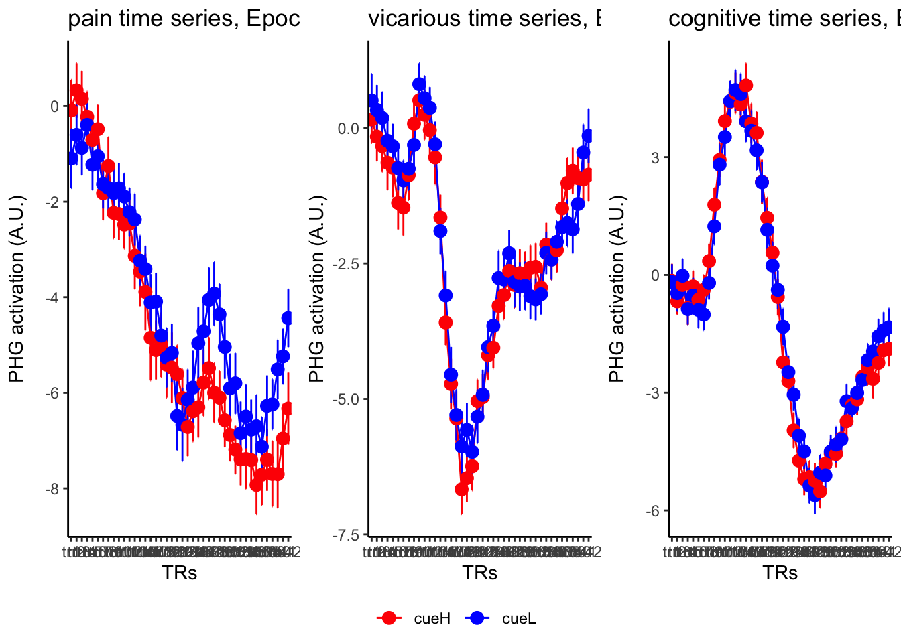

# fMRI :: FIR ~ task TTL1 {#fmritimeseries_tt1}

The purpose of this notebook is to plot the BOLD timeseries from SPM FIR model.
TODO

- load tsv
- concatenate
- per time column, calculate mean and variance
- plot

## references

https://stackoverflow.com/questions/29402528/append-data-frames-together-in-a-for-loop/29419402


```r
plot_timeseries_onefactor <-
  function(df, iv1, mean, error, xlab, ylab, ggtitle, color) {
    n_points <- 100 # Number of points for interpolation

    g <- ggplot(
      data = df,
      aes(
        x = .data[[iv1]],
        y = .data[[mean]],
        group = 1,
        color = color
      ),
      cex.lab = 1.5,
      cex.axis = 2,
      cex.main = 1.5,
      cex.sub = 1.5
    ) +
      geom_errorbar(aes(
        ymin = (.data[[mean]] - .data[[error]]),
        ymax = (.data[[mean]] + .data[[error]]),
        color = color
      ),
      width = .1,
      alpha = 0.8) +
      geom_line() +
      geom_point(color = color) +
      ggtitle(ggtitle) +
      xlab(xlab) +
      ylab(ylab) +
      theme_classic() +
      theme(aspect.ratio = .6) +
      expand_limits(x = 3.25) +
      scale_color_manual("",
                         values = color) +
      # theme(
      #   legend.position = c(.99, .99),
      #   legend.justification = c("right", "top"),
      #   legend.box.just = "right",
      #   legend.margin = margin(6, 6, 6, 6)
      # ) +
      # theme(legend.key = element_rect(fill = "white", colour = "white")) +
      theme_bw()

    return(g)
  }
```


```r
plot_timeseries_bar_SANDBOX <-
  function(df, iv1, iv2, mean, error, xlab, ylab, ggtitle, color) {
    n_points <- 100 # Number of points for interpolation

    ## Removing "tr" from the column values
    df[[iv1]] <- as.numeric(sub("tr", "", df[[iv1]]))

    g <- ggplot(
      data = df,
      aes(
        x = .data[[iv1]],
        y = .data[[mean]],
        group = factor(.data[[iv2]]),
        color = factor(.data[[iv2]])
      ),
      cex.lab = 1.5,
      cex.axis = 2,
      cex.main = 1.5,
      cex.sub = 1.5
    ) +
      geom_errorbar(aes(
        ymin = (.data[[mean]] - .data[[error]]),
        ymax = (.data[[mean]] + .data[[error]]),
        fill =  factor(.data[[iv2]])
      ),
      width = .1,
      alpha = 0.8) +
      geom_line() +
      geom_point() +
      ggtitle(ggtitle) +
      xlab(xlab) +
      ylab(ylab) +
      theme_classic() +
      expand_limits(x = 3.25) +
      scale_color_manual("",
                         values = color) +
      scale_fill_manual("",
                        values = color) +
      theme(
        aspect.ratio = .6,
        text = element_text(size = 20),
        axis.title.x = element_text(size = 24),
        axis.title.y = element_text(size = 24),
        legend.position = c(.99, .99),
        legend.justification = c("right", "top"),
        legend.box.just = "right",
        legend.margin = margin(6, 6, 6, 6)
      ) +
      theme(legend.key = element_rect(fill = "white", colour = "white")) +
      theme_bw()

    return(g)
  }
```

### parameters {.unlisted .unnumbered}


```r
main_dir <- dirname(dirname(getwd()))
datadir <- file.path(main_dir, "analysis/fmri/nilearn/glm/fir")
analysis_folder <- paste0("model52_iv-6cond_dv-firglasserSPM_ttl1")
analysis_dir <-
  file.path(main_dir,
            "analysis",
            "mixedeffect",
            analysis_folder,
            as.character(Sys.Date()))
dir.create(analysis_dir,
           showWarnings = FALSE,
           recursive = TRUE)
save_dir <- analysis_dir
```

## taskwise stim effect

Here, I have a list of ROIs. Per ROI, I have FIR values for pain, vicarious, cognitive tasks.
We'll aggregate data per ROI and plot the time series for the 3 tasks.


```r
roi_list <- c("dACC", "PHG", "V1", "SM", "MT", "RSC", "LOC", "FFC", "PIT", "pSTS", "AIP", "premotor") # 'rINS', 'TPJ',
run_types <- c("pain", "vicarious", "cognitive")
plot_list <- list()
TR_length <- 42


for (ROI in roi_list) {
  main_dir <- dirname(dirname(getwd()))
  datadir <- file.path(main_dir, "analysis/fmri/spm/fir/ttl1par")
  taskname <- "pain"
  exclude <- "sub-0001"
  filename <- paste0("sub-*", "*roi-", ROI, "_tr-42.csv")
  common_path <- Sys.glob(file.path(datadir, "sub-*", filename))
  filter_path <-
    common_path[!str_detect(common_path, pattern = exclude)]

  df <-
    do.call("rbind.fill", lapply(
      filter_path,
      FUN = function(files) {
        read.table(files, header = TRUE, sep = ",")
      }
    ))

  for (run_type in run_types) {
    print(run_type)
    filtered_df <-
      df[!(df$condition == "rating" |
             df$condition == "cue" | df$runtype != run_type),]

    parsed_df <- filtered_df %>%
      separate(
        condition,
        into = c("cue", "stim"),
        sep = "_",
        remove = FALSE
      )
    # --------------------------------------------------------------------------
    #                           0) subset dataframe based on ROI
    # --------------------------------------------------------------------------
    df_long <-
      pivot_longer(
        parsed_df,
        cols = starts_with("tr"),
        names_to = "tr_num",
        values_to = "tr_value"
      )

    # --------------------------------------------------------------------------
    #                           1) clean factor
    # --------------------------------------------------------------------------
    df_long$tr_ordered <- factor(df_long$tr_num,
                                 levels = c(paste0("tr", 1:TR_length)))
    df_long$stim_ordered <- factor(df_long$stim,
                                   levels = c("stimH", "stimM", "stimL"))
    # --------------------------------------------------------------------------
    #                             2) summary statistics
    # --------------------------------------------------------------------------
    subjectwise <- meanSummary(df_long,
                               c("sub", "tr_ordered", "stim_ordered"),
                               "tr_value")
    groupwise <- summarySEwithin(
      data = subjectwise,
      measurevar = "mean_per_sub",
      withinvars = c("stim_ordered", "tr_ordered"),
      idvar = "sub"
    )
    groupwise$task <- run_type
    # https://stackoverflow.com/questions/29402528/append-data-frames-together-in-a-for-loop/29419402
    LINEIV1 <- "tr_ordered"
    LINEIV2 <- "stim_ordered"
    MEAN <- "mean_per_sub_norm_mean"
    ERROR <- "se"
    dv_keyword <- "actual"
    sorted_indices <- order(groupwise$tr_ordered)
    groupwise_sorted <- groupwise[sorted_indices,]

    # --------------------------------------------------------------------------
    #                             3) plot per run
    # --------------------------------------------------------------------------
    p1 <- plot_timeseries_bar_SANDBOX(
      groupwise_sorted,
      LINEIV1,
      LINEIV2,
      MEAN,
      ERROR,
      xlab = "TRs",
      ylab = paste0(ROI, " activation (A.U.)"),
      ggtitle = paste0(
        ROI,
        ": ",
        run_type,
        " (N = ",
        length(unique(subjectwise$sub)),
        ") time series, Epoch - stimulus"
      ),
      color = c("#5f0f40", "#ae2012", "#fcbf49")
    )
    time_points <- seq(1, 0.46 * TR_length, 0.46)
    p1 <- p1 +
      annotate(
        "rect",
        xmin = 0,
        xmax = 20,
        ymin = min(df[[MEAN]], na.rm = TRUE) - 5,
        ymax = max(df[[MEAN]], na.rm = TRUE) + 5,
        fill = "grey",
        alpha = 0.2
      )
    plot_list[[run_type]] <- p1 + theme_classic()

  }

  # --------------------------------------------------------------------------
  #                             4) plot three tasks per ROI
  # --------------------------------------------------------------------------
  library(gridExtra)
  plot_list <- lapply(plot_list, function(plot) {
    plot + theme(plot.margin = margin(5, 5, 5, 5)) # Adjust plot margins if needed
  })
  combined_plot <- ggpubr::ggarrange(
    plot_list[["pain"]],
    plot_list[["vicarious"]],
    plot_list[["cognitive"]],
    common.legend = TRUE,
    legend = "bottom",
    ncol = 3,
    nrow = 1,
    widths = c(3, 3, 3),
    heights = c(.5, .5, .5),
    align = "v"
  )
  print(combined_plot)
  ggsave(file.path(
    save_dir,
    paste0("roi-", ROI, "_epoch-stim_desc-highstimGTlowstim.png")
  ),
  combined_plot,
  width = 12,
  height = 4)
}
```

```
## [1] "pain"
```

```
## 
## Attaching package: 'raincloudplots'
```

```
## The following object is masked _by_ '.GlobalEnv':
## 
##     GeomFlatViolin
```

```
## Warning in geom_errorbar(aes(ymin = (.data[[mean]] - .data[[error]]), ymax =
## (.data[[mean]] + : Ignoring unknown aesthetics: fill
```

```
## Warning in min(df[[MEAN]], na.rm = TRUE): no non-missing arguments to min;
## returning Inf
```

```
## Warning in max(df[[MEAN]], na.rm = TRUE): no non-missing arguments to max;
## returning -Inf
```

```
## [1] "vicarious"
```

```
## Warning in geom_errorbar(aes(ymin = (.data[[mean]] - .data[[error]]), ymax =
## (.data[[mean]] + : Ignoring unknown aesthetics: fill
```

```
## Warning in min(df[[MEAN]], na.rm = TRUE): no non-missing arguments to min;
## returning Inf
```

```
## Warning in max(df[[MEAN]], na.rm = TRUE): no non-missing arguments to max;
## returning -Inf
```

```
## [1] "cognitive"
```

```
## Warning in geom_errorbar(aes(ymin = (.data[[mean]] - .data[[error]]), ymax =
## (.data[[mean]] + : Ignoring unknown aesthetics: fill
```

```
## Warning in min(df[[MEAN]], na.rm = TRUE): no non-missing arguments to min;
## returning Inf
```

```
## Warning in max(df[[MEAN]], na.rm = TRUE): no non-missing arguments to max;
## returning -Inf
```

```
## 
## Attaching package: 'gridExtra'
```

```
## The following object is masked from 'package:dplyr':
## 
##     combine
```

```
## [1] "pain"
```

```
## Warning in geom_errorbar(aes(ymin = (.data[[mean]] - .data[[error]]), ymax =
## (.data[[mean]] + : Ignoring unknown aesthetics: fill
```

```
## Warning in min(df[[MEAN]], na.rm = TRUE): no non-missing arguments to min;
## returning Inf
```

```
## Warning in max(df[[MEAN]], na.rm = TRUE): no non-missing arguments to max;
## returning -Inf
```

```
## [1] "vicarious"
```

```
## Warning in geom_errorbar(aes(ymin = (.data[[mean]] - .data[[error]]), ymax =
## (.data[[mean]] + : Ignoring unknown aesthetics: fill
```

```
## Warning in min(df[[MEAN]], na.rm = TRUE): no non-missing arguments to min;
## returning Inf
```

```
## Warning in max(df[[MEAN]], na.rm = TRUE): no non-missing arguments to max;
## returning -Inf
```

```
## [1] "cognitive"
```

```
## Warning in geom_errorbar(aes(ymin = (.data[[mean]] - .data[[error]]), ymax =
## (.data[[mean]] + : Ignoring unknown aesthetics: fill
```

```
## Warning in min(df[[MEAN]], na.rm = TRUE): no non-missing arguments to min;
## returning Inf
```

```
## Warning in max(df[[MEAN]], na.rm = TRUE): no non-missing arguments to max;
## returning -Inf
```


```
## [1] "pain"
```

```
## Warning in geom_errorbar(aes(ymin = (.data[[mean]] - .data[[error]]), ymax =
## (.data[[mean]] + : Ignoring unknown aesthetics: fill
```

```
## Warning in min(df[[MEAN]], na.rm = TRUE): no non-missing arguments to min;
## returning Inf
```

```
## Warning in max(df[[MEAN]], na.rm = TRUE): no non-missing arguments to max;
## returning -Inf
```

```
## [1] "vicarious"
```

```
## Warning in geom_errorbar(aes(ymin = (.data[[mean]] - .data[[error]]), ymax =
## (.data[[mean]] + : Ignoring unknown aesthetics: fill
```

```
## Warning in min(df[[MEAN]], na.rm = TRUE): no non-missing arguments to min;
## returning Inf
```

```
## Warning in max(df[[MEAN]], na.rm = TRUE): no non-missing arguments to max;
## returning -Inf
```

```
## [1] "cognitive"
```

```
## Warning in geom_errorbar(aes(ymin = (.data[[mean]] - .data[[error]]), ymax =
## (.data[[mean]] + : Ignoring unknown aesthetics: fill
```

```
## Warning in min(df[[MEAN]], na.rm = TRUE): no non-missing arguments to min;
## returning Inf
```

```
## Warning in max(df[[MEAN]], na.rm = TRUE): no non-missing arguments to max;
## returning -Inf
```


```
## [1] "pain"
```

```
## Warning in geom_errorbar(aes(ymin = (.data[[mean]] - .data[[error]]), ymax =
## (.data[[mean]] + : Ignoring unknown aesthetics: fill
```

```
## Warning in min(df[[MEAN]], na.rm = TRUE): no non-missing arguments to min;
## returning Inf
```

```
## Warning in max(df[[MEAN]], na.rm = TRUE): no non-missing arguments to max;
## returning -Inf
```

```
## [1] "vicarious"
```

```
## Warning in geom_errorbar(aes(ymin = (.data[[mean]] - .data[[error]]), ymax =
## (.data[[mean]] + : Ignoring unknown aesthetics: fill
```

```
## Warning in min(df[[MEAN]], na.rm = TRUE): no non-missing arguments to min;
## returning Inf
```

```
## Warning in max(df[[MEAN]], na.rm = TRUE): no non-missing arguments to max;
## returning -Inf
```

```
## [1] "cognitive"
```

```
## Warning in geom_errorbar(aes(ymin = (.data[[mean]] - .data[[error]]), ymax =
## (.data[[mean]] + : Ignoring unknown aesthetics: fill
```

```
## Warning in min(df[[MEAN]], na.rm = TRUE): no non-missing arguments to min;
## returning Inf
```

```
## Warning in max(df[[MEAN]], na.rm = TRUE): no non-missing arguments to max;
## returning -Inf
```


```
## [1] "pain"
```

```
## Warning in geom_errorbar(aes(ymin = (.data[[mean]] - .data[[error]]), ymax =
## (.data[[mean]] + : Ignoring unknown aesthetics: fill
```

```
## Warning in min(df[[MEAN]], na.rm = TRUE): no non-missing arguments to min;
## returning Inf
```

```
## Warning in max(df[[MEAN]], na.rm = TRUE): no non-missing arguments to max;
## returning -Inf
```

```
## [1] "vicarious"
```

```
## Warning in geom_errorbar(aes(ymin = (.data[[mean]] - .data[[error]]), ymax =
## (.data[[mean]] + : Ignoring unknown aesthetics: fill
```

```
## Warning in min(df[[MEAN]], na.rm = TRUE): no non-missing arguments to min;
## returning Inf
```

```
## Warning in max(df[[MEAN]], na.rm = TRUE): no non-missing arguments to max;
## returning -Inf
```

```
## [1] "cognitive"
```

```
## Warning in geom_errorbar(aes(ymin = (.data[[mean]] - .data[[error]]), ymax =
## (.data[[mean]] + : Ignoring unknown aesthetics: fill
```

```
## Warning in min(df[[MEAN]], na.rm = TRUE): no non-missing arguments to min;
## returning Inf
```

```
## Warning in max(df[[MEAN]], na.rm = TRUE): no non-missing arguments to max;
## returning -Inf
```


```
## [1] "pain"
```

```
## Warning in geom_errorbar(aes(ymin = (.data[[mean]] - .data[[error]]), ymax =
## (.data[[mean]] + : Ignoring unknown aesthetics: fill
```

```
## Warning in min(df[[MEAN]], na.rm = TRUE): no non-missing arguments to min;
## returning Inf
```

```
## Warning in max(df[[MEAN]], na.rm = TRUE): no non-missing arguments to max;
## returning -Inf
```

```
## [1] "vicarious"
```

```
## Warning in geom_errorbar(aes(ymin = (.data[[mean]] - .data[[error]]), ymax =
## (.data[[mean]] + : Ignoring unknown aesthetics: fill
```

```
## Warning in min(df[[MEAN]], na.rm = TRUE): no non-missing arguments to min;
## returning Inf
```

```
## Warning in max(df[[MEAN]], na.rm = TRUE): no non-missing arguments to max;
## returning -Inf
```

```
## [1] "cognitive"
```

```
## Warning in geom_errorbar(aes(ymin = (.data[[mean]] - .data[[error]]), ymax =
## (.data[[mean]] + : Ignoring unknown aesthetics: fill
```

```
## Warning in min(df[[MEAN]], na.rm = TRUE): no non-missing arguments to min;
## returning Inf
```

```
## Warning in max(df[[MEAN]], na.rm = TRUE): no non-missing arguments to max;
## returning -Inf
```


```
## [1] "pain"
```

```
## Warning in geom_errorbar(aes(ymin = (.data[[mean]] - .data[[error]]), ymax =
## (.data[[mean]] + : Ignoring unknown aesthetics: fill
```

```
## Warning in min(df[[MEAN]], na.rm = TRUE): no non-missing arguments to min;
## returning Inf
```

```
## Warning in max(df[[MEAN]], na.rm = TRUE): no non-missing arguments to max;
## returning -Inf
```

```
## [1] "vicarious"
```

```
## Warning in geom_errorbar(aes(ymin = (.data[[mean]] - .data[[error]]), ymax =
## (.data[[mean]] + : Ignoring unknown aesthetics: fill
```

```
## Warning in min(df[[MEAN]], na.rm = TRUE): no non-missing arguments to min;
## returning Inf
```

```
## Warning in max(df[[MEAN]], na.rm = TRUE): no non-missing arguments to max;
## returning -Inf
```

```
## [1] "cognitive"
```

```
## Warning in geom_errorbar(aes(ymin = (.data[[mean]] - .data[[error]]), ymax =
## (.data[[mean]] + : Ignoring unknown aesthetics: fill
```

```
## Warning in min(df[[MEAN]], na.rm = TRUE): no non-missing arguments to min;
## returning Inf
```

```
## Warning in max(df[[MEAN]], na.rm = TRUE): no non-missing arguments to max;
## returning -Inf
```


```
## [1] "pain"
```

```
## Warning in geom_errorbar(aes(ymin = (.data[[mean]] - .data[[error]]), ymax =
## (.data[[mean]] + : Ignoring unknown aesthetics: fill
```

```
## Warning in min(df[[MEAN]], na.rm = TRUE): no non-missing arguments to min;
## returning Inf
```

```
## Warning in max(df[[MEAN]], na.rm = TRUE): no non-missing arguments to max;
## returning -Inf
```

```
## [1] "vicarious"
```

```
## Warning in geom_errorbar(aes(ymin = (.data[[mean]] - .data[[error]]), ymax =
## (.data[[mean]] + : Ignoring unknown aesthetics: fill
```

```
## Warning in min(df[[MEAN]], na.rm = TRUE): no non-missing arguments to min;
## returning Inf
```

```
## Warning in max(df[[MEAN]], na.rm = TRUE): no non-missing arguments to max;
## returning -Inf
```

```
## [1] "cognitive"
```

```
## Warning in geom_errorbar(aes(ymin = (.data[[mean]] - .data[[error]]), ymax =
## (.data[[mean]] + : Ignoring unknown aesthetics: fill
```

```
## Warning in min(df[[MEAN]], na.rm = TRUE): no non-missing arguments to min;
## returning Inf
```

```
## Warning in max(df[[MEAN]], na.rm = TRUE): no non-missing arguments to max;
## returning -Inf
```


```
## [1] "pain"
```

```
## Warning in geom_errorbar(aes(ymin = (.data[[mean]] - .data[[error]]), ymax =
## (.data[[mean]] + : Ignoring unknown aesthetics: fill
```

```
## Warning in min(df[[MEAN]], na.rm = TRUE): no non-missing arguments to min;
## returning Inf
```

```
## Warning in max(df[[MEAN]], na.rm = TRUE): no non-missing arguments to max;
## returning -Inf
```

```
## [1] "vicarious"
```

```
## Warning in geom_errorbar(aes(ymin = (.data[[mean]] - .data[[error]]), ymax =
## (.data[[mean]] + : Ignoring unknown aesthetics: fill
```

```
## Warning in min(df[[MEAN]], na.rm = TRUE): no non-missing arguments to min;
## returning Inf
```

```
## Warning in max(df[[MEAN]], na.rm = TRUE): no non-missing arguments to max;
## returning -Inf
```

```
## [1] "cognitive"
```

```
## Warning in geom_errorbar(aes(ymin = (.data[[mean]] - .data[[error]]), ymax =
## (.data[[mean]] + : Ignoring unknown aesthetics: fill
```

```
## Warning in min(df[[MEAN]], na.rm = TRUE): no non-missing arguments to min;
## returning Inf
```

```
## Warning in max(df[[MEAN]], na.rm = TRUE): no non-missing arguments to max;
## returning -Inf
```


```
## [1] "pain"
```

```
## Warning in geom_errorbar(aes(ymin = (.data[[mean]] - .data[[error]]), ymax =
## (.data[[mean]] + : Ignoring unknown aesthetics: fill
```

```
## Warning in min(df[[MEAN]], na.rm = TRUE): no non-missing arguments to min;
## returning Inf
```

```
## Warning in max(df[[MEAN]], na.rm = TRUE): no non-missing arguments to max;
## returning -Inf
```

```
## [1] "vicarious"
```

```
## Warning in geom_errorbar(aes(ymin = (.data[[mean]] - .data[[error]]), ymax =
## (.data[[mean]] + : Ignoring unknown aesthetics: fill
```

```
## Warning in min(df[[MEAN]], na.rm = TRUE): no non-missing arguments to min;
## returning Inf
```

```
## Warning in max(df[[MEAN]], na.rm = TRUE): no non-missing arguments to max;
## returning -Inf
```

```
## [1] "cognitive"
```

```
## Warning in geom_errorbar(aes(ymin = (.data[[mean]] - .data[[error]]), ymax =
## (.data[[mean]] + : Ignoring unknown aesthetics: fill
```

```
## Warning in min(df[[MEAN]], na.rm = TRUE): no non-missing arguments to min;
## returning Inf
```

```
## Warning in max(df[[MEAN]], na.rm = TRUE): no non-missing arguments to max;
## returning -Inf
```


```
## [1] "pain"
```

```
## Warning in geom_errorbar(aes(ymin = (.data[[mean]] - .data[[error]]), ymax =
## (.data[[mean]] + : Ignoring unknown aesthetics: fill
```

```
## Warning in min(df[[MEAN]], na.rm = TRUE): no non-missing arguments to min;
## returning Inf
```

```
## Warning in max(df[[MEAN]], na.rm = TRUE): no non-missing arguments to max;
## returning -Inf
```

```
## [1] "vicarious"
```

```
## Warning in geom_errorbar(aes(ymin = (.data[[mean]] - .data[[error]]), ymax =
## (.data[[mean]] + : Ignoring unknown aesthetics: fill
```

```
## Warning in min(df[[MEAN]], na.rm = TRUE): no non-missing arguments to min;
## returning Inf
```

```
## Warning in max(df[[MEAN]], na.rm = TRUE): no non-missing arguments to max;
## returning -Inf
```

```
## [1] "cognitive"
```

```
## Warning in geom_errorbar(aes(ymin = (.data[[mean]] - .data[[error]]), ymax =
## (.data[[mean]] + : Ignoring unknown aesthetics: fill
```

```
## Warning in min(df[[MEAN]], na.rm = TRUE): no non-missing arguments to min;
## returning Inf
```

```
## Warning in max(df[[MEAN]], na.rm = TRUE): no non-missing arguments to max;
## returning -Inf
```


```
## [1] "pain"
```

```
## Warning in geom_errorbar(aes(ymin = (.data[[mean]] - .data[[error]]), ymax =
## (.data[[mean]] + : Ignoring unknown aesthetics: fill
```

```
## Warning in min(df[[MEAN]], na.rm = TRUE): no non-missing arguments to min;
## returning Inf
```

```
## Warning in max(df[[MEAN]], na.rm = TRUE): no non-missing arguments to max;
## returning -Inf
```

```
## [1] "vicarious"
```

```
## Warning in geom_errorbar(aes(ymin = (.data[[mean]] - .data[[error]]), ymax =
## (.data[[mean]] + : Ignoring unknown aesthetics: fill
```

```
## Warning in min(df[[MEAN]], na.rm = TRUE): no non-missing arguments to min;
## returning Inf
```

```
## Warning in max(df[[MEAN]], na.rm = TRUE): no non-missing arguments to max;
## returning -Inf
```

```
## [1] "cognitive"
```

```
## Warning in geom_errorbar(aes(ymin = (.data[[mean]] - .data[[error]]), ymax =
## (.data[[mean]] + : Ignoring unknown aesthetics: fill
```

```
## Warning in min(df[[MEAN]], na.rm = TRUE): no non-missing arguments to min;
## returning Inf
```

```
## Warning in max(df[[MEAN]], na.rm = TRUE): no non-missing arguments to max;
## returning -Inf
```


```r
p1 + annotate("rect", xmin = 0, xmax = 10, ymin = min(df[[MEAN]], na.rm = TRUE) - 5, ymax = max(df[[MEAN]], na.rm = TRUE) + 5, fill = "grey", alpha = 0.2)
```

```
## Warning in min(df[[MEAN]], na.rm = TRUE): no non-missing arguments to min;
## returning Inf
```

```
## Warning in max(df[[MEAN]], na.rm = TRUE): no non-missing arguments to max;
## returning -Inf
```


### PCA subjectwise


```r
run_types <- c("pain")
for (run_type in run_types) {
  print(run_type)
  filtered_df <-
    df[!(df$condition == "rating" |
           df$condition == "cue" | df$runtype != run_type),]

  parsed_df <- filtered_df %>%
    separate(
      condition,
      into = c("cue", "stim"),
      sep = "_",
      remove = FALSE
    )
  # ------------------------------------------------------------------------------
  #                       subset regions based on ROI
  # ------------------------------------------------------------------------------
  df_long <-
    pivot_longer(
      parsed_df,
      cols = starts_with("tr"),
      names_to = "tr_num",
      values_to = "tr_value"
    )

  # ------------------------------------------------------------------------------
  #                             clean factor
  # ------------------------------------------------------------------------------
  df_long$tr_ordered <- factor(df_long$tr_num,
                               levels = c(paste0("tr", 1:TR_length)))
  df_long$stim_ordered <- factor(df_long$stim,
                                 levels = c("stimH", "stimM", "stimL"))

  # ------------------------------------------------------------------------------
  #                            summary stats
  # ------------------------------------------------------------------------------
  subjectwise <- meanSummary(df_long,
                             c("sub", "tr_ordered", "stim_ordered"), "tr_value")


  # ------------------------------------------------------------------------------
  #                             convert dataframe long to wide
  # ------------------------------------------------------------------------------

  df_wide <- pivot_wider(
    subjectwise,
    id_cols = c("tr_ordered", "stim_ordered"),
    names_from = c("sub"),
    values_from = "mean_per_sub"
  )

  stim_high.df <- df_wide[df_wide$stim_ordered == "stimH",]
  stim_med.df <- df_wide[df_wide$stim_ordered == "stimM",]
  stim_low.df <- df_wide[df_wide$stim_ordered == "stimL",]

  meanhighdf <-
    data.frame(subset(stim_high.df, select = 3:(ncol(stim_high.df) - 1)))
  high.pca_result <- prcomp(meanhighdf)
  high.pca_scores <- as.data.frame(high.pca_result$x)
  # Access the proportion of variance explained by each principal component
  high.variance_explained <-
    high.pca_result$sdev ^ 2 / sum(high.pca_result$sdev ^ 2)
  plot(high.variance_explained)
  # Access the standard deviations of each principal component
  high.stdev <- high.pca_result$sdev

  meanmeddf <-
    data.frame(subset(stim_med.df, select = 3:(ncol(stim_med.df) - 1)))
  med.pca <- prcomp(meanmeddf)
  med.pca_scores <- as.data.frame(med.pca$x)

  meanlowdf <-
    data.frame(subset(stim_low.df, select = 3:(ncol(stim_low.df) - 1)))
  low.pca <- prcomp(meanlowdf)
  low.pca_scores <- as.data.frame(low.pca$x)

  combined_pca_scores <-
    rbind(high.pca_scores, med.pca_scores, low.pca_scores)

  # Add a new column to indicate the stim_ordered category (high_stim or low_stim)
  combined_pca_scores$stim_ordered <- c(rep("high_stim", nrow(high.pca_scores)),
                                        rep("med_stim", nrow(med.pca_scores)),
                                        rep("low_stim", nrow(low.pca_scores)))

  # ------------------------------------------------------------------------------
  #                             3d PCA plot
  # ------------------------------------------------------------------------------
  plot_ly(
    combined_pca_scores,
    x = ~ PC1,
    y = ~ PC2,
    z = ~ PC3,
    type = "scatter3d",
    mode = "markers",
    color = ~ stim_ordered
  )
}
```

```
## [1] "pain"
```


```r
plot_ly(
  combined_pca_scores,
  x = ~ PC1,
  y = ~ PC2,
  z = ~ PC3,
  type = "scatter3d",
  mode = "markers",
  color = ~ stim_ordered
)
```

```{=html}
<div class="plotly html-widget html-fill-item" id="htmlwidget-1880da0a99e2c95a13db" style="width:672px;height:480px;"></div>
<script type="application/json" data-for="htmlwidget-1880da0a99e2c95a13db">{"x":{"visdat":{"2ba0650a3fbe":["function () ","plotlyVisDat"]},"cur_data":"2ba0650a3fbe","attrs":{"2ba0650a3fbe":{"x":{},"y":{},"z":{},"mode":"markers","color":{},"alpha_stroke":1,"sizes":[10,100],"spans":[1,20],"type":"scatter3d"}},"layout":{"margin":{"b":40,"l":60,"t":25,"r":10},"scene":{"xaxis":{"title":"PC1"},"yaxis":{"title":"PC2"},"zaxis":{"title":"PC3"}},"hovermode":"closest","showlegend":true},"source":"A","config":{"modeBarButtonsToAdd":["hoverclosest","hovercompare"],"showSendToCloud":false},"data":[{"x":[-2.5490822884318294,-1.2248213055348995,-5.8458842657447869,-2.5003841075838684,-0.55085362736220711,2.2230724417057228,4.8678184761095906,6.6837420584025562,14.275803714919425,16.915973817148156,27.695843980435704,22.442763940798006,34.384953906597197,39.720592983220882,55.781228495191044,62.507149255664828,72.389659232029373,76.780835381245709,85.914211358286536,85.458629221249495,87.892340015903969,90.192370008461495,89.264824033514685,77.815659543618494,77.55763810389216,70.540017301264584,65.795147839591436,51.368692591764152,30.569878751404055,9.8113126972385807,-14.650090378348622,-31.636969838980932,-63.239747970558525,-79.975308854129324,-98.878624025053725,-114.94027409961703,-125.22648796393933,-137.31867231989514,-146.39921288575684,-147.66355950786374,-143.23225094880019,-143.01793476205688],"y":[-33.263024508666142,-38.367816501153797,-48.217054279942005,-49.080483011803736,-57.121997002001159,-56.745237659764165,-60.250411018061499,-59.985977297766716,-64.437323780153093,-55.752535501820702,-48.285399471000993,-54.858730473750363,-45.65338429989081,-43.688953396500935,-28.444166913996082,-29.369593341146288,-13.008851895054873,-6.4897144627792454,10.693746208553589,16.307427192226886,24.555477185549456,42.047638438297263,41.458389198795317,53.303354884485429,61.729320117855728,71.249503249670084,66.130624961889879,49.139211730952496,50.963619227824189,39.061931382351702,35.9040157236441,33.601394572984759,36.766637576916843,32.327942130947363,35.374455319129602,30.544859047435775,25.599475398277292,16.40241685204591,8.9484128217060785,11.354339769663538,2.1505348835652418,-2.5940730595160182],"z":[-19.966186837600119,-20.756157530945174,-26.0676326548822,-25.992103514923588,-23.745504697010205,-21.464943023786386,-21.270102937654809,-15.508890065498679,-13.446113560923992,-7.9875678296226882,3.2044002572436767,0.20799937005373886,13.5348873769239,20.372623400037568,26.874347146995124,32.889099660116649,33.347869463135162,36.109721054579836,35.381494258789964,26.360798691605179,18.714460130874297,19.584978245703304,14.386654169041654,9.9978129366810311,1.5329490864773982,-4.3627125345729798,-17.833272520997138,-33.780208071796068,-31.832711133682608,-34.756856282870146,-38.72836786574549,-35.60038702609635,-29.0410884998713,-18.627270598746865,-2.6595895476733817,1.6496275357414496,10.381190579246359,18.714676068717871,27.381958743283626,26.869750735354824,30.524468257920649,35.405899566376846],"mode":"markers","type":"scatter3d","name":"high_stim","marker":{"color":"rgba(102,194,165,1)","line":{"color":"rgba(102,194,165,1)"}},"textfont":{"color":"rgba(102,194,165,1)"},"error_y":{"color":"rgba(102,194,165,1)"},"error_x":{"color":"rgba(102,194,165,1)"},"line":{"color":"rgba(102,194,165,1)"},"frame":null},{"x":[-33.165907587007645,-33.078160472805834,-32.178934398683467,-31.967086819611819,-31.981421215893562,-26.07004499457922,-24.555919959572904,-15.422626882109757,-11.369549773542776,-1.5373212884195835,0.80260122370354681,5.1791084833491903,13.773141748943489,17.815233424509966,26.920705472121082,34.608651063842331,43.177958372253691,48.697347679220613,55.679042882428959,60.75067573141326,56.088698869990729,57.142872735405057,59.958362399150978,53.767537585927776,45.189092889759664,44.766468517728669,42.451766425190307,34.015461822492028,31.618231273672908,27.741366484203624,7.1203776031014172,-3.3765666324291694,-15.691785986405009,-31.795188786427094,-36.949978258523572,-55.369809144256479,-55.45704366525262,-61.206070092789673,-63.555398357438442,-67.165748361509216,-68.770553820543299,-66.59958619060815],"y":[-33.699768845449263,-37.538144175523648,-35.277132136734473,-36.857567811378608,-41.505823417539212,-36.994635455497011,-44.057611512370485,-42.15784751615751,-36.259199217599509,-39.26591558873838,-39.638180060701551,-42.407527147067832,-31.967736805998552,-34.89941003054367,-33.967987442298366,-36.651666914109583,-26.597041134281969,-18.630472658394904,-3.4399300324677382,3.0712647124330976,12.363866526201654,26.5564059927651,28.653990644582873,26.985550532021634,28.080587591283944,25.86459063412671,24.036930075161802,31.722283267251676,30.42801170255111,30.706074990805028,37.906587172292475,36.398154454963176,34.784148340785805,37.911818385076216,37.655603730074304,35.403264145894681,27.991448365892108,33.226938426101739,28.068641029977137,27.0272257784864,29.09615623553734,17.874055168586253],"z":[12.125799557068046,23.981211091369641,27.334931524826718,29.226255248601081,16.664274472797281,20.382910940394847,10.321060661100981,8.714723518497685,7.3023789524777802,-0.30274970689675296,-11.470407697623681,-6.6897494510882636,-20.389419043400007,-20.623091238986515,-22.074722377455686,-30.368440012044289,-21.045082561419544,-19.860662047110527,-16.157324471126341,-14.687318443287571,-5.1466483177862914,-6.4857346569491217,3.8214160961969159,9.9816341136969058,19.535860942340161,21.576134234889135,16.503350170684186,22.473363695752852,22.502526355425616,4.6737945563414884,8.0053553505042832,8.9413380003043557,0.71597526459013427,2.4139860337263039,-5.1508466178996946,-4.6930091538838363,-11.71413741476351,-16.889681692018833,-19.161111802742496,-23.774876020222464,-15.901748141736684,-4.6115199131442424],"mode":"markers","type":"scatter3d","name":"low_stim","marker":{"color":"rgba(252,141,98,1)","line":{"color":"rgba(252,141,98,1)"}},"textfont":{"color":"rgba(252,141,98,1)"},"error_y":{"color":"rgba(252,141,98,1)"},"error_x":{"color":"rgba(252,141,98,1)"},"line":{"color":"rgba(252,141,98,1)"},"frame":null},{"x":[-19.002327600916097,-19.339653881253184,-14.659147181720433,-19.170135399646814,-13.095598982618645,-15.89428802718357,-7.6752519282447427,-6.2795298738842904,-8.7496622897701979,2.3108507851310569,7.4085686921250309,18.470780669095653,27.591395878623487,40.675610926501115,53.987962041799818,60.181520655069725,66.788905827727561,80.480144451558814,78.475337686728949,83.040192529920375,83.822809432953662,78.953628556994005,68.605806918997999,71.839497182169808,69.653445323717548,59.145627103367644,59.266883605465189,58.064638332708213,38.990478684331435,22.451495315037654,-4.6566595074520443,-20.291657908269322,-48.859346135464087,-69.029209732215506,-93.831115064066282,-92.713092469360319,-100.58132809666479,-111.73236352029299,-119.76134601754715,-119.78881686818882,-116.15114816273726,-108.94390195252811],"y":[-43.879649225752644,-41.480836241356798,-49.13896875272026,-45.09473120950058,-50.172228639854815,-53.53041521755793,-47.344914213689712,-51.708594623260403,-53.363609039192895,-48.922228168207575,-42.39184477121092,-46.941801132702871,-41.710192372262391,-35.547219013461344,-29.465300283983186,-21.14830038935639,-8.2424380085419351,-7.2758092660073359,4.8350120671276899,10.996765883429717,18.684447580617856,26.107969648620294,25.472770067583255,37.5998145174865,38.426672687622343,45.433398876715707,49.302967307721794,43.509529783764137,49.985828375626042,48.733324363268117,48.284405539954335,42.935229692900187,40.245441833418774,35.668801911048924,33.950788614799599,28.016512571182734,25.959423332064187,21.960591252761503,17.993376864186779,8.7198043897484734,8.5645491376164404,5.9716542693544623],"z":[-18.035465678215211,-22.734844629337729,-16.682337664457069,-25.239698772182674,-23.590118362570237,-21.66219544835376,-14.8425032848803,-15.43054063940024,-12.515814779661039,-7.782696055165629,-3.6268197259213397,5.0603779521977561,13.927248269233568,23.279670455304899,23.117738993661028,23.435729450989985,23.480877057711648,26.747355476122578,23.869556362673116,17.035283029379539,21.970587280094023,26.649067922196259,12.816623980933416,9.2054680417368893,-9.5460040016575025,-16.467526088987917,-21.505388585038094,-21.776476970656148,-25.080255923050455,-24.476326728082235,-29.096296907533503,-21.678363802535905,-23.267391125397634,-15.419084159511121,-5.6562532924247293,-1.6869165971326827,17.630133559173,19.729865147572642,26.248072035253308,32.990239795316228,26.32744883066756,24.277975581935706],"mode":"markers","type":"scatter3d","name":"med_stim","marker":{"color":"rgba(141,160,203,1)","line":{"color":"rgba(141,160,203,1)"}},"textfont":{"color":"rgba(141,160,203,1)"},"error_y":{"color":"rgba(141,160,203,1)"},"error_x":{"color":"rgba(141,160,203,1)"},"line":{"color":"rgba(141,160,203,1)"},"frame":null}],"highlight":{"on":"plotly_click","persistent":false,"dynamic":false,"selectize":false,"opacityDim":0.20000000000000001,"selected":{"opacity":1},"debounce":0},"shinyEvents":["plotly_hover","plotly_click","plotly_selected","plotly_relayout","plotly_brushed","plotly_brushing","plotly_clickannotation","plotly_doubleclick","plotly_deselect","plotly_afterplot","plotly_sunburstclick"],"base_url":"https://plot.ly"},"evals":[],"jsHooks":[]}</script>
```

### PCA groupwise


```r
# ------------------------------------------------------------------------------
#                       data formatting
# ------------------------------------------------------------------------------

# Convert the dataframe to wide format
df_wide.group <- pivot_wider(
  subjectwise,
  id_cols = c("tr_ordered", "stim_ordered"),
  names_from = "sub",
  values_from = "mean_per_sub"
)

# Split the data into two subsets based on the 'stim_ordered' value
# One for 'stimH' and another for 'stimL'
stim_high.df <- df_wide[df_wide$stim_ordered == "stimH",]
stim_low.df <- df_wide[df_wide$stim_ordered == "stimL",]

# Prepare data for PCA analysis by selecting relevant columns
# Exclude the first two columns and the last column
meanhighdf <-
  data.frame(subset(stim_high.df, select = 3:(ncol(stim_high.df) - 1)))
meanlowdf <-
  data.frame(subset(stim_low.df, select = 3:(ncol(stim_low.df) - 1)))


# ------------------------------------------------------------------------------
#                      Principal Component Analysis (PCA)
# ------------------------------------------------------------------------------
high.pca <- prcomp(meanhighdf) # Perform Principal Component Analysis (PCA)
high.pca_scores <- as.data.frame(high.pca$x) # Extract PCA scores

# Repeat the process for the low stimulus data
low.pca <- prcomp(meanlowdf)
low.pca_scores <- as.data.frame(low.pca$x)

combined_pca_scores <- rbind(high.pca_scores, low.pca_scores)

# Add a new column to indicate the 'stim_ordered' category (high_stim or low_stim)
# This helps in distinguishing the groups in the plot
combined_pca_scores$stim_ordered <-
  c(rep("high_stim", nrow(high.pca_scores)), rep("low_stim", nrow(low.pca_scores)))

# ------------------------------------------------------------------------------
#                      plot 3D scatter plot of the PCA scores
# ------------------------------------------------------------------------------
# The points are colored based on their stim_ordered category
plot_ly(
  combined_pca_scores,
  x = ~ PC1,
  y = ~ PC2,
  z = ~ PC3,
  type = "scatter3d",
  mode = "markers",
  color = ~ stim_ordered
)
```

```
## Warning in RColorBrewer::brewer.pal(N, "Set2"): minimal value for n is 3, returning requested palette with 3 different levels

## Warning in RColorBrewer::brewer.pal(N, "Set2"): minimal value for n is 3, returning requested palette with 3 different levels
```

```{=html}
<div class="plotly html-widget html-fill-item" id="htmlwidget-1a9ddc533584de230e9c" style="width:672px;height:480px;"></div>
<script type="application/json" data-for="htmlwidget-1a9ddc533584de230e9c">{"x":{"visdat":{"2ba02735717f":["function () ","plotlyVisDat"]},"cur_data":"2ba02735717f","attrs":{"2ba02735717f":{"x":{},"y":{},"z":{},"mode":"markers","color":{},"alpha_stroke":1,"sizes":[10,100],"spans":[1,20],"type":"scatter3d"}},"layout":{"margin":{"b":40,"l":60,"t":25,"r":10},"scene":{"xaxis":{"title":"PC1"},"yaxis":{"title":"PC2"},"zaxis":{"title":"PC3"}},"hovermode":"closest","showlegend":true},"source":"A","config":{"modeBarButtonsToAdd":["hoverclosest","hovercompare"],"showSendToCloud":false},"data":[{"x":[-2.5490822884318294,-1.2248213055348995,-5.8458842657447869,-2.5003841075838684,-0.55085362736220711,2.2230724417057228,4.8678184761095906,6.6837420584025562,14.275803714919425,16.915973817148156,27.695843980435704,22.442763940798006,34.384953906597197,39.720592983220882,55.781228495191044,62.507149255664828,72.389659232029373,76.780835381245709,85.914211358286536,85.458629221249495,87.892340015903969,90.192370008461495,89.264824033514685,77.815659543618494,77.55763810389216,70.540017301264584,65.795147839591436,51.368692591764152,30.569878751404055,9.8113126972385807,-14.650090378348622,-31.636969838980932,-63.239747970558525,-79.975308854129324,-98.878624025053725,-114.94027409961703,-125.22648796393933,-137.31867231989514,-146.39921288575684,-147.66355950786374,-143.23225094880019,-143.01793476205688],"y":[-33.263024508666142,-38.367816501153797,-48.217054279942005,-49.080483011803736,-57.121997002001159,-56.745237659764165,-60.250411018061499,-59.985977297766716,-64.437323780153093,-55.752535501820702,-48.285399471000993,-54.858730473750363,-45.65338429989081,-43.688953396500935,-28.444166913996082,-29.369593341146288,-13.008851895054873,-6.4897144627792454,10.693746208553589,16.307427192226886,24.555477185549456,42.047638438297263,41.458389198795317,53.303354884485429,61.729320117855728,71.249503249670084,66.130624961889879,49.139211730952496,50.963619227824189,39.061931382351702,35.9040157236441,33.601394572984759,36.766637576916843,32.327942130947363,35.374455319129602,30.544859047435775,25.599475398277292,16.40241685204591,8.9484128217060785,11.354339769663538,2.1505348835652418,-2.5940730595160182],"z":[-19.966186837600119,-20.756157530945174,-26.0676326548822,-25.992103514923588,-23.745504697010205,-21.464943023786386,-21.270102937654809,-15.508890065498679,-13.446113560923992,-7.9875678296226882,3.2044002572436767,0.20799937005373886,13.5348873769239,20.372623400037568,26.874347146995124,32.889099660116649,33.347869463135162,36.109721054579836,35.381494258789964,26.360798691605179,18.714460130874297,19.584978245703304,14.386654169041654,9.9978129366810311,1.5329490864773982,-4.3627125345729798,-17.833272520997138,-33.780208071796068,-31.832711133682608,-34.756856282870146,-38.72836786574549,-35.60038702609635,-29.0410884998713,-18.627270598746865,-2.6595895476733817,1.6496275357414496,10.381190579246359,18.714676068717871,27.381958743283626,26.869750735354824,30.524468257920649,35.405899566376846],"mode":"markers","type":"scatter3d","name":"high_stim","marker":{"color":"rgba(102,194,165,1)","line":{"color":"rgba(102,194,165,1)"}},"textfont":{"color":"rgba(102,194,165,1)"},"error_y":{"color":"rgba(102,194,165,1)"},"error_x":{"color":"rgba(102,194,165,1)"},"line":{"color":"rgba(102,194,165,1)"},"frame":null},{"x":[-33.165907587007645,-33.078160472805834,-32.178934398683467,-31.967086819611819,-31.981421215893562,-26.07004499457922,-24.555919959572904,-15.422626882109757,-11.369549773542776,-1.5373212884195835,0.80260122370354681,5.1791084833491903,13.773141748943489,17.815233424509966,26.920705472121082,34.608651063842331,43.177958372253691,48.697347679220613,55.679042882428959,60.75067573141326,56.088698869990729,57.142872735405057,59.958362399150978,53.767537585927776,45.189092889759664,44.766468517728669,42.451766425190307,34.015461822492028,31.618231273672908,27.741366484203624,7.1203776031014172,-3.3765666324291694,-15.691785986405009,-31.795188786427094,-36.949978258523572,-55.369809144256479,-55.45704366525262,-61.206070092789673,-63.555398357438442,-67.165748361509216,-68.770553820543299,-66.59958619060815],"y":[-33.699768845449263,-37.538144175523648,-35.277132136734473,-36.857567811378608,-41.505823417539212,-36.994635455497011,-44.057611512370485,-42.15784751615751,-36.259199217599509,-39.26591558873838,-39.638180060701551,-42.407527147067832,-31.967736805998552,-34.89941003054367,-33.967987442298366,-36.651666914109583,-26.597041134281969,-18.630472658394904,-3.4399300324677382,3.0712647124330976,12.363866526201654,26.5564059927651,28.653990644582873,26.985550532021634,28.080587591283944,25.86459063412671,24.036930075161802,31.722283267251676,30.42801170255111,30.706074990805028,37.906587172292475,36.398154454963176,34.784148340785805,37.911818385076216,37.655603730074304,35.403264145894681,27.991448365892108,33.226938426101739,28.068641029977137,27.0272257784864,29.09615623553734,17.874055168586253],"z":[12.125799557068046,23.981211091369641,27.334931524826718,29.226255248601081,16.664274472797281,20.382910940394847,10.321060661100981,8.714723518497685,7.3023789524777802,-0.30274970689675296,-11.470407697623681,-6.6897494510882636,-20.389419043400007,-20.623091238986515,-22.074722377455686,-30.368440012044289,-21.045082561419544,-19.860662047110527,-16.157324471126341,-14.687318443287571,-5.1466483177862914,-6.4857346569491217,3.8214160961969159,9.9816341136969058,19.535860942340161,21.576134234889135,16.503350170684186,22.473363695752852,22.502526355425616,4.6737945563414884,8.0053553505042832,8.9413380003043557,0.71597526459013427,2.4139860337263039,-5.1508466178996946,-4.6930091538838363,-11.71413741476351,-16.889681692018833,-19.161111802742496,-23.774876020222464,-15.901748141736684,-4.6115199131442424],"mode":"markers","type":"scatter3d","name":"low_stim","marker":{"color":"rgba(141,160,203,1)","line":{"color":"rgba(141,160,203,1)"}},"textfont":{"color":"rgba(141,160,203,1)"},"error_y":{"color":"rgba(141,160,203,1)"},"error_x":{"color":"rgba(141,160,203,1)"},"line":{"color":"rgba(141,160,203,1)"},"frame":null}],"highlight":{"on":"plotly_click","persistent":false,"dynamic":false,"selectize":false,"opacityDim":0.20000000000000001,"selected":{"opacity":1},"debounce":0},"shinyEvents":["plotly_hover","plotly_click","plotly_selected","plotly_relayout","plotly_brushed","plotly_brushing","plotly_clickannotation","plotly_doubleclick","plotly_deselect","plotly_afterplot","plotly_sunburstclick"],"base_url":"https://plot.ly"},"evals":[],"jsHooks":[]}</script>
```

```r
# ------------------------------------------------------------------------------
#                      plot 2D group plot
# ------------------------------------------------------------------------------
# Create a 2D plot with smoothed lines for each stim_ordered group
combined_pca <- combined_pca_scores %>%
  group_by(stim_ordered) %>%
  mutate(group_index = row_number())
ggplot(combined_pca,
       aes(
         x = group_index,
         y = PC1,
         group = stim_ordered,
         colour = stim_ordered
       )) +
  stat_smooth(
    method = "loess",
    span = 0.25,
    se = TRUE,
    aes(color = stim_ordered),
    alpha = 0.3
  ) +
  theme_bw()
```

```
## `geom_smooth()` using formula = 'y ~ x'
```


```r
# Create the plot

ggplot(
  groupwise,
  aes(
    x = tr_ordered,
    y = mean_per_sub_mean,
    group = stim_ordered,
    colour = stim_ordered
  )
) +
  stat_smooth(
    method = "loess",
    span = 0.25,
    se = TRUE,
    aes(color = stim_ordered),
    alpha = 0.3
  ) +
  theme_bw()
```

```
## `geom_smooth()` using formula = 'y ~ x'
```


```r
# Create the plot
# Create the plot with custom span and smoothing method
ggplot(groupwise, aes(x = tr_ordered, y = mean_per_sub_mean)) +
  geom_line() + # Plot the smooth line for the mean
  geom_ribbon(aes(ymin = mean_per_sub_mean - se, ymax = mean_per_sub_mean + se),
              alpha = 0.3) + # Add the ribbon for standard error
  geom_smooth(method = "loess", span = 0.1, se = FALSE) + # Add the loess smoothing curve
  labs(x = "X-axis Label", y = "Y-axis Label", title = "Smooth Line with Standard Error Ribbon") +
  theme_minimal()
```

```
## `geom_smooth()` using formula = 'y ~ x'
```


## taskwise cue effect


```r
roi_list <- c("dACC", "PHG", "V1", "SM", "MT", "RSC", "LOC", "FFC", "PIT", "pSTS", "AIP", "premotor") # 'rINS', 'TPJ',
for (ROI in roi_list) {
  datadir <- file.path(main_dir, "analysis/fmri/spm/fir/ttl2par")
  # taskname = 'pain'
  exclude <- "sub-0001"
  filename <- paste0("sub-*", "*roi-", ROI, "_tr-42.csv")
  common_path <- Sys.glob(file.path(datadir, "sub-*", filename))
  filter_path <-
    common_path[!str_detect(common_path, pattern = exclude)]

  df <-
    do.call("rbind.fill", lapply(
      filter_path,
      FUN = function(files) {
        read.table(files, header = TRUE, sep = ",")
      }
    ))


  run_types <- c("pain", "vicarious", "cognitive")
  plot_list <- list()
  TR_length <- 42
  for (run_type in run_types) {
    filtered_df <-
      df[!(df$condition == "rating" |
             df$condition == "cue" | df$runtype != run_type),]

    parsed_df <- filtered_df %>%
      separate(
        condition,
        into = c("cue", "stim"),
        sep = "_",
        remove = FALSE
      )

    # --------------------------------------------------------------------------
    #                        subset regions based on ROI
    # --------------------------------------------------------------------------
    df_long <-
      pivot_longer(
        parsed_df,
        cols = starts_with("tr"),
        names_to = "tr_num",
        values_to = "tr_value"
      )

    # --------------------------------------------------------------------------
    #                             clean factor
    # --------------------------------------------------------------------------
    df_long$tr_ordered <- factor(df_long$tr_num,
                                 levels = c(paste0("tr", 1:TR_length)))
    df_long$cue_ordered <- factor(df_long$cue,
                                  levels = c("cueH", "cueL"))

    # --------------------------------------------------------------------------
    #                             summary statistics
    # --------------------------------------------------------------------------
    subjectwise <- meanSummary(df_long,
                               c("sub", "tr_ordered", "cue_ordered"), "tr_value")
    groupwise <- summarySEwithin(
      data = subjectwise,
      measurevar = "mean_per_sub",
      withinvars = c("cue_ordered", "tr_ordered"),
      idvar = "sub"
    )
    groupwise$task <- run_type
    # https://stackoverflow.com/questions/29402528/append-data-frames-together-in-a-for-loop/29419402

    LINEIV1 <- "tr_ordered"
    LINEIV2 <- "cue_ordered"
    MEAN <- "mean_per_sub_norm_mean"
    ERROR <- "se"
    dv_keyword <- "actual"
    sorted_indices <- order(groupwise$tr_ordered)
    groupwise_sorted <- groupwise[sorted_indices,]
    p1 <- plot_timeseries_bar(
      groupwise_sorted,
      LINEIV1,
      LINEIV2,
      MEAN,
      ERROR,
      xlab = "TRs",
      ylab = paste0(ROI, " activation (A.U.)"),
      ggtitle = paste0(run_type, " time series, Epoch - stimulus"),
      color = c("red", "blue")
    )
    time_points <- seq(1, 0.46 * TR_length, 0.46)

    plot_list[[run_type]] <- p1 + theme_classic()
  }

  # ----------------------------------------------------------------------------
  #                             plot three tasks
  # ----------------------------------------------------------------------------
  library(gridExtra)
  plot_list <- lapply(plot_list, function(plot) {
    plot + theme(plot.margin = margin(5, 5, 5, 5)) # Adjust plot margins if needed
  })
  combined_plot <-
    ggpubr::ggarrange(
      plot_list[["pain"]],
      plot_list[["vicarious"]],
      plot_list[["cognitive"]],
      common.legend = TRUE,
      legend = "bottom",
      ncol = 3,
      nrow = 1,
      widths = c(3, 3, 3),
      heights = c(.5, .5, .5),
      align = "v"
    )

  print(combined_plot)
  ggsave(file.path(
    save_dir,
    paste0("roi-", ROI, "_epoch-cue_desc-highcueGTlowcue.png")
  ),
  combined_plot,
  width = 12,
  height = 4)
}
```



### epoch: stim, rating


## MAIN SANDBOX: 6 condition in three panels. per task. per ROI


```r
# A function to plot data
plot_data <- function(groupwise, iv1, iv2, mean, error, xlab, ylab, ggtitle, run_type, colors) {
  p <- plot_timeseries_bar(
    groupwise,
    "tr_ordered",
    "sixcond",
    "mean_per_sub_norm_mean",
    "se",
    xlab = "TRs",
    ylab = "Epoch: stimulus, High cue vs. Low cue",
    ggtitle = paste0(run_type, " intensity (N = ", unique(groupwise$N), ")"),
    color_mapping = colors,
    show_legend = FALSE
  )
  p + theme_classic()
}
```


```r
#' Calculate Point Size Proportionally
#'
#' This function calculates point size proportionally based on a base point size and figure dimensions
#' (width and height). It can be used to adjust the point size in plots to maintain proportionality
#' with varying figure sizes.
#'
#' @param point_size_base The base point size for `geom_points`.
#' @param figure_width The width of the figure in which the point size needs to be adjusted.
#' @param figure_height The height of the figure in which the point size needs to be adjusted.
#'
#' @return The calculated point size.
#'
#' @examples
#' # Define your point size base
#' point_size_base <- 3
#'
#' # Define your figure dimensions (width and height)
#' figure_width <- 12
#' figure_height <- 8
#'
#' # Calculate the point size using the function
#' POINT_SIZE <- calculate_point_size(point_size_base, figure_width, figure_height)
#'
#' # Apply the point size to your plot elements
#' plot + geom_point(size = POINT_SIZE)
#'
#' @export
calculate_point_size <- function(figure_width, figure_height, point_size_base = 5) {
  scaling_factor <- min(figure_width, figure_height) / point_size_base
  return(scaling_factor)
}
```


```r
# ------------------------------------------------------------------------------
#                       epoch stim, high cue vs low cue
# ------------------------------------------------------------------------------

run_types <- c("pain", "vicarious", "cognitive")
all_plots <- list()
TR_length <- 42
for (roi in c("dACC", "PHG")) {
  plot_list_per_roi <- list()
  for (run_type in run_types) {
    filtered_df <-
      df[!(
        df$condition == "rating" |
          df$condition == "cue" |
          df$runtype != run_type | df$ROI == roi
      ),]
    plot_list <- list()

    parsed_df <- filtered_df %>%
      separate(
        condition,
        into = c("cue", "stim"),
        sep = "_",
        remove = FALSE
      )
    # --------------------- subset regions based on ROI ----------------------------
    df_long <-
      pivot_longer(
        parsed_df,
        cols = starts_with("tr"),
        names_to = "tr_num",
        values_to = "tr_value"
      )

    # ----------------------------------------------------------------------------
    #                             clean factor
    # ----------------------------------------------------------------------------
    df_long$tr_ordered <- factor(df_long$tr_num,
                                 levels = c(paste0("tr", 1:TR_length)))
    df_long$cue_ordered <- factor(df_long$cue,
                                  levels = c("cueH", "cueL"))
    df_long$stim_ordered <- factor(df_long$stim,
                                   levels = c("stimH", "stimM", "stimL"))

    df_long$sixcond <- factor(
      df_long$condition,
      levels = c(
        "cueH_stimH",
        "cueL_stimH",
        "cueH_stimM",
        "cueL_stimM",
        "cueH_stimL",
        "cueL_stimL"
      )
    )

    # ------------------------------------------------------------------------------
    #                             summary statistics
    # ------------------------------------------------------------------------------
    subjectwise <- meanSummary(df_long,
                               c("sub", "tr_ordered", "sixcond"), "tr_value")
    groupwise <- summarySEwithin(
      data = subjectwise,
      measurevar = "mean_per_sub",
      withinvars = c("sixcond", "tr_ordered"),
      idvar = "sub"
    )
    groupwise$task <- taskname

    # ----------------------------------------------------------------------------
    #                             plot parameters
    # ----------------------------------------------------------------------------
    # convert TR orders to numeric values
    tr_numbers <-
      as.numeric(sub("tr", "", as.character(groupwise$tr_ordered)))
    tr_sequence <- (tr_numbers - 1) * 0.46
    groupwise$tr_sequence <- tr_sequence

    LINEIV1 <- "tr_sequence"
    LINEIV2 <- "sixcond"
    MEAN <- "mean_per_sub_norm_mean"
    ERROR <- "se"
    dv_keyword <- "actual"
    sorted_indices <- order(groupwise$tr_ordered)
    groupwise_sorted <- groupwise[sorted_indices,]
    XLAB <- "TRs"
    YLAB <- "Stimulus Epoch High vs. Low cue"
    HIGHSTIM_COLOR <- c(
      "cueH_stimH" = "red",
      "cueL_stimH" = "#5f0f40",
      "cueH_stimM" = "gray",
      "cueL_stimM" = "gray",
      "cueH_stimL" = "gray",
      "cueL_stimL" = "gray"
    )
    MEDSTIM_COLOR <- c(
      "cueH_stimH" = "gray",
      "cueL_stimH" = "gray",
      "cueH_stimM" = "#bc3908",
      "cueL_stimM" = "#f6aa1c",
      "cueH_stimL" = "gray",
      "cueL_stimL" = "gray"
    )
    LOWSTIM_COLOR <- c(
      "cueH_stimH" = "gray",
      "cueL_stimH" = "gray",
      "cueH_stimM" = "gray",
      "cueL_stimM" = "gray",
      "cueH_stimL" = "#2541b2",
      "cueL_stimL" = "#00a6fb"
    )

    AXIS_FONTSIZE <- 10
    COMMONAXIS_FONTSIZE <- 15
    TITLE_FONTSIZE <- 20
    figure_width <- 10  # Adjust this to your actual figure width
    figure_height <- 10  # Adjust this to your actual figure height
    GEOMPOINT_SIZE <- calculate_point_size(figure_width, figure_height)

    # ----------------------------------------------------------------------------
    #                             plot intensity per task
    # ----------------------------------------------------------------------------
    p3H <- plot_timeseries_bar(
      groupwise,
      LINEIV1,
      LINEIV2,
      MEAN,
      ERROR,
      XLAB,
      YLAB,
      ggtitle = paste0(tools::toTitleCase(run_type), "\n High intensity (N = ", unique(groupwise$N), ")"),
      color_mapping = HIGHSTIM_COLOR,
      show_legend = FALSE,
      geompoint_size = GEOMPOINT_SIZE
    )

    # Assuming tr_sequence is correct and has been added to groupwise
    # Calculate breaks to show every 10th TR
    breaks_to_show <-
      seq(0, max(groupwise$tr_sequence), by = 0.46 * 5)
    labels_to_show <-
      seq(0, max(groupwise$tr_sequence), by = 0.46 * 5)
    # It's important to ensure that both 'breaks_to_show' and 'labels_to_show' have the same length
    # If the lengths differ, we need to adjust them so they match
    if (length(breaks_to_show) != length(labels_to_show)) {
      # Assuming you want to keep all the breaks and just adjust the labels
      labels_to_show <- labels_to_show[seq_along(breaks_to_show)]
    }

    # High intensity
    plot_list[["H"]] <- p3H +
      scale_x_continuous(
        breaks = breaks_to_show,
        # Set breaks at every 10th point
        labels = labels_to_show,
        # Use the calculated labels
        limits = range(groupwise$tr_sequence)  # Set the limits based on the sequence
      ) +
      theme_classic()

    # Medium intensity
    p3M <- plot_timeseries_bar(
      groupwise,
      LINEIV1,
      LINEIV2,
      MEAN,
      ERROR,
      XLAB,
      YLAB,
      ggtitle = paste0(
        tools::toTitleCase(run_type),
        "\n Medium intensity (N = ",
        unique(groupwise$N),
        ")"
      ),
      color_mapping = MEDSTIM_COLOR,
      show_legend = FALSE,
      geompoint_size = GEOMPOINT_SIZE
    )
    plot_list[["M"]] <- p3M +
      scale_x_continuous(
        breaks = breaks_to_show,        # Set breaks at every 10th point
        labels = labels_to_show,        # Use the calculated labels
        limits = range(groupwise$tr_sequence)  # Set the limits based on the sequence
      ) +
      theme_classic()

    # Low intensity
    p3L <- plot_timeseries_bar(
      groupwise,
      LINEIV1,
      LINEIV2,
      MEAN,
      ERROR,
      XLAB,
      YLAB,
      ggtitle = paste0(tools::toTitleCase(run_type), "\n Low intensity (N = ", unique(groupwise$N), ")"),
      color_mapping = LOWSTIM_COLOR,
      show_legend = FALSE,
      geompoint_size = GEOMPOINT_SIZE
    )
    plot_list[["L"]] <- p3L +
      scale_x_continuous(
        breaks = breaks_to_show,
        # Set breaks at every 10th point
        labels = labels_to_show,
        # Use the calculated labels
        limits = range(groupwise$tr_sequence)  # Set the limits based on the sequence
      ) +
      theme_classic()

    # ----------------------------------------------------------------------------
    #                   combine three tasks in one panel per ROI
    # ----------------------------------------------------------------------------

    library(gridExtra)
    plot_list <- lapply(plot_list, function(plot) {
      plot +
        theme(
          plot.margin = margin(5, 5, 5, 5),          # Adjust plot margins if needed
          axis.title.y = element_blank(),          # Remove y-axis title
          axis.title.x = element_blank(),
          axis.text.y = element_text(size = AXIS_FONTSIZE),          # Increase y-axis text size
          axis.text.x = element_text(size = AXIS_FONTSIZE, angle = 30)
        )
    })
    combined_plot_per_run <-
      ggpubr::ggarrange(
        plot_list[["H"]],
        plot_list[["M"]],
        plot_list[["L"]],
        common.legend = FALSE,
        legend = "none",
        ncol = 3,
        nrow = 1,
        widths = c(3, 3, 3),
        heights = c(.5, .5, .5),
        align = "v"
      )

    # Add the combined plot for this run type to the list for the current ROI
    plot_list_per_roi[[run_type]] <- combined_plot_per_run


  } # end of run loop

  # ----------------------------------------------------------------------------
  #                  add commom legend
  # ----------------------------------------------------------------------------
  legend_data <- data.frame(
    sixcond = factor(
      c(
        "cueH_stimH",
        "cueL_stimH",
        "cueH_stimM",
        "cueL_stimM",
        "cueH_stimL",
        "cueL_stimL"
      )
    ),
    color = c("red", "#5f0f40", "#bc3908", "#f6aa1c", "#2541b2", "#00a6fb"),
    stringsAsFactors = FALSE
  )

  legend_plot <-
    ggplot(legend_data, aes(x = sixcond, y = 1, color = sixcond)) +
    geom_point() +
    scale_color_manual(values = legend_data$color) +
    theme_void() +
    theme(legend.position = "bottom") +
    guides(color = guide_legend(title = "Condition"))

  legend_grob <-
    ggplotGrob(legend_plot)$grobs[[which(sapply(ggplotGrob(legend_plot)$grobs, function(x)
      x$name) == "guide-box")]]
  heights <- c(rep(1, length(run_types)), 2)
  # ----------------------------------------------------------------------------
  #                  common axes for the 9 panels
  # ----------------------------------------------------------------------------
  y_axis_label <-
    textGrob(
      "FIR BOLD \n(high > low cue; stimulus epoch)",
      rot = 90,
      gp = gpar(fontsize = COMMONAXIS_FONTSIZE)
    )
    x_axis_label <-
    textGrob(
      "TR (0.46s per TR)",
      rot = 0,
      gp = gpar(fontsize = COMMONAXIS_FONTSIZE)
    )
  num_rows <- length(plot_list_per_roi) + 1  # +1 for the legend
  # ----------------------------------------------------------------------------
  #                  combined plots across 3 tasks
  # ----------------------------------------------------------------------------
  roi_combined_plot <-
    do.call(grid.arrange, c(plot_list_per_roi, ncol = 1))

  final_plot <- grid.arrange(
    y_axis_label,
    arrangeGrob(
      roi_combined_plot,
     x_axis_label,
      legend_grob,

      ncol = 1,
      heights = c(11,.5, 1)
    ),
    ncol = 2,
    widths = c(1, 10),    # Relative widths for the label, plots, and legend,
    top = textGrob(sprintf("%s Time series per task", roi), gp = gpar(
      fontsize = TITLE_FONTSIZE, fontface = "bold"
    ))  # title parameter
  )
  grid.draw(final_plot)


  # ----------------------------------------------------------------------------
  #                 save all plots
  # ----------------------------------------------------------------------------
  ggsave(file.path(
    save_dir,
    paste0("roi-",
           roi ,
           "_epoch-stim_desc-stimcuecomparison.png")
  ),
  all_plots[[roi]],
  width = 12,
  height = 20)
}
```


