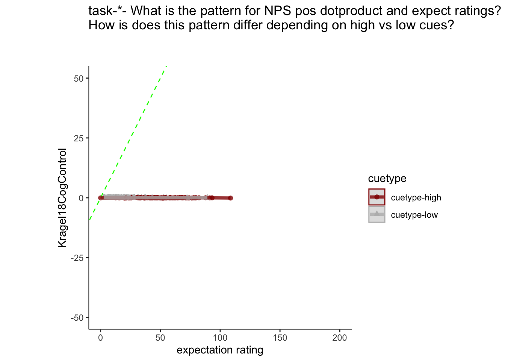
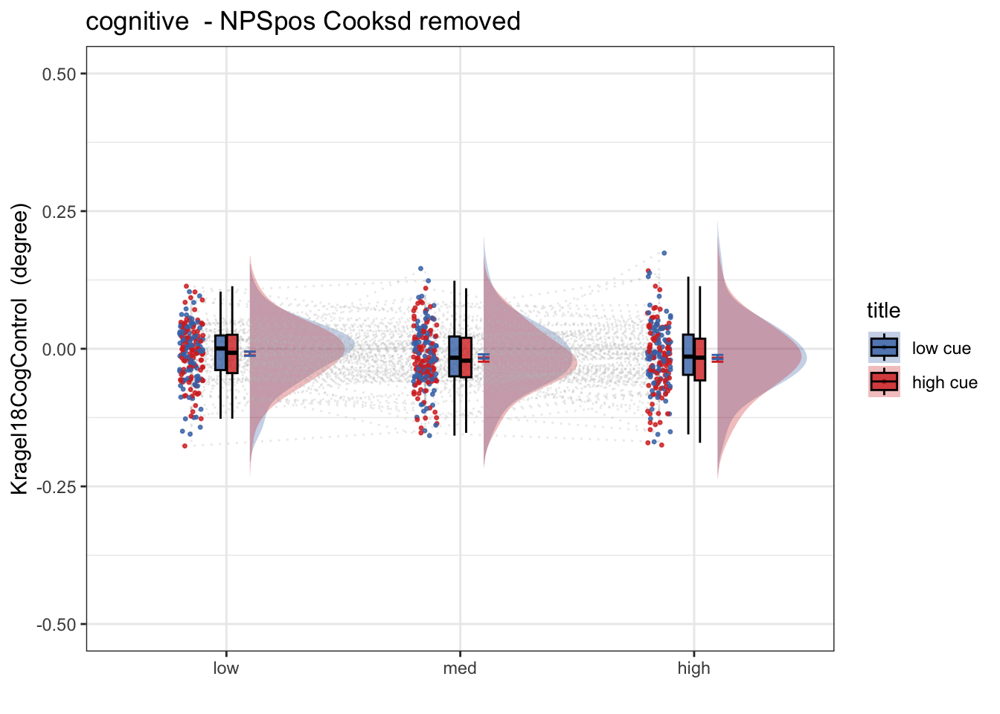
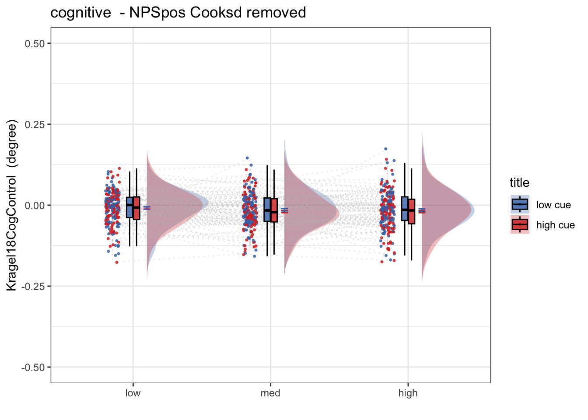
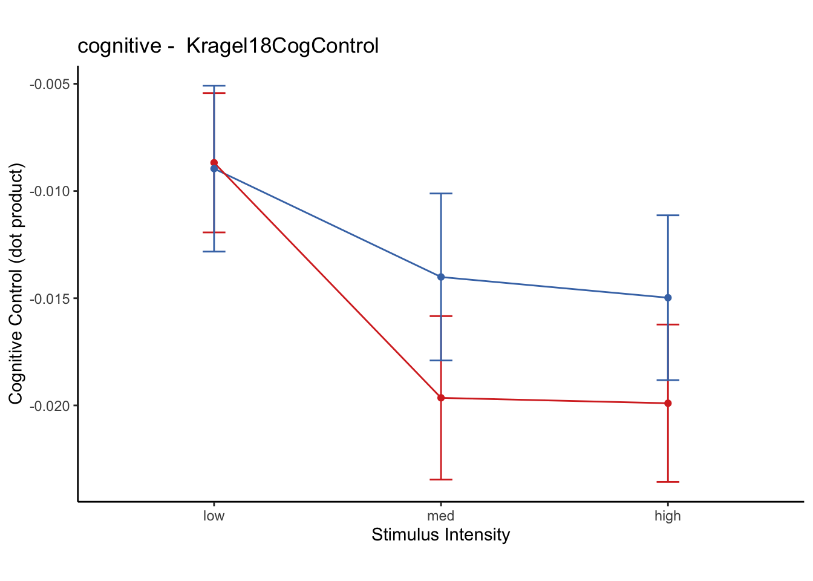

# [fMRI] Cognitive signature ~ single trial {#ch99_singletrial_C}

```
author: "Heejung Jung"
date: "2023-03-04"
```


## Function {.unlisted .unnumbered}


## Step 1: Common parameters {.unlisted .unnumbered}

```r
# signature-Kragel18CogControl_sub-all_runtype-pvc_event-stimulus
# step 1: load data
for (signature_key in c("Kragel18CogControl")) {
     #c("NPS", "NPSpos", "NPSneg", "VPS", #"VPSnooccip", "ThermalPain", "MechPain", "GeneralAversive", "AversiveVisual"
                      #  "ZhouVPS", "PINES",  "GSR", "GeuterPaincPDM")) {
  dv_keyword = signature_key
  signature_name = signature_key
  # step 1: common parameters _______
  main_dir <- dirname(dirname(getwd()))
  #signature_key = "NPSpos"
  analysis_folder  = paste0("model37_iv-task-stim_dv-KragelCogControl")

  sig_name <-
    Sys.glob(file.path(
      main_dir,
      "analysis/fmri/nilearn/signature_extract",
      paste0(
        "signature-",
        signature_key,
        "_sub-all_runtype-pvc_event-stimulus.tsv"
      )
    )) # nolint
  print(sig_name)
  analysis_dir <-
    file.path(main_dir,
              "analysis",
              "mixedeffect",
              analysis_folder,
              as.character(Sys.Date())) # nolint
  dir.create(analysis_dir,
             showWarnings = FALSE,
             recursive = TRUE)
  savedir <- analysis_dir
  
  # step 2: load data
  df = read.csv(sig_name)
  sig_df = df %>% separate(
    singletrial_fname,
    sep = "_",
    c(
      "sub",
      "ses",
      "run",
      "runtype",
      "event",
      "trial",
      "cuetype",
      "stimintensity"
    )
  )
  sig_df = sig_df %>% separate(
    stimintensity,
    into = c(NA, "stimintensity"),
    extra = "drop",
    fill = "left"
  )
  pvc <- simple_contrasts_singletrial(sig_df)
  pvc$task[pvc$runtype == "runtype-pain"] <- "pain"
  pvc$task[pvc$runtype == "runtype-vicarious"] <- "vicarious"
  pvc$task[pvc$runtype == "runtype-cognitive"] <- "cognitive"
  pvc$task <- factor(pvc$task)
  
  
  # step 3: parameters
  
  taskname = "all"
  plot_keyword = "stimulusintensity"
  ggtitle_phrase =  "(3 tasks x 3 stimulus intensity)"
  
  pvc$task = factor(pvc$task)
  plot_keys <- list(
    sub_mean = "mean_per_sub",
    group_mean = "mean_per_sub_norm_mean",
    legend_keyword = "stimulus intensity",
    se = "se",
    subject = "sub",
    ggtitle = paste0(
      str_to_title(signature_key),
      " dot product: ",
      str_to_title(taskname),
      ' ',
      ggtitle_phrase,
      " (N = ",
      length(unique(pvc$sub)),
      ")"
    ),
    title = paste0(
      str_to_title(signature_key),
      " - ",
      str_to_title(plot_keyword)
    ),
    xlab = "",
    ylab = paste(signature_key, " (dot product)"),
    ylim = c(-250, 500)
  )
  
  # step 4: within between summary
  groupwise <- data.frame()
  subjectwise <- data.frame()
  summary <- summary_for_plots_PVC(
    df = pvc,
    # taskname = taskname,
    groupwise_measurevar = plot_keys$sub_mean,
    # "mean_per_sub",
    subject_keyword = plot_keys$subject,
    # "sub",
    model_iv1 =  "task",
    model_iv2 =  "stim_ordered",
    dv = signature_key #"NPSpos"
  )
  subjectwise <<- as.data.frame(summary[[1]])
  groupwise <<- as.data.frame(summary[[2]])
  if (any(startsWith(dv_keyword, c("expect", "Expect")))) {
    plot_keys$color <- c("#1B9E77", "#D95F02", "#D95F02")
  } else {
    plot_keys$color <- c("#4575B4", "#FFA500", "#D73027")
  }
  
  # step 5: plot
  
  iv2 = "stim_ordered"
  iv1 = "task"
  taskname = "all"
  if (any(startsWith(dv_keyword, c("expect", "Expect")))) {
    color <- c("#1B9E77", "#D95F02", "#D95F02")
  } else {
    color <- c("#4575B4", "#FFA500", "#D73027")
  }
  subject_mean <- "mean_per_sub"
  sub_mean = subject_mean
  group_mean <- "mean_per_sub_norm_mean"
  se <- "se"
  ylim <- c(-25, 26)
  subject <- "sub"
  ggtitle_phrase <-  "(3 tasks x 3 stimulus intensity)"
  ggtitle <-
    paste0(
      str_to_title(signature_name),
      " dot product: ",
      str_to_title(taskname),
      ' ',
      ggtitle_phrase,
      " (N = ",
      length(unique(pvc$sub)),
      ")"
    )
  
  title <-
    paste0(str_to_title(dv_keyword),
           " - ",
           str_to_title(plot_keys$legend_keyword))
  xlab <- ""
  plot_keyword = "stimintensity"
  ylab <- paste(signature_name, " (dot product)")
  plot2_savefname <- file.path(
    analysis_dir,
    paste(
      "signature_task-",
      taskname,
      "_event-",
      plot_keyword,
      "_dv-",
      signature_key,
      "_",
      as.character(Sys.Date()),
      ".png",
      sep = ""
    )
  )
  p <- plot_halfrainclouds_twofactor(
    subjectwise,
    groupwise,
    iv1,
    iv2,
    subject_mean,
    group_mean,
    se,
    subject,
    ggtitle,
    title,
    xlab,
    ylab,
    taskname,
    ylim,
    w = 10,
    h = 6,
    dv_keyword,
    color,
    plot2_savefname
  )
  p
}
```

```
## [1] "/Users/h/Dropbox (Dartmouth College)/projects_dropbox/social_influence_analysis/analysis/fmri/nilearn/signature_extract/signature-Kragel18CogControl_sub-all_runtype-pvc_event-stimulus.tsv"
```

## load behavioral data

```r
main_dir = dirname(dirname(getwd()))
print(main_dir)
```

```
## [1] "/Users/h/Dropbox (Dartmouth College)/projects_dropbox/social_influence_analysis"
```

```r
datadir = file.path(main_dir, 'data', 'beh', 'beh02_preproc')
taskname = '*'
subject_varkey <- "src_subject_id"
iv <- "param_stimulus_type"; 
iv_keyword <- "stim"; 
dv <- "event04_actual_angle"; dv_keyword <- "outcome"
exclude <- "sub-0001|sub-0003|sub-0004|sub-0005|sub-0025|sub-0999"

p.df <- load_task_social_df(datadir, taskname = "pain", subject_varkey, iv, dv, exclude)
v.df <- load_task_social_df(datadir, taskname = "vicarious", subject_varkey, iv, dv, exclude)
c.df <- load_task_social_df(datadir, taskname = "cognitive", subject_varkey, iv, dv, exclude)

p.df2= p.df %>%
  arrange(src_subject_id ) %>%
  group_by(src_subject_id) %>%
  mutate(trial_index = row_number())
data_p <- p.df2 %>% 
  group_by(src_subject_id, session_id, param_run_num) %>% 
  mutate(trial_index = row_number(param_run_num))

v.df2= v.df %>%
  arrange(src_subject_id ) %>%
  group_by(src_subject_id) %>%
  mutate(trial_index = row_number())
data_v <- v.df2 %>% 
  group_by(src_subject_id, session_id, param_run_num) %>% 
  mutate(trial_index = row_number(param_run_num))

c.df2= c.df %>%
  arrange(src_subject_id ) %>%
  group_by(src_subject_id) %>%
  mutate(trial_index = row_number()-1)
data_c <- c.df2 %>% 
  group_by(src_subject_id, session_id, param_run_num) %>% 
  mutate(trial_index = row_number(param_run_num) )
p.sub <- data_p[,c("src_subject_id", "session_id", "param_run_num", "param_task_name", "event02_expect_angle", "param_cue_type", "param_stimulus_type", "event04_actual_angle", "trial_index")]
v.sub <- data_v[,c("src_subject_id", "session_id", "param_run_num", "param_task_name", "event02_expect_angle", "param_cue_type", "param_stimulus_type", "event04_actual_angle", "trial_index")]
c.sub <- data_c[,c("src_subject_id", "session_id", "param_run_num", "param_task_name", "event02_expect_angle", "param_cue_type", "param_stimulus_type", "event04_actual_angle", "trial_index")]
# sub, ses, run, runtype, event, trial, cuetype, stimintensity
# src_subject_id, session_id, param_run_num, param_task_name, event02_expect_angle, param_cue_type, param_stimulus_type, event04_actual_angle
pvc.sub = rbind(p.sub, v.sub, c.sub)
```


```r
pvc.sub$trial_ind <- pvc.sub$trial_index -1 
pvc.sub$sub <- sprintf("sub-%04d", pvc.sub$src_subject_id)
pvc.sub$ses <- sprintf("ses-%02d", pvc.sub$session_id)
pvc.sub$run <- sprintf("run-%02d", pvc.sub$param_run_num)
pvc.sub$runtype <- sprintf("runtype-%s", pvc.sub$param_task_name)
pvc.sub$trial <- sprintf("trial-%03d", pvc.sub$trial_ind)
pvc.sub[c('cue', 'DEPc')]  <- str_split_fixed(pvc.sub$param_cue_type , '_', 2)
pvc.sub$cuetype <- sprintf("cuetype-%s", pvc.sub$cue)
pvc.sub[c('stimintensity', 'DEP')]  <- str_split_fixed(pvc.sub$param_stimulus_type , '_', 2)

# merge
pvc.beh <- pvc.sub[,c("sub", "ses", "run", "runtype", "trial", "cuetype", "stimintensity","event02_expect_angle", "event04_actual_angle")]
df_merge <- merge(pvc, pvc.beh, 
                  by.x = c("sub", "ses", "run", "runtype", "trial", "cuetype", "stimintensity"),
                  by.y = c("sub", "ses", "run", "runtype", "trial", "cuetype", "stimintensity")
                  )
```

## dfmerge stats

```r
#summary(df_merge)
#sub, ses, run
subset = df_merge[ , c("sub", "ses", "run")]
#apply(subset, 2, table)

# subset %>% 
#    group_by(sub, ses) %>%
#     summarise(count = length(unique(run)))
#    # summarize(freq = unique(run)) %>%
t <- unique(subset, by = c("sub", "ses"))
unique(t, by = c("sub"))
```

```
##            sub    ses    run
## 1     sub-0002 ses-03 run-02
## 13    sub-0002 ses-03 run-03
## 17    sub-0002 ses-03 run-05
## 22    sub-0002 ses-03 run-06
## 23    sub-0002 ses-04 run-01
## 25    sub-0002 ses-04 run-02
## 26    sub-0002 ses-04 run-03
## 27    sub-0002 ses-04 run-04
## 29    sub-0002 ses-04 run-05
## 30    sub-0002 ses-04 run-06
## 31    sub-0006 ses-03 run-01
## 37    sub-0006 ses-03 run-02
## 49    sub-0006 ses-03 run-03
## 61    sub-0006 ses-03 run-04
## 68    sub-0006 ses-03 run-05
## 80    sub-0006 ses-03 run-06
## 92    sub-0006 ses-04 run-01
## 104   sub-0006 ses-04 run-02
## 108   sub-0006 ses-04 run-03
## 112   sub-0006 ses-04 run-04
## 124   sub-0006 ses-04 run-05
## 127   sub-0006 ses-04 run-06
## 138   sub-0007 ses-03 run-01
## 150   sub-0007 ses-03 run-02
## 162   sub-0007 ses-03 run-03
## 174   sub-0007 ses-03 run-04
## 186   sub-0007 ses-03 run-05
## 196   sub-0008 ses-03 run-01
## 208   sub-0008 ses-03 run-03
## 219   sub-0008 ses-03 run-04
## 223   sub-0008 ses-03 run-05
## 231   sub-0008 ses-03 run-06
## 238   sub-0008 ses-04 run-01
## 250   sub-0008 ses-04 run-02
## 262   sub-0008 ses-04 run-03
## 274   sub-0008 ses-04 run-04
## 278   sub-0008 ses-04 run-06
## 288   sub-0009 ses-03 run-01
## 300   sub-0009 ses-03 run-02
## 312   sub-0009 ses-03 run-03
## 324   sub-0009 ses-03 run-04
## 334   sub-0009 ses-03 run-05
## 346   sub-0009 ses-03 run-06
## 358   sub-0009 ses-04 run-01
## 370   sub-0009 ses-04 run-03
## 382   sub-0009 ses-04 run-04
## 394   sub-0009 ses-04 run-05
## 406   sub-0009 ses-04 run-06
## 418   sub-0010 ses-03 run-01
## 425   sub-0010 ses-03 run-02
## 426   sub-0010 ses-03 run-03
## 438   sub-0010 ses-03 run-04
## 440   sub-0010 ses-03 run-05
## 452   sub-0010 ses-03 run-06
## 464   sub-0010 ses-04 run-01
## 471   sub-0010 ses-04 run-02
## 483   sub-0010 ses-04 run-03
## 491   sub-0010 ses-04 run-04
## 503   sub-0010 ses-04 run-05
## 514   sub-0010 ses-04 run-06
## 516   sub-0011 ses-03 run-01
## 528   sub-0011 ses-03 run-03
## 540   sub-0011 ses-03 run-04
## 552   sub-0011 ses-03 run-05
## 564   sub-0011 ses-03 run-06
## 576   sub-0011 ses-04 run-02
## 588   sub-0011 ses-04 run-03
## 600   sub-0011 ses-04 run-04
## 612   sub-0011 ses-04 run-05
## 624   sub-0011 ses-04 run-06
## 636   sub-0013 ses-03 run-01
## 648   sub-0013 ses-03 run-02
## 650   sub-0013 ses-03 run-03
## 661   sub-0013 ses-03 run-04
## 668   sub-0013 ses-03 run-05
## 680   sub-0013 ses-03 run-06
## 692   sub-0013 ses-04 run-01
## 695   sub-0013 ses-04 run-02
## 707   sub-0013 ses-04 run-03
## 719   sub-0013 ses-04 run-04
## 731   sub-0013 ses-04 run-05
## 743   sub-0013 ses-04 run-06
## 755   sub-0014 ses-01 run-01
## 756   sub-0014 ses-01 run-05
## 768   sub-0014 ses-01 run-06
## 780   sub-0014 ses-03 run-01
## 792   sub-0014 ses-03 run-02
## 804   sub-0014 ses-03 run-03
## 808   sub-0014 ses-03 run-04
## 818   sub-0014 ses-03 run-05
## 830   sub-0014 ses-03 run-06
## 841   sub-0014 ses-04 run-01
## 850   sub-0014 ses-04 run-02
## 862   sub-0014 ses-04 run-03
## 874   sub-0014 ses-04 run-04
## 886   sub-0014 ses-04 run-05
## 888   sub-0014 ses-04 run-06
## 891   sub-0015 ses-01 run-01
## 903   sub-0015 ses-01 run-03
## 915   sub-0015 ses-01 run-04
## 927   sub-0015 ses-01 run-05
## 939   sub-0015 ses-01 run-06
## 951   sub-0016 ses-01 run-01
## 963   sub-0016 ses-01 run-02
## 975   sub-0016 ses-01 run-03
## 987   sub-0016 ses-01 run-04
## 999   sub-0016 ses-01 run-05
## 1008  sub-0016 ses-01 run-06
## 1020  sub-0016 ses-03 run-01
## 1032  sub-0016 ses-03 run-02
## 1044  sub-0016 ses-03 run-03
## 1056  sub-0016 ses-03 run-04
## 1057  sub-0016 ses-03 run-05
## 1061  sub-0016 ses-03 run-06
## 1073  sub-0016 ses-04 run-01
## 1085  sub-0016 ses-04 run-02
## 1094  sub-0016 ses-04 run-04
## 1096  sub-0016 ses-04 run-05
## 1106  sub-0017 ses-01 run-01
## 1118  sub-0017 ses-01 run-02
## 1130  sub-0017 ses-01 run-05
## 1142  sub-0017 ses-01 run-06
## 1154  sub-0017 ses-03 run-01
## 1166  sub-0017 ses-03 run-02
## 1178  sub-0017 ses-03 run-03
## 1186  sub-0017 ses-03 run-04
## 1189  sub-0017 ses-03 run-05
## 1201  sub-0017 ses-03 run-06
## 1203  sub-0017 ses-04 run-01
## 1215  sub-0017 ses-04 run-02
## 1221  sub-0017 ses-04 run-03
## 1228  sub-0017 ses-04 run-04
## 1237  sub-0017 ses-04 run-05
## 1246  sub-0017 ses-04 run-06
## 1258  sub-0018 ses-01 run-02
## 1270  sub-0018 ses-01 run-03
## 1282  sub-0018 ses-01 run-04
## 1294  sub-0018 ses-01 run-05
## 1306  sub-0018 ses-01 run-06
## 1318  sub-0018 ses-03 run-03
## 1324  sub-0018 ses-03 run-04
## 1336  sub-0018 ses-03 run-05
## 1348  sub-0018 ses-03 run-06
## 1353  sub-0018 ses-04 run-01
## 1362  sub-0018 ses-04 run-02
## 1368  sub-0018 ses-04 run-03
## 1380  sub-0018 ses-04 run-04
## 1391  sub-0018 ses-04 run-05
## 1403  sub-0018 ses-04 run-06
## 1415  sub-0019 ses-01 run-01
## 1416  sub-0019 ses-01 run-02
## 1418  sub-0019 ses-01 run-03
## 1422  sub-0019 ses-01 run-04
## 1434  sub-0019 ses-01 run-05
## 1444  sub-0019 ses-01 run-06
## 1456  sub-0019 ses-03 run-01
## 1468  sub-0019 ses-03 run-03
## 1480  sub-0019 ses-03 run-04
## 1483  sub-0019 ses-03 run-05
## 1495  sub-0019 ses-03 run-06
## 1507  sub-0019 ses-04 run-01
## 1519  sub-0019 ses-04 run-02
## 1531  sub-0019 ses-04 run-03
## 1543  sub-0019 ses-04 run-04
## 1555  sub-0019 ses-04 run-05
## 1567  sub-0019 ses-04 run-06
## 1579  sub-0021 ses-03 run-01
## 1582  sub-0021 ses-03 run-02
## 1591  sub-0021 ses-03 run-03
## 1603  sub-0021 ses-03 run-04
## 1606  sub-0021 ses-03 run-06
## 1611  sub-0021 ses-04 run-01
## 1616  sub-0021 ses-04 run-02
## 1620  sub-0021 ses-04 run-03
## 1624  sub-0021 ses-04 run-04
## 1636  sub-0021 ses-04 run-05
## 1639  sub-0021 ses-04 run-06
## 1645  sub-0023 ses-01 run-01
## 1657  sub-0023 ses-01 run-02
## 1669  sub-0023 ses-01 run-03
## 1681  sub-0023 ses-01 run-04
## 1693  sub-0023 ses-01 run-05
## 1705  sub-0023 ses-01 run-06
## 1717  sub-0023 ses-04 run-01
## 1729  sub-0023 ses-04 run-03
## 1735  sub-0023 ses-04 run-04
## 1745  sub-0023 ses-04 run-05
## 1757  sub-0023 ses-04 run-06
## 1769  sub-0024 ses-01 run-02
## 1772  sub-0024 ses-01 run-03
## 1784  sub-0024 ses-01 run-05
## 1796  sub-0024 ses-01 run-06
## 1808  sub-0024 ses-03 run-02
## 1810  sub-0024 ses-03 run-03
## 1814  sub-0024 ses-04 run-02
## 1825  sub-0024 ses-04 run-03
## 1827  sub-0024 ses-04 run-04
## 1829  sub-0024 ses-04 run-06
## 1840  sub-0026 ses-01 run-01
## 1845  sub-0026 ses-01 run-03
## 1850  sub-0026 ses-01 run-04
## 1860  sub-0026 ses-01 run-05
## 1866  sub-0026 ses-01 run-06
## 1867  sub-0026 ses-03 run-01
## 1879  sub-0026 ses-03 run-02
## 1888  sub-0026 ses-03 run-03
## 1890  sub-0026 ses-03 run-04
## 1897  sub-0026 ses-03 run-05
## 1909  sub-0026 ses-03 run-06
## 1921  sub-0026 ses-04 run-01
## 1933  sub-0026 ses-04 run-02
## 1945  sub-0026 ses-04 run-03
## 1949  sub-0026 ses-04 run-04
## 1956  sub-0026 ses-04 run-05
## 1968  sub-0026 ses-04 run-06
## 1980  sub-0028 ses-01 run-01
## 1992  sub-0028 ses-01 run-02
## 1998  sub-0028 ses-01 run-03
## 2010  sub-0028 ses-01 run-04
## 2022  sub-0028 ses-01 run-05
## 2034  sub-0028 ses-01 run-06
## 2046  sub-0029 ses-01 run-01
## 2058  sub-0029 ses-01 run-02
## 2070  sub-0029 ses-01 run-03
## 2082  sub-0029 ses-01 run-04
## 2094  sub-0029 ses-01 run-05
## 2106  sub-0029 ses-01 run-06
## 2118  sub-0029 ses-03 run-01
## 2130  sub-0029 ses-03 run-02
## 2142  sub-0029 ses-03 run-03
## 2148  sub-0029 ses-03 run-04
## 2160  sub-0029 ses-03 run-05
## 2172  sub-0029 ses-03 run-06
## 2184  sub-0029 ses-04 run-01
## 2196  sub-0029 ses-04 run-02
## 2208  sub-0029 ses-04 run-03
## 2220  sub-0029 ses-04 run-04
## 2232  sub-0029 ses-04 run-05
## 2244  sub-0029 ses-04 run-06
## 2256  sub-0030 ses-01 run-01
## 2268  sub-0030 ses-01 run-02
## 2280  sub-0030 ses-01 run-03
## 2289  sub-0030 ses-01 run-04
## 2301  sub-0030 ses-01 run-05
## 2313  sub-0030 ses-01 run-06
## 2325  sub-0031 ses-01 run-01
## 2337  sub-0031 ses-01 run-02
## 2349  sub-0031 ses-01 run-03
## 2361  sub-0031 ses-01 run-04
## 2363  sub-0031 ses-01 run-05
## 2375  sub-0031 ses-01 run-06
## 2387  sub-0031 ses-03 run-01
## 2399  sub-0031 ses-03 run-02
## 2411  sub-0031 ses-03 run-03
## 2423  sub-0031 ses-03 run-04
## 2435  sub-0031 ses-03 run-05
## 2447  sub-0031 ses-03 run-06
## 2459  sub-0031 ses-04 run-01
## 2471  sub-0031 ses-04 run-02
## 2483  sub-0031 ses-04 run-03
## 2495  sub-0031 ses-04 run-04
## 2507  sub-0031 ses-04 run-05
## 2519  sub-0031 ses-04 run-06
## 2531  sub-0032 ses-03 run-01
## 2543  sub-0032 ses-03 run-02
## 2555  sub-0032 ses-03 run-03
## 2556  sub-0032 ses-03 run-04
## 2565  sub-0032 ses-03 run-05
## 2577  sub-0032 ses-03 run-06
## 2589  sub-0032 ses-04 run-01
## 2592  sub-0032 ses-04 run-02
## 2594  sub-0032 ses-04 run-03
## 2599  sub-0032 ses-04 run-04
## 2611  sub-0032 ses-04 run-05
## 2621  sub-0032 ses-04 run-06
## 2624  sub-0033 ses-01 run-01
## 2636  sub-0033 ses-01 run-02
## 2641  sub-0033 ses-01 run-03
## 2653  sub-0033 ses-01 run-04
## 2665  sub-0033 ses-01 run-05
## 2677  sub-0033 ses-01 run-06
## 2689  sub-0033 ses-03 run-01
## 2701  sub-0033 ses-03 run-02
## 2713  sub-0033 ses-03 run-03
## 2725  sub-0033 ses-03 run-04
## 2737  sub-0033 ses-03 run-05
## 2747  sub-0033 ses-03 run-06
## 2759  sub-0033 ses-04 run-01
## 2771  sub-0033 ses-04 run-02
## 2783  sub-0033 ses-04 run-03
## 2795  sub-0033 ses-04 run-04
## 2797  sub-0033 ses-04 run-05
## 2809  sub-0033 ses-04 run-06
## 2819  sub-0035 ses-01 run-01
## 2829  sub-0035 ses-01 run-02
## 2841  sub-0035 ses-01 run-03
## 2853  sub-0035 ses-01 run-04
## 2865  sub-0035 ses-01 run-05
## 2876  sub-0035 ses-01 run-06
## 2888  sub-0035 ses-03 run-03
## 2891  sub-0035 ses-03 run-04
## 2903  sub-0035 ses-03 run-06
## 2915  sub-0035 ses-04 run-01
## 2927  sub-0035 ses-04 run-02
## 2939  sub-0035 ses-04 run-03
## 2951  sub-0035 ses-04 run-04
## 2963  sub-0035 ses-04 run-05
## 2975  sub-0035 ses-04 run-06
## 2987  sub-0036 ses-01 run-01
## 2999  sub-0036 ses-01 run-02
## 3011  sub-0036 ses-01 run-03
## 3023  sub-0036 ses-01 run-04
## 3035  sub-0036 ses-01 run-05
## 3047  sub-0036 ses-01 run-06
## 3059  sub-0036 ses-03 run-01
## 3065  sub-0036 ses-03 run-02
## 3077  sub-0036 ses-03 run-03
## 3089  sub-0036 ses-03 run-04
## 3101  sub-0036 ses-03 run-05
## 3113  sub-0036 ses-03 run-06
## 3125  sub-0036 ses-04 run-01
## 3137  sub-0036 ses-04 run-02
## 3149  sub-0036 ses-04 run-03
## 3161  sub-0036 ses-04 run-04
## 3173  sub-0036 ses-04 run-05
## 3185  sub-0036 ses-04 run-06
## 3197  sub-0037 ses-01 run-02
## 3209  sub-0037 ses-01 run-03
## 3221  sub-0037 ses-01 run-04
## 3224  sub-0037 ses-01 run-05
## 3236  sub-0037 ses-01 run-06
## 3248  sub-0037 ses-03 run-01
## 3260  sub-0037 ses-03 run-02
## 3271  sub-0037 ses-03 run-03
## 3278  sub-0037 ses-03 run-04
## 3285  sub-0037 ses-03 run-05
## 3287  sub-0037 ses-03 run-06
## 3299  sub-0037 ses-04 run-01
## 3311  sub-0037 ses-04 run-02
## 3313  sub-0037 ses-04 run-03
## 3325  sub-0037 ses-04 run-04
## 3336  sub-0037 ses-04 run-05
## 3348  sub-0037 ses-04 run-06
## 3360  sub-0038 ses-01 run-01
## 3372  sub-0038 ses-01 run-02
## 3384  sub-0038 ses-01 run-03
## 3392  sub-0038 ses-01 run-04
## 3404  sub-0038 ses-01 run-05
## 3416  sub-0038 ses-01 run-06
## 3428  sub-0038 ses-03 run-01
## 3440  sub-0038 ses-03 run-02
## 3449  sub-0038 ses-03 run-03
## 3461  sub-0038 ses-03 run-04
## 3473  sub-0038 ses-03 run-05
## 3479  sub-0038 ses-03 run-06
## 3491  sub-0038 ses-04 run-01
## 3495  sub-0038 ses-04 run-02
## 3507  sub-0038 ses-04 run-03
## 3515  sub-0038 ses-04 run-04
## 3520  sub-0038 ses-04 run-05
## 3529  sub-0038 ses-04 run-06
## 3532  sub-0039 ses-01 run-01
## 3533  sub-0039 ses-01 run-02
## 3539  sub-0039 ses-01 run-03
## 3551  sub-0039 ses-01 run-04
## 3557  sub-0039 ses-01 run-05
## 3564  sub-0039 ses-01 run-06
## 3576  sub-0039 ses-04 run-01
## 3588  sub-0039 ses-04 run-02
## 3600  sub-0039 ses-04 run-03
## 3612  sub-0039 ses-04 run-04
## 3624  sub-0039 ses-04 run-05
## 3636  sub-0039 ses-04 run-06
## 3648  sub-0040 ses-01 run-01
## 3660  sub-0040 ses-01 run-02
## 3672  sub-0040 ses-01 run-03
## 3673  sub-0040 ses-01 run-04
## 3680  sub-0040 ses-01 run-05
## 3692  sub-0040 ses-01 run-06
## 3704  sub-0040 ses-03 run-01
## 3716  sub-0040 ses-03 run-03
## 3728  sub-0040 ses-03 run-05
## 3740  sub-0040 ses-03 run-06
## 3752  sub-0040 ses-04 run-01
## 3764  sub-0040 ses-04 run-02
## 3776  sub-0040 ses-04 run-03
## 3788  sub-0040 ses-04 run-04
## 3800  sub-0040 ses-04 run-05
## 3812  sub-0040 ses-04 run-06
## 3824  sub-0041 ses-01 run-01
## 3836  sub-0041 ses-01 run-02
## 3846  sub-0041 ses-01 run-03
## 3848  sub-0041 ses-01 run-04
## 3856  sub-0041 ses-01 run-05
## 3868  sub-0041 ses-01 run-06
## 3880  sub-0041 ses-03 run-01
## 3890  sub-0041 ses-03 run-03
## 3902  sub-0041 ses-03 run-04
## 3910  sub-0041 ses-03 run-06
## 3922  sub-0043 ses-01 run-01
## 3926  sub-0043 ses-01 run-02
## 3935  sub-0043 ses-01 run-03
## 3940  sub-0043 ses-01 run-04
## 3952  sub-0043 ses-01 run-05
## 3964  sub-0043 ses-01 run-06
## 3976  sub-0043 ses-03 run-01
## 3988  sub-0043 ses-03 run-02
## 4000  sub-0043 ses-03 run-03
## 4012  sub-0043 ses-03 run-04
## 4024  sub-0043 ses-03 run-05
## 4036  sub-0043 ses-03 run-06
## 4048  sub-0043 ses-04 run-01
## 4060  sub-0043 ses-04 run-02
## 4066  sub-0043 ses-04 run-03
## 4078  sub-0043 ses-04 run-04
## 4090  sub-0043 ses-04 run-05
## 4102  sub-0043 ses-04 run-06
## 4114  sub-0044 ses-01 run-01
## 4126  sub-0044 ses-01 run-02
## 4130  sub-0044 ses-01 run-03
## 4131  sub-0044 ses-01 run-04
## 4134  sub-0044 ses-01 run-05
## 4142  sub-0044 ses-01 run-06
## 4143  sub-0044 ses-03 run-01
## 4146  sub-0044 ses-03 run-02
## 4158  sub-0044 ses-03 run-03
## 4170  sub-0044 ses-03 run-04
## 4182  sub-0044 ses-03 run-05
## 4189  sub-0044 ses-03 run-06
## 4199  sub-0044 ses-04 run-01
## 4211  sub-0044 ses-04 run-02
## 4215  sub-0044 ses-04 run-03
## 4226  sub-0044 ses-04 run-04
## 4230  sub-0044 ses-04 run-05
## 4242  sub-0044 ses-04 run-06
## 4243  sub-0047 ses-01 run-01
## 4255  sub-0047 ses-01 run-02
## 4259  sub-0047 ses-01 run-03
## 4271  sub-0047 ses-01 run-04
## 4283  sub-0047 ses-01 run-05
## 4295  sub-0047 ses-01 run-06
## 4307  sub-0050 ses-01 run-02
## 4319  sub-0050 ses-01 run-03
## 4331  sub-0050 ses-01 run-04
## 4343  sub-0050 ses-01 run-05
## 4355  sub-0050 ses-01 run-06
## 4367  sub-0050 ses-03 run-01
## 4379  sub-0050 ses-03 run-02
## 4391  sub-0050 ses-03 run-03
## 4403  sub-0050 ses-03 run-04
## 4415  sub-0050 ses-03 run-05
## 4427  sub-0050 ses-03 run-06
## 4439  sub-0050 ses-04 run-01
## 4451  sub-0050 ses-04 run-02
## 4463  sub-0050 ses-04 run-03
## 4475  sub-0050 ses-04 run-04
## 4487  sub-0050 ses-04 run-05
## 4499  sub-0050 ses-04 run-06
## 4511  sub-0051 ses-01 run-02
## 4523  sub-0051 ses-01 run-03
## 4535  sub-0051 ses-01 run-04
## 4547  sub-0051 ses-01 run-05
## 4559  sub-0051 ses-01 run-06
## 4571  sub-0051 ses-03 run-01
## 4583  sub-0051 ses-03 run-02
## 4593  sub-0051 ses-03 run-03
## 4605  sub-0051 ses-03 run-04
## 4617  sub-0051 ses-03 run-05
## 4628  sub-0051 ses-03 run-06
## 4640  sub-0051 ses-04 run-01
## 4652  sub-0051 ses-04 run-02
## 4664  sub-0051 ses-04 run-03
## 4666  sub-0051 ses-04 run-04
## 4678  sub-0051 ses-04 run-05
## 4690  sub-0051 ses-04 run-06
## 4702  sub-0052 ses-01 run-01
## 4704  sub-0052 ses-01 run-02
## 4707  sub-0052 ses-01 run-03
## 4714  sub-0052 ses-01 run-04
## 4716  sub-0052 ses-01 run-05
## 4721  sub-0052 ses-01 run-06
## 4730  sub-0052 ses-03 run-01
## 4742  sub-0052 ses-03 run-02
## 4754  sub-0052 ses-03 run-03
## 4766  sub-0052 ses-03 run-04
## 4778  sub-0052 ses-03 run-05
## 4790  sub-0052 ses-03 run-06
## 4802  sub-0052 ses-04 run-01
## 4814  sub-0052 ses-04 run-02
## 4826  sub-0052 ses-04 run-03
## 4838  sub-0052 ses-04 run-04
## 4844  sub-0052 ses-04 run-05
## 4852  sub-0052 ses-04 run-06
## 4855  sub-0053 ses-01 run-01
## 4861  sub-0053 ses-01 run-02
## 4868  sub-0053 ses-01 run-04
## 4880  sub-0053 ses-01 run-05
## 4889  sub-0053 ses-01 run-06
## 4901  sub-0053 ses-03 run-01
## 4907  sub-0053 ses-03 run-02
## 4919  sub-0053 ses-03 run-03
## 4921  sub-0053 ses-03 run-04
## 4928  sub-0053 ses-03 run-05
## 4940  sub-0053 ses-03 run-06
## 4952  sub-0053 ses-04 run-01
## 4964  sub-0053 ses-04 run-02
## 4976  sub-0053 ses-04 run-03
## 4988  sub-0053 ses-04 run-04
## 5000  sub-0053 ses-04 run-05
## 5012  sub-0053 ses-04 run-06
## 5024  sub-0055 ses-01 run-01
## 5036  sub-0055 ses-01 run-03
## 5042  sub-0055 ses-01 run-04
## 5054  sub-0055 ses-01 run-05
## 5066  sub-0055 ses-01 run-06
## 5078  sub-0055 ses-03 run-01
## 5085  sub-0055 ses-03 run-02
## 5097  sub-0055 ses-03 run-03
## 5109  sub-0055 ses-03 run-04
## 5119  sub-0055 ses-03 run-05
## 5131  sub-0055 ses-03 run-06
## 5143  sub-0055 ses-04 run-01
## 5155  sub-0055 ses-04 run-02
## 5157  sub-0055 ses-04 run-03
## 5163  sub-0055 ses-04 run-04
## 5170  sub-0055 ses-04 run-05
## 5179  sub-0055 ses-04 run-06
## 5187  sub-0056 ses-03 run-01
## 5199  sub-0056 ses-03 run-02
## 5211  sub-0056 ses-03 run-03
## 5223  sub-0056 ses-03 run-04
## 5235  sub-0056 ses-03 run-05
## 5247  sub-0056 ses-03 run-06
## 5259  sub-0056 ses-04 run-01
## 5262  sub-0056 ses-04 run-02
## 5274  sub-0056 ses-04 run-03
## 5286  sub-0056 ses-04 run-04
## 5298  sub-0056 ses-04 run-05
## 5310  sub-0056 ses-04 run-06
## 5322  sub-0057 ses-01 run-01
## 5334  sub-0057 ses-01 run-02
## 5335  sub-0057 ses-01 run-03
## 5347  sub-0057 ses-01 run-04
## 5359  sub-0057 ses-01 run-05
## 5371  sub-0057 ses-01 run-06
## 5383  sub-0057 ses-03 run-02
## 5395  sub-0057 ses-03 run-03
## 5407  sub-0057 ses-03 run-04
## 5419  sub-0057 ses-03 run-05
## 5430  sub-0057 ses-03 run-06
## 5442  sub-0057 ses-04 run-01
## 5454  sub-0057 ses-04 run-02
## 5462  sub-0057 ses-04 run-03
## 5466  sub-0057 ses-04 run-04
## 5469  sub-0057 ses-04 run-05
## 5473  sub-0057 ses-04 run-06
## 5485  sub-0058 ses-01 run-01
## 5486  sub-0058 ses-01 run-02
## 5498  sub-0058 ses-01 run-03
## 5510  sub-0058 ses-01 run-04
## 5522  sub-0058 ses-01 run-05
## 5534  sub-0058 ses-01 run-06
## 5546  sub-0058 ses-03 run-01
## 5558  sub-0058 ses-03 run-02
## 5560  sub-0058 ses-03 run-03
## 5572  sub-0058 ses-03 run-04
## 5584  sub-0058 ses-03 run-05
## 5596  sub-0058 ses-03 run-06
## 5608  sub-0058 ses-04 run-01
## 5620  sub-0058 ses-04 run-02
## 5632  sub-0058 ses-04 run-03
## 5644  sub-0058 ses-04 run-04
## 5656  sub-0058 ses-04 run-05
## 5668  sub-0058 ses-04 run-06
## 5680  sub-0059 ses-01 run-01
## 5692  sub-0059 ses-01 run-02
## 5696  sub-0059 ses-01 run-03
## 5705  sub-0059 ses-01 run-04
## 5717  sub-0059 ses-01 run-05
## 5723  sub-0059 ses-01 run-06
## 5735  sub-0059 ses-03 run-01
## 5747  sub-0059 ses-03 run-02
## 5759  sub-0059 ses-03 run-03
## 5771  sub-0059 ses-03 run-04
## 5782  sub-0059 ses-03 run-05
## 5794  sub-0059 ses-03 run-06
## 5796  sub-0059 ses-04 run-01
## 5808  sub-0059 ses-04 run-03
## 5820  sub-0059 ses-04 run-04
## 5832  sub-0059 ses-04 run-06
## 5844  sub-0060 ses-01 run-01
## 5856  sub-0060 ses-01 run-02
## 5859  sub-0060 ses-01 run-03
## 5871  sub-0060 ses-01 run-04
## 5879  sub-0060 ses-01 run-05
## 5890  sub-0060 ses-01 run-06
## 5902  sub-0060 ses-03 run-01
## 5914  sub-0060 ses-03 run-02
## 5926  sub-0060 ses-03 run-03
## 5938  sub-0060 ses-03 run-04
## 5950  sub-0060 ses-03 run-05
## 5952  sub-0060 ses-03 run-06
## 5964  sub-0060 ses-04 run-01
## 5968  sub-0060 ses-04 run-02
## 5980  sub-0060 ses-04 run-03
## 5989  sub-0060 ses-04 run-04
## 5991  sub-0060 ses-04 run-05
## 5993  sub-0060 ses-04 run-06
## 6005  sub-0061 ses-01 run-01
## 6009  sub-0061 ses-01 run-02
## 6019  sub-0061 ses-01 run-03
## 6020  sub-0061 ses-01 run-04
## 6022  sub-0061 ses-01 run-05
## 6034  sub-0061 ses-01 run-06
## 6046  sub-0061 ses-03 run-01
## 6056  sub-0061 ses-03 run-02
## 6066  sub-0061 ses-03 run-03
## 6069  sub-0061 ses-03 run-05
## 6080  sub-0061 ses-04 run-01
## 6086  sub-0061 ses-04 run-02
## 6087  sub-0061 ses-04 run-03
## 6099  sub-0061 ses-04 run-04
## 6105  sub-0061 ses-04 run-05
## 6109  sub-0061 ses-04 run-06
## 6121  sub-0062 ses-01 run-01
## 6132  sub-0062 ses-01 run-02
## 6134  sub-0062 ses-01 run-03
## 6146  sub-0062 ses-01 run-04
## 6154  sub-0062 ses-01 run-05
## 6155  sub-0062 ses-01 run-06
## 6167  sub-0062 ses-03 run-02
## 6179  sub-0062 ses-03 run-03
## 6191  sub-0062 ses-03 run-04
## 6203  sub-0062 ses-03 run-05
## 6214  sub-0062 ses-03 run-06
## 6226  sub-0062 ses-04 run-01
## 6227  sub-0062 ses-04 run-02
## 6236  sub-0062 ses-04 run-03
## 6240  sub-0062 ses-04 run-04
## 6248  sub-0062 ses-04 run-05
## 6260  sub-0062 ses-04 run-06
## 6262  sub-0063 ses-01 run-01
## 6274  sub-0064 ses-01 run-01
## 6286  sub-0064 ses-01 run-02
## 6293  sub-0064 ses-01 run-03
## 6305  sub-0064 ses-01 run-04
## 6317  sub-0064 ses-01 run-05
## 6329  sub-0064 ses-01 run-06
## 6341  sub-0064 ses-04 run-02
## 6353  sub-0064 ses-04 run-03
## 6365  sub-0064 ses-04 run-04
## 6377  sub-0064 ses-04 run-06
## 6389  sub-0066 ses-01 run-03
## 6394  sub-0066 ses-01 run-05
## 6405  sub-0066 ses-03 run-01
## 6417  sub-0066 ses-03 run-03
## 6420  sub-0066 ses-03 run-04
## 6423  sub-0066 ses-03 run-06
## 6426  sub-0066 ses-04 run-01
## 6428  sub-0066 ses-04 run-02
## 6440  sub-0066 ses-04 run-04
## 6444  sub-0066 ses-04 run-05
## 6453  sub-0068 ses-01 run-01
## 6465  sub-0068 ses-01 run-02
## 6477  sub-0068 ses-01 run-03
## 6489  sub-0068 ses-01 run-04
## 6501  sub-0068 ses-01 run-05
## 6513  sub-0068 ses-01 run-06
## 6525  sub-0069 ses-01 run-01
## 6537  sub-0069 ses-01 run-02
## 6549  sub-0069 ses-01 run-03
## 6550  sub-0069 ses-01 run-04
## 6562  sub-0069 ses-01 run-05
## 6574  sub-0069 ses-01 run-06
## 6586  sub-0069 ses-03 run-02
## 6598  sub-0069 ses-03 run-03
## 6610  sub-0069 ses-03 run-04
## 6615  sub-0069 ses-03 run-05
## 6627  sub-0069 ses-04 run-02
## 6639  sub-0069 ses-04 run-03
## 6651  sub-0069 ses-04 run-04
## 6663  sub-0069 ses-04 run-06
## 6675  sub-0070 ses-01 run-01
## 6687  sub-0070 ses-01 run-02
## 6699  sub-0070 ses-01 run-04
## 6711  sub-0070 ses-01 run-05
## 6723  sub-0070 ses-03 run-01
## 6735  sub-0070 ses-03 run-02
## 6747  sub-0070 ses-03 run-05
## 6755  sub-0070 ses-03 run-06
## 6761  sub-0070 ses-04 run-01
## 6773  sub-0070 ses-04 run-02
## 6785  sub-0070 ses-04 run-03
## 6797  sub-0070 ses-04 run-04
## 6801  sub-0070 ses-04 run-05
## 6805  sub-0070 ses-04 run-06
## 6816  sub-0071 ses-01 run-03
## 6828  sub-0071 ses-01 run-04
## 6840  sub-0071 ses-01 run-06
## 6846  sub-0073 ses-01 run-01
## 6848  sub-0073 ses-01 run-02
## 6856  sub-0073 ses-01 run-03
## 6862  sub-0073 ses-01 run-04
## 6864  sub-0073 ses-01 run-05
## 6873  sub-0073 ses-01 run-06
## 6875  sub-0073 ses-03 run-01
## 6887  sub-0073 ses-03 run-02
## 6890  sub-0073 ses-03 run-03
## 6900  sub-0073 ses-03 run-04
## 6912  sub-0073 ses-03 run-05
## 6922  sub-0073 ses-03 run-06
## 6934  sub-0073 ses-04 run-01
## 6942  sub-0073 ses-04 run-02
## 6944  sub-0073 ses-04 run-03
## 6949  sub-0073 ses-04 run-04
## 6952  sub-0073 ses-04 run-05
## 6964  sub-0073 ses-04 run-06
## 6976  sub-0074 ses-01 run-01
## 6988  sub-0074 ses-01 run-02
## 6998  sub-0074 ses-01 run-03
## 7010  sub-0074 ses-01 run-04
## 7016  sub-0074 ses-01 run-05
## 7025  sub-0074 ses-01 run-06
## 7027  sub-0074 ses-03 run-01
## 7034  sub-0074 ses-03 run-02
## 7038  sub-0074 ses-03 run-03
## 7050  sub-0074 ses-03 run-04
## 7052  sub-0074 ses-03 run-06
## 7060  sub-0074 ses-04 run-01
## 7068  sub-0074 ses-04 run-02
## 7072  sub-0074 ses-04 run-03
## 7084  sub-0074 ses-04 run-04
## 7091  sub-0075 ses-01 run-03
## 7093  sub-0075 ses-03 run-01
## 7094  sub-0075 ses-03 run-03
## 7106  sub-0075 ses-03 run-04
## 7108  sub-0075 ses-03 run-06
## 7115  sub-0076 ses-01 run-01
## 7127  sub-0076 ses-01 run-03
## 7130  sub-0076 ses-01 run-05
## 7134  sub-0076 ses-01 run-06
## 7141  sub-0076 ses-03 run-01
## 7153  sub-0076 ses-03 run-02
## 7165  sub-0076 ses-03 run-04
## 7177  sub-0076 ses-03 run-05
## 7189  sub-0076 ses-04 run-01
## 7201  sub-0076 ses-04 run-02
## 7213  sub-0076 ses-04 run-03
## 7225  sub-0076 ses-04 run-04
## 7237  sub-0076 ses-04 run-05
## 7249  sub-0076 ses-04 run-06
## 7261  sub-0077 ses-01 run-01
## 7263  sub-0077 ses-01 run-05
## 7266  sub-0077 ses-03 run-01
## 7268  sub-0077 ses-03 run-02
## 7280  sub-0077 ses-03 run-03
## 7286  sub-0077 ses-03 run-04
## 7288  sub-0077 ses-03 run-05
## 7300  sub-0077 ses-03 run-06
## 7302  sub-0077 ses-04 run-01
## 7314  sub-0077 ses-04 run-02
## 7322  sub-0077 ses-04 run-03
## 7325  sub-0077 ses-04 run-04
## 7334  sub-0077 ses-04 run-05
## 7345  sub-0077 ses-04 run-06
## 7348  sub-0078 ses-01 run-01
## 7360  sub-0078 ses-01 run-02
## 7372  sub-0078 ses-01 run-03
## 7384  sub-0078 ses-01 run-04
## 7396  sub-0078 ses-01 run-05
## 7408  sub-0078 ses-01 run-06
## 7420  sub-0078 ses-03 run-01
## 7432  sub-0078 ses-03 run-02
## 7443  sub-0078 ses-03 run-03
## 7455  sub-0078 ses-03 run-04
## 7467  sub-0078 ses-03 run-05
## 7479  sub-0078 ses-03 run-06
## 7490  sub-0078 ses-04 run-01
## 7502  sub-0078 ses-04 run-02
## 7514  sub-0078 ses-04 run-03
## 7519  sub-0078 ses-04 run-04
## 7531  sub-0078 ses-04 run-05
## 7543  sub-0078 ses-04 run-06
## 7555  sub-0079 ses-01 run-02
## 7558  sub-0079 ses-01 run-05
## 7562  sub-0079 ses-01 run-06
## 7565  sub-0079 ses-03 run-01
## 7577  sub-0079 ses-03 run-02
## 7589  sub-0079 ses-03 run-03
## 7592  sub-0079 ses-03 run-04
## 7598  sub-0079 ses-03 run-05
## 7605  sub-0079 ses-04 run-01
## 7608  sub-0079 ses-04 run-02
## 7614  sub-0079 ses-04 run-03
## 7615  sub-0079 ses-04 run-04
## 7616  sub-0079 ses-04 run-05
## 7617  sub-0079 ses-04 run-06
## 7626  sub-0080 ses-01 run-01
## 7630  sub-0080 ses-01 run-02
## 7632  sub-0080 ses-01 run-04
## 7644  sub-0080 ses-01 run-05
## 7646  sub-0080 ses-03 run-03
## 7654  sub-0080 ses-03 run-06
## 7659  sub-0080 ses-04 run-01
## 7668  sub-0080 ses-04 run-02
## 7670  sub-0080 ses-04 run-03
## 7674  sub-0080 ses-04 run-04
## 7680  sub-0080 ses-04 run-05
## 7681  sub-0080 ses-04 run-06
## 7692  sub-0081 ses-01 run-02
## 7704  sub-0081 ses-01 run-03
## 7709  sub-0081 ses-01 run-04
## 7711  sub-0081 ses-01 run-05
## 7723  sub-0081 ses-03 run-01
## 7735  sub-0081 ses-03 run-02
## 7747  sub-0081 ses-03 run-03
## 7759  sub-0081 ses-03 run-04
## 7771  sub-0081 ses-03 run-05
## 7783  sub-0081 ses-03 run-06
## 7784  sub-0081 ses-04 run-01
## 7796  sub-0081 ses-04 run-02
## 7803  sub-0081 ses-04 run-03
## 7815  sub-0081 ses-04 run-04
## 7827  sub-0081 ses-04 run-05
## 7834  sub-0081 ses-04 run-06
## 7835  sub-0082 ses-03 run-01
## 7843  sub-0082 ses-03 run-02
## 7846  sub-0082 ses-03 run-04
## 7851  sub-0082 ses-03 run-05
## 7858  sub-0082 ses-03 run-06
## 7867  sub-0083 ses-01 run-01
## 7875  sub-0083 ses-01 run-04
## 7877  sub-0083 ses-03 run-01
## 7888  sub-0083 ses-03 run-04
## 7900  sub-0083 ses-03 run-05
## 7906  sub-0083 ses-03 run-06
## 7913  sub-0083 ses-04 run-01
## 7923  sub-0083 ses-04 run-03
## 7935  sub-0083 ses-04 run-04
## 7938  sub-0083 ses-04 run-05
## 7950  sub-0083 ses-04 run-06
## 7961  sub-0084 ses-03 run-01
## 7971  sub-0084 ses-03 run-02
## 7983  sub-0084 ses-03 run-04
## 7986  sub-0084 ses-03 run-05
## 7995  sub-0084 ses-04 run-01
## 8007  sub-0084 ses-04 run-02
## 8019  sub-0084 ses-04 run-03
## 8031  sub-0084 ses-04 run-04
## 8043  sub-0084 ses-04 run-05
## 8049  sub-0084 ses-04 run-06
## 8052  sub-0085 ses-01 run-01
## 8056  sub-0085 ses-01 run-04
## 8057  sub-0085 ses-01 run-05
## 8065  sub-0085 ses-01 run-06
## 8070  sub-0086 ses-01 run-03
## 8082  sub-0086 ses-01 run-04
## 8083  sub-0086 ses-01 run-05
## 8089  sub-0086 ses-01 run-06
## 8101  sub-0086 ses-03 run-01
## 8104  sub-0086 ses-03 run-02
## 8116  sub-0086 ses-03 run-03
## 8120  sub-0086 ses-03 run-04
## 8123  sub-0086 ses-03 run-05
## 8126  sub-0086 ses-03 run-06
## 8137  sub-0086 ses-04 run-01
## 8139  sub-0086 ses-04 run-02
## 8149  sub-0086 ses-04 run-05
## 8151  sub-0086 ses-04 run-06
## 8155  sub-0087 ses-01 run-01
## 8158  sub-0087 ses-01 run-03
## 8160  sub-0087 ses-01 run-04
## 8168  sub-0087 ses-01 run-05
## 8173  sub-0087 ses-01 run-06
## 8185  sub-0087 ses-03 run-01
## 8186  sub-0087 ses-03 run-02
## 8190  sub-0087 ses-03 run-03
## 8191  sub-0087 ses-03 run-04
## 8198  sub-0087 ses-03 run-05
## 8202  sub-0087 ses-03 run-06
## 8214  sub-0087 ses-04 run-01
## 8226  sub-0087 ses-04 run-02
## 8238  sub-0087 ses-04 run-03
## 8241  sub-0087 ses-04 run-04
## 8253  sub-0087 ses-04 run-05
## 8261  sub-0087 ses-04 run-06
## 8264  sub-0088 ses-01 run-01
## 8276  sub-0088 ses-01 run-02
## 8278  sub-0088 ses-01 run-03
## 8290  sub-0088 ses-01 run-04
## 8302  sub-0088 ses-01 run-05
## 8314  sub-0088 ses-01 run-06
## 8326  sub-0088 ses-03 run-01
## 8338  sub-0088 ses-03 run-02
## 8350  sub-0088 ses-03 run-04
## 8362  sub-0088 ses-03 run-05
## 8374  sub-0088 ses-03 run-06
## 8386  sub-0088 ses-04 run-01
## 8398  sub-0088 ses-04 run-02
## 8410  sub-0088 ses-04 run-03
## 8422  sub-0088 ses-04 run-04
## 8434  sub-0088 ses-04 run-05
## 8446  sub-0088 ses-04 run-06
## 8458  sub-0089 ses-01 run-01
## 8470  sub-0089 ses-01 run-02
## 8482  sub-0089 ses-01 run-03
## 8494  sub-0089 ses-01 run-05
## 8506  sub-0089 ses-01 run-06
## 8518  sub-0089 ses-03 run-01
## 8530  sub-0089 ses-03 run-02
## 8540  sub-0089 ses-03 run-03
## 8552  sub-0089 ses-03 run-04
## 8564  sub-0089 ses-03 run-05
## 8571  sub-0089 ses-03 run-06
## 8583  sub-0089 ses-04 run-01
## 8585  sub-0089 ses-04 run-02
## 8597  sub-0089 ses-04 run-03
## 8609  sub-0089 ses-04 run-04
## 8621  sub-0089 ses-04 run-05
## 8633  sub-0089 ses-04 run-06
## 8645  sub-0090 ses-01 run-01
## 8646  sub-0090 ses-01 run-02
## 8658  sub-0090 ses-01 run-03
## 8670  sub-0090 ses-01 run-04
## 8682  sub-0090 ses-01 run-05
## 8694  sub-0090 ses-01 run-06
## 8706  sub-0090 ses-03 run-01
## 8718  sub-0090 ses-03 run-02
## 8730  sub-0090 ses-03 run-03
## 8742  sub-0090 ses-03 run-04
## 8754  sub-0090 ses-03 run-05
## 8766  sub-0090 ses-03 run-06
## 8778  sub-0090 ses-04 run-01
## 8790  sub-0090 ses-04 run-02
## 8802  sub-0090 ses-04 run-03
## 8814  sub-0090 ses-04 run-04
## 8826  sub-0090 ses-04 run-05
## 8838  sub-0090 ses-04 run-06
## 8850  sub-0091 ses-01 run-01
## 8857  sub-0091 ses-01 run-02
## 8869  sub-0091 ses-01 run-04
## 8873  sub-0091 ses-01 run-05
## 8885  sub-0091 ses-01 run-06
## 8897  sub-0091 ses-03 run-01
## 8903  sub-0091 ses-03 run-02
## 8908  sub-0091 ses-03 run-03
## 8913  sub-0091 ses-03 run-04
## 8925  sub-0091 ses-03 run-05
## 8927  sub-0091 ses-04 run-01
## 8938  sub-0091 ses-04 run-02
## 8950  sub-0091 ses-04 run-03
## 8962  sub-0091 ses-04 run-04
## 8969  sub-0091 ses-04 run-05
## 8970  sub-0091 ses-04 run-06
## 8982  sub-0092 ses-01 run-01
## 8986  sub-0092 ses-01 run-02
## 8998  sub-0092 ses-01 run-03
## 9004  sub-0092 ses-01 run-04
## 9009  sub-0092 ses-01 run-05
## 9012  sub-0092 ses-01 run-06
## 9017  sub-0092 ses-03 run-01
## 9024  sub-0092 ses-03 run-02
## 9029  sub-0092 ses-03 run-03
## 9035  sub-0092 ses-03 run-04
## 9038  sub-0092 ses-03 run-05
## 9041  sub-0092 ses-03 run-06
## 9044  sub-0092 ses-04 run-01
## 9050  sub-0092 ses-04 run-02
## 9052  sub-0092 ses-04 run-03
## 9063  sub-0092 ses-04 run-04
## 9065  sub-0092 ses-04 run-05
## 9067  sub-0092 ses-04 run-06
## 9072  sub-0093 ses-01 run-02
## 9074  sub-0093 ses-01 run-03
## 9086  sub-0093 ses-01 run-04
## 9089  sub-0093 ses-01 run-05
## 9101  sub-0093 ses-01 run-06
## 9113  sub-0093 ses-03 run-01
## 9115  sub-0093 ses-03 run-02
## 9117  sub-0093 ses-03 run-03
## 9129  sub-0093 ses-03 run-04
## 9132  sub-0093 ses-03 run-05
## 9137  sub-0093 ses-03 run-06
## 9149  sub-0093 ses-04 run-01
## 9160  sub-0093 ses-04 run-02
## 9172  sub-0093 ses-04 run-03
## 9180  sub-0093 ses-04 run-04
## 9191  sub-0093 ses-04 run-05
## 9203  sub-0093 ses-04 run-06
## 9205  sub-0094 ses-01 run-01
## 9211  sub-0094 ses-01 run-02
## 9213  sub-0094 ses-01 run-03
## 9225  sub-0094 ses-01 run-04
## 9237  sub-0094 ses-01 run-05
## 9249  sub-0094 ses-01 run-06
## 9261  sub-0094 ses-03 run-01
## 9263  sub-0094 ses-03 run-03
## 9272  sub-0094 ses-03 run-04
## 9282  sub-0094 ses-03 run-05
## 9294  sub-0094 ses-03 run-06
## 9297  sub-0094 ses-04 run-01
## 9308  sub-0094 ses-04 run-02
## 9312  sub-0094 ses-04 run-03
## 9319  sub-0094 ses-04 run-04
## 9331  sub-0094 ses-04 run-05
## 9338  sub-0094 ses-04 run-06
## 9350  sub-0095 ses-01 run-01
## 9362  sub-0095 ses-01 run-02
## 9374  sub-0095 ses-01 run-03
## 9386  sub-0095 ses-01 run-04
## 9396  sub-0095 ses-01 run-05
## 9408  sub-0095 ses-01 run-06
## 9420  sub-0095 ses-03 run-01
## 9429  sub-0095 ses-03 run-02
## 9441  sub-0095 ses-03 run-03
## 9443  sub-0095 ses-03 run-04
## 9455  sub-0095 ses-03 run-05
## 9467  sub-0095 ses-03 run-06
## 9479  sub-0095 ses-04 run-01
## 9491  sub-0095 ses-04 run-02
## 9503  sub-0095 ses-04 run-03
## 9515  sub-0095 ses-04 run-04
## 9527  sub-0095 ses-04 run-05
## 9539  sub-0095 ses-04 run-06
## 9551  sub-0097 ses-01 run-02
## 9553  sub-0097 ses-01 run-03
## 9565  sub-0097 ses-01 run-04
## 9577  sub-0097 ses-01 run-05
## 9589  sub-0097 ses-01 run-06
## 9601  sub-0098 ses-01 run-03
## 9610  sub-0098 ses-01 run-04
## 9617  sub-0098 ses-01 run-05
## 9622  sub-0098 ses-01 run-06
## 9625  sub-0098 ses-04 run-01
## 9626  sub-0098 ses-04 run-03
## 9628  sub-0098 ses-04 run-06
## 9631  sub-0099 ses-01 run-02
## 9643  sub-0099 ses-01 run-03
## 9653  sub-0099 ses-01 run-04
## 9659  sub-0099 ses-01 run-05
## 9671  sub-0099 ses-01 run-06
## 9683  sub-0099 ses-03 run-01
## 9695  sub-0099 ses-03 run-02
## 9707  sub-0099 ses-03 run-03
## 9719  sub-0099 ses-03 run-04
## 9731  sub-0099 ses-03 run-05
## 9743  sub-0099 ses-03 run-06
## 9755  sub-0099 ses-04 run-01
## 9762  sub-0099 ses-04 run-02
## 9774  sub-0099 ses-04 run-03
## 9786  sub-0099 ses-04 run-04
## 9798  sub-0099 ses-04 run-05
## 9810  sub-0099 ses-04 run-06
## 9822  sub-0100 ses-01 run-01
## 9831  sub-0100 ses-01 run-02
## 9834  sub-0100 ses-01 run-03
## 9846  sub-0100 ses-01 run-04
## 9851  sub-0100 ses-01 run-05
## 9857  sub-0100 ses-01 run-06
## 9869  sub-0100 ses-03 run-01
## 9881  sub-0100 ses-03 run-02
## 9884  sub-0100 ses-03 run-03
## 9888  sub-0100 ses-03 run-04
## 9897  sub-0100 ses-03 run-05
## 9898  sub-0100 ses-03 run-06
## 9909  sub-0100 ses-04 run-01
## 9913  sub-0100 ses-04 run-02
## 9923  sub-0100 ses-04 run-03
## 9931  sub-0100 ses-04 run-04
## 9939  sub-0100 ses-04 run-06
## 9951  sub-0101 ses-01 run-01
## 9963  sub-0101 ses-01 run-02
## 9975  sub-0101 ses-01 run-03
## 9987  sub-0101 ses-01 run-04
## 9999  sub-0101 ses-01 run-05
## 10011 sub-0101 ses-01 run-06
## 10023 sub-0101 ses-03 run-01
## 10024 sub-0101 ses-03 run-02
## 10036 sub-0101 ses-03 run-03
## 10048 sub-0101 ses-03 run-04
## 10060 sub-0101 ses-03 run-05
## 10072 sub-0101 ses-03 run-06
## 10084 sub-0101 ses-04 run-01
## 10088 sub-0101 ses-04 run-02
## 10099 sub-0101 ses-04 run-03
## 10111 sub-0101 ses-04 run-04
## 10112 sub-0101 ses-04 run-05
## 10119 sub-0101 ses-04 run-06
## 10128 sub-0103 ses-01 run-01
## 10140 sub-0103 ses-01 run-02
## 10152 sub-0103 ses-04 run-01
## 10153 sub-0103 ses-04 run-03
## 10154 sub-0103 ses-04 run-05
## 10166 sub-0103 ses-04 run-06
## 10171 sub-0104 ses-03 run-01
## 10183 sub-0104 ses-03 run-02
## 10185 sub-0104 ses-03 run-03
## 10197 sub-0104 ses-03 run-04
## 10209 sub-0104 ses-03 run-05
## 10221 sub-0104 ses-03 run-06
## 10233 sub-0104 ses-04 run-02
## 10245 sub-0104 ses-04 run-03
## 10253 sub-0104 ses-04 run-04
## 10257 sub-0104 ses-04 run-05
## 10268 sub-0104 ses-04 run-06
## 10276 sub-0106 ses-01 run-01
## 10288 sub-0106 ses-01 run-02
## 10300 sub-0106 ses-01 run-03
## 10312 sub-0106 ses-01 run-04
## 10324 sub-0106 ses-01 run-05
## 10336 sub-0106 ses-01 run-06
## 10348 sub-0106 ses-03 run-01
## 10360 sub-0106 ses-03 run-02
## 10372 sub-0106 ses-03 run-03
## 10384 sub-0106 ses-03 run-04
## 10396 sub-0106 ses-03 run-05
## 10408 sub-0106 ses-03 run-06
## 10415 sub-0106 ses-04 run-01
## 10427 sub-0106 ses-04 run-02
## 10439 sub-0106 ses-04 run-03
## 10451 sub-0106 ses-04 run-04
## 10463 sub-0106 ses-04 run-05
## 10475 sub-0106 ses-04 run-06
## 10487 sub-0107 ses-01 run-01
## 10491 sub-0107 ses-01 run-02
## 10492 sub-0107 ses-01 run-03
## 10498 sub-0107 ses-01 run-04
## 10510 sub-0107 ses-01 run-05
## 10522 sub-0107 ses-01 run-06
## 10534 sub-0107 ses-03 run-01
## 10546 sub-0107 ses-03 run-02
## 10558 sub-0107 ses-03 run-03
## 10570 sub-0107 ses-03 run-04
## 10582 sub-0107 ses-03 run-05
## 10592 sub-0107 ses-03 run-06
## 10604 sub-0107 ses-04 run-03
## 10605 sub-0109 ses-01 run-02
## 10611 sub-0109 ses-01 run-03
## 10623 sub-0109 ses-01 run-04
## 10635 sub-0109 ses-01 run-05
## 10647 sub-0109 ses-01 run-06
## 10649 sub-0109 ses-03 run-01
## 10658 sub-0109 ses-03 run-02
## 10670 sub-0109 ses-03 run-03
## 10682 sub-0109 ses-03 run-04
## 10694 sub-0109 ses-03 run-05
## 10706 sub-0109 ses-03 run-06
## 10710 sub-0109 ses-04 run-01
## 10722 sub-0109 ses-04 run-02
## 10734 sub-0109 ses-04 run-03
## 10746 sub-0109 ses-04 run-04
## 10753 sub-0109 ses-04 run-05
## 10765 sub-0109 ses-04 run-06
## 10777 sub-0111 ses-01 run-01
## 10779 sub-0111 ses-01 run-02
## 10791 sub-0111 ses-01 run-03
## 10803 sub-0111 ses-01 run-04
## 10815 sub-0111 ses-01 run-05
## 10827 sub-0111 ses-01 run-06
## 10835 sub-0111 ses-03 run-01
## 10847 sub-0111 ses-03 run-02
## 10859 sub-0111 ses-03 run-03
## 10869 sub-0111 ses-03 run-04
## 10871 sub-0111 ses-03 run-05
## 10882 sub-0111 ses-03 run-06
## 10885 sub-0111 ses-04 run-01
## 10897 sub-0111 ses-04 run-02
## 10909 sub-0111 ses-04 run-03
## 10911 sub-0111 ses-04 run-04
## 10921 sub-0111 ses-04 run-06
## 10933 sub-0112 ses-01 run-02
## 10945 sub-0112 ses-01 run-03
## 10947 sub-0112 ses-01 run-04
## 10956 sub-0112 ses-01 run-06
## 10968 sub-0112 ses-03 run-02
## 10969 sub-0112 ses-03 run-03
## 10975 sub-0112 ses-03 run-05
## 10977 sub-0112 ses-04 run-01
## 10979 sub-0112 ses-04 run-02
## 10980 sub-0112 ses-04 run-04
## 10981 sub-0112 ses-04 run-05
## 10993 sub-0112 ses-04 run-06
## 10996 sub-0114 ses-01 run-01
## 10997 sub-0114 ses-01 run-02
## 10998 sub-0114 ses-01 run-03
## 11008 sub-0114 ses-01 run-04
## 11020 sub-0114 ses-01 run-06
## 11030 sub-0115 ses-01 run-01
## 11033 sub-0115 ses-01 run-03
## 11037 sub-0115 ses-01 run-04
## 11043 sub-0115 ses-01 run-05
## 11046 sub-0115 ses-01 run-06
## 11049 sub-0115 ses-03 run-01
## 11061 sub-0115 ses-03 run-02
## 11068 sub-0115 ses-03 run-03
## 11080 sub-0115 ses-03 run-04
## 11086 sub-0115 ses-03 run-05
## 11098 sub-0115 ses-03 run-06
## 11100 sub-0115 ses-04 run-01
## 11112 sub-0115 ses-04 run-02
## 11120 sub-0115 ses-04 run-04
## 11126 sub-0115 ses-04 run-05
## 11131 sub-0115 ses-04 run-06
## 11143 sub-0116 ses-01 run-01
## 11155 sub-0116 ses-01 run-02
## 11167 sub-0116 ses-01 run-03
## 11173 sub-0116 ses-01 run-04
## 11185 sub-0116 ses-01 run-05
## 11197 sub-0116 ses-01 run-06
## 11201 sub-0116 ses-03 run-01
## 11211 sub-0116 ses-03 run-02
## 11217 sub-0116 ses-03 run-03
## 11226 sub-0116 ses-03 run-04
## 11232 sub-0116 ses-03 run-05
## 11236 sub-0116 ses-03 run-06
## 11248 sub-0116 ses-04 run-01
## 11260 sub-0116 ses-04 run-02
## 11267 sub-0116 ses-04 run-03
## 11279 sub-0116 ses-04 run-04
## 11290 sub-0116 ses-04 run-05
## 11302 sub-0116 ses-04 run-06
## 11314 sub-0117 ses-01 run-02
## 11316 sub-0117 ses-01 run-03
## 11319 sub-0117 ses-01 run-05
## 11325 sub-0118 ses-01 run-02
## 11337 sub-0118 ses-01 run-03
## 11343 sub-0118 ses-01 run-04
## 11355 sub-0118 ses-01 run-05
## 11366 sub-0118 ses-01 run-06
## 11378 sub-0119 ses-01 run-03
## 11390 sub-0119 ses-01 run-04
## 11402 sub-0119 ses-01 run-05
## 11407 sub-0119 ses-01 run-06
## 11419 sub-0120 ses-01 run-01
## 11420 sub-0120 ses-01 run-02
## 11427 sub-0120 ses-01 run-03
## 11437 sub-0120 ses-01 run-04
## 11445 sub-0120 ses-01 run-05
## 11449 sub-0120 ses-01 run-06
## 11461 sub-0122 ses-01 run-01
## 11472 sub-0122 ses-01 run-02
## 11482 sub-0122 ses-01 run-03
## 11486 sub-0122 ses-01 run-04
## 11489 sub-0122 ses-01 run-05
## 11496 sub-0122 ses-01 run-06
## 11497 sub-0122 ses-03 run-01
## 11509 sub-0122 ses-03 run-02
## 11515 sub-0122 ses-03 run-03
## 11520 sub-0122 ses-03 run-04
## 11532 sub-0122 ses-03 run-05
## 11534 sub-0122 ses-03 run-06
## 11546 sub-0122 ses-04 run-01
## 11558 sub-0122 ses-04 run-02
## 11562 sub-0122 ses-04 run-03
## 11574 sub-0122 ses-04 run-04
## 11582 sub-0122 ses-04 run-05
## 11584 sub-0122 ses-04 run-06
## 11588 sub-0123 ses-01 run-01
## 11593 sub-0123 ses-01 run-02
## 11597 sub-0123 ses-01 run-03
## 11599 sub-0123 ses-01 run-04
## 11611 sub-0123 ses-01 run-05
## 11623 sub-0123 ses-01 run-06
## 11627 sub-0124 ses-01 run-01
## 11631 sub-0124 ses-01 run-02
## 11643 sub-0124 ses-01 run-03
## 11644 sub-0124 ses-01 run-04
## 11656 sub-0124 ses-01 run-05
## 11668 sub-0124 ses-01 run-06
## 11680 sub-0124 ses-03 run-01
## 11689 sub-0124 ses-03 run-02
## 11696 sub-0124 ses-03 run-03
## 11708 sub-0124 ses-03 run-04
## 11720 sub-0124 ses-03 run-05
## 11732 sub-0124 ses-03 run-06
## 11742 sub-0124 ses-04 run-01
## 11754 sub-0124 ses-04 run-02
## 11766 sub-0124 ses-04 run-03
## 11778 sub-0124 ses-04 run-04
## 11790 sub-0124 ses-04 run-05
## 11802 sub-0124 ses-04 run-06
## 11814 sub-0126 ses-01 run-01
## 11818 sub-0126 ses-01 run-02
## 11830 sub-0126 ses-01 run-03
## 11840 sub-0126 ses-01 run-04
## 11850 sub-0126 ses-01 run-05
## 11856 sub-0126 ses-01 run-06
## 11868 sub-0126 ses-03 run-01
## 11872 sub-0126 ses-03 run-02
## 11884 sub-0126 ses-03 run-03
## 11892 sub-0126 ses-03 run-04
## 11896 sub-0126 ses-03 run-05
## 11899 sub-0126 ses-03 run-06
## 11910 sub-0127 ses-01 run-01
## 11914 sub-0127 ses-01 run-02
## 11922 sub-0127 ses-01 run-03
## 11923 sub-0127 ses-01 run-04
## 11926 sub-0127 ses-01 run-05
## 11938 sub-0127 ses-01 run-06
## 11950 sub-0127 ses-03 run-01
## 11952 sub-0127 ses-03 run-02
## 11953 sub-0127 ses-03 run-03
## 11965 sub-0127 ses-03 run-04
## 11972 sub-0127 ses-03 run-05
## 11973 sub-0127 ses-03 run-06
## 11985 sub-0127 ses-04 run-01
## 11995 sub-0127 ses-04 run-02
## 12007 sub-0127 ses-04 run-03
## 12019 sub-0127 ses-04 run-04
## 12031 sub-0127 ses-04 run-05
## 12043 sub-0127 ses-04 run-06
## 12055 sub-0128 ses-01 run-01
## 12067 sub-0128 ses-01 run-02
## 12069 sub-0128 ses-01 run-03
## 12081 sub-0128 ses-01 run-04
## 12093 sub-0128 ses-01 run-05
## 12105 sub-0128 ses-01 run-06
## 12117 sub-0128 ses-03 run-01
## 12129 sub-0128 ses-03 run-02
## 12141 sub-0128 ses-03 run-03
## 12153 sub-0128 ses-03 run-04
## 12165 sub-0128 ses-03 run-05
## 12177 sub-0128 ses-03 run-06
## 12189 sub-0129 ses-01 run-01
## 12193 sub-0129 ses-01 run-02
## 12194 sub-0129 ses-01 run-03
## 12200 sub-0129 ses-01 run-04
## 12204 sub-0129 ses-01 run-05
## 12207 sub-0129 ses-01 run-06
## 12209 sub-0129 ses-03 run-02
## 12215 sub-0129 ses-03 run-03
## 12216 sub-0129 ses-03 run-04
## 12218 sub-0129 ses-03 run-05
## 12219 sub-0129 ses-03 run-06
## 12220 sub-0129 ses-04 run-01
## 12224 sub-0129 ses-04 run-02
## 12225 sub-0129 ses-04 run-03
## 12227 sub-0129 ses-04 run-05
## 12231 sub-0129 ses-04 run-06
## 12234 sub-0130 ses-01 run-02
## 12246 sub-0130 ses-01 run-03
## 12256 sub-0130 ses-01 run-04
## 12268 sub-0130 ses-01 run-05
## 12276 sub-0130 ses-01 run-06
## 12288 sub-0130 ses-03 run-01
## 12289 sub-0130 ses-03 run-02
## 12301 sub-0130 ses-03 run-03
## 12313 sub-0130 ses-03 run-04
## 12325 sub-0130 ses-03 run-05
## 12333 sub-0130 ses-03 run-06
## 12345 sub-0130 ses-04 run-01
## 12357 sub-0130 ses-04 run-02
## 12369 sub-0130 ses-04 run-03
## 12381 sub-0130 ses-04 run-04
## 12393 sub-0130 ses-04 run-05
## 12399 sub-0130 ses-04 run-06
## 12411 sub-0131 ses-01 run-02
## 12423 sub-0131 ses-01 run-03
## 12435 sub-0131 ses-01 run-04
## 12447 sub-0131 ses-01 run-06
## 12454 sub-0131 ses-03 run-01
## 12466 sub-0131 ses-03 run-02
## 12478 sub-0131 ses-03 run-03
## 12490 sub-0131 ses-03 run-04
## 12502 sub-0131 ses-03 run-05
## 12514 sub-0131 ses-03 run-06
## 12526 sub-0131 ses-04 run-02
## 12538 sub-0131 ses-04 run-03
## 12545 sub-0131 ses-04 run-04
## 12554 sub-0131 ses-04 run-05
## 12557 sub-0131 ses-04 run-06
## 12569 sub-0132 ses-01 run-01
## 12581 sub-0132 ses-01 run-02
## 12593 sub-0132 ses-01 run-03
## 12605 sub-0132 ses-01 run-04
## 12609 sub-0132 ses-01 run-05
## 12621 sub-0132 ses-01 run-06
## 12633 sub-0132 ses-03 run-01
## 12645 sub-0132 ses-03 run-02
## 12657 sub-0132 ses-03 run-03
## 12669 sub-0132 ses-03 run-04
## 12681 sub-0132 ses-03 run-05
## 12693 sub-0132 ses-03 run-06
## 12705 sub-0132 ses-04 run-01
## 12717 sub-0132 ses-04 run-02
## 12729 sub-0132 ses-04 run-03
## 12741 sub-0132 ses-04 run-04
## 12753 sub-0132 ses-04 run-05
## 12765 sub-0132 ses-04 run-06
## 12777 sub-0133 ses-01 run-01
## 12789 sub-0133 ses-01 run-02
## 12791 sub-0133 ses-01 run-03
## 12797 sub-0133 ses-01 run-04
## 12799 sub-0133 ses-01 run-05
## 12811 sub-0133 ses-01 run-06
## 12813 sub-0133 ses-03 run-01
## 12825 sub-0133 ses-03 run-02
## 12837 sub-0133 ses-03 run-03
## 12849 sub-0133 ses-03 run-04
## 12861 sub-0133 ses-03 run-05
## 12873 sub-0133 ses-03 run-06
## 12885 sub-0133 ses-04 run-01
## 12897 sub-0133 ses-04 run-02
## 12909 sub-0133 ses-04 run-03
## 12919 sub-0133 ses-04 run-04
## 12930 sub-0133 ses-04 run-05
## 12940 sub-0133 ses-04 run-06
```

```r
# subset %>%
#   group_by(sub, ses, run) %>%
#   summarise(n_distinct(run))
```

## expect & NPS as a function of cue


```r
c.sig <- df_merge[df_merge$runtype == "runtype-cognitive",]
iv1 = "event02_expect_angle"; iv2 = signature_key
df_dropna <-
  c.sig[!is.na(c.sig$event02_expect_angle) & !is.na(c.sig[, signature_key]),]
total <-
  plot_twovariable(
    df_dropna, iv1, iv2,
    group = "cuetype", subject = "sub",
    xmin=0, xmax=200, ymin=-50, ymax=50,
    xlab = "expectation rating",
    ylab = signature_key, 
    ggtitle = "all stimulus intensity", 
    color_scheme = c("cuetype-high" ="#941100","cuetype-low" =  "#BBBBBB"), 
    alpha = .8, fit_lm = TRUE
  )
total + labs(title =paste0("task-",taskname, "- What is the pattern for NPS pos dotproduct and expect ratings? \nHow is does this pattern differ depending on high vs low cues?\n\n")
          )
```

```
## `geom_smooth()` using method = 'loess' and formula = 'y ~ x'
## `geom_smooth()` using method = 'loess' and formula = 'y ~ x'
```



```r
  # geom_line(method="lm", alpha=0.3, size=1, span=0.5) # geom_smooth(method=lm, se = TRUE) 
# +geom_smooth(method = "lm", alpha=0.1, size=0, span=0.5)
```


## 2x3 stim*cue 

```r
combined_se_calc_cooksd <- data.frame()
taskname = "cognitive"
    ggtitle <- paste(taskname, " - actual judgment (degree)")
    title <- paste(taskname, " - actual")
    subject <- "sub"
    w <- 10
    h <- 6
data <- c.sig
    # [ CONTRASTS ]  ________________________________________________________________________________ # nolint
    # contrast code ________________________________________
    data$stim[data$stimintensity == "low"] <- -0.5 # social influence task
    data$stim[data$stimintensity == "med"] <- 0 # no influence task
    data$stim[data$stimintensity == "high"] <- 0.5 # no influence task

    data$stim_factor <- factor(data$stimintensity)

    # contrast code 1 linear
    data$stim_con_linear[data$stimintensity == "low"] <- -0.5
    data$stim_con_linear[data$stimintensity == "med"] <- 0
    data$stim_con_linear[data$stimintensity == "high"] <- 0.5

    # contrast code 2 quadratic
    data$stim_con_quad[data$stimintensity == "low"] <- -0.33
    data$stim_con_quad[data$stimintensity == "med"] <- 0.66
    data$stim_con_quad[data$stimintensity == "high"] <- -0.33

    # social cude contrast
    data$social_cue[data$cuetype == "cuetype-low"] <- -0.5 # social influence task
    data$social_cue[data$cuetype == "cuetype-high"] <- 0.5 # no influence task

    stim_con1 <- "stim_con_linear"
    stim_con2 <- "stim_con_quad"
    iv1 <- "social_cue"
    dv <- signature_key

    # [ MODEL ] _________________________________________________ # nolint
    model_savefname <- file.path(
        analysis_dir,
        paste("lmer_task-", taskname,
            "_rating-", dv_keyword,
            "_", as.character(Sys.Date()), "_cooksd.txt",
            sep = ""
        )
    )
    
    cooksd <- lmer_twofactor_cooksd_fix(
        data, taskname, iv1, stim_con1, stim_con2, dv,
        subject, dv_keyword, model_savefname, 'random_intercept', print_lmer_output = FALSE
    )
    influential <- as.numeric(names(cooksd)[
        (cooksd > (4 / as.numeric(length(unique(data$sub)))))
    ])
    data_screen <- data[-influential, ]
    # [ PLOT ] reordering for plots _________________________ # nolint
    data_screen$cue_name[data_screen$cuetype == "cuetype-high"] <- "high cue"
    data_screen$cue_name[data_screen$cuetype == "cuetype-low"] <- "low cue"

    data_screen$stim_name[data_screen$stimintensity == "high"] <- "high"
    data_screen$stim_name[data_screen$stimintensity == "med"] <- "med"
    data_screen$stim_name[data_screen$stimintensity == "low"] <- "low"

    # DATA$levels_ordered <- factor(DATA$param_stimulus_type, levels=c("low", "med", "high"))

    data_screen$stim_ordered <- factor(
        data_screen$stim_name,
        levels = c("low", "med", "high")
    )
    data_screen$cue_ordered <- factor(
        data_screen$cue_name,
        levels = c("low cue", "high cue")
    )
    model_iv1 <- "stim_ordered"
    model_iv2 <- "cue_ordered"

    #  [ PLOT ] calculate mean and se  _________________________
    actual_subjectwise <- meanSummary(
        data_screen,
        c(subject, model_iv1, model_iv2), dv
    )
    actual_groupwise <- summarySEwithin(
        data = actual_subjectwise,
        measurevar = "mean_per_sub",
        withinvars = c(model_iv1, model_iv2), idvar = subject
    )
    actual_groupwise$task <- taskname
    # https://stackoverflow.com/questions/29402528/append-data-frames-together-in-a-for-loop/29419402
    
    combined_se_calc_cooksd <- rbind(combined_se_calc_cooksd, actual_groupwise)
    # if(any(startsWith(dv_keyword, c("expect", "Expect")))){color = c( "#1B9E77", "#D95F02")}else{color=c( "#4575B4", "#D73027")} # if keyword starts with
    # print("groupwisemean")
    #  [ PLOT ] calculate mean and se  ----------------------------------------------------------------------------
    sub_mean <- "mean_per_sub"
    group_mean <- "mean_per_sub_norm_mean"
    se <- "se"
    subject <- "sub"
    ggtitle <- paste(taskname, " - NPSpos Cooksd removed")
    title <- paste(taskname, " - NPSpos")
    xlab <- ""
    ylab <- paste(signature_key, " (degree)")
    ylim <- c(-.5,.5)
    dv_keyword <- "NPSpos"
    if (any(startsWith(dv_keyword, c("expect", "Expect")))) {
        color <- c("#1B9E77", "#D95F02")
    } else {
        color <- c("#4575B4", "#D73027")
    } # if keyword starts with
    plot_savefname <- file.path(
        analysis_dir,
        paste("raincloud_task-", taskname,
            "_rating-", dv_keyword,
            "_", as.character(Sys.Date()), "_cooksd.png",
            sep = ""
        )
    )
    g <- plot_rainclouds_twofactor(
        actual_subjectwise, actual_groupwise, model_iv1, model_iv2,
        sub_mean, group_mean, se, subject,
        ggtitle, title, xlab, ylab, taskname,ylim,
        w, h, dv_keyword, color, plot_savefname
    )
```

```
## Warning in geom_line(data = subjectwise, aes(group = .data[[subject]], y
## = .data[[sub_mean]], : Ignoring unknown aesthetics: fill
```

```
## Warning: Duplicated aesthetics after name standardisation: width
```

```
## Warning: Using the `size` aesthietic with geom_polygon was deprecated in ggplot2 3.4.0.
## ℹ Please use the `linewidth` aesthetic instead.
```

```r
g
```




```r
g
```




## lineplot

```r
plot_lineplot_twofactor(actual_groupwise, taskname = "cognitive", 
                        iv1 = "stim_ordered", iv2 = "cue_ordered", 
                        mean = "mean_per_sub_norm_mean", error = "se",
                        color = c("#4575B4", "#D73027"), ggtitle = paste(taskname, '- ', signature_key), xlab = "Stimulus Intensity", ylab = "Cognitive Control (dot product)")
```



<!-- ## Step 2: load data {.unlisted .unnumbered} -->
<!-- ```{r} -->
<!-- df = read.csv(sig_name) -->
<!-- sig_df = df %>%separate(singletrial_fname,sep = "_", c("sub", "ses", "run", "runtype", "event", "trial", "cuetype", "stimintensity")) -->
<!-- sig_df = sig_df %>% separate(stimintensity, into = c(NA, "stimintensity"), extra = "drop", fill = "left") -->
<!-- pvc <- simple_contrasts_singletrial(sig_df) -->
<!-- pvc$task[pvc$runtype == "runtype-pain"] <- "pain" -->
<!-- pvc$task[pvc$runtype == "runtype-vicarious"] <- "vicarious" -->
<!-- pvc$task[pvc$runtype == "runtype-cognitive"] <- "cognitive" -->
<!-- pvc$task <- factor(pvc$task) -->
<!-- ``` -->

<!-- ## Step 3: plot key paramters {.unlisted .unnumbered} -->
<!-- ```{r} -->
<!-- signature_key = "NPSpos" -->
<!-- taskname = "all"; plot_keyword = "stimulusintensity"; ggtitle_phrase =  "(3 tasks x 3 stimulus intensity)"; -->
<!-- pvc$task = factor(pvc$task) -->
<!-- plot_keys <- list( -->
<!--     iv1 = "task", -->
<!--     iv2 = "stim_ordered", -->
<!--     plot_keyword = "stimulusintensity", -->
<!--     dv = signature_key, -->
<!--     dv_keyword = signature_key, -->
<!--     taskname = taskname, -->
<!--     sub_mean = "mean_per_sub", -->
<!--     group_mean = "mean_per_sub_norm_mean", -->
<!--     legend_keyword = "stimulus intensity", -->
<!--     se = "se", -->
<!--     subject = "sub", -->
<!--     ggtitle = paste0( -->
<!--       str_to_title(signature_key),  -->
<!--       " dot product: ", str_to_title(taskname),' ', ggtitle_phrase," (N = ", length(unique(pvc$sub)), ")"), -->
<!--     title = paste0(str_to_title(signature_key), " - ", str_to_title(plot_keyword)), -->
<!--     xlab = "", -->
<!--     ylab = paste(signature_key," (dot product)"), -->
<!--     ylim = c(-250, 500), -->
<!--     w = 10, -->
<!--     h = 6, -->
<!--     plot_savefname = file.path( -->
<!--         analysis_dir, -->
<!--         paste("signature_task-", taskname, "_event-", plot_keyword, -->
<!--             "_dv-", signature_key, -->
<!--             "_", as.character(Sys.Date()), ".png", -->
<!--             sep = "" -->
<!--         ) -->
<!--     ) -->
<!--     #model_iv1 = "stim_ordered", -->
<!--     #model_iv2 = "cue_ordered" -->
<!-- ) -->
<!-- ``` -->

<!-- ```{r eval=FALSE, include=FALSE} -->
<!-- groupwise <- data.frame() -->
<!-- subjectwise <- data.frame() -->
<!-- summary <- summary_for_plots_PVC( -->
<!--         df = pvc, -->
<!--         # taskname = taskname, -->
<!--         groupwise_measurevar = "mean_per_sub", -->
<!--         subject_keyword =  "sub", -->
<!--         model_iv1 =  "task", -->
<!--         model_iv2 =  "stim_ordered", -->
<!--         dv = "NPSpos" -->
<!--     ) -->
<!-- subjectwise <<- as.data.frame(summary[[1]]) -->
<!-- groupwise <<- as.data.frame(summary[[2]]) -->
<!--     if (any(startsWith("NPSpos", c("expect", "Expect")))) { -->
<!--         plot_keys$color <- c("#1B9E77", "#D95F02", "#D95F02") -->
<!--     } else { -->
<!--         plot_keys$color <- c("#4575B4", "#FFA500", "#D73027") -->
<!--     } -->
<!-- ``` -->

<!-- ```{r} -->
<!-- p <- plot_halfrainclouds_twofactor_35( -->
<!--         subjectwise, groupwise, iv1 = "task", iv2 = "stim_ordered", -->
<!--         sub_mean = "mean_per_sub", group_mean = plot_keys$group_mean, se = plot_keys$se, subject = plot_keys$sub, -->
<!--         ggtitle = plot_keys$ggtitle, title = plot_keys$title, xlab = plot_keys$xlab, ylab = plot_keys$ylab, task_name = plot_keys$taskname, ylim = plot_keys$ylim, -->
<!--         w = plot_keys$w, h = plot_keys$h, dv_keyword = plot_keys$dv_keyword, color = plot_keys$color, save_fname = plot_keys$plot_savefname -->
<!--     ) -->
<!-- p -->
<!-- ``` -->

<!-- ## Plot test function -->
<!-- plot_signature_twofactor <- function(signature_key, analysis_dir, plot_keys, df)  -->
<!-- ```{r} -->
<!-- p <- plot_signature_twofactor(signature_key = "NPSpos",  -->
<!--                               plot_keys, df = data.frame(pvc)) -->
<!-- p -->
<!-- ``` -->


<!-- ```{r} -->
<!-- hist(pvc$NPS) -->
<!-- ``` -->
<!-- ```{r} -->
<!-- model.nps = lmer(NPSpos ~ task + stimintensity + (1 | sub) , data = pvc) -->
<!-- summary(model.nps) -->
<!-- ``` -->

<!-- ```{r pvc_summary, include=FALSE} -->
<!-- subject_varkey <- "sub" -->
<!-- iv1 <- "task" -->
<!-- iv2 <-  "stim_ordered" -->
<!-- dv <- "NPSpos" -->
<!-- taskname = "all" -->
<!-- dv_keyword <- "NPSpos" -->
<!-- subject <- "subject" -->
<!-- xlab <- "" -->
<!-- ylab <- "NPS positive (dot product)" -->
<!-- ylim <- c(-20,20) -->
<!-- title <- "stim" -->
<!-- #taskname <- "all tasks" -->
<!-- exclude <- "sub-0001|sub-0003|sub-0004|sub-0005|sub-0025|sub-0999" -->
<!-- ``` -->

<!-- ```{r plotting_parameters_34, include=FALSE} -->

<!-- plot_keys <- list(sub_mean = "mean_per_sub",group_mean = "mean_per_sub_norm_mean", se = "se", -->
<!--     subject = "sub", taskname = taskname, -->
<!--     ggtitle = paste(taskname, " - NPS (dot prodcut) Cooksd removed"), -->
<!--     title = paste(taskname, " - Actual"), -->
<!--     xlab = "", -->
<!--     ylab = "ratings (degree)", -->
<!--     ylim = c(-250,500), -->
<!--     dv_keyword = "NPS", -->
<!--     w = 10, -->
<!--     h = 6, -->
<!--     plot_savefname = file.path( -->
<!--         analysis_dir, -->
<!--         paste("raincloud_task-", taskname, -->
<!--             "_rating-", dv_keyword, -->
<!--             "_", as.character(Sys.Date()), "_cooksd.png", -->
<!--             sep = "" -->
<!--         ) -->
<!--     ), -->
<!--     model_iv1 ="stim_ordered", -->
<!--     model_iv2 = "cue_ordered",  -->
<!--     legend_keyword = "stimulus intensity") -->
<!-- ``` -->


<!-- ```{r summary_pvc, message=FALSE, warning=FALSE, include=FALSE, paged.print=FALSE} -->
<!-- groupwise = data.frame() -->
<!-- subjectwise = data.frame() -->
<!-- summary <- summary_for_plots_PVC(df = pvc,  -->
<!--                              # taskname = taskname,  -->
<!--                              groupwise_measurevar = "mean_per_sub", -->
<!--                              subject_keyword = "sub", -->
<!--                              model_iv1 = "task", -->
<!--                              model_iv2 = "stim_ordered", -->
<!--                              dv = "NPSpos") -->
<!-- subjectwise <- as.data.frame(summary[[1]]) -->
<!-- groupwise <-as.data.frame(summary[[2]]) -->
<!--     if (any(startsWith(plot_keys$dv_keyword, c("expect", "Expect")))) { -->
<!--         color <- c("#1B9E77", "#D95F02") -->
<!--     } else { -->
<!--         color <- c("#4575B4", "#D73027") -->
<!--     }  -->
<!-- ``` -->

<!-- ## Raincloud plots -->
<!-- ```{r plot_PVC, echo=FALSE, message=FALSE, warning=TRUE, paged.print=FALSE} -->
<!-- dv_keyword = "NPSpos" -->
<!-- signature_name = "NPSpos" -->
<!-- iv2 = "stim_ordered" -->
<!-- iv1 = "task" -->
<!--     if (any(startsWith(dv_keyword, c("expect", "Expect")))) { -->
<!--         color <- c("#1B9E77", "#D95F02", "#D95F02") -->
<!--     } else { -->
<!--         color <- c("#4575B4", "#FFA500", "#D73027") -->
<!--     } -->
<!--     subject_mean <- "mean_per_sub" -->
<!--     group_mean <- "mean_per_sub_norm_mean" -->
<!--     se <- "se" -->
<!--     ylim <- c(-25,26) -->
<!--     subject <- "sub" -->
<!--     ggtitle_phrase <-  "(3 tasks x 3 stimulus intensity)" -->
<!--     # ggtitle <- paste(taskname, " (3 tasks x 3 stimulus intensity) - ", signature_name, "dot product") -->
<!--     ggtitle <- paste0(str_to_title(signature_name), " dot product: ", str_to_title(taskname),' ', ggtitle_phrase,  " (N = ", length(unique(pvc$sub)), ")");  -->
<!--     # title <- paste(taskname, " (3 tasks x 3 stimulus intensity) - ", signature_name, "dot product") -->
<!--     title <- paste0(str_to_title(dv_keyword), " - ", str_to_title(plot_keys$legend_keyword)) -->
<!--     xlab <- "" -->
<!--     ylab <- paste(signature_name," (dot product)") -->
<!--     plot2_savefname <- file.path( -->
<!--         analysis_dir, -->
<!--         paste("raincloudplots_task-", taskname,"_event-",iv2, -->
<!--             "_rating-", dv_keyword, -->
<!--             "_", as.character(Sys.Date()), ".png", -->
<!--             sep = "" -->
<!--         ) -->
<!--     ) -->
<!-- p <- plot_halfrainclouds_twofactor( -->
<!--       subjectwise, groupwise, iv1, iv2,  -->
<!--       subject_mean, group_mean, se, subject,  -->
<!--       ggtitle, title, xlab, ylab, taskname, ylim, -->
<!--       w = plot_keys$w, h = plot_keys$h, dv_keyword, color, plot2_savefname) -->
<!-- p -->
<!-- ``` -->

<!-- ## Line plots -->
<!-- ```{r lineplot_PVC, echo=FALSE, message=FALSE, warning=FALSE, paged.print=FALSE} -->
<!-- ggtitle <- paste(str_to_title(signature_name), "dot product:", str_to_title(taskname), ggtitle_phrase,  " (N = ", length(unique(pvc$sub)), ")");  -->
<!-- g<-two_factor_lineplot(df = groupwise,  iv1 = "stim_ordered",iv2 = "task", mean = "mean_per_sub_norm_mean", error = "se", -->
<!--                        xlab = "stimulus intensity", -->
<!--                        ylab = dv) -->
<!-- g -->
<!-- ``` -->


