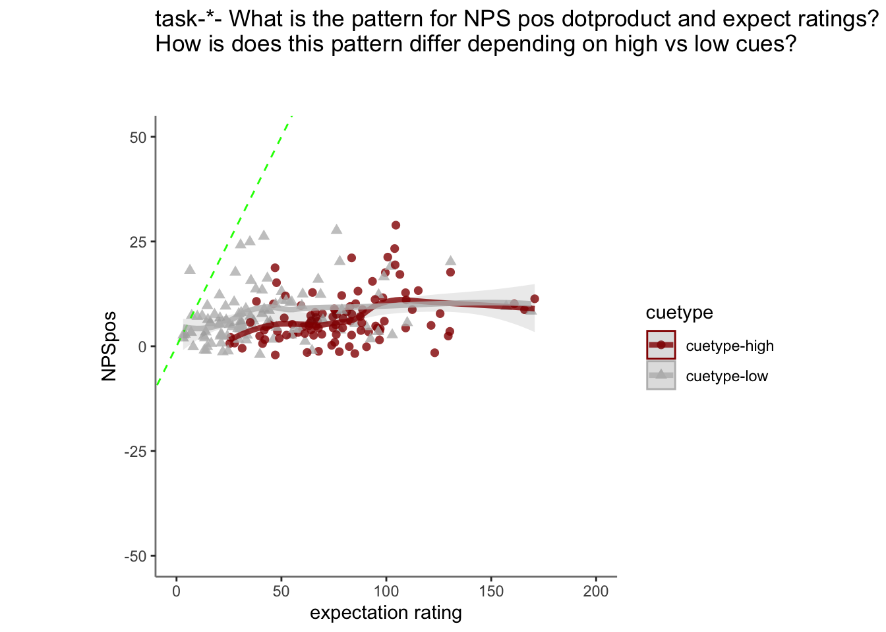
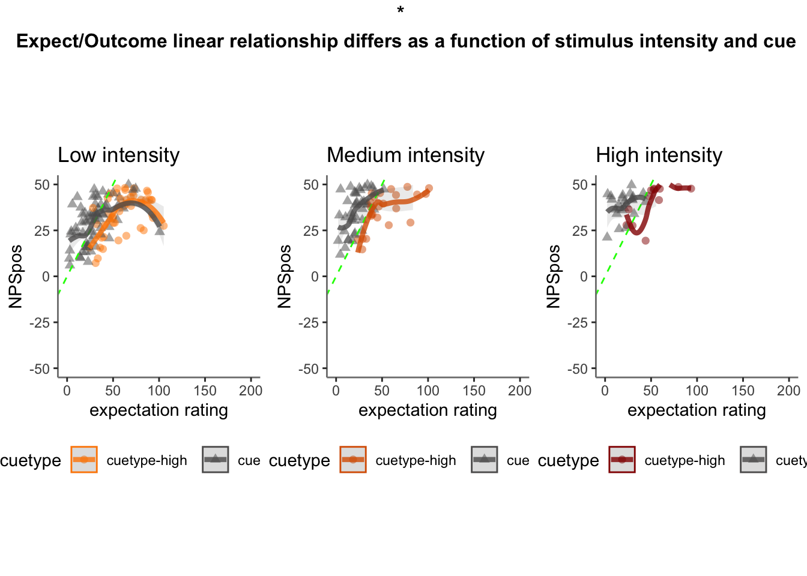
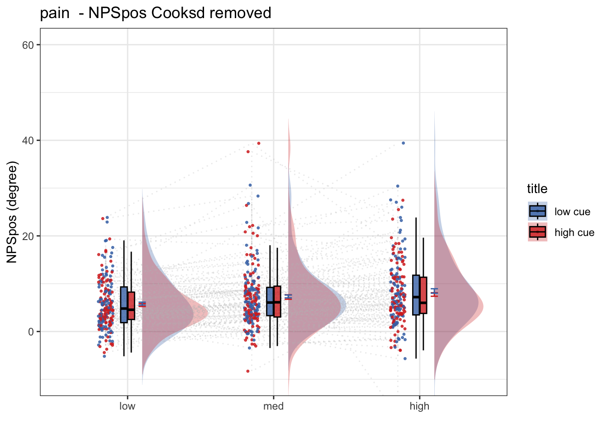
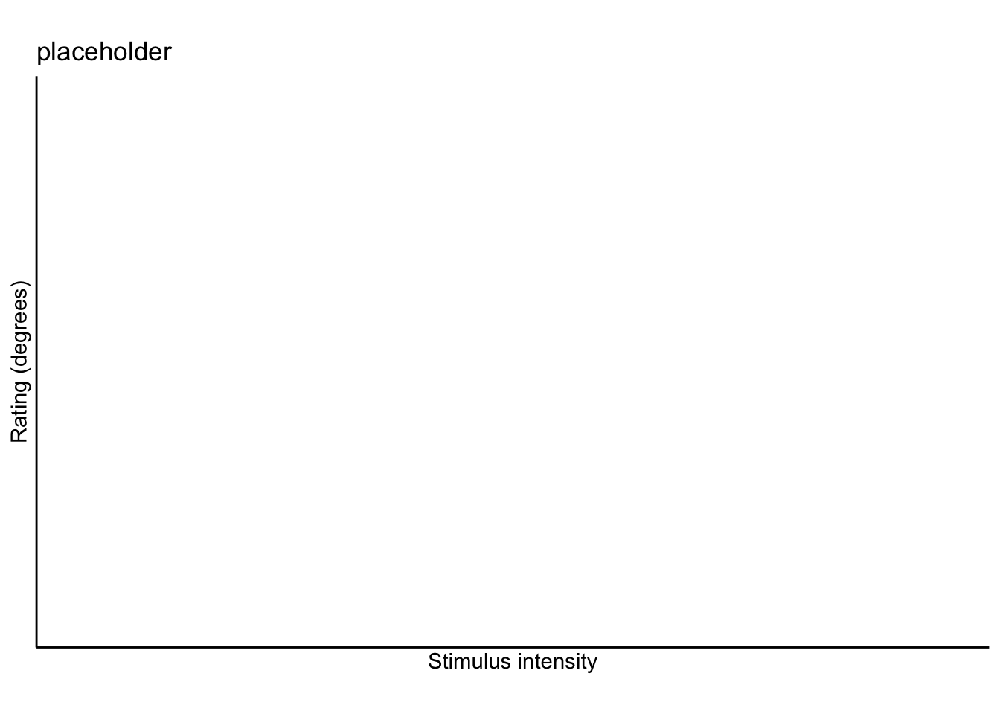

# [fMRI] Pain signature ~ single trial {#ch97_singletrial_P}

```
author: "Heejung Jung"
date: "2023-03-04"
```


## Function {.unlisted .unnumbered}


## Step 1: Common parameters {.unlisted .unnumbered}

```r
# step 1: load data
for (signature_key in c("NPSpos")) {
     #c("NPS", "NPSpos", "NPSneg", "VPS", #"VPSnooccip", "ThermalPain", "MechPain", "GeneralAversive", "AversiveVisual"
                      #  "ZhouVPS", "PINES",  "GSR", "GeuterPaincPDM")) {
  dv_keyword = signature_key
  signature_name = signature_key
  # step 1: common parameters _______
  main_dir <- dirname(dirname(getwd()))
  #signature_key = "NPSpos"
  analysis_folder  = paste0("model35_iv-task-stim_dv-signature")

  sig_name <-
    Sys.glob(file.path(
      main_dir,
      "analysis/fmri/nilearn/signature_extract",
      paste0(
        "signature-",
        signature_key,
        "_sub-all_runtype-pvc_event-stimulus.tsv"
      )
    )) # nolint
  print(sig_name)
  analysis_dir <-
    file.path(main_dir,
              "analysis",
              "mixedeffect",
              analysis_folder,
              as.character(Sys.Date())) # nolint
  dir.create(analysis_dir,
             showWarnings = FALSE,
             recursive = TRUE)
  savedir <- analysis_dir
  
  # step 2: load data
  df = read.csv(sig_name)
  sig_df = df %>% separate(
    singletrial_fname,
    sep = "_",
    c(
      "sub",
      "ses",
      "run",
      "runtype",
      "event",
      "trial",
      "cuetype",
      "stimintensity"
    )
  )
  sig_df = sig_df %>% separate(
    stimintensity,
    into = c(NA, "stimintensity"),
    extra = "drop",
    fill = "left"
  )
  pvc <- simple_contrasts_singletrial(sig_df)
  pvc$task[pvc$runtype == "runtype-pain"] <- "pain"
  pvc$task[pvc$runtype == "runtype-vicarious"] <- "vicarious"
  pvc$task[pvc$runtype == "runtype-cognitive"] <- "cognitive"
  pvc$task <- factor(pvc$task)
  
  
  # step 3: parameters
  
  taskname = "all"
  plot_keyword = "stimulusintensity"
  ggtitle_phrase =  "(3 tasks x 3 stimulus intensity)"
  
  pvc$task = factor(pvc$task)
  plot_keys <- list(
    sub_mean = "mean_per_sub",
    group_mean = "mean_per_sub_norm_mean",
    legend_keyword = "stimulus intensity",
    se = "se",
    subject = "sub",
    ggtitle = paste0(
      str_to_title(signature_key),
      " dot product: ",
      str_to_title(taskname),
      ' ',
      ggtitle_phrase,
      " (N = ",
      length(unique(pvc$sub)),
      ")"
    ),
    title = paste0(
      str_to_title(signature_key),
      " - ",
      str_to_title(plot_keyword)
    ),
    xlab = "",
    ylab = paste(signature_key, " (dot product)"),
    ylim = c(-250, 500)
  )
  
  # step 4: within between summary
  groupwise <- data.frame()
  subjectwise <- data.frame()
  summary <- summary_for_plots_PVC(
    df = pvc,
    # taskname = taskname,
    groupwise_measurevar = plot_keys$sub_mean,
    # "mean_per_sub",
    subject_keyword = plot_keys$subject,
    # "sub",
    model_iv1 =  "task",
    model_iv2 =  "stim_ordered",
    dv = signature_key #"NPSpos"
  )
  subjectwise <<- as.data.frame(summary[[1]])
  groupwise <<- as.data.frame(summary[[2]])
  if (any(startsWith(dv_keyword, c("expect", "Expect")))) {
    plot_keys$color <- c("#1B9E77", "#D95F02", "#D95F02")
  } else {
    plot_keys$color <- c("#4575B4", "#FFA500", "#D73027")
  }
  
  # step 5: plot
  
  iv2 = "stim_ordered"
  iv1 = "task"
  taskname = "all"
  if (any(startsWith(dv_keyword, c("expect", "Expect")))) {
    color <- c("#1B9E77", "#D95F02", "#D95F02")
  } else {
    color <- c("#4575B4", "#FFA500", "#D73027")
  }
  subject_mean <- "mean_per_sub"
  sub_mean = subject_mean
  group_mean <- "mean_per_sub_norm_mean"
  se <- "se"
  ylim <- c(-25, 26)
  subject <- "sub"
  ggtitle_phrase <-  "(3 tasks x 3 stimulus intensity)"
  ggtitle <-
    paste0(
      str_to_title(signature_name),
      " dot product: ",
      str_to_title(taskname),
      ' ',
      ggtitle_phrase,
      " (N = ",
      length(unique(pvc$sub)),
      ")"
    )
  
  title <-
    paste0(str_to_title(dv_keyword),
           " - ",
           str_to_title(plot_keys$legend_keyword))
  xlab <- ""
  plot_keyword = "stimintensity"
  ylab <- paste(signature_name, " (dot product)")
  plot2_savefname <- file.path(
    analysis_dir,
    paste(
      "signature_task-",
      taskname,
      "_event-",
      plot_keyword,
      "_dv-",
      signature_key,
      "_",
      as.character(Sys.Date()),
      ".png",
      sep = ""
    )
  )
  p <- plot_halfrainclouds_twofactor(
    subjectwise,
    groupwise,
    iv1,
    iv2,
    subject_mean,
    group_mean,
    se,
    subject,
    ggtitle,
    title,
    xlab,
    ylab,
    taskname,
    ylim,
    w = 10,
    h = 6,
    dv_keyword,
    color,
    plot2_savefname
  )
  p
}
```

```
## [1] "/Users/h/Dropbox (Dartmouth College)/projects_dropbox/social_influence_analysis/analysis/fmri/nilearn/signature_extract/signature-NPSpos_sub-all_runtype-pvc_event-stimulus.tsv"
```

```
## Warning: Removed 3 rows containing non-finite values (`stat_half_ydensity()`).
```

```
## Warning: Removed 3 rows containing non-finite values (`stat_boxplot()`).
```

```
## Warning: Removed 93 rows containing missing values (`geom_half_violin()`).
```

```
## Warning: Removed 3 rows containing missing values (`geom_point()`).
```

## load behavioral data

```r
main_dir = dirname(dirname(getwd()))
print(main_dir)
```

```
## [1] "/Users/h/Dropbox (Dartmouth College)/projects_dropbox/social_influence_analysis"
```

```r
datadir = file.path(main_dir, 'data', 'beh', 'beh02_preproc')
taskname = '*'
subject_varkey <- "src_subject_id"
iv <- "param_stimulus_type"; 
iv_keyword <- "stim"; 
dv <- "event04_actual_angle"; dv_keyword <- "outcome"
exclude <- "sub-0001|sub-0003|sub-0004|sub-0005|sub-0025|sub-0999"

p.df <- load_task_social_df(datadir, taskname = "pain", subject_varkey, iv, dv, exclude)
v.df <- load_task_social_df(datadir, taskname = "vicarious", subject_varkey, iv, dv, exclude)
c.df <- load_task_social_df(datadir, taskname = "cognitive", subject_varkey, iv, dv, exclude)

p.df2= p.df %>%
  arrange(src_subject_id ) %>%
  group_by(src_subject_id) %>%
  mutate(trial_index = row_number())
data_p <- p.df2 %>% 
  group_by(src_subject_id, session_id, param_run_num) %>% 
  mutate(trial_index = row_number(param_run_num))

v.df2= v.df %>%
  arrange(src_subject_id ) %>%
  group_by(src_subject_id) %>%
  mutate(trial_index = row_number())
data_v <- v.df2 %>% 
  group_by(src_subject_id, session_id, param_run_num) %>% 
  mutate(trial_index = row_number(param_run_num))

c.df2= c.df %>%
  arrange(src_subject_id ) %>%
  group_by(src_subject_id) %>%
  mutate(trial_index = row_number()-1)
data_c <- c.df2 %>% 
  group_by(src_subject_id, session_id, param_run_num) %>% 
  mutate(trial_index = row_number(param_run_num) )
p.sub <- data_p[,c("src_subject_id", "session_id", "param_run_num", "param_task_name", "event02_expect_angle", "param_cue_type", "param_stimulus_type", "event04_actual_angle", "trial_index")]
v.sub <- data_v[,c("src_subject_id", "session_id", "param_run_num", "param_task_name", "event02_expect_angle", "param_cue_type", "param_stimulus_type", "event04_actual_angle", "trial_index")]
c.sub <- data_c[,c("src_subject_id", "session_id", "param_run_num", "param_task_name", "event02_expect_angle", "param_cue_type", "param_stimulus_type", "event04_actual_angle", "trial_index")]
# sub, ses, run, runtype, event, trial, cuetype, stimintensity
# src_subject_id, session_id, param_run_num, param_task_name, event02_expect_angle, param_cue_type, param_stimulus_type, event04_actual_angle
pvc.sub = rbind(p.sub, v.sub, c.sub)
```


```r
pvc.sub$trial_ind <- pvc.sub$trial_index -1 
pvc.sub$sub <- sprintf("sub-%04d", pvc.sub$src_subject_id)
pvc.sub$ses <- sprintf("ses-%02d", pvc.sub$session_id)
pvc.sub$run <- sprintf("run-%02d", pvc.sub$param_run_num)
pvc.sub$runtype <- sprintf("runtype-%s", pvc.sub$param_task_name)
pvc.sub$trial <- sprintf("trial-%03d", pvc.sub$trial_ind)
pvc.sub[c('cue', 'DEPc')]  <- str_split_fixed(pvc.sub$param_cue_type , '_', 2)
pvc.sub$cuetype <- sprintf("cuetype-%s", pvc.sub$cue)
pvc.sub[c('stimintensity', 'DEP')]  <- str_split_fixed(pvc.sub$param_stimulus_type , '_', 2)

# merge
pvc.beh <- pvc.sub[,c("sub", "ses", "run", "runtype", "trial", "cuetype", "stimintensity","event02_expect_angle", "event04_actual_angle")]
df_merge <- merge(pvc, pvc.beh, 
                  by.x = c("sub", "ses", "run", "runtype", "trial", "cuetype", "stimintensity"),
                  by.y = c("sub", "ses", "run", "runtype", "trial", "cuetype", "stimintensity")
                  )
```

## expect & NPS as a function of cue


```r
p.sig <- df_merge[df_merge$runtype == "runtype-pain",]
iv1 = "event02_expect_angle"; iv2 = "NPSpos"
df_dropna <-
  p.sig[!is.na(p.sig$event02_expect_angle) & !is.na(p.sig$NPSpos),]
total <-
  plot_twovariable(
    df_dropna, iv1, iv2,
    group = "cuetype", subject = "sub",
    xmin=0, xmax=200, ymin=-50, ymax=50,
    xlab = "expectation rating",
    ylab = signature_key, 
    ggtitle = "all stimulus intensity", 
    color_scheme = c("cuetype-high" ="#941100","cuetype-low" =  "#BBBBBB"), 
    alpha = .8, fit_lm = TRUE
  )
total + labs(title =paste0("task-",taskname, "- What is the pattern for NPS pos dotproduct and expect ratings? \nHow is does this pattern differ depending on high vs low cues?\n\n")
          )
```

```
## `geom_smooth()` using method = 'loess' and formula = 'y ~ x'
## `geom_smooth()` using method = 'loess' and formula = 'y ~ x'
```



```r
  # geom_line(method="lm", alpha=0.3, size=1, span=0.5) # geom_smooth(method=lm, se = TRUE) 
# +geom_smooth(method = "lm", alpha=0.1, size=0, span=0.5)
```





## 2x3 stim*cue 

```r
combined_se_calc_cooksd <- data.frame()
taskname = "pain"
    ggtitle <- paste(taskname, " - actual judgment (degree)")
    title <- paste(taskname, " - actual")
    subject <- "sub"
    w <- 10
    h <- 6
data <- p.sig
    # [ CONTRASTS ]  ________________________________________________________________________________ # nolint
    # contrast code ________________________________________
    data$stim[data$stimintensity == "low"] <- -0.5 # social influence task
    data$stim[data$stimintensity == "med"] <- 0 # no influence task
    data$stim[data$stimintensity == "high"] <- 0.5 # no influence task

    data$stim_factor <- factor(data$stimintensity)

    # contrast code 1 linear
    data$stim_con_linear[data$stimintensity == "low"] <- -0.5
    data$stim_con_linear[data$stimintensity == "med"] <- 0
    data$stim_con_linear[data$stimintensity == "high"] <- 0.5

    # contrast code 2 quadratic
    data$stim_con_quad[data$stimintensity == "low"] <- -0.33
    data$stim_con_quad[data$stimintensity == "med"] <- 0.66
    data$stim_con_quad[data$stimintensity == "high"] <- -0.33

    # social cude contrast
    data$social_cue[data$cuetype == "cuetype-low"] <- -0.5 # social influence task
    data$social_cue[data$cuetype == "cuetype-high"] <- 0.5 # no influence task

    stim_con1 <- "stim_con_linear"
    stim_con2 <- "stim_con_quad"
    iv1 <- "social_cue"
    dv <- "NPSpos"

    # [ MODEL ] _________________________________________________ # nolint
    model_savefname <- file.path(
        analysis_dir,
        paste("lmer_task-", taskname,
            "_rating-", dv_keyword,
            "_", as.character(Sys.Date()), "_cooksd.txt",
            sep = ""
        )
    )
    
    cooksd <- lmer_twofactor_cooksd_fix(
        data, taskname, iv1, stim_con1, stim_con2, dv,
        subject, dv_keyword, model_savefname, 'random_intercept', print_lmer_output = FALSE
    )
    influential <- as.numeric(names(cooksd)[
        (cooksd > (4 / as.numeric(length(unique(data$sub)))))
    ])
    data_screen <- data[-influential, ]
    # [ PLOT ] reordering for plots _________________________ # nolint
    data_screen$cue_name[data_screen$cuetype == "cuetype-high"] <- "high cue"
    data_screen$cue_name[data_screen$cuetype == "cuetype-low"] <- "low cue"

    data_screen$stim_name[data_screen$stimintensity == "high"] <- "high"
    data_screen$stim_name[data_screen$stimintensity == "med"] <- "med"
    data_screen$stim_name[data_screen$stimintensity == "low"] <- "low"

    # DATA$levels_ordered <- factor(DATA$param_stimulus_type, levels=c("low", "med", "high"))

    data_screen$stim_ordered <- factor(
        data_screen$stim_name,
        levels = c("low", "med", "high")
    )
    data_screen$cue_ordered <- factor(
        data_screen$cue_name,
        levels = c("low cue", "high cue")
    )
    model_iv1 <- "stim_ordered"
    model_iv2 <- "cue_ordered"

    #  [ PLOT ] calculate mean and se  _________________________
    actual_subjectwise <- meanSummary(
        data_screen,
        c(subject, model_iv1, model_iv2), dv
    )
    actual_groupwise <- summarySEwithin(
        data = actual_subjectwise,
        measurevar = "mean_per_sub",
        withinvars = c(model_iv1, model_iv2), idvar = subject
    )
    actual_groupwise$task <- taskname
    # https://stackoverflow.com/questions/29402528/append-data-frames-together-in-a-for-loop/29419402
    
    combined_se_calc_cooksd <- rbind(combined_se_calc_cooksd, actual_groupwise)
    # if(any(startsWith(dv_keyword, c("expect", "Expect")))){color = c( "#1B9E77", "#D95F02")}else{color=c( "#4575B4", "#D73027")} # if keyword starts with
    # print("groupwisemean")
    #  [ PLOT ] calculate mean and se  ----------------------------------------------------------------------------
    sub_mean <- "mean_per_sub"
    group_mean <- "mean_per_sub_norm_mean"
    se <- "se"
    subject <- "sub"
    ggtitle <- paste(taskname, " - NPSpos Cooksd removed")
    title <- paste(taskname, " - NPSpos")
    xlab <- ""
    ylab <- "NPSpos (degree)"
    ylim <- c(-10,60)
    dv_keyword <- "NPSpos"
    if (any(startsWith(dv_keyword, c("expect", "Expect")))) {
        color <- c("#1B9E77", "#D95F02")
    } else {
        color <- c("#4575B4", "#D73027")
    } # if keyword starts with
    plot_savefname <- file.path(
        analysis_dir,
        paste("raincloud_task-", taskname,
            "_rating-", dv_keyword,
            "_", as.character(Sys.Date()), "_cooksd.png",
            sep = ""
        )
    )
    g <- plot_rainclouds_twofactor(
        actual_subjectwise, actual_groupwise, model_iv1, model_iv2,
        sub_mean, group_mean, se, subject,
        ggtitle, title, xlab, ylab, taskname,ylim,
        w, h, dv_keyword, color, plot_savefname
    )
```

```
## Warning in geom_line(data = subjectwise, aes(group = .data[[subject]], y
## = .data[[sub_mean]], : Ignoring unknown aesthetics: fill
```

```
## Warning: Duplicated aesthetics after name standardisation: width
```

```
## Warning: Using the `size` aesthietic with geom_polygon was deprecated in ggplot2 3.4.0.
## ℹ Please use the `linewidth` aesthetic instead.
```

```r
g
```




```r
g
```


## lineplots

```r
plot_lineplot_twofactor(actual_groupwise, taskname = "vicarious", 
                        iv1 = "stim_ordered", iv2 = "cue_ordered", 
                        mean = "mean_per_sub_norm_mean", error = "se",
                        color = c("#4575B4", "#D73027"), ggtitle = "placeholder")
```




<!-- ## Step 2: load data {.unlisted .unnumbered} -->
<!-- ```{r} -->
<!-- df = read.csv(sig_name) -->
<!-- sig_df = df %>%separate(singletrial_fname,sep = "_", c("sub", "ses", "run", "runtype", "event", "trial", "cuetype", "stimintensity")) -->
<!-- sig_df = sig_df %>% separate(stimintensity, into = c(NA, "stimintensity"), extra = "drop", fill = "left") -->
<!-- pvc <- simple_contrasts_singletrial(sig_df) -->
<!-- pvc$task[pvc$runtype == "runtype-pain"] <- "pain" -->
<!-- pvc$task[pvc$runtype == "runtype-vicarious"] <- "vicarious" -->
<!-- pvc$task[pvc$runtype == "runtype-cognitive"] <- "cognitive" -->
<!-- pvc$task <- factor(pvc$task) -->
<!-- ``` -->

<!-- ## Step 3: plot key paramters {.unlisted .unnumbered} -->
<!-- ```{r} -->
<!-- signature_key = "NPSpos" -->
<!-- taskname = "all"; plot_keyword = "stimulusintensity"; ggtitle_phrase =  "(3 tasks x 3 stimulus intensity)"; -->
<!-- pvc$task = factor(pvc$task) -->
<!-- plot_keys <- list( -->
<!--     iv1 = "task", -->
<!--     iv2 = "stim_ordered", -->
<!--     plot_keyword = "stimulusintensity", -->
<!--     dv = signature_key, -->
<!--     dv_keyword = signature_key, -->
<!--     taskname = taskname, -->
<!--     sub_mean = "mean_per_sub", -->
<!--     group_mean = "mean_per_sub_norm_mean", -->
<!--     legend_keyword = "stimulus intensity", -->
<!--     se = "se", -->
<!--     subject = "sub", -->
<!--     ggtitle = paste0( -->
<!--       str_to_title(signature_key),  -->
<!--       " dot product: ", str_to_title(taskname),' ', ggtitle_phrase," (N = ", length(unique(pvc$sub)), ")"), -->
<!--     title = paste0(str_to_title(signature_key), " - ", str_to_title(plot_keyword)), -->
<!--     xlab = "", -->
<!--     ylab = paste(signature_key," (dot product)"), -->
<!--     ylim = c(-250, 500), -->
<!--     w = 10, -->
<!--     h = 6, -->
<!--     plot_savefname = file.path( -->
<!--         analysis_dir, -->
<!--         paste("signature_task-", taskname, "_event-", plot_keyword, -->
<!--             "_dv-", signature_key, -->
<!--             "_", as.character(Sys.Date()), ".png", -->
<!--             sep = "" -->
<!--         ) -->
<!--     ) -->
<!--     #model_iv1 = "stim_ordered", -->
<!--     #model_iv2 = "cue_ordered" -->
<!-- ) -->
<!-- ``` -->

<!-- ```{r eval=FALSE, include=FALSE} -->
<!-- groupwise <- data.frame() -->
<!-- subjectwise <- data.frame() -->
<!-- summary <- summary_for_plots_PVC( -->
<!--         df = pvc, -->
<!--         # taskname = taskname, -->
<!--         groupwise_measurevar = "mean_per_sub", -->
<!--         subject_keyword =  "sub", -->
<!--         model_iv1 =  "task", -->
<!--         model_iv2 =  "stim_ordered", -->
<!--         dv = "NPSpos" -->
<!--     ) -->
<!-- subjectwise <<- as.data.frame(summary[[1]]) -->
<!-- groupwise <<- as.data.frame(summary[[2]]) -->
<!--     if (any(startsWith("NPSpos", c("expect", "Expect")))) { -->
<!--         plot_keys$color <- c("#1B9E77", "#D95F02", "#D95F02") -->
<!--     } else { -->
<!--         plot_keys$color <- c("#4575B4", "#FFA500", "#D73027") -->
<!--     } -->
<!-- ``` -->

<!-- ```{r} -->
<!-- p <- plot_halfrainclouds_twofactor_35( -->
<!--         subjectwise, groupwise, iv1 = "task", iv2 = "stim_ordered", -->
<!--         sub_mean = "mean_per_sub", group_mean = plot_keys$group_mean, se = plot_keys$se, subject = plot_keys$sub, -->
<!--         ggtitle = plot_keys$ggtitle, title = plot_keys$title, xlab = plot_keys$xlab, ylab = plot_keys$ylab, task_name = plot_keys$taskname, ylim = plot_keys$ylim, -->
<!--         w = plot_keys$w, h = plot_keys$h, dv_keyword = plot_keys$dv_keyword, color = plot_keys$color, save_fname = plot_keys$plot_savefname -->
<!--     ) -->
<!-- p -->
<!-- ``` -->

<!-- ## Plot test function -->
<!-- plot_signature_twofactor <- function(signature_key, analysis_dir, plot_keys, df)  -->
<!-- ```{r} -->
<!-- p <- plot_signature_twofactor(signature_key = "NPSpos",  -->
<!--                               plot_keys, df = data.frame(pvc)) -->
<!-- p -->
<!-- ``` -->


<!-- ```{r} -->
<!-- hist(pvc$NPS) -->
<!-- ``` -->
<!-- ```{r} -->
<!-- model.nps = lmer(NPSpos ~ task + stimintensity + (1 | sub) , data = pvc) -->
<!-- summary(model.nps) -->
<!-- ``` -->

<!-- ```{r pvc_summary, include=FALSE} -->
<!-- subject_varkey <- "sub" -->
<!-- iv1 <- "task" -->
<!-- iv2 <-  "stim_ordered" -->
<!-- dv <- "NPSpos" -->
<!-- taskname = "all" -->
<!-- dv_keyword <- "NPSpos" -->
<!-- subject <- "subject" -->
<!-- xlab <- "" -->
<!-- ylab <- "NPS positive (dot product)" -->
<!-- ylim <- c(-20,20) -->
<!-- title <- "stim" -->
<!-- #taskname <- "all tasks" -->
<!-- exclude <- "sub-0001|sub-0003|sub-0004|sub-0005|sub-0025|sub-0999" -->
<!-- ``` -->

<!-- ```{r plotting_parameters_34, include=FALSE} -->

<!-- plot_keys <- list(sub_mean = "mean_per_sub",group_mean = "mean_per_sub_norm_mean", se = "se", -->
<!--     subject = "sub", taskname = taskname, -->
<!--     ggtitle = paste(taskname, " - NPS (dot prodcut) Cooksd removed"), -->
<!--     title = paste(taskname, " - Actual"), -->
<!--     xlab = "", -->
<!--     ylab = "ratings (degree)", -->
<!--     ylim = c(-250,500), -->
<!--     dv_keyword = "NPS", -->
<!--     w = 10, -->
<!--     h = 6, -->
<!--     plot_savefname = file.path( -->
<!--         analysis_dir, -->
<!--         paste("raincloud_task-", taskname, -->
<!--             "_rating-", dv_keyword, -->
<!--             "_", as.character(Sys.Date()), "_cooksd.png", -->
<!--             sep = "" -->
<!--         ) -->
<!--     ), -->
<!--     model_iv1 ="stim_ordered", -->
<!--     model_iv2 = "cue_ordered",  -->
<!--     legend_keyword = "stimulus intensity") -->
<!-- ``` -->


<!-- ```{r summary_pvc, message=FALSE, warning=FALSE, include=FALSE, paged.print=FALSE} -->
<!-- groupwise = data.frame() -->
<!-- subjectwise = data.frame() -->
<!-- summary <- summary_for_plots_PVC(df = pvc,  -->
<!--                              # taskname = taskname,  -->
<!--                              groupwise_measurevar = "mean_per_sub", -->
<!--                              subject_keyword = "sub", -->
<!--                              model_iv1 = "task", -->
<!--                              model_iv2 = "stim_ordered", -->
<!--                              dv = "NPSpos") -->
<!-- subjectwise <- as.data.frame(summary[[1]]) -->
<!-- groupwise <-as.data.frame(summary[[2]]) -->
<!--     if (any(startsWith(plot_keys$dv_keyword, c("expect", "Expect")))) { -->
<!--         color <- c("#1B9E77", "#D95F02") -->
<!--     } else { -->
<!--         color <- c("#4575B4", "#D73027") -->
<!--     }  -->
<!-- ``` -->

<!-- ## Raincloud plots -->
<!-- ```{r plot_PVC, echo=FALSE, message=FALSE, warning=TRUE, paged.print=FALSE} -->
<!-- dv_keyword = "NPSpos" -->
<!-- signature_name = "NPSpos" -->
<!-- iv2 = "stim_ordered" -->
<!-- iv1 = "task" -->
<!--     if (any(startsWith(dv_keyword, c("expect", "Expect")))) { -->
<!--         color <- c("#1B9E77", "#D95F02", "#D95F02") -->
<!--     } else { -->
<!--         color <- c("#4575B4", "#FFA500", "#D73027") -->
<!--     } -->
<!--     subject_mean <- "mean_per_sub" -->
<!--     group_mean <- "mean_per_sub_norm_mean" -->
<!--     se <- "se" -->
<!--     ylim <- c(-25,26) -->
<!--     subject <- "sub" -->
<!--     ggtitle_phrase <-  "(3 tasks x 3 stimulus intensity)" -->
<!--     # ggtitle <- paste(taskname, " (3 tasks x 3 stimulus intensity) - ", signature_name, "dot product") -->
<!--     ggtitle <- paste0(str_to_title(signature_name), " dot product: ", str_to_title(taskname),' ', ggtitle_phrase,  " (N = ", length(unique(pvc$sub)), ")");  -->
<!--     # title <- paste(taskname, " (3 tasks x 3 stimulus intensity) - ", signature_name, "dot product") -->
<!--     title <- paste0(str_to_title(dv_keyword), " - ", str_to_title(plot_keys$legend_keyword)) -->
<!--     xlab <- "" -->
<!--     ylab <- paste(signature_name," (dot product)") -->
<!--     plot2_savefname <- file.path( -->
<!--         analysis_dir, -->
<!--         paste("raincloudplots_task-", taskname,"_event-",iv2, -->
<!--             "_rating-", dv_keyword, -->
<!--             "_", as.character(Sys.Date()), ".png", -->
<!--             sep = "" -->
<!--         ) -->
<!--     ) -->
<!-- p <- plot_halfrainclouds_twofactor( -->
<!--       subjectwise, groupwise, iv1, iv2,  -->
<!--       subject_mean, group_mean, se, subject,  -->
<!--       ggtitle, title, xlab, ylab, taskname, ylim, -->
<!--       w = plot_keys$w, h = plot_keys$h, dv_keyword, color, plot2_savefname) -->
<!-- p -->
<!-- ``` -->

<!-- ## Line plots -->
<!-- ```{r lineplot_PVC, echo=FALSE, message=FALSE, warning=FALSE, paged.print=FALSE} -->
<!-- ggtitle <- paste(str_to_title(signature_name), "dot product:", str_to_title(taskname), ggtitle_phrase,  " (N = ", length(unique(pvc$sub)), ")");  -->
<!-- g<-two_factor_lineplot(df = groupwise,  iv1 = "stim_ordered",iv2 = "task", mean = "mean_per_sub_norm_mean", error = "se", -->
<!--                        xlab = "stimulus intensity", -->
<!--                        ylab = dv) -->
<!-- g -->
<!-- ``` -->


