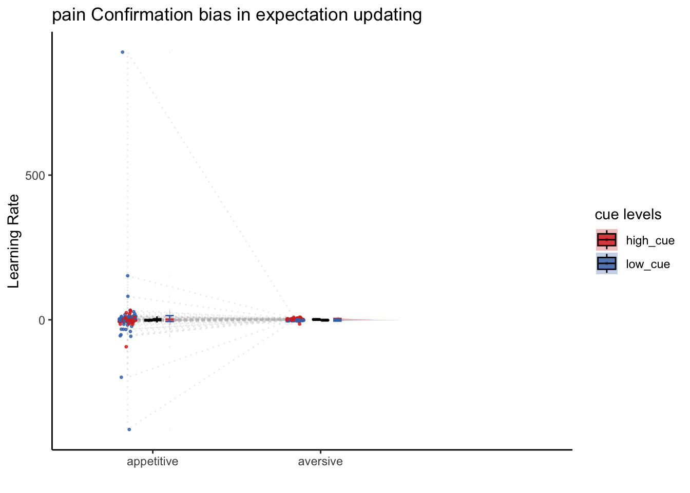
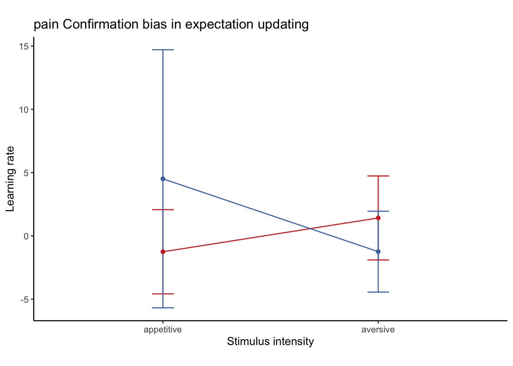
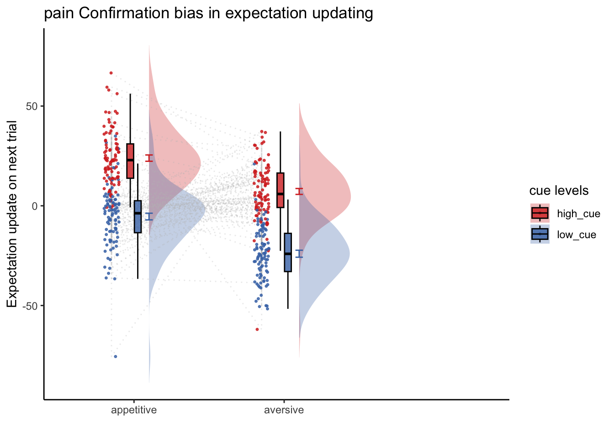
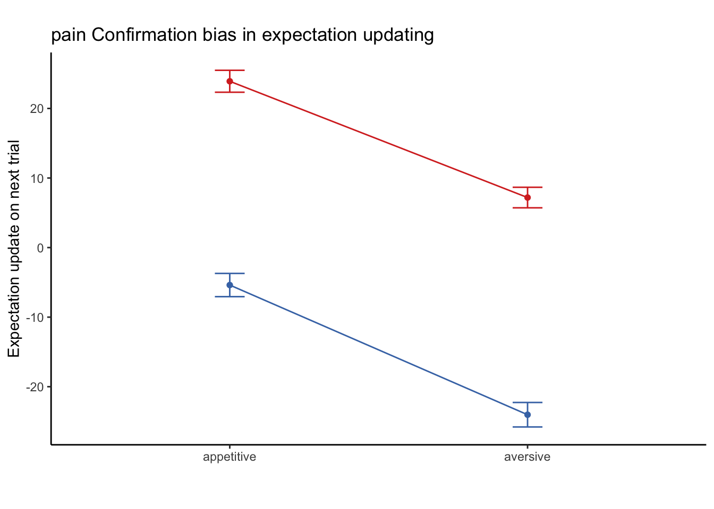
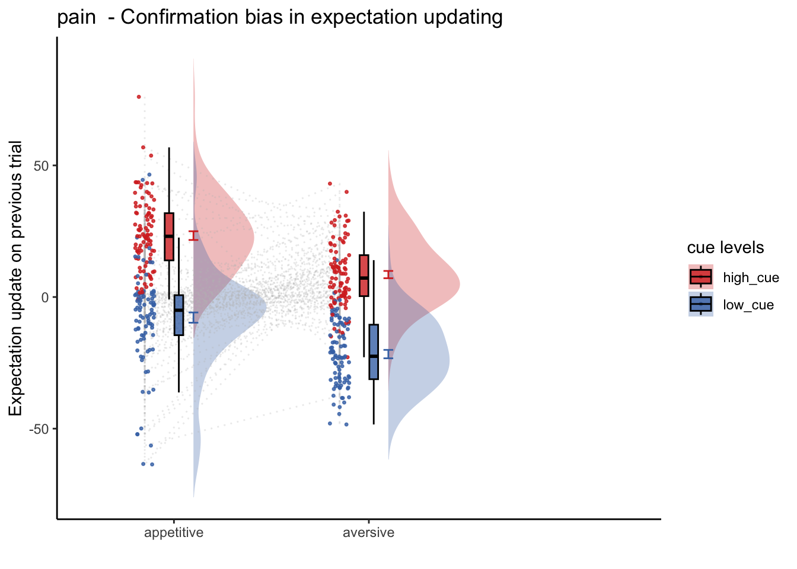
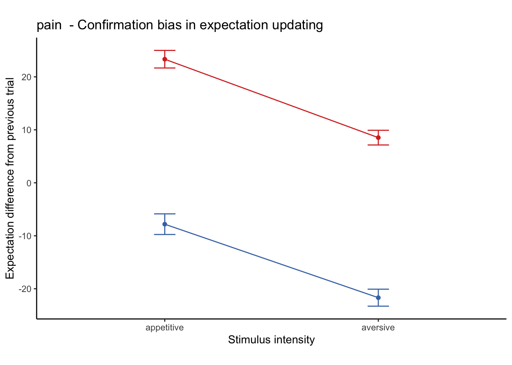
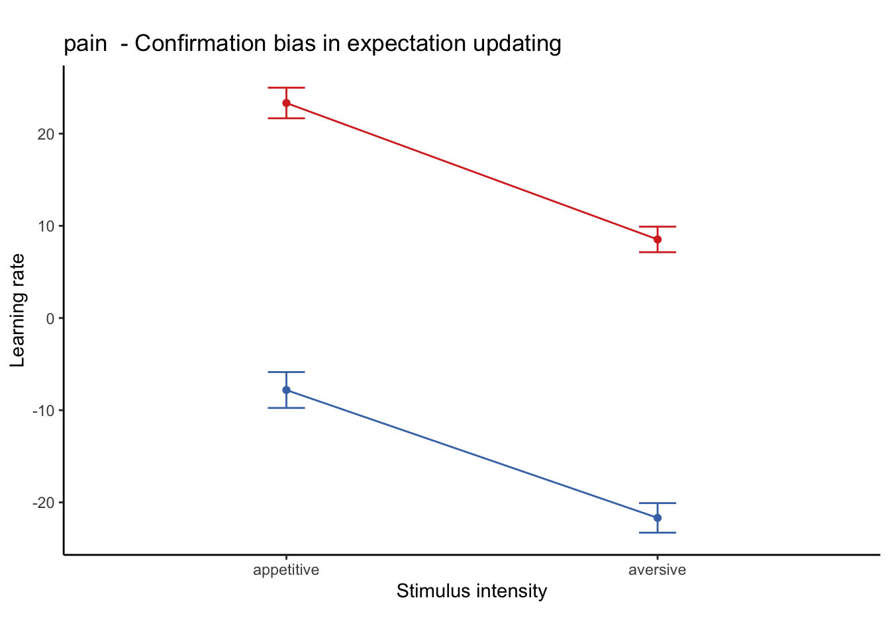

# load behavioral daata

```r
df = read.csv('/Users/h/Dropbox/projects_dropbox/social_influence_analysis/resources/references/cue_behavioraldata.csv')
```


```r
colnames(df)
```

```
##  [1] "X"                  "sub"                "ses"               
##  [4] "run"                "task"               "trialindex"        
##  [7] "IV_cuelevel"        "IV_stimintensity"   "RATING_expectation"
## [10] "RATING_outcome"
```


```r
# PE :: prediction error ______________________________________________________
df$PE =   df$RATING_outcome - df$RATING_expectation
# Lag expectation rating ______________________________________________________
# per run/ses/sub
data_a3lag <- df %>%
  group_by(sub,ses,run) %>% 
  mutate(next_trial.RATING_expectation = lag(RATING_expectation, n = 1, default = NA)) %>% 
  mutate(prev_trial.RATING_expectation = lead(RATING_expectation, n = 1, default = NA)) %>%
  mutate(ave.RATING_expectation = mean(RATING_expectation, na.rm = TRUE))
data_a3lag <- data_a3lag[!is.na(data_a3lag$ave.RATING_expectation),]
taskname = 'pain'
data_a3lag$next_trial.RATING_expect_fill = coalesce(data_a3lag$next_trial.RATING_expectation, data_a3lag$ave.RATING_expectation) 
data_a3lag$prev_trial.RATING_expect_fill = coalesce(data_a3lag$prev_trial.RATING_expectation, data_a3lag$ave.RATING_expectation) 

data_a3lag <- data_a3lag[data_a3lag$task == 'pain',]
# EXPECTUPDATE :: expectation (N) - expectation (N-1) ________________________
df_jepma <- data_a3lag %>%
  # group_by(sub,ses,run) %>%
  mutate(EXPECTUPDATE_NEXT =  RATING_expectation- next_trial.RATING_expect_fill)  %>%
  mutate(EXPECTUPDATE_PREV =  RATING_expectation- prev_trial.RATING_expect_fill)  %>%
  mutate(EXPECTUPDATE_PREV_JEPMA =  (RATING_expectation- prev_trial.RATING_expect_fill)/(PE+1))
```


```r
df_jepma$PE_type[df_jepma$PE >  0] <- "aversive"
```

```
## Warning: Unknown or uninitialised column: `PE_type`.
```

```r
df_jepma$PE_type[df_jepma$PE <= 0] <- "appetitive"
df_jepma$PE_con[df_jepma$PE <=  0] <- -1
```

```
## Warning: Unknown or uninitialised column: `PE_con`.
```

```r
df_jepma$PE_con[df_jepma$PE > 0] <-  1
df_jepma$cue_con[df_jepma$IV_cuelevel == "low_cue"] <- -1
```

```
## Warning: Unknown or uninitialised column: `cue_con`.
```

```r
df_jepma$cue_con[df_jepma$IV_cuelevel == "high_cue"] <- 1
df_jepma <- df_jepma[!is.na(df_jepma$RATING_expectation),]

write.csv(df_jepma, '/Users/h/Desktop/cuerating_0505.csv')
```

# JEPMA

```r
# summary statistics ____________________________________________________________
subject = "sub"
model_iv1 = "PE_type"
model_iv2 =  "IV_cuelevel"

dv <- "EXPECTUPDATE_PREV_JEPMA" #"PE"
    subjectwise <- meanSummary(
        df_jepma,
        c(subject, model_iv1, model_iv2), dv
    )
    groupwise <- summarySEwithin(
        data = subjectwise,
        measurevar = "mean_per_sub",
        withinvars = c(model_iv1, model_iv2), idvar = subject
    )
```

```
## 
## Attaching package: 'raincloudplots'
```

```
## The following object is masked _by_ '.GlobalEnv':
## 
##     GeomFlatViolin
```

```
## Automatically converting the following non-factors to factors: PE_type, IV_cuelevel
```

```r
    #  calculate mean and se  ----------------------------------------------------------------------------
    sub_mean <- "mean_per_sub"
    group_mean <- "mean_per_sub_norm_mean"
    se <- "se"
    subject <- "sub"
    ggtitle <- paste(taskname, "Confirmation bias in expectation updating")
    legend_title <- "cue levels"
    title <- paste(taskname, " - Actual")
    xlab <- ""
    ylab <- "Learning Rate"
    ylim <- c(-250,250)
    dv_keyword <- "learning rate"
    if (any(startsWith(dv_keyword, c("expect", "Expect")))) {
        color <- c("#1B9E77", "#D95F02")
    } else {
        color <- c( "#D73027", "#4575B4")
    } # if keyword starts with]
    analysis_dir = '/Users/h/Desktop'
    plot_savefname <- file.path(
        analysis_dir,
        paste("raincloud_task-", taskname,
            "_rating-", dv_keyword,
            "_", as.character(Sys.Date()), "_cooksd.png",
            sep = ""
        )
    )

plot_halfrainclouds_twofactor(subjectwise, groupwise,
                                      model_iv1, model_iv2, sub_mean, group_mean, se, subject,
                                      ggtitle, legend_title, xlab, ylab, task_name, ylim,
                                      w, h, dv_keyword, color, save_fname)
```



```r
plot_lineplot_twofactor(groupwise, model_iv1, model_iv2, "mean_per_sub_norm_mean", error = "se",
                      color = c( high_cue = "#D73027", low_cue = "#4575B4"), 
                      ggtitle, 
                      xlab= "Stimulus intensity", 
                      ylab = "Learning rate") 
```



# PREVIOUS TRIAL WITHOUT DIVING

```r
# summary statistics ____________________________________________________________
subject = "sub"
model_iv1 = "PE_type"
model_iv2 =  "IV_cuelevel"

dv <- "EXPECTUPDATE_PREV" #"PE"
    subjectwise <- meanSummary(
        df_jepma,
        c(subject, model_iv1, model_iv2), dv
    )
    groupwise <- summarySEwithin(
        data = subjectwise,
        measurevar = "mean_per_sub",
        withinvars = c(model_iv1, model_iv2), idvar = subject
    )
```

```
## Automatically converting the following non-factors to factors: PE_type, IV_cuelevel
```

```r
    #  calculate mean and se  ----------------------------------------------------------------------------
    sub_mean <- "mean_per_sub"
    group_mean <- "mean_per_sub_norm_mean"
    se <- "se"
    subject <- "sub"
    ggtitle <- paste(taskname, "Confirmation bias in expectation updating")
    legend_title <- "cue levels"
    title <- paste(taskname, " - Actual")
    xlab <- ""
    ylab <- "Expectation update on next trial"
    ylim <- c(-250,250)
    dv_keyword <- "learning rate"
    if (any(startsWith(dv_keyword, c("expect", "Expect")))) {
        color <- c("#1B9E77", "#D95F02")
    } else {
        color <- c( "#D73027", "#4575B4")
    } # if keyword starts with]
    analysis_dir = '/Users/h/Desktop'
    plot_savefname <- file.path(
        analysis_dir,
        paste("raincloud_task-", taskname,
            "_rating-", dv_keyword,
            "_", as.character(Sys.Date()), "_cooksd.png",
            sep = ""
        )
    )

plot_halfrainclouds_twofactor(subjectwise, groupwise,
                                      model_iv1, model_iv2, sub_mean, group_mean, se, subject,
                                      ggtitle, legend_title, xlab, ylab, task_name, ylim,
                                      w, h, dv_keyword, color, save_fname)
```



```r
plot_lineplot_twofactor(groupwise, model_iv1, model_iv2, "mean_per_sub_norm_mean", error = "se",
                      color = c( high_cue = "#D73027", low_cue = "#4575B4"), 
                      ggtitle, 
                      xlab= "", 
                      ylab = "Expectation update on next trial") 
```




# NEXT TRIAL WITHOUT DIVING

```r
# summary statistics ____________________________________________________________
subject = "sub"
model_iv1 = "PE_type"
model_iv2 =  "IV_cuelevel"

dv <- "EXPECTUPDATE_NEXT" #"PE"
    subjectwise <- meanSummary(
        df_jepma,
        c(subject, model_iv1, model_iv2), dv
    )
    groupwise <- summarySEwithin(
        data = subjectwise,
        measurevar = "mean_per_sub",
        withinvars = c(model_iv1, model_iv2), idvar = subject
    )
```

```
## Automatically converting the following non-factors to factors: PE_type, IV_cuelevel
```

```r
    #  calculate mean and se  ----------------------------------------------------------------------------
    sub_mean <- "mean_per_sub"
    group_mean <- "mean_per_sub_norm_mean"
    se <- "se"
    subject <- "sub"
    ggtitle <- paste(taskname, " - Confirmation bias in expectation updating")
    legend_title <- "cue levels"
    title <- paste(taskname, " - Actual")
    xlab <- ""
    ylab <- "Expectation update on previous trial"
    ylim <- c(-250,250)
    dv_keyword <- "learning rate"
    if (any(startsWith(dv_keyword, c("expect", "Expect")))) {
        color <- c("#1B9E77", "#D95F02")
    } else {
        color <- c( "#D73027", "#4575B4")
    } # if keyword starts with]
    analysis_dir = '/Users/h/Desktop'
    plot_savefname <- file.path(
        analysis_dir,
        paste("raincloud_task-", taskname,
            "_rating-", dv_keyword,
            "_", as.character(Sys.Date()), "_cooksd.png",
            sep = ""
        )
    )

plot_halfrainclouds_twofactor(subjectwise, groupwise,
                                      model_iv1, model_iv2, sub_mean, group_mean, se, subject,
                                      ggtitle, legend_title, xlab, ylab, task_name, ylim,
                                      w, h, dv_keyword, color, save_fname)
```



```r
plot_lineplot_twofactor(groupwise, model_iv1, model_iv2, "mean_per_sub_norm_mean", error = "se",
                      color = c( high_cue = "#D73027", low_cue = "#4575B4"), 
                      ggtitle, 
                      xlab= "Stimulus intensity", 
                      ylab = "Expectation difference from previous trial") 
```




```r
plot_lineplot_twofactor(groupwise, model_iv1, model_iv2, "mean_per_sub_norm_mean", error = "se",
                      color = c( high_cue = "#D73027", low_cue = "#4575B4"), 
                      ggtitle, 
                      xlab= "Stimulus intensity", 
                      ylab = "Learning rate") 
```



```
library(plyr)
subjectwise_cuetype = meanSummary_2dv(DATA=df_jepma,
        GROUP = c("sub", "trialindex", "IV_cuelevel"), DV1 = "PE", DV2 = "EXPECTUPDATE")
plot_twovariable(subjectwise_cuetype, iv1 = "DV1_mean_per_sub", iv2 = "DV2_mean_per_sub", group = "IV_cuelevel", subject = "sub", xmin=-50, xmax=50, ymin=-50,ymax=50,
xlab="PE", ylab="Expectation update", ggtitle="", color_scheme=c( high_cue = "#D73027", low_cue = "#4575B4"), alpha=.8, fit_lm=TRUE, lm_method = "lm", identity_line=TRUE, size=NULL)

```


```r
# subjectwise_cuetype_groupby = meanSummary_2dv(DATA=df_jepma,
#         GROUP = c("sub", "IV_cuelevel"), DV1 = "PE", DV2 = "EXPECTUPDATE_JEPMA")
# plot_twovariable(df_jepma, iv1 = "PE", iv2 = "EXPECTUPDATE", group = "IV_cuelevel", subject = "sub", xmin=-50, xmax=50, ymin=-50,ymax=50,
# xlab="PE", ylab="Expectation update", ggtitle="", color_scheme=c( high_cue = "#D73027", low_cue = "#4575B4"), alpha=.8, fit_lm=TRUE, lm_method = "lm", identity_line=TRUE, size=NULL)
```


