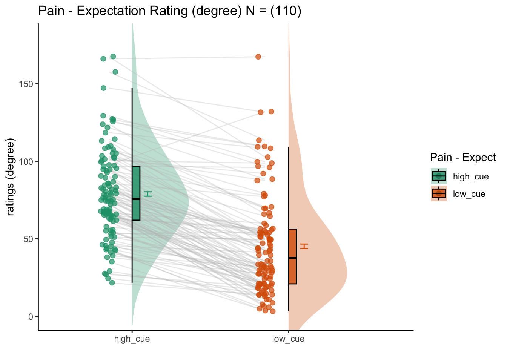
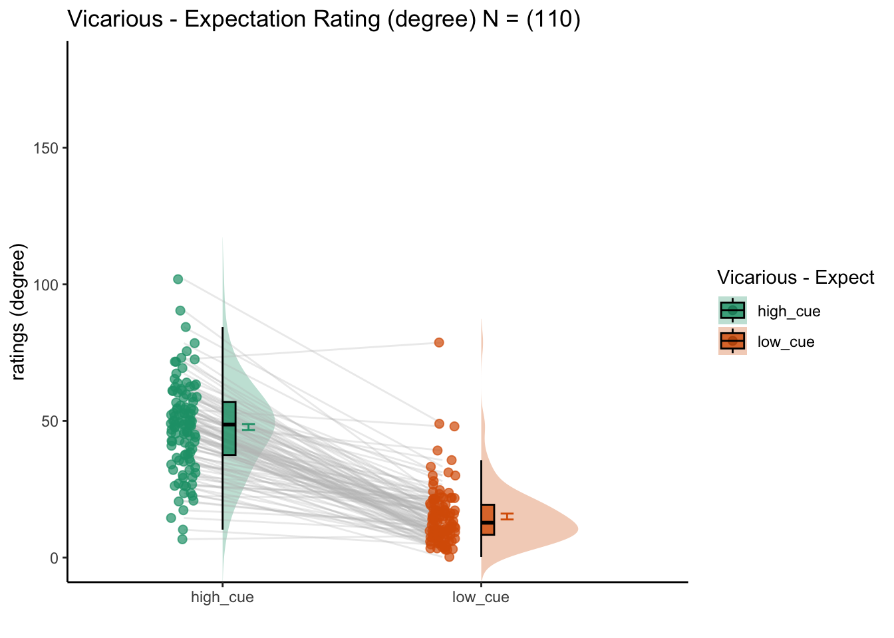
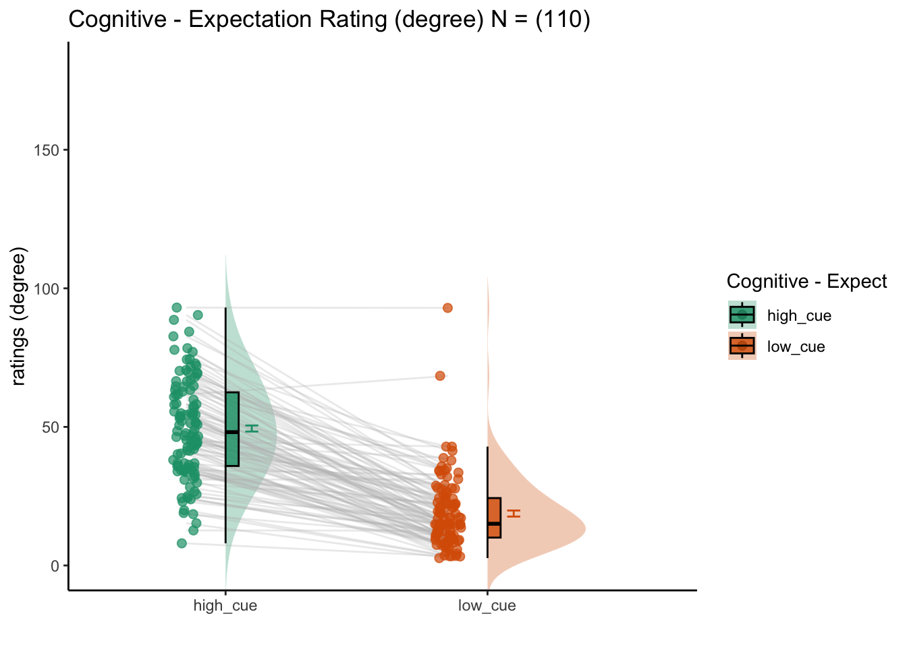

# [ beh] expectation ~ cue {#ch2_expect}

## What is the purpose of this notebook? {.unlisted .unnumbered}

Here, I plot the expectation ratings as a function of cue. 

* Main model: `lmer(expect_rating ~ cue)` 
* Main question: do expectations ratings differ as a function of cue type? 
* If there is a main effect of cue on expectation ratings, does this cue effect differ depending on task type?
* IV: cue (high / low) 
* DV: expectation rating


```r
# parameters _____________________________________ # nolint
subject_varkey <- "src_subject_id"
iv <- "param_cue_type"; iv_keyword <- "cue"; dv <- "event02_expect_angle"; dv_keyword <- "expect"
xlab <- ""; ylim = c(0,180); ylab <- "ratings (degree)"
subject <- "subject"
exclude <- "sub-0001|sub-0003|sub-0004|sub-0005|sub-0025|sub-0999"
subjectwise_mean <- "mean_per_sub"; group_mean <- "mean_per_sub_norm_mean"; se <- "se"
color_scheme <-     if (any(startsWith(dv_keyword, c("expect", "Expect")))) {
        color_scheme <- c("#1B9E77", "#D95F02")
    } else {
        color_scheme <- c("#4575B4", "#D73027")
    }
print_lmer_output <- FALSE
ggtitle_phrase <- " - Expectation Rating (degree)"
analysis_dir <- file.path(main_dir, "analysis", "mixedeffect", "model01_iv-cue_dv-expect", as.character(Sys.Date()))
dir.create(analysis_dir, showWarnings = FALSE, recursive = TRUE)
```


## Pain
### For the pain task, what is the effect of cue on expectation ratings? {.unlisted .unnumbered}

[ INSERT DESCRIPTION ]



## Vicarious
### For the vicarious task, what is the effect of cue on expectation ratings? {.unlisted .unnumbered}

[ INSERT DESCRIPTION ]



## Cognitive
### For the cognitive task, what is the effect of cue on expectation ratings? {.unlisted .unnumbered}

[ INSERT DESCRIPTION ]




## Individual difference analysis
### Are cue effects (on expectation ratings) similar across tasks? {.unlisted .unnumbered}

Using the random slopes of cue effects, here we plot them side by side
with all three tasks of pain, cognitive, vicarious. As we can see, there
is a high correlation across the random effects of cue across
pain-cognitive, pain-vicarious, and cognitive-vicarious. These plots
suggest a universal mechansim in the cue-expectancy effect, although
some may critic that the cues were identical across tasks, thereby the
cue effects are identical due to the stimuli itself, not necessarily a
domain-general expectation process.


Note: 
pain Warning: Removed 3 rows containing missing values (`geom_point()`).
vicarious Warning: Removed 1 rows containing missing values (`geom_point()`).
cognitive: Removed 3 rows containing missing values (`geom_point()`).
