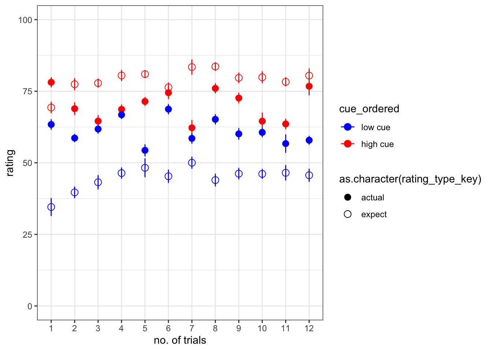
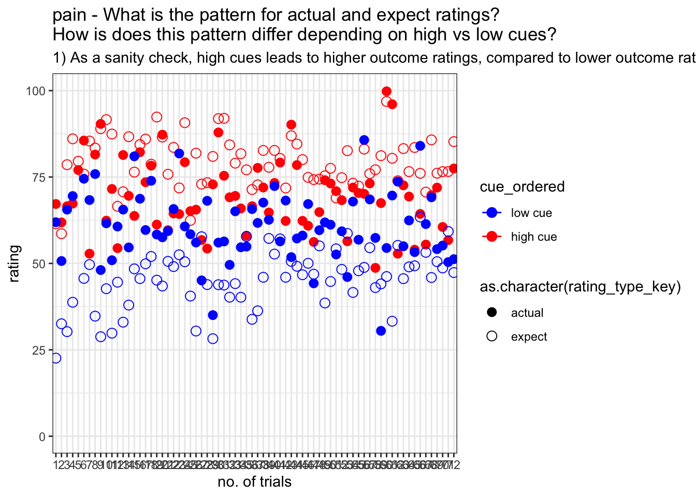
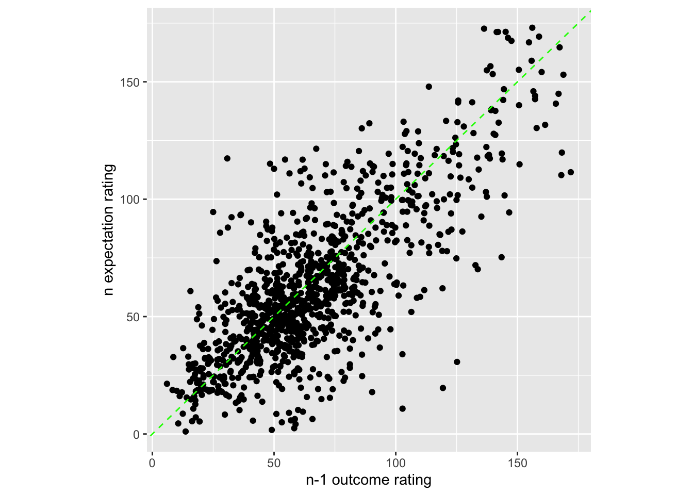
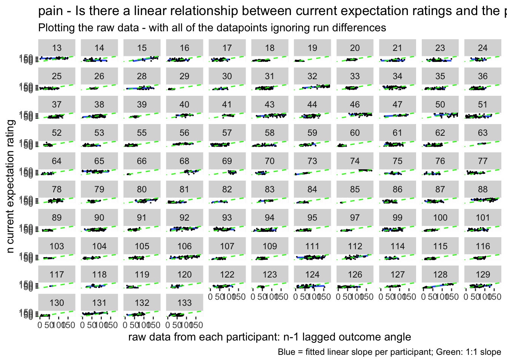
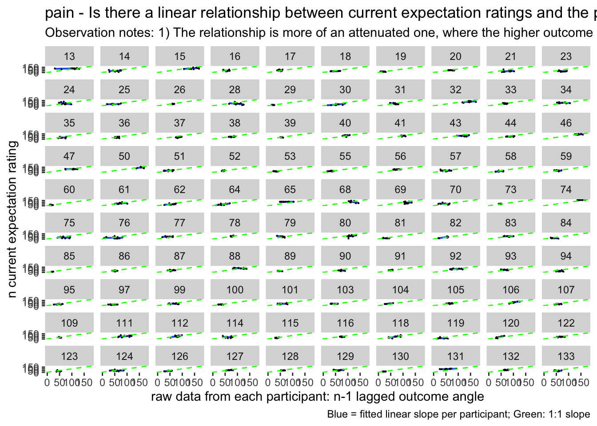
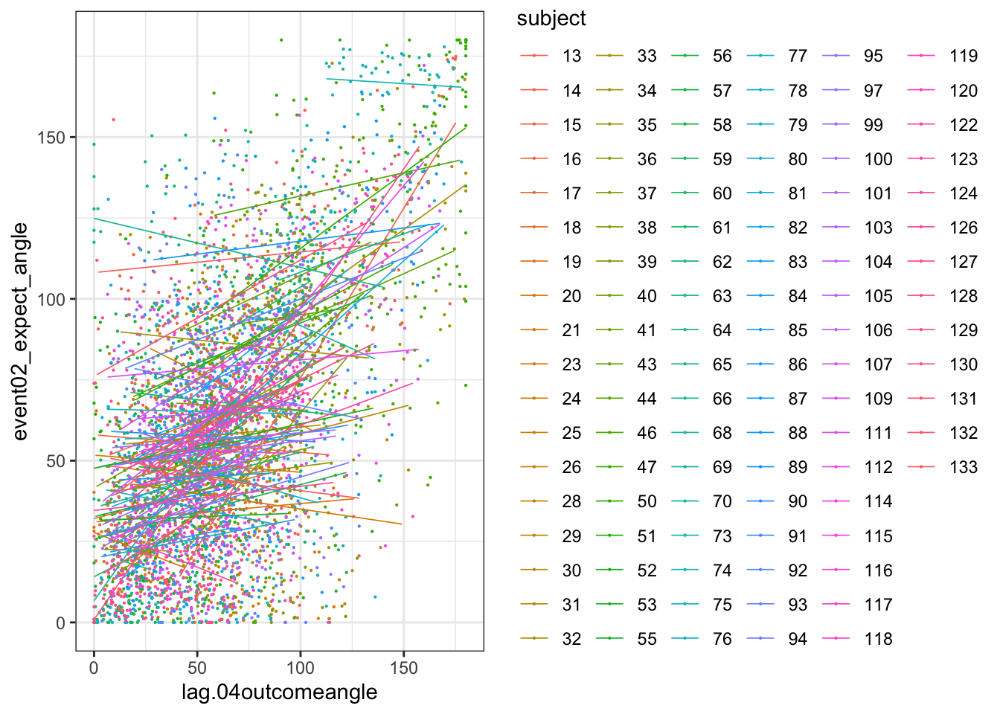
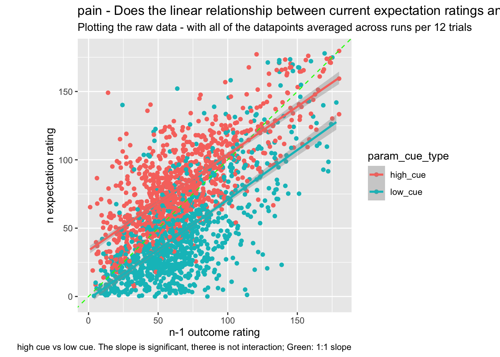

# expect-actual ~ cue * trial {#ch06_Jepma}


## Overview
The purpose of this markdown is to benchmark the plots from Jepma et al. (2018). 
Here, we plot the expectancy ratings and the actual ratings, with the high and low cues -- in one panel. 

### Some thoughts, TODOs {.unlisted .unnumbered}
* plot 2. some runs were repeated or omitted for the subjects that have more than 72 trials. I need to identify that list and work on the behavioral data. 
* I need to check whether the counterbalancing was done correctly. 


load data and combine participant data


```r
main_dir = dirname(dirname(getwd()))
datadir = file.path(main_dir, 'data', 'beh', 'beh02_preproc')
# parameters _____________________________________ # nolint
subject_varkey <- "src_subject_id"
iv <- "param_cue_type"
dv <- "event03_RT"
dv_keyword <- "RT"
xlab <- ""
taskname <- "pain"

ylab <- "ratings (degree)"
subject <- "subject"
exclude <- "sub-0999|sub-0001|sub-0002|sub-0003|sub-0004|sub-0005|sub-0006|sub-0007|sub-0008|sub-0009|sub-0010|sub-0011"

# load data _____________________________________
data <- load_task_social_df(datadir, taskname = taskname, subject_varkey = subject_varkey, iv = iv, exclude = exclude)
data$event03_RT <- data$event03_stimulusC_reseponseonset - data$event03_stimulus_displayonset
# data['event03_RT'], data.event03_RT - pandas
analysis_dir <- file.path(main_dir, "analysis", "mixedeffect", "model08_iv-cue-trial_dv-expect-actual", as.character(Sys.Date()))
dir.create(analysis_dir, showWarnings = FALSE, recursive = TRUE)
```


```r
summary(data)
```

```
##  src_subject_id     session_id    param_task_name    param_run_num   
##  Min.   : 13.00   Min.   :1.000   Length:6120        Min.   :-2.000  
##  1st Qu.: 41.00   1st Qu.:1.000   Class :character   1st Qu.: 2.000  
##  Median : 78.00   Median :3.000   Mode  :character   Median : 3.500  
##  Mean   : 73.85   Mean   :2.598                      Mean   : 3.471  
##  3rd Qu.:103.00   3rd Qu.:4.000                      3rd Qu.: 5.000  
##  Max.   :133.00   Max.   :4.000                      Max.   : 6.000  
##                                                                      
##  param_counterbalance_ver param_counterbalance_block_num param_cue_type    
##  Min.   :1.000            Min.   :1.0                    Length:6120       
##  1st Qu.:2.000            1st Qu.:1.0                    Class :character  
##  Median :3.000            Median :1.5                    Mode  :character  
##  Mean   :3.141            Mean   :1.5                                      
##  3rd Qu.:4.000            3rd Qu.:2.0                                      
##  Max.   :5.000            Max.   :2.0                                      
##                                                                            
##  param_stimulus_type param_cond_type param_trigger_onset param_start_biopac 
##  Length:6120         Min.   :1.0     Min.   :1.618e+09   Min.   :1.618e+09  
##  Class :character    1st Qu.:2.0     1st Qu.:1.628e+09   1st Qu.:1.628e+09  
##  Mode  :character    Median :3.5     Median :1.633e+09   Median :1.633e+09  
##                      Mean   :3.5     Mean   :1.636e+09   Mean   :1.636e+09  
##                      3rd Qu.:5.0     3rd Qu.:1.644e+09   3rd Qu.:1.644e+09  
##                      Max.   :6.0     Max.   :1.657e+09   Max.   :1.657e+09  
##                                                                             
##    ITI_onset           ITI_biopac         ITI_duration      event01_cue_onset  
##  Min.   :1.618e+09   Min.   :1.618e+09   Min.   : 0.00281   Min.   :1.618e+09  
##  1st Qu.:1.628e+09   1st Qu.:1.628e+09   1st Qu.: 1.57183   1st Qu.:1.628e+09  
##  Median :1.633e+09   Median :1.633e+09   Median : 3.26503   Median :1.633e+09  
##  Mean   :1.636e+09   Mean   :1.636e+09   Mean   : 4.44261   Mean   :1.636e+09  
##  3rd Qu.:1.644e+09   3rd Qu.:1.644e+09   3rd Qu.: 6.65330   3rd Qu.:1.644e+09  
##  Max.   :1.657e+09   Max.   :1.657e+09   Max.   :17.07092   Max.   :1.657e+09  
##                                                                                
##  event01_cue_biopac  event01_cue_type   event01_cue_filename
##  Min.   :1.618e+09   Length:6120        Length:6120         
##  1st Qu.:1.628e+09   Class :character   Class :character    
##  Median :1.633e+09   Mode  :character   Mode  :character    
##  Mean   :1.636e+09                                          
##  3rd Qu.:1.644e+09                                          
##  Max.   :1.657e+09                                          
##                                                             
##   ISI01_onset         ISI01_biopac       ISI01_duration   
##  Min.   :1.618e+09   Min.   :1.618e+09   Min.   :0.00396  
##  1st Qu.:1.628e+09   1st Qu.:1.628e+09   1st Qu.:0.99127  
##  Median :1.633e+09   Median :1.633e+09   Median :1.39203  
##  Mean   :1.636e+09   Mean   :1.636e+09   Mean   :1.47810  
##  3rd Qu.:1.644e+09   3rd Qu.:1.644e+09   3rd Qu.:1.98305  
##  Max.   :1.657e+09   Max.   :1.657e+09   Max.   :2.89685  
##                                                           
##  event02_expect_displayonset event02_expect_biopac event02_expect_responseonset
##  Min.   :1.618e+09           Min.   :1.618e+09     Min.   :1.618e+09           
##  1st Qu.:1.628e+09           1st Qu.:1.628e+09     1st Qu.:1.628e+09           
##  Median :1.633e+09           Median :1.633e+09     Median :1.633e+09           
##  Mean   :1.636e+09           Mean   :1.636e+09     Mean   :1.635e+09           
##  3rd Qu.:1.644e+09           3rd Qu.:1.644e+09     3rd Qu.:1.644e+09           
##  Max.   :1.657e+09           Max.   :1.657e+09     Max.   :1.657e+09           
##                                                    NA's   :651                 
##  event02_expect_RT event02_expect_angle event02_expect_angle_label
##  Min.   :0.6504    Min.   :  0.00       Length:6120               
##  1st Qu.:1.6200    1st Qu.: 29.55       Class :character          
##  Median :2.0511    Median : 57.58       Mode  :character          
##  Mean   :2.1337    Mean   : 61.88                                 
##  3rd Qu.:2.5589    3rd Qu.: 88.61                                 
##  Max.   :3.9912    Max.   :180.00                                 
##  NA's   :651       NA's   :651                                    
##   ISI02_onset         ISI02_biopac       ISI02_duration   
##  Min.   :1.618e+09   Min.   :1.618e+09   Min.   : 0.1422  
##  1st Qu.:1.628e+09   1st Qu.:1.628e+09   1st Qu.: 1.8597  
##  Median :1.633e+09   Median :1.633e+09   Median : 4.3662  
##  Mean   :1.636e+09   Mean   :1.636e+09   Mean   : 4.4544  
##  3rd Qu.:1.644e+09   3rd Qu.:1.644e+09   3rd Qu.: 6.2696  
##  Max.   :1.657e+09   Max.   :1.657e+09   Max.   :20.0723  
##                                                           
##  event03_stimulus_type event03_stimulus_displayonset event03_stimulus_biopac
##  Length:6120           Min.   :1.618e+09             Min.   :1.618e+09      
##  Class :character      1st Qu.:1.628e+09             1st Qu.:1.628e+09      
##  Mode  :character      Median :1.633e+09             Median :1.633e+09      
##                        Mean   :1.636e+09             Mean   :1.636e+09      
##                        3rd Qu.:1.644e+09             3rd Qu.:1.644e+09      
##                        Max.   :1.657e+09             Max.   :1.657e+09      
##                                                                             
##  event03_stimulus_C_stim_match event03_stimulusC_response
##  Mode:logical                  Min.   :0                 
##  NA's:6120                     1st Qu.:0                 
##                                Median :0                 
##                                Mean   :0                 
##                                3rd Qu.:0                 
##                                Max.   :0                 
##                                                          
##  event03_stimulusC_responsekeyname event03_stimulusC_reseponseonset
##  Mode:logical                      Min.   :0                       
##  NA's:6120                         1st Qu.:0                       
##                                    Median :0                       
##                                    Mean   :0                       
##                                    3rd Qu.:0                       
##                                    Max.   :0                       
##                                                                    
##  event03_stimulusC_RT  ISI03_onset         ISI03_biopac       ISI03_duration   
##  Min.   :0            Min.   :1.618e+09   Min.   :1.618e+09   Min.   : 0.4788  
##  1st Qu.:0            1st Qu.:1.628e+09   1st Qu.:1.628e+09   1st Qu.: 2.3847  
##  Median :0            Median :1.633e+09   Median :1.633e+09   Median : 4.0370  
##  Mean   :0            Mean   :1.636e+09   Mean   :1.636e+09   Mean   : 4.4869  
##  3rd Qu.:0            3rd Qu.:1.644e+09   3rd Qu.:1.644e+09   3rd Qu.: 5.8867  
##  Max.   :0            Max.   :1.657e+09   Max.   :1.657e+09   Max.   :17.6951  
##                                                                                
##  event04_actual_displayonset event04_actual_biopac event04_actual_responseonset
##  Min.   :1.618e+09           Min.   :1.618e+09     Min.   :1.618e+09           
##  1st Qu.:1.628e+09           1st Qu.:1.628e+09     1st Qu.:1.628e+09           
##  Median :1.633e+09           Median :1.633e+09     Median :1.633e+09           
##  Mean   :1.636e+09           Mean   :1.636e+09     Mean   :1.635e+09           
##  3rd Qu.:1.644e+09           3rd Qu.:1.644e+09     3rd Qu.:1.644e+09           
##  Max.   :1.657e+09           Max.   :1.657e+09     Max.   :1.657e+09           
##                                                    NA's   :638                 
##  event04_actual_RT event04_actual_angle event04_actual_angle_label
##  Min.   :0.0171    Min.   :  0.00       Length:6120               
##  1st Qu.:1.9188    1st Qu.: 37.83       Class :character          
##  Median :2.3511    Median : 60.49       Mode  :character          
##  Mean   :2.4011    Mean   : 65.47                                 
##  3rd Qu.:2.8514    3rd Qu.: 87.70                                 
##  Max.   :3.9930    Max.   :180.00                                 
##  NA's   :638       NA's   :641                                    
##  param_end_instruct_onset param_end_biopac    param_experiment_duration
##  Min.   :1.618e+09        Min.   :1.618e+09   Min.   :398.1            
##  1st Qu.:1.628e+09        1st Qu.:1.628e+09   1st Qu.:398.6            
##  Median :1.633e+09        Median :1.633e+09   Median :398.8            
##  Mean   :1.636e+09        Mean   :1.636e+09   Mean   :398.8            
##  3rd Qu.:1.644e+09        3rd Qu.:1.644e+09   3rd Qu.:399.0            
##  Max.   :1.657e+09        Max.   :1.657e+09   Max.   :399.5            
##                                                                        
##  event03_stimulus_P_trigger event03_stimulus_P_delay_between_medoc
##  Length:6120                Min.   :0                             
##  Class :character           1st Qu.:0                             
##  Mode  :character           Median :0                             
##                             Mean   :0                             
##                             3rd Qu.:0                             
##                             Max.   :0                             
##                                                                   
##  event03_stimulus_V_patientid event03_stimulus_V_filename
##  Mode:logical                 Mode:logical               
##  NA's:6120                    NA's:6120                  
##                                                          
##                                                          
##                                                          
##                                                          
##                                                          
##  event03_stimulus_C_stim_num event03_stimulus_C_stim_filename
##  Min.   :0                   Mode:logical                    
##  1st Qu.:0                   NA's:6120                       
##  Median :0                                                   
##  Mean   :0                                                   
##  3rd Qu.:0                                                   
##  Max.   :0                                                   
##                                                              
##  delay_between_medoc    subject       event03_RT        
##  Min.   :0.01409     98     :  96   Min.   :-1.657e+09  
##  1st Qu.:0.03708     18     :  72   1st Qu.:-1.644e+09  
##  Median :0.04495     25     :  72   Median :-1.633e+09  
##  Mean   :0.04775     29     :  72   Mean   :-1.636e+09  
##  3rd Qu.:0.05649     31     :  72   3rd Qu.:-1.628e+09  
##  Max.   :2.03502     32     :  72   Max.   :-1.618e+09  
##                      (Other):5664
```

```r
# data(data, package = 'visibly')

myvars <- names(data) %in% 
  c( "event02_expect_angle", "event02_expect_RT", "event04_actual_angle", "event04_actual_RT", "event01_cue_onset")
newdata <- data[myvars]
# numdata  <- unlist(lapply(data, is.numeric), use.names = FALSE) 
data_naomit <- na.omit(newdata)
cor_matrix = cor(data_naomit)
corr_heat(cor_matrix)
```

```
## No FA options specified, using psych package defaults.
```

```
## Warning in fac(r = r, nfactors = nfactors, n.obs = n.obs, rotate = rotate, : I
## am sorry, to do these rotations requires the GPArotation package to be installed
```

```{=html}
<div class="plotly html-widget html-fill-item-overflow-hidden html-fill-item" id="htmlwidget-0c07017a0556109fcdc6" style="width:672px;height:480px;"></div>
<script type="application/json" data-for="htmlwidget-0c07017a0556109fcdc6">{"x":{"visdat":{"1355712a3937":["function () ","plotlyVisDat"]},"cur_data":"1355712a3937","attrs":{"1355712a3937":{"z":{},"alpha_stroke":1,"sizes":[10,100],"spans":[1,20],"type":"heatmap","colors":["#601200","#611300","#621401","#621501","#631600","#631700","#641801","#641901","#651A00","#661B00","#671C00","#671D00","#681E00","#681F00","#692000","#692100","#6A2200","#6A2200","#6B2300","#6B2400","#6C2500","#6D2600","#6E2700","#6E2800","#6F2900","#6F2900","#702A01","#702B00","#712C00","#712D00","#722E01","#722F00","#733000","#743000","#753101","#753200","#763300","#763400","#773501","#773600","#783700","#783700","#793801","#793900","#7A3A00","#7A3B00","#7C3D00","#7D3E00","#7D3E00","#7E3F00","#7E4000","#7F4100","#7F4200","#804300","#804400","#814500","#814600","#824700","#834701","#844800","#844900","#854A01","#854B01","#864C00","#864D00","#874E01","#874F01","#885002","#895002","#8A5101","#8A5201","#8B5302","#8B5402","#8C5503","#8C5603","#8D5704","#8D5804","#8E5905","#8F5A05","#905B06","#905C06","#915D07","#915E07","#925F08","#936009","#94610A","#94620B","#95630C","#95640D","#96650E","#97660F","#986810","#996912","#996A13","#9A6B15","#9B6C16","#9C6D17","#9C6E17","#9D6F19","#9E701A","#9F711C","#9F721D","#A0731E","#A0741F","#A17521","#A27622","#A37723","#A37824","#A47926","#A47A28","#A57B29","#A67C2A","#A77D2B","#A77E2D","#A87F2E","#A88030","#A98131","#AA8232","#AB8333","#AB8435","#AC8536","#AC8638","#AD873A","#AD873B","#AE883C","#AF893D","#B08A3F","#B08B40","#B18C42","#B18D43","#B28E44","#B28E45","#B38F47","#B39048","#B4914A","#B5924B","#B6944D","#B7954F","#B79550","#B89651","#B89652","#B99854","#B99955","#BA9A57","#BA9A58","#BB9B5A","#BC9C5B","#BD9D5C","#BD9E5D","#BE9F5F","#BE9F60","#BFA062","#BFA164","#C0A265","#C0A366","#C1A467","#C1A469","#C2A56A","#C2A66C","#C3A76D","#C4A86F","#C5A970","#C5AA71","#C6AB72","#C6AB74","#C7AC75","#C7AD77","#C8AE78","#C8AF7A","#C9B07C","#C9B07D","#CAB17E","#CBB27F","#CCB381","#CCB482","#CDB584","#CDB585","#CEB687","#CEB788","#CFB98A","#CFB98B","#D0BA8C","#D1BB8E","#D1BB8F","#D2BD91","#D3BE92","#D4BF94","#D4C095","#D5C197","#D5C198","#D6C29A","#D6C39B","#D7C49D","#D7C59E","#D8C6A0","#D8C6A1","#D9C7A2","#DAC8A3","#DBC9A5","#DBCAA7","#DCCBA8","#DCCCAA","#DDCDAB","#DDCDAD","#DECEAE","#DECFB0","#DFD0B1","#E0D1B3","#E1D2B4","#E1D3B6","#E2D4B7","#E2D4B9","#E3D5BB","#E3D6BC","#E4D7BD","#E4D8BE","#E5D9C0","#E5D9C1","#E6DAC3","#E6DBC4","#E7DCC6","#E7DDC7","#E8DEC9","#E8DECA","#E9DFCC","#E9E0CD","#EAE2CF","#EBE3D1","#EBE3D2","#ECE4D3","#ECE5D4","#EDE6D6","#ECE6D7","#EDE7D9","#EDE7DA","#EEE8DB","#EEE8DC","#EDE9DE","#EDE9DF","#EDEAE0","#EDEAE1","#EEEBE2","#EEEBE3","#EDECE4","#EDECE5","#ECEDE6","#ECEDE7","#EBECE8","#EBECE8","#EAEDE9","#EAEDE9","#E9ECEA","#E9ECEA","#E8EDEB","#E7EDEB","#E6ECEC","#E6ECEC","#E5EBED","#E4EBED","#E2EAEC","#E1EBEC","#E0EAED","#DFEAED","#DEE9EC","#DDE9EC","#DBE8ED","#DAE7ED","#D8E6EC","#D7E6EC","#D6E5EB","#D5E4EB","#D3E3EB","#D2E3EB","#D0E1EA","#CEE0E9","#CDE0E9","#CBDFE8","#CADEE8","#C8DDE7","#C7DCE7","#C5DBE6","#C3DAE6","#C1D9E5","#C0D8E4","#BED7E3","#BDD6E3","#BBD5E2","#BAD5E2","#B8D4E1","#B6D3E1","#B5D2E0","#B3D1DF","#B2D0DE","#B0CFDE","#AFCEDD","#ACCDDD","#ABCCDC","#A9CBDC","#A8CADB","#A6C9DA","#A5C8D9","#A3C7D9","#A1C6D8","#A0C5D8","#9FC4D7","#9DC3D6","#9BC2D5","#99C1D5","#97C0D4","#96BFD4","#94BED3","#93BED2","#91BDD1","#90BCD1","#8EBBD0","#8DBAD0","#8BB9CF","#89B8CE","#87B6CD","#85B5CC","#84B4CC","#82B3CB","#81B2CA","#7FB1C9","#7EB0C9","#7CAFC8","#7AAEC8","#78ADC7","#77ACC6","#75ABC5","#74AAC5","#72A9C4","#70A8C3","#6FA7C2","#6EA6C2","#6CA5C1","#6AA4C1","#68A3C0","#66A2BF","#65A1BE","#63A0BE","#629FBD","#609EBD","#5F9DBC","#5D9CBB","#5B9BBA","#599ABA","#5799B9","#5698B8","#5496B7","#5395B7","#5194B6","#5093B6","#4E92B5","#4D91B4","#4B90B3","#4A8FB3","#488EB2","#478DB1","#458CB0","#448BB0","#428AAF","#4089AF","#3E87AD","#3C86AC","#3B85AC","#3984AB","#3883AA","#3782A9","#3681A9","#3480A8","#337FA8","#317EA7","#307DA6","#2E7CA5","#2D7BA5","#2B7AA4","#2979A4","#2878A3","#2777A2","#2676A1","#2475A1","#2374A0","#2273A0","#21729F","#1F719E","#1E709D","#1D6F9D","#1C6E9C","#1A6D9C","#196C9B","#186B9A","#176A99","#166999","#156898","#146898","#136797","#126697","#116596","#106496","#0F6395","#0E6294","#0D6193","#0C6093","#0B5F92","#0B5F92","#0A5E91","#095D91","#085C90","#075A8F","#07598F","#06588E","#06588D","#05578C","#05568C","#04558B","#05548B","#04538A","#04538A","#035289","#045189","#035088","#034F88","#024E87","#024E87","#034D86","#034C86","#024B85","#024A85","#034984","#034984","#024883","#024783","#014682","#014682","#024581","#024481","#014380","#014280","#01417F","#01417F","#02407E","#023F7E","#013E7D","#013E7D","#023D7C","#023C7C","#013B7B","#013B7B","#023A7A","#01397A","#023779","#013779","#013678","#013577","#023477","#013376","#013376","#023275","#023175","#013074","#013074","#022F73","#022E73","#012D72","#012D72","#022C71","#022B71","#012A70","#012A70","#02296F","#02286F","#01276E","#01276E","#02266D","#02256D","#01246C","#01246C","#02236B","#02226B","#01216A","#01206A","#021F69","#021F69","#011E68","#011D68","#021C67","#021C67","#011B66","#011A66","#001965","#001865","#011764","#011764","#001663","#001563","#011362","#001362","#001261","#001260"],"inherit":true}},"layout":{"margin":{"b":40,"l":60,"t":25,"r":10},"scene":{"zaxis":{"title":"cormat"}},"xaxis":{"domain":[0,1],"automargin":true,"tickmode":"array","tickvals":[0,1,2,3,4],"ticktext":["event04_actual_angle","event02_expect_angle","event01_cue_onset","event02_expect_RT","event04_actual_RT"],"gridcolor":"transparent","zerolinecolor":"transparent","title":"","zeroline":false,"showgrid":false},"yaxis":{"domain":[0,1],"automargin":true,"tickmode":"array","tickvals":[0,1,2,3,4],"ticktext":["event04_actual_angle","event02_expect_angle","event01_cue_onset","event02_expect_RT","event04_actual_RT"],"gridcolor":"transparent","zerolinecolor":"transparent","title":"","autorange":"reversed","zeroline":false,"showgrid":false},"hovermode":"closest","showlegend":false,"legend":{"yanchor":"top","y":0.5},"plot_bgcolor":"transparent","paper_bgcolor":"transparent"},"source":"A","config":{"modeBarButtonsToAdd":["hoverclosest","hovercompare"],"showSendToCloud":false,"displayModeBar":false},"data":[{"colorbar":{"title":"cormat","ticklen":2,"len":0.5,"lenmode":"fraction","y":1,"yanchor":"top"},"colorscale":[["0","rgba(96,18,0,1)"],["0.0416666666666667","rgba(109,38,0,1)"],["0.0833333333333333","rgba(121,56,1,1)"],["0.125","rgba(133,75,1,1)"],["0.166666666666667","rgba(146,95,8,1)"],["0.208333333333333","rgba(161,117,33,1)"],["0.25","rgba(175,137,61,1)"],["0.291666666666667","rgba(188,156,91,1)"],["0.333333333333333","rgba(199,173,119,1)"],["0.375","rgba(212,192,149,1)"],["0.416666666666667","rgba(225,210,180,1)"],["0.458333333333333","rgba(236,228,211,1)"],["0.5","rgba(234,237,233,1)"],["0.541666666666667","rgba(212,228,235,1)"],["0.583333333333333","rgba(179,209,223,1)"],["0.625","rgba(145,189,209,1)"],["0.666666666666667","rgba(111,167,194,1)"],["0.708333333333333","rgba(78,146,181,1)"],["0.75","rgba(46,124,165,1)"],["0.791666666666667","rgba(20,104,152,1)"],["0.833333333333333","rgba(5,84,139,1)"],["0.875","rgba(1,67,128,1)"],["0.916666666666667","rgba(1,51,118,1)"],["0.958333333333333","rgba(2,35,107,1)"],["1","rgba(0,18,96,1)"]],"showscale":true,"z":[[1,0.627349219607622,-0.127331265407638,-0.0387158167304906,-0.155976302911586],[0.627349219607622,1,-0.0947326397969614,-0.0531943958485549,-0.127353687071136],[-0.127331265407638,-0.0947326397969614,1,0.0878587341493915,0.0947733899201344],[-0.0387158167304906,-0.0531943958485549,0.0878587341493915,1,0.279089611790198],[-0.155976302911586,-0.127353687071136,0.0947733899201344,0.279089611790198,1]],"type":"heatmap","xaxis":"x","yaxis":"y","frame":null,"zmin":-1,"zmax":1}],"highlight":{"on":"plotly_click","persistent":false,"dynamic":false,"selectize":false,"opacityDim":0.2,"selected":{"opacity":1},"debounce":0},"shinyEvents":["plotly_hover","plotly_click","plotly_selected","plotly_relayout","plotly_brushed","plotly_brushing","plotly_clickannotation","plotly_doubleclick","plotly_deselect","plotly_afterplot","plotly_sunburstclick"],"base_url":"https://plot.ly"},"evals":[],"jsHooks":[]}</script>
```

```r
ISIvars <- names(data) %in% 
  c( "ISI01_duration", "ISI02_duration", "ISI03_duration")
ISIdata <- data[ISIvars]
# numdata  <- unlist(lapply(data, is.numeric), use.names = FALSE) 
ISIdata_naomit <- na.omit(ISIdata)
ISIcor_matrix = cor(ISIdata_naomit)
corr_heat(ISIcor_matrix)
```

```
## No FA options specified, using psych package defaults.
```

```{=html}
<div class="plotly html-widget html-fill-item-overflow-hidden html-fill-item" id="htmlwidget-4c4765cae9104636eb7b" style="width:672px;height:480px;"></div>
<script type="application/json" data-for="htmlwidget-4c4765cae9104636eb7b">{"x":{"visdat":{"13556c9300a1":["function () ","plotlyVisDat"]},"cur_data":"13556c9300a1","attrs":{"13556c9300a1":{"z":{},"alpha_stroke":1,"sizes":[10,100],"spans":[1,20],"type":"heatmap","colors":["#601200","#611300","#621401","#621501","#631600","#631700","#641801","#641901","#651A00","#661B00","#671C00","#671D00","#681E00","#681F00","#692000","#692100","#6A2200","#6A2200","#6B2300","#6B2400","#6C2500","#6D2600","#6E2700","#6E2800","#6F2900","#6F2900","#702A01","#702B00","#712C00","#712D00","#722E01","#722F00","#733000","#743000","#753101","#753200","#763300","#763400","#773501","#773600","#783700","#783700","#793801","#793900","#7A3A00","#7A3B00","#7C3D00","#7D3E00","#7D3E00","#7E3F00","#7E4000","#7F4100","#7F4200","#804300","#804400","#814500","#814600","#824700","#834701","#844800","#844900","#854A01","#854B01","#864C00","#864D00","#874E01","#874F01","#885002","#895002","#8A5101","#8A5201","#8B5302","#8B5402","#8C5503","#8C5603","#8D5704","#8D5804","#8E5905","#8F5A05","#905B06","#905C06","#915D07","#915E07","#925F08","#936009","#94610A","#94620B","#95630C","#95640D","#96650E","#97660F","#986810","#996912","#996A13","#9A6B15","#9B6C16","#9C6D17","#9C6E17","#9D6F19","#9E701A","#9F711C","#9F721D","#A0731E","#A0741F","#A17521","#A27622","#A37723","#A37824","#A47926","#A47A28","#A57B29","#A67C2A","#A77D2B","#A77E2D","#A87F2E","#A88030","#A98131","#AA8232","#AB8333","#AB8435","#AC8536","#AC8638","#AD873A","#AD873B","#AE883C","#AF893D","#B08A3F","#B08B40","#B18C42","#B18D43","#B28E44","#B28E45","#B38F47","#B39048","#B4914A","#B5924B","#B6944D","#B7954F","#B79550","#B89651","#B89652","#B99854","#B99955","#BA9A57","#BA9A58","#BB9B5A","#BC9C5B","#BD9D5C","#BD9E5D","#BE9F5F","#BE9F60","#BFA062","#BFA164","#C0A265","#C0A366","#C1A467","#C1A469","#C2A56A","#C2A66C","#C3A76D","#C4A86F","#C5A970","#C5AA71","#C6AB72","#C6AB74","#C7AC75","#C7AD77","#C8AE78","#C8AF7A","#C9B07C","#C9B07D","#CAB17E","#CBB27F","#CCB381","#CCB482","#CDB584","#CDB585","#CEB687","#CEB788","#CFB98A","#CFB98B","#D0BA8C","#D1BB8E","#D1BB8F","#D2BD91","#D3BE92","#D4BF94","#D4C095","#D5C197","#D5C198","#D6C29A","#D6C39B","#D7C49D","#D7C59E","#D8C6A0","#D8C6A1","#D9C7A2","#DAC8A3","#DBC9A5","#DBCAA7","#DCCBA8","#DCCCAA","#DDCDAB","#DDCDAD","#DECEAE","#DECFB0","#DFD0B1","#E0D1B3","#E1D2B4","#E1D3B6","#E2D4B7","#E2D4B9","#E3D5BB","#E3D6BC","#E4D7BD","#E4D8BE","#E5D9C0","#E5D9C1","#E6DAC3","#E6DBC4","#E7DCC6","#E7DDC7","#E8DEC9","#E8DECA","#E9DFCC","#E9E0CD","#EAE2CF","#EBE3D1","#EBE3D2","#ECE4D3","#ECE5D4","#EDE6D6","#ECE6D7","#EDE7D9","#EDE7DA","#EEE8DB","#EEE8DC","#EDE9DE","#EDE9DF","#EDEAE0","#EDEAE1","#EEEBE2","#EEEBE3","#EDECE4","#EDECE5","#ECEDE6","#ECEDE7","#EBECE8","#EBECE8","#EAEDE9","#EAEDE9","#E9ECEA","#E9ECEA","#E8EDEB","#E7EDEB","#E6ECEC","#E6ECEC","#E5EBED","#E4EBED","#E2EAEC","#E1EBEC","#E0EAED","#DFEAED","#DEE9EC","#DDE9EC","#DBE8ED","#DAE7ED","#D8E6EC","#D7E6EC","#D6E5EB","#D5E4EB","#D3E3EB","#D2E3EB","#D0E1EA","#CEE0E9","#CDE0E9","#CBDFE8","#CADEE8","#C8DDE7","#C7DCE7","#C5DBE6","#C3DAE6","#C1D9E5","#C0D8E4","#BED7E3","#BDD6E3","#BBD5E2","#BAD5E2","#B8D4E1","#B6D3E1","#B5D2E0","#B3D1DF","#B2D0DE","#B0CFDE","#AFCEDD","#ACCDDD","#ABCCDC","#A9CBDC","#A8CADB","#A6C9DA","#A5C8D9","#A3C7D9","#A1C6D8","#A0C5D8","#9FC4D7","#9DC3D6","#9BC2D5","#99C1D5","#97C0D4","#96BFD4","#94BED3","#93BED2","#91BDD1","#90BCD1","#8EBBD0","#8DBAD0","#8BB9CF","#89B8CE","#87B6CD","#85B5CC","#84B4CC","#82B3CB","#81B2CA","#7FB1C9","#7EB0C9","#7CAFC8","#7AAEC8","#78ADC7","#77ACC6","#75ABC5","#74AAC5","#72A9C4","#70A8C3","#6FA7C2","#6EA6C2","#6CA5C1","#6AA4C1","#68A3C0","#66A2BF","#65A1BE","#63A0BE","#629FBD","#609EBD","#5F9DBC","#5D9CBB","#5B9BBA","#599ABA","#5799B9","#5698B8","#5496B7","#5395B7","#5194B6","#5093B6","#4E92B5","#4D91B4","#4B90B3","#4A8FB3","#488EB2","#478DB1","#458CB0","#448BB0","#428AAF","#4089AF","#3E87AD","#3C86AC","#3B85AC","#3984AB","#3883AA","#3782A9","#3681A9","#3480A8","#337FA8","#317EA7","#307DA6","#2E7CA5","#2D7BA5","#2B7AA4","#2979A4","#2878A3","#2777A2","#2676A1","#2475A1","#2374A0","#2273A0","#21729F","#1F719E","#1E709D","#1D6F9D","#1C6E9C","#1A6D9C","#196C9B","#186B9A","#176A99","#166999","#156898","#146898","#136797","#126697","#116596","#106496","#0F6395","#0E6294","#0D6193","#0C6093","#0B5F92","#0B5F92","#0A5E91","#095D91","#085C90","#075A8F","#07598F","#06588E","#06588D","#05578C","#05568C","#04558B","#05548B","#04538A","#04538A","#035289","#045189","#035088","#034F88","#024E87","#024E87","#034D86","#034C86","#024B85","#024A85","#034984","#034984","#024883","#024783","#014682","#014682","#024581","#024481","#014380","#014280","#01417F","#01417F","#02407E","#023F7E","#013E7D","#013E7D","#023D7C","#023C7C","#013B7B","#013B7B","#023A7A","#01397A","#023779","#013779","#013678","#013577","#023477","#013376","#013376","#023275","#023175","#013074","#013074","#022F73","#022E73","#012D72","#012D72","#022C71","#022B71","#012A70","#012A70","#02296F","#02286F","#01276E","#01276E","#02266D","#02256D","#01246C","#01246C","#02236B","#02226B","#01216A","#01206A","#021F69","#021F69","#011E68","#011D68","#021C67","#021C67","#011B66","#011A66","#001965","#001865","#011764","#011764","#001663","#001563","#011362","#001362","#001261","#001260"],"inherit":true}},"layout":{"margin":{"b":40,"l":60,"t":25,"r":10},"scene":{"zaxis":{"title":"cormat"}},"xaxis":{"domain":[0,1],"automargin":true,"tickmode":"array","tickvals":[0,1,2],"ticktext":["ISI02_duration","ISI01_duration","ISI03_duration"],"gridcolor":"transparent","zerolinecolor":"transparent","title":"","zeroline":false,"showgrid":false},"yaxis":{"domain":[0,1],"automargin":true,"tickmode":"array","tickvals":[0,1,2],"ticktext":["ISI02_duration","ISI01_duration","ISI03_duration"],"gridcolor":"transparent","zerolinecolor":"transparent","title":"","autorange":"reversed","zeroline":false,"showgrid":false},"hovermode":"closest","showlegend":false,"legend":{"yanchor":"top","y":0.5},"plot_bgcolor":"transparent","paper_bgcolor":"transparent"},"source":"A","config":{"modeBarButtonsToAdd":["hoverclosest","hovercompare"],"showSendToCloud":false,"displayModeBar":false},"data":[{"colorbar":{"title":"cormat","ticklen":2,"len":0.5,"lenmode":"fraction","y":1,"yanchor":"top"},"colorscale":[["0","rgba(96,18,0,1)"],["0.0416666666666667","rgba(109,38,0,1)"],["0.0833333333333333","rgba(121,56,1,1)"],["0.125","rgba(133,75,1,1)"],["0.166666666666667","rgba(146,95,8,1)"],["0.208333333333333","rgba(161,117,33,1)"],["0.25","rgba(175,137,61,1)"],["0.291666666666667","rgba(188,156,91,1)"],["0.333333333333333","rgba(199,173,119,1)"],["0.375","rgba(212,192,149,1)"],["0.416666666666667","rgba(225,210,180,1)"],["0.458333333333333","rgba(236,228,211,1)"],["0.5","rgba(234,237,233,1)"],["0.541666666666667","rgba(212,228,235,1)"],["0.583333333333333","rgba(179,209,223,1)"],["0.625","rgba(145,189,209,1)"],["0.666666666666667","rgba(111,167,194,1)"],["0.708333333333333","rgba(78,146,181,1)"],["0.75","rgba(46,124,165,1)"],["0.791666666666667","rgba(20,104,152,1)"],["0.833333333333333","rgba(5,84,139,1)"],["0.875","rgba(1,67,128,1)"],["0.916666666666667","rgba(1,51,118,1)"],["0.958333333333333","rgba(2,35,107,1)"],["1","rgba(0,18,96,1)"]],"showscale":true,"z":[[1,0.104227599726807,0.0712121554449984],[0.104227599726807,1,-0.0576788170165326],[0.0712121554449984,-0.0576788170165326,1]],"type":"heatmap","xaxis":"x","yaxis":"y","frame":null,"zmin":-1,"zmax":1}],"highlight":{"on":"plotly_click","persistent":false,"dynamic":false,"selectize":false,"opacityDim":0.2,"selected":{"opacity":1},"debounce":0},"shinyEvents":["plotly_hover","plotly_click","plotly_selected","plotly_relayout","plotly_brushed","plotly_brushing","plotly_clickannotation","plotly_doubleclick","plotly_deselect","plotly_afterplot","plotly_sunburstclick"],"base_url":"https://plot.ly"},"evals":[],"jsHooks":[]}</script>
```


```r
car::vif(lm(event04_actual_angle ~  event02_expect_angle + event02_expect_RT + event04_actual_RT, dat = data_naomit))
```

```
## event02_expect_angle    event02_expect_RT    event04_actual_RT 
##             1.016836             1.084843             1.099608
```


## plot 1 - one run, average across participants

```r
# subject # run # param_cue # param_stim # rating_type # rating_value
#tidyr::pivot(data, key = "rating_value", value = c('event02_expect_angle', 'event04_actual_angle'))
# TODO: need to add tirla numbers

#data$trial = lapply(c("src_subject_id", "session_id", "param_run_num"), factor)
data_trial= data %>%
  arrange(src_subject_id, session_id, param_run_num) %>%
  group_by(src_subject_id) %>%
  mutate(trial_index = rep_len(1:12, length.out = n()))
```


```r
data_long = data_trial %>% 
  pivot_longer(cols = c('event02_expect_angle', 'event04_actual_angle'),
               names_to = "rating_type", 
               values_to = "rating_value")
```


```r
# # PLOT
    data_long$cue_name[data_long$param_cue_type == "high_cue"] <- "high cue"
```

```
## Warning: Unknown or uninitialised column: `cue_name`.
```

```r
    data_long$cue_name[data_long$param_cue_type == "low_cue"] <- "low cue"

    data_long$stim_name[data_long$param_stimulus_type == "high_stim"] <- "high"
```

```
## Warning: Unknown or uninitialised column: `stim_name`.
```

```r
    data_long$stim_name[data_long$param_stimulus_type == "med_stim"] <- "med"
    data_long$stim_name[data_long$param_stimulus_type == "low_stim"] <- "low"

    data_long$stim_ordered <- factor(
        data_long$stim_name,
        levels = c("low", "med", "high")
    )
    data_long$cue_ordered <- factor(
        data_long$cue_name,
        levels = c("low cue", "high cue")
    )
    model_iv1 <- "stim_ordered"
    model_iv2 <- "cue_ordered"
    rating <- "rating_type"
    dv <- "rating_value"
    trialorder_subjectwise <- meanSummary(
        data_long,
        c(subject, model_iv2, rating, "trial_index"), dv
    )
    
    subjectwise_naomit <- na.omit(trialorder_subjectwise)
    
    trialorder_groupwise <- summarySEwithin(
        data = subjectwise_naomit,
        measurevar = "mean_per_sub",
        withinvars = c("cue_ordered", "rating_type",  "trial_index"), idvar = subject
    )
```

```
## Automatically converting the following non-factors to factors: rating_type, trial_index
```


```r
trialorder_subjectwise$rating_type_key <- mapvalues(trialorder_subjectwise$rating_type,
                                                from = c("event02_expect_angle", "event04_actual_angle"),
                                                to = c("expect", "actual"))
trialorder_groupwise$rating_type_key <- mapvalues(trialorder_groupwise$rating_type,
                                                from = c("event02_expect_angle", "event04_actual_angle"),
                                                to = c("expect", "actual"))
actual_trialorder_groupwise <- trialorder_groupwise[which(trialorder_groupwise$rating_type_key == "actual"),]
expect_trialorder_groupwise <-trialorder_groupwise[which(trialorder_groupwise$rating_type_key == "expect"),]
actual_trialorder_subjectwise <- trialorder_subjectwise[which(trialorder_subjectwise$rating_type_key == "actual"),]
expect_trialorder_subjectwise <-trialorder_subjectwise[which(trialorder_subjectwise$rating_type_key == "expect"),]
```

ggplot


```r
# * dataset: trialorder_groupwise
# * x-axis: trial_index (sorted)
# * y-axis: rating
# * group: cue_ordered, rating_type
# * DV: mean_per_sub_norm_mean
# * error bar: se

iv1 = "trial_index"
iv2 = "cue_ordered"
data = 
g <- ggplot(
  data = trialorder_groupwise,
  aes(x = trial_index,
      y = mean_per_sub_norm_mean, 
      color = cue_ordered,
      group = rating_type_key
      )
  ) +
    geom_point(
    data = trialorder_groupwise,
    aes(
      shape = as.character(rating_type_key),
      x =trial_index,
      y = mean_per_sub_norm_mean,
      group = rating_type_key,
      #color = cue_ordered
      ),
    #position = position_jitter(width = .05),
    size = 3
    ) +
  scale_shape_manual(values=c(16, 21))+

  # geom_point(
  #   data = trialorder_subjectwise,
  #   aes(
  #     x = as.numeric(trial_index) - .15,
  #     y = mean_per_sub,
  #     color = cue_ordered
  #     ),
  #   position = position_jitter(width = .05),
  #   size = 1, alpha = 0.8, shape = 20
  #   ) +
  geom_errorbar(
    data = trialorder_groupwise,
    aes(
      x = as.numeric(trial_index),
      y = mean_per_sub_norm_mean,
      group = rating_type_key,
      colour = cue_ordered,
      ymin = mean_per_sub_norm_mean - se,
      ymax = mean_per_sub_norm_mean + se
      ), width = .01, size = 0.5
    ) +
  scale_color_manual(values = c("high cue" = "red", 
                                "low cue" = "blue")) +
    xlab("no. of trials") +
  ylab("rating") +
  ylim(0,100) +
  theme_bw() 
```

```
## Warning: Using `size` aesthetic for lines was deprecated in ggplot2 3.4.0.
## ℹ Please use `linewidth` instead.
```

```r
g 
```



## plot 2 - average across participant, but spread all 6 runs in one x axis
load data and combine participant data


```r
main_dir = dirname(dirname(getwd()))
datadir = file.path(main_dir, 'data', 'beh', 'beh02_preproc')
# parameters _____________________________________ # nolint
subject_varkey <- "src_subject_id"
iv <- "param_cue_type"
dv <- "event03_RT"
dv_keyword <- "RT"
xlab <- ""
taskname <- "pain"

ylab <- "ratings (degree)"
subject <- "subject"
exclude <- "sub-0999|sub-0001|sub-0002|sub-0003|sub-0004|sub-0005|sub-0006|sub-0007|sub-0008|sub-0009|sub-0010|sub-0011"

# load data _____________________________________
data <- load_task_social_df(datadir, taskname = taskname, subject_varkey = subject_varkey, iv = iv, exclude = exclude)
```
### p2 :: check number of trials per participant {.unlisted .unnumbered}


```r
data_p2= data %>%
  arrange(src_subject_id ) %>%
  group_by(src_subject_id) %>%
  mutate(trial_index = row_number())
```

### p2 :: identify erroneous participant {.unlisted .unnumbered}

```r
# participants who have more than 72 trials will be flagged
# excluded for now
# TODO: resolve subject 98
count_trial <- data_p2 %>% count("src_subject_id") 
count_trial[count_trial$n > 72,]
```

```
## [1] src_subject_id freq          
## <0 rows> (or 0-length row.names)
```

### p2 :: convert to long form {.unlisted .unnumbered}

```r
data_p2 <- data_p2[data_p2$src_subject_id != 98, ]
data_p2_long = data_p2 %>% 
  pivot_longer(cols = c('event02_expect_angle', 'event04_actual_angle'),
               names_to = "rating_type", 
               values_to = "rating_value")
```

### p2 :: plot data {.unlisted .unnumbered}
I'm plotting all of the trials per participant. In this case, there is no trialwise variability, because we're plotting all 72 trials. 
Averaging across participants will be the only source of variability, reflected in the error bars

```r
# PLOT
  # I'm plotting
    data_p2_long$cue_name[data_p2_long$param_cue_type == "high_cue"] <- "high cue"
```

```
## Warning: Unknown or uninitialised column: `cue_name`.
```

```r
    data_p2_long$cue_name[data_p2_long$param_cue_type == "low_cue"] <- "low cue"

    data_p2_long$stim_name[data_p2_long$param_stimulus_type == "high_stim"] <- "high"
```

```
## Warning: Unknown or uninitialised column: `stim_name`.
```

```r
    data_p2_long$stim_name[data_p2_long$param_stimulus_type == "med_stim"] <- "med"
    data_p2_long$stim_name[data_p2_long$param_stimulus_type == "low_stim"] <- "low"
    
    data_p2_long$stim_ordered <- factor(
        data_p2_long$stim_name,
        levels = c("low", "med", "high")
    )
    data_p2_long$cue_ordered <- factor(
        data_p2_long$cue_name,
        levels = c("low cue", "high cue")
    )
    model_iv1 <- "stim_ordered"
    model_iv2 <- "cue_ordered"
    rating <- "rating_type"
    dv <- "rating_value"
    
    trialorder_subjectwise_p2 <- meanSummary(
        data_p2_long,
        c( model_iv2, rating, "trial_index"), dv
    )
    
    subjectwise_naomit_p2 <- na.omit(trialorder_subjectwise_p2)
    trialorder_groupwise_p2 <- summarySEwithin(
        data = subjectwise_naomit_p2, 
        measurevar = "mean_per_sub",
        withinvars = c("cue_ordered", "rating_type", "trial_index"), idvar = subject
    )
```

```
## Automatically converting the following non-factors to factors: rating_type, trial_index
```

```
## Warning in qt(conf.interval/2 + 0.5, datac$N - 1): NaNs produced
```

```
## Warning in qt(conf.interval/2 + 0.5, datac$N - 1): NaNs produced
```


```r
trialorder_groupwise_p2$rating_type_key <- mapvalues(trialorder_groupwise_p2$rating_type,
                                                from = c("event02_expect_angle", "event04_actual_angle"),
                                                to = c("expect", "actual"))
# trialorder_groupwise_p2$rating_type_key <- mapvalues(trialorder_groupwise_p2$rating_type,
#                                                 from = c("event02_expect_angle", "event04_actual_angle"),
#                                                 to = c("expect", "actual"))
# actual_trialorder_groupwise <- trialorder_groupwise_p2[which(trialorder_groupwise_p2$rating_type_key == "actual"),]
# expect_trialorder_groupwise <-trialorder_groupwise_p2[which(trialorder_groupwise_p2$rating_type_key == "expect"),]
# actual_trialorder_subjectwise <- trialorder_subjectwise_p2[which(trialorder_subjectwise_p2$rating_type_key == "actual"),]
# expect_trialorder_subjectwise <-trialorder_subjectwise_p2[which(trialorder_subjectwise_p2$rating_type_key == "expect"),]
```

ggplot


```r
# * dataset: trialorder_groupwise_p2
# * x-axis: trial_index (sorted)
# * y-axis: rating
# * group: cue_ordered, rating_type
# * DV: mean_per_sub_norm_mean
# * error bar: se

iv1 = "trial_index"
iv2 = "cue_ordered"
data = 
g <- ggplot(
  data = trialorder_groupwise_p2,
  aes(x = trial_index,
      y = mean_per_sub_mean, 
      color = cue_ordered,
      group = rating_type_key
      )
  ) +
    geom_point(
    data = trialorder_groupwise_p2,
    aes(
      shape = as.character(rating_type_key),
      x =trial_index,
      y = mean_per_sub_mean,
      group = rating_type_key,
      #color = cue_ordered
      ),
    #position = position_jitter(width = .05),
    size = 3
    ) +
  scale_shape_manual(values=c(16, 21))+

  geom_errorbar(
    data = trialorder_groupwise_p2,
    aes(
      x = as.numeric(trial_index),
      y = mean_per_sub_mean,
      group = rating_type_key,
      colour = cue_ordered,
      ymin = mean_per_sub_mean - sd/sqrt(length(unique(data_p2_long$src_subject_id))),
      ymax = mean_per_sub_mean + sd/sqrt(length(unique(data_p2_long$src_subject_id)))
      ), width = .1, size = 0.5
    ) +
  scale_color_manual(values = c("high cue" = "red", 
                                "low cue" = "blue")) +
  xlab("no. of trials") +
  ylab("rating") +
  labs(title = paste(taskname, "- What is the pattern for actual and expect ratings?\nHow is does this pattern differ depending on high vs low cues?"),
        subtitle = "1) As a sanity check, high cues leads to higher outcome ratings, compared to lower outcome ratings. 2) Within high cues, expectations ratings are higher than outcome ratings -- i.e. compensating for the high expectations 3) Within low cues, expectation ratings are lower than outcome ratings -- i.e. compenstation for more painful than expected experience, thus restuling in higher outcome ratings 4) the difference between expectation and outcome rating is smaller in the low cue condition than the high cue condition. ")+
  ylim(0,100) +
  theme_bw() 
g
```




## Do current expectation ratings predict outcome ratings?
### Additional analyse 01/18/2023 {.unlisted .unnumbered}
* see if current expectation ratings predict outcome ratings
* see if prior stimulus experience (N-1) predicts current expectation ratings
* see if current expectation ratings are explained as a function of prior outcome rating and current expectation rating

when loading the dataset, I need to add in trial index per dataframe.
Then, for the shift the rating? 

```r
data_a3 <- data_p2 %>% 
  group_by(src_subject_id, session_id, param_run_num) %>% 
  mutate(trial_index = row_number(param_run_num))

data_a3lag <- 
    data_a3 %>%
    group_by(src_subject_id, session_id, param_run_num) %>%
    mutate(lag.04outcomeangle = dplyr::lag(event04_actual_angle, n = 1, default = NA))
data_a3lag_omit <- data_a3lag[complete.cases(data_a3lag$lag.04outcomeangle),]
```


```r
    trialorder_subjectwise_lagoutcome <- meanSummary(
        data_a3lag_omit,
        c("src_subject_id", "session_id", "param_run_num"), "lag.04outcomeangle" )
    trialorder_subjectwise_lagoutcome <- meanSummary(
        data_a3lag_omit,
        c("src_subject_id", "session_id", "param_run_num"), "lag.04outcomeangle" )

    # subjectwise_naomit <- na.omit(trialorder_subjectwise)
    # trialorder_groupwise <- summarySEwithin(
    #     data = subjectwise_naomit,
    #     measurevar = "mean_per_sub",
    #     withinvars = c("cue_ordered", "rating_type",  "trial_index"), idvar = subject
    # )
```

```r
model.lagoutcome = lmer(event02_expect_angle ~ lag.04outcomeangle + (1 | src_subject_id) + (1|session_id) , data = data_a3lag_omit)
summary(model.lagoutcome)
```

```
## Linear mixed model fit by REML. t-tests use Satterthwaite's method [
## lmerModLmerTest]
## Formula: event02_expect_angle ~ lag.04outcomeangle + (1 | src_subject_id) +  
##     (1 | session_id)
##    Data: data_a3lag_omit
## 
## REML criterion at convergence: 45706
## 
## Scaled residuals: 
##     Min      1Q  Median      3Q     Max 
## -3.9039 -0.6892  0.0088  0.6631  3.3561 
## 
## Random effects:
##  Groups         Name        Variance  Std.Dev.
##  src_subject_id (Intercept) 477.18377 21.8445 
##  session_id     (Intercept)   0.04862  0.2205 
##  Residual                   770.50936 27.7581 
## Number of obs: 4783, groups:  src_subject_id, 103; session_id, 3
## 
## Fixed effects:
##                     Estimate Std. Error        df t value Pr(>|t|)    
## (Intercept)        4.387e+01  2.442e+00 1.320e+02   17.97   <2e-16 ***
## lag.04outcomeangle 2.772e-01  1.596e-02 3.432e+03   17.38   <2e-16 ***
## ---
## Signif. codes:  0 '***' 0.001 '**' 0.01 '*' 0.05 '.' 0.1 ' ' 1
## 
## Correlation of Fixed Effects:
##             (Intr)
## lg.04tcmngl -0.428
```


```r
meanSummary_2dv <- function(DATA, GROUP, DV1, DV2) {
    z <- ddply(DATA, GROUP, .fun = function(xx) {
        c(
            DV1_mean_per_sub = mean(xx[, DV1], na.rm = TRUE),
            DV1_sd = sd(xx[, DV1], na.rm = TRUE),
            DV2_mean_per_sub = mean(xx[, DV2], na.rm = TRUE),
            DV2_sd = sd(xx[, DV1], na.rm = TRUE)
        )
    })
    return(z)
}
```


```r
subjectwise_2dv = meanSummary_2dv(data_a3lag_omit,
        c("src_subject_id", "trial_index"), 
        "lag.04outcomeangle", "event02_expect_angle")
```


```r
subjectwise_naomit_2dv <- na.omit(subjectwise_2dv)
```


```r
sp <- ggplot(data=subjectwise_naomit_2dv, 
             aes(x=DV1_mean_per_sub, y=DV2_mean_per_sub)) + 
  geom_point() +
  geom_abline(intercept = 0, slope = 1, color="green", 
                 linetype="dashed", size=0.5) +
  theme(aspect.ratio=1) +
  xlab("n-1 outcome rating") +
  ylab("n expectation rating")
sp
```



```r
# plot(subjectwise_naomit_2dv$DV1_mean_per_sub, subjectwise_naomit_2dv$DV2_mean_per_sub) + lines(x = c(0,200), y = c(0,200))
```


```r
    trialorder_groupwise <- summarySEwithin(
        data = subjectwise_naomit_2dv,
        measurevar = "DV1_mean_per_sub",
        # betweenvars = "src_subject_id",
        withinvars = factor( "trial_index"),
         idvar = "src_subject_id"
    )
```

```
## Automatically converting the following non-factors to factors: src_subject_id
```


```r
    trialorder_groupwise <- summarySEwithin(
        data = subset(subjectwise_naomit_2dv, select = -c(src_subject_id)),
        measurevar = "DV1_mean_per_sub",
        # betweenvars = "src_subject_id",
        withinvars = as.factor( "trial_index")
         #idvar = "trial_index"
    )
```

```
## Automatically converting the following non-factors to factors: trial_index
```


```r
data_a3lag_omit$src_subject_id <- as.factor(data_a3lag_omit$src_subject_id)

lag.raw <- ggplot(aes(x=lag.04outcomeangle, y=event02_expect_angle), data=data_a3lag_omit) +
  geom_smooth(method='lm', se=F, size=0.75) +
  geom_point(size=0.1) + 
    geom_abline(intercept = 0, slope = 1, color="green", 
                 linetype="dashed", size=0.5) +
  facet_wrap(~src_subject_id) + 
  theme(legend.position='none') + 
  xlim(0,180) + ylim(0,180) +
  xlab("raw data from each participant: n-1 lagged outcome angle") + 
  ylab("n current expectation rating")
lag.raw +
  labs(title = paste(taskname, "- Is there a linear relationship between current expectation ratings and the previous outcome ratings?"),
       subtitle = "Plotting the raw data - with all of the datapoints ignoring run differences", 
       caption = "Blue = fitted linear slope per participant; Green: 1:1 slope")
```

```
## `geom_smooth()` using formula = 'y ~ x'
```

```
## Warning: Removed 218 rows containing non-finite values (`stat_smooth()`).
```

```
## Warning: Removed 218 rows containing missing values (`geom_point()`).
```




```r
subjectwise_naomit_2dv$src_subject_id <- as.factor(subjectwise_naomit_2dv$src_subject_id)

lag.avg <- ggplot(aes(x=DV1_mean_per_sub, y=DV2_mean_per_sub), data=subjectwise_naomit_2dv) +
  geom_smooth(method='lm', se=F, size=0.75) +
  geom_point(size=0.1) + 
    geom_abline(intercept = 0, slope = 1, color="green", 
                 linetype="dashed", size=0.5) +
  facet_wrap(~src_subject_id) + 
  theme(legend.position='none') + 
  xlim(0,180) + ylim(0,180) +
  xlab("raw data from each participant: n-1 lagged outcome angle") + 
  ylab("n current expectation rating") 

lag.avg +
  labs(title = paste(taskname, "- Is there a linear relationship between current expectation ratings and the previous outcome ratings?"),
       subtitle = "Observation notes: 1) The relationship is more of an attenuated one, where the higher outcome ratings lead to a slightly lower expectation rating, and a low outcome leads to a higher expectation rating, when considering a 1:1 relationship. This pattern could be explained by regression to the mean type mechanism, where participants are accounting for the fact that their previous experience was extreme on either ends and that this current trial will be under/over estimated. It probably will make sense to also see the relationship between current expectation ratings influencing current outcome ratings. ", 
       caption = "Blue = fitted linear slope per participant; Green: 1:1 slope")
```

```
## `geom_smooth()` using formula = 'y ~ x'
```




```r
# https://gist.github.com/even4void/5074855
```


```r
ggplot(data_a3lag_omit, aes(y = event02_expect_angle, 
                       x = lag.04outcomeangle, 
                       colour = subject), size = .3, color = 'gray') + 
  geom_point(size = .1) + 
  geom_smooth(method = 'lm', formula= y ~ x, se = FALSE, size = .3) +
  theme_bw()
```

```
## Warning: Removed 218 rows containing non-finite values (`stat_smooth()`).
```

```
## Warning: Removed 218 rows containing missing values (`geom_point()`).
```




```r
# data_a3lag_omit$subject = as.factor(data_a3lag_omit$src_subject_id)
# model.lagoutcome = lmer(event02_expect_angle ~ lag.04outcomeangle + (1 |subject), data = data_a3lag_omit)
# # unique(as.numeric(row.names(ranef(model.lagoutcome)$src_subject_id)))
# 
# data_a3lag %>%
#   modelr::add_predictions(model.lagoutcome, var = 'event02_expect_angle') %>%
#   dplyr::group_by(subject) %>%
#   # group_by(src_subject_id) %>%
#   plot_ly %>%
#   add_lines(
#     x =  ~ lag.04outcomeangle,
#     y =  ~ mixed,
#     opacity = .2,
#     color = '#00aaff',
#     size = .5,
#     name = 'Mixed\nModel'
#   ) %>%
#   layout(yaxis = list(title = 'event02_expect_angle')) %>%
#   theme_plotly()
```

## Additional analysis

01/23/2023


```r
model.lag_cue = lmer(event02_expect_angle ~ lag.04outcomeangle*param_cue_type + (1 | src_subject_id) + (1|session_id) , data = data_a3lag_omit)
```

```
## boundary (singular) fit: see help('isSingular')
```

```r
summary(model.lag_cue)
```

```
## Linear mixed model fit by REML. t-tests use Satterthwaite's method [
## lmerModLmerTest]
## Formula: event02_expect_angle ~ lag.04outcomeangle * param_cue_type +  
##     (1 | src_subject_id) + (1 | session_id)
##    Data: data_a3lag_omit
## 
## REML criterion at convergence: 43414.8
## 
## Scaled residuals: 
##     Min      1Q  Median      3Q     Max 
## -4.5101 -0.6426 -0.0356  0.6291  4.0159 
## 
## Random effects:
##  Groups         Name        Variance Std.Dev.
##  src_subject_id (Intercept) 494.6    22.24   
##  session_id     (Intercept)   0.0     0.00   
##  Residual                   471.7    21.72   
## Number of obs: 4783, groups:  src_subject_id, 103; session_id, 3
## 
## Fixed effects:
##                                            Estimate Std. Error         df
## (Intercept)                               6.247e+01  2.457e+00  1.455e+02
## lag.04outcomeangle                        2.606e-01  1.516e-02  4.777e+03
## param_cue_typelow_cue                    -3.464e+01  1.269e+00  4.675e+03
## lag.04outcomeangle:param_cue_typelow_cue  5.964e-03  1.679e-02  4.675e+03
##                                          t value Pr(>|t|)    
## (Intercept)                               25.424   <2e-16 ***
## lag.04outcomeangle                        17.185   <2e-16 ***
## param_cue_typelow_cue                    -27.293   <2e-16 ***
## lag.04outcomeangle:param_cue_typelow_cue   0.355    0.722    
## ---
## Signif. codes:  0 '***' 0.001 '**' 0.01 '*' 0.05 '.' 0.1 ' ' 1
## 
## Correlation of Fixed Effects:
##             (Intr) lg.04t prm___
## lg.04tcmngl -0.405              
## prm_c_typl_ -0.263  0.486       
## lg.04tc:___  0.227 -0.558 -0.869
## optimizer (nloptwrap) convergence code: 0 (OK)
## boundary (singular) fit: see help('isSingular')
```

```r
meanSummary_2dv <- function(DATA, GROUP, DV1, DV2) {
    z <- ddply(DATA, GROUP, .fun = function(xx) {
        c(
            DV1_mean_per_sub = mean(xx[, DV1], na.rm = TRUE),
            DV1_sd = sd(xx[, DV1], na.rm = TRUE),
            DV2_mean_per_sub = mean(xx[, DV2], na.rm = TRUE),
            DV2_sd = sd(xx[, DV1], na.rm = TRUE)
        )
    })
    return(z)
}
```


```r
subjectwise_cuetype = meanSummary_2dv(data_a3lag_omit,
        c("src_subject_id", "trial_index", "param_cue_type"), 
        "lag.04outcomeangle", "event02_expect_angle")
```


```r
# subjectwise_cuetype_2dv <- na.omit(subjectwise_cuetype)
```


```r
subjectwise_cuetype$param_cue_type <- as.factor(subjectwise_cuetype$param_cue_type)
sp <- ggplot(data=subjectwise_cuetype, 
             aes(x=DV1_mean_per_sub, y=DV2_mean_per_sub,
             color = param_cue_type)) + 
  geom_point() +
  geom_abline(intercept = 0, slope = 1, color="green", 
                 linetype="dashed", size=0.5) +
  geom_smooth(method = 'lm') +
  theme(aspect.ratio=1) +
  xlab("n-1 outcome rating") +
  ylab("n expectation rating")
sp +
    labs(title = paste(taskname, "- Does the linear relationship between current expectation ratings and the previous outcome ratings differ as a function of cue?"),
       subtitle = "Plotting the raw data - with all of the datapoints averaged across runs per 12 trials", 
       caption = "high cue vs low cue. The slope is significant, theree is not interaction; Green: 1:1 slope")
```

```
## `geom_smooth()` using formula = 'y ~ x'
```

```
## Warning: Removed 32 rows containing non-finite values (`stat_smooth()`).
```

```
## Warning: Removed 32 rows containing missing values (`geom_point()`).
```



```r
# plot(subjectwise_naomit_2dv$DV1_mean_per_sub, subjectwise_naomit_2dv$DV2_mean_per_sub) + lines(x = c(0,200), y = c(0,200))
```
