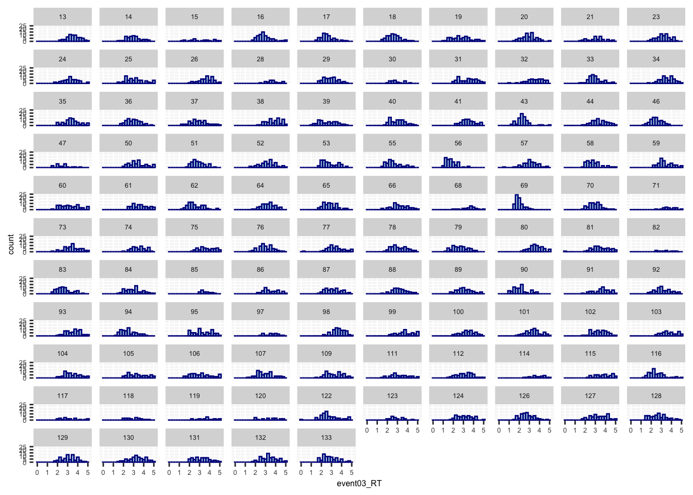
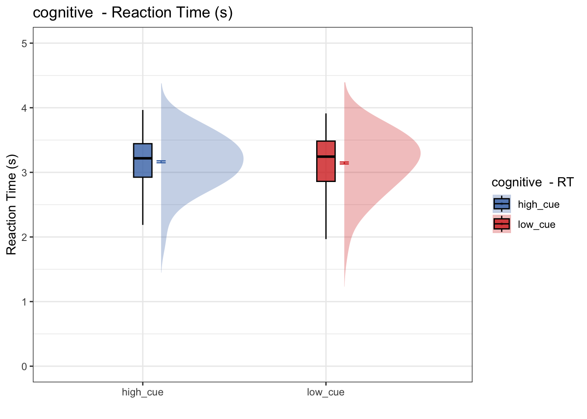
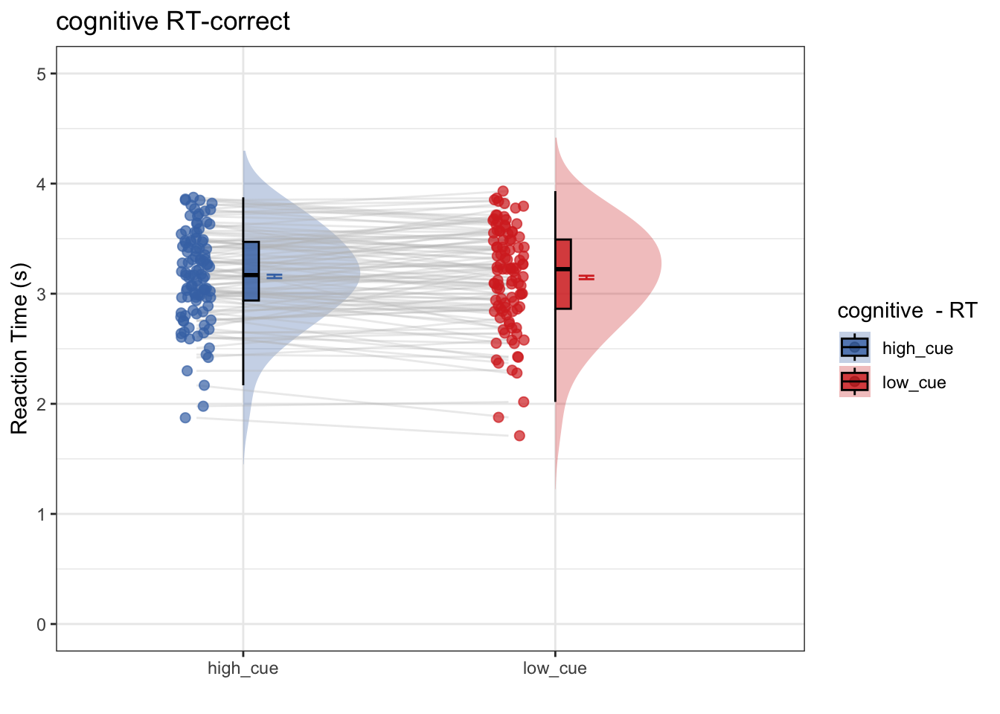
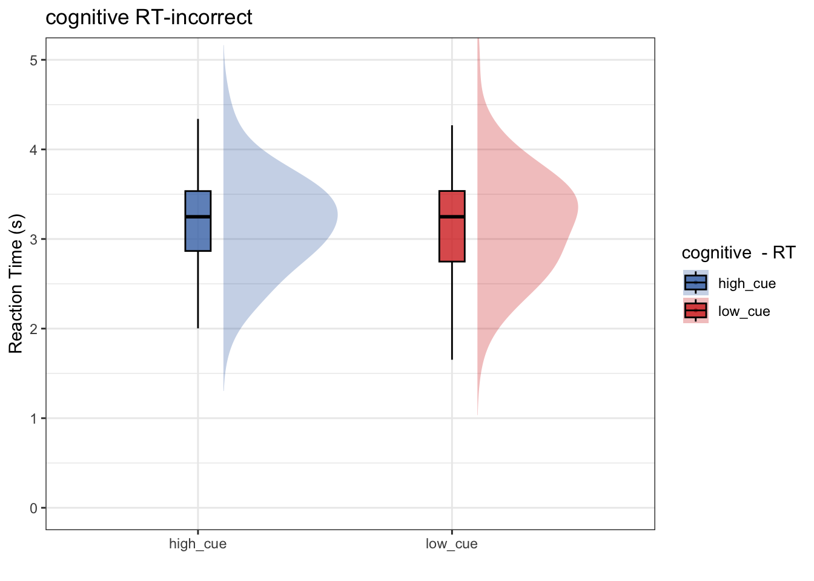
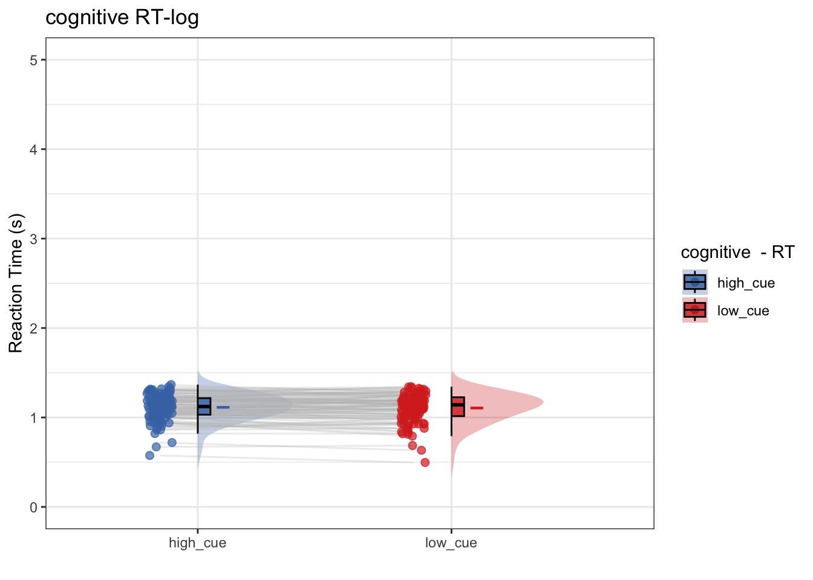

# RT ~ cue {#ch07_RT-cue}

""" 
This Rmarkdown tests the cue effect (high vs. low) on Reaction time and performance in the cogntive, mental-rotation tasks
"""


* left = diff, right = same
* model 1: Does RT differ as a function of cue type?
* model 1-1: Does RT differ as a function of cue, ONLY for the correct trials?
* model 1-2: Does RT differ as a function of cue, ONLY for the incorrect trials?
* model 2: would log-transforming help? Do we see a cue effect on the log-transformmed RTs?


### parameters


### 1) plot RT data

```r
# parameters _____________________________________ # nolint
subject_varkey <- "src_subject_id"
iv <- "param_cue_type"
dv <- "event03_RT"
dv_keyword <- "RT"
xlab <- ""
taskname <- "cognitive"
ylab <- "ratings (degree)"
subject <- "subject"
exclude <- "sub-0999|sub-0001|sub-0002|sub-0003|sub-0004|sub-0005|sub-0006|sub-0007|sub-0008|sub-0009|sub-0010|sub-0011"

data <- load_task_social_df(datadir, taskname = taskname, subject_varkey = subject_varkey, iv = iv,  exclude = exclude)
data$event03_RT <- data$event03_stimulusC_reseponseonset - data$event03_stimulus_displayonset
```


### plot RT distribution per participant
- the purpose is to identify whether RTs are distributed from 0-5 sec or not

```r
ggplot(data,aes(x=event03_RT, group = subject)) +
  geom_histogram(color="darkblue", fill="lightblue", binwidth=0.25, bins = 20) + 
  facet_wrap(~subject, ncol = 10) + 
  theme(axis.text=element_text(size=5),text=element_text(size=6))
```

```
## Warning: Removed 591 rows containing non-finite values (`stat_bin()`).
```



* some participants may not have responded within time limit
* the button may not have registered the correct onset
* I may have to remove the RTs with 5 sec. 

---

### exclude participants with RT of 5 seconds

```r
# parameters _____________________________________ # nolint
subject_varkey <- "src_subject_id"
iv <- "param_cue_type"
dv <- "event03_RT"
dv_keyword <- "RT"
xlab <- ""
taskname <- "cognitive"

ylab <- "ratings (degree)"
subject <- "subject"
exclude <- "sub-0999|sub-0001|sub-0002|sub-0003|sub-0004|sub-0005|sub-0006|sub-0007|sub-0008|sub-0009|sub-0010|sub-0011"

# load data _____________________________________
data <- load_task_social_df(datadir, taskname = taskname, subject_varkey = subject_varkey, iv = iv, exclude = exclude)
data$event03_RT <- data$event03_stimulusC_reseponseonset - data$event03_stimulus_displayonset

analysis_dir <- file.path(main_dir, "analysis", "mixedeffect", "model05_iv-cue_dv-RT", as.character(Sys.Date()))
dir.create(analysis_dir, showWarnings = FALSE, recursive = TRUE)

data$event03_response_samediff <- mapvalues(data$event03_stimulusC_response,
                                                from = c(1, 2),
                                                to = c("diff", "same"))

data$event03_correct <- ifelse(data$event03_C_stim_match == data$event03_response_samediff, 1, ifelse(data$event03_C_stim_match != data$event03_response_samediff, 0, "NA"))
```

## model 1: 
* plotting all of the code
* Does RT differ as a function of high vs. low cue?
* conclusion: No. RT does not differ as a function of cue

```r
# parameters ________________________________
subject_varkey <- "src_subject_id"
iv <- "param_cue_type"
dv <- "event03_RT"
dv_keyword <- "RT"
xlab <- ""
taskname <- "cognitive"
ylim = c(0,5)
    
# lmer filename ________________________________
model_savefname <- file.path(
        analysis_dir,
        paste("lmer_task-", taskname,
            "_rating-", dv_keyword,
            "_", as.character(Sys.Date()), ".txt",
            sep = ""
        )
    )

# removing NA values ________________________________
data_clean = data[!is.na(data$event03_correct),]
data_clean$subject = factor(data_clean$src_subject_id)

# lmer model ________________________________
sink(model_savefname)
model_onefactor <- lmer(event03_RT ~ param_cue_type + (1 | subject), data = data_clean)
summary(model_onefactor)
```

```
## Linear mixed model fit by REML. t-tests use Satterthwaite's method [
## lmerModLmerTest]
## Formula: event03_RT ~ param_cue_type + (1 | subject)
##    Data: data_clean
## 
## REML criterion at convergence: 14209.8
## 
## Scaled residuals: 
##     Min      1Q  Median      3Q     Max 
## -4.6862 -0.7107 -0.0840  0.6761  3.4733 
## 
## Random effects:
##  Groups   Name        Variance Std.Dev.
##  subject  (Intercept) 0.1642   0.4052  
##  Residual             0.5533   0.7439  
## Number of obs: 6189, groups:  subject, 105
## 
## Fixed effects:
##                         Estimate Std. Error         df t value Pr(>|t|)    
## (Intercept)              3.16779    0.04193  115.61558  75.552   <2e-16 ***
## param_cue_typelow_cue   -0.03041    0.01892 6084.64140  -1.607    0.108    
## ---
## Signif. codes:  0 '***' 0.001 '**' 0.01 '*' 0.05 '.' 0.1 ' ' 1
## 
## Correlation of Fixed Effects:
##             (Intr)
## prm_c_typl_ -0.225
```

```r
sink()


fixEffect <- as.data.frame(fixef(model_onefactor))
randEffect <- as.data.frame(ranef(model_onefactor))
cooksd <- cooks.distance(model_onefactor)
influential <- as.numeric(names(cooksd)[
    (cooksd > (4 / as.numeric(length(unique(data_clean$subject)))))])
data_screen <- data_clean[-influential, ]

# summary statistics for plots ________________________________
subjectwise <- meanSummary(data_screen, c(subject, iv), dv)
groupwise <- summarySEwithin(
        data = subjectwise,
        measurevar = "mean_per_sub", # variable created from above
        withinvars = c(iv), # iv
        idvar = "subject"
    )
```

```
## Automatically converting the following non-factors to factors: param_cue_type
```

```r
subjectwise_mean <- "mean_per_sub";    group_mean <- "mean_per_sub_norm_mean"
se <- "se";    subject <- "subject"
ggtitle <- paste(taskname, " - Reaction Time (s)");    title <- paste(taskname, " - RT")
xlab <- "";    ylab <- "Reaction Time (s)";    
w = 5; h = 3; dv_keyword <- "RT"
if (any(startsWith(dv_keyword, c("expect", "Expect")))) {
        color <- c("#1B9E77", "#D95F02")
    } else {
        color <- c("#4575B4", "#D73027")
    }
plot_savefname <- file.path(
        analysis_dir,
        paste("raincloud_task-", taskname,
            "_dv-", dv_keyword,
            "_", as.character(Sys.Date()), ".png",
            sep = ""
        )
    )
plot_rainclouds_onefactor(
        subjectwise, groupwise,
        iv, subjectwise_mean, group_mean, se, subject,
        ggtitle, title, xlab, ylab, task_name, ylim,
        w, h, dv_keyword, color, plot_savefname
    )
```

```
## Warning in geom_line(data = subjectwise, aes(group = .data[[subject]], y
## = .data[[subjectwise_mean]], : Ignoring unknown aesthetics: fill
```

```
## Warning in FUN(X[[i]], ...): NAs introduced by coercion

## Warning in FUN(X[[i]], ...): NAs introduced by coercion
```

```
## Warning in min(x): no non-missing arguments to min; returning Inf
```

```
## Warning in max(x): no non-missing arguments to max; returning -Inf
```

```
## Warning: Using the `size` aesthietic with geom_polygon was deprecated in ggplot2 3.4.0.
## ℹ Please use the `linewidth` aesthetic instead.
```

```
## Warning: Removed 210 rows containing missing values (`geom_line()`).
```

```
## Warning: Removed 210 rows containing missing values (`geom_point()`).
```

```
## Warning in FUN(X[[i]], ...): NAs introduced by coercion

## Warning in FUN(X[[i]], ...): NAs introduced by coercion
```

```
## Warning in min(x): no non-missing arguments to min; returning Inf
```

```
## Warning in max(x): no non-missing arguments to max; returning -Inf
```

```
## Warning: Removed 210 rows containing missing values (`geom_line()`).
```

```
## Warning: Removed 210 rows containing missing values (`geom_point()`).
```



```r
# random effects ________________________________
randEffect <- as.data.frame(ranef(model_onefactor))
fixEffect <- as.data.frame(fixef(model_onefactor))
randEffect$newcoef <- mapvalues(randEffect$term,
    from = c("(Intercept)", 
             "param_cue_typelow_cue"
             ),
    to = c("rand_intercept", "rand_cue")
)
```

```
## The following `from` values were not present in `x`: param_cue_typelow_cue
```

```r
rand_subset <- subset(randEffect, select = -c(grpvar, term, condsd))
wide_rand <- spread(rand_subset, key = newcoef, value = condval)

wide_fix <- do.call(
    "rbind",
    replicate(nrow(wide_rand),
        as.data.frame(t(as.matrix(fixEffect))),
        simplify = FALSE
    )
)
rownames(wide_fix) <- NULL
new_wide_fix <- dplyr::rename(wide_fix,
    fix_intercept = `(Intercept)`,
    fix_cue = `param_cue_typelow_cue`,
)

total <- cbind(wide_rand, new_wide_fix)
total$task <- taskname
new_total <- total %>% dplyr::select(task, everything())
new_total <- dplyr::rename(total, subj = grp)

rand_savefname <- file.path(
    analysis_dir,
    paste("randeffect_task-", taskname, "_",
        as.character(Sys.Date()), "_outlier-cooksd.csv",
        sep = ""
    )
)
write.csv(new_total, rand_savefname, row.names = FALSE)
```


## model 1-1
* omitting code (identical to model 1, except for subsetting correct trials)
* Only using correct trials, does RT differ as a function of high vs. low cue? 
* conclusion 1-1: No. Even within the subset of correct trials, RT does not differ as a function of cue

```
## Linear mixed model fit by REML. t-tests use Satterthwaite's method [
## lmerModLmerTest]
## Formula: event03_RT ~ param_cue_type + (1 | subject)
##    Data: data_c
## 
## REML criterion at convergence: 11663.2
## 
## Scaled residuals: 
##     Min      1Q  Median      3Q     Max 
## -4.7110 -0.7072 -0.0918  0.6810  3.5074 
## 
## Random effects:
##  Groups   Name        Variance Std.Dev.
##  subject  (Intercept) 0.1665   0.4080  
##  Residual             0.5528   0.7435  
## Number of obs: 5066, groups:  subject, 105
## 
## Fixed effects:
##                         Estimate Std. Error         df t value Pr(>|t|)    
## (Intercept)              3.15735    0.04278  118.28326  73.803   <2e-16 ***
## param_cue_typelow_cue   -0.02213    0.02094 4965.87720  -1.057    0.291    
## ---
## Signif. codes:  0 '***' 0.001 '**' 0.01 '*' 0.05 '.' 0.1 ' ' 1
## 
## Correlation of Fixed Effects:
##             (Intr)
## prm_c_typl_ -0.245
```

```
## Automatically converting the following non-factors to factors: param_cue_type
```

```
## Warning in geom_line(data = subjectwise, aes(group = .data[[subject]], y
## = .data[[subjectwise_mean]], : Ignoring unknown aesthetics: fill
```

```
## Warning in FUN(X[[i]], ...): NAs introduced by coercion

## Warning in FUN(X[[i]], ...): NAs introduced by coercion
```

```
## Warning in min(x): no non-missing arguments to min; returning Inf
```

```
## Warning in max(x): no non-missing arguments to max; returning -Inf
```

```
## Warning: Removed 210 rows containing missing values (`geom_line()`).
```

```
## Warning: Removed 210 rows containing missing values (`geom_point()`).
```

```
## Warning in FUN(X[[i]], ...): NAs introduced by coercion

## Warning in FUN(X[[i]], ...): NAs introduced by coercion
```

```
## Warning in min(x): no non-missing arguments to min; returning Inf
```

```
## Warning in max(x): no non-missing arguments to max; returning -Inf
```

```
## Warning: Removed 210 rows containing missing values (`geom_line()`).
```

```
## Warning: Removed 210 rows containing missing values (`geom_point()`).
```



```
## The following `from` values were not present in `x`: param_cue_typelow_cue
```


## model 1-2: 
* omitting code (identical to model 1, except for subsetting incorrect trials)
* Only using incorrect trials, does RT differ as a function of high vs. low cue? 
* conclusion 1-2: no. Even within the subset of incorrect trials, RT does not differ as a function of cue

```
## Linear mixed model fit by REML. t-tests use Satterthwaite's method [
## lmerModLmerTest]
## Formula: event03_RT ~ param_cue_type + (1 | subject)
##    Data: data_i
## 
## REML criterion at convergence: 2668
## 
## Scaled residuals: 
##     Min      1Q  Median      3Q     Max 
## -4.1263 -0.7154 -0.0559  0.6479  2.8124 
## 
## Random effects:
##  Groups   Name        Variance Std.Dev.
##  subject  (Intercept) 0.1518   0.3897  
##  Residual             0.5564   0.7459  
## Number of obs: 1123, groups:  subject, 103
## 
## Fixed effects:
##                         Estimate Std. Error         df t value Pr(>|t|)    
## (Intercept)              3.19726    0.05117  146.23721  62.480   <2e-16 ***
## param_cue_typelow_cue   -0.07195    0.04574 1065.34392  -1.573    0.116    
## ---
## Signif. codes:  0 '***' 0.001 '**' 0.01 '*' 0.05 '.' 0.1 ' ' 1
## 
## Correlation of Fixed Effects:
##             (Intr)
## prm_c_typl_ -0.438
```

```
## Automatically converting the following non-factors to factors: param_cue_type
```

```
## Warning in geom_line(data = subjectwise, aes(group = .data[[subject]], y
## = .data[[subjectwise_mean]], : Ignoring unknown aesthetics: fill
```

```
## Warning in FUN(X[[i]], ...): NAs introduced by coercion

## Warning in FUN(X[[i]], ...): NAs introduced by coercion
```

```
## Warning: Removed 1 rows containing non-finite values (`stat_ydensity()`).
```

```
## Warning: Removed 1 rows containing non-finite values (`stat_boxplot()`).
```

```
## Warning in min(x): no non-missing arguments to min; returning Inf
```

```
## Warning in max(x): no non-missing arguments to max; returning -Inf
```

```
## Warning: Removed 198 rows containing missing values (`geom_line()`).
```

```
## Warning: Removed 198 rows containing missing values (`geom_point()`).
```

```
## Warning in FUN(X[[i]], ...): NAs introduced by coercion

## Warning in FUN(X[[i]], ...): NAs introduced by coercion
```

```
## Warning: Removed 1 rows containing non-finite values (`stat_ydensity()`).
```

```
## Warning: Removed 1 rows containing non-finite values (`stat_boxplot()`).
```

```
## Warning in min(x): no non-missing arguments to min; returning Inf
```

```
## Warning in max(x): no non-missing arguments to max; returning -Inf
```

```
## Warning: Removed 198 rows containing missing values (`geom_line()`).
```

```
## Warning: Removed 198 rows containing missing values (`geom_point()`).
```



```
## The following `from` values were not present in `x`: param_cue_typelow_cue
```

## model 2: 
* omitting code (identical to model 1, except for log-transformming RT)
* Does log transformming help? After log-transformming RT, does RT differ as a function of high vs. low cue? 
* conclusion 2: No, log transformmed or not, there is no significant cue effect on RT

```
## Linear mixed model fit by REML. t-tests use Satterthwaite's method [
## lmerModLmerTest]
## Formula: log_RT ~ param_cue_type + (1 | subject)
##    Data: data_clean
## 
## REML criterion at convergence: 1757.4
## 
## Scaled residuals: 
##      Min       1Q   Median       3Q      Max 
## -23.2005  -0.5846   0.0388   0.6555   2.8309 
## 
## Random effects:
##  Groups   Name        Variance Std.Dev.
##  subject  (Intercept) 0.02072  0.1439  
##  Residual             0.07401  0.2720  
## Number of obs: 6189, groups:  subject, 105
## 
## Fixed effects:
##                         Estimate Std. Error         df t value Pr(>|t|)    
## (Intercept)              1.11345    0.01494  116.68888  74.519   <2e-16 ***
## param_cue_typelow_cue   -0.01130    0.00692 6085.09207  -1.633    0.103    
## ---
## Signif. codes:  0 '***' 0.001 '**' 0.01 '*' 0.05 '.' 0.1 ' ' 1
## 
## Correlation of Fixed Effects:
##             (Intr)
## prm_c_typl_ -0.231
```

```
## Automatically converting the following non-factors to factors: param_cue_type
```

```
## Warning in geom_line(data = subjectwise, aes(group = .data[[subject]], y
## = .data[[subjectwise_mean]], : Ignoring unknown aesthetics: fill
```

```
## Warning in FUN(X[[i]], ...): NAs introduced by coercion

## Warning in FUN(X[[i]], ...): NAs introduced by coercion
```

```
## Warning in min(x): no non-missing arguments to min; returning Inf
```

```
## Warning in max(x): no non-missing arguments to max; returning -Inf
```

```
## Warning: Removed 210 rows containing missing values (`geom_line()`).
```

```
## Warning: Removed 210 rows containing missing values (`geom_point()`).
```

```
## Warning in FUN(X[[i]], ...): NAs introduced by coercion

## Warning in FUN(X[[i]], ...): NAs introduced by coercion
```

```
## Warning in min(x): no non-missing arguments to min; returning Inf
```

```
## Warning in max(x): no non-missing arguments to max; returning -Inf
```

```
## Warning: Removed 210 rows containing missing values (`geom_line()`).
```

```
## Warning: Removed 210 rows containing missing values (`geom_point()`).
```



```
## The following `from` values were not present in `x`: param_cue_typelow_cue
```

