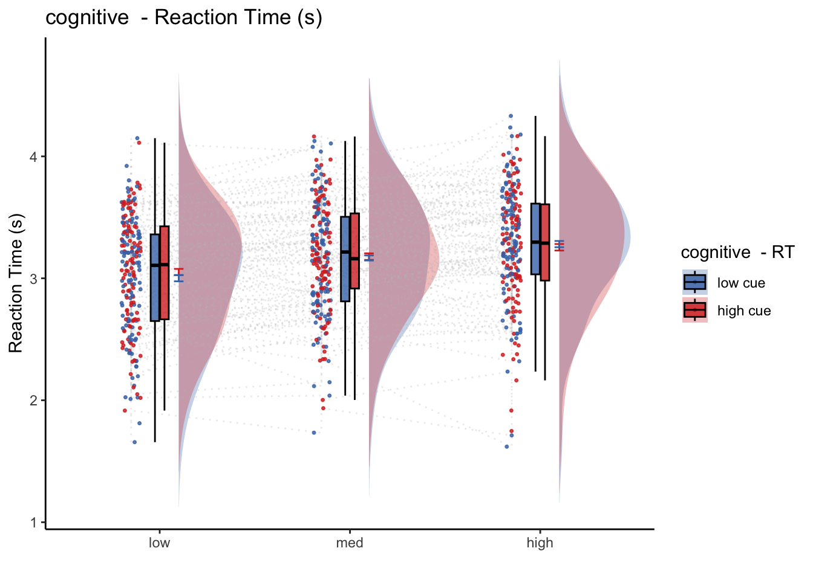
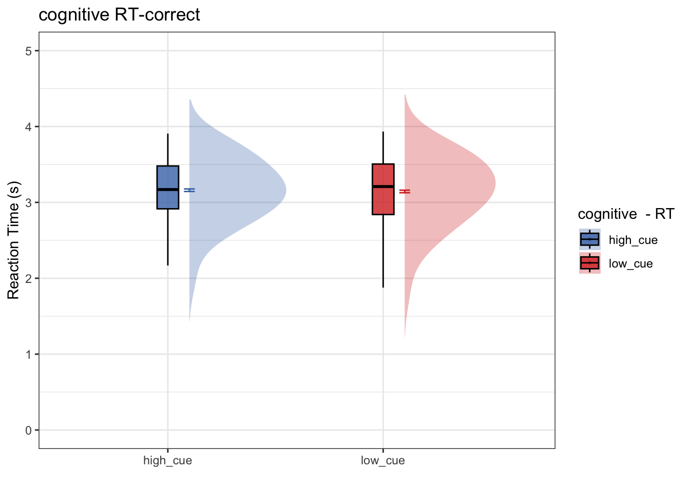
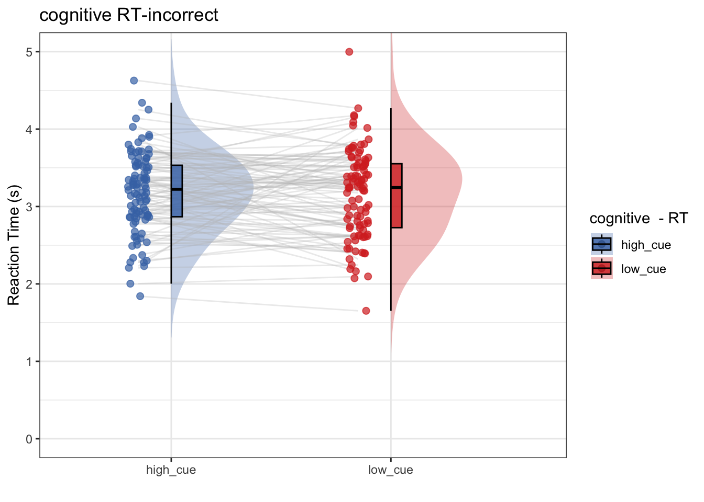

# [beh] RT ~ cue * stim {#ch08_RT-cueXstim}

```
author: "Heejung Jung"
date: '06/27/2022'
output:
  html_document:
    toc: true
    theme: united
    code_folding: hide
editor_options: 
  markdown: 
    wrap: 72
```


""" 
This Rmarkdown tests the cue effect (high vs. low) on Reaction time and performance in the cognitive, mental-rotation tasks. We also test for stimulus intensity effects.
"""

## Overview model 05 iv-cue dv-RT summary
* left = diff, right = same
* model 1: Does RT differ as a function of cue type and stimulut intensity?
* model 1-1: Does RT differ as a function of cue, ONLY for the correct trials?
* model 1-2: Does RT differ as a function of cue, ONLY for the incorrect trials?
* model 2: would log-transforming help? Do we see a cue effect on the log-transformmed RTs?

\BeginKnitrBlock{rmdnote}<div class="rmdnote">TODO: 06/28/2022   
* change variable names and two factor code accordingly</div>\EndKnitrBlock{rmdnote}


```r
main_dir = dirname(dirname(getwd()))
print(main_dir)
```

```
## [1] "/Users/h/Dropbox (Dartmouth College)/projects_dropbox/social_influence_analysis"
```

```r
datadir = file.path(main_dir, 'data', 'beh', 'beh02_preproc')
```

## Prepare data and preprocess
### 1) load data  {.unlisted .unnumbered}

```r
# parameters _____________________________________ # nolint
subject_varkey <- "src_subject_id"
iv <- "param_cue_type"
dv <- "event03_RT"
dv_keyword <- "RT"
xlab <- ""
taskname <- "cognitive"
ylab <- "ratings (degree)"
subject <- "subject"
exclude <- "sub-0999|sub-0001"
data <- load_task_social_df(datadir, taskname = taskname, 
                            subject_varkey = subject_varkey, 
                            iv = iv, exclude = exclude)
data$event03_RT <- data$event03_stimulusC_reseponseonset - data$event03_stimulus_displayonset
```

### 2) plot RT distribution per participant  {.unlisted .unnumbered}
- the purpose is to identify whether RTs are distributed from 0-5 sec or not
- From this, we can also identify the quality of the data and determine if we need to scrub or remove participants. 

```r
ggplot(data,aes(x=event03_RT, group = subject)) +
  geom_histogram(color="darkblue", fill="lightblue", binwidth=0.25, bins = 20) + 
  facet_wrap(~subject, ncol = 10) + 
  theme(axis.text=element_text(size=5),text=element_text(size=6))
```

```
## Warning: Removed 593 rows containing non-finite values (`stat_bin()`).
```


* Some participants may not have responded within time limit.
* The button may not have registered the correct onset
* I may have to remove the RTs with 5 sec. 

---

### 3) exclude participants with RT of 5 seconds  {.unlisted .unnumbered}


## model 1: 
* IV: cue (high vs. low)
* DV: RT of the incorrect trials
* contrast code two factors -- stimulus intensity and cue type
* plotting all trials (including correct and incorrect trials)


```
## 
## Attaching package: 'equatiomatic'
```

```
## The following object is masked from 'package:merTools':
## 
##     hsb
```

```
## 
## Attaching package: 'raincloudplots'
```

```
## The following object is masked _by_ '.GlobalEnv':
## 
##     GeomFlatViolin
```



\BeginKnitrBlock{rmdnote}<div class="rmdnote">Model 1 Interim summary
* Research question: Does RT differ as a function of high vs. low cue?
* Conclusion: No. RT does not differ as a function of cue
* Next step: It's interesting that there is no cue effect on RT, while the cue effect on ratings are robust. We see if this effect is potentially present in only certain type of trials, namely the correct vs. incorrect trials of the mental rotation task</div>\EndKnitrBlock{rmdnote}

## model 1-1
* IV: 
    * cue (high vs. low)
    * stimulus intensity (high vs. medium vs. low)
* DV: RT of the correct trials
* Subsetting trials (identical to model 1, except for subsetting correct trials)

```r
# parameters ___________________________________________________________________
subject_varkey <- "src_subject_id"
iv <- "param_cue_type"
dv <- "event03_RT"
dv_keyword <- "RT-correct"
xlab <- ""
taskname <- "cognitive"
ylim = c(0,5)
    
# lmer filename ________________________________________________________________
model_savefname <- file.path(
        analysis_dir,
        paste("lmer_task-", taskname,"_iv-", iv_keyword,
            "_dv-", dv_keyword,
            "_", as.character(Sys.Date()), ".txt",
            sep = ""
        )
    )

# removing NA values ___________________________________________________________

data_clean = data[!is.na(data$event03_correct),]
data_c = data[data_clean$event03_correct == 1,]
data_c$subject = factor(data_c$src_subject_id)

# lmer model ___________________________________________________________________
# cooksd <- lmer_twofactor_cooksd_fix(data = data_clean,
#                                      taskname = "cognitive",
#                                      iv = "cue",
#                                      stim_con1 = "stim_con_linear",
#                                      stim_con2 = "stim_con_quad",
#                                      dv = "event03_RT",
#                                      subject = "src_subject_id",
#                                      dv_keyword = "RT",
#                                      model_savefname = model_savefname,
#                                      effects = "random_intercept")
# influential <- as.numeric(names(cooksd)[
#     (cooksd > (4 / as.numeric(length(unique(data_c$subject)))))])
# data_screen <- data_c[-influential, ]


# lmer model ___________________________________________________________________
model_onefactor_correct <- lmer(event03_RT ~ cue_factor*stim_con_linear + cue_factor*stim_con_quad + (1 | src_subject_id), data = data_c)
fixEffect <- as.data.frame(fixef(model_onefactor_correct))
randEffect <- as.data.frame(ranef(model_onefactor_correct))
cooksd <- cooks.distance(model_onefactor_correct)
influential <- as.numeric(names(cooksd)[
    (cooksd > (4 / as.numeric(length(unique(data_c$subject)))))])
data_screen <- data_c[-influential, ]
equatiomatic::extract_eq(model_onefactor_correct)
```

$$
\begin{aligned}
  \operatorname{event03\_RT}_{i}  &\sim N \left(\mu, \sigma^2 \right) \\
    \mu &=\alpha_{j[i]} + \beta_{1}(\operatorname{cue\_factor}_{\operatorname{low\_cue}}) + \beta_{2}(\operatorname{stim\_con\_linear}) + \beta_{3}(\operatorname{stim\_con\_quad}) + \beta_{4}(\operatorname{cue\_factor}_{\operatorname{low\_cue}} \times \operatorname{stim\_con\_linear}) + \beta_{5}(\operatorname{cue\_factor}_{\operatorname{low\_cue}} \times \operatorname{stim\_con\_quad}) \\
    \alpha_{j}  &\sim N \left(\mu_{\alpha_{j}}, \sigma^2_{\alpha_{j}} \right)
    \text{, for src\_subject\_id j = 1,} \dots \text{,J}
\end{aligned}
$$

```r
# summary statistics for plots _________________________________________________
subjectwise <- meanSummary(data_screen, c(subject, iv), dv)
groupwise <- summarySEwithin(
        data = subjectwise,
        measurevar = "mean_per_sub", # variable created from above
        withinvars = c(iv), # iv
        idvar = "subject"
    )
```

```
## Automatically converting the following non-factors to factors: param_cue_type
```

```r
subjectwise_mean <- "mean_per_sub";    group_mean <- "mean_per_sub_norm_mean"
se <- "se";    subject <- "subject"
ggtitle <- paste(taskname, dv_keyword);    title <- paste(taskname, " - RT")
xlab <- "";    ylab <- "Reaction Time (s)";    
w = 5; h = 3; 
if (any(startsWith(dv_keyword, c("expect", "Expect")))) {
        color <- c("#1B9E77", "#D95F02")
    } else {
        color <- c("#4575B4", "#D73027")
    }
plot_savefname <- file.path(
        analysis_dir,
        paste("raincloud_task-", taskname,
            "_iv-", iv_keyword,"_dv-", dv_keyword,
            "_", as.character(Sys.Date()), ".png",
            sep = ""
        )
    )
plot_halfrainclouds_onefactor(
        subjectwise, groupwise,
        iv, subjectwise_mean, group_mean, se, subject,
        ggtitle, title, xlab, ylab, task_name, ylim,
        w, h, dv_keyword, color, plot_savefname
    )
```

```
## Warning in geom_line(data = subjectwise, aes(group = .data[[subject]], x =
## as.numeric(as.factor(.data[[iv]])) - : Ignoring unknown aesthetics: fill
```



```r
# save random effects for individual difference analysis _______________________
randEffect$newcoef <- mapvalues(randEffect$term,
    from = c("(Intercept)"),
    to = c("rand_intercept")
)
rand_subset <- subset(randEffect, select = -c(grpvar, term, condsd))
wide_rand <- spread(rand_subset, key = newcoef, value = condval)

wide_fix <- do.call(
    "rbind",
    replicate(nrow(wide_rand),
        as.data.frame(t(as.matrix(fixEffect))),
        simplify = FALSE
    )
)

rownames(wide_fix) <- NULL
new_wide_fix <- dplyr::rename(wide_fix,
    fix_intercept = `(Intercept)`,
    fix_cue = `cue_factorlow_cue`,
)

total <- cbind(wide_rand, new_wide_fix)
total$task <- taskname
new_total <- total %>% dplyr::select(task, everything())
new_total <- dplyr::rename(total, subj = grp)

rand_savefname <- file.path(
    analysis_dir,
    paste("randeffect_task-", taskname, 
          "_iv-", iv_keyword,"_dv-", dv_keyword,
        "_", as.character(Sys.Date()), "_outlier-cooksd.csv",
        sep = ""
    )
)
write.csv(new_total, rand_savefname, row.names = FALSE)
```

\BeginKnitrBlock{rmdnote}<div class="rmdnote">Model 1-1 Interim summary (correct trials)

* Research question: Only using correct trials, does RT differ as a function of high vs. low cue? 
* Conclusion: No. Even within the subset of correct trials, RT does not differ as a function of cue.
* Next step: Is there a cue effect on RT, only for the incorrect trials? Perhaps the cue had an effect on one's expectation, and the mismatch of thee cues led to incorrect performance, reflected in the RTs</div>\EndKnitrBlock{rmdnote}

## model 1-2: 
* IV: cue (high vs. low)
* DV: RT of the incorrect trials
* Subsetting trials (identical to model 1, except for subsetting incorrect trials)

```r
# parameters ___________________________________________________________________
subject_varkey <- "src_subject_id"
iv <- "param_cue_type"
dv <- "event03_RT"
dv_keyword <- "RT-incorrect"
xlab <- ""
taskname <- "cognitive"
ylim = c(0,5)
    
# lmer filename ________________________________________________________________
model_savefname <- file.path(
        analysis_dir,
        paste("lmer_task-", taskname,"_iv-", iv_keyword,
            "_dv-", dv_keyword,
            "_", as.character(Sys.Date()), ".txt",
            sep = ""
        )
    )

# removing NA values ___________________________________________________________

data_clean = data[!is.na(data$event03_correct),]
data_i = data[data_clean$event03_correct == 0,]
data_i$subject = factor(data_i$src_subject_id)

# lmer model ___________________________________________________________________
model_onefactor_incorrect <- lmer(event03_RT ~ cue_factor*stim_con_linear + cue_factor*stim_con_quad + (1 | src_subject_id), data = data_i)
fixEffect <- as.data.frame(fixef(model_onefactor_incorrect))
randEffect <- as.data.frame(ranef(model_onefactor_incorrect))
cooksd <- cooks.distance(model_onefactor_incorrect)
influential <- as.numeric(names(cooksd)[
    (cooksd > (4 / as.numeric(length(unique(data_i$subject)))))])
data_screen_i <- data_i[-influential, ]
equatiomatic::extract_eq(model_onefactor_incorrect)
```

$$
\begin{aligned}
  \operatorname{event03\_RT}_{i}  &\sim N \left(\mu, \sigma^2 \right) \\
    \mu &=\alpha_{j[i]} + \beta_{1}(\operatorname{cue\_factor}_{\operatorname{low\_cue}}) + \beta_{2}(\operatorname{stim\_con\_linear}) + \beta_{3}(\operatorname{stim\_con\_quad}) + \beta_{4}(\operatorname{cue\_factor}_{\operatorname{low\_cue}} \times \operatorname{stim\_con\_linear}) + \beta_{5}(\operatorname{cue\_factor}_{\operatorname{low\_cue}} \times \operatorname{stim\_con\_quad}) \\
    \alpha_{j}  &\sim N \left(\mu_{\alpha_{j}}, \sigma^2_{\alpha_{j}} \right)
    \text{, for src\_subject\_id j = 1,} \dots \text{,J}
\end{aligned}
$$

```r
# summary statistics for plots _________________________________________________
subjectwise <- meanSummary(data_screen_i, c(subject, iv), dv)
groupwise <- summarySEwithin(
        data = subjectwise,
        measurevar = "mean_per_sub", # variable created from above
        withinvars = c(iv), # iv
        idvar = "subject"
    )
```

```
## Automatically converting the following non-factors to factors: param_cue_type
```

```r
subjectwise_mean <- "mean_per_sub";    group_mean <- "mean_per_sub_norm_mean"
se <- "se";    subject <- "subject"
ggtitle <- paste(taskname, dv_keyword);    title <- paste(taskname, " - RT")
xlab <- "";    ylab <- "Reaction Time (s)";    
w = 5; h = 3; 
if (any(startsWith(dv_keyword, c("expect", "Expect")))) {
        color <- c("#1B9E77", "#D95F02")
    } else {
        color <- c("#4575B4", "#D73027")
    }
plot_savefname <- file.path(
        analysis_dir,
        paste("raincloud_task-", taskname,
            "_iv-", iv_keyword,"_dv-", dv_keyword,
            "_", as.character(Sys.Date()), ".png",
            sep = ""
        )
    )
plot_halfrainclouds_onefactor(
        subjectwise, groupwise,
        iv, subjectwise_mean, group_mean, se, subject,
        ggtitle, title, xlab, ylab, task_name, ylim,
        w, h, dv_keyword, color, plot_savefname
    )
```

```
## Warning in geom_line(data = subjectwise, aes(group = .data[[subject]], x =
## as.numeric(as.factor(.data[[iv]])) - : Ignoring unknown aesthetics: fill
```

```
## Warning: Removed 1 rows containing non-finite values (`stat_half_ydensity()`).
```

```
## Warning: Removed 1 rows containing non-finite values (`stat_boxplot()`).
```

```
## Warning: Removed 1 row containing missing values (`geom_line()`).
```

```
## Warning: Removed 1 rows containing missing values (`geom_point()`).
```

```
## Warning: Removed 1 rows containing non-finite values (`stat_half_ydensity()`).
```

```
## Warning: Removed 1 rows containing non-finite values (`stat_boxplot()`).
```

```
## Warning: Removed 1 row containing missing values (`geom_line()`).
```

```
## Warning: Removed 1 rows containing missing values (`geom_point()`).
```



```r
# save random effects for individual difference analysis _______________________
randEffect$newcoef <- mapvalues(randEffect$term,
    from = c("(Intercept)"),
    to = c("rand_intercept")
)

rand_subset <- subset(randEffect, select = -c(grpvar, term, condsd))
wide_rand <- spread(rand_subset, key = newcoef, value = condval)

wide_fix <- do.call(
    "rbind",
    replicate(nrow(wide_rand),
        as.data.frame(t(as.matrix(fixEffect))),
        simplify = FALSE
    )
)
rownames(wide_fix) <- NULL
new_wide_fix <- dplyr::rename(wide_fix,
    fix_intercept = `(Intercept)`,
    fix_cue = `cue_factorlow_cue`,
)

total <- cbind(wide_rand, new_wide_fix)
total$task <- taskname
new_total <- total %>% dplyr::select(task, everything())
new_total <- dplyr::rename(total, subj = grp)

rand_savefname <- file.path(
    analysis_dir,
    paste("randeffect_task-", taskname, "_iv-", iv_keyword,"_dv-", dv_keyword,
            "_",as.character(Sys.Date()), "_outlier-cooksd.csv",
        sep = ""
    )
)
write.csv(new_total, rand_savefname, row.names = FALSE)
```

\BeginKnitrBlock{rmdnote}<div class="rmdnote">Model 1-2 Interim summary (incorrect trials)
* Research question: Only using incorrect trials, does RT differ as a function of high vs. low cue? 
* Conclusion: No. Even within the subset of incorrect trials, RT does not differ as a function of cue
* Next step: Reaction times are data points that are non-normal; mostly a skewed distribution. In order to deal with this skewness, we log-transform the data and investigate the same question, whether the cues have a signficant effect on reaction times. </div>\EndKnitrBlock{rmdnote}

## model 2: Log transformation
* IV: cue (high vs. low)
* DV: log-transformmed RT


```r
# parameters ___________________________________________________________________
subject_varkey <- "src_subject_id"
iv <- "cue_factor"
dv <- "log_RT"
dv_keyword <- "RT-log"
xlab <- ""
taskname <- "cognitive"
ylim = c(0,5)
    
# lmer filename ________________________________________________________________
model_savefname <- file.path(
        analysis_dir,
        paste("lmer_task-", taskname,"_iv-", iv_keyword,
            "_dv-", dv_keyword, as.character(Sys.Date()), ".txt",
            sep = ""
        )
    )

# removing NA values ___________________________________________________________
data_clean = data[!is.na(data$event03_correct),]
data_clean$log_RT = log(data_clean$event03_RT)
data_clean$subject = factor(data_clean$src_subject_id)

# lmer model ___________________________________________________________________
model_onefactor_log <- lmer(log_RT ~ cue_factor + (1 | subject), data = data_clean)
summary(model_onefactor_log)
```

```
## Linear mixed model fit by REML. t-tests use Satterthwaite's method [
## lmerModLmerTest]
## Formula: log_RT ~ cue_factor + (1 | subject)
##    Data: data_clean
## 
## REML criterion at convergence: 1757.4
## 
## Scaled residuals: 
##      Min       1Q   Median       3Q      Max 
## -23.2005  -0.5846   0.0388   0.6555   2.8309 
## 
## Random effects:
##  Groups   Name        Variance Std.Dev.
##  subject  (Intercept) 0.02072  0.1439  
##  Residual             0.07401  0.2720  
## Number of obs: 6189, groups:  subject, 105
## 
## Fixed effects:
##                     Estimate Std. Error         df t value Pr(>|t|)    
## (Intercept)          1.11345    0.01494  116.68888  74.519   <2e-16 ***
## cue_factorlow_cue   -0.01130    0.00692 6085.09207  -1.633    0.103    
## ---
## Signif. codes:  0 '***' 0.001 '**' 0.01 '*' 0.05 '.' 0.1 ' ' 1
## 
## Correlation of Fixed Effects:
##             (Intr)
## cu_fctrlw_c -0.231
```

```r
fixEffect <- as.data.frame(fixef(model_onefactor_log))
randEffect <- as.data.frame(ranef(model_onefactor_log))
cooksd <- cooks.distance(model_onefactor_log)
influential <- as.numeric(names(cooksd)[
    (cooksd > (4 / as.numeric(length(unique(data_clean$subject)))))])
data_screen_log <- data_clean[-influential, ]
equatiomatic::extract_eq(model_onefactor_log)
```

$$
\begin{aligned}
  \operatorname{log\_RT}_{i}  &\sim N \left(\alpha_{j[i]} + \beta_{1}(\operatorname{cue\_factor}_{\operatorname{low\_cue}}), \sigma^2 \right) \\
    \alpha_{j}  &\sim N \left(\mu_{\alpha_{j}}, \sigma^2_{\alpha_{j}} \right)
    \text{, for subject j = 1,} \dots \text{,J}
\end{aligned}
$$

```r
# summary statistics for plots _________________________________________________
subjectwise <- meanSummary(data_screen_log, c(subject, iv), dv)
groupwise <- summarySEwithin(
        data = subjectwise,
        measurevar = "mean_per_sub", # variable created from above
        withinvars = c(iv), # iv
        idvar = "subject"
    )

subjectwise_mean <- "mean_per_sub";    group_mean <- "mean_per_sub_norm_mean"
se <- "se";   
ggtitle <- paste(taskname, dv_keyword);    title <- paste(taskname, " - RT")
xlab <- "";    ylab <- "Reaction Time (s)";    
w = 5; h = 3; 
if (any(startsWith(dv_keyword, c("expect", "Expect")))) {
        color <- c("#1B9E77", "#D95F02")
    } else {
        color <- c("#4575B4", "#D73027")
    }
plot_savefname <- file.path(
        analysis_dir,
        paste("raincloud_task-", taskname,
            "_iv-", iv_keyword,"_dv-", dv_keyword,"_",
            as.character(Sys.Date()), ".png",
            sep = ""
        )
    )
plot_halfrainclouds_onefactor(
        subjectwise, groupwise,
        iv, subjectwise_mean, group_mean, se, subject,
        ggtitle, title, xlab, ylab, task_name, ylim,
        w, h, dv_keyword, color, plot_savefname
    )
```

```
## Warning in geom_line(data = subjectwise, aes(group = .data[[subject]], x =
## as.numeric(as.factor(.data[[iv]])) - : Ignoring unknown aesthetics: fill
```


```r
# save random effects for individual difference analysis _______________________
fixEffect <- as.data.frame(fixef(model_onefactor_log))
randEffect <- as.data.frame(ranef(model_onefactor_log))
randEffect$newcoef <- mapvalues(randEffect$term,
    from = c("(Intercept)"),
    to = c("rand_intercept")
)

rand_subset <- subset(randEffect, select = -c(grpvar, term, condsd))
wide_rand <- spread(rand_subset, key = newcoef, value = condval)

wide_fix <- do.call(
    "rbind",
    replicate(nrow(wide_rand),
        as.data.frame(t(as.matrix(fixEffect))),
        simplify = FALSE
    )
)
rownames(wide_fix) <- NULL
new_wide_fix <- dplyr::rename(wide_fix,
    fix_intercept = `(Intercept)`,
    fix_cue = `cue_factorlow_cue`,
)

total <- cbind(wide_rand, new_wide_fix)
total$task <- taskname
new_total <- total %>% dplyr::select(task, everything())
new_total <- dplyr::rename(total, subj = grp)

rand_savefname <- file.path(
    analysis_dir,
    paste("randeffect_task-", taskname,"_iv-", iv_keyword,"_dv-", dv_keyword,
        "_outlier-cooksd_", as.character(Sys.Date()), ".csv",
        sep = ""
    )
)


write.csv(new_total, rand_savefname, row.names = FALSE)
```

\BeginKnitrBlock{rmdnote}<div class="rmdnote">* Research question: Does log transformming help? After log-transformming RT, does RT differ as a function of high vs. low cue? 
* conclusion 2: No, log transformmed or not, there is no significant cue effect on RT</div>\EndKnitrBlock{rmdnote}

## Conclusion across model 1 and 2
* There is no substansive evidence that suggeest cue effects on reaction time. In other words, the time to respond to a rotated figure does not differ as a function of high or low cue. 
