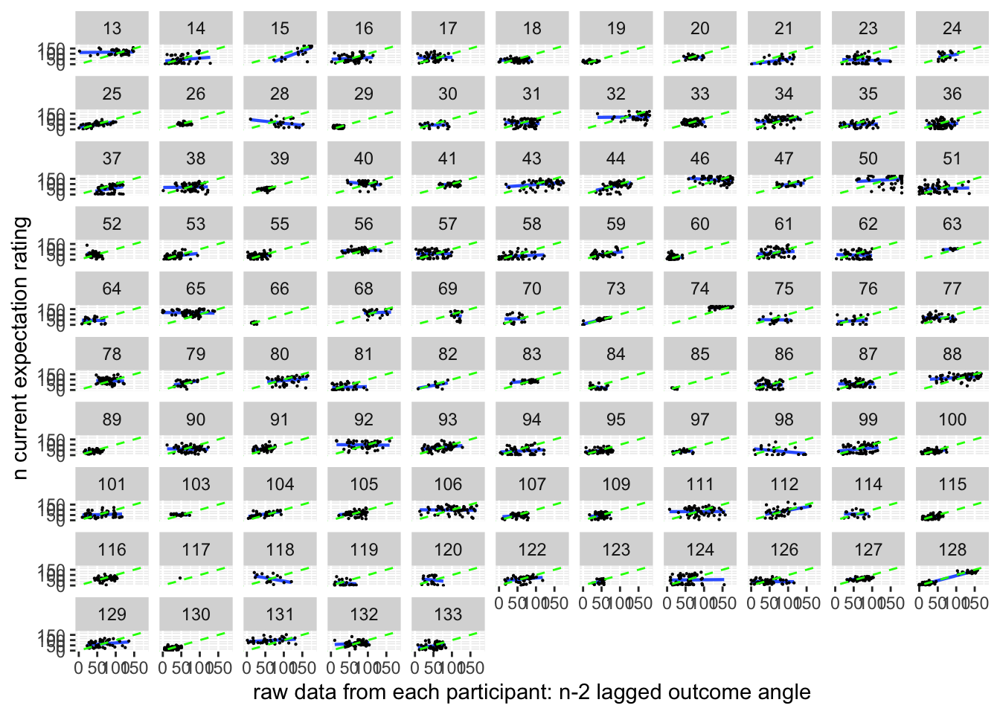
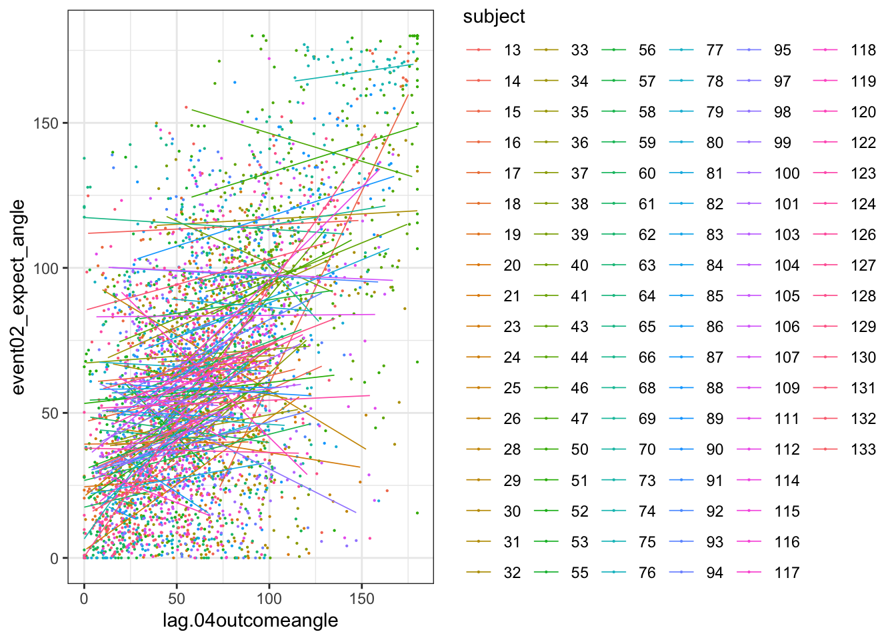
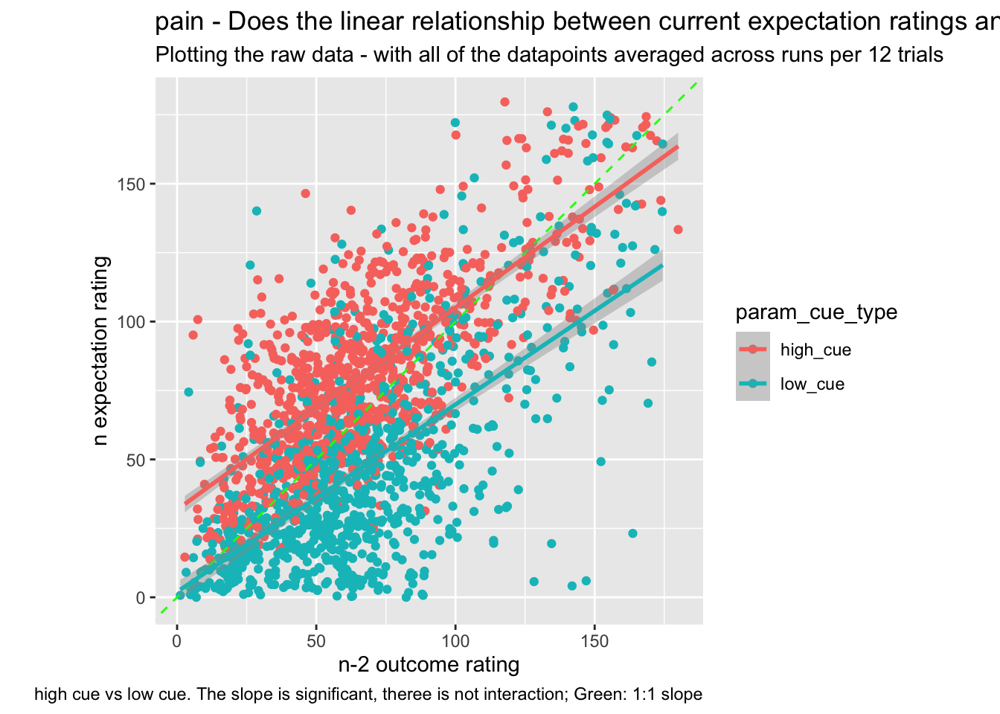
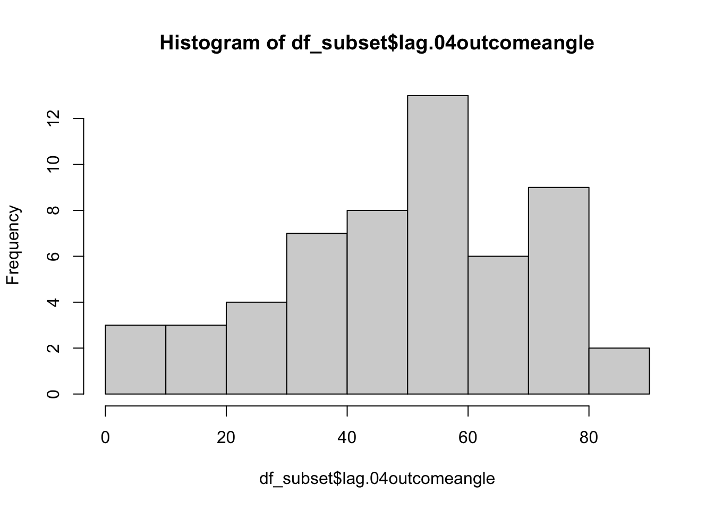
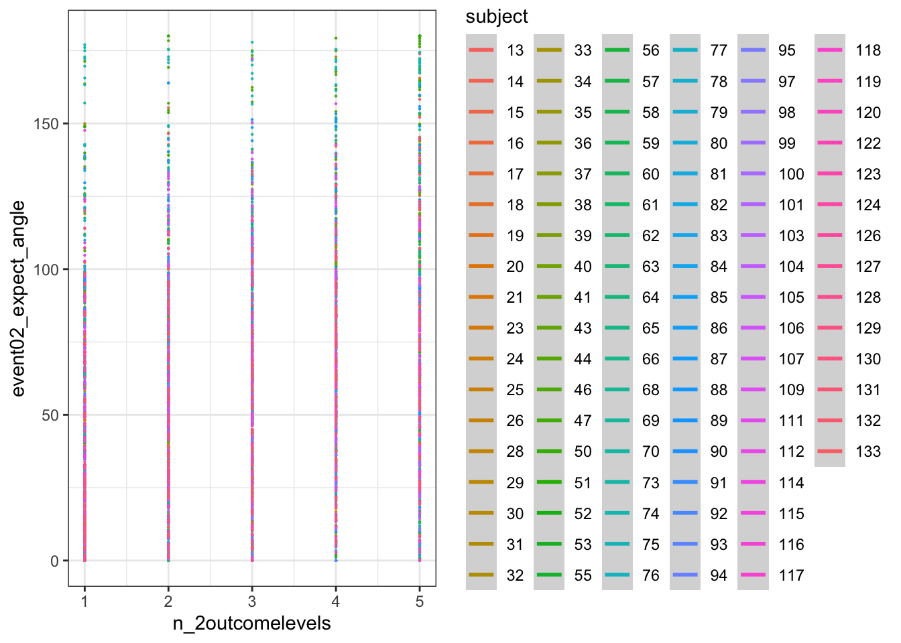
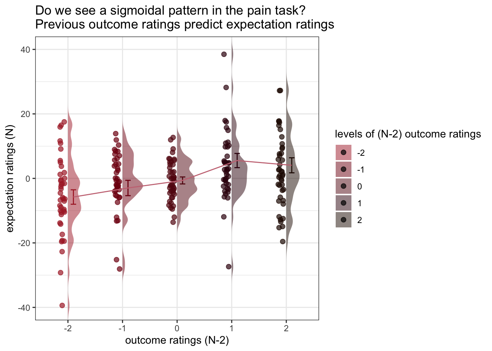

#  (N-2) shifted outcome ratings ~ (N) expectation ratings; Jayazeri (2018) {#ch12_n-1outcome}

```
title: "model12_jayazeri_N-2"
date: '2023-01-31'
updated: '2023-01-31'
```


## Overview 
My hypothesis is that the cue-expectancy follows a Bayesian mechanism, akin to what's listed in Jayazeri (2019).
Here, I plot the expectation ratings (N) and outcome ratings (N-2) and see if the pattern is similar to a sigmoidal curve. If so, I plan to dive deeper and potentially take a Bayesian approach. 

library


load data and combine participant data


```r
main_dir = dirname(dirname(getwd()))
datadir = file.path(main_dir, 'data', 'beh', 'beh02_preproc')
# parameters _____________________________________ # nolint
subject_varkey <- "src_subject_id"
iv <- "param_cue_type"
dv <- "event03_RT"
dv_keyword <- "RT"
xlab <- ""
taskname <- "pain"

ylab <- "ratings (degree)"
subject <- "subject"
exclude <- "sub-0999|sub-0001|sub-0002|sub-0003|sub-0004|sub-0005|sub-0006|sub-0007|sub-0008|sub-0009|sub-0010|sub-0011"

# load data _____________________________________
data <- load_task_social_df(datadir, taskname = taskname, subject_varkey = subject_varkey, iv = iv, exclude = exclude)
data$event03_RT <- data$event03_stimulusC_reseponseonset - data$event03_stimulus_displayonset
# data['event03_RT'], data.event03_RT - pandas
analysis_dir <- file.path(main_dir, "analysis", "mixedeffect", "model12_iv-cue-trial_dv-expectjayazer_N-2", as.character(Sys.Date()))
dir.create(analysis_dir, showWarnings = FALSE, recursive = TRUE)
```


## Do previous outcome ratings predict current expectation ratings?
### Additional analyse 01/18/2023 {.unlisted .unnumbered}
* examine if prior stimulus experience (N-2) predicts current expectation ratings
* see if current expectation ratings are explained as a function of prior outcome rating and current expectation rating

when loading the dataset, I need to add in trial index per dataframe.
Then, for the shift the rating? 

```r
data_p2= data %>%
  arrange(src_subject_id ) %>%
  group_by(src_subject_id) %>%
  mutate(trial_index = row_number())
data_a3 <- data_p2 %>% 
  group_by(src_subject_id, session_id, param_run_num) %>% 
  mutate(trial_index = row_number(param_run_num))

data_a3lag <- 
    data_a3 %>%
    group_by(src_subject_id, session_id, param_run_num) %>%
    mutate(lag.04outcomeangle = dplyr::lag(event04_actual_angle, n = 2, default = NA))
data_a3lag_omit <- data_a3lag[complete.cases(data_a3lag$lag.04outcomeangle),]
```


```r
    trialorder_subjectwise_lagoutcome <- meanSummary(
        data_a3lag_omit,
        c("src_subject_id", "session_id", "param_run_num"), "lag.04outcomeangle" )
    trialorder_subjectwise_lagoutcome <- meanSummary(
        data_a3lag_omit,
        c("src_subject_id", "session_id", "param_run_num"), "lag.04outcomeangle" )
```

```r
model.lagoutcome = lmer(event02_expect_angle ~ lag.04outcomeangle + (1 | src_subject_id) + (1|session_id) , data = data_a3lag_omit)
```

```
## boundary (singular) fit: see help('isSingular')
```

```r
summary(model.lagoutcome)
```

```
## Linear mixed model fit by REML. t-tests use Satterthwaite's method [
## lmerModLmerTest]
## Formula: event02_expect_angle ~ lag.04outcomeangle + (1 | src_subject_id) +  
##     (1 | session_id)
##    Data: data_a3lag_omit
## 
## REML criterion at convergence: 41892
## 
## Scaled residuals: 
##     Min      1Q  Median      3Q     Max 
## -4.7836 -0.6742  0.0243  0.6639  3.4522 
## 
## Random effects:
##  Groups         Name        Variance Std.Dev.
##  src_subject_id (Intercept) 522.8    22.86   
##  session_id     (Intercept)   0.0     0.00   
##  Residual                   770.0    27.75   
## Number of obs: 4381, groups:  src_subject_id, 104; session_id, 3
## 
## Fixed effects:
##                     Estimate Std. Error        df t value Pr(>|t|)    
## (Intercept)        4.753e+01  2.548e+00 1.436e+02   18.66   <2e-16 ***
## lag.04outcomeangle 2.343e-01  1.675e-02 4.294e+03   13.98   <2e-16 ***
## ---
## Signif. codes:  0 '***' 0.001 '**' 0.01 '*' 0.05 '.' 0.1 ' ' 1
## 
## Correlation of Fixed Effects:
##             (Intr)
## lg.04tcmngl -0.433
## optimizer (nloptwrap) convergence code: 0 (OK)
## boundary (singular) fit: see help('isSingular')
```


```r
meanSummary_2dv <- function(DATA, GROUP, DV1, DV2) {
    z <- ddply(DATA, GROUP, .fun = function(xx) {
        c(
            DV1_mean_per_sub = mean(xx[, DV1], na.rm = TRUE),
            DV1_sd = sd(xx[, DV1], na.rm = TRUE),
            DV2_mean_per_sub = mean(xx[, DV2], na.rm = TRUE),
            DV2_sd = sd(xx[, DV1], na.rm = TRUE)
        )
    })
    return(z)
}
```


```r
subjectwise_2dv = meanSummary_2dv(data_a3lag_omit,
        c("src_subject_id", "trial_index"), 
        "lag.04outcomeangle", "event02_expect_angle")
```


```r
subjectwise_naomit_2dv <- na.omit(subjectwise_2dv)
```


```r
sp <- ggplot(data=subjectwise_naomit_2dv, 
             aes(x=DV1_mean_per_sub, y=DV2_mean_per_sub)) + 
  geom_point() +
  geom_abline(intercept = 0, slope = 1, color="green", 
                 linetype="dashed", size=0.5) +
  theme(aspect.ratio=1) +
  xlab("n-2 outcome rating") +
  ylab("n expectation rating")
```

```
## Warning: Using `size` aesthetic for lines was deprecated in ggplot2 3.4.0.
## ℹ Please use `linewidth` instead.
```

```r
sp
```


```r
    trialorder_groupwise <- summarySEwithin(
        data = subjectwise_naomit_2dv,
        measurevar = "DV1_mean_per_sub",
        # betweenvars = "src_subject_id",
        withinvars = factor( "trial_index"),
         idvar = "src_subject_id"
    )
```

```
## Automatically converting the following non-factors to factors: src_subject_id
```


```r
    trialorder_groupwise <- summarySEwithin(
        data = subset(subjectwise_naomit_2dv, select = -c(src_subject_id)),
        measurevar = "DV1_mean_per_sub",
        # betweenvars = "src_subject_id",
        withinvars = as.factor( "trial_index")
         #idvar = "trial_index"
    )
```

```
## Automatically converting the following non-factors to factors: trial_index
```

```
## Warning in qt(conf.interval/2 + 0.5, datac$N - 1): NaNs produced

## Warning in qt(conf.interval/2 + 0.5, datac$N - 1): NaNs produced
```

```r
data_a3lag_omit$src_subject_id <- as.factor(data_a3lag_omit$src_subject_id)

lag.raw <- ggplot(aes(x=lag.04outcomeangle, y=event02_expect_angle), data=data_a3lag_omit) +
  geom_smooth(method='lm', se=F, size=0.75) +
  geom_point(size=0.1) + 
    geom_abline(intercept = 0, slope = 1, color="green", 
                 linetype="dashed", size=0.5) +
  facet_wrap(~src_subject_id) + 
  theme(legend.position='none') + 
  xlim(0,180) + ylim(0,180) +
  xlab("raw data from each participant: n-2 lagged outcome angle") + 
  ylab("n current expectation rating")
lag.raw +
  labs(title = paste(taskname, "- Is there a linear relationship between current expectation ratings and the previous outcome ratings?"),
       subtitle = "Plotting the raw data - with all of the datapoints ignoring run differences", 
       caption = "Blue = fitted linear slope per participant; Green: 1:1 slope")
```

```
## `geom_smooth()` using formula = 'y ~ x'
```

```
## Warning: Removed 202 rows containing non-finite values (`stat_smooth()`).
```

```
## Warning: Removed 202 rows containing missing values (`geom_point()`).
```


```r
lag.raw
```

```
## `geom_smooth()` using formula = 'y ~ x'
```

```
## Warning: Removed 202 rows containing non-finite values (`stat_smooth()`).
## Removed 202 rows containing missing values (`geom_point()`).
```




```r
subjectwise_naomit_2dv$src_subject_id <- as.factor(subjectwise_naomit_2dv$src_subject_id)

lag.avg <- ggplot(aes(x=DV1_mean_per_sub, y=DV2_mean_per_sub), data=subjectwise_naomit_2dv) +
  geom_smooth(method='lm', se=F, size=0.75) +
  geom_point(size=0.1) + 
    geom_abline(intercept = 0, slope = 1, color="green", 
                 linetype="dashed", size=0.5) +
  facet_wrap(~src_subject_id) + 
  theme(legend.position='none') + 
  xlim(0,180) + ylim(0,180) +
  xlab("raw data from each participant: n-2 lagged outcome angle") + 
  ylab("n current expectation rating") 

lag.avg +
  labs(title = paste(taskname, "- Is there a linear relationship between current expectation ratings and the previous outcome ratings?"),
       subtitle = "Observation notes: 1) The relationship is more of an attenuated one, where the higher outcome ratings lead to a slightly lower expectation rating, and a low outcome leads to a higher expectation rating, when considering a 1:1 relationship. This pattern could be explained by regression to the mean type mechanism, where participants are accounting for the fact that their previous experience was extreme on either ends and that this current trial will be under/over estimated. It probably will make sense to also see the relationship between current expectation ratings influencing current outcome ratings. ", 
       caption = "Blue = fitted linear slope per participant; Green: 1:1 slope")
```

```
## `geom_smooth()` using formula = 'y ~ x'
```


```r
# https://gist.github.com/even4void/5074855
```


```r
ggplot(data_a3lag_omit, aes(y = event02_expect_angle, 
                       x = lag.04outcomeangle, 
                       colour = subject), size = .3, color = 'gray') + 
  geom_point(size = .1) + 
  geom_smooth(method = 'lm', formula= y ~ x, se = FALSE, size = .3) +
  theme_bw()
```

```
## Warning: Removed 202 rows containing non-finite values (`stat_smooth()`).
```

```
## Warning: Removed 202 rows containing missing values (`geom_point()`).
```




## Do these models differ as a function of cue?
### Additional analysis 01/23/2023 {.unlisted .unnumbered}

```r
model.lag_cue = lmer(event02_expect_angle ~ lag.04outcomeangle*param_cue_type + (1 | src_subject_id) + (1|session_id) , data = data_a3lag_omit)
```

```
## boundary (singular) fit: see help('isSingular')
```

```r
summary(model.lag_cue)
```

```
## Linear mixed model fit by REML. t-tests use Satterthwaite's method [
## lmerModLmerTest]
## Formula: event02_expect_angle ~ lag.04outcomeangle * param_cue_type +  
##     (1 | src_subject_id) + (1 | session_id)
##    Data: data_a3lag_omit
## 
## REML criterion at convergence: 39852.4
## 
## Scaled residuals: 
##     Min      1Q  Median      3Q     Max 
## -5.2141 -0.6403 -0.0326  0.6247  4.6722 
## 
## Random effects:
##  Groups         Name        Variance Std.Dev.
##  src_subject_id (Intercept) 540.1    23.24   
##  session_id     (Intercept)   0.0     0.00   
##  Residual                   477.4    21.85   
## Number of obs: 4381, groups:  src_subject_id, 104; session_id, 3
## 
## Fixed effects:
##                                            Estimate Std. Error         df
## (Intercept)                               6.478e+01  2.572e+00  1.495e+02
## lag.04outcomeangle                        2.255e-01  1.631e-02  4.374e+03
## param_cue_typelow_cue                    -3.367e+01  1.346e+00  4.274e+03
## lag.04outcomeangle:param_cue_typelow_cue -3.175e-03  1.771e-02  4.274e+03
##                                          t value Pr(>|t|)    
## (Intercept)                               25.186   <2e-16 ***
## lag.04outcomeangle                        13.831   <2e-16 ***
## param_cue_typelow_cue                    -25.025   <2e-16 ***
## lag.04outcomeangle:param_cue_typelow_cue  -0.179    0.858    
## ---
## Signif. codes:  0 '***' 0.001 '**' 0.01 '*' 0.05 '.' 0.1 ' ' 1
## 
## Correlation of Fixed Effects:
##             (Intr) lg.04t prm___
## lg.04tcmngl -0.418              
## prm_c_typl_ -0.273  0.503       
## lg.04tc:___  0.243 -0.578 -0.871
## optimizer (nloptwrap) convergence code: 0 (OK)
## boundary (singular) fit: see help('isSingular')
```

```r
meanSummary_2dv <- function(DATA, GROUP, DV1, DV2) {
    z <- ddply(DATA, GROUP, .fun = function(xx) {
        c(
            DV1_mean_per_sub = mean(xx[, DV1], na.rm = TRUE),
            DV1_sd = sd(xx[, DV1], na.rm = TRUE),
            DV2_mean_per_sub = mean(xx[, DV2], na.rm = TRUE),
            DV2_sd = sd(xx[, DV1], na.rm = TRUE)
        )
    })
    return(z)
}
```


```r
subjectwise_cuetype = meanSummary_2dv(data_a3lag_omit,
        c("src_subject_id", "trial_index", "param_cue_type"), 
        "lag.04outcomeangle", "event02_expect_angle")
```


```r
subjectwise_cuetype_2dv <- na.omit(subjectwise_cuetype)
```


```r
subjectwise_cuetype$param_cue_type <- as.factor(subjectwise_cuetype$param_cue_type)
sp <- ggplot(data=subjectwise_cuetype, 
             aes(x=DV1_mean_per_sub, y=DV2_mean_per_sub,
             color = param_cue_type)) + 
  geom_point() +
  geom_abline(intercept = 0, slope = 1, color="green", 
                 linetype="dashed", size=0.5) +
  geom_smooth(method = 'lm') +
  theme(aspect.ratio=1) +
  xlab("n-2 outcome rating") +
  ylab("n expectation rating")
sp +
    labs(title = paste(taskname, "- Does the linear relationship between current expectation ratings and the previous outcome ratings differ as a function of cue?"),
       subtitle = "Plotting the raw data - with all of the datapoints averaged across runs per 12 trials", 
       caption = "high cue vs low cue. The slope is significant, theree is not interaction; Green: 1:1 slope")
```

```
## `geom_smooth()` using formula = 'y ~ x'
```

```
## Warning: Removed 29 rows containing non-finite values (`stat_smooth()`).
```

```
## Warning: Removed 29 rows containing missing values (`geom_point()`).
```



```r
# plot(subjectwise_naomit_2dv$DV1_mean_per_sub, subjectwise_naomit_2dv$DV2_mean_per_sub) + lines(x = c(0,200), y = c(0,200))
```

## Let's demean the ratings.
bin ratings
Do the bins do their jobs?
plot one run
then check the min, max and see if the quantization is done properly.
YES, it is

```r
# per subject, session, run
#das$wt_2 <- as.numeric(cut_number(das$wt,3))
df_subset = subset(data_a3lag_omit, src_subject_id == 18 )
#df_subset$lag.04outcomeangle
min(df_subset$lag.04outcomeangle)
```

```
## [1] 0
```

```r
max(df_subset$lag.04outcomeangle)
```

```
## [1] 88.7054
```

```r
range(df_subset$lag.04outcomeangle)
```

```
## [1]  0.0000 88.7054
```

```r
cut_interval(range(df_subset$lag.04outcomeangle), n = 5)
```

```
## [1] [0,17.7]  (71,88.7]
## Levels: [0,17.7] (17.7,35.5] (35.5,53.2] (53.2,71] (71,88.7]
```

```r
hist(df_subset$lag.04outcomeangle)
```



```r
# hist(c(121.39691, 102.30392,  89.30972,  92.07837, 121.51694, 148.16579, 122.95297 ,126.36490 ,123.69007 , 51.34019,  36.86990))
df_subset$bin = cut_interval(df_subset$lag.04outcomeangle, n = 5)
df_subset$bin_num = as.numeric(cut_interval(df_subset$lag.04outcomeangle, n = 5))
# cut_interval(df_subset$lag.04outcomeangle, n = 6)
# as.numeric(cut_interval(df_subset$lag.04outcomeangle, n = 6))
# https://stackoverflow.com/questions/21714457/is-cut-style-binning-available-in-dplyr

  # mutate(lagoutcomebin = as.numeric(ggplot2::cut_interval(data_a3lag_omit$lag.04outcomeangle,5)))
  #group_by(src_subject_id, session_id, ) %>%
```


```r
df_discrete = data_a3lag_omit %>%
  group_by(src_subject_id) %>%
  mutate(bin = cut_interval(lag.04outcomeangle, n = 5),
         n_2outcomelevels = as.numeric(cut_interval(lag.04outcomeangle, n = 5)))

#, "session_id", "param_run_num"
# df_subset$bin = cut_interval(df_subset$lag.04outcomeangle, n = 5)
# df_subset$bin_num = as.numeric(cut_interval(df_subset$lag.04outcomeangle, n = 5))
```

confirm that df discrete has 5 levels per participant
the number of counts per frequency can differ 

```r
res <- df_discrete %>% 
  group_by(src_subject_id,n_2outcomelevels) %>% 
  tally()
```


```r
res
```

```
## # A tibble: 514 × 3
## # Groups:   src_subject_id [104]
##    src_subject_id n_2outcomelevels     n
##    <fct>                     <dbl> <int>
##  1 13                            1     1
##  2 13                            2     4
##  3 13                            3     4
##  4 13                            4    12
##  5 13                            5    19
##  6 14                            1    10
##  7 14                            2    16
##  8 14                            3     7
##  9 14                            4     6
## 10 14                            5     1
## # … with 504 more rows
```


```r
pain_df  = df_discrete[df_discrete$param_task_name == "pain",]
ggplot(pain_df, aes(y = event02_expect_angle, 
                       x = n_2outcomelevels, 
                       colour = subject), size = .3, color = 'gray') + 
  geom_point(size = .1) + 
  # geom_smooth(method = 'lm', formula= y ~ x, se = FALSE, size = .1) +
  geom_smooth(method = "gam") +
  theme_bw()
```

```
## `geom_smooth()` using formula = 'y ~ s(x, bs = "cs")'
```

```
## Warning: Removed 202 rows containing non-finite values (`stat_smooth()`).
```

```
## Warning: Computation failed in `stat_smooth()`
## Caused by error in `smooth.construct.cr.smooth.spec()`:
## ! x has insufficient unique values to support 10 knots: reduce k.
```

```
## Warning: Removed 202 rows containing missing values (`geom_point()`).
```




## DEMEAN AND THEN DISCRETIZE


```r
df_discrete = data_a3lag_omit %>%
  group_by(src_subject_id) %>%
  mutate(lag.04outcomeangle_demean = lag.04outcomeangle-mean(lag.04outcomeangle),
         event02_expect_angle_demean = event02_expect_angle-mean(event02_expect_angle)) %>%
  mutate(bin = cut_interval(lag.04outcomeangle_demean, n = 5),
         n_2outcomelevels = as.numeric(cut_interval(lag.04outcomeangle_demean, n = 5)))

#, "session_id", "param_run_num"
# df_subset$bin = cut_interval(df_subset$lag.04outcomeangle, n = 5)
# df_subset$bin_num = as.numeric(cut_interval(df_subset$lag.04outcomeangle, n = 5))
```


```r
res <- df_discrete %>% 
  group_by(src_subject_id,n_2outcomelevels) %>% 
  tally()
res
```

```
## # A tibble: 514 × 3
## # Groups:   src_subject_id [104]
##    src_subject_id n_2outcomelevels     n
##    <fct>                     <dbl> <int>
##  1 13                            1     1
##  2 13                            2     4
##  3 13                            3     4
##  4 13                            4    12
##  5 13                            5    19
##  6 14                            1    10
##  7 14                            2    16
##  8 14                            3     7
##  9 14                            4     6
## 10 14                            5     1
## # … with 504 more rows
```


```r
pain_df  = df_discrete[df_discrete$param_task_name == "pain",]
ggplot(pain_df, aes(y = event02_expect_angle_demean, 
                       x = n_2outcomelevels, 
                       colour = subject), size = .3, color = 'gray') + 
  geom_point(size = .1) + 
  # geom_smooth(method = 'lm', formula= y ~ x, se = FALSE, size = .1) +
  geom_smooth(method = "gam") +
  theme_bw()
```

```
## `geom_smooth()` using formula = 'y ~ s(x, bs = "cs")'
```

```
## Warning: Removed 2601 rows containing non-finite values (`stat_smooth()`).
```

```
## Warning: Computation failed in `stat_smooth()`
## Caused by error in `smooth.construct.cr.smooth.spec()`:
## ! x has insufficient unique values to support 10 knots: reduce k.
```

```
## Warning: Removed 2601 rows containing missing values (`geom_point()`).
```


```r
df_discrete$n_2outcomelevels_newlev = df_discrete$n_2outcomelevels -3
    subjectwise_bin_demean <- meanSummary(df_discrete, c(
        "subject","param_task_name","n_2outcomelevels" 
    ), "event02_expect_angle_demean")
subjectwise_bin_demean_naomit <- na.omit(subjectwise_bin_demean)
    groupwise_bin_demean <- summarySEwithin(
        data = subjectwise_bin_demean_naomit,
        measurevar = "mean_per_sub", # variable created from above
        withinvars = c("n_2outcomelevels"), # iv
       idvar = "subject"
    )
```

```
## Automatically converting the following non-factors to factors: n_2outcomelevels
```

```r
subjectwise_bin_demean_naomit$n_2outcomelevels_newlev = as.numeric(subjectwise_bin_demean_naomit$n_2outcomelevels) -3
groupwise_bin_demean$n_2outcomelevels_newlev = as.numeric(groupwise_bin_demean$n_2outcomelevels) -3
```


```r
plot_halfrainclouds_sig <- function(subjectwise, groupwise, iv,sub_iv,
                                      subjectwise_mean, group_mean, se, subject,
                                      ggtitle, title, xlab, ylab, taskname, ylim,
                                      w, h, dv_keyword, color, save_fname) {
  g <- ggplot(
    data = subjectwise,
    aes(
      y = .data[[subjectwise_mean]],
      x = factor(.data[[iv]]),
      fill = factor(.data[[iv]])
    )
  ) +
    coord_cartesian(ylim = ylim, expand = TRUE) +

    geom_half_violin(
      aes(fill = factor(.data[[iv]])),
      side = 'r',
      #position = 'dodge',
      adjust = 0.5,
      trim = FALSE,
      alpha = .5,
      colour = NA
    ) +

    # geom_point(
    #   aes(
    #     x = as.numeric(.data[[iv]]) - .15,
    #     y = .data[[subjectwise_mean]],
    #     color = factor(.data[[iv]])
    #   ),
    #   position = position_jitter(width = .05),
    #   size = 1, alpha = 0.8, shape = 20
    # ) +

  # geom_line(data = subjectwise,
  #   aes(
  #     group = .data[[subject]],
  #     x = as.numeric(factor(.data[[iv]])) - .1 ,
  #     y = .data[[subjectwise_mean]],
  #     fill = factor(.data[[iv]])
  #     ),
  #   linetype = "solid",
  #   color = "grey",
  #   alpha = .3) +

  geom_point(
    aes(
      # group = .data[[subject]],
      x = as.numeric(factor(.data[[iv]])) - .1 ,
      y = .data[[subjectwise_mean]],
      color = factor(.data[[iv]])
    ),
    position = position_jitter(width = .05),
    size = 2,
    alpha = 0.7,
  ) + 
    # geom_boxplot(
    #   aes(
    #     x = .data[[iv]],
    #     y = .data[[subjectwise_mean]],
    #     fill = .data[[iv]]
    #   ),
    #   outlier.shape = NA, alpha = 0.8, width = .1, colour = "black"
    # ) +

    # geom_half_boxplot(
    #   data = subjectwise,
    #   aes(x = .data[[iv]],
    #       y = .data[[subjectwise_mean]],
    #       fill = .data[[iv]]),
    #   side = "r",
    #   outlier.shape = NA,
    #   alpha = 0.8,
    #   width = .05,
    #   notch = FALSE,
    #   notchwidth = 0,
    #   varwidth = FALSE,
    #   colour = "black",
    #   errorbar.draw = FALSE
    # ) +

    geom_errorbar(
      data = groupwise,
      aes(
        x = as.numeric(.data[[sub_iv]]) + .1 ,
        y = as.numeric(.data[[group_mean]]),
        color = factor(.data[[iv]]),
        ymin = .data[[group_mean]] - .data[[se]],
        ymax = .data[[group_mean]] + .data[[se]]
      ),
      position = position_dodge(width=0.1), width=0.1 ,   # position = 'dodge',
      alpha = 1
    ) +
geom_line(
  data = groupwise,
  aes(
    #group = .data[[subject]],
    group = 1,
    y = as.numeric(.data[[group_mean]]),
    x = as.numeric(.data[[sub_iv]]) + .1 ,
    # fill = factor(.data[[iv]])
  ),
  linetype = "solid", color = "#C97482", alpha = 1
) +

    # legend stuff ________________________________________________________ # nolint
    #expand_limits(x = 2.8) +
    #guides(fill = "none") +
    guides(color = "none") +
    guides(fill = guide_legend(title = title)) +
    scale_fill_manual(values = color) +
    scale_color_manual(values = color) +
    ggtitle(ggtitle) +
    xlab(xlab) +
    ylab(ylab) +
    theme_bw()
  ggsave(save_fname, width = w, height = h)
  return(g)
}
```


```r
df_discrete$n_2outcomelevels_newlev = as.factor(df_discrete$n_2outcomelevels_newlev)
g <-
  plot_halfrainclouds_sig(
    subjectwise_bin_demean_naomit,
    groupwise_bin_demean,
    iv = "n_2outcomelevels_newlev",
    sub_iv = "n_2outcomelevels",
    subjectwise_mean = "mean_per_sub",
    group_mean = "mean_per_sub_norm_mean",
    se = "se",
    subject = "subject",
    ggtitle = "Do we see a sigmoidal pattern in the pain task?\nPrevious outcome ratings predict expectation ratings",
    title = "levels of (N-2) outcome ratings",
    xlab = "outcome ratings (N-2)",
    ylab = "expectation ratings (N)",
    taskname = "pain",
    ylim = c(-40, 40),
    w = 3,
    h = 5,
    dv_keyword = "sigmoidal",
    color = c(
      '#ad2831',
      "#800e13",
      "#640d14",
      "#38040e",
      "#250902",
      "#250902"
    ),
    save_fname = "~/Download/TEST_n-2.png"
  )
g
```


https://groups.google.com/g/ggplot2/c/csPNfSLKkco


```r
g +    geom_errorbar(
      data = groupwise_bin_demean,
      aes(
        x = as.numeric("n_2outcomelevels_newlev")  ,
        y = as.numeric("mean_per_sub_norm_mean"),
        #colour = as.numeric("n_2outcomelevels_newlev"),
        ymin = mean_per_sub_norm_mean - se,
        ymax = mean_per_sub_norm_mean + se
      ), width = .1    ) 
```

```
## Warning in FUN(X[[i]], ...): NAs introduced by coercion

## Warning in FUN(X[[i]], ...): NAs introduced by coercion
```



```r
g
```


