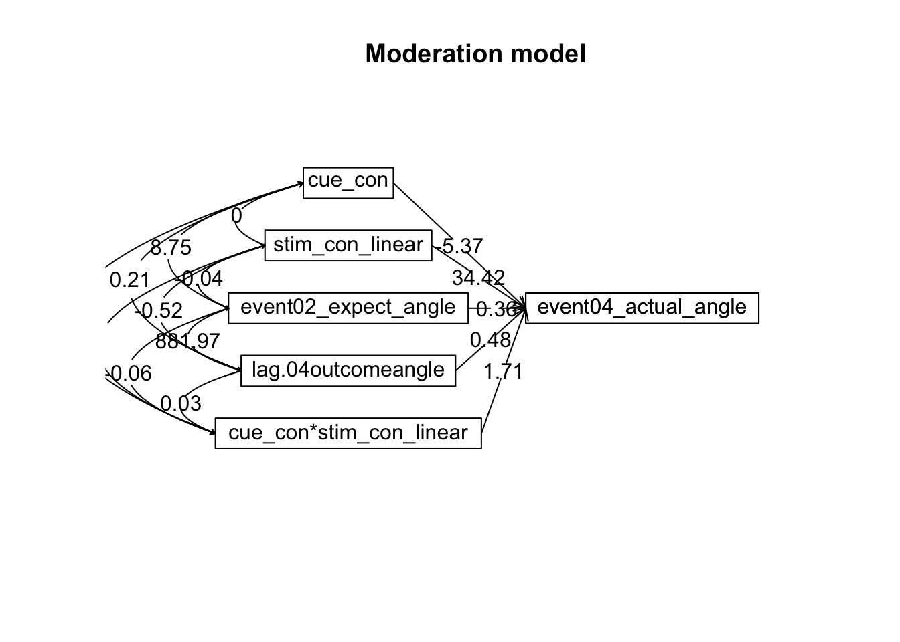

# [beh] Mediation outcome ~ cue * stim * expectrating * n-1outcomerating  {#ch17_mediation}


helpful resources
https://nmmichalak.github.io/nicholas_michalak/blog_entries/2018/nrg01/nrg01.html
## What is the purpose of this notebook? {.unlisted .unnumbered}
Here, I model the outcome ratings as a function of cue, stimulus intensity, expectation ratings, N-1 outcome rating. 
* As opposed to notebook 15, I want to check if the demeaning process should be for runs as opposed to subjects. 
* In other words, calculate the average within run and subtract ratings 
* Main model: `lmer(outcome_rating ~ cue * stim * expectation rating + N-1 outcomerating)` 
* Main question: What constitutes a reported outcome rating? 
* Sub questions:
  - If there is a linear relationship between expectation rating and outcome rating, does this differ as a function of cue?
  - How does a N-1 outcome rating affect current expectation ratings? 
  - Later, is this effect different across tasks or are they similar?

* IV: 
  stim (high / med / low)
  cue (high / low)
  expectation rating (continuous)
  N-1 outcome rating (continuous)
* DV: outcome rating

### Some thoughts, TODOs {.unlisted .unnumbered}

* Standardized coefficients
* Slope difference? Intercept difference? ( cue and expectantion rating)
* Correct for the range (within participant)
hypothesis:
1. Larger expectation leads to prediction error
2. Individual differences in ratings
3. Outcome experience, based on behavioral experience
What are the brain maps associated with each component.  


load data and combine participant data


```
##  event02_expect_RT event04_actual_RT event02_expect_angle event04_actual_angle
##  Min.   :0.6504    Min.   :0.0171    Min.   :  0.00       Min.   :  0.00      
##  1st Qu.:1.6200    1st Qu.:1.9188    1st Qu.: 29.55       1st Qu.: 37.83      
##  Median :2.0511    Median :2.3511    Median : 57.58       Median : 60.49      
##  Mean   :2.1337    Mean   :2.4011    Mean   : 61.88       Mean   : 65.47      
##  3rd Qu.:2.5589    3rd Qu.:2.8514    3rd Qu.: 88.61       3rd Qu.: 87.70      
##  Max.   :3.9912    Max.   :3.9930    Max.   :180.00       Max.   :180.00      
##  NA's   :651       NA's   :638       NA's   :651          NA's   :641
```


### Covariance matrix: ratings and RT {.unlisted .unnumbered}

```{=html}
<div class="plotly html-widget html-fill-item-overflow-hidden html-fill-item" id="htmlwidget-0c07017a0556109fcdc6" style="width:672px;height:480px;"></div>
<script type="application/json" data-for="htmlwidget-0c07017a0556109fcdc6">{"x":{"visdat":{"15a9f22138fea":["function () ","plotlyVisDat"]},"cur_data":"15a9f22138fea","attrs":{"15a9f22138fea":{"z":{},"alpha_stroke":1,"sizes":[10,100],"spans":[1,20],"type":"heatmap","colors":["#601200","#611300","#621401","#621501","#631600","#631700","#641801","#641901","#651A00","#661B00","#671C00","#671D00","#681E00","#681F00","#692000","#692100","#6A2200","#6A2200","#6B2300","#6B2400","#6C2500","#6D2600","#6E2700","#6E2800","#6F2900","#6F2900","#702A01","#702B00","#712C00","#712D00","#722E01","#722F00","#733000","#743000","#753101","#753200","#763300","#763400","#773501","#773600","#783700","#783700","#793801","#793900","#7A3A00","#7A3B00","#7C3D00","#7D3E00","#7D3E00","#7E3F00","#7E4000","#7F4100","#7F4200","#804300","#804400","#814500","#814600","#824700","#834701","#844800","#844900","#854A01","#854B01","#864C00","#864D00","#874E01","#874F01","#885002","#895002","#8A5101","#8A5201","#8B5302","#8B5402","#8C5503","#8C5603","#8D5704","#8D5804","#8E5905","#8F5A05","#905B06","#905C06","#915D07","#915E07","#925F08","#936009","#94610A","#94620B","#95630C","#95640D","#96650E","#97660F","#986810","#996912","#996A13","#9A6B15","#9B6C16","#9C6D17","#9C6E17","#9D6F19","#9E701A","#9F711C","#9F721D","#A0731E","#A0741F","#A17521","#A27622","#A37723","#A37824","#A47926","#A47A28","#A57B29","#A67C2A","#A77D2B","#A77E2D","#A87F2E","#A88030","#A98131","#AA8232","#AB8333","#AB8435","#AC8536","#AC8638","#AD873A","#AD873B","#AE883C","#AF893D","#B08A3F","#B08B40","#B18C42","#B18D43","#B28E44","#B28E45","#B38F47","#B39048","#B4914A","#B5924B","#B6944D","#B7954F","#B79550","#B89651","#B89652","#B99854","#B99955","#BA9A57","#BA9A58","#BB9B5A","#BC9C5B","#BD9D5C","#BD9E5D","#BE9F5F","#BE9F60","#BFA062","#BFA164","#C0A265","#C0A366","#C1A467","#C1A469","#C2A56A","#C2A66C","#C3A76D","#C4A86F","#C5A970","#C5AA71","#C6AB72","#C6AB74","#C7AC75","#C7AD77","#C8AE78","#C8AF7A","#C9B07C","#C9B07D","#CAB17E","#CBB27F","#CCB381","#CCB482","#CDB584","#CDB585","#CEB687","#CEB788","#CFB98A","#CFB98B","#D0BA8C","#D1BB8E","#D1BB8F","#D2BD91","#D3BE92","#D4BF94","#D4C095","#D5C197","#D5C198","#D6C29A","#D6C39B","#D7C49D","#D7C59E","#D8C6A0","#D8C6A1","#D9C7A2","#DAC8A3","#DBC9A5","#DBCAA7","#DCCBA8","#DCCCAA","#DDCDAB","#DDCDAD","#DECEAE","#DECFB0","#DFD0B1","#E0D1B3","#E1D2B4","#E1D3B6","#E2D4B7","#E2D4B9","#E3D5BB","#E3D6BC","#E4D7BD","#E4D8BE","#E5D9C0","#E5D9C1","#E6DAC3","#E6DBC4","#E7DCC6","#E7DDC7","#E8DEC9","#E8DECA","#E9DFCC","#E9E0CD","#EAE2CF","#EBE3D1","#EBE3D2","#ECE4D3","#ECE5D4","#EDE6D6","#ECE6D7","#EDE7D9","#EDE7DA","#EEE8DB","#EEE8DC","#EDE9DE","#EDE9DF","#EDEAE0","#EDEAE1","#EEEBE2","#EEEBE3","#EDECE4","#EDECE5","#ECEDE6","#ECEDE7","#EBECE8","#EBECE8","#EAEDE9","#EAEDE9","#E9ECEA","#E9ECEA","#E8EDEB","#E7EDEB","#E6ECEC","#E6ECEC","#E5EBED","#E4EBED","#E2EAEC","#E1EBEC","#E0EAED","#DFEAED","#DEE9EC","#DDE9EC","#DBE8ED","#DAE7ED","#D8E6EC","#D7E6EC","#D6E5EB","#D5E4EB","#D3E3EB","#D2E3EB","#D0E1EA","#CEE0E9","#CDE0E9","#CBDFE8","#CADEE8","#C8DDE7","#C7DCE7","#C5DBE6","#C3DAE6","#C1D9E5","#C0D8E4","#BED7E3","#BDD6E3","#BBD5E2","#BAD5E2","#B8D4E1","#B6D3E1","#B5D2E0","#B3D1DF","#B2D0DE","#B0CFDE","#AFCEDD","#ACCDDD","#ABCCDC","#A9CBDC","#A8CADB","#A6C9DA","#A5C8D9","#A3C7D9","#A1C6D8","#A0C5D8","#9FC4D7","#9DC3D6","#9BC2D5","#99C1D5","#97C0D4","#96BFD4","#94BED3","#93BED2","#91BDD1","#90BCD1","#8EBBD0","#8DBAD0","#8BB9CF","#89B8CE","#87B6CD","#85B5CC","#84B4CC","#82B3CB","#81B2CA","#7FB1C9","#7EB0C9","#7CAFC8","#7AAEC8","#78ADC7","#77ACC6","#75ABC5","#74AAC5","#72A9C4","#70A8C3","#6FA7C2","#6EA6C2","#6CA5C1","#6AA4C1","#68A3C0","#66A2BF","#65A1BE","#63A0BE","#629FBD","#609EBD","#5F9DBC","#5D9CBB","#5B9BBA","#599ABA","#5799B9","#5698B8","#5496B7","#5395B7","#5194B6","#5093B6","#4E92B5","#4D91B4","#4B90B3","#4A8FB3","#488EB2","#478DB1","#458CB0","#448BB0","#428AAF","#4089AF","#3E87AD","#3C86AC","#3B85AC","#3984AB","#3883AA","#3782A9","#3681A9","#3480A8","#337FA8","#317EA7","#307DA6","#2E7CA5","#2D7BA5","#2B7AA4","#2979A4","#2878A3","#2777A2","#2676A1","#2475A1","#2374A0","#2273A0","#21729F","#1F719E","#1E709D","#1D6F9D","#1C6E9C","#1A6D9C","#196C9B","#186B9A","#176A99","#166999","#156898","#146898","#136797","#126697","#116596","#106496","#0F6395","#0E6294","#0D6193","#0C6093","#0B5F92","#0B5F92","#0A5E91","#095D91","#085C90","#075A8F","#07598F","#06588E","#06588D","#05578C","#05568C","#04558B","#05548B","#04538A","#04538A","#035289","#045189","#035088","#034F88","#024E87","#024E87","#034D86","#034C86","#024B85","#024A85","#034984","#034984","#024883","#024783","#014682","#014682","#024581","#024481","#014380","#014280","#01417F","#01417F","#02407E","#023F7E","#013E7D","#013E7D","#023D7C","#023C7C","#013B7B","#013B7B","#023A7A","#01397A","#023779","#013779","#013678","#013577","#023477","#013376","#013376","#023275","#023175","#013074","#013074","#022F73","#022E73","#012D72","#012D72","#022C71","#022B71","#012A70","#012A70","#02296F","#02286F","#01276E","#01276E","#02266D","#02256D","#01246C","#01246C","#02236B","#02226B","#01216A","#01206A","#021F69","#021F69","#011E68","#011D68","#021C67","#021C67","#011B66","#011A66","#001965","#001865","#011764","#011764","#001663","#001563","#011362","#001362","#001261","#001260"],"inherit":true}},"layout":{"margin":{"b":40,"l":60,"t":25,"r":10},"scene":{"zaxis":{"title":"cormat"}},"xaxis":{"domain":[0,1],"automargin":true,"tickmode":"array","tickvals":[0,1,2,3,4],"ticktext":["event04_actual_angle","event02_expect_angle","event01_cue_onset","event02_expect_RT","event04_actual_RT"],"gridcolor":"transparent","zerolinecolor":"transparent","title":"","zeroline":false,"showgrid":false},"yaxis":{"domain":[0,1],"automargin":true,"tickmode":"array","tickvals":[0,1,2,3,4],"ticktext":["event04_actual_angle","event02_expect_angle","event01_cue_onset","event02_expect_RT","event04_actual_RT"],"gridcolor":"transparent","zerolinecolor":"transparent","title":"","autorange":"reversed","zeroline":false,"showgrid":false},"hovermode":"closest","showlegend":false,"legend":{"yanchor":"top","y":0.5},"plot_bgcolor":"transparent","paper_bgcolor":"transparent"},"source":"A","config":{"modeBarButtonsToAdd":["hoverclosest","hovercompare"],"showSendToCloud":false,"displayModeBar":false},"data":[{"colorbar":{"title":"cormat","ticklen":2,"len":0.5,"lenmode":"fraction","y":1,"yanchor":"top"},"colorscale":[["0","rgba(96,18,0,1)"],["0.0416666666666667","rgba(109,38,0,1)"],["0.0833333333333333","rgba(121,56,1,1)"],["0.125","rgba(133,75,1,1)"],["0.166666666666667","rgba(146,95,8,1)"],["0.208333333333333","rgba(161,117,33,1)"],["0.25","rgba(175,137,61,1)"],["0.291666666666667","rgba(188,156,91,1)"],["0.333333333333333","rgba(199,173,119,1)"],["0.375","rgba(212,192,149,1)"],["0.416666666666667","rgba(225,210,180,1)"],["0.458333333333333","rgba(236,228,211,1)"],["0.5","rgba(234,237,233,1)"],["0.541666666666667","rgba(212,228,235,1)"],["0.583333333333333","rgba(179,209,223,1)"],["0.625","rgba(145,189,209,1)"],["0.666666666666667","rgba(111,167,194,1)"],["0.708333333333333","rgba(78,146,181,1)"],["0.75","rgba(46,124,165,1)"],["0.791666666666667","rgba(20,104,152,1)"],["0.833333333333333","rgba(5,84,139,1)"],["0.875","rgba(1,67,128,1)"],["0.916666666666667","rgba(1,51,118,1)"],["0.958333333333333","rgba(2,35,107,1)"],["1","rgba(0,18,96,1)"]],"showscale":true,"z":[[1,0.627349219607622,-0.127331265407638,-0.0387158167304906,-0.155976302911586],[0.627349219607622,1,-0.0947326397969614,-0.0531943958485549,-0.127353687071136],[-0.127331265407638,-0.0947326397969614,1,0.0878587341493915,0.0947733899201344],[-0.0387158167304906,-0.0531943958485549,0.0878587341493915,1,0.279089611790198],[-0.155976302911586,-0.127353687071136,0.0947733899201344,0.279089611790198,1]],"type":"heatmap","xaxis":"x","yaxis":"y","frame":null,"zmin":-1,"zmax":1}],"highlight":{"on":"plotly_click","persistent":false,"dynamic":false,"selectize":false,"opacityDim":0.2,"selected":{"opacity":1},"debounce":0},"shinyEvents":["plotly_hover","plotly_click","plotly_selected","plotly_relayout","plotly_brushed","plotly_brushing","plotly_clickannotation","plotly_doubleclick","plotly_deselect","plotly_afterplot","plotly_sunburstclick"],"base_url":"https://plot.ly"},"evals":[],"jsHooks":[]}</script>
```

### Covariance matrix: fixation durations (e.g. ISIs) {.unlisted .unnumbered}

```{=html}
<div class="plotly html-widget html-fill-item-overflow-hidden html-fill-item" id="htmlwidget-4c4765cae9104636eb7b" style="width:672px;height:480px;"></div>
<script type="application/json" data-for="htmlwidget-4c4765cae9104636eb7b">{"x":{"visdat":{"15a9f751cf9ac":["function () ","plotlyVisDat"]},"cur_data":"15a9f751cf9ac","attrs":{"15a9f751cf9ac":{"z":{},"alpha_stroke":1,"sizes":[10,100],"spans":[1,20],"type":"heatmap","colors":["#601200","#611300","#621401","#621501","#631600","#631700","#641801","#641901","#651A00","#661B00","#671C00","#671D00","#681E00","#681F00","#692000","#692100","#6A2200","#6A2200","#6B2300","#6B2400","#6C2500","#6D2600","#6E2700","#6E2800","#6F2900","#6F2900","#702A01","#702B00","#712C00","#712D00","#722E01","#722F00","#733000","#743000","#753101","#753200","#763300","#763400","#773501","#773600","#783700","#783700","#793801","#793900","#7A3A00","#7A3B00","#7C3D00","#7D3E00","#7D3E00","#7E3F00","#7E4000","#7F4100","#7F4200","#804300","#804400","#814500","#814600","#824700","#834701","#844800","#844900","#854A01","#854B01","#864C00","#864D00","#874E01","#874F01","#885002","#895002","#8A5101","#8A5201","#8B5302","#8B5402","#8C5503","#8C5603","#8D5704","#8D5804","#8E5905","#8F5A05","#905B06","#905C06","#915D07","#915E07","#925F08","#936009","#94610A","#94620B","#95630C","#95640D","#96650E","#97660F","#986810","#996912","#996A13","#9A6B15","#9B6C16","#9C6D17","#9C6E17","#9D6F19","#9E701A","#9F711C","#9F721D","#A0731E","#A0741F","#A17521","#A27622","#A37723","#A37824","#A47926","#A47A28","#A57B29","#A67C2A","#A77D2B","#A77E2D","#A87F2E","#A88030","#A98131","#AA8232","#AB8333","#AB8435","#AC8536","#AC8638","#AD873A","#AD873B","#AE883C","#AF893D","#B08A3F","#B08B40","#B18C42","#B18D43","#B28E44","#B28E45","#B38F47","#B39048","#B4914A","#B5924B","#B6944D","#B7954F","#B79550","#B89651","#B89652","#B99854","#B99955","#BA9A57","#BA9A58","#BB9B5A","#BC9C5B","#BD9D5C","#BD9E5D","#BE9F5F","#BE9F60","#BFA062","#BFA164","#C0A265","#C0A366","#C1A467","#C1A469","#C2A56A","#C2A66C","#C3A76D","#C4A86F","#C5A970","#C5AA71","#C6AB72","#C6AB74","#C7AC75","#C7AD77","#C8AE78","#C8AF7A","#C9B07C","#C9B07D","#CAB17E","#CBB27F","#CCB381","#CCB482","#CDB584","#CDB585","#CEB687","#CEB788","#CFB98A","#CFB98B","#D0BA8C","#D1BB8E","#D1BB8F","#D2BD91","#D3BE92","#D4BF94","#D4C095","#D5C197","#D5C198","#D6C29A","#D6C39B","#D7C49D","#D7C59E","#D8C6A0","#D8C6A1","#D9C7A2","#DAC8A3","#DBC9A5","#DBCAA7","#DCCBA8","#DCCCAA","#DDCDAB","#DDCDAD","#DECEAE","#DECFB0","#DFD0B1","#E0D1B3","#E1D2B4","#E1D3B6","#E2D4B7","#E2D4B9","#E3D5BB","#E3D6BC","#E4D7BD","#E4D8BE","#E5D9C0","#E5D9C1","#E6DAC3","#E6DBC4","#E7DCC6","#E7DDC7","#E8DEC9","#E8DECA","#E9DFCC","#E9E0CD","#EAE2CF","#EBE3D1","#EBE3D2","#ECE4D3","#ECE5D4","#EDE6D6","#ECE6D7","#EDE7D9","#EDE7DA","#EEE8DB","#EEE8DC","#EDE9DE","#EDE9DF","#EDEAE0","#EDEAE1","#EEEBE2","#EEEBE3","#EDECE4","#EDECE5","#ECEDE6","#ECEDE7","#EBECE8","#EBECE8","#EAEDE9","#EAEDE9","#E9ECEA","#E9ECEA","#E8EDEB","#E7EDEB","#E6ECEC","#E6ECEC","#E5EBED","#E4EBED","#E2EAEC","#E1EBEC","#E0EAED","#DFEAED","#DEE9EC","#DDE9EC","#DBE8ED","#DAE7ED","#D8E6EC","#D7E6EC","#D6E5EB","#D5E4EB","#D3E3EB","#D2E3EB","#D0E1EA","#CEE0E9","#CDE0E9","#CBDFE8","#CADEE8","#C8DDE7","#C7DCE7","#C5DBE6","#C3DAE6","#C1D9E5","#C0D8E4","#BED7E3","#BDD6E3","#BBD5E2","#BAD5E2","#B8D4E1","#B6D3E1","#B5D2E0","#B3D1DF","#B2D0DE","#B0CFDE","#AFCEDD","#ACCDDD","#ABCCDC","#A9CBDC","#A8CADB","#A6C9DA","#A5C8D9","#A3C7D9","#A1C6D8","#A0C5D8","#9FC4D7","#9DC3D6","#9BC2D5","#99C1D5","#97C0D4","#96BFD4","#94BED3","#93BED2","#91BDD1","#90BCD1","#8EBBD0","#8DBAD0","#8BB9CF","#89B8CE","#87B6CD","#85B5CC","#84B4CC","#82B3CB","#81B2CA","#7FB1C9","#7EB0C9","#7CAFC8","#7AAEC8","#78ADC7","#77ACC6","#75ABC5","#74AAC5","#72A9C4","#70A8C3","#6FA7C2","#6EA6C2","#6CA5C1","#6AA4C1","#68A3C0","#66A2BF","#65A1BE","#63A0BE","#629FBD","#609EBD","#5F9DBC","#5D9CBB","#5B9BBA","#599ABA","#5799B9","#5698B8","#5496B7","#5395B7","#5194B6","#5093B6","#4E92B5","#4D91B4","#4B90B3","#4A8FB3","#488EB2","#478DB1","#458CB0","#448BB0","#428AAF","#4089AF","#3E87AD","#3C86AC","#3B85AC","#3984AB","#3883AA","#3782A9","#3681A9","#3480A8","#337FA8","#317EA7","#307DA6","#2E7CA5","#2D7BA5","#2B7AA4","#2979A4","#2878A3","#2777A2","#2676A1","#2475A1","#2374A0","#2273A0","#21729F","#1F719E","#1E709D","#1D6F9D","#1C6E9C","#1A6D9C","#196C9B","#186B9A","#176A99","#166999","#156898","#146898","#136797","#126697","#116596","#106496","#0F6395","#0E6294","#0D6193","#0C6093","#0B5F92","#0B5F92","#0A5E91","#095D91","#085C90","#075A8F","#07598F","#06588E","#06588D","#05578C","#05568C","#04558B","#05548B","#04538A","#04538A","#035289","#045189","#035088","#034F88","#024E87","#024E87","#034D86","#034C86","#024B85","#024A85","#034984","#034984","#024883","#024783","#014682","#014682","#024581","#024481","#014380","#014280","#01417F","#01417F","#02407E","#023F7E","#013E7D","#013E7D","#023D7C","#023C7C","#013B7B","#013B7B","#023A7A","#01397A","#023779","#013779","#013678","#013577","#023477","#013376","#013376","#023275","#023175","#013074","#013074","#022F73","#022E73","#012D72","#012D72","#022C71","#022B71","#012A70","#012A70","#02296F","#02286F","#01276E","#01276E","#02266D","#02256D","#01246C","#01246C","#02236B","#02226B","#01216A","#01206A","#021F69","#021F69","#011E68","#011D68","#021C67","#021C67","#011B66","#011A66","#001965","#001865","#011764","#011764","#001663","#001563","#011362","#001362","#001261","#001260"],"inherit":true}},"layout":{"margin":{"b":40,"l":60,"t":25,"r":10},"scene":{"zaxis":{"title":"cormat"}},"xaxis":{"domain":[0,1],"automargin":true,"tickmode":"array","tickvals":[0,1,2],"ticktext":["ISI02_duration","ISI01_duration","ISI03_duration"],"gridcolor":"transparent","zerolinecolor":"transparent","title":"","zeroline":false,"showgrid":false},"yaxis":{"domain":[0,1],"automargin":true,"tickmode":"array","tickvals":[0,1,2],"ticktext":["ISI02_duration","ISI01_duration","ISI03_duration"],"gridcolor":"transparent","zerolinecolor":"transparent","title":"","autorange":"reversed","zeroline":false,"showgrid":false},"hovermode":"closest","showlegend":false,"legend":{"yanchor":"top","y":0.5},"plot_bgcolor":"transparent","paper_bgcolor":"transparent"},"source":"A","config":{"modeBarButtonsToAdd":["hoverclosest","hovercompare"],"showSendToCloud":false,"displayModeBar":false},"data":[{"colorbar":{"title":"cormat","ticklen":2,"len":0.5,"lenmode":"fraction","y":1,"yanchor":"top"},"colorscale":[["0","rgba(96,18,0,1)"],["0.0416666666666667","rgba(109,38,0,1)"],["0.0833333333333333","rgba(121,56,1,1)"],["0.125","rgba(133,75,1,1)"],["0.166666666666667","rgba(146,95,8,1)"],["0.208333333333333","rgba(161,117,33,1)"],["0.25","rgba(175,137,61,1)"],["0.291666666666667","rgba(188,156,91,1)"],["0.333333333333333","rgba(199,173,119,1)"],["0.375","rgba(212,192,149,1)"],["0.416666666666667","rgba(225,210,180,1)"],["0.458333333333333","rgba(236,228,211,1)"],["0.5","rgba(234,237,233,1)"],["0.541666666666667","rgba(212,228,235,1)"],["0.583333333333333","rgba(179,209,223,1)"],["0.625","rgba(145,189,209,1)"],["0.666666666666667","rgba(111,167,194,1)"],["0.708333333333333","rgba(78,146,181,1)"],["0.75","rgba(46,124,165,1)"],["0.791666666666667","rgba(20,104,152,1)"],["0.833333333333333","rgba(5,84,139,1)"],["0.875","rgba(1,67,128,1)"],["0.916666666666667","rgba(1,51,118,1)"],["0.958333333333333","rgba(2,35,107,1)"],["1","rgba(0,18,96,1)"]],"showscale":true,"z":[[1,0.104227599726807,0.0712121554449984],[0.104227599726807,1,-0.0576788170165326],[0.0712121554449984,-0.0576788170165326,1]],"type":"heatmap","xaxis":"x","yaxis":"y","frame":null,"zmin":-1,"zmax":1}],"highlight":{"on":"plotly_click","persistent":false,"dynamic":false,"selectize":false,"opacityDim":0.2,"selected":{"opacity":1},"debounce":0},"shinyEvents":["plotly_hover","plotly_click","plotly_selected","plotly_relayout","plotly_brushed","plotly_brushing","plotly_clickannotation","plotly_doubleclick","plotly_deselect","plotly_afterplot","plotly_sunburstclick"],"base_url":"https://plot.ly"},"evals":[],"jsHooks":[]}</script>
```


## mediation


```r
psych::mediate(event04_actual_angle ~ cue_con*stim_con_linear+ event02_expect_angle + lag.04outcomeangle, data = pvc, n.iter = 1000) %>% print(short = FALSE) 
```



```
## 
## Mediation/Moderation Analysis 
## Call: psych::mediate(y = event04_actual_angle ~ cue_con * stim_con_linear + 
##     event02_expect_angle + lag.04outcomeangle, data = pvc, n.iter = 1000)
## 
## The DV (Y) was  event04_actual_angle . The IV (X) was  cue_con stim_con_linear event02_expect_angle lag.04outcomeangle cue_con*stim_con_linear . The mediating variable(s) =  .Call: psych::mediate(y = event04_actual_angle ~ cue_con * stim_con_linear + 
##     event02_expect_angle + lag.04outcomeangle, data = pvc, n.iter = 1000)
## 
## No mediator specified leads to traditional regression 
##                         event04_actual_angle   se     t   df      Prob
## Intercept                               0.00 0.30 -0.01 5023  9.89e-01
## cue_con                                -5.37 0.71 -7.54 5023  5.62e-14
## stim_con_linear                        34.42 0.75 46.13 5023  0.00e+00
## event02_expect_angle                    0.36 0.01 33.69 5023 1.84e-224
## lag.04outcomeangle                      0.48 0.01 46.08 5023  0.00e+00
## cue_con*stim_con_linear                 1.71 1.49  1.14 5023  2.53e-01
## 
## R = 0.83 R2 = 0.68   F = 2177.74 on 5 and 5023 DF   p-value:  0
```
## mediation 2

```r
mod1 <- "# a path
         #thirst ~ a * room_temp
         event02_expect_angle ~ a * cue_con

         # b path
         #consume ~ b * thirst
         event04_actual_angle ~ b* event02_expect_angle
         
         # c prime path 
         #consume ~ cp * room_temp
         event04_actual_angle ~ cp * cue_con
         
         # indirect and total effects
         ab := a * b
         total := cp + ab"
```


```r
library(lavaan)
```

```
## This is lavaan 0.6-12
## lavaan is FREE software! Please report any bugs.
```

```
## 
## Attaching package: 'lavaan'
```

```
## The following object is masked from 'package:psych':
## 
##     cor2cov
```

```r
fsem1 <- sem(mod1, data = pvc, se = "bootstrap", bootstrap = 1000)
summary(fsem1, standardized = TRUE)
```

```
## lavaan 0.6-12 ended normally after 1 iterations
## 
##   Estimator                                         ML
##   Optimization method                           NLMINB
##   Number of model parameters                         5
## 
##                                                   Used       Total
##   Number of observations                          4621        5029
## 
## Model Test User Model:
##                                                       
##   Test statistic                                 0.000
##   Degrees of freedom                                 0
## 
## Parameter Estimates:
## 
##   Standard errors                            Bootstrap
##   Number of requested bootstrap draws             1000
##   Number of successful bootstrap draws            1000
## 
## Regressions:
##                          Estimate  Std.Err  z-value  P(>|z|)   Std.lv  Std.all
##   event02_expect_angle ~                                                      
##     cue_con    (a)         34.622    1.064   32.528    0.000   34.622    0.429
##   event04_actual_angle ~                                                      
##     evnt02_x_  (b)          0.674    0.013   51.478    0.000    0.674    0.715
##     cue_con   (cp)        -15.034    0.934  -16.094    0.000  -15.034   -0.198
## 
## Variances:
##                    Estimate  Std.Err  z-value  P(>|z|)   Std.lv  Std.all
##    .evnt02_xpct_ng 1328.872   31.344   42.396    0.000 1328.872    0.816
##    .evnt04_ctl_ngl  825.688   20.370   40.535    0.000  825.688    0.571
## 
## Defined Parameters:
##                    Estimate  Std.Err  z-value  P(>|z|)   Std.lv  Std.all
##     ab               23.321    0.866   26.932    0.000   23.321    0.307
##     total             8.287    1.103    7.512    0.000    8.287    0.109
```

```r
parameterestimates(fsem1, boot.ci.type = "bca.simple", standardized = TRUE) %>% 
  kable()
```


|lhs                  |op |rhs                  |label |          est|         se|          z| pvalue|     ci.lower|     ci.upper|       std.lv|    std.all|    std.nox|
|:--------------------|:--|:--------------------|:-----|------------:|----------:|----------:|------:|------------:|------------:|------------:|----------:|----------:|
|event02_expect_angle |~  |cue_con              |a     |   34.6222421|  1.0643863|  32.527893|      0|   32.4911535|   36.7376419|   34.6222421|  0.4289292|  0.8579540|
|event04_actual_angle |~  |event02_expect_angle |b     |    0.6735862|  0.0130850|  51.477654|      0|    0.6483117|    0.7005964|    0.6735862|  0.7148784|  0.7148784|
|event04_actual_angle |~  |cue_con              |cp    |  -15.0337345|  0.9341441| -16.093592|      0|  -16.6941643|  -13.0752068|  -15.0337345| -0.1976680| -0.3953800|
|event02_expect_angle |~~ |event02_expect_angle |      | 1328.8715236| 31.3444415|  42.395763|      0| 1263.4018753| 1394.0921953| 1328.8715236|  0.8160197|  0.8160197|
|event04_actual_angle |~~ |event04_actual_angle |      |  825.6875657| 20.3697317|  40.535024|      0|  788.7199367|  870.8156773|  825.6875657|  0.5710990|  0.5710990|
|cue_con              |~~ |cue_con              |      |    0.2499443|  0.0000000|         NA|     NA|    0.2499443|    0.2499443|    0.2499443|  1.0000000|  0.2499443|
|ab                   |:= |a*b                  |ab    |   23.3210633|  0.8659089|  26.932468|      0|   21.6834883|   25.2389027|   23.3210633|  0.3066322|  0.6133328|
|total                |:= |cp+ab                |total |    8.2873288|  1.1032834|   7.511514|      0|    6.0893209|   10.4957834|    8.2873288|  0.1089642|  0.2179528|


## mediation 3: Test same model using mediation() from MBESS

```
## Warning in resid.Y.on.X + resid.Y.on.M: longer object length is not a multiple
## of shorter object length
```

```
## Warning in resid.Y.on.X + resid.Y.on.M - resid.Y.on.X.and.M: longer object
## length is not a multiple of shorter object length
```

```
## Warning in standardized.resid.Y.on.X + standardized.resid.Y.on.M: longer object
## length is not a multiple of shorter object length
```

```
## Warning in standardized.resid.Y.on.X + standardized.resid.Y.on.M -
## standardized.resid.Y.on.X.and.M: longer object length is not a multiple of
## shorter object length
```

```
## Warning in abs(e.1M) + abs(e.1Y): longer object length is not a multiple of
## shorter object length
```

```
## Warning in abs(standardized.e.1M) + abs(standardized.e.1Y): longer object length
## is not a multiple of shorter object length
```

```
## [1] "Bootstrap resampling has begun. This process may take a considerable amount of time if the number of replications is large, which is optimal for the bootstrap procedure."
```

```
##                                           Estimate CI.Lower_BCa CI.Upper_BCa
## Indirect.Effect                        23.32106331           NA           NA
## Indirect.Effect.Partially.Standardized  0.61326642           NA           NA
## Index.of.Mediation                      0.30663221           NA           NA
## R2_4.5                                 -0.02001083           NA           NA
## R2_4.6                                  0.07764679           NA           NA
## R2_4.7                                  0.18103664           NA           NA
## Ratio.of.Indirect.to.Total.Effect       2.81406275           NA           NA
## Ratio.of.Indirect.to.Direct.Effect     -1.55124885           NA           NA
## Success.of.Surrogate.Endpoint           0.23936430           NA           NA
## Residual.Based_Gamma                            NA           NA           NA
## Residual.Based.Standardized_gamma               NA           NA           NA
## SOS                                    -1.68537707           NA           NA
```

## mediation 4: Test library mediation


