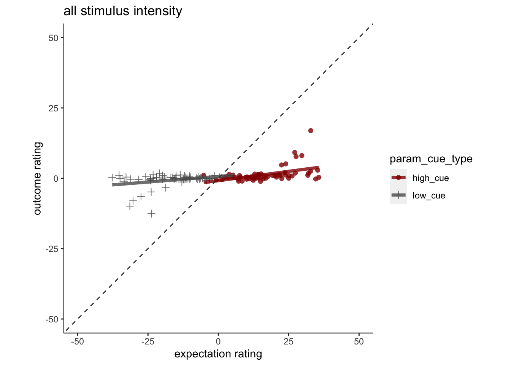
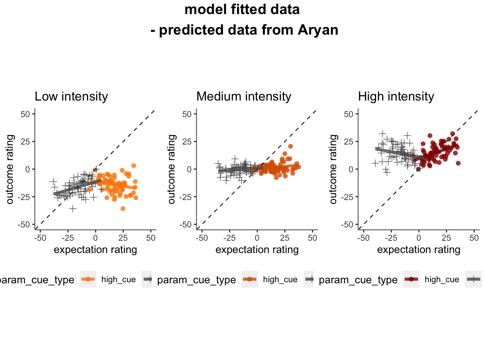
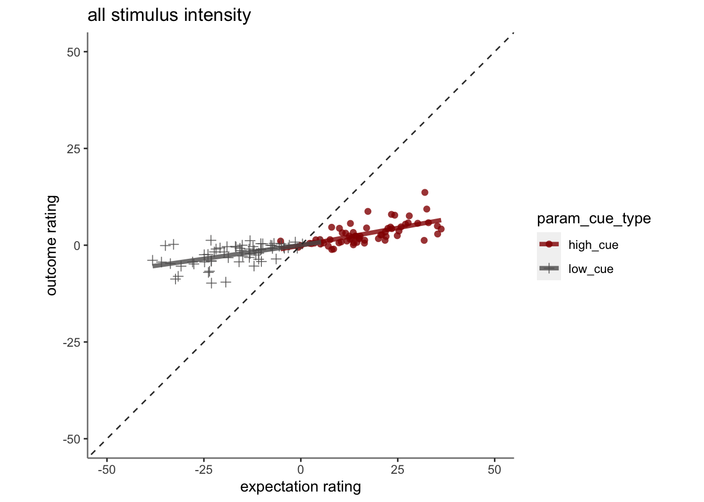
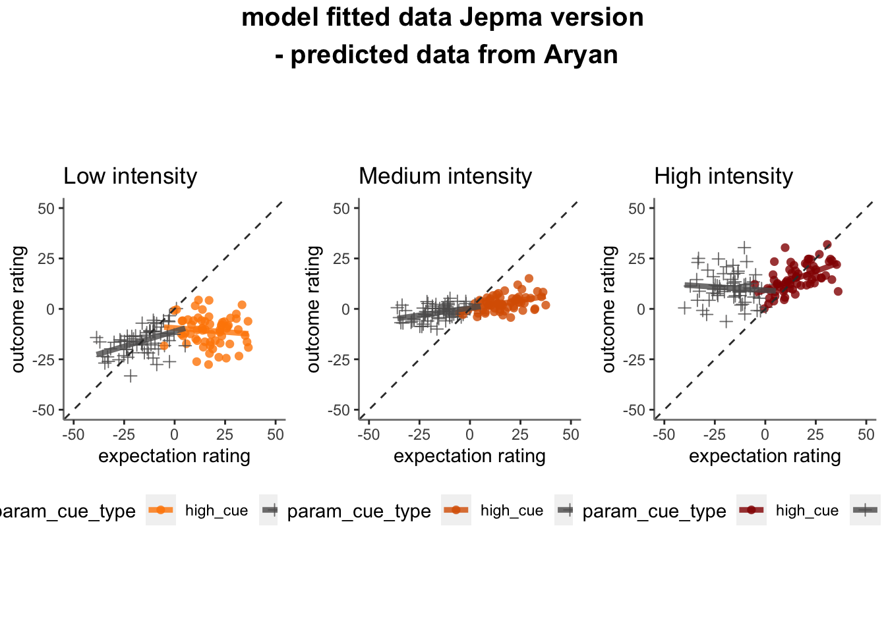

## load data

## plot using same scheme as iv15

### groupby subject and average

## pain run, collapsed across stimulus intensity

## model version 2

### groupby subject and average

## pain run, collapsed across stimulus intensity

