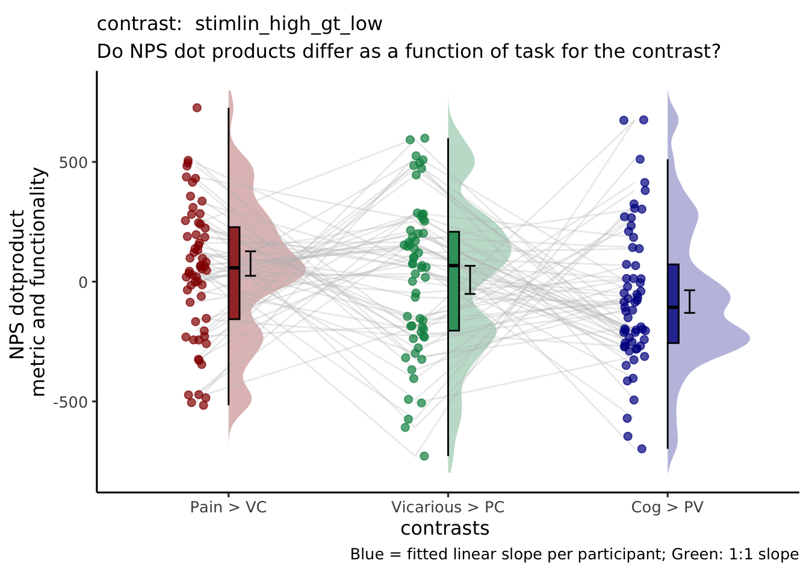
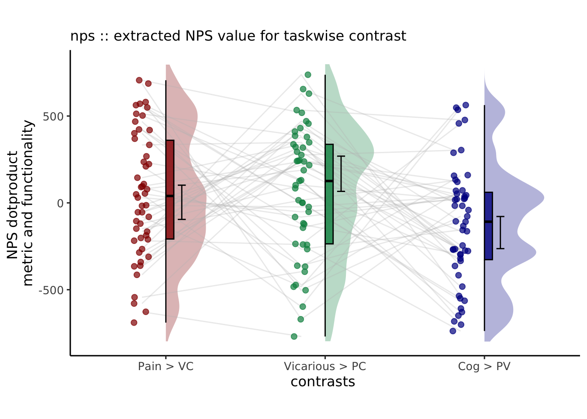
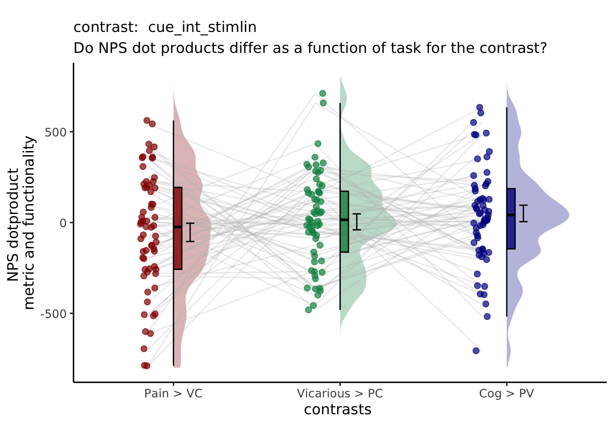
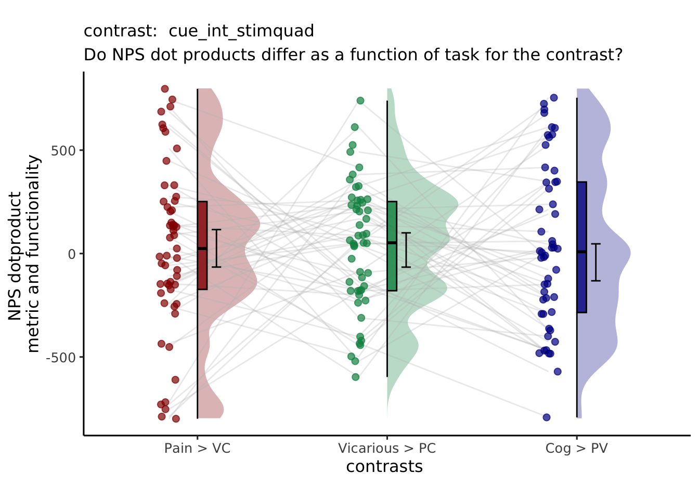

# NPS_contrast_notscaled ~ cue * stim {#nps_contrast_notscaled}

## Overview
The purpose of this markdown is to plot the NPS extracted values for each contrast of interest.
Steps of this notebook entails the following:

1. load and stack the files
1. plot per condition 
1. x axis (pain vs. vicarious vs. cognitive)
1. y axis (NPS extracted values)

```
# contrast_name = {'P_VC_cue_high_gt_low', 'V_PC_cue_high_gt_low', 'C_PV_cue_high_gt_low', ...
# 'P_VC_stimlin_high_gt_low', 'V_PC_stimlin_high_gt_low', 'C_PV_stimlin_high_gt_low',...
# 'P_VC_stimquad_med_gt_other', 'V_PC_stimquad_med_gt_other', 'C_PV_stimquad_med_gt_other',...
# 'P_VC_cue_int_stimlin','V_PC_cue_int_stimlin', 'C_PV_cue_int_stimlin',...
# 'P_VC_cue_int_stimquad','V_PC_cue_int_stimquad','C_PV_cue_int_stimquad',...
# 'motor',...
# 'P_simple_cue_high_gt_low', 'V_simple_cue_high_gt_low', 'C_simple_cue_high_gt_low', ...
# 'P_simple_stimlin_high_gt_low', 'V_simple_stimlin_high_gt_low', 'C_simple_stimlin_high_gt_low',...
# 'P_simple_stimquad_med_gt_other', 'V_simple_stimquad_med_gt_other', 'C_simple_stimquad_med_gt_other',...
# 'P_simple_cue_int_stimlin', 'V_simple_cue_int_stimlin', 'C_simple_cue_int_stimlin',...
# 'P_simple_cue_int_stimquad','V_simple_cue_int_stimquad','C_simple_cue_int_stimquad'
```

## regressors and contrasts
### What regressors were used in the neural model and how did you create contrasts? {.unlisted .unnumbered}
This Rmd is based on the univariate analysis mainly using 2 factors (cue x stimulus intensity). 

* The 6 regressors of interest are 
  1. high-cue_high-stim 
  1. high-cue_med-stim 
  1. high-cue_low-stim
  1. low-cue_high-stim 
  1. low-cue_med-stim
  1. low-cue_low-stim. 
  If interested, the variable of interest is coded "`onset03_stim`" in the behavioral data. 

* Additional regressors include 7) cue_onset "`onset01_cue`", 8) onset of the expectation rating phase "`onset02_ratingexpect`" convolved with the reaction time of the expectation rating "`pmod_expectRT`", and 9) onset of the outcome rating phase "`onset04_ratingoutcome`", convolved with the reaction time of the outcome rating "`pmod_outcomeRT`". 

* Motion covariates include a) csf, b) 24 DOF head motion variables, and c) spikes derived using a FD-spike-threshold of 0.9mm. Participants with a motion spike of more than 20 per run is excluded from the analysis. 
For the 6 regressors of interest, I build 5 contrasts that capture the cue effect, the stimulus intensity effect, and the interaction of these two factors. 


| contrast names | high-cue_high-stim | high-cue_med-stim | high-cue_low-stim | low-cue_high-stim | low-cue_med-stim | low-cue_low-stim |
|----------------|:------------------:|:-----------------:|:-----------------:|:-----------------:|:----------------:|:----------------:|
| cue_high_gt_low| 1                  | 1                 | 1                 | -1                | -1               | -1               |
| stimlin_high_gt_low| 1              | 0                 | -1                | 1                 | 0                | -1               |
| stimquad_med_gt_other| -1           | 2                 | -1                | -1                | 2                | -1               |
| cue_int_stimlin| 1                  | 0                 | -1                | -1                | 0                | 1                |
| cue_int_stimquad| -1                | 2                 | -1                | 1                 | -2               | 1                |


Here are the common parameters that I use for ggplot

```r
npsdir = file.path(main_dir,'analysis','fmri','spm','univariate','model01_6cond_nonscaled','extract_nps')
model = 'nps'; model_keyword = "nps"
subjectwise_mean = "mean_per_sub"; group_mean = "mean_per_sub_norm_mean"; se = "se"
iv = "contrast"; subject = "subject"
dv = "nps"; dv_keyword = "nps_dot_product"
ylim = c(-800, 800)
xlab = "contrasts "; ylab = "NPS dotproduct \nmetric and functionality"
ggtitle = paste0(model_keyword,
                   " :: extracted NPS value for taskwise contrast")
legend_title = "Contrasts"
color_scheme <- c("Pain > VC" = "#941100",
         "Vicarious > PC" = "#008F51",
         "Cog > PV" = "#011891")
savedir = file.path(main_dir,'analysis','mixedeffect','model10_iv-cue-stim_dv-nps-contrast',as.character(Sys.Date())  )
```

## main effect: stim-linear high > low

### Linear effect of stimulus intensity {.unlisted .unnumbered}
The extracted NPS beta for the linear effect of stimulus intensity contrast map is highest for the Pain task compared to the average of Vicarious and Cognitive runs. However, there is overlap between Vicarious runs. 


## main_effect: stim-quadratic med > high&low

### Quadratic effect of stimulus intensity {.unlisted .unnumbered}
[ INSERT DESCRIPTION ]


## interaction: cue X stim-linear

### Interaction between cue effect and stimulus intensity {.unlisted .unnumbered}
The extracted NPS values are similar across pain/vicarious/cognitive contrasts. While the means are slightly higher for the cognitive and vicarious group, it is puzzling what this means, given that we used the pain signature NPS map. 


## interaction: cue X stim-quadratic

### Interaction between cue effect and quadratic effect of stimulus intensity {.unlisted .unnumbered}
The extracted NPS values are similar across pain/vicarious/cognitive contrasts. 


