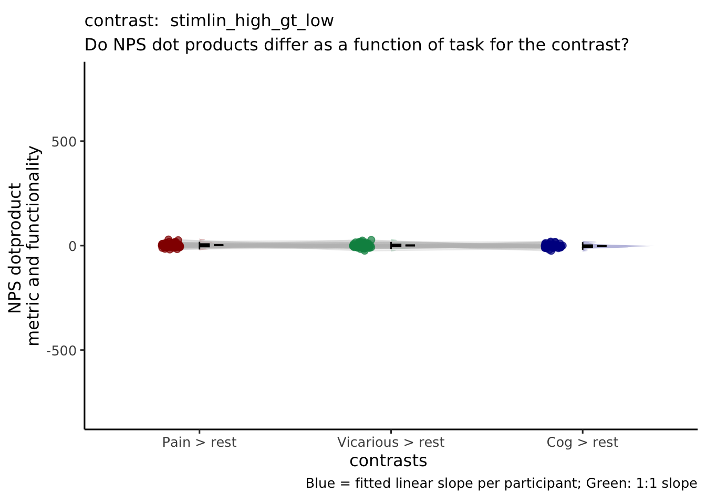
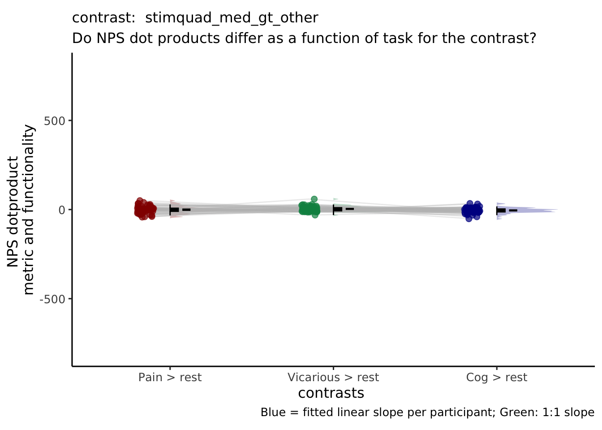
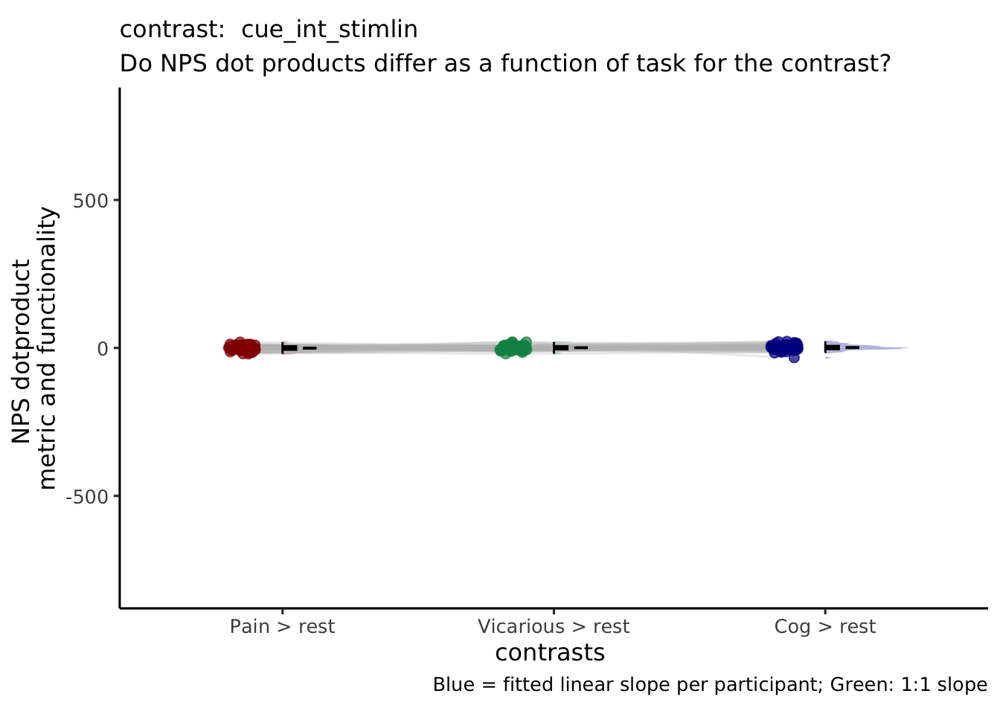
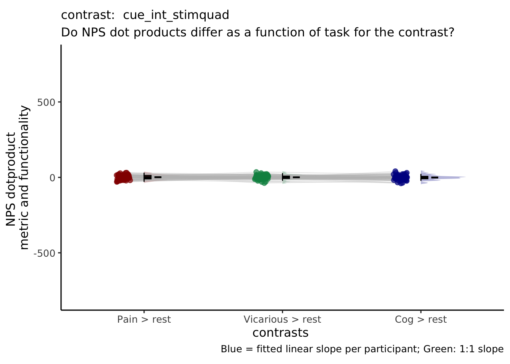

# [fMRI] nps_contrast ~ cue * stim {#ch32_nps_dummy}

## Overview 
The purpose of this markdown is to plot the NPS extracted values for each contrast of interest

Steps
1. load and stack the files
2. plot per condition 
3. x axis (pain vs. vicarious vs. cognitive)
4. y axis (NPS extracted values)
```
# contrast_name = {'P_VC_cue_high_gt_low', 'V_PC_cue_high_gt_low', 'C_PV_cue_high_gt_low', ...
# 'P_VC_stimlin_high_gt_low', 'V_PC_stimlin_high_gt_low', 'C_PV_stimlin_high_gt_low',...
# 'P_VC_stimquad_med_gt_other', 'V_PC_stimquad_med_gt_other', 'C_PV_stimquad_med_gt_other',...
# 'P_VC_cue_int_stimlin','V_PC_cue_int_stimlin', 'C_PV_cue_int_stimlin',...
# 'P_VC_cue_int_stimquad','V_PC_cue_int_stimquad','C_PV_cue_int_stimquad',...
# 'motor',...
# 'P_simple_cue_high_gt_low', 'V_simple_cue_high_gt_low', 'C_simple_cue_high_gt_low', ...
# 'P_simple_stimlin_high_gt_low', 'V_simple_stimlin_high_gt_low', 'C_simple_stimlin_high_gt_low',...
# 'P_simple_stimquad_med_gt_other', 'V_simple_stimquad_med_gt_other', 'C_simple_stimquad_med_gt_other',...
# 'P_simple_cue_int_stimlin', 'V_simple_cue_int_stimlin', 'C_simple_cue_int_stimlin',...
# 'P_simple_cue_int_stimquad','V_simple_cue_int_stimquad','C_simple_cue_int_stimquad'
```


<!-- ```{r} -->
<!-- main_dir = dirname(dirname(getwd())) -->
<!-- datadir = file.path(main_dir, 'data', 'beh', 'beh02_preproc') -->
<!-- ``` -->

<!-- ```{r} -->

<!-- npsdir = file.path(main_dir, 'analysis', 'fmri', 'spm', 'univariate', 'model01_6cond', 'extract_nps') -->
<!-- nps_df = read_csv(file.path(npsdir, 'extract-nps_model01-6cond_con_0004-P_VC_stimlin_high_gt_low.csv')) -->
<!-- ``` -->

<!-- ```{r} -->
<!-- merge_df = data.frame() -->

<!-- for (conname in c('P_VC_stimlin_high_gt_low', 'V_PC_stimlin_high_gt_low', 'C_PV_stimlin_high_gt_low')) { -->
<!--   npsdir = file.path(main_dir, 'analysis', 'fmri', 'spm', 'univariate', 'model01_6cond', 'extract_nps') -->
<!--   df = read.csv(Sys.glob(file.path(npsdir, paste0('extract-nps_model01-6cond_con_*',conname, '.csv')))) -->
<!--   df$conname = char(conname) -->

<!--   merge_df = rbind(merge_df, df) -->
<!-- } -->
<!-- merge_df = as.data.frame(merge_df) -->
<!-- ``` -->

<!-- ```{r} -->
<!-- merge_df$contrast <- recode_factor(merge_df$conname, P_VC_stimlin_high_gt_low = "Pain > VC", -->
<!--                                  V_PC_stimlin_high_gt_low = "Vicarious > PC", -->
<!--                                  C_PV_stimlin_high_gt_low = "Cog > PV") -->
<!-- merge_df$contrast <- as.character(merge_df$contrast) -->
<!-- merge_df$contrast <- as.factor(merge_df$contrast) -->
<!-- ``` -->

<!-- ```{r} -->
<!-- model.nps = lm(nps ~ contrast, data = merge_df) -->
<!-- summary(model.nps) -->
<!-- ``` -->


<!-- ```{r} -->
<!-- # parameters __________________________________________________________________ -->
<!-- model = 'nps' -->
<!-- model_keyword = "nps" -->
<!-- subjectwise_mean = "mean_per_sub" -->
<!-- group_mean = "mean_per_sub_norm_mean" -->
<!-- iv = "contrast" -->
<!-- ylim = c(-800, 800) -->
<!-- se = "se" -->
<!-- subject = "subject" -->
<!-- ggtitle = paste0(model_keyword, -->
<!--                  " :: extracted NPS value for taskwise contrast") -->
<!-- legend_title = "Contrasts" -->
<!-- xlab = "contrasts " -->
<!-- ylab = "NPS dotproduct \nmetric and functionality" -->
<!-- dv = "nps" -->
<!-- dv_keyword = "nps_dot_product" -->

<!-- classwise <- meanSummary(merge_df, -->
<!--                          c(subject, iv),dv) -->
<!-- groupwise <- summarySEwithin( -->
<!--   data = classwise, -->
<!--   measurevar = "mean_per_sub", -->
<!--   withinvars = c(iv), -->
<!--   # idvar = subject -->
<!-- ) -->

<!-- subjectwise = subset(classwise, select = -c(sd)) -->

<!-- color <- c("Pain > VC" = "#941100",  -->
<!--            "Vicarious > PC" = "#008F51",  -->
<!--            "Cog > PV" = "#011891") -->
<!-- ``` -->


<!-- ```{r} -->
<!-- # ggplot ______________________________________________________________________ -->

<!-- p1 <- ggplot(data = subjectwise, -->
<!--             aes( -->
<!--               y = .data[[subjectwise_mean]], -->
<!--               x = factor(.data[[iv]]), -->
<!--               fill = factor(.data[[iv]]) -->
<!--             )) + -->

<!--   geom_half_violin( -->
<!--     aes(fill = factor(.data[[iv]])), -->
<!--     side = 'r', -->
<!--     position = 'dodge', -->
<!--     adjust = 0.5, -->
<!--     trim = FALSE, -->
<!--     alpha = .3, -->
<!--     colour = NA -->
<!--   ) + -->

<!--   geom_line(data = subjectwise, -->
<!--     aes( -->
<!--       group = .data[[subject]], -->
<!--       x = as.numeric(as.factor(.data[[iv]])) - .15 , -->
<!--       y = .data[[subjectwise_mean]], -->
<!--       fill = factor(.data[[iv]]) -->
<!--       ), -->
<!--     linetype = "solid", -->
<!--     color = "grey", -->
<!--     alpha = .3) + -->

<!--   geom_point( -->
<!--     aes( -->
<!--       # group = .data[[subject]], -->
<!--       x = as.numeric(as.factor(.data[[iv]])) - .15 , -->
<!--       y = .data[[subjectwise_mean]], -->
<!--       color = factor(.data[[iv]]) -->
<!--     ), -->
<!--     position = position_jitter(width = .05), -->
<!--     size = 2, -->
<!--     alpha = 0.7, -->
<!--   ) + -->

<!--     geom_half_boxplot( -->
<!--     data = subjectwise, -->
<!--     aes(x = .data[[iv]], -->
<!--         y = .data[[subjectwise_mean]], -->
<!--         fill = .data[[iv]] -->
<!--     ), -->
<!--     side = "r", -->
<!--     outlier.shape = NA, -->
<!--     alpha = 0.8, -->
<!--     width = .1, -->
<!--     notch = FALSE, -->
<!--     notchwidth = 0, -->
<!--     varwidth = FALSE, -->
<!--     # colour = "black", -->
<!--     errorbar.draw = FALSE -->
<!--     ) + -->

<!--   geom_errorbar( -->
<!--       data = groupwise, -->
<!--       aes( -->
<!--         x = as.numeric(.data[[iv]]) + .1, -->
<!--         y = as.numeric(.data[[group_mean]]), -->
<!--         colour = factor(.data[[iv]]), -->
<!--         ymin = .data[[group_mean]] - .data[[se]], -->
<!--         ymax = .data[[group_mean]] + .data[[se]] -->
<!--       ), width = .05 -->
<!--     ) + -->

<!--   # legend stuff ________________________________________________________ -->

<!--   guides(color = "none") + -->
<!--   guides(fill = guide_legend(title = legend_title)) + -->
<!--   scale_fill_manual(values = color) + -->
<!--   scale_color_manual(values = color) + -->
<!--   ggtitle(ggtitle) + -->
<!--   scale_x_discrete() + -->

<!--   xlab(xlab) + -->
<!--   ylab(ylab) + -->
<!--   ylim(ylim) + -->
<!--   theme_bw() + theme_classic2() + -->
<!--   theme(aspect.ratio = 6 / 10) + -->
<!--   theme(legend.position = "none", -->
<!--         text = element_text(family = "DejaVu Sans"),  -->
<!--         plot.title = element_text(size=12)) -->

<!--   # plot description ________________________________________________________ -->
<!-- p1 +  -->
<!--     labs(title = paste( "Do NPS dot products differ as a function of task for the contrast: stimlin_high_gt_low "), -->
<!--        subtitle = "Plotting the raw data - with all of the datapoints ignoring run differences",  -->
<!--        caption = "Blue = fitted linear slope per participant; Green: 1:1 slope") -->
<!-- ``` -->

 <!-- 'P_simple_cue_high_gt_low', 'V_simple_cue_high_gt_low', 'C_simple_cue_high_gt_low', ... 
## 'P_simple_stimlin_high_gt_low', 'V_simple_stimlin_high_gt_low', 'C_simple_stimlin_high_gt_low',...
## 'P_simple_stimquad_med_gt_other', 'V_simple_stimquad_med_gt_other', 'C_simple_stimquad_med_gt_other',...
# 'P_simple_cue_int_stimlin', 'V_simple_cue_int_stimlin', 'C_simple_cue_int_stimlin',...
# 'P_simple_cue_int_stimquad','V_simple_cue_int_stimquad','C_simple_cue_int_stimquad' -->


## For loop for all the pvc dummy codes

```r
main_dir = dirname(dirname(getwd()))
color <- c("Pain > rest" = "#941100",
           "Vicarious > rest" = "#008F51",
           "Cog > rest" = "#011891")
for (contrast_name in c(  "stimlin_high_gt_low",  "stimquad_med_gt_other",  "cue_int_stimlin",  "cue_int_stimquad")) {
  merge_df = data.frame()
  df = data.frame()
  groupwise = data.frame()
  subjectwise = data.frame()
  
  for (conname in c('P_simple', 'V_simple', 'C_simple')) {
    df = data.frame()
    print(paste(contrast_name, conname))
    npsdir = file.path(
      main_dir,
      'analysis',
      'fmri',
      'spm',
      'univariate',
      'model01_6cond',
      'extract_nps'
    )
    df = read.csv(Sys.glob(file.path(
      npsdir,
      paste0(
        'extract-nps_model01-6cond_con_*',
        conname,
        '_',
        contrast_name,
        '.csv'
      )
    )))
    df$conname = char(conname)
    
    merge_df = rbind(merge_df, df)
  }
  
  merge_df = as.data.frame(merge_df)
  merge_df$contrast <-
    recode_factor(
      merge_df$conname,
      P_simple = "Pain > rest",
      V_simple = "Vicarious > rest",
      C_simple = "Cog > rest"
    )
  merge_df$contrast <- as.factor(merge_df$contrast)
  # print(summary(model.nps))
  
  # parameters __________________________________________________________________
  model = 'nps'
  model_keyword = "nps"
  subjectwise_mean = "mean_per_sub"
  group_mean = "mean_per_sub_norm_mean"
  iv = "contrast"
  ylim = c(-800, 800)
  se = "se"
  subject = "subject"
  ggtitle = paste0(model_keyword,
                   " :: extracted NPS value for taskwise contrast")
  legend_title = "Contrasts"
  xlab = "contrasts "
  ylab = "NPS dotproduct \nmetric and functionality"
  dv = "nps"
  dv_keyword = "nps_dot_product"
  
  classwise <- meanSummary(merge_df,
                           c(subject, iv), dv)
  groupwise <- summarySEwithin(data = classwise,
                               measurevar = "mean_per_sub",
                               withinvars = c(iv))
  
  
  subjectwise = subset(classwise, select = -c(sd))
  
  
  
  
  p1 <- ggplot(data = subjectwise,
               aes(
                 y = .data[[subjectwise_mean]],
                 x = factor(.data[[iv]]),
                 fill = factor(.data[[iv]])
               )) +
    
    geom_half_violin(
      aes(fill = factor(.data[[iv]])),
      side = 'r',
      position = 'dodge',
      adjust = 0.5,
      trim = FALSE,
      alpha = .3,
      colour = NA
    ) +
    
    geom_line(
      data = subjectwise,
      aes(
        group = .data[[subject]],
        x = as.numeric(as.factor(.data[[iv]])) - .15 ,
        y = .data[[subjectwise_mean]],
        fill = factor(.data[[iv]])
      ),
      linetype = "solid",
      color = "grey",
      alpha = .3
    ) +
    
    geom_point(
      aes(
        # group = .data[[subject]],
        x = as.numeric(as.factor(.data[[iv]])) - .15 ,
        y = .data[[subjectwise_mean]],
        color = factor(.data[[iv]])
      ),
      position = position_jitter(width = .05),
      size = 2,
      alpha = 0.7,
    ) +
    
    geom_half_boxplot(
      data = subjectwise,
      aes(x = .data[[iv]],
          y = .data[[subjectwise_mean]],
          fill = .data[[iv]]),
      side = "r",
      outlier.shape = NA,
      alpha = 0.8,
      width = .1,
      notch = FALSE,
      notchwidth = 0,
      varwidth = FALSE,
      colour = "black",
      errorbar.draw = FALSE
    ) +
    
    geom_errorbar(
      data = groupwise,
      aes(
        x = as.numeric(.data[[iv]]) + .1,
        y = as.numeric(.data[[group_mean]]),
        fill = factor(.data[[iv]]),
        ymin = .data[[group_mean]] - .data[[se]],
        ymax = .data[[group_mean]] + .data[[se]]
      ),
      width = .05
    ) +
    
    # legend stuff ________________________________________________________
    
    guides(color = "none") +
    guides(fill = guide_legend(title = legend_title)) +
    scale_fill_manual(values = color) +
    scale_colour_manual(values = color) +
    ggtitle(ggtitle) +
    # scale_x_discrete() +
    
    xlab(xlab) +
    ylab(ylab) +
    ylim(ylim) +
    theme_classic2() +
    theme(aspect.ratio = 6 / 10) +
    theme(
      legend.position = "none",
      text = element_text(family = "DejaVu Sans"),
      plot.title = element_text(size = 12)
    )
  
  # plot description ________________________________________________________
  p1 <- p1 +
    labs(
      title = paste("contrast: ", contrast_name),
      subtitle = "Do NPS dot products differ as a function of task for the contrast?",
      caption = "Blue = fitted linear slope per participant; Green: 1:1 slope"
    )
  print(p1)
  savedir = file.path(
    main_dir,
    'analysis',
    'mixedeffect',
    'model10_iv-cue-stim_dv-nps',
    as.character(Sys.Date())
  )
  dir.create(savedir, showWarnings = FALSE, recursive = TRUE)
  save_fname <-
    file.path(
      savedir,
      paste0('extract-nps_iv-',iv,'_dv-',dv_keyword,'_con-',contrast_name,'.png')
    )
  ggsave(
    save_fname,
    plot = p1,
    # width = w,
    unit = "in",
    dpi = 600,
    scale = 2.5
  )
}
```

```
## [1] "stimlin_high_gt_low P_simple"
## [1] "stimlin_high_gt_low V_simple"
## [1] "stimlin_high_gt_low C_simple"
```

```
## Warning in geom_line(data = subjectwise, aes(group = .data[[subject]], x =
## as.numeric(as.factor(.data[[iv]])) - : Ignoring unknown aesthetics: fill
```

```
## Warning in geom_errorbar(data = groupwise, aes(x = as.numeric(.data[[iv]]) + :
## Ignoring unknown aesthetics: fill
```

```
## Saving 17.5 x 12.5 in image
```

```
## [1] "stimquad_med_gt_other P_simple"
## [1] "stimquad_med_gt_other V_simple"
## [1] "stimquad_med_gt_other C_simple"
```

```
## Warning in geom_line(data = subjectwise, aes(group = .data[[subject]], x = as.numeric(as.factor(.data[[iv]])) - : Ignoring unknown aesthetics: fill
## Ignoring unknown aesthetics: fill
```



```
## Saving 17.5 x 12.5 in image
```

```
## [1] "cue_int_stimlin P_simple"
## [1] "cue_int_stimlin V_simple"
## [1] "cue_int_stimlin C_simple"
```

```
## Warning in geom_line(data = subjectwise, aes(group = .data[[subject]], x = as.numeric(as.factor(.data[[iv]])) - : Ignoring unknown aesthetics: fill
## Ignoring unknown aesthetics: fill
```



```
## Saving 17.5 x 12.5 in image
```

```
## [1] "cue_int_stimquad P_simple"
## [1] "cue_int_stimquad V_simple"
## [1] "cue_int_stimquad C_simple"
```

```
## Warning in geom_line(data = subjectwise, aes(group = .data[[subject]], x = as.numeric(as.factor(.data[[iv]])) - : Ignoring unknown aesthetics: fill
## Ignoring unknown aesthetics: fill
```



```
## Saving 17.5 x 12.5 in image
```




