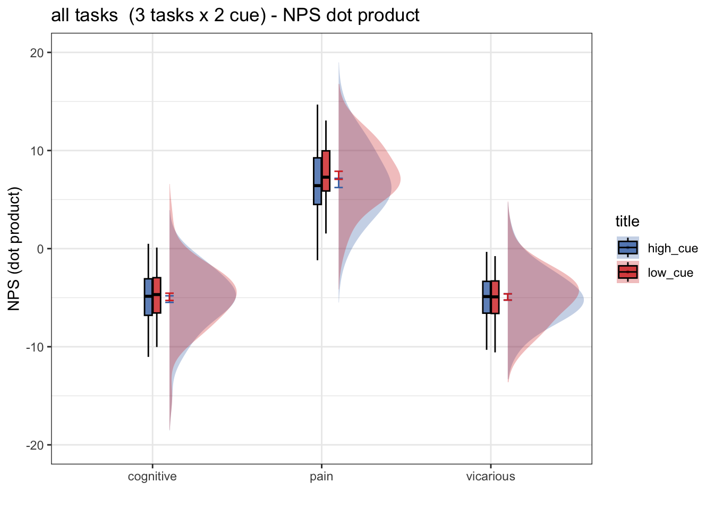
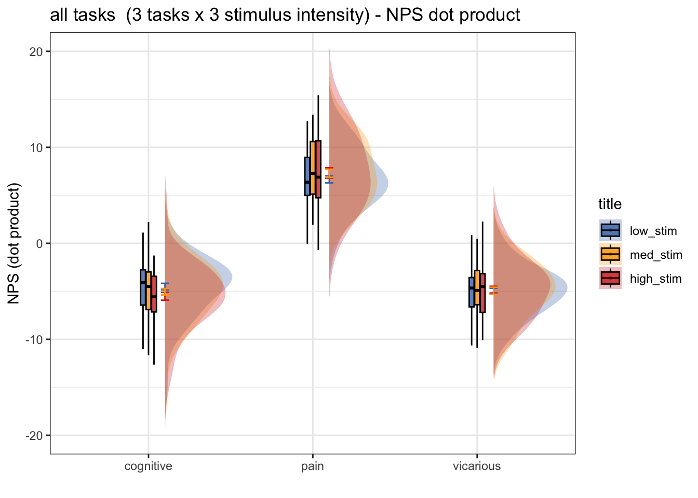
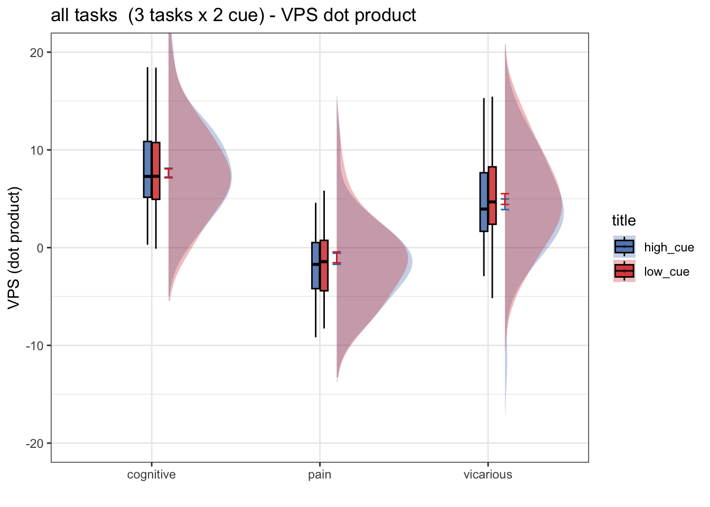
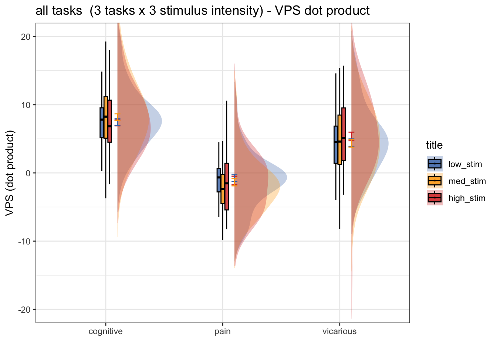

# biomarker NPS ~ cue * stim (2022) {#nps_22}
```
author: "Heejung Jung"
date: "6/12/2022"
output: html_document
```

## load libraries


### NPS load csv file {.unlisted .unnumbered}


### NPS run 2 factor model (task x cue) {.unlisted .unnumbered}


### NPS cue effect


## NPS stim effect



## VPS
### VPS load csv file {.unlisted .unnumbered}


### VPS run 2 factor model (task x cue) {.unlisted .unnumbered}


## VPS cue effect


## VPS stim effect


