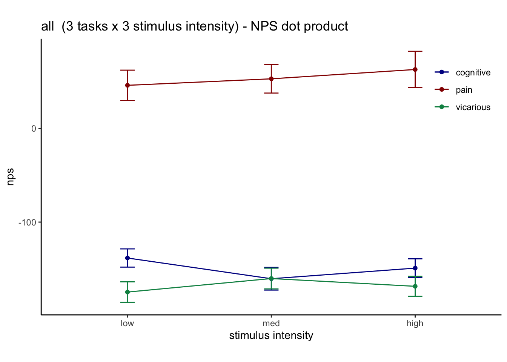

# NPSdummy ~ stim * task (contrast-notscaled-error) {#nps_stim_error}

```
author: "Heejung Jung"
date: "2023-02-02"
```

## Function {.unlisted .unnumbered}


## Common parameters {.unlisted .unnumbered}


```r
pain_keys <- list(contrast_name = "P_simple", taskname = "pain",con_list = c(32,33,34,35,36,37), npsdir = npsdir)
vicarious_keys <- list(contrast_name = "V_simple", taskname = "vicarious",con_list = c(38,39,40,41,42,43), npsdir = npsdir)
cog_keys <- list(contrast_name = "C_simple", taskname = "cognitive", con_list = c(44,45,46,47,48,49), npsdir = npsdir)

p = NPS_load_df(pain_keys)
```

```
## [1] "P_simple"
```

```r
v = NPS_load_df(vicarious_keys)
```

```
## [1] "V_simple"
```

```r
c = NPS_load_df(cog_keys)
```

```
## [1] "C_simple"
```

```r
pvc <- reshape::merge_recurse(list(p,v,c))
```


```r
pvc <- NPS_simple_contrasts(pvc)
```


```r
subject_varkey <- "subject"
iv1 <- "task"
iv2 <- "stim_ordered"
dv <- "nps"
dv_keyword <- "NPS"
subject <- "subject"
xlab <- ""
ylab <- "NPS (dot product)"
ylim <- c(-20,20)
title <- "NPS extracted from contrasts that weren't scaled correctly"
#taskname <- "all tasks"
exclude <- "sub-0001|sub-0003|sub-0004|sub-0005|sub-0025|sub-0999"
w <- 10
h <- 6
```


```r
taskname = "all"
plot_keys <- list(sub_mean = "mean_per_sub",group_mean = "mean_per_sub_norm_mean", se = "se",
    subject = "subject", taskname = taskname,
    ggtitle = paste(taskname, " - NPS (dot prodcut) Cooksd removed"),
    title = paste(taskname, " - NPS (dotproduct)"),
    xlab = "",
    ylab = "ratings (degree)",
    ylim = c(-250,500),
    dv_keyword = "NPS",
    w = 10,
    h = 6,
    plot_savefname = file.path(
        analysis_dir,
        paste("raincloud_task-", taskname,
            "_rating-", dv_keyword,
            "_", as.character(Sys.Date()), "_cooksd.png",
            sep = ""
        )
    ),
    model_iv1 ="stim_ordered",
    model_iv2 = "cue_ordered")
```


```r
summary <- NPS_summary_for_plots(df = pvc, 
                             
                             groupwise_measurevar = "mean_per_sub",
                             subject_keyword = "subject",
                             model_iv1 = "task",
                             model_iv2 = "stim_ordered")
```

```
## Automatically converting the following non-factors to factors: task
```

```r
subjectwise <- as.data.frame(summary[[1]])
groupwise <-as.data.frame(summary[[2]])
    if (any(startsWith(plot_keys$dv_keyword, c("expect", "Expect")))) {
        color <- c("#1B9E77", "#D95F02")
    } else {
        color <- c("#4575B4", "#D73027")
    } 
```

### Raincloud plots

```r
    if (any(startsWith(dv_keyword, c("expect", "Expect")))) {
        color <- c("#1B9E77", "#D95F02", "#D95F02")
    } else {
        color <- c("#4575B4", "#FFA500", "#D73027")
    }
    subject_mean <- "mean_per_sub"
    group_mean <- "mean_per_sub_norm_mean"
    se <- "se"
    ylim <- c(-800,800)
    subject <- "subject"
    ggtitle <- paste(taskname, " (3 tasks x 3 stimulus intensity) - NPS dot product")
    title <- paste(taskname, " (3 tasks x 3 stimulus intensity) - NPS dot product")
    xlab <- ""
    ylab <- "NPS (dot product)"
    plot2_savefname <- file.path(
        analysis_dir,
        paste("raincloudplots_task-", taskname,"_event-",iv2,
            "_rating-", dv_keyword,
            "_", as.character(Sys.Date()), ".png",
            sep = ""
        )
    )
    plot_rainclouds_twofactor(
      subjectwise, groupwise, iv1, iv2, 
      subject_mean, group_mean, se, subject, 
      ggtitle, title, xlab, ylab, taskname, ylim,
      w, h, dv_keyword, color, plot2_savefname)
```

```
## Warning in geom_line(data = subjectwise, aes(group = .data[[subject]], y
## = .data[[sub_mean]], : Ignoring unknown aesthetics: fill
```

```
## Warning: Duplicated aesthetics after name standardisation: width
```

```
## Warning in FUN(X[[i]], ...): NAs introduced by coercion

## Warning in FUN(X[[i]], ...): NAs introduced by coercion
```

```
## Warning in min(x): no non-missing arguments to min; returning Inf
```

```
## Warning in max(x): no non-missing arguments to max; returning -Inf
```

```
## Warning: Using the `size` aesthietic with geom_polygon was deprecated in ggplot2 3.4.0.
## ℹ Please use the `linewidth` aesthetic instead.
```

```
## Warning: Removed 540 rows containing missing values (`geom_line()`).
```

```
## Warning: Removed 540 rows containing missing values (`geom_point()`).
```

```
## Warning in FUN(X[[i]], ...): NAs introduced by coercion

## Warning in FUN(X[[i]], ...): NAs introduced by coercion
```

```
## Warning in min(x): no non-missing arguments to min; returning Inf
```

```
## Warning in max(x): no non-missing arguments to max; returning -Inf
```

```
## Warning: Removed 540 rows containing missing values (`geom_line()`).
```

```
## Warning: Removed 540 rows containing missing values (`geom_point()`).
```


### Line plots

```r
g<-two_factor_lineplot(df = groupwise,  iv1 = "stim_ordered",iv2 = "task", mean = "mean_per_sub_norm_mean", error = "se",
                       xlab = "stimulus intensity",
                       ylab = dv)
g
```




