# [fMRI] NPS ~ singletrial {#ch99_singletrial_clean}


## What is the purpose of this notebook? {.unlisted .unnumbered}

* Here, I model NPS dot products as a function of cue, stimulus intensity and expectation ratings. 
* One of the findings is that low cues lead to higher NPS dotproducts in the high intensity group, and that this effect becomes non-significant across sessions. 
* 03/23/2023: For now, I'm grabbing participants that have complete data, i.e. 18 runs, all three sessions. 


#### Contrast weight table {.unlisted .unnumbered}
<table class="table table-striped" style="font-size: 15px; ">
<caption style="font-size: initial !important;">(\#tab:unnamed-chunk-4)Contrast weights</caption>
 <thead>
  <tr>
   <th style="text-align:left;">   </th>
   <th style="text-align:right;"> pain </th>
   <th style="text-align:right;"> vicarious </th>
   <th style="text-align:right;"> cognitive </th>
  </tr>
 </thead>
<tbody>
  <tr>
   <td style="text-align:left;"> task_V_gt_C </td>
   <td style="text-align:right;"> 0.00 </td>
   <td style="text-align:right;"> 0.50 </td>
   <td style="text-align:right;"> -0.50 </td>
  </tr>
  <tr>
   <td style="text-align:left;"> task_P_gt_VC </td>
   <td style="text-align:right;"> 0.66 </td>
   <td style="text-align:right;"> -0.34 </td>
   <td style="text-align:right;"> -0.34 </td>
  </tr>
</tbody>
</table>


## NPS ~ paintask: 2 cue x 3 stimulus_intensity

### Q. Within pain task, Does stimulus intenisty level and cue level significantly predict NPS dotproducts? {.unlisted .unnumbered}
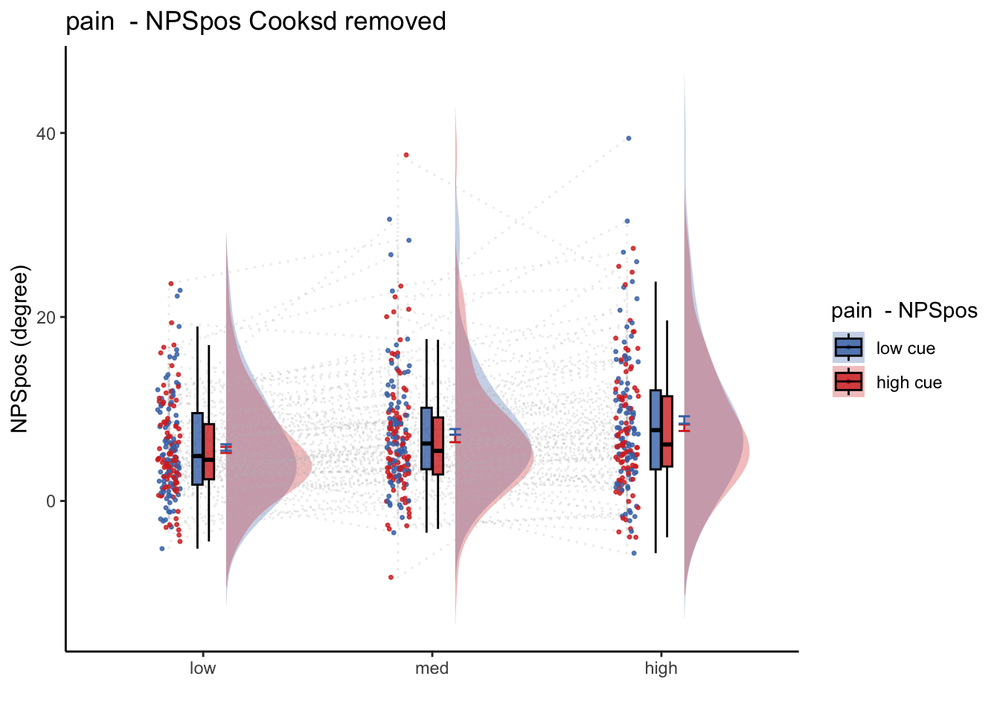


### Lineplots {.unlisted .unnumbered}
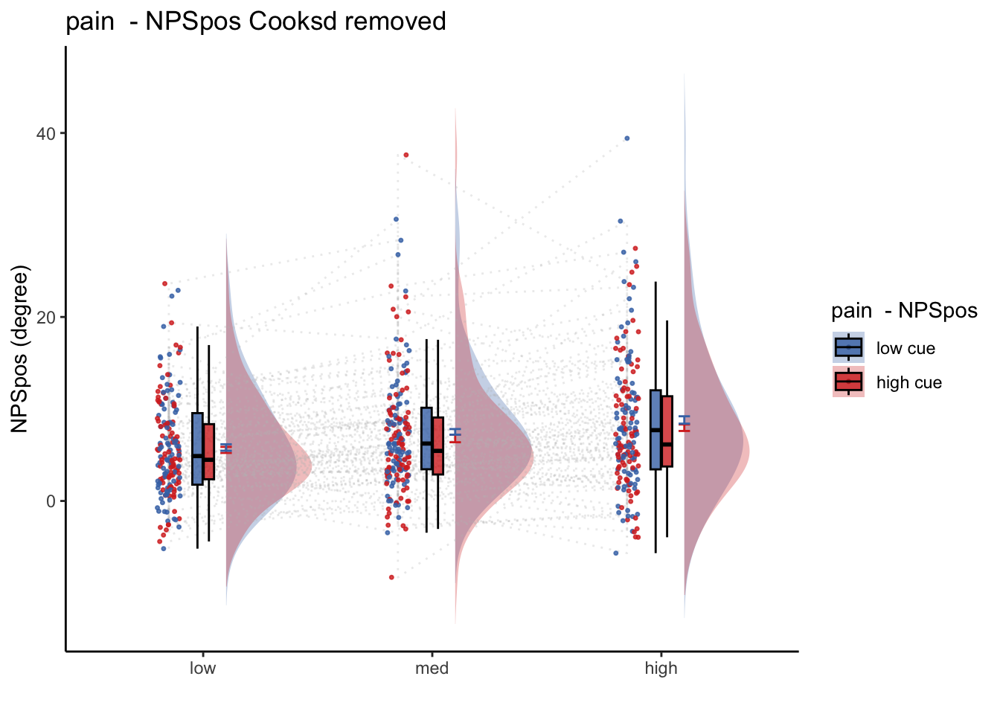


### Linear model results (NPS ~ paintask: 2 cue x 3 stimulus_intensity)

```r
model.npscuestim <- lmer(NPSpos ~ 
                          CUE_high_gt_low*STIM_linear +CUE_high_gt_low * STIM_quadratic +
                          (CUE_high_gt_low+STIM|sub), data = data_screen
                    )
sjPlot::tab_model(model.npscuestim,
                  title = "Multilevel-modeling: \nlmer(NPSpos ~ CUE * STIM + (CUE + STIM | sub), data = pvc)",
                  CSS = list(css.table = '+font-size: 12;'))
```

<table style="border-collapse:collapse; border:none;font-size: 12;">
<caption style="font-weight: bold; text-align:left;">Multilevel-modeling: 
lmer(NPSpos ~ CUE * STIM + (CUE + STIM | sub), data = pvc)</caption>
<tr>
<th style="border-top: double; text-align:center; font-style:italic; font-weight:normal; padding:0.2cm; border-bottom:1px solid black; text-align:left; ">&nbsp;</th>
<th colspan="3" style="border-top: double; text-align:center; font-style:italic; font-weight:normal; padding:0.2cm; border-bottom:1px solid black;">NPSpos</th>
</tr>
<tr>
<td style=" text-align:center; border-bottom:1px solid; font-style:italic; font-weight:normal; border-bottom:1px solid black; text-align:left; ">Predictors</td>
<td style=" text-align:center; border-bottom:1px solid; font-style:italic; font-weight:normal; border-bottom:1px solid black; ">Estimates</td>
<td style=" text-align:center; border-bottom:1px solid; font-style:italic; font-weight:normal; border-bottom:1px solid black; ">CI</td>
<td style=" text-align:center; border-bottom:1px solid; font-style:italic; font-weight:normal; border-bottom:1px solid black; ">p</td>
</tr>
<tr>
<td style=" padding:0.2cm; text-align:left; vertical-align:top; text-align:left; ">(Intercept)</td>
<td style=" padding:0.2cm; text-align:left; vertical-align:top; text-align:center;  ">7.01</td>
<td style=" padding:0.2cm; text-align:left; vertical-align:top; text-align:center;  ">5.85&nbsp;&ndash;&nbsp;8.17</td>
<td style=" padding:0.2cm; text-align:left; vertical-align:top; text-align:center;  "><strong>&lt;0.001</strong></td>
</tr>
<tr>
<td style=" padding:0.2cm; text-align:left; vertical-align:top; text-align:left; ">CUE high gt low</td>
<td style=" padding:0.2cm; text-align:left; vertical-align:top; text-align:center;  ">&#45;0.77</td>
<td style=" padding:0.2cm; text-align:left; vertical-align:top; text-align:center;  ">&#45;1.31&nbsp;&ndash;&nbsp;-0.23</td>
<td style=" padding:0.2cm; text-align:left; vertical-align:top; text-align:center;  "><strong>0.005</strong></td>
</tr>
<tr>
<td style=" padding:0.2cm; text-align:left; vertical-align:top; text-align:left; ">STIM linear</td>
<td style=" padding:0.2cm; text-align:left; vertical-align:top; text-align:center;  ">2.62</td>
<td style=" padding:0.2cm; text-align:left; vertical-align:top; text-align:center;  ">1.93&nbsp;&ndash;&nbsp;3.31</td>
<td style=" padding:0.2cm; text-align:left; vertical-align:top; text-align:center;  "><strong>&lt;0.001</strong></td>
</tr>
<tr>
<td style=" padding:0.2cm; text-align:left; vertical-align:top; text-align:left; ">STIM quadratic</td>
<td style=" padding:0.2cm; text-align:left; vertical-align:top; text-align:center;  ">0.02</td>
<td style=" padding:0.2cm; text-align:left; vertical-align:top; text-align:center;  ">&#45;0.53&nbsp;&ndash;&nbsp;0.57</td>
<td style=" padding:0.2cm; text-align:left; vertical-align:top; text-align:center;  ">0.944</td>
</tr>
<tr>
<td style=" padding:0.2cm; text-align:left; vertical-align:top; text-align:left; ">CUE high gt low * STIM<br>linear</td>
<td style=" padding:0.2cm; text-align:left; vertical-align:top; text-align:center;  ">&#45;0.62</td>
<td style=" padding:0.2cm; text-align:left; vertical-align:top; text-align:center;  ">&#45;1.83&nbsp;&ndash;&nbsp;0.59</td>
<td style=" padding:0.2cm; text-align:left; vertical-align:top; text-align:center;  ">0.311</td>
</tr>
<tr>
<td style=" padding:0.2cm; text-align:left; vertical-align:top; text-align:left; ">CUE high gt low * STIM<br>quadratic</td>
<td style=" padding:0.2cm; text-align:left; vertical-align:top; text-align:center;  ">&#45;0.67</td>
<td style=" padding:0.2cm; text-align:left; vertical-align:top; text-align:center;  ">&#45;1.73&nbsp;&ndash;&nbsp;0.39</td>
<td style=" padding:0.2cm; text-align:left; vertical-align:top; text-align:center;  ">0.214</td>
</tr>
<tr>
<td colspan="4" style="font-weight:bold; text-align:left; padding-top:.8em;">Random Effects</td>
</tr>

<tr>
<td style=" padding:0.2cm; text-align:left; vertical-align:top; text-align:left; padding-top:0.1cm; padding-bottom:0.1cm;">&sigma;<sup>2</sup></td>
<td style=" padding:0.2cm; text-align:left; vertical-align:top; padding-top:0.1cm; padding-bottom:0.1cm; text-align:center;" colspan="3">62.90</td>
</tr>

<tr>
<td style=" padding:0.2cm; text-align:left; vertical-align:top; text-align:left; padding-top:0.1cm; padding-bottom:0.1cm;">&tau;<sub>00</sub> <sub>sub</sub></td>
<td style=" padding:0.2cm; text-align:left; vertical-align:top; padding-top:0.1cm; padding-bottom:0.1cm; text-align:center;" colspan="3">39.93</td>

<tr>
<td style=" padding:0.2cm; text-align:left; vertical-align:top; text-align:left; padding-top:0.1cm; padding-bottom:0.1cm;">&tau;<sub>11</sub> <sub>sub.CUE_high_gt_low</sub></td>
<td style=" padding:0.2cm; text-align:left; vertical-align:top; padding-top:0.1cm; padding-bottom:0.1cm; text-align:center;" colspan="3">0.96</td>

<tr>
<td style=" padding:0.2cm; text-align:left; vertical-align:top; text-align:left; padding-top:0.1cm; padding-bottom:0.1cm;">&tau;<sub>11</sub> <sub>sub.STIMlow</sub></td>
<td style=" padding:0.2cm; text-align:left; vertical-align:top; padding-top:0.1cm; padding-bottom:0.1cm; text-align:center;" colspan="3">2.45</td>

<tr>
<td style=" padding:0.2cm; text-align:left; vertical-align:top; text-align:left; padding-top:0.1cm; padding-bottom:0.1cm;">&tau;<sub>11</sub> <sub>sub.STIMmed</sub></td>
<td style=" padding:0.2cm; text-align:left; vertical-align:top; padding-top:0.1cm; padding-bottom:0.1cm; text-align:center;" colspan="3">1.81</td>

<tr>
<td style=" padding:0.2cm; text-align:left; vertical-align:top; text-align:left; padding-top:0.1cm; padding-bottom:0.1cm;">&rho;<sub>01</sub></td>
<td style=" padding:0.2cm; text-align:left; vertical-align:top; padding-top:0.1cm; padding-bottom:0.1cm; text-align:center;" colspan="3">-0.61</td>

<tr>
<td style=" padding:0.2cm; text-align:left; vertical-align:top; text-align:left; padding-top:0.1cm; padding-bottom:0.1cm;"></td>
<td style=" padding:0.2cm; text-align:left; vertical-align:top; padding-top:0.1cm; padding-bottom:0.1cm; text-align:center;" colspan="3">-0.96</td>

<tr>
<td style=" padding:0.2cm; text-align:left; vertical-align:top; text-align:left; padding-top:0.1cm; padding-bottom:0.1cm;"></td>
<td style=" padding:0.2cm; text-align:left; vertical-align:top; padding-top:0.1cm; padding-bottom:0.1cm; text-align:center;" colspan="3">-0.82</td>

<tr>
<td style=" padding:0.2cm; text-align:left; vertical-align:top; text-align:left; padding-top:0.1cm; padding-bottom:0.1cm;">N <sub>sub</sub></td>
<td style=" padding:0.2cm; text-align:left; vertical-align:top; padding-top:0.1cm; padding-bottom:0.1cm; text-align:center;" colspan="3">91</td>
<tr>
<td style=" padding:0.2cm; text-align:left; vertical-align:top; text-align:left; padding-top:0.1cm; padding-bottom:0.1cm; border-top:1px solid;">Observations</td>
<td style=" padding:0.2cm; text-align:left; vertical-align:top; padding-top:0.1cm; padding-bottom:0.1cm; text-align:center; border-top:1px solid;" colspan="3">3961</td>
</tr>
<tr>
<td style=" padding:0.2cm; text-align:left; vertical-align:top; text-align:left; padding-top:0.1cm; padding-bottom:0.1cm;">Marginal R<sup>2</sup> / Conditional R<sup>2</sup></td>
<td style=" padding:0.2cm; text-align:left; vertical-align:top; padding-top:0.1cm; padding-bottom:0.1cm; text-align:center;" colspan="3">0.021 / NA</td>
</tr>

</table>

#### Linear model eta-squared {.unlisted .unnumbered}
<table class="table table-striped" style="font-size: 12px; ">
 <thead>
  <tr>
   <th style="text-align:left;"> Parameter </th>
   <th style="text-align:right;"> Eta2_partial </th>
   <th style="text-align:right;"> CI </th>
   <th style="text-align:right;"> CI_low </th>
   <th style="text-align:right;"> CI_high </th>
  </tr>
 </thead>
<tbody>
  <tr>
   <td style="text-align:left;"> CUE_high_gt_low </td>
   <td style="text-align:right;"> 0.0659453 </td>
   <td style="text-align:right;"> 0.95 </td>
   <td style="text-align:right;"> 0.0109806 </td>
   <td style="text-align:right;"> 1 </td>
  </tr>
  <tr>
   <td style="text-align:left;"> STIM_linear </td>
   <td style="text-align:right;"> 0.2695449 </td>
   <td style="text-align:right;"> 0.95 </td>
   <td style="text-align:right;"> 0.1750191 </td>
   <td style="text-align:right;"> 1 </td>
  </tr>
  <tr>
   <td style="text-align:left;"> STIM_quadratic </td>
   <td style="text-align:right;"> 0.0000189 </td>
   <td style="text-align:right;"> 0.95 </td>
   <td style="text-align:right;"> 0.0000000 </td>
   <td style="text-align:right;"> 1 </td>
  </tr>
  <tr>
   <td style="text-align:left;"> CUE_high_gt_low:STIM_linear </td>
   <td style="text-align:right;"> 0.0002695 </td>
   <td style="text-align:right;"> 0.95 </td>
   <td style="text-align:right;"> 0.0000000 </td>
   <td style="text-align:right;"> 1 </td>
  </tr>
  <tr>
   <td style="text-align:left;"> CUE_high_gt_low:STIM_quadratic </td>
   <td style="text-align:right;"> 0.0004054 </td>
   <td style="text-align:right;"> 0.95 </td>
   <td style="text-align:right;"> 0.0000000 </td>
   <td style="text-align:right;"> 1 </td>
  </tr>
</tbody>
</table>

#### Linear model Cohen's d: NPS stimulus_intensity d = 1.16, cue d = 0.45 {.unlisted .unnumbered}
<table class="table table-striped" style="font-size: 12px; ">
 <thead>
  <tr>
   <th style="text-align:left;">   </th>
   <th style="text-align:right;"> t </th>
   <th style="text-align:right;"> df </th>
   <th style="text-align:right;"> d </th>
  </tr>
 </thead>
<tbody>
  <tr>
   <td style="text-align:left;"> CUE_high_gt_low </td>
   <td style="text-align:right;"> -2.784759 </td>
   <td style="text-align:right;"> 109.8409 </td>
   <td style="text-align:right;"> -0.5314172 </td>
  </tr>
  <tr>
   <td style="text-align:left;"> STIM_linear </td>
   <td style="text-align:right;"> 7.450178 </td>
   <td style="text-align:right;"> 150.4166 </td>
   <td style="text-align:right;"> 1.2149230 </td>
  </tr>
  <tr>
   <td style="text-align:left;"> STIM_quadratic </td>
   <td style="text-align:right;"> 0.069956 </td>
   <td style="text-align:right;"> 259.5231 </td>
   <td style="text-align:right;"> 0.0086849 </td>
  </tr>
  <tr>
   <td style="text-align:left;"> CUE_high_gt_low:STIM_linear </td>
   <td style="text-align:right;"> -1.012647 </td>
   <td style="text-align:right;"> 3804.3322 </td>
   <td style="text-align:right;"> -0.0328359 </td>
  </tr>
  <tr>
   <td style="text-align:left;"> CUE_high_gt_low:STIM_quadratic </td>
   <td style="text-align:right;"> -1.241596 </td>
   <td style="text-align:right;"> 3800.8213 </td>
   <td style="text-align:right;"> -0.0402783 </td>
  </tr>
</tbody>
</table>


### 2 cue * 3 stimulus_intensity * expectation_rating 

```r
data_screen$EXPECT <- data_screen$event02_expect_angle
model.nps3factor <- lmer(NPSpos ~ 
                          CUE_high_gt_low*STIM_linear*EXPECT +
                           CUE_high_gt_low*STIM_quadratic*EXPECT +
                          (CUE_high_gt_low  |sub), data = data_screen
                    )
sjPlot::tab_model(model.nps3factor,
                  title = "Multilevel-modeling: \nlmer(NPSpos ~ CUE * STIM * EXPECTATION + (CUE + STIM + EXPECT | sub), data = pvc)",
                  CSS = list(css.table = '+font-size: 12;'))
```

<table style="border-collapse:collapse; border:none;font-size: 12;">
<caption style="font-weight: bold; text-align:left;">Multilevel-modeling: 
lmer(NPSpos ~ CUE * STIM * EXPECTATION + (CUE + STIM + EXPECT | sub), data = pvc)</caption>
<tr>
<th style="border-top: double; text-align:center; font-style:italic; font-weight:normal; padding:0.2cm; border-bottom:1px solid black; text-align:left; ">&nbsp;</th>
<th colspan="3" style="border-top: double; text-align:center; font-style:italic; font-weight:normal; padding:0.2cm; border-bottom:1px solid black;">NPSpos</th>
</tr>
<tr>
<td style=" text-align:center; border-bottom:1px solid; font-style:italic; font-weight:normal; border-bottom:1px solid black; text-align:left; ">Predictors</td>
<td style=" text-align:center; border-bottom:1px solid; font-style:italic; font-weight:normal; border-bottom:1px solid black; ">Estimates</td>
<td style=" text-align:center; border-bottom:1px solid; font-style:italic; font-weight:normal; border-bottom:1px solid black; ">CI</td>
<td style=" text-align:center; border-bottom:1px solid; font-style:italic; font-weight:normal; border-bottom:1px solid black; ">p</td>
</tr>
<tr>
<td style=" padding:0.2cm; text-align:left; vertical-align:top; text-align:left; ">(Intercept)</td>
<td style=" padding:0.2cm; text-align:left; vertical-align:top; text-align:center;  ">6.84</td>
<td style=" padding:0.2cm; text-align:left; vertical-align:top; text-align:center;  ">5.49&nbsp;&ndash;&nbsp;8.20</td>
<td style=" padding:0.2cm; text-align:left; vertical-align:top; text-align:center;  "><strong>&lt;0.001</strong></td>
</tr>
<tr>
<td style=" padding:0.2cm; text-align:left; vertical-align:top; text-align:left; ">CUE high gt low</td>
<td style=" padding:0.2cm; text-align:left; vertical-align:top; text-align:center;  ">&#45;0.72</td>
<td style=" padding:0.2cm; text-align:left; vertical-align:top; text-align:center;  ">&#45;1.91&nbsp;&ndash;&nbsp;0.47</td>
<td style=" padding:0.2cm; text-align:left; vertical-align:top; text-align:center;  ">0.238</td>
</tr>
<tr>
<td style=" padding:0.2cm; text-align:left; vertical-align:top; text-align:left; ">STIM linear</td>
<td style=" padding:0.2cm; text-align:left; vertical-align:top; text-align:center;  ">0.94</td>
<td style=" padding:0.2cm; text-align:left; vertical-align:top; text-align:center;  ">&#45;0.37&nbsp;&ndash;&nbsp;2.25</td>
<td style=" padding:0.2cm; text-align:left; vertical-align:top; text-align:center;  ">0.162</td>
</tr>
<tr>
<td style=" padding:0.2cm; text-align:left; vertical-align:top; text-align:left; ">EXPECT</td>
<td style=" padding:0.2cm; text-align:left; vertical-align:top; text-align:center;  ">0.00</td>
<td style=" padding:0.2cm; text-align:left; vertical-align:top; text-align:center;  ">&#45;0.01&nbsp;&ndash;&nbsp;0.01</td>
<td style=" padding:0.2cm; text-align:left; vertical-align:top; text-align:center;  ">0.568</td>
</tr>
<tr>
<td style=" padding:0.2cm; text-align:left; vertical-align:top; text-align:left; ">STIM quadratic</td>
<td style=" padding:0.2cm; text-align:left; vertical-align:top; text-align:center;  ">0.81</td>
<td style=" padding:0.2cm; text-align:left; vertical-align:top; text-align:center;  ">&#45;0.35&nbsp;&ndash;&nbsp;1.97</td>
<td style=" padding:0.2cm; text-align:left; vertical-align:top; text-align:center;  ">0.169</td>
</tr>
<tr>
<td style=" padding:0.2cm; text-align:left; vertical-align:top; text-align:left; ">CUE high gt low * STIM<br>linear</td>
<td style=" padding:0.2cm; text-align:left; vertical-align:top; text-align:center;  ">&#45;2.58</td>
<td style=" padding:0.2cm; text-align:left; vertical-align:top; text-align:center;  ">&#45;5.20&nbsp;&ndash;&nbsp;0.04</td>
<td style=" padding:0.2cm; text-align:left; vertical-align:top; text-align:center;  ">0.054</td>
</tr>
<tr>
<td style=" padding:0.2cm; text-align:left; vertical-align:top; text-align:left; ">CUE high gt low * EXPECT</td>
<td style=" padding:0.2cm; text-align:left; vertical-align:top; text-align:center;  ">&#45;0.00</td>
<td style=" padding:0.2cm; text-align:left; vertical-align:top; text-align:center;  ">&#45;0.02&nbsp;&ndash;&nbsp;0.01</td>
<td style=" padding:0.2cm; text-align:left; vertical-align:top; text-align:center;  ">0.756</td>
</tr>
<tr>
<td style=" padding:0.2cm; text-align:left; vertical-align:top; text-align:left; ">STIM linear * EXPECT</td>
<td style=" padding:0.2cm; text-align:left; vertical-align:top; text-align:center;  ">0.02</td>
<td style=" padding:0.2cm; text-align:left; vertical-align:top; text-align:center;  ">0.01&nbsp;&ndash;&nbsp;0.04</td>
<td style=" padding:0.2cm; text-align:left; vertical-align:top; text-align:center;  "><strong>0.010</strong></td>
</tr>
<tr>
<td style=" padding:0.2cm; text-align:left; vertical-align:top; text-align:left; ">CUE high gt low * STIM<br>quadratic</td>
<td style=" padding:0.2cm; text-align:left; vertical-align:top; text-align:center;  ">&#45;1.45</td>
<td style=" padding:0.2cm; text-align:left; vertical-align:top; text-align:center;  ">&#45;3.76&nbsp;&ndash;&nbsp;0.87</td>
<td style=" padding:0.2cm; text-align:left; vertical-align:top; text-align:center;  ">0.221</td>
</tr>
<tr>
<td style=" padding:0.2cm; text-align:left; vertical-align:top; text-align:left; ">EXPECT * STIM quadratic</td>
<td style=" padding:0.2cm; text-align:left; vertical-align:top; text-align:center;  ">&#45;0.01</td>
<td style=" padding:0.2cm; text-align:left; vertical-align:top; text-align:center;  ">&#45;0.03&nbsp;&ndash;&nbsp;0.00</td>
<td style=" padding:0.2cm; text-align:left; vertical-align:top; text-align:center;  ">0.073</td>
</tr>
<tr>
<td style=" padding:0.2cm; text-align:left; vertical-align:top; text-align:left; ">(CUE high gt low * STIM<br>linear) * EXPECT</td>
<td style=" padding:0.2cm; text-align:left; vertical-align:top; text-align:center;  ">0.02</td>
<td style=" padding:0.2cm; text-align:left; vertical-align:top; text-align:center;  ">&#45;0.02&nbsp;&ndash;&nbsp;0.05</td>
<td style=" padding:0.2cm; text-align:left; vertical-align:top; text-align:center;  ">0.347</td>
</tr>
<tr>
<td style=" padding:0.2cm; text-align:left; vertical-align:top; text-align:left; ">(CUE high gt low *<br>EXPECT) * STIM quadratic</td>
<td style=" padding:0.2cm; text-align:left; vertical-align:top; text-align:center;  ">0.02</td>
<td style=" padding:0.2cm; text-align:left; vertical-align:top; text-align:center;  ">&#45;0.01&nbsp;&ndash;&nbsp;0.05</td>
<td style=" padding:0.2cm; text-align:left; vertical-align:top; text-align:center;  ">0.262</td>
</tr>
<tr>
<td colspan="4" style="font-weight:bold; text-align:left; padding-top:.8em;">Random Effects</td>
</tr>

<tr>
<td style=" padding:0.2cm; text-align:left; vertical-align:top; text-align:left; padding-top:0.1cm; padding-bottom:0.1cm;">&sigma;<sup>2</sup></td>
<td style=" padding:0.2cm; text-align:left; vertical-align:top; padding-top:0.1cm; padding-bottom:0.1cm; text-align:center;" colspan="3">63.44</td>
</tr>

<tr>
<td style=" padding:0.2cm; text-align:left; vertical-align:top; text-align:left; padding-top:0.1cm; padding-bottom:0.1cm;">&tau;<sub>00</sub> <sub>sub</sub></td>
<td style=" padding:0.2cm; text-align:left; vertical-align:top; padding-top:0.1cm; padding-bottom:0.1cm; text-align:center;" colspan="3">29.71</td>

<tr>
<td style=" padding:0.2cm; text-align:left; vertical-align:top; text-align:left; padding-top:0.1cm; padding-bottom:0.1cm;">&tau;<sub>11</sub> <sub>sub.CUE_high_gt_low</sub></td>
<td style=" padding:0.2cm; text-align:left; vertical-align:top; padding-top:0.1cm; padding-bottom:0.1cm; text-align:center;" colspan="3">1.04</td>

<tr>
<td style=" padding:0.2cm; text-align:left; vertical-align:top; text-align:left; padding-top:0.1cm; padding-bottom:0.1cm;">&rho;<sub>01</sub> <sub>sub</sub></td>
<td style=" padding:0.2cm; text-align:left; vertical-align:top; padding-top:0.1cm; padding-bottom:0.1cm; text-align:center;" colspan="3">-0.54</td>

<tr>
<td style=" padding:0.2cm; text-align:left; vertical-align:top; text-align:left; padding-top:0.1cm; padding-bottom:0.1cm;">ICC</td>
<td style=" padding:0.2cm; text-align:left; vertical-align:top; padding-top:0.1cm; padding-bottom:0.1cm; text-align:center;" colspan="3">0.32</td>

<tr>
<td style=" padding:0.2cm; text-align:left; vertical-align:top; text-align:left; padding-top:0.1cm; padding-bottom:0.1cm;">N <sub>sub</sub></td>
<td style=" padding:0.2cm; text-align:left; vertical-align:top; padding-top:0.1cm; padding-bottom:0.1cm; text-align:center;" colspan="3">91</td>
<tr>
<td style=" padding:0.2cm; text-align:left; vertical-align:top; text-align:left; padding-top:0.1cm; padding-bottom:0.1cm; border-top:1px solid;">Observations</td>
<td style=" padding:0.2cm; text-align:left; vertical-align:top; padding-top:0.1cm; padding-bottom:0.1cm; text-align:center; border-top:1px solid;" colspan="3">3825</td>
</tr>
<tr>
<td style=" padding:0.2cm; text-align:left; vertical-align:top; text-align:left; padding-top:0.1cm; padding-bottom:0.1cm;">Marginal R<sup>2</sup> / Conditional R<sup>2</sup></td>
<td style=" padding:0.2cm; text-align:left; vertical-align:top; padding-top:0.1cm; padding-bottom:0.1cm; text-align:center;" colspan="3">0.016 / 0.332</td>
</tr>

</table>

#### eta squared {.unlisted .unnumbered}
<table class="table table-striped" style="font-size: 12px; ">
 <thead>
  <tr>
   <th style="text-align:left;"> Parameter </th>
   <th style="text-align:right;"> Eta2_partial </th>
   <th style="text-align:right;"> CI </th>
   <th style="text-align:right;"> CI_low </th>
   <th style="text-align:right;"> CI_high </th>
  </tr>
 </thead>
<tbody>
  <tr>
   <td style="text-align:left;"> CUE_high_gt_low </td>
   <td style="text-align:right;"> 0.0068023 </td>
   <td style="text-align:right;"> 0.95 </td>
   <td style="text-align:right;"> 0.0000000 </td>
   <td style="text-align:right;"> 1 </td>
  </tr>
  <tr>
   <td style="text-align:left;"> STIM_linear </td>
   <td style="text-align:right;"> 0.0005305 </td>
   <td style="text-align:right;"> 0.95 </td>
   <td style="text-align:right;"> 0.0000000 </td>
   <td style="text-align:right;"> 1 </td>
  </tr>
  <tr>
   <td style="text-align:left;"> EXPECT </td>
   <td style="text-align:right;"> 0.0001752 </td>
   <td style="text-align:right;"> 0.95 </td>
   <td style="text-align:right;"> 0.0000000 </td>
   <td style="text-align:right;"> 1 </td>
  </tr>
  <tr>
   <td style="text-align:left;"> STIM_quadratic </td>
   <td style="text-align:right;"> 0.0005122 </td>
   <td style="text-align:right;"> 0.95 </td>
   <td style="text-align:right;"> 0.0000000 </td>
   <td style="text-align:right;"> 1 </td>
  </tr>
  <tr>
   <td style="text-align:left;"> CUE_high_gt_low:STIM_linear </td>
   <td style="text-align:right;"> 0.0010053 </td>
   <td style="text-align:right;"> 0.95 </td>
   <td style="text-align:right;"> 0.0000000 </td>
   <td style="text-align:right;"> 1 </td>
  </tr>
  <tr>
   <td style="text-align:left;"> CUE_high_gt_low:EXPECT </td>
   <td style="text-align:right;"> 0.0003779 </td>
   <td style="text-align:right;"> 0.95 </td>
   <td style="text-align:right;"> 0.0000000 </td>
   <td style="text-align:right;"> 1 </td>
  </tr>
  <tr>
   <td style="text-align:left;"> STIM_linear:EXPECT </td>
   <td style="text-align:right;"> 0.0017799 </td>
   <td style="text-align:right;"> 0.95 </td>
   <td style="text-align:right;"> 0.0002284 </td>
   <td style="text-align:right;"> 1 </td>
  </tr>
  <tr>
   <td style="text-align:left;"> CUE_high_gt_low:STIM_quadratic </td>
   <td style="text-align:right;"> 0.0004069 </td>
   <td style="text-align:right;"> 0.95 </td>
   <td style="text-align:right;"> 0.0000000 </td>
   <td style="text-align:right;"> 1 </td>
  </tr>
  <tr>
   <td style="text-align:left;"> EXPECT:STIM_quadratic </td>
   <td style="text-align:right;"> 0.0008710 </td>
   <td style="text-align:right;"> 0.95 </td>
   <td style="text-align:right;"> 0.0000000 </td>
   <td style="text-align:right;"> 1 </td>
  </tr>
  <tr>
   <td style="text-align:left;"> CUE_high_gt_low:STIM_linear:EXPECT </td>
   <td style="text-align:right;"> 0.0002392 </td>
   <td style="text-align:right;"> 0.95 </td>
   <td style="text-align:right;"> 0.0000000 </td>
   <td style="text-align:right;"> 1 </td>
  </tr>
  <tr>
   <td style="text-align:left;"> CUE_high_gt_low:EXPECT:STIM_quadratic </td>
   <td style="text-align:right;"> 0.0003407 </td>
   <td style="text-align:right;"> 0.95 </td>
   <td style="text-align:right;"> 0.0000000 </td>
   <td style="text-align:right;"> 1 </td>
  </tr>
</tbody>
</table>

#### Cohen's d {.unlisted .unnumbered}
<table class="table table-striped" style="font-size: 12px; ">
 <thead>
  <tr>
   <th style="text-align:left;">   </th>
   <th style="text-align:right;"> t </th>
   <th style="text-align:right;"> df </th>
   <th style="text-align:right;"> d </th>
  </tr>
 </thead>
<tbody>
  <tr>
   <td style="text-align:left;"> CUE_high_gt_low </td>
   <td style="text-align:right;"> -1.1813078 </td>
   <td style="text-align:right;"> 203.7533 </td>
   <td style="text-align:right;"> -0.1655163 </td>
  </tr>
  <tr>
   <td style="text-align:left;"> STIM_linear </td>
   <td style="text-align:right;"> 1.4000859 </td>
   <td style="text-align:right;"> 3692.9301 </td>
   <td style="text-align:right;"> 0.0460786 </td>
  </tr>
  <tr>
   <td style="text-align:left;"> EXPECT </td>
   <td style="text-align:right;"> 0.5713317 </td>
   <td style="text-align:right;"> 1863.1849 </td>
   <td style="text-align:right;"> 0.0264722 </td>
  </tr>
  <tr>
   <td style="text-align:left;"> STIM_quadratic </td>
   <td style="text-align:right;"> 1.3759005 </td>
   <td style="text-align:right;"> 3693.7820 </td>
   <td style="text-align:right;"> 0.0452774 </td>
  </tr>
  <tr>
   <td style="text-align:left;"> CUE_high_gt_low:STIM_linear </td>
   <td style="text-align:right;"> -1.9278539 </td>
   <td style="text-align:right;"> 3693.3372 </td>
   <td style="text-align:right;"> -0.0634446 </td>
  </tr>
  <tr>
   <td style="text-align:left;"> CUE_high_gt_low:EXPECT </td>
   <td style="text-align:right;"> -0.3105411 </td>
   <td style="text-align:right;"> 255.1123 </td>
   <td style="text-align:right;"> -0.0388851 </td>
  </tr>
  <tr>
   <td style="text-align:left;"> STIM_linear:EXPECT </td>
   <td style="text-align:right;"> 2.5669934 </td>
   <td style="text-align:right;"> 3695.6467 </td>
   <td style="text-align:right;"> 0.0844519 </td>
  </tr>
  <tr>
   <td style="text-align:left;"> CUE_high_gt_low:STIM_quadratic </td>
   <td style="text-align:right;"> -1.2250398 </td>
   <td style="text-align:right;"> 3686.6417 </td>
   <td style="text-align:right;"> -0.0403520 </td>
  </tr>
  <tr>
   <td style="text-align:left;"> EXPECT:STIM_quadratic </td>
   <td style="text-align:right;"> -1.7951705 </td>
   <td style="text-align:right;"> 3696.5488 </td>
   <td style="text-align:right;"> -0.0590524 </td>
  </tr>
  <tr>
   <td style="text-align:left;"> CUE_high_gt_low:STIM_linear:EXPECT </td>
   <td style="text-align:right;"> 0.9398663 </td>
   <td style="text-align:right;"> 3692.7896 </td>
   <td style="text-align:right;"> 0.0309328 </td>
  </tr>
  <tr>
   <td style="text-align:left;"> CUE_high_gt_low:EXPECT:STIM_quadratic </td>
   <td style="text-align:right;"> 1.1210823 </td>
   <td style="text-align:right;"> 3687.8486 </td>
   <td style="text-align:right;"> 0.0369216 </td>
  </tr>
</tbody>
</table>


---

## NPS_ses01 ~ SES * CUE * STIM
### Q. Is the cue effect on NPS different across sessions? {.unlisted .unnumbered}

> Quick answer: Yes, the cue effect in session 1 (for high intensity group) is significantly different; whereas this different becomes non significant in session 4. 
> To unpack, a participant was informed to experience a low  stimulus intensity, when in fact they were delivered a high intensity stimulus. This violation presumably leads to a higher NPS response, given that they were delivered a much painful stimulus than expected. The fact that the cue effect is almost non significant during the last session indicates that the cue effects are not just an anchoring effect. 

#### Session wise plots
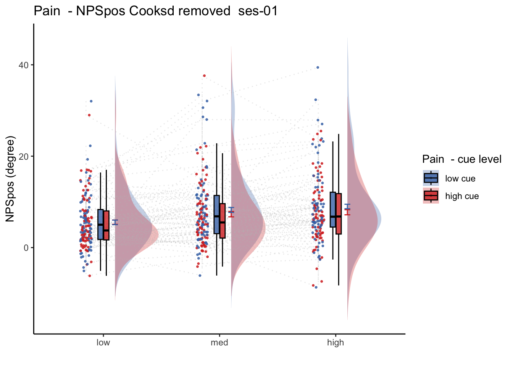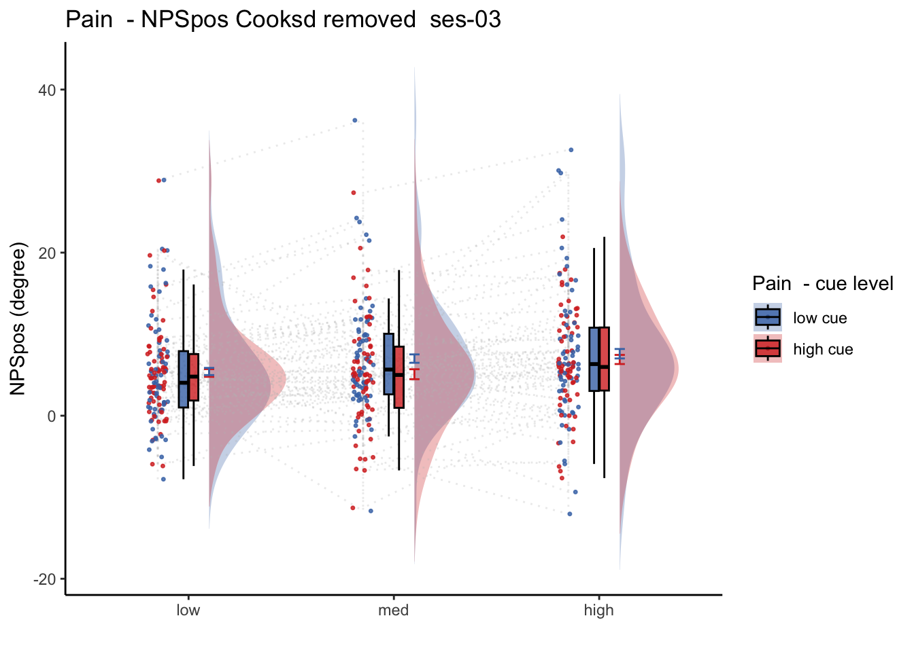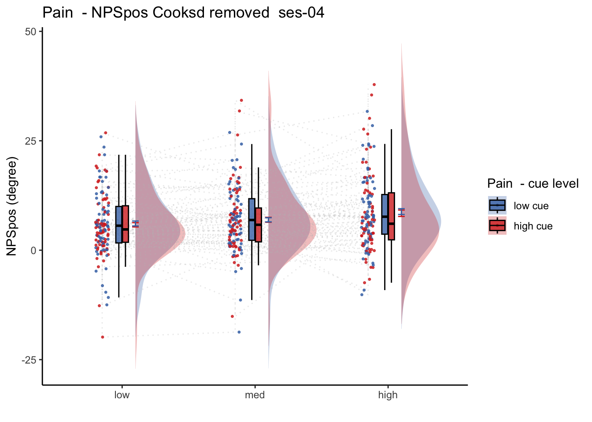


### Here are the stats models: NPS~session * cue * stimulus_intensity
1. Calculate difference score
* average high and low cue within run. 
* calculate difference between high and low cue per run
* each participant has 6 contrast scores
* run this as a function of stimulus intensity and sessions


---

## OUTCOME ~ NPS
### Q. Do higher NPS values indicate higher outcome ratings? (Pain task only) {.unlisted .unnumbered}

> Yes, Higher NPS values are associated with higher outcome ratings. The linear relationship between NPS value and outcome ratings are stronger for conditions where cue level is congruent with stimulus intensity levels. In other words, NPS-outcome rating relationship is stringent in the low cue-low intensity group, as is the case for high cue-ghigh intensity group. 

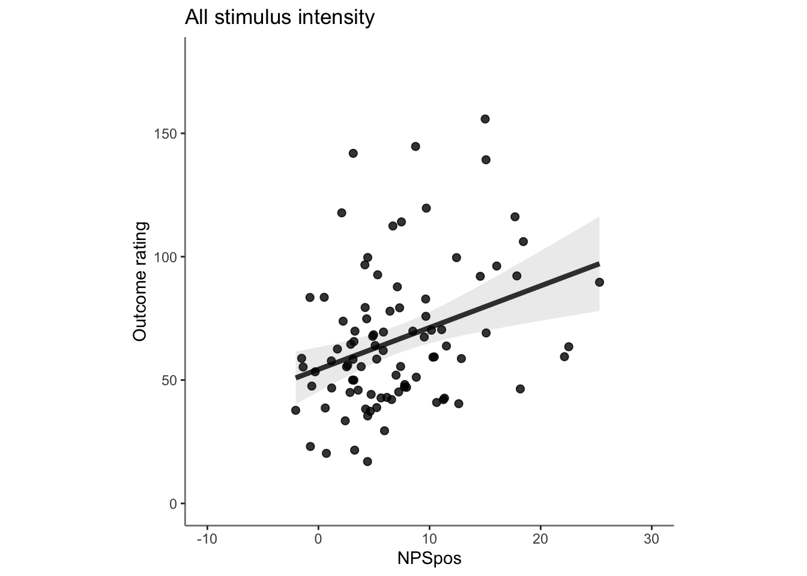

### outcome_rating * cue
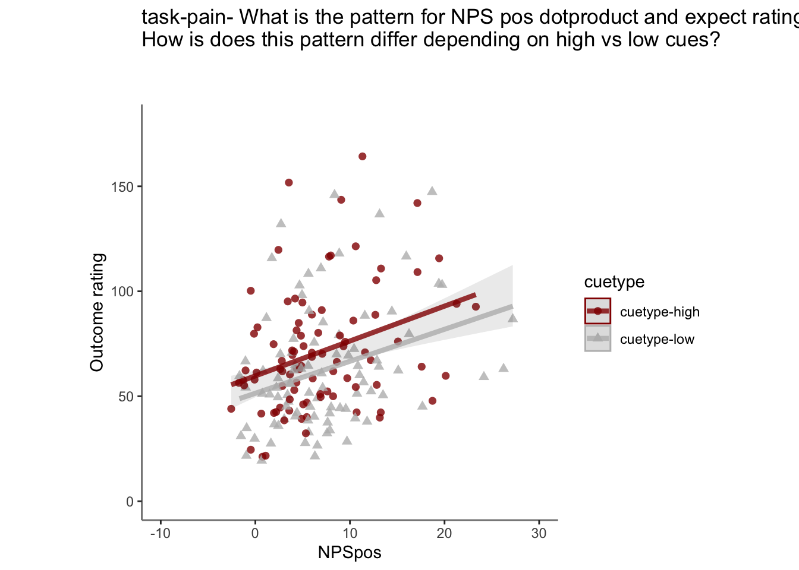


### outcome_ratings * stimulus_intensity * cue
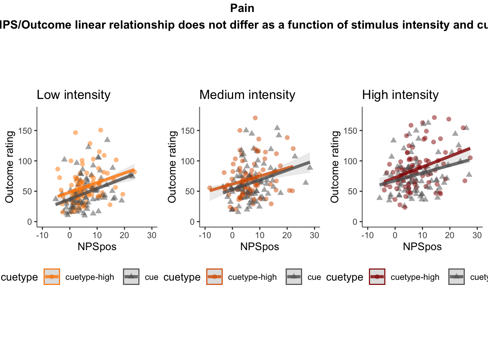

### demeaned outcome rating * cue

```
## `geom_smooth()` using formula = 'y ~ x'
```

```
## Warning: Removed 90 rows containing non-finite values (`stat_smooth()`).
```

```
## `geom_smooth()` using formula = 'y ~ x'
```

```
## Warning: Removed 90 rows containing non-finite values (`stat_smooth()`).
```

```
## Warning: Removed 90 rows containing missing values (`geom_point()`).
```

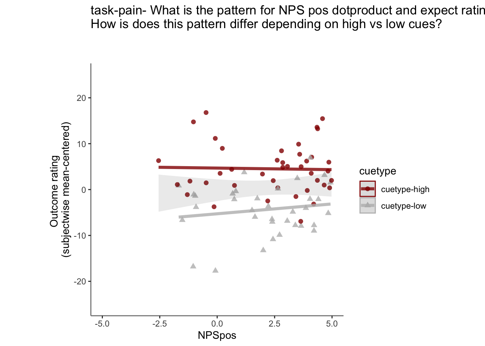

### demeaned_outcome_ratings * stimulus_intensity * cue
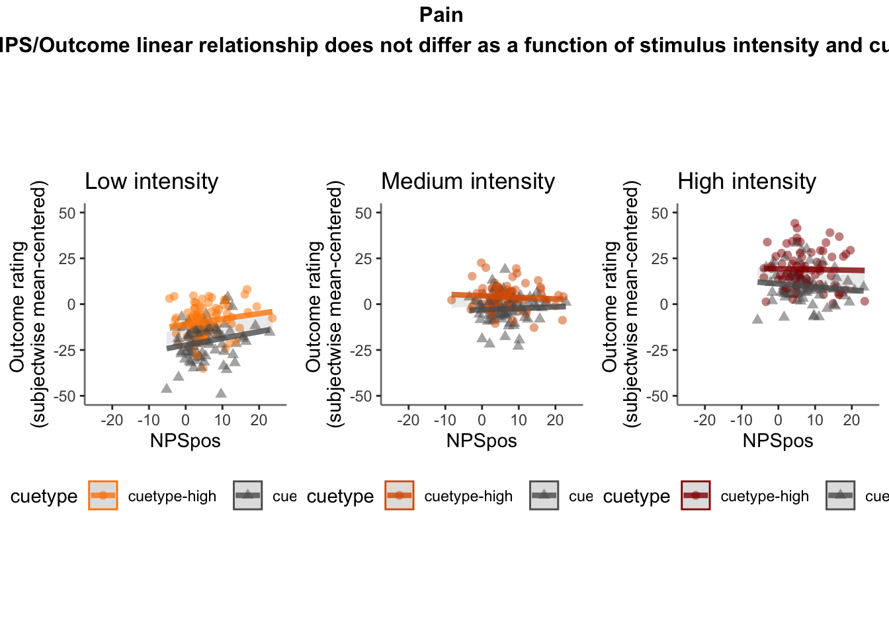

### Is this statistically significant?


```r
# organize variable names
# NPS_demean vs. NPSpos
model.npsoutcome <- lmer(OUTCOME_demean ~ CUE_high_gt_low*STIM_linear*NPSpos + CUE_high_gt_low*STIM_quadratic*NPSpos + (CUE_high_gt_low*STIM*NPSpos|sub), data = demean_dropna)
```

```
## Warning: Model failed to converge with 1 negative eigenvalue: -3.2e+02
```

```r
sjPlot::tab_model(model.npsoutcome,
                  title = "Multilevel-modeling: \nlmer(OUTCOME_demean ~ CUE * STIM * NPSpos + (CUE * STIM *NPSpos | sub), data = pvc)",
                  CSS = list(css.table = '+font-size: 12;'))
```

<table style="border-collapse:collapse; border:none;font-size: 12;">
<caption style="font-weight: bold; text-align:left;">Multilevel-modeling: 
lmer(OUTCOME_demean ~ CUE * STIM * NPSpos + (CUE * STIM *NPSpos | sub), data = pvc)</caption>
<tr>
<th style="border-top: double; text-align:center; font-style:italic; font-weight:normal; padding:0.2cm; border-bottom:1px solid black; text-align:left; ">&nbsp;</th>
<th colspan="3" style="border-top: double; text-align:center; font-style:italic; font-weight:normal; padding:0.2cm; border-bottom:1px solid black;">OUTCOME_demean</th>
</tr>
<tr>
<td style=" text-align:center; border-bottom:1px solid; font-style:italic; font-weight:normal; border-bottom:1px solid black; text-align:left; ">Predictors</td>
<td style=" text-align:center; border-bottom:1px solid; font-style:italic; font-weight:normal; border-bottom:1px solid black; ">Estimates</td>
<td style=" text-align:center; border-bottom:1px solid; font-style:italic; font-weight:normal; border-bottom:1px solid black; ">CI</td>
<td style=" text-align:center; border-bottom:1px solid; font-style:italic; font-weight:normal; border-bottom:1px solid black; ">p</td>
</tr>
<tr>
<td style=" padding:0.2cm; text-align:left; vertical-align:top; text-align:left; ">(Intercept)</td>
<td style=" padding:0.2cm; text-align:left; vertical-align:top; text-align:center;  ">&#45;1.05</td>
<td style=" padding:0.2cm; text-align:left; vertical-align:top; text-align:center;  ">&#45;1.83&nbsp;&ndash;&nbsp;-0.26</td>
<td style=" padding:0.2cm; text-align:left; vertical-align:top; text-align:center;  "><strong>0.009</strong></td>
</tr>
<tr>
<td style=" padding:0.2cm; text-align:left; vertical-align:top; text-align:left; ">CUE high gt low</td>
<td style=" padding:0.2cm; text-align:left; vertical-align:top; text-align:center;  ">9.28</td>
<td style=" padding:0.2cm; text-align:left; vertical-align:top; text-align:center;  ">7.05&nbsp;&ndash;&nbsp;11.50</td>
<td style=" padding:0.2cm; text-align:left; vertical-align:top; text-align:center;  "><strong>&lt;0.001</strong></td>
</tr>
<tr>
<td style=" padding:0.2cm; text-align:left; vertical-align:top; text-align:left; ">STIM linear</td>
<td style=" padding:0.2cm; text-align:left; vertical-align:top; text-align:center;  ">30.72</td>
<td style=" padding:0.2cm; text-align:left; vertical-align:top; text-align:center;  ">27.34&nbsp;&ndash;&nbsp;34.10</td>
<td style=" padding:0.2cm; text-align:left; vertical-align:top; text-align:center;  "><strong>&lt;0.001</strong></td>
</tr>
<tr>
<td style=" padding:0.2cm; text-align:left; vertical-align:top; text-align:left; ">NPSpos</td>
<td style=" padding:0.2cm; text-align:left; vertical-align:top; text-align:center;  ">0.18</td>
<td style=" padding:0.2cm; text-align:left; vertical-align:top; text-align:center;  ">0.10&nbsp;&ndash;&nbsp;0.25</td>
<td style=" padding:0.2cm; text-align:left; vertical-align:top; text-align:center;  "><strong>&lt;0.001</strong></td>
</tr>
<tr>
<td style=" padding:0.2cm; text-align:left; vertical-align:top; text-align:left; ">STIM quadratic</td>
<td style=" padding:0.2cm; text-align:left; vertical-align:top; text-align:center;  ">1.13</td>
<td style=" padding:0.2cm; text-align:left; vertical-align:top; text-align:center;  ">&#45;0.55&nbsp;&ndash;&nbsp;2.81</td>
<td style=" padding:0.2cm; text-align:left; vertical-align:top; text-align:center;  ">0.186</td>
</tr>
<tr>
<td style=" padding:0.2cm; text-align:left; vertical-align:top; text-align:left; ">CUE high gt low * STIM<br>linear</td>
<td style=" padding:0.2cm; text-align:left; vertical-align:top; text-align:center;  ">&#45;2.89</td>
<td style=" padding:0.2cm; text-align:left; vertical-align:top; text-align:center;  ">&#45;6.79&nbsp;&ndash;&nbsp;1.01</td>
<td style=" padding:0.2cm; text-align:left; vertical-align:top; text-align:center;  ">0.146</td>
</tr>
<tr>
<td style=" padding:0.2cm; text-align:left; vertical-align:top; text-align:left; ">CUE high gt low * NPSpos</td>
<td style=" padding:0.2cm; text-align:left; vertical-align:top; text-align:center;  ">&#45;0.06</td>
<td style=" padding:0.2cm; text-align:left; vertical-align:top; text-align:center;  ">&#45;0.22&nbsp;&ndash;&nbsp;0.09</td>
<td style=" padding:0.2cm; text-align:left; vertical-align:top; text-align:center;  ">0.409</td>
</tr>
<tr>
<td style=" padding:0.2cm; text-align:left; vertical-align:top; text-align:left; ">STIM linear * NPSpos</td>
<td style=" padding:0.2cm; text-align:left; vertical-align:top; text-align:center;  ">&#45;0.29</td>
<td style=" padding:0.2cm; text-align:left; vertical-align:top; text-align:center;  ">&#45;0.47&nbsp;&ndash;&nbsp;-0.10</td>
<td style=" padding:0.2cm; text-align:left; vertical-align:top; text-align:center;  "><strong>0.003</strong></td>
</tr>
<tr>
<td style=" padding:0.2cm; text-align:left; vertical-align:top; text-align:left; ">CUE high gt low * STIM<br>quadratic</td>
<td style=" padding:0.2cm; text-align:left; vertical-align:top; text-align:center;  ">&#45;3.88</td>
<td style=" padding:0.2cm; text-align:left; vertical-align:top; text-align:center;  ">&#45;7.25&nbsp;&ndash;&nbsp;-0.52</td>
<td style=" padding:0.2cm; text-align:left; vertical-align:top; text-align:center;  "><strong>0.024</strong></td>
</tr>
<tr>
<td style=" padding:0.2cm; text-align:left; vertical-align:top; text-align:left; ">NPSpos * STIM quadratic</td>
<td style=" padding:0.2cm; text-align:left; vertical-align:top; text-align:center;  ">&#45;0.01</td>
<td style=" padding:0.2cm; text-align:left; vertical-align:top; text-align:center;  ">&#45;0.17&nbsp;&ndash;&nbsp;0.14</td>
<td style=" padding:0.2cm; text-align:left; vertical-align:top; text-align:center;  ">0.875</td>
</tr>
<tr>
<td style=" padding:0.2cm; text-align:left; vertical-align:top; text-align:left; ">(CUE high gt low * STIM<br>linear) * NPSpos</td>
<td style=" padding:0.2cm; text-align:left; vertical-align:top; text-align:center;  ">0.21</td>
<td style=" padding:0.2cm; text-align:left; vertical-align:top; text-align:center;  ">&#45;0.14&nbsp;&ndash;&nbsp;0.56</td>
<td style=" padding:0.2cm; text-align:left; vertical-align:top; text-align:center;  ">0.238</td>
</tr>
<tr>
<td style=" padding:0.2cm; text-align:left; vertical-align:top; text-align:left; ">(CUE high gt low *<br>NPSpos) * STIM quadratic</td>
<td style=" padding:0.2cm; text-align:left; vertical-align:top; text-align:center;  ">&#45;0.06</td>
<td style=" padding:0.2cm; text-align:left; vertical-align:top; text-align:center;  ">&#45;0.38&nbsp;&ndash;&nbsp;0.27</td>
<td style=" padding:0.2cm; text-align:left; vertical-align:top; text-align:center;  ">0.738</td>
</tr>
<tr>
<td colspan="4" style="font-weight:bold; text-align:left; padding-top:.8em;">Random Effects</td>
</tr>

<tr>
<td style=" padding:0.2cm; text-align:left; vertical-align:top; text-align:left; padding-top:0.1cm; padding-bottom:0.1cm;">&sigma;<sup>2</sup></td>
<td style=" padding:0.2cm; text-align:left; vertical-align:top; padding-top:0.1cm; padding-bottom:0.1cm; text-align:center;" colspan="3">382.45</td>
</tr>

<tr>
<td style=" padding:0.2cm; text-align:left; vertical-align:top; text-align:left; padding-top:0.1cm; padding-bottom:0.1cm;">&tau;<sub>00</sub> <sub>sub</sub></td>
<td style=" padding:0.2cm; text-align:left; vertical-align:top; padding-top:0.1cm; padding-bottom:0.1cm; text-align:center;" colspan="3">47.47</td>

<tr>
<td style=" padding:0.2cm; text-align:left; vertical-align:top; text-align:left; padding-top:0.1cm; padding-bottom:0.1cm;">&tau;<sub>11</sub> <sub>sub.CUE_high_gt_low</sub></td>
<td style=" padding:0.2cm; text-align:left; vertical-align:top; padding-top:0.1cm; padding-bottom:0.1cm; text-align:center;" colspan="3">89.82</td>

<tr>
<td style=" padding:0.2cm; text-align:left; vertical-align:top; text-align:left; padding-top:0.1cm; padding-bottom:0.1cm;">&tau;<sub>11</sub> <sub>sub.STIMlow</sub></td>
<td style=" padding:0.2cm; text-align:left; vertical-align:top; padding-top:0.1cm; padding-bottom:0.1cm; text-align:center;" colspan="3">155.24</td>

<tr>
<td style=" padding:0.2cm; text-align:left; vertical-align:top; text-align:left; padding-top:0.1cm; padding-bottom:0.1cm;">&tau;<sub>11</sub> <sub>sub.STIMmed</sub></td>
<td style=" padding:0.2cm; text-align:left; vertical-align:top; padding-top:0.1cm; padding-bottom:0.1cm; text-align:center;" colspan="3">44.98</td>

<tr>
<td style=" padding:0.2cm; text-align:left; vertical-align:top; text-align:left; padding-top:0.1cm; padding-bottom:0.1cm;">&tau;<sub>11</sub> <sub>sub.NPSpos</sub></td>
<td style=" padding:0.2cm; text-align:left; vertical-align:top; padding-top:0.1cm; padding-bottom:0.1cm; text-align:center;" colspan="3">0.02</td>

<tr>
<td style=" padding:0.2cm; text-align:left; vertical-align:top; text-align:left; padding-top:0.1cm; padding-bottom:0.1cm;">&tau;<sub>11</sub> <sub>sub.CUE_high_gt_low:STIMlow</sub></td>
<td style=" padding:0.2cm; text-align:left; vertical-align:top; padding-top:0.1cm; padding-bottom:0.1cm; text-align:center;" colspan="3">21.43</td>

<tr>
<td style=" padding:0.2cm; text-align:left; vertical-align:top; text-align:left; padding-top:0.1cm; padding-bottom:0.1cm;">&tau;<sub>11</sub> <sub>sub.CUE_high_gt_low:STIMmed</sub></td>
<td style=" padding:0.2cm; text-align:left; vertical-align:top; padding-top:0.1cm; padding-bottom:0.1cm; text-align:center;" colspan="3">22.96</td>

<tr>
<td style=" padding:0.2cm; text-align:left; vertical-align:top; text-align:left; padding-top:0.1cm; padding-bottom:0.1cm;">&tau;<sub>11</sub> <sub>sub.CUE_high_gt_low:NPSpos</sub></td>
<td style=" padding:0.2cm; text-align:left; vertical-align:top; padding-top:0.1cm; padding-bottom:0.1cm; text-align:center;" colspan="3">0.25</td>

<tr>
<td style=" padding:0.2cm; text-align:left; vertical-align:top; text-align:left; padding-top:0.1cm; padding-bottom:0.1cm;">&tau;<sub>11</sub> <sub>sub.STIMlow:NPSpos</sub></td>
<td style=" padding:0.2cm; text-align:left; vertical-align:top; padding-top:0.1cm; padding-bottom:0.1cm; text-align:center;" colspan="3">0.03</td>

<tr>
<td style=" padding:0.2cm; text-align:left; vertical-align:top; text-align:left; padding-top:0.1cm; padding-bottom:0.1cm;">&tau;<sub>11</sub> <sub>sub.STIMmed:NPSpos</sub></td>
<td style=" padding:0.2cm; text-align:left; vertical-align:top; padding-top:0.1cm; padding-bottom:0.1cm; text-align:center;" colspan="3">0.06</td>

<tr>
<td style=" padding:0.2cm; text-align:left; vertical-align:top; text-align:left; padding-top:0.1cm; padding-bottom:0.1cm;">&tau;<sub>11</sub> <sub>sub.CUE_high_gt_low:STIMlow:NPSpos</sub></td>
<td style=" padding:0.2cm; text-align:left; vertical-align:top; padding-top:0.1cm; padding-bottom:0.1cm; text-align:center;" colspan="3">0.18</td>

<tr>
<td style=" padding:0.2cm; text-align:left; vertical-align:top; text-align:left; padding-top:0.1cm; padding-bottom:0.1cm;">&tau;<sub>11</sub> <sub>sub.CUE_high_gt_low:STIMmed:NPSpos</sub></td>
<td style=" padding:0.2cm; text-align:left; vertical-align:top; padding-top:0.1cm; padding-bottom:0.1cm; text-align:center;" colspan="3">0.44</td>

<tr>
<td style=" padding:0.2cm; text-align:left; vertical-align:top; text-align:left; padding-top:0.1cm; padding-bottom:0.1cm;">&rho;<sub>01</sub></td>
<td style=" padding:0.2cm; text-align:left; vertical-align:top; padding-top:0.1cm; padding-bottom:0.1cm; text-align:center;" colspan="3">-0.15</td>

<tr>
<td style=" padding:0.2cm; text-align:left; vertical-align:top; text-align:left; padding-top:0.1cm; padding-bottom:0.1cm;"></td>
<td style=" padding:0.2cm; text-align:left; vertical-align:top; padding-top:0.1cm; padding-bottom:0.1cm; text-align:center;" colspan="3">-1.00</td>

<tr>
<td style=" padding:0.2cm; text-align:left; vertical-align:top; text-align:left; padding-top:0.1cm; padding-bottom:0.1cm;"></td>
<td style=" padding:0.2cm; text-align:left; vertical-align:top; padding-top:0.1cm; padding-bottom:0.1cm; text-align:center;" colspan="3">-0.99</td>

<tr>
<td style=" padding:0.2cm; text-align:left; vertical-align:top; text-align:left; padding-top:0.1cm; padding-bottom:0.1cm;"></td>
<td style=" padding:0.2cm; text-align:left; vertical-align:top; padding-top:0.1cm; padding-bottom:0.1cm; text-align:center;" colspan="3">-0.98</td>

<tr>
<td style=" padding:0.2cm; text-align:left; vertical-align:top; text-align:left; padding-top:0.1cm; padding-bottom:0.1cm;"></td>
<td style=" padding:0.2cm; text-align:left; vertical-align:top; padding-top:0.1cm; padding-bottom:0.1cm; text-align:center;" colspan="3">0.54</td>

<tr>
<td style=" padding:0.2cm; text-align:left; vertical-align:top; text-align:left; padding-top:0.1cm; padding-bottom:0.1cm;"></td>
<td style=" padding:0.2cm; text-align:left; vertical-align:top; padding-top:0.1cm; padding-bottom:0.1cm; text-align:center;" colspan="3">0.47</td>

<tr>
<td style=" padding:0.2cm; text-align:left; vertical-align:top; text-align:left; padding-top:0.1cm; padding-bottom:0.1cm;"></td>
<td style=" padding:0.2cm; text-align:left; vertical-align:top; padding-top:0.1cm; padding-bottom:0.1cm; text-align:center;" colspan="3">0.62</td>

<tr>
<td style=" padding:0.2cm; text-align:left; vertical-align:top; text-align:left; padding-top:0.1cm; padding-bottom:0.1cm;"></td>
<td style=" padding:0.2cm; text-align:left; vertical-align:top; padding-top:0.1cm; padding-bottom:0.1cm; text-align:center;" colspan="3">0.34</td>

<tr>
<td style=" padding:0.2cm; text-align:left; vertical-align:top; text-align:left; padding-top:0.1cm; padding-bottom:0.1cm;"></td>
<td style=" padding:0.2cm; text-align:left; vertical-align:top; padding-top:0.1cm; padding-bottom:0.1cm; text-align:center;" colspan="3">0.37</td>

<tr>
<td style=" padding:0.2cm; text-align:left; vertical-align:top; text-align:left; padding-top:0.1cm; padding-bottom:0.1cm;"></td>
<td style=" padding:0.2cm; text-align:left; vertical-align:top; padding-top:0.1cm; padding-bottom:0.1cm; text-align:center;" colspan="3">-0.37</td>

<tr>
<td style=" padding:0.2cm; text-align:left; vertical-align:top; text-align:left; padding-top:0.1cm; padding-bottom:0.1cm;"></td>
<td style=" padding:0.2cm; text-align:left; vertical-align:top; padding-top:0.1cm; padding-bottom:0.1cm; text-align:center;" colspan="3">-0.72</td>

<tr>
<td style=" padding:0.2cm; text-align:left; vertical-align:top; text-align:left; padding-top:0.1cm; padding-bottom:0.1cm;">N <sub>sub</sub></td>
<td style=" padding:0.2cm; text-align:left; vertical-align:top; padding-top:0.1cm; padding-bottom:0.1cm; text-align:center;" colspan="3">84</td>
<tr>
<td style=" padding:0.2cm; text-align:left; vertical-align:top; text-align:left; padding-top:0.1cm; padding-bottom:0.1cm; border-top:1px solid;">Observations</td>
<td style=" padding:0.2cm; text-align:left; vertical-align:top; padding-top:0.1cm; padding-bottom:0.1cm; text-align:center; border-top:1px solid;" colspan="3">3839</td>
</tr>
<tr>
<td style=" padding:0.2cm; text-align:left; vertical-align:top; text-align:left; padding-top:0.1cm; padding-bottom:0.1cm;">Marginal R<sup>2</sup> / Conditional R<sup>2</sup></td>
<td style=" padding:0.2cm; text-align:left; vertical-align:top; padding-top:0.1cm; padding-bottom:0.1cm; text-align:center;" colspan="3">0.305 / NA</td>
</tr>

</table>


---

## NPS ~ expectation_rating
### Q. What is the relationship betweeen expectation ratings & NPS? (Pain task only) {.unlisted .unnumbered}
Do we see a linear effect between expectation rating and NPS dot products? Also, does this effect differ as a function of cue and stimulus intensity ratings, as is the case for behavioral ratings?

> Quick answer: Yes, expectation ratings predict NPS dotproducts; Also, there tends to be a different relationship depending on cues, just by looking at the figures, although this needs to be tested statistically. 

### NPS ~ expect * cue
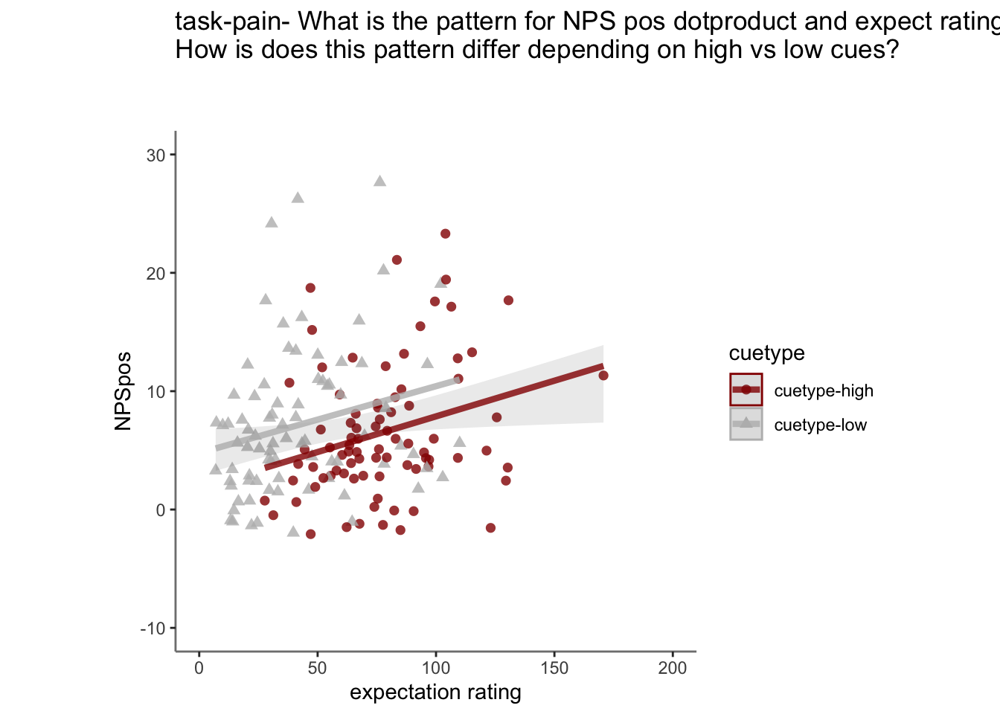

### NPS ~ expect * cue * stim
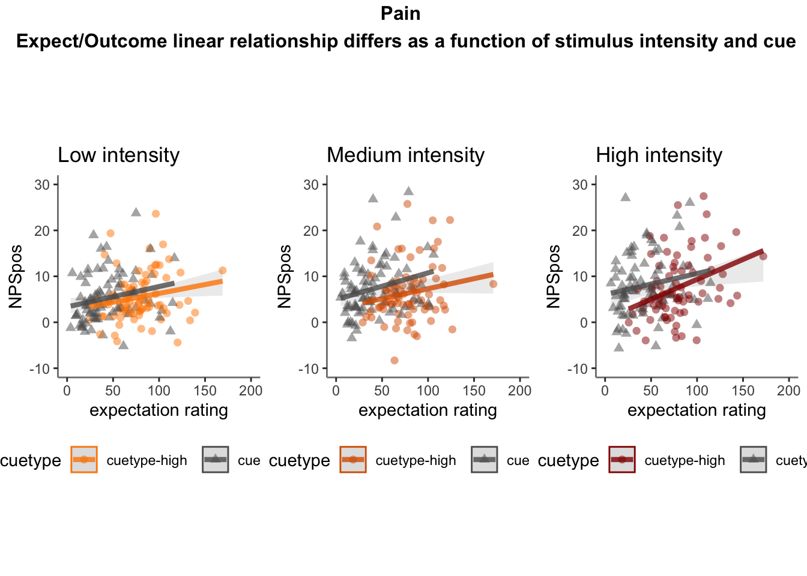


### NPS ~ demeaned_expect * cue
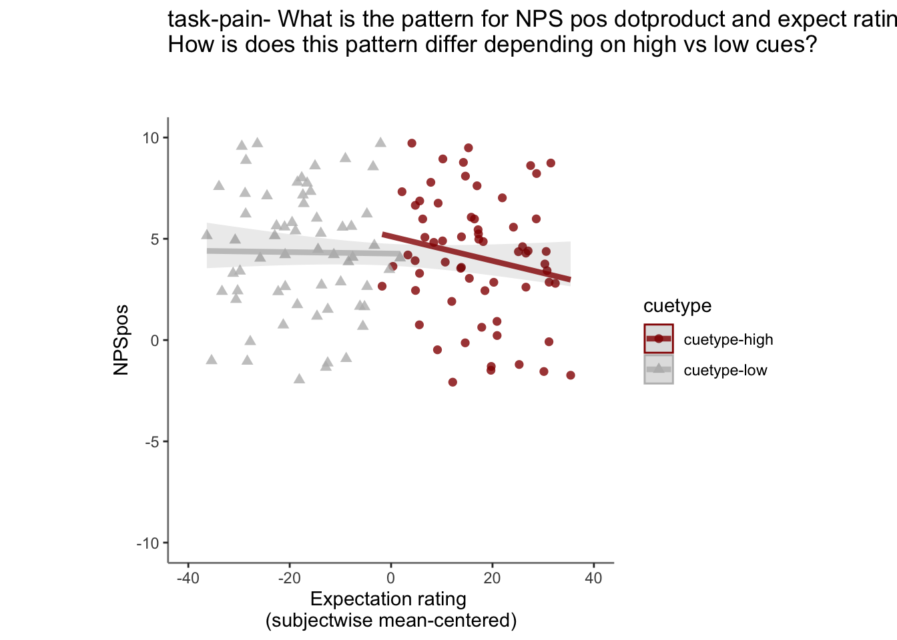

### NPS ~ demeaned_expect * cue * stim
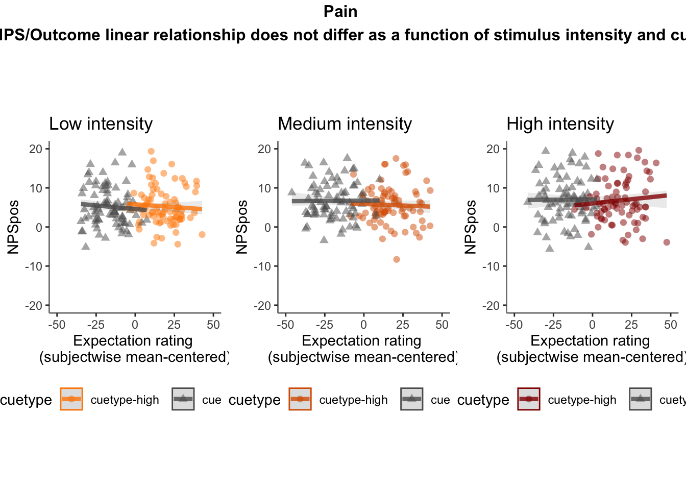


```r
cue_high = demean_dropna[demean_dropna$cue_name == "high", ]
fig.height = 50
fig.width = 10
ggplot(aes(x=EXPECT_demean, y=NPSpos), data=cue_high) +
  geom_smooth(method='lm', se=F, size=0.75) +
  geom_point(size=0.1) + 
    # geom_abline(intercept = 0, slope = 1, color="green", 
    #              linetype="dashed", size=0.5) +
  facet_wrap(~sub) + 
  theme(legend.position='none') + 
  xlim(-50,50) + ylim(-50,50) +
  xlab("raw data from each participant: n-1 lagged outcome angle") + 
  ylab("n current expectation rating") 
```

```
## `geom_smooth()` using formula = 'y ~ x'
```

```
## Warning: Removed 132 rows containing non-finite values (`stat_smooth()`).
```

```
## Warning: Removed 132 rows containing missing values (`geom_point()`).
```

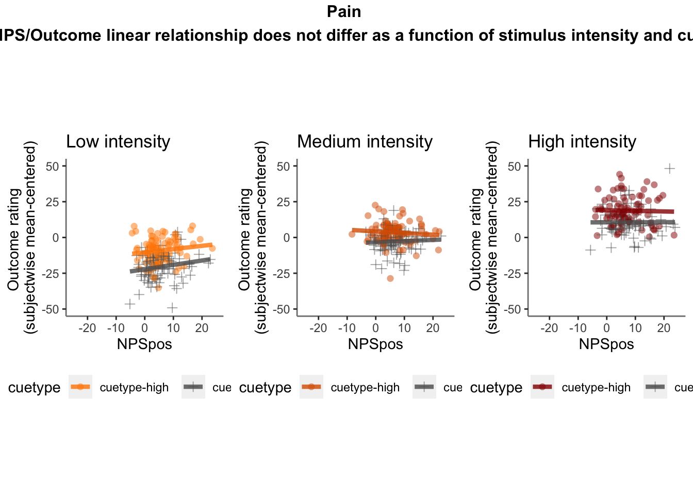


```r
cue_low = demean_dropna[demean_dropna$cue_name == "low", ]
fig.height = 50
fig.width = 10
ggplot(aes(x=EXPECT_demean, y=NPSpos), data=cue_low) +
  geom_smooth(method='lm', se=F, size=0.75) +
  geom_point(size=0.1) + 
    # geom_abline(intercept = 0, slope = 1, color="green", 
    #              linetype="dashed", size=0.5) +
  facet_wrap(~sub) + 
  theme(legend.position='none') + 
  xlim(-50,50) + ylim(-50,50) +
  xlab("raw data from each participant: n-1 lagged outcome angle") + 
  ylab("n current expectation rating") 
```

```
## `geom_smooth()` using formula = 'y ~ x'
```

```
## Warning: Removed 137 rows containing non-finite values (`stat_smooth()`).
```

```
## Warning: Removed 137 rows containing missing values (`geom_point()`).
```

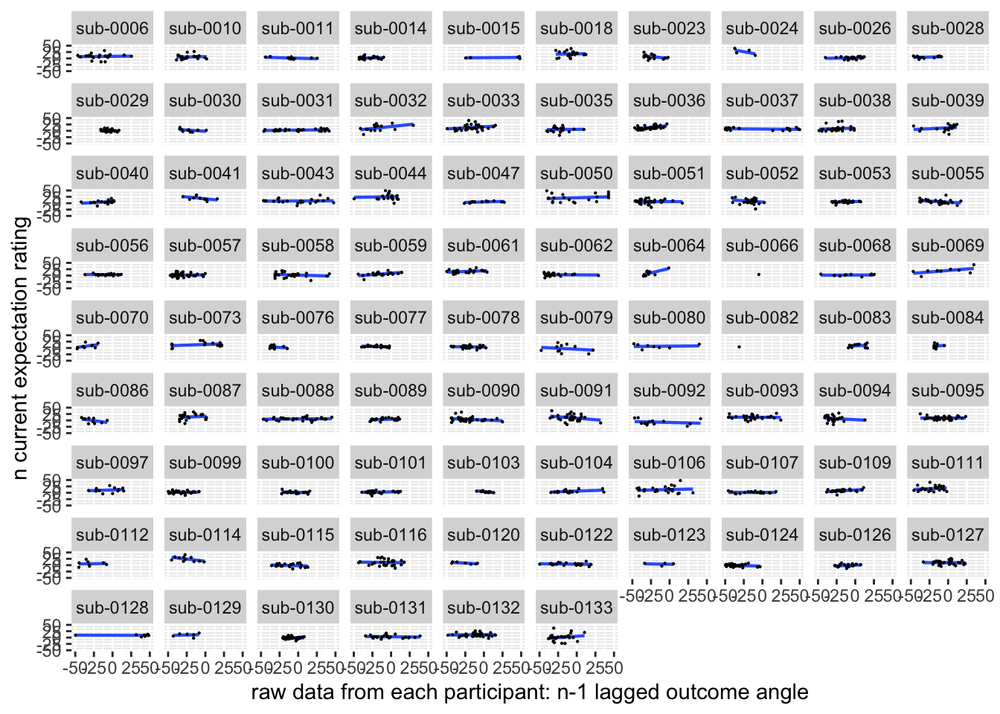

#### facetwrap

```r
# 74, 85, 118
fig.height = 50
fig.width = 10
ggplot(aes(x=EXPECT_demean, y=NPSpos), data=demean_high) +
  geom_smooth(method='lm', se=F, size=0.75) +
  geom_point(size=0.1) + 
    # geom_abline(intercept = 0, slope = 1, color="green", 
    #              linetype="dashed", size=0.5) +
  facet_wrap(~sub) + 
  theme(legend.position='none') + 
  xlim(-50,50) + ylim(-50,50) +
  xlab("raw data from each participant: n-1 lagged outcome angle") + 
  ylab("n current expectation rating") 
```

```
## `geom_smooth()` using formula = 'y ~ x'
```

```
## Warning: Removed 87 rows containing non-finite values (`stat_smooth()`).
```

```
## Warning: Removed 87 rows containing missing values (`geom_point()`).
```

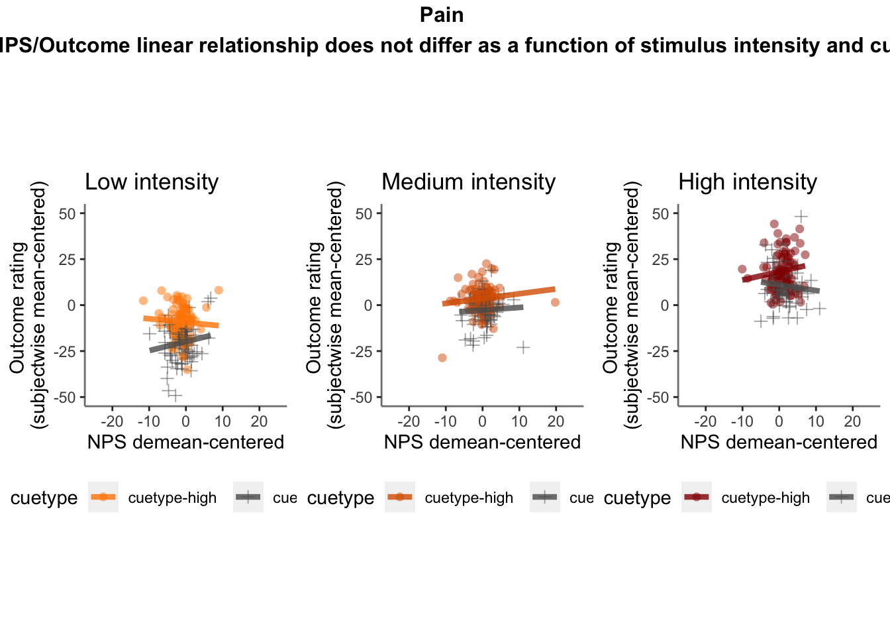

```r
# 74, 85, 118, 117
fig.height = 50
fig.width = 10
ggplot(aes(x=EXPECT_demean, y=NPSpos), data=demean_low) +
  geom_smooth(method='lm', se=F, size=0.75) +
  geom_point(size=0.1) + 
    # geom_abline(intercept = 0, slope = 1, color="green", 
    #              linetype="dashed", size=0.5) +
  facet_wrap(~sub) + 
  theme(legend.position='none') + 
  xlim(-50,50) + ylim(-50,50) +
  xlab("raw data from each participant: n-1 lagged outcome angle") + 
  ylab("n current expectation rating") 
```

```
## `geom_smooth()` using formula = 'y ~ x'
```

```
## Warning: Removed 92 rows containing non-finite values (`stat_smooth()`).
```

```
## Warning: Removed 92 rows containing missing values (`geom_point()`).
```

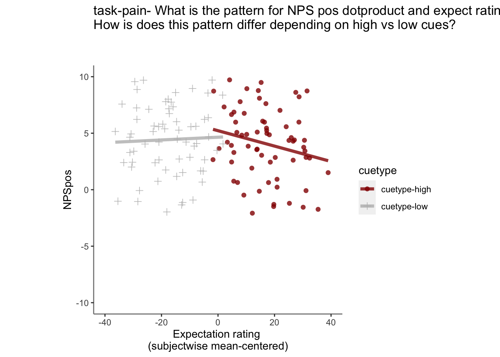

```r
# 74, 85, 118, 117
fig.height = 50
fig.width = 10
ggplot(aes(x=EXPECT_demean, y=NPSpos), data=demean_med) +
  geom_smooth(method='lm', se=F, size=0.75) +
  geom_point(size=0.1) + 
    # geom_abline(intercept = 0, slope = 1, color="green", 
    #              linetype="dashed", size=0.5) +
  facet_wrap(~sub) + 
  theme(legend.position='none') + 
  xlim(-50,50) + ylim(-50,50) +
  xlab("raw data from each participant: n-1 lagged outcome angle") + 
  ylab("n current expectation rating") 
```

```
## `geom_smooth()` using formula = 'y ~ x'
```

```
## Warning: Removed 90 rows containing non-finite values (`stat_smooth()`).
```

```
## Warning: Removed 90 rows containing missing values (`geom_point()`).
```

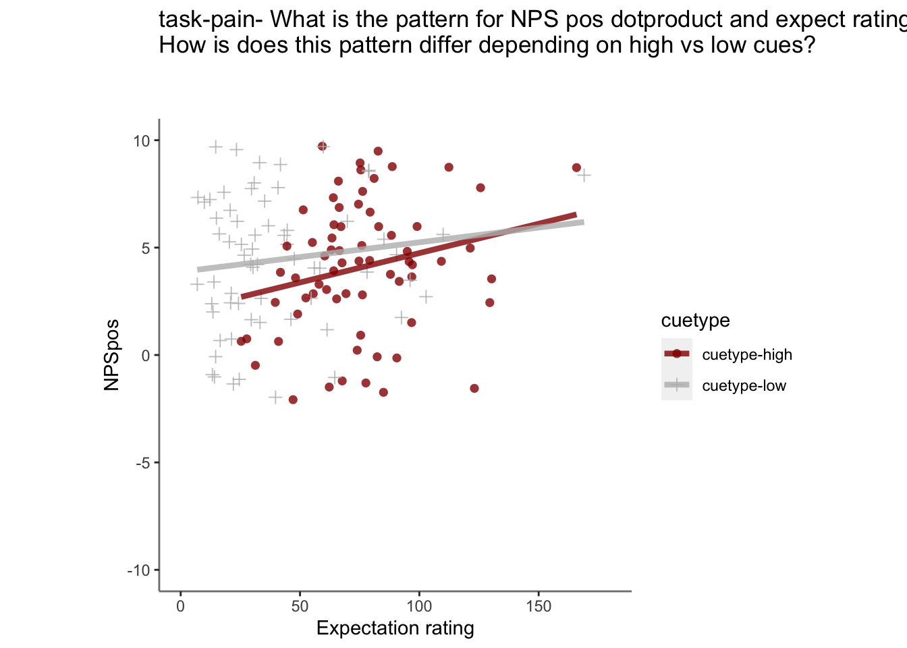


 #### subjectwise plot v2

```r
ggplot(demean_med, aes(y = NPSpos, 
                       x = EXPECT_demean, 
                       colour = cuetype, shape = sub), size = .3, color = 'gray') + 
  geom_point(size = .1) + 
  geom_smooth(method = 'lm', formula= y ~ x, se = FALSE, size = .3) +
  scale_color_manual(values = c("cuetype-high" = "#941100", "cuetype-low" = "#BBBBBB"), ) +
  theme_classic()
```

```
## Warning: The shape palette can deal with a maximum of 6 discrete values because
## more than 6 becomes difficult to discriminate; you have 85. Consider
## specifying shapes manually if you must have them.
```

```
## Warning: Removed 1170 rows containing missing values (`geom_point()`).
```

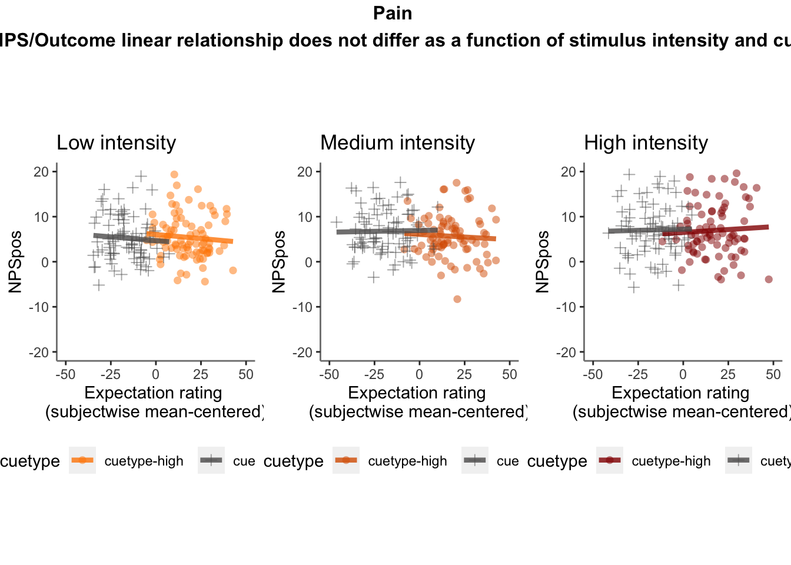

#### subjetwise plot


### ACCURATE Is this statistically significant?

#### ACCURATE: NPS ~ demean + CMC

```r
model.npsexpectdemean <- lmer(NPSpos ~ 
                          CUE_high_gt_low*STIM_linear*EXPECT_demean +CUE_high_gt_low*STIM_quadratic*EXPECT_demean + factor(ses) +  EXPECT_cmc +
                          (1 |sub), data = demean_dropna
                    ) 
# CUE_high_gt_low+STIM+EXPECT_demean
sjPlot::tab_model(model.npsexpectdemean,
                  title = "Multilevel-modeling: \nlmer(NPSpos ~ CUE * STIM * EXPECT_demean + (1| sub), data = pvc)",
                  CSS = list(css.table = '+font-size: 12;'))
```

<table style="border-collapse:collapse; border:none;font-size: 12;">
<caption style="font-weight: bold; text-align:left;">Multilevel-modeling: 
lmer(NPSpos ~ CUE * STIM * EXPECT_demean + (1| sub), data = pvc)</caption>
<tr>
<th style="border-top: double; text-align:center; font-style:italic; font-weight:normal; padding:0.2cm; border-bottom:1px solid black; text-align:left; ">&nbsp;</th>
<th colspan="3" style="border-top: double; text-align:center; font-style:italic; font-weight:normal; padding:0.2cm; border-bottom:1px solid black;">NPSpos</th>
</tr>
<tr>
<td style=" text-align:center; border-bottom:1px solid; font-style:italic; font-weight:normal; border-bottom:1px solid black; text-align:left; ">Predictors</td>
<td style=" text-align:center; border-bottom:1px solid; font-style:italic; font-weight:normal; border-bottom:1px solid black; ">Estimates</td>
<td style=" text-align:center; border-bottom:1px solid; font-style:italic; font-weight:normal; border-bottom:1px solid black; ">CI</td>
<td style=" text-align:center; border-bottom:1px solid; font-style:italic; font-weight:normal; border-bottom:1px solid black; ">p</td>
</tr>
<tr>
<td style=" padding:0.2cm; text-align:left; vertical-align:top; text-align:left; ">(Intercept)</td>
<td style=" padding:0.2cm; text-align:left; vertical-align:top; text-align:center;  ">6.65</td>
<td style=" padding:0.2cm; text-align:left; vertical-align:top; text-align:center;  ">5.42&nbsp;&ndash;&nbsp;7.88</td>
<td style=" padding:0.2cm; text-align:left; vertical-align:top; text-align:center;  "><strong>&lt;0.001</strong></td>
</tr>
<tr>
<td style=" padding:0.2cm; text-align:left; vertical-align:top; text-align:left; ">CUE high gt low</td>
<td style=" padding:0.2cm; text-align:left; vertical-align:top; text-align:center;  ">&#45;0.70</td>
<td style=" padding:0.2cm; text-align:left; vertical-align:top; text-align:center;  ">&#45;1.35&nbsp;&ndash;&nbsp;-0.05</td>
<td style=" padding:0.2cm; text-align:left; vertical-align:top; text-align:center;  "><strong>0.034</strong></td>
</tr>
<tr>
<td style=" padding:0.2cm; text-align:left; vertical-align:top; text-align:left; ">STIM linear</td>
<td style=" padding:0.2cm; text-align:left; vertical-align:top; text-align:center;  ">2.25</td>
<td style=" padding:0.2cm; text-align:left; vertical-align:top; text-align:center;  ">1.46&nbsp;&ndash;&nbsp;3.04</td>
<td style=" padding:0.2cm; text-align:left; vertical-align:top; text-align:center;  "><strong>&lt;0.001</strong></td>
</tr>
<tr>
<td style=" padding:0.2cm; text-align:left; vertical-align:top; text-align:left; ">EXPECT demean</td>
<td style=" padding:0.2cm; text-align:left; vertical-align:top; text-align:center;  ">&#45;0.00</td>
<td style=" padding:0.2cm; text-align:left; vertical-align:top; text-align:center;  ">&#45;0.01&nbsp;&ndash;&nbsp;0.01</td>
<td style=" padding:0.2cm; text-align:left; vertical-align:top; text-align:center;  ">0.752</td>
</tr>
<tr>
<td style=" padding:0.2cm; text-align:left; vertical-align:top; text-align:left; ">STIM quadratic</td>
<td style=" padding:0.2cm; text-align:left; vertical-align:top; text-align:center;  ">&#45;0.22</td>
<td style=" padding:0.2cm; text-align:left; vertical-align:top; text-align:center;  ">&#45;0.92&nbsp;&ndash;&nbsp;0.47</td>
<td style=" padding:0.2cm; text-align:left; vertical-align:top; text-align:center;  ">0.529</td>
</tr>
<tr>
<td style=" padding:0.2cm; text-align:left; vertical-align:top; text-align:left; ">factor(ses)ses&#45;03</td>
<td style=" padding:0.2cm; text-align:left; vertical-align:top; text-align:center;  ">0.09</td>
<td style=" padding:0.2cm; text-align:left; vertical-align:top; text-align:center;  ">&#45;0.61&nbsp;&ndash;&nbsp;0.78</td>
<td style=" padding:0.2cm; text-align:left; vertical-align:top; text-align:center;  ">0.808</td>
</tr>
<tr>
<td style=" padding:0.2cm; text-align:left; vertical-align:top; text-align:left; ">factor(ses)ses&#45;04</td>
<td style=" padding:0.2cm; text-align:left; vertical-align:top; text-align:center;  ">1.10</td>
<td style=" padding:0.2cm; text-align:left; vertical-align:top; text-align:center;  ">0.42&nbsp;&ndash;&nbsp;1.79</td>
<td style=" padding:0.2cm; text-align:left; vertical-align:top; text-align:center;  "><strong>0.002</strong></td>
</tr>
<tr>
<td style=" padding:0.2cm; text-align:left; vertical-align:top; text-align:left; ">EXPECT cmc</td>
<td style=" padding:0.2cm; text-align:left; vertical-align:top; text-align:center;  ">0.07</td>
<td style=" padding:0.2cm; text-align:left; vertical-align:top; text-align:center;  ">0.03&nbsp;&ndash;&nbsp;0.12</td>
<td style=" padding:0.2cm; text-align:left; vertical-align:top; text-align:center;  "><strong>0.002</strong></td>
</tr>
<tr>
<td style=" padding:0.2cm; text-align:left; vertical-align:top; text-align:left; ">CUE high gt low * STIM<br>linear</td>
<td style=" padding:0.2cm; text-align:left; vertical-align:top; text-align:center;  ">&#45;1.12</td>
<td style=" padding:0.2cm; text-align:left; vertical-align:top; text-align:center;  ">&#45;2.70&nbsp;&ndash;&nbsp;0.46</td>
<td style=" padding:0.2cm; text-align:left; vertical-align:top; text-align:center;  ">0.166</td>
</tr>
<tr>
<td style=" padding:0.2cm; text-align:left; vertical-align:top; text-align:left; ">CUE high gt low * EXPECT<br>demean</td>
<td style=" padding:0.2cm; text-align:left; vertical-align:top; text-align:center;  ">&#45;0.02</td>
<td style=" padding:0.2cm; text-align:left; vertical-align:top; text-align:center;  ">&#45;0.04&nbsp;&ndash;&nbsp;0.01</td>
<td style=" padding:0.2cm; text-align:left; vertical-align:top; text-align:center;  ">0.199</td>
</tr>
<tr>
<td style=" padding:0.2cm; text-align:left; vertical-align:top; text-align:left; ">STIM linear * EXPECT<br>demean</td>
<td style=" padding:0.2cm; text-align:left; vertical-align:top; text-align:center;  ">0.01</td>
<td style=" padding:0.2cm; text-align:left; vertical-align:top; text-align:center;  ">&#45;0.02&nbsp;&ndash;&nbsp;0.04</td>
<td style=" padding:0.2cm; text-align:left; vertical-align:top; text-align:center;  ">0.500</td>
</tr>
<tr>
<td style=" padding:0.2cm; text-align:left; vertical-align:top; text-align:left; ">CUE high gt low * STIM<br>quadratic</td>
<td style=" padding:0.2cm; text-align:left; vertical-align:top; text-align:center;  ">&#45;0.40</td>
<td style=" padding:0.2cm; text-align:left; vertical-align:top; text-align:center;  ">&#45;1.80&nbsp;&ndash;&nbsp;0.99</td>
<td style=" padding:0.2cm; text-align:left; vertical-align:top; text-align:center;  ">0.571</td>
</tr>
<tr>
<td style=" padding:0.2cm; text-align:left; vertical-align:top; text-align:left; ">EXPECT demean * STIM<br>quadratic</td>
<td style=" padding:0.2cm; text-align:left; vertical-align:top; text-align:center;  ">&#45;0.02</td>
<td style=" padding:0.2cm; text-align:left; vertical-align:top; text-align:center;  ">&#45;0.04&nbsp;&ndash;&nbsp;0.01</td>
<td style=" padding:0.2cm; text-align:left; vertical-align:top; text-align:center;  ">0.180</td>
</tr>
<tr>
<td style=" padding:0.2cm; text-align:left; vertical-align:top; text-align:left; ">(CUE high gt low * STIM<br>linear) * EXPECT demean</td>
<td style=" padding:0.2cm; text-align:left; vertical-align:top; text-align:center;  ">0.03</td>
<td style=" padding:0.2cm; text-align:left; vertical-align:top; text-align:center;  ">&#45;0.03&nbsp;&ndash;&nbsp;0.08</td>
<td style=" padding:0.2cm; text-align:left; vertical-align:top; text-align:center;  ">0.339</td>
</tr>
<tr>
<td style=" padding:0.2cm; text-align:left; vertical-align:top; text-align:left; ">(CUE high gt low * EXPECT<br>demean) * STIM quadratic</td>
<td style=" padding:0.2cm; text-align:left; vertical-align:top; text-align:center;  ">0.04</td>
<td style=" padding:0.2cm; text-align:left; vertical-align:top; text-align:center;  ">&#45;0.01&nbsp;&ndash;&nbsp;0.08</td>
<td style=" padding:0.2cm; text-align:left; vertical-align:top; text-align:center;  ">0.160</td>
</tr>
<tr>
<td colspan="4" style="font-weight:bold; text-align:left; padding-top:.8em;">Random Effects</td>
</tr>

<tr>
<td style=" padding:0.2cm; text-align:left; vertical-align:top; text-align:left; padding-top:0.1cm; padding-bottom:0.1cm;">&sigma;<sup>2</sup></td>
<td style=" padding:0.2cm; text-align:left; vertical-align:top; padding-top:0.1cm; padding-bottom:0.1cm; text-align:center;" colspan="3">63.19</td>
</tr>

<tr>
<td style=" padding:0.2cm; text-align:left; vertical-align:top; text-align:left; padding-top:0.1cm; padding-bottom:0.1cm;">&tau;<sub>00</sub> <sub>sub</sub></td>
<td style=" padding:0.2cm; text-align:left; vertical-align:top; padding-top:0.1cm; padding-bottom:0.1cm; text-align:center;" colspan="3">26.99</td>

<tr>
<td style=" padding:0.2cm; text-align:left; vertical-align:top; text-align:left; padding-top:0.1cm; padding-bottom:0.1cm;">ICC</td>
<td style=" padding:0.2cm; text-align:left; vertical-align:top; padding-top:0.1cm; padding-bottom:0.1cm; text-align:center;" colspan="3">0.30</td>

<tr>
<td style=" padding:0.2cm; text-align:left; vertical-align:top; text-align:left; padding-top:0.1cm; padding-bottom:0.1cm;">N <sub>sub</sub></td>
<td style=" padding:0.2cm; text-align:left; vertical-align:top; padding-top:0.1cm; padding-bottom:0.1cm; text-align:center;" colspan="3">86</td>
<tr>
<td style=" padding:0.2cm; text-align:left; vertical-align:top; text-align:left; padding-top:0.1cm; padding-bottom:0.1cm; border-top:1px solid;">Observations</td>
<td style=" padding:0.2cm; text-align:left; vertical-align:top; padding-top:0.1cm; padding-bottom:0.1cm; text-align:center; border-top:1px solid;" colspan="3">3765</td>
</tr>
<tr>
<td style=" padding:0.2cm; text-align:left; vertical-align:top; text-align:left; padding-top:0.1cm; padding-bottom:0.1cm;">Marginal R<sup>2</sup> / Conditional R<sup>2</sup></td>
<td style=" padding:0.2cm; text-align:left; vertical-align:top; padding-top:0.1cm; padding-bottom:0.1cm; text-align:center;" colspan="3">0.050 / 0.335</td>
</tr>

</table>

#### simple slopes when STIM == 'high', EXPECT_demean slope difference between high vs. low cue

```r
interactions::sim_slopes(model=model.npsexpectdemean, pred=EXPECT_demean, modx=CUE_high_gt_low, mod2 =STIM_linear, mod2.values = 0.5, centered = 'all', data = demean_dropna)
```

```
## Using data demean_dropna from global environment. This could cause
## incorrect results if demean_dropna has been altered since the model was
## fit. You can manually provide the data to the "data =" argument.
```

```
## ███████████████████ While STIM_linear (2nd moderator) = 0.50 ███████████████████ 
## 
## JOHNSON-NEYMAN INTERVAL 
## 
## The Johnson-Neyman interval could not be found. Is the p value for your
## interaction term below the specified alpha?
## 
## SIMPLE SLOPES ANALYSIS 
## 
## Slope of EXPECT_demean when CUE_high_gt_low = -0.50 (-0.5): 
## 
##   Est.   S.E.   t val.      p
## ------ ------ -------- ------
##   0.00   0.01     0.36   0.72
## 
## Slope of EXPECT_demean when CUE_high_gt_low =  0.50 (0.5): 
## 
##   Est.   S.E.   t val.      p
## ------ ------ -------- ------
##   0.00   0.01     0.11   0.91
```


#### emtrneds

```r
emt.t <- emtrends(model.npsexpectdemean, ~ STIM_linear | CUE_high_gt_low, 
         var = "EXPECT_demean", 
         # nuisance = c("EXPECT_cmc"),
         at = list(STIM_linear=c(0.5, 0, -0.5)),
         lmer.df = "asymp")
pairs(emt.t, simple = "each")
```

```
## $`simple contrasts for STIM_linear`
## CUE_high_gt_low = -0.5:
##  contrast                           estimate      SE  df z.ratio p.value
##  STIM_linear0.5 - STIM_linear0      -0.00201 0.00962 Inf  -0.208  0.9763
##  STIM_linear0.5 - (STIM_linear-0.5) -0.00401 0.01925 Inf  -0.208  0.9763
##  STIM_linear0 - (STIM_linear-0.5)   -0.00201 0.00962 Inf  -0.208  0.9763
## 
## CUE_high_gt_low =  0.5:
##  contrast                           estimate      SE  df z.ratio p.value
##  STIM_linear0.5 - STIM_linear0       0.01164 0.01053 Inf   1.105  0.5111
##  STIM_linear0.5 - (STIM_linear-0.5)  0.02327 0.02106 Inf   1.105  0.5111
##  STIM_linear0 - (STIM_linear-0.5)    0.01164 0.01053 Inf   1.105  0.5111
## 
## Results are averaged over the levels of: STIM_quadratic, ses 
## Degrees-of-freedom method: asymptotic 
## P value adjustment: tukey method for comparing a family of 3 estimates 
## 
## $`simple contrasts for CUE_high_gt_low`
## STIM_linear = -0.5:
##  contrast                                   estimate     SE  df z.ratio p.value
##  (CUE_high_gt_low-0.5) - CUE_high_gt_low0.5  0.02426 0.0194 Inf   1.249  0.2117
## 
## STIM_linear =  0.0:
##  contrast                                   estimate     SE  df z.ratio p.value
##  (CUE_high_gt_low-0.5) - CUE_high_gt_low0.5  0.01061 0.0134 Inf   0.793  0.4276
## 
## STIM_linear =  0.5:
##  contrast                                   estimate     SE  df z.ratio p.value
##  (CUE_high_gt_low-0.5) - CUE_high_gt_low0.5 -0.00303 0.0197 Inf  -0.154  0.8779
## 
## Results are averaged over the levels of: STIM_quadratic, ses 
## Degrees-of-freedom method: asymptotic
```

```r
# contrast(emt.t, "revpairwise")
```


# https://stats.stackexchange.com/questions/586748/calculating-trends-with-emtrends-for-three-way-interaction-model-results-in-sa
# emtrends(model.npsexpectdemean, var = 'EXPECT_demean', lmer.df = "asymptotic") 

#### This is it

```r
# https://stats.stackexchange.com/questions/365466/significance-of-slope-different-than-zero-in-triple-interaction-with-factors
```


#### ACCURATE: NPS ~ demean + CMC

```r
model.npsexpectdemean <- lmer(NPSpos ~ 
                          CUE_high_gt_low*EXPECT_demean  +  EXPECT_cmc + factor(ses) +
                          (1|sub), data = demean_dropna
                    )
# CUE_high_gt_low+STIM+EXPECT_demean
sjPlot::tab_model(model.npsexpectdemean,
                  title = "Multilevel-modeling: \nlmer(NPSpos ~ CUE * STIM * EXPECT_demean + (1| sub), data = pvc)",
                  CSS = list(css.table = '+font-size: 12;'))
```

<table style="border-collapse:collapse; border:none;font-size: 12;">
<caption style="font-weight: bold; text-align:left;">Multilevel-modeling: 
lmer(NPSpos ~ CUE * STIM * EXPECT_demean + (1| sub), data = pvc)</caption>
<tr>
<th style="border-top: double; text-align:center; font-style:italic; font-weight:normal; padding:0.2cm; border-bottom:1px solid black; text-align:left; ">&nbsp;</th>
<th colspan="3" style="border-top: double; text-align:center; font-style:italic; font-weight:normal; padding:0.2cm; border-bottom:1px solid black;">NPSpos</th>
</tr>
<tr>
<td style=" text-align:center; border-bottom:1px solid; font-style:italic; font-weight:normal; border-bottom:1px solid black; text-align:left; ">Predictors</td>
<td style=" text-align:center; border-bottom:1px solid; font-style:italic; font-weight:normal; border-bottom:1px solid black; ">Estimates</td>
<td style=" text-align:center; border-bottom:1px solid; font-style:italic; font-weight:normal; border-bottom:1px solid black; ">CI</td>
<td style=" text-align:center; border-bottom:1px solid; font-style:italic; font-weight:normal; border-bottom:1px solid black; ">p</td>
</tr>
<tr>
<td style=" padding:0.2cm; text-align:left; vertical-align:top; text-align:left; ">(Intercept)</td>
<td style=" padding:0.2cm; text-align:left; vertical-align:top; text-align:center;  ">6.63</td>
<td style=" padding:0.2cm; text-align:left; vertical-align:top; text-align:center;  ">5.40&nbsp;&ndash;&nbsp;7.86</td>
<td style=" padding:0.2cm; text-align:left; vertical-align:top; text-align:center;  "><strong>&lt;0.001</strong></td>
</tr>
<tr>
<td style=" padding:0.2cm; text-align:left; vertical-align:top; text-align:left; ">CUE high gt low</td>
<td style=" padding:0.2cm; text-align:left; vertical-align:top; text-align:center;  ">&#45;0.69</td>
<td style=" padding:0.2cm; text-align:left; vertical-align:top; text-align:center;  ">&#45;1.34&nbsp;&ndash;&nbsp;-0.03</td>
<td style=" padding:0.2cm; text-align:left; vertical-align:top; text-align:center;  "><strong>0.039</strong></td>
</tr>
<tr>
<td style=" padding:0.2cm; text-align:left; vertical-align:top; text-align:left; ">EXPECT demean</td>
<td style=" padding:0.2cm; text-align:left; vertical-align:top; text-align:center;  ">&#45;0.00</td>
<td style=" padding:0.2cm; text-align:left; vertical-align:top; text-align:center;  ">&#45;0.01&nbsp;&ndash;&nbsp;0.01</td>
<td style=" padding:0.2cm; text-align:left; vertical-align:top; text-align:center;  ">0.648</td>
</tr>
<tr>
<td style=" padding:0.2cm; text-align:left; vertical-align:top; text-align:left; ">EXPECT cmc</td>
<td style=" padding:0.2cm; text-align:left; vertical-align:top; text-align:center;  ">0.07</td>
<td style=" padding:0.2cm; text-align:left; vertical-align:top; text-align:center;  ">0.03&nbsp;&ndash;&nbsp;0.12</td>
<td style=" padding:0.2cm; text-align:left; vertical-align:top; text-align:center;  "><strong>0.002</strong></td>
</tr>
<tr>
<td style=" padding:0.2cm; text-align:left; vertical-align:top; text-align:left; ">factor(ses)ses&#45;03</td>
<td style=" padding:0.2cm; text-align:left; vertical-align:top; text-align:center;  ">0.10</td>
<td style=" padding:0.2cm; text-align:left; vertical-align:top; text-align:center;  ">&#45;0.61&nbsp;&ndash;&nbsp;0.80</td>
<td style=" padding:0.2cm; text-align:left; vertical-align:top; text-align:center;  ">0.791</td>
</tr>
<tr>
<td style=" padding:0.2cm; text-align:left; vertical-align:top; text-align:left; ">factor(ses)ses&#45;04</td>
<td style=" padding:0.2cm; text-align:left; vertical-align:top; text-align:center;  ">1.13</td>
<td style=" padding:0.2cm; text-align:left; vertical-align:top; text-align:center;  ">0.44&nbsp;&ndash;&nbsp;1.83</td>
<td style=" padding:0.2cm; text-align:left; vertical-align:top; text-align:center;  "><strong>0.001</strong></td>
</tr>
<tr>
<td style=" padding:0.2cm; text-align:left; vertical-align:top; text-align:left; ">CUE high gt low * EXPECT<br>demean</td>
<td style=" padding:0.2cm; text-align:left; vertical-align:top; text-align:center;  ">&#45;0.02</td>
<td style=" padding:0.2cm; text-align:left; vertical-align:top; text-align:center;  ">&#45;0.04&nbsp;&ndash;&nbsp;0.01</td>
<td style=" padding:0.2cm; text-align:left; vertical-align:top; text-align:center;  ">0.219</td>
</tr>
<tr>
<td colspan="4" style="font-weight:bold; text-align:left; padding-top:.8em;">Random Effects</td>
</tr>

<tr>
<td style=" padding:0.2cm; text-align:left; vertical-align:top; text-align:left; padding-top:0.1cm; padding-bottom:0.1cm;">&sigma;<sup>2</sup></td>
<td style=" padding:0.2cm; text-align:left; vertical-align:top; padding-top:0.1cm; padding-bottom:0.1cm; text-align:center;" colspan="3">64.28</td>
</tr>

<tr>
<td style=" padding:0.2cm; text-align:left; vertical-align:top; text-align:left; padding-top:0.1cm; padding-bottom:0.1cm;">&tau;<sub>00</sub> <sub>sub</sub></td>
<td style=" padding:0.2cm; text-align:left; vertical-align:top; padding-top:0.1cm; padding-bottom:0.1cm; text-align:center;" colspan="3">26.96</td>

<tr>
<td style=" padding:0.2cm; text-align:left; vertical-align:top; text-align:left; padding-top:0.1cm; padding-bottom:0.1cm;">ICC</td>
<td style=" padding:0.2cm; text-align:left; vertical-align:top; padding-top:0.1cm; padding-bottom:0.1cm; text-align:center;" colspan="3">0.30</td>

<tr>
<td style=" padding:0.2cm; text-align:left; vertical-align:top; text-align:left; padding-top:0.1cm; padding-bottom:0.1cm;">N <sub>sub</sub></td>
<td style=" padding:0.2cm; text-align:left; vertical-align:top; padding-top:0.1cm; padding-bottom:0.1cm; text-align:center;" colspan="3">86</td>
<tr>
<td style=" padding:0.2cm; text-align:left; vertical-align:top; text-align:left; padding-top:0.1cm; padding-bottom:0.1cm; border-top:1px solid;">Observations</td>
<td style=" padding:0.2cm; text-align:left; vertical-align:top; padding-top:0.1cm; padding-bottom:0.1cm; text-align:center; border-top:1px solid;" colspan="3">3765</td>
</tr>
<tr>
<td style=" padding:0.2cm; text-align:left; vertical-align:top; text-align:left; padding-top:0.1cm; padding-bottom:0.1cm;">Marginal R<sup>2</sup> / Conditional R<sup>2</sup></td>
<td style=" padding:0.2cm; text-align:left; vertical-align:top; padding-top:0.1cm; padding-bottom:0.1cm; text-align:center;" colspan="3">0.038 / 0.322</td>
</tr>

</table>

