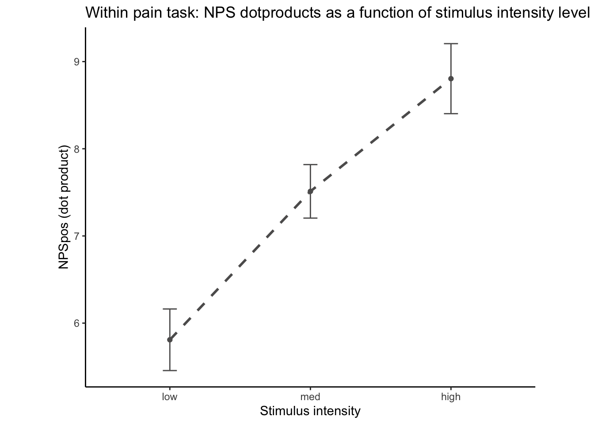

# [fMRI] NPS ~ singletrial {#ch99_singletrial_clean}


## What is the purpose of this notebook? {.unlisted .unnumbered}

* Here, I model NPS dot products as a function of cue, stimulus intensity and expectation ratings. 
* One of the findings is that low cues lead to higher NPS dotproducts in the high intensity group, and that this effect becomes non-significant across sessions. 
* 03/23/2023: For now, I'm grabbing participants that have complete data, i.e. 18 runs, all three sessions. 


## 1. NPS ~ 3 task x 3 stimulus intensity

```
## [1] "/Users/h/Dropbox (Dartmouth College)/projects_dropbox/social_influence_analysis/analysis/fmri/nilearn/signature_extract/signature-NPSpos_sub-all_runtype-pvc_event-stimulus.tsv"
```


#### Contrast weight table {.unlisted .unnumbered}
<table class="table table-striped" style="font-size: 15px; ">
<caption style="font-size: initial !important;">(\#tab:unnamed-chunk-5)Contrast weights</caption>
 <thead>
  <tr>
   <th style="text-align:left;">   </th>
   <th style="text-align:right;"> pain </th>
   <th style="text-align:right;"> vicarious </th>
   <th style="text-align:right;"> cognitive </th>
  </tr>
 </thead>
<tbody>
  <tr>
   <td style="text-align:left;"> task_V_gt_C </td>
   <td style="text-align:right;"> 0.00 </td>
   <td style="text-align:right;"> 0.50 </td>
   <td style="text-align:right;"> -0.50 </td>
  </tr>
  <tr>
   <td style="text-align:left;"> task_P_gt_VC </td>
   <td style="text-align:right;"> 0.66 </td>
   <td style="text-align:right;"> -0.34 </td>
   <td style="text-align:right;"> -0.34 </td>
  </tr>
</tbody>
</table>


## 2. NPS ~ paintask: 2 cue x 3 stimulus_intensity

### Q. Within pain task, Does stimulus intenisty level and cue level significantly predict NPS dotproducts? {.unlisted .unnumbered}

### Lineplots with only low cue {.unlisted .unnumbered}


### Lineplots {.unlisted .unnumbered}


### Lineplots {.unlisted .unnumbered}


### Linear model results (NPS ~ paintask: 2 cue x 3 stimulus_intensity)

```r
model.npscuestim <- lmer(NPSpos ~ 
                          CUE_high_gt_low*STIM_linear +CUE_high_gt_low * STIM_quadratic +
                          (CUE_high_gt_low+STIM|sub), data = data_screen
                    )
sjPlot::tab_model(model.npscuestim,
                  title = "Multilevel-modeling: \nlmer(NPSpos ~ CUE * STIM + (CUE + STIM | sub), data = pvc)",
                  CSS = list(css.table = '+font-size: 12;'))
```

<table style="border-collapse:collapse; border:none;font-size: 12;">
<caption style="font-weight: bold; text-align:left;">Multilevel-modeling: 
lmer(NPSpos ~ CUE * STIM + (CUE + STIM | sub), data = pvc)</caption>
<tr>
<th style="border-top: double; text-align:center; font-style:italic; font-weight:normal; padding:0.2cm; border-bottom:1px solid black; text-align:left; ">&nbsp;</th>
<th colspan="3" style="border-top: double; text-align:center; font-style:italic; font-weight:normal; padding:0.2cm; border-bottom:1px solid black;">NPSpos</th>
</tr>
<tr>
<td style=" text-align:center; border-bottom:1px solid; font-style:italic; font-weight:normal; border-bottom:1px solid black; text-align:left; ">Predictors</td>
<td style=" text-align:center; border-bottom:1px solid; font-style:italic; font-weight:normal; border-bottom:1px solid black; ">Estimates</td>
<td style=" text-align:center; border-bottom:1px solid; font-style:italic; font-weight:normal; border-bottom:1px solid black; ">CI</td>
<td style=" text-align:center; border-bottom:1px solid; font-style:italic; font-weight:normal; border-bottom:1px solid black; ">p</td>
</tr>
<tr>
<td style=" padding:0.2cm; text-align:left; vertical-align:top; text-align:left; ">(Intercept)</td>
<td style=" padding:0.2cm; text-align:left; vertical-align:top; text-align:center;  ">7.01</td>
<td style=" padding:0.2cm; text-align:left; vertical-align:top; text-align:center;  ">5.85&nbsp;&ndash;&nbsp;8.17</td>
<td style=" padding:0.2cm; text-align:left; vertical-align:top; text-align:center;  "><strong>&lt;0.001</strong></td>
</tr>
<tr>
<td style=" padding:0.2cm; text-align:left; vertical-align:top; text-align:left; ">CUE high gt low</td>
<td style=" padding:0.2cm; text-align:left; vertical-align:top; text-align:center;  ">&#45;0.77</td>
<td style=" padding:0.2cm; text-align:left; vertical-align:top; text-align:center;  ">&#45;1.31&nbsp;&ndash;&nbsp;-0.23</td>
<td style=" padding:0.2cm; text-align:left; vertical-align:top; text-align:center;  "><strong>0.005</strong></td>
</tr>
<tr>
<td style=" padding:0.2cm; text-align:left; vertical-align:top; text-align:left; ">STIM linear</td>
<td style=" padding:0.2cm; text-align:left; vertical-align:top; text-align:center;  ">2.62</td>
<td style=" padding:0.2cm; text-align:left; vertical-align:top; text-align:center;  ">1.93&nbsp;&ndash;&nbsp;3.31</td>
<td style=" padding:0.2cm; text-align:left; vertical-align:top; text-align:center;  "><strong>&lt;0.001</strong></td>
</tr>
<tr>
<td style=" padding:0.2cm; text-align:left; vertical-align:top; text-align:left; ">STIM quadratic</td>
<td style=" padding:0.2cm; text-align:left; vertical-align:top; text-align:center;  ">0.02</td>
<td style=" padding:0.2cm; text-align:left; vertical-align:top; text-align:center;  ">&#45;0.53&nbsp;&ndash;&nbsp;0.57</td>
<td style=" padding:0.2cm; text-align:left; vertical-align:top; text-align:center;  ">0.944</td>
</tr>
<tr>
<td style=" padding:0.2cm; text-align:left; vertical-align:top; text-align:left; ">CUE high gt low * STIM<br>linear</td>
<td style=" padding:0.2cm; text-align:left; vertical-align:top; text-align:center;  ">&#45;0.62</td>
<td style=" padding:0.2cm; text-align:left; vertical-align:top; text-align:center;  ">&#45;1.83&nbsp;&ndash;&nbsp;0.59</td>
<td style=" padding:0.2cm; text-align:left; vertical-align:top; text-align:center;  ">0.311</td>
</tr>
<tr>
<td style=" padding:0.2cm; text-align:left; vertical-align:top; text-align:left; ">CUE high gt low * STIM<br>quadratic</td>
<td style=" padding:0.2cm; text-align:left; vertical-align:top; text-align:center;  ">&#45;0.67</td>
<td style=" padding:0.2cm; text-align:left; vertical-align:top; text-align:center;  ">&#45;1.73&nbsp;&ndash;&nbsp;0.39</td>
<td style=" padding:0.2cm; text-align:left; vertical-align:top; text-align:center;  ">0.214</td>
</tr>
<tr>
<td colspan="4" style="font-weight:bold; text-align:left; padding-top:.8em;">Random Effects</td>
</tr>

<tr>
<td style=" padding:0.2cm; text-align:left; vertical-align:top; text-align:left; padding-top:0.1cm; padding-bottom:0.1cm;">&sigma;<sup>2</sup></td>
<td style=" padding:0.2cm; text-align:left; vertical-align:top; padding-top:0.1cm; padding-bottom:0.1cm; text-align:center;" colspan="3">62.90</td>
</tr>

<tr>
<td style=" padding:0.2cm; text-align:left; vertical-align:top; text-align:left; padding-top:0.1cm; padding-bottom:0.1cm;">&tau;<sub>00</sub> <sub>sub</sub></td>
<td style=" padding:0.2cm; text-align:left; vertical-align:top; padding-top:0.1cm; padding-bottom:0.1cm; text-align:center;" colspan="3">39.93</td>

<tr>
<td style=" padding:0.2cm; text-align:left; vertical-align:top; text-align:left; padding-top:0.1cm; padding-bottom:0.1cm;">&tau;<sub>11</sub> <sub>sub.CUE_high_gt_low</sub></td>
<td style=" padding:0.2cm; text-align:left; vertical-align:top; padding-top:0.1cm; padding-bottom:0.1cm; text-align:center;" colspan="3">0.96</td>

<tr>
<td style=" padding:0.2cm; text-align:left; vertical-align:top; text-align:left; padding-top:0.1cm; padding-bottom:0.1cm;">&tau;<sub>11</sub> <sub>sub.STIMlow</sub></td>
<td style=" padding:0.2cm; text-align:left; vertical-align:top; padding-top:0.1cm; padding-bottom:0.1cm; text-align:center;" colspan="3">2.45</td>

<tr>
<td style=" padding:0.2cm; text-align:left; vertical-align:top; text-align:left; padding-top:0.1cm; padding-bottom:0.1cm;">&tau;<sub>11</sub> <sub>sub.STIMmed</sub></td>
<td style=" padding:0.2cm; text-align:left; vertical-align:top; padding-top:0.1cm; padding-bottom:0.1cm; text-align:center;" colspan="3">1.81</td>

<tr>
<td style=" padding:0.2cm; text-align:left; vertical-align:top; text-align:left; padding-top:0.1cm; padding-bottom:0.1cm;">&rho;<sub>01</sub></td>
<td style=" padding:0.2cm; text-align:left; vertical-align:top; padding-top:0.1cm; padding-bottom:0.1cm; text-align:center;" colspan="3">-0.61</td>

<tr>
<td style=" padding:0.2cm; text-align:left; vertical-align:top; text-align:left; padding-top:0.1cm; padding-bottom:0.1cm;"></td>
<td style=" padding:0.2cm; text-align:left; vertical-align:top; padding-top:0.1cm; padding-bottom:0.1cm; text-align:center;" colspan="3">-0.96</td>

<tr>
<td style=" padding:0.2cm; text-align:left; vertical-align:top; text-align:left; padding-top:0.1cm; padding-bottom:0.1cm;"></td>
<td style=" padding:0.2cm; text-align:left; vertical-align:top; padding-top:0.1cm; padding-bottom:0.1cm; text-align:center;" colspan="3">-0.82</td>

<tr>
<td style=" padding:0.2cm; text-align:left; vertical-align:top; text-align:left; padding-top:0.1cm; padding-bottom:0.1cm;">N <sub>sub</sub></td>
<td style=" padding:0.2cm; text-align:left; vertical-align:top; padding-top:0.1cm; padding-bottom:0.1cm; text-align:center;" colspan="3">91</td>
<tr>
<td style=" padding:0.2cm; text-align:left; vertical-align:top; text-align:left; padding-top:0.1cm; padding-bottom:0.1cm; border-top:1px solid;">Observations</td>
<td style=" padding:0.2cm; text-align:left; vertical-align:top; padding-top:0.1cm; padding-bottom:0.1cm; text-align:center; border-top:1px solid;" colspan="3">3961</td>
</tr>
<tr>
<td style=" padding:0.2cm; text-align:left; vertical-align:top; text-align:left; padding-top:0.1cm; padding-bottom:0.1cm;">Marginal R<sup>2</sup> / Conditional R<sup>2</sup></td>
<td style=" padding:0.2cm; text-align:left; vertical-align:top; padding-top:0.1cm; padding-bottom:0.1cm; text-align:center;" colspan="3">0.021 / NA</td>
</tr>

</table>

```
lmer(NPSpos ~ 
                          CUE_high_gt_low*STIM_linear +CUE_high_gt_low * STIM_quadratic +
                          (CUE_high_gt_low+STIM|sub), data = data_screen
                    )
```


```
## Linear mixed model fit by REML. t-tests use Satterthwaite's method [
## lmerModLmerTest]
## Formula: 
## NPSpos ~ CUE_high_gt_low * STIM_linear + CUE_high_gt_low * STIM_quadratic +  
##     (CUE_high_gt_low + STIM | sub)
##    Data: data_screen
## 
## REML criterion at convergence: 27923.1
## 
## Scaled residuals: 
##     Min      1Q  Median      3Q     Max 
## -5.8130 -0.5069 -0.0249  0.5073  5.8791 
## 
## Random effects:
##  Groups   Name            Variance Std.Dev. Corr             
##  sub      (Intercept)     39.9282  6.3189                    
##           CUE_high_gt_low  0.9634  0.9815   -0.61            
##           STIMlow          2.4524  1.5660   -0.96  0.81      
##           STIMmed          1.8139  1.3468   -0.82  0.95  0.95
##  Residual                 62.8954  7.9307                    
## Number of obs: 3961, groups:  sub, 91
## 
## Fixed effects:
##                                  Estimate Std. Error         df t value
## (Intercept)                       7.00906    0.59289   87.40885  11.822
## CUE_high_gt_low                  -0.76630    0.27518  109.84089  -2.785
## STIM_linear                       2.61931    0.35158  150.41659   7.450
## STIM_quadratic                    0.01963    0.28054  259.52307   0.070
## CUE_high_gt_low:STIM_linear      -0.62496    0.61716 3804.33220  -1.013
## CUE_high_gt_low:STIM_quadratic   -0.67196    0.54121 3800.82134  -1.242
##                                Pr(>|t|)    
## (Intercept)                     < 2e-16 ***
## CUE_high_gt_low                 0.00631 ** 
## STIM_linear                    6.78e-12 ***
## STIM_quadratic                  0.94428    
## CUE_high_gt_low:STIM_linear     0.31129    
## CUE_high_gt_low:STIM_quadratic  0.21446    
## ---
## Signif. codes:  0 '***' 0.001 '**' 0.01 '*' 0.05 '.' 0.1 ' ' 1
## 
## Correlation of Fixed Effects:
##                      (Intr) CUE_h__ STIM_l STIM_q CUE_hgh_gt_lw:STIM_l
## CUE_hgh_gt_          -0.201                                           
## STIM_linear           0.434 -0.149                                    
## STIM_qudrtc          -0.119  0.112  -0.100                            
## CUE_hgh_gt_lw:STIM_l  0.004  0.006  -0.004 -0.004                     
## CUE_hgh_gt_lw:STIM_q  0.002  0.003  -0.004  0.005 -0.005              
## optimizer (nloptwrap) convergence code: 0 (OK)
## boundary (singular) fit: see help('isSingular')
```


#### Linear model eta-squared {.unlisted .unnumbered}
<table class="table table-striped" style="font-size: 12px; ">
 <thead>
  <tr>
   <th style="text-align:left;"> Parameter </th>
   <th style="text-align:right;"> Eta2_partial </th>
   <th style="text-align:right;"> CI </th>
   <th style="text-align:right;"> CI_low </th>
   <th style="text-align:right;"> CI_high </th>
  </tr>
 </thead>
<tbody>
  <tr>
   <td style="text-align:left;"> CUE_high_gt_low </td>
   <td style="text-align:right;"> 0.0659453 </td>
   <td style="text-align:right;"> 0.95 </td>
   <td style="text-align:right;"> 0.0109806 </td>
   <td style="text-align:right;"> 1 </td>
  </tr>
  <tr>
   <td style="text-align:left;"> STIM_linear </td>
   <td style="text-align:right;"> 0.2695449 </td>
   <td style="text-align:right;"> 0.95 </td>
   <td style="text-align:right;"> 0.1750191 </td>
   <td style="text-align:right;"> 1 </td>
  </tr>
  <tr>
   <td style="text-align:left;"> STIM_quadratic </td>
   <td style="text-align:right;"> 0.0000189 </td>
   <td style="text-align:right;"> 0.95 </td>
   <td style="text-align:right;"> 0.0000000 </td>
   <td style="text-align:right;"> 1 </td>
  </tr>
  <tr>
   <td style="text-align:left;"> CUE_high_gt_low:STIM_linear </td>
   <td style="text-align:right;"> 0.0002695 </td>
   <td style="text-align:right;"> 0.95 </td>
   <td style="text-align:right;"> 0.0000000 </td>
   <td style="text-align:right;"> 1 </td>
  </tr>
  <tr>
   <td style="text-align:left;"> CUE_high_gt_low:STIM_quadratic </td>
   <td style="text-align:right;"> 0.0004054 </td>
   <td style="text-align:right;"> 0.95 </td>
   <td style="text-align:right;"> 0.0000000 </td>
   <td style="text-align:right;"> 1 </td>
  </tr>
</tbody>
</table>

#### Linear model Cohen's d: NPS stimulus_intensity d = 1.16, cue d = 0.45 {.unlisted .unnumbered}
<table class="table table-striped" style="font-size: 12px; ">
 <thead>
  <tr>
   <th style="text-align:left;">   </th>
   <th style="text-align:right;"> t </th>
   <th style="text-align:right;"> df </th>
   <th style="text-align:right;"> d </th>
  </tr>
 </thead>
<tbody>
  <tr>
   <td style="text-align:left;"> CUE_high_gt_low </td>
   <td style="text-align:right;"> -2.784759 </td>
   <td style="text-align:right;"> 109.8409 </td>
   <td style="text-align:right;"> -0.5314172 </td>
  </tr>
  <tr>
   <td style="text-align:left;"> STIM_linear </td>
   <td style="text-align:right;"> 7.450178 </td>
   <td style="text-align:right;"> 150.4166 </td>
   <td style="text-align:right;"> 1.2149230 </td>
  </tr>
  <tr>
   <td style="text-align:left;"> STIM_quadratic </td>
   <td style="text-align:right;"> 0.069956 </td>
   <td style="text-align:right;"> 259.5231 </td>
   <td style="text-align:right;"> 0.0086849 </td>
  </tr>
  <tr>
   <td style="text-align:left;"> CUE_high_gt_low:STIM_linear </td>
   <td style="text-align:right;"> -1.012647 </td>
   <td style="text-align:right;"> 3804.3322 </td>
   <td style="text-align:right;"> -0.0328359 </td>
  </tr>
  <tr>
   <td style="text-align:left;"> CUE_high_gt_low:STIM_quadratic </td>
   <td style="text-align:right;"> -1.241596 </td>
   <td style="text-align:right;"> 3800.8213 </td>
   <td style="text-align:right;"> -0.0402783 </td>
  </tr>
</tbody>
</table>


## 3. NPS ~ SES * CUE * STIM
### Q. Is the cue effect on NPS different across sessions? {.unlisted .unnumbered}

> Quick answer: Yes, the cue effect in session 1 (for high intensity group) is significantly different; whereas this different becomes non significant in session 4. 
> To unpack, a participant was informed to experience a low  stimulus intensity, when in fact they were delivered a high intensity stimulus. This violation presumably leads to a higher NPS response, given that they were delivered a much painful stimulus than expected. The fact that the cue effect is almost non significant during the last session indicates that the cue effects are not just an anchoring effect. 


```r
# code session
# contrast code 1 linear
combined_psig$SES_linear[combined_psig$ses == "ses-01"] <- -0.5
combined_psig$SES_linear[combined_psig$ses == "ses-03"] <- 0
combined_psig$SES_linear[combined_psig$ses == "ses-04"] <- 0.5

# contrast code 2 quadratic
combined_psig$SES_quadratic[combined_psig$ses == "ses-01"] <- -0.33
combined_psig$SES_quadratic[combined_psig$ses == "ses-03"] <- 0.66
combined_psig$SES_quadratic[combined_psig$ses == "ses-04"] <- -0.33

model.npsses <- lmer(NPSpos ~ 
                          CUE_high_gt_low*STIM_linear*SES_linear + 
                          CUE_high_gt_low*STIM_quadratic*SES_linear + 
                          CUE_high_gt_low*STIM_linear*SES_quadratic + 
                          CUE_high_gt_low*STIM_quadratic*SES_quadratic +
                          (1|sub), data = combined_psig
                    ) 
# CUE_high_gt_low+STIM+EXPECT_demean
sjPlot::tab_model(model.npsses,
                  title = "Multilevel-modeling: \nlmer(NPSpos ~ CUE * STIM * SES + (1| sub), data = pvc)",
                  CSS = list(css.table = '+font-size: 12;'))
```

<table style="border-collapse:collapse; border:none;font-size: 12;">
<caption style="font-weight: bold; text-align:left;">Multilevel-modeling: 
lmer(NPSpos ~ CUE * STIM * SES + (1| sub), data = pvc)</caption>
<tr>
<th style="border-top: double; text-align:center; font-style:italic; font-weight:normal; padding:0.2cm; border-bottom:1px solid black; text-align:left; ">&nbsp;</th>
<th colspan="3" style="border-top: double; text-align:center; font-style:italic; font-weight:normal; padding:0.2cm; border-bottom:1px solid black;">NPSpos</th>
</tr>
<tr>
<td style=" text-align:center; border-bottom:1px solid; font-style:italic; font-weight:normal; border-bottom:1px solid black; text-align:left; ">Predictors</td>
<td style=" text-align:center; border-bottom:1px solid; font-style:italic; font-weight:normal; border-bottom:1px solid black; ">Estimates</td>
<td style=" text-align:center; border-bottom:1px solid; font-style:italic; font-weight:normal; border-bottom:1px solid black; ">CI</td>
<td style=" text-align:center; border-bottom:1px solid; font-style:italic; font-weight:normal; border-bottom:1px solid black; ">p</td>
</tr>
<tr>
<td style=" padding:0.2cm; text-align:left; vertical-align:top; text-align:left; ">(Intercept)</td>
<td style=" padding:0.2cm; text-align:left; vertical-align:top; text-align:center;  ">7.03</td>
<td style=" padding:0.2cm; text-align:left; vertical-align:top; text-align:center;  ">5.87&nbsp;&ndash;&nbsp;8.20</td>
<td style=" padding:0.2cm; text-align:left; vertical-align:top; text-align:center;  "><strong>&lt;0.001</strong></td>
</tr>
<tr>
<td style=" padding:0.2cm; text-align:left; vertical-align:top; text-align:left; ">CUE high gt low</td>
<td style=" padding:0.2cm; text-align:left; vertical-align:top; text-align:center;  ">&#45;0.76</td>
<td style=" padding:0.2cm; text-align:left; vertical-align:top; text-align:center;  ">&#45;1.25&nbsp;&ndash;&nbsp;-0.26</td>
<td style=" padding:0.2cm; text-align:left; vertical-align:top; text-align:center;  "><strong>0.003</strong></td>
</tr>
<tr>
<td style=" padding:0.2cm; text-align:left; vertical-align:top; text-align:left; ">STIM linear</td>
<td style=" padding:0.2cm; text-align:left; vertical-align:top; text-align:center;  ">2.56</td>
<td style=" padding:0.2cm; text-align:left; vertical-align:top; text-align:center;  ">1.95&nbsp;&ndash;&nbsp;3.16</td>
<td style=" padding:0.2cm; text-align:left; vertical-align:top; text-align:center;  "><strong>&lt;0.001</strong></td>
</tr>
<tr>
<td style=" padding:0.2cm; text-align:left; vertical-align:top; text-align:left; ">SES linear</td>
<td style=" padding:0.2cm; text-align:left; vertical-align:top; text-align:center;  ">1.10</td>
<td style=" padding:0.2cm; text-align:left; vertical-align:top; text-align:center;  ">0.44&nbsp;&ndash;&nbsp;1.77</td>
<td style=" padding:0.2cm; text-align:left; vertical-align:top; text-align:center;  "><strong>0.001</strong></td>
</tr>
<tr>
<td style=" padding:0.2cm; text-align:left; vertical-align:top; text-align:left; ">STIM quadratic</td>
<td style=" padding:0.2cm; text-align:left; vertical-align:top; text-align:center;  ">0.01</td>
<td style=" padding:0.2cm; text-align:left; vertical-align:top; text-align:center;  ">&#45;0.52&nbsp;&ndash;&nbsp;0.55</td>
<td style=" padding:0.2cm; text-align:left; vertical-align:top; text-align:center;  ">0.961</td>
</tr>
<tr>
<td style=" padding:0.2cm; text-align:left; vertical-align:top; text-align:left; ">SES quadratic</td>
<td style=" padding:0.2cm; text-align:left; vertical-align:top; text-align:center;  ">&#45;0.41</td>
<td style=" padding:0.2cm; text-align:left; vertical-align:top; text-align:center;  ">&#45;0.98&nbsp;&ndash;&nbsp;0.16</td>
<td style=" padding:0.2cm; text-align:left; vertical-align:top; text-align:center;  ">0.156</td>
</tr>
<tr>
<td style=" padding:0.2cm; text-align:left; vertical-align:top; text-align:left; ">CUE high gt low * STIM<br>linear</td>
<td style=" padding:0.2cm; text-align:left; vertical-align:top; text-align:center;  ">&#45;0.60</td>
<td style=" padding:0.2cm; text-align:left; vertical-align:top; text-align:center;  ">&#45;1.81&nbsp;&ndash;&nbsp;0.62</td>
<td style=" padding:0.2cm; text-align:left; vertical-align:top; text-align:center;  ">0.337</td>
</tr>
<tr>
<td style=" padding:0.2cm; text-align:left; vertical-align:top; text-align:left; ">CUE high gt low * SES<br>linear</td>
<td style=" padding:0.2cm; text-align:left; vertical-align:top; text-align:center;  ">0.45</td>
<td style=" padding:0.2cm; text-align:left; vertical-align:top; text-align:center;  ">&#45;0.75&nbsp;&ndash;&nbsp;1.66</td>
<td style=" padding:0.2cm; text-align:left; vertical-align:top; text-align:center;  ">0.461</td>
</tr>
<tr>
<td style=" padding:0.2cm; text-align:left; vertical-align:top; text-align:left; ">STIM linear * SES linear</td>
<td style=" padding:0.2cm; text-align:left; vertical-align:top; text-align:center;  ">&#45;0.07</td>
<td style=" padding:0.2cm; text-align:left; vertical-align:top; text-align:center;  ">&#45;1.54&nbsp;&ndash;&nbsp;1.39</td>
<td style=" padding:0.2cm; text-align:left; vertical-align:top; text-align:center;  ">0.922</td>
</tr>
<tr>
<td style=" padding:0.2cm; text-align:left; vertical-align:top; text-align:left; ">CUE high gt low * STIM<br>quadratic</td>
<td style=" padding:0.2cm; text-align:left; vertical-align:top; text-align:center;  ">&#45;0.70</td>
<td style=" padding:0.2cm; text-align:left; vertical-align:top; text-align:center;  ">&#45;1.76&nbsp;&ndash;&nbsp;0.36</td>
<td style=" padding:0.2cm; text-align:left; vertical-align:top; text-align:center;  ">0.198</td>
</tr>
<tr>
<td style=" padding:0.2cm; text-align:left; vertical-align:top; text-align:left; ">SES linear * STIM<br>quadratic</td>
<td style=" padding:0.2cm; text-align:left; vertical-align:top; text-align:center;  ">&#45;0.97</td>
<td style=" padding:0.2cm; text-align:left; vertical-align:top; text-align:center;  ">&#45;2.26&nbsp;&ndash;&nbsp;0.33</td>
<td style=" padding:0.2cm; text-align:left; vertical-align:top; text-align:center;  ">0.143</td>
</tr>
<tr>
<td style=" padding:0.2cm; text-align:left; vertical-align:top; text-align:left; ">CUE high gt low * SES<br>quadratic</td>
<td style=" padding:0.2cm; text-align:left; vertical-align:top; text-align:center;  ">&#45;0.19</td>
<td style=" padding:0.2cm; text-align:left; vertical-align:top; text-align:center;  ">&#45;1.26&nbsp;&ndash;&nbsp;0.89</td>
<td style=" padding:0.2cm; text-align:left; vertical-align:top; text-align:center;  ">0.735</td>
</tr>
<tr>
<td style=" padding:0.2cm; text-align:left; vertical-align:top; text-align:left; ">STIM linear * SES<br>quadratic</td>
<td style=" padding:0.2cm; text-align:left; vertical-align:top; text-align:center;  ">&#45;0.61</td>
<td style=" padding:0.2cm; text-align:left; vertical-align:top; text-align:center;  ">&#45;1.93&nbsp;&ndash;&nbsp;0.70</td>
<td style=" padding:0.2cm; text-align:left; vertical-align:top; text-align:center;  ">0.361</td>
</tr>
<tr>
<td style=" padding:0.2cm; text-align:left; vertical-align:top; text-align:left; ">STIM quadratic * SES<br>quadratic</td>
<td style=" padding:0.2cm; text-align:left; vertical-align:top; text-align:center;  ">&#45;0.25</td>
<td style=" padding:0.2cm; text-align:left; vertical-align:top; text-align:center;  ">&#45;1.40&nbsp;&ndash;&nbsp;0.89</td>
<td style=" padding:0.2cm; text-align:left; vertical-align:top; text-align:center;  ">0.664</td>
</tr>
<tr>
<td style=" padding:0.2cm; text-align:left; vertical-align:top; text-align:left; ">(CUE high gt low * STIM<br>linear) * SES linear</td>
<td style=" padding:0.2cm; text-align:left; vertical-align:top; text-align:center;  ">1.30</td>
<td style=" padding:0.2cm; text-align:left; vertical-align:top; text-align:center;  ">&#45;1.63&nbsp;&ndash;&nbsp;4.24</td>
<td style=" padding:0.2cm; text-align:left; vertical-align:top; text-align:center;  ">0.384</td>
</tr>
<tr>
<td style=" padding:0.2cm; text-align:left; vertical-align:top; text-align:left; ">(CUE high gt low * SES<br>linear) * STIM quadratic</td>
<td style=" padding:0.2cm; text-align:left; vertical-align:top; text-align:center;  ">0.71</td>
<td style=" padding:0.2cm; text-align:left; vertical-align:top; text-align:center;  ">&#45;1.88&nbsp;&ndash;&nbsp;3.30</td>
<td style=" padding:0.2cm; text-align:left; vertical-align:top; text-align:center;  ">0.590</td>
</tr>
<tr>
<td style=" padding:0.2cm; text-align:left; vertical-align:top; text-align:left; ">(CUE high gt low * STIM<br>linear) * SES quadratic</td>
<td style=" padding:0.2cm; text-align:left; vertical-align:top; text-align:center;  ">0.09</td>
<td style=" padding:0.2cm; text-align:left; vertical-align:top; text-align:center;  ">&#45;2.55&nbsp;&ndash;&nbsp;2.72</td>
<td style=" padding:0.2cm; text-align:left; vertical-align:top; text-align:center;  ">0.948</td>
</tr>
<tr>
<td style=" padding:0.2cm; text-align:left; vertical-align:top; text-align:left; ">(CUE high gt low * STIM<br>quadratic) * SES<br>quadratic</td>
<td style=" padding:0.2cm; text-align:left; vertical-align:top; text-align:center;  ">&#45;1.59</td>
<td style=" padding:0.2cm; text-align:left; vertical-align:top; text-align:center;  ">&#45;3.89&nbsp;&ndash;&nbsp;0.70</td>
<td style=" padding:0.2cm; text-align:left; vertical-align:top; text-align:center;  ">0.174</td>
</tr>
<tr>
<td colspan="4" style="font-weight:bold; text-align:left; padding-top:.8em;">Random Effects</td>
</tr>

<tr>
<td style=" padding:0.2cm; text-align:left; vertical-align:top; text-align:left; padding-top:0.1cm; padding-bottom:0.1cm;">&sigma;<sup>2</sup></td>
<td style=" padding:0.2cm; text-align:left; vertical-align:top; padding-top:0.1cm; padding-bottom:0.1cm; text-align:center;" colspan="3">63.36</td>
</tr>

<tr>
<td style=" padding:0.2cm; text-align:left; vertical-align:top; text-align:left; padding-top:0.1cm; padding-bottom:0.1cm;">&tau;<sub>00</sub> <sub>sub</sub></td>
<td style=" padding:0.2cm; text-align:left; vertical-align:top; padding-top:0.1cm; padding-bottom:0.1cm; text-align:center;" colspan="3">30.00</td>

<tr>
<td style=" padding:0.2cm; text-align:left; vertical-align:top; text-align:left; padding-top:0.1cm; padding-bottom:0.1cm;">ICC</td>
<td style=" padding:0.2cm; text-align:left; vertical-align:top; padding-top:0.1cm; padding-bottom:0.1cm; text-align:center;" colspan="3">0.32</td>

<tr>
<td style=" padding:0.2cm; text-align:left; vertical-align:top; text-align:left; padding-top:0.1cm; padding-bottom:0.1cm;">N <sub>sub</sub></td>
<td style=" padding:0.2cm; text-align:left; vertical-align:top; padding-top:0.1cm; padding-bottom:0.1cm; text-align:center;" colspan="3">91</td>
<tr>
<td style=" padding:0.2cm; text-align:left; vertical-align:top; text-align:left; padding-top:0.1cm; padding-bottom:0.1cm; border-top:1px solid;">Observations</td>
<td style=" padding:0.2cm; text-align:left; vertical-align:top; padding-top:0.1cm; padding-bottom:0.1cm; text-align:center; border-top:1px solid;" colspan="3">3973</td>
</tr>
<tr>
<td style=" padding:0.2cm; text-align:left; vertical-align:top; text-align:left; padding-top:0.1cm; padding-bottom:0.1cm;">Marginal R<sup>2</sup> / Conditional R<sup>2</sup></td>
<td style=" padding:0.2cm; text-align:left; vertical-align:top; padding-top:0.1cm; padding-bottom:0.1cm; text-align:center;" colspan="3">0.017 / 0.333</td>
</tr>

</table>


#### eta squared {.unlisted .unnumbered}
<table class="table table-striped" style="font-size: 12px; ">
 <thead>
  <tr>
   <th style="text-align:left;"> Parameter </th>
   <th style="text-align:right;"> Eta2_partial </th>
   <th style="text-align:right;"> CI </th>
   <th style="text-align:right;"> CI_low </th>
   <th style="text-align:right;"> CI_high </th>
  </tr>
 </thead>
<tbody>
  <tr>
   <td style="text-align:left;"> CUE_high_gt_low </td>
   <td style="text-align:right;"> 0.0023041 </td>
   <td style="text-align:right;"> 0.95 </td>
   <td style="text-align:right;"> 0.0004653 </td>
   <td style="text-align:right;"> 1 </td>
  </tr>
  <tr>
   <td style="text-align:left;"> STIM_linear </td>
   <td style="text-align:right;"> 0.0173300 </td>
   <td style="text-align:right;"> 0.95 </td>
   <td style="text-align:right;"> 0.0111560 </td>
   <td style="text-align:right;"> 1 </td>
  </tr>
  <tr>
   <td style="text-align:left;"> SES_linear </td>
   <td style="text-align:right;"> 0.0026604 </td>
   <td style="text-align:right;"> 0.95 </td>
   <td style="text-align:right;"> 0.0006482 </td>
   <td style="text-align:right;"> 1 </td>
  </tr>
  <tr>
   <td style="text-align:left;"> STIM_quadratic </td>
   <td style="text-align:right;"> 0.0000006 </td>
   <td style="text-align:right;"> 0.95 </td>
   <td style="text-align:right;"> 0.0000000 </td>
   <td style="text-align:right;"> 1 </td>
  </tr>
  <tr>
   <td style="text-align:left;"> SES_quadratic </td>
   <td style="text-align:right;"> 0.0005110 </td>
   <td style="text-align:right;"> 0.95 </td>
   <td style="text-align:right;"> 0.0000000 </td>
   <td style="text-align:right;"> 1 </td>
  </tr>
  <tr>
   <td style="text-align:left;"> CUE_high_gt_low:STIM_linear </td>
   <td style="text-align:right;"> 0.0002389 </td>
   <td style="text-align:right;"> 0.95 </td>
   <td style="text-align:right;"> 0.0000000 </td>
   <td style="text-align:right;"> 1 </td>
  </tr>
  <tr>
   <td style="text-align:left;"> CUE_high_gt_low:SES_linear </td>
   <td style="text-align:right;"> 0.0001407 </td>
   <td style="text-align:right;"> 0.95 </td>
   <td style="text-align:right;"> 0.0000000 </td>
   <td style="text-align:right;"> 1 </td>
  </tr>
  <tr>
   <td style="text-align:left;"> STIM_linear:SES_linear </td>
   <td style="text-align:right;"> 0.0000025 </td>
   <td style="text-align:right;"> 0.95 </td>
   <td style="text-align:right;"> 0.0000000 </td>
   <td style="text-align:right;"> 1 </td>
  </tr>
  <tr>
   <td style="text-align:left;"> CUE_high_gt_low:STIM_quadratic </td>
   <td style="text-align:right;"> 0.0004292 </td>
   <td style="text-align:right;"> 0.95 </td>
   <td style="text-align:right;"> 0.0000000 </td>
   <td style="text-align:right;"> 1 </td>
  </tr>
  <tr>
   <td style="text-align:left;"> SES_linear:STIM_quadratic </td>
   <td style="text-align:right;"> 0.0005556 </td>
   <td style="text-align:right;"> 0.95 </td>
   <td style="text-align:right;"> 0.0000000 </td>
   <td style="text-align:right;"> 1 </td>
  </tr>
  <tr>
   <td style="text-align:left;"> CUE_high_gt_low:SES_quadratic </td>
   <td style="text-align:right;"> 0.0000296 </td>
   <td style="text-align:right;"> 0.95 </td>
   <td style="text-align:right;"> 0.0000000 </td>
   <td style="text-align:right;"> 1 </td>
  </tr>
  <tr>
   <td style="text-align:left;"> STIM_linear:SES_quadratic </td>
   <td style="text-align:right;"> 0.0002161 </td>
   <td style="text-align:right;"> 0.95 </td>
   <td style="text-align:right;"> 0.0000000 </td>
   <td style="text-align:right;"> 1 </td>
  </tr>
  <tr>
   <td style="text-align:left;"> STIM_quadratic:SES_quadratic </td>
   <td style="text-align:right;"> 0.0000487 </td>
   <td style="text-align:right;"> 0.95 </td>
   <td style="text-align:right;"> 0.0000000 </td>
   <td style="text-align:right;"> 1 </td>
  </tr>
  <tr>
   <td style="text-align:left;"> CUE_high_gt_low:STIM_linear:SES_linear </td>
   <td style="text-align:right;"> 0.0001964 </td>
   <td style="text-align:right;"> 0.95 </td>
   <td style="text-align:right;"> 0.0000000 </td>
   <td style="text-align:right;"> 1 </td>
  </tr>
  <tr>
   <td style="text-align:left;"> CUE_high_gt_low:SES_linear:STIM_quadratic </td>
   <td style="text-align:right;"> 0.0000752 </td>
   <td style="text-align:right;"> 0.95 </td>
   <td style="text-align:right;"> 0.0000000 </td>
   <td style="text-align:right;"> 1 </td>
  </tr>
  <tr>
   <td style="text-align:left;"> CUE_high_gt_low:STIM_linear:SES_quadratic </td>
   <td style="text-align:right;"> 0.0000011 </td>
   <td style="text-align:right;"> 0.95 </td>
   <td style="text-align:right;"> 0.0000000 </td>
   <td style="text-align:right;"> 1 </td>
  </tr>
  <tr>
   <td style="text-align:left;"> CUE_high_gt_low:STIM_quadratic:SES_quadratic </td>
   <td style="text-align:right;"> 0.0004789 </td>
   <td style="text-align:right;"> 0.95 </td>
   <td style="text-align:right;"> 0.0000000 </td>
   <td style="text-align:right;"> 1 </td>
  </tr>
</tbody>
</table>

#### Cohen's d {.unlisted .unnumbered}
<table class="table table-striped" style="font-size: 12px; ">
 <thead>
  <tr>
   <th style="text-align:left;">   </th>
   <th style="text-align:right;"> t </th>
   <th style="text-align:right;"> df </th>
   <th style="text-align:right;"> d </th>
  </tr>
 </thead>
<tbody>
  <tr>
   <td style="text-align:left;"> CUE_high_gt_low </td>
   <td style="text-align:right;"> -2.9872966 </td>
   <td style="text-align:right;"> 3864.196 </td>
   <td style="text-align:right;"> -0.0961123 </td>
  </tr>
  <tr>
   <td style="text-align:left;"> STIM_linear </td>
   <td style="text-align:right;"> 8.2558542 </td>
   <td style="text-align:right;"> 3864.855 </td>
   <td style="text-align:right;"> 0.2655984 </td>
  </tr>
  <tr>
   <td style="text-align:left;"> SES_linear </td>
   <td style="text-align:right;"> 3.2476637 </td>
   <td style="text-align:right;"> 3953.966 </td>
   <td style="text-align:right;"> 0.1032963 </td>
  </tr>
  <tr>
   <td style="text-align:left;"> STIM_quadratic </td>
   <td style="text-align:right;"> 0.0494539 </td>
   <td style="text-align:right;"> 3865.144 </td>
   <td style="text-align:right;"> 0.0015909 </td>
  </tr>
  <tr>
   <td style="text-align:left;"> SES_quadratic </td>
   <td style="text-align:right;"> -1.4175051 </td>
   <td style="text-align:right;"> 3929.800 </td>
   <td style="text-align:right;"> -0.0452240 </td>
  </tr>
  <tr>
   <td style="text-align:left;"> CUE_high_gt_low:STIM_linear </td>
   <td style="text-align:right;"> -0.9610993 </td>
   <td style="text-align:right;"> 3865.689 </td>
   <td style="text-align:right;"> -0.0309161 </td>
  </tr>
  <tr>
   <td style="text-align:left;"> CUE_high_gt_low:SES_linear </td>
   <td style="text-align:right;"> 0.7375677 </td>
   <td style="text-align:right;"> 3864.993 </td>
   <td style="text-align:right;"> 0.0237278 </td>
  </tr>
  <tr>
   <td style="text-align:left;"> STIM_linear:SES_linear </td>
   <td style="text-align:right;"> -0.0979338 </td>
   <td style="text-align:right;"> 3864.306 </td>
   <td style="text-align:right;"> -0.0031508 </td>
  </tr>
  <tr>
   <td style="text-align:left;"> CUE_high_gt_low:STIM_quadratic </td>
   <td style="text-align:right;"> -1.2880378 </td>
   <td style="text-align:right;"> 3864.051 </td>
   <td style="text-align:right;"> -0.0414417 </td>
  </tr>
  <tr>
   <td style="text-align:left;"> SES_linear:STIM_quadratic </td>
   <td style="text-align:right;"> -1.4659045 </td>
   <td style="text-align:right;"> 3865.262 </td>
   <td style="text-align:right;"> -0.0471570 </td>
  </tr>
  <tr>
   <td style="text-align:left;"> CUE_high_gt_low:SES_quadratic </td>
   <td style="text-align:right;"> -0.3380985 </td>
   <td style="text-align:right;"> 3865.885 </td>
   <td style="text-align:right;"> -0.0108755 </td>
  </tr>
  <tr>
   <td style="text-align:left;"> STIM_linear:SES_quadratic </td>
   <td style="text-align:right;"> -0.9141515 </td>
   <td style="text-align:right;"> 3865.346 </td>
   <td style="text-align:right;"> -0.0294072 </td>
  </tr>
  <tr>
   <td style="text-align:left;"> STIM_quadratic:SES_quadratic </td>
   <td style="text-align:right;"> -0.4338193 </td>
   <td style="text-align:right;"> 3865.006 </td>
   <td style="text-align:right;"> -0.0139561 </td>
  </tr>
  <tr>
   <td style="text-align:left;"> CUE_high_gt_low:STIM_linear:SES_linear </td>
   <td style="text-align:right;"> 0.8714874 </td>
   <td style="text-align:right;"> 3866.393 </td>
   <td style="text-align:right;"> 0.0280310 </td>
  </tr>
  <tr>
   <td style="text-align:left;"> CUE_high_gt_low:SES_linear:STIM_quadratic </td>
   <td style="text-align:right;"> 0.5390255 </td>
   <td style="text-align:right;"> 3864.990 </td>
   <td style="text-align:right;"> 0.0173406 </td>
  </tr>
  <tr>
   <td style="text-align:left;"> CUE_high_gt_low:STIM_linear:SES_quadratic </td>
   <td style="text-align:right;"> 0.0646396 </td>
   <td style="text-align:right;"> 3865.210 </td>
   <td style="text-align:right;"> 0.0020794 </td>
  </tr>
  <tr>
   <td style="text-align:left;"> CUE_high_gt_low:STIM_quadratic:SES_quadratic </td>
   <td style="text-align:right;"> -1.3606754 </td>
   <td style="text-align:right;"> 3864.090 </td>
   <td style="text-align:right;"> -0.0437785 </td>
  </tr>
</tbody>
</table>

#### Session wise plots {.unlisted .unnumbered}


#### session wise line plots {.unlisted .unnumbered}


---

## 4. [INCORRECT] no cmc NPS ~ CUE * STIM * EXPECT 
* 2 cue * 3 stimulus_intensity * expectation_rating 

```r
data_screen$EXPECT <- data_screen$event02_expect_angle
model.nps3factor <- lmer(NPSpos ~ 
                          CUE_high_gt_low*STIM_linear*EXPECT +
                           CUE_high_gt_low*STIM_quadratic*EXPECT +
                          (CUE_high_gt_low  |sub), data = data_screen
                    )
sjPlot::tab_model(model.nps3factor,
                  title = "Multilevel-modeling: \nlmer(NPSpos ~ CUE * STIM * EXPECTATION + (CUE + STIM + EXPECT | sub), data = pvc)",
                  CSS = list(css.table = '+font-size: 12;'))
```

<table style="border-collapse:collapse; border:none;font-size: 12;">
<caption style="font-weight: bold; text-align:left;">Multilevel-modeling: 
lmer(NPSpos ~ CUE * STIM * EXPECTATION + (CUE + STIM + EXPECT | sub), data = pvc)</caption>
<tr>
<th style="border-top: double; text-align:center; font-style:italic; font-weight:normal; padding:0.2cm; border-bottom:1px solid black; text-align:left; ">&nbsp;</th>
<th colspan="3" style="border-top: double; text-align:center; font-style:italic; font-weight:normal; padding:0.2cm; border-bottom:1px solid black;">NPSpos</th>
</tr>
<tr>
<td style=" text-align:center; border-bottom:1px solid; font-style:italic; font-weight:normal; border-bottom:1px solid black; text-align:left; ">Predictors</td>
<td style=" text-align:center; border-bottom:1px solid; font-style:italic; font-weight:normal; border-bottom:1px solid black; ">Estimates</td>
<td style=" text-align:center; border-bottom:1px solid; font-style:italic; font-weight:normal; border-bottom:1px solid black; ">CI</td>
<td style=" text-align:center; border-bottom:1px solid; font-style:italic; font-weight:normal; border-bottom:1px solid black; ">p</td>
</tr>
<tr>
<td style=" padding:0.2cm; text-align:left; vertical-align:top; text-align:left; ">(Intercept)</td>
<td style=" padding:0.2cm; text-align:left; vertical-align:top; text-align:center;  ">7.25</td>
<td style=" padding:0.2cm; text-align:left; vertical-align:top; text-align:center;  ">5.06&nbsp;&ndash;&nbsp;9.43</td>
<td style=" padding:0.2cm; text-align:left; vertical-align:top; text-align:center;  "><strong>&lt;0.001</strong></td>
</tr>
<tr>
<td style=" padding:0.2cm; text-align:left; vertical-align:top; text-align:left; ">CUE high gt low</td>
<td style=" padding:0.2cm; text-align:left; vertical-align:top; text-align:center;  ">&#45;0.95</td>
<td style=" padding:0.2cm; text-align:left; vertical-align:top; text-align:center;  ">&#45;3.25&nbsp;&ndash;&nbsp;1.36</td>
<td style=" padding:0.2cm; text-align:left; vertical-align:top; text-align:center;  ">0.420</td>
</tr>
<tr>
<td style=" padding:0.2cm; text-align:left; vertical-align:top; text-align:left; ">STIM linear</td>
<td style=" padding:0.2cm; text-align:left; vertical-align:top; text-align:center;  ">&#45;0.10</td>
<td style=" padding:0.2cm; text-align:left; vertical-align:top; text-align:center;  ">&#45;2.54&nbsp;&ndash;&nbsp;2.34</td>
<td style=" padding:0.2cm; text-align:left; vertical-align:top; text-align:center;  ">0.937</td>
</tr>
<tr>
<td style=" padding:0.2cm; text-align:left; vertical-align:top; text-align:left; ">EXPECT</td>
<td style=" padding:0.2cm; text-align:left; vertical-align:top; text-align:center;  ">&#45;0.00</td>
<td style=" padding:0.2cm; text-align:left; vertical-align:top; text-align:center;  ">&#45;0.03&nbsp;&ndash;&nbsp;0.02</td>
<td style=" padding:0.2cm; text-align:left; vertical-align:top; text-align:center;  ">0.730</td>
</tr>
<tr>
<td style=" padding:0.2cm; text-align:left; vertical-align:top; text-align:left; ">STIM quadratic</td>
<td style=" padding:0.2cm; text-align:left; vertical-align:top; text-align:center;  ">&#45;0.05</td>
<td style=" padding:0.2cm; text-align:left; vertical-align:top; text-align:center;  ">&#45;2.17&nbsp;&ndash;&nbsp;2.06</td>
<td style=" padding:0.2cm; text-align:left; vertical-align:top; text-align:center;  ">0.961</td>
</tr>
<tr>
<td style=" padding:0.2cm; text-align:left; vertical-align:top; text-align:left; ">CUE high gt low * STIM<br>linear</td>
<td style=" padding:0.2cm; text-align:left; vertical-align:top; text-align:center;  ">&#45;7.39</td>
<td style=" padding:0.2cm; text-align:left; vertical-align:top; text-align:center;  ">&#45;12.29&nbsp;&ndash;&nbsp;-2.48</td>
<td style=" padding:0.2cm; text-align:left; vertical-align:top; text-align:center;  "><strong>0.003</strong></td>
</tr>
<tr>
<td style=" padding:0.2cm; text-align:left; vertical-align:top; text-align:left; ">CUE high gt low * EXPECT</td>
<td style=" padding:0.2cm; text-align:left; vertical-align:top; text-align:center;  ">0.01</td>
<td style=" padding:0.2cm; text-align:left; vertical-align:top; text-align:center;  ">&#45;0.02&nbsp;&ndash;&nbsp;0.04</td>
<td style=" padding:0.2cm; text-align:left; vertical-align:top; text-align:center;  ">0.572</td>
</tr>
<tr>
<td style=" padding:0.2cm; text-align:left; vertical-align:top; text-align:left; ">STIM linear * EXPECT</td>
<td style=" padding:0.2cm; text-align:left; vertical-align:top; text-align:center;  ">0.03</td>
<td style=" padding:0.2cm; text-align:left; vertical-align:top; text-align:center;  ">&#45;0.00&nbsp;&ndash;&nbsp;0.07</td>
<td style=" padding:0.2cm; text-align:left; vertical-align:top; text-align:center;  ">0.079</td>
</tr>
<tr>
<td style=" padding:0.2cm; text-align:left; vertical-align:top; text-align:left; ">CUE high gt low * STIM<br>quadratic</td>
<td style=" padding:0.2cm; text-align:left; vertical-align:top; text-align:center;  ">0.53</td>
<td style=" padding:0.2cm; text-align:left; vertical-align:top; text-align:center;  ">&#45;3.70&nbsp;&ndash;&nbsp;4.75</td>
<td style=" padding:0.2cm; text-align:left; vertical-align:top; text-align:center;  ">0.806</td>
</tr>
<tr>
<td style=" padding:0.2cm; text-align:left; vertical-align:top; text-align:left; ">EXPECT * STIM quadratic</td>
<td style=" padding:0.2cm; text-align:left; vertical-align:top; text-align:center;  ">&#45;0.00</td>
<td style=" padding:0.2cm; text-align:left; vertical-align:top; text-align:center;  ">&#45;0.03&nbsp;&ndash;&nbsp;0.03</td>
<td style=" padding:0.2cm; text-align:left; vertical-align:top; text-align:center;  ">0.766</td>
</tr>
<tr>
<td style=" padding:0.2cm; text-align:left; vertical-align:top; text-align:left; ">(CUE high gt low * STIM<br>linear) * EXPECT</td>
<td style=" padding:0.2cm; text-align:left; vertical-align:top; text-align:center;  ">0.10</td>
<td style=" padding:0.2cm; text-align:left; vertical-align:top; text-align:center;  ">0.03&nbsp;&ndash;&nbsp;0.17</td>
<td style=" padding:0.2cm; text-align:left; vertical-align:top; text-align:center;  "><strong>0.005</strong></td>
</tr>
<tr>
<td style=" padding:0.2cm; text-align:left; vertical-align:top; text-align:left; ">(CUE high gt low *<br>EXPECT) * STIM quadratic</td>
<td style=" padding:0.2cm; text-align:left; vertical-align:top; text-align:center;  ">&#45;0.00</td>
<td style=" padding:0.2cm; text-align:left; vertical-align:top; text-align:center;  ">&#45;0.06&nbsp;&ndash;&nbsp;0.06</td>
<td style=" padding:0.2cm; text-align:left; vertical-align:top; text-align:center;  ">0.895</td>
</tr>
<tr>
<td colspan="4" style="font-weight:bold; text-align:left; padding-top:.8em;">Random Effects</td>
</tr>

<tr>
<td style=" padding:0.2cm; text-align:left; vertical-align:top; text-align:left; padding-top:0.1cm; padding-bottom:0.1cm;">&sigma;<sup>2</sup></td>
<td style=" padding:0.2cm; text-align:left; vertical-align:top; padding-top:0.1cm; padding-bottom:0.1cm; text-align:center;" colspan="3">67.56</td>
</tr>

<tr>
<td style=" padding:0.2cm; text-align:left; vertical-align:top; text-align:left; padding-top:0.1cm; padding-bottom:0.1cm;">&tau;<sub>00</sub> <sub>sub</sub></td>
<td style=" padding:0.2cm; text-align:left; vertical-align:top; padding-top:0.1cm; padding-bottom:0.1cm; text-align:center;" colspan="3">44.86</td>

<tr>
<td style=" padding:0.2cm; text-align:left; vertical-align:top; text-align:left; padding-top:0.1cm; padding-bottom:0.1cm;">&tau;<sub>11</sub> <sub>sub.CUE_high_gt_low</sub></td>
<td style=" padding:0.2cm; text-align:left; vertical-align:top; padding-top:0.1cm; padding-bottom:0.1cm; text-align:center;" colspan="3">2.54</td>

<tr>
<td style=" padding:0.2cm; text-align:left; vertical-align:top; text-align:left; padding-top:0.1cm; padding-bottom:0.1cm;">&rho;<sub>01</sub> <sub>sub</sub></td>
<td style=" padding:0.2cm; text-align:left; vertical-align:top; padding-top:0.1cm; padding-bottom:0.1cm; text-align:center;" colspan="3">0.30</td>

<tr>
<td style=" padding:0.2cm; text-align:left; vertical-align:top; text-align:left; padding-top:0.1cm; padding-bottom:0.1cm;">ICC</td>
<td style=" padding:0.2cm; text-align:left; vertical-align:top; padding-top:0.1cm; padding-bottom:0.1cm; text-align:center;" colspan="3">0.40</td>

<tr>
<td style=" padding:0.2cm; text-align:left; vertical-align:top; text-align:left; padding-top:0.1cm; padding-bottom:0.1cm;">N <sub>sub</sub></td>
<td style=" padding:0.2cm; text-align:left; vertical-align:top; padding-top:0.1cm; padding-bottom:0.1cm; text-align:center;" colspan="3">69</td>
<tr>
<td style=" padding:0.2cm; text-align:left; vertical-align:top; text-align:left; padding-top:0.1cm; padding-bottom:0.1cm; border-top:1px solid;">Observations</td>
<td style=" padding:0.2cm; text-align:left; vertical-align:top; padding-top:0.1cm; padding-bottom:0.1cm; text-align:center; border-top:1px solid;" colspan="3">1299</td>
</tr>
<tr>
<td style=" padding:0.2cm; text-align:left; vertical-align:top; text-align:left; padding-top:0.1cm; padding-bottom:0.1cm;">Marginal R<sup>2</sup> / Conditional R<sup>2</sup></td>
<td style=" padding:0.2cm; text-align:left; vertical-align:top; padding-top:0.1cm; padding-bottom:0.1cm; text-align:center;" colspan="3">0.017 / 0.412</td>
</tr>

</table>

#### eta squared {.unlisted .unnumbered}
<table class="table table-striped" style="font-size: 12px; ">
 <thead>
  <tr>
   <th style="text-align:left;"> Parameter </th>
   <th style="text-align:right;"> Eta2_partial </th>
   <th style="text-align:right;"> CI </th>
   <th style="text-align:right;"> CI_low </th>
   <th style="text-align:right;"> CI_high </th>
  </tr>
 </thead>
<tbody>
  <tr>
   <td style="text-align:left;"> CUE_high_gt_low </td>
   <td style="text-align:right;"> 0.0053509 </td>
   <td style="text-align:right;"> 0.95 </td>
   <td style="text-align:right;"> 0.0000000 </td>
   <td style="text-align:right;"> 1 </td>
  </tr>
  <tr>
   <td style="text-align:left;"> STIM_linear </td>
   <td style="text-align:right;"> 0.0000053 </td>
   <td style="text-align:right;"> 0.95 </td>
   <td style="text-align:right;"> 0.0000000 </td>
   <td style="text-align:right;"> 1 </td>
  </tr>
  <tr>
   <td style="text-align:left;"> EXPECT </td>
   <td style="text-align:right;"> 0.0002038 </td>
   <td style="text-align:right;"> 0.95 </td>
   <td style="text-align:right;"> 0.0000000 </td>
   <td style="text-align:right;"> 1 </td>
  </tr>
  <tr>
   <td style="text-align:left;"> STIM_quadratic </td>
   <td style="text-align:right;"> 0.0000020 </td>
   <td style="text-align:right;"> 0.95 </td>
   <td style="text-align:right;"> 0.0000000 </td>
   <td style="text-align:right;"> 1 </td>
  </tr>
  <tr>
   <td style="text-align:left;"> CUE_high_gt_low:STIM_linear </td>
   <td style="text-align:right;"> 0.0073127 </td>
   <td style="text-align:right;"> 0.95 </td>
   <td style="text-align:right;"> 0.0014378 </td>
   <td style="text-align:right;"> 1 </td>
  </tr>
  <tr>
   <td style="text-align:left;"> CUE_high_gt_low:EXPECT </td>
   <td style="text-align:right;"> 0.0022346 </td>
   <td style="text-align:right;"> 0.95 </td>
   <td style="text-align:right;"> 0.0000000 </td>
   <td style="text-align:right;"> 1 </td>
  </tr>
  <tr>
   <td style="text-align:left;"> STIM_linear:EXPECT </td>
   <td style="text-align:right;"> 0.0025592 </td>
   <td style="text-align:right;"> 0.95 </td>
   <td style="text-align:right;"> 0.0000000 </td>
   <td style="text-align:right;"> 1 </td>
  </tr>
  <tr>
   <td style="text-align:left;"> CUE_high_gt_low:STIM_quadratic </td>
   <td style="text-align:right;"> 0.0000510 </td>
   <td style="text-align:right;"> 0.95 </td>
   <td style="text-align:right;"> 0.0000000 </td>
   <td style="text-align:right;"> 1 </td>
  </tr>
  <tr>
   <td style="text-align:left;"> EXPECT:STIM_quadratic </td>
   <td style="text-align:right;"> 0.0000745 </td>
   <td style="text-align:right;"> 0.95 </td>
   <td style="text-align:right;"> 0.0000000 </td>
   <td style="text-align:right;"> 1 </td>
  </tr>
  <tr>
   <td style="text-align:left;"> CUE_high_gt_low:STIM_linear:EXPECT </td>
   <td style="text-align:right;"> 0.0065195 </td>
   <td style="text-align:right;"> 0.95 </td>
   <td style="text-align:right;"> 0.0011153 </td>
   <td style="text-align:right;"> 1 </td>
  </tr>
  <tr>
   <td style="text-align:left;"> CUE_high_gt_low:EXPECT:STIM_quadratic </td>
   <td style="text-align:right;"> 0.0000147 </td>
   <td style="text-align:right;"> 0.95 </td>
   <td style="text-align:right;"> 0.0000000 </td>
   <td style="text-align:right;"> 1 </td>
  </tr>
</tbody>
</table>

#### Cohen's d {.unlisted .unnumbered}
<table class="table table-striped" style="font-size: 12px; ">
 <thead>
  <tr>
   <th style="text-align:left;">   </th>
   <th style="text-align:right;"> t </th>
   <th style="text-align:right;"> df </th>
   <th style="text-align:right;"> d </th>
  </tr>
 </thead>
<tbody>
  <tr>
   <td style="text-align:left;"> CUE_high_gt_low </td>
   <td style="text-align:right;"> -0.8062002 </td>
   <td style="text-align:right;"> 120.8167 </td>
   <td style="text-align:right;"> -0.1466930 </td>
  </tr>
  <tr>
   <td style="text-align:left;"> STIM_linear </td>
   <td style="text-align:right;"> -0.0792711 </td>
   <td style="text-align:right;"> 1189.5512 </td>
   <td style="text-align:right;"> -0.0045968 </td>
  </tr>
  <tr>
   <td style="text-align:left;"> EXPECT </td>
   <td style="text-align:right;"> -0.3453316 </td>
   <td style="text-align:right;"> 585.0113 </td>
   <td style="text-align:right;"> -0.0285551 </td>
  </tr>
  <tr>
   <td style="text-align:left;"> STIM_quadratic </td>
   <td style="text-align:right;"> -0.0489781 </td>
   <td style="text-align:right;"> 1184.0712 </td>
   <td style="text-align:right;"> -0.0028467 </td>
  </tr>
  <tr>
   <td style="text-align:left;"> CUE_high_gt_low:STIM_linear </td>
   <td style="text-align:right;"> -2.9550311 </td>
   <td style="text-align:right;"> 1185.3807 </td>
   <td style="text-align:right;"> -0.1716576 </td>
  </tr>
  <tr>
   <td style="text-align:left;"> CUE_high_gt_low:EXPECT </td>
   <td style="text-align:right;"> 0.5658866 </td>
   <td style="text-align:right;"> 142.9811 </td>
   <td style="text-align:right;"> 0.0946499 </td>
  </tr>
  <tr>
   <td style="text-align:left;"> STIM_linear:EXPECT </td>
   <td style="text-align:right;"> 1.7599127 </td>
   <td style="text-align:right;"> 1207.1808 </td>
   <td style="text-align:right;"> 0.1013060 </td>
  </tr>
  <tr>
   <td style="text-align:left;"> CUE_high_gt_low:STIM_quadratic </td>
   <td style="text-align:right;"> 0.2452181 </td>
   <td style="text-align:right;"> 1179.9806 </td>
   <td style="text-align:right;"> 0.0142773 </td>
  </tr>
  <tr>
   <td style="text-align:left;"> EXPECT:STIM_quadratic </td>
   <td style="text-align:right;"> -0.2978712 </td>
   <td style="text-align:right;"> 1190.3831 </td>
   <td style="text-align:right;"> -0.0172669 </td>
  </tr>
  <tr>
   <td style="text-align:left;"> CUE_high_gt_low:STIM_linear:EXPECT </td>
   <td style="text-align:right;"> 2.8058654 </td>
   <td style="text-align:right;"> 1199.7215 </td>
   <td style="text-align:right;"> 0.1620155 </td>
  </tr>
  <tr>
   <td style="text-align:left;"> CUE_high_gt_low:EXPECT:STIM_quadratic </td>
   <td style="text-align:right;"> -0.1317929 </td>
   <td style="text-align:right;"> 1183.7756 </td>
   <td style="text-align:right;"> -0.0076610 </td>
  </tr>
</tbody>
</table>


---

## 6. OUTCOME ~ NPS
### Q. Do higher NPS values indicate higher outcome ratings? (Pain task only) {.unlisted .unnumbered}

> Yes, Higher NPS values are associated with higher outcome ratings. The linear relationship between NPS value and outcome ratings are stronger for conditions where cue level is congruent with stimulus intensity levels. In other words, NPS-outcome rating relationship is stringent in the low cue-low intensity group, as is the case for high cue-ghigh intensity group. 


### 6-1. outcome_rating * cue


### 6-2. outcome_rating * stimulus_intensity * cue


### 6-3. demeaned outcome rating * cue

```
## `geom_smooth()` using formula = 'y ~ x'
```


### 6-4. demeaned outcome rating ~ demeaned NPS

```
## `geom_smooth()` using formula = 'y ~ x'
```


### facet wrap

```
## Warning: The shape palette can deal with a maximum of 6 discrete values because
## more than 6 becomes difficult to discriminate; you have 91. Consider
## specifying shapes manually if you must have them.
```

```
## Warning: Removed 3753 rows containing missing values (`geom_point()`).
```


```r
iv1 = "NPSpos"
iv2 = "OUTCOME_demean"
subject = "sub"
ggplot(aes(x=iv1, y=iv2, group = "sub"), data=demean_dropna) +
  geom_smooth(method='lm', se=F, size=0.75) +
  geom_point(size=0.1) + 
  facet_wrap(~sub) + 
  theme(legend.position='none') + 
  xlab("relDuration")
```

```
## `geom_smooth()` using formula = 'y ~ x'
```


### 6-4. demeaned_outcome_rating * stimulus_intensity * cue


#### Is 6-4 this statistically significant? (without CMC subjectwise mean) {.unlisted .unnumbered}


```r
# organize variable names
# NPS_demean vs. NPSpos
model.npsoutcome <- lmer(OUTCOME_demean ~ CUE_high_gt_low*STIM_linear*NPSpos + CUE_high_gt_low*STIM_quadratic*NPSpos + (CUE_high_gt_low+STIM+NPSpos|sub), data = demean_dropna)
sjPlot::tab_model(model.npsoutcome,
                  title = "Multilevel-modeling: \nlmer(OUTCOME_demean ~ CUE * STIM * NPSpos + (CUE * STIM *NPSpos | sub), data = pvc)",
                  CSS = list(css.table = '+font-size: 12;'))
```

<table style="border-collapse:collapse; border:none;font-size: 12;">
<caption style="font-weight: bold; text-align:left;">Multilevel-modeling: 
lmer(OUTCOME_demean ~ CUE * STIM * NPSpos + (CUE * STIM *NPSpos | sub), data = pvc)</caption>
<tr>
<th style="border-top: double; text-align:center; font-style:italic; font-weight:normal; padding:0.2cm; border-bottom:1px solid black; text-align:left; ">&nbsp;</th>
<th colspan="3" style="border-top: double; text-align:center; font-style:italic; font-weight:normal; padding:0.2cm; border-bottom:1px solid black;">OUTCOME_demean</th>
</tr>
<tr>
<td style=" text-align:center; border-bottom:1px solid; font-style:italic; font-weight:normal; border-bottom:1px solid black; text-align:left; ">Predictors</td>
<td style=" text-align:center; border-bottom:1px solid; font-style:italic; font-weight:normal; border-bottom:1px solid black; ">Estimates</td>
<td style=" text-align:center; border-bottom:1px solid; font-style:italic; font-weight:normal; border-bottom:1px solid black; ">CI</td>
<td style=" text-align:center; border-bottom:1px solid; font-style:italic; font-weight:normal; border-bottom:1px solid black; ">p</td>
</tr>
<tr>
<td style=" padding:0.2cm; text-align:left; vertical-align:top; text-align:left; ">(Intercept)</td>
<td style=" padding:0.2cm; text-align:left; vertical-align:top; text-align:center;  ">&#45;1.09</td>
<td style=" padding:0.2cm; text-align:left; vertical-align:top; text-align:center;  ">&#45;1.88&nbsp;&ndash;&nbsp;-0.30</td>
<td style=" padding:0.2cm; text-align:left; vertical-align:top; text-align:center;  "><strong>0.007</strong></td>
</tr>
<tr>
<td style=" padding:0.2cm; text-align:left; vertical-align:top; text-align:left; ">CUE high gt low</td>
<td style=" padding:0.2cm; text-align:left; vertical-align:top; text-align:center;  ">9.25</td>
<td style=" padding:0.2cm; text-align:left; vertical-align:top; text-align:center;  ">7.12&nbsp;&ndash;&nbsp;11.37</td>
<td style=" padding:0.2cm; text-align:left; vertical-align:top; text-align:center;  "><strong>&lt;0.001</strong></td>
</tr>
<tr>
<td style=" padding:0.2cm; text-align:left; vertical-align:top; text-align:left; ">STIM linear</td>
<td style=" padding:0.2cm; text-align:left; vertical-align:top; text-align:center;  ">30.84</td>
<td style=" padding:0.2cm; text-align:left; vertical-align:top; text-align:center;  ">27.58&nbsp;&ndash;&nbsp;34.10</td>
<td style=" padding:0.2cm; text-align:left; vertical-align:top; text-align:center;  "><strong>&lt;0.001</strong></td>
</tr>
<tr>
<td style=" padding:0.2cm; text-align:left; vertical-align:top; text-align:left; ">NPSpos</td>
<td style=" padding:0.2cm; text-align:left; vertical-align:top; text-align:center;  ">0.18</td>
<td style=" padding:0.2cm; text-align:left; vertical-align:top; text-align:center;  ">0.10&nbsp;&ndash;&nbsp;0.25</td>
<td style=" padding:0.2cm; text-align:left; vertical-align:top; text-align:center;  "><strong>&lt;0.001</strong></td>
</tr>
<tr>
<td style=" padding:0.2cm; text-align:left; vertical-align:top; text-align:left; ">STIM quadratic</td>
<td style=" padding:0.2cm; text-align:left; vertical-align:top; text-align:center;  ">1.21</td>
<td style=" padding:0.2cm; text-align:left; vertical-align:top; text-align:center;  ">&#45;0.43&nbsp;&ndash;&nbsp;2.85</td>
<td style=" padding:0.2cm; text-align:left; vertical-align:top; text-align:center;  ">0.147</td>
</tr>
<tr>
<td style=" padding:0.2cm; text-align:left; vertical-align:top; text-align:left; ">CUE high gt low * STIM<br>linear</td>
<td style=" padding:0.2cm; text-align:left; vertical-align:top; text-align:center;  ">&#45;3.24</td>
<td style=" padding:0.2cm; text-align:left; vertical-align:top; text-align:center;  ">&#45;6.96&nbsp;&ndash;&nbsp;0.47</td>
<td style=" padding:0.2cm; text-align:left; vertical-align:top; text-align:center;  ">0.087</td>
</tr>
<tr>
<td style=" padding:0.2cm; text-align:left; vertical-align:top; text-align:left; ">CUE high gt low * NPSpos</td>
<td style=" padding:0.2cm; text-align:left; vertical-align:top; text-align:center;  ">&#45;0.09</td>
<td style=" padding:0.2cm; text-align:left; vertical-align:top; text-align:center;  ">&#45;0.24&nbsp;&ndash;&nbsp;0.05</td>
<td style=" padding:0.2cm; text-align:left; vertical-align:top; text-align:center;  ">0.208</td>
</tr>
<tr>
<td style=" padding:0.2cm; text-align:left; vertical-align:top; text-align:left; ">STIM linear * NPSpos</td>
<td style=" padding:0.2cm; text-align:left; vertical-align:top; text-align:center;  ">&#45;0.22</td>
<td style=" padding:0.2cm; text-align:left; vertical-align:top; text-align:center;  ">&#45;0.40&nbsp;&ndash;&nbsp;-0.04</td>
<td style=" padding:0.2cm; text-align:left; vertical-align:top; text-align:center;  "><strong>0.019</strong></td>
</tr>
<tr>
<td style=" padding:0.2cm; text-align:left; vertical-align:top; text-align:left; ">CUE high gt low * STIM<br>quadratic</td>
<td style=" padding:0.2cm; text-align:left; vertical-align:top; text-align:center;  ">&#45;4.24</td>
<td style=" padding:0.2cm; text-align:left; vertical-align:top; text-align:center;  ">&#45;7.50&nbsp;&ndash;&nbsp;-0.98</td>
<td style=" padding:0.2cm; text-align:left; vertical-align:top; text-align:center;  "><strong>0.011</strong></td>
</tr>
<tr>
<td style=" padding:0.2cm; text-align:left; vertical-align:top; text-align:left; ">NPSpos * STIM quadratic</td>
<td style=" padding:0.2cm; text-align:left; vertical-align:top; text-align:center;  ">&#45;0.05</td>
<td style=" padding:0.2cm; text-align:left; vertical-align:top; text-align:center;  ">&#45;0.19&nbsp;&ndash;&nbsp;0.10</td>
<td style=" padding:0.2cm; text-align:left; vertical-align:top; text-align:center;  ">0.532</td>
</tr>
<tr>
<td style=" padding:0.2cm; text-align:left; vertical-align:top; text-align:left; ">(CUE high gt low * STIM<br>linear) * NPSpos</td>
<td style=" padding:0.2cm; text-align:left; vertical-align:top; text-align:center;  ">0.27</td>
<td style=" padding:0.2cm; text-align:left; vertical-align:top; text-align:center;  ">&#45;0.06&nbsp;&ndash;&nbsp;0.59</td>
<td style=" padding:0.2cm; text-align:left; vertical-align:top; text-align:center;  ">0.106</td>
</tr>
<tr>
<td style=" padding:0.2cm; text-align:left; vertical-align:top; text-align:left; ">(CUE high gt low *<br>NPSpos) * STIM quadratic</td>
<td style=" padding:0.2cm; text-align:left; vertical-align:top; text-align:center;  ">&#45;0.01</td>
<td style=" padding:0.2cm; text-align:left; vertical-align:top; text-align:center;  ">&#45;0.29&nbsp;&ndash;&nbsp;0.28</td>
<td style=" padding:0.2cm; text-align:left; vertical-align:top; text-align:center;  ">0.970</td>
</tr>
<tr>
<td colspan="4" style="font-weight:bold; text-align:left; padding-top:.8em;">Random Effects</td>
</tr>

<tr>
<td style=" padding:0.2cm; text-align:left; vertical-align:top; text-align:left; padding-top:0.1cm; padding-bottom:0.1cm;">&sigma;<sup>2</sup></td>
<td style=" padding:0.2cm; text-align:left; vertical-align:top; padding-top:0.1cm; padding-bottom:0.1cm; text-align:center;" colspan="3">389.07</td>
</tr>

<tr>
<td style=" padding:0.2cm; text-align:left; vertical-align:top; text-align:left; padding-top:0.1cm; padding-bottom:0.1cm;">&tau;<sub>00</sub> <sub>sub</sub></td>
<td style=" padding:0.2cm; text-align:left; vertical-align:top; padding-top:0.1cm; padding-bottom:0.1cm; text-align:center;" colspan="3">44.38</td>

<tr>
<td style=" padding:0.2cm; text-align:left; vertical-align:top; text-align:left; padding-top:0.1cm; padding-bottom:0.1cm;">&tau;<sub>11</sub> <sub>sub.CUE_high_gt_low</sub></td>
<td style=" padding:0.2cm; text-align:left; vertical-align:top; padding-top:0.1cm; padding-bottom:0.1cm; text-align:center;" colspan="3">42.69</td>

<tr>
<td style=" padding:0.2cm; text-align:left; vertical-align:top; text-align:left; padding-top:0.1cm; padding-bottom:0.1cm;">&tau;<sub>11</sub> <sub>sub.STIMlow</sub></td>
<td style=" padding:0.2cm; text-align:left; vertical-align:top; padding-top:0.1cm; padding-bottom:0.1cm; text-align:center;" colspan="3">147.37</td>

<tr>
<td style=" padding:0.2cm; text-align:left; vertical-align:top; text-align:left; padding-top:0.1cm; padding-bottom:0.1cm;">&tau;<sub>11</sub> <sub>sub.STIMmed</sub></td>
<td style=" padding:0.2cm; text-align:left; vertical-align:top; padding-top:0.1cm; padding-bottom:0.1cm; text-align:center;" colspan="3">40.28</td>

<tr>
<td style=" padding:0.2cm; text-align:left; vertical-align:top; text-align:left; padding-top:0.1cm; padding-bottom:0.1cm;">&tau;<sub>11</sub> <sub>sub.NPSpos</sub></td>
<td style=" padding:0.2cm; text-align:left; vertical-align:top; padding-top:0.1cm; padding-bottom:0.1cm; text-align:center;" colspan="3">0.02</td>

<tr>
<td style=" padding:0.2cm; text-align:left; vertical-align:top; text-align:left; padding-top:0.1cm; padding-bottom:0.1cm;">&rho;<sub>01</sub></td>
<td style=" padding:0.2cm; text-align:left; vertical-align:top; padding-top:0.1cm; padding-bottom:0.1cm; text-align:center;" colspan="3">0.15</td>

<tr>
<td style=" padding:0.2cm; text-align:left; vertical-align:top; text-align:left; padding-top:0.1cm; padding-bottom:0.1cm;"></td>
<td style=" padding:0.2cm; text-align:left; vertical-align:top; padding-top:0.1cm; padding-bottom:0.1cm; text-align:center;" colspan="3">-0.99</td>

<tr>
<td style=" padding:0.2cm; text-align:left; vertical-align:top; text-align:left; padding-top:0.1cm; padding-bottom:0.1cm;"></td>
<td style=" padding:0.2cm; text-align:left; vertical-align:top; padding-top:0.1cm; padding-bottom:0.1cm; text-align:center;" colspan="3">-1.00</td>

<tr>
<td style=" padding:0.2cm; text-align:left; vertical-align:top; text-align:left; padding-top:0.1cm; padding-bottom:0.1cm;"></td>
<td style=" padding:0.2cm; text-align:left; vertical-align:top; padding-top:0.1cm; padding-bottom:0.1cm; text-align:center;" colspan="3">-0.55</td>

<tr>
<td style=" padding:0.2cm; text-align:left; vertical-align:top; text-align:left; padding-top:0.1cm; padding-bottom:0.1cm;">N <sub>sub</sub></td>
<td style=" padding:0.2cm; text-align:left; vertical-align:top; padding-top:0.1cm; padding-bottom:0.1cm; text-align:center;" colspan="3">91</td>
<tr>
<td style=" padding:0.2cm; text-align:left; vertical-align:top; text-align:left; padding-top:0.1cm; padding-bottom:0.1cm; border-top:1px solid;">Observations</td>
<td style=" padding:0.2cm; text-align:left; vertical-align:top; padding-top:0.1cm; padding-bottom:0.1cm; text-align:center; border-top:1px solid;" colspan="3">3973</td>
</tr>
<tr>
<td style=" padding:0.2cm; text-align:left; vertical-align:top; text-align:left; padding-top:0.1cm; padding-bottom:0.1cm;">Marginal R<sup>2</sup> / Conditional R<sup>2</sup></td>
<td style=" padding:0.2cm; text-align:left; vertical-align:top; padding-top:0.1cm; padding-bottom:0.1cm; text-align:center;" colspan="3">0.306 / NA</td>
</tr>

</table>

### 6-5. OUTCOMEdemean ~ NPSdemean

```
## `geom_smooth()` using formula = 'y ~ x'
```


### 6-6. demeaned_outcome_rating ~ stimulus_intensity * cue * NPS demean


---

## 7. NPS ~ expectation_rating
### Q. What is the relationship betweeen expectation ratings & NPS? (Pain task only) {.unlisted .unnumbered}
Do we see a linear effect between expectation rating and NPS dot products? Also, does this effect differ as a function of cue and stimulus intensity ratings, as is the case for behavioral ratings?

> Quick answer: Yes, expectation ratings predict NPS dotproducts; Also, there tends to be a different relationship depending on cues, just by looking at the figures, although this needs to be tested statistically. 


### 7-1. [ correct ] NPS ~ demeaned_expect * cue {.unlisted .unnumbered}


```r
# plot parameters

iv1 = "EXPECT_demean"
iv2 = "NPS_demean" # NPS_demean
subject = "sub"
xlab = "Expectation rating \n(subjectwise mean-centered)"
ylab = paste(signature_key,  "\n(mean-centered)")
ggtitle = "All stimulus intensity"
alpha = 0.8
lm_method = "lm"
demean_dropna <- p.demean[!is.na(p.demean[, iv1]) & !is.na(p.demean[, iv2]),]

total <-
  plot_twovariable(
    demean_dropna, iv1, iv2,
    group = "cuetype", subject = "sub",
    ymin=-10, ymax=10, xmin=-40, xmax=40,
    xlab ,ylab,
    ggtitle = "all stimulus intensity", 
    color_scheme = c("cuetype-high" ="#941100","cuetype-low" =  "#BBBBBB"), 
    alpha = .8, fit_lm = TRUE, lm_method ="lm", identity_line = FALSE
  )
total + labs(title =paste0("task-",taskname, "- What is the pattern for NPS pos dotproduct and expect ratings? \nHow is does this pattern differ depending on high vs low cues?\n\n")
          )
```

```
## `geom_smooth()` using formula = 'y ~ x'
```

```
## Warning: Removed 1 rows containing non-finite values (`stat_smooth()`).
```

```
## Warning: Removed 1 rows containing missing values (`geom_point()`).
```


```
## Warning: The shape palette can deal with a maximum of 6 discrete values because
## more than 6 becomes difficult to discriminate; you have 91. Consider
## specifying shapes manually if you must have them.
```

```
## Warning: Removed 3617 rows containing missing values (`geom_point()`).
```


```
## Warning: The shape palette can deal with a maximum of 6 discrete values because
## more than 6 becomes difficult to discriminate; you have 91. Consider
## specifying shapes manually if you must have them.
```

```
## Warning: Removed 3617 rows containing missing values (`geom_point()`).
```


```
## Warning: The shape palette can deal with a maximum of 6 discrete values because
## more than 6 becomes difficult to discriminate; you have 91. Consider
## specifying shapes manually if you must have them.
```

```
## Warning: Removed 3617 rows containing missing values (`geom_point()`).
```


```
## Warning: The shape palette can deal with a maximum of 6 discrete values because
## more than 6 becomes difficult to discriminate; you have 90. Consider
## specifying shapes manually if you must have them.
```

```
## Warning: Removed 1217 rows containing missing values (`geom_point()`).
```


```
## Warning: The shape palette can deal with a maximum of 6 discrete values because
## more than 6 becomes difficult to discriminate; you have 91. Consider
## specifying shapes manually if you must have them.
```

```
## Warning: Removed 1203 rows containing missing values (`geom_point()`).
```


```
## Warning: The shape palette can deal with a maximum of 6 discrete values because
## more than 6 becomes difficult to discriminate; you have 91. Consider
## specifying shapes manually if you must have them.
```

```
## Warning: Removed 3617 rows containing missing values (`geom_point()`).
```


```
## Warning: The shape palette can deal with a maximum of 6 discrete values because
## more than 6 becomes difficult to discriminate; you have 91. Consider
## specifying shapes manually if you must have them.
```

```
## Warning: Removed 3617 rows containing missing values (`geom_point()`).
```


```
## Warning: The shape palette can deal with a maximum of 6 discrete values because
## more than 6 becomes difficult to discriminate; you have 91. Consider
## specifying shapes manually if you must have them.
```

```
## Warning: Removed 3617 rows containing missing values (`geom_point()`).
```


```
## Warning: The shape palette can deal with a maximum of 6 discrete values because
## more than 6 becomes difficult to discriminate; you have 90. Consider
## specifying shapes manually if you must have them.
```

```
## Warning: Removed 1217 rows containing missing values (`geom_point()`).
```


### 7-1-2. NPS ~ EXPECT * cue {.unlisted .unnumbered} + CMC


### 7-2. [ correct ] NPS ~ demeaned_expect * cue * stim {.unlisted .unnumbered}


### 7-3. NPS_demean ~ demeaned_expect * cue * stim {.unlisted .unnumbered}


### 7-3. [ correct ] NPS ~ EXPECTdemean x CUE x STIM + CMC {.unlisted .unnumbered}


                    ) 
* https://stats.stackexchange.com/questions/365466/significance-of-slope-different-than-zero-in-triple-interaction-with-factors
* https://stats.stackexchange.com/questions/586748/calculating-trends-with-emtrends-for-three-way-interaction-model-results-in-sa
* emtrends(model.npsexpectdemean, var = 'EXPECT_demean', lmer.df = "asymptotic") 

CUE*SES*EXPECT

```r
model.npsexpectdemean <- lmer(NPSpos ~ 
                          CUE_high_gt_low*EXPECT_demean*STIM_linear*factor(ses)  + 
                            CUE_high_gt_low*EXPECT_demean*STIM_quadratic*factor(ses) +  EXPECT_cmc +
                          (1|sub), data = demean_dropna
                    )
# model.npsexpectdemean <- lmer(NPSpos ~ 
#                           CUE_high_gt_low*EXPECT_demean*STIM*factor(ses)  + 
#                             +  EXPECT_cmc +
#                           (1|sub), data = demean_dropna
#                     )
Anova(model.npsexpectdemean)
```

```
## Analysis of Deviance Table (Type II Wald chisquare tests)
## 
## Response: NPSpos
##                                                            Chisq Df Pr(>Chisq)
## CUE_high_gt_low                                           4.7262  1  0.0297057
## EXPECT_demean                                             0.0465  1  0.8292482
## STIM_linear                                              64.2849  1  1.077e-15
## factor(ses)                                              13.8564  2  0.0009798
## STIM_quadratic                                            0.1095  1  0.7407510
## EXPECT_cmc                                                8.8063  1  0.0030019
## CUE_high_gt_low:EXPECT_demean                             2.1139  1  0.1459681
## CUE_high_gt_low:STIM_linear                               1.7306  1  0.1883305
## EXPECT_demean:STIM_linear                                 0.4049  1  0.5245713
## CUE_high_gt_low:factor(ses)                               1.3451  2  0.5104161
## EXPECT_demean:factor(ses)                                 2.2693  2  0.3215291
## STIM_linear:factor(ses)                                   0.7511  2  0.6869254
## CUE_high_gt_low:STIM_quadratic                            0.0708  1  0.7902470
## EXPECT_demean:STIM_quadratic                              2.5282  1  0.1118245
## factor(ses):STIM_quadratic                                1.7553  2  0.4157594
## CUE_high_gt_low:EXPECT_demean:STIM_linear                 0.8137  1  0.3670313
## CUE_high_gt_low:EXPECT_demean:factor(ses)                 1.2250  2  0.5420020
## CUE_high_gt_low:STIM_linear:factor(ses)                   0.7284  2  0.6947402
## EXPECT_demean:STIM_linear:factor(ses)                     0.3455  2  0.8413634
## CUE_high_gt_low:EXPECT_demean:STIM_quadratic              0.9022  1  0.3421843
## CUE_high_gt_low:factor(ses):STIM_quadratic                3.2377  2  0.1981287
## EXPECT_demean:factor(ses):STIM_quadratic                  1.3100  2  0.5194362
## CUE_high_gt_low:EXPECT_demean:STIM_linear:factor(ses)     6.1040  2  0.0472636
## CUE_high_gt_low:EXPECT_demean:factor(ses):STIM_quadratic  0.3444  2  0.8418246
##                                                             
## CUE_high_gt_low                                          *  
## EXPECT_demean                                               
## STIM_linear                                              ***
## factor(ses)                                              ***
## STIM_quadratic                                              
## EXPECT_cmc                                               ** 
## CUE_high_gt_low:EXPECT_demean                               
## CUE_high_gt_low:STIM_linear                                 
## EXPECT_demean:STIM_linear                                   
## CUE_high_gt_low:factor(ses)                                 
## EXPECT_demean:factor(ses)                                   
## STIM_linear:factor(ses)                                     
## CUE_high_gt_low:STIM_quadratic                              
## EXPECT_demean:STIM_quadratic                                
## factor(ses):STIM_quadratic                                  
## CUE_high_gt_low:EXPECT_demean:STIM_linear                   
## CUE_high_gt_low:EXPECT_demean:factor(ses)                   
## CUE_high_gt_low:STIM_linear:factor(ses)                     
## EXPECT_demean:STIM_linear:factor(ses)                       
## CUE_high_gt_low:EXPECT_demean:STIM_quadratic                
## CUE_high_gt_low:factor(ses):STIM_quadratic                  
## EXPECT_demean:factor(ses):STIM_quadratic                    
## CUE_high_gt_low:EXPECT_demean:STIM_linear:factor(ses)    *  
## CUE_high_gt_low:EXPECT_demean:factor(ses):STIM_quadratic    
## ---
## Signif. codes:  0 '***' 0.001 '**' 0.01 '*' 0.05 '.' 0.1 ' ' 1
```

```r
# CUE_high_gt_low+STIM+EXPECT_demean
sjPlot::tab_model(model.npsexpectdemean,
                  title = "Multilevel-modeling: \nlmer(NPSpos ~ CUE * STIM * EXPECT_demean + (1| sub), data = pvc)",
                  CSS = list(css.table = '+font-size: 12;'))
```

<table style="border-collapse:collapse; border:none;font-size: 12;">
<caption style="font-weight: bold; text-align:left;">Multilevel-modeling: 
lmer(NPSpos ~ CUE * STIM * EXPECT_demean + (1| sub), data = pvc)</caption>
<tr>
<th style="border-top: double; text-align:center; font-style:italic; font-weight:normal; padding:0.2cm; border-bottom:1px solid black; text-align:left; ">&nbsp;</th>
<th colspan="3" style="border-top: double; text-align:center; font-style:italic; font-weight:normal; padding:0.2cm; border-bottom:1px solid black;">NPSpos</th>
</tr>
<tr>
<td style=" text-align:center; border-bottom:1px solid; font-style:italic; font-weight:normal; border-bottom:1px solid black; text-align:left; ">Predictors</td>
<td style=" text-align:center; border-bottom:1px solid; font-style:italic; font-weight:normal; border-bottom:1px solid black; ">Estimates</td>
<td style=" text-align:center; border-bottom:1px solid; font-style:italic; font-weight:normal; border-bottom:1px solid black; ">CI</td>
<td style=" text-align:center; border-bottom:1px solid; font-style:italic; font-weight:normal; border-bottom:1px solid black; ">p</td>
</tr>
<tr>
<td style=" padding:0.2cm; text-align:left; vertical-align:top; text-align:left; ">(Intercept)</td>
<td style=" padding:0.2cm; text-align:left; vertical-align:top; text-align:center;  ">6.71</td>
<td style=" padding:0.2cm; text-align:left; vertical-align:top; text-align:center;  ">5.46&nbsp;&ndash;&nbsp;7.95</td>
<td style=" padding:0.2cm; text-align:left; vertical-align:top; text-align:center;  "><strong>&lt;0.001</strong></td>
</tr>
<tr>
<td style=" padding:0.2cm; text-align:left; vertical-align:top; text-align:left; ">CUE high gt low</td>
<td style=" padding:0.2cm; text-align:left; vertical-align:top; text-align:center;  ">&#45;0.43</td>
<td style=" padding:0.2cm; text-align:left; vertical-align:top; text-align:center;  ">&#45;1.57&nbsp;&ndash;&nbsp;0.72</td>
<td style=" padding:0.2cm; text-align:left; vertical-align:top; text-align:center;  ">0.465</td>
</tr>
<tr>
<td style=" padding:0.2cm; text-align:left; vertical-align:top; text-align:left; ">EXPECT demean</td>
<td style=" padding:0.2cm; text-align:left; vertical-align:top; text-align:center;  ">&#45;0.01</td>
<td style=" padding:0.2cm; text-align:left; vertical-align:top; text-align:center;  ">&#45;0.03&nbsp;&ndash;&nbsp;0.01</td>
<td style=" padding:0.2cm; text-align:left; vertical-align:top; text-align:center;  ">0.275</td>
</tr>
<tr>
<td style=" padding:0.2cm; text-align:left; vertical-align:top; text-align:left; ">STIM linear</td>
<td style=" padding:0.2cm; text-align:left; vertical-align:top; text-align:center;  ">2.23</td>
<td style=" padding:0.2cm; text-align:left; vertical-align:top; text-align:center;  ">0.86&nbsp;&ndash;&nbsp;3.60</td>
<td style=" padding:0.2cm; text-align:left; vertical-align:top; text-align:center;  "><strong>0.001</strong></td>
</tr>
<tr>
<td style=" padding:0.2cm; text-align:left; vertical-align:top; text-align:left; ">factor(ses)ses&#45;03</td>
<td style=" padding:0.2cm; text-align:left; vertical-align:top; text-align:center;  ">0.37</td>
<td style=" padding:0.2cm; text-align:left; vertical-align:top; text-align:center;  ">&#45;0.50&nbsp;&ndash;&nbsp;1.23</td>
<td style=" padding:0.2cm; text-align:left; vertical-align:top; text-align:center;  ">0.405</td>
</tr>
<tr>
<td style=" padding:0.2cm; text-align:left; vertical-align:top; text-align:left; ">factor(ses)ses&#45;04</td>
<td style=" padding:0.2cm; text-align:left; vertical-align:top; text-align:center;  ">1.16</td>
<td style=" padding:0.2cm; text-align:left; vertical-align:top; text-align:center;  ">0.30&nbsp;&ndash;&nbsp;2.01</td>
<td style=" padding:0.2cm; text-align:left; vertical-align:top; text-align:center;  "><strong>0.008</strong></td>
</tr>
<tr>
<td style=" padding:0.2cm; text-align:left; vertical-align:top; text-align:left; ">STIM quadratic</td>
<td style=" padding:0.2cm; text-align:left; vertical-align:top; text-align:center;  ">0.40</td>
<td style=" padding:0.2cm; text-align:left; vertical-align:top; text-align:center;  ">&#45;0.82&nbsp;&ndash;&nbsp;1.62</td>
<td style=" padding:0.2cm; text-align:left; vertical-align:top; text-align:center;  ">0.516</td>
</tr>
<tr>
<td style=" padding:0.2cm; text-align:left; vertical-align:top; text-align:left; ">EXPECT cmc</td>
<td style=" padding:0.2cm; text-align:left; vertical-align:top; text-align:center;  ">0.06</td>
<td style=" padding:0.2cm; text-align:left; vertical-align:top; text-align:center;  ">0.02&nbsp;&ndash;&nbsp;0.11</td>
<td style=" padding:0.2cm; text-align:left; vertical-align:top; text-align:center;  "><strong>0.003</strong></td>
</tr>
<tr>
<td style=" padding:0.2cm; text-align:left; vertical-align:top; text-align:left; ">CUE high gt low * EXPECT<br>demean</td>
<td style=" padding:0.2cm; text-align:left; vertical-align:top; text-align:center;  ">&#45;0.01</td>
<td style=" padding:0.2cm; text-align:left; vertical-align:top; text-align:center;  ">&#45;0.05&nbsp;&ndash;&nbsp;0.03</td>
<td style=" padding:0.2cm; text-align:left; vertical-align:top; text-align:center;  ">0.701</td>
</tr>
<tr>
<td style=" padding:0.2cm; text-align:left; vertical-align:top; text-align:left; ">CUE high gt low * STIM<br>linear</td>
<td style=" padding:0.2cm; text-align:left; vertical-align:top; text-align:center;  ">&#45;1.76</td>
<td style=" padding:0.2cm; text-align:left; vertical-align:top; text-align:center;  ">&#45;4.50&nbsp;&ndash;&nbsp;0.99</td>
<td style=" padding:0.2cm; text-align:left; vertical-align:top; text-align:center;  ">0.209</td>
</tr>
<tr>
<td style=" padding:0.2cm; text-align:left; vertical-align:top; text-align:left; ">EXPECT demean * STIM<br>linear</td>
<td style=" padding:0.2cm; text-align:left; vertical-align:top; text-align:center;  ">0.01</td>
<td style=" padding:0.2cm; text-align:left; vertical-align:top; text-align:center;  ">&#45;0.04&nbsp;&ndash;&nbsp;0.06</td>
<td style=" padding:0.2cm; text-align:left; vertical-align:top; text-align:center;  ">0.660</td>
</tr>
<tr>
<td style=" padding:0.2cm; text-align:left; vertical-align:top; text-align:left; ">CUE_high_gt_low:factor(ses)ses&#45;03</td>
<td style=" padding:0.2cm; text-align:left; vertical-align:top; text-align:center;  ">&#45;0.91</td>
<td style=" padding:0.2cm; text-align:left; vertical-align:top; text-align:center;  ">&#45;2.55&nbsp;&ndash;&nbsp;0.73</td>
<td style=" padding:0.2cm; text-align:left; vertical-align:top; text-align:center;  ">0.276</td>
</tr>
<tr>
<td style=" padding:0.2cm; text-align:left; vertical-align:top; text-align:left; ">CUE_high_gt_low:factor(ses)ses&#45;04</td>
<td style=" padding:0.2cm; text-align:left; vertical-align:top; text-align:center;  ">&#45;0.11</td>
<td style=" padding:0.2cm; text-align:left; vertical-align:top; text-align:center;  ">&#45;1.72&nbsp;&ndash;&nbsp;1.51</td>
<td style=" padding:0.2cm; text-align:left; vertical-align:top; text-align:center;  ">0.896</td>
</tr>
<tr>
<td style=" padding:0.2cm; text-align:left; vertical-align:top; text-align:left; ">EXPECT_demean:factor(ses)ses&#45;03</td>
<td style=" padding:0.2cm; text-align:left; vertical-align:top; text-align:center;  ">0.02</td>
<td style=" padding:0.2cm; text-align:left; vertical-align:top; text-align:center;  ">&#45;0.01&nbsp;&ndash;&nbsp;0.05</td>
<td style=" padding:0.2cm; text-align:left; vertical-align:top; text-align:center;  ">0.174</td>
</tr>
<tr>
<td style=" padding:0.2cm; text-align:left; vertical-align:top; text-align:left; ">EXPECT_demean:factor(ses)ses&#45;04</td>
<td style=" padding:0.2cm; text-align:left; vertical-align:top; text-align:center;  ">0.01</td>
<td style=" padding:0.2cm; text-align:left; vertical-align:top; text-align:center;  ">&#45;0.02&nbsp;&ndash;&nbsp;0.04</td>
<td style=" padding:0.2cm; text-align:left; vertical-align:top; text-align:center;  ">0.413</td>
</tr>
<tr>
<td style=" padding:0.2cm; text-align:left; vertical-align:top; text-align:left; ">STIM_linear:factor(ses)ses&#45;03</td>
<td style=" padding:0.2cm; text-align:left; vertical-align:top; text-align:center;  ">0.53</td>
<td style=" padding:0.2cm; text-align:left; vertical-align:top; text-align:center;  ">&#45;1.40&nbsp;&ndash;&nbsp;2.45</td>
<td style=" padding:0.2cm; text-align:left; vertical-align:top; text-align:center;  ">0.592</td>
</tr>
<tr>
<td style=" padding:0.2cm; text-align:left; vertical-align:top; text-align:left; ">STIM_linear:factor(ses)ses&#45;04</td>
<td style=" padding:0.2cm; text-align:left; vertical-align:top; text-align:center;  ">&#45;0.36</td>
<td style=" padding:0.2cm; text-align:left; vertical-align:top; text-align:center;  ">&#45;2.31&nbsp;&ndash;&nbsp;1.58</td>
<td style=" padding:0.2cm; text-align:left; vertical-align:top; text-align:center;  ">0.716</td>
</tr>
<tr>
<td style=" padding:0.2cm; text-align:left; vertical-align:top; text-align:left; ">CUE high gt low * STIM<br>quadratic</td>
<td style=" padding:0.2cm; text-align:left; vertical-align:top; text-align:center;  ">0.94</td>
<td style=" padding:0.2cm; text-align:left; vertical-align:top; text-align:center;  ">&#45;1.51&nbsp;&ndash;&nbsp;3.38</td>
<td style=" padding:0.2cm; text-align:left; vertical-align:top; text-align:center;  ">0.452</td>
</tr>
<tr>
<td style=" padding:0.2cm; text-align:left; vertical-align:top; text-align:left; ">EXPECT demean * STIM<br>quadratic</td>
<td style=" padding:0.2cm; text-align:left; vertical-align:top; text-align:center;  ">&#45;0.04</td>
<td style=" padding:0.2cm; text-align:left; vertical-align:top; text-align:center;  ">&#45;0.08&nbsp;&ndash;&nbsp;0.00</td>
<td style=" padding:0.2cm; text-align:left; vertical-align:top; text-align:center;  ">0.071</td>
</tr>
<tr>
<td style=" padding:0.2cm; text-align:left; vertical-align:top; text-align:left; ">factor(ses)ses&#45;03:STIM_quadratic</td>
<td style=" padding:0.2cm; text-align:left; vertical-align:top; text-align:center;  ">&#45;0.75</td>
<td style=" padding:0.2cm; text-align:left; vertical-align:top; text-align:center;  ">&#45;2.48&nbsp;&ndash;&nbsp;0.99</td>
<td style=" padding:0.2cm; text-align:left; vertical-align:top; text-align:center;  ">0.399</td>
</tr>
<tr>
<td style=" padding:0.2cm; text-align:left; vertical-align:top; text-align:left; ">factor(ses)ses&#45;04:STIM_quadratic</td>
<td style=" padding:0.2cm; text-align:left; vertical-align:top; text-align:center;  ">&#45;0.81</td>
<td style=" padding:0.2cm; text-align:left; vertical-align:top; text-align:center;  ">&#45;2.51&nbsp;&ndash;&nbsp;0.88</td>
<td style=" padding:0.2cm; text-align:left; vertical-align:top; text-align:center;  ">0.346</td>
</tr>
<tr>
<td style=" padding:0.2cm; text-align:left; vertical-align:top; text-align:left; ">(CUE high gt low * EXPECT<br>demean) * STIM linear</td>
<td style=" padding:0.2cm; text-align:left; vertical-align:top; text-align:center;  ">0.07</td>
<td style=" padding:0.2cm; text-align:left; vertical-align:top; text-align:center;  ">&#45;0.03&nbsp;&ndash;&nbsp;0.16</td>
<td style=" padding:0.2cm; text-align:left; vertical-align:top; text-align:center;  ">0.160</td>
</tr>
<tr>
<td style=" padding:0.2cm; text-align:left; vertical-align:top; text-align:left; ">CUE_high_gt_low:EXPECT_demean:factor(ses)ses&#45;03</td>
<td style=" padding:0.2cm; text-align:left; vertical-align:top; text-align:center;  ">&#45;0.03</td>
<td style=" padding:0.2cm; text-align:left; vertical-align:top; text-align:center;  ">&#45;0.08&nbsp;&ndash;&nbsp;0.03</td>
<td style=" padding:0.2cm; text-align:left; vertical-align:top; text-align:center;  ">0.346</td>
</tr>
<tr>
<td style=" padding:0.2cm; text-align:left; vertical-align:top; text-align:left; ">CUE_high_gt_low:EXPECT_demean:factor(ses)ses&#45;04</td>
<td style=" padding:0.2cm; text-align:left; vertical-align:top; text-align:center;  ">&#45;0.00</td>
<td style=" padding:0.2cm; text-align:left; vertical-align:top; text-align:center;  ">&#45;0.06&nbsp;&ndash;&nbsp;0.06</td>
<td style=" padding:0.2cm; text-align:left; vertical-align:top; text-align:center;  ">0.971</td>
</tr>
<tr>
<td style=" padding:0.2cm; text-align:left; vertical-align:top; text-align:left; ">CUE_high_gt_low:STIM_linear:factor(ses)ses&#45;03</td>
<td style=" padding:0.2cm; text-align:left; vertical-align:top; text-align:center;  ">&#45;0.02</td>
<td style=" padding:0.2cm; text-align:left; vertical-align:top; text-align:center;  ">&#45;3.88&nbsp;&ndash;&nbsp;3.83</td>
<td style=" padding:0.2cm; text-align:left; vertical-align:top; text-align:center;  ">0.991</td>
</tr>
<tr>
<td style=" padding:0.2cm; text-align:left; vertical-align:top; text-align:left; ">CUE_high_gt_low:STIM_linear:factor(ses)ses&#45;04</td>
<td style=" padding:0.2cm; text-align:left; vertical-align:top; text-align:center;  ">1.44</td>
<td style=" padding:0.2cm; text-align:left; vertical-align:top; text-align:center;  ">&#45;2.45&nbsp;&ndash;&nbsp;5.33</td>
<td style=" padding:0.2cm; text-align:left; vertical-align:top; text-align:center;  ">0.468</td>
</tr>
<tr>
<td style=" padding:0.2cm; text-align:left; vertical-align:top; text-align:left; ">EXPECT_demean:STIM_linear:factor(ses)ses&#45;03</td>
<td style=" padding:0.2cm; text-align:left; vertical-align:top; text-align:center;  ">0.02</td>
<td style=" padding:0.2cm; text-align:left; vertical-align:top; text-align:center;  ">&#45;0.05&nbsp;&ndash;&nbsp;0.09</td>
<td style=" padding:0.2cm; text-align:left; vertical-align:top; text-align:center;  ">0.614</td>
</tr>
<tr>
<td style=" padding:0.2cm; text-align:left; vertical-align:top; text-align:left; ">EXPECT_demean:STIM_linear:factor(ses)ses&#45;04</td>
<td style=" padding:0.2cm; text-align:left; vertical-align:top; text-align:center;  ">&#45;0.00</td>
<td style=" padding:0.2cm; text-align:left; vertical-align:top; text-align:center;  ">&#45;0.07&nbsp;&ndash;&nbsp;0.07</td>
<td style=" padding:0.2cm; text-align:left; vertical-align:top; text-align:center;  ">0.948</td>
</tr>
<tr>
<td style=" padding:0.2cm; text-align:left; vertical-align:top; text-align:left; ">(CUE high gt low * EXPECT<br>demean) * STIM quadratic</td>
<td style=" padding:0.2cm; text-align:left; vertical-align:top; text-align:center;  ">0.02</td>
<td style=" padding:0.2cm; text-align:left; vertical-align:top; text-align:center;  ">&#45;0.06&nbsp;&ndash;&nbsp;0.10</td>
<td style=" padding:0.2cm; text-align:left; vertical-align:top; text-align:center;  ">0.613</td>
</tr>
<tr>
<td style=" padding:0.2cm; text-align:left; vertical-align:top; text-align:left; ">CUE_high_gt_low:factor(ses)ses&#45;03:STIM_quadratic</td>
<td style=" padding:0.2cm; text-align:left; vertical-align:top; text-align:center;  ">&#45;2.90</td>
<td style=" padding:0.2cm; text-align:left; vertical-align:top; text-align:center;  ">&#45;6.37&nbsp;&ndash;&nbsp;0.57</td>
<td style=" padding:0.2cm; text-align:left; vertical-align:top; text-align:center;  ">0.101</td>
</tr>
<tr>
<td style=" padding:0.2cm; text-align:left; vertical-align:top; text-align:left; ">CUE_high_gt_low:factor(ses)ses&#45;04:STIM_quadratic</td>
<td style=" padding:0.2cm; text-align:left; vertical-align:top; text-align:center;  ">&#45;0.48</td>
<td style=" padding:0.2cm; text-align:left; vertical-align:top; text-align:center;  ">&#45;3.87&nbsp;&ndash;&nbsp;2.91</td>
<td style=" padding:0.2cm; text-align:left; vertical-align:top; text-align:center;  ">0.783</td>
</tr>
<tr>
<td style=" padding:0.2cm; text-align:left; vertical-align:top; text-align:left; ">EXPECT_demean:factor(ses)ses&#45;03:STIM_quadratic</td>
<td style=" padding:0.2cm; text-align:left; vertical-align:top; text-align:center;  ">0.03</td>
<td style=" padding:0.2cm; text-align:left; vertical-align:top; text-align:center;  ">&#45;0.03&nbsp;&ndash;&nbsp;0.09</td>
<td style=" padding:0.2cm; text-align:left; vertical-align:top; text-align:center;  ">0.294</td>
</tr>
<tr>
<td style=" padding:0.2cm; text-align:left; vertical-align:top; text-align:left; ">EXPECT_demean:factor(ses)ses&#45;04:STIM_quadratic</td>
<td style=" padding:0.2cm; text-align:left; vertical-align:top; text-align:center;  ">0.02</td>
<td style=" padding:0.2cm; text-align:left; vertical-align:top; text-align:center;  ">&#45;0.04&nbsp;&ndash;&nbsp;0.08</td>
<td style=" padding:0.2cm; text-align:left; vertical-align:top; text-align:center;  ">0.462</td>
</tr>
<tr>
<td style=" padding:0.2cm; text-align:left; vertical-align:top; text-align:left; ">CUE_high_gt_low:EXPECT_demean:STIM_linear:factor(ses)ses&#45;03</td>
<td style=" padding:0.2cm; text-align:left; vertical-align:top; text-align:center;  ">&#45;0.14</td>
<td style=" padding:0.2cm; text-align:left; vertical-align:top; text-align:center;  ">&#45;0.28&nbsp;&ndash;&nbsp;-0.01</td>
<td style=" padding:0.2cm; text-align:left; vertical-align:top; text-align:center;  "><strong>0.038</strong></td>
</tr>
<tr>
<td style=" padding:0.2cm; text-align:left; vertical-align:top; text-align:left; ">CUE_high_gt_low:EXPECT_demean:STIM_linear:factor(ses)ses&#45;04</td>
<td style=" padding:0.2cm; text-align:left; vertical-align:top; text-align:center;  ">0.02</td>
<td style=" padding:0.2cm; text-align:left; vertical-align:top; text-align:center;  ">&#45;0.12&nbsp;&ndash;&nbsp;0.16</td>
<td style=" padding:0.2cm; text-align:left; vertical-align:top; text-align:center;  ">0.782</td>
</tr>
<tr>
<td style=" padding:0.2cm; text-align:left; vertical-align:top; text-align:left; ">CUE_high_gt_low:EXPECT_demean:factor(ses)ses&#45;03:STIM_quadratic</td>
<td style=" padding:0.2cm; text-align:left; vertical-align:top; text-align:center;  ">0.02</td>
<td style=" padding:0.2cm; text-align:left; vertical-align:top; text-align:center;  ">&#45;0.09&nbsp;&ndash;&nbsp;0.14</td>
<td style=" padding:0.2cm; text-align:left; vertical-align:top; text-align:center;  ">0.691</td>
</tr>
<tr>
<td style=" padding:0.2cm; text-align:left; vertical-align:top; text-align:left; ">CUE_high_gt_low:EXPECT_demean:factor(ses)ses&#45;04:STIM_quadratic</td>
<td style=" padding:0.2cm; text-align:left; vertical-align:top; text-align:center;  ">&#45;0.01</td>
<td style=" padding:0.2cm; text-align:left; vertical-align:top; text-align:center;  ">&#45;0.13&nbsp;&ndash;&nbsp;0.11</td>
<td style=" padding:0.2cm; text-align:left; vertical-align:top; text-align:center;  ">0.829</td>
</tr>
<tr>
<td colspan="4" style="font-weight:bold; text-align:left; padding-top:.8em;">Random Effects</td>
</tr>

<tr>
<td style=" padding:0.2cm; text-align:left; vertical-align:top; text-align:left; padding-top:0.1cm; padding-bottom:0.1cm;">&sigma;<sup>2</sup></td>
<td style=" padding:0.2cm; text-align:left; vertical-align:top; padding-top:0.1cm; padding-bottom:0.1cm; text-align:center;" colspan="3">63.51</td>
</tr>

<tr>
<td style=" padding:0.2cm; text-align:left; vertical-align:top; text-align:left; padding-top:0.1cm; padding-bottom:0.1cm;">&tau;<sub>00</sub> <sub>sub</sub></td>
<td style=" padding:0.2cm; text-align:left; vertical-align:top; padding-top:0.1cm; padding-bottom:0.1cm; text-align:center;" colspan="3">27.77</td>

<tr>
<td style=" padding:0.2cm; text-align:left; vertical-align:top; text-align:left; padding-top:0.1cm; padding-bottom:0.1cm;">ICC</td>
<td style=" padding:0.2cm; text-align:left; vertical-align:top; padding-top:0.1cm; padding-bottom:0.1cm; text-align:center;" colspan="3">0.30</td>

<tr>
<td style=" padding:0.2cm; text-align:left; vertical-align:top; text-align:left; padding-top:0.1cm; padding-bottom:0.1cm;">N <sub>sub</sub></td>
<td style=" padding:0.2cm; text-align:left; vertical-align:top; padding-top:0.1cm; padding-bottom:0.1cm; text-align:center;" colspan="3">91</td>
<tr>
<td style=" padding:0.2cm; text-align:left; vertical-align:top; text-align:left; padding-top:0.1cm; padding-bottom:0.1cm; border-top:1px solid;">Observations</td>
<td style=" padding:0.2cm; text-align:left; vertical-align:top; padding-top:0.1cm; padding-bottom:0.1cm; text-align:center; border-top:1px solid;" colspan="3">3836</td>
</tr>
<tr>
<td style=" padding:0.2cm; text-align:left; vertical-align:top; text-align:left; padding-top:0.1cm; padding-bottom:0.1cm;">Marginal R<sup>2</sup> / Conditional R<sup>2</sup></td>
<td style=" padding:0.2cm; text-align:left; vertical-align:top; padding-top:0.1cm; padding-bottom:0.1cm; text-align:center;" colspan="3">0.050 / 0.339</td>
</tr>

</table>


```r
compute_icc <- function(lmer_object){
  var_dat <- lmer_object %>% VarCorr %>% as.data.frame
  icc <- var_dat$vcov[1]/(var_dat$vcov[1]+var_dat$vcov[2])
  return(icc)
}
```

### ICC

```r
compute_icc(model.npsexpectdemean)
```

```
## [1] 0.3042089
```
> The ICC of the dependent variable is .30 and thus very close to the value that we wanted to simulate. It means that about 30% of the variance in this variable is explainable by interindividual differences (i.e., person-related characteristics). This also means that a larger part of the variance is potentially explainable by situational characteristics (e.g., by other variables measured on level 1).


```r
emtrends(model.npsexpectdemean, var = 'EXPECT_demean', lmer.df = "asymptotic") 
```

```
## 'emmGrid' object with variables:
##     CUE_high_gt_low = -0.5,  0.5
##     EXPECT_demean = 3.084e-16
##     STIM_linear = -0.0020855
##     ses = ses-01, ses-03, ses-04
##     STIM_quadratic = -0.33,  0.66
##     EXPECT_cmc = 0.095505
```


#### eta squared {.unlisted .unnumbered}
<table class="table table-striped" style="font-size: 12px; ">
 <thead>
  <tr>
   <th style="text-align:left;"> Parameter </th>
   <th style="text-align:right;"> Eta2_partial </th>
   <th style="text-align:right;"> CI </th>
   <th style="text-align:right;"> CI_low </th>
   <th style="text-align:right;"> CI_high </th>
  </tr>
 </thead>
<tbody>
  <tr>
   <td style="text-align:left;"> CUE_high_gt_low </td>
   <td style="text-align:right;"> 0.0014466 </td>
   <td style="text-align:right;"> 0.95 </td>
   <td style="text-align:right;"> 0.0001171 </td>
   <td style="text-align:right;"> 1 </td>
  </tr>
  <tr>
   <td style="text-align:left;"> EXPECT_demean </td>
   <td style="text-align:right;"> 0.0000005 </td>
   <td style="text-align:right;"> 0.95 </td>
   <td style="text-align:right;"> 0.0000000 </td>
   <td style="text-align:right;"> 1 </td>
  </tr>
  <tr>
   <td style="text-align:left;"> STIM_linear </td>
   <td style="text-align:right;"> 0.0085760 </td>
   <td style="text-align:right;"> 0.95 </td>
   <td style="text-align:right;"> 0.0043302 </td>
   <td style="text-align:right;"> 1 </td>
  </tr>
  <tr>
   <td style="text-align:left;"> factor(ses) </td>
   <td style="text-align:right;"> 0.0020067 </td>
   <td style="text-align:right;"> 0.95 </td>
   <td style="text-align:right;"> 0.0001504 </td>
   <td style="text-align:right;"> 1 </td>
  </tr>
  <tr>
   <td style="text-align:left;"> STIM_quadratic </td>
   <td style="text-align:right;"> 0.0000287 </td>
   <td style="text-align:right;"> 0.95 </td>
   <td style="text-align:right;"> 0.0000000 </td>
   <td style="text-align:right;"> 1 </td>
  </tr>
  <tr>
   <td style="text-align:left;"> EXPECT_cmc </td>
   <td style="text-align:right;"> 0.0922389 </td>
   <td style="text-align:right;"> 0.95 </td>
   <td style="text-align:right;"> 0.0183567 </td>
   <td style="text-align:right;"> 1 </td>
  </tr>
  <tr>
   <td style="text-align:left;"> CUE_high_gt_low:EXPECT_demean </td>
   <td style="text-align:right;"> 0.0004526 </td>
   <td style="text-align:right;"> 0.95 </td>
   <td style="text-align:right;"> 0.0000000 </td>
   <td style="text-align:right;"> 1 </td>
  </tr>
  <tr>
   <td style="text-align:left;"> CUE_high_gt_low:STIM_linear </td>
   <td style="text-align:right;"> 0.0006827 </td>
   <td style="text-align:right;"> 0.95 </td>
   <td style="text-align:right;"> 0.0000000 </td>
   <td style="text-align:right;"> 1 </td>
  </tr>
  <tr>
   <td style="text-align:left;"> EXPECT_demean:STIM_linear </td>
   <td style="text-align:right;"> 0.0003018 </td>
   <td style="text-align:right;"> 0.95 </td>
   <td style="text-align:right;"> 0.0000000 </td>
   <td style="text-align:right;"> 1 </td>
  </tr>
  <tr>
   <td style="text-align:left;"> CUE_high_gt_low:factor(ses) </td>
   <td style="text-align:right;"> 0.0003828 </td>
   <td style="text-align:right;"> 0.95 </td>
   <td style="text-align:right;"> 0.0000000 </td>
   <td style="text-align:right;"> 1 </td>
  </tr>
  <tr>
   <td style="text-align:left;"> EXPECT_demean:factor(ses) </td>
   <td style="text-align:right;"> 0.0005076 </td>
   <td style="text-align:right;"> 0.95 </td>
   <td style="text-align:right;"> 0.0000000 </td>
   <td style="text-align:right;"> 1 </td>
  </tr>
  <tr>
   <td style="text-align:left;"> STIM_linear:factor(ses) </td>
   <td style="text-align:right;"> 0.0002211 </td>
   <td style="text-align:right;"> 0.95 </td>
   <td style="text-align:right;"> 0.0000000 </td>
   <td style="text-align:right;"> 1 </td>
  </tr>
  <tr>
   <td style="text-align:left;"> CUE_high_gt_low:STIM_quadratic </td>
   <td style="text-align:right;"> 0.0000188 </td>
   <td style="text-align:right;"> 0.95 </td>
   <td style="text-align:right;"> 0.0000000 </td>
   <td style="text-align:right;"> 1 </td>
  </tr>
  <tr>
   <td style="text-align:left;"> EXPECT_demean:STIM_quadratic </td>
   <td style="text-align:right;"> 0.0005572 </td>
   <td style="text-align:right;"> 0.95 </td>
   <td style="text-align:right;"> 0.0000000 </td>
   <td style="text-align:right;"> 1 </td>
  </tr>
  <tr>
   <td style="text-align:left;"> factor(ses):STIM_quadratic </td>
   <td style="text-align:right;"> 0.0002880 </td>
   <td style="text-align:right;"> 0.95 </td>
   <td style="text-align:right;"> 0.0000000 </td>
   <td style="text-align:right;"> 1 </td>
  </tr>
  <tr>
   <td style="text-align:left;"> CUE_high_gt_low:EXPECT_demean:STIM_linear </td>
   <td style="text-align:right;"> 0.0001831 </td>
   <td style="text-align:right;"> 0.95 </td>
   <td style="text-align:right;"> 0.0000000 </td>
   <td style="text-align:right;"> 1 </td>
  </tr>
  <tr>
   <td style="text-align:left;"> CUE_high_gt_low:EXPECT_demean:factor(ses) </td>
   <td style="text-align:right;"> 0.0002865 </td>
   <td style="text-align:right;"> 0.95 </td>
   <td style="text-align:right;"> 0.0000000 </td>
   <td style="text-align:right;"> 1 </td>
  </tr>
  <tr>
   <td style="text-align:left;"> CUE_high_gt_low:STIM_linear:factor(ses) </td>
   <td style="text-align:right;"> 0.0001920 </td>
   <td style="text-align:right;"> 0.95 </td>
   <td style="text-align:right;"> 0.0000000 </td>
   <td style="text-align:right;"> 1 </td>
  </tr>
  <tr>
   <td style="text-align:left;"> EXPECT_demean:STIM_linear:factor(ses) </td>
   <td style="text-align:right;"> 0.0000968 </td>
   <td style="text-align:right;"> 0.95 </td>
   <td style="text-align:right;"> 0.0000000 </td>
   <td style="text-align:right;"> 1 </td>
  </tr>
  <tr>
   <td style="text-align:left;"> CUE_high_gt_low:EXPECT_demean:STIM_quadratic </td>
   <td style="text-align:right;"> 0.0002352 </td>
   <td style="text-align:right;"> 0.95 </td>
   <td style="text-align:right;"> 0.0000000 </td>
   <td style="text-align:right;"> 1 </td>
  </tr>
  <tr>
   <td style="text-align:left;"> CUE_high_gt_low:factor(ses):STIM_quadratic </td>
   <td style="text-align:right;"> 0.0008363 </td>
   <td style="text-align:right;"> 0.95 </td>
   <td style="text-align:right;"> 0.0000000 </td>
   <td style="text-align:right;"> 1 </td>
  </tr>
  <tr>
   <td style="text-align:left;"> EXPECT_demean:factor(ses):STIM_quadratic </td>
   <td style="text-align:right;"> 0.0003217 </td>
   <td style="text-align:right;"> 0.95 </td>
   <td style="text-align:right;"> 0.0000000 </td>
   <td style="text-align:right;"> 1 </td>
  </tr>
  <tr>
   <td style="text-align:left;"> CUE_high_gt_low:EXPECT_demean:STIM_linear:factor(ses) </td>
   <td style="text-align:right;"> 0.0016410 </td>
   <td style="text-align:right;"> 0.95 </td>
   <td style="text-align:right;"> 0.0000097 </td>
   <td style="text-align:right;"> 1 </td>
  </tr>
  <tr>
   <td style="text-align:left;"> CUE_high_gt_low:EXPECT_demean:factor(ses):STIM_quadratic </td>
   <td style="text-align:right;"> 0.0000927 </td>
   <td style="text-align:right;"> 0.95 </td>
   <td style="text-align:right;"> 0.0000000 </td>
   <td style="text-align:right;"> 1 </td>
  </tr>
</tbody>
</table>

#### Cohen's d {.unlisted .unnumbered}
<table class="table table-striped" style="font-size: 12px; ">
 <thead>
  <tr>
   <th style="text-align:left;">   </th>
   <th style="text-align:right;"> t </th>
   <th style="text-align:right;"> df </th>
   <th style="text-align:right;"> d </th>
  </tr>
 </thead>
<tbody>
  <tr>
   <td style="text-align:left;"> CUE_high_gt_low </td>
   <td style="text-align:right;"> -0.7315122 </td>
   <td style="text-align:right;"> 3724.82110 </td>
   <td style="text-align:right;"> -0.0239717 </td>
  </tr>
  <tr>
   <td style="text-align:left;"> EXPECT_demean </td>
   <td style="text-align:right;"> -1.0914962 </td>
   <td style="text-align:right;"> 3739.23912 </td>
   <td style="text-align:right;"> -0.0356994 </td>
  </tr>
  <tr>
   <td style="text-align:left;"> STIM_linear </td>
   <td style="text-align:right;"> 3.1877918 </td>
   <td style="text-align:right;"> 3715.17614 </td>
   <td style="text-align:right;"> 0.1045997 </td>
  </tr>
  <tr>
   <td style="text-align:left;"> factor(ses)ses-03 </td>
   <td style="text-align:right;"> 0.8330684 </td>
   <td style="text-align:right;"> 3792.03380 </td>
   <td style="text-align:right;"> 0.0270567 </td>
  </tr>
  <tr>
   <td style="text-align:left;"> factor(ses)ses-04 </td>
   <td style="text-align:right;"> 2.6490414 </td>
   <td style="text-align:right;"> 3791.04948 </td>
   <td style="text-align:right;"> 0.0860476 </td>
  </tr>
  <tr>
   <td style="text-align:left;"> STIM_quadratic </td>
   <td style="text-align:right;"> 0.6494282 </td>
   <td style="text-align:right;"> 3716.30089 </td>
   <td style="text-align:right;"> 0.0213062 </td>
  </tr>
  <tr>
   <td style="text-align:left;"> EXPECT_cmc </td>
   <td style="text-align:right;"> 2.9675441 </td>
   <td style="text-align:right;"> 86.66666 </td>
   <td style="text-align:right;"> 0.6375308 </td>
  </tr>
  <tr>
   <td style="text-align:left;"> CUE_high_gt_low:EXPECT_demean </td>
   <td style="text-align:right;"> -0.3841812 </td>
   <td style="text-align:right;"> 3763.36971 </td>
   <td style="text-align:right;"> -0.0125250 </td>
  </tr>
  <tr>
   <td style="text-align:left;"> CUE_high_gt_low:STIM_linear </td>
   <td style="text-align:right;"> -1.2560004 </td>
   <td style="text-align:right;"> 3712.64538 </td>
   <td style="text-align:right;"> -0.0412266 </td>
  </tr>
  <tr>
   <td style="text-align:left;"> EXPECT_demean:STIM_linear </td>
   <td style="text-align:right;"> 0.4401515 </td>
   <td style="text-align:right;"> 3717.59195 </td>
   <td style="text-align:right;"> 0.0144378 </td>
  </tr>
  <tr>
   <td style="text-align:left;"> CUE_high_gt_low:factor(ses)ses-03 </td>
   <td style="text-align:right;"> -1.0897930 </td>
   <td style="text-align:right;"> 3734.47312 </td>
   <td style="text-align:right;"> -0.0356664 </td>
  </tr>
  <tr>
   <td style="text-align:left;"> CUE_high_gt_low:factor(ses)ses-04 </td>
   <td style="text-align:right;"> -0.1303520 </td>
   <td style="text-align:right;"> 3725.18517 </td>
   <td style="text-align:right;"> -0.0042714 </td>
  </tr>
  <tr>
   <td style="text-align:left;"> EXPECT_demean:factor(ses)ses-03 </td>
   <td style="text-align:right;"> 1.3593397 </td>
   <td style="text-align:right;"> 3759.00615 </td>
   <td style="text-align:right;"> 0.0443426 </td>
  </tr>
  <tr>
   <td style="text-align:left;"> EXPECT_demean:factor(ses)ses-04 </td>
   <td style="text-align:right;"> 0.8189517 </td>
   <td style="text-align:right;"> 3741.85540 </td>
   <td style="text-align:right;"> 0.0267759 </td>
  </tr>
  <tr>
   <td style="text-align:left;"> STIM_linear:factor(ses)ses-03 </td>
   <td style="text-align:right;"> 0.5353356 </td>
   <td style="text-align:right;"> 3712.83416 </td>
   <td style="text-align:right;"> 0.0175713 </td>
  </tr>
  <tr>
   <td style="text-align:left;"> STIM_linear:factor(ses)ses-04 </td>
   <td style="text-align:right;"> -0.3640338 </td>
   <td style="text-align:right;"> 3712.99531 </td>
   <td style="text-align:right;"> -0.0119484 </td>
  </tr>
  <tr>
   <td style="text-align:left;"> CUE_high_gt_low:STIM_quadratic </td>
   <td style="text-align:right;"> 0.7518044 </td>
   <td style="text-align:right;"> 3716.47030 </td>
   <td style="text-align:right;"> 0.0246643 </td>
  </tr>
  <tr>
   <td style="text-align:left;"> EXPECT_demean:STIM_quadratic </td>
   <td style="text-align:right;"> -1.8054923 </td>
   <td style="text-align:right;"> 3724.79147 </td>
   <td style="text-align:right;"> -0.0591663 </td>
  </tr>
  <tr>
   <td style="text-align:left;"> factor(ses)ses-03:STIM_quadratic </td>
   <td style="text-align:right;"> -0.8441494 </td>
   <td style="text-align:right;"> 3713.89984 </td>
   <td style="text-align:right;"> -0.0277035 </td>
  </tr>
  <tr>
   <td style="text-align:left;"> factor(ses)ses-04:STIM_quadratic </td>
   <td style="text-align:right;"> -0.9433642 </td>
   <td style="text-align:right;"> 3714.60620 </td>
   <td style="text-align:right;"> -0.0309566 </td>
  </tr>
  <tr>
   <td style="text-align:left;"> CUE_high_gt_low:EXPECT_demean:STIM_linear </td>
   <td style="text-align:right;"> 1.4038601 </td>
   <td style="text-align:right;"> 3715.08919 </td>
   <td style="text-align:right;"> 0.0460648 </td>
  </tr>
  <tr>
   <td style="text-align:left;"> CUE_high_gt_low:EXPECT_demean:factor(ses)ses-03 </td>
   <td style="text-align:right;"> -0.9420080 </td>
   <td style="text-align:right;"> 3738.81056 </td>
   <td style="text-align:right;"> -0.0308119 </td>
  </tr>
  <tr>
   <td style="text-align:left;"> CUE_high_gt_low:EXPECT_demean:factor(ses)ses-04 </td>
   <td style="text-align:right;"> -0.0357585 </td>
   <td style="text-align:right;"> 3745.02421 </td>
   <td style="text-align:right;"> -0.0011686 </td>
  </tr>
  <tr>
   <td style="text-align:left;"> CUE_high_gt_low:STIM_linear:factor(ses)ses-03 </td>
   <td style="text-align:right;"> -0.0112631 </td>
   <td style="text-align:right;"> 3711.43622 </td>
   <td style="text-align:right;"> -0.0003698 </td>
  </tr>
  <tr>
   <td style="text-align:left;"> CUE_high_gt_low:STIM_linear:factor(ses)ses-04 </td>
   <td style="text-align:right;"> 0.7250967 </td>
   <td style="text-align:right;"> 3714.64142 </td>
   <td style="text-align:right;"> 0.0237940 </td>
  </tr>
  <tr>
   <td style="text-align:left;"> EXPECT_demean:STIM_linear:factor(ses)ses-03 </td>
   <td style="text-align:right;"> 0.5045286 </td>
   <td style="text-align:right;"> 3713.28232 </td>
   <td style="text-align:right;"> 0.0165591 </td>
  </tr>
  <tr>
   <td style="text-align:left;"> EXPECT_demean:STIM_linear:factor(ses)ses-04 </td>
   <td style="text-align:right;"> -0.0647075 </td>
   <td style="text-align:right;"> 3715.19093 </td>
   <td style="text-align:right;"> -0.0021232 </td>
  </tr>
  <tr>
   <td style="text-align:left;"> CUE_high_gt_low:EXPECT_demean:STIM_quadratic </td>
   <td style="text-align:right;"> 0.5055160 </td>
   <td style="text-align:right;"> 3716.07033 </td>
   <td style="text-align:right;"> 0.0165853 </td>
  </tr>
  <tr>
   <td style="text-align:left;"> CUE_high_gt_low:factor(ses)ses-03:STIM_quadratic </td>
   <td style="text-align:right;"> -1.6397721 </td>
   <td style="text-align:right;"> 3713.24805 </td>
   <td style="text-align:right;"> -0.0538191 </td>
  </tr>
  <tr>
   <td style="text-align:left;"> CUE_high_gt_low:factor(ses)ses-04:STIM_quadratic </td>
   <td style="text-align:right;"> -0.2758432 </td>
   <td style="text-align:right;"> 3713.73163 </td>
   <td style="text-align:right;"> -0.0090529 </td>
  </tr>
  <tr>
   <td style="text-align:left;"> EXPECT_demean:factor(ses)ses-03:STIM_quadratic </td>
   <td style="text-align:right;"> 1.0495552 </td>
   <td style="text-align:right;"> 3717.95523 </td>
   <td style="text-align:right;"> 0.0344257 </td>
  </tr>
  <tr>
   <td style="text-align:left;"> EXPECT_demean:factor(ses)ses-04:STIM_quadratic </td>
   <td style="text-align:right;"> 0.7350384 </td>
   <td style="text-align:right;"> 3718.44659 </td>
   <td style="text-align:right;"> 0.0241079 </td>
  </tr>
  <tr>
   <td style="text-align:left;"> CUE_high_gt_low:EXPECT_demean:STIM_linear:factor(ses)ses-03 </td>
   <td style="text-align:right;"> -2.0730446 </td>
   <td style="text-align:right;"> 3713.32033 </td>
   <td style="text-align:right;"> -0.0680389 </td>
  </tr>
  <tr>
   <td style="text-align:left;"> CUE_high_gt_low:EXPECT_demean:STIM_linear:factor(ses)ses-04 </td>
   <td style="text-align:right;"> 0.2768845 </td>
   <td style="text-align:right;"> 3714.80235 </td>
   <td style="text-align:right;"> 0.0090857 </td>
  </tr>
  <tr>
   <td style="text-align:left;"> CUE_high_gt_low:EXPECT_demean:factor(ses)ses-03:STIM_quadratic </td>
   <td style="text-align:right;"> 0.3976407 </td>
   <td style="text-align:right;"> 3715.62905 </td>
   <td style="text-align:right;"> 0.0130468 </td>
  </tr>
  <tr>
   <td style="text-align:left;"> CUE_high_gt_low:EXPECT_demean:factor(ses)ses-04:STIM_quadratic </td>
   <td style="text-align:right;"> -0.2157789 </td>
   <td style="text-align:right;"> 3716.00931 </td>
   <td style="text-align:right;"> -0.0070795 </td>
  </tr>
</tbody>
</table>

## 7-3 simple slopes when STIM == 'high', EXPECT_demean slope difference between high vs. low cue {.unlisted .unnumbered}

```r
interactions::sim_slopes(model=model.npsexpectdemean, pred=EXPECT_demean, modx=CUE_high_gt_low, mod2 =STIM_linear, mod2.values = 0.5, centered = 'all', data = demean_dropna)
```

```
## Using data demean_dropna from global environment. This could cause
## incorrect results if demean_dropna has been altered since the model was
## fit. You can manually provide the data to the "data =" argument.
```

```
## ███████████████████ While STIM_linear (2nd moderator) = 0.50 ███████████████████ 
## 
## JOHNSON-NEYMAN INTERVAL 
## 
## The Johnson-Neyman interval could not be found. Is the p value for your
## interaction term below the specified alpha?
## 
## SIMPLE SLOPES ANALYSIS 
## 
## Slope of EXPECT_demean when CUE_high_gt_low = -0.50 (-0.5): 
## 
##    Est.   S.E.   t val.      p
## ------- ------ -------- ------
##   -0.02   0.02    -0.93   0.35
## 
## Slope of EXPECT_demean when CUE_high_gt_low =  0.50 (0.5): 
## 
##   Est.   S.E.   t val.      p
## ------ ------ -------- ------
##   0.01   0.03     0.28   0.78
```


#### emtrneds {.unlisted .unnumbered}

```r
emt.t <- emtrends(model.npsexpectdemean, ~ STIM_linear | CUE_high_gt_low, 
         var = "EXPECT_demean", 
         # nuisance = c("EXPECT_cmc"),
         at = list(STIM_linear=c(0.5, 0, -0.5)),
         lmer.df = "asymp")
```

```
## NOTE: Results may be misleading due to involvement in interactions
```

```r
pairs(emt.t, simple = "each")
```

```
## $`simple contrasts for STIM_linear`
## CUE_high_gt_low = -0.5:
##  contrast                           estimate      SE  df z.ratio p.value
##  STIM_linear0.5 - STIM_linear0       0.00169 0.00982 Inf   0.172  0.9838
##  STIM_linear0.5 - (STIM_linear-0.5)  0.00338 0.01963 Inf   0.172  0.9838
##  STIM_linear0 - (STIM_linear-0.5)    0.00169 0.00982 Inf   0.172  0.9838
## 
## CUE_high_gt_low =  0.5:
##  contrast                           estimate      SE  df z.ratio p.value
##  STIM_linear0.5 - STIM_linear0       0.01368 0.01071 Inf   1.277  0.4080
##  STIM_linear0.5 - (STIM_linear-0.5)  0.02737 0.02142 Inf   1.277  0.4080
##  STIM_linear0 - (STIM_linear-0.5)    0.01368 0.01071 Inf   1.277  0.4080
## 
## Results are averaged over the levels of: ses, STIM_quadratic 
## Degrees-of-freedom method: asymptotic 
## P value adjustment: tukey method for comparing a family of 3 estimates 
## 
## $`simple contrasts for CUE_high_gt_low`
## STIM_linear = -0.5:
##  contrast                                   estimate     SE  df z.ratio p.value
##  (CUE_high_gt_low-0.5) - CUE_high_gt_low0.5  0.02508 0.0199 Inf   1.262  0.2068
## 
## STIM_linear =  0.0:
##  contrast                                   estimate     SE  df z.ratio p.value
##  (CUE_high_gt_low-0.5) - CUE_high_gt_low0.5  0.01309 0.0137 Inf   0.957  0.3385
## 
## STIM_linear =  0.5:
##  contrast                                   estimate     SE  df z.ratio p.value
##  (CUE_high_gt_low-0.5) - CUE_high_gt_low0.5  0.00109 0.0200 Inf   0.055  0.9565
## 
## Results are averaged over the levels of: ses, STIM_quadratic 
## Degrees-of-freedom method: asymptotic
```

```r
# contrast(emt.t, "revpairwise")
```


## 8. NPS and session effects


```r
# code session
# contrast code 1 linear
demean_dropna$SES_linear[demean_dropna$ses == "ses-01"] <- -0.5
```

```
## Warning: Unknown or uninitialised column: `SES_linear`.
```

```r
demean_dropna$SES_linear[demean_dropna$ses == "ses-03"] <- 0
demean_dropna$SES_linear[demean_dropna$ses == "ses-04"] <- 0.5

# contrast code 2 quadratic
demean_dropna$SES_quadratic[demean_dropna$ses == "ses-01"] <- -0.33
```

```
## Warning: Unknown or uninitialised column: `SES_quadratic`.
```

```r
demean_dropna$SES_quadratic[demean_dropna$ses == "ses-03"] <- 0.66
demean_dropna$SES_quadratic[demean_dropna$ses == "ses-04"] <- -0.33
```

#### 8-1. [ correct ] NPS ~ EXPECT_demean * CUE * STIM + CMC (Session as covariate)

```r
model.npsexpectdemean.sescontrol <- lmer(NPSpos ~ 
                          CUE_high_gt_low*STIM_linear*EXPECT_demean + 
                          CUE_high_gt_low*STIM_quadratic*EXPECT_demean + 
                          # CUE_high_gt_low*STIM_linear*EXPECT_demean + 
                          # CUE_high_gt_low*STIM_quadratic*EXPECT_demean +
                          EXPECT_cmc +
                          ses + 
                          (CUE_high_gt_low|sub), data = demean_dropna
                    ) 
# CUE_high_gt_low+STIM+EXPECT_demean
sjPlot::tab_model(model.npsexpectdemean.sescontrol,
                  title = "Multilevel-modeling: \nlmer(NPSpos ~ CUE * STIM * EXPECT_demean + SES + (CUE + EXPECT| sub), data = pvc)",
                  CSS = list(css.table = '+font-size: 12;'))
```

<table style="border-collapse:collapse; border:none;font-size: 12;">
<caption style="font-weight: bold; text-align:left;">Multilevel-modeling: 
lmer(NPSpos ~ CUE * STIM * EXPECT_demean + SES + (CUE + EXPECT| sub), data = pvc)</caption>
<tr>
<th style="border-top: double; text-align:center; font-style:italic; font-weight:normal; padding:0.2cm; border-bottom:1px solid black; text-align:left; ">&nbsp;</th>
<th colspan="3" style="border-top: double; text-align:center; font-style:italic; font-weight:normal; padding:0.2cm; border-bottom:1px solid black;">NPSpos</th>
</tr>
<tr>
<td style=" text-align:center; border-bottom:1px solid; font-style:italic; font-weight:normal; border-bottom:1px solid black; text-align:left; ">Predictors</td>
<td style=" text-align:center; border-bottom:1px solid; font-style:italic; font-weight:normal; border-bottom:1px solid black; ">Estimates</td>
<td style=" text-align:center; border-bottom:1px solid; font-style:italic; font-weight:normal; border-bottom:1px solid black; ">CI</td>
<td style=" text-align:center; border-bottom:1px solid; font-style:italic; font-weight:normal; border-bottom:1px solid black; ">p</td>
</tr>
<tr>
<td style=" padding:0.2cm; text-align:left; vertical-align:top; text-align:left; ">(Intercept)</td>
<td style=" padding:0.2cm; text-align:left; vertical-align:top; text-align:center;  ">6.77</td>
<td style=" padding:0.2cm; text-align:left; vertical-align:top; text-align:center;  ">5.56&nbsp;&ndash;&nbsp;7.98</td>
<td style=" padding:0.2cm; text-align:left; vertical-align:top; text-align:center;  "><strong>&lt;0.001</strong></td>
</tr>
<tr>
<td style=" padding:0.2cm; text-align:left; vertical-align:top; text-align:left; ">CUE high gt low</td>
<td style=" padding:0.2cm; text-align:left; vertical-align:top; text-align:center;  ">&#45;0.72</td>
<td style=" padding:0.2cm; text-align:left; vertical-align:top; text-align:center;  ">&#45;1.40&nbsp;&ndash;&nbsp;-0.04</td>
<td style=" padding:0.2cm; text-align:left; vertical-align:top; text-align:center;  "><strong>0.038</strong></td>
</tr>
<tr>
<td style=" padding:0.2cm; text-align:left; vertical-align:top; text-align:left; ">STIM linear</td>
<td style=" padding:0.2cm; text-align:left; vertical-align:top; text-align:center;  ">2.29</td>
<td style=" padding:0.2cm; text-align:left; vertical-align:top; text-align:center;  ">1.51&nbsp;&ndash;&nbsp;3.07</td>
<td style=" padding:0.2cm; text-align:left; vertical-align:top; text-align:center;  "><strong>&lt;0.001</strong></td>
</tr>
<tr>
<td style=" padding:0.2cm; text-align:left; vertical-align:top; text-align:left; ">EXPECT demean</td>
<td style=" padding:0.2cm; text-align:left; vertical-align:top; text-align:center;  ">&#45;0.00</td>
<td style=" padding:0.2cm; text-align:left; vertical-align:top; text-align:center;  ">&#45;0.01&nbsp;&ndash;&nbsp;0.01</td>
<td style=" padding:0.2cm; text-align:left; vertical-align:top; text-align:center;  ">0.805</td>
</tr>
<tr>
<td style=" padding:0.2cm; text-align:left; vertical-align:top; text-align:left; ">STIM quadratic</td>
<td style=" padding:0.2cm; text-align:left; vertical-align:top; text-align:center;  ">&#45;0.23</td>
<td style=" padding:0.2cm; text-align:left; vertical-align:top; text-align:center;  ">&#45;0.92&nbsp;&ndash;&nbsp;0.46</td>
<td style=" padding:0.2cm; text-align:left; vertical-align:top; text-align:center;  ">0.519</td>
</tr>
<tr>
<td style=" padding:0.2cm; text-align:left; vertical-align:top; text-align:left; ">EXPECT cmc</td>
<td style=" padding:0.2cm; text-align:left; vertical-align:top; text-align:center;  ">0.06</td>
<td style=" padding:0.2cm; text-align:left; vertical-align:top; text-align:center;  ">0.02&nbsp;&ndash;&nbsp;0.11</td>
<td style=" padding:0.2cm; text-align:left; vertical-align:top; text-align:center;  "><strong>0.002</strong></td>
</tr>
<tr>
<td style=" padding:0.2cm; text-align:left; vertical-align:top; text-align:left; ">sesses&#45;03</td>
<td style=" padding:0.2cm; text-align:left; vertical-align:top; text-align:center;  ">0.13</td>
<td style=" padding:0.2cm; text-align:left; vertical-align:top; text-align:center;  ">&#45;0.56&nbsp;&ndash;&nbsp;0.82</td>
<td style=" padding:0.2cm; text-align:left; vertical-align:top; text-align:center;  ">0.707</td>
</tr>
<tr>
<td style=" padding:0.2cm; text-align:left; vertical-align:top; text-align:left; ">sesses&#45;04</td>
<td style=" padding:0.2cm; text-align:left; vertical-align:top; text-align:center;  ">1.14</td>
<td style=" padding:0.2cm; text-align:left; vertical-align:top; text-align:center;  ">0.46&nbsp;&ndash;&nbsp;1.83</td>
<td style=" padding:0.2cm; text-align:left; vertical-align:top; text-align:center;  "><strong>0.001</strong></td>
</tr>
<tr>
<td style=" padding:0.2cm; text-align:left; vertical-align:top; text-align:left; ">CUE high gt low * STIM<br>linear</td>
<td style=" padding:0.2cm; text-align:left; vertical-align:top; text-align:center;  ">&#45;1.13</td>
<td style=" padding:0.2cm; text-align:left; vertical-align:top; text-align:center;  ">&#45;2.70&nbsp;&ndash;&nbsp;0.43</td>
<td style=" padding:0.2cm; text-align:left; vertical-align:top; text-align:center;  ">0.155</td>
</tr>
<tr>
<td style=" padding:0.2cm; text-align:left; vertical-align:top; text-align:left; ">CUE high gt low * EXPECT<br>demean</td>
<td style=" padding:0.2cm; text-align:left; vertical-align:top; text-align:center;  ">&#45;0.02</td>
<td style=" padding:0.2cm; text-align:left; vertical-align:top; text-align:center;  ">&#45;0.04&nbsp;&ndash;&nbsp;0.01</td>
<td style=" padding:0.2cm; text-align:left; vertical-align:top; text-align:center;  ">0.217</td>
</tr>
<tr>
<td style=" padding:0.2cm; text-align:left; vertical-align:top; text-align:left; ">STIM linear * EXPECT<br>demean</td>
<td style=" padding:0.2cm; text-align:left; vertical-align:top; text-align:center;  ">0.01</td>
<td style=" padding:0.2cm; text-align:left; vertical-align:top; text-align:center;  ">&#45;0.02&nbsp;&ndash;&nbsp;0.04</td>
<td style=" padding:0.2cm; text-align:left; vertical-align:top; text-align:center;  ">0.401</td>
</tr>
<tr>
<td style=" padding:0.2cm; text-align:left; vertical-align:top; text-align:left; ">CUE high gt low * STIM<br>quadratic</td>
<td style=" padding:0.2cm; text-align:left; vertical-align:top; text-align:center;  ">&#45;0.20</td>
<td style=" padding:0.2cm; text-align:left; vertical-align:top; text-align:center;  ">&#45;1.58&nbsp;&ndash;&nbsp;1.18</td>
<td style=" padding:0.2cm; text-align:left; vertical-align:top; text-align:center;  ">0.779</td>
</tr>
<tr>
<td style=" padding:0.2cm; text-align:left; vertical-align:top; text-align:left; ">EXPECT demean * STIM<br>quadratic</td>
<td style=" padding:0.2cm; text-align:left; vertical-align:top; text-align:center;  ">&#45;0.02</td>
<td style=" padding:0.2cm; text-align:left; vertical-align:top; text-align:center;  ">&#45;0.04&nbsp;&ndash;&nbsp;0.01</td>
<td style=" padding:0.2cm; text-align:left; vertical-align:top; text-align:center;  ">0.122</td>
</tr>
<tr>
<td style=" padding:0.2cm; text-align:left; vertical-align:top; text-align:left; ">(CUE high gt low * STIM<br>linear) * EXPECT demean</td>
<td style=" padding:0.2cm; text-align:left; vertical-align:top; text-align:center;  ">0.03</td>
<td style=" padding:0.2cm; text-align:left; vertical-align:top; text-align:center;  ">&#45;0.03&nbsp;&ndash;&nbsp;0.08</td>
<td style=" padding:0.2cm; text-align:left; vertical-align:top; text-align:center;  ">0.324</td>
</tr>
<tr>
<td style=" padding:0.2cm; text-align:left; vertical-align:top; text-align:left; ">(CUE high gt low * EXPECT<br>demean) * STIM quadratic</td>
<td style=" padding:0.2cm; text-align:left; vertical-align:top; text-align:center;  ">0.03</td>
<td style=" padding:0.2cm; text-align:left; vertical-align:top; text-align:center;  ">&#45;0.01&nbsp;&ndash;&nbsp;0.08</td>
<td style=" padding:0.2cm; text-align:left; vertical-align:top; text-align:center;  ">0.170</td>
</tr>
<tr>
<td colspan="4" style="font-weight:bold; text-align:left; padding-top:.8em;">Random Effects</td>
</tr>

<tr>
<td style=" padding:0.2cm; text-align:left; vertical-align:top; text-align:left; padding-top:0.1cm; padding-bottom:0.1cm;">&sigma;<sup>2</sup></td>
<td style=" padding:0.2cm; text-align:left; vertical-align:top; padding-top:0.1cm; padding-bottom:0.1cm; text-align:center;" colspan="3">63.18</td>
</tr>

<tr>
<td style=" padding:0.2cm; text-align:left; vertical-align:top; text-align:left; padding-top:0.1cm; padding-bottom:0.1cm;">&tau;<sub>00</sub> <sub>sub</sub></td>
<td style=" padding:0.2cm; text-align:left; vertical-align:top; padding-top:0.1cm; padding-bottom:0.1cm; text-align:center;" colspan="3">27.68</td>

<tr>
<td style=" padding:0.2cm; text-align:left; vertical-align:top; text-align:left; padding-top:0.1cm; padding-bottom:0.1cm;">&tau;<sub>11</sub> <sub>sub.CUE_high_gt_low</sub></td>
<td style=" padding:0.2cm; text-align:left; vertical-align:top; padding-top:0.1cm; padding-bottom:0.1cm; text-align:center;" colspan="3">1.07</td>

<tr>
<td style=" padding:0.2cm; text-align:left; vertical-align:top; text-align:left; padding-top:0.1cm; padding-bottom:0.1cm;">&rho;<sub>01</sub> <sub>sub</sub></td>
<td style=" padding:0.2cm; text-align:left; vertical-align:top; padding-top:0.1cm; padding-bottom:0.1cm; text-align:center;" colspan="3">-0.61</td>

<tr>
<td style=" padding:0.2cm; text-align:left; vertical-align:top; text-align:left; padding-top:0.1cm; padding-bottom:0.1cm;">ICC</td>
<td style=" padding:0.2cm; text-align:left; vertical-align:top; padding-top:0.1cm; padding-bottom:0.1cm; text-align:center;" colspan="3">0.31</td>

<tr>
<td style=" padding:0.2cm; text-align:left; vertical-align:top; text-align:left; padding-top:0.1cm; padding-bottom:0.1cm;">N <sub>sub</sub></td>
<td style=" padding:0.2cm; text-align:left; vertical-align:top; padding-top:0.1cm; padding-bottom:0.1cm; text-align:center;" colspan="3">91</td>
<tr>
<td style=" padding:0.2cm; text-align:left; vertical-align:top; text-align:left; padding-top:0.1cm; padding-bottom:0.1cm; border-top:1px solid;">Observations</td>
<td style=" padding:0.2cm; text-align:left; vertical-align:top; padding-top:0.1cm; padding-bottom:0.1cm; text-align:center; border-top:1px solid;" colspan="3">3836</td>
</tr>
<tr>
<td style=" padding:0.2cm; text-align:left; vertical-align:top; text-align:left; padding-top:0.1cm; padding-bottom:0.1cm;">Marginal R<sup>2</sup> / Conditional R<sup>2</sup></td>
<td style=" padding:0.2cm; text-align:left; vertical-align:top; padding-top:0.1cm; padding-bottom:0.1cm; text-align:center;" colspan="3">0.048 / 0.340</td>
</tr>

</table>


#### 8-2. [ correct ] NPS ~ EXPECT_demean * CUE * STIM * SES + CMC (Session as interaction) 

```r
model.npsexpectdemean.ses <- lmer(NPSpos ~ 
                          CUE_high_gt_low*STIM_linear*EXPECT_demean*SES_linear + 
                          CUE_high_gt_low*STIM_quadratic*EXPECT_demean*SES_linear + 
                          CUE_high_gt_low*STIM_linear*EXPECT_demean*SES_quadratic + 
                          CUE_high_gt_low*STIM_quadratic*EXPECT_demean*SES_quadratic +
                          EXPECT_cmc +
                          (CUE_high_gt_low|sub) + (1|ses), data = demean_dropna
                    ) 
# CUE_high_gt_low+STIM+EXPECT_demean
sjPlot::tab_model(model.npsexpectdemean.ses,
                  title = "Multilevel-modeling: \nlmer(NPSpos ~ CUE * STIM * EXPECT_demean * SES + (CUE + EXPECT| sub), data = pvc)",
                  CSS = list(css.table = '+font-size: 12;'))
```

<table style="border-collapse:collapse; border:none;font-size: 12;">
<caption style="font-weight: bold; text-align:left;">Multilevel-modeling: 
lmer(NPSpos ~ CUE * STIM * EXPECT_demean * SES + (CUE + EXPECT| sub), data = pvc)</caption>
<tr>
<th style="border-top: double; text-align:center; font-style:italic; font-weight:normal; padding:0.2cm; border-bottom:1px solid black; text-align:left; ">&nbsp;</th>
<th colspan="3" style="border-top: double; text-align:center; font-style:italic; font-weight:normal; padding:0.2cm; border-bottom:1px solid black;">NPSpos</th>
</tr>
<tr>
<td style=" text-align:center; border-bottom:1px solid; font-style:italic; font-weight:normal; border-bottom:1px solid black; text-align:left; ">Predictors</td>
<td style=" text-align:center; border-bottom:1px solid; font-style:italic; font-weight:normal; border-bottom:1px solid black; ">Estimates</td>
<td style=" text-align:center; border-bottom:1px solid; font-style:italic; font-weight:normal; border-bottom:1px solid black; ">CI</td>
<td style=" text-align:center; border-bottom:1px solid; font-style:italic; font-weight:normal; border-bottom:1px solid black; ">p</td>
</tr>
<tr>
<td style=" padding:0.2cm; text-align:left; vertical-align:top; text-align:left; ">(Intercept)</td>
<td style=" padding:0.2cm; text-align:left; vertical-align:top; text-align:center;  ">7.21</td>
<td style=" padding:0.2cm; text-align:left; vertical-align:top; text-align:center;  ">1.12&nbsp;&ndash;&nbsp;13.31</td>
<td style=" padding:0.2cm; text-align:left; vertical-align:top; text-align:center;  "><strong>0.020</strong></td>
</tr>
<tr>
<td style=" padding:0.2cm; text-align:left; vertical-align:top; text-align:left; ">CUE high gt low</td>
<td style=" padding:0.2cm; text-align:left; vertical-align:top; text-align:center;  ">&#45;0.80</td>
<td style=" padding:0.2cm; text-align:left; vertical-align:top; text-align:center;  ">&#45;1.48&nbsp;&ndash;&nbsp;-0.11</td>
<td style=" padding:0.2cm; text-align:left; vertical-align:top; text-align:center;  "><strong>0.023</strong></td>
</tr>
<tr>
<td style=" padding:0.2cm; text-align:left; vertical-align:top; text-align:left; ">STIM linear</td>
<td style=" padding:0.2cm; text-align:left; vertical-align:top; text-align:center;  ">2.28</td>
<td style=" padding:0.2cm; text-align:left; vertical-align:top; text-align:center;  ">1.49&nbsp;&ndash;&nbsp;3.07</td>
<td style=" padding:0.2cm; text-align:left; vertical-align:top; text-align:center;  "><strong>&lt;0.001</strong></td>
</tr>
<tr>
<td style=" padding:0.2cm; text-align:left; vertical-align:top; text-align:left; ">EXPECT demean</td>
<td style=" padding:0.2cm; text-align:left; vertical-align:top; text-align:center;  ">0.00</td>
<td style=" padding:0.2cm; text-align:left; vertical-align:top; text-align:center;  ">&#45;0.01&nbsp;&ndash;&nbsp;0.01</td>
<td style=" padding:0.2cm; text-align:left; vertical-align:top; text-align:center;  ">0.886</td>
</tr>
<tr>
<td style=" padding:0.2cm; text-align:left; vertical-align:top; text-align:left; ">SES linear</td>
<td style=" padding:0.2cm; text-align:left; vertical-align:top; text-align:center;  ">1.13</td>
<td style=" padding:0.2cm; text-align:left; vertical-align:top; text-align:center;  ">&#45;13.55&nbsp;&ndash;&nbsp;15.82</td>
<td style=" padding:0.2cm; text-align:left; vertical-align:top; text-align:center;  ">0.880</td>
</tr>
<tr>
<td style=" padding:0.2cm; text-align:left; vertical-align:top; text-align:left; ">STIM quadratic</td>
<td style=" padding:0.2cm; text-align:left; vertical-align:top; text-align:center;  ">&#45;0.13</td>
<td style=" padding:0.2cm; text-align:left; vertical-align:top; text-align:center;  ">&#45;0.83&nbsp;&ndash;&nbsp;0.57</td>
<td style=" padding:0.2cm; text-align:left; vertical-align:top; text-align:center;  ">0.713</td>
</tr>
<tr>
<td style=" padding:0.2cm; text-align:left; vertical-align:top; text-align:left; ">SES quadratic</td>
<td style=" padding:0.2cm; text-align:left; vertical-align:top; text-align:center;  ">&#45;0.23</td>
<td style=" padding:0.2cm; text-align:left; vertical-align:top; text-align:center;  ">&#45;13.07&nbsp;&ndash;&nbsp;12.62</td>
<td style=" padding:0.2cm; text-align:left; vertical-align:top; text-align:center;  ">0.972</td>
</tr>
<tr>
<td style=" padding:0.2cm; text-align:left; vertical-align:top; text-align:left; ">EXPECT cmc</td>
<td style=" padding:0.2cm; text-align:left; vertical-align:top; text-align:center;  ">0.06</td>
<td style=" padding:0.2cm; text-align:left; vertical-align:top; text-align:center;  ">0.02&nbsp;&ndash;&nbsp;0.11</td>
<td style=" padding:0.2cm; text-align:left; vertical-align:top; text-align:center;  "><strong>0.002</strong></td>
</tr>
<tr>
<td style=" padding:0.2cm; text-align:left; vertical-align:top; text-align:left; ">CUE high gt low * STIM<br>linear</td>
<td style=" padding:0.2cm; text-align:left; vertical-align:top; text-align:center;  ">&#45;1.30</td>
<td style=" padding:0.2cm; text-align:left; vertical-align:top; text-align:center;  ">&#45;2.88&nbsp;&ndash;&nbsp;0.28</td>
<td style=" padding:0.2cm; text-align:left; vertical-align:top; text-align:center;  ">0.106</td>
</tr>
<tr>
<td style=" padding:0.2cm; text-align:left; vertical-align:top; text-align:left; ">CUE high gt low * EXPECT<br>demean</td>
<td style=" padding:0.2cm; text-align:left; vertical-align:top; text-align:center;  ">&#45;0.02</td>
<td style=" padding:0.2cm; text-align:left; vertical-align:top; text-align:center;  ">&#45;0.04&nbsp;&ndash;&nbsp;0.01</td>
<td style=" padding:0.2cm; text-align:left; vertical-align:top; text-align:center;  ">0.181</td>
</tr>
<tr>
<td style=" padding:0.2cm; text-align:left; vertical-align:top; text-align:left; ">STIM linear * EXPECT<br>demean</td>
<td style=" padding:0.2cm; text-align:left; vertical-align:top; text-align:center;  ">0.02</td>
<td style=" padding:0.2cm; text-align:left; vertical-align:top; text-align:center;  ">&#45;0.01&nbsp;&ndash;&nbsp;0.04</td>
<td style=" padding:0.2cm; text-align:left; vertical-align:top; text-align:center;  ">0.265</td>
</tr>
<tr>
<td style=" padding:0.2cm; text-align:left; vertical-align:top; text-align:left; ">CUE high gt low * SES<br>linear</td>
<td style=" padding:0.2cm; text-align:left; vertical-align:top; text-align:center;  ">&#45;0.13</td>
<td style=" padding:0.2cm; text-align:left; vertical-align:top; text-align:center;  ">&#45;1.75&nbsp;&ndash;&nbsp;1.49</td>
<td style=" padding:0.2cm; text-align:left; vertical-align:top; text-align:center;  ">0.873</td>
</tr>
<tr>
<td style=" padding:0.2cm; text-align:left; vertical-align:top; text-align:left; ">STIM linear * SES linear</td>
<td style=" padding:0.2cm; text-align:left; vertical-align:top; text-align:center;  ">&#45;0.37</td>
<td style=" padding:0.2cm; text-align:left; vertical-align:top; text-align:center;  ">&#45;2.31&nbsp;&ndash;&nbsp;1.57</td>
<td style=" padding:0.2cm; text-align:left; vertical-align:top; text-align:center;  ">0.708</td>
</tr>
<tr>
<td style=" padding:0.2cm; text-align:left; vertical-align:top; text-align:left; ">EXPECT demean * SES<br>linear</td>
<td style=" padding:0.2cm; text-align:left; vertical-align:top; text-align:center;  ">0.01</td>
<td style=" padding:0.2cm; text-align:left; vertical-align:top; text-align:center;  ">&#45;0.02&nbsp;&ndash;&nbsp;0.04</td>
<td style=" padding:0.2cm; text-align:left; vertical-align:top; text-align:center;  ">0.439</td>
</tr>
<tr>
<td style=" padding:0.2cm; text-align:left; vertical-align:top; text-align:left; ">CUE high gt low * STIM<br>quadratic</td>
<td style=" padding:0.2cm; text-align:left; vertical-align:top; text-align:center;  ">&#45;0.18</td>
<td style=" padding:0.2cm; text-align:left; vertical-align:top; text-align:center;  ">&#45;1.57&nbsp;&ndash;&nbsp;1.22</td>
<td style=" padding:0.2cm; text-align:left; vertical-align:top; text-align:center;  ">0.804</td>
</tr>
<tr>
<td style=" padding:0.2cm; text-align:left; vertical-align:top; text-align:left; ">EXPECT demean * STIM<br>quadratic</td>
<td style=" padding:0.2cm; text-align:left; vertical-align:top; text-align:center;  ">&#45;0.02</td>
<td style=" padding:0.2cm; text-align:left; vertical-align:top; text-align:center;  ">&#45;0.04&nbsp;&ndash;&nbsp;0.01</td>
<td style=" padding:0.2cm; text-align:left; vertical-align:top; text-align:center;  ">0.143</td>
</tr>
<tr>
<td style=" padding:0.2cm; text-align:left; vertical-align:top; text-align:left; ">SES linear * STIM<br>quadratic</td>
<td style=" padding:0.2cm; text-align:left; vertical-align:top; text-align:center;  ">&#45;0.78</td>
<td style=" padding:0.2cm; text-align:left; vertical-align:top; text-align:center;  ">&#45;2.47&nbsp;&ndash;&nbsp;0.91</td>
<td style=" padding:0.2cm; text-align:left; vertical-align:top; text-align:center;  ">0.368</td>
</tr>
<tr>
<td style=" padding:0.2cm; text-align:left; vertical-align:top; text-align:left; ">CUE high gt low * SES<br>quadratic</td>
<td style=" padding:0.2cm; text-align:left; vertical-align:top; text-align:center;  ">&#45;0.93</td>
<td style=" padding:0.2cm; text-align:left; vertical-align:top; text-align:center;  ">&#45;2.36&nbsp;&ndash;&nbsp;0.50</td>
<td style=" padding:0.2cm; text-align:left; vertical-align:top; text-align:center;  ">0.201</td>
</tr>
<tr>
<td style=" padding:0.2cm; text-align:left; vertical-align:top; text-align:left; ">STIM linear * SES<br>quadratic</td>
<td style=" padding:0.2cm; text-align:left; vertical-align:top; text-align:center;  ">0.67</td>
<td style=" padding:0.2cm; text-align:left; vertical-align:top; text-align:center;  ">&#45;1.01&nbsp;&ndash;&nbsp;2.36</td>
<td style=" padding:0.2cm; text-align:left; vertical-align:top; text-align:center;  ">0.431</td>
</tr>
<tr>
<td style=" padding:0.2cm; text-align:left; vertical-align:top; text-align:left; ">EXPECT demean * SES<br>quadratic</td>
<td style=" padding:0.2cm; text-align:left; vertical-align:top; text-align:center;  ">0.01</td>
<td style=" padding:0.2cm; text-align:left; vertical-align:top; text-align:center;  ">&#45;0.01&nbsp;&ndash;&nbsp;0.04</td>
<td style=" padding:0.2cm; text-align:left; vertical-align:top; text-align:center;  ">0.312</td>
</tr>
<tr>
<td style=" padding:0.2cm; text-align:left; vertical-align:top; text-align:left; ">STIM quadratic * SES<br>quadratic</td>
<td style=" padding:0.2cm; text-align:left; vertical-align:top; text-align:center;  ">&#45;0.34</td>
<td style=" padding:0.2cm; text-align:left; vertical-align:top; text-align:center;  ">&#45;1.85&nbsp;&ndash;&nbsp;1.16</td>
<td style=" padding:0.2cm; text-align:left; vertical-align:top; text-align:center;  ">0.655</td>
</tr>
<tr>
<td style=" padding:0.2cm; text-align:left; vertical-align:top; text-align:left; ">(CUE high gt low * STIM<br>linear) * EXPECT demean</td>
<td style=" padding:0.2cm; text-align:left; vertical-align:top; text-align:center;  ">0.02</td>
<td style=" padding:0.2cm; text-align:left; vertical-align:top; text-align:center;  ">&#45;0.03&nbsp;&ndash;&nbsp;0.08</td>
<td style=" padding:0.2cm; text-align:left; vertical-align:top; text-align:center;  ">0.405</td>
</tr>
<tr>
<td style=" padding:0.2cm; text-align:left; vertical-align:top; text-align:left; ">(CUE high gt low * STIM<br>linear) * SES linear</td>
<td style=" padding:0.2cm; text-align:left; vertical-align:top; text-align:center;  ">1.43</td>
<td style=" padding:0.2cm; text-align:left; vertical-align:top; text-align:center;  ">&#45;2.46&nbsp;&ndash;&nbsp;5.31</td>
<td style=" padding:0.2cm; text-align:left; vertical-align:top; text-align:center;  ">0.471</td>
</tr>
<tr>
<td style=" padding:0.2cm; text-align:left; vertical-align:top; text-align:left; ">(CUE high gt low * EXPECT<br>demean) * SES linear</td>
<td style=" padding:0.2cm; text-align:left; vertical-align:top; text-align:center;  ">0.00</td>
<td style=" padding:0.2cm; text-align:left; vertical-align:top; text-align:center;  ">&#45;0.06&nbsp;&ndash;&nbsp;0.06</td>
<td style=" padding:0.2cm; text-align:left; vertical-align:top; text-align:center;  ">0.979</td>
</tr>
<tr>
<td style=" padding:0.2cm; text-align:left; vertical-align:top; text-align:left; ">(STIM linear * EXPECT<br>demean) * SES linear</td>
<td style=" padding:0.2cm; text-align:left; vertical-align:top; text-align:center;  ">&#45;0.00</td>
<td style=" padding:0.2cm; text-align:left; vertical-align:top; text-align:center;  ">&#45;0.07&nbsp;&ndash;&nbsp;0.07</td>
<td style=" padding:0.2cm; text-align:left; vertical-align:top; text-align:center;  ">0.943</td>
</tr>
<tr>
<td style=" padding:0.2cm; text-align:left; vertical-align:top; text-align:left; ">(CUE high gt low * EXPECT<br>demean) * STIM quadratic</td>
<td style=" padding:0.2cm; text-align:left; vertical-align:top; text-align:center;  ">0.02</td>
<td style=" padding:0.2cm; text-align:left; vertical-align:top; text-align:center;  ">&#45;0.03&nbsp;&ndash;&nbsp;0.07</td>
<td style=" padding:0.2cm; text-align:left; vertical-align:top; text-align:center;  ">0.332</td>
</tr>
<tr>
<td style=" padding:0.2cm; text-align:left; vertical-align:top; text-align:left; ">(CUE high gt low * SES<br>linear) * STIM quadratic</td>
<td style=" padding:0.2cm; text-align:left; vertical-align:top; text-align:center;  ">&#45;0.43</td>
<td style=" padding:0.2cm; text-align:left; vertical-align:top; text-align:center;  ">&#45;3.81&nbsp;&ndash;&nbsp;2.96</td>
<td style=" padding:0.2cm; text-align:left; vertical-align:top; text-align:center;  ">0.804</td>
</tr>
<tr>
<td style=" padding:0.2cm; text-align:left; vertical-align:top; text-align:left; ">(EXPECT demean * SES<br>linear) * STIM quadratic</td>
<td style=" padding:0.2cm; text-align:left; vertical-align:top; text-align:center;  ">0.02</td>
<td style=" padding:0.2cm; text-align:left; vertical-align:top; text-align:center;  ">&#45;0.04&nbsp;&ndash;&nbsp;0.08</td>
<td style=" padding:0.2cm; text-align:left; vertical-align:top; text-align:center;  ">0.478</td>
</tr>
<tr>
<td style=" padding:0.2cm; text-align:left; vertical-align:top; text-align:left; ">(CUE high gt low * STIM<br>linear) * SES quadratic</td>
<td style=" padding:0.2cm; text-align:left; vertical-align:top; text-align:center;  ">&#45;0.77</td>
<td style=" padding:0.2cm; text-align:left; vertical-align:top; text-align:center;  ">&#45;4.13&nbsp;&ndash;&nbsp;2.59</td>
<td style=" padding:0.2cm; text-align:left; vertical-align:top; text-align:center;  ">0.654</td>
</tr>
<tr>
<td style=" padding:0.2cm; text-align:left; vertical-align:top; text-align:left; ">(CUE high gt low * EXPECT<br>demean) * SES quadratic</td>
<td style=" padding:0.2cm; text-align:left; vertical-align:top; text-align:center;  ">&#45;0.02</td>
<td style=" padding:0.2cm; text-align:left; vertical-align:top; text-align:center;  ">&#45;0.08&nbsp;&ndash;&nbsp;0.03</td>
<td style=" padding:0.2cm; text-align:left; vertical-align:top; text-align:center;  ">0.344</td>
</tr>
<tr>
<td style=" padding:0.2cm; text-align:left; vertical-align:top; text-align:left; ">(STIM linear * EXPECT<br>demean) * SES quadratic</td>
<td style=" padding:0.2cm; text-align:left; vertical-align:top; text-align:center;  ">0.02</td>
<td style=" padding:0.2cm; text-align:left; vertical-align:top; text-align:center;  ">&#45;0.04&nbsp;&ndash;&nbsp;0.08</td>
<td style=" padding:0.2cm; text-align:left; vertical-align:top; text-align:center;  ">0.529</td>
</tr>
<tr>
<td style=" padding:0.2cm; text-align:left; vertical-align:top; text-align:left; ">(CUE high gt low * STIM<br>quadratic) * SES<br>quadratic</td>
<td style=" padding:0.2cm; text-align:left; vertical-align:top; text-align:center;  ">&#45;2.69</td>
<td style=" padding:0.2cm; text-align:left; vertical-align:top; text-align:center;  ">&#45;5.70&nbsp;&ndash;&nbsp;0.33</td>
<td style=" padding:0.2cm; text-align:left; vertical-align:top; text-align:center;  ">0.081</td>
</tr>
<tr>
<td style=" padding:0.2cm; text-align:left; vertical-align:top; text-align:left; ">(EXPECT demean * STIM<br>quadratic) * SES<br>quadratic</td>
<td style=" padding:0.2cm; text-align:left; vertical-align:top; text-align:center;  ">0.02</td>
<td style=" padding:0.2cm; text-align:left; vertical-align:top; text-align:center;  ">&#45;0.03&nbsp;&ndash;&nbsp;0.07</td>
<td style=" padding:0.2cm; text-align:left; vertical-align:top; text-align:center;  ">0.448</td>
</tr>
<tr>
<td style=" padding:0.2cm; text-align:left; vertical-align:top; text-align:left; ">(CUE high gt low * STIM<br>linear * EXPECT demean) *<br>SES linear</td>
<td style=" padding:0.2cm; text-align:left; vertical-align:top; text-align:center;  ">0.02</td>
<td style=" padding:0.2cm; text-align:left; vertical-align:top; text-align:center;  ">&#45;0.12&nbsp;&ndash;&nbsp;0.16</td>
<td style=" padding:0.2cm; text-align:left; vertical-align:top; text-align:center;  ">0.776</td>
</tr>
<tr>
<td style=" padding:0.2cm; text-align:left; vertical-align:top; text-align:left; ">(CUE high gt low * EXPECT<br>demean * SES linear) *<br>STIM quadratic</td>
<td style=" padding:0.2cm; text-align:left; vertical-align:top; text-align:center;  ">&#45;0.02</td>
<td style=" padding:0.2cm; text-align:left; vertical-align:top; text-align:center;  ">&#45;0.14&nbsp;&ndash;&nbsp;0.10</td>
<td style=" padding:0.2cm; text-align:left; vertical-align:top; text-align:center;  ">0.771</td>
</tr>
<tr>
<td style=" padding:0.2cm; text-align:left; vertical-align:top; text-align:left; ">(CUE high gt low * STIM<br>linear * EXPECT demean) *<br>SES quadratic</td>
<td style=" padding:0.2cm; text-align:left; vertical-align:top; text-align:center;  ">&#45;0.15</td>
<td style=" padding:0.2cm; text-align:left; vertical-align:top; text-align:center;  ">&#45;0.28&nbsp;&ndash;&nbsp;-0.03</td>
<td style=" padding:0.2cm; text-align:left; vertical-align:top; text-align:center;  "><strong>0.015</strong></td>
</tr>
<tr>
<td style=" padding:0.2cm; text-align:left; vertical-align:top; text-align:left; ">(CUE high gt low * EXPECT<br>demean * STIM quadratic)<br>* SES quadratic</td>
<td style=" padding:0.2cm; text-align:left; vertical-align:top; text-align:center;  ">0.03</td>
<td style=" padding:0.2cm; text-align:left; vertical-align:top; text-align:center;  ">&#45;0.08&nbsp;&ndash;&nbsp;0.14</td>
<td style=" padding:0.2cm; text-align:left; vertical-align:top; text-align:center;  ">0.578</td>
</tr>
<tr>
<td colspan="4" style="font-weight:bold; text-align:left; padding-top:.8em;">Random Effects</td>
</tr>

<tr>
<td style=" padding:0.2cm; text-align:left; vertical-align:top; text-align:left; padding-top:0.1cm; padding-bottom:0.1cm;">&sigma;<sup>2</sup></td>
<td style=" padding:0.2cm; text-align:left; vertical-align:top; padding-top:0.1cm; padding-bottom:0.1cm; text-align:center;" colspan="3">63.26</td>
</tr>

<tr>
<td style=" padding:0.2cm; text-align:left; vertical-align:top; text-align:left; padding-top:0.1cm; padding-bottom:0.1cm;">&tau;<sub>00</sub> <sub>sub</sub></td>
<td style=" padding:0.2cm; text-align:left; vertical-align:top; padding-top:0.1cm; padding-bottom:0.1cm; text-align:center;" colspan="3">27.70</td>

<tr>
<td style=" padding:0.2cm; text-align:left; vertical-align:top; text-align:left; padding-top:0.1cm; padding-bottom:0.1cm;">&tau;<sub>00</sub> <sub>ses</sub></td>
<td style=" padding:0.2cm; text-align:left; vertical-align:top; padding-top:0.1cm; padding-bottom:0.1cm; text-align:center;" colspan="3">27.95</td>

<tr>
<td style=" padding:0.2cm; text-align:left; vertical-align:top; text-align:left; padding-top:0.1cm; padding-bottom:0.1cm;">&tau;<sub>11</sub> <sub>sub.CUE_high_gt_low</sub></td>
<td style=" padding:0.2cm; text-align:left; vertical-align:top; padding-top:0.1cm; padding-bottom:0.1cm; text-align:center;" colspan="3">1.03</td>

<tr>
<td style=" padding:0.2cm; text-align:left; vertical-align:top; text-align:left; padding-top:0.1cm; padding-bottom:0.1cm;">&rho;<sub>01</sub> <sub>sub</sub></td>
<td style=" padding:0.2cm; text-align:left; vertical-align:top; padding-top:0.1cm; padding-bottom:0.1cm; text-align:center;" colspan="3">-0.60</td>

<tr>
<td style=" padding:0.2cm; text-align:left; vertical-align:top; text-align:left; padding-top:0.1cm; padding-bottom:0.1cm;">ICC</td>
<td style=" padding:0.2cm; text-align:left; vertical-align:top; padding-top:0.1cm; padding-bottom:0.1cm; text-align:center;" colspan="3">0.47</td>

<tr>
<td style=" padding:0.2cm; text-align:left; vertical-align:top; text-align:left; padding-top:0.1cm; padding-bottom:0.1cm;">N <sub>sub</sub></td>
<td style=" padding:0.2cm; text-align:left; vertical-align:top; padding-top:0.1cm; padding-bottom:0.1cm; text-align:center;" colspan="3">91</td>

<tr>
<td style=" padding:0.2cm; text-align:left; vertical-align:top; text-align:left; padding-top:0.1cm; padding-bottom:0.1cm;">N <sub>ses</sub></td>
<td style=" padding:0.2cm; text-align:left; vertical-align:top; padding-top:0.1cm; padding-bottom:0.1cm; text-align:center;" colspan="3">3</td>
<tr>
<td style=" padding:0.2cm; text-align:left; vertical-align:top; text-align:left; padding-top:0.1cm; padding-bottom:0.1cm; border-top:1px solid;">Observations</td>
<td style=" padding:0.2cm; text-align:left; vertical-align:top; padding-top:0.1cm; padding-bottom:0.1cm; text-align:center; border-top:1px solid;" colspan="3">3836</td>
</tr>
<tr>
<td style=" padding:0.2cm; text-align:left; vertical-align:top; text-align:left; padding-top:0.1cm; padding-bottom:0.1cm;">Marginal R<sup>2</sup> / Conditional R<sup>2</sup></td>
<td style=" padding:0.2cm; text-align:left; vertical-align:top; padding-top:0.1cm; padding-bottom:0.1cm; text-align:center;" colspan="3">0.039 / 0.490</td>
</tr>

</table>

## 9. plotly 3 factors


```r
library(plotly)
```

```
## 
## Attaching package: 'plotly'
```

```
## The following objects are masked from 'package:plyr':
## 
##     arrange, mutate, rename, summarise
```

```
## The following object is masked from 'package:ggplot2':
## 
##     last_plot
```

```
## The following object is masked from 'package:reshape':
## 
##     rename
```

```
## The following object is masked from 'package:stats':
## 
##     filter
```

```
## The following object is masked from 'package:graphics':
## 
##     layout
```

```r
# lmer(NPSpos ~ CUE_high_gt_low*STIM_linear*event02_expect_angle + CUE_high_gt_low*STIM_quadratic*event02_expect_angle + (CUE_high_gt_low|sub), data = data_screen)
ses1 = p.demean[p.demean$ses == "ses-01",]
x <- seq_len(nrow(volcano)) + 100
y <- seq_len(ncol(volcano)) + 500
fig <- plot_ly(ses1, x = ~cuetype, y = ~EXPECT_demean, z = ~NPSpos) %>% #colors = c('#BF382A','yellow', '#0C4B8E')) 
  # group_by(STIM) %>%
  group_by(STIM_linear) %>% 
  # add_markers(color = ~STIM_linear) %>% 
  # group_by(cuetype) %>%
  add_lines(color = ~STIM_linear)

fig <- fig %>% layout(scene = list
                      (
                        xaxis = list(title = 'Cue'),
                        zaxis = list(title = 'NPSpos'),
                        yaxis = list(title = 'Expectation rating')
                        ))

fig
```

```{=html}
<div class="plotly html-widget html-fill-item-overflow-hidden html-fill-item" id="htmlwidget-a2a12d87e547ebb82803" style="width:672px;height:480px;"></div>
<script type="application/json" data-for="htmlwidget-a2a12d87e547ebb82803">{"x":{"visdat":{"f5e39d8fa24":["function () ","plotlyVisDat"],"f5e540e6f27":["function () ","data"]},"cur_data":"f5e540e6f27","attrs":{"f5e540e6f27":{"x":{},"y":{},"z":{},"alpha_stroke":1,"sizes":[10,100],"spans":[1,20],"type":"scatter3d","mode":"lines","color":{},"inherit":true}},"layout":{"margin":{"b":40,"l":60,"t":25,"r":10},"scene":{"xaxis":{"title":"Cue"},"zaxis":{"title":"NPSpos"},"yaxis":{"title":"Expectation rating"}},"xaxis":{"type":"category","categoryorder":"array","categoryarray":["cuetype-high","cuetype-low"]},"hovermode":"closest","showlegend":false,"legend":{"yanchor":"top","y":0.5}},"source":"A","config":{"modeBarButtonsToAdd":["hoverclosest","hovercompare"],"showSendToCloud":false},"data":[{"x":["cuetype-high","cuetype-high","cuetype-high","cuetype-high","cuetype-high","cuetype-high","cuetype-low","cuetype-low","cuetype-low","cuetype-low","cuetype-low","cuetype-low",null,"cuetype-high","cuetype-high","cuetype-high","cuetype-high","cuetype-high","cuetype-high","cuetype-low","cuetype-low","cuetype-low","cuetype-low","cuetype-low","cuetype-low",null,"cuetype-high","cuetype-high","cuetype-high","cuetype-high","cuetype-high","cuetype-high","cuetype-low","cuetype-low","cuetype-low","cuetype-low","cuetype-low","cuetype-low",null,"cuetype-high","cuetype-high","cuetype-high","cuetype-low","cuetype-low","cuetype-low","cuetype-low","cuetype-low",null,"cuetype-high","cuetype-high","cuetype-high","cuetype-high","cuetype-low","cuetype-low","cuetype-low","cuetype-low","cuetype-low",null,"cuetype-high","cuetype-high","cuetype-high","cuetype-high","cuetype-low","cuetype-low","cuetype-low","cuetype-low","cuetype-low",null,"cuetype-high","cuetype-high","cuetype-high","cuetype-high","cuetype-high","cuetype-high","cuetype-high","cuetype-high","cuetype-high","cuetype-high","cuetype-high","cuetype-high","cuetype-high","cuetype-high","cuetype-high","cuetype-high","cuetype-high","cuetype-high","cuetype-high","cuetype-high","cuetype-high","cuetype-high","cuetype-high","cuetype-high","cuetype-high","cuetype-high","cuetype-high","cuetype-high","cuetype-high","cuetype-high","cuetype-low","cuetype-low","cuetype-low","cuetype-low","cuetype-low","cuetype-low","cuetype-low","cuetype-low","cuetype-low","cuetype-low","cuetype-low","cuetype-low","cuetype-low","cuetype-low","cuetype-low","cuetype-low","cuetype-low","cuetype-low","cuetype-low","cuetype-low","cuetype-low","cuetype-low","cuetype-low","cuetype-low","cuetype-low","cuetype-low","cuetype-low","cuetype-low",null,"cuetype-high","cuetype-high","cuetype-high","cuetype-high","cuetype-high","cuetype-high","cuetype-high","cuetype-high","cuetype-high","cuetype-high","cuetype-high","cuetype-high","cuetype-high","cuetype-high","cuetype-high","cuetype-high","cuetype-high","cuetype-high","cuetype-high","cuetype-high","cuetype-high","cuetype-high","cuetype-high","cuetype-high","cuetype-high","cuetype-high","cuetype-high","cuetype-high","cuetype-high","cuetype-low","cuetype-low","cuetype-low","cuetype-low","cuetype-low","cuetype-low","cuetype-low","cuetype-low","cuetype-low","cuetype-low","cuetype-low","cuetype-low","cuetype-low","cuetype-low","cuetype-low","cuetype-low","cuetype-low","cuetype-low","cuetype-low","cuetype-low","cuetype-low","cuetype-low","cuetype-low","cuetype-low","cuetype-low","cuetype-low","cuetype-low","cuetype-low","cuetype-low",null,"cuetype-high","cuetype-high","cuetype-high","cuetype-high","cuetype-high","cuetype-high","cuetype-high","cuetype-high","cuetype-high","cuetype-high","cuetype-high","cuetype-high","cuetype-high","cuetype-high","cuetype-high","cuetype-high","cuetype-high","cuetype-high","cuetype-high","cuetype-high","cuetype-high","cuetype-high","cuetype-high","cuetype-high","cuetype-high","cuetype-high","cuetype-high","cuetype-high","cuetype-high","cuetype-high","cuetype-low","cuetype-low","cuetype-low","cuetype-low","cuetype-low","cuetype-low","cuetype-low","cuetype-low","cuetype-low","cuetype-low","cuetype-low","cuetype-low","cuetype-low","cuetype-low","cuetype-low","cuetype-low","cuetype-low","cuetype-low","cuetype-low","cuetype-low","cuetype-low","cuetype-low","cuetype-low","cuetype-low","cuetype-low","cuetype-low","cuetype-low","cuetype-low","cuetype-low","cuetype-low","cuetype-low",null,"cuetype-high","cuetype-high","cuetype-high","cuetype-high","cuetype-high","cuetype-high","cuetype-high","cuetype-high","cuetype-low","cuetype-low","cuetype-low","cuetype-low","cuetype-low","cuetype-low","cuetype-low",null,"cuetype-high","cuetype-high","cuetype-high","cuetype-high","cuetype-high","cuetype-high","cuetype-high","cuetype-low","cuetype-low","cuetype-low","cuetype-low","cuetype-low",null,"cuetype-high","cuetype-high","cuetype-high","cuetype-high","cuetype-high","cuetype-high","cuetype-high","cuetype-high","cuetype-low","cuetype-low","cuetype-low","cuetype-low","cuetype-low","cuetype-low",null,"cuetype-high","cuetype-high","cuetype-high","cuetype-high","cuetype-low","cuetype-low","cuetype-low",null,"cuetype-high","cuetype-high","cuetype-high","cuetype-high","cuetype-low","cuetype-low","cuetype-low",null,"cuetype-high","cuetype-high","cuetype-high","cuetype-high","cuetype-low","cuetype-low","cuetype-low","cuetype-low",null,"cuetype-high","cuetype-high","cuetype-high","cuetype-high","cuetype-low","cuetype-low","cuetype-low",null,"cuetype-high","cuetype-high","cuetype-high","cuetype-high","cuetype-low","cuetype-low","cuetype-low","cuetype-low",null,"cuetype-high","cuetype-high","cuetype-high","cuetype-high","cuetype-low","cuetype-low","cuetype-low","cuetype-low",null,"cuetype-low",null,"cuetype-high","cuetype-high","cuetype-low","cuetype-low",null,"cuetype-high","cuetype-high","cuetype-low","cuetype-low","cuetype-low",null,"cuetype-high","cuetype-high","cuetype-low","cuetype-low",null,"cuetype-high","cuetype-high","cuetype-high","cuetype-high","cuetype-high","cuetype-high","cuetype-low","cuetype-low","cuetype-low","cuetype-low","cuetype-low",null,"cuetype-high","cuetype-high","cuetype-high","cuetype-high","cuetype-low","cuetype-low","cuetype-low","cuetype-low","cuetype-low",null,"cuetype-high","cuetype-high","cuetype-high","cuetype-high","cuetype-high","cuetype-low","cuetype-low","cuetype-low","cuetype-low","cuetype-low",null,"cuetype-high","cuetype-high","cuetype-high","cuetype-high","cuetype-high","cuetype-high","cuetype-high","cuetype-high","cuetype-high","cuetype-high","cuetype-high","cuetype-low","cuetype-low","cuetype-low","cuetype-low","cuetype-low","cuetype-low","cuetype-low","cuetype-low",null,"cuetype-high","cuetype-high","cuetype-high","cuetype-high","cuetype-high","cuetype-high","cuetype-high","cuetype-high","cuetype-high","cuetype-low","cuetype-low","cuetype-low","cuetype-low","cuetype-low","cuetype-low","cuetype-low","cuetype-low","cuetype-low",null,"cuetype-high","cuetype-high","cuetype-high","cuetype-high","cuetype-high","cuetype-high","cuetype-high","cuetype-high","cuetype-high","cuetype-low","cuetype-low","cuetype-low","cuetype-low","cuetype-low","cuetype-low","cuetype-low","cuetype-low","cuetype-low",null,"cuetype-high","cuetype-high","cuetype-low","cuetype-low","cuetype-low","cuetype-low",null,"cuetype-high","cuetype-high","cuetype-high","cuetype-low","cuetype-low","cuetype-low",null,"cuetype-high","cuetype-high","cuetype-high","cuetype-low","cuetype-low","cuetype-low",null,"cuetype-high","cuetype-high","cuetype-high","cuetype-low","cuetype-low",null,"cuetype-high","cuetype-high","cuetype-low","cuetype-low","cuetype-low",null,"cuetype-high","cuetype-high","cuetype-low","cuetype-low",null,"cuetype-high","cuetype-high","cuetype-high","cuetype-high","cuetype-high","cuetype-low","cuetype-low","cuetype-low","cuetype-low","cuetype-low","cuetype-low",null,"cuetype-high","cuetype-high","cuetype-high","cuetype-high","cuetype-high","cuetype-low","cuetype-low","cuetype-low","cuetype-low",null,"cuetype-high","cuetype-high","cuetype-high","cuetype-high","cuetype-high","cuetype-high","cuetype-low","cuetype-low","cuetype-low","cuetype-low","cuetype-low","cuetype-low",null,"cuetype-low",null,"cuetype-high","cuetype-high","cuetype-low","cuetype-low","cuetype-low",null,"cuetype-high","cuetype-high","cuetype-low","cuetype-low",null,"cuetype-high","cuetype-high","cuetype-low",null,"cuetype-high","cuetype-high","cuetype-high","cuetype-low","cuetype-low","cuetype-low",null,"cuetype-high","cuetype-high","cuetype-high","cuetype-low","cuetype-low",null,"cuetype-high","cuetype-high","cuetype-high","cuetype-high","cuetype-low","cuetype-low",null,"cuetype-high","cuetype-high","cuetype-low","cuetype-low",null,"cuetype-high","cuetype-low","cuetype-low",null,"cuetype-high","cuetype-high","cuetype-low",null,"cuetype-high","cuetype-high","cuetype-high","cuetype-low","cuetype-low",null,"cuetype-high","cuetype-high","cuetype-high","cuetype-low","cuetype-low",null,"cuetype-high","cuetype-high","cuetype-low","cuetype-low",null,"cuetype-high","cuetype-high","cuetype-high","cuetype-high","cuetype-high","cuetype-high","cuetype-high","cuetype-high","cuetype-high","cuetype-high","cuetype-high","cuetype-high","cuetype-high","cuetype-low","cuetype-low","cuetype-low","cuetype-low","cuetype-low","cuetype-low","cuetype-low","cuetype-low","cuetype-low","cuetype-low","cuetype-low","cuetype-low",null,"cuetype-high","cuetype-high","cuetype-high","cuetype-high","cuetype-high","cuetype-high","cuetype-high","cuetype-high","cuetype-high","cuetype-high","cuetype-high","cuetype-high","cuetype-high","cuetype-low","cuetype-low","cuetype-low","cuetype-low","cuetype-low","cuetype-low","cuetype-low","cuetype-low","cuetype-low","cuetype-low","cuetype-low","cuetype-low","cuetype-low",null,"cuetype-high","cuetype-high","cuetype-high","cuetype-high","cuetype-high","cuetype-high","cuetype-high","cuetype-high","cuetype-high","cuetype-high","cuetype-high","cuetype-high","cuetype-high","cuetype-low","cuetype-low","cuetype-low","cuetype-low","cuetype-low","cuetype-low","cuetype-low","cuetype-low","cuetype-low","cuetype-low","cuetype-low","cuetype-low","cuetype-low",null,"cuetype-high",null,"cuetype-high","cuetype-high","cuetype-high","cuetype-high","cuetype-high","cuetype-high","cuetype-high","cuetype-high","cuetype-high","cuetype-high","cuetype-low","cuetype-low","cuetype-low","cuetype-low","cuetype-low","cuetype-low","cuetype-low","cuetype-low","cuetype-low",null,"cuetype-high","cuetype-high","cuetype-high","cuetype-high","cuetype-high","cuetype-high","cuetype-high","cuetype-low","cuetype-low","cuetype-low","cuetype-low","cuetype-low","cuetype-low","cuetype-low","cuetype-low","cuetype-low",null,"cuetype-high","cuetype-high","cuetype-high","cuetype-high","cuetype-high","cuetype-high","cuetype-high","cuetype-high","cuetype-high","cuetype-low","cuetype-low","cuetype-low","cuetype-low","cuetype-low","cuetype-low","cuetype-low",null,"cuetype-high",null,"cuetype-high",null,"cuetype-low",null,"cuetype-high","cuetype-low",null,"cuetype-high",null,"cuetype-low",null,"cuetype-high",null,"cuetype-high",null,"cuetype-low",null,"cuetype-high","cuetype-low",null,"cuetype-low",null,"cuetype-high",null,"cuetype-low",null,"cuetype-low",null,"cuetype-high","cuetype-high","cuetype-high","cuetype-high","cuetype-high","cuetype-low","cuetype-low","cuetype-low","cuetype-low","cuetype-low",null,"cuetype-high","cuetype-high","cuetype-high","cuetype-high","cuetype-high","cuetype-low","cuetype-low","cuetype-low","cuetype-low","cuetype-low",null,"cuetype-high","cuetype-high","cuetype-high","cuetype-high","cuetype-high","cuetype-high","cuetype-high","cuetype-low","cuetype-low","cuetype-low","cuetype-low","cuetype-low",null,"cuetype-high","cuetype-high","cuetype-high","cuetype-high","cuetype-high","cuetype-high","cuetype-high","cuetype-high","cuetype-high","cuetype-high","cuetype-high","cuetype-high","cuetype-high","cuetype-low","cuetype-low","cuetype-low","cuetype-low","cuetype-low","cuetype-low","cuetype-low","cuetype-low","cuetype-low","cuetype-low","cuetype-low","cuetype-low","cuetype-low",null,"cuetype-high","cuetype-high","cuetype-high","cuetype-high","cuetype-high","cuetype-high","cuetype-high","cuetype-high","cuetype-high","cuetype-high","cuetype-high","cuetype-high","cuetype-low","cuetype-low","cuetype-low","cuetype-low","cuetype-low","cuetype-low","cuetype-low","cuetype-low","cuetype-low","cuetype-low","cuetype-low","cuetype-low","cuetype-low","cuetype-low",null,"cuetype-high","cuetype-high","cuetype-high","cuetype-high","cuetype-high","cuetype-high","cuetype-high","cuetype-high","cuetype-high","cuetype-high","cuetype-high","cuetype-high","cuetype-low","cuetype-low","cuetype-low","cuetype-low","cuetype-low","cuetype-low","cuetype-low","cuetype-low","cuetype-low","cuetype-low","cuetype-low","cuetype-low","cuetype-low",null,"cuetype-high","cuetype-high","cuetype-high","cuetype-high","cuetype-high","cuetype-high","cuetype-low","cuetype-low","cuetype-low","cuetype-low","cuetype-low","cuetype-low",null,"cuetype-high","cuetype-high","cuetype-high","cuetype-high","cuetype-high","cuetype-high","cuetype-high","cuetype-low","cuetype-low","cuetype-low","cuetype-low","cuetype-low","cuetype-low",null,"cuetype-high","cuetype-high","cuetype-high","cuetype-high","cuetype-high","cuetype-high","cuetype-low","cuetype-low","cuetype-low","cuetype-low","cuetype-low","cuetype-low","cuetype-low",null,"cuetype-high","cuetype-high","cuetype-high","cuetype-high","cuetype-high","cuetype-high","cuetype-high","cuetype-high","cuetype-high","cuetype-low","cuetype-low","cuetype-low","cuetype-low","cuetype-low","cuetype-low","cuetype-low","cuetype-low",null,"cuetype-high","cuetype-high","cuetype-high","cuetype-high","cuetype-high","cuetype-high","cuetype-high","cuetype-high","cuetype-low","cuetype-low","cuetype-low","cuetype-low","cuetype-low","cuetype-low","cuetype-low","cuetype-low","cuetype-low","cuetype-low",null,"cuetype-high","cuetype-high","cuetype-high","cuetype-high","cuetype-high","cuetype-high","cuetype-high","cuetype-high","cuetype-low","cuetype-low","cuetype-low","cuetype-low","cuetype-low","cuetype-low","cuetype-low","cuetype-low","cuetype-low","cuetype-low",null,"cuetype-low",null,"cuetype-high","cuetype-high","cuetype-high","cuetype-high","cuetype-high","cuetype-low","cuetype-low","cuetype-low",null,"cuetype-high","cuetype-high","cuetype-high","cuetype-low","cuetype-low",null,"cuetype-high","cuetype-high","cuetype-high","cuetype-high","cuetype-high","cuetype-low",null,"cuetype-high","cuetype-high","cuetype-high","cuetype-high","cuetype-high","cuetype-high","cuetype-high","cuetype-high","cuetype-high","cuetype-high","cuetype-high","cuetype-high","cuetype-high","cuetype-low","cuetype-low","cuetype-low","cuetype-low","cuetype-low","cuetype-low","cuetype-low","cuetype-low","cuetype-low","cuetype-low","cuetype-low","cuetype-low",null,"cuetype-high","cuetype-high","cuetype-high","cuetype-high","cuetype-high","cuetype-high","cuetype-high","cuetype-high","cuetype-high","cuetype-high","cuetype-high","cuetype-high","cuetype-low","cuetype-low","cuetype-low","cuetype-low","cuetype-low","cuetype-low","cuetype-low","cuetype-low","cuetype-low","cuetype-low","cuetype-low","cuetype-low","cuetype-low",null,"cuetype-high","cuetype-high","cuetype-high","cuetype-high","cuetype-high","cuetype-high","cuetype-high","cuetype-high","cuetype-high","cuetype-high","cuetype-high","cuetype-high","cuetype-high","cuetype-low","cuetype-low","cuetype-low","cuetype-low","cuetype-low","cuetype-low","cuetype-low","cuetype-low","cuetype-low","cuetype-low","cuetype-low",null,"cuetype-low","cuetype-low","cuetype-low",null,"cuetype-high","cuetype-high","cuetype-low","cuetype-low",null,"cuetype-low","cuetype-low","cuetype-low",null,"cuetype-high","cuetype-high","cuetype-high","cuetype-high","cuetype-high","cuetype-high","cuetype-high","cuetype-high","cuetype-high","cuetype-high","cuetype-high","cuetype-low","cuetype-low","cuetype-low","cuetype-low","cuetype-low","cuetype-low","cuetype-low","cuetype-low",null,"cuetype-high","cuetype-high","cuetype-high","cuetype-high","cuetype-high","cuetype-high","cuetype-high","cuetype-low","cuetype-low","cuetype-low","cuetype-low","cuetype-low","cuetype-low","cuetype-low","cuetype-low","cuetype-low",null,"cuetype-high","cuetype-high","cuetype-high","cuetype-high","cuetype-high","cuetype-high","cuetype-high","cuetype-high","cuetype-high","cuetype-low","cuetype-low","cuetype-low","cuetype-low","cuetype-low","cuetype-low","cuetype-low",null,"cuetype-high","cuetype-high","cuetype-high","cuetype-low","cuetype-low","cuetype-low","cuetype-low","cuetype-low",null,"cuetype-high","cuetype-high","cuetype-high","cuetype-low","cuetype-low","cuetype-low",null,"cuetype-high","cuetype-high","cuetype-high","cuetype-high","cuetype-low","cuetype-low","cuetype-low","cuetype-low",null,"cuetype-high","cuetype-low",null,"cuetype-high","cuetype-low",null,"cuetype-high","cuetype-high","cuetype-low",null,"cuetype-high","cuetype-high","cuetype-high","cuetype-high","cuetype-high","cuetype-high","cuetype-high","cuetype-low","cuetype-low","cuetype-low","cuetype-low",null,"cuetype-high","cuetype-high","cuetype-high","cuetype-high","cuetype-high","cuetype-low","cuetype-low","cuetype-low","cuetype-low","cuetype-low","cuetype-low",null,"cuetype-high","cuetype-high","cuetype-high","cuetype-high","cuetype-low","cuetype-low","cuetype-low","cuetype-low","cuetype-low",null,"cuetype-high","cuetype-low","cuetype-low",null,"cuetype-high","cuetype-low",null,"cuetype-high","cuetype-low",null,"cuetype-high","cuetype-high","cuetype-high","cuetype-high","cuetype-high","cuetype-high","cuetype-low","cuetype-low","cuetype-low",null,"cuetype-high","cuetype-high","cuetype-high","cuetype-high","cuetype-high","cuetype-low","cuetype-low","cuetype-low","cuetype-low","cuetype-low","cuetype-low",null,"cuetype-high","cuetype-high","cuetype-high","cuetype-high","cuetype-low","cuetype-low","cuetype-low","cuetype-low","cuetype-low","cuetype-low",null,"cuetype-high","cuetype-low",null,"cuetype-high","cuetype-high","cuetype-high","cuetype-high","cuetype-high","cuetype-low","cuetype-low","cuetype-low","cuetype-low","cuetype-low","cuetype-low",null,"cuetype-high","cuetype-high","cuetype-high","cuetype-high","cuetype-high","cuetype-high","cuetype-low","cuetype-low","cuetype-low","cuetype-low","cuetype-low","cuetype-low",null,"cuetype-high","cuetype-high","cuetype-high","cuetype-high","cuetype-high","cuetype-low","cuetype-low","cuetype-low","cuetype-low","cuetype-low",null,"cuetype-high","cuetype-high",null,"cuetype-high","cuetype-low",null,"cuetype-high","cuetype-high","cuetype-low","cuetype-low",null,"cuetype-high","cuetype-high","cuetype-low","cuetype-low","cuetype-low",null,"cuetype-high","cuetype-low","cuetype-low",null,"cuetype-high","cuetype-low","cuetype-low",null,"cuetype-low",null,"cuetype-high","cuetype-high","cuetype-high","cuetype-high","cuetype-high","cuetype-high","cuetype-low","cuetype-low","cuetype-low","cuetype-low","cuetype-low","cuetype-low",null,"cuetype-high","cuetype-high","cuetype-high","cuetype-high","cuetype-high","cuetype-high","cuetype-low","cuetype-low","cuetype-low","cuetype-low","cuetype-low","cuetype-low",null,"cuetype-high","cuetype-high","cuetype-high","cuetype-high","cuetype-high","cuetype-high","cuetype-low","cuetype-low","cuetype-low","cuetype-low","cuetype-low","cuetype-low",null,"cuetype-high","cuetype-high","cuetype-high","cuetype-low","cuetype-low",null,"cuetype-high","cuetype-low","cuetype-low",null,"cuetype-high","cuetype-high","cuetype-low",null,"cuetype-high","cuetype-high","cuetype-low","cuetype-low",null,"cuetype-high","cuetype-high","cuetype-low","cuetype-low","cuetype-low",null,"cuetype-high","cuetype-high","cuetype-high","cuetype-low","cuetype-low",null,"cuetype-high","cuetype-low",null,"cuetype-high",null,"cuetype-low",null,"cuetype-high",null,"cuetype-low",null,"cuetype-high","cuetype-high","cuetype-high","cuetype-high","cuetype-high","cuetype-low","cuetype-low","cuetype-low","cuetype-low","cuetype-low",null,"cuetype-high","cuetype-high","cuetype-high","cuetype-high","cuetype-high","cuetype-low","cuetype-low","cuetype-low","cuetype-low","cuetype-low",null,"cuetype-high","cuetype-high","cuetype-high","cuetype-high","cuetype-low","cuetype-low","cuetype-low","cuetype-low",null,"cuetype-high","cuetype-high","cuetype-low","cuetype-low",null,"cuetype-high",null,"cuetype-high"],"y":[5.47638031169927,-21.5051997646888,48.9907438290103,57.3632970744463,14.8304825783376,17.776653648877,-69.2102337582019,-50.6566007334328,54.7173373541463,48.3338053899413,-7.61733550418768,-16.4298167923446,null,-72.0440618254009,12.7512030499733,-9.72269747403074,35.1292788244563,10.7333327477193,13.2444904121006,-93.3859790787742,-75.7787694493555,-18.0584803539197,58.3352162066973,9.58777359251692,12.2089447994846,null,-1.63470186243973,-5.35154758846173,57.4606814526133,57.7819275097073,13.5089565638414,15.9039620807137,-24.4843355792306,-88.3468753532564,47.8476721830683,45.9919396354343,0.936524573966715,-5.18437734742739,null,47.7654565206827,-3.82668205117469,58.1427506489218,-20.7010532970099,-28.6405915402955,-6.17459689844699,-28.5603012765494,-9.6911180642459,null,19.9314614221354,34.1859038456394,38.7714014403396,40.2876190016626,-26.1045168913262,-32.7866291989199,-8.24259402310599,-31.8674355965811,-17.869846448948,null,39.783876251081,28.9344101298928,1.73251434182201,69.3045806909281,-34.1668275063217,-2.04948630197689,-20.81093859353,-20.3606863334924,-37.1009646506505,null,28.0235217468953,41.5583283781159,39.6326251131479,42.1605922931959,-13.3267838426146,1.78455573102651,1.73577022211611,15.0830609627042,15.4389420627879,40.0518625665752,22.4696269647533,28.5770226430045,2.57899958873349,-54.2586672571186,1.98129655445018,17.3564518334897,0.837328201245739,22.1066430591133,6.50782837793695,27.2731294442266,55.1143877785855,33.4384961793282,15.3834660081278,44.8675749257127,32.9848167420996,50.3218961866029,40.6491292030658,47.4364326469818,7.7662672847681,22.5988965504075,-37.6791654649076,-39.0587337765636,-13.6957066479596,-11.5923998275372,-15.2105190192483,-13.5200109805241,-8.90685940129449,-2.94777345501879,-23.3258537984572,-30.1774876350922,-22.275707619391,-52.9482324406799,-44.6102723598953,-24.6067121697416,31.0722201814159,-38.5025817020309,-23.1822770806037,-24.3448497942093,-1.94112283646996,-10.2451586052924,-34.496538145161,-35.79460420569,-37.3074445982214,-37.5210885657206,-31.3596577329439,-52.5746234792368,-31.2236432315832,-42.88583691887,null,39.8595526380749,66.6532701776909,16.6797750573767,46.2173698344879,4.55978509859891,14.0716738709788,10.1165864402404,5.07316450847711,13.8567185449809,33.4256896902175,47.0408733206146,-26.9366408076421,42.4159597605741,36.8485001496244,-25.8270887589225,17.8520114777687,19.3578895361891,27.8560723015874,27.3982600469976,26.4220240630331,27.8803573505902,25.2470246913097,37.6833855235473,68.3876913828112,-5.57307892598958,33.2483205421247,23.5945344535882,0.0311560951450005,11.7154227399519,-32.2623874881177,-18.744151036362,-41.3509360362687,-8.97402963199019,-11.0230552847578,-9.13055123918269,-15.6663464776651,-2.36110997157399,-34.1282299876399,-17.3799723331356,-10.1600810153673,-57.2860355931638,-25.8270887589225,-32.409601821792,-31.2766236639589,-39.6292993379759,-38.3942302140185,6.00156359768295,-13.9344904495311,-38.9011127666299,-18.6762533354618,-3.68897567331478,-37.3367422313777,-39.633072284643,-42.9213502559069,-32.6550655265713,-47.0470833275806,-38.8184158044825,-45.3632750316631,null,36.7930341129309,5.92397600985061,10.0230238333976,-4.37954682571349,-0.69078022405839,18.6435988936386,8.77699875372851,13.750413199475,22.7557871979357,-0.314832013908834,3.44461339902727,-3.96778697349813,40.5251131384601,22.7410919081946,4.76903165227218,14.4063932450943,-9.48215948043916,33.5274401363915,35.4055845783265,34.4392920396705,19.792588102907,34.6555076185147,28.3960451101573,14.2441954734518,11.3047898057196,14.0246258884666,63.4466496294522,27.6538808183874,5.591170975204,13.1551032614537,-40.207110107089,-46.5522907465412,-44.7768597385714,-34.2517518675431,-15.4383267346878,-9.13055123918269,-2.04487391091189,-6.79249538008159,-31.6113033093345,-34.5920392566146,1.21353592438287,-20.34137837184,-30.3575485720693,5.18672890707959,-58.4544743442578,36.6191734174796,-36.0184985902436,-22.3235630856601,-21.0120988706384,-1.83162049202166,-31.311470120654,-40.0377846442286,-29.8556834215206,-26.2131970463047,-29.161091013845,-40.1504907261255,-40.3606795659378,-24.5909927707132,-52.5746234792368,-47.2760584093369,-45.6771959214851,null,41.2829026099496,41.0264247277806,35.9604881538986,27.042506996456,-7.02187485260317,-1.06743950243207,-10.3920971040905,14.0795449379131,-52.7193276562736,-31.3016804612032,-44.7880463558311,-32.9466407524179,-35.9179299838011,1.08014592586643,-4.21228351530807,null,35.9340845707386,35.8311525281756,22.3411636170638,7.88957303247264,3.84621803727133,-2.51620514043267,7.48385064189623,-17.2989498259804,-23.4765431307368,-28.3168958148977,-38.1100709862066,-15.0346581042842,null,21.8707472416556,13.5132520253426,32.0997555290156,36.9112060509326,-16.8922636547501,3.76691532528213,0.0605289091274344,11.3906894990696,-44.8135678594942,-29.8277575351319,-22.5017041883955,-20.381837181525,-3.56730944155747,0.569729321577732,null,31.1184664797706,1.23164283773355,16.0142814033206,25.7617270160986,-20.3582617439619,1.39368010036554,-6.91882772726466,null,-0.566021322925451,18.9412773962635,16.4700619033536,-9.94104715292445,-19.2607331080009,-42.0885310241413,1.54366120708055,null,7.97199472160955,8.72116503134455,26.8821398279506,28.0288079320926,-74.4984002912909,-29.2773172269813,-77.6837858688133,-1.59384756835945,null,16.4658968866588,9.1431934128028,-7.8392503882107,28.5588626122058,-21.1306578009646,-1.14649773050769,15.9596958149908,null,13.5547930662048,-9.00816294523749,26.3743684217628,23.8979014200008,-84.9322165776997,-15.7472255934156,-12.0424320327985,1.59368113606371,null,34.1964437156878,3.05651177395761,19.7399917172888,6.238673486427,-30.2012922037808,-7.00622505465699,-12.0053893487641,2.2793362119847,null,16.0962721287129,null,-30.3471402033859,20.4041280151639,29.4795316078729,6.25395875292588,null,41.9246662905249,23.5130688728089,33.7659954276969,47.5277674141529,-57.9876229044598,null,9.31425278251888,50.2548058303379,-14.6378013863751,26.3350038738759,null,-44.3284173620302,-35.4902679407047,-50.5865871698679,43.3642237065423,-6.78196206181687,-6.78196206181687,-88.7483913931943,-12.7052890919861,-18.4312047541677,13.4904419293263,-18.8753634733913,null,-8.39194996701528,15.8879670156623,13.4904419293263,8.69777115357333,5.29981774001483,27.2622549679333,23.7178380826923,-26.2240540136491,-64.2585288294931,null,-16.0219687214924,30.4677323584573,-6.09036343738038,-13.7359075919104,20.2046030284403,-82.4995112847153,-2.61691260823078,-15.6818903370216,3.17165681981923,-18.151302163534,null,41.9356990531651,42.6401198645451,41.2485932119971,42.6401198645451,38.102107679196,70.6909502759699,25.607588284032,87.4991495536679,91.9178125510497,37.2192863380907,37.1656601394708,-30.7490211449089,-16.9875937778099,-21.8364556343869,-9.33674963031211,-11.0210971380909,-44.7214088584034,17.0006373958821,-24.8172565256736,null,42.6401198645451,42.6401198645451,40.7999246081521,42.6401198645451,56.4380695392229,38.102107679196,67.1836281654449,87.8630897638949,2.98998033846857,-64.0816817617921,-18.7684492896179,-4.2405583736419,-38.6659391150211,-28.6031346941404,-23.9188869950668,4.39324714026939,-40.021047613337,-12.6716790975229,null,31.1936607716061,42.6401198645451,42.6401198645451,32.0953609895381,32.7390919267821,50.3185678723899,66.1569121692409,29.5406920283071,28.6115090710721,-69.816819135397,-121.874153978545,-40.2348637865531,-33.4929833059609,-33.1260884771729,-42.8994934114045,-6.36834676314751,-24.6144677862513,-10.3760631021402,null,-7.27503469686111,-1.9040951184888,-12.9894856383148,-9.86952303266973,-25.2430348759056,-26.0220220555359,null,29.617971734383,1.79269638514189,11.7249994178308,-8.80737151915874,-10.0552860301396,-31.4244140397695,null,16.0711855282431,17.7497289395645,4.59167419383999,-14.521486877401,-29.6408892992702,-30.3301397302527,null,23.3024740009028,15.5408281720845,-6.44079073481448,-37.9577307074092,-35.8877000543681,null,48.9673523619749,16.6423877224695,-36.7933426672853,-35.8877000543681,-28.6556759961104,null,-0.163787708792483,-1.27162001586368,-24.0908338779147,-37.9577307074092,null,9.41411148238002,9.98141688676399,54.1847995786143,9.2029042700137,18.8196267485843,-12.0154352175375,-8.27054906821548,-41.0564735834029,-15.8469168345531,-30.7821355876277,-19.4663821070665,null,10.3504828264628,47.4602847476502,57.3838444791853,44.1226271882912,24.3179997101613,-40.8280671097727,-37.3362391664946,-30.0215273124111,-23.804897177623,null,12.4132639881265,13.7047463991871,35.0713362713239,20.3677844475623,29.3404110624587,11.7168257189044,-23.0855186536533,-10.9536400046495,-36.9905006117553,-44.1015127782295,-31.7706125128462,-39.0701756945856,null,-21.1716425118885,null,-8.32660543153364,-3.66610070615533,16.9402360456817,11.0850428647116,14.3804900733974,null,9.95103765404526,-27.986589307624,41.8217856905543,9.52213856211147,null,14.8847475968862,27.6312815085961,-8.25919315567154,null,68.3216239581306,-15.3445589932531,23.7045306074327,-23.2157664597961,-4.14564838047733,-12.9430590904684,null,58.3235792666146,26.3217180874497,8.00649491094438,-4.11949701421123,-16.5251337777819,null,69.9144329817316,40.4318279146833,-11.9717236325295,10.3692517821733,-17.2227732085429,-18.575714073572,null,-1.67083042407606,44.3686704680918,-49.7939145419252,-38.2301318358132,null,32.7759182643295,-52.3154074700576,-40.5968302759308,null,-10.226179188482,32.3525809060273,-35.8333544666399,null,47.1974507793617,53.9956906826275,-6.10736547370688,-35.900293738497,29.1593636145522,null,42.9184541771588,21.9918193242951,21.4869520147727,-39.8322082793233,-21.635170537942,null,32.0553264658442,13.4023405438828,-35.6404150641327,-42.7790717551459,null,2.39593002950612,9.61441686038348,19.0779840334151,18.3305931668287,41.5551817764183,-14.7822568510938,35.22489326473,27.7284749816149,42.5191046490679,-10.829198461986,39.6706345843145,-20.2729529873507,36.1883145010635,9.15899729278712,-19.5615654776139,-35.0780474865464,-1.11021480027323,-65.6950488420738,-13.7760826882919,25.465135048368,21.5462094045299,-52.3690278546304,-27.3839831802542,-35.9679507538717,14.5406681048305,null,-0.170307983866081,4.28851084276913,14.2273156556194,32.1717976901278,33.6215490014197,-54.2655267810336,31.3105258455529,16.0860661770179,36.8271153179849,-1.39458335931573,41.4193753846195,8.95372287043307,28.0254591003675,-12.6293103414331,6.40111016407913,-29.844157520393,-34.2014777707494,-28.2917572367604,-105.97142307315,-46.2462352388573,-12.3630380635672,20.708922536083,-46.8413664941401,-62.184955483121,-9.56855370000604,29.7656092445645,null,2.66971316491913,1.94669775635613,19.048159959324,24.8347656971771,24.9510965215436,26.4126115140039,14.1733176993699,26.9067584510079,33.9300371472189,-31.8091550790418,48.3214561086285,40.9567596938945,40.9567596938945,-5.24844522557227,-2.70553022583847,-30.6552884891717,-32.0544960596367,-26.6358555211121,-20.5603923727544,-28.1163434920193,-5.78711638991805,8.72429175620894,-53.3252896476644,-14.5928310529321,3.20140019426296,34.5396885734415,null,15.5722530907977,null,20.6164654270522,19.892051177549,3.62039438633084,-4.40392030524416,-18.5066930967351,58.6850558594856,55.7088193863246,32.0190538531706,36.8793615257536,38.8965050001726,19.892051177549,-7.68126030560714,-2.06909187906814,-1.62312572676913,-70.3677289260561,-29.7955453772561,-27.4949886065633,-20.4839948081635,-73.0079916687269,null,-18.1065367621171,-25.0880723869691,1.86153696737085,64.4791511505996,61.6066200984586,39.2471154049426,10.9454835318021,1.36196994547586,-10.3757700977671,2.35864359310887,-58.0750496534972,-5.20882789305269,-43.9288081569408,-40.5927373151962,-72.5514168900906,-42.5395443271137,null,21.0154623745121,4.35129566434986,-1.84633205380516,1.13147423824486,36.8000588137646,36.7610087299186,29.4660535699326,21.9796471353766,49.3998209896926,-4.09625013475514,7.03103280352585,3.39547022057985,-50.9454249414177,-25.4440548234357,-28.1955464082046,-27.9421823906137,null,35.0708181014846,null,49.8501520118736,null,39.8102817683446,null,-29.5911628475996,-79.0651501460704,null,45.9457895660166,null,0.0782662450719727,null,13.0024050234613,null,14.6289216919541,null,-13.0996360554005,null,11.6385955062793,0.306257872065206,null,-2.37958666715769,null,2.19016296432471,null,1.34420637988901,null,-38.2782855838222,null,16.8499369286307,15.8810954999727,29.1302822771507,9.65312139486369,-0.040052562992912,-3.73758784461094,-7.04469714540231,18.1651653357757,22.8774788903067,45.0803192034997,null,4.25563674067856,-18.8198084063832,33.6643203838807,-7.93178671359331,33.4627213746827,-15.8860429185656,-25.9543308781416,-6.71211324251831,31.2192916404777,-6.1860649909303,null,15.5140412892647,11.0557234364878,21.7310905816767,20.8212347504167,30.7861359239617,41.9240095172537,13.3787401637322,-5.76621985243554,6.0051333900457,35.4081232839057,37.1661546944517,9.19089686686669,null,4.04853759156769,22.0767974508771,53.933742036622,-27.9231663146109,26.8082163585202,-8.30407248024482,16.5412927600274,-20.6497147796769,23.3716210461298,46.0070807734742,39.3676102545802,-14.0466377260418,8.68451448780162,6.33549387498019,-19.7111271034122,-15.1760068442688,-32.8261310641989,-43.7783887181667,1.73141653644028,-2.68643068380592,-7.96933128785712,-15.4490412843061,-9.22137724998942,-77.313870874377,-22.9804222004574,-19.4201061632569,null,12.6954608524102,18.4412579514981,19.9330922562909,22.1225295342773,24.1957092500573,3.27379092984558,0.702948463176376,12.9614715435352,11.8123735048903,30.5599098974652,31.6541832319462,0.949363988892927,1.06064321310929,-13.0455764681661,-30.1839341955943,-28.1313261255346,-2.47083715417122,10.5889512972799,3.78799250545168,6.23952855997778,-7.83485193756242,-3.63807578787462,-79.9089106476201,-42.2112581966525,-22.8706020221487,-35.58681720291,null,17.7464182751256,19.2392849807702,25.3683903224049,32.9471829245232,3.58264350357337,-5.61926775230602,-4.40415836436832,0.856795409634579,16.7426044499196,13.3220992527482,-8.87487890072917,21.0837244268035,-3.05370493140062,-25.7743517307951,-30.7338039783009,-41.6959076922268,24.9184134080951,-18.5306074831292,-7.46443443969832,4.21884999161158,-3.51355002026042,-15.6160131922161,-66.9958099656921,-51.0190413421369,-40.8276599927133,null,-5.08107228773878,8.48457987729253,52.8981484495886,-0.571292847214941,21.3794536932668,52.1948108457047,-21.58141131351,9.62464391107893,-21.0598061595883,13.0346376905282,-33.7234635701916,-29.9878962750546,null,2.63220088837693,-0.622754434961877,20.4692106571667,22.6166913545574,19.2318682649683,73.0789840630715,50.1411376020344,-12.5036126498617,18.8800841493779,-41.0232504380895,-36.3940154902919,-40.5630532701108,-30.6303582767941,null,24.7644993614066,30.0367405067443,55.6463694042228,8.52479197103586,-8.48149687809444,5.11924898495476,-45.5594354614153,-44.332278294319,7.04366545320272,-33.6414320161697,-36.1439766550828,-17.854863284592,-38.2418367688144,null,18.5874884824771,42.3829252325533,38.2439180954052,24.0402023477454,13.8500793939897,2.25249846104726,18.2745281803901,-2.13397988186044,37.6204921388899,-5.80097758530491,-19.7121148984924,-5.19739769838402,18.6998871982477,-32.0869267305389,0.0825481113178554,-13.1079362643868,13.8500793939897,null,40.9233203991507,23.431473207151,32.0506539800217,9.05221765187956,-14.8018370630119,7.02836716386125,19.2868378643966,26.2297392512093,-17.6613855645368,-15.1947563525722,14.4346893027429,10.6462860634931,8.05409038019796,-17.6831411033673,-21.741849765369,15.0115037514403,-19.2322591607154,-28.6868268344313,null,1.29612761415529,20.8467971041921,34.5083346007397,10.6026098419493,28.8905591112231,-7.55155823027974,-14.5780388753585,4.23064476591066,-4.31456423771571,-13.3469685463585,1.13769791843568,-8.82235810392751,-3.83967318399334,-22.3694926159138,2.70677586662786,7.32370361780826,-28.9827299599323,-32.1301028869066,null,-30.5351119635109,null,20.8098336505149,-31.6188982396427,14.5252835753679,1.94427593852483,20.4026203418178,-48.7836682055265,-41.1908494442887,-19.1992981767828,null,18.9653168168071,-8.16807820664877,32.6633187334529,-43.1731905931538,-46.7072803263223,null,35.9416489480754,38.2127022635116,38.9795072216497,1.35148660797783,39.896710898341,-39.2834105213906,null,20.7941849540742,16.2020023956325,1.72726316001543,9.2165475084665,13.8415649596499,17.1106776199402,40.624533498374,8.70865098123006,-6.12919772535403,40.244585158546,38.563750802871,24.664188447111,27.036934873156,-16.5984054393884,12.4621083211209,2.73722552406019,-15.7239616329365,-54.5275482038322,-28.3732124255193,1.90860119745827,-2.04482487901123,-59.8869480907314,-34.0294502376959,4.07420325336071,-22.5219719219828,null,40.0304313124742,-8.45544242986007,8.6915983269019,10.8575787240627,67.1853877973818,65.3314679610908,-6.45297697927104,-2.69033186027013,-0.456559109936094,23.532161415474,29.090761638375,1.74133702882291,-14.1248321232801,0.402092330979528,9.69480376965763,-30.9375580330889,-22.2411803671052,-25.0160496467419,-27.6550092121764,13.1346336793931,3.24811282807777,-74.1144228097041,-1.70183939598999,-66.159988029485,12.824142004854,null,20.2863758017573,15.2317143613982,27.0712904867308,34.3220887348381,11.5799494881412,9.0102654628138,6.44016782822219,-14.1092260657149,-3.68259346027094,17.124662242587,36.074197880871,47.512353072195,39.279368670037,-11.5562796916849,5.46753092534379,-22.2202137489501,12.6387976182502,-23.8028547330416,-3.83913891639143,-9.86119399215664,-57.2718244678764,-63.9923252629226,-33.6264226051418,1.25635014000871,null,-35.5471240737675,-15.498606603867,-23.9034335524945,null,10.7324131800613,3.69386231614924,-36.6601765044356,-41.5701716651098,null,-30.1068814541863,-14.9421235046074,-2.16532555068986,null,29.9195545030309,3.71897001809734,2.122752052878,4.5664370648453,22.1214986989412,22.7744006005072,-0.962945752579941,24.5114608275184,-15.1512743930843,29.5918727974437,17.1352530498763,-14.6702406022748,-19.2815155634787,-24.4870687020529,-36.5175174787582,-25.9529225157644,-65.2510802261966,-5.62313389843584,-44.7823433036522,null,17.0730543105389,17.4720512579988,32.338726665994,16.4460067922422,30.1381254640697,38.2936673853127,49.4739901791567,-19.036182970158,8.7834055176561,-32.2579965861985,-66.6579035754372,-40.378025222941,-39.5057169564026,-1.85438809434855,-45.1831043187423,-33.0257530052873,null,23.2244117286047,-16.007264291197,8.0115419780675,8.8390594870523,28.8209855045842,23.6038370015372,12.2931800623139,26.2232645444917,21.7756317353256,-38.4711072972844,-29.9907654179181,-53.8067034635051,-68.2522439944557,-45.944508275324,-19.1871208525035,-31.093416493023,null,27.920892595953,42.090398654788,21.1875634400422,-7.97566240928395,-35.3989592173617,-7.81986703136959,-1.55363277449739,-26.7149310551649,null,7.97682210950485,23.1273793351308,0.0523008466210086,-30.9136562184388,-45.3395037106204,-19.1083474941619,null,23.9110650540185,45.0764284040729,40.9491625930892,24.1119918307767,-12.3585906333069,-35.0565465091774,-40.8750029693546,-29.3871568157574,null,54.8903319615775,-15.2952574322359,null,42.2128706801652,-27.2284872344397,null,0.820224838488606,27.8111848775545,-28.8746760314547,null,-14.173003160722,-4.30483318838707,4.44066971991636,10.6541276707994,20.203363107886,5.13896407212326,66.0944083660243,-56.3879352175453,-22.9032188057623,-25.3774633110296,4.33346067204555,null,10.4069891818289,12.1167205147129,2.70694266891265,3.60696283303695,2.58137582068426,-11.3990536361894,-60.3836588031016,-22.109111292636,-29.8137217800545,-6.05760064439925,-34.5276358790624,null,-19.9758708140213,-5.78113320123045,12.9293721089665,6.29834134070605,-28.0315557184695,-43.5587044610796,-41.6251410416026,-9.68555535674015,5.57134212575995,null,44.9448567366753,-18.6594851056575,-23.3146429445543,null,-9.21052244959334,-30.6057457391135,null,54.0571200978473,-48.7783530825656,null,34.1841226417768,37.6366783956323,26.2872280423475,18.48334356613,12.1643909339672,10.2738603576045,-10.260445957731,-24.8932536594835,6.45457799962823,null,41.5537929288142,14.5175223883264,5.62840443573173,10.9988523494787,15.7285603077284,-52.8272449029938,-8.63874558670574,-36.1501825414936,-50.3686007512361,16.6285020783271,5.32835217278753,null,41.4797872830085,39.9318627556265,12.6073336326411,18.9750811394421,-42.150889220298,-17.531774224199,-43.138458342627,6.69717976780823,6.56641852852562,12.6073336326411,null,27.5196615828412,19.2374226189121,null,3.37684121018813,20.4691495541953,30.9323525173592,31.9131716752854,55.5444222104835,-10.5020933430152,-6.35447181882357,-30.2555496029508,-25.9774159965602,-49.5674061673035,-36.5021846304562,null,22.3920592371047,16.5163328407236,44.8136316645045,10.0603074750516,36.4794143308993,57.4667667118055,5.19220887603103,-47.4890359219415,-42.8168667051245,-40.8212439047483,-39.1596948548134,-27.5492724554326,null,2.90728416605963,20.7633261686794,-16.8321798951959,45.3718093748227,17.2651592591602,-33.5281611682684,-42.4423898184017,-48.4170431059738,-48.8743458645923,-44.0398660156473,null,7.46634692014774,-6.21076407948296,null,-1.87832498195196,-11.5515669245759,null,-20.8384539438637,-8.46890454399846,-22.6451747963558,-23.5760080742123,null,-5.58587470405756,38.9653253864601,-11.6718699318242,-8.26335920175346,-20.2227869776698,null,-4.36084312710826,-18.6064675555495,-21.7970685709562,null,-9.29008505304716,-3.92779275078836,-27.0303014535127,null,-19.2561397021391,null,24.4846196429722,15.9358843664456,67.0695618882331,61.8675672934811,63.1642414142931,52.4149334759521,-9.32170286267188,1.52317726458552,46.4888146120151,57.9175318596381,64.8562932346271,47.2412903271961,null,-1.78303972005148,9.46512109491191,51.3491966530191,69.9774102161481,62.8402858363741,63.3344327733781,-18.5939343841345,10.0528267845872,56.0878097540091,42.4977705651731,43.6145756606521,31.6672894899491,null,13.930197357158,17.3314057048625,53.8825443169391,45.9773325318811,37.2510617040751,62.0436618232541,22.8923438702846,4.81138498740793,70.4912810722281,48.6318835828491,38.6986375385021,50.4367871710881,null,18.6078170281702,3.59852989891346,24.8103305920803,-34.5670859579055,-7.54090617148544,null,1.72615155598806,-15.7729298080043,-15.2170967189267,null,54.1376446141059,4.21787975003376,-11.9608584508049,null,8.66308392988976,27.4058639518061,-17.0727583247068,-0.725012104377644,null,12.8875239321319,4.42287271975866,-13.3960161947641,-18.4208651925696,5.15739375401346,null,-0.298201534881844,17.9864305111566,21.5558688701018,-20.7392969246679,-2.98200533533804,null,36.0795223420227,32.0770362805047,null,11.8119228116667,null,55.6420806311957,null,49.9759089728467,null,24.0968187345907,null,66.228778685493,28.3374582636036,60.922267019755,17.1237819876004,-14.6315175174704,39.0134922321597,-48.3757766414424,6.71533133054466,-4.13700031752704,-31.8507788026762,null,2.08011368691851,25.9546026030027,23.4816113440085,39.706634973819,7.35781601254666,19.2672793405797,-61.1844886577685,-5.10514427379294,8.94474015018307,-11.6084540202907,null,13.4496129697025,37.023051000177,35.934215838345,12.8419447977052,-23.3093225116247,-5.27072742186214,-12.6868616101207,-15.1803163183179,null,8.14138485515878,20.6739337120948,-28.1259015820469,-9.81781959048902,null,-10.0112923026015,null,57.3618998158784],"z":[2.1586163,1.4845389,0.9696499,3.778642,16.13299,41.84483,-0.76124775,3.4394526,-9.84218,-0.6822261,38.837643,25.235046,null,5.444231,-0.28303772,7.5059404,-1.7436914,26.491428,14.817146,1.9673212,7.446996,3.1620736,7.3885036,14.391463,15.326316,null,7.7246823,2.0304234,3.228895,10.239243,4.1924744,14.412008,1.7351894,6.47827,6.7179255,5.540006,19.82635,25.499197,null,0.36042345,-6.704724,4.85594,-1.0107094,4.8559136,2.1779597,-7.5966716,11.994374,null,4.6345887,-10.006603,12.908033,7.6804104,-0.23792352,11.193483,-3.366641,13.4101925,32.071404,null,-4.6256185,5.766451,10.926377,-1.3360553,10.446391,3.7857065,12.870358,11.120075,39.421314,null,-0.99311906,1.2508944,11.381981,2.8323524,-0.3107944,-2.2652729,10.26607,3.6159043,-0.11613961,5.5007052,7.200148,-2.6387775,-0.9976221,1.5684707,4.374614,9.448189,11.119339,-2.2295103,4.6400323,-1.7623862,0.49239194,-4.322556,7.790534,5.0151744,13.228354,-1.0676247,16.101646,3.15743,18.345304,6.7469125,2.3161838,-3.984933,7.9744925,9.586607,-0.106339715,1.1996967,-0.8055319,-3.1018279,2.4706573,-2.3409781,4.1666613,1.1811674,4.737576,1.5527581,-2.0190167,-1.2961893,9.506169,3.222568,1.5968337,-3.8033807,1.1009942,3.8640966,10.023749,3.9328933,9.307492,11.03027,9.282946,1.4063809,null,-0.8867946,-4.192841,3.8580081,2.367154,-0.98204803,1.1058633,5.546725,1.2872617,3.3338263,7.401244,1.6506152,1.3830657,4.0913873,0.37575135,2.3804479,1.4165283,1.3717803,14.562346,0.016770884,3.3787076,6.0501213,18.212019,11.088675,-2.9121752,2.1479404,-0.8582824,2.5627253,11.048047,8.028321,0.081881896,2.742998,8.49073,6.576034,1.662374,-3.148182,5.72533,-0.39579007,13.095076,-5.6509604,2.8107324,1.6752851,1.220998,0.024998946,-1.5253199,9.615406,7.23389,9.2748575,10.378495,-2.7512393,2.0429542,6.296592,7.1149454,3.236109,5.8785996,7.1704893,9.3269415,13.307735,11.641039,null,11.912955,-9.619753,10.9068365,12.31212,-1.7487259,-0.14150448,6.1252604,3.962123,-1.193296,4.9946465,-2.4891272,7.736534,2.1158807,1.8015301,0.89630616,1.9216529,12.04414,1.9785725,6.8972564,11.492023,4.5556884,5.5057807,4.3183913,9.938756,9.957704,10.8289385,3.1653872,0.33204818,9.678531,7.7158985,5.6483665,9.511225,5.87436,4.3897343,0.79876846,2.0143523,5.339329,10.284663,4.7088165,7.148467,2.1655421,-4.700954,4.911797,3.1307387,4.920714,2.4744186,1.5467707,4.9872794,13.801393,14.751463,-4.238775,-0.6416925,18.975443,9.05718,9.77465,10.5858,10.252591,7.7076344,5.9406443,3.164336,9.243585,null,10.339333,4.893297,4.621895,-0.7950207,-2.9078906,5.3253694,7.1553154,-1.2396197,5.4794846,-0.49137035,-1.4587079,3.889059,9.255325,-14.012608,7.9230857,null,7.1496844,6.043528,3.6780694,-1.2676244,-2.4229252,7.8229647,-1.9115943,5.9880614,12.878586,4.645556,-1.4473292,7.206757,null,3.0486042,-4.769289,-0.13326122,-8.190776,-2.0144367,-3.7189577,5.364384,6.426986,5.2454095,6.972164,2.633451,7.7810073,3.5588477,8.026981,null,2.3905041,5.026093,7.1978927,11.023937,-10.956509,10.155845,2.6048055,null,8.258272,5.9595222,5.2900915,2.4905555,8.783589,4.7295775,8.321095,null,5.313164,9.794834,4.3940663,5.2452154,4.902228,1.9115433,10.181884,18.630053,null,18.435047,11.9774065,12.94914,24.430424,15.109928,15.824087,16.905176,null,13.2014265,17.846313,21.690632,11.582991,25.17635,20.46993,31.953537,13.697884,null,17.518879,25.225552,18.805555,12.028113,25.686762,19.198338,31.300413,6.7507486,null,-0.6846271,null,23.597227,18.060833,31.628006,4.5972776,null,2.3918478,10.5887985,9.503313,1.869165,28.020763,null,3.3218012,23.14698,8.117831,10.036973,null,11.436769,22.280304,6.0845284,4.4063406,4.0081115,4.576718,9.022731,5.620508,3.9510288,9.210283,0.041699022,null,4.5196896,1.3651805,2.2726207,5.306103,6.1905265,3.4338574,4.79454,-0.573541,18.936619,null,17.509502,3.5192297,4.657835,3.557399,6.13954,27.904013,5.50325,6.311339,8.507676,3.0656407,null,18.48797,14.303966,16.566513,18.737906,2.6902833,-9.897688,16.22981,8.052816,-5.013375,2.1699212,4.183765,20.918184,21.705425,2.6141746,8.746334,3.1612995,9.113035,0.42809454,3.5292177,null,-11.566524,23.968412,14.813958,-6.9589953,-3.2269025,6.9980125,12.251401,3.8413954,6.678184,28.65894,33.84565,4.2344384,4.453186,-7.0855613,4.493492,9.315276,2.6024477,11.660669,null,19.278074,23.406683,8.588465,10.500322,17.318832,14.368241,11.425176,7.285169,6.688444,23.997595,16.390095,49.10039,39.902264,12.392303,6.8794127,16.530396,-16.28082,8.793949,null,1.3944767,-1.2238998,5.4163775,7.1834884,-0.8839693,-7.828632,null,5.753548,-2.6599116,-1.3724627,17.892868,-0.9477752,6.1679153,null,9.262777,0.85424334,-2.6629262,13.201371,5.871184,3.0565865,null,5.716759,2.640411,6.4327354,7.9289827,11.668563,null,6.105877,17.534874,4.716166,11.857905,10.370015,null,10.12842,8.558366,6.3453884,6.001707,null,4.4445286,10.786736,-1.363887,15.012961,8.641793,7.4724517,4.8724775,1.9774059,-0.4639327,8.096294,12.569623,null,6.2361,6.7564516,-23.701504,7.180805,6.982911,0.9159687,16.041193,14.763262,1.4299508,null,6.69433,2.0945191,-3.855587,1.4067869,2.9094625,-9.1247835,1.7617517,-1.0957371,0.15661071,3.8711374,11.377242,16.97353,null,11.590874,null,5.952156,17.656546,-19.380415,9.168075,12.245198,null,25.058561,13.612197,6.8057404,7.391306,null,0.5439216,-1.6826441,2.7485828,null,7.7656164,14.429276,3.3018413,2.6663477,4.7240405,3.7599735,null,3.2993631,6.1109033,12.358763,20.391047,9.041308,null,5.2588477,11.068119,14.902083,11.737319,14.091795,10.528816,null,11.527652,10.08494,16.260534,6.7726345,null,6.327483,8.532577,17.556486,null,15.883482,8.999433,20.45624,null,-1.911715,1.540054,10.558174,-2.7138758,0.2549467,null,17.578703,-1.2805266,2.5240335,-0.24249151,-2.4472346,null,-0.6102366,7.816343,-2.421937,-8.698341,null,10.443486,-1.9157579,-3.7515638,8.313135,22.692944,-2.8271892,1.8504653,0.32162818,2.325996,17.343552,7.7036786,5.969639,19.313095,12.229528,3.3388479,-1.8587005,29.995218,-2.1231036,1.8412311,4.5523677,5.9089184,6.0566,18.901546,-3.6629682,20.995481,null,36.611694,38.62049,0.33977774,11.99016,35.438465,1.8325993,0.9034328,10.106186,-1.8729897,13.683663,15.817853,24.28638,34.968346,9.045395,13.917582,17.798828,3.5690293,5.153037,0.742378,5.8511925,3.3422093,3.1439223,16.348972,11.679128,17.775434,10.459463,null,29.335207,2.088797,6.8161383,27.056019,21.346735,1.7155704,1.5154035,6.8378716,6.577721,25.88371,12.6308365,24.367477,31.182653,25.76008,21.929987,15.511357,-1.2137439,14.920274,-1.9835924,0.18446119,4.8604827,-5.358038,5.687051,19.3785,24.977354,42.857098,null,11.009616,null,15.86033,0.85798293,11.415085,-2.9988813,-7.5632353,-3.2864845,3.9697,-2.8534014,0.06916245,-1.5179586,9.38516,15.773168,1.7422554,3.4339826,-3.6402786,4.1307397,8.997632,7.525011,12.810806,null,6.6252193,9.517476,9.319039,10.23743,7.598077,0.45486876,11.264627,1.3752335,10.692824,-6.84764,2.9133263,11.047321,6.6909456,6.5034747,0.45327035,12.845241,null,18.358019,-0.7322121,0.71735454,26.010313,8.163749,-3.279652,7.851464,8.605909,14.368082,8.05451,0.08390536,12.132273,7.85007,7.755519,-0.054770127,6.9526606,null,18.200182,null,12.448251,null,14.927397,null,4.2310467,6.5489316,null,11.5497055,null,0.30435497,null,1.2819449,null,8.438461,null,10.94716,null,-4.7919555,6.7487054,null,-1.7536443,null,6.068348,null,9.540973,null,6.2787127,null,4.015112,0.114004575,2.4297075,16.697851,3.5926986,23.13565,1.234487,-7.550774,2.7472868,12.360575,null,16.936907,10.184736,-0.40932983,10.729542,10.404267,33.40584,-2.7836063,4.7659802,11.355138,6.764197,null,-5.8015885,11.154472,0.31722423,11.657557,18.32716,17.521658,9.010869,22.384691,11.288071,5.0299177,4.7413816,13.318539,null,4.1545105,14.113456,-1.7570696,13.390364,-10.750152,1.8400447,0.6998369,-8.688115,3.3246455,-1.9978404,0.45501727,15.194348,-5.7906165,3.7856312,6.3072376,14.741607,2.7709694,8.709384,3.6795242,11.779127,9.0350065,-9.79846,2.4018285,5.8906007,-2.2071073,-5.001629,null,3.1837833,2.7451158,-3.0972834,-1.9269476,-4.473297,16.298925,0.54815924,-7.8881454,-11.519407,6.8912134,7.6479177,8.4722395,8.0570545,6.7966924,32.339745,4.193885,-1.6725124,1.4550812,-1.9997101,15.705052,2.3734405,25.651207,46.775723,10.420211,1.5803161,14.574564,null,9.45309,-0.53994006,-6.1144457,-12.306062,0.42866516,9.192493,-3.4217246,4.7759933,48.105377,16.78998,24.356884,-4.296097,11.477742,5.236193,9.694782,-0.8653793,-5.775542,-2.5093427,33.077625,6.8723836,9.755956,13.207845,8.8668585,10.455753,8.248453,null,-6.410117,7.7747188,-14.966444,16.846502,11.353937,-6.535899,6.634519,13.230594,8.91362,1.6120862,6.499799,-4.2226844,null,20.489906,15.697329,-1.938516,-7.0842943,3.9045353,12.388728,-9.59717,10.585148,27.794743,10.615723,19.230404,16.886211,23.302254,null,9.741241,12.187354,-1.8040164,5.7063656,8.27213,14.779202,11.905048,25.944439,12.803685,8.287501,9.437416,11.39918,19.330975,null,-5.932238,4.282214,8.8801775,7.7524533,1.7570424,21.517023,28.45608,7.1069307,10.329444,1.9670131,5.6354938,16.670773,8.410767,8.65962,-2.9339323,-4.2835693,18.386385,null,13.37347,7.2910213,2.0389202,12.787644,13.052091,6.732548,8.140195,8.038189,5.2364764,1.8024902,14.907279,7.0627832,13.014567,8.410337,16.790579,7.1555166,7.6668725,20.22423,null,5.2281275,9.61553,7.731614,14.180341,-1.4880173,16.517601,8.824702,5.128977,12.619237,14.411466,16.158543,9.769626,28.436102,6.2122293,19.609781,7.2562165,27.528294,16.441164,null,19.061903,null,5.8668256,5.081026,2.0418124,3.5571973,-1.8660383,-2.5128565,2.3336306,-1.6992576,null,2.1456883,6.1356597,4.969457,2.88183,-0.69642824,null,29.007309,3.637838,-4.1982446,9.402661,11.0969715,4.840307,null,0.15334119,6.7683764,-0.6859438,1.0764998,-2.1600134,7.711159,-0.96907574,3.0817273,-2.7625678,-4.3040843,2.189292,0.026206998,13.102183,1.5073953,1.6710553,6.284459,0.25870144,1.8714997,6.2034407,1.0443716,5.7810235,2.4830303,6.7147913,12.06746,18.29912,null,3.8252156,6.629874,2.811344,1.3289572,6.031445,7.4162936,2.5181339,1.6560341,11.996494,11.80259,15.315195,11.138085,2.1331756,-2.415468,2.6719618,5.7323904,3.910075,6.1441054,-3.8995626,0.24887432,3.0987594,7.5734644,0.7262411,12.099394,-1.7694823,null,6.2874417,6.01174,4.8737392,3.8037763,2.650001,1.5574732,4.7638087,1.4537759,4.4043636,1.6116989,2.0544877,15.796269,-6.423361,5.4934587,2.6454048,1.8312954,5.364578,1.7367034,6.145812,6.480923,16.713089,-0.37832186,12.692134,11.945592,null,-4.344533,3.8401039,0.9384913,null,7.0384502,-0.48664093,-2.8297217,4.438896,null,-3.1939456,4.3459816,4.4087067,null,3.663745,1.0749192,14.329325,6.659099,3.2129781,-0.295501,-2.2249386,8.322458,8.518747,12.017456,2.3898723,11.948044,4.441745,-8.792561,11.301562,4.896941,2.99228,11.330147,8.765646,null,10.109343,9.406704,8.978441,14.359416,8.001095,-0.7879245,9.381232,4.132136,10.840031,4.4211235,9.731494,4.7978554,8.19409,5.024995,-8.5081625,12.659877,null,0.50884527,11.895306,14.281482,-1.4538875,1.367647,8.890296,9.686967,0.9997829,8.414542,2.8719287,7.8455195,11.043931,13.570578,9.341126,3.4154518,0.4585528,null,0.9410111,17.509184,0.8248176,2.383615,23.255342,15.994779,12.899616,22.551855,null,11.650657,17.587555,16.639929,-4.136495,20.294542,30.358109,null,6.334616,-1.6542472,23.059755,23.199776,9.479087,29.18352,32.554314,15.05555,null,13.357581,14.299863,null,43.030922,41.217113,null,30.665306,25.084185,31.365875,null,-0.078489095,-1.2574812,13.105424,2.993814,2.9224463,6.9120374,-6.879162,5.494485,8.050348,3.8828874,-0.3684328,null,6.348833,3.7804427,1.4448091,-3.0588949,2.1511936,-6.123918,15.495391,9.405227,-0.63170046,0.22245015,8.978026,null,16.900814,-0.50449884,1.7539221,-9.650813,-1.8446218,9.819747,13.774995,0.6781664,-11.840439,null,-0.5318062,-0.48372257,12.354772,null,2.0666466,-0.9076175,null,11.382466,3.290203,null,8.807047,18.689959,3.4993742,-0.27040043,-1.2218248,6.838943,5.1796427,8.292201,4.1035256,null,13.196145,15.128947,4.0992627,-0.05170529,2.5580862,19.223482,7.3927946,12.501598,9.45081,-5.5447516,-0.3722334,null,19.064753,13.7184925,6.107602,2.3799016,12.766938,3.5520272,7.591907,4.090575,4.3211327,15.318097,null,0.6968305,2.5104673,null,28.396984,-4.307318,-4.7072496,4.760525,-8.301535,-3.5128455,7.370033,0.2289707,0.48594502,-0.112043865,-3.0408778,null,5.5640697,7.035329,-3.9662278,4.2539325,-6.092048,-10.839888,5.73865,-0.62740296,5.3452387,-2.19907,-8.725564,-1.3090241,null,7.0586677,-1.19248,-2.1519408,-0.8562478,2.2393699,7.270006,-0.28563827,-5.3438263,3.1388276,3.936585,null,-3.7304425,-13.434195,null,-1.0034785,-13.055191,null,0.2335642,-10.0616255,-6.515492,-7.1329565,null,-2.5658035,-4.9882636,-7.4609075,-5.9470696,3.349437,null,1.5553075,8.401309,-3.4089139,null,-12.388955,5.3756022,-2.2072923,null,12.71446,null,12.173873,9.206425,2.6605775,3.2730823,3.1682925,4.742775,-4.785754,2.7999597,10.753154,-0.43903074,3.128071,12.376604,null,10.638341,16.546234,10.433131,6.860169,14.8805895,1.5938056,11.312541,-2.232486,7.3011074,9.85667,4.9523664,10.9101715,null,10.693942,24.753702,4.732014,15.195838,10.820133,18.336355,5.8922577,24.030167,4.0387683,8.432454,2.4540043,7.0756373,null,8.390372,-0.5228002,-0.6253022,14.428908,2.7297463,null,-0.32876438,10.892757,1.2092471,null,10.349951,5.289802,-2.6435065,null,5.463195,-4.550028,-4.1616573,-3.7811313,null,-1.8847948,2.9451537,2.9673834,1.0779401,2.1940522,null,-3.0604627,2.1932402,-4.0037327,-1.5583435,-1.9639168,null,6.3635063,0.3619459,null,3.7096648,null,8.071633,null,2.6943495,null,0.9123038,null,8.275211,16.540773,12.225876,23.627901,2.1915488,6.422156,9.163512,6.898962,19.2572,4.9894733,null,3.02211,15.191565,5.397334,19.404718,18.039244,0.66269726,20.376692,5.050352,19.301954,26.32621,null,20.469261,16.485575,22.076628,35.70358,3.0800474,25.089907,6.2310915,4.057472,null,-1.1785296,7.8377247,-3.6099887,-0.6350049,null,0.53657514,null,4.394424],"type":"scatter3d","mode":"lines","marker":{"colorbar":{"title":"STIM_linear","ticklen":2},"cmin":-0.5,"cmax":0.5,"colorscale":[["0","rgba(68,1,84,1)"],["0.0416666666666667","rgba(70,19,97,1)"],["0.0833333333333333","rgba(72,32,111,1)"],["0.125","rgba(71,45,122,1)"],["0.166666666666667","rgba(68,58,128,1)"],["0.208333333333333","rgba(64,70,135,1)"],["0.25","rgba(60,82,138,1)"],["0.291666666666667","rgba(56,93,140,1)"],["0.333333333333333","rgba(49,104,142,1)"],["0.375","rgba(46,114,142,1)"],["0.416666666666667","rgba(42,123,142,1)"],["0.458333333333333","rgba(38,133,141,1)"],["0.5","rgba(37,144,140,1)"],["0.541666666666667","rgba(33,154,138,1)"],["0.583333333333333","rgba(39,164,133,1)"],["0.625","rgba(47,174,127,1)"],["0.666666666666667","rgba(53,183,121,1)"],["0.708333333333333","rgba(79,191,110,1)"],["0.75","rgba(98,199,98,1)"],["0.791666666666667","rgba(119,207,85,1)"],["0.833333333333333","rgba(147,214,70,1)"],["0.875","rgba(172,220,52,1)"],["0.916666666666667","rgba(199,225,42,1)"],["0.958333333333333","rgba(226,228,40,1)"],["1","rgba(253,231,37,1)"]],"showscale":false,"color":[-0.5,-0.5,-0.5,-0.5,-0.5,-0.5,-0.5,-0.5,-0.5,-0.5,-0.5,-0.5,null,0,0,0,0,0,0,0,0,0,0,0,0,null,0.5,0.5,0.5,0.5,0.5,0.5,0.5,0.5,0.5,0.5,0.5,0.5,null,-0.5,-0.5,-0.5,-0.5,-0.5,-0.5,-0.5,-0.5,null,0,0,0,0,0,0,0,0,0,null,0.5,0.5,0.5,0.5,0.5,0.5,0.5,0.5,0.5,null,-0.5,-0.5,-0.5,-0.5,-0.5,-0.5,-0.5,-0.5,-0.5,-0.5,-0.5,-0.5,-0.5,-0.5,-0.5,-0.5,-0.5,-0.5,-0.5,-0.5,-0.5,-0.5,-0.5,-0.5,-0.5,-0.5,-0.5,-0.5,-0.5,-0.5,-0.5,-0.5,-0.5,-0.5,-0.5,-0.5,-0.5,-0.5,-0.5,-0.5,-0.5,-0.5,-0.5,-0.5,-0.5,-0.5,-0.5,-0.5,-0.5,-0.5,-0.5,-0.5,-0.5,-0.5,-0.5,-0.5,-0.5,-0.5,null,0,0,0,0,0,0,0,0,0,0,0,0,0,0,0,0,0,0,0,0,0,0,0,0,0,0,0,0,0,0,0,0,0,0,0,0,0,0,0,0,0,0,0,0,0,0,0,0,0,0,0,0,0,0,0,0,0,0,null,0.5,0.5,0.5,0.5,0.5,0.5,0.5,0.5,0.5,0.5,0.5,0.5,0.5,0.5,0.5,0.5,0.5,0.5,0.5,0.5,0.5,0.5,0.5,0.5,0.5,0.5,0.5,0.5,0.5,0.5,0.5,0.5,0.5,0.5,0.5,0.5,0.5,0.5,0.5,0.5,0.5,0.5,0.5,0.5,0.5,0.5,0.5,0.5,0.5,0.5,0.5,0.5,0.5,0.5,0.5,0.5,0.5,0.5,0.5,0.5,0.5,null,-0.5,-0.5,-0.5,-0.5,-0.5,-0.5,-0.5,-0.5,-0.5,-0.5,-0.5,-0.5,-0.5,-0.5,-0.5,null,0,0,0,0,0,0,0,0,0,0,0,0,null,0.5,0.5,0.5,0.5,0.5,0.5,0.5,0.5,0.5,0.5,0.5,0.5,0.5,0.5,null,-0.5,-0.5,-0.5,-0.5,-0.5,-0.5,-0.5,null,0,0,0,0,0,0,0,null,0.5,0.5,0.5,0.5,0.5,0.5,0.5,0.5,null,-0.5,-0.5,-0.5,-0.5,-0.5,-0.5,-0.5,null,0,0,0,0,0,0,0,0,null,0.5,0.5,0.5,0.5,0.5,0.5,0.5,0.5,null,-0.5,null,-0.5,-0.5,-0.5,-0.5,null,0,0,0,0,0,null,0.5,0.5,0.5,0.5,null,-0.5,-0.5,-0.5,-0.5,-0.5,-0.5,-0.5,-0.5,-0.5,-0.5,-0.5,null,0,0,0,0,0,0,0,0,0,null,0.5,0.5,0.5,0.5,0.5,0.5,0.5,0.5,0.5,0.5,null,-0.5,-0.5,-0.5,-0.5,-0.5,-0.5,-0.5,-0.5,-0.5,-0.5,-0.5,-0.5,-0.5,-0.5,-0.5,-0.5,-0.5,-0.5,-0.5,null,0,0,0,0,0,0,0,0,0,0,0,0,0,0,0,0,0,0,null,0.5,0.5,0.5,0.5,0.5,0.5,0.5,0.5,0.5,0.5,0.5,0.5,0.5,0.5,0.5,0.5,0.5,0.5,null,-0.5,-0.5,-0.5,-0.5,-0.5,-0.5,null,0,0,0,0,0,0,null,0.5,0.5,0.5,0.5,0.5,0.5,null,-0.5,-0.5,-0.5,-0.5,-0.5,null,0,0,0,0,0,null,0.5,0.5,0.5,0.5,null,-0.5,-0.5,-0.5,-0.5,-0.5,-0.5,-0.5,-0.5,-0.5,-0.5,-0.5,null,0,0,0,0,0,0,0,0,0,null,0.5,0.5,0.5,0.5,0.5,0.5,0.5,0.5,0.5,0.5,0.5,0.5,null,0,null,-0.5,-0.5,-0.5,-0.5,-0.5,null,0,0,0,0,null,0.5,0.5,0.5,null,-0.5,-0.5,-0.5,-0.5,-0.5,-0.5,null,0,0,0,0,0,null,0.5,0.5,0.5,0.5,0.5,0.5,null,-0.5,-0.5,-0.5,-0.5,null,0,0,0,null,0.5,0.5,0.5,null,-0.5,-0.5,-0.5,-0.5,-0.5,null,0,0,0,0,0,null,0.5,0.5,0.5,0.5,null,-0.5,-0.5,-0.5,-0.5,-0.5,-0.5,-0.5,-0.5,-0.5,-0.5,-0.5,-0.5,-0.5,-0.5,-0.5,-0.5,-0.5,-0.5,-0.5,-0.5,-0.5,-0.5,-0.5,-0.5,-0.5,null,0,0,0,0,0,0,0,0,0,0,0,0,0,0,0,0,0,0,0,0,0,0,0,0,0,0,null,0.5,0.5,0.5,0.5,0.5,0.5,0.5,0.5,0.5,0.5,0.5,0.5,0.5,0.5,0.5,0.5,0.5,0.5,0.5,0.5,0.5,0.5,0.5,0.5,0.5,0.5,null,0.5,null,-0.5,-0.5,-0.5,-0.5,-0.5,-0.5,-0.5,-0.5,-0.5,-0.5,-0.5,-0.5,-0.5,-0.5,-0.5,-0.5,-0.5,-0.5,-0.5,null,0,0,0,0,0,0,0,0,0,0,0,0,0,0,0,0,null,0.5,0.5,0.5,0.5,0.5,0.5,0.5,0.5,0.5,0.5,0.5,0.5,0.5,0.5,0.5,0.5,null,0,null,0.5,null,-0.5,null,-0.5,-0.5,null,0,null,0.5,null,-0.5,null,0.5,null,0,null,0,0,null,0,null,0.5,null,0.5,null,-0.5,null,-0.5,-0.5,-0.5,-0.5,-0.5,-0.5,-0.5,-0.5,-0.5,-0.5,null,0,0,0,0,0,0,0,0,0,0,null,0.5,0.5,0.5,0.5,0.5,0.5,0.5,0.5,0.5,0.5,0.5,0.5,null,-0.5,-0.5,-0.5,-0.5,-0.5,-0.5,-0.5,-0.5,-0.5,-0.5,-0.5,-0.5,-0.5,-0.5,-0.5,-0.5,-0.5,-0.5,-0.5,-0.5,-0.5,-0.5,-0.5,-0.5,-0.5,-0.5,null,0,0,0,0,0,0,0,0,0,0,0,0,0,0,0,0,0,0,0,0,0,0,0,0,0,0,null,0.5,0.5,0.5,0.5,0.5,0.5,0.5,0.5,0.5,0.5,0.5,0.5,0.5,0.5,0.5,0.5,0.5,0.5,0.5,0.5,0.5,0.5,0.5,0.5,0.5,null,-0.5,-0.5,-0.5,-0.5,-0.5,-0.5,-0.5,-0.5,-0.5,-0.5,-0.5,-0.5,null,0,0,0,0,0,0,0,0,0,0,0,0,0,null,0.5,0.5,0.5,0.5,0.5,0.5,0.5,0.5,0.5,0.5,0.5,0.5,0.5,null,-0.5,-0.5,-0.5,-0.5,-0.5,-0.5,-0.5,-0.5,-0.5,-0.5,-0.5,-0.5,-0.5,-0.5,-0.5,-0.5,-0.5,null,0,0,0,0,0,0,0,0,0,0,0,0,0,0,0,0,0,0,null,0.5,0.5,0.5,0.5,0.5,0.5,0.5,0.5,0.5,0.5,0.5,0.5,0.5,0.5,0.5,0.5,0.5,0.5,null,-0.5,null,-0.5,-0.5,-0.5,-0.5,-0.5,-0.5,-0.5,-0.5,null,0,0,0,0,0,null,0.5,0.5,0.5,0.5,0.5,0.5,null,-0.5,-0.5,-0.5,-0.5,-0.5,-0.5,-0.5,-0.5,-0.5,-0.5,-0.5,-0.5,-0.5,-0.5,-0.5,-0.5,-0.5,-0.5,-0.5,-0.5,-0.5,-0.5,-0.5,-0.5,-0.5,null,0,0,0,0,0,0,0,0,0,0,0,0,0,0,0,0,0,0,0,0,0,0,0,0,0,null,0.5,0.5,0.5,0.5,0.5,0.5,0.5,0.5,0.5,0.5,0.5,0.5,0.5,0.5,0.5,0.5,0.5,0.5,0.5,0.5,0.5,0.5,0.5,0.5,null,-0.5,-0.5,-0.5,null,0,0,0,0,null,0.5,0.5,0.5,null,-0.5,-0.5,-0.5,-0.5,-0.5,-0.5,-0.5,-0.5,-0.5,-0.5,-0.5,-0.5,-0.5,-0.5,-0.5,-0.5,-0.5,-0.5,-0.5,null,0,0,0,0,0,0,0,0,0,0,0,0,0,0,0,0,null,0.5,0.5,0.5,0.5,0.5,0.5,0.5,0.5,0.5,0.5,0.5,0.5,0.5,0.5,0.5,0.5,null,-0.5,-0.5,-0.5,-0.5,-0.5,-0.5,-0.5,-0.5,null,0,0,0,0,0,0,null,0.5,0.5,0.5,0.5,0.5,0.5,0.5,0.5,null,-0.5,-0.5,null,0,0,null,0.5,0.5,0.5,null,-0.5,-0.5,-0.5,-0.5,-0.5,-0.5,-0.5,-0.5,-0.5,-0.5,-0.5,null,0,0,0,0,0,0,0,0,0,0,0,null,0.5,0.5,0.5,0.5,0.5,0.5,0.5,0.5,0.5,null,-0.5,-0.5,-0.5,null,0,0,null,0.5,0.5,null,-0.5,-0.5,-0.5,-0.5,-0.5,-0.5,-0.5,-0.5,-0.5,null,0,0,0,0,0,0,0,0,0,0,0,null,0.5,0.5,0.5,0.5,0.5,0.5,0.5,0.5,0.5,0.5,null,0.5,0.5,null,-0.5,-0.5,-0.5,-0.5,-0.5,-0.5,-0.5,-0.5,-0.5,-0.5,-0.5,null,0,0,0,0,0,0,0,0,0,0,0,0,null,0.5,0.5,0.5,0.5,0.5,0.5,0.5,0.5,0.5,0.5,null,-0.5,-0.5,null,0,0,null,0.5,0.5,0.5,0.5,null,-0.5,-0.5,-0.5,-0.5,-0.5,null,0,0,0,null,0.5,0.5,0.5,null,-0.5,null,-0.5,-0.5,-0.5,-0.5,-0.5,-0.5,-0.5,-0.5,-0.5,-0.5,-0.5,-0.5,null,0,0,0,0,0,0,0,0,0,0,0,0,null,0.5,0.5,0.5,0.5,0.5,0.5,0.5,0.5,0.5,0.5,0.5,0.5,null,-0.5,-0.5,-0.5,-0.5,-0.5,null,0,0,0,null,0.5,0.5,0.5,null,-0.5,-0.5,-0.5,-0.5,null,0,0,0,0,0,null,0.5,0.5,0.5,0.5,0.5,null,-0.5,-0.5,null,0,null,0.5,null,-0.5,null,0.5,null,-0.5,-0.5,-0.5,-0.5,-0.5,-0.5,-0.5,-0.5,-0.5,-0.5,null,0,0,0,0,0,0,0,0,0,0,null,0.5,0.5,0.5,0.5,0.5,0.5,0.5,0.5,null,-0.5,-0.5,-0.5,-0.5,null,0,null,0.5],"line":{"colorbar":{"title":"","ticklen":2},"cmin":-0.5,"cmax":0.5,"colorscale":[["0","rgba(68,1,84,1)"],["0.0416666666666667","rgba(70,19,97,1)"],["0.0833333333333333","rgba(72,32,111,1)"],["0.125","rgba(71,45,122,1)"],["0.166666666666667","rgba(68,58,128,1)"],["0.208333333333333","rgba(64,70,135,1)"],["0.25","rgba(60,82,138,1)"],["0.291666666666667","rgba(56,93,140,1)"],["0.333333333333333","rgba(49,104,142,1)"],["0.375","rgba(46,114,142,1)"],["0.416666666666667","rgba(42,123,142,1)"],["0.458333333333333","rgba(38,133,141,1)"],["0.5","rgba(37,144,140,1)"],["0.541666666666667","rgba(33,154,138,1)"],["0.583333333333333","rgba(39,164,133,1)"],["0.625","rgba(47,174,127,1)"],["0.666666666666667","rgba(53,183,121,1)"],["0.708333333333333","rgba(79,191,110,1)"],["0.75","rgba(98,199,98,1)"],["0.791666666666667","rgba(119,207,85,1)"],["0.833333333333333","rgba(147,214,70,1)"],["0.875","rgba(172,220,52,1)"],["0.916666666666667","rgba(199,225,42,1)"],["0.958333333333333","rgba(226,228,40,1)"],["1","rgba(253,231,37,1)"]],"showscale":false,"color":[-0.5,-0.5,-0.5,-0.5,-0.5,-0.5,-0.5,-0.5,-0.5,-0.5,-0.5,-0.5,null,0,0,0,0,0,0,0,0,0,0,0,0,null,0.5,0.5,0.5,0.5,0.5,0.5,0.5,0.5,0.5,0.5,0.5,0.5,null,-0.5,-0.5,-0.5,-0.5,-0.5,-0.5,-0.5,-0.5,null,0,0,0,0,0,0,0,0,0,null,0.5,0.5,0.5,0.5,0.5,0.5,0.5,0.5,0.5,null,-0.5,-0.5,-0.5,-0.5,-0.5,-0.5,-0.5,-0.5,-0.5,-0.5,-0.5,-0.5,-0.5,-0.5,-0.5,-0.5,-0.5,-0.5,-0.5,-0.5,-0.5,-0.5,-0.5,-0.5,-0.5,-0.5,-0.5,-0.5,-0.5,-0.5,-0.5,-0.5,-0.5,-0.5,-0.5,-0.5,-0.5,-0.5,-0.5,-0.5,-0.5,-0.5,-0.5,-0.5,-0.5,-0.5,-0.5,-0.5,-0.5,-0.5,-0.5,-0.5,-0.5,-0.5,-0.5,-0.5,-0.5,-0.5,null,0,0,0,0,0,0,0,0,0,0,0,0,0,0,0,0,0,0,0,0,0,0,0,0,0,0,0,0,0,0,0,0,0,0,0,0,0,0,0,0,0,0,0,0,0,0,0,0,0,0,0,0,0,0,0,0,0,0,null,0.5,0.5,0.5,0.5,0.5,0.5,0.5,0.5,0.5,0.5,0.5,0.5,0.5,0.5,0.5,0.5,0.5,0.5,0.5,0.5,0.5,0.5,0.5,0.5,0.5,0.5,0.5,0.5,0.5,0.5,0.5,0.5,0.5,0.5,0.5,0.5,0.5,0.5,0.5,0.5,0.5,0.5,0.5,0.5,0.5,0.5,0.5,0.5,0.5,0.5,0.5,0.5,0.5,0.5,0.5,0.5,0.5,0.5,0.5,0.5,0.5,null,-0.5,-0.5,-0.5,-0.5,-0.5,-0.5,-0.5,-0.5,-0.5,-0.5,-0.5,-0.5,-0.5,-0.5,-0.5,null,0,0,0,0,0,0,0,0,0,0,0,0,null,0.5,0.5,0.5,0.5,0.5,0.5,0.5,0.5,0.5,0.5,0.5,0.5,0.5,0.5,null,-0.5,-0.5,-0.5,-0.5,-0.5,-0.5,-0.5,null,0,0,0,0,0,0,0,null,0.5,0.5,0.5,0.5,0.5,0.5,0.5,0.5,null,-0.5,-0.5,-0.5,-0.5,-0.5,-0.5,-0.5,null,0,0,0,0,0,0,0,0,null,0.5,0.5,0.5,0.5,0.5,0.5,0.5,0.5,null,-0.5,null,-0.5,-0.5,-0.5,-0.5,null,0,0,0,0,0,null,0.5,0.5,0.5,0.5,null,-0.5,-0.5,-0.5,-0.5,-0.5,-0.5,-0.5,-0.5,-0.5,-0.5,-0.5,null,0,0,0,0,0,0,0,0,0,null,0.5,0.5,0.5,0.5,0.5,0.5,0.5,0.5,0.5,0.5,null,-0.5,-0.5,-0.5,-0.5,-0.5,-0.5,-0.5,-0.5,-0.5,-0.5,-0.5,-0.5,-0.5,-0.5,-0.5,-0.5,-0.5,-0.5,-0.5,null,0,0,0,0,0,0,0,0,0,0,0,0,0,0,0,0,0,0,null,0.5,0.5,0.5,0.5,0.5,0.5,0.5,0.5,0.5,0.5,0.5,0.5,0.5,0.5,0.5,0.5,0.5,0.5,null,-0.5,-0.5,-0.5,-0.5,-0.5,-0.5,null,0,0,0,0,0,0,null,0.5,0.5,0.5,0.5,0.5,0.5,null,-0.5,-0.5,-0.5,-0.5,-0.5,null,0,0,0,0,0,null,0.5,0.5,0.5,0.5,null,-0.5,-0.5,-0.5,-0.5,-0.5,-0.5,-0.5,-0.5,-0.5,-0.5,-0.5,null,0,0,0,0,0,0,0,0,0,null,0.5,0.5,0.5,0.5,0.5,0.5,0.5,0.5,0.5,0.5,0.5,0.5,null,0,null,-0.5,-0.5,-0.5,-0.5,-0.5,null,0,0,0,0,null,0.5,0.5,0.5,null,-0.5,-0.5,-0.5,-0.5,-0.5,-0.5,null,0,0,0,0,0,null,0.5,0.5,0.5,0.5,0.5,0.5,null,-0.5,-0.5,-0.5,-0.5,null,0,0,0,null,0.5,0.5,0.5,null,-0.5,-0.5,-0.5,-0.5,-0.5,null,0,0,0,0,0,null,0.5,0.5,0.5,0.5,null,-0.5,-0.5,-0.5,-0.5,-0.5,-0.5,-0.5,-0.5,-0.5,-0.5,-0.5,-0.5,-0.5,-0.5,-0.5,-0.5,-0.5,-0.5,-0.5,-0.5,-0.5,-0.5,-0.5,-0.5,-0.5,null,0,0,0,0,0,0,0,0,0,0,0,0,0,0,0,0,0,0,0,0,0,0,0,0,0,0,null,0.5,0.5,0.5,0.5,0.5,0.5,0.5,0.5,0.5,0.5,0.5,0.5,0.5,0.5,0.5,0.5,0.5,0.5,0.5,0.5,0.5,0.5,0.5,0.5,0.5,0.5,null,0.5,null,-0.5,-0.5,-0.5,-0.5,-0.5,-0.5,-0.5,-0.5,-0.5,-0.5,-0.5,-0.5,-0.5,-0.5,-0.5,-0.5,-0.5,-0.5,-0.5,null,0,0,0,0,0,0,0,0,0,0,0,0,0,0,0,0,null,0.5,0.5,0.5,0.5,0.5,0.5,0.5,0.5,0.5,0.5,0.5,0.5,0.5,0.5,0.5,0.5,null,0,null,0.5,null,-0.5,null,-0.5,-0.5,null,0,null,0.5,null,-0.5,null,0.5,null,0,null,0,0,null,0,null,0.5,null,0.5,null,-0.5,null,-0.5,-0.5,-0.5,-0.5,-0.5,-0.5,-0.5,-0.5,-0.5,-0.5,null,0,0,0,0,0,0,0,0,0,0,null,0.5,0.5,0.5,0.5,0.5,0.5,0.5,0.5,0.5,0.5,0.5,0.5,null,-0.5,-0.5,-0.5,-0.5,-0.5,-0.5,-0.5,-0.5,-0.5,-0.5,-0.5,-0.5,-0.5,-0.5,-0.5,-0.5,-0.5,-0.5,-0.5,-0.5,-0.5,-0.5,-0.5,-0.5,-0.5,-0.5,null,0,0,0,0,0,0,0,0,0,0,0,0,0,0,0,0,0,0,0,0,0,0,0,0,0,0,null,0.5,0.5,0.5,0.5,0.5,0.5,0.5,0.5,0.5,0.5,0.5,0.5,0.5,0.5,0.5,0.5,0.5,0.5,0.5,0.5,0.5,0.5,0.5,0.5,0.5,null,-0.5,-0.5,-0.5,-0.5,-0.5,-0.5,-0.5,-0.5,-0.5,-0.5,-0.5,-0.5,null,0,0,0,0,0,0,0,0,0,0,0,0,0,null,0.5,0.5,0.5,0.5,0.5,0.5,0.5,0.5,0.5,0.5,0.5,0.5,0.5,null,-0.5,-0.5,-0.5,-0.5,-0.5,-0.5,-0.5,-0.5,-0.5,-0.5,-0.5,-0.5,-0.5,-0.5,-0.5,-0.5,-0.5,null,0,0,0,0,0,0,0,0,0,0,0,0,0,0,0,0,0,0,null,0.5,0.5,0.5,0.5,0.5,0.5,0.5,0.5,0.5,0.5,0.5,0.5,0.5,0.5,0.5,0.5,0.5,0.5,null,-0.5,null,-0.5,-0.5,-0.5,-0.5,-0.5,-0.5,-0.5,-0.5,null,0,0,0,0,0,null,0.5,0.5,0.5,0.5,0.5,0.5,null,-0.5,-0.5,-0.5,-0.5,-0.5,-0.5,-0.5,-0.5,-0.5,-0.5,-0.5,-0.5,-0.5,-0.5,-0.5,-0.5,-0.5,-0.5,-0.5,-0.5,-0.5,-0.5,-0.5,-0.5,-0.5,null,0,0,0,0,0,0,0,0,0,0,0,0,0,0,0,0,0,0,0,0,0,0,0,0,0,null,0.5,0.5,0.5,0.5,0.5,0.5,0.5,0.5,0.5,0.5,0.5,0.5,0.5,0.5,0.5,0.5,0.5,0.5,0.5,0.5,0.5,0.5,0.5,0.5,null,-0.5,-0.5,-0.5,null,0,0,0,0,null,0.5,0.5,0.5,null,-0.5,-0.5,-0.5,-0.5,-0.5,-0.5,-0.5,-0.5,-0.5,-0.5,-0.5,-0.5,-0.5,-0.5,-0.5,-0.5,-0.5,-0.5,-0.5,null,0,0,0,0,0,0,0,0,0,0,0,0,0,0,0,0,null,0.5,0.5,0.5,0.5,0.5,0.5,0.5,0.5,0.5,0.5,0.5,0.5,0.5,0.5,0.5,0.5,null,-0.5,-0.5,-0.5,-0.5,-0.5,-0.5,-0.5,-0.5,null,0,0,0,0,0,0,null,0.5,0.5,0.5,0.5,0.5,0.5,0.5,0.5,null,-0.5,-0.5,null,0,0,null,0.5,0.5,0.5,null,-0.5,-0.5,-0.5,-0.5,-0.5,-0.5,-0.5,-0.5,-0.5,-0.5,-0.5,null,0,0,0,0,0,0,0,0,0,0,0,null,0.5,0.5,0.5,0.5,0.5,0.5,0.5,0.5,0.5,null,-0.5,-0.5,-0.5,null,0,0,null,0.5,0.5,null,-0.5,-0.5,-0.5,-0.5,-0.5,-0.5,-0.5,-0.5,-0.5,null,0,0,0,0,0,0,0,0,0,0,0,null,0.5,0.5,0.5,0.5,0.5,0.5,0.5,0.5,0.5,0.5,null,0.5,0.5,null,-0.5,-0.5,-0.5,-0.5,-0.5,-0.5,-0.5,-0.5,-0.5,-0.5,-0.5,null,0,0,0,0,0,0,0,0,0,0,0,0,null,0.5,0.5,0.5,0.5,0.5,0.5,0.5,0.5,0.5,0.5,null,-0.5,-0.5,null,0,0,null,0.5,0.5,0.5,0.5,null,-0.5,-0.5,-0.5,-0.5,-0.5,null,0,0,0,null,0.5,0.5,0.5,null,-0.5,null,-0.5,-0.5,-0.5,-0.5,-0.5,-0.5,-0.5,-0.5,-0.5,-0.5,-0.5,-0.5,null,0,0,0,0,0,0,0,0,0,0,0,0,null,0.5,0.5,0.5,0.5,0.5,0.5,0.5,0.5,0.5,0.5,0.5,0.5,null,-0.5,-0.5,-0.5,-0.5,-0.5,null,0,0,0,null,0.5,0.5,0.5,null,-0.5,-0.5,-0.5,-0.5,null,0,0,0,0,0,null,0.5,0.5,0.5,0.5,0.5,null,-0.5,-0.5,null,0,null,0.5,null,-0.5,null,0.5,null,-0.5,-0.5,-0.5,-0.5,-0.5,-0.5,-0.5,-0.5,-0.5,-0.5,null,0,0,0,0,0,0,0,0,0,0,null,0.5,0.5,0.5,0.5,0.5,0.5,0.5,0.5,null,-0.5,-0.5,-0.5,-0.5,null,0,null,0.5]}},"line":{"colorbar":{"title":"STIM_linear","ticklen":2},"cmin":-0.5,"cmax":0.5,"colorscale":[["0","rgba(68,1,84,1)"],["0.0416666666666667","rgba(70,19,97,1)"],["0.0833333333333333","rgba(72,32,111,1)"],["0.125","rgba(71,45,122,1)"],["0.166666666666667","rgba(68,58,128,1)"],["0.208333333333333","rgba(64,70,135,1)"],["0.25","rgba(60,82,138,1)"],["0.291666666666667","rgba(56,93,140,1)"],["0.333333333333333","rgba(49,104,142,1)"],["0.375","rgba(46,114,142,1)"],["0.416666666666667","rgba(42,123,142,1)"],["0.458333333333333","rgba(38,133,141,1)"],["0.5","rgba(37,144,140,1)"],["0.541666666666667","rgba(33,154,138,1)"],["0.583333333333333","rgba(39,164,133,1)"],["0.625","rgba(47,174,127,1)"],["0.666666666666667","rgba(53,183,121,1)"],["0.708333333333333","rgba(79,191,110,1)"],["0.75","rgba(98,199,98,1)"],["0.791666666666667","rgba(119,207,85,1)"],["0.833333333333333","rgba(147,214,70,1)"],["0.875","rgba(172,220,52,1)"],["0.916666666666667","rgba(199,225,42,1)"],["0.958333333333333","rgba(226,228,40,1)"],["1","rgba(253,231,37,1)"]],"showscale":false,"color":[-0.5,-0.5,-0.5,-0.5,-0.5,-0.5,-0.5,-0.5,-0.5,-0.5,-0.5,-0.5,null,0,0,0,0,0,0,0,0,0,0,0,0,null,0.5,0.5,0.5,0.5,0.5,0.5,0.5,0.5,0.5,0.5,0.5,0.5,null,-0.5,-0.5,-0.5,-0.5,-0.5,-0.5,-0.5,-0.5,null,0,0,0,0,0,0,0,0,0,null,0.5,0.5,0.5,0.5,0.5,0.5,0.5,0.5,0.5,null,-0.5,-0.5,-0.5,-0.5,-0.5,-0.5,-0.5,-0.5,-0.5,-0.5,-0.5,-0.5,-0.5,-0.5,-0.5,-0.5,-0.5,-0.5,-0.5,-0.5,-0.5,-0.5,-0.5,-0.5,-0.5,-0.5,-0.5,-0.5,-0.5,-0.5,-0.5,-0.5,-0.5,-0.5,-0.5,-0.5,-0.5,-0.5,-0.5,-0.5,-0.5,-0.5,-0.5,-0.5,-0.5,-0.5,-0.5,-0.5,-0.5,-0.5,-0.5,-0.5,-0.5,-0.5,-0.5,-0.5,-0.5,-0.5,null,0,0,0,0,0,0,0,0,0,0,0,0,0,0,0,0,0,0,0,0,0,0,0,0,0,0,0,0,0,0,0,0,0,0,0,0,0,0,0,0,0,0,0,0,0,0,0,0,0,0,0,0,0,0,0,0,0,0,null,0.5,0.5,0.5,0.5,0.5,0.5,0.5,0.5,0.5,0.5,0.5,0.5,0.5,0.5,0.5,0.5,0.5,0.5,0.5,0.5,0.5,0.5,0.5,0.5,0.5,0.5,0.5,0.5,0.5,0.5,0.5,0.5,0.5,0.5,0.5,0.5,0.5,0.5,0.5,0.5,0.5,0.5,0.5,0.5,0.5,0.5,0.5,0.5,0.5,0.5,0.5,0.5,0.5,0.5,0.5,0.5,0.5,0.5,0.5,0.5,0.5,null,-0.5,-0.5,-0.5,-0.5,-0.5,-0.5,-0.5,-0.5,-0.5,-0.5,-0.5,-0.5,-0.5,-0.5,-0.5,null,0,0,0,0,0,0,0,0,0,0,0,0,null,0.5,0.5,0.5,0.5,0.5,0.5,0.5,0.5,0.5,0.5,0.5,0.5,0.5,0.5,null,-0.5,-0.5,-0.5,-0.5,-0.5,-0.5,-0.5,null,0,0,0,0,0,0,0,null,0.5,0.5,0.5,0.5,0.5,0.5,0.5,0.5,null,-0.5,-0.5,-0.5,-0.5,-0.5,-0.5,-0.5,null,0,0,0,0,0,0,0,0,null,0.5,0.5,0.5,0.5,0.5,0.5,0.5,0.5,null,-0.5,null,-0.5,-0.5,-0.5,-0.5,null,0,0,0,0,0,null,0.5,0.5,0.5,0.5,null,-0.5,-0.5,-0.5,-0.5,-0.5,-0.5,-0.5,-0.5,-0.5,-0.5,-0.5,null,0,0,0,0,0,0,0,0,0,null,0.5,0.5,0.5,0.5,0.5,0.5,0.5,0.5,0.5,0.5,null,-0.5,-0.5,-0.5,-0.5,-0.5,-0.5,-0.5,-0.5,-0.5,-0.5,-0.5,-0.5,-0.5,-0.5,-0.5,-0.5,-0.5,-0.5,-0.5,null,0,0,0,0,0,0,0,0,0,0,0,0,0,0,0,0,0,0,null,0.5,0.5,0.5,0.5,0.5,0.5,0.5,0.5,0.5,0.5,0.5,0.5,0.5,0.5,0.5,0.5,0.5,0.5,null,-0.5,-0.5,-0.5,-0.5,-0.5,-0.5,null,0,0,0,0,0,0,null,0.5,0.5,0.5,0.5,0.5,0.5,null,-0.5,-0.5,-0.5,-0.5,-0.5,null,0,0,0,0,0,null,0.5,0.5,0.5,0.5,null,-0.5,-0.5,-0.5,-0.5,-0.5,-0.5,-0.5,-0.5,-0.5,-0.5,-0.5,null,0,0,0,0,0,0,0,0,0,null,0.5,0.5,0.5,0.5,0.5,0.5,0.5,0.5,0.5,0.5,0.5,0.5,null,0,null,-0.5,-0.5,-0.5,-0.5,-0.5,null,0,0,0,0,null,0.5,0.5,0.5,null,-0.5,-0.5,-0.5,-0.5,-0.5,-0.5,null,0,0,0,0,0,null,0.5,0.5,0.5,0.5,0.5,0.5,null,-0.5,-0.5,-0.5,-0.5,null,0,0,0,null,0.5,0.5,0.5,null,-0.5,-0.5,-0.5,-0.5,-0.5,null,0,0,0,0,0,null,0.5,0.5,0.5,0.5,null,-0.5,-0.5,-0.5,-0.5,-0.5,-0.5,-0.5,-0.5,-0.5,-0.5,-0.5,-0.5,-0.5,-0.5,-0.5,-0.5,-0.5,-0.5,-0.5,-0.5,-0.5,-0.5,-0.5,-0.5,-0.5,null,0,0,0,0,0,0,0,0,0,0,0,0,0,0,0,0,0,0,0,0,0,0,0,0,0,0,null,0.5,0.5,0.5,0.5,0.5,0.5,0.5,0.5,0.5,0.5,0.5,0.5,0.5,0.5,0.5,0.5,0.5,0.5,0.5,0.5,0.5,0.5,0.5,0.5,0.5,0.5,null,0.5,null,-0.5,-0.5,-0.5,-0.5,-0.5,-0.5,-0.5,-0.5,-0.5,-0.5,-0.5,-0.5,-0.5,-0.5,-0.5,-0.5,-0.5,-0.5,-0.5,null,0,0,0,0,0,0,0,0,0,0,0,0,0,0,0,0,null,0.5,0.5,0.5,0.5,0.5,0.5,0.5,0.5,0.5,0.5,0.5,0.5,0.5,0.5,0.5,0.5,null,0,null,0.5,null,-0.5,null,-0.5,-0.5,null,0,null,0.5,null,-0.5,null,0.5,null,0,null,0,0,null,0,null,0.5,null,0.5,null,-0.5,null,-0.5,-0.5,-0.5,-0.5,-0.5,-0.5,-0.5,-0.5,-0.5,-0.5,null,0,0,0,0,0,0,0,0,0,0,null,0.5,0.5,0.5,0.5,0.5,0.5,0.5,0.5,0.5,0.5,0.5,0.5,null,-0.5,-0.5,-0.5,-0.5,-0.5,-0.5,-0.5,-0.5,-0.5,-0.5,-0.5,-0.5,-0.5,-0.5,-0.5,-0.5,-0.5,-0.5,-0.5,-0.5,-0.5,-0.5,-0.5,-0.5,-0.5,-0.5,null,0,0,0,0,0,0,0,0,0,0,0,0,0,0,0,0,0,0,0,0,0,0,0,0,0,0,null,0.5,0.5,0.5,0.5,0.5,0.5,0.5,0.5,0.5,0.5,0.5,0.5,0.5,0.5,0.5,0.5,0.5,0.5,0.5,0.5,0.5,0.5,0.5,0.5,0.5,null,-0.5,-0.5,-0.5,-0.5,-0.5,-0.5,-0.5,-0.5,-0.5,-0.5,-0.5,-0.5,null,0,0,0,0,0,0,0,0,0,0,0,0,0,null,0.5,0.5,0.5,0.5,0.5,0.5,0.5,0.5,0.5,0.5,0.5,0.5,0.5,null,-0.5,-0.5,-0.5,-0.5,-0.5,-0.5,-0.5,-0.5,-0.5,-0.5,-0.5,-0.5,-0.5,-0.5,-0.5,-0.5,-0.5,null,0,0,0,0,0,0,0,0,0,0,0,0,0,0,0,0,0,0,null,0.5,0.5,0.5,0.5,0.5,0.5,0.5,0.5,0.5,0.5,0.5,0.5,0.5,0.5,0.5,0.5,0.5,0.5,null,-0.5,null,-0.5,-0.5,-0.5,-0.5,-0.5,-0.5,-0.5,-0.5,null,0,0,0,0,0,null,0.5,0.5,0.5,0.5,0.5,0.5,null,-0.5,-0.5,-0.5,-0.5,-0.5,-0.5,-0.5,-0.5,-0.5,-0.5,-0.5,-0.5,-0.5,-0.5,-0.5,-0.5,-0.5,-0.5,-0.5,-0.5,-0.5,-0.5,-0.5,-0.5,-0.5,null,0,0,0,0,0,0,0,0,0,0,0,0,0,0,0,0,0,0,0,0,0,0,0,0,0,null,0.5,0.5,0.5,0.5,0.5,0.5,0.5,0.5,0.5,0.5,0.5,0.5,0.5,0.5,0.5,0.5,0.5,0.5,0.5,0.5,0.5,0.5,0.5,0.5,null,-0.5,-0.5,-0.5,null,0,0,0,0,null,0.5,0.5,0.5,null,-0.5,-0.5,-0.5,-0.5,-0.5,-0.5,-0.5,-0.5,-0.5,-0.5,-0.5,-0.5,-0.5,-0.5,-0.5,-0.5,-0.5,-0.5,-0.5,null,0,0,0,0,0,0,0,0,0,0,0,0,0,0,0,0,null,0.5,0.5,0.5,0.5,0.5,0.5,0.5,0.5,0.5,0.5,0.5,0.5,0.5,0.5,0.5,0.5,null,-0.5,-0.5,-0.5,-0.5,-0.5,-0.5,-0.5,-0.5,null,0,0,0,0,0,0,null,0.5,0.5,0.5,0.5,0.5,0.5,0.5,0.5,null,-0.5,-0.5,null,0,0,null,0.5,0.5,0.5,null,-0.5,-0.5,-0.5,-0.5,-0.5,-0.5,-0.5,-0.5,-0.5,-0.5,-0.5,null,0,0,0,0,0,0,0,0,0,0,0,null,0.5,0.5,0.5,0.5,0.5,0.5,0.5,0.5,0.5,null,-0.5,-0.5,-0.5,null,0,0,null,0.5,0.5,null,-0.5,-0.5,-0.5,-0.5,-0.5,-0.5,-0.5,-0.5,-0.5,null,0,0,0,0,0,0,0,0,0,0,0,null,0.5,0.5,0.5,0.5,0.5,0.5,0.5,0.5,0.5,0.5,null,0.5,0.5,null,-0.5,-0.5,-0.5,-0.5,-0.5,-0.5,-0.5,-0.5,-0.5,-0.5,-0.5,null,0,0,0,0,0,0,0,0,0,0,0,0,null,0.5,0.5,0.5,0.5,0.5,0.5,0.5,0.5,0.5,0.5,null,-0.5,-0.5,null,0,0,null,0.5,0.5,0.5,0.5,null,-0.5,-0.5,-0.5,-0.5,-0.5,null,0,0,0,null,0.5,0.5,0.5,null,-0.5,null,-0.5,-0.5,-0.5,-0.5,-0.5,-0.5,-0.5,-0.5,-0.5,-0.5,-0.5,-0.5,null,0,0,0,0,0,0,0,0,0,0,0,0,null,0.5,0.5,0.5,0.5,0.5,0.5,0.5,0.5,0.5,0.5,0.5,0.5,null,-0.5,-0.5,-0.5,-0.5,-0.5,null,0,0,0,null,0.5,0.5,0.5,null,-0.5,-0.5,-0.5,-0.5,null,0,0,0,0,0,null,0.5,0.5,0.5,0.5,0.5,null,-0.5,-0.5,null,0,null,0.5,null,-0.5,null,0.5,null,-0.5,-0.5,-0.5,-0.5,-0.5,-0.5,-0.5,-0.5,-0.5,-0.5,null,0,0,0,0,0,0,0,0,0,0,null,0.5,0.5,0.5,0.5,0.5,0.5,0.5,0.5,null,-0.5,-0.5,-0.5,-0.5,null,0,null,0.5]},"frame":null},{"x":["cuetype-high","cuetype-low"],"y":[-121.874153978545,91.9178125510497],"type":"scatter3d","mode":"markers","opacity":0,"hoverinfo":"none","showlegend":false,"marker":{"colorbar":{"title":"STIM_linear","ticklen":2,"len":0.5,"lenmode":"fraction","y":1,"yanchor":"top"},"cmin":-0.5,"cmax":0.5,"colorscale":[["0","rgba(68,1,84,1)"],["0.0416666666666667","rgba(70,19,97,1)"],["0.0833333333333333","rgba(72,32,111,1)"],["0.125","rgba(71,45,122,1)"],["0.166666666666667","rgba(68,58,128,1)"],["0.208333333333333","rgba(64,70,135,1)"],["0.25","rgba(60,82,138,1)"],["0.291666666666667","rgba(56,93,140,1)"],["0.333333333333333","rgba(49,104,142,1)"],["0.375","rgba(46,114,142,1)"],["0.416666666666667","rgba(42,123,142,1)"],["0.458333333333333","rgba(38,133,141,1)"],["0.5","rgba(37,144,140,1)"],["0.541666666666667","rgba(33,154,138,1)"],["0.583333333333333","rgba(39,164,133,1)"],["0.625","rgba(47,174,127,1)"],["0.666666666666667","rgba(53,183,121,1)"],["0.708333333333333","rgba(79,191,110,1)"],["0.75","rgba(98,199,98,1)"],["0.791666666666667","rgba(119,207,85,1)"],["0.833333333333333","rgba(147,214,70,1)"],["0.875","rgba(172,220,52,1)"],["0.916666666666667","rgba(199,225,42,1)"],["0.958333333333333","rgba(226,228,40,1)"],["1","rgba(253,231,37,1)"]],"showscale":true,"color":[-0.5,0.5],"line":{"color":"rgba(255,127,14,1)"}},"z":[-23.701504,49.10039],"frame":null}],"highlight":{"on":"plotly_click","persistent":false,"dynamic":false,"selectize":false,"opacityDim":0.2,"selected":{"opacity":1},"debounce":0},"shinyEvents":["plotly_hover","plotly_click","plotly_selected","plotly_relayout","plotly_brushed","plotly_brushing","plotly_clickannotation","plotly_doubleclick","plotly_deselect","plotly_afterplot","plotly_sunburstclick"],"base_url":"https://plot.ly"},"evals":[],"jsHooks":[]}</script>
```


```r
library(plotly)
ses1.Lh = p.demean[p.demean$ses == "ses-01" & p.demean$STIM == "low" & p.demean$cue_name == "high",]
ses1.Lph <- plot_ly(ses1.Lh,x = ~EXPECT_demean, y = ~NPSpos)
ses1.Mh = p.demean[p.demean$ses == "ses-01" & p.demean$STIM == "med" & p.demean$cue_name == "high",]
ses1.Mph <- plot_ly(ses1.Mh,x = ~EXPECT_demean, y = ~NPSpos)
ses1.Hh = p.demean[p.demean$ses == "ses-01" & p.demean$STIM == "high" & p.demean$cue_name == "high",]
ses1.Hph <- plot_ly(ses1.Hh,x = ~EXPECT_demean, y = ~NPSpos )

ses1.Ll = p.demean[p.demean$ses == "ses-01" & p.demean$STIM == "low" & p.demean$cue_name == "low",]
ses1.Lpl <- plot_ly(ses1.Ll,x = ~EXPECT_demean, y = ~NPSpos)
ses1.Ml = p.demean[p.demean$ses == "ses-01" & p.demean$STIM == "med" & p.demean$cue_name == "low",]
ses1.Mpl <- plot_ly(ses1.Ml,x = ~EXPECT_demean, y = ~NPSpos)
ses1.Hl = p.demean[p.demean$ses == "ses-01" & p.demean$STIM == "high"& p.demean$cue_name == "low",]
ses1.Hpl <- plot_ly(ses1.Hl,x = ~EXPECT_demean, y = ~NPSpos )

subplot(
  add_histogram2d(ses1.Lph, zsmooth = "best") %>%
    colorbar() %>%
    layout(xaxis = list(title = "low_stim high_cue")),
  add_histogram2d(ses1.Mph, zsmooth = "best") %>%
    colorbar() %>%
    layout(xaxis = list(title = "med_stim high_cue")),
  add_histogram2d(ses1.Hph, zsmooth = "best") %>%
    colorbar() %>%
    layout(xaxis = list(title = "high_stim high_cue")),

  add_histogram2d(ses1.Lpl, zsmooth = "best") %>%
    colorbar() %>%
    layout(xaxis = list(title = "low_stim")),
  add_histogram2d(ses1.Mpl, zsmooth = "best") %>%
    colorbar() %>%
    layout(xaxis = list(title = "med_stim")),
  add_histogram2d(ses1.Hpl, zsmooth = "best") %>%
    colorbar() %>%
    layout(xaxis = list(title = "high_stim")),
  shareY = TRUE, titleX = TRUE
)
```

```{=html}
<div class="plotly html-widget html-fill-item-overflow-hidden html-fill-item" id="htmlwidget-fef86859778bbef9d713" style="width:672px;height:480px;"></div>
<script type="application/json" data-for="htmlwidget-fef86859778bbef9d713">{"x":{"data":[{"colorbar":{"title":"","ticklen":2,"len":0.142857142857143,"lenmode":"fraction","y":1,"yanchor":"top"},"colorscale":[["0","rgba(68,1,84,1)"],["0.0416666666666667","rgba(70,19,97,1)"],["0.0833333333333333","rgba(72,32,111,1)"],["0.125","rgba(71,45,122,1)"],["0.166666666666667","rgba(68,58,128,1)"],["0.208333333333333","rgba(64,70,135,1)"],["0.25","rgba(60,82,138,1)"],["0.291666666666667","rgba(56,93,140,1)"],["0.333333333333333","rgba(49,104,142,1)"],["0.375","rgba(46,114,142,1)"],["0.416666666666667","rgba(42,123,142,1)"],["0.458333333333333","rgba(38,133,141,1)"],["0.5","rgba(37,144,140,1)"],["0.541666666666667","rgba(33,154,138,1)"],["0.583333333333333","rgba(39,164,133,1)"],["0.625","rgba(47,174,127,1)"],["0.666666666666667","rgba(53,183,121,1)"],["0.708333333333333","rgba(79,191,110,1)"],["0.75","rgba(98,199,98,1)"],["0.791666666666667","rgba(119,207,85,1)"],["0.833333333333333","rgba(147,214,70,1)"],["0.875","rgba(172,220,52,1)"],["0.916666666666667","rgba(199,225,42,1)"],["0.958333333333333","rgba(226,228,40,1)"],["1","rgba(253,231,37,1)"]],"showscale":true,"x":[5.47638031169927,-21.5051997646888,48.9907438290103,57.3632970744463,14.8304825783376,17.776653648877,null,47.7654565206827,-3.82668205117469,58.1427506489218,null,null,28.0235217468953,41.5583283781159,39.6326251131479,42.1605922931959,-13.3267838426146,1.78455573102651,1.73577022211611,15.0830609627042,15.4389420627879,40.0518625665752,22.4696269647533,28.5770226430045,2.57899958873349,-54.2586672571186,1.98129655445018,17.3564518334897,0.837328201245739,22.1066430591133,6.50782837793695,27.2731294442266,55.1143877785855,33.4384961793282,15.3834660081278,44.8675749257127,32.9848167420996,50.3218961866029,40.6491292030658,47.4364326469818,7.7662672847681,22.5988965504075,41.2829026099496,41.0264247277806,35.9604881538986,27.042506996456,-7.02187485260317,-1.06743950243207,-10.3920971040905,14.0795449379131,31.1184664797706,1.23164283773355,16.0142814033206,25.7617270160986,16.4658968866588,9.1431934128028,-7.8392503882107,28.5588626122058,null,-30.3471402033859,20.4041280151639,-44.3284173620302,-35.4902679407047,-50.5865871698679,43.3642237065423,-6.78196206181687,-6.78196206181687,41.9356990531651,42.6401198645451,41.2485932119971,42.6401198645451,38.102107679196,70.6909502759699,25.607588284032,87.4991495536679,91.9178125510497,37.2192863380907,37.1656601394708,-7.27503469686111,-1.9040951184888,23.3024740009028,15.5408281720845,-6.44079073481448,9.41411148238002,9.98141688676399,54.1847995786143,9.2029042700137,18.8196267485843,null,-8.32660543153364,-3.66610070615533,68.3216239581306,-15.3445589932531,23.7045306074327,-1.67083042407606,44.3686704680918,47.1974507793617,53.9956906826275,-6.10736547370688,2.39593002950612,9.61441686038348,19.0779840334151,18.3305931668287,41.5551817764183,-14.7822568510938,35.22489326473,27.7284749816149,42.5191046490679,-10.829198461986,39.6706345843145,-20.2729529873507,36.1883145010635,null,20.6164654270522,19.892051177549,3.62039438633084,-4.40392030524416,-18.5066930967351,58.6850558594856,55.7088193863246,32.0190538531706,36.8793615257536,38.8965050001726,null,-29.5911628475996,13.0024050234613,null,null,null,16.8499369286307,15.8810954999727,29.1302822771507,9.65312139486369,-0.040052562992912,4.04853759156769,22.0767974508771,53.933742036622,-27.9231663146109,26.8082163585202,-8.30407248024482,16.5412927600274,-20.6497147796769,23.3716210461298,46.0070807734742,39.3676102545802,-14.0466377260418,8.68451448780162,-5.08107228773878,8.48457987729253,52.8981484495886,-0.571292847214941,21.3794536932668,52.1948108457047,18.5874884824771,42.3829252325533,38.2439180954052,24.0402023477454,13.8500793939897,2.25249846104726,18.2745281803901,-2.13397988186044,37.6204921388899,20.8098336505149,-31.6188982396427,14.5252835753679,1.94427593852483,20.4026203418178,20.7941849540742,16.2020023956325,1.72726316001543,9.2165475084665,13.8415649596499,17.1106776199402,40.624533498374,8.70865098123006,-6.12919772535403,40.244585158546,38.563750802871,24.664188447111,27.036934873156,null,29.9195545030309,3.71897001809734,2.122752052878,4.5664370648453,22.1214986989412,22.7744006005072,-0.962945752579941,24.5114608275184,-15.1512743930843,29.5918727974437,17.1352530498763,27.920892595953,42.090398654788,21.1875634400422,54.8903319615775,-14.173003160722,-4.30483318838707,4.44066971991636,10.6541276707994,20.203363107886,5.13896407212326,66.0944083660243,44.9448567366753,34.1841226417768,37.6366783956323,26.2872280423475,18.48334356613,12.1643909339672,10.2738603576045,null,3.37684121018813,20.4691495541953,30.9323525173592,31.9131716752854,55.5444222104835,7.46634692014774,-6.21076407948296,-5.58587470405756,38.9653253864601,null,24.4846196429722,15.9358843664456,67.0695618882331,61.8675672934811,63.1642414142931,52.4149334759521,null,18.6078170281702,3.59852989891346,24.8103305920803,8.66308392988976,27.4058639518061,36.0795223420227,49.9759089728467,66.228778685493,28.3374582636036,60.922267019755,17.1237819876004,-14.6315175174704,8.14138485515878,20.6739337120948],"y":[2.1586163,1.4845389,0.9696499,3.778642,16.13299,41.84483,4.148018,0.36042345,-6.704724,4.85594,-0.28303915,3.6477218,-0.99311906,1.2508944,11.381981,2.8323524,-0.3107944,-2.2652729,10.26607,3.6159043,-0.11613961,5.5007052,7.200148,-2.6387775,-0.9976221,1.5684707,4.374614,9.448189,11.119339,-2.2295103,4.6400323,-1.7623862,0.49239194,-4.322556,7.790534,5.0151744,13.228354,-1.0676247,16.101646,3.15743,18.345304,6.7469125,10.339333,4.893297,4.621895,-0.7950207,-2.9078906,5.3253694,7.1553154,-1.2396197,2.3905041,5.026093,7.1978927,11.023937,18.435047,11.9774065,12.94914,24.430424,-1.3474827,23.597227,18.060833,11.436769,22.280304,6.0845284,4.4063406,4.0081115,4.576718,18.48797,14.303966,16.566513,18.737906,2.6902833,-9.897688,16.22981,8.052816,-5.013375,2.1699212,4.183765,1.3944767,-1.2238998,5.716759,2.640411,6.4327354,4.4445286,10.786736,-1.363887,15.012961,8.641793,9.922465,5.952156,17.656546,7.7656164,14.429276,3.3018413,11.527652,10.08494,-1.911715,1.540054,10.558174,10.443486,-1.9157579,-3.7515638,8.313135,22.692944,-2.8271892,1.8504653,0.32162818,2.325996,17.343552,7.7036786,5.969639,19.313095,0.5015162,15.86033,0.85798293,11.415085,-2.9988813,-7.5632353,-3.2864845,3.9697,-2.8534014,0.06916245,-1.5179586,8.889608,4.2310467,1.2819449,0.5255504,2.5690544,14.084429,4.015112,0.114004575,2.4297075,16.697851,3.5926986,4.1545105,14.113456,-1.7570696,13.390364,-10.750152,1.8400447,0.6998369,-8.688115,3.3246455,-1.9978404,0.45501727,15.194348,-5.7906165,-6.410117,7.7747188,-14.966444,16.846502,11.353937,-6.535899,-5.932238,4.282214,8.8801775,7.7524533,1.7570424,21.517023,28.45608,7.1069307,10.329444,5.8668256,5.081026,2.0418124,3.5571973,-1.8660383,0.15334119,6.7683764,-0.6859438,1.0764998,-2.1600134,7.711159,-0.96907574,3.0817273,-2.7625678,-4.3040843,2.189292,0.026206998,13.102183,9.201168,3.663745,1.0749192,14.329325,6.659099,3.2129781,-0.295501,-2.2249386,8.322458,8.518747,12.017456,2.3898723,0.9410111,17.509184,0.8248176,13.357581,-0.078489095,-1.2574812,13.105424,2.993814,2.9224463,6.9120374,-6.879162,-0.5318062,8.807047,18.689959,3.4993742,-0.27040043,-1.2218248,6.838943,5.009222,28.396984,-4.307318,-4.7072496,4.760525,-8.301535,-3.7304425,-13.434195,-2.5658035,-4.9882636,-0.44981092,12.173873,9.206425,2.6605775,3.2730823,3.1682925,4.742775,14.170332,8.390372,-0.5228002,-0.6253022,5.463195,-4.550028,6.3635063,2.6943495,8.275211,16.540773,12.225876,23.627901,2.1915488,-1.1785296,7.8377247],"type":"histogram2d","zsmooth":"best","marker":{"line":{"color":"rgba(31,119,180,1)"}},"xaxis":"x","yaxis":"y","frame":null},{"colorbar":{"title":"","ticklen":2,"len":0.142857142857143,"lenmode":"fraction","y":0.857142857142857,"yanchor":"top"},"colorscale":[["0","rgba(68,1,84,1)"],["0.0416666666666667","rgba(70,19,97,1)"],["0.0833333333333333","rgba(72,32,111,1)"],["0.125","rgba(71,45,122,1)"],["0.166666666666667","rgba(68,58,128,1)"],["0.208333333333333","rgba(64,70,135,1)"],["0.25","rgba(60,82,138,1)"],["0.291666666666667","rgba(56,93,140,1)"],["0.333333333333333","rgba(49,104,142,1)"],["0.375","rgba(46,114,142,1)"],["0.416666666666667","rgba(42,123,142,1)"],["0.458333333333333","rgba(38,133,141,1)"],["0.5","rgba(37,144,140,1)"],["0.541666666666667","rgba(33,154,138,1)"],["0.583333333333333","rgba(39,164,133,1)"],["0.625","rgba(47,174,127,1)"],["0.666666666666667","rgba(53,183,121,1)"],["0.708333333333333","rgba(79,191,110,1)"],["0.75","rgba(98,199,98,1)"],["0.791666666666667","rgba(119,207,85,1)"],["0.833333333333333","rgba(147,214,70,1)"],["0.875","rgba(172,220,52,1)"],["0.916666666666667","rgba(199,225,42,1)"],["0.958333333333333","rgba(226,228,40,1)"],["1","rgba(253,231,37,1)"]],"showscale":true,"x":[-72.0440618254009,12.7512030499733,-9.72269747403074,35.1292788244563,10.7333327477193,13.2444904121006,19.9314614221354,34.1859038456394,38.7714014403396,40.2876190016626,null,39.8595526380749,66.6532701776909,16.6797750573767,46.2173698344879,4.55978509859891,14.0716738709788,10.1165864402404,5.07316450847711,13.8567185449809,33.4256896902175,47.0408733206146,-26.9366408076421,42.4159597605741,36.8485001496244,-25.8270887589225,17.8520114777687,19.3578895361891,27.8560723015874,27.3982600469976,26.4220240630331,27.8803573505902,25.2470246913097,37.6833855235473,68.3876913828112,-5.57307892598958,33.2483205421247,23.5945344535882,0.0311560951450005,11.7154227399519,35.9340845707386,35.8311525281756,22.3411636170638,7.88957303247264,3.84621803727133,-2.51620514043267,7.48385064189623,-0.566021322925451,18.9412773962635,16.4700619033536,-9.94104715292445,13.5547930662048,-9.00816294523749,26.3743684217628,23.8979014200008,41.9246662905249,23.5130688728089,-8.39194996701528,15.8879670156623,13.4904419293263,8.69777115357333,42.6401198645451,42.6401198645451,40.7999246081521,42.6401198645451,56.4380695392229,38.102107679196,67.1836281654449,87.8630897638949,2.98998033846857,29.617971734383,1.79269638514189,11.7249994178308,null,48.9673523619749,16.6423877224695,10.3504828264628,47.4602847476502,57.3838444791853,44.1226271882912,24.3179997101613,9.95103765404526,-27.986589307624,58.3235792666146,26.3217180874497,8.00649491094438,null,32.7759182643295,42.9184541771588,21.9918193242951,21.4869520147727,-0.170307983866081,4.28851084276913,14.2273156556194,32.1717976901278,33.6215490014197,-54.2655267810336,31.3105258455529,16.0860661770179,36.8271153179849,-1.39458335931573,41.4193753846195,8.95372287043307,28.0254591003675,null,-18.1065367621171,-25.0880723869691,1.86153696737085,64.4791511505996,61.6066200984586,39.2471154049426,10.9454835318021,35.0708181014846,45.9457895660166,null,null,11.6385955062793,null,4.25563674067856,-18.8198084063832,33.6643203838807,-7.93178671359331,33.4627213746827,null,12.6954608524102,18.4412579514981,19.9330922562909,22.1225295342773,24.1957092500573,3.27379092984558,0.702948463176376,12.9614715435352,11.8123735048903,30.5599098974652,31.6541832319462,0.949363988892927,2.63220088837693,-0.622754434961877,20.4692106571667,22.6166913545574,19.2318682649683,73.0789840630715,50.1411376020344,null,40.9233203991507,23.431473207151,32.0506539800217,9.05221765187956,-14.8018370630119,7.02836716386125,19.2868378643966,26.2297392512093,18.9653168168071,-8.16807820664877,32.6633187334529,null,40.0304313124742,-8.45544242986007,8.6915983269019,10.8575787240627,67.1853877973818,65.3314679610908,-6.45297697927104,-2.69033186027013,-0.456559109936094,23.532161415474,29.090761638375,1.74133702882291,10.7324131800613,3.69386231614924,17.0730543105389,17.4720512579988,32.338726665994,16.4460067922422,30.1381254640697,38.2936673853127,49.4739901791567,null,7.97682210950485,23.1273793351308,0.0523008466210086,null,42.2128706801652,null,10.4069891818289,12.1167205147129,2.70694266891265,3.60696283303695,2.58137582068426,-9.21052244959334,null,41.5537929288142,14.5175223883264,5.62840443573173,10.9988523494787,15.7285603077284,22.3920592371047,16.5163328407236,44.8136316645045,10.0603074750516,36.4794143308993,57.4667667118055,-1.87832498195196,null,-4.36084312710826,-1.78303972005148,9.46512109491191,51.3491966530191,69.9774102161481,62.8402858363741,63.3344327733781,1.72615155598806,12.8875239321319,4.42287271975866,11.8119228116667,2.08011368691851,25.9546026030027,23.4816113440085,39.706634973819,7.35781601254666,-10.0112923026015],"y":[5.444231,-0.28303772,7.5059404,-1.7436914,26.491428,14.817146,4.6345887,-10.006603,12.908033,7.6804104,0.41616186,-0.8867946,-4.192841,3.8580081,2.367154,-0.98204803,1.1058633,5.546725,1.2872617,3.3338263,7.401244,1.6506152,1.3830657,4.0913873,0.37575135,2.3804479,1.4165283,1.3717803,14.562346,0.016770884,3.3787076,6.0501213,18.212019,11.088675,-2.9121752,2.1479404,-0.8582824,2.5627253,11.048047,8.028321,7.1496844,6.043528,3.6780694,-1.2676244,-2.4229252,7.8229647,-1.9115943,8.258272,5.9595222,5.2900915,2.4905555,13.2014265,17.846313,21.690632,11.582991,2.3918478,10.5887985,4.5196896,1.3651805,2.2726207,5.306103,-11.566524,23.968412,14.813958,-6.9589953,-3.2269025,6.9980125,12.251401,3.8413954,6.678184,5.753548,-2.6599116,-1.3724627,8.5938,6.105877,17.534874,6.2361,6.7564516,-23.701504,7.180805,6.982911,25.058561,13.612197,3.2993631,6.1109033,12.358763,10.974291,6.327483,17.578703,-1.2805266,2.5240335,36.611694,38.62049,0.33977774,11.99016,35.438465,1.8325993,0.9034328,10.106186,-1.8729897,13.683663,15.817853,24.28638,34.968346,5.0229025,6.6252193,9.517476,9.319039,10.23743,7.598077,0.45486876,11.264627,18.200182,11.5497055,17.572289,1.8278129,-4.7919555,0.3357916,16.936907,10.184736,-0.40932983,10.729542,10.404267,4.6239247,3.1837833,2.7451158,-3.0972834,-1.9269476,-4.473297,16.298925,0.54815924,-7.8881454,-11.519407,6.8912134,7.6479177,8.4722395,20.489906,15.697329,-1.938516,-7.0842943,3.9045353,12.388728,-9.59717,11.989666,13.37347,7.2910213,2.0389202,12.787644,13.052091,6.732548,8.140195,8.038189,2.1456883,6.1356597,4.969457,11.074731,3.8252156,6.629874,2.811344,1.3289572,6.031445,7.4162936,2.5181339,1.6560341,11.996494,11.80259,15.315195,11.138085,7.0384502,-0.48664093,10.109343,9.406704,8.978441,14.359416,8.001095,-0.7879245,9.381232,1.9439245,11.650657,17.587555,16.639929,10.406455,43.030922,6.3941436,6.348833,3.7804427,1.4448091,-3.0588949,2.1511936,2.0666466,3.6109872,13.196145,15.128947,4.0992627,-0.05170529,2.5580862,5.5640697,7.035329,-3.9662278,4.2539325,-6.092048,-10.839888,-1.0034785,-11.080623,1.5553075,10.638341,16.546234,10.433131,6.860169,14.8805895,1.5938056,-0.32876438,-1.8847948,2.9451537,3.7096648,3.02211,15.191565,5.397334,19.404718,18.039244,0.53657514],"type":"histogram2d","zsmooth":"best","marker":{"line":{"color":"rgba(255,127,14,1)"}},"xaxis":"x2","yaxis":"y","frame":null},{"colorbar":{"title":"","ticklen":2,"len":0.142857142857143,"lenmode":"fraction","y":0.714285714285714,"yanchor":"top"},"colorscale":[["0","rgba(68,1,84,1)"],["0.0416666666666667","rgba(70,19,97,1)"],["0.0833333333333333","rgba(72,32,111,1)"],["0.125","rgba(71,45,122,1)"],["0.166666666666667","rgba(68,58,128,1)"],["0.208333333333333","rgba(64,70,135,1)"],["0.25","rgba(60,82,138,1)"],["0.291666666666667","rgba(56,93,140,1)"],["0.333333333333333","rgba(49,104,142,1)"],["0.375","rgba(46,114,142,1)"],["0.416666666666667","rgba(42,123,142,1)"],["0.458333333333333","rgba(38,133,141,1)"],["0.5","rgba(37,144,140,1)"],["0.541666666666667","rgba(33,154,138,1)"],["0.583333333333333","rgba(39,164,133,1)"],["0.625","rgba(47,174,127,1)"],["0.666666666666667","rgba(53,183,121,1)"],["0.708333333333333","rgba(79,191,110,1)"],["0.75","rgba(98,199,98,1)"],["0.791666666666667","rgba(119,207,85,1)"],["0.833333333333333","rgba(147,214,70,1)"],["0.875","rgba(172,220,52,1)"],["0.916666666666667","rgba(199,225,42,1)"],["0.958333333333333","rgba(226,228,40,1)"],["1","rgba(253,231,37,1)"]],"showscale":true,"x":[-1.63470186243973,-5.35154758846173,57.4606814526133,57.7819275097073,13.5089565638414,15.9039620807137,39.783876251081,28.9344101298928,1.73251434182201,69.3045806909281,null,36.7930341129309,5.92397600985061,10.0230238333976,-4.37954682571349,-0.69078022405839,18.6435988936386,8.77699875372851,13.750413199475,22.7557871979357,-0.314832013908834,3.44461339902727,-3.96778697349813,40.5251131384601,22.7410919081946,4.76903165227218,14.4063932450943,-9.48215948043916,33.5274401363915,35.4055845783265,34.4392920396705,19.792588102907,34.6555076185147,28.3960451101573,14.2441954734518,11.3047898057196,14.0246258884666,63.4466496294522,27.6538808183874,5.591170975204,13.1551032614537,21.8707472416556,13.5132520253426,32.0997555290156,36.9112060509326,-16.8922636547501,3.76691532528213,0.0605289091274344,11.3906894990696,7.97199472160955,8.72116503134455,26.8821398279506,28.0288079320926,34.1964437156878,3.05651177395761,19.7399917172888,6.238673486427,9.31425278251888,50.2548058303379,-16.0219687214924,30.4677323584573,-6.09036343738038,-13.7359075919104,20.2046030284403,31.1936607716061,42.6401198645451,42.6401198645451,32.0953609895381,32.7390919267821,50.3185678723899,66.1569121692409,29.5406920283071,28.6115090710721,16.0711855282431,17.7497289395645,4.59167419383999,-0.163787708792483,-1.27162001586368,12.4132639881265,13.7047463991871,35.0713362713239,20.3677844475623,29.3404110624587,11.7168257189044,14.8847475968862,27.6312815085961,69.9144329817316,40.4318279146833,-11.9717236325295,10.3692517821733,-10.226179188482,32.3525809060273,32.0553264658442,13.4023405438828,2.66971316491913,1.94669775635613,19.048159959324,24.8347656971771,24.9510965215436,26.4126115140039,14.1733176993699,26.9067584510079,33.9300371472189,-31.8091550790418,48.3214561086285,40.9567596938945,40.9567596938945,15.5722530907977,21.0154623745121,4.35129566434986,-1.84633205380516,1.13147423824486,36.8000588137646,36.7610087299186,29.4660535699326,21.9796471353766,49.3998209896926,49.8501520118736,null,14.6289216919541,null,null,2.19016296432471,15.5140412892647,11.0557234364878,21.7310905816767,20.8212347504167,30.7861359239617,41.9240095172537,13.3787401637322,17.7464182751256,19.2392849807702,25.3683903224049,32.9471829245232,3.58264350357337,-5.61926775230602,-4.40415836436832,0.856795409634579,16.7426044499196,13.3220992527482,-8.87487890072917,21.0837244268035,24.7644993614066,30.0367405067443,55.6463694042228,8.52479197103586,-8.48149687809444,5.11924898495476,1.29612761415529,20.8467971041921,34.5083346007397,10.6026098419493,28.8905591112231,-7.55155823027974,-14.5780388753585,4.23064476591066,null,35.9416489480754,38.2127022635116,38.9795072216497,1.35148660797783,39.896710898341,20.2863758017573,15.2317143613982,27.0712904867308,34.3220887348381,11.5799494881412,9.0102654628138,6.44016782822219,-14.1092260657149,-3.68259346027094,17.124662242587,36.074197880871,47.512353072195,39.279368670037,null,23.2244117286047,-16.007264291197,8.0115419780675,8.8390594870523,28.8209855045842,23.6038370015372,12.2931800623139,26.2232645444917,21.7756317353256,23.9110650540185,45.0764284040729,40.9491625930892,24.1119918307767,0.820224838488606,27.8111848775545,-19.9758708140213,-5.78113320123045,12.9293721089665,6.29834134070605,54.0571200978473,41.4797872830085,39.9318627556265,12.6073336326411,18.9750811394421,27.5196615828412,2.90728416605963,20.7633261686794,-16.8321798951959,45.3718093748227,17.2651592591602,-20.8384539438637,-8.46890454399846,-9.29008505304716,13.930197357158,17.3314057048625,53.8825443169391,45.9773325318811,37.2510617040751,62.0436618232541,54.1376446141059,4.21787975003376,-0.298201534881844,17.9864305111566,21.5558688701018,null,null,13.4496129697025,37.023051000177,35.934215838345,12.8419447977052,null,57.3618998158784],"y":[7.7246823,2.0304234,3.228895,10.239243,4.1924744,14.412008,-4.6256185,5.766451,10.926377,-1.3360553,-8.28053,11.912955,-9.619753,10.9068365,12.31212,-1.7487259,-0.14150448,6.1252604,3.962123,-1.193296,4.9946465,-2.4891272,7.736534,2.1158807,1.8015301,0.89630616,1.9216529,12.04414,1.9785725,6.8972564,11.492023,4.5556884,5.5057807,4.3183913,9.938756,9.957704,10.8289385,3.1653872,0.33204818,9.678531,7.7158985,3.0486042,-4.769289,-0.13326122,-8.190776,-2.0144367,-3.7189577,5.364384,6.426986,5.313164,9.794834,4.3940663,5.2452154,17.518879,25.225552,18.805555,12.028113,3.3218012,23.14698,17.509502,3.5192297,4.657835,3.557399,6.13954,19.278074,23.406683,8.588465,10.500322,17.318832,14.368241,11.425176,7.285169,6.688444,9.262777,0.85424334,-2.6629262,10.12842,8.558366,6.69433,2.0945191,-3.855587,1.4067869,2.9094625,-9.1247835,0.5439216,-1.6826441,5.2588477,11.068119,14.902083,11.737319,15.883482,8.999433,-0.6102366,7.816343,29.335207,2.088797,6.8161383,27.056019,21.346735,1.7155704,1.5154035,6.8378716,6.577721,25.88371,12.6308365,24.367477,31.182653,11.009616,18.358019,-0.7322121,0.71735454,26.010313,8.163749,-3.279652,7.851464,8.605909,14.368082,12.448251,4.677753,8.438461,6.1295705,1.095936,6.068348,-5.8015885,11.154472,0.31722423,11.657557,18.32716,17.521658,9.010869,9.45309,-0.53994006,-6.1144457,-12.306062,0.42866516,9.192493,-3.4217246,4.7759933,48.105377,16.78998,24.356884,-4.296097,9.741241,12.187354,-1.8040164,5.7063656,8.27213,14.779202,5.2281275,9.61553,7.731614,14.180341,-1.4880173,16.517601,8.824702,5.128977,20.73117,29.007309,3.637838,-4.1982446,9.402661,11.0969715,6.2874417,6.01174,4.8737392,3.8037763,2.650001,1.5574732,4.7638087,1.4537759,4.4043636,1.6116989,2.0544877,15.796269,-6.423361,8.427255,0.50884527,11.895306,14.281482,-1.4538875,1.367647,8.890296,9.686967,0.9997829,8.414542,6.334616,-1.6542472,23.059755,23.199776,30.665306,25.084185,16.900814,-0.50449884,1.7539221,-9.650813,11.382466,19.064753,13.7184925,6.107602,2.3799016,0.6968305,7.0586677,-1.19248,-2.1519408,-0.8562478,2.2393699,0.2335642,-10.0616255,-12.388955,10.693942,24.753702,4.732014,15.195838,10.820133,18.336355,10.349951,5.289802,-3.0604627,2.1932402,-4.0037327,4.14536,3.1103942,20.469261,16.485575,22.076628,35.70358,0.38722986,4.394424],"type":"histogram2d","zsmooth":"best","marker":{"line":{"color":"rgba(44,160,44,1)"}},"xaxis":"x3","yaxis":"y","frame":null},{"colorbar":{"title":"","ticklen":2,"len":0.142857142857143,"lenmode":"fraction","y":0.571428571428571,"yanchor":"top"},"colorscale":[["0","rgba(68,1,84,1)"],["0.0416666666666667","rgba(70,19,97,1)"],["0.0833333333333333","rgba(72,32,111,1)"],["0.125","rgba(71,45,122,1)"],["0.166666666666667","rgba(68,58,128,1)"],["0.208333333333333","rgba(64,70,135,1)"],["0.25","rgba(60,82,138,1)"],["0.291666666666667","rgba(56,93,140,1)"],["0.333333333333333","rgba(49,104,142,1)"],["0.375","rgba(46,114,142,1)"],["0.416666666666667","rgba(42,123,142,1)"],["0.458333333333333","rgba(38,133,141,1)"],["0.5","rgba(37,144,140,1)"],["0.541666666666667","rgba(33,154,138,1)"],["0.583333333333333","rgba(39,164,133,1)"],["0.625","rgba(47,174,127,1)"],["0.666666666666667","rgba(53,183,121,1)"],["0.708333333333333","rgba(79,191,110,1)"],["0.75","rgba(98,199,98,1)"],["0.791666666666667","rgba(119,207,85,1)"],["0.833333333333333","rgba(147,214,70,1)"],["0.875","rgba(172,220,52,1)"],["0.916666666666667","rgba(199,225,42,1)"],["0.958333333333333","rgba(226,228,40,1)"],["1","rgba(253,231,37,1)"]],"showscale":true,"x":[-69.2102337582019,-50.6566007334328,54.7173373541463,48.3338053899413,-7.61733550418768,-16.4298167923446,-20.7010532970099,-28.6405915402955,-6.17459689844699,-28.5603012765494,-9.6911180642459,null,null,-37.6791654649076,-39.0587337765636,-13.6957066479596,-11.5923998275372,-15.2105190192483,-13.5200109805241,-8.90685940129449,-2.94777345501879,-23.3258537984572,-30.1774876350922,-22.275707619391,-52.9482324406799,-44.6102723598953,-24.6067121697416,31.0722201814159,-38.5025817020309,-23.1822770806037,-24.3448497942093,-1.94112283646996,-10.2451586052924,-34.496538145161,-35.79460420569,-37.3074445982214,-37.5210885657206,-31.3596577329439,-52.5746234792368,-31.2236432315832,-42.88583691887,-52.7193276562736,-31.3016804612032,-44.7880463558311,-32.9466407524179,-35.9179299838011,1.08014592586643,-4.21228351530807,null,-20.3582617439619,1.39368010036554,-6.91882772726466,null,-21.1306578009646,-1.14649773050769,15.9596958149908,16.0962721287129,29.4795316078729,6.25395875292588,null,-88.7483913931943,-12.7052890919861,-18.4312047541677,13.4904419293263,-18.8753634733913,null,-30.7490211449089,-16.9875937778099,-21.8364556343869,-9.33674963031211,-11.0210971380909,-44.7214088584034,17.0006373958821,-24.8172565256736,-12.9894856383148,-9.86952303266973,-25.2430348759056,-26.0220220555359,-37.9577307074092,-35.8877000543681,-12.0154352175375,-8.27054906821548,-41.0564735834029,-15.8469168345531,-30.7821355876277,-19.4663821070665,16.9402360456817,11.0850428647116,14.3804900733974,-23.2157664597961,-4.14564838047733,-12.9430590904684,null,-49.7939145419252,-38.2301318358132,-35.900293738497,29.1593636145522,null,9.15899729278712,-19.5615654776139,-35.0780474865464,-1.11021480027323,-65.6950488420738,-13.7760826882919,25.465135048368,21.5462094045299,-52.3690278546304,-27.3839831802542,-35.9679507538717,14.5406681048305,null,19.892051177549,-7.68126030560714,-2.06909187906814,-1.62312572676913,-70.3677289260561,-29.7955453772561,-27.4949886065633,-20.4839948081635,-73.0079916687269,39.8102817683446,-79.0651501460704,null,-38.2782855838222,null,-3.73758784461094,-7.04469714540231,18.1651653357757,22.8774788903067,45.0803192034997,6.33549387498019,-19.7111271034122,-15.1760068442688,-32.8261310641989,-43.7783887181667,1.73141653644028,-2.68643068380592,-7.96933128785712,-15.4490412843061,-9.22137724998942,-77.313870874377,-22.9804222004574,-19.4201061632569,null,-21.58141131351,9.62464391107893,-21.0598061595883,13.0346376905282,-33.7234635701916,-29.9878962750546,-5.80097758530491,-19.7121148984924,-5.19739769838402,18.6998871982477,-32.0869267305389,0.0825481113178554,-13.1079362643868,13.8500793939897,-30.5351119635109,null,-48.7836682055265,-41.1908494442887,-19.1992981767828,-16.5984054393884,12.4621083211209,2.73722552406019,-15.7239616329365,-54.5275482038322,-28.3732124255193,1.90860119745827,-2.04482487901123,-59.8869480907314,-34.0294502376959,4.07420325336071,-22.5219719219828,-35.5471240737675,-15.498606603867,-23.9034335524945,-14.6702406022748,-19.2815155634787,-24.4870687020529,-36.5175174787582,-25.9529225157644,-65.2510802261966,-5.62313389843584,-44.7823433036522,-7.97566240928395,-35.3989592173617,-7.81986703136959,-1.55363277449739,-26.7149310551649,-15.2952574322359,-56.3879352175453,-22.9032188057623,-25.3774633110296,4.33346067204555,-18.6594851056575,-23.3146429445543,-10.260445957731,-24.8932536594835,6.45457799962823,-10.5020933430152,-6.35447181882357,-30.2555496029508,-25.9774159965602,-49.5674061673035,-36.5021846304562,null,-11.6718699318242,-8.26335920175346,-20.2227869776698,-19.2561397021391,-9.32170286267188,1.52317726458552,46.4888146120151,57.9175318596381,64.8562932346271,47.2412903271961,-34.5670859579055,-7.54090617148544,-17.0727583247068,-0.725012104377644,32.0770362805047,39.0134922321597,-48.3757766414424,6.71533133054466,-4.13700031752704,-31.8507788026762,-28.1259015820469,-9.81781959048902],"y":[-0.76124775,3.4394526,-9.84218,-0.6822261,38.837643,25.235046,-1.0107094,4.8559136,2.1779597,-7.5966716,11.994374,-3.2708442,-2.7298052,2.3161838,-3.984933,7.9744925,9.586607,-0.106339715,1.1996967,-0.8055319,-3.1018279,2.4706573,-2.3409781,4.1666613,1.1811674,4.737576,1.5527581,-2.0190167,-1.2961893,9.506169,3.222568,1.5968337,-3.8033807,1.1009942,3.8640966,10.023749,3.9328933,9.307492,11.03027,9.282946,1.4063809,5.4794846,-0.49137035,-1.4587079,3.889059,9.255325,-14.012608,7.9230857,2.809957,-10.956509,10.155845,2.6048055,14.856211,15.109928,15.824087,16.905176,-0.6846271,31.628006,4.5972776,16.100557,9.022731,5.620508,3.9510288,9.210283,0.041699022,13.565664,20.918184,21.705425,2.6141746,8.746334,3.1612995,9.113035,0.42809454,3.5292177,5.4163775,7.1834884,-0.8839693,-7.828632,7.9289827,11.668563,7.4724517,4.8724775,1.9774059,-0.4639327,8.096294,12.569623,-19.380415,9.168075,12.245198,2.6663477,4.7240405,3.7599735,11.190974,16.260534,6.7726345,-2.7138758,0.2549467,3.729944,12.229528,3.3388479,-1.8587005,29.995218,-2.1231036,1.8412311,4.5523677,5.9089184,6.0566,18.901546,-3.6629682,20.995481,8.244566,9.38516,15.773168,1.7422554,3.4339826,-3.6402786,4.1307397,8.997632,7.525011,12.810806,14.927397,6.5489316,5.989154,6.2787127,15.478721,23.13565,1.234487,-7.550774,2.7472868,12.360575,3.7856312,6.3072376,14.741607,2.7709694,8.709384,3.6795242,11.779127,9.0350065,-9.79846,2.4018285,5.8906007,-2.2071073,-5.001629,25.02753,6.634519,13.230594,8.91362,1.6120862,6.499799,-4.2226844,1.9670131,5.6354938,16.670773,8.410767,8.65962,-2.9339323,-4.2835693,18.386385,19.061903,25.478567,-2.5128565,2.3336306,-1.6992576,1.5073953,1.6710553,6.284459,0.25870144,1.8714997,6.2034407,1.0443716,5.7810235,2.4830303,6.7147913,12.06746,18.29912,-4.344533,3.8401039,0.9384913,11.948044,4.441745,-8.792561,11.301562,4.896941,2.99228,11.330147,8.765646,2.383615,23.255342,15.994779,12.899616,22.551855,14.299863,5.494485,8.050348,3.8828874,-0.3684328,-0.48372257,12.354772,5.1796427,8.292201,4.1035256,-3.5128455,7.370033,0.2289707,0.48594502,-0.112043865,-3.0408778,-4.465971,-7.4609075,-5.9470696,3.349437,12.71446,-4.785754,2.7999597,10.753154,-0.43903074,3.128071,12.376604,14.428908,2.7297463,-4.1616573,-3.7811313,0.3619459,6.422156,9.163512,6.898962,19.2572,4.9894733,-3.6099887,-0.6350049],"type":"histogram2d","zsmooth":"best","marker":{"line":{"color":"rgba(214,39,40,1)"}},"xaxis":"x4","yaxis":"y","frame":null},{"colorbar":{"title":"","ticklen":2,"len":0.142857142857143,"lenmode":"fraction","y":0.428571428571429,"yanchor":"top"},"colorscale":[["0","rgba(68,1,84,1)"],["0.0416666666666667","rgba(70,19,97,1)"],["0.0833333333333333","rgba(72,32,111,1)"],["0.125","rgba(71,45,122,1)"],["0.166666666666667","rgba(68,58,128,1)"],["0.208333333333333","rgba(64,70,135,1)"],["0.25","rgba(60,82,138,1)"],["0.291666666666667","rgba(56,93,140,1)"],["0.333333333333333","rgba(49,104,142,1)"],["0.375","rgba(46,114,142,1)"],["0.416666666666667","rgba(42,123,142,1)"],["0.458333333333333","rgba(38,133,141,1)"],["0.5","rgba(37,144,140,1)"],["0.541666666666667","rgba(33,154,138,1)"],["0.583333333333333","rgba(39,164,133,1)"],["0.625","rgba(47,174,127,1)"],["0.666666666666667","rgba(53,183,121,1)"],["0.708333333333333","rgba(79,191,110,1)"],["0.75","rgba(98,199,98,1)"],["0.791666666666667","rgba(119,207,85,1)"],["0.833333333333333","rgba(147,214,70,1)"],["0.875","rgba(172,220,52,1)"],["0.916666666666667","rgba(199,225,42,1)"],["0.958333333333333","rgba(226,228,40,1)"],["1","rgba(253,231,37,1)"]],"showscale":true,"x":[-93.3859790787742,-75.7787694493555,-18.0584803539197,58.3352162066973,9.58777359251692,12.2089447994846,-26.1045168913262,-32.7866291989199,-8.24259402310599,-31.8674355965811,-17.869846448948,null,null,-32.2623874881177,-18.744151036362,-41.3509360362687,-8.97402963199019,-11.0230552847578,-9.13055123918269,-15.6663464776651,-2.36110997157399,-34.1282299876399,-17.3799723331356,-10.1600810153673,-57.2860355931638,-25.8270887589225,-32.409601821792,-31.2766236639589,-39.6292993379759,-38.3942302140185,6.00156359768295,-13.9344904495311,-38.9011127666299,-18.6762533354618,-3.68897567331478,-37.3367422313777,-39.633072284643,-42.9213502559069,-32.6550655265713,-47.0470833275806,-38.8184158044825,-45.3632750316631,null,-17.2989498259804,-23.4765431307368,-28.3168958148977,-38.1100709862066,-15.0346581042842,null,-19.2607331080009,-42.0885310241413,1.54366120708055,-84.9322165776997,-15.7472255934156,-12.0424320327985,1.59368113606371,null,33.7659954276969,47.5277674141529,-57.9876229044598,5.29981774001483,27.2622549679333,23.7178380826923,-26.2240540136491,-64.2585288294931,-64.0816817617921,-18.7684492896179,-4.2405583736419,-38.6659391150211,-28.6031346941404,-23.9188869950668,4.39324714026939,-40.021047613337,-12.6716790975229,-8.80737151915874,-10.0552860301396,-31.4244140397695,-36.7933426672853,-35.8877000543681,-28.6556759961104,null,-40.8280671097727,-37.3362391664946,-30.0215273124111,-23.804897177623,null,-21.1716425118885,41.8217856905543,9.52213856211147,-4.11949701421123,-16.5251337777819,null,-52.3154074700576,-40.5968302759308,-39.8322082793233,-21.635170537942,-12.6293103414331,6.40111016407913,-29.844157520393,-34.2014777707494,-28.2917572367604,-105.97142307315,-46.2462352388573,-12.3630380635672,20.708922536083,-46.8413664941401,-62.184955483121,-9.56855370000604,29.7656092445645,1.36196994547586,-10.3757700977671,2.35864359310887,-58.0750496534972,-5.20882789305269,-43.9288081569408,-40.5927373151962,-72.5514168900906,-42.5395443271137,null,null,-13.0996360554005,0.306257872065206,-2.37958666715769,-15.8860429185656,-25.9543308781416,-6.71211324251831,31.2192916404777,-6.1860649909303,1.06064321310929,-13.0455764681661,-30.1839341955943,-28.1313261255346,-2.47083715417122,10.5889512972799,3.78799250545168,6.23952855997778,-7.83485193756242,-3.63807578787462,-79.9089106476201,-42.2112581966525,-22.8706020221487,-35.58681720291,-12.5036126498617,18.8800841493779,-41.0232504380895,-36.3940154902919,-40.5630532701108,-30.6303582767941,-17.6613855645368,-15.1947563525722,14.4346893027429,10.6462860634931,8.05409038019796,-17.6831411033673,-21.741849765369,15.0115037514403,-19.2322591607154,-28.6868268344313,-43.1731905931538,-46.7072803263223,-14.1248321232801,0.402092330979528,9.69480376965763,-30.9375580330889,-22.2411803671052,-25.0160496467419,-27.6550092121764,13.1346336793931,3.24811282807777,-74.1144228097041,-1.70183939598999,-66.159988029485,12.824142004854,-36.6601765044356,-41.5701716651098,-19.036182970158,8.7834055176561,-32.2579965861985,-66.6579035754372,-40.378025222941,-39.5057169564026,-1.85438809434855,-45.1831043187423,-33.0257530052873,-30.9136562184388,-45.3395037106204,-19.1083474941619,-27.2284872344397,-11.3990536361894,-60.3836588031016,-22.109111292636,-29.8137217800545,-6.05760064439925,-34.5276358790624,-30.6057457391135,-52.8272449029938,-8.63874558670574,-36.1501825414936,-50.3686007512361,16.6285020783271,5.32835217278753,null,5.19220887603103,-47.4890359219415,-42.8168667051245,-40.8212439047483,-39.1596948548134,-27.5492724554326,-11.5515669245759,-18.6064675555495,-21.7970685709562,null,-18.5939343841345,10.0528267845872,56.0878097540091,42.4977705651731,43.6145756606521,31.6672894899491,-15.7729298080043,-15.2170967189267,-13.3960161947641,-18.4208651925696,5.15739375401346,null,19.2672793405797,-61.1844886577685,-5.10514427379294,8.94474015018307,-11.6084540202907],"y":[1.9673212,7.446996,3.1620736,7.3885036,14.391463,15.326316,-0.23792352,11.193483,-3.366641,13.4101925,32.071404,4.155752,-2.0104837,0.081881896,2.742998,8.49073,6.576034,1.662374,-3.148182,5.72533,-0.39579007,13.095076,-5.6509604,2.8107324,1.6752851,1.220998,0.024998946,-1.5253199,9.615406,7.23389,9.2748575,10.378495,-2.7512393,2.0429542,6.296592,7.1149454,3.236109,5.8785996,7.1704893,9.3269415,13.307735,11.641039,-0.54264134,5.9880614,12.878586,4.645556,-1.4473292,7.206757,15.016263,8.783589,4.7295775,8.321095,25.17635,20.46993,31.953537,13.697884,3.8861656,9.503313,1.869165,28.020763,6.1905265,3.4338574,4.79454,-0.573541,18.936619,28.65894,33.84565,4.2344384,4.453186,-7.0855613,4.493492,9.315276,2.6024477,11.660669,17.892868,-0.9477752,6.1679153,4.716166,11.857905,10.370015,0.5985071,0.9159687,16.041193,14.763262,1.4299508,16.351942,11.590874,6.8057404,7.391306,20.391047,9.041308,5.652856,8.532577,17.556486,-0.24249151,-2.4472346,9.045395,13.917582,17.798828,3.5690293,5.153037,0.742378,5.8511925,3.3422093,3.1439223,16.348972,11.679128,17.775434,10.459463,1.3752335,10.692824,-6.84764,2.9133263,11.047321,6.6909456,6.5034747,0.45327035,12.845241,13.3303175,11.294149,10.94716,6.7487054,-1.7536443,33.40584,-2.7836063,4.7659802,11.355138,6.764197,8.0570545,6.7966924,32.339745,4.193885,-1.6725124,1.4550812,-1.9997101,15.705052,2.3734405,25.651207,46.775723,10.420211,1.5803161,14.574564,10.585148,27.794743,10.615723,19.230404,16.886211,23.302254,5.2364764,1.8024902,14.907279,7.0627832,13.014567,8.410337,16.790579,7.1555166,7.6668725,20.22423,2.88183,-0.69642824,2.1331756,-2.415468,2.6719618,5.7323904,3.910075,6.1441054,-3.8995626,0.24887432,3.0987594,7.5734644,0.7262411,12.099394,-1.7694823,-2.8297217,4.438896,4.132136,10.840031,4.4211235,9.731494,4.7978554,8.19409,5.024995,-8.5081625,12.659877,-4.136495,20.294542,30.358109,41.217113,-6.123918,15.495391,9.405227,-0.63170046,0.22245015,8.978026,-0.9076175,19.223482,7.3927946,12.501598,9.45081,-5.5447516,-0.3722334,10.112191,5.73865,-0.62740296,5.3452387,-2.19907,-8.725564,-1.3090241,-13.055191,8.401309,-3.4089139,5.4124627,11.312541,-2.232486,7.3011074,9.85667,4.9523664,10.9101715,10.892757,1.2092471,2.9673834,1.0779401,2.1940522,17.21795,0.66269726,20.376692,5.050352,19.301954,26.32621],"type":"histogram2d","zsmooth":"best","marker":{"line":{"color":"rgba(148,103,189,1)"}},"xaxis":"x5","yaxis":"y","frame":null},{"colorbar":{"title":"","ticklen":2,"len":0.142857142857143,"lenmode":"fraction","y":0.285714285714286,"yanchor":"top"},"colorscale":[["0","rgba(68,1,84,1)"],["0.0416666666666667","rgba(70,19,97,1)"],["0.0833333333333333","rgba(72,32,111,1)"],["0.125","rgba(71,45,122,1)"],["0.166666666666667","rgba(68,58,128,1)"],["0.208333333333333","rgba(64,70,135,1)"],["0.25","rgba(60,82,138,1)"],["0.291666666666667","rgba(56,93,140,1)"],["0.333333333333333","rgba(49,104,142,1)"],["0.375","rgba(46,114,142,1)"],["0.416666666666667","rgba(42,123,142,1)"],["0.458333333333333","rgba(38,133,141,1)"],["0.5","rgba(37,144,140,1)"],["0.541666666666667","rgba(33,154,138,1)"],["0.583333333333333","rgba(39,164,133,1)"],["0.625","rgba(47,174,127,1)"],["0.666666666666667","rgba(53,183,121,1)"],["0.708333333333333","rgba(79,191,110,1)"],["0.75","rgba(98,199,98,1)"],["0.791666666666667","rgba(119,207,85,1)"],["0.833333333333333","rgba(147,214,70,1)"],["0.875","rgba(172,220,52,1)"],["0.916666666666667","rgba(199,225,42,1)"],["0.958333333333333","rgba(226,228,40,1)"],["1","rgba(253,231,37,1)"]],"showscale":true,"x":[-24.4843355792306,-88.3468753532564,47.8476721830683,45.9919396354343,0.936524573966715,-5.18437734742739,-34.1668275063217,-2.04948630197689,-20.81093859353,-20.3606863334924,-37.1009646506505,null,null,-40.207110107089,-46.5522907465412,-44.7768597385714,-34.2517518675431,-15.4383267346878,-9.13055123918269,-2.04487391091189,-6.79249538008159,-31.6113033093345,-34.5920392566146,1.21353592438287,-20.34137837184,-30.3575485720693,5.18672890707959,-58.4544743442578,36.6191734174796,-36.0184985902436,-22.3235630856601,-21.0120988706384,-1.83162049202166,-31.311470120654,-40.0377846442286,-29.8556834215206,-26.2131970463047,-29.161091013845,-40.1504907261255,-40.3606795659378,-24.5909927707132,-52.5746234792368,-47.2760584093369,-45.6771959214851,-44.8135678594942,-29.8277575351319,-22.5017041883955,-20.381837181525,-3.56730944155747,0.569729321577732,-74.4984002912909,-29.2773172269813,-77.6837858688133,-1.59384756835945,-30.2012922037808,-7.00622505465699,-12.0053893487641,2.2793362119847,null,-14.6378013863751,26.3350038738759,-82.4995112847153,-2.61691260823078,-15.6818903370216,3.17165681981923,-18.151302163534,-69.816819135397,-121.874153978545,-40.2348637865531,-33.4929833059609,-33.1260884771729,-42.8994934114045,-6.36834676314751,-24.6144677862513,-10.3760631021402,null,-14.521486877401,-29.6408892992702,-30.3301397302527,-24.0908338779147,-37.9577307074092,-23.0855186536533,-10.9536400046495,-36.9905006117553,-44.1015127782295,-31.7706125128462,-39.0701756945856,null,-8.25919315567154,null,-17.2227732085429,-18.575714073572,null,-35.8333544666399,null,-35.6404150641327,-42.7790717551459,-5.24844522557227,-2.70553022583847,-30.6552884891717,-32.0544960596367,-26.6358555211121,-20.5603923727544,-28.1163434920193,-5.78711638991805,8.72429175620894,-53.3252896476644,-14.5928310529321,3.20140019426296,34.5396885734415,-4.09625013475514,7.03103280352585,3.39547022057985,-50.9454249414177,-25.4440548234357,-28.1955464082046,-27.9421823906137,null,0.0782662450719727,null,1.34420637988901,-5.76621985243554,6.0051333900457,35.4081232839057,37.1661546944517,9.19089686686669,-3.05370493140062,-25.7743517307951,-30.7338039783009,-41.6959076922268,24.9184134080951,-18.5306074831292,-7.46443443969832,4.21884999161158,-3.51355002026042,-15.6160131922161,-66.9958099656921,-51.0190413421369,-40.8276599927133,-45.5594354614153,-44.332278294319,7.04366545320272,-33.6414320161697,-36.1439766550828,-17.854863284592,-38.2418367688144,-4.31456423771571,-13.3469685463585,1.13769791843568,-8.82235810392751,-3.83967318399334,-22.3694926159138,2.70677586662786,7.32370361780826,-28.9827299599323,-32.1301028869066,-39.2834105213906,-11.5562796916849,5.46753092534379,-22.2202137489501,12.6387976182502,-23.8028547330416,-3.83913891639143,-9.86119399215664,-57.2718244678764,-63.9923252629226,-33.6264226051418,1.25635014000871,-30.1068814541863,-14.9421235046074,-2.16532555068986,-38.4711072972844,-29.9907654179181,-53.8067034635051,-68.2522439944557,-45.944508275324,-19.1871208525035,-31.093416493023,-12.3585906333069,-35.0565465091774,-40.8750029693546,-29.3871568157574,-28.8746760314547,-28.0315557184695,-43.5587044610796,-41.6251410416026,-9.68555535674015,5.57134212575995,null,-48.7783530825656,-42.150889220298,-17.531774224199,-43.138458342627,6.69717976780823,6.56641852852562,12.6073336326411,19.2374226189121,-33.5281611682684,-42.4423898184017,-48.4170431059738,-48.8743458645923,-44.0398660156473,-22.6451747963558,-23.5760080742123,-3.92779275078836,-27.0303014535127,null,22.8923438702846,4.81138498740793,70.4912810722281,48.6318835828491,38.6986375385021,50.4367871710881,-11.9608584508049,null,-20.7392969246679,-2.98200533533804,55.6420806311957,24.0968187345907,-23.3093225116247,-5.27072742186214,-12.6868616101207,-15.1803163183179],"y":[1.7351894,6.47827,6.7179255,5.540006,19.82635,25.499197,10.446391,3.7857065,12.870358,11.120075,39.421314,0.21490517,0.10327804,5.6483665,9.511225,5.87436,4.3897343,0.79876846,2.0143523,5.339329,10.284663,4.7088165,7.148467,2.1655421,-4.700954,4.911797,3.1307387,4.920714,2.4744186,1.5467707,4.9872794,13.801393,14.751463,-4.238775,-0.6416925,18.975443,9.05718,9.77465,10.5858,10.252591,7.7076344,5.9406443,3.164336,9.243585,5.2454095,6.972164,2.633451,7.7810073,3.5588477,8.026981,4.902228,1.9115433,10.181884,18.630053,25.686762,19.198338,31.300413,6.7507486,21.424292,8.117831,10.036973,27.904013,5.50325,6.311339,8.507676,3.0656407,23.997595,16.390095,49.10039,39.902264,12.392303,6.8794127,16.530396,-16.28082,8.793949,4.663993,13.201371,5.871184,3.0565865,6.3453884,6.001707,1.7617517,-1.0957371,0.15661071,3.8711374,11.377242,16.97353,-5.006232,2.7485828,17.801767,14.091795,10.528816,13.703643,20.45624,21.653852,-2.421937,-8.698341,25.76008,21.929987,15.511357,-1.2137439,14.920274,-1.9835924,0.18446119,4.8604827,-5.358038,5.687051,19.3785,24.977354,42.857098,8.05451,0.08390536,12.132273,7.85007,7.755519,-0.054770127,6.9526606,8.519029,0.30435497,10.186789,9.540973,22.384691,11.288071,5.0299177,4.7413816,13.318539,11.477742,5.236193,9.694782,-0.8653793,-5.775542,-2.5093427,33.077625,6.8723836,9.755956,13.207845,8.8668585,10.455753,8.248453,11.905048,25.944439,12.803685,8.287501,9.437416,11.39918,19.330975,12.619237,14.411466,16.158543,9.769626,28.436102,6.2122293,19.609781,7.2562165,27.528294,16.441164,4.840307,5.4934587,2.6454048,1.8312954,5.364578,1.7367034,6.145812,6.480923,16.713089,-0.37832186,12.692134,11.945592,-3.1939456,4.3459816,4.4087067,2.8719287,7.8455195,11.043931,13.570578,9.341126,3.4154518,0.4585528,9.479087,29.18352,32.554314,15.05555,31.365875,-1.8446218,9.819747,13.774995,0.6781664,-11.840439,-0.87606424,3.290203,12.766938,3.5520272,7.591907,4.090575,4.3211327,15.318097,2.5104673,7.270006,-0.28563827,-5.3438263,3.1388276,3.936585,-6.515492,-7.1329565,5.3756022,-2.2072923,18.339436,5.8922577,24.030167,4.0387683,8.432454,2.4540043,7.0756373,-2.6435065,-2.3027673,-1.5583435,-1.9639168,8.071633,0.9123038,3.0800474,25.089907,6.2310915,4.057472],"type":"histogram2d","zsmooth":"best","marker":{"line":{"color":"rgba(140,86,75,1)"}},"xaxis":"x6","yaxis":"y","frame":null}],"layout":{"xaxis":{"domain":[0,0.146666666666667],"automargin":true,"title":"low_stim high_cue","anchor":"y"},"xaxis2":{"domain":[0.186666666666667,0.313333333333333],"automargin":true,"title":"med_stim high_cue","anchor":"y"},"xaxis3":{"domain":[0.353333333333333,0.48],"automargin":true,"title":"high_stim high_cue","anchor":"y"},"xaxis4":{"domain":[0.52,0.646666666666667],"automargin":true,"title":"low_stim","anchor":"y"},"xaxis5":{"domain":[0.686666666666667,0.813333333333333],"automargin":true,"title":"med_stim","anchor":"y"},"xaxis6":{"domain":[0.853333333333333,1],"automargin":true,"title":"high_stim","anchor":"y"},"yaxis":{"domain":[0,1],"automargin":true,"title":"NPSpos","anchor":"x"},"annotations":[],"shapes":[],"images":[],"margin":{"b":40,"l":60,"t":25,"r":10},"hovermode":"closest","showlegend":true,"legend":{"yanchor":"top","y":0.142857142857143}},"attrs":{"f5e4c6df672":{"x":{},"y":{},"alpha_stroke":1,"sizes":[10,100],"spans":[1,20],"type":"histogram2d","zsmooth":"best","inherit":true},"f5e474edd91":{"x":{},"y":{},"alpha_stroke":1,"sizes":[10,100],"spans":[1,20],"type":"histogram2d","zsmooth":"best","inherit":true},"f5eab47f2a":{"x":{},"y":{},"alpha_stroke":1,"sizes":[10,100],"spans":[1,20],"type":"histogram2d","zsmooth":"best","inherit":true},"f5e5008a3e3":{"x":{},"y":{},"alpha_stroke":1,"sizes":[10,100],"spans":[1,20],"type":"histogram2d","zsmooth":"best","inherit":true},"f5e673fb521":{"x":{},"y":{},"alpha_stroke":1,"sizes":[10,100],"spans":[1,20],"type":"histogram2d","zsmooth":"best","inherit":true},"f5e78cbe7c":{"x":{},"y":{},"alpha_stroke":1,"sizes":[10,100],"spans":[1,20],"type":"histogram2d","zsmooth":"best","inherit":true}},"source":"A","config":{"modeBarButtonsToAdd":["hoverclosest","hovercompare"],"showSendToCloud":false},"highlight":{"on":"plotly_click","persistent":false,"dynamic":false,"selectize":false,"opacityDim":0.2,"selected":{"opacity":1},"debounce":0},"subplot":true,"shinyEvents":["plotly_hover","plotly_click","plotly_selected","plotly_relayout","plotly_brushed","plotly_brushing","plotly_clickannotation","plotly_doubleclick","plotly_deselect","plotly_afterplot","plotly_sunburstclick"],"base_url":"https://plot.ly"},"evals":[],"jsHooks":[]}</script>
```


```r
# save tsv
test = ses1[, c("sub", "cuetype", "stimintensity", "EXPECT_demean", "NPSpos")]
write.table(test, file='/Users/h/Downloads/test.tsv', quote=FALSE, sep='\t', row.names = FALSE)
```


#### 3x3 plots EXPECT_demean

```r
iv1 = "EXPECT_demean"; iv2 = "NPSpos" # "NPS_demean"
group = "cuetype"; subject = "sub"
xlab = "Expectation rating \n(subjectwise mean-centered)"
ylab = paste(signature_key)
remove_xy <- theme(
  axis.text.x = element_blank(),
  axis.ticks.x = element_blank(),
  axis.title.x = element_blank(),
    axis.text.y = element_blank(),
  axis.ticks.y = element_blank(),
  axis.title.y = element_blank(),
  plot.margin = unit(c(0,0.2,0,1), 'lines')
)

# low stimulus intensity
demean_low = demean_dropna[demean_dropna$stimintensity == "low" & demean_dropna$ses == "ses-01", ]
ses01low <-
  plot_twovariable(
    demean_low, iv1 , iv2,
    group = group, subject = subject,
    ymin=-20, ymax=20, xmin=-50, xmax=50,
    xlab = xlab, ylab = ylab, 
    #, " \n(mean-centered)"),
    ggtitle = "Low intensity",
    color_scheme = c("cuetype-high" ="#FF8800","cuetype-low" =  "#5D5C5C"),
    alpha = .5, fit_lm = TRUE, lm_method = "lm", identity_line = FALSE
  )

# med stimulus intensity
demean_med = demean_dropna[demean_dropna$stimintensity == "med" & demean_dropna$ses == "ses-01", ]
ses01med <-
  plot_twovariable(
    demean_med, iv1, iv2,
    group = group, subject = subject,
    ymin=-20, ymax=20, xmin=-50, xmax=50,
    xlab = xlab, ylab = ylab, 
    ggtitle = "Medium intensity",
    color_scheme = c("cuetype-high" ="#DB6000","cuetype-low" =  "#5D5C5C"),
    alpha = .5, fit_lm = TRUE, lm_method = "lm", identity_line = FALSE
  )

# high stimulus intensity
demean_high = demean_dropna[demean_dropna$stimintensity == "high" & demean_dropna$ses == "ses-01", ]
ses01high <-
  plot_twovariable(
    demean_high, iv1, iv2,
    group = group, subject = subject,
    ymin=-20, ymax=20, xmin=-50, xmax=50,
    xlab = xlab, ylab = ylab, 
    ggtitle = "High intensity",
    color_scheme = c("cuetype-high" ="#941100","cuetype-low" =  "#5D5C5C"),
    alpha = .5, fit_lm = TRUE, lm_method = "lm", identity_line = FALSE
  )
# ses 03 ________________________
demean_low = demean_dropna[demean_dropna$stimintensity == "low" & demean_dropna$ses == "ses-03", ]
ses03low <-
  plot_twovariable(
    demean_low, iv1 , iv2,
    group = group, subject = subject,
    ymin=-20, ymax=20, xmin=-50, xmax=50,
    xlab = xlab, ylab = ylab, 
    #, " \n(mean-centered)"),
    ggtitle = "Low intensity",
    color_scheme = c("cuetype-high" ="#FF8800","cuetype-low" =  "#5D5C5C"),
    alpha = .5, fit_lm = TRUE, lm_method = "lm", identity_line = FALSE
  )

# med stimulus intensity
demean_med = demean_dropna[demean_dropna$stimintensity == "med" & demean_dropna$ses == "ses-03", ]
ses03med <-
  plot_twovariable(
    demean_med, iv1, iv2,
    group = group, subject = subject,
    ymin=-20, ymax=20, xmin=-50, xmax=50,
    xlab = xlab, ylab = ylab, 
    ggtitle = "Medium intensity",
    color_scheme = c("cuetype-high" ="#DB6000","cuetype-low" =  "#5D5C5C"),
    alpha = .5, fit_lm = TRUE, lm_method = "lm", identity_line = FALSE
  )

# high stimulus intensity
demean_high = demean_dropna[demean_dropna$stimintensity == "high" & demean_dropna$ses == "ses-03", ]
ses03high <-
  plot_twovariable(
    demean_high, iv1, iv2,
    group = group, subject = subject,
    ymin=-20, ymax=20, xmin=-50, xmax=50,
    xlab = xlab, ylab = ylab, 
    ggtitle = "High intensity",
    color_scheme = c("cuetype-high" ="#941100","cuetype-low" =  "#5D5C5C"),
    alpha = .5, fit_lm = TRUE, lm_method = "lm", identity_line = FALSE
  )

# ses 04 ________________________
demean_low = demean_dropna[demean_dropna$stimintensity == "low" & demean_dropna$ses == "ses-04", ]
ses04low <-
  plot_twovariable(
    demean_low, iv1 , iv2,
    group = group, subject = subject,
    ymin=-20, ymax=20, xmin=-50, xmax=50,
    xlab = xlab, ylab = ylab, 
    #, " \n(mean-centered)"),
    ggtitle = "Low intensity",
    color_scheme = c("cuetype-high" ="#FF8800","cuetype-low" =  "#5D5C5C"),
    alpha = .5, fit_lm = TRUE, lm_method = "lm", identity_line = FALSE
  )

# med stimulus intensity
demean_med = demean_dropna[demean_dropna$stimintensity == "med" & demean_dropna$ses == "ses-04", ]
ses04med <-
  plot_twovariable(
    demean_med, iv1, iv2,
    group = group, subject = subject,
    ymin=-20, ymax=20, xmin=-50, xmax=50,
    xlab = xlab, ylab = ylab, 
    ggtitle = "Medium intensity",
    color_scheme = c("cuetype-high" ="#DB6000","cuetype-low" =  "#5D5C5C"),
    alpha = .5, fit_lm = TRUE, lm_method = "lm", identity_line = FALSE
  )

# high stimulus intensity
demean_high = demean_dropna[demean_dropna$stimintensity == "high" & demean_dropna$ses == "ses-04", ]
ses04high <-
  plot_twovariable(
    demean_high, iv1, iv2,
    group = group, subject = subject,
    ymin=-20, ymax=20, xmin=-50, xmax=50,
    xlab = xlab, ylab = ylab, 
    ggtitle = "High intensity",
    color_scheme = c("cuetype-high" ="#941100","cuetype-low" =  "#5D5C5C"),
    alpha = .5, fit_lm = TRUE, lm_method = "lm", identity_line = FALSE
  )
plots <- ggpubr::ggarrange(ses01low+remove_xy, ses01med+remove_xy, ses01high+remove_xy,
                           ses03low+remove_xy, ses03med+remove_xy, ses03high+remove_xy,
                           ses04low+remove_xy, ses04med+remove_xy, ses04high+remove_xy,
                           ncol = 3, nrow = 3, common.legend = TRUE, legend = "bottom",
                           widths = c(1, 1, 1))
```

```
## `geom_smooth()` using formula = 'y ~ x'
```

```
## Warning: Removed 10 rows containing non-finite values (`stat_smooth()`).
```

```
## Warning: Removed 10 rows containing missing values (`geom_point()`).
```

```
## `geom_smooth()` using formula = 'y ~ x'
```

```
## Warning: Removed 10 rows containing non-finite values (`stat_smooth()`).
## Removed 10 rows containing missing values (`geom_point()`).
```

```
## `geom_smooth()` using formula = 'y ~ x'
```

```
## Warning: Removed 11 rows containing non-finite values (`stat_smooth()`).
```

```
## Warning: Removed 11 rows containing missing values (`geom_point()`).
```

```
## `geom_smooth()` using formula = 'y ~ x'
```

```
## Warning: Removed 12 rows containing non-finite values (`stat_smooth()`).
```

```
## Warning: Removed 12 rows containing missing values (`geom_point()`).
```

```
## `geom_smooth()` using formula = 'y ~ x'
```

```
## Warning: Removed 8 rows containing non-finite values (`stat_smooth()`).
```

```
## Warning: Removed 8 rows containing missing values (`geom_point()`).
```

```
## `geom_smooth()` using formula = 'y ~ x'
```

```
## Warning: Removed 6 rows containing non-finite values (`stat_smooth()`).
```

```
## Warning: Removed 6 rows containing missing values (`geom_point()`).
```

```
## `geom_smooth()` using formula = 'y ~ x'
```

```
## Warning: Removed 6 rows containing non-finite values (`stat_smooth()`).
## Removed 6 rows containing missing values (`geom_point()`).
```

```
## `geom_smooth()` using formula = 'y ~ x'
```

```
## Warning: Removed 7 rows containing non-finite values (`stat_smooth()`).
```

```
## Warning: Removed 7 rows containing missing values (`geom_point()`).
```

```
## `geom_smooth()` using formula = 'y ~ x'
```

```
## Warning: Removed 9 rows containing non-finite values (`stat_smooth()`).
```

```
## Warning: Removed 9 rows containing missing values (`geom_point()`).
```

```
## `geom_smooth()` using formula = 'y ~ x'
```

```
## Warning: Removed 17 rows containing non-finite values (`stat_smooth()`).
```

```
## Warning: Removed 17 rows containing missing values (`geom_point()`).
```

```r
plots_title <- annotate_figure(plots, 
                               top = 
                                 text_grob(paste(str_to_title(taskname), 
                                                 "\n NPS/Outcome linear relationship does not differ as a function of stimulus intensity and cue"), 
                                           color = "black", face = "bold", size = 12),
                               left = text_grob("NPSpos (dot product)", rot = 90, vjust = 1),
                               bottom = text_grob("Expectation rating\n(subjectwise mean-centering)")
                               )
plots_title
```


```r
fig.height = 50
fig.width = 10
ggplot(aes(x=EXPECT_demean, y=NPSpos, color = CUE_high_gt_low, shape =), data=demean_dropna) +
  geom_smooth(method='lm', se=F, size=0.75) +
  geom_point(size=0.1) + 
    # geom_abline(intercept = 0, slope = 1, color="green", 
    #              linetype="dashed", size=0.5) +
  facet_wrap(~ses) + 
  theme(legend.position='none') + 
  xlim(-50,50) + ylim(-50,50) +
  xlab("raw data from each participant: n-1 lagged outcome angle") + 
  ylab("n current expectation rating") 
```

```
## `geom_smooth()` using formula = 'y ~ x'
```

```
## Warning: Removed 271 rows containing non-finite values (`stat_smooth()`).
```

```
## Warning: The following aesthetics were dropped during statistical transformation: colour
## ℹ This can happen when ggplot fails to infer the correct grouping structure in
##   the data.
## ℹ Did you forget to specify a `group` aesthetic or to convert a numerical
##   variable into a factor?
## The following aesthetics were dropped during statistical transformation: colour
## ℹ This can happen when ggplot fails to infer the correct grouping structure in
##   the data.
## ℹ Did you forget to specify a `group` aesthetic or to convert a numerical
##   variable into a factor?
## The following aesthetics were dropped during statistical transformation: colour
## ℹ This can happen when ggplot fails to infer the correct grouping structure in
##   the data.
## ℹ Did you forget to specify a `group` aesthetic or to convert a numerical
##   variable into a factor?
```

```
## Warning: Removed 271 rows containing missing values (`geom_point()`).
```


#### NPSpos ~ EXPECT_demean * STIM * CUE

```r
iv1 = "EXPECT_demean" #"event02_expect_angle"; 
iv2 = "NPSpos" # "NPS_demean"
group = "cuetype"; subject = "sub"
xlab = "Expectation rating \n(subjectwise mean-centered)"
ylab = paste(signature_key)
remove_xy <- theme(
  axis.text.x = element_blank(),
  axis.ticks.x = element_blank(),
  axis.title.x = element_blank(),
    axis.text.y = element_blank(),
  axis.ticks.y = element_blank(),
  axis.title.y = element_blank(),
  plot.margin = unit(c(0,0.2,0,1), 'lines')
)

remove_x <- theme(
  axis.text.x = element_blank(),
  axis.ticks.x = element_blank(),
  axis.title.x = element_blank(),
  plot.margin = unit(c(0,0.2,0,1), 'lines')
)

remove_y <- theme(
  axis.text.y = element_blank(),
  axis.ticks.y = element_blank(),
  axis.title.y = element_blank(),
  plot.margin = unit(c(0,0.2,0,1), 'lines')
)

xmin_val = -60
xmax_val = 45
ymin_val = -20
ymax_val = 60
# low stimulus intensity
demean_low = demean_dropna[demean_dropna$stimintensity == "low" & demean_dropna$ses == "ses-01", ]
ses01low <-
  plot_twovariable(
    demean_low, iv1 , iv2,
    group = group, subject = subject,
    ymin=ymin_val, ymax=ymax_val, xmin=xmin_val, xmax=xmax_val,
    xlab = xlab, ylab = ylab, 
    #, " \n(mean-centered)"),
    ggtitle = "Low intensity",
    color_scheme = c("cuetype-high" ="#FF8800","cuetype-low" =  "#5D5C5C"),
    alpha = .5, fit_lm = TRUE, lm_method = "lm", identity_line = FALSE
  )

# med stimulus intensity
demean_med = demean_dropna[demean_dropna$stimintensity == "med" & demean_dropna$ses == "ses-01", ]
ses01med <-
  plot_twovariable(
    demean_med, iv1, iv2,
    group = group, subject = subject,
    ymin=ymin_val, ymax=ymax_val, xmin=xmin_val, xmax=xmax_val,
    xlab = xlab, ylab = ylab, 
    ggtitle = "Medium intensity",
    color_scheme = c("cuetype-high" ="#DB6000","cuetype-low" =  "#5D5C5C"),
    alpha = .5, fit_lm = TRUE, lm_method = "lm", identity_line = FALSE
  )

# high stimulus intensity
demean_high = demean_dropna[demean_dropna$stimintensity == "high" & demean_dropna$ses == "ses-01", ]
ses01high <-
  plot_twovariable(
    demean_high, iv1, iv2,
    group = group, subject = subject,
    ymin=ymin_val, ymax=ymax_val, xmin=xmin_val, xmax=xmax_val,
    xlab = xlab, ylab = ylab, 
    ggtitle = "High intensity",
    color_scheme = c("cuetype-high" ="#941100","cuetype-low" =  "#5D5C5C"),
    alpha = .5, fit_lm = TRUE, lm_method = "lm", identity_line = FALSE
  )
# ses 03 ________________________
demean_low = demean_dropna[demean_dropna$stimintensity == "low" & demean_dropna$ses == "ses-03", ]
ses03low <-
  plot_twovariable(
    demean_low, iv1 , iv2,
    group = group, subject = subject,
    ymin=ymin_val, ymax=ymax_val, xmin=xmin_val, xmax=xmax_val,
    xlab = xlab, ylab = ylab, 
    #, " \n(mean-centered)"),
    ggtitle = "Low intensity",
    color_scheme = c("cuetype-high" ="#FF8800","cuetype-low" =  "#5D5C5C"),
    alpha = .5, fit_lm = TRUE, lm_method = "lm", identity_line = FALSE
  )

# med stimulus intensity
demean_med = demean_dropna[demean_dropna$stimintensity == "med" & demean_dropna$ses == "ses-03", ]
ses03med <-
  plot_twovariable(
    demean_med, iv1, iv2,
    group = group, subject = subject,
    ymin=ymin_val, ymax=ymax_val, xmin=xmin_val, xmax=xmax_val,
    xlab = xlab, ylab = ylab, 
    ggtitle = "Medium intensity",
    color_scheme = c("cuetype-high" ="#DB6000","cuetype-low" =  "#5D5C5C"),
    alpha = .5, fit_lm = TRUE, lm_method = "lm", identity_line = FALSE
  )

# high stimulus intensity
demean_high = demean_dropna[demean_dropna$stimintensity == "high" & demean_dropna$ses == "ses-03", ]
ses03high <-
  plot_twovariable(
    demean_high, iv1, iv2,
    group = group, subject = subject,
    ymin=ymin_val, ymax=ymax_val, xmin=xmin_val, xmax=xmax_val,
    xlab = xlab, ylab = ylab, 
    ggtitle = "High intensity",
    color_scheme = c("cuetype-high" ="#941100","cuetype-low" =  "#5D5C5C"),
    alpha = .5, fit_lm = TRUE, lm_method = "lm", identity_line = FALSE
  )

# ses 04 ________________________
demean_low = demean_dropna[demean_dropna$stimintensity == "low" & demean_dropna$ses == "ses-04", ]
ses04low <-
  plot_twovariable(
    demean_low, iv1 , iv2,
    group = group, subject = subject,
    ymin=ymin_val, ymax=ymax_val, xmin=xmin_val, xmax=xmax_val,
    xlab = xlab, ylab = ylab, 
    #, " \n(mean-centered)"),
    ggtitle = "Low intensity",
    color_scheme = c("cuetype-high" ="#FF8800","cuetype-low" =  "#5D5C5C"),
    alpha = .5, fit_lm = TRUE, lm_method = "lm", identity_line = FALSE
  )

# med stimulus intensity
demean_med = demean_dropna[demean_dropna$stimintensity == "med" & demean_dropna$ses == "ses-04", ]
ses04med <-
  plot_twovariable(
    demean_med, iv1, iv2,
    group = group, subject = subject,
    ymin=ymin_val, ymax=ymax_val, xmin=xmin_val, xmax=xmax_val,
    xlab = xlab, ylab = ylab, 
    ggtitle = "Medium intensity",
    color_scheme = c("cuetype-high" ="#DB6000","cuetype-low" =  "#5D5C5C"),
    alpha = .5, fit_lm = TRUE, lm_method = "lm", identity_line = FALSE
  )

# high stimulus intensity
demean_high = demean_dropna[demean_dropna$stimintensity == "high" & demean_dropna$ses == "ses-04", ]
ses04high <-
  plot_twovariable(
    demean_high, iv1, iv2,
    group = group, subject = subject,
    ymin=ymin_val, ymax=ymax_val, xmin=xmin_val, xmax=xmax_val,
    xlab = xlab, ylab = ylab, 
    ggtitle = "High intensity",
    color_scheme = c("cuetype-high" ="#941100","cuetype-low" =  "#5D5C5C"),
    alpha = .5, fit_lm = TRUE, lm_method = "lm", identity_line = FALSE
  )
plots <- ggpubr::ggarrange(ses01low+remove_x, ses01med+remove_xy, ses01high+remove_xy,
                           ses03low+remove_x, ses03med+remove_xy, ses03high+remove_xy,
                           ses04low, ses04med+remove_y, ses04high+remove_y,
                           ncol = 3, nrow = 3, common.legend = TRUE, legend = "bottom",
                           widths = c(1, 1, 1))
```

```
## `geom_smooth()` using formula = 'y ~ x'
```

```
## Warning: Removed 7 rows containing non-finite values (`stat_smooth()`).
```

```
## Warning: Removed 7 rows containing missing values (`geom_point()`).
```

```
## `geom_smooth()` using formula = 'y ~ x'
```

```
## Warning: Removed 7 rows containing non-finite values (`stat_smooth()`).
## Removed 7 rows containing missing values (`geom_point()`).
```

```
## `geom_smooth()` using formula = 'y ~ x'
```

```
## Warning: Removed 3 rows containing non-finite values (`stat_smooth()`).
```

```
## Warning: Removed 3 rows containing missing values (`geom_point()`).
```

```
## `geom_smooth()` using formula = 'y ~ x'
```

```
## Warning: Removed 4 rows containing non-finite values (`stat_smooth()`).
```

```
## Warning: Removed 4 rows containing missing values (`geom_point()`).
```

```
## `geom_smooth()` using formula = 'y ~ x'
```

```
## Warning: Removed 2 rows containing non-finite values (`stat_smooth()`).
```

```
## Warning: Removed 2 rows containing missing values (`geom_point()`).
```

```
## `geom_smooth()` using formula = 'y ~ x'
```

```
## Warning: Removed 3 rows containing non-finite values (`stat_smooth()`).
```

```
## Warning: Removed 3 rows containing missing values (`geom_point()`).
```

```
## `geom_smooth()` using formula = 'y ~ x'
```

```
## Warning: Removed 2 rows containing non-finite values (`stat_smooth()`).
```

```
## Warning: Removed 2 rows containing missing values (`geom_point()`).
```

```
## `geom_smooth()` using formula = 'y ~ x'
```

```
## Warning: Removed 5 rows containing non-finite values (`stat_smooth()`).
```

```
## Warning: Removed 5 rows containing missing values (`geom_point()`).
```

```
## `geom_smooth()` using formula = 'y ~ x'
```

```
## Warning: Removed 3 rows containing non-finite values (`stat_smooth()`).
```

```
## Warning: Removed 3 rows containing missing values (`geom_point()`).
```

```
## `geom_smooth()` using formula = 'y ~ x'
```

```
## Warning: Removed 3 rows containing non-finite values (`stat_smooth()`).
## Removed 3 rows containing missing values (`geom_point()`).
```

```r
plots_title <- annotate_figure(plots, 
                               top = 
                                 text_grob(paste(str_to_title(taskname), 
                                                 "\n NPS/Outcome linear relationship does not differ as a function of stimulus intensity and cue"), 
                                           color = "black", face = "bold", size = 12),
                               left = text_grob("NPSpos (dot product)", rot = 90, vjust = 1),
                               bottom = text_grob("Expectation rating\n(subjectwise mean-centering)")
                               )
plots_title
```


## 9. NPS ~ trial order

```r
pvc$run_num = as.numeric(as.factor(pvc$run))
pvc <- pvc %>%
  dplyr::group_by(sub, ses, runtype) %>%
  dplyr::mutate(mean_run = mean(run_num))
# compared to mean_run, is the run_num smaller or larger?
pvc$formerlatter_run <-
  ifelse(pvc$mean_run >= pvc$run_num , "former", "latter")
pvc$ses_run <-
  interaction(pvc$formerlatter_run, pvc$ses, sep = "_")
NPStrialorder = pvc
```


```r
NPStrialorder$ses_run <-
  interaction(NPStrialorder$formerlatter_run, NPStrialorder$ses, sep = "_")

NPStrialorder$ses_run_trial <-
  interaction(NPStrialorder$trial,NPStrialorder$formerlatter_run, NPStrialorder$ses, sep = "_")

NPStrialorder$ses_run_num <- as.numeric(as.factor(NPStrialorder$ses_run))
NPStrialorder$ses_run_trial_num <- as.numeric(as.factor(NPStrialorder$ses_run_trial))
```


```r
data.frame(table(NPStrialorder$ses_run_trial_num ))
```

```
##    Var1 Freq
## 1     1  289
## 2     2  289
## 3     3  289
## 4     4  289
## 5     5  289
## 6     6  289
## 7     7  289
## 8     8  289
## 9     9  289
## 10   10  289
## 11   11  289
## 12   12  289
## 13   13  276
## 14   14  276
## 15   15  276
## 16   16  276
## 17   17  276
## 18   18  276
## 19   19  276
## 20   20  276
## 21   21  276
## 22   22  276
## 23   23  276
## 24   24  276
## 25   25  270
## 26   26  270
## 27   27  270
## 28   28  270
## 29   29  270
## 30   30  270
## 31   31  270
## 32   32  270
## 33   33  270
## 34   34  270
## 35   35  270
## 36   36  270
## 37   37  263
## 38   38  263
## 39   39  263
## 40   40  263
## 41   41  263
## 42   42  263
## 43   43  263
## 44   44  263
## 45   45  263
## 46   46  263
## 47   47  263
## 48   48  263
## 49   49  266
## 50   50  266
## 51   51  266
## 52   52  266
## 53   53  266
## 54   54  266
## 55   55  266
## 56   56  266
## 57   57  266
## 58   58  266
## 59   59  266
## 60   60  266
## 61   61  255
## 62   62  255
## 63   63  255
## 64   64  255
## 65   65  255
## 66   66  255
## 67   67  255
## 68   68  255
## 69   69  255
## 70   70  255
## 71   71  255
## 72   72  255
```

### trial order * cue

```r
    model_iv1 <- "stim_ordered"
    model_iv2 <- "cue_ordered"
    dv <- "NPSpos"
    subject = "ses_run_trial_num"
    trialorder_subjectwise_p2 <- meanSummary(
        NPStrialorder[NPStrialorder$runtype == "runtype-pain",],
        c(  model_iv2, "ses_run_trial_num"), dv
    )
    trialorder_subjectwise_p2 <- replace(trialorder_subjectwise_p2, is.na(trialorder_subjectwise_p2), 0)
trialorder_subjectwise_p2
```

```
##     cue_ordered ses_run_trial_num mean_per_sub        sd
## 1           low                 1    10.880617 10.994410
## 2           low                 2     5.127953  7.066164
## 3           low                 3     7.131370  8.667189
## 4           low                 4     9.039126  8.442253
## 5           low                 5    -2.010484  0.000000
## 6           low                 6     5.510537  8.534703
## 7           low                 7     7.334785  6.799025
## 8           low                 8     7.343281 10.910924
## 9           low                 9     4.080360  7.306762
## 10          low                10     5.697145  9.991496
## 11          low                11     7.381109  6.183107
## 12          low                12     6.094959 10.291415
## 13          low                13     7.762361  7.418953
## 14          low                14     4.764619  8.358187
## 15          low                15     7.763831  8.926660
## 16          low                16     7.590171 10.552368
## 17          low                17     5.394367 10.652925
## 18          low                18     7.413656  8.738177
## 19          low                19     5.780797  6.615168
## 20          low                20     6.342023 10.018100
## 21          low                21     6.535920  9.348651
## 22          low                22     5.600421  9.324158
## 23          low                23     8.462025 14.686267
## 24          low                24     3.932793  5.894126
## 25          low                25     9.147513 10.605723
## 26          low                26     7.578146 10.680305
## 27          low                27     3.163812 13.046983
## 28          low                28     8.134412 10.607492
## 29          low                29     5.589322  6.143046
## 30          low                30     5.388681  7.098608
## 31          low                31     6.531954  7.906204
## 32          low                32     5.402825 10.423910
## 33          low                33     6.599425  9.574268
## 34          low                34     4.781772 10.649552
## 35          low                35     6.605654 12.135696
## 36          low                36     7.931783  8.998031
## 37          low                37    14.477580 13.897863
## 38          low                38     7.415598 10.281249
## 39          low                39     6.305321  7.928413
## 40          low                40     8.546025  9.371164
## 41          low                41    10.408267  9.616461
## 42          low                42     8.131514 10.996251
## 43          low                43     7.723314 13.618221
## 44          low                44     8.081556  8.334090
## 45          low                45     6.100323  8.513755
## 46          low                46     8.913393 12.959522
## 47          low                47     6.059938 11.973141
## 48          low                48     4.275656 11.645655
## 49          low                49     9.601048 11.097396
## 50          low                50     6.995790  8.362503
## 51          low                51     6.704997 10.566332
## 52          low                52     7.369988 10.718500
## 53          low                53     5.988419  6.507552
## 54          low                54     6.408599 12.917242
## 55          low                55     5.559399  9.938431
## 56          low                56    10.314062  8.385106
## 57          low                57     3.111096 12.515116
## 58          low                58     8.267594 12.083068
## 59          low                59    11.488116 13.377418
## 60          low                60     4.032960 10.204320
## 61          low                61    11.681368 10.124477
## 62          low                62     9.173174  7.945507
## 63          low                63     6.259120 12.804494
## 64          low                64     7.199517  9.609662
## 65          low                65     5.800879  8.902873
## 66          low                66    10.873654 14.982329
## 67          low                67     6.217486 10.767455
## 68          low                68     7.926802  9.427539
## 69          low                69     6.484782 13.046587
## 70          low                70     7.454760 12.398282
## 71          low                71     6.441464  9.728526
## 72          low                72     5.563075 10.082081
## 73         high                 1     7.552687  6.735399
## 74         high                 2     6.103520  8.450174
## 75         high                 3     5.457465  6.253526
## 76         high                 4     3.404973  7.038319
## 77         high                 5     6.206795  8.067776
## 78         high                 6     5.274461 10.330644
## 79         high                 7     3.674978  7.815665
## 80         high                 8     5.171828  7.641405
## 81         high                 9     7.450917  9.774376
## 82         high                10     5.159081 10.832748
## 83         high                11     6.687385  9.773936
## 84         high                12     3.661325 10.281698
## 85         high                13     7.081963  8.374043
## 86         high                14     5.348985  5.677602
## 87         high                15     4.754551  4.743937
## 88         high                16     9.860425 10.174302
## 89         high                17     7.789586  9.350399
## 90         high                18     7.016572  9.251830
## 91         high                19     6.159038 10.286652
## 92         high                20     7.777907  8.995233
## 93         high                21     1.651773  8.531824
## 94         high                22     7.706593 11.204273
## 95         high                23     5.104213  6.257435
## 96         high                24     6.614564 13.347730
## 97         high                25    10.466359  9.444441
## 98         high                26     3.952212  6.838881
## 99         high                27     6.699870  9.679946
## 100        high                28     5.402638  7.793388
## 101        high                29     5.929316 10.660633
## 102        high                30     8.691148 13.532158
## 103        high                31     7.743844 15.854530
## 104        high                32     3.088172  8.997577
## 105        high                33     4.729362 11.702545
## 106        high                34     5.357552 10.637196
## 107        high                35     5.122319 11.494468
## 108        high                36     6.417123 12.231943
## 109        high                37     9.400176  9.431995
## 110        high                38     5.998971  6.833456
## 111        high                39     5.658257  8.692682
## 112        high                40     6.438112  8.385355
## 113        high                41     8.839203  9.177159
## 114        high                43    10.227822 11.130340
## 115        high                44     8.839591 13.295209
## 116        high                45     6.893087 11.013505
## 117        high                46     6.062910  6.346387
## 118        high                47     6.348322  8.695540
## 119        high                48     6.701888 10.432612
## 120        high                49     7.762289  9.379920
## 121        high                50     6.454967  8.350231
## 122        high                51     7.460288  8.950822
## 123        high                52     7.607344 10.527791
## 124        high                53     3.998634 11.907660
## 125        high                54     7.559356  9.154964
## 126        high                55     4.870099  8.984477
## 127        high                56     7.657659 10.299535
## 128        high                57     5.605581 10.729853
## 129        high                58     5.473213  8.845886
## 130        high                59     5.296147 12.050692
## 131        high                60     5.445755 15.024811
## 132        high                61    10.553300 15.342378
## 133        high                62     7.167192  8.457220
## 134        high                63     9.336423  6.891487
## 135        high                64     7.168045  9.235480
## 136        high                65     3.818401 11.128790
## 137        high                66     7.319468 10.752932
## 138        high                67     7.721433 12.499099
## 139        high                68     5.932507 11.977760
## 140        high                69     9.887162 11.172450
## 141        high                70     7.494871  9.748692
## 142        high                71     7.345169 14.244670
## 143        high                72     8.781275 16.361917
```

```r
iv1 = "ses_run_trial_num"
iv2 = "cue_ordered"
data = 
g <- ggplot(
  data = trialorder_subjectwise_p2,
  aes(x = as.numeric(ses_run_trial_num),
      y = mean_per_sub, 
      color = cue_ordered,
      # group = rating_type
      # linetype = as.factor(stim_ordered)
      )
  ) +
  geom_smooth(
    method = "loess", 
    data = trialorder_subjectwise_p2,
    aes(
      # shape = as.character(rating_type),
      x = as.numeric(ses_run_trial_num),
      y = mean_per_sub,
      # group = rating_type,
      color = cue_ordered,
      # linetype = as.factor(stim_ordered)
      )) + 
    geom_point(
    data = trialorder_subjectwise_p2,
    aes(
      # shape = as.character(rating_type),
      x =as.numeric(ses_run_trial_num),
      y = mean_per_sub,
      # group = rating_type,
      # linetype = as.factor(stim_ordered),
      color = cue_ordered
      ),
    #position = position_jitter(width = .05),
    size = 2.5
    ) +
  scale_shape_manual(values=c(21, 16))+

  # scale_x_continuous(breaks = seq(0, 72, by = 5)) + 
  geom_errorbar(
    data = trialorder_subjectwise_p2,
    aes(
      x = as.numeric(ses_run_trial_num),
      y = mean_per_sub,
      # group = rating_type,
      colour = cue_ordered,
      # linetype = as.factor(stim_ordered),
      ymin = mean_per_sub - sd/sqrt(length(unique(NPStrialorder$sub))),
      ymax = mean_per_sub + sd/sqrt(length(unique(NPStrialorder$sub)))), width = .1, size = 0.2
    ) +
  scale_color_manual(values = c("high" = "red", #"#009411", 
                                "low" = "blue" #5D5C5C"
                                )) +
  xlab("No. of trials") +
  ylab("NPSpos") +
  labs(title = paste(taskname, "(N = ", length(unique(NPStrialorder$sub)), ")"))+
  ylim(0,25) +
  theme_classic2() +
theme(aspect.ratio = .7) + geom_vline(xintercept = c(12,24,36,48,60), linetype="dotted", 
                color = "blue", size=.1)
g
```

```
## `geom_smooth()` using formula = 'y ~ x'
```

```
## Warning: Removed 1 rows containing non-finite values (`stat_smooth()`).
```

```
## Warning: Removed 1 rows containing missing values (`geom_point()`).
```


### trial order only

```r
    model_iv1 <- "stim_ordered"
    model_iv2 <- "cue_ordered"
    # rating <- "NPSpos"
    dv <- "NPSpos"
    subject = "ses_run_trial_num"
    trialorder_summary <- meanSummary(
        NPStrialorder[NPStrialorder$runtype == "runtype-pain",],
        c( "ses_run_trial_num"), dv
    )
    trialorder_subjectwise_p2 <- replace(trialorder_subjectwise_p2, is.na(trialorder_subjectwise_p2), 0)
trialorder_subjectwise_p2
```

```
##     cue_ordered ses_run_trial_num mean_per_sub        sd
## 1           low                 1    10.880617 10.994410
## 2           low                 2     5.127953  7.066164
## 3           low                 3     7.131370  8.667189
## 4           low                 4     9.039126  8.442253
## 5           low                 5    -2.010484  0.000000
## 6           low                 6     5.510537  8.534703
## 7           low                 7     7.334785  6.799025
## 8           low                 8     7.343281 10.910924
## 9           low                 9     4.080360  7.306762
## 10          low                10     5.697145  9.991496
## 11          low                11     7.381109  6.183107
## 12          low                12     6.094959 10.291415
## 13          low                13     7.762361  7.418953
## 14          low                14     4.764619  8.358187
## 15          low                15     7.763831  8.926660
## 16          low                16     7.590171 10.552368
## 17          low                17     5.394367 10.652925
## 18          low                18     7.413656  8.738177
## 19          low                19     5.780797  6.615168
## 20          low                20     6.342023 10.018100
## 21          low                21     6.535920  9.348651
## 22          low                22     5.600421  9.324158
## 23          low                23     8.462025 14.686267
## 24          low                24     3.932793  5.894126
## 25          low                25     9.147513 10.605723
## 26          low                26     7.578146 10.680305
## 27          low                27     3.163812 13.046983
## 28          low                28     8.134412 10.607492
## 29          low                29     5.589322  6.143046
## 30          low                30     5.388681  7.098608
## 31          low                31     6.531954  7.906204
## 32          low                32     5.402825 10.423910
## 33          low                33     6.599425  9.574268
## 34          low                34     4.781772 10.649552
## 35          low                35     6.605654 12.135696
## 36          low                36     7.931783  8.998031
## 37          low                37    14.477580 13.897863
## 38          low                38     7.415598 10.281249
## 39          low                39     6.305321  7.928413
## 40          low                40     8.546025  9.371164
## 41          low                41    10.408267  9.616461
## 42          low                42     8.131514 10.996251
## 43          low                43     7.723314 13.618221
## 44          low                44     8.081556  8.334090
## 45          low                45     6.100323  8.513755
## 46          low                46     8.913393 12.959522
## 47          low                47     6.059938 11.973141
## 48          low                48     4.275656 11.645655
## 49          low                49     9.601048 11.097396
## 50          low                50     6.995790  8.362503
## 51          low                51     6.704997 10.566332
## 52          low                52     7.369988 10.718500
## 53          low                53     5.988419  6.507552
## 54          low                54     6.408599 12.917242
## 55          low                55     5.559399  9.938431
## 56          low                56    10.314062  8.385106
## 57          low                57     3.111096 12.515116
## 58          low                58     8.267594 12.083068
## 59          low                59    11.488116 13.377418
## 60          low                60     4.032960 10.204320
## 61          low                61    11.681368 10.124477
## 62          low                62     9.173174  7.945507
## 63          low                63     6.259120 12.804494
## 64          low                64     7.199517  9.609662
## 65          low                65     5.800879  8.902873
## 66          low                66    10.873654 14.982329
## 67          low                67     6.217486 10.767455
## 68          low                68     7.926802  9.427539
## 69          low                69     6.484782 13.046587
## 70          low                70     7.454760 12.398282
## 71          low                71     6.441464  9.728526
## 72          low                72     5.563075 10.082081
## 73         high                 1     7.552687  6.735399
## 74         high                 2     6.103520  8.450174
## 75         high                 3     5.457465  6.253526
## 76         high                 4     3.404973  7.038319
## 77         high                 5     6.206795  8.067776
## 78         high                 6     5.274461 10.330644
## 79         high                 7     3.674978  7.815665
## 80         high                 8     5.171828  7.641405
## 81         high                 9     7.450917  9.774376
## 82         high                10     5.159081 10.832748
## 83         high                11     6.687385  9.773936
## 84         high                12     3.661325 10.281698
## 85         high                13     7.081963  8.374043
## 86         high                14     5.348985  5.677602
## 87         high                15     4.754551  4.743937
## 88         high                16     9.860425 10.174302
## 89         high                17     7.789586  9.350399
## 90         high                18     7.016572  9.251830
## 91         high                19     6.159038 10.286652
## 92         high                20     7.777907  8.995233
## 93         high                21     1.651773  8.531824
## 94         high                22     7.706593 11.204273
## 95         high                23     5.104213  6.257435
## 96         high                24     6.614564 13.347730
## 97         high                25    10.466359  9.444441
## 98         high                26     3.952212  6.838881
## 99         high                27     6.699870  9.679946
## 100        high                28     5.402638  7.793388
## 101        high                29     5.929316 10.660633
## 102        high                30     8.691148 13.532158
## 103        high                31     7.743844 15.854530
## 104        high                32     3.088172  8.997577
## 105        high                33     4.729362 11.702545
## 106        high                34     5.357552 10.637196
## 107        high                35     5.122319 11.494468
## 108        high                36     6.417123 12.231943
## 109        high                37     9.400176  9.431995
## 110        high                38     5.998971  6.833456
## 111        high                39     5.658257  8.692682
## 112        high                40     6.438112  8.385355
## 113        high                41     8.839203  9.177159
## 114        high                43    10.227822 11.130340
## 115        high                44     8.839591 13.295209
## 116        high                45     6.893087 11.013505
## 117        high                46     6.062910  6.346387
## 118        high                47     6.348322  8.695540
## 119        high                48     6.701888 10.432612
## 120        high                49     7.762289  9.379920
## 121        high                50     6.454967  8.350231
## 122        high                51     7.460288  8.950822
## 123        high                52     7.607344 10.527791
## 124        high                53     3.998634 11.907660
## 125        high                54     7.559356  9.154964
## 126        high                55     4.870099  8.984477
## 127        high                56     7.657659 10.299535
## 128        high                57     5.605581 10.729853
## 129        high                58     5.473213  8.845886
## 130        high                59     5.296147 12.050692
## 131        high                60     5.445755 15.024811
## 132        high                61    10.553300 15.342378
## 133        high                62     7.167192  8.457220
## 134        high                63     9.336423  6.891487
## 135        high                64     7.168045  9.235480
## 136        high                65     3.818401 11.128790
## 137        high                66     7.319468 10.752932
## 138        high                67     7.721433 12.499099
## 139        high                68     5.932507 11.977760
## 140        high                69     9.887162 11.172450
## 141        high                70     7.494871  9.748692
## 142        high                71     7.345169 14.244670
## 143        high                72     8.781275 16.361917
```

```r
iv1 = "ses_run_trial_num"
iv2 = "cue_ordered"
data = 
g <- ggplot(
  data = trialorder_summary,
  aes(x = as.numeric(ses_run_trial_num),
      y = mean_per_sub, 
      # color = cue_ordered,
      # group = rating_type
      # linetype = as.factor(stim_ordered)
      )
  ) +
  geom_smooth(
    method = "loess", 
    data = trialorder_summary,
    aes(
      # shape = as.character(rating_type),
      x = as.numeric(ses_run_trial_num),
      y = mean_per_sub,
      # group = rating_type,
      # color = cue_ordered,
      # linetype = as.factor(stim_ordered)
      )) + 
    geom_point(
    data = trialorder_summary,
    aes(
      # shape = as.character(rating_type),
      x =as.numeric(ses_run_trial_num),
      y = mean_per_sub,
      # group = rating_type,
      # linetype = as.factor(stim_ordered),
      # color = cue_ordered
      ),
    #position = position_jitter(width = .05),
    size = 2.5
    ) +
  scale_shape_manual(values=c(21, 16))+

  # scale_x_continuous(breaks = seq(0, 72, by = 5)) + 
  geom_errorbar(
    data = trialorder_summary,
    aes(
      x = as.numeric(ses_run_trial_num),
      y = mean_per_sub,
      # group = rating_type,
      # colour = cue_ordered,
      # linetype = as.factor(stim_ordered),
      ymin = mean_per_sub - sd/sqrt(length(unique(NPStrialorder$sub))),
      ymax = mean_per_sub + sd/sqrt(length(unique(NPStrialorder$sub)))), width = .1, size = 0.2
    ) +
  scale_color_manual(values = c("high" = "red", #"#009411", 
                                "low" = "blue" #5D5C5C"
                                )) +
  xlab("No. of trials") +
  ylab("NPSpos") +
  labs(title = paste(taskname, "(N = ", length(unique(NPStrialorder$sub)), ")"))+
  ylim(0,25) +
  theme_classic2() +
theme(aspect.ratio = .7) + geom_vline(xintercept = c(12,24,36,48,60), linetype="dotted", 
                color = "blue", size=.1)
g
```

```
## `geom_smooth()` using formula = 'y ~ x'
```


```r
model.trial = lm(NPSpos ~ trial*cuetype, data = NPStrialorder[NPStrialorder$runtype == "runtype-pain",], )
Anova(model.trial, type = "III")
```

```
## Anova Table (Type III tests)
## 
## Response: NPSpos
##               Sum Sq   Df  F value  Pr(>F)    
## (Intercept)    20511    1 199.2756 < 2e-16 ***
## trial           1761   11   1.5556 0.10494    
## cuetype          383    1   3.7165 0.05392 .  
## trial:cuetype   1041   11   0.9197 0.52002    
## Residuals     617567 6000                     
## ---
## Signif. codes:  0 '***' 0.001 '**' 0.01 '*' 0.05 '.' 0.1 ' ' 1
```

```r
summary(model.trial)
```

```
## 
## Call:
## lm(formula = NPSpos ~ trial * cuetype, data = NPStrialorder[NPStrialorder$runtype == 
##     "runtype-pain", ])
## 
## Residuals:
##     Min      1Q  Median      3Q     Max 
## -52.156  -5.819  -1.103   4.716  81.918 
## 
## Coefficients:
##                                   Estimate Std. Error t value Pr(>|t|)    
## (Intercept)                        8.79773    0.62322  14.116  < 2e-16 ***
## trialtrial-001                    -2.89653    0.98319  -2.946 0.003231 ** 
## trialtrial-002                    -2.28459    0.90110  -2.535 0.011259 *  
## trialtrial-003                    -2.51909    0.94109  -2.677 0.007453 ** 
## trialtrial-004                    -2.63011    0.80438  -3.270 0.001082 ** 
## trialtrial-005                    -1.93438    0.88646  -2.182 0.029138 *  
## trialtrial-006                    -2.97157    0.94366  -3.149 0.001646 ** 
## trialtrial-007                    -2.18561    0.88733  -2.463 0.013801 *  
## trialtrial-008                    -2.37048    0.87024  -2.724 0.006470 ** 
## trialtrial-009                    -2.51047    0.98992  -2.536 0.011237 *  
## trialtrial-010                    -2.81296    0.82818  -3.397 0.000687 ***
## trialtrial-011                    -2.55026    0.95029  -2.684 0.007302 ** 
## cuetypecuetype-low                 1.74859    0.90703   1.928 0.053924 .  
## trialtrial-001:cuetypecuetype-low -0.96863    1.31096  -0.739 0.460014    
## trialtrial-002:cuetypecuetype-low -1.82272    1.28206  -1.422 0.155161    
## trialtrial-003:cuetypecuetype-low -0.09568    1.29184  -0.074 0.940961    
## trialtrial-004:cuetypecuetype-low -1.52663    1.43910  -1.061 0.288814    
## trialtrial-005:cuetypecuetype-low -1.67331    1.28206  -1.305 0.191884    
## trialtrial-006:cuetypecuetype-low -1.08634    1.29281  -0.840 0.400778    
## trialtrial-007:cuetypecuetype-low -1.01416    1.28198  -0.791 0.428925    
## trialtrial-008:cuetypecuetype-low -2.74184    1.28576  -2.132 0.033009 *  
## trialtrial-009:cuetypecuetype-low -1.29524    1.31455  -0.985 0.324511    
## trialtrial-010:cuetypecuetype-low -0.44936    1.33416  -0.337 0.736269    
## trialtrial-011:cuetypecuetype-low -2.69451    1.29544  -2.080 0.037568 *  
## ---
## Signif. codes:  0 '***' 0.001 '**' 0.01 '*' 0.05 '.' 0.1 ' ' 1
## 
## Residual standard error: 10.15 on 6000 degrees of freedom
## Multiple R-squared:  0.01118,	Adjusted R-squared:  0.007386 
## F-statistic: 2.949 on 23 and 6000 DF,  p-value: 2.883e-06
```
## vicarious
### trial order * cue

```r
taskname = "vicarious"
    model_iv1 <- "stim_ordered"
    model_iv2 <- "cue_ordered"
    dv <- "NPSpos"
    subject = "ses_run_trial_num"
    trialorder_subjectwise_p2 <- meanSummary(
        NPStrialorder[NPStrialorder$runtype == "runtype-vicarious",],
        c(  model_iv2, "ses_run_trial_num"), dv
    )
    trialorder_subjectwise_p2 <- replace(trialorder_subjectwise_p2, is.na(trialorder_subjectwise_p2), 0)
trialorder_subjectwise_p2
```

```
##     cue_ordered ses_run_trial_num mean_per_sub        sd
## 1           low                 1  0.434448372  5.658152
## 2           low                 2  0.973902696  4.285439
## 3           low                 3 -0.933938844  3.699725
## 4           low                 4  0.211882199  3.380022
## 5           low                 5  1.722658616  5.031318
## 6           low                 6 -0.150070679  4.242710
## 7           low                 7 -0.977425949  5.782630
## 8           low                 8 -1.126772330  6.649330
## 9           low                 9 -0.427722570  5.562507
## 10          low                10 -0.326182689  4.849577
## 11          low                11  0.905281950  5.667715
## 12          low                12 -0.351682071  5.694620
## 13          low                13  1.461864874  5.252711
## 14          low                14 -0.153675113  8.769530
## 15          low                15 -0.138444169  4.142529
## 16          low                16 -0.594094078  5.604646
## 17          low                17  1.437498679  5.499929
## 18          low                18 -0.310586657  6.389310
## 19          low                19 -0.952935956  7.816911
## 20          low                20 -0.374044572  4.924807
## 21          low                21  0.381944525  6.277881
## 22          low                22  0.246772941  5.920916
## 23          low                23  3.013464452  8.770913
## 24          low                24 -1.325957273  6.560993
## 25          low                25 -0.831726589  6.129619
## 26          low                26 -1.438082820  5.754564
## 27          low                27 -0.045322013  6.489357
## 28          low                28 -0.593696297  5.339605
## 29          low                29  1.709405233  6.692061
## 30          low                30 -0.153680174  5.376172
## 31          low                31  0.440482896  8.681635
## 32          low                32  0.324840444  8.060396
## 33          low                33 -3.493781331  9.034652
## 34          low                34 -2.503427151  5.214979
## 35          low                35 -0.830253771  5.146547
## 36          low                36 -1.035889442  5.974192
## 37          low                37  0.676907766  7.978178
## 38          low                38  0.348514912  6.240125
## 39          low                39  0.483891001  6.707360
## 40          low                40 -0.515403224  6.789176
## 41          low                41  1.115924121  4.269413
## 42          low                42 -1.765795707  8.617198
## 43          low                43  2.329504061  7.394820
## 44          low                44  0.691936636  5.726702
## 45          low                45  1.245090146  6.150845
## 46          low                46  0.502911139  7.557562
## 47          low                47  2.760225997  4.720389
## 48          low                48  0.050779919  8.212786
## 49          low                49  0.238228305  7.802309
## 50          low                50  0.468974542  7.125841
## 51          low                51  0.340385612  7.873943
## 52          low                52 -1.220198396  7.031967
## 53          low                53 -0.188862328  2.303274
## 54          low                54 -0.338131495  9.790622
## 55          low                55  1.019133780  4.415949
## 56          low                56 -0.556492923  5.417747
## 57          low                57  0.636222042  4.855531
## 58          low                58  0.393300948  7.457304
## 59          low                59  1.862982069  5.731812
## 60          low                60 -0.243992123  8.496863
## 61          low                61  0.073791772 10.446639
## 62          low                62  2.293089492  6.506793
## 63          low                63 -0.303355843  6.666455
## 64          low                64 -0.532460176  7.250298
## 65          low                65  0.539202966  4.916668
## 66          low                66 -1.451526041  7.324479
## 67          low                67  0.798588243  6.806869
## 68          low                68  2.476300668  6.722046
## 69          low                69  1.202195224  8.851597
## 70          low                70  1.023664564  7.945012
## 71          low                71  2.073259932  8.399945
## 72          low                72 -0.574215714  8.253231
## 73         high                 1 -0.894877279  5.315308
## 74         high                 2 -0.237015756  2.435645
## 75         high                 3 -2.259277788  5.653636
## 76         high                 4 -0.558574316  4.457637
## 77         high                 5 -0.658921387  5.088879
## 78         high                 6  0.310165310  6.977937
## 79         high                 7 -1.214228346  7.363290
## 80         high                 8 -1.583895062  5.128399
## 81         high                 9 -0.571497136  5.519262
## 82         high                10  0.274763502  5.226362
## 83         high                11 -0.692676708  7.041230
## 84         high                12 -0.958128024  8.326888
## 85         high                13  0.415241449  4.851699
## 86         high                14  3.411342270  3.061494
## 87         high                15 -1.779947175  6.327956
## 88         high                16 -0.004617816  4.714620
## 89         high                17  1.208596153  5.337685
## 90         high                18  1.049764079  5.360995
## 91         high                19 -0.754316816  5.869156
## 92         high                20 -0.265091560  4.790271
## 93         high                21  0.092769419  5.330099
## 94         high                22  0.597207653  7.649095
## 95         high                23  0.261980904  6.001276
## 96         high                24 -1.819274657  5.909208
## 97         high                25 -0.560250130  5.518437
## 98         high                26 -0.896834844  5.183857
## 99         high                27 -0.837020582  5.291762
## 100        high                28 -1.107469295  5.651762
## 101        high                29 -0.844316634  5.697624
## 102        high                30  0.874129282  5.460049
## 103        high                31  1.339078229  2.833669
## 104        high                32 -1.828514233  6.415772
## 105        high                33  0.437210861  6.930001
## 106        high                34  0.255337303  7.573001
## 107        high                35  1.172671191  8.059625
## 108        high                36 -0.520753937 10.085592
## 109        high                37  0.696094656  7.213224
## 110        high                38 -0.836801867  7.788028
## 111        high                39 -2.009983340  5.703661
## 112        high                40  0.143746305  5.788925
## 113        high                41 -0.592594614  5.962860
## 114        high                42  1.037362462  6.914587
## 115        high                43 -1.170504798  6.810014
## 116        high                44  0.975031564  7.236981
## 117        high                45 -2.216591138  8.056522
## 118        high                46  3.484364439  9.033765
## 119        high                47 -0.094681129  7.203637
## 120        high                48  0.611274413  6.916365
## 121        high                49  1.176703979  4.904384
## 122        high                50  1.371359825  8.291075
## 123        high                51 -0.244759895  7.385878
## 124        high                52  2.371922589  4.216782
## 125        high                53 -0.657936453  7.659886
## 126        high                54 -1.324368019  7.955346
## 127        high                55  1.726583498  7.922509
## 128        high                56 -1.740633053  8.479563
## 129        high                57  1.140489461  5.974759
## 130        high                58  0.636018409  6.896259
## 131        high                59  0.536842592  6.269716
## 132        high                60  1.264797153  6.683387
## 133        high                61 -0.367820494  9.208602
## 134        high                62 -0.605880942  8.913150
## 135        high                63 -1.640843719  6.365681
## 136        high                64 -0.506709167  6.806190
## 137        high                65  0.280769969  7.147185
## 138        high                66 -1.139760371  7.196953
## 139        high                67 -1.065494349  7.904784
## 140        high                68  1.154362146  6.755054
## 141        high                69  0.292151545  8.912726
## 142        high                70 -0.012597603  5.529775
## 143        high                71 -1.079803379  9.711554
## 144        high                72  2.476212185  7.736029
```

```r
iv1 = "ses_run_trial_num"
iv2 = "cue_ordered"
data = 
g <- ggplot(
  data = trialorder_subjectwise_p2,
  aes(x = as.numeric(ses_run_trial_num),
      y = mean_per_sub, 
      color = cue_ordered,
      # group = rating_type
      # linetype = as.factor(stim_ordered)
      )
  ) +
  geom_smooth(
    method = "loess", 
    data = trialorder_subjectwise_p2,
    aes(
      # shape = as.character(rating_type),
      x = as.numeric(ses_run_trial_num),
      y = mean_per_sub,
      # group = rating_type,
      color = cue_ordered,
      # linetype = as.factor(stim_ordered)
      )) + 
    geom_point(
    data = trialorder_subjectwise_p2,
    aes(
      # shape = as.character(rating_type),
      x =as.numeric(ses_run_trial_num),
      y = mean_per_sub,
      # group = rating_type,
      # linetype = as.factor(stim_ordered),
      color = cue_ordered
      ),
    #position = position_jitter(width = .05),
    size = 2.5
    ) +
  scale_shape_manual(values=c(21, 16))+

  # scale_x_continuous(breaks = seq(0, 72, by = 5)) + 
  geom_errorbar(
    data = trialorder_subjectwise_p2,
    aes(
      x = as.numeric(ses_run_trial_num),
      y = mean_per_sub,
      # group = rating_type,
      colour = cue_ordered,
      # linetype = as.factor(stim_ordered),
      ymin = mean_per_sub - sd/sqrt(length(unique(NPStrialorder$sub))),
      ymax = mean_per_sub + sd/sqrt(length(unique(NPStrialorder$sub)))), width = .1, size = 0.2
    ) +
  scale_color_manual(values = c("high" = "red", #"#009411", 
                                "low" = "blue" #5D5C5C"
                                )) +
  xlab("No. of trials") +
  ylab("NPSpos") +
  labs(title = paste(taskname, "(N = ", length(unique(NPStrialorder$sub)), ")"))+
  ylim(-5,25) +
  theme_classic2() +
theme(aspect.ratio = .7) + geom_vline(xintercept = c(12,24,36,48,60), linetype="dotted", 
                color = "blue", size=.1)
g
```

```
## `geom_smooth()` using formula = 'y ~ x'
```


### trial order only

```r
taskname = "vicarious"
    model_iv1 <- "stim_ordered"
    model_iv2 <- "cue_ordered"
    # rating <- "NPSpos"
    dv <- "NPSpos"
    subject = "ses_run_trial_num"
    trialorder_summary <- meanSummary(
        NPStrialorder[NPStrialorder$runtype == "runtype-vicarious",],
        c( "ses_run_trial_num"), dv
    )
    trialorder_subjectwise_p2 <- replace(trialorder_subjectwise_p2, is.na(trialorder_subjectwise_p2), 0)
trialorder_subjectwise_p2
```

```
##     cue_ordered ses_run_trial_num mean_per_sub        sd
## 1           low                 1  0.434448372  5.658152
## 2           low                 2  0.973902696  4.285439
## 3           low                 3 -0.933938844  3.699725
## 4           low                 4  0.211882199  3.380022
## 5           low                 5  1.722658616  5.031318
## 6           low                 6 -0.150070679  4.242710
## 7           low                 7 -0.977425949  5.782630
## 8           low                 8 -1.126772330  6.649330
## 9           low                 9 -0.427722570  5.562507
## 10          low                10 -0.326182689  4.849577
## 11          low                11  0.905281950  5.667715
## 12          low                12 -0.351682071  5.694620
## 13          low                13  1.461864874  5.252711
## 14          low                14 -0.153675113  8.769530
## 15          low                15 -0.138444169  4.142529
## 16          low                16 -0.594094078  5.604646
## 17          low                17  1.437498679  5.499929
## 18          low                18 -0.310586657  6.389310
## 19          low                19 -0.952935956  7.816911
## 20          low                20 -0.374044572  4.924807
## 21          low                21  0.381944525  6.277881
## 22          low                22  0.246772941  5.920916
## 23          low                23  3.013464452  8.770913
## 24          low                24 -1.325957273  6.560993
## 25          low                25 -0.831726589  6.129619
## 26          low                26 -1.438082820  5.754564
## 27          low                27 -0.045322013  6.489357
## 28          low                28 -0.593696297  5.339605
## 29          low                29  1.709405233  6.692061
## 30          low                30 -0.153680174  5.376172
## 31          low                31  0.440482896  8.681635
## 32          low                32  0.324840444  8.060396
## 33          low                33 -3.493781331  9.034652
## 34          low                34 -2.503427151  5.214979
## 35          low                35 -0.830253771  5.146547
## 36          low                36 -1.035889442  5.974192
## 37          low                37  0.676907766  7.978178
## 38          low                38  0.348514912  6.240125
## 39          low                39  0.483891001  6.707360
## 40          low                40 -0.515403224  6.789176
## 41          low                41  1.115924121  4.269413
## 42          low                42 -1.765795707  8.617198
## 43          low                43  2.329504061  7.394820
## 44          low                44  0.691936636  5.726702
## 45          low                45  1.245090146  6.150845
## 46          low                46  0.502911139  7.557562
## 47          low                47  2.760225997  4.720389
## 48          low                48  0.050779919  8.212786
## 49          low                49  0.238228305  7.802309
## 50          low                50  0.468974542  7.125841
## 51          low                51  0.340385612  7.873943
## 52          low                52 -1.220198396  7.031967
## 53          low                53 -0.188862328  2.303274
## 54          low                54 -0.338131495  9.790622
## 55          low                55  1.019133780  4.415949
## 56          low                56 -0.556492923  5.417747
## 57          low                57  0.636222042  4.855531
## 58          low                58  0.393300948  7.457304
## 59          low                59  1.862982069  5.731812
## 60          low                60 -0.243992123  8.496863
## 61          low                61  0.073791772 10.446639
## 62          low                62  2.293089492  6.506793
## 63          low                63 -0.303355843  6.666455
## 64          low                64 -0.532460176  7.250298
## 65          low                65  0.539202966  4.916668
## 66          low                66 -1.451526041  7.324479
## 67          low                67  0.798588243  6.806869
## 68          low                68  2.476300668  6.722046
## 69          low                69  1.202195224  8.851597
## 70          low                70  1.023664564  7.945012
## 71          low                71  2.073259932  8.399945
## 72          low                72 -0.574215714  8.253231
## 73         high                 1 -0.894877279  5.315308
## 74         high                 2 -0.237015756  2.435645
## 75         high                 3 -2.259277788  5.653636
## 76         high                 4 -0.558574316  4.457637
## 77         high                 5 -0.658921387  5.088879
## 78         high                 6  0.310165310  6.977937
## 79         high                 7 -1.214228346  7.363290
## 80         high                 8 -1.583895062  5.128399
## 81         high                 9 -0.571497136  5.519262
## 82         high                10  0.274763502  5.226362
## 83         high                11 -0.692676708  7.041230
## 84         high                12 -0.958128024  8.326888
## 85         high                13  0.415241449  4.851699
## 86         high                14  3.411342270  3.061494
## 87         high                15 -1.779947175  6.327956
## 88         high                16 -0.004617816  4.714620
## 89         high                17  1.208596153  5.337685
## 90         high                18  1.049764079  5.360995
## 91         high                19 -0.754316816  5.869156
## 92         high                20 -0.265091560  4.790271
## 93         high                21  0.092769419  5.330099
## 94         high                22  0.597207653  7.649095
## 95         high                23  0.261980904  6.001276
## 96         high                24 -1.819274657  5.909208
## 97         high                25 -0.560250130  5.518437
## 98         high                26 -0.896834844  5.183857
## 99         high                27 -0.837020582  5.291762
## 100        high                28 -1.107469295  5.651762
## 101        high                29 -0.844316634  5.697624
## 102        high                30  0.874129282  5.460049
## 103        high                31  1.339078229  2.833669
## 104        high                32 -1.828514233  6.415772
## 105        high                33  0.437210861  6.930001
## 106        high                34  0.255337303  7.573001
## 107        high                35  1.172671191  8.059625
## 108        high                36 -0.520753937 10.085592
## 109        high                37  0.696094656  7.213224
## 110        high                38 -0.836801867  7.788028
## 111        high                39 -2.009983340  5.703661
## 112        high                40  0.143746305  5.788925
## 113        high                41 -0.592594614  5.962860
## 114        high                42  1.037362462  6.914587
## 115        high                43 -1.170504798  6.810014
## 116        high                44  0.975031564  7.236981
## 117        high                45 -2.216591138  8.056522
## 118        high                46  3.484364439  9.033765
## 119        high                47 -0.094681129  7.203637
## 120        high                48  0.611274413  6.916365
## 121        high                49  1.176703979  4.904384
## 122        high                50  1.371359825  8.291075
## 123        high                51 -0.244759895  7.385878
## 124        high                52  2.371922589  4.216782
## 125        high                53 -0.657936453  7.659886
## 126        high                54 -1.324368019  7.955346
## 127        high                55  1.726583498  7.922509
## 128        high                56 -1.740633053  8.479563
## 129        high                57  1.140489461  5.974759
## 130        high                58  0.636018409  6.896259
## 131        high                59  0.536842592  6.269716
## 132        high                60  1.264797153  6.683387
## 133        high                61 -0.367820494  9.208602
## 134        high                62 -0.605880942  8.913150
## 135        high                63 -1.640843719  6.365681
## 136        high                64 -0.506709167  6.806190
## 137        high                65  0.280769969  7.147185
## 138        high                66 -1.139760371  7.196953
## 139        high                67 -1.065494349  7.904784
## 140        high                68  1.154362146  6.755054
## 141        high                69  0.292151545  8.912726
## 142        high                70 -0.012597603  5.529775
## 143        high                71 -1.079803379  9.711554
## 144        high                72  2.476212185  7.736029
```

```r
iv1 = "ses_run_trial_num"
iv2 = "cue_ordered"
data = 
g <- ggplot(
  data = trialorder_summary,
  aes(x = as.numeric(ses_run_trial_num),
      y = mean_per_sub, 
      # color = cue_ordered,
      # group = rating_type
      # linetype = as.factor(stim_ordered)
      )
  ) +
  geom_smooth(
    method = "loess", 
    data = trialorder_summary,
    aes(
      # shape = as.character(rating_type),
      x = as.numeric(ses_run_trial_num),
      y = mean_per_sub,
      # group = rating_type,
      # color = cue_ordered,
      # linetype = as.factor(stim_ordered)
      )) + 
    geom_point(
    data = trialorder_summary,
    aes(
      # shape = as.character(rating_type),
      x =as.numeric(ses_run_trial_num),
      y = mean_per_sub,
      # group = rating_type,
      # linetype = as.factor(stim_ordered),
      # color = cue_ordered
      ),
    #position = position_jitter(width = .05),
    size = 2.5
    ) +
  scale_shape_manual(values=c(21, 16))+

  # scale_x_continuous(breaks = seq(0, 72, by = 5)) + 
  geom_errorbar(
    data = trialorder_summary,
    aes(
      x = as.numeric(ses_run_trial_num),
      y = mean_per_sub,
      # group = rating_type,
      # colour = cue_ordered,
      # linetype = as.factor(stim_ordered),
      ymin = mean_per_sub - sd/sqrt(length(unique(NPStrialorder$sub))),
      ymax = mean_per_sub + sd/sqrt(length(unique(NPStrialorder$sub)))), width = .1, size = 0.2
    ) +
  scale_color_manual(values = c("high" = "red", #"#009411", 
                                "low" = "blue" #5D5C5C"
                                )) +
  xlab("No. of trials") +
  ylab("NPSpos") +
  labs(title = paste(taskname, "(N = ", length(unique(NPStrialorder$sub)), ")"))+
  ylim(-5,25) +
  theme_classic2() +
theme(aspect.ratio = .7) + geom_vline(xintercept = c(12,24,36,48,60), linetype="dotted", 
                color = "blue", size=.1)
g
```

```
## `geom_smooth()` using formula = 'y ~ x'
```


## cognitive
### trial order * cue

```r
taskname = "cognitive"
    model_iv1 <- "stim_ordered"
    model_iv2 <- "cue_ordered"
    dv <- "NPSpos"
    subject = "ses_run_trial_num"
    trialorder_subjectwise_p2 <- meanSummary(
        NPStrialorder[NPStrialorder$runtype == "runtype-cognitive",],
        c(  model_iv2, "ses_run_trial_num"), dv
    )
    trialorder_subjectwise_p2 <- replace(trialorder_subjectwise_p2, is.na(trialorder_subjectwise_p2), 0)
trialorder_subjectwise_p2
```

```
##     cue_ordered ses_run_trial_num mean_per_sub        sd
## 1           low                 1   0.76641426  6.089539
## 2           low                 2   2.06594542  5.484513
## 3           low                 3   1.43494538  6.786039
## 4           low                 4   1.08048082  5.883845
## 5           low                 5   1.17674830  4.240493
## 6           low                 6   0.95569964  4.394221
## 7           low                 7  -0.22841207  6.261312
## 8           low                 8   0.01827054  8.003069
## 9           low                 9   0.94581166  4.755401
## 10          low                10  -0.23107124  6.136280
## 11          low                11   0.77693577  5.386171
## 12          low                12   1.46860694  5.663496
## 13          low                13   2.04397371  6.677582
## 14          low                14   0.59598573  6.179517
## 15          low                15  -0.20243979  5.929125
## 16          low                16   1.49328879  6.729685
## 17          low                17   0.56029787  7.003993
## 18          low                18   1.78603386  6.359681
## 19          low                19   0.81331662  5.310605
## 20          low                20   1.11162800  5.747105
## 21          low                21   0.30518463  3.834617
## 22          low                22   2.24227715  5.692010
## 23          low                23  -1.50216703  4.966519
## 24          low                24   1.56538278  6.490765
## 25          low                25   1.02596661  5.834257
## 26          low                26   0.60712329  4.935005
## 27          low                27   1.57986341  4.651491
## 28          low                28   1.67851081  4.664668
## 29          low                29   0.76896112  6.191165
## 30          low                30  -0.57605771  6.700530
## 31          low                31   0.60254499  4.315403
## 32          low                32  -0.90919378  4.399573
## 33          low                33   1.07582145  6.231628
## 34          low                34  -0.07061370  8.079103
## 35          low                35   0.33848467  4.518735
## 36          low                36  -1.19964927  7.128329
## 37          low                37   2.78785750  9.599795
## 38          low                38   1.08581723  8.336038
## 39          low                39   0.80751353  6.914347
## 40          low                40   0.43372905  7.048735
## 41          low                41   4.43769495  5.505458
## 42          low                42  -0.73114066  6.595006
## 43          low                43   1.17958086  6.727484
## 44          low                44   2.68142470  7.396174
## 45          low                45  -0.01053239  8.155556
## 46          low                46   0.51605821  8.575764
## 47          low                47   1.87961547  7.462911
## 48          low                48   0.73395624  6.796645
## 49          low                49   0.81830651  6.101142
## 50          low                50  -0.08559578  6.654579
## 51          low                51   0.17007831  5.238368
## 52          low                52  -0.72135408  5.959039
## 53          low                54   0.11378020  8.540434
## 54          low                55   1.07266316  7.673684
## 55          low                56   1.08111621  6.775086
## 56          low                57  -0.91945401  7.039300
## 57          low                58  -0.43871867  6.944206
## 58          low                59   0.46267377  6.121348
## 59          low                60  -0.96756352  8.347689
## 60          low                61   3.55033864  8.045583
## 61          low                62   0.29206329  5.868090
## 62          low                63   0.03682948  7.011267
## 63          low                64   0.61839311  8.012426
## 64          low                66   1.45472516  6.057222
## 65          low                67   2.16653138  7.748054
## 66          low                68   1.13624666  8.173196
## 67          low                69   0.69500374  7.459563
## 68          low                70   3.32857559  9.611996
## 69          low                71   0.12619737  3.748918
## 70          low                72   0.47940310  7.553662
## 71         high                 1   1.00131304  6.167306
## 72         high                 2   0.43731296  4.610749
## 73         high                 3   0.63538398  5.129976
## 74         high                 4  -0.16987025  5.752976
## 75         high                 5   0.60893441  4.799172
## 76         high                 6   0.50261936  7.407619
## 77         high                 7   0.90021338  7.070586
## 78         high                 8   1.20886616  6.589794
## 79         high                 9  -0.37246970  4.765267
## 80         high                10   1.64031470  5.004560
## 81         high                11   1.14665225  6.263085
## 82         high                12  -0.31003762  8.710974
## 83         high                13   1.74395931  6.781021
## 84         high                14   0.61121336  4.595108
## 85         high                15   1.09114761  6.830030
## 86         high                16   0.90904582  6.321288
## 87         high                17   0.63201750  5.390806
## 88         high                18   2.01648089  6.194830
## 89         high                19   0.67256229  4.731597
## 90         high                20  -0.12546471  6.885186
## 91         high                21   1.14027293  6.309090
## 92         high                22   0.90305963  6.840749
## 93         high                23   0.19871152  6.962504
## 94         high                24   2.19579169  6.504654
## 95         high                25   4.29862329  6.746301
## 96         high                26   0.47481100  6.535545
## 97         high                27   1.43414299  5.539851
## 98         high                28  -0.09522437  6.678079
## 99         high                29   0.48149999  5.313658
## 100        high                30   0.11330468  6.015002
## 101        high                31   0.85343273  5.413846
## 102        high                32   0.78978856  7.533172
## 103        high                33   1.49160814  6.582049
## 104        high                34  -1.36669392  6.965976
## 105        high                35  -0.43828666  6.566639
## 106        high                36   1.24711305  6.675571
## 107        high                37   1.38409088  5.352452
## 108        high                38   0.36359998  7.270204
## 109        high                39   1.29540137  8.689698
## 110        high                40   1.13285079  6.882454
## 111        high                41   1.85116380  6.132443
## 112        high                42   0.89346018  8.717397
## 113        high                43   0.57814005  5.573939
## 114        high                44  -0.78751171  7.297924
## 115        high                45   0.04287965  8.824755
## 116        high                46   0.60162579 10.067738
## 117        high                47  -0.75667317  5.746001
## 118        high                48   1.34385172  6.862417
## 119        high                49   0.68590846  7.994823
## 120        high                50   1.78166520  7.928184
## 121        high                51  -0.86324128  7.941943
## 122        high                52   0.91352582  8.123798
## 123        high                53  -0.11264040  6.521726
## 124        high                54   0.65632802  6.159217
## 125        high                55   0.90938676  8.844856
## 126        high                56   1.74961490  7.895783
## 127        high                57   0.27786841  6.001055
## 128        high                58   0.52308071  6.286832
## 129        high                59  -0.78580337  8.693504
## 130        high                60   2.78126955  8.664359
## 131        high                61  -1.32937505 10.204826
## 132        high                62   1.44199104  5.592968
## 133        high                63   0.47472668  5.625410
## 134        high                64  -0.70267325  9.362547
## 135        high                65   0.59937938  7.861600
## 136        high                66   0.61664474  6.972129
## 137        high                67  -0.38657394  6.251903
## 138        high                68   2.21587409  6.064117
## 139        high                69   1.87076953  7.050693
## 140        high                70   0.45167598  6.113440
## 141        high                71  -0.02907775  6.956105
## 142        high                72   0.87017822  6.524206
```

```r
iv1 = "ses_run_trial_num"
iv2 = "cue_ordered"
data = 
g <- ggplot(
  data = trialorder_subjectwise_p2,
  aes(x = as.numeric(ses_run_trial_num),
      y = mean_per_sub, 
      color = cue_ordered,
      # group = rating_type
      # linetype = as.factor(stim_ordered)
      )
  ) +
  geom_smooth(
    method = "loess", 
    data = trialorder_subjectwise_p2,
    aes(
      # shape = as.character(rating_type),
      x = as.numeric(ses_run_trial_num),
      y = mean_per_sub,
      # group = rating_type,
      color = cue_ordered,
      # linetype = as.factor(stim_ordered)
      )) + 
    geom_point(
    data = trialorder_subjectwise_p2,
    aes(
      # shape = as.character(rating_type),
      x =as.numeric(ses_run_trial_num),
      y = mean_per_sub,
      # group = rating_type,
      # linetype = as.factor(stim_ordered),
      color = cue_ordered
      ),
    #position = position_jitter(width = .05),
    size = 2.5
    ) +
  scale_shape_manual(values=c(21, 16))+

  # scale_x_continuous(breaks = seq(0, 72, by = 5)) + 
  geom_errorbar(
    data = trialorder_subjectwise_p2,
    aes(
      x = as.numeric(ses_run_trial_num),
      y = mean_per_sub,
      # group = rating_type,
      colour = cue_ordered,
      # linetype = as.factor(stim_ordered),
      ymin = mean_per_sub - sd/sqrt(length(unique(NPStrialorder$sub))),
      ymax = mean_per_sub + sd/sqrt(length(unique(NPStrialorder$sub)))), width = .1, size = 0.2
    ) +
  scale_color_manual(values = c("high" = "red", #"#009411", 
                                "low" = "blue" #5D5C5C"
                                )) +
  xlab("No. of trials") +
  ylab("NPSpos") +
  labs(title = paste(taskname, "(N = ", length(unique(NPStrialorder$sub)), ")"))+
  ylim(-5,25) +
  theme_classic2() +
theme(aspect.ratio = .7) + geom_vline(xintercept = c(12,24,36,48,60), linetype="dotted", 
                color = "blue", size=.1)
g
```

```
## `geom_smooth()` using formula = 'y ~ x'
```


### trial order only

```r
taskname = "cognitive"
    model_iv1 <- "stim_ordered"
    model_iv2 <- "cue_ordered"
    # rating <- "NPSpos"
    dv <- "NPSpos"
    subject = "ses_run_trial_num"
    trialorder_summary <- meanSummary(
        NPStrialorder[NPStrialorder$runtype == "runtype-cognitive",],
        c( "ses_run_trial_num"), dv
    )
    trialorder_subjectwise_p2 <- replace(trialorder_subjectwise_p2, is.na(trialorder_subjectwise_p2), 0)
trialorder_subjectwise_p2
```

```
##     cue_ordered ses_run_trial_num mean_per_sub        sd
## 1           low                 1   0.76641426  6.089539
## 2           low                 2   2.06594542  5.484513
## 3           low                 3   1.43494538  6.786039
## 4           low                 4   1.08048082  5.883845
## 5           low                 5   1.17674830  4.240493
## 6           low                 6   0.95569964  4.394221
## 7           low                 7  -0.22841207  6.261312
## 8           low                 8   0.01827054  8.003069
## 9           low                 9   0.94581166  4.755401
## 10          low                10  -0.23107124  6.136280
## 11          low                11   0.77693577  5.386171
## 12          low                12   1.46860694  5.663496
## 13          low                13   2.04397371  6.677582
## 14          low                14   0.59598573  6.179517
## 15          low                15  -0.20243979  5.929125
## 16          low                16   1.49328879  6.729685
## 17          low                17   0.56029787  7.003993
## 18          low                18   1.78603386  6.359681
## 19          low                19   0.81331662  5.310605
## 20          low                20   1.11162800  5.747105
## 21          low                21   0.30518463  3.834617
## 22          low                22   2.24227715  5.692010
## 23          low                23  -1.50216703  4.966519
## 24          low                24   1.56538278  6.490765
## 25          low                25   1.02596661  5.834257
## 26          low                26   0.60712329  4.935005
## 27          low                27   1.57986341  4.651491
## 28          low                28   1.67851081  4.664668
## 29          low                29   0.76896112  6.191165
## 30          low                30  -0.57605771  6.700530
## 31          low                31   0.60254499  4.315403
## 32          low                32  -0.90919378  4.399573
## 33          low                33   1.07582145  6.231628
## 34          low                34  -0.07061370  8.079103
## 35          low                35   0.33848467  4.518735
## 36          low                36  -1.19964927  7.128329
## 37          low                37   2.78785750  9.599795
## 38          low                38   1.08581723  8.336038
## 39          low                39   0.80751353  6.914347
## 40          low                40   0.43372905  7.048735
## 41          low                41   4.43769495  5.505458
## 42          low                42  -0.73114066  6.595006
## 43          low                43   1.17958086  6.727484
## 44          low                44   2.68142470  7.396174
## 45          low                45  -0.01053239  8.155556
## 46          low                46   0.51605821  8.575764
## 47          low                47   1.87961547  7.462911
## 48          low                48   0.73395624  6.796645
## 49          low                49   0.81830651  6.101142
## 50          low                50  -0.08559578  6.654579
## 51          low                51   0.17007831  5.238368
## 52          low                52  -0.72135408  5.959039
## 53          low                54   0.11378020  8.540434
## 54          low                55   1.07266316  7.673684
## 55          low                56   1.08111621  6.775086
## 56          low                57  -0.91945401  7.039300
## 57          low                58  -0.43871867  6.944206
## 58          low                59   0.46267377  6.121348
## 59          low                60  -0.96756352  8.347689
## 60          low                61   3.55033864  8.045583
## 61          low                62   0.29206329  5.868090
## 62          low                63   0.03682948  7.011267
## 63          low                64   0.61839311  8.012426
## 64          low                66   1.45472516  6.057222
## 65          low                67   2.16653138  7.748054
## 66          low                68   1.13624666  8.173196
## 67          low                69   0.69500374  7.459563
## 68          low                70   3.32857559  9.611996
## 69          low                71   0.12619737  3.748918
## 70          low                72   0.47940310  7.553662
## 71         high                 1   1.00131304  6.167306
## 72         high                 2   0.43731296  4.610749
## 73         high                 3   0.63538398  5.129976
## 74         high                 4  -0.16987025  5.752976
## 75         high                 5   0.60893441  4.799172
## 76         high                 6   0.50261936  7.407619
## 77         high                 7   0.90021338  7.070586
## 78         high                 8   1.20886616  6.589794
## 79         high                 9  -0.37246970  4.765267
## 80         high                10   1.64031470  5.004560
## 81         high                11   1.14665225  6.263085
## 82         high                12  -0.31003762  8.710974
## 83         high                13   1.74395931  6.781021
## 84         high                14   0.61121336  4.595108
## 85         high                15   1.09114761  6.830030
## 86         high                16   0.90904582  6.321288
## 87         high                17   0.63201750  5.390806
## 88         high                18   2.01648089  6.194830
## 89         high                19   0.67256229  4.731597
## 90         high                20  -0.12546471  6.885186
## 91         high                21   1.14027293  6.309090
## 92         high                22   0.90305963  6.840749
## 93         high                23   0.19871152  6.962504
## 94         high                24   2.19579169  6.504654
## 95         high                25   4.29862329  6.746301
## 96         high                26   0.47481100  6.535545
## 97         high                27   1.43414299  5.539851
## 98         high                28  -0.09522437  6.678079
## 99         high                29   0.48149999  5.313658
## 100        high                30   0.11330468  6.015002
## 101        high                31   0.85343273  5.413846
## 102        high                32   0.78978856  7.533172
## 103        high                33   1.49160814  6.582049
## 104        high                34  -1.36669392  6.965976
## 105        high                35  -0.43828666  6.566639
## 106        high                36   1.24711305  6.675571
## 107        high                37   1.38409088  5.352452
## 108        high                38   0.36359998  7.270204
## 109        high                39   1.29540137  8.689698
## 110        high                40   1.13285079  6.882454
## 111        high                41   1.85116380  6.132443
## 112        high                42   0.89346018  8.717397
## 113        high                43   0.57814005  5.573939
## 114        high                44  -0.78751171  7.297924
## 115        high                45   0.04287965  8.824755
## 116        high                46   0.60162579 10.067738
## 117        high                47  -0.75667317  5.746001
## 118        high                48   1.34385172  6.862417
## 119        high                49   0.68590846  7.994823
## 120        high                50   1.78166520  7.928184
## 121        high                51  -0.86324128  7.941943
## 122        high                52   0.91352582  8.123798
## 123        high                53  -0.11264040  6.521726
## 124        high                54   0.65632802  6.159217
## 125        high                55   0.90938676  8.844856
## 126        high                56   1.74961490  7.895783
## 127        high                57   0.27786841  6.001055
## 128        high                58   0.52308071  6.286832
## 129        high                59  -0.78580337  8.693504
## 130        high                60   2.78126955  8.664359
## 131        high                61  -1.32937505 10.204826
## 132        high                62   1.44199104  5.592968
## 133        high                63   0.47472668  5.625410
## 134        high                64  -0.70267325  9.362547
## 135        high                65   0.59937938  7.861600
## 136        high                66   0.61664474  6.972129
## 137        high                67  -0.38657394  6.251903
## 138        high                68   2.21587409  6.064117
## 139        high                69   1.87076953  7.050693
## 140        high                70   0.45167598  6.113440
## 141        high                71  -0.02907775  6.956105
## 142        high                72   0.87017822  6.524206
```

```r
iv1 = "ses_run_trial_num"
iv2 = "cue_ordered"
data = 
g <- ggplot(
  data = trialorder_summary,
  aes(x = as.numeric(ses_run_trial_num),
      y = mean_per_sub, 
      # color = cue_ordered,
      # group = rating_type
      # linetype = as.factor(stim_ordered)
      )
  ) +
  geom_smooth(
    method = "loess", 
    data = trialorder_summary,
    aes(
      # shape = as.character(rating_type),
      x = as.numeric(ses_run_trial_num),
      y = mean_per_sub,
      # group = rating_type,
      # color = cue_ordered,
      # linetype = as.factor(stim_ordered)
      )) + 
    geom_point(
    data = trialorder_summary,
    aes(
      # shape = as.character(rating_type),
      x =as.numeric(ses_run_trial_num),
      y = mean_per_sub,
      # group = rating_type,
      # linetype = as.factor(stim_ordered),
      # color = cue_ordered
      ),
    #position = position_jitter(width = .05),
    size = 2.5
    ) +
  scale_shape_manual(values=c(21, 16))+

  # scale_x_continuous(breaks = seq(0, 72, by = 5)) + 
  geom_errorbar(
    data = trialorder_summary,
    aes(
      x = as.numeric(ses_run_trial_num),
      y = mean_per_sub,
      # group = rating_type,
      # colour = cue_ordered,
      # linetype = as.factor(stim_ordered),
      ymin = mean_per_sub - sd/sqrt(length(unique(NPStrialorder$sub))),
      ymax = mean_per_sub + sd/sqrt(length(unique(NPStrialorder$sub)))), width = .1, size = 0.2
    ) +
  scale_color_manual(values = c("high" = "red", #"#009411", 
                                "low" = "blue" #5D5C5C"
                                )) +
  xlab("No. of trials") +
  ylab("NPSpos") +
  labs(title = paste(taskname, "(N = ", length(unique(NPStrialorder$sub)), ")"))+
  ylim(-5,25) +
  theme_classic2() +
theme(aspect.ratio = .7) + geom_vline(xintercept = c(12,24,36,48,60), linetype="dotted", 
                color = "blue", size=.1)
g
```

```
## `geom_smooth()` using formula = 'y ~ x'
```


