# [fMRI] NPSses01ses03 ~ singletrial {#ch35_singletrial_Pses01ses03}


## What is the purpose of this notebook? {.unlisted .unnumbered}

* Here, I model NPS dot products as a function of cue, stimulus intensity and expectation ratings. 
* One of the findings is that low cues lead to higher NPS dotproducts in the high intensity group, and that this effect becomes non-significant across sessions. 
* 03/23/2023: For now, I'm grabbing participants that have complete data, i.e. 18 runs, all three sessions. 


#### Contrast weight table {.unlisted .unnumbered}
<table class="table table-striped" style="font-size: 15px; ">
<caption style="font-size: initial !important;">(\#tab:unnamed-chunk-4)Contrast weights</caption>
 <thead>
  <tr>
   <th style="text-align:left;">   </th>
   <th style="text-align:right;"> pain </th>
   <th style="text-align:right;"> vicarious </th>
   <th style="text-align:right;"> cognitive </th>
  </tr>
 </thead>
<tbody>
  <tr>
   <td style="text-align:left;"> task_V_gt_C </td>
   <td style="text-align:right;"> 0.00 </td>
   <td style="text-align:right;"> 0.50 </td>
   <td style="text-align:right;"> -0.50 </td>
  </tr>
  <tr>
   <td style="text-align:left;"> task_P_gt_VC </td>
   <td style="text-align:right;"> 0.66 </td>
   <td style="text-align:right;"> -0.34 </td>
   <td style="text-align:right;"> -0.34 </td>
  </tr>
</tbody>
</table>


## NPS ~ paintask: 2 cue x 3 stimulus_intensity

### Q. Within pain task, Does stimulus intenisty level and cue level significantly predict NPS dotproducts? {.unlisted .unnumbered}
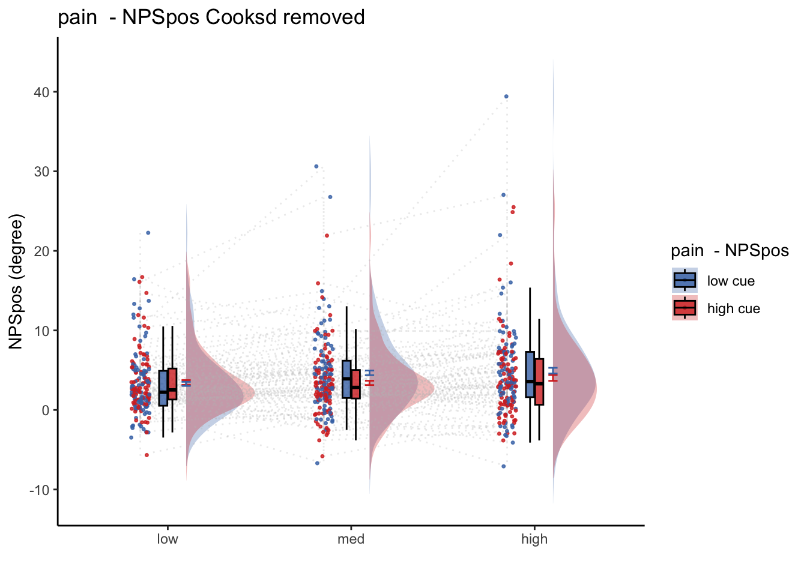


### Lineplots {.unlisted .unnumbered}
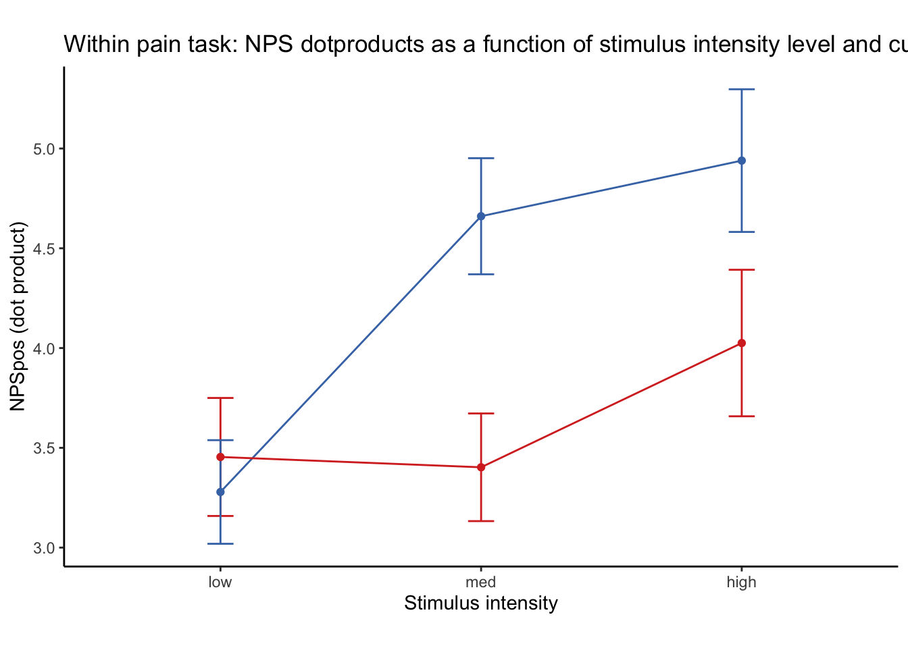


### Linear model results (NPS ~ paintask: 2 cue x 3 stimulus_intensity)

```r
model.npscuestim <- lmer(NPSpos ~ 
                          CUE_high_gt_low*STIM_linear +CUE_high_gt_low * STIM_quadratic +
                          (CUE_high_gt_low+STIM|sub), data = data_screen
                    )
sjPlot::tab_model(model.npscuestim,
                  title = "Multilevel-modeling: \nlmer(NPSpos ~ CUE * STIM + (CUE + STIM | sub), data = pvc)",
                  CSS = list(css.table = '+font-size: 12;'))
```

<table style="border-collapse:collapse; border:none;font-size: 12;">
<caption style="font-weight: bold; text-align:left;">Multilevel-modeling: 
lmer(NPSpos ~ CUE * STIM + (CUE + STIM | sub), data = pvc)</caption>
<tr>
<th style="border-top: double; text-align:center; font-style:italic; font-weight:normal; padding:0.2cm; border-bottom:1px solid black; text-align:left; ">&nbsp;</th>
<th colspan="3" style="border-top: double; text-align:center; font-style:italic; font-weight:normal; padding:0.2cm; border-bottom:1px solid black;">NPSpos</th>
</tr>
<tr>
<td style=" text-align:center; border-bottom:1px solid; font-style:italic; font-weight:normal; border-bottom:1px solid black; text-align:left; ">Predictors</td>
<td style=" text-align:center; border-bottom:1px solid; font-style:italic; font-weight:normal; border-bottom:1px solid black; ">Estimates</td>
<td style=" text-align:center; border-bottom:1px solid; font-style:italic; font-weight:normal; border-bottom:1px solid black; ">CI</td>
<td style=" text-align:center; border-bottom:1px solid; font-style:italic; font-weight:normal; border-bottom:1px solid black; ">p</td>
</tr>
<tr>
<td style=" padding:0.2cm; text-align:left; vertical-align:top; text-align:left; ">(Intercept)</td>
<td style=" padding:0.2cm; text-align:left; vertical-align:top; text-align:center;  ">3.84</td>
<td style=" padding:0.2cm; text-align:left; vertical-align:top; text-align:center;  ">3.02&nbsp;&ndash;&nbsp;4.67</td>
<td style=" padding:0.2cm; text-align:left; vertical-align:top; text-align:center;  "><strong>&lt;0.001</strong></td>
</tr>
<tr>
<td style=" padding:0.2cm; text-align:left; vertical-align:top; text-align:left; ">CUE high gt low</td>
<td style=" padding:0.2cm; text-align:left; vertical-align:top; text-align:center;  ">&#45;0.55</td>
<td style=" padding:0.2cm; text-align:left; vertical-align:top; text-align:center;  ">&#45;1.01&nbsp;&ndash;&nbsp;-0.10</td>
<td style=" padding:0.2cm; text-align:left; vertical-align:top; text-align:center;  "><strong>0.017</strong></td>
</tr>
<tr>
<td style=" padding:0.2cm; text-align:left; vertical-align:top; text-align:left; ">STIM linear</td>
<td style=" padding:0.2cm; text-align:left; vertical-align:top; text-align:center;  ">1.12</td>
<td style=" padding:0.2cm; text-align:left; vertical-align:top; text-align:center;  ">0.56&nbsp;&ndash;&nbsp;1.68</td>
<td style=" padding:0.2cm; text-align:left; vertical-align:top; text-align:center;  "><strong>&lt;0.001</strong></td>
</tr>
<tr>
<td style=" padding:0.2cm; text-align:left; vertical-align:top; text-align:left; ">STIM quadratic</td>
<td style=" padding:0.2cm; text-align:left; vertical-align:top; text-align:center;  ">0.08</td>
<td style=" padding:0.2cm; text-align:left; vertical-align:top; text-align:center;  ">&#45;0.37&nbsp;&ndash;&nbsp;0.52</td>
<td style=" padding:0.2cm; text-align:left; vertical-align:top; text-align:center;  ">0.739</td>
</tr>
<tr>
<td style=" padding:0.2cm; text-align:left; vertical-align:top; text-align:left; ">CUE high gt low * STIM<br>linear</td>
<td style=" padding:0.2cm; text-align:left; vertical-align:top; text-align:center;  ">&#45;0.75</td>
<td style=" padding:0.2cm; text-align:left; vertical-align:top; text-align:center;  ">&#45;1.76&nbsp;&ndash;&nbsp;0.27</td>
<td style=" padding:0.2cm; text-align:left; vertical-align:top; text-align:center;  ">0.148</td>
</tr>
<tr>
<td style=" padding:0.2cm; text-align:left; vertical-align:top; text-align:left; ">CUE high gt low * STIM<br>quadratic</td>
<td style=" padding:0.2cm; text-align:left; vertical-align:top; text-align:center;  ">&#45;0.79</td>
<td style=" padding:0.2cm; text-align:left; vertical-align:top; text-align:center;  ">&#45;1.68&nbsp;&ndash;&nbsp;0.10</td>
<td style=" padding:0.2cm; text-align:left; vertical-align:top; text-align:center;  ">0.082</td>
</tr>
<tr>
<td colspan="4" style="font-weight:bold; text-align:left; padding-top:.8em;">Random Effects</td>
</tr>

<tr>
<td style=" padding:0.2cm; text-align:left; vertical-align:top; text-align:left; padding-top:0.1cm; padding-bottom:0.1cm;">&sigma;<sup>2</sup></td>
<td style=" padding:0.2cm; text-align:left; vertical-align:top; padding-top:0.1cm; padding-bottom:0.1cm; text-align:center;" colspan="3">58.98</td>
</tr>

<tr>
<td style=" padding:0.2cm; text-align:left; vertical-align:top; text-align:left; padding-top:0.1cm; padding-bottom:0.1cm;">&tau;<sub>00</sub> <sub>sub</sub></td>
<td style=" padding:0.2cm; text-align:left; vertical-align:top; padding-top:0.1cm; padding-bottom:0.1cm; text-align:center;" colspan="3">19.57</td>

<tr>
<td style=" padding:0.2cm; text-align:left; vertical-align:top; text-align:left; padding-top:0.1cm; padding-bottom:0.1cm;">&tau;<sub>11</sub> <sub>sub.CUE_high_gt_low</sub></td>
<td style=" padding:0.2cm; text-align:left; vertical-align:top; padding-top:0.1cm; padding-bottom:0.1cm; text-align:center;" colspan="3">0.78</td>

<tr>
<td style=" padding:0.2cm; text-align:left; vertical-align:top; text-align:left; padding-top:0.1cm; padding-bottom:0.1cm;">&tau;<sub>11</sub> <sub>sub.STIMlow</sub></td>
<td style=" padding:0.2cm; text-align:left; vertical-align:top; padding-top:0.1cm; padding-bottom:0.1cm; text-align:center;" colspan="3">1.26</td>

<tr>
<td style=" padding:0.2cm; text-align:left; vertical-align:top; text-align:left; padding-top:0.1cm; padding-bottom:0.1cm;">&tau;<sub>11</sub> <sub>sub.STIMmed</sub></td>
<td style=" padding:0.2cm; text-align:left; vertical-align:top; padding-top:0.1cm; padding-bottom:0.1cm; text-align:center;" colspan="3">0.45</td>

<tr>
<td style=" padding:0.2cm; text-align:left; vertical-align:top; text-align:left; padding-top:0.1cm; padding-bottom:0.1cm;">&rho;<sub>01</sub></td>
<td style=" padding:0.2cm; text-align:left; vertical-align:top; padding-top:0.1cm; padding-bottom:0.1cm; text-align:center;" colspan="3">-1.00</td>

<tr>
<td style=" padding:0.2cm; text-align:left; vertical-align:top; text-align:left; padding-top:0.1cm; padding-bottom:0.1cm;"></td>
<td style=" padding:0.2cm; text-align:left; vertical-align:top; padding-top:0.1cm; padding-bottom:0.1cm; text-align:center;" colspan="3">-1.00</td>

<tr>
<td style=" padding:0.2cm; text-align:left; vertical-align:top; text-align:left; padding-top:0.1cm; padding-bottom:0.1cm;"></td>
<td style=" padding:0.2cm; text-align:left; vertical-align:top; padding-top:0.1cm; padding-bottom:0.1cm; text-align:center;" colspan="3">-1.00</td>

<tr>
<td style=" padding:0.2cm; text-align:left; vertical-align:top; text-align:left; padding-top:0.1cm; padding-bottom:0.1cm;">N <sub>sub</sub></td>
<td style=" padding:0.2cm; text-align:left; vertical-align:top; padding-top:0.1cm; padding-bottom:0.1cm; text-align:center;" colspan="3">90</td>
<tr>
<td style=" padding:0.2cm; text-align:left; vertical-align:top; text-align:left; padding-top:0.1cm; padding-bottom:0.1cm; border-top:1px solid;">Observations</td>
<td style=" padding:0.2cm; text-align:left; vertical-align:top; padding-top:0.1cm; padding-bottom:0.1cm; text-align:center; border-top:1px solid;" colspan="3">5279</td>
</tr>
<tr>
<td style=" padding:0.2cm; text-align:left; vertical-align:top; text-align:left; padding-top:0.1cm; padding-bottom:0.1cm;">Marginal R<sup>2</sup> / Conditional R<sup>2</sup></td>
<td style=" padding:0.2cm; text-align:left; vertical-align:top; padding-top:0.1cm; padding-bottom:0.1cm; text-align:center;" colspan="3">0.006 / NA</td>
</tr>

</table>

#### Linear model eta-squared {.unlisted .unnumbered}
<table class="table table-striped" style="font-size: 12px; ">
 <thead>
  <tr>
   <th style="text-align:left;"> Parameter </th>
   <th style="text-align:right;"> Eta2_partial </th>
   <th style="text-align:right;"> CI </th>
   <th style="text-align:right;"> CI_low </th>
   <th style="text-align:right;"> CI_high </th>
  </tr>
 </thead>
<tbody>
  <tr>
   <td style="text-align:left;"> CUE_high_gt_low </td>
   <td style="text-align:right;"> 0.0304615 </td>
   <td style="text-align:right;"> 0.95 </td>
   <td style="text-align:right;"> 0.0028207 </td>
   <td style="text-align:right;"> 1 </td>
  </tr>
  <tr>
   <td style="text-align:left;"> STIM_linear </td>
   <td style="text-align:right;"> 0.0822947 </td>
   <td style="text-align:right;"> 0.95 </td>
   <td style="text-align:right;"> 0.0284766 </td>
   <td style="text-align:right;"> 1 </td>
  </tr>
  <tr>
   <td style="text-align:left;"> STIM_quadratic </td>
   <td style="text-align:right;"> 0.0000314 </td>
   <td style="text-align:right;"> 0.95 </td>
   <td style="text-align:right;"> 0.0000000 </td>
   <td style="text-align:right;"> 1 </td>
  </tr>
  <tr>
   <td style="text-align:left;"> CUE_high_gt_low:STIM_linear </td>
   <td style="text-align:right;"> 0.0004036 </td>
   <td style="text-align:right;"> 0.95 </td>
   <td style="text-align:right;"> 0.0000000 </td>
   <td style="text-align:right;"> 1 </td>
  </tr>
  <tr>
   <td style="text-align:left;"> CUE_high_gt_low:STIM_quadratic </td>
   <td style="text-align:right;"> 0.0005847 </td>
   <td style="text-align:right;"> 0.95 </td>
   <td style="text-align:right;"> 0.0000000 </td>
   <td style="text-align:right;"> 1 </td>
  </tr>
</tbody>
</table>

#### Linear model Cohen's d: NPS stimulus_intensity d = 1.16, cue d = 0.45 {.unlisted .unnumbered}
<table class="table table-striped" style="font-size: 12px; ">
 <thead>
  <tr>
   <th style="text-align:left;">   </th>
   <th style="text-align:right;"> t </th>
   <th style="text-align:right;"> df </th>
   <th style="text-align:right;"> d </th>
  </tr>
 </thead>
<tbody>
  <tr>
   <td style="text-align:left;"> CUE_high_gt_low </td>
   <td style="text-align:right;"> -2.3877102 </td>
   <td style="text-align:right;"> 181.4583 </td>
   <td style="text-align:right;"> -0.3545057 </td>
  </tr>
  <tr>
   <td style="text-align:left;"> STIM_linear </td>
   <td style="text-align:right;"> 3.9385961 </td>
   <td style="text-align:right;"> 172.9874 </td>
   <td style="text-align:right;"> 0.5989136 </td>
  </tr>
  <tr>
   <td style="text-align:left;"> STIM_quadratic </td>
   <td style="text-align:right;"> 0.3327521 </td>
   <td style="text-align:right;"> 3522.7952 </td>
   <td style="text-align:right;"> 0.0112126 </td>
  </tr>
  <tr>
   <td style="text-align:left;"> CUE_high_gt_low:STIM_linear </td>
   <td style="text-align:right;"> -1.4455263 </td>
   <td style="text-align:right;"> 5174.8510 </td>
   <td style="text-align:right;"> -0.0401890 </td>
  </tr>
  <tr>
   <td style="text-align:left;"> CUE_high_gt_low:STIM_quadratic </td>
   <td style="text-align:right;"> -1.7399941 </td>
   <td style="text-align:right;"> 5175.1862 </td>
   <td style="text-align:right;"> -0.0483743 </td>
  </tr>
</tbody>
</table>


### 2 cue * 3 stimulus_intensity * expectation_rating 

```r
data_screen$EXPECT <- data_screen$event02_expect_angle
model.nps3factor <- lmer(NPSpos ~ 
                          CUE_high_gt_low*STIM_linear*EXPECT +
                           CUE_high_gt_low*STIM_quadratic*EXPECT +
                          (CUE_high_gt_low+STIM + EXPECT|sub), data = data_screen
                    )
```

```
## boundary (singular) fit: see help('isSingular')
```

```r
sjPlot::tab_model(model.nps3factor,
                  title = "Multilevel-modeling: \nlmer(NPSpos ~ CUE * STIM * EXPECTATION + (CUE + STIM + EXPECT | sub), data = pvc)",
                  CSS = list(css.table = '+font-size: 12;'))
```

<table style="border-collapse:collapse; border:none;font-size: 12;">
<caption style="font-weight: bold; text-align:left;">Multilevel-modeling: 
lmer(NPSpos ~ CUE * STIM * EXPECTATION + (CUE + STIM + EXPECT | sub), data = pvc)</caption>
<tr>
<th style="border-top: double; text-align:center; font-style:italic; font-weight:normal; padding:0.2cm; border-bottom:1px solid black; text-align:left; ">&nbsp;</th>
<th colspan="3" style="border-top: double; text-align:center; font-style:italic; font-weight:normal; padding:0.2cm; border-bottom:1px solid black;">NPSpos</th>
</tr>
<tr>
<td style=" text-align:center; border-bottom:1px solid; font-style:italic; font-weight:normal; border-bottom:1px solid black; text-align:left; ">Predictors</td>
<td style=" text-align:center; border-bottom:1px solid; font-style:italic; font-weight:normal; border-bottom:1px solid black; ">Estimates</td>
<td style=" text-align:center; border-bottom:1px solid; font-style:italic; font-weight:normal; border-bottom:1px solid black; ">CI</td>
<td style=" text-align:center; border-bottom:1px solid; font-style:italic; font-weight:normal; border-bottom:1px solid black; ">p</td>
</tr>
<tr>
<td style=" padding:0.2cm; text-align:left; vertical-align:top; text-align:left; ">(Intercept)</td>
<td style=" padding:0.2cm; text-align:left; vertical-align:top; text-align:center;  ">0.91</td>
<td style=" padding:0.2cm; text-align:left; vertical-align:top; text-align:center;  ">0.07&nbsp;&ndash;&nbsp;1.75</td>
<td style=" padding:0.2cm; text-align:left; vertical-align:top; text-align:center;  "><strong>0.035</strong></td>
</tr>
<tr>
<td style=" padding:0.2cm; text-align:left; vertical-align:top; text-align:left; ">CUE high gt low</td>
<td style=" padding:0.2cm; text-align:left; vertical-align:top; text-align:center;  ">&#45;1.91</td>
<td style=" padding:0.2cm; text-align:left; vertical-align:top; text-align:center;  ">&#45;3.07&nbsp;&ndash;&nbsp;-0.76</td>
<td style=" padding:0.2cm; text-align:left; vertical-align:top; text-align:center;  "><strong>0.001</strong></td>
</tr>
<tr>
<td style=" padding:0.2cm; text-align:left; vertical-align:top; text-align:left; ">STIM linear</td>
<td style=" padding:0.2cm; text-align:left; vertical-align:top; text-align:center;  ">&#45;0.25</td>
<td style=" padding:0.2cm; text-align:left; vertical-align:top; text-align:center;  ">&#45;1.17&nbsp;&ndash;&nbsp;0.67</td>
<td style=" padding:0.2cm; text-align:left; vertical-align:top; text-align:center;  ">0.600</td>
</tr>
<tr>
<td style=" padding:0.2cm; text-align:left; vertical-align:top; text-align:left; ">EXPECT</td>
<td style=" padding:0.2cm; text-align:left; vertical-align:top; text-align:center;  ">0.06</td>
<td style=" padding:0.2cm; text-align:left; vertical-align:top; text-align:center;  ">0.04&nbsp;&ndash;&nbsp;0.08</td>
<td style=" padding:0.2cm; text-align:left; vertical-align:top; text-align:center;  "><strong>&lt;0.001</strong></td>
</tr>
<tr>
<td style=" padding:0.2cm; text-align:left; vertical-align:top; text-align:left; ">STIM quadratic</td>
<td style=" padding:0.2cm; text-align:left; vertical-align:top; text-align:center;  ">0.79</td>
<td style=" padding:0.2cm; text-align:left; vertical-align:top; text-align:center;  ">0.00&nbsp;&ndash;&nbsp;1.58</td>
<td style=" padding:0.2cm; text-align:left; vertical-align:top; text-align:center;  "><strong>0.049</strong></td>
</tr>
<tr>
<td style=" padding:0.2cm; text-align:left; vertical-align:top; text-align:left; ">CUE high gt low * STIM<br>linear</td>
<td style=" padding:0.2cm; text-align:left; vertical-align:top; text-align:center;  ">&#45;1.59</td>
<td style=" padding:0.2cm; text-align:left; vertical-align:top; text-align:center;  ">&#45;3.36&nbsp;&ndash;&nbsp;0.17</td>
<td style=" padding:0.2cm; text-align:left; vertical-align:top; text-align:center;  ">0.077</td>
</tr>
<tr>
<td style=" padding:0.2cm; text-align:left; vertical-align:top; text-align:left; ">CUE high gt low * EXPECT</td>
<td style=" padding:0.2cm; text-align:left; vertical-align:top; text-align:center;  ">&#45;0.02</td>
<td style=" padding:0.2cm; text-align:left; vertical-align:top; text-align:center;  ">&#45;0.03&nbsp;&ndash;&nbsp;-0.00</td>
<td style=" padding:0.2cm; text-align:left; vertical-align:top; text-align:center;  "><strong>0.030</strong></td>
</tr>
<tr>
<td style=" padding:0.2cm; text-align:left; vertical-align:top; text-align:left; ">STIM linear * EXPECT</td>
<td style=" padding:0.2cm; text-align:left; vertical-align:top; text-align:center;  ">0.03</td>
<td style=" padding:0.2cm; text-align:left; vertical-align:top; text-align:center;  ">0.02&nbsp;&ndash;&nbsp;0.05</td>
<td style=" padding:0.2cm; text-align:left; vertical-align:top; text-align:center;  "><strong>&lt;0.001</strong></td>
</tr>
<tr>
<td style=" padding:0.2cm; text-align:left; vertical-align:top; text-align:left; ">CUE high gt low * STIM<br>quadratic</td>
<td style=" padding:0.2cm; text-align:left; vertical-align:top; text-align:center;  ">&#45;0.59</td>
<td style=" padding:0.2cm; text-align:left; vertical-align:top; text-align:center;  ">&#45;2.16&nbsp;&ndash;&nbsp;0.99</td>
<td style=" padding:0.2cm; text-align:left; vertical-align:top; text-align:center;  ">0.463</td>
</tr>
<tr>
<td style=" padding:0.2cm; text-align:left; vertical-align:top; text-align:left; ">EXPECT * STIM quadratic</td>
<td style=" padding:0.2cm; text-align:left; vertical-align:top; text-align:center;  ">&#45;0.01</td>
<td style=" padding:0.2cm; text-align:left; vertical-align:top; text-align:center;  ">&#45;0.03&nbsp;&ndash;&nbsp;-0.00</td>
<td style=" padding:0.2cm; text-align:left; vertical-align:top; text-align:center;  "><strong>0.040</strong></td>
</tr>
<tr>
<td style=" padding:0.2cm; text-align:left; vertical-align:top; text-align:left; ">(CUE high gt low * STIM<br>linear) * EXPECT</td>
<td style=" padding:0.2cm; text-align:left; vertical-align:top; text-align:center;  ">&#45;0.01</td>
<td style=" padding:0.2cm; text-align:left; vertical-align:top; text-align:center;  ">&#45;0.04&nbsp;&ndash;&nbsp;0.02</td>
<td style=" padding:0.2cm; text-align:left; vertical-align:top; text-align:center;  ">0.585</td>
</tr>
<tr>
<td style=" padding:0.2cm; text-align:left; vertical-align:top; text-align:left; ">(CUE high gt low *<br>EXPECT) * STIM quadratic</td>
<td style=" padding:0.2cm; text-align:left; vertical-align:top; text-align:center;  ">&#45;0.00</td>
<td style=" padding:0.2cm; text-align:left; vertical-align:top; text-align:center;  ">&#45;0.03&nbsp;&ndash;&nbsp;0.03</td>
<td style=" padding:0.2cm; text-align:left; vertical-align:top; text-align:center;  ">0.912</td>
</tr>
<tr>
<td colspan="4" style="font-weight:bold; text-align:left; padding-top:.8em;">Random Effects</td>
</tr>

<tr>
<td style=" padding:0.2cm; text-align:left; vertical-align:top; text-align:left; padding-top:0.1cm; padding-bottom:0.1cm;">&sigma;<sup>2</sup></td>
<td style=" padding:0.2cm; text-align:left; vertical-align:top; padding-top:0.1cm; padding-bottom:0.1cm; text-align:center;" colspan="3">51.63</td>
</tr>

<tr>
<td style=" padding:0.2cm; text-align:left; vertical-align:top; text-align:left; padding-top:0.1cm; padding-bottom:0.1cm;">&tau;<sub>00</sub> <sub>sub</sub></td>
<td style=" padding:0.2cm; text-align:left; vertical-align:top; padding-top:0.1cm; padding-bottom:0.1cm; text-align:center;" colspan="3">12.53</td>

<tr>
<td style=" padding:0.2cm; text-align:left; vertical-align:top; text-align:left; padding-top:0.1cm; padding-bottom:0.1cm;">&tau;<sub>11</sub> <sub>sub.CUE_high_gt_low</sub></td>
<td style=" padding:0.2cm; text-align:left; vertical-align:top; padding-top:0.1cm; padding-bottom:0.1cm; text-align:center;" colspan="3">15.68</td>

<tr>
<td style=" padding:0.2cm; text-align:left; vertical-align:top; text-align:left; padding-top:0.1cm; padding-bottom:0.1cm;">&tau;<sub>11</sub> <sub>sub.STIMlow</sub></td>
<td style=" padding:0.2cm; text-align:left; vertical-align:top; padding-top:0.1cm; padding-bottom:0.1cm; text-align:center;" colspan="3">1.38</td>

<tr>
<td style=" padding:0.2cm; text-align:left; vertical-align:top; text-align:left; padding-top:0.1cm; padding-bottom:0.1cm;">&tau;<sub>11</sub> <sub>sub.STIMmed</sub></td>
<td style=" padding:0.2cm; text-align:left; vertical-align:top; padding-top:0.1cm; padding-bottom:0.1cm; text-align:center;" colspan="3">0.22</td>

<tr>
<td style=" padding:0.2cm; text-align:left; vertical-align:top; text-align:left; padding-top:0.1cm; padding-bottom:0.1cm;">&tau;<sub>11</sub> <sub>sub.EXPECT</sub></td>
<td style=" padding:0.2cm; text-align:left; vertical-align:top; padding-top:0.1cm; padding-bottom:0.1cm; text-align:center;" colspan="3">0.01</td>

<tr>
<td style=" padding:0.2cm; text-align:left; vertical-align:top; text-align:left; padding-top:0.1cm; padding-bottom:0.1cm;">&rho;<sub>01</sub></td>
<td style=" padding:0.2cm; text-align:left; vertical-align:top; padding-top:0.1cm; padding-bottom:0.1cm; text-align:center;" colspan="3">0.29</td>

<tr>
<td style=" padding:0.2cm; text-align:left; vertical-align:top; text-align:left; padding-top:0.1cm; padding-bottom:0.1cm;"></td>
<td style=" padding:0.2cm; text-align:left; vertical-align:top; padding-top:0.1cm; padding-bottom:0.1cm; text-align:center;" colspan="3">-0.54</td>

<tr>
<td style=" padding:0.2cm; text-align:left; vertical-align:top; text-align:left; padding-top:0.1cm; padding-bottom:0.1cm;"></td>
<td style=" padding:0.2cm; text-align:left; vertical-align:top; padding-top:0.1cm; padding-bottom:0.1cm; text-align:center;" colspan="3">-0.72</td>

<tr>
<td style=" padding:0.2cm; text-align:left; vertical-align:top; text-align:left; padding-top:0.1cm; padding-bottom:0.1cm;"></td>
<td style=" padding:0.2cm; text-align:left; vertical-align:top; padding-top:0.1cm; padding-bottom:0.1cm; text-align:center;" colspan="3">-0.41</td>

<tr>
<td style=" padding:0.2cm; text-align:left; vertical-align:top; text-align:left; padding-top:0.1cm; padding-bottom:0.1cm;">ICC</td>
<td style=" padding:0.2cm; text-align:left; vertical-align:top; padding-top:0.1cm; padding-bottom:0.1cm; text-align:center;" colspan="3">0.32</td>

<tr>
<td style=" padding:0.2cm; text-align:left; vertical-align:top; text-align:left; padding-top:0.1cm; padding-bottom:0.1cm;">N <sub>sub</sub></td>
<td style=" padding:0.2cm; text-align:left; vertical-align:top; padding-top:0.1cm; padding-bottom:0.1cm; text-align:center;" colspan="3">90</td>
<tr>
<td style=" padding:0.2cm; text-align:left; vertical-align:top; text-align:left; padding-top:0.1cm; padding-bottom:0.1cm; border-top:1px solid;">Observations</td>
<td style=" padding:0.2cm; text-align:left; vertical-align:top; padding-top:0.1cm; padding-bottom:0.1cm; text-align:center; border-top:1px solid;" colspan="3">5105</td>
</tr>
<tr>
<td style=" padding:0.2cm; text-align:left; vertical-align:top; text-align:left; padding-top:0.1cm; padding-bottom:0.1cm;">Marginal R<sup>2</sup> / Conditional R<sup>2</sup></td>
<td style=" padding:0.2cm; text-align:left; vertical-align:top; padding-top:0.1cm; padding-bottom:0.1cm; text-align:center;" colspan="3">0.054 / 0.359</td>
</tr>

</table>

#### eta squared {.unlisted .unnumbered}
<table class="table table-striped" style="font-size: 12px; ">
 <thead>
  <tr>
   <th style="text-align:left;"> Parameter </th>
   <th style="text-align:right;"> Eta2_partial </th>
   <th style="text-align:right;"> CI </th>
   <th style="text-align:right;"> CI_low </th>
   <th style="text-align:right;"> CI_high </th>
  </tr>
 </thead>
<tbody>
  <tr>
   <td style="text-align:left;"> CUE_high_gt_low </td>
   <td style="text-align:right;"> 0.0843615 </td>
   <td style="text-align:right;"> 0.95 </td>
   <td style="text-align:right;"> 0.0206703 </td>
   <td style="text-align:right;"> 1 </td>
  </tr>
  <tr>
   <td style="text-align:left;"> STIM_linear </td>
   <td style="text-align:right;"> 0.0003904 </td>
   <td style="text-align:right;"> 0.95 </td>
   <td style="text-align:right;"> 0.0000000 </td>
   <td style="text-align:right;"> 1 </td>
  </tr>
  <tr>
   <td style="text-align:left;"> EXPECT </td>
   <td style="text-align:right;"> 0.3197601 </td>
   <td style="text-align:right;"> 0.95 </td>
   <td style="text-align:right;"> 0.1790969 </td>
   <td style="text-align:right;"> 1 </td>
  </tr>
  <tr>
   <td style="text-align:left;"> STIM_quadratic </td>
   <td style="text-align:right;"> 0.0009602 </td>
   <td style="text-align:right;"> 0.95 </td>
   <td style="text-align:right;"> 0.0000026 </td>
   <td style="text-align:right;"> 1 </td>
  </tr>
  <tr>
   <td style="text-align:left;"> CUE_high_gt_low:STIM_linear </td>
   <td style="text-align:right;"> 0.0006439 </td>
   <td style="text-align:right;"> 0.95 </td>
   <td style="text-align:right;"> 0.0000000 </td>
   <td style="text-align:right;"> 1 </td>
  </tr>
  <tr>
   <td style="text-align:left;"> CUE_high_gt_low:EXPECT </td>
   <td style="text-align:right;"> 0.0045325 </td>
   <td style="text-align:right;"> 0.95 </td>
   <td style="text-align:right;"> 0.0002202 </td>
   <td style="text-align:right;"> 1 </td>
  </tr>
  <tr>
   <td style="text-align:left;"> STIM_linear:EXPECT </td>
   <td style="text-align:right;"> 0.0054526 </td>
   <td style="text-align:right;"> 0.95 </td>
   <td style="text-align:right;"> 0.0020557 </td>
   <td style="text-align:right;"> 1 </td>
  </tr>
  <tr>
   <td style="text-align:left;"> CUE_high_gt_low:STIM_quadratic </td>
   <td style="text-align:right;"> 0.0001107 </td>
   <td style="text-align:right;"> 0.95 </td>
   <td style="text-align:right;"> 0.0000000 </td>
   <td style="text-align:right;"> 1 </td>
  </tr>
  <tr>
   <td style="text-align:left;"> EXPECT:STIM_quadratic </td>
   <td style="text-align:right;"> 0.0008780 </td>
   <td style="text-align:right;"> 0.95 </td>
   <td style="text-align:right;"> 0.0000199 </td>
   <td style="text-align:right;"> 1 </td>
  </tr>
  <tr>
   <td style="text-align:left;"> CUE_high_gt_low:STIM_linear:EXPECT </td>
   <td style="text-align:right;"> 0.0000618 </td>
   <td style="text-align:right;"> 0.95 </td>
   <td style="text-align:right;"> 0.0000000 </td>
   <td style="text-align:right;"> 1 </td>
  </tr>
  <tr>
   <td style="text-align:left;"> CUE_high_gt_low:EXPECT:STIM_quadratic </td>
   <td style="text-align:right;"> 0.0000025 </td>
   <td style="text-align:right;"> 0.95 </td>
   <td style="text-align:right;"> 0.0000000 </td>
   <td style="text-align:right;"> 1 </td>
  </tr>
</tbody>
</table>

#### Cohen's d {.unlisted .unnumbered}

```
## boundary (singular) fit: see help('isSingular')
```

<table class="table table-striped" style="font-size: 12px; ">
 <thead>
  <tr>
   <th style="text-align:left;">   </th>
   <th style="text-align:right;"> t </th>
   <th style="text-align:right;"> df </th>
   <th style="text-align:right;"> d </th>
  </tr>
 </thead>
<tbody>
  <tr>
   <td style="text-align:left;"> CUE_high_gt_low </td>
   <td style="text-align:right;"> -3.2398610 </td>
   <td style="text-align:right;"> 113.92861 </td>
   <td style="text-align:right;"> -0.6070717 </td>
  </tr>
  <tr>
   <td style="text-align:left;"> STIM_linear </td>
   <td style="text-align:right;"> -0.5249444 </td>
   <td style="text-align:right;"> 705.55259 </td>
   <td style="text-align:right;"> -0.0395256 </td>
  </tr>
  <tr>
   <td style="text-align:left;"> EXPECT </td>
   <td style="text-align:right;"> 5.7897903 </td>
   <td style="text-align:right;"> 71.31214 </td>
   <td style="text-align:right;"> 1.3712325 </td>
  </tr>
  <tr>
   <td style="text-align:left;"> STIM_quadratic </td>
   <td style="text-align:right;"> 1.9707218 </td>
   <td style="text-align:right;"> 4040.68284 </td>
   <td style="text-align:right;"> 0.0620052 </td>
  </tr>
  <tr>
   <td style="text-align:left;"> CUE_high_gt_low:STIM_linear </td>
   <td style="text-align:right;"> -1.7684210 </td>
   <td style="text-align:right;"> 4853.71004 </td>
   <td style="text-align:right;"> -0.0507667 </td>
  </tr>
  <tr>
   <td style="text-align:left;"> CUE_high_gt_low:EXPECT </td>
   <td style="text-align:right;"> -2.1653894 </td>
   <td style="text-align:right;"> 1029.81836 </td>
   <td style="text-align:right;"> -0.1349540 </td>
  </tr>
  <tr>
   <td style="text-align:left;"> STIM_linear:EXPECT </td>
   <td style="text-align:right;"> 4.2565551 </td>
   <td style="text-align:right;"> 3304.73916 </td>
   <td style="text-align:right;"> 0.1480879 </td>
  </tr>
  <tr>
   <td style="text-align:left;"> CUE_high_gt_low:STIM_quadratic </td>
   <td style="text-align:right;"> -0.7337736 </td>
   <td style="text-align:right;"> 4862.89874 </td>
   <td style="text-align:right;"> -0.0210448 </td>
  </tr>
  <tr>
   <td style="text-align:left;"> EXPECT:STIM_quadratic </td>
   <td style="text-align:right;"> -2.0502958 </td>
   <td style="text-align:right;"> 4783.54502 </td>
   <td style="text-align:right;"> -0.0592887 </td>
  </tr>
  <tr>
   <td style="text-align:left;"> CUE_high_gt_low:STIM_linear:EXPECT </td>
   <td style="text-align:right;"> -0.5467513 </td>
   <td style="text-align:right;"> 4838.16776 </td>
   <td style="text-align:right;"> -0.0157210 </td>
  </tr>
  <tr>
   <td style="text-align:left;"> CUE_high_gt_low:EXPECT:STIM_quadratic </td>
   <td style="text-align:right;"> -0.1104321 </td>
   <td style="text-align:right;"> 4869.78705 </td>
   <td style="text-align:right;"> -0.0031650 </td>
  </tr>
</tbody>
</table>


---

## NPS_ses01 ~ SES * CUE * STIM
### Q. Is the cue effect on NPS different across sessions? {.unlisted .unnumbered}

> Quick answer: Yes, the cue effect in session 1 (for high intensity group) is significantly different; whereas this different becomes non significant in session 4. 
> To unpack, a participant was informed to experience a low  stimulus intensity, when in fact they were delivered a high intensity stimulus. This violation presumably leads to a higher NPS response, given that they were delivered a much painful stimulus than expected. The fact that the cue effect is almost non significant during the last session indicates that the cue effects are not just an anchoring effect. 

#### Session wise plots
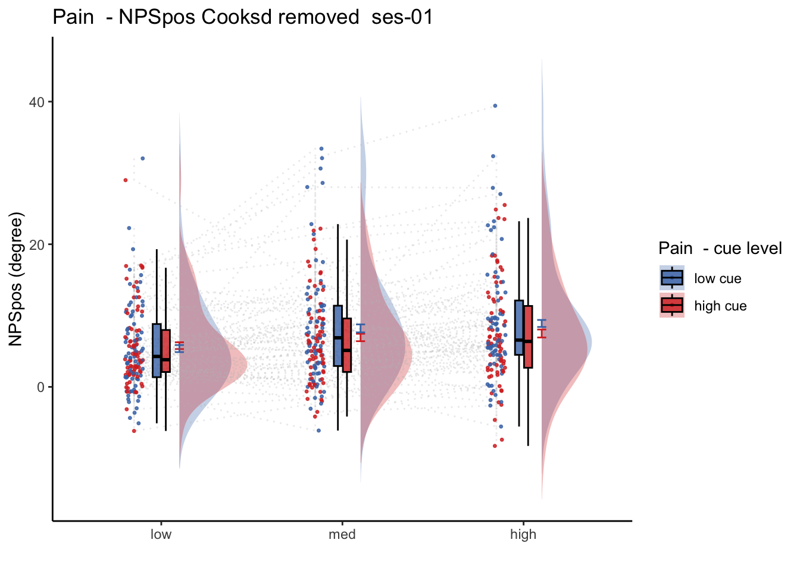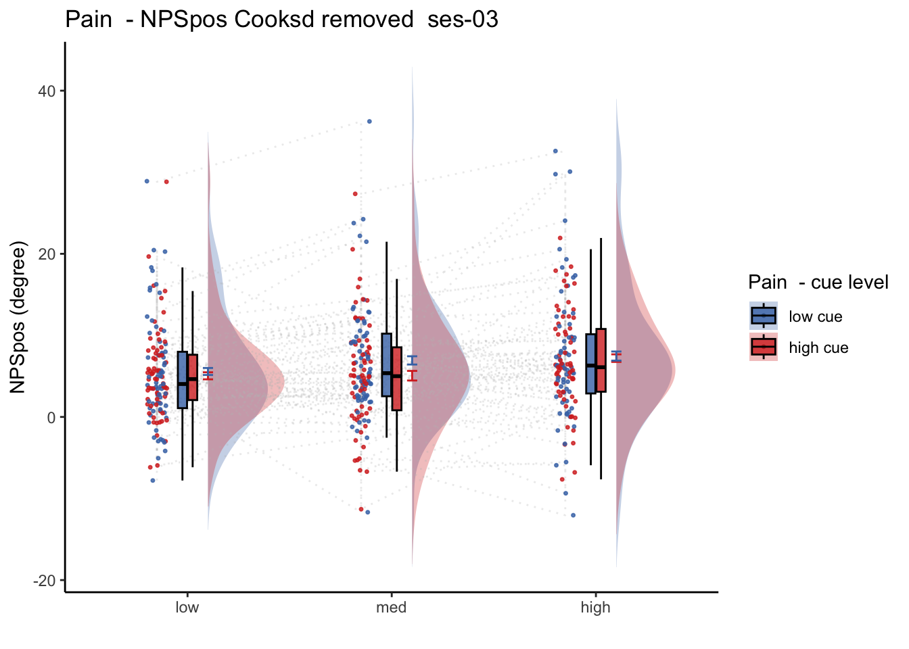


### Here are the stats models: NPS~session * cue * stimulus_intensity
1. Calculate difference score
* average high and low cue within run. 
* calculate difference between high and low cue per run
* each participant has 6 contrast scores
* run this as a function of stimulus intensity and sessions

---

## OUTCOME ~ NPS
### Q. Do higher NPS values indicate higher outcome ratings? (Pain task only) {.unlisted .unnumbered}

> Yes, Higher NPS values are associated with higher outcome ratings. The linear relationship between NPS value and outcome ratings are stronger for conditions where cue level is congruent with stimulus intensity levels. In other words, NPS-outcome rating relationship is stringent in the low cue-low intensity group, as is the case for high cue-ghigh intensity group. 


### outcome_rating * cue
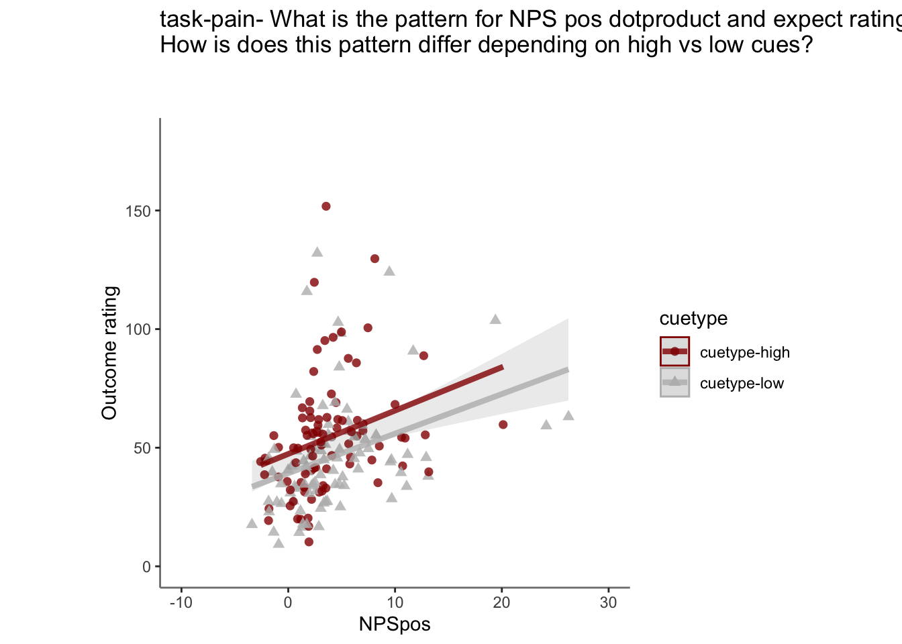


### outcome_ratings * stimulus_intensity * cue


### demeaned outcome rating * cue

```
## `geom_smooth()` using formula = 'y ~ x'
```

```
## Warning: Removed 50 rows containing non-finite values (`stat_smooth()`).
```

```
## `geom_smooth()` using formula = 'y ~ x'
```

```
## Warning: Removed 50 rows containing non-finite values (`stat_smooth()`).
```

```
## Warning: Removed 50 rows containing missing values (`geom_point()`).
```

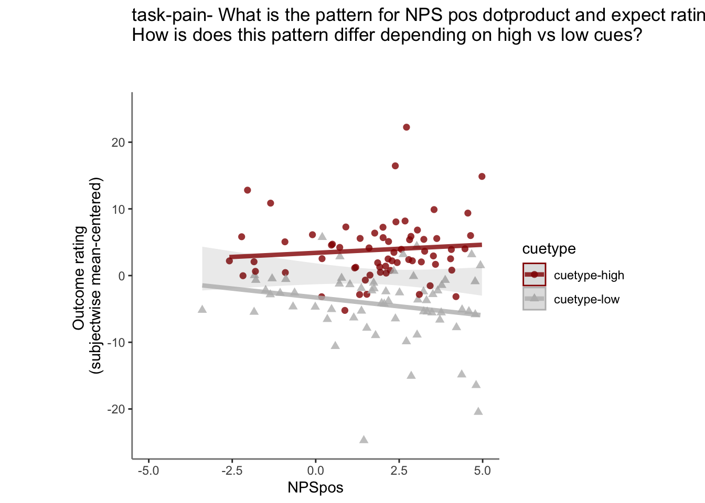

### demeaned_outcome_ratings * stimulus_intensity * cue
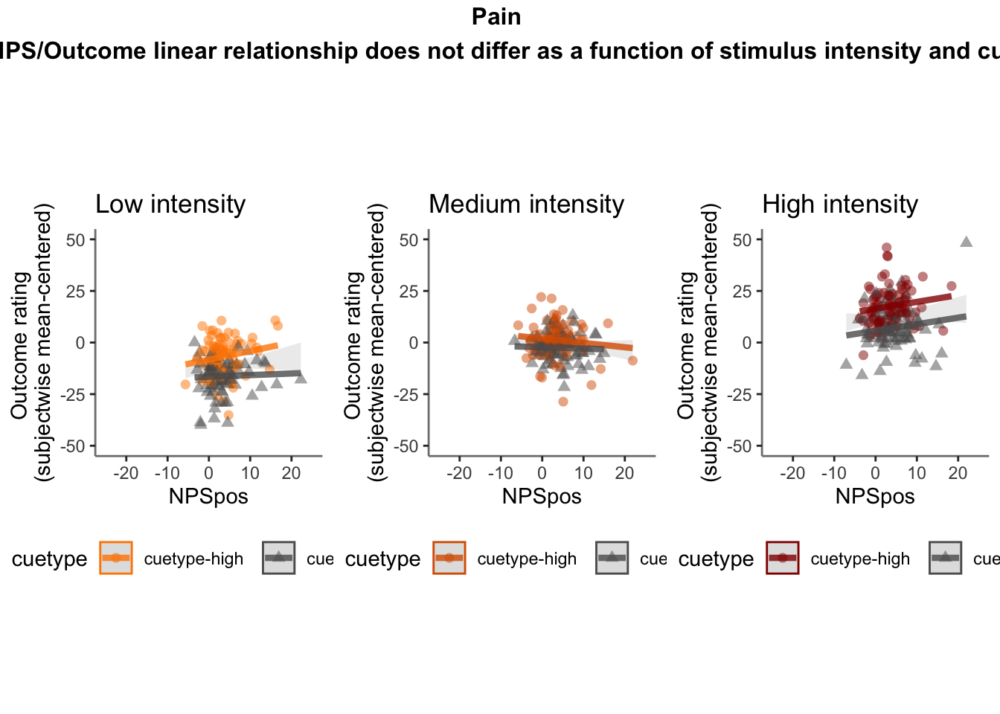

### Is this statistically significant?


```r
# organize variable names
# NPS_demean vs. NPSpos
model.npsoutcome <- lmer(OUTCOME_demean ~ CUE_high_gt_low*STIM_linear*NPSpos + CUE_high_gt_low*STIM_quadratic*NPSpos + (CUE_high_gt_low*STIM*NPSpos|sub), data = demean_dropna)
sjPlot::tab_model(model.npsoutcome,
                  title = "Multilevel-modeling: \nlmer(OUTCOME_demean ~ CUE * STIM * NPSpos + (CUE * STIM *NPSpos | sub), data = pvc)",
                  CSS = list(css.table = '+font-size: 12;'))
```

<table style="border-collapse:collapse; border:none;font-size: 12;">
<caption style="font-weight: bold; text-align:left;">Multilevel-modeling: 
lmer(OUTCOME_demean ~ CUE * STIM * NPSpos + (CUE * STIM *NPSpos | sub), data = pvc)</caption>
<tr>
<th style="border-top: double; text-align:center; font-style:italic; font-weight:normal; padding:0.2cm; border-bottom:1px solid black; text-align:left; ">&nbsp;</th>
<th colspan="3" style="border-top: double; text-align:center; font-style:italic; font-weight:normal; padding:0.2cm; border-bottom:1px solid black;">OUTCOME_demean</th>
</tr>
<tr>
<td style=" text-align:center; border-bottom:1px solid; font-style:italic; font-weight:normal; border-bottom:1px solid black; text-align:left; ">Predictors</td>
<td style=" text-align:center; border-bottom:1px solid; font-style:italic; font-weight:normal; border-bottom:1px solid black; ">Estimates</td>
<td style=" text-align:center; border-bottom:1px solid; font-style:italic; font-weight:normal; border-bottom:1px solid black; ">CI</td>
<td style=" text-align:center; border-bottom:1px solid; font-style:italic; font-weight:normal; border-bottom:1px solid black; ">p</td>
</tr>
<tr>
<td style=" padding:0.2cm; text-align:left; vertical-align:top; text-align:left; ">(Intercept)</td>
<td style=" padding:0.2cm; text-align:left; vertical-align:top; text-align:center;  ">&#45;4.19</td>
<td style=" padding:0.2cm; text-align:left; vertical-align:top; text-align:center;  ">&#45;5.64&nbsp;&ndash;&nbsp;-2.75</td>
<td style=" padding:0.2cm; text-align:left; vertical-align:top; text-align:center;  "><strong>&lt;0.001</strong></td>
</tr>
<tr>
<td style=" padding:0.2cm; text-align:left; vertical-align:top; text-align:left; ">CUE high gt low</td>
<td style=" padding:0.2cm; text-align:left; vertical-align:top; text-align:center;  ">8.41</td>
<td style=" padding:0.2cm; text-align:left; vertical-align:top; text-align:center;  ">6.43&nbsp;&ndash;&nbsp;10.39</td>
<td style=" padding:0.2cm; text-align:left; vertical-align:top; text-align:center;  "><strong>&lt;0.001</strong></td>
</tr>
<tr>
<td style=" padding:0.2cm; text-align:left; vertical-align:top; text-align:left; ">STIM linear</td>
<td style=" padding:0.2cm; text-align:left; vertical-align:top; text-align:center;  ">22.20</td>
<td style=" padding:0.2cm; text-align:left; vertical-align:top; text-align:center;  ">19.74&nbsp;&ndash;&nbsp;24.67</td>
<td style=" padding:0.2cm; text-align:left; vertical-align:top; text-align:center;  "><strong>&lt;0.001</strong></td>
</tr>
<tr>
<td style=" padding:0.2cm; text-align:left; vertical-align:top; text-align:left; ">NPSpos</td>
<td style=" padding:0.2cm; text-align:left; vertical-align:top; text-align:center;  ">0.95</td>
<td style=" padding:0.2cm; text-align:left; vertical-align:top; text-align:center;  ">0.71&nbsp;&ndash;&nbsp;1.19</td>
<td style=" padding:0.2cm; text-align:left; vertical-align:top; text-align:center;  "><strong>&lt;0.001</strong></td>
</tr>
<tr>
<td style=" padding:0.2cm; text-align:left; vertical-align:top; text-align:left; ">STIM quadratic</td>
<td style=" padding:0.2cm; text-align:left; vertical-align:top; text-align:center;  ">&#45;0.71</td>
<td style=" padding:0.2cm; text-align:left; vertical-align:top; text-align:center;  ">&#45;2.50&nbsp;&ndash;&nbsp;1.08</td>
<td style=" padding:0.2cm; text-align:left; vertical-align:top; text-align:center;  ">0.434</td>
</tr>
<tr>
<td style=" padding:0.2cm; text-align:left; vertical-align:top; text-align:left; ">CUE high gt low * STIM<br>linear</td>
<td style=" padding:0.2cm; text-align:left; vertical-align:top; text-align:center;  ">2.60</td>
<td style=" padding:0.2cm; text-align:left; vertical-align:top; text-align:center;  ">&#45;1.45&nbsp;&ndash;&nbsp;6.64</td>
<td style=" padding:0.2cm; text-align:left; vertical-align:top; text-align:center;  ">0.208</td>
</tr>
<tr>
<td style=" padding:0.2cm; text-align:left; vertical-align:top; text-align:left; ">CUE high gt low * NPSpos</td>
<td style=" padding:0.2cm; text-align:left; vertical-align:top; text-align:center;  ">0.05</td>
<td style=" padding:0.2cm; text-align:left; vertical-align:top; text-align:center;  ">&#45;0.15&nbsp;&ndash;&nbsp;0.26</td>
<td style=" padding:0.2cm; text-align:left; vertical-align:top; text-align:center;  ">0.606</td>
</tr>
<tr>
<td style=" padding:0.2cm; text-align:left; vertical-align:top; text-align:left; ">STIM linear * NPSpos</td>
<td style=" padding:0.2cm; text-align:left; vertical-align:top; text-align:center;  ">0.21</td>
<td style=" padding:0.2cm; text-align:left; vertical-align:top; text-align:center;  ">&#45;0.05&nbsp;&ndash;&nbsp;0.46</td>
<td style=" padding:0.2cm; text-align:left; vertical-align:top; text-align:center;  ">0.114</td>
</tr>
<tr>
<td style=" padding:0.2cm; text-align:left; vertical-align:top; text-align:left; ">CUE high gt low * STIM<br>quadratic</td>
<td style=" padding:0.2cm; text-align:left; vertical-align:top; text-align:center;  ">&#45;4.58</td>
<td style=" padding:0.2cm; text-align:left; vertical-align:top; text-align:center;  ">&#45;8.16&nbsp;&ndash;&nbsp;-1.00</td>
<td style=" padding:0.2cm; text-align:left; vertical-align:top; text-align:center;  "><strong>0.012</strong></td>
</tr>
<tr>
<td style=" padding:0.2cm; text-align:left; vertical-align:top; text-align:left; ">NPSpos * STIM quadratic</td>
<td style=" padding:0.2cm; text-align:left; vertical-align:top; text-align:center;  ">&#45;0.02</td>
<td style=" padding:0.2cm; text-align:left; vertical-align:top; text-align:center;  ">&#45;0.22&nbsp;&ndash;&nbsp;0.19</td>
<td style=" padding:0.2cm; text-align:left; vertical-align:top; text-align:center;  ">0.885</td>
</tr>
<tr>
<td style=" padding:0.2cm; text-align:left; vertical-align:top; text-align:left; ">(CUE high gt low * STIM<br>linear) * NPSpos</td>
<td style=" padding:0.2cm; text-align:left; vertical-align:top; text-align:center;  ">&#45;0.22</td>
<td style=" padding:0.2cm; text-align:left; vertical-align:top; text-align:center;  ">&#45;0.71&nbsp;&ndash;&nbsp;0.26</td>
<td style=" padding:0.2cm; text-align:left; vertical-align:top; text-align:center;  ">0.371</td>
</tr>
<tr>
<td style=" padding:0.2cm; text-align:left; vertical-align:top; text-align:left; ">(CUE high gt low *<br>NPSpos) * STIM quadratic</td>
<td style=" padding:0.2cm; text-align:left; vertical-align:top; text-align:center;  ">&#45;0.11</td>
<td style=" padding:0.2cm; text-align:left; vertical-align:top; text-align:center;  ">&#45;0.52&nbsp;&ndash;&nbsp;0.30</td>
<td style=" padding:0.2cm; text-align:left; vertical-align:top; text-align:center;  ">0.607</td>
</tr>
<tr>
<td colspan="4" style="font-weight:bold; text-align:left; padding-top:.8em;">Random Effects</td>
</tr>

<tr>
<td style=" padding:0.2cm; text-align:left; vertical-align:top; text-align:left; padding-top:0.1cm; padding-bottom:0.1cm;">&sigma;<sup>2</sup></td>
<td style=" padding:0.2cm; text-align:left; vertical-align:top; padding-top:0.1cm; padding-bottom:0.1cm; text-align:center;" colspan="3">772.93</td>
</tr>

<tr>
<td style=" padding:0.2cm; text-align:left; vertical-align:top; text-align:left; padding-top:0.1cm; padding-bottom:0.1cm;">&tau;<sub>00</sub> <sub>sub</sub></td>
<td style=" padding:0.2cm; text-align:left; vertical-align:top; padding-top:0.1cm; padding-bottom:0.1cm; text-align:center;" colspan="3">53.76</td>

<tr>
<td style=" padding:0.2cm; text-align:left; vertical-align:top; text-align:left; padding-top:0.1cm; padding-bottom:0.1cm;">&tau;<sub>11</sub> <sub>sub.CUE_high_gt_low</sub></td>
<td style=" padding:0.2cm; text-align:left; vertical-align:top; padding-top:0.1cm; padding-bottom:0.1cm; text-align:center;" colspan="3">29.05</td>

<tr>
<td style=" padding:0.2cm; text-align:left; vertical-align:top; text-align:left; padding-top:0.1cm; padding-bottom:0.1cm;">&tau;<sub>11</sub> <sub>sub.STIMlow</sub></td>
<td style=" padding:0.2cm; text-align:left; vertical-align:top; padding-top:0.1cm; padding-bottom:0.1cm; text-align:center;" colspan="3">42.00</td>

<tr>
<td style=" padding:0.2cm; text-align:left; vertical-align:top; text-align:left; padding-top:0.1cm; padding-bottom:0.1cm;">&tau;<sub>11</sub> <sub>sub.STIMmed</sub></td>
<td style=" padding:0.2cm; text-align:left; vertical-align:top; padding-top:0.1cm; padding-bottom:0.1cm; text-align:center;" colspan="3">19.50</td>

<tr>
<td style=" padding:0.2cm; text-align:left; vertical-align:top; text-align:left; padding-top:0.1cm; padding-bottom:0.1cm;">&tau;<sub>11</sub> <sub>sub.NPSpos</sub></td>
<td style=" padding:0.2cm; text-align:left; vertical-align:top; padding-top:0.1cm; padding-bottom:0.1cm; text-align:center;" colspan="3">0.98</td>

<tr>
<td style=" padding:0.2cm; text-align:left; vertical-align:top; text-align:left; padding-top:0.1cm; padding-bottom:0.1cm;">&tau;<sub>11</sub> <sub>sub.CUE_high_gt_low:STIMlow</sub></td>
<td style=" padding:0.2cm; text-align:left; vertical-align:top; padding-top:0.1cm; padding-bottom:0.1cm; text-align:center;" colspan="3">8.25</td>

<tr>
<td style=" padding:0.2cm; text-align:left; vertical-align:top; text-align:left; padding-top:0.1cm; padding-bottom:0.1cm;">&tau;<sub>11</sub> <sub>sub.CUE_high_gt_low:STIMmed</sub></td>
<td style=" padding:0.2cm; text-align:left; vertical-align:top; padding-top:0.1cm; padding-bottom:0.1cm; text-align:center;" colspan="3">7.67</td>

<tr>
<td style=" padding:0.2cm; text-align:left; vertical-align:top; text-align:left; padding-top:0.1cm; padding-bottom:0.1cm;">&tau;<sub>11</sub> <sub>sub.CUE_high_gt_low:NPSpos</sub></td>
<td style=" padding:0.2cm; text-align:left; vertical-align:top; padding-top:0.1cm; padding-bottom:0.1cm; text-align:center;" colspan="3">0.13</td>

<tr>
<td style=" padding:0.2cm; text-align:left; vertical-align:top; text-align:left; padding-top:0.1cm; padding-bottom:0.1cm;">&tau;<sub>11</sub> <sub>sub.STIMlow:NPSpos</sub></td>
<td style=" padding:0.2cm; text-align:left; vertical-align:top; padding-top:0.1cm; padding-bottom:0.1cm; text-align:center;" colspan="3">0.13</td>

<tr>
<td style=" padding:0.2cm; text-align:left; vertical-align:top; text-align:left; padding-top:0.1cm; padding-bottom:0.1cm;">&tau;<sub>11</sub> <sub>sub.STIMmed:NPSpos</sub></td>
<td style=" padding:0.2cm; text-align:left; vertical-align:top; padding-top:0.1cm; padding-bottom:0.1cm; text-align:center;" colspan="3">0.07</td>

<tr>
<td style=" padding:0.2cm; text-align:left; vertical-align:top; text-align:left; padding-top:0.1cm; padding-bottom:0.1cm;">&tau;<sub>11</sub> <sub>sub.CUE_high_gt_low:STIMlow:NPSpos</sub></td>
<td style=" padding:0.2cm; text-align:left; vertical-align:top; padding-top:0.1cm; padding-bottom:0.1cm; text-align:center;" colspan="3">0.35</td>

<tr>
<td style=" padding:0.2cm; text-align:left; vertical-align:top; text-align:left; padding-top:0.1cm; padding-bottom:0.1cm;">&tau;<sub>11</sub> <sub>sub.CUE_high_gt_low:STIMmed:NPSpos</sub></td>
<td style=" padding:0.2cm; text-align:left; vertical-align:top; padding-top:0.1cm; padding-bottom:0.1cm; text-align:center;" colspan="3">0.34</td>

<tr>
<td style=" padding:0.2cm; text-align:left; vertical-align:top; text-align:left; padding-top:0.1cm; padding-bottom:0.1cm;">&rho;<sub>01</sub></td>
<td style=" padding:0.2cm; text-align:left; vertical-align:top; padding-top:0.1cm; padding-bottom:0.1cm; text-align:center;" colspan="3">-0.68</td>

<tr>
<td style=" padding:0.2cm; text-align:left; vertical-align:top; text-align:left; padding-top:0.1cm; padding-bottom:0.1cm;"></td>
<td style=" padding:0.2cm; text-align:left; vertical-align:top; padding-top:0.1cm; padding-bottom:0.1cm; text-align:center;" colspan="3">-0.68</td>

<tr>
<td style=" padding:0.2cm; text-align:left; vertical-align:top; text-align:left; padding-top:0.1cm; padding-bottom:0.1cm;"></td>
<td style=" padding:0.2cm; text-align:left; vertical-align:top; padding-top:0.1cm; padding-bottom:0.1cm; text-align:center;" colspan="3">-0.72</td>

<tr>
<td style=" padding:0.2cm; text-align:left; vertical-align:top; text-align:left; padding-top:0.1cm; padding-bottom:0.1cm;"></td>
<td style=" padding:0.2cm; text-align:left; vertical-align:top; padding-top:0.1cm; padding-bottom:0.1cm; text-align:center;" colspan="3">-0.61</td>

<tr>
<td style=" padding:0.2cm; text-align:left; vertical-align:top; text-align:left; padding-top:0.1cm; padding-bottom:0.1cm;"></td>
<td style=" padding:0.2cm; text-align:left; vertical-align:top; padding-top:0.1cm; padding-bottom:0.1cm; text-align:center;" colspan="3">0.81</td>

<tr>
<td style=" padding:0.2cm; text-align:left; vertical-align:top; text-align:left; padding-top:0.1cm; padding-bottom:0.1cm;"></td>
<td style=" padding:0.2cm; text-align:left; vertical-align:top; padding-top:0.1cm; padding-bottom:0.1cm; text-align:center;" colspan="3">-0.32</td>

<tr>
<td style=" padding:0.2cm; text-align:left; vertical-align:top; text-align:left; padding-top:0.1cm; padding-bottom:0.1cm;"></td>
<td style=" padding:0.2cm; text-align:left; vertical-align:top; padding-top:0.1cm; padding-bottom:0.1cm; text-align:center;" colspan="3">0.12</td>

<tr>
<td style=" padding:0.2cm; text-align:left; vertical-align:top; text-align:left; padding-top:0.1cm; padding-bottom:0.1cm;"></td>
<td style=" padding:0.2cm; text-align:left; vertical-align:top; padding-top:0.1cm; padding-bottom:0.1cm; text-align:center;" colspan="3">-0.70</td>

<tr>
<td style=" padding:0.2cm; text-align:left; vertical-align:top; text-align:left; padding-top:0.1cm; padding-bottom:0.1cm;"></td>
<td style=" padding:0.2cm; text-align:left; vertical-align:top; padding-top:0.1cm; padding-bottom:0.1cm; text-align:center;" colspan="3">-0.08</td>

<tr>
<td style=" padding:0.2cm; text-align:left; vertical-align:top; text-align:left; padding-top:0.1cm; padding-bottom:0.1cm;"></td>
<td style=" padding:0.2cm; text-align:left; vertical-align:top; padding-top:0.1cm; padding-bottom:0.1cm; text-align:center;" colspan="3">0.06</td>

<tr>
<td style=" padding:0.2cm; text-align:left; vertical-align:top; text-align:left; padding-top:0.1cm; padding-bottom:0.1cm;"></td>
<td style=" padding:0.2cm; text-align:left; vertical-align:top; padding-top:0.1cm; padding-bottom:0.1cm; text-align:center;" colspan="3">0.31</td>

<tr>
<td style=" padding:0.2cm; text-align:left; vertical-align:top; text-align:left; padding-top:0.1cm; padding-bottom:0.1cm;">N <sub>sub</sub></td>
<td style=" padding:0.2cm; text-align:left; vertical-align:top; padding-top:0.1cm; padding-bottom:0.1cm; text-align:center;" colspan="3">90</td>
<tr>
<td style=" padding:0.2cm; text-align:left; vertical-align:top; text-align:left; padding-top:0.1cm; padding-bottom:0.1cm; border-top:1px solid;">Observations</td>
<td style=" padding:0.2cm; text-align:left; vertical-align:top; padding-top:0.1cm; padding-bottom:0.1cm; text-align:center; border-top:1px solid;" colspan="3">5291</td>
</tr>
<tr>
<td style=" padding:0.2cm; text-align:left; vertical-align:top; text-align:left; padding-top:0.1cm; padding-bottom:0.1cm;">Marginal R<sup>2</sup> / Conditional R<sup>2</sup></td>
<td style=" padding:0.2cm; text-align:left; vertical-align:top; padding-top:0.1cm; padding-bottom:0.1cm; text-align:center;" colspan="3">0.186 / NA</td>
</tr>

</table>


---

## NPS ~ expectation_rating
### Q. What is the relationship betweeen expectation ratings & NPS? (Pain task only) {.unlisted .unnumbered}
Do we see a linear effect between expectation rating and NPS dot products? Also, does this effect differ as a function of cue and stimulus intensity ratings, as is the case for behavioral ratings?

> Quick answer: Yes, expectation ratings predict NPS dotproducts; Also, there tends to be a different relationship depending on cues, just by looking at the figures, although this needs to be tested statistically. 

### NPS ~ expect * cue


### NPS ~ expect * cue * stim
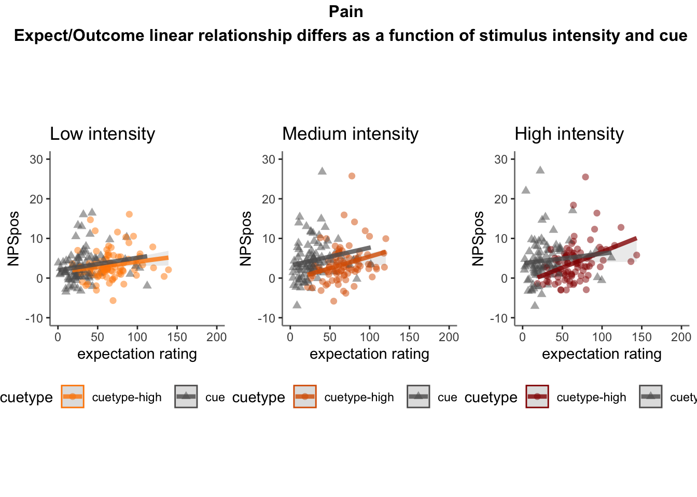


### NPS ~ demeaned_expect * cue
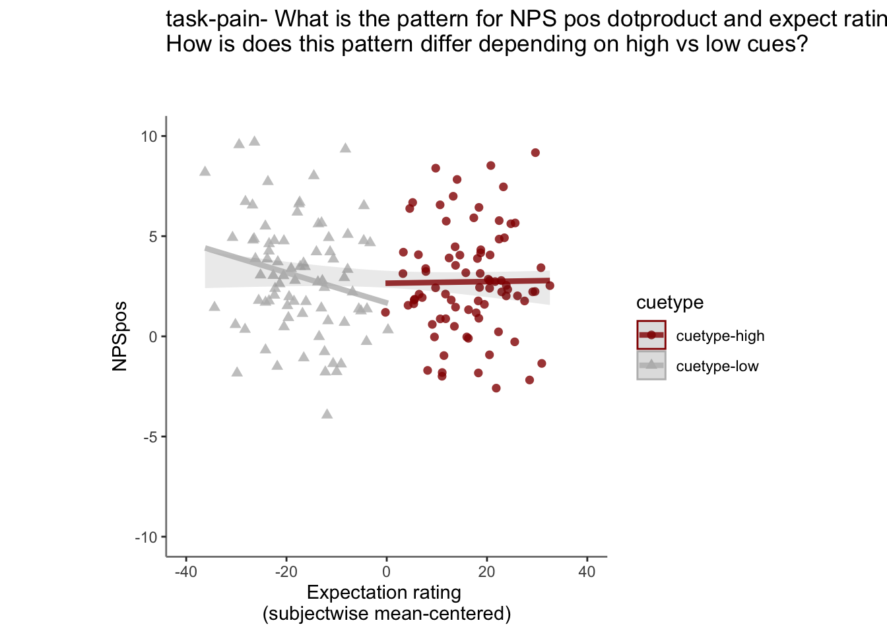

### NPS ~ demeaned_expect * cue * stim
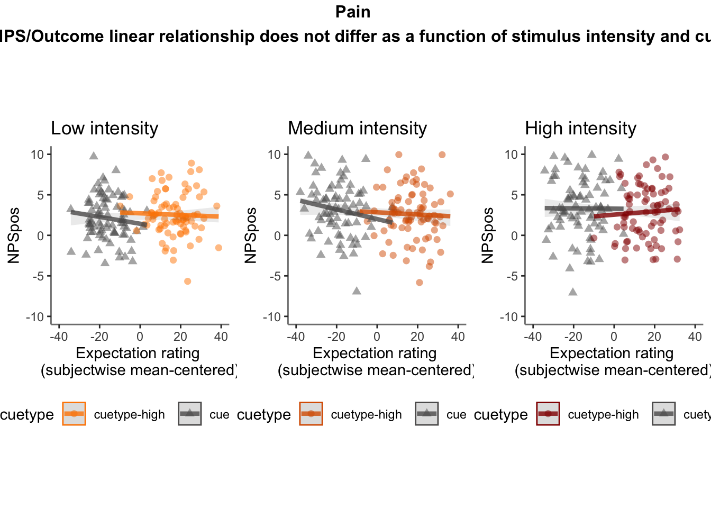


### NPS_demean ~ demeaned_expect * cue
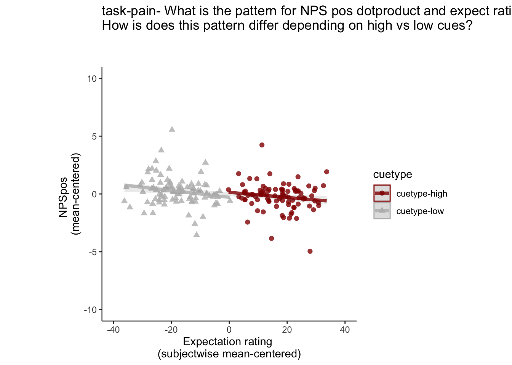

### NPS ~ demeaned_expect * cue * stim

#### facetwrap

```r
# 74, 85, 118
fig.height = 50
fig.width = 10
ggplot(aes(x=EXPECT_demean, y=NPSpos), data=demean_high) +
  geom_smooth(method='lm', se=F, size=0.75) +
  geom_point(size=0.1) + 
    # geom_abline(intercept = 0, slope = 1, color="green", 
    #              linetype="dashed", size=0.5) +
  facet_wrap(~sub) + 
  theme(legend.position='none') + 
  xlim(-50,50) + ylim(-50,50) +
  xlab("raw data from each participant: n-1 lagged outcome angle") + 
  ylab("n current expectation rating") 
```

```
## `geom_smooth()` using formula = 'y ~ x'
```

```
## Warning: Removed 160 rows containing non-finite values (`stat_smooth()`).
```

```
## Warning: Removed 160 rows containing missing values (`geom_point()`).
```

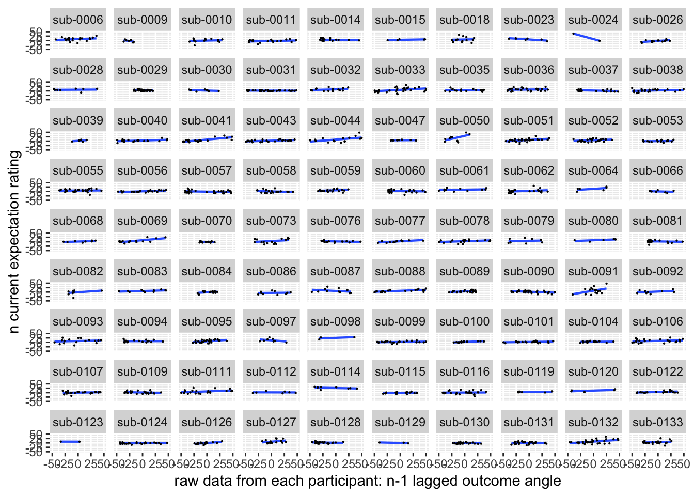

```r
# 74, 85, 118, 117
fig.height = 50
fig.width = 10
ggplot(aes(x=EXPECT_demean, y=NPSpos), data=demean_low) +
  geom_smooth(method='lm', se=F, size=0.75) +
  geom_point(size=0.1) + 
    # geom_abline(intercept = 0, slope = 1, color="green", 
    #              linetype="dashed", size=0.5) +
  facet_wrap(~sub) + 
  theme(legend.position='none') + 
  xlim(-50,50) + ylim(-50,50) +
  xlab("raw data from each participant: n-1 lagged outcome angle") + 
  ylab("n current expectation rating") 
```

```
## `geom_smooth()` using formula = 'y ~ x'
```

```
## Warning: Removed 158 rows containing non-finite values (`stat_smooth()`).
```

```
## Warning: Removed 158 rows containing missing values (`geom_point()`).
```

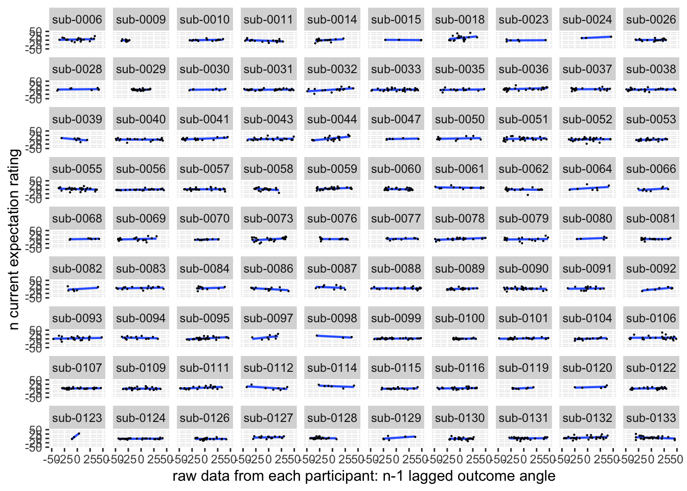

```r
# 74, 85, 118, 117
fig.height = 50
fig.width = 10
ggplot(aes(x=EXPECT_demean, y=NPSpos), data=demean_med) +
  geom_smooth(method='lm', se=F, size=0.75) +
  geom_point(size=0.1) + 
    # geom_abline(intercept = 0, slope = 1, color="green", 
    #              linetype="dashed", size=0.5) +
  facet_wrap(~sub) + 
  theme(legend.position='none') + 
  xlim(-50,50) + ylim(-50,50) +
  xlab("raw data from each participant: n-1 lagged outcome angle") + 
  ylab("n current expectation rating") 
```

```
## `geom_smooth()` using formula = 'y ~ x'
```

```
## Warning: Removed 173 rows containing non-finite values (`stat_smooth()`).
```

```
## Warning: Removed 173 rows containing missing values (`geom_point()`).
```

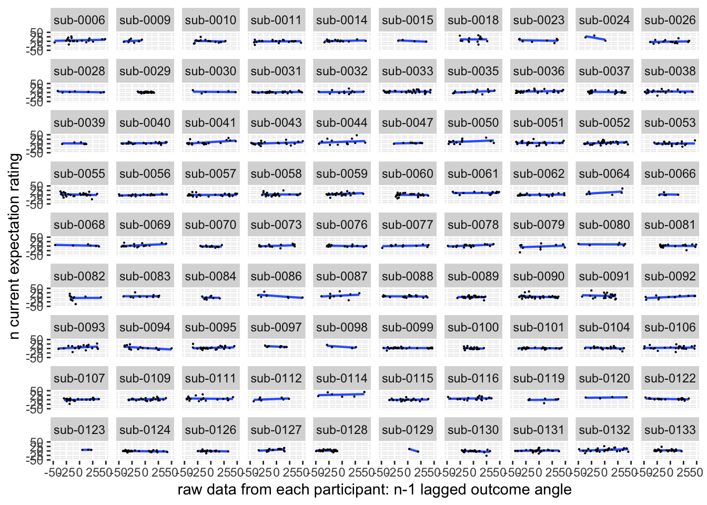

#### subjectwise plot v2

```r
ggplot(demean_high, aes(y = NPSpos, 
                       x = EXPECT_demean, 
                       colour = cuetype, shape = sub), size = .3, color = 'gray') + 
  geom_point(size = .1) + 
  geom_smooth(method = 'lm', formula= y ~ x, se = FALSE, size = .3) +
  scale_color_manual(values = c("cuetype-high" = "#941100", "cuetype-low" = "#BBBBBB"), ) +
  theme_classic()
```

```
## Warning: The shape palette can deal with a maximum of 6 discrete values because
## more than 6 becomes difficult to discriminate; you have 90. Consider
## specifying shapes manually if you must have them.
```

```
## Warning: Removed 1581 rows containing missing values (`geom_point()`).
```

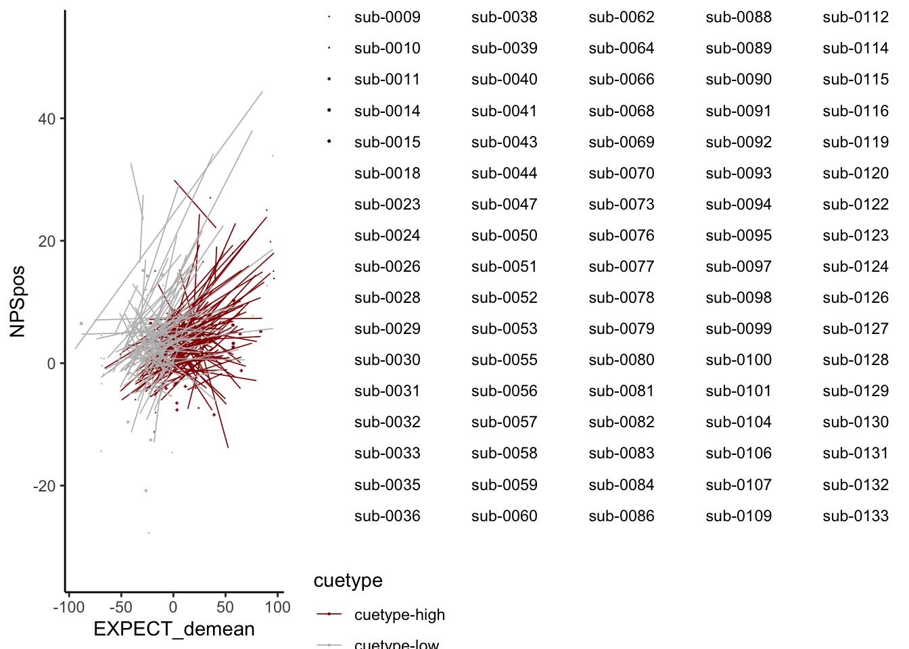

#### subjetwise plot
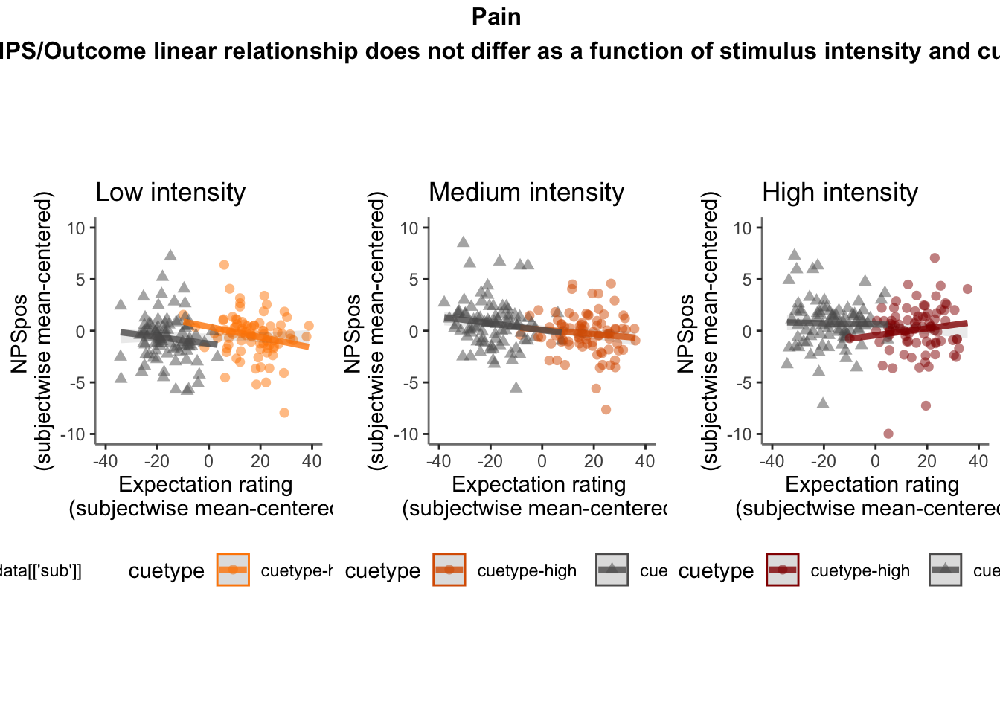

### ACCURATE Is this statistically significant?

#### ACCURATE: NPS ~ demean + CMC

```r
model.npsexpectdemean <- lmer(NPSpos ~ 
                          CUE_high_gt_low*STIM_linear*EXPECT_demean + 
                          CUE_high_gt_low*STIM_quadratic*EXPECT_demean +  EXPECT_cmc +
                          (1|sub), data = demean_dropna
                    )
# CUE_high_gt_low+STIM+EXPECT_demean
sjPlot::tab_model(model.npsexpectdemean,
                  title = "Multilevel-modeling: \nlmer(NPSpos ~ CUE * STIM * EXPECT_demean + (1| sub), data = pvc)",
                  CSS = list(css.table = '+font-size: 12;'))
```

<table style="border-collapse:collapse; border:none;font-size: 12;">
<caption style="font-weight: bold; text-align:left;">Multilevel-modeling: 
lmer(NPSpos ~ CUE * STIM * EXPECT_demean + (1| sub), data = pvc)</caption>
<tr>
<th style="border-top: double; text-align:center; font-style:italic; font-weight:normal; padding:0.2cm; border-bottom:1px solid black; text-align:left; ">&nbsp;</th>
<th colspan="3" style="border-top: double; text-align:center; font-style:italic; font-weight:normal; padding:0.2cm; border-bottom:1px solid black;">NPSpos</th>
</tr>
<tr>
<td style=" text-align:center; border-bottom:1px solid; font-style:italic; font-weight:normal; border-bottom:1px solid black; text-align:left; ">Predictors</td>
<td style=" text-align:center; border-bottom:1px solid; font-style:italic; font-weight:normal; border-bottom:1px solid black; ">Estimates</td>
<td style=" text-align:center; border-bottom:1px solid; font-style:italic; font-weight:normal; border-bottom:1px solid black; ">CI</td>
<td style=" text-align:center; border-bottom:1px solid; font-style:italic; font-weight:normal; border-bottom:1px solid black; ">p</td>
</tr>
<tr>
<td style=" padding:0.2cm; text-align:left; vertical-align:top; text-align:left; ">(Intercept)</td>
<td style=" padding:0.2cm; text-align:left; vertical-align:top; text-align:center;  ">4.00</td>
<td style=" padding:0.2cm; text-align:left; vertical-align:top; text-align:center;  ">3.20&nbsp;&ndash;&nbsp;4.80</td>
<td style=" padding:0.2cm; text-align:left; vertical-align:top; text-align:center;  "><strong>&lt;0.001</strong></td>
</tr>
<tr>
<td style=" padding:0.2cm; text-align:left; vertical-align:top; text-align:left; ">CUE high gt low</td>
<td style=" padding:0.2cm; text-align:left; vertical-align:top; text-align:center;  ">&#45;2.78</td>
<td style=" padding:0.2cm; text-align:left; vertical-align:top; text-align:center;  ">&#45;3.27&nbsp;&ndash;&nbsp;-2.29</td>
<td style=" padding:0.2cm; text-align:left; vertical-align:top; text-align:center;  "><strong>&lt;0.001</strong></td>
</tr>
<tr>
<td style=" padding:0.2cm; text-align:left; vertical-align:top; text-align:left; ">STIM linear</td>
<td style=" padding:0.2cm; text-align:left; vertical-align:top; text-align:center;  ">1.16</td>
<td style=" padding:0.2cm; text-align:left; vertical-align:top; text-align:center;  ">0.57&nbsp;&ndash;&nbsp;1.76</td>
<td style=" padding:0.2cm; text-align:left; vertical-align:top; text-align:center;  "><strong>&lt;0.001</strong></td>
</tr>
<tr>
<td style=" padding:0.2cm; text-align:left; vertical-align:top; text-align:left; ">EXPECT demean</td>
<td style=" padding:0.2cm; text-align:left; vertical-align:top; text-align:center;  ">0.07</td>
<td style=" padding:0.2cm; text-align:left; vertical-align:top; text-align:center;  ">0.06&nbsp;&ndash;&nbsp;0.07</td>
<td style=" padding:0.2cm; text-align:left; vertical-align:top; text-align:center;  "><strong>&lt;0.001</strong></td>
</tr>
<tr>
<td style=" padding:0.2cm; text-align:left; vertical-align:top; text-align:left; ">STIM quadratic</td>
<td style=" padding:0.2cm; text-align:left; vertical-align:top; text-align:center;  ">0.28</td>
<td style=" padding:0.2cm; text-align:left; vertical-align:top; text-align:center;  ">&#45;0.25&nbsp;&ndash;&nbsp;0.81</td>
<td style=" padding:0.2cm; text-align:left; vertical-align:top; text-align:center;  ">0.307</td>
</tr>
<tr>
<td style=" padding:0.2cm; text-align:left; vertical-align:top; text-align:left; ">EXPECT cmc</td>
<td style=" padding:0.2cm; text-align:left; vertical-align:top; text-align:center;  ">0.06</td>
<td style=" padding:0.2cm; text-align:left; vertical-align:top; text-align:center;  ">0.02&nbsp;&ndash;&nbsp;0.10</td>
<td style=" padding:0.2cm; text-align:left; vertical-align:top; text-align:center;  "><strong>0.003</strong></td>
</tr>
<tr>
<td style=" padding:0.2cm; text-align:left; vertical-align:top; text-align:left; ">CUE high gt low * STIM<br>linear</td>
<td style=" padding:0.2cm; text-align:left; vertical-align:top; text-align:center;  ">&#45;2.24</td>
<td style=" padding:0.2cm; text-align:left; vertical-align:top; text-align:center;  ">&#45;3.42&nbsp;&ndash;&nbsp;-1.05</td>
<td style=" padding:0.2cm; text-align:left; vertical-align:top; text-align:center;  "><strong>&lt;0.001</strong></td>
</tr>
<tr>
<td style=" padding:0.2cm; text-align:left; vertical-align:top; text-align:left; ">CUE high gt low * EXPECT<br>demean</td>
<td style=" padding:0.2cm; text-align:left; vertical-align:top; text-align:center;  ">&#45;0.02</td>
<td style=" padding:0.2cm; text-align:left; vertical-align:top; text-align:center;  ">&#45;0.04&nbsp;&ndash;&nbsp;-0.01</td>
<td style=" padding:0.2cm; text-align:left; vertical-align:top; text-align:center;  "><strong>0.006</strong></td>
</tr>
<tr>
<td style=" padding:0.2cm; text-align:left; vertical-align:top; text-align:left; ">STIM linear * EXPECT<br>demean</td>
<td style=" padding:0.2cm; text-align:left; vertical-align:top; text-align:center;  ">0.04</td>
<td style=" padding:0.2cm; text-align:left; vertical-align:top; text-align:center;  ">0.02&nbsp;&ndash;&nbsp;0.06</td>
<td style=" padding:0.2cm; text-align:left; vertical-align:top; text-align:center;  "><strong>&lt;0.001</strong></td>
</tr>
<tr>
<td style=" padding:0.2cm; text-align:left; vertical-align:top; text-align:left; ">CUE high gt low * STIM<br>quadratic</td>
<td style=" padding:0.2cm; text-align:left; vertical-align:top; text-align:center;  ">&#45;0.46</td>
<td style=" padding:0.2cm; text-align:left; vertical-align:top; text-align:center;  ">&#45;1.53&nbsp;&ndash;&nbsp;0.60</td>
<td style=" padding:0.2cm; text-align:left; vertical-align:top; text-align:center;  ">0.395</td>
</tr>
<tr>
<td style=" padding:0.2cm; text-align:left; vertical-align:top; text-align:left; ">EXPECT demean * STIM<br>quadratic</td>
<td style=" padding:0.2cm; text-align:left; vertical-align:top; text-align:center;  ">&#45;0.02</td>
<td style=" padding:0.2cm; text-align:left; vertical-align:top; text-align:center;  ">&#45;0.04&nbsp;&ndash;&nbsp;-0.01</td>
<td style=" padding:0.2cm; text-align:left; vertical-align:top; text-align:center;  "><strong>0.010</strong></td>
</tr>
<tr>
<td style=" padding:0.2cm; text-align:left; vertical-align:top; text-align:left; ">(CUE high gt low * STIM<br>linear) * EXPECT demean</td>
<td style=" padding:0.2cm; text-align:left; vertical-align:top; text-align:center;  ">&#45;0.00</td>
<td style=" padding:0.2cm; text-align:left; vertical-align:top; text-align:center;  ">&#45;0.04&nbsp;&ndash;&nbsp;0.03</td>
<td style=" padding:0.2cm; text-align:left; vertical-align:top; text-align:center;  ">0.863</td>
</tr>
<tr>
<td style=" padding:0.2cm; text-align:left; vertical-align:top; text-align:left; ">(CUE high gt low * EXPECT<br>demean) * STIM quadratic</td>
<td style=" padding:0.2cm; text-align:left; vertical-align:top; text-align:center;  ">&#45;0.01</td>
<td style=" padding:0.2cm; text-align:left; vertical-align:top; text-align:center;  ">&#45;0.05&nbsp;&ndash;&nbsp;0.02</td>
<td style=" padding:0.2cm; text-align:left; vertical-align:top; text-align:center;  ">0.482</td>
</tr>
<tr>
<td colspan="4" style="font-weight:bold; text-align:left; padding-top:.8em;">Random Effects</td>
</tr>

<tr>
<td style=" padding:0.2cm; text-align:left; vertical-align:top; text-align:left; padding-top:0.1cm; padding-bottom:0.1cm;">&sigma;<sup>2</sup></td>
<td style=" padding:0.2cm; text-align:left; vertical-align:top; padding-top:0.1cm; padding-bottom:0.1cm; text-align:center;" colspan="3">55.93</td>
</tr>

<tr>
<td style=" padding:0.2cm; text-align:left; vertical-align:top; text-align:left; padding-top:0.1cm; padding-bottom:0.1cm;">&tau;<sub>00</sub> <sub>sub</sub></td>
<td style=" padding:0.2cm; text-align:left; vertical-align:top; padding-top:0.1cm; padding-bottom:0.1cm; text-align:center;" colspan="3">13.12</td>

<tr>
<td style=" padding:0.2cm; text-align:left; vertical-align:top; text-align:left; padding-top:0.1cm; padding-bottom:0.1cm;">ICC</td>
<td style=" padding:0.2cm; text-align:left; vertical-align:top; padding-top:0.1cm; padding-bottom:0.1cm; text-align:center;" colspan="3">0.19</td>

<tr>
<td style=" padding:0.2cm; text-align:left; vertical-align:top; text-align:left; padding-top:0.1cm; padding-bottom:0.1cm;">N <sub>sub</sub></td>
<td style=" padding:0.2cm; text-align:left; vertical-align:top; padding-top:0.1cm; padding-bottom:0.1cm; text-align:center;" colspan="3">90</td>
<tr>
<td style=" padding:0.2cm; text-align:left; vertical-align:top; text-align:left; padding-top:0.1cm; padding-bottom:0.1cm; border-top:1px solid;">Observations</td>
<td style=" padding:0.2cm; text-align:left; vertical-align:top; padding-top:0.1cm; padding-bottom:0.1cm; text-align:center; border-top:1px solid;" colspan="3">5117</td>
</tr>
<tr>
<td style=" padding:0.2cm; text-align:left; vertical-align:top; text-align:left; padding-top:0.1cm; padding-bottom:0.1cm;">Marginal R<sup>2</sup> / Conditional R<sup>2</sup></td>
<td style=" padding:0.2cm; text-align:left; vertical-align:top; padding-top:0.1cm; padding-bottom:0.1cm; text-align:center;" colspan="3">0.068 / 0.245</td>
</tr>

</table>


```r
demean_dropna$EXPECT <- demean_dropna$event02_expect_angle
model.npsexpect <- lmer(NPSpos ~ 
                          CUE_high_gt_low*STIM_linear*EXPECT + 
                          CUE_high_gt_low*STIM_quadratic*EXPECT + 
                          (CUE_high_gt_low+STIM+EXPECT|sub), data = demean_dropna
                    )
sjPlot::tab_model(model.npsexpect,
                  title = "Multilevel-modeling: \nlmer(NPSpos ~ CUE * STIM * EXPECT + (CUE + STIM + EXPECT| sub), data = pvc)",
                  CSS = list(css.table = '+font-size: 12;'))
```

<table style="border-collapse:collapse; border:none;font-size: 12;">
<caption style="font-weight: bold; text-align:left;">Multilevel-modeling: 
lmer(NPSpos ~ CUE * STIM * EXPECT + (CUE + STIM + EXPECT| sub), data = pvc)</caption>
<tr>
<th style="border-top: double; text-align:center; font-style:italic; font-weight:normal; padding:0.2cm; border-bottom:1px solid black; text-align:left; ">&nbsp;</th>
<th colspan="3" style="border-top: double; text-align:center; font-style:italic; font-weight:normal; padding:0.2cm; border-bottom:1px solid black;">NPSpos</th>
</tr>
<tr>
<td style=" text-align:center; border-bottom:1px solid; font-style:italic; font-weight:normal; border-bottom:1px solid black; text-align:left; ">Predictors</td>
<td style=" text-align:center; border-bottom:1px solid; font-style:italic; font-weight:normal; border-bottom:1px solid black; ">Estimates</td>
<td style=" text-align:center; border-bottom:1px solid; font-style:italic; font-weight:normal; border-bottom:1px solid black; ">CI</td>
<td style=" text-align:center; border-bottom:1px solid; font-style:italic; font-weight:normal; border-bottom:1px solid black; ">p</td>
</tr>
<tr>
<td style=" padding:0.2cm; text-align:left; vertical-align:top; text-align:left; ">(Intercept)</td>
<td style=" padding:0.2cm; text-align:left; vertical-align:top; text-align:center;  ">0.90</td>
<td style=" padding:0.2cm; text-align:left; vertical-align:top; text-align:center;  ">0.06&nbsp;&ndash;&nbsp;1.74</td>
<td style=" padding:0.2cm; text-align:left; vertical-align:top; text-align:center;  "><strong>0.036</strong></td>
</tr>
<tr>
<td style=" padding:0.2cm; text-align:left; vertical-align:top; text-align:left; ">CUE high gt low</td>
<td style=" padding:0.2cm; text-align:left; vertical-align:top; text-align:center;  ">&#45;1.93</td>
<td style=" padding:0.2cm; text-align:left; vertical-align:top; text-align:center;  ">&#45;3.09&nbsp;&ndash;&nbsp;-0.78</td>
<td style=" padding:0.2cm; text-align:left; vertical-align:top; text-align:center;  "><strong>0.001</strong></td>
</tr>
<tr>
<td style=" padding:0.2cm; text-align:left; vertical-align:top; text-align:left; ">STIM linear</td>
<td style=" padding:0.2cm; text-align:left; vertical-align:top; text-align:center;  ">&#45;0.29</td>
<td style=" padding:0.2cm; text-align:left; vertical-align:top; text-align:center;  ">&#45;1.21&nbsp;&ndash;&nbsp;0.64</td>
<td style=" padding:0.2cm; text-align:left; vertical-align:top; text-align:center;  ">0.544</td>
</tr>
<tr>
<td style=" padding:0.2cm; text-align:left; vertical-align:top; text-align:left; ">EXPECT</td>
<td style=" padding:0.2cm; text-align:left; vertical-align:top; text-align:center;  ">0.06</td>
<td style=" padding:0.2cm; text-align:left; vertical-align:top; text-align:center;  ">0.04&nbsp;&ndash;&nbsp;0.08</td>
<td style=" padding:0.2cm; text-align:left; vertical-align:top; text-align:center;  "><strong>&lt;0.001</strong></td>
</tr>
<tr>
<td style=" padding:0.2cm; text-align:left; vertical-align:top; text-align:left; ">STIM quadratic</td>
<td style=" padding:0.2cm; text-align:left; vertical-align:top; text-align:center;  ">0.82</td>
<td style=" padding:0.2cm; text-align:left; vertical-align:top; text-align:center;  ">0.03&nbsp;&ndash;&nbsp;1.61</td>
<td style=" padding:0.2cm; text-align:left; vertical-align:top; text-align:center;  "><strong>0.042</strong></td>
</tr>
<tr>
<td style=" padding:0.2cm; text-align:left; vertical-align:top; text-align:left; ">CUE high gt low * STIM<br>linear</td>
<td style=" padding:0.2cm; text-align:left; vertical-align:top; text-align:center;  ">&#45;1.62</td>
<td style=" padding:0.2cm; text-align:left; vertical-align:top; text-align:center;  ">&#45;3.38&nbsp;&ndash;&nbsp;0.15</td>
<td style=" padding:0.2cm; text-align:left; vertical-align:top; text-align:center;  ">0.073</td>
</tr>
<tr>
<td style=" padding:0.2cm; text-align:left; vertical-align:top; text-align:left; ">CUE high gt low * EXPECT</td>
<td style=" padding:0.2cm; text-align:left; vertical-align:top; text-align:center;  ">&#45;0.02</td>
<td style=" padding:0.2cm; text-align:left; vertical-align:top; text-align:center;  ">&#45;0.03&nbsp;&ndash;&nbsp;-0.00</td>
<td style=" padding:0.2cm; text-align:left; vertical-align:top; text-align:center;  "><strong>0.030</strong></td>
</tr>
<tr>
<td style=" padding:0.2cm; text-align:left; vertical-align:top; text-align:left; ">STIM linear * EXPECT</td>
<td style=" padding:0.2cm; text-align:left; vertical-align:top; text-align:center;  ">0.03</td>
<td style=" padding:0.2cm; text-align:left; vertical-align:top; text-align:center;  ">0.02&nbsp;&ndash;&nbsp;0.05</td>
<td style=" padding:0.2cm; text-align:left; vertical-align:top; text-align:center;  "><strong>&lt;0.001</strong></td>
</tr>
<tr>
<td style=" padding:0.2cm; text-align:left; vertical-align:top; text-align:left; ">CUE high gt low * STIM<br>quadratic</td>
<td style=" padding:0.2cm; text-align:left; vertical-align:top; text-align:center;  ">&#45;0.62</td>
<td style=" padding:0.2cm; text-align:left; vertical-align:top; text-align:center;  ">&#45;2.19&nbsp;&ndash;&nbsp;0.96</td>
<td style=" padding:0.2cm; text-align:left; vertical-align:top; text-align:center;  ">0.441</td>
</tr>
<tr>
<td style=" padding:0.2cm; text-align:left; vertical-align:top; text-align:left; ">EXPECT * STIM quadratic</td>
<td style=" padding:0.2cm; text-align:left; vertical-align:top; text-align:center;  ">&#45;0.01</td>
<td style=" padding:0.2cm; text-align:left; vertical-align:top; text-align:center;  ">&#45;0.03&nbsp;&ndash;&nbsp;-0.00</td>
<td style=" padding:0.2cm; text-align:left; vertical-align:top; text-align:center;  "><strong>0.038</strong></td>
</tr>
<tr>
<td style=" padding:0.2cm; text-align:left; vertical-align:top; text-align:left; ">(CUE high gt low * STIM<br>linear) * EXPECT</td>
<td style=" padding:0.2cm; text-align:left; vertical-align:top; text-align:center;  ">&#45;0.01</td>
<td style=" padding:0.2cm; text-align:left; vertical-align:top; text-align:center;  ">&#45;0.04&nbsp;&ndash;&nbsp;0.02</td>
<td style=" padding:0.2cm; text-align:left; vertical-align:top; text-align:center;  ">0.587</td>
</tr>
<tr>
<td style=" padding:0.2cm; text-align:left; vertical-align:top; text-align:left; ">(CUE high gt low *<br>EXPECT) * STIM quadratic</td>
<td style=" padding:0.2cm; text-align:left; vertical-align:top; text-align:center;  ">&#45;0.00</td>
<td style=" padding:0.2cm; text-align:left; vertical-align:top; text-align:center;  ">&#45;0.03&nbsp;&ndash;&nbsp;0.03</td>
<td style=" padding:0.2cm; text-align:left; vertical-align:top; text-align:center;  ">0.931</td>
</tr>
<tr>
<td colspan="4" style="font-weight:bold; text-align:left; padding-top:.8em;">Random Effects</td>
</tr>

<tr>
<td style=" padding:0.2cm; text-align:left; vertical-align:top; text-align:left; padding-top:0.1cm; padding-bottom:0.1cm;">&sigma;<sup>2</sup></td>
<td style=" padding:0.2cm; text-align:left; vertical-align:top; padding-top:0.1cm; padding-bottom:0.1cm; text-align:center;" colspan="3">51.74</td>
</tr>

<tr>
<td style=" padding:0.2cm; text-align:left; vertical-align:top; text-align:left; padding-top:0.1cm; padding-bottom:0.1cm;">&tau;<sub>00</sub> <sub>sub</sub></td>
<td style=" padding:0.2cm; text-align:left; vertical-align:top; padding-top:0.1cm; padding-bottom:0.1cm; text-align:center;" colspan="3">12.32</td>

<tr>
<td style=" padding:0.2cm; text-align:left; vertical-align:top; text-align:left; padding-top:0.1cm; padding-bottom:0.1cm;">&tau;<sub>11</sub> <sub>sub.CUE_high_gt_low</sub></td>
<td style=" padding:0.2cm; text-align:left; vertical-align:top; padding-top:0.1cm; padding-bottom:0.1cm; text-align:center;" colspan="3">15.54</td>

<tr>
<td style=" padding:0.2cm; text-align:left; vertical-align:top; text-align:left; padding-top:0.1cm; padding-bottom:0.1cm;">&tau;<sub>11</sub> <sub>sub.STIMlow</sub></td>
<td style=" padding:0.2cm; text-align:left; vertical-align:top; padding-top:0.1cm; padding-bottom:0.1cm; text-align:center;" colspan="3">1.38</td>

<tr>
<td style=" padding:0.2cm; text-align:left; vertical-align:top; text-align:left; padding-top:0.1cm; padding-bottom:0.1cm;">&tau;<sub>11</sub> <sub>sub.STIMmed</sub></td>
<td style=" padding:0.2cm; text-align:left; vertical-align:top; padding-top:0.1cm; padding-bottom:0.1cm; text-align:center;" colspan="3">0.24</td>

<tr>
<td style=" padding:0.2cm; text-align:left; vertical-align:top; text-align:left; padding-top:0.1cm; padding-bottom:0.1cm;">&tau;<sub>11</sub> <sub>sub.EXPECT</sub></td>
<td style=" padding:0.2cm; text-align:left; vertical-align:top; padding-top:0.1cm; padding-bottom:0.1cm; text-align:center;" colspan="3">0.01</td>

<tr>
<td style=" padding:0.2cm; text-align:left; vertical-align:top; text-align:left; padding-top:0.1cm; padding-bottom:0.1cm;">&rho;<sub>01</sub></td>
<td style=" padding:0.2cm; text-align:left; vertical-align:top; padding-top:0.1cm; padding-bottom:0.1cm; text-align:center;" colspan="3">0.30</td>

<tr>
<td style=" padding:0.2cm; text-align:left; vertical-align:top; text-align:left; padding-top:0.1cm; padding-bottom:0.1cm;"></td>
<td style=" padding:0.2cm; text-align:left; vertical-align:top; padding-top:0.1cm; padding-bottom:0.1cm; text-align:center;" colspan="3">-0.51</td>

<tr>
<td style=" padding:0.2cm; text-align:left; vertical-align:top; text-align:left; padding-top:0.1cm; padding-bottom:0.1cm;"></td>
<td style=" padding:0.2cm; text-align:left; vertical-align:top; padding-top:0.1cm; padding-bottom:0.1cm; text-align:center;" colspan="3">-0.58</td>

<tr>
<td style=" padding:0.2cm; text-align:left; vertical-align:top; text-align:left; padding-top:0.1cm; padding-bottom:0.1cm;"></td>
<td style=" padding:0.2cm; text-align:left; vertical-align:top; padding-top:0.1cm; padding-bottom:0.1cm; text-align:center;" colspan="3">-0.41</td>

<tr>
<td style=" padding:0.2cm; text-align:left; vertical-align:top; text-align:left; padding-top:0.1cm; padding-bottom:0.1cm;">ICC</td>
<td style=" padding:0.2cm; text-align:left; vertical-align:top; padding-top:0.1cm; padding-bottom:0.1cm; text-align:center;" colspan="3">0.32</td>

<tr>
<td style=" padding:0.2cm; text-align:left; vertical-align:top; text-align:left; padding-top:0.1cm; padding-bottom:0.1cm;">N <sub>sub</sub></td>
<td style=" padding:0.2cm; text-align:left; vertical-align:top; padding-top:0.1cm; padding-bottom:0.1cm; text-align:center;" colspan="3">90</td>
<tr>
<td style=" padding:0.2cm; text-align:left; vertical-align:top; text-align:left; padding-top:0.1cm; padding-bottom:0.1cm; border-top:1px solid;">Observations</td>
<td style=" padding:0.2cm; text-align:left; vertical-align:top; padding-top:0.1cm; padding-bottom:0.1cm; text-align:center; border-top:1px solid;" colspan="3">5117</td>
</tr>
<tr>
<td style=" padding:0.2cm; text-align:left; vertical-align:top; text-align:left; padding-top:0.1cm; padding-bottom:0.1cm;">Marginal R<sup>2</sup> / Conditional R<sup>2</sup></td>
<td style=" padding:0.2cm; text-align:left; vertical-align:top; padding-top:0.1cm; padding-bottom:0.1cm; text-align:center;" colspan="3">0.054 / 0.356</td>
</tr>

</table>


```r
demean_dropna$EXPECT <- demean_dropna$event02_expect_angle
model.npsd_expectd <- lmer(NPS_demean ~ 
                          CUE_high_gt_low*STIM_linear*EXPECT_demean + 
                          CUE_high_gt_low*STIM_quadratic*EXPECT_demean +  EXPECT_cmc +
                          (1|sub), data = demean_dropna
                    )
# CUE_high_gt_low+STIM+EXPECT_demean
sjPlot::tab_model(model.npsd_expectd,
                  title = "Multilevel-modeling: \nlmer(NPS_demean ~ CUE * STIM * EXPECT_demean + (1| sub), data = pvc)",
                  CSS = list(css.table = '+font-size: 12;'))
```

<table style="border-collapse:collapse; border:none;font-size: 12;">
<caption style="font-weight: bold; text-align:left;">Multilevel-modeling: 
lmer(NPS_demean ~ CUE * STIM * EXPECT_demean + (1| sub), data = pvc)</caption>
<tr>
<th style="border-top: double; text-align:center; font-style:italic; font-weight:normal; padding:0.2cm; border-bottom:1px solid black; text-align:left; ">&nbsp;</th>
<th colspan="3" style="border-top: double; text-align:center; font-style:italic; font-weight:normal; padding:0.2cm; border-bottom:1px solid black;">NPS_demean</th>
</tr>
<tr>
<td style=" text-align:center; border-bottom:1px solid; font-style:italic; font-weight:normal; border-bottom:1px solid black; text-align:left; ">Predictors</td>
<td style=" text-align:center; border-bottom:1px solid; font-style:italic; font-weight:normal; border-bottom:1px solid black; ">Estimates</td>
<td style=" text-align:center; border-bottom:1px solid; font-style:italic; font-weight:normal; border-bottom:1px solid black; ">CI</td>
<td style=" text-align:center; border-bottom:1px solid; font-style:italic; font-weight:normal; border-bottom:1px solid black; ">p</td>
</tr>
<tr>
<td style=" padding:0.2cm; text-align:left; vertical-align:top; text-align:left; ">(Intercept)</td>
<td style=" padding:0.2cm; text-align:left; vertical-align:top; text-align:center;  ">0.23</td>
<td style=" padding:0.2cm; text-align:left; vertical-align:top; text-align:center;  ">&#45;0.00&nbsp;&ndash;&nbsp;0.47</td>
<td style=" padding:0.2cm; text-align:left; vertical-align:top; text-align:center;  ">0.052</td>
</tr>
<tr>
<td style=" padding:0.2cm; text-align:left; vertical-align:top; text-align:left; ">CUE high gt low</td>
<td style=" padding:0.2cm; text-align:left; vertical-align:top; text-align:center;  ">&#45;1.84</td>
<td style=" padding:0.2cm; text-align:left; vertical-align:top; text-align:center;  ">&#45;2.31&nbsp;&ndash;&nbsp;-1.37</td>
<td style=" padding:0.2cm; text-align:left; vertical-align:top; text-align:center;  "><strong>&lt;0.001</strong></td>
</tr>
<tr>
<td style=" padding:0.2cm; text-align:left; vertical-align:top; text-align:left; ">STIM linear</td>
<td style=" padding:0.2cm; text-align:left; vertical-align:top; text-align:center;  ">1.16</td>
<td style=" padding:0.2cm; text-align:left; vertical-align:top; text-align:center;  ">0.59&nbsp;&ndash;&nbsp;1.73</td>
<td style=" padding:0.2cm; text-align:left; vertical-align:top; text-align:center;  "><strong>&lt;0.001</strong></td>
</tr>
<tr>
<td style=" padding:0.2cm; text-align:left; vertical-align:top; text-align:left; ">EXPECT demean</td>
<td style=" padding:0.2cm; text-align:left; vertical-align:top; text-align:center;  ">0.04</td>
<td style=" padding:0.2cm; text-align:left; vertical-align:top; text-align:center;  ">0.03&nbsp;&ndash;&nbsp;0.05</td>
<td style=" padding:0.2cm; text-align:left; vertical-align:top; text-align:center;  "><strong>&lt;0.001</strong></td>
</tr>
<tr>
<td style=" padding:0.2cm; text-align:left; vertical-align:top; text-align:left; ">STIM quadratic</td>
<td style=" padding:0.2cm; text-align:left; vertical-align:top; text-align:center;  ">0.27</td>
<td style=" padding:0.2cm; text-align:left; vertical-align:top; text-align:center;  ">&#45;0.24&nbsp;&ndash;&nbsp;0.78</td>
<td style=" padding:0.2cm; text-align:left; vertical-align:top; text-align:center;  ">0.299</td>
</tr>
<tr>
<td style=" padding:0.2cm; text-align:left; vertical-align:top; text-align:left; ">EXPECT cmc</td>
<td style=" padding:0.2cm; text-align:left; vertical-align:top; text-align:center;  ">0.00</td>
<td style=" padding:0.2cm; text-align:left; vertical-align:top; text-align:center;  ">&#45;0.01&nbsp;&ndash;&nbsp;0.01</td>
<td style=" padding:0.2cm; text-align:left; vertical-align:top; text-align:center;  ">0.754</td>
</tr>
<tr>
<td style=" padding:0.2cm; text-align:left; vertical-align:top; text-align:left; ">CUE high gt low * STIM<br>linear</td>
<td style=" padding:0.2cm; text-align:left; vertical-align:top; text-align:center;  ">&#45;2.29</td>
<td style=" padding:0.2cm; text-align:left; vertical-align:top; text-align:center;  ">&#45;3.42&nbsp;&ndash;&nbsp;-1.15</td>
<td style=" padding:0.2cm; text-align:left; vertical-align:top; text-align:center;  "><strong>&lt;0.001</strong></td>
</tr>
<tr>
<td style=" padding:0.2cm; text-align:left; vertical-align:top; text-align:left; ">CUE high gt low * EXPECT<br>demean</td>
<td style=" padding:0.2cm; text-align:left; vertical-align:top; text-align:center;  ">&#45;0.03</td>
<td style=" padding:0.2cm; text-align:left; vertical-align:top; text-align:center;  ">&#45;0.04&nbsp;&ndash;&nbsp;-0.01</td>
<td style=" padding:0.2cm; text-align:left; vertical-align:top; text-align:center;  "><strong>0.001</strong></td>
</tr>
<tr>
<td style=" padding:0.2cm; text-align:left; vertical-align:top; text-align:left; ">STIM linear * EXPECT<br>demean</td>
<td style=" padding:0.2cm; text-align:left; vertical-align:top; text-align:center;  ">0.04</td>
<td style=" padding:0.2cm; text-align:left; vertical-align:top; text-align:center;  ">0.02&nbsp;&ndash;&nbsp;0.06</td>
<td style=" padding:0.2cm; text-align:left; vertical-align:top; text-align:center;  "><strong>&lt;0.001</strong></td>
</tr>
<tr>
<td style=" padding:0.2cm; text-align:left; vertical-align:top; text-align:left; ">CUE high gt low * STIM<br>quadratic</td>
<td style=" padding:0.2cm; text-align:left; vertical-align:top; text-align:center;  ">&#45;0.27</td>
<td style=" padding:0.2cm; text-align:left; vertical-align:top; text-align:center;  ">&#45;1.29&nbsp;&ndash;&nbsp;0.75</td>
<td style=" padding:0.2cm; text-align:left; vertical-align:top; text-align:center;  ">0.608</td>
</tr>
<tr>
<td style=" padding:0.2cm; text-align:left; vertical-align:top; text-align:left; ">EXPECT demean * STIM<br>quadratic</td>
<td style=" padding:0.2cm; text-align:left; vertical-align:top; text-align:center;  ">&#45;0.02</td>
<td style=" padding:0.2cm; text-align:left; vertical-align:top; text-align:center;  ">&#45;0.04&nbsp;&ndash;&nbsp;-0.01</td>
<td style=" padding:0.2cm; text-align:left; vertical-align:top; text-align:center;  "><strong>0.004</strong></td>
</tr>
<tr>
<td style=" padding:0.2cm; text-align:left; vertical-align:top; text-align:left; ">(CUE high gt low * STIM<br>linear) * EXPECT demean</td>
<td style=" padding:0.2cm; text-align:left; vertical-align:top; text-align:center;  ">&#45;0.01</td>
<td style=" padding:0.2cm; text-align:left; vertical-align:top; text-align:center;  ">&#45;0.04&nbsp;&ndash;&nbsp;0.03</td>
<td style=" padding:0.2cm; text-align:left; vertical-align:top; text-align:center;  ">0.661</td>
</tr>
<tr>
<td style=" padding:0.2cm; text-align:left; vertical-align:top; text-align:left; ">(CUE high gt low * EXPECT<br>demean) * STIM quadratic</td>
<td style=" padding:0.2cm; text-align:left; vertical-align:top; text-align:center;  ">&#45;0.01</td>
<td style=" padding:0.2cm; text-align:left; vertical-align:top; text-align:center;  ">&#45;0.04&nbsp;&ndash;&nbsp;0.02</td>
<td style=" padding:0.2cm; text-align:left; vertical-align:top; text-align:center;  ">0.540</td>
</tr>
<tr>
<td colspan="4" style="font-weight:bold; text-align:left; padding-top:.8em;">Random Effects</td>
</tr>

<tr>
<td style=" padding:0.2cm; text-align:left; vertical-align:top; text-align:left; padding-top:0.1cm; padding-bottom:0.1cm;">&sigma;<sup>2</sup></td>
<td style=" padding:0.2cm; text-align:left; vertical-align:top; padding-top:0.1cm; padding-bottom:0.1cm; text-align:center;" colspan="3">51.45</td>
</tr>

<tr>
<td style=" padding:0.2cm; text-align:left; vertical-align:top; text-align:left; padding-top:0.1cm; padding-bottom:0.1cm;">&tau;<sub>00</sub> <sub>sub</sub></td>
<td style=" padding:0.2cm; text-align:left; vertical-align:top; padding-top:0.1cm; padding-bottom:0.1cm; text-align:center;" colspan="3">0.00</td>

<tr>
<td style=" padding:0.2cm; text-align:left; vertical-align:top; text-align:left; padding-top:0.1cm; padding-bottom:0.1cm;">N <sub>sub</sub></td>
<td style=" padding:0.2cm; text-align:left; vertical-align:top; padding-top:0.1cm; padding-bottom:0.1cm; text-align:center;" colspan="3">90</td>
<tr>
<td style=" padding:0.2cm; text-align:left; vertical-align:top; text-align:left; padding-top:0.1cm; padding-bottom:0.1cm; border-top:1px solid;">Observations</td>
<td style=" padding:0.2cm; text-align:left; vertical-align:top; padding-top:0.1cm; padding-bottom:0.1cm; text-align:center; border-top:1px solid;" colspan="3">5117</td>
</tr>
<tr>
<td style=" padding:0.2cm; text-align:left; vertical-align:top; text-align:left; padding-top:0.1cm; padding-bottom:0.1cm;">Marginal R<sup>2</sup> / Conditional R<sup>2</sup></td>
<td style=" padding:0.2cm; text-align:left; vertical-align:top; padding-top:0.1cm; padding-bottom:0.1cm; text-align:center;" colspan="3">0.034 / NA</td>
</tr>

</table>


