# Cognitive signature ~ single trial {#ch37_singletrial_C}

```
author: "Heejung Jung"
date: "2023-03-04"
```


## Function {.unlisted .unnumbered}


## Step 1: Common parameters {.unlisted .unnumbered}

```r
# step 1: load data
for (signature_key in c("Kragel18CogControl")) {
  dv_keyword = signature_key
  signature_name = signature_key
  # step 1: common parameters _______
  main_dir <- dirname(dirname(getwd()))
  analysis_folder  = paste0("model37_iv-task-stim_dv-", signature_key)
  sig_name <-
    Sys.glob(file.path(
      main_dir, "analysis/fmri/nilearn/signature_extract",
      paste0(
        "signature-", signature_key,"_sub-all_runtype-pvc_event-stimulus.tsv"
      )
    )) # nolint
  print(sig_name)
  analysis_dir <-
    file.path(main_dir, "analysis", "mixedeffect", analysis_folder, as.character(Sys.Date())
              ) # nolint
  dir.create(analysis_dir, showWarnings = FALSE, recursive = TRUE)
  savedir <- analysis_dir
  
  # step 2: load data
  df = read.csv(sig_name)
  sig_df = df %>% separate(
    singletrial_fname,
    sep = "_",
    c(
      "sub", "ses", "run", "runtype", "event", "trial", "cuetype", "stimintensity"
    )
  )
  sig_df = sig_df %>% separate(
    stimintensity,
    into = c(NA, "stimintensity"),
    extra = "drop",
    fill = "left"
  )
  pvc <- simple_contrasts_singletrial(sig_df)
  pvc$task[pvc$runtype == "runtype-pain"] <- "pain"
  pvc$task[pvc$runtype == "runtype-vicarious"] <- "vicarious"
  pvc$task[pvc$runtype == "runtype-cognitive"] <- "cognitive"
  pvc$task <- factor(pvc$task)
  
  
  # step 3: parameters
  
  taskname = "all"
  plot_keyword = "stimulusintensity"
  ggtitle_phrase =  "(3 tasks x 3 stimulus intensity)"
  
  pvc$task = factor(pvc$task)
  plot_keys <- list(
    sub_mean = "mean_per_sub",
    group_mean = "mean_per_sub_norm_mean",
    legend_keyword = "stimulus intensity",
    se = "se",
    subject = "sub",
    ggtitle = paste0(
      str_to_title(signature_key)," dot product: ",str_to_title(taskname),' ',
      ggtitle_phrase," (N = ", length(unique(pvc$sub)), ")"
    ),
    title = paste0(
      str_to_title(signature_key), " - ", str_to_title(plot_keyword)
    ),
    xlab = "",    ylab = paste(signature_key, " (dot product)"),
    ylim = c(-250, 500)
  )
  
  # step 4: within between summary
  groupwise <- data.frame()
  subjectwise <- data.frame()
  summary <- summary_for_plots_PVC(
    df = pvc,
    groupwise_measurevar = plot_keys$sub_mean,
    subject_keyword = plot_keys$subject,
    model_iv1 =  "task",
    model_iv2 =  "stim_ordered",
    dv = signature_key #"Cog"
  )
  subjectwise <<- as.data.frame(summary[[1]])
  groupwise <<- as.data.frame(summary[[2]])
  if (any(startsWith(dv_keyword, c("expect", "Expect")))) {
    plot_keys$color <- c("#1B9E77", "#D95F02", "#D95F02")
  } else {
    plot_keys$color <- c("#4575B4", "#FFA500", "#D73027")
  }
  
  # step 5: plot
  
  iv2 = "stim_ordered"
  iv1 = "task"
  taskname = "all"
  if (any(startsWith(dv_keyword, c("expect", "Expect")))) {
    color <- c("#1B9E77", "#D95F02", "#D95F02")
  } else {
    color <- c("#4575B4", "#FFA500", "#D73027")
  }
  subject_mean <- "mean_per_sub"
  sub_mean = subject_mean
  group_mean <- "mean_per_sub_norm_mean"
  se <- "se"
  ylim <- c(-25, 26)
  subject <- "sub"
  ggtitle_phrase <-  "(3 tasks x 3 stimulus intensity)"
  ggtitle <-
    paste0(
      str_to_title(signature_name),
      " dot product: ", str_to_title(taskname), ' ', ggtitle_phrase,
      " (N = ", length(unique(pvc$sub)), ")"
    )
  
  title <-
    paste0(str_to_title(dv_keyword),
           " - ",
           str_to_title(plot_keys$legend_keyword))
  xlab <- ""
  plot_keyword = "stimintensity"
  ylab <- paste(signature_name, " (dot product)")
  plot2_savefname <- file.path(
    analysis_dir,
    paste(
      "signature_task-",taskname, "_event-",plot_keyword,"_dv-",signature_key,"_",
      as.character(Sys.Date()),".png",
      sep = ""
    )
  )
  p <- plot_halfrainclouds_twofactor(
    subjectwise, groupwise,
    iv1, iv2, subject_mean, group_mean, se, subject,
    ggtitle, title, xlab, ylab, taskname,
    ylim, w = 10, h = 6, dv_keyword, color, plot2_savefname
  )
  p
}
```

```
## [1] "/Users/h/Dropbox (Dartmouth College)/projects_dropbox/social_influence_analysis/analysis/fmri/nilearn/signature_extract/signature-Kragel18CogControl_sub-all_runtype-pvc_event-stimulus.tsv"
```

### Load behavioral data {.unlisted .unnumbered}

```r
main_dir = dirname(dirname(getwd()))
print(main_dir)
```

```
## [1] "/Users/h/Dropbox (Dartmouth College)/projects_dropbox/social_influence_analysis"
```

```r
datadir = file.path(main_dir, 'data', 'beh', 'beh02_preproc')
taskname = '*'
subject_varkey <- "src_subject_id"
iv <- "param_stimulus_type"; 
iv_keyword <- "stim"; 
dv <- "event04_actual_angle"; dv_keyword <- "outcome"
exclude <- "sub-0001|sub-0002|sub-0003|sub-0004|sub-0005|sub-0007|sub-0008|sub-0011|sub-0013|sub-0014|sub-0016|sub-0017|sub-0019|sub-0020|sub-0021|sub-0023|sub-0024|sub-0025|sub-0026|sub-0035|sub-0040|sub-0041|sub-0059|sub-0064|sub-0066|sub-0069|sub-0070|sub-0074|sub-0075|sub-0076|sub-0077|sub-0079|sub-0083|sub-0084|sub-0088|sub-0089|sub-0103|sub-0111|sub-0112|sub-0131"

p.df <- load_task_social_df(datadir, taskname = "pain", subject_varkey, iv, dv, exclude)
v.df <- load_task_social_df(datadir, taskname = "vicarious", subject_varkey, iv, dv, exclude)
c.df <- load_task_social_df(datadir, taskname = "cognitive", subject_varkey, iv, dv, exclude)

p.df2= p.df %>%
  arrange(src_subject_id ) %>%
  group_by(src_subject_id) %>%
  mutate(trial_index = row_number())
data_p <- p.df2 %>% 
  group_by(src_subject_id, session_id, param_run_num) %>% 
  mutate(trial_index = row_number(param_run_num))

v.df2= v.df %>%
  arrange(src_subject_id ) %>%
  group_by(src_subject_id) %>%
  mutate(trial_index = row_number())
data_v <- v.df2 %>% 
  group_by(src_subject_id, session_id, param_run_num) %>% 
  mutate(trial_index = row_number(param_run_num))

c.df2= c.df %>%
  arrange(src_subject_id ) %>%
  group_by(src_subject_id) %>%
  mutate(trial_index = row_number()-1)
data_c <- c.df2 %>% 
  group_by(src_subject_id, session_id, param_run_num) %>% 
  mutate(trial_index = row_number(param_run_num) )
p.sub <- data_p[,c("src_subject_id", "session_id", "param_run_num", "param_task_name", "event02_expect_angle", "param_cue_type", "param_stimulus_type", "event04_actual_angle", "trial_index")]
v.sub <- data_v[,c("src_subject_id", "session_id", "param_run_num", "param_task_name", "event02_expect_angle", "param_cue_type", "param_stimulus_type", "event04_actual_angle", "trial_index")]
c.sub <- data_c[,c("src_subject_id", "session_id", "param_run_num", "param_task_name", "event02_expect_angle", "param_cue_type", "param_stimulus_type", "event04_actual_angle", "trial_index")]
# sub, ses, run, runtype, event, trial, cuetype, stimintensity
# src_subject_id, session_id, param_run_num, param_task_name, event02_expect_angle, param_cue_type, param_stimulus_type, event04_actual_angle
pvc.sub = rbind(p.sub, v.sub, c.sub)
```


```r
pvc.sub$trial_ind <- pvc.sub$trial_index -1 
pvc.sub$sub <- sprintf("sub-%04d", pvc.sub$src_subject_id)
pvc.sub$ses <- sprintf("ses-%02d", pvc.sub$session_id)
pvc.sub$run <- sprintf("run-%02d", pvc.sub$param_run_num)
pvc.sub$runtype <- sprintf("runtype-%s", pvc.sub$param_task_name)
pvc.sub$trial <- sprintf("trial-%03d", pvc.sub$trial_ind)
pvc.sub[c('cue', 'DEPc')]  <- str_split_fixed(pvc.sub$param_cue_type , '_', 2)
pvc.sub$cuetype <- sprintf("cuetype-%s", pvc.sub$cue)
pvc.sub[c('stimintensity', 'DEP')]  <- str_split_fixed(pvc.sub$param_stimulus_type , '_', 2)

# merge
pvc.beh <- pvc.sub[,c("sub", "ses", "run", "runtype", "trial", "cuetype", "stimintensity","event02_expect_angle", "event04_actual_angle")]
df_merge <- merge(pvc, pvc.beh, 
                  by.x = c("sub", "ses", "run", "runtype", "trial", "cuetype", "stimintensity"),
                  by.y = c("sub", "ses", "run", "runtype", "trial", "cuetype", "stimintensity")
                  )
```


## PVC all task comparison

```r
# contrast code 1 linear
pvc$task_con_linear[pvc$task == "pain"] <- 0.5
pvc$task_con_linear[pvc$task == "vicarious"] <- 0
pvc$task_con_linear[pvc$task == "cognitive"] <- -0.5

# contrast code 2 quadratic
pvc$task_con_quad[pvc$task == "pain"] <- 0.66
pvc$task_con_quad[pvc$task == "vicarious"] <- -.34
pvc$task_con_quad[pvc$task == "cognitive"] <- -.34

model.alltask <- lmer(Kragel18CogControl ~ task_con_linear*stim_factor + task_con_quad*stim_factor + (task|sub), data = pvc)
summary(model.alltask)
```

```
## Linear mixed model fit by REML. t-tests use Satterthwaite's method [
## lmerModLmerTest]
## Formula: Kragel18CogControl ~ task_con_linear * stim_factor + task_con_quad *  
##     stim_factor + (task | sub)
##    Data: pvc
## 
## REML criterion at convergence: -39168.5
## 
## Scaled residuals: 
##     Min      1Q  Median      3Q     Max 
## -6.9896 -0.5849 -0.0159  0.5691  7.6764 
## 
## Random effects:
##  Groups   Name          Variance Std.Dev. Corr       
##  sub      (Intercept)   0.001723 0.04151             
##           taskpain      0.003450 0.05873  -0.69      
##           taskvicarious 0.001327 0.03643  -0.66  0.35
##  Residual               0.007458 0.08636             
## Number of obs: 19428, groups:  sub, 111
## 
## Fixed effects:
##                                  Estimate Std. Error         df t value
## (Intercept)                    -3.116e-02  2.669e-03  1.336e+02 -11.672
## task_con_linear                -9.749e-03  8.717e-03  1.844e+02  -1.118
## stim_factorlow                  4.143e-04  1.521e-03  1.909e+04   0.272
## stim_factormed                  3.349e-04  1.521e-03  1.909e+04   0.220
## task_con_quad                  -2.808e-02  8.590e-03  1.602e+02  -3.269
## task_con_linear:stim_factorlow -1.585e-02  7.309e-03  1.909e+04  -2.168
## task_con_linear:stim_factormed -7.511e-03  7.309e-03  1.909e+04  -1.028
## stim_factorlow:task_con_quad   -5.029e-03  6.387e-03  1.909e+04  -0.787
## stim_factormed:task_con_quad    7.969e-04  6.387e-03  1.909e+04   0.125
##                                Pr(>|t|)    
## (Intercept)                     < 2e-16 ***
## task_con_linear                 0.26484    
## stim_factorlow                  0.78535    
## stim_factormed                  0.82579    
## task_con_quad                   0.00132 ** 
## task_con_linear:stim_factorlow  0.03015 *  
## task_con_linear:stim_factormed  0.30413    
## stim_factorlow:task_con_quad    0.43106    
## stim_factormed:task_con_quad    0.90071    
## ---
## Signif. codes:  0 '***' 0.001 '**' 0.01 '*' 0.05 '.' 0.1 ' ' 1
## 
## Correlation of Fixed Effects:
##                      (Intr) tsk_cn_l stm_fctrl stm_fctrm tsk_cn_q
## task_cn_lnr          -0.254                                      
## stim_fctrlw          -0.285  0.010                               
## stim_fctrmd          -0.285  0.010    0.500                      
## task_con_qd           0.164 -0.740   -0.020    -0.020            
## tsk_cn_lnr:stm_fctrl  0.007 -0.419   -0.025    -0.012     0.319  
## tsk_cn_lnr:stm_fctrm  0.007 -0.419   -0.012    -0.025     0.319  
## stm_fctrl:__         -0.015  0.360    0.054     0.027    -0.372  
## stm_fctrm:__         -0.015  0.360    0.027     0.054    -0.372  
##                      tsk_cn_lnr:stm_fctrl tsk_cn_lnr:stm_fctrm stm_fctrl:__
## task_cn_lnr                                                                
## stim_fctrlw                                                                
## stim_fctrmd                                                                
## task_con_qd                                                                
## tsk_cn_lnr:stm_fctrl                                                       
## tsk_cn_lnr:stm_fctrm  0.500                                                
## stm_fctrl:__         -0.858               -0.429                           
## stm_fctrm:__         -0.429               -0.858                0.500
```

```r
print("eta squared")
```

```
## [1] "eta squared"
```

```r
eta_squared(model.alltask, partial = TRUE)
```

```
## # Effect Size for ANOVA (Type III)
## 
## Parameter                   | Eta2 (partial) |       95% CI
## -----------------------------------------------------------
## task_con_linear             |           0.05 | [0.00, 1.00]
## stim_factor                 |       4.38e-06 | [0.00, 1.00]
## task_con_quad               |           0.12 | [0.04, 1.00]
## task_con_linear:stim_factor |       2.46e-04 | [0.00, 1.00]
## stim_factor:task_con_quad   |       5.13e-05 | [0.00, 1.00]
## 
## - One-sided CIs: upper bound fixed at [1.00].
```

```r
parameters::model_parameters(model.alltask)
```

```
## # Fixed Effects
## 
## Parameter                           | Coefficient |       SE |         95% CI | t(19412) |      p
## -------------------------------------------------------------------------------------------------
## (Intercept)                         |       -0.03 | 2.67e-03 | [-0.04, -0.03] |   -11.67 | < .001
## task con linear                     |   -9.75e-03 | 8.72e-03 | [-0.03,  0.01] |    -1.12 | 0.263 
## stim factor [low]                   |    4.14e-04 | 1.52e-03 | [ 0.00,  0.00] |     0.27 | 0.785 
## stim factor [med]                   |    3.35e-04 | 1.52e-03 | [ 0.00,  0.00] |     0.22 | 0.826 
## task con quad                       |       -0.03 | 8.59e-03 | [-0.04, -0.01] |    -3.27 | 0.001 
## task con linear * stim factor [low] |       -0.02 | 7.31e-03 | [-0.03,  0.00] |    -2.17 | 0.030 
## task con linear * stim factor [med] |   -7.51e-03 | 7.31e-03 | [-0.02,  0.01] |    -1.03 | 0.304 
## stim factor [low] * task con quad   |   -5.03e-03 | 6.39e-03 | [-0.02,  0.01] |    -0.79 | 0.431 
## stim factor [med] * task con quad   |    7.97e-04 | 6.39e-03 | [-0.01,  0.01] |     0.12 | 0.901 
## 
## # Random Effects
## 
## Parameter                          | Coefficient
## ------------------------------------------------
## SD (Intercept: sub)                |        0.04
## SD (taskpain: sub)                 |        0.06
## SD (taskvicarious: sub)            |        0.04
## Cor (Intercept~taskpain: sub)      |       -0.69
## Cor (Intercept~taskvicarious: sub) |       -0.66
## Cor (taskpain~taskvicarious: sub)  |        0.35
## SD (Residual)                      |        0.09
```

```
## 
## Uncertainty intervals (equal-tailed) and p-values (two-tailed) computed
##   using a Wald t-distribution approximation.
```

```r
lme.dscore(model.alltask, pvc, type = "lme4")
```

```
##                                         t         df            d
## task_con_linear                -1.1184171   184.4166 -0.164715230
## stim_factorlow                  0.2723549 19085.1473  0.003942915
## stim_factormed                  0.2201111 19085.1473  0.003186576
## task_con_quad                  -3.2690069   160.1887 -0.516570851
## task_con_linear:stim_factorlow -2.1682371 19085.1474 -0.031389833
## task_con_linear:stim_factormed -1.0276361 19085.1474 -0.014877213
## stim_factorlow:task_con_quad   -0.7873927 19085.1474 -0.011399180
## stim_factormed:task_con_quad    0.1247639 19085.1474  0.001806223
```

```r
plot_halfrainclouds_twofactor(subjectwise, groupwise,
                                      iv1 = "task", iv2 = "stim_ordered", sub_mean = "mean_per_sub", group_mean = "mean_per_sub_norm_mean", se = "se", subject = "sub",
                                      ggtitle = "All tasks", title = "task Stim intensity", xlab = "Task", ylab = paste(signature_key, ' (dot product)'), task_name = "all", 
                              ylim = c(-50, 50),
                                      w=10, h=6, dv_keyword = "stimulusintensity", color = c("red", "yellow", "blue"), save_fname = "/Users/h/Desktop/plot_35.png") 
```

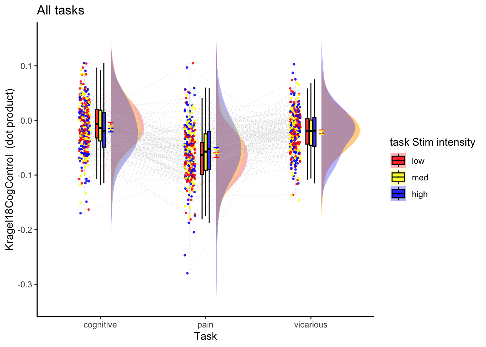


## Cognitive only Stim x cue interaction

### 2x3 stimulus intensity * cue 
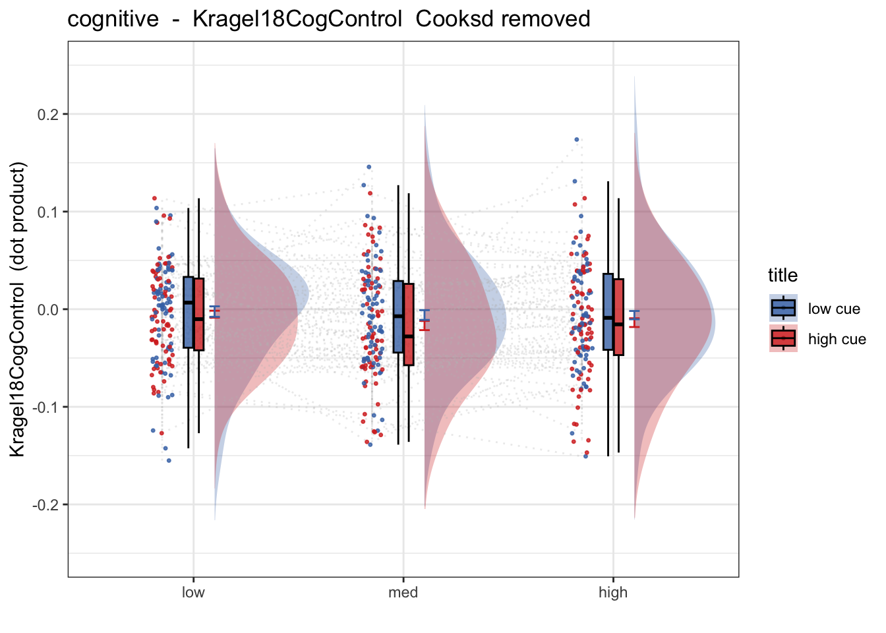


### Linear model

```
## Warning: Model failed to converge with 1 negative eigenvalue: -5.9e+01
```

```
## [1] "model:  Kragel18cogcontrol  ratings -  cognitive"
## Linear mixed model fit by REML. t-tests use Satterthwaite's method [
## lmerModLmerTest]
## Formula: as.formula(model_string)
##    Data: data
## 
## REML criterion at convergence: -6435.9
## 
## Scaled residuals: 
##     Min      1Q  Median      3Q     Max 
## -5.0012 -0.6064 -0.0172  0.6160  4.6329 
## 
## Random effects:
##  Groups   Name                       Variance  Std.Dev. Corr                   
##  sub      (Intercept)                1.622e-03 0.040277                        
##           social_cue                 8.684e-05 0.009319  0.77                  
##           stim_con_linear            9.623e-05 0.009810  0.75  0.70            
##           stim_con_quad              2.684e-05 0.005181  0.80  0.88  0.95      
##           social_cue:stim_con_linear 6.402e-05 0.008001 -0.20  0.27 -0.48 -0.20
##           social_cue:stim_con_quad   6.321e-04 0.025142  0.09  0.68  0.07  0.34
##  Residual                            5.156e-03 0.071805                        
##       
##       
##       
##       
##       
##       
##   0.82
##       
## Number of obs: 2749, groups:  sub, 71
## 
## Fixed effects:
##                              Estimate Std. Error         df t value Pr(>|t|)   
## (Intercept)                 -0.006593   0.005110  68.670037  -1.290  0.20129   
## social_cue                  -0.004557   0.002993 108.978750  -1.523  0.13072   
## stim_con_linear             -0.011286   0.003580  69.213999  -3.153  0.00239 **
## stim_con_quad               -0.003569   0.003022 303.368866  -1.181  0.23861   
## social_cue:stim_con_linear   0.002279   0.006796 355.176083   0.335  0.73750   
## social_cue:stim_con_quad    -0.006588   0.006780  53.000195  -0.972  0.33565   
## ---
## Signif. codes:  0 '***' 0.001 '**' 0.01 '*' 0.05 '.' 0.1 ' ' 1
## 
## Correlation of Fixed Effects:
##                (Intr) socl_c stm_cn_l stm_cn_q scl_c:stm_cn_l
## social_cue      0.283                                        
## stim_cn_lnr     0.243  0.111                                 
## stim_con_qd     0.167  0.082  0.073                          
## scl_c:stm_cn_l -0.017  0.021 -0.033   -0.018                 
## scl_c:stm_cn_q  0.047  0.144  0.001    0.039    0.065        
## optimizer (nloptwrap) convergence code: 0 (OK)
## boundary (singular) fit: see help('isSingular')
```

### Cog stimulus intensity Cohen's d = 0.72

```
## Linear mixed model fit by REML. t-tests use Satterthwaite's method [
## lmerModLmerTest]
## Formula: 
## Kragel18CogControl ~ stim_con_linear + stim_con_quad + (stim_con_linear +  
##     stim_con_quad | sub)
##    Data: data_screen
## 
## REML criterion at convergence: -6432.1
## 
## Scaled residuals: 
##     Min      1Q  Median      3Q     Max 
## -4.9043 -0.6175 -0.0087  0.6262  4.6081 
## 
## Random effects:
##  Groups   Name            Variance  Std.Dev. Corr     
##  sub      (Intercept)     1.622e-03 0.040269          
##           stim_con_linear 6.846e-05 0.008274 0.87     
##           stim_con_quad   2.328e-05 0.004825 0.93 0.99
##  Residual                 5.225e-03 0.072285          
## Number of obs: 2743, groups:  sub, 71
## 
## Fixed effects:
##                   Estimate Std. Error         df t value Pr(>|t|)   
## (Intercept)      -0.006353   0.005112  68.556801  -1.243  0.21818   
## stim_con_linear  -0.011041   0.003535  68.333650  -3.123  0.00262 **
## stim_con_quad    -0.003368   0.003028 400.796234  -1.112  0.26680   
## ---
## Signif. codes:  0 '***' 0.001 '**' 0.01 '*' 0.05 '.' 0.1 ' ' 1
## 
## Correlation of Fixed Effects:
##             (Intr) stm_cn_l
## stim_cn_lnr 0.239          
## stim_con_qd 0.179  0.057   
## optimizer (nloptwrap) convergence code: 0 (OK)
## boundary (singular) fit: see help('isSingular')
```

```
## [1] "eta squared"
```

```
## # Effect Size for ANOVA (Type III)
## 
## Parameter       | Eta2 (partial) |       95% CI
## -----------------------------------------------
## stim_con_linear |           0.12 | [0.03, 1.00]
## stim_con_quad   |       3.08e-03 | [0.00, 1.00]
## 
## - One-sided CIs: upper bound fixed at [1.00].
```

```
## # Fixed Effects
## 
## Parameter       | Coefficient |       SE |         95% CI | t(2733) |     p
## ---------------------------------------------------------------------------
## (Intercept)     |   -6.35e-03 | 5.11e-03 | [-0.02,  0.00] |   -1.24 | 0.214
## stim con linear |       -0.01 | 3.54e-03 | [-0.02,  0.00] |   -3.12 | 0.002
## stim con quad   |   -3.37e-03 | 3.03e-03 | [-0.01,  0.00] |   -1.11 | 0.266
## 
## # Random Effects
## 
## Parameter                                | Coefficient
## ------------------------------------------------------
## SD (Intercept: sub)                      |        0.04
## SD (stim_con_linear: sub)                |    8.27e-03
## SD (stim_con_quad: sub)                  |    4.83e-03
## Cor (Intercept~stim_con_linear: sub)     |        0.87
## Cor (Intercept~stim_con_quad: sub)       |        0.93
## Cor (stim_con_linear~stim_con_quad: sub) |        0.99
## SD (Residual)                            |        0.07
```

```
##                         t        df          d
## stim_con_linear -3.123369  68.33365 -0.7556766
## stim_con_quad   -1.112014 400.79623 -0.1110909
```

### Cognitive stimulus & cue effect size: stim_d = 0.73, cue_d = 0.069

```
## Linear mixed model fit by REML. t-tests use Satterthwaite's method [
## lmerModLmerTest]
## Formula: 
## Kragel18CogControl ~ cue_con * stim_con_linear + cue_con * stim_con_quad +  
##     (cue_con | sub)
##    Data: data_screen
## 
## REML criterion at convergence: -6408.3
## 
## Scaled residuals: 
##     Min      1Q  Median      3Q     Max 
## -4.9424 -0.6039 -0.0146  0.6224  4.6135 
## 
## Random effects:
##  Groups   Name        Variance  Std.Dev. Corr
##  sub      (Intercept) 1.612e-03 0.04015      
##           cue_con     5.184e-05 0.00720  1.00
##  Residual             5.230e-03 0.07232      
## Number of obs: 2743, groups:  sub, 71
## 
## Fixed effects:
##                           Estimate Std. Error         df t value Pr(>|t|)   
## (Intercept)             -6.653e-03  5.098e-03  6.878e+01  -1.305  0.19628   
## cue_con                 -4.334e-03  2.905e-03  2.986e+02  -1.492  0.13677   
## stim_con_linear         -1.045e-02  3.382e-03  2.672e+03  -3.090  0.00202 **
## stim_con_quad           -2.970e-03  2.969e-03  2.672e+03  -1.001  0.31713   
## cue_con:stim_con_linear  2.211e-03  6.770e-03  2.675e+03   0.327  0.74404   
## cue_con:stim_con_quad   -5.909e-03  5.938e-03  2.673e+03  -0.995  0.31981   
## ---
## Signif. codes:  0 '***' 0.001 '**' 0.01 '*' 0.05 '.' 0.1 ' ' 1
## 
## Correlation of Fixed Effects:
##               (Intr) cue_cn stm_cn_l stm_cn_q c_cn:stm_cn_l
## cue_con        0.292                                       
## stim_cn_lnr    0.001  0.020                                
## stim_con_qd    0.004  0.006  0.000                         
## c_cn:stm_cn_l  0.011  0.003 -0.008   -0.013                
## c_cn:stm_cn_q  0.006  0.006 -0.013    0.000    0.001       
## optimizer (nloptwrap) convergence code: 0 (OK)
## boundary (singular) fit: see help('isSingular')
```

```
## [1] "eta squared"
```

```
## # Effect Size for ANOVA (Type III)
## 
## Parameter               | Eta2 (partial) |       95% CI
## -------------------------------------------------------
## cue_con                 |       7.40e-03 | [0.00, 1.00]
## stim_con_linear         |       3.56e-03 | [0.00, 1.00]
## stim_con_quad           |       3.74e-04 | [0.00, 1.00]
## cue_con:stim_con_linear |       3.99e-05 | [0.00, 1.00]
## cue_con:stim_con_quad   |       3.70e-04 | [0.00, 1.00]
## 
## - One-sided CIs: upper bound fixed at [1.00].
```

```
##                                  t        df           d
## cue_con                 -1.4919521  298.5707 -0.17268766
## stim_con_linear         -3.0896597 2672.1084 -0.11954010
## stim_con_quad           -1.0005545 2672.3127 -0.03871035
## cue_con:stim_con_linear  0.3265372 2674.7348  0.01262764
## cue_con:stim_con_quad   -0.9950382 2672.7716 -0.03849363
```


### Lineplots

```r
plot_lineplot_twofactor(actual_groupwise, taskname = "cognitive", 
                        iv1 = "stim_ordered", iv2 = "cue_ordered", 
                        mean = "mean_per_sub_norm_mean", error = "se",
                        color = c("#4575B4", "#D73027"), ggtitle = "placeholder", 
                        xlab = "Stimulus intensity", ylab = paste(signature_key, " (dot product)"))
```

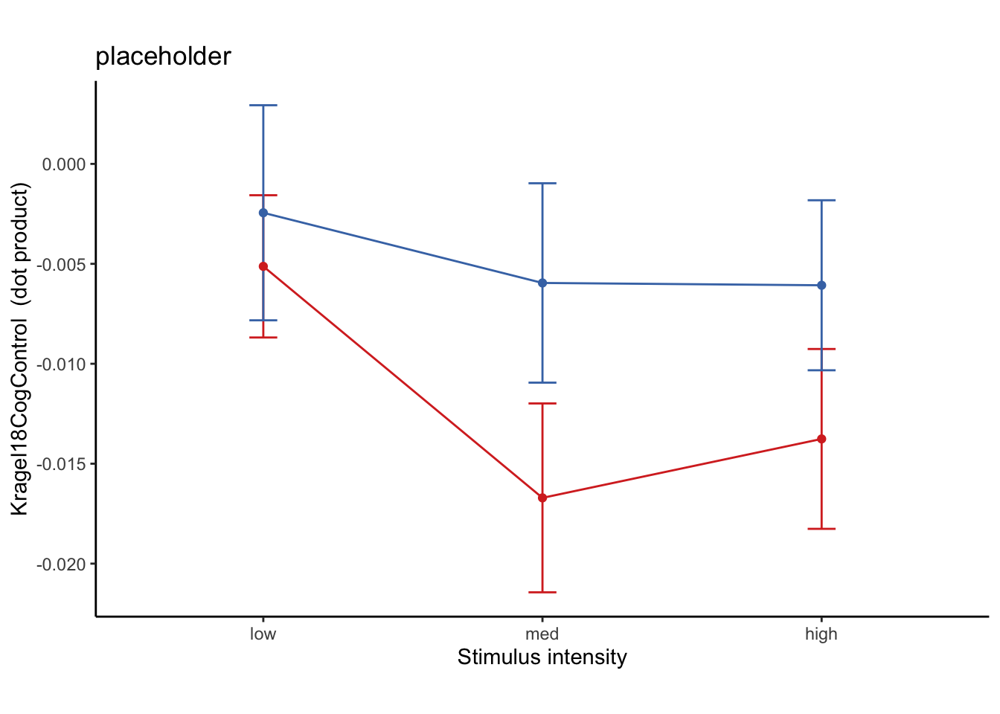

### Linear model with Stim x Cue x Expectation rating

```r
model.cog3factor <- lmer(Kragel18CogControl ~ cue_con*stim_con_linear*event02_expect_angle + cue_con*stim_con_quad*event02_expect_angle + (cue_con|sub), data = data_screen)
```

```
## boundary (singular) fit: see help('isSingular')
```

```r
summary(model.cog3factor)
```

```
## Linear mixed model fit by REML. t-tests use Satterthwaite's method [
## lmerModLmerTest]
## Formula: 
## Kragel18CogControl ~ cue_con * stim_con_linear * event02_expect_angle +  
##     cue_con * stim_con_quad * event02_expect_angle + (cue_con |      sub)
##    Data: data_screen
## 
## REML criterion at convergence: -6151.8
## 
## Scaled residuals: 
##     Min      1Q  Median      3Q     Max 
## -5.0260 -0.6202 -0.0130  0.6336  4.5937 
## 
## Random effects:
##  Groups   Name        Variance  Std.Dev. Corr
##  sub      (Intercept) 1.630e-03 0.040374     
##           cue_con     5.855e-05 0.007652 1.00
##  Residual             5.162e-03 0.071844     
## Number of obs: 2657, groups:  sub, 70
## 
## Fixed effects:
##                                                Estimate Std. Error         df
## (Intercept)                                  -6.525e-03  5.882e-03  1.123e+02
## cue_con                                      -1.195e-02  5.945e-03  1.156e+03
## stim_con_linear                              -2.607e-02  6.723e-03  2.586e+03
## event02_expect_angle                         -4.741e-05  9.414e-05  2.554e+03
## stim_con_quad                                -1.096e-02  5.945e-03  2.584e+03
## cue_con:stim_con_linear                      -2.659e-02  1.343e-02  2.587e+03
## cue_con:event02_expect_angle                  2.736e-04  1.698e-04  2.554e+03
## stim_con_linear:event02_expect_angle          2.877e-04  1.968e-04  2.586e+03
## cue_con:stim_con_quad                        -1.916e-02  1.189e-02  2.586e+03
## event02_expect_angle:stim_con_quad            2.016e-04  1.771e-04  2.587e+03
## cue_con:stim_con_linear:event02_expect_angle  5.353e-04  3.929e-04  2.587e+03
## cue_con:event02_expect_angle:stim_con_quad    2.239e-04  3.539e-04  2.586e+03
##                                              t value Pr(>|t|)    
## (Intercept)                                   -1.109 0.269680    
## cue_con                                       -2.010 0.044646 *  
## stim_con_linear                               -3.878 0.000108 ***
## event02_expect_angle                          -0.504 0.614596    
## stim_con_quad                                 -1.843 0.065407 .  
## cue_con:stim_con_linear                       -1.979 0.047866 *  
## cue_con:event02_expect_angle                   1.612 0.107190    
## stim_con_linear:event02_expect_angle           1.462 0.143965    
## cue_con:stim_con_quad                         -1.612 0.107114    
## event02_expect_angle:stim_con_quad             1.138 0.255060    
## cue_con:stim_con_linear:event02_expect_angle   1.362 0.173199    
## cue_con:event02_expect_angle:stim_con_quad     0.633 0.526911    
## ---
## Signif. codes:  0 '***' 0.001 '**' 0.01 '*' 0.05 '.' 0.1 ' ' 1
## 
## Correlation of Fixed Effects:
##               (Intr) cue_cn stm_cn_l ev02__ stm_cn_q c_cn:stm_cn_l c_c:02__
## cue_con        0.366                                                       
## stim_cn_lnr   -0.006 -0.009                                                
## evnt02_xpc_   -0.433 -0.116 -0.025                                         
## stim_con_qd    0.015 -0.005  0.011   -0.037                                
## c_cn:stm_cn_l -0.003 -0.019  0.382    0.005  0.000                         
## c_cn:vn02__   -0.012 -0.735  0.015   -0.414  0.024   -0.014                
## stm_c_:02__   -0.019  0.004 -0.751    0.086  0.012   -0.031        -0.054  
## c_cn:stm_cn_q -0.010  0.018  0.001    0.024  0.357    0.008        -0.031  
## evnt02__:__   -0.024  0.017  0.012    0.054 -0.757   -0.001        -0.043  
## c_c:__:02__    0.006 -0.017 -0.030   -0.044 -0.001   -0.750         0.074  
## c_c:02__:__    0.020 -0.026 -0.002   -0.044  0.002    0.014         0.047  
##               s__:02 c_cn:stm_cn_q e02__: c_:__:
## cue_con                                         
## stim_cn_lnr                                     
## evnt02_xpc_                                     
## stim_con_qd                                     
## c_cn:stm_cn_l                                   
## c_cn:vn02__                                     
## stm_c_:02__                                     
## c_cn:stm_cn_q -0.002                            
## evnt02__:__   -0.048  0.002                     
## c_c:__:02__   -0.456  0.014         0.027       
## c_c:02__:__    0.028 -0.757        -0.484 -0.050
## optimizer (nloptwrap) convergence code: 0 (OK)
## boundary (singular) fit: see help('isSingular')
```

```r
print("eta squared")
```

```
## [1] "eta squared"
```

```r
eta_squared(model.cog3factor, partial = TRUE)
```

```
## # Effect Size for ANOVA (Type III)
## 
## Parameter                                    | Eta2 (partial) |       95% CI
## ----------------------------------------------------------------------------
## cue_con                                      |       3.48e-03 | [0.00, 1.00]
## stim_con_linear                              |       5.78e-03 | [0.00, 1.00]
## event02_expect_angle                         |       9.93e-05 | [0.00, 1.00]
## stim_con_quad                                |       1.31e-03 | [0.00, 1.00]
## cue_con:stim_con_linear                      |       1.51e-03 | [0.00, 1.00]
## cue_con:event02_expect_angle                 |       1.02e-03 | [0.00, 1.00]
## stim_con_linear:event02_expect_angle         |       8.25e-04 | [0.00, 1.00]
## cue_con:stim_con_quad                        |       1.00e-03 | [0.00, 1.00]
## event02_expect_angle:stim_con_quad           |       5.01e-04 | [0.00, 1.00]
## cue_con:stim_con_linear:event02_expect_angle |       7.17e-04 | [0.00, 1.00]
## cue_con:event02_expect_angle:stim_con_quad   |       1.55e-04 | [0.00, 1.00]
## 
## - One-sided CIs: upper bound fixed at [1.00].
```

```r
#parameters::model_parameters(model.cog3factor)
lme.dscore(model.cog3factor, data_screen, type = "lme4")
```

```
## boundary (singular) fit: see help('isSingular')
```

```
##                                                       t       df           d
## cue_con                                      -2.0101599 1156.158 -0.11823661
## stim_con_linear                              -3.8777185 2585.733 -0.15251566
## event02_expect_angle                         -0.5035855 2554.118 -0.01992887
## stim_con_quad                                -1.8432482 2584.370 -0.07251644
## cue_con:stim_con_linear                      -1.9794942 2586.972 -0.07783741
## cue_con:event02_expect_angle                  1.6115221 2554.318  0.06377181
## stim_con_linear:event02_expect_angle          1.4616274 2586.346  0.05748087
## cue_con:stim_con_quad                        -1.6118631 2585.596 -0.06339833
## event02_expect_angle:stim_con_quad            1.1383984 2586.764  0.04476575
## cue_con:stim_con_linear:event02_expect_angle  1.3623712 2586.508  0.05357579
## cue_con:event02_expect_angle:stim_con_quad    0.6328144 2586.438  0.02488601
```


```r
library(plotly)
```

```
## 
## Attaching package: 'plotly'
```

```
## The following objects are masked from 'package:plyr':
## 
##     arrange, mutate, rename, summarise
```

```
## The following object is masked from 'package:ggplot2':
## 
##     last_plot
```

```
## The following object is masked from 'package:reshape':
## 
##     rename
```

```
## The following object is masked from 'package:stats':
## 
##     filter
```

```
## The following object is masked from 'package:graphics':
## 
##     layout
```

```r
# lmer(Kragel18CogControl ~ cue_con*stim_con_linear*event02_expect_angle + cue_con*stim_con_quad*event02_expect_angle + (cue_con|sub), data = data_screen)
# mtcars$am[which(mtcars$am == 0)] <- 'Automatic'
# mtcars$am[which(mtcars$am == 1)] <- 'Manual'
# mtcars$am <- as.factor(mtcars$am)

fig <- plot_ly(data_screen, x = ~event02_expect_angle, y = ~Kragel18CogControl, z = ~event04_actual_angle, color = ~cue_con, colors = c('#BF382A', '#0C4B8E'))
fig <- fig %>% add_markers()
fig <- fig %>% layout(scene = list(xaxis = list(title = 'Expectation'),
                     yaxis = list(title = 'Kragel Cognitive'),
                     zaxis = list(title = 'Outcome rating')))

fig
```

```
## Warning: Ignoring 86 observations
```

```{=html}
<div class="plotly html-widget html-fill-item-overflow-hidden html-fill-item" id="htmlwidget-4c4765cae9104636eb7b" style="width:672px;height:480px;"></div>
<script type="application/json" data-for="htmlwidget-4c4765cae9104636eb7b">{"x":{"visdat":{"50f662f66dfc":["function () ","plotlyVisDat"]},"cur_data":"50f662f66dfc","attrs":{"50f662f66dfc":{"x":{},"y":{},"z":{},"color":{},"colors":["#BF382A","#0C4B8E"],"alpha_stroke":1,"sizes":[10,100],"spans":[1,20],"type":"scatter3d","mode":"markers","inherit":true}},"layout":{"margin":{"b":40,"l":60,"t":25,"r":10},"scene":{"xaxis":{"title":"Expectation"},"yaxis":{"title":"Kragel Cognitive"},"zaxis":{"title":"Outcome rating"}},"hovermode":"closest","showlegend":false,"legend":{"yanchor":"top","y":0.5}},"source":"A","config":{"modeBarButtonsToAdd":["hoverclosest","hovercompare"],"showSendToCloud":false},"data":[{"x":[64.9831065219,58.7994853960194,29.2328174575243,64.9831065219,47.6476296652922,55.6096855912874,37.1910075397043,51.1964134291043,60.3128183608063,69.3624530153122,59.6277136423551,31.122470196792,47.1090897372578,68.8801438465753,51.6624771065963,31.9081069356532,32.029785156997,77.9213462894872,36.3648998459456,85.2755483028291,8.09653716788845,65.5175141026529,29.6591092359951,39.1397230185291,28.9830142410641,64.5663162536045,29.1441986773614,28.9423915917175,15.3762512488262,48.6592815186608,21.9295877501754,20.7494246475868,93.6913859864513,3.4473868518652,48.4238712449307,46.4688007143858,32.8597520397218,0.471559554076161,2.15656267471479,1.64328065449277,0.485545830008134,41.0251114514287,18.5829996032663,28.8426601354121,2.16561525290286,41.6136656712163,0,7.60983715755195,0.931556598077485,37.6528298208836,51.0175030328457,32.721234629037,42.8909102627422,6.46745892779152,0.462052721430765,54.1416402235249,43.8639719603119,0,48.6381865778647,36.2926297284796,0,2.52949420483775,2.75910765862027,26.0141471978594,5.04916646758286,41.5106750942036,11.626980982306,42.2428433673439,55.7995158697315,69.3093314860669,29.1441986773614,3.00066141346215,31.7129360012143,8.58793559647603,55.6603482945353,52.8089924602957,19.8851651138554,10.0348792264664,11.0848912922423,7.1250163489018,23.4143347638103,10.1813200065144,11.1291892896112,5.98495231511541,37.3395246655337,46.7950067373364,10.1407931461128,52.4873881971436,8.9239884436314,2.5396804503407,84.4052025405617,3.02501190756369,73.4367961423667,15.4992753765008,3.50353164478446,20.6096929375321,60.9453959009229,106.03994330605,50.4015924970082,24.0799945102303,73.8964162638126,51.4126721367385,52.8089924602957,41.2078439785321,75.796062046486,47.9609361341638,49.5480424091254,51.7003113249664,30.6432240465435,38.5131783003368,46.7950067373364,45.4869212478131,29.1441986773614,30.32360686255,51.6624771065963,32.7352262721076,52.7135814077211,21.3706222693432,17.2717425776809,48.5763343749974,47.8271245781613,44.1884993162881,40.1390348269016,26.7730204253086,26.3563243062187,24.0656315805573,29.6591092359951,42.5667989452628,25.4336837463955,18.1380821555973,42.3574547059353,12.2331942090363,48.1705784197165,44.3489396197705,16.324623321803,45.1623105559367,19.5731258304102,31.0032981265641,25.0168934781,45.4869212478131,14.5602756193569,40.5251034937539,13.9802905760327,46.9525090493996,10.9770976647436,51.2317456050401,42.0726520082591,9.57699005929366,48.308213533872,20.3066937882108,5.77948582515591,43.8509550526738,40.6012946450045,38.2996886750336,8.29241291009267,12.5288077091515,28.9423915917175,39.5984075029918,30.0581254794867,26.7749248886455,14.649904105813,15.3154511969185,107.119715561947,28.9423915917175,90.465809082765,51.6624771065963,106.232350661156,23.3852210572138,71.7829048021751,16.2037742148908,19.7468366054261,62.0907097161317,17.7097245238628,40.1286089684759,63.1246859015714,84.0776369785335,103.424370055032,25.0168934781,7.15356431839441,25.8411358077129,14.3700015151793,40.4519575908746,19.9634442785012,22.8670562997727,45,23.4709931181609,14.3700015151793,30.5702477502442,5.0694201326125,13.4778227532413,11.805792300589,22.1427056998454,7.83761367789845,19.8851651138554,16.9661481085362,23.2592209455283,20.1794586645109,23.1683871534975,24.6148730721051,7.64040676102675,14.0926369334888,31.3969122485905,38.480198248343,27.1811110854772,22.0158387977756,22.8670562997727,33.6900675259798,17.7797524591934,12.7533002545757,18.434948822922,34.8981235610295,32.347443499442,25.2256456981242,24.7107994622302,25.0168934781,7.83761367789845,11.3099324740202,25.523424501068,22.6740880670385,8.55354270257181,25.6410058243053,21.6308868365179,25.1278241807561,24.4059097796912,15.3154511969185,23.3507297724187,19.2357271422572,26.3600582073531,11.1738382418147,15.3762512488262,17.4909973122426,16.260204708312,16.4549613829199,11.3099324740202,19.1601731219813,9.91494567847495,16.5451645222102,13.3067577810692,23.9859036767946,14.203937953514,22.1027368784534,14.3700015151793,35.1060793302646,8.8164422389766,45.6585431775636,2.09525256462385,18.9432630612515,41.1859251657097,0,3.2180612837942,31.5250386021055,48.9451862290376,70.9065079995144,17.3392614880405,6.39237368003703,19.529639414775,83.0749182616073,15.4375241765319,83.0528282310403,25.9422954898717,90.2501983201976,63.9511130526868,26.3504612459486,85.618962168192,9.08111838836946,49.8713910315241,16.9847325319886,49.8713910315241,42.8909102627422,92.5499490129602,41.9190641134269,75.796062046486,31.2005146039806,34.0771952801307,65.498768551379,2.54994901296018,65.8252180423653,29.1676133795778,88.7706655135221,47.9273479917409,64.9971737397644,31.2424690359597,43.5227858085068,17.7797524591934,63.1274610083442,11.0848912922423,63.0197692817771,60.7671825424757,63.8493776135295,29.2157408604998,40.4519575908746,36.8238029015545,42.2408923413797,46.0109970523304,60.851928154287,14.1476053870017,2.1386825776663,59.9418745205133,7.64040676102675,34.3302171955033,6.36617622463325,69.9576832551064,62.5008612689528,38.3375228934037,64.8721758192439,28.628870905535,0,46.1623635735027,1.40288153265147,29.8590161649231,11.5806191822281,16.5451645222102,19.4527870602187,21.6308868365179,26.8725389916558,19.3885677146773,23.5899901707433,20.0423167448936,20.9878469700938,0,9.46232220802562,17.0519648540015,9.00850374202516,18.2891583500028,12.8556339729091,6.72334996305192,5.36306942004671,40.7755967829162,18.7998851586527,12.4790718019276,14.4271442805497,10.6337744921121,24.4059097796912,15.3762512488262,16.6770623615002,13.9247732204094,15.576400080584,63.3294318528685,91.4086287353385,94.1346713737364,71.4922484468651,32.0053832080835,31.0435556162882,85.159887511153,87.5104470780009,14.3179313631279,72.0069121820262,33.0939479780548,43.0474909506004,29.2328174575243,110.224859431168,81.869897645844,82.4852224557801,16.0399433060497,72.9840827516579,12.5789352374931,80.9914962579748,9.99458354741538,0,97.5634958970672,109.92281635175,114.659425072211,14.9314171781376,28.4339241014903,19.4527870602187,29.8989018386146,5.92236302146646,30.5245640369386,6.21337526527838,49.5480424091254,12.6055773543846,37.525748732092,64.3589941756947,46.4604825118437,46.784843324319,4.20193635815963,55.4796169877622,14.0362434679265,40.1951284438696,5.54977942321874,55.4796169877622,60.4276092391856,6.49352531253926,50.9061411137705,4.3615726450206,17.8503183022168,68.8801438465753,4.87927378300673,34.3903144087126,48.6806221730305,68.3691131634821,46.0109970523304,5.63426665576739,8.51942215741111,13.9189544208851,9.38551826004307,64.8507159961252,43.2049932626637,54.3754666209243,79.8592068538872,15.2145409623114,15.59796158466,2.35652134578936,65.6165902264735,62.4565581336669,19.8851651138554,61.476881393688,35.3364390526994,10.5338618096845,1.83914082340838,71.6382258237724,53.3611324710515,13.1340223063963,63.2211595930449,53.4572362027714,16.7898303711847,5.29856506989994,7.93275831417206,36.8238029015545,13.4034844802728,53.1781289812256,16.46001481204,50.8726282810668,44.8376894440633,65.1925710268582,20.8024182904795,69.2277453179542,59.6277136423551,5.1731688792066,57.4042131691097,25.7332289777082,54.7824070318073,23.5899901707433,13.281631445692,7.18632802107237,37.7939429986167,13.3602184447645,76.5756299449677,21.7158295955314,96.6963776161997,44.8319776678336,17.2567955279937,82.8749836510982,9.6887865603668,26.9840256433407,45.9765380357616,7.44140548974372,47.9609361341638,9.46232220802562,2.57073711069053,28.3007557660064,0,6.00900595749452,27.1811110854772,27.4075754378184,61.4812722113292,83.5006537203455,49.4492084529898,3.46125387795416,29.3960528549433,3.92830722539768,14.0935965814162,180,6.03325300620071,78.8708107103888,36.3158864239452,58.7878529163268,63.651566995033,11.3550828031402,62.053314768701,1.38591785081219,59.995079129176,14.3179313631279,14.3756024581228,7.1250163489018,13.7994853960194,5.06361685303009,31.0032981265641,85.0607844578738,80.1033280323309,62.2744195752733,64.1588641922871,31.6075022462489,17.921428058034,0,6.92508173839268,77.2466997454243,14.2127186167793,5.29856506989994,45.8351562922209,30.32360686255,51.0863513455828,1.25628502895633,4.61064931866061,2.5396804503407,25.1278241807561,26.1506223864705,42.7093899573615,7.75428569582291,5.52754015165617,64.7865041285214,7.99747347180383,77.6960764459401,7.83761367789845,86.5247672232699,60.7430970100652,14.8264799703557,73.1683312417585,4.25383643611919,12.9773953378174,53.6351001540544,5.31989391780685,42.0726520082591,2.32781508904115,5.42915890721713,53.1761970984455,2.30906278902568,10.2221686336361,28.8309683123904,55.2903154572812,56.9662128148854,0.465809082764994,0.920334966849057,5.92236302146646,64.2592916437672,63.0121094182515,56.4372562189076,69.2200349453035,5.77948582515591,51.051732108794,4.06857967684541,64.7743543018758,6.66961984231233,64.2592916437672,70.2531633945739,54.0578881286177,2.77021579720019,36.869897645844,6.89742755775175,65.0803356301676,53.3138893084545,6.66961984231233,3.67660188678891,8.42696902148067,7.67122148326199,6.92508173839268,62.3056084068584,9.22988624372772,2.52949420483775,46.1691393279074,67.2558878933737,58.1657944544408,4.87927378300673,0,4.41750935153507,47.6324348689865,69.3903070624679,5.31989391780685,3.50353164478446,1.66372500429159,4.36351139166193,47.9440463499876,55.1421168328288,51.8427734126309,54.0065394724413,63.6399417926469,38.8035865708957,6.21337526527838,52.3471701791164,12.0305960965379,10.7192752593735,2.5396804503407,15.0940628250366,29.4584047866652,62.8188889145228,55.6096855912874,17.975366865392,0.707319368544256,9.05072167718373,35.7007583179366,14.9158434412248,12.0305960965379,82.4365041029328,0.920334966849057,24.0799945102303,11.3099324740202,2.5396804503407,7.21134844757372,23.3795239527766,65.3851269278949,28.9423915917175,16.8986486940382,16.0111774788085,19.3231843181618,58.9957517576972,36.869897645844,25.8802736700688,9.53846273398613,12.2550245737389,19.824995079131,43.6754780877088,2.07837024536197,6.15747233955365,8.85200409938944,8.55354270257181,5.04916646758286,12.8556339729091,46.3093898194106,41.5565547950406,34.8981235610295,66.8663706597786,0.99203556598862,43.5142754108994,0.502581666721031,34.0716098073942,3.45331625053109,0.485545830008134,22.9751540660307,1.40288153265147,0.462052721430765,31.8342055455592,67.6326171800829,16.3895403340348,56.5019846469709,0,57.4371345401583,28.425992243091,16.1744469117807,6.21337526527838,56.7615790386782,3.72131326474976,43.163155569939,13.1340223063963,23.6820877245385,40.4260787400991,29.7735722206899,21.7580692680575,42.6420940292831,14.3179313631279,23.7494944928668,15.2344864462927,13.1725534233269,14.0362434679265,10.3466834671815,28.2223329029719,12.2747260952603,23.7748653160852,14.3756024581228,25.2256456981242,18.434948822922,24.9739109058834,20.8024182904795,23.9386455387872,26.6686600686883,29.1441986773614,21.5014343240479,23.7748653160852,10.5765865449688,29.3064017487768,64.6871161981259,66.4100098292567,32.2245330172405,23.8186504997338,31.1639506143602,22.3286563780191,23.6820877245385,33.8812651906146,27.8014587799341,36.1796204479789,12.4259428654275,31.7594800848128,27.1811110854772,45.8550973962667,56.3099324740202,38.2278400338864,17.5255683737229,4.82076607809266,10.859503235322,63.434948822922,69.8563453042129,47.6476296652922,43.8308606720926,0.740852409389339,44.0234619642384,12.0305960965379,35.9934605275587,2.77021579720019,88.0987635353856,74.6845488030815,31.3969122485905,13.9247732204094,87.9132227244292,28.628870905535,92.2408654992135,99.8858720025033,35.3192011406149,27.186680812252,31.657166301577,20.6906685139331,13.3693385878688,0,3.92139888767809,2.07837024536197,5.75633826112338,48.134103250472,34.0097951196552,0.971021931079167,6.15747233955365,0.234817453793639,2.86240522611175,8.5068175321314,1.85508525349466,54.1416402235249,28.2374455381673,0,58.2801846921758,39.9240118114389,45.1651170631111,0,1.16913932790742,4.84011248884704,15.0940628250366,37.6109496698391,2.75910765862027,54.3283912235543,16.260204708312,21.070745232549,73.9600566939503,37.0078486943146,52.2060570013833,45.3255406986593,72.7432044720063,69.5248428859903,70.1148348861446,62.3056084068584,65.498768551379,18.5077515531349,102.753300254576,63.1274610083442,5.31989391780685,91.3971810272964,6.21337526527838,110.690668513933,100.40771131249,98.3256503304268,111.586336249102,73.1683312417585,30.8014459761368,56.6289479942471,23.7987092029011,36.6861106915455,37.4700732223124,21.9295877501754,43.8639719603119,27.6162319266217,53.6841135760548,52.8089924602957,9.46232220802562,0,0,18.434948822922,6.69637761619969,11.2188422812688,11.0848912922423,39.0938588862295,11.853004167744,9.6887865603668,14.2067661177604,8.62260408791931,0,14.4271442805497,37.1910075397043,32.5417535599951,35.8583597764751,51.8427734126309,0,55.730556699269,10.1813200065144,51.2655393067037,12.8607930590945,89.5379472785692,86.3477772196937,72.7432044720063,12.4529527938322,65.498768551379,15.9453959009229,80.2724214485984,68.9792568346535,39.8055710922652,38.948267891206,27.5972958686437,27.1981279485091,17.5602720518007,21.7119547900856,18.2084844705808,8.8164422389766,17.4093027469569,53.7073702715204,57.5288077091515,45,48.0809358865731,41.2759420272517,29.8590161649231,12.6294589530254,7.93275831417206,64.8983912861766,26.3600582073531,19.3885677146773,51.1964134291043,66.7708191104474,42.227157522404,6.13222249767931,0,3.25722194066696,55.4796169877622,56.3741653837845,77.1443660270909,20.8024182904795,94.840112488847,22.1502379283508,83.7365093856655,25.0168934781,13.4778227532413,82.8749836510982,54.7824070318073,35.0115351090823,68.7741856266596,10.859503235322,54.1416402235249,53.9213016544417,24.3045492659367,41.2295126654891,53.6351001540544,20.8435279024517,71.9299875128087,79.9506514118751,11.2188422812688,7.64040676102675,13.1870599078291,26.9878905817485,33.0527658954005,39.0256767135194,42.227157522404,35.5926641277931,46.6272833223936,14.0977856349283,10.0348792264664,27.9092902838683,41.3407184813392,21.2384305274357,46.4772141914932,79.4661381903155,13.4778227532413,69.7409613447019,59.4297522497558,20.3948760820484,75.6243975418772,69.2277453179542,0,7.56349589706718,52.4314079711725,77.5209281980724,82.5284408234076,12.0786537105128,48.9004937423819,47.4470486423236,9.6887865603668,6.21337526527838,50.7268472589113,47.1090897372578,42.0726520082591,11.3550828031402,21.4171663529417,28.7203267978695,18.7257878452726,50.1944289077348,12.5288077091515,21.1542708220455,43.215156675681,43.6980473274211,0,10.2221686336361,31.2851881081215,15.2145409623114,6.23833268963931,17.0519648540015,42.6829376141287,50.1944289077348,47.9273479917409,50.2239475962684,14.9314171781376,28.5187277886708,2.29979942179199,50.2239475962684,15.722580103838,53.5469600073442,0.920334966849057,28.495638618245,6.53403849618026,52.561428427667,3.4473868518652,4.15128526642169,1.15500036804478,55.9283901926058,0.467710260038513,41.9015430328756,20.1217889815635,8.29241291009267,29.5454437848755,7.86907555179051,2.52949420483775,38.1572265873691,47.1210963966615,45,12.6803834918198,6.51980175165699,29.973948660236,5.82634202955578,35.2954706787948,23.9859036767946,15.3762512488262,11.2188422812688,26.7711502144621,6.08233669328205,27.1811110854772,40.0816192858693,5.52754015165617,17.5490022290678,3.2180612837942,11.3550828031402,63.332268324401,32.2756443145776,9.7275785514016,10.500320318252,4.85961443097241,61.260204708312,59.6277136423551,37.1910075397043,67.1329437002273,42.9904461869789,0.924045352772706,35.4839797950318,29.2404778331071,8.51942215741111,4.82076607809266,4.36351139166193,22.8336541779175,7.00938425662125,19.8429703734581,9.7666793957727,43.8639719603119,26.8725389916558,57.5815500503569,12.0456323852658,52.3471701791164,41.3618134221353,12.0305960965379,41.4236656250027,30.1218217765394,55.6096855912874,23.5581143600502,12.2251226757358,14.649904105813,11.6737103128848,68.1541062217223,1.16913932790742,15.9777298588409,2.30906278902568,0,30.8849453307286,39.2403662643365,55.2753581648781,37.8954245276884,3.72131326474976,9.70665240933971,20.7722546820458,32.0792496641684,71.3391819942585,49.2727807676093,53.4089117326007,72.1496816977832,11.3550828031402,31.2851881081215,61.9821064535454,43.6677801461304,45.3350592186091,13.6197705780596,16.9470812940942,54.8729394937152,44.8289683303501,6.23833268963931,14.4271442805497,56.6289479942471,6.72334996305192,38.2996886750336,18.434948822922,0.460197167978694,18.1418783378957,59.4490301264595,58.9564443837118,4.9392155421262,47.1332404786146,18.434948822922,62.4923245251104,7.76516601842533,36.5910882673993,85.1792339219074,57.7754669827595,62.9187845931572,26.462186333354,81.4805778425889,37.3300948138227,71.8581216621043,66.8325654264637,55.2903154572812,42.3974377975002,41.9015430328756,21.6308868365179,26.462186333354,39.6290053044643,48.3052036167274,97.2700686453734,62.8188889145228,63.9511130526868,70.3148924181577,36.3648998459456,36.5014411205063,28.8309683123904,57.1402479602782,13.4243700550323,68.8801438465753,61.035982038114,42.227157522404,53.8203795520211,96.0090059574945,62.0784716548738,57.652556500558,63.537813666646,64.2592916437672,31.2005146039806,67.1094483437517,42.0726520082591,74.1808060524999,41.0772871094895,56.6948927249751,46.784843324319,53.0376153004857,50.5484662937181,42.8420495478424,51.0175030328457,56.888658039628,60.6547838267051,86.0627748351759,18.2170951978248,43.1874473144844,94.6106493186606,7.18426739242686,90,5.85005520571738,8.70951642200497,59.9418745205133,12.5034218980022,26.9765039210697,38.2996886750336,66.5290068818391,64.2592916437672,78.9151087077577,102.078653710513,68.1104432300953,5.30339754682187,95.8312664626776,9.99458354741538,81.3424485228341,83.7111485445726,30.0581254794867,18.5077515531349,25.6410058243053,22.1027368784534,13.5051958371942,100.263342832771,27.28636280995,122.98512147243,50.4515510987127,42.7093899573615,49.1446237411043,52.3311153862859,3.92139888767809,20.4751571140097,5.04916646758286,18.0700124871914,7.18234077150849,5.45155109871274,6.66961984231233,16.2410710374543,15.9453959009229,9.7666793957727,4.38103783180802,0,3.9692634567195,11.1291892896112,3.93722516482409,5.29856506989994,10.9908661966055,14.203937953514,3.4473868518652,4.13467137373642,2.48955292199916,10.1813200065144,7.99747347180383,24.8074289731418,0.935358195757145,0,18.7257878452726,37.6528298208836,19.2566051065387,16.6309537067214,3.67660188678891,26.1543357783129,15.8491544804975,22.6198649480404,12.7533002545757,31.122470196792,8.74616226255521,61.0576084082825,43.0136593041178,12.2550245737389,39.9240118114389,3.29734636702104,52.6960517220166,20.1794586645109,52.4605661261684,28.113208876056,54.7824070318073,22.7650091075115,28.2173558547293,1.16438804012388,26.1506223864705,2.10379694685107,50.0759881885611,1.38591785081219,30.0581254794867,15.051219992591,3.4752327767301,65.1103988366896,26.2559042877013,0,10.9029448317519,28.5879022736216,27.6943915931417,0,0,6.49352531253926,9.9546069435557,1.90011096557686,2.75910765862027,55.1066974493013,1.38035407344445,43.163155569939,1.61679031067324,9.53846273398613,34.3302171955033,6.98105740682979,3.4473868518652,39.9527850013886,41.865896749528,15.3762512488262,0,0,45.4869212478131,18.7998851586527,67.2905824841937,9.91494567847495,37.1910075397043,4.38103783180802,5.36306942004671,1.16913932790742,53.3138893084545,52.8024339847534,33.8182457898033,46.645977497564,0.231030116895476,31.122470196792,6.92508173839268,42.2428433673439,6.92508173839268,46.3245219122912,48.7704873345109,17.921428058034,15.9787267752974,14.9314171781376,46.5297907242864,4.61064931866061,30.0896862387767,8.09749235226275,8.69278111696351,18.2872796150619,42.5667989452628,47.3170623858713,2.77021579720019,10.3466834671815,5.11041756103123,26.4612545886105,40.9259839041171,23.8683300133074,122.859752039722,7.18234077150849,70.1148348861446,37.9760343038434,69.3624530153122,27.9339912435103,94.8207660780926,86.9502395307316,14.203937953514,23.8925023080266,94.381037831808,31.2005146039806,111.417166352942,71.6391724546336,98.7811627343855,23.8925023080266,68.7873801691921,114.196252587791,29.8590161649231,91.8401952563928,43.0136593041178,7.60983715755195,42.5667989452628,7.83761367789845,47.1832393001825,9.30609688417391,46.15566589382,52.2060570013833,31.9081069356532,17.4909973122426,56.9472341045995,16.260204708312,12.2747260952603,2.31840104103131,65.9200054897697,63.537813666646,37.6528298208836,49.1446237411043,6.00900595749452,0,4.62923494779759,42.227157522404,5.33215888165956,54.7369882704027,75.6618848283883,40.7755967829162,3.60630862259666,13.1340223063963,16.9170058609798,9.08111838836946,47.8047553308633,48.8140748342904,65.1258460858724,9.7275785514016,102.030596096538,25.4336837463955,0.920334966849057,75.8523946129983,47.4332010547372,0,3.32464910711083,3.73645935817829,20.6096929375321,54.7824070318073,15.051219992591,67.4690207695346,12.144278049567,57.8937440448822,55.2753581648781,0,49.8990924537878,26.4603058101988,69.2277453179542,9.34757780966493,6.72334996305192,12.5288077091515,5.04916646758286,0,59.1150546692714,5.04916646758286,57.8287828714554,0,32.2245330172405,20.2018675465623,3.24406302962854,34.4111433839387,0,14.3700015151793,17.3540246362613,6.57299498647337,6.00900595749452,0,0,0.460197167978694,0,1.42026554639905,0,0.231030116895476,0,33.6900675259798,38.948267891206,27.7815740790204,14.7671607673906,38.1572265873691,27.7149945106317,62.1985412200659,50.3709946955357,51.519801751657,38.3375228934037,39.1273717189332,38.480198248343,36.0442350030727,42.8909102627422,40.6012946450045,41.7295120768164,44.6744593013407,41.0772871094895,36.6388675289486,41.7480543996361,40.1286089684759,39.1273717189332,35.8583597764751,37.5126118028564,42.8909102627422,33.5627437810924,33.5627437810924,24.4059097796912,24.1529187827722,29.8590161649231,17.7004277886672,15.0940628250366,18.5077515531349,18.7257878452726,20.5283794662951,39.9527850013886,26.1543357783129,24.6148730721051,23.8925023080266,11.805792300589,18.2142986447466,30.1735200296443,13.4243700550323,23.5631398647748,29.6591092359951,25.6410058243053,29.0322839679456,22.3551804457356,19.1601731219813,26.2559042877013,18.9432630612515,18.7257878452726,14.9910847217987,21.2028186438097,101.626980982306,42.7223910416659,21.2864051136591,17.7797524591934,57.7754669827595,63.8456642216871,67.3801350519596,55.1018764389705,19.2357271422572,13.0291948079437,9.6887865603668,52.7500364229193,20.3948760820484,11.3099324740202,68.0704122498246,4.59221201091977,31.6839169508927,9.00850374202516,4.85961443097241,28.6476164568089,36.3648998459456,63.1274610083442,49.8048715561304,21.5863362491017,18.434948822922,29.7448812969422,64.4671935144877,49.8713910315241,49.3987053549955,16.5451645222102,15.2754869139001,56.7550627596995,63.537813666646,8.55354270257181,6.44160009933503,42.7093899573615,5.64054943215682,8.32565033042684,10.859503235322,51.3762268226134,49.8990924537878,53.6351001540544,43.0136593041178,6.44160009933503,55.9283901926058,6.08233669328205,42.2428433673439,14.8722120537559,49.5480424091254,15.3154511969185,50.9061411137705,20.0423167448936,47.6324348689865,12.0305960965379,45.4869212478131,16.9847325319886,6.23833268963931,38.3375228934037,60.7671825424757,48.9004937423819,25.2256456981242,24.9196643698324,26.7711502144621,55.9283901926058,53.3138893084545,13.5316948511641,1.8476102659946,13.2010871757056,0.920334966849057,17.4909973122426,2.30906278902568,48.0809358865731,0.734521034254815,73.4548354777898,0,41.250935477652,23.6559712676253,0,28.5187277886708,27.0812154068428,9.80609275989709,22.3171865170661,4.82076607809266,0,43.3445134608807,20.7564794127547,0,4.82365819759518,1.64328065449277,5.15208170220623,5.80281966470886,53.130102354156,5.98495231511541,58.6366977860499,48.1161782722854,27.28636280995,1.8476102659946,59.6277136423551,3.01278750418334,10.1813200065144,0,38.2996886750336,69.4439547804165,11.3550828031402,62.1873250806634,57.1402479602782,0,0.931556598077485,0,0,0,2.56030089390866,0,2.0700306530411,8.13010235415598,6.49352531253926,49.889504806703,8.53076560994813,37.9760343038434,9.2726017772003,0.693060302711245,40.7515454706387,50.8946081470355,57.970214843003,41.250935477652,9.04466653441065,42.0390638658363,13.8668968294945,11.0848912922423,10.6763556826958,49.0740160958829,53.9557649969273,38.9824969671543,35.2175929681927,16.324623321803,8.32565033042684,58.5594518705341,17.24145939894,3.51785439580178,36.869897645844,12.5288077091515,19.6692676640171,38.3375228934037,58.3924977537511,42.1952446691367,15.6600291318435,7.41149285917887,47.4332010547372,57.5815500503569,1.62333252509047,30.8849453307286,19.0180918370199,20.1794586645109,32.4184499496431,29.3704044102194,35.2175929681927,25.2011236454751,39.3055692822446,44.1884993162881,24.6768631703371,50.1944289077348,31.0817298303779,55.1018764389705,83.558399900665,85.7636052009412,13.5316948511641,11.1738382418147,10.8458003981627,26.1543357783129,16.7652025082104,9.46232220802562,48.5763343749974,14.7083038996827,53.4985588794937,17.6300802188191,56.6289479942471,41.3826668631178,28.2374455381673,41.3618134221353,10.859503235322,8.74616226255521,17.453694132294,36.2161844375993,56.7550627596995,50.3709946955357,43.3727166776064,37.9760343038434,18.5086885241816,32.3998401739193,10.859503235322,60.8558013226386,10.2633428327706,28.8426601354121,67.4690207695346,43.3634229583833,13.2010871757056,39.8654725649655,32.6658945301573,45.1623105559367,49.5480424091254,39.9527850013886,7.70228426626623,17.7097245238628,4.85961443097241,22.3673828199171,44.5103044068708,31.5169399725947,18.3588588550202,38.5504652961577,53.4572362027714,42.5529513576764,47.4332010547372,45,49.5739212599009,32.8475432652394,54.9702976105488,18.434948822922,75.796062046486,28.2374455381673,25.8411358077129,37.1910075397043,39.2403662643365,47.4470486423236,26.7711502144621,27.9215283451262,23.5631398647748,29.5723907608144,48.0809358865731,49.5480424091254,70.8305301428232,72.6883538911534,70.1148348861446,65.5366031505933,63.332268324401,74.0546040990772,18.2142986447466,56.8214883406073,32.9640078044469,56.8290193315619,45,38.6598082540901,25.4336837463955,53.8492584707011,36.2161844375993,67.6326171800829,67.8972631215466,30.3722863576449,59.3935929684905,13.8640121845485,42.3974377975002,36.6388675289486,56.4372562189076,38.7682543949599,51.6624771065963,19.0256060375687,14.9314171781376,18.9432630612515,114.641661999558,16.260204708312,11.3099324740202,37.1466866980218,69.6933062117892,52.4873881971436,10.3262095473857,34.7096845427188,37.9359582071996,30.5702477502442,27.7255804247267,18.7295260705894,4.41651566822763,33.6258346162155,24.9196643698324,2.0700306530411,56.4372562189076,58.2691153775508,95.5275401516562,85.4077879890802,31.637793430058,4.16803297674749,52.4873881971436,82.5284408234076,38.2614242983919,1.15036306132966,63.7440957122987,56.7550627596995,64.3589941756947,56.7550627596995,61.9951426119564,63.6417918936993,57.5815500503569,63.0197692817771,50.6944307177554,62.8188889145228,75.1277879462441,50.4015924970082,41.9015430328756,84.0150476848846,52.8933442822489,92.7814136692752,8.55354270257181,24.4059097796912,30.0797624860158,14.4271442805497,71.4188887912985,52.6699051861773,46.7950067373364,13.1258998540105,48.9227128905105,29.7448812969422,19.9634442785012,94.2714220173839,68.2841704044686,20.3948760820484,76.0752267795906,71.3449660386079,59.6277136423551,15.5875052832473,36.404088563079,51.8427734126309,34.5922886875099,64.9831065219,84.9101634907121,65.6335242521582,2.54994901296018,59.710280365911,71.8581216621043,18.9432630612515,7.1250163489018,45.8351562922209,8.16394510244293,6.72334996305192,36.6861106915455,79.8592068538872,19.3118565643527,58.0197465181617,14.8538647356324,30.1545479179162,31.637793430058,9.23555909316592,39.3055692822446,56.1817542101967,44.5074982662367,49.1208179507536,9.6887865603668,51.5569464981634,21.4171663529417,1.64328065449277,47.1090897372578,41.4032829223715,0,8.55354270257181,44.1884993162881,11.5806191822281,71.2742121547274,79.8592068538872,62.71363719005,46.974934010882,5.77948582515591,3.46125387795416,42.9423540530517,18.1418783378957,7.38181842191988,4.9392155421262,76.9708051920563,45.1623105559367,12.9773953378174,13.4243700550323,55.1018764389705,56.7550627596995,50.4015924970082,45,49.5739212599009,22.4427533652944,13.7562076747543,38.6598082540901,30.8849453307286,14.203937953514,43.8639719603119,41.0772871094895,27.6943915931417,13.7015104923465,32.4184499496431,26.4612545886105,14.9314171781376,22.4427533652944,7.64040676102675,30.4889404998309,39.8055710922652,32.721234629037,40.4728289869327,39.9240118114389,27.3923695518927,28.8724241740402,12.9773953378174,24.7107994622302,29.2569029899348,47.6174133632644,42.8909102627422,29.1441986773614,28.8515084488669,46.9525090493996,30.289719634089,22.6552327086798,15.1540680503126,49.5480424091254,20.9055693369155,9.91494567847495,15.2754869139001,3.92139888767809,25.1278241807561,11.3099324740202,31.3969122485905,6.57299498647337,27.5972958686437,10.9029448317519,16.260204708312,15.1540680503126,24.9196643698324,20.9055693369155,36.869897645844,12.6803834918198,19.6692676640171,7.18234077150849,9.46232220802562,8.74616226255521,9.7666793957727,1.84019525639278,13.2537156264954,21.6308868365179,12.0776691623642,35.3503498949626,34.3302171955033,32.2245330172405,29.1914568153687,31.5169399725947,32.2245330172405,31.9081069356532,24.7751405688319,20.3948760820484,31.9081069356532,39.9527850013886,31.0845485797777,33.1785116593927,0,12.144278049567,19.2900462191887,19.9634442785012,43.6980473274211,14.649904105813,52.2787417203905,75.8505239136548,8.06324616569725,44.169684513742,12.4790718019276,25.8209919741893,71.954812372396,10.6196552761551,32.8597520397218,15.8191939475001,42.5529513576764,30.1218217765394,72.5090026877574,14.2067661177604,36.1796204479789,112.674088067039,76.5221772467587,48.9451862290376,38.0390369737514,21.8439769224375,75.6299984848207,37.760162603378,25.9478853220016,27.1811110854772,90.920334966849,83.249460537821,53.6673871799555,91.6167903106732,33.7545171945371,35.2175929681927,15.0940628250366,36.9173672120442,22.7965214679426,83.7394225328824,87.2408923413797,77.3376359371426,19.4527870602187,33.0527658954005,8.16394510244293,21.4171663529417,90.6930603027112,42.3974377975002,92.3565213457893,29.2328174575243,97.8376136778985,53.53971667682,4.38103783180802,94.1849161251184,57.3341054698427,15.2754869139001,14.5602756193569,94.1729844760795,31.0938754140105,51.0440921622411,9.91494567847495,99.5424001146739,85.8653286262636,8.65755147716588,85.8653286262636,17.340258231069,100.649219659245,19.9037495373078,10.1407931461128,27.0859075515799,55.7920186301507,48.5967170776285,8.51942215741111,15.6600291318435,42.2428433673439,15.3154511969185,26.667731675599,16.9847325319886,20.9878469700938,19.9634442785012,26.8725389916558,44.4838357702352,23.3795239527766,73.2347974917896,25.9478853220016,91.8401952563928,13.3602184447645,87.4705057951622,12.3247274341374,61.2796732021305,21.4171663529417,11.5806191822281,48.5763343749974,70.8398268780187,14.9314171781376,67.7509763427876,17.4909973122426,48.749064522348,0,13.0291948079437,63.8456642216871,16.6108589905459,91.3915266525478,11.3099324740202,52.6699051861773,87.921629754638,2.26050191114127,65.3851269278949,21.9295877501754,65.3851269278949,23.8387401831717,124.390314408713,111.630886836518,30.4889404998309,87.2618534806448,29.973948660236,32.7352262721076,90.6902771978651,57.8477048587177,59.5110595001691,28.2223329029719,121.637793430058,84.1736579704442,41.4236656250027,77.5209281980724,77.0226046621826,73.0152674680114,81.2538377374448,31.637793430058,53.6351001540544,29.9501365379273,42.3523703347078,45.8115006837119,94.1512852664217,72.4397279481993,30.8052623872091,24.1022345011611,68.0704122498246,80.3450229043438,39.3553777942139,41.8294215802835,76.4683051488359,29.8590161649231,27.3923695518927,31.2005146039806,31.6839169508927,60.2551187030578,33.3710520057529,21.974507991472,45.6700955222245,16.324623321803,36.869897645844,26.9765039210697,32.7352262721076,82.1309244482095,33.7545171945371,13.1870599078291,79.8244891569568,92.299799421792,52.1045754723116,39.7760524037316,29.4584047866652,57.652556500558,82.3739530831621,77.5470472061678,68.0216156957329,31.0032981265641,56.3741653837845,104.719659717493,41.5565547950406,21.1542708220455,104.322719978204,8.7282964135823,38.8035865708957,13.2010871757056,12.3532082341741,43.8509550526738,46.3019526725789,52.4873881971436,45.8115006837119,33.0527658954005,113.391288597116,25.6326524522238,21.1198561534248,14.203937953514,110.003281091317,97.7093330800339,97.240590129645,66.5290068818391,31.5169399725947,23.5899901707433,18.3617741762276,53.2228138905749,25.7407083562328,16.8316687582415,33.2935632708467,99.4623222080256,65.0803356301676,39.504492520843,98.3256503304268,22.1581101200387,37.9579608262706,16.0399433060497,97.8290765100596,34.2079813698493,20.3948760820484,12.4028831217652,14.484733560323,99.0446665344106,79.8186799934856,25.8209919741893,34.8981235610295,17.9147679707742,110.394876082048,24.4439547804165,7.53260140094736,138.031523860452,10.3486840879955,124.83314149448,9.91494567847495,16.3082313353816,19.9037495373078,109.536654938128,124.496051115964,108.581111208701,22.6552327086798,52.2472688934877,27.186680812252,108.581111208701,10.9390911831922,51.5626985089375,14.3179313631279,61.6836450567278,15.9131891704684,98.7272776951728,31.0845485797777,10.5174457880937,40.7515454706387,9.30609688417391,3.75172907052598,2.30906278902568,33.0527658954005,5.52754015165617,31.2005146039806,24.2702732593095,2.75910765862027,38.3375228934037,15.8191939475001,18.6578884741195,21.4086799054021,11.5806191822281,62.0907097161317,8.32565033042684,3.03733582295248,42.6962396753998,8.56593077299165,11.5048153262588,5.54977942321874,7.18234077150849,12.0305960965379,8.82037955202106,11.3099324740202,10.9908661966055,17.0341728791093,6.13222249767931,18.1418783378957,13.1186717965123,2.56030089390866,0,11.9620513976662,44.1884993162881,15.1118283777866,50.1944289077348,3.4752327767301,51.7003113249664,59.9418745205133,8.09749235226275,47.1210963966615,8.74616226255521,21.7158295955314,51.2634906143345,5.80281966470886,27.4991387310472,25.6410058243053,34.7246418351219,45.1632353974189,38.6237731773866,41.5565547950406,10.4077113124901,8.09749235226275,19.2460318014876,12.7533002545757,58.362206569942,48.7704873345109,42.227157522404,13.2537156264954,58.7994853960194,12.2550245737389,37.0078486943146,11.7208114988095,68.929254767451,64.2743873566343,51.3401917459099,47.7102031001746,23.6293777306568,9.91494567847495,6.92508173839268,55.2006994900927,80.085054321525,30.9637565320735,77.7554721297501,21.3706222693432,45.5130828175105,50.5927353970024,10.7192752593735,55.8608146216373,39.8055710922652,41.4759714161258,27.3063600065283,16.4293014515334,49.0740160958829,39.3055692822446,10.1407931461128,65.3060148719557,47.4610546505303,23.5899901707433,15.6600291318435,4.85961443097241,12.5552967407886,20.7196690856149,49.3987053549955,10.4077113124901,36.3648998459456,33.2449372403005,23.7494944928668,41.0995062576181,29.973948660236,71.195406115231,51.3401917459099,63.7440957122987,52.2060570013833,7.60983715755195,54.7369882704027,42.7223910416659,21.1198561534248,33.5627437810924,29.7448812969422,25.9478853220016,40.4519575908746,28.8309683123904,66.0140963232054,31.0817298303779,9.00850374202516,9.7666793957727,53.6841135760548,13.2010871757056,16.5208921890035,15.8191939475001,18.5106367306962,6.02159013904334,10.1407931461128,45.8115006837119,39.4198466588042,27.3999032659959,25.8411358077129,10.1407931461128,36.869897645844,22.6552327086798,12.0305960965379,12.4790718019276,8.55354270257181,17.7713208229088,15.2344864462927,11.6737103128848,7.21134844757372,10.1407931461128,10.1407931461128,38.480198248343,53.8203795520211,34.9684222676388,7.64040676102675,38.6598082540901,32.347443499442,5.15208170220623,24.1747819576347,28.9860411726737,28.9154243416267,9.61582694325655,0.924045352772706,7.1250163489018,23.355564859286,38.7682543949599,8.99714342106506,12.4790718019276,10.693872565621,12.5789352374931,8.29241291009267,5.77948582515591,87.6140559696112,22.2391074614801,6.69637761619969,63.8493776135295,55.6096855912874,79.4389893088036,47.4292733235,8.46128814257136,16.0399433060497,26.2502423696889,78.9151087077577,15.3154511969185,6.21337526527838,44.1744695295579,8.49588587835202,7.15356431839441,48.0848123304976,43.8376364264973,64.0521146779984,29.3452161732949,6.23833268963931,6.69637761619969,6.1071781116051,20.9878469700938,55.9283901926058,33.6228978269591,6.49352531253926,2.33730585912382,34.3302171955033,0.230102295097214,10.1813200065144,3.70628929721234,0,37.5126118028564,36.6388675289486,34.5203830122378,9.23555909316592,4.39870535499553,13.3067577810692,16.5451645222102,0,0,0,0,22.1427056998454,28.2223329029719,13.2537156264954,33.2449372403005,18.7333616429169,11.49269351131,10.6763556826958,8.55354270257181,13.0291948079437,16.297488437888,9.53846273398613,12.9773953378174,53.130102354156,13.8668968294945,30.1545479179162,11.3099324740202,21.4171663529417,10.6337744921121,31.0817298303779,43.8639719603119,4.41651566822763,17.2717425776809,13.7015104923465,10.1407931461128,36.7771861094251,27.5972958686437,34.4608162713718,13.7562076747543,7.15356431839441,17.4093027469569,0,0,25.2134958714786,28.0048573880436,28.7203267978695,59.4297522497558,53.9726266148964,16.3895403340348,9.14708038487515,63.6436756937813,13.0484830682867,63.3243393473701,16.324623321803,59.2372804657611,53.3138893084545,28.4777430083595,65.7507955895986,14.4271442805497,21.4171663529417,19.9037495373078,13.8075190162013,5.04916646758286,55.4796169877622,61.9951426119564,47.9273479917409,75.0089152782013,3.93722516482409,13.2010871757056,21.4171663529417,102.686285405634,17.9986949730216,19.1694698571768,77.4210647625069,53.6351001540544,50.1050904465923,13.1575427400148,9.80609275989709,92.0867772755708,72.2902754761372,24.6416619995583,36.0442350030727,32.7908802415038,114.904768808095,56.4410438687674,49.8713910315241,55.1590559958468,17.5255683737229,75.8523946129983,8.51942215741111,66.0140963232054,15.8191939475001,10.304846468766,79.140496764678,19.2674577009374,0,89.0759546472273,95.5721978039638,79.3236443173042,13.7514755368446,14.0945894554091,24.4059097796912,92.7814136692752,63.955805197424,7.99747347180383,55.2903154572812,12.7834539414244,70.8398268780187,8.09749235226275,28.7203267978695,6.66961984231233,59.6277136423551,6.41878673023879,97.1250163489018,49.927109947649,22.0158387977756,23.9386455387872,56.1130405359483,13.7015104923465,57.1402479602782,18.0700124871914,6.92508173839268,31.2851881081215,29.4584047866652,27.9092902838683,45.9765380357616,24.4059097796912,20.9055693369155,20.1794586645109,63.3264342187431,38.6598082540901,48.0809358865731,50.8726282810668,27.6943915931417,52.8089924602957,20.3948760820484,13.4243700550323,22.2296210912378,32.7352262721076,32.029785156997,28.2074908790153,49.3987053549955,41.0995062576181,51.4126721367385,29.2328174575243,22.8670562997727,19.7468366054261,15.8191939475001,17.4909973122426,55.1018764389705,39.0599627476994,63.0197692817771,31.5302217704358,9.80609275989709,29.5454437848755,11.0848912922423,26.2559042877013,25.4336837463955,16.5451645222102,22.1427056998454,22.9565823245116,38.6598082540901,26.7730204253086,18.0700124871914,20.5560452195835,24.4059097796912,28.1272760939204,16.7218016263372,15.8191939475001,16.0399433060497,17.7097245238628,18.6550339613921,12.6294589530254,31.4181475640704,10.1813200065144,11.6737103128848,15.2145409623114,11.1291892896112,11.0848912922423,12.3039235540599,14.203937953514,20.885801460693,10.4077113124901,9.50024131533731,10.4914770123316,26.8725389916558,21.974507991472,29.4847105242712,33.4207591472843,21.6308868365179,20.6096929375321,17.1552296686346,12.9773953378174,21.8014094863518,14.9465268242834,19.1601731219813,20.4751571140097,18.434948822922,40.9259839041171,23.1683871534975,41.3826668631178,26.8725389916558,13.0291948079437,13.2010871757056,9.6887865603668,64.0521146779984,35.3503498949626,19.8851651138554,24.9196643698324,11.626980982306,4.62923494779759,10.9029448317519,10.4494281577692,3.51785439580178,37.3300948138227,40.1009075462122,35.8583597764751,29.6591092359951,16.7652025082104,33.3710520057529,6.79469842851696,30.0581254794867,13.086348669211,71.6382258237724,11.5806191822281,65.5940902203088,16.7652025082104,38.1572265873691,38.2996886750336,10.859503235322,12.2550245737389,59.0362434679265,53.7974107099911,27.28636280995,9.23555909316592,11.1291892896112,38.3375228934037,23.3795239527766,52.4873881971436,13.2010871757056,33.2449372403005,7.15451983728953,4.36351139166193,8.78116273438546,41.5761287550693,29.5454437848755,35.4839797950318,41.4236656250027,10.2221686336361,50.0472149986114,5.77948582515591,29.7448812969422,13.7562076747543,44.0065311437174,36.3648998459456,49.1760905276046,6.1071781116051,19.9634442785012,14.3700015151793,56.1187348093854,44.8376894440633,0.231030116895476,26.3600582073531,9.02312971289067,2.98863245522946,24.3664757478418,41.9190641134269,33.3663660010596,28.113208876056,38.5131783003368,27.4991387310472,13.4243700550323,14.2607115830266,28.9423915917175,21.1198561534248,17.1197155619472,3.4473868518652,13.7015104923465,22.8670562997727,11.0848912922423,10.5174457880937,11.8161470728393,7.1250163489018,14.3700015151793,14.4337301104455,27.313274418297,16.6770623615002,7.15356431839441,50.9400372523006,52.9921513056854,96.441600099335,83.558399900665,38.9136486544172,21.070745232549,34.5203830122378,88.2259191411821,38.480198248343,28.2497354949743,85.1792339219074,3.81407483429035,66.1074976919734,6.82346239903352,4.80348575906908,47.145524354897,81.4805778425889,56.8367753678627,69.1666298429855,36.5359543360373,43.163155569939,41.536756017283,92.5294942048377,70.0365557214988,77.8729089650699,27.9339912435103,28.425992243091,64.7743543018758,65.438955914913,29.9898644304513,30.0685828218624,80.085054321525,41.4032829223715,28.113208876056,35.9934605275587,81.2538377374448,55.6096855912874,49.7773063171099,61.886791123944,25.4130061365766,39.6290053044643,19.5437609506819,56.1187348093854,12.7813339954634,80.9914962579748,28.416171568628,34.7246418351219,29.0773314995167,33.0527658954005,15.7856200197316,14.8722120537559,6.89742755775175,44.6744593013407,4.64797069138703,47.3579059707169,52.3890503301609,23.3795239527766,67.2490236572124,38.2508252104303,18.7257878452726,41.7107573215082,67.7214981532193,43.1947134784868,21.4878313377144,26.3544058779226,24.9196643698324,73.739795291688,39.1397230185291,13.2537156264954,48.9004937423819,7.83761367789845,39.4515337062819,8.47114463301483,11.3550828031402,44.3489396197705,33.3051072750249,37.1910075397043,34.6513159120045,4.43447050610122,56.9472341045995,21.1048385849296,61.574007756909,9.57699005929366,40.6012946450045,84.4278021960362,5.29856506989994,4.87927378300673,9.30994017498604,35.8583597764751,12.1759125177998,9.50324775786055,40.9259839041171,43.3348939418963,19.6070774438571,2.18395022767631,8.06514118072924,4.25383643611919,12.554295153873,35.4839797950318,28.628870905535,37.6587741886358,10.7726476482207,51.7003113249664,7.18426739242686,9.53846273398613,3.31094151461144,41.250935477652,47.2776089583341,39.5984075029918,45,15.8113709301384,3.98547861305168,2.07837024536197,25.7256126433657,17.921428058034,14.2684439373733,3.27048792318357,25.1016087138234,8.56914187983764,8.06514118072924,4.36351139166193,4.19090752732528,2.08677727557076,5.54977942321874,13.1870599078291,1.61679031067324,59.67639313745,5.88860874604566,14.9314171781376,12.7934514599956,22.9565823245116,29.3841571259513,0,26.3600582073531,8.13010235415598,41.9190641134269,0.491797187945913,1.39152665254782],"y":[0.12965582,-0.18091099,-0.04648052,0.09069966,-0.12829512,0.092689306,-0.057837736,0.035136215,-0.076813266,-0.0033072606,0.06550203,-0.120991714,-0.050178587,-0.068745196,-0.17891353,0.15525614,-0.078243285,0.098036714,-0.13171376,-0.040241335,-0.021294251,-0.050886486,-0.09091988,-0.04745529,-0.04858814,0.057971038,0.1367313,0.04581178,0.1925564,-0.20339632,-0.030279558,-0.2582701,-0.023476232,0.15476821,-0.053885326,0.08581609,0.02144821,0.05926046,0.24373536,0.02869771,-0.0007074634,0.0925039,-0.012248135,-0.04416087,0.07178942,0.17968026,0.09784779,0.20195128,0.0066771,-0.011640473,0.1354735,0.059207205,0.008684409,0.04481748,0.14485784,-0.03672984,0.07213005,0.060675148,0.11410664,-0.079911575,-0.0008995881,0.1927489,0.13505882,0.10505295,0.0052613877,0.043937195,0.030903302,-0.0075088195,0.049896605,-0.03322832,-0.106143795,-0.10468196,-0.131499,-0.09611768,-0.03514927,-0.039706673,0.14779305,0.08259009,-0.08805089,-0.13036752,0.07109925,0.038489427,0.045900498,-0.008740484,-0.04567111,-0.057566598,-0.041782945,0.0123269,0.067697555,-0.2100453,0.041693863,0.16645746,0.12324302,-0.063653946,-0.35268193,0.09300991,0.12167953,-0.08932173,0.047569457,-0.03882041,0.001459746,0.011521298,-0.00023327787,0.06517409,-0.0323782,0.06746523,0.03509281,-0.0911354,-0.024031747,0.073737346,-0.0151524,-0.024760809,0.06511954,-0.003990705,0.05409851,-0.11359103,0.0075672106,0.0416892,-0.03448588,-0.047739636,-0.016132578,0.050654583,0.028338734,0.018063372,0.046375524,0.050128356,0.026641209,0.087194614,0.03369297,0.024726644,0.0871677,0.009721471,0.08252048,-0.048179172,0.11076783,0.035738006,-0.032080323,0.11807917,-0.00046993612,0.10622619,0.07712191,0.024273884,-0.063132174,0.03707875,0.10031849,0.07621859,0.026857134,-0.041644894,0.022489134,0.100946434,-0.12596263,0.037003186,0.100601494,-0.011052358,-0.09213885,-0.003318614,0.09822258,0.12406627,0.10105542,0.03025889,-0.08944246,-0.018341193,-0.089669526,-0.0012566374,-0.030300159,-0.10119639,-0.10479867,-0.1610414,-0.08689953,-0.12554458,0.05192834,-0.13036345,-0.028256614,-0.09335565,-0.0649747,-0.060638092,-0.14228885,0.014379027,0.08786086,-0.022682657,-0.004813531,0.001561615,0.058491867,0.23166597,0.04049855,0.100479506,0.036833275,0.0707025,0.04086252,0.0671516,0.028676527,0.1277513,0.109409146,0.05522235,0.07575652,0.06819375,0.00677302,0.19109395,0.04245833,0.103912994,0.026364293,0.00826253,0.016480654,0.0029604125,0.021484653,0.04510757,0.008215121,0.06423898,0.06534709,-0.009387958,0.00023288555,-0.028537806,0.070465684,-0.006042226,0.05959696,0.01111391,0.070442855,-0.0054898676,-0.0764575,-0.02486515,0.022073174,0.10361546,-0.0019723615,-0.009484964,-0.07588664,0.0019818642,-0.005224576,-0.0039515323,-0.0046092034,0.021279983,-0.07000396,0.07016048,-0.07676574,0.060135588,0.018191237,0.025583569,-0.013169741,0.10409306,0.040776778,0.01026761,-0.055942897,0.082646996,0.05979489,0.018802,-0.09453147,0.04794701,0.18939875,-0.016525194,0.0739412,0.06106593,0.12538981,0.04337011,0.03248331,-0.01680659,-0.01548133,0.033805404,-0.059563667,-0.020498041,0.082539015,0.04147274,-0.007716362,-0.05281554,-0.07305276,-0.13414638,-0.020506332,0.11205309,0.013764304,0.03839174,-0.018519606,-0.022385178,0.050254464,0.028594658,-0.046253495,0.024186842,0.025986334,0.07720983,0.0049029505,0.051124427,-0.024974344,0.02101562,-0.01872255,-0.016622148,0.10670003,0.016299425,0.078247406,-0.0795525,0.095067866,-0.04613225,-0.06745128,-0.056972746,0.008776596,0.097600706,-0.062107112,0.03471435,-0.065483175,0.009471502,0.024320548,0.057938598,0.01273613,-0.0053828224,-0.04200323,0.015529774,-0.018965025,0.036827732,0.01295868,0.04416846,0.03543874,0.041467573,0.013175462,0.008666139,0.033092774,0.06444977,0.08958466,-0.035631772,0.009485817,0.03398007,-0.05175752,-0.044862237,-0.026394108,-0.040316537,0.09381529,0.033785217,-0.030977974,0.10041333,0.024200987,-0.0039559305,0.020893248,-0.006578539,0.00404225,0.012509031,-0.028132495,-0.010388224,0.020553,-0.02284152,0.015469177,0.05387027,-0.13364355,0.0029628251,-0.013317232,-0.10362355,-0.02146941,-0.07985908,-0.04248412,-0.031445358,0.011198123,-0.10205229,0.045029413,0.08939272,-0.04058366,0.013491041,-0.04017569,-0.029551879,0.05530664,0.017625036,0.0048637833,-0.06410272,0.119170986,0.2374437,-0.03358835,-0.06701815,0.053753324,0.028556047,-0.030948834,-0.094236635,-0.08020131,0.04018163,-0.07870147,0.0562012,-0.053668108,0.024580106,-0.0631241,-0.0018083109,0.09919642,0.015708521,0.03740756,0.010977553,0.12669043,0.060745113,0.031282745,0.012835406,0.042627115,-0.015272071,0.09577753,0.123751745,-0.016382964,-0.0028269065,0.05553447,0.050928656,0.06909976,-0.04372734,0.031354934,-0.034917004,0.018131632,0.039334297,-0.09398842,0.056560557,0.038432583,0.06960279,0.077941015,-0.015641017,0.08257816,0.12693508,-0.032132167,0.020664575,0.21344276,-0.0044317855,0.021408524,0.10499299,0.01905343,0.020704366,0.08532721,0.11753763,0.106707506,0.10779417,0.1593264,0.09943569,0.09826127,0.033655513,0.15012965,0.052447304,0.054413736,0.068227276,0.062971085,0.096172124,0.11636812,0.07449324,-0.06382257,0.009507894,0.064336285,0.1003167,0.01989497,0.11378149,0.012455993,0.008324882,0.022163013,-0.043453325,-0.093108885,-0.041413154,0.28685266,0.019700384,0.04612625,0.07732106,-0.06904691,0.008602239,0.11833914,-0.013273284,-0.07097859,0.10442162,0.024719076,-0.03672282,0.042593963,-0.049784627,-0.11994049,0.11634499,0.027363105,-0.02845648,-0.031382766,-0.048907995,-0.05201125,-0.024403058,0.009336504,0.18079439,0.098754816,0.023862813,0.06038157,0.04539527,0.03102468,0.006957493,0.08174452,0.085799724,0.1242077,0.21123561,-0.0013916589,0.08391878,0.03253063,-0.009333766,0.15898083,0.08948296,0.14071661,0.27962935,-0.06148387,0.12832932,0.0719648,0.11225318,0.25889125,0.015685292,0.0053154402,0.09760458,0.024188869,0.060081787,0.13841373,0.085784875,0.032018665,0.027435811,0.09463896,-0.06889244,0.046981316,0.009862632,-0.04427349,-0.065572895,-0.07337727,-0.026153626,0.003613115,-0.08796003,0.0042863586,-0.06550301,-0.045890998,-0.08938321,-0.045310676,0.013706763,-0.0902098,-0.02331691,-0.063527875,-0.09518461,-0.0710625,-0.03924079,-0.04553016,-0.06129978,-0.041959222,-0.03999408,-0.010571637,-0.039626837,-0.028549472,-0.108437344,0.05243389,-0.07615945,-0.022440672,0.02173212,-0.008486459,-0.13405281,-0.036862735,-0.09896866,0.008958497,-0.19739357,-0.031914987,-0.007976023,-0.0040230383,0.008025512,-0.027043942,-0.0032959147,-0.086696275,0.13503094,-0.01281203,-0.009167143,-0.018950425,-0.020640984,0.017106522,0.060734615,0.07189829,0.023881292,-0.12403162,0.036764827,-0.05171634,-0.0039498606,0.009487305,-0.07866046,-0.048350964,0.015959855,0.02203283,0.009747854,-0.044191822,-0.051141266,-0.061803054,-0.027439862,-0.0012978727,-0.059774686,0.15558827,0.024494812,0.0013912731,-0.030438835,-0.07493366,0.028610691,0.04190744,0.16619326,-0.032612275,-0.04530522,0.09463437,0.08046692,-0.032469507,-0.10872033,0.017793901,-0.0126013495,-0.029650014,0.0042392886,-0.017055126,0.034792587,0.00342005,-0.014833051,-0.063401334,0.014627337,-0.052670833,0.010860981,0.07151549,0.021891756,0.0052202744,-0.030653242,-0.072699256,-0.17016444,-0.0016437543,-0.025335094,0.33688048,0.061312072,-0.08731122,0.013660064,-0.048456304,0.020997241,-0.14221396,-0.020763535,-0.06304347,0.017263087,0.0064418507,-0.03968686,0.029534072,-0.013068095,-0.09107843,0.08390141,-0.002346646,-0.036428813,-0.020646296,0.043495614,0.09485519,-0.015349557,-0.04480598,-0.12742923,-0.05390973,-0.09777183,-0.06731203,-0.057893395,-0.03129069,-0.012452824,-2.3085668e-06,-0.011149689,-0.050761115,-0.07641399,0.05196044,-0.013655969,0.07373376,0.0027754365,-0.05947264,0.04240809,-0.0028228576,0.04499612,0.013398165,0.05716713,-0.08701726,-0.03160183,0.013309367,-0.0157013,0.020384438,-0.06238108,-0.0036329455,0.032871578,0.047603033,0.015217184,0.020005763,-0.018478472,0.055660516,0.029139847,0.04565051,-0.01962876,-0.07110708,0.047254145,-0.0071483403,-0.0026328394,-0.005908803,-0.0624457,0.23609164,0.094045386,-0.07899587,-0.024472019,-0.008566146,0.08758785,-0.017315676,0.03152928,0.04507552,-0.038766947,-0.06710186,-0.05476226,0.046944,0.015124894,-0.025454205,0.06797431,-0.06882842,-0.009968913,-0.023255283,0.031655032,0.05307298,0.081349954,-0.040544193,0.014877246,-0.0723319,0.119037114,0.053792745,-0.026913624,0.04384191,0.05462445,-0.0030897476,-0.00071141246,0.08831721,0.020340096,-0.015519033,0.1048903,0.0089141615,0.013613203,-0.00564353,0.24343851,0.050790377,0.071142845,0.085623555,0.14848569,-0.04893399,0.1048703,0.1217689,0.014505554,-0.083102174,-0.056346778,-0.038331214,-0.012289562,0.072493985,0.019512793,0.13377479,0.11818402,-0.023146087,-0.073843054,0.013634348,-0.0011980949,-0.12625177,-0.013444978,0.08492977,-0.29644114,-0.14513697,-0.045307424,-0.13400507,-0.032633793,-0.019755092,-0.0608805,-0.013676162,-0.03221286,-0.08111856,-0.080524705,-0.017261686,-0.08722652,-0.055458628,-0.15848267,-0.008602502,-0.05752701,-0.011874423,-0.07398343,0.011364988,-0.08899996,-0.07320918,-0.008922059,-0.116317004,-0.20381129,-0.012040592,-0.08719886,-0.15955743,0.011596759,-0.021276696,-0.02388506,0.04321086,-0.06601263,0.0058307108,0.0031972793,-0.075284556,0.008638431,0.011314844,0.03180767,0.024986241,-0.08604668,-0.08217718,0.05643379,0.00038956947,-0.018387802,-0.047486603,-0.06419443,-0.029982172,-0.15757845,-0.034265358,-0.009681363,0.04120326,0.10407472,0.06389194,0.14244352,0.0146716675,0.09149687,0.05021506,0.10046434,-0.032929707,-0.0033632077,0.048076514,0.1370758,0.1766407,0.12801296,-0.007040483,0.08222383,0.079389736,-0.06551497,0.10641748,0.061853424,0.07037332,-0.0005532152,0.11742267,0.08720281,0.09083391,-0.061458297,0.06497782,-0.030138528,0.064918496,0.042141113,0.13318619,-0.0056291632,0.03206068,0.06259784,0.13957287,0.07493347,-0.08766053,-0.025645923,0.043357406,-0.06820001,0.075995535,0.05127109,-0.012784885,0.030424863,-0.12244023,-0.2258172,0.049958374,0.18579276,-0.1314369,-0.06608254,-0.031506248,-0.027831787,-0.11527296,0.021680888,-0.032140844,-0.09305716,-0.1246555,-0.14503637,-0.029857798,-0.056822214,-0.14082424,-0.13373205,-0.10880156,-0.22362827,-0.121242404,-0.08390782,-0.038577706,0.06125689,-0.10516492,-0.108334824,-0.012731681,0.12810035,-0.044005465,-0.07954056,-0.017368859,0.037273854,0.061012626,-0.09408804,0.13904163,0.014117192,0.056572143,-0.087290846,-0.05130096,-0.0057543414,-0.030784886,-0.050262257,0.033869565,-0.061660048,0.027151104,-0.050927565,-0.053487457,0.023756025,-0.099127896,-0.09159853,-0.01927991,-0.029163532,-0.16282722,-0.049835786,-0.13207398,-0.016971735,-0.07068777,-0.10793566,-0.07502473,-0.1908865,0.018213822,-0.13822669,-0.024116552,-0.12328487,0.07486569,-0.16012272,-0.03395794,0.024328146,-0.057527944,-0.07969756,-0.0910767,-0.01744587,-0.042648587,0.006226862,0.044020165,-0.10525448,-0.11890038,0.06686827,0.09603975,-0.045485627,-0.069326855,0.016919503,-0.16350192,0.044810854,-0.059657138,-0.11764233,-0.013338301,-0.097924344,-0.05027852,-0.06331816,-0.09144073,0.013330064,0.015895493,0.036992967,0.10459631,0.1284067,0.10973313,0.15032962,0.04809093,0.1444947,0.08252833,-0.080115125,0.14652584,0.07198773,0.15575214,0.12800579,0.1450789,0.10716758,0.07627538,0.14684892,-0.016371166,0.112565726,0.06403187,0.21393853,-0.030771583,0.0016038272,-0.0021034302,0.06720104,-0.12100472,-0.065618895,-0.047659103,0.008216297,-0.045775607,0.11378396,0.12649468,-0.12501737,0.066772886,0.05731719,0.047378268,0.14760856,0.093857974,0.12229029,-0.007405147,0.0935976,-0.042824794,0.0029472313,-0.0031755143,0.014385946,-0.022807987,-0.15167066,-0.06798178,-0.15255612,0.068698466,0.14124689,-0.07151985,-0.049695015,0.00481784,-0.01933241,0.085005686,-0.12643959,-0.042199727,-0.016516447,-0.09895288,-0.121035576,-0.12249946,-0.041257843,-0.10409436,0.05249583,0.014040077,-0.02441761,0.00508244,0.040184263,0.034646023,0.014688192,-0.075471126,0.054387137,-0.014550519,-0.19801211,-0.09154513,0.11291445,-0.061567187,-0.14886183,0.020100357,-0.05436019,0.031157212,-0.014564205,-0.008123786,-0.07314079,-0.008042783,-0.11201691,-0.10465247,-0.080807686,0.080723815,-0.005995984,0.047428295,0.061474457,-6.398163e-05,0.029381827,0.08398237,0.038856335,0.02792031,0.08585785,-0.06300207,0.09261613,0.023596961,0.09019812,-0.059022665,0.06715897,-0.006042351,0.085626975,0.03519953,0.011583291,0.010551761,0.050372217,0.084332295,0.03348015,-0.075457305,-0.005819813,-0.042761207,0.034184646,-0.016670285,-0.04975461,0.048411917,0.06300364,0.010484973,0.036462642,-0.025948705,0.06541471,-0.008167323,0.045732327,0.003413585,-0.008040366,0.014227388,0.056913972,0.075571746,0.017321922,-0.04363972,0.017534116,-0.01675581,-0.009388488,0.075052515,0.085351795,0.084290944,0.1272698,0.10542001,0.04304384,0.00022228017,0.045546427,0.19576477,0.079688825,-0.0554071,-0.012068337,0.09497837,-0.03368187,0.11612488,-0.00834078,0.09664683,0.08483647,0.076411046,0.051614247,0.07725607,0.050012313,0.009158603,0.010697901,-0.14992502,-0.0032747204,-0.02785976,-0.040857863,-0.050515354,-0.05962226,-0.047409732,0.07151131,0.16151537,-0.008143668,0.08665306,0.06305588,-0.051239017,-0.024749232,-0.032861363,0.03054386,-0.00024462442,-0.010762777,-0.0019414913,0.014258867,-0.090037264,0.04769253,0.10510109,-0.058434658,0.04822683,0.027141394,-0.04710334,-0.02031872,0.036636222,0.01754551,0.0046196477,0.11168472,0.009654261,-0.076098934,0.07232268,-0.060241662,-0.02265614,-0.021333925,-0.034266826,0.049982883,-0.16919473,-0.15907127,-0.13862924,0.004062833,0.06099091,0.005117863,-0.12493493,-0.031594336,0.0075571905,-0.121337704,0.01802584,-0.06084451,0.09050592,-0.053525824,0.15002978,-0.03147491,0.09471789,0.069574505,0.08059143,0.069346584,0.0009686496,-0.085010864,-0.035124455,0.096149825,-0.06965708,-0.02379614,-0.028483331,-0.0053847968,0.04932344,-0.011003817,0.003462879,0.018689247,0.040444974,0.017487885,0.052751068,-0.1378134,0.15027082,0.110946834,0.08391331,0.0046270755,0.08909434,0.13172992,0.08469121,0.05223244,0.124344304,0.039275568,0.1277111,-0.010186559,0.09244164,0.027646145,-0.014618798,0.09249302,0.06852041,0.09246617,-0.030498661,-0.021020897,0.025325278,0.028817503,0.07734733,0.022036938,0.09290477,0.012588464,0.02254331,0.11720363,0.05836078,-0.012157637,0.048080638,0.0038095668,-0.023124408,0.08562126,0.13503653,0.0012856914,-0.04180797,-0.017859926,0.0041183294,0.012601375,0.0058564907,0.036216263,0.009977676,0.05958641,0.008451748,0.008589607,0.11608898,-0.041513946,0.09656203,0.007516249,0.07423127,-0.05759916,-0.07703393,-0.048465814,-0.04183963,-0.042081766,-0.036311943,-0.0035431618,-0.043984335,0.04265198,-0.058931343,-0.14478293,-0.08406174,0.03951655,0.003003671,-0.055346712,-0.030327233,-0.09377889,-0.016400963,-0.17579897,-0.12147458,-0.029891836,-0.08819091,-0.08553795,-0.053468145,0.03193461,-0.02427482,-0.023547173,-0.050499268,-0.11720285,0.0028050053,0.072235495,-0.04924295,-0.05250764,-0.1530368,-0.018192178,0.13130145,-0.02065746,0.026093876,-0.025693268,-0.039901786,0.005146383,-0.14749359,-0.015581877,-0.015780002,-0.062396966,0.050678648,0.058062032,-0.14311817,-0.0065988996,-0.0030396124,-0.1122894,-0.12225324,-0.022891128,-0.014311929,-0.041162677,-0.04591591,0.06566724,-0.0131145585,0.030060077,-0.0072740912,0.021597346,-0.039756447,-0.09891672,-0.13647333,-0.15391698,0.05535031,0.025967045,0.13534647,-0.14450233,-0.10547783,-0.07854936,-0.16939747,-0.048203778,-0.22582054,-0.008263782,-0.14046167,-0.066243954,-0.098991245,-0.07123984,-0.18862446,0.017949179,-0.16599932,-0.13509387,0.036859985,-0.1952049,-0.12353803,0.010007846,-0.13323641,-0.12350034,-0.07215103,-0.15369157,-0.27271506,-0.23718135,-0.119355045,-0.037657913,0.009042579,-0.087364435,-0.24309394,0.043149125,0.028660497,-0.033105288,0.02777239,-0.0574846,0.0012850864,0.028622761,-0.09944981,-0.002538921,0.056217518,0.0047644433,0.018569207,-0.021706812,0.00307255,-0.010435538,-0.015473587,-0.00050802797,-0.07296722,-0.12632751,-0.10716655,0.013769828,0.010642816,-0.035662126,-0.073809125,0.14579415,0.04704418,0.0036341473,0.07006068,-0.023022283,-0.18556009,-0.10367677,0.1405871,0.00043820956,-0.09987772,-0.057063736,0.04790059,0.10058776,-0.036761977,0.12413801,0.009806962,0.03946329,0.010635685,-0.10610282,-0.028049802,-0.07264869,-0.03428408,-0.00398485,-0.051703077,0.028605843,0.0119494395,0.09466604,-0.08360405,-0.20952538,0.020413483,-0.0946081,0.06991749,0.035233647,-0.035807192,0.03190941,-0.0045706793,0.017812887,0.08694968,0.083380215,0.06775216,0.07923751,-0.07443015,0.008476378,-0.011496367,-0.027978124,0.017612819,0.03113832,0.047736973,-0.03244731,0.0684782,0.024005301,-0.02807925,0.022946108,0.00015535546,-0.03490275,0.031102128,0.05978777,0.024173548,-0.033630148,-0.044674866,0.007928948,0.04644997,0.021535069,0.019600356,-0.07196529,-0.12354602,-0.03287554,-0.04974605,-0.034725755,0.001827642,-0.08341621,-0.017460927,-0.07850979,-0.07310883,-0.04690383,-0.010862693,0.05801318,0.010456508,0.015202775,-0.028272953,0.010391771,-0.049693372,0.024159346,0.105663404,0.030475194,0.046208,0.032566905,0.010105476,0.04170519,0.005801705,0.026730193,0.031544052,-0.03417339,-0.0110807065,0.040317398,-0.0159894,0.012573488,0.06980847,0.04525058,-0.118143775,-0.09018928,-0.28098983,-0.10584912,-0.12524036,-0.12664692,-0.16757654,-0.1285963,-0.018126372,0.12763724,0.043089416,0.019483011,-0.045668278,0.00993196,-0.041598022,0.013807088,0.07525785,0.033733454,0.11914239,0.11147859,0.13346805,-0.10742893,-0.09582189,-0.043451518,-0.09792483,-0.05034705,-0.16457593,-0.12604289,0.046171296,-0.12066831,0.076691,-0.058906376,-0.009124708,-0.242336,-0.07118489,-0.05502036,0.006403101,-0.12590508,-0.028694814,-0.054959472,-0.06625228,-0.039430533,0.3051287,0.25229913,-0.013550339,0.0953927,0.011694738,0.12166446,0.117970295,0.05904328,0.004140561,-0.02284489,0.06160752,0.09443521,-0.020880925,0.12946765,-0.014121814,-0.025248405,0.050575882,-0.06511582,-0.11040262,-0.08232388,0.017357312,-0.052741766,-0.0788814,-0.098092474,0.010256638,-0.24055563,-0.07095146,-0.000253916,-0.10659647,-0.14531548,0.038023937,-0.05737102,0.017625641,-0.12504146,-0.058938418,-0.15140225,-0.078688905,-0.07192862,-0.123298325,0.082855254,-0.08336739,0.055889346,0.06689627,-0.006463447,-0.15893738,0.031316765,0.056929674,0.02679931,-0.00427007,0.010988558,-0.053542014,0.07179438,0.09190753,-0.107756086,0.15889043,-0.12311976,0.03789658,-0.07465239,-0.096500486,-0.07557477,-0.010945702,-0.03564646,0.07257945,-0.1388899,-0.14367145,0.10807641,-0.0073916386,-0.072647884,-0.059125807,-0.085419096,-0.16236363,-0.07438544,-0.08445586,-0.1027185,0.016372817,-0.018814908,0.069774605,-0.06570555,-0.05075816,-0.04470541,0.04486438,-0.040160045,-0.03347778,-0.1059428,0.007667466,-0.09376906,-0.15522328,-0.10573246,-0.22929189,0.09156105,-0.15024053,-0.098804705,-0.120342284,-0.02495764,-0.02894635,0.022928733,0.005168344,-0.020726308,0.033127047,0.034128908,-0.018325899,0.012669794,-0.0019203312,-0.018093366,-0.07990139,-0.15179871,0.00083186146,0.012265411,-0.05581656,-0.029399503,-0.10715144,0.0057671918,-0.083369635,-0.0075088697,-0.08371965,-0.103684835,-0.03663692,-0.035017725,-0.16023742,-0.14841358,-0.21994796,-0.18343034,-0.1487415,-0.18068163,-0.15671153,0.07858816,-0.06147622,-0.11331899,-0.040327124,-0.25238335,0.046494793,-0.043506358,-0.037810043,-0.16645578,-0.02130937,-0.07081894,-0.06573818,0.00472875,0.07253778,-0.16245686,-0.035111994,-0.025631212,-0.046597727,-0.13369314,0.020776257,-0.13574338,-0.13441513,0.047732122,0.018978031,-0.2071249,-0.071360245,-0.024686305,0.04250074,0.04302843,-0.14975998,-0.15591338,0.0787007,0.02265779,-0.07300992,0.08080429,-0.21863574,-0.037136316,-0.020297525,0.02860162,-0.03239561,-0.023045154,0.008177684,-0.15255015,-0.0724453,0.056946944,-0.046729986,-0.08346592,-0.032334093,0.0048908214,0.066466145,0.028901817,-0.114142194,-0.08858344,-0.016998854,-0.039244067,-0.07698996,0.06497711,-0.070330665,-0.11031645,0.02424747,0.03741878,0.06648652,-0.087124884,-0.011610282,0.021487908,-0.08775429,-0.037503116,-0.01718954,0.04489476,0.1275969,-0.016146136,0.13800488,-0.08420375,0.057356063,0.12496366,0.00059193047,-0.05692895,0.059889946,0.0814606,-0.055546395,0.022272909,0.06470121,0.047832813,0.0925317,0.06328275,0.012492371,0.15823206,-0.07726813,-0.06733061,0.07753692,0.02912427,0.04191435,-0.10911946,0.044407576,0.07673886,-0.009780256,0.028355075,-0.008977375,0.025117697,0.06815544,0.08404826,0.019128509,0.018215634,0.02759895,-0.029590353,-0.037417542,0.05201022,0.041801307,0.1019884,-0.011423494,0.019630384,-0.15507787,-0.01808274,0.019051772,-0.007396933,-0.09843335,-0.12705618,-0.09386484,0.022484707,-0.1439817,-0.051062193,-0.10899031,0.089456074,0.021269592,0.07609337,0.10004708,-0.09254723,0.1579414,0.020144662,-0.014292215,0.054063432,0.022177253,0.09182221,0.0075610224,0.0060302746,-0.048294183,0.034945745,0.11088954,0.1390008,0.14513168,0.035180967,0.09786321,0.1215022,0.09159881,0.10480685,0.037595004,0.18363431,0.12090212,-0.024372302,0.19933923,-0.012655034,0.042505328,0.12451433,0.11062676,0.08645643,-0.027873363,0.10913443,0.039823767,0.067530684,0.043413304,0.16909531,0.08648338,0.11985761,0.06024701,0.20238966,0.19389355,0.15025987,0.06982307,0.2945569,-0.0537835,0.09634051,0.090495,0.1561387,0.121121496,0.0859315,0.049712162,0.043345895,0.0080077965,-0.04080949,-0.027850471,-0.020965094,0.07458281,0.008572002,0.077018775,0.1781447,0.04528135,0.15645519,0.033961724,0.10225918,0.03775266,0.020922044,0.036898717,0.1218305,0.08938437,0.07546246,0.05305412,0.19970828,0.085429564,0.115354024,0.07173867,0.10229117,0.07891329,-0.05842354,0.027185861,0.03283999,0.12510723,-0.061110653,0.08977808,-0.06440564,-0.051917586,-0.0555676,-0.123432696,-0.028262218,-0.10803872,-0.093012586,-0.0058753565,-0.03125274,-0.016743736,-0.04137667,-0.045384776,0.0053466577,-0.050241765,-0.037319377,-0.115827315,-0.035740964,-0.10416611,-0.014135861,-0.048452407,-0.12323428,-0.13434356,-0.013852853,-0.10292968,-0.035472084,-0.063939236,-0.05993121,-0.07419553,-0.106288336,-0.039539997,-0.013903328,-0.02815945,-0.049907055,-0.0727587,-0.08200442,-0.05500545,-0.08522526,-0.056572244,-0.04512522,-0.124232486,-0.0114733875,0.0013527072,-0.04218156,-0.033106815,-0.0728822,-0.013758769,-0.06629287,-0.039247163,0.008115256,-0.003365909,-0.08308024,-0.099679664,-0.12800889,-0.0849133,-0.048369177,-0.11409518,-0.079024605,-0.07344214,-0.057323888,-0.071737535,-0.0416863,-0.017135529,-0.028524984,0.035038766,-0.026983313,-0.028201187,0.007930094,-0.047349304,0.038323645,0.04092484,-0.008590717,0.09630725,0.03852358,0.10484323,0.003019638,-0.0149654895,-0.047027048,0.10860454,0.038536903,0.016034156,-0.023801634,-0.01757117,0.034748625,-0.048712645,-0.008199507,-0.06236592,-0.010956985,-0.0015814943,0.008514017,-0.0031056704,0.021892909,0.1182213,-0.011181294,-0.032742836,0.03908061,0.11132858,0.037985124,0.05598489,0.004516719,-0.0014570886,-0.001279755,0.0035981946,-0.024976894,0.13216554,0.071378335,0.051592324,0.045045067,0.0813886,-0.036091104,0.045366228,0.00018699489,-0.013911187,-0.053203028,-0.023343744,0.013170348,-0.023471206,0.05739025,-0.027295044,-0.036541607,-0.00472736,-0.032026637,0.08244405,0.0053499774,-0.00047135138,0.05892682,-0.041993596,-0.045387574,-0.07888373,-0.06632359,0.053843483,-0.050393682,0.03745944,0.051042195,-0.037966304,-0.020601235,0.04092666,0.08980975,0.08360826,0.04065742,0.044846535,0.051467583,-0.020416895,0.075002454,0.07310208,0.08296999,-0.0075983154,0.0002917232,-0.016122052,0.0060820724,0.068448626,0.08201196,0.032167826,-0.037670325,0.08746282,0.0045267874,-0.06728766,-0.067222945,0.11056849,-0.014495878,-0.07248558,-0.045071166,-0.07791788,-0.14553021,0.0007180389,0.102436155,-0.14341162,-0.0073560346,0.23419985,-0.044183265,-0.07694063,0.0749933,0.009526256,-0.01938086,-0.09677929,-0.12648699,-0.17642182,-0.051175464,-0.027376715,0.10297606,0.015950892,-0.053682458,-0.10230012,-0.06834084,-0.005390663,-0.20572636,-0.08213883,-0.109813124,0.03844407,0.119613074,-0.07931303,0.021862714,-0.0715624,-0.04295754,0.00073063414,-0.08205889,0.012000022,0.01134911,-0.19706674,-0.016877476,-0.16788962,0.024662964,-0.023380797,-0.17210293,0.09972922,-0.028327303,0.07414873,-0.10585562,-0.027276732,-0.10508412,-0.14538942,-0.16578458,-0.13166493,-0.05046165,-0.076507226,-0.09404239,-0.08188417,0.039426457,-0.06763337,-0.112460665,-0.09104716,-0.08323803,0.15037587,-0.07659211,-0.051065445,-0.10562563,-0.025276735,0.031598892,-0.08703131,-0.055947404,-0.06640683,0.056740046,-0.12883069,-0.07374184,0.22767973,-0.12847291,0.030659301,-0.0776806,0.01711783,0.021643315,0.020903159,-0.1196347,0.09000749,-0.116605386,-0.005173529,-0.003388684,0.024714695,0.0060428097,-0.09670623,0.10520886,-0.106324665,0.07088905,-0.0654011,-0.023550099,0.10157635,-0.06425956,0.092805766,0.080346964,0.10362555,-0.07825612,-0.051006112,0.042473506,-0.038300633,-0.075973734,-0.13079494,-0.2174556,0.11570162,-0.18718658,0.031104358,0.12519084,-0.010029029,0.012577234,-0.021515558,0.0247279,-0.13265012,0.016601754,0.06811235,0.048670746,0.021304818,0.06602845,-0.048517615,0.015589739,0.123202585,0.04827462,0.02797167,-0.016785203,0.025390502,0.012547973,0.12615152,0.015081577,0.11968313,0.0970542,0.07278632,0.0039808615,0.16521777,0.045376256,0.13245063,0.098510906,-0.014712084,0.05387769,0.0848237,0.085413404,0.045924805,-0.0018201502,0.08045613,0.000457739,0.09526598,0.0460317,0.08535972,0.045830086,0.01807626,0.05006069,0.09655937,0.08655642,0.1164906,0.13391301,0.077602886,0.12039374,0.06066133,-0.053877536,0.06402324,0.012372885,0.009251364,0.057127394,-0.02317327,-0.012651661,-0.024477657,0.095373765,-0.15730989,-0.06288558,-0.12195332,-0.11744625,-0.03741982,-0.01216996,-0.017039593,-0.039310373,-0.05956264,-0.14814337,0.0012872407,-0.16640462,-0.03892325,-0.07082729,-0.0047723493,-0.18556754,-0.0066662882,-0.09519006,0.09598281,-0.05170127,-0.04123616,-0.013152334,-0.23755156,0.09646881,0.015634429,-0.10645496,-0.012871236,0.11115562,0.003352599,0.19536363,-0.07550581,-0.16160996,0.053416,0.053661153,-0.062997095,-0.026492326,-0.004990805,-0.08792403,-0.07486859,-0.08791538,0.029268209,-0.028349089,0.006666297,-0.054432232,-0.10237115,0.16199307,-0.09568575,0.023983665,-0.08731928,-0.027623834,-0.1515248,-0.16689473,0.0141978925,-0.042467866,-0.047719482,0.040984944,-0.014760359,-0.05693485,-0.105767615,-0.020896785,-0.03692933,0.05790443,-0.11054668,-0.011199351,0.028469393,0.038591832,-0.0029579643,-0.10752386,-0.014415604,0.08274196,-0.014738037,0.07686684,0.0032916472,0.059262227,-0.0030839804,0.04330504,-0.075768776,0.07958664,-0.08433255,0.102656886,0.08579286,-0.027506573,0.107946225,0.19186799,0.04750734,0.0054115765,-0.01577307,0.03877963,0.0010818127,0.09239527,-0.111449845,0.013011844,0.017566634,-0.039091174,-0.100834325,-0.046919715,-0.008139773,0.005302306,-0.043433674,-0.03065615,-0.19765042,-0.05150348,0.044156086,-0.11969332,-0.22904117,0.041588437,-0.1040416,-0.057351615,-0.08700661,-0.0601648,-0.13834599,-0.07629187,-0.2275996,-0.1656141,0.014391476,-0.008667682,0.036500227,0.01595549,-0.04024621,-0.022197282,-0.023069838,0.0043618726,0.032541424,0.07914229,-0.030101873,0.017099658,0.16432647,0.06812279,0.02977764,0.101515375,0.029262958,0.11940196,-0.06231056,0.12663941,0.21876322,-0.041321103,0.12478699,0.06370456,0.061863057,0.0044228057,0.05067817,0.007094195,0.097202726,0.13476555,0.123922504,0.03635048,0.13331193,0.024911543,-0.025107171,-0.12203222,-0.20540074,-0.14666106,-0.10762896,-0.06321895,0.05845613,-0.05098639,-0.022301858,-0.10128978,0.041142765,-0.022396352,-0.010312004,-0.100533396,-0.06138776,0.047884572,0.0110050095,0.034526683,0.020094289,0.13074577,0.068712816,0.08261331,-0.0062342635,0.08808963,0.035890374,0.0475656,0.04066408,-0.027089689,0.07050577,0.018834505,0.011516358,0.0634421,0.01692188,0.024450352,0.055287138,0.13024317,0.020792522,0.032005705,0.025594214,0.10408322,0.04077269,0.045726445,0.02231869,-0.07476932,0.024117708,0.044293493,0.0017486657,0.010108034,0.031741597,0.0043090126,-0.0005063266,0.109667204,-0.009180904,0.06851574,0.06376399,0.054545876,0.073989935,0.10122773,-0.070560426,0.023247143,0.034713183,0.043926287,0.06096643,-0.040044535,0.03129818,0.011337122,0.06311442,0.06526147,-0.0051218444,0.0069516744,-0.14516899,-0.09552573,-0.18403816,-0.06249058,0.016221967,-0.12842064,-0.04652757,-0.08640194,-0.09210212,-0.13454434,0.026335875,0.07058136,-0.058978107,0.04708363,-0.053867657,-0.038427845,-0.1350109,0.057005282,-0.07809163,-0.008783737,-0.016470898,0.12041276,0.065652,-0.12965319,-0.13746916,0.12917764,-0.0054344246,-0.07562196,-0.20112547,0.014304556,-0.06678,-0.13648951,0.08900539,-0.02044934,-0.19092043,-0.013814635,0.053690575,0.030885871,-0.02476229,0.07778272,0.00014256152,-0.07025165,-0.022693595,-0.088387,-0.060089998,-0.03579747,-0.04863898,-0.09317236,-0.12033807,0.058288813,-0.0488389,-0.046196487,0.086635955,0.016009606,-0.08892118,-0.05822084,0.052057795,0.037259024,-0.1682603,-0.0921416,0.014096739,-0.18392743,-0.08450773,0.06692231,-0.08073273,-0.15750715,-0.14898315,0.09600905,0.075471,0.0010650848,0.02961801,0.14995529,0.07385286,0.1296026,0.19193879,0.1632641,0.06890974,0.034115773,0.12765646,0.119122475,0.13922915,0.13581593,0.05519247,0.11229025,-0.013259984,-0.0018577327,0.026150284,-0.017109778,-0.039805885,0.02888559,0.02564384,0.058874395,0.07753939,0.12730576,0.05326893,0.043715425,0.093039915,0.1171677,0.12321504,0.04162105,0.026368935,0.08394145,0.029272292,0.020523304,0.1310589,0.072515935,0.05540114,0.11570528,-0.03889882,-0.13877611,-0.02674814,-0.042783774,-0.07614797,0.038002655,0.0037848246,-0.0315407,0.054120358,-0.10457101,-0.07805859,-0.07042662,-0.019772114,-0.0799255,0.0325721,-0.011222167,-0.022823064,-0.14551155,0.0017154942,-0.051038105,-0.033566497,-0.113428794,-0.070129976,-0.029021854,-0.11239461,-0.030650256,-0.08693807,-0.04636651,0.058412977,-0.033011224,0.12303178,0.043294303,0.058841813,-0.114447236,-0.110488184,-0.093926646,-0.10049213,0.009347288,0.05415535,-0.17225774,-0.07898037,0.026507743,-0.03330299,0.059809808,-0.21746433,0.008409317,-0.24132133,-0.07320055,-0.14258434,-0.01866702,-0.047171067,0.023017682,-0.020563785,0.07275767,0.11958103,0.025167566,0.071960256,0.16049574,-0.17214923,0.061949946,-0.09627079,-0.117617115,0.10735332,0.07496547,-0.118758716,0.088118576,-0.13122472,-0.10164746,0.00043564878,-0.12348406,-0.088718995,-0.053794462,-0.09308788,0.030901076,-0.045016225,-0.12220368,-0.024030276,-0.12859017,-0.057697065,-0.053374514,-0.025262928,-0.042202946,-0.036717724,0.06933075,-0.048305076,0.024582686,0.027078377,-0.01621118,0.06315003,-0.045082085,-0.07352894,-0.16191553,-0.10778353,0.12637624,0.08317415,-0.08676978,-0.17633186,0.18278776,0.20655216,-0.12941483,-0.011306609,-0.08764864,-0.0826978,0.021033606,-0.00024669236,0.06046294,0.028503023,-0.15247008,-0.013777914,0.041815218,-0.005491839,-0.10293906,0.024980519,-0.12655598,-0.12713161,0.02327932,-0.10184568,0.06691928,0.055492617,-0.13491067,-0.039053656,-0.006754454,0.15514992,0.1789562,0.02177025,-0.094444804,-0.11380163,0.001818079,-0.029791715,-0.104769304,-0.05848104,0.114074536,0.01899275,0.063318625,-0.013046806,-0.012495259,-0.07047448,-0.1698691,-0.07510253,0.03365735,-0.01577704,0.07622975,-0.055784762,0.052165218,0.06247414,0.042144567,-0.0020841144,-0.025618877,-0.09065078,0.06920403,-0.118549325,-0.0006256535,-0.038707003,0.07180732,-0.022721224,0.013163707,-0.04556725,-0.15956743,0.003924837,0.025705775,0.016674882,-0.042276643,0.030184774,-0.15387899,-0.0441581,-0.04560185,0.016616339,-0.04733737,0.10515108,0.072454914,0.0791892,0.050119933,0.0087984875,-0.014494727,-0.07417606,0.15745495,0.06315899,-0.05343813,-0.016903061,0.13161127,-0.12412465,0.073624395,0.12922096,0.12073858,-0.21114098,0.0037774143,0.0037774143,0.0037774143,0.0037774143,0.0037774143,0.0037774143,0.09293035,-0.09809781,-0.01362374,-0.08236109,0.21497484,0.072671056,0.10191851,0.27758613,-0.015362387,0.046542894,0.11355313,0.17293374],"z":[70.6410058243053,22.9565823245116,52.1045754723116,19.1601731219813,41.4032829223715,75.515266439677,43.6677801461304,1.16438804012388,97.7542856958229,9.23555909316592,6.46745892779152,41.7480543996361,6.0724564072077,21.2028186438097,10.859503235322,10.9029448317519,10.6337744921121,27.7045999471476,89.7698977049028,123.371052005753,54.6807988593851,79.5922886875099,46.6272833223936,20.1794586645109,35.2175929681927,39.5984075029918,60.4001709995294,9.53846273398613,5.77948582515591,14.3700015151793,59.710280365911,74.1179493242497,93.5178543958018,3.67660188678891,19.1601731219813,29.0322839679456,22.5309792304654,3.70628929721234,2.0700306530411,3.49463892725334,5.54531730886204,0.465809082764994,7.75428569582291,15.4612177404419,4.61064931866061,22.6740880670385,3.70628929721234,0.481465805838352,14.484733560323,9.7275785514016,62.300527191945,13.4243700550323,25.6410058243053,11.9761324442034,5.98495231511541,26.0488869473132,19.0256060375687,0.695865939508794,11.2188422812688,7.9007894238398,1.15967520848357,11.3099324740202,4.84011248884704,0.231030116895476,0,3.69138598645128,7.1250163489018,41.9190641134269,9.1922430928458,5.08983650928787,20.3948760820484,39.8055710922652,56.4372562189076,25.4234385529055,21.6718789319397,31.2005146039806,3.2180612837942,12.3039235540599,3.92139888767809,15.0940628250366,7.64040676102675,7.06672971640108,6.89742755775175,5.29856506989994,20.0423167448936,17.7713208229088,3.46125387795416,4.59221201091977,52.6699051861773,114.346213866165,2.57073711069053,13.7015104923465,71.0567369387485,4.38103783180802,12.3532082341741,55.1018764389705,87.9299693469589,80.7701137562723,55.1668585055202,34.5203830122378,75.2916961003173,63.6399417926469,54.4623222080256,31.7594800848128,52.9921513056854,34.7289962795209,33.2449372403005,28.9423915917175,32.6658945301573,38.405484967772,23.7236584299043,35.2175929681927,29.8590161649231,29.2569029899348,21.070745232549,45.9877603996398,22.1427056998454,35.2954706787948,44.1884993162881,20.2248594311681,34.5922886875099,10.4077113124901,18.5811112087015,19.0180918370199,40.2499451668596,8.97262661489639,49.2177174837866,13.9247732204094,10.304846468766,42.227157522404,8.51942215741111,0.231965451298205,44.4645410144355,21.8439769224375,9.03416878189817,8.58793559647603,27.28636280995,15.6600291318435,16.3360428897185,27.5342482274522,19.0180918370199,22.7441121066263,11.1291892896112,37.5126118028564,56.1159294473316,27.6943915931417,48.9748885485713,25.6410058243053,11.1291892896112,11.5806191822281,21.6308868365179,16.927513064147,26.2502423696889,3.01278750418334,29.3960528549433,34.0716098073942,13.3602184447645,26.462186333354,19.6070774438571,9.9546069435557,29.2328174575243,18.7295260705894,136.149044947326,15.4375241765319,30.004920870824,58.877529803208,27.1811110854772,38.4754595353017,30.9239954145749,21.7158295955314,30.5245640369386,33.3051072750249,9.6887865603668,39.6290053044643,26.667731675599,28.0048573880436,20.6906685139331,8.29241291009267,11.1291892896112,18.2891583500028,17.7097245238628,26.6686600686883,34.7831203702733,29.4584047866652,16.6108589905459,19.7468366054261,17.7797524591934,21.2028186438097,7.83761367789845,13.2537156264954,2.5396804503407,12.0786537105128,26.1543357783129,6.89742755775175,13.2010871757056,12.5288077091515,5.98495231511541,6.21337526527838,7.83761367789845,7.1250163489018,19.529639414775,4.59221201091977,14.8722120537559,22.2296210912378,16.324623321803,21.4171663529417,19.2357271422572,6.44160009933503,9.46232220802562,19.8851651138554,24.9196643698324,18.7257878452726,15.3154511969185,22.1427056998454,6.66961984231233,4.84011248884704,29.8590161649231,17.7097245238628,8.13010235415598,13.4243700550323,14.3700015151793,22.7441121066263,4.82076607809266,14.8264799703557,16.9847325319886,4.39870535499553,16.260204708312,30.3722863576449,12.5789352374931,8.16297428371801,9.04466653441065,26.1506223864705,11.853004167744,9.00850374202516,17.5602720518007,21.1198561534248,11.3099324740202,12.9773953378174,25.3128838018741,12.4790718019276,22.8670562997727,15.0940628250366,33.2875276889125,56.9662128148854,55.5994237164335,39.7159998580227,23.1336293402215,26.3524518577504,4.59221201091977,5.75633826112338,0.93919094573558,46.9978798564767,32.7775839131192,74.2143799802684,27.7363630215548,52.6699051861773,30.8052623872091,1.18853860920881,0,18.2170951978248,32.0792496641684,32.7352262721076,30.8052623872091,52.8024339847534,55.6603482945353,64.3589941756947,21.9295877501754,57.0148785275705,54.4623222080256,39.4515337062819,21.3998101320822,65.3851269278949,48.9451862290376,9.6887865603668,6.72334996305192,8.51942215741111,59.9418745205133,58.2870639987857,30.0581254794867,18.6578884741195,39.9240118114389,9.30994017498604,55.6096855912874,48.1161782722854,39.3055692822446,49.1208179507536,9.04466653441065,26.1543357783129,69.3903070624679,9.00850374202516,63.1274610083442,85.1792339219074,10.1813200065144,9.00850374202516,48.5763343749974,0,12.0786537105128,6.98105740682979,64.5663162536045,6.46745892779152,15.8191939475001,10.6337744921121,2.75910765862027,35.2954706787948,19.4527870602187,13.2537156264954,66.1074976919734,26.7711502144621,9.91494567847495,53.3138893084545,8.3929251873925,31.3969122485905,52.019109298515,6.92508173839268,9.91494567847495,49.8713910315241,9.00850374202516,14.9314171781376,16.260204708312,4.13467137373642,15.0940628250366,25.1278241807561,12.7533002545757,10.4077113124901,13.4243700550323,27.28636280995,63.1274610083442,60.6547838267051,23.9624889745782,15.4221613187387,18.9432630612515,49.9554489400522,46.1490449473262,68.3691131634821,12.9595949261601,19.8851651138554,84.7014349301001,24.501231448621,56.6384597194304,74.948780007409,74.7854590376886,10.0910572388889,3.67660188678891,87.1256382257494,41.2538379503964,13.4243700550323,98.8164422389766,28.0048573880436,20.7196690856149,85.8319670232525,81.2538377374448,84.2436617388766,90.4677102600385,9.7275785514016,56.2454828054629,30.1545479179162,5.52754015165617,6.75053946217897,6.13222249767931,37.2864185922789,44.835829161283,58.9937076334892,19.5582515369974,88.7653682945959,15.0940628250366,3.23100990036821,3.69138598645128,61.0169857589359,7.21134844757372,28.6104596659652,3.50353164478446,38.8035865708957,12.2952664229981,8.09749235226275,25.9478853220016,3.92139888767809,18.7295260705894,12.8968091376687,60.0183606311507,11.49269351131,33.5627437810924,59.3935929684905,5.68603429652057,55.2903154572812,24.4059097796912,16.2037742148908,37.0078486943146,9.7275785514016,6.23833268963931,45.4869212478131,45.1623105559367,33.8182457898033,22.7297320799447,17.340258231069,58.5594518705341,22.5838525206564,17.9986949730216,10.7192752593735,48.9451862290376,72.6316047145509,24.0573494500117,25.7407083562328,24.4059097796912,12.5288077091515,41.3697858407033,37.4824114277185,58.2305084214025,16.8316687582415,43.4825858749879,59.3935929684905,42.0726520082591,55.9902048803448,48.6173331368822,26.1468412355809,58.6030877514096,30.8438074131448,21.5014343240479,40.7755967829162,34.8409440041532,36.1796204479789,14.3700015151793,16.1035837361874,68.4136637508983,27.3999032659959,71.934696238925,23.8925023080266,9.42376516168367,23.3507297724187,16.5384305197127,0.935358195757145,16.0399433060497,68.1985905136482,30.3722863576449,17.2717425776809,27.4907552097423,48.4832714689977,3.4473868518652,18.2142986447466,20.6096929375321,33.3663660010596,31.2061913878234,22.6552327086798,30.5702477502442,13.9247732204094,11.805792300589,10.4494281577692,1.84019525639278,15.7856200197316,12.5789352374931,9.6887865603668,44.1884993162881,12.2550245737389,10.4077113124901,3.46125387795416,14.3700015151793,38.9824969671543,44.3338000298169,31.0032981265641,15.1118283777866,32.6508022965956,43.3727166776064,14.0362434679265,12.0786537105128,9.54038180484264,14.203937953514,5.92236302146646,73.8964162638126,12.3532082341741,28.8309683123904,28.628870905535,7.9007894238398,14.484733560323,30.3722863576449,17.921428058034,14.7435628364707,9.53846273398613,11.8762644037596,10.9908661966055,33.486168815513,22.447748638125,15.3762512488262,35.5376777919744,37.812952878315,27.0859075515799,5.31989391780685,4.59221201091977,4.74396594304046,14.2607115830266,3.46125387795416,3.90569913707213,26.8753140984286,7.81041440350071,12.8042660652868,12.1270910349301,3.25722194066696,13.4684148883111,16.7652025082104,33.5608777121928,31.7129360012143,9.23555909316592,28.9423915917175,0,15.722580103838,70.7642728577428,46.1360280396881,61.2796732021305,28.5187277886708,71.0502120728856,34.6654973333062,41.3407184813392,4.36351139166193,24.7107994622302,31.7129360012143,63.8456642216871,86.0786011123219,38.3375228934037,13.523160650416,11.3099324740202,3.02501190756369,50.6944307177554,34.7096845427188,103.012197576732,56.9472341045995,36.0786983455583,12.1759125177998,83.3303801576877,80.085054321525,24.4824858973471,25.6410058243053,42.8909102627422,29.973948660236,56.1817542101967,33.5627437810924,19.5437609506819,21.9295877501754,78.8261617581853,17.0341728791093,63.9511130526868,36.8238029015545,36.869897645844,72.2902754761372,3.92139888767809,22.9565823245116,5.99647407241154,26.044194802576,22.639143473394,10.1407931461128,4.62923494779759,0,26.4603058101988,52.2060570013833,44.5046597805639,37.4700732223124,33.3663660010596,23.2592209455283,25.2256456981242,64.0521146779984,12.5789352374931,47.9273479917409,18.2891583500028,77.7449754262611,46.974934010882,15.3369113377359,34.0097951196552,34.0097951196552,32.4711922908485,21.5014343240479,83.3455749539934,40.3734292906285,7.60983715755195,3.24406302962854,8.51942215741111,34.269443300731,49.7231117897903,25.0028262602356,53.1761970984455,1.86262094930668,7.99747347180383,5.1731688792066,4.41651566822763,15.2754869139001,28.5187277886708,29.8590161649231,17.9986949730216,8.09749235226275,4.41651566822763,0,4.43447050610122,40.3999043337367,8.06514118072924,3.92139888767809,12.5288077091515,41.250935477652,14.9314171781376,7.06672971640108,6.95295746817392,16.6108589905459,6.69637761619969,7.1250163489018,34.0716098073942,5.04916646758286,4.36351139166193,7.60983715755195,21.6308868365179,6.00900595749452,6.49352531253926,47.9609361341638,2.77021579720019,5.04916646758286,16.0399433060497,18.7295260705894,14.7671607673906,5.85005520571738,1.38591785081219,17.9930878179738,1.84019525639278,1.38035407344445,23.1683871534975,25.0168934781,4.84011248884704,38.7741709355742,24.6939851280443,9.23555909316592,23.3507297724187,13.8113347918617,8.78116273438546,4.15128526642169,3.95317950179724,82.4980431715011,82.3422903062861,31.9081069356532,0,7.53260140094736,10.0910572388889,34.5203830122378,21.7139350817764,27.9092902838683,10.7388971009054,57.5815500503569,6.66961984231233,10.8193984019788,19.7637363530964,42.3974377975002,9.11786275379579,22.1427056998454,9.7275785514016,20.6906685139331,29.1914568153687,23.4709931181609,12.2550245737389,6.49352531253926,38.9824969671543,25.1278241807561,23.5899901707433,9.91494567847495,8.78116273438546,9.7275785514016,3.24406302962854,31.0032981265641,80.4615372660139,14.8722120537559,17.0519648540015,22.6740880670385,46.963657534052,47.4590439901046,40.4260787400991,35.9914962579748,5.04916646758286,20.6906685139331,23.9859036767946,28.964017961886,34.2004841302685,33.8182457898033,39.5361571867634,54.1416402235249,11.9395310824305,18.7333616429169,25.9478853220016,53.6055750866039,19.5437609506819,40.5221204261504,45.3370301098578,31.7497143137274,41.7480543996361,6.98105740682979,34.269443300731,0.693060302711245,39.217607677636,1.8476102659946,31.8068711240575,29.8590161649231,58.3767528298514,59.9418745205133,101.30993247402,16.297488437888,4.59221201091977,58.7069610040798,0,10.9467311297451,2.98863245522946,2.0700306530411,15.8820506757503,0.460197167978694,23.0932029325976,0,0,4.82076607809266,0,3.30674648024252,39.4967944315114,5.06361685303009,0,6.36826414910851,0,0.695865939508794,0.463923298626087,29.5454437848755,12.8556339729091,53.2699615869812,70.1640749732943,6.26349061433454,0,29.4584047866652,20.3948760820484,45.1623105559367,10.1813200065144,21.7158295955314,10.8061456375287,16.1384185716341,17.5374382263629,28.8515084488669,19.0180918370199,43.5395174881564,27.4907552097423,24.0799945102303,30.8849453307286,10.859503235322,48.749064522348,13.9802905760327,32.7352262721076,14.4271442805497,51.6624771065963,26.8725389916558,125.671608776446,6.89742755775175,51.7385757016082,43.8639719603119,35.36883020754,12.0305960965379,5.59479745943828,20.2590386552981,18.8745497582033,34.9730731822146,36.869897645844,34.6056755516386,35.3192011406149,28.4601759987711,3.01278750418334,0,3.04976046926843,3.23100990036821,2.75910765862027,9.23555909316592,105.88205067575,26.2530990172167,5.08983650928787,3.51785439580178,9.08111838836946,0,14.7083038996827,3.25722194066696,16.3360428897185,0.927785774461679,35.3503498949626,25.3241814019472,29.0322839679456,56.5048153262588,15.3154511969185,16.6108589905459,17.8503183022168,15.3154511969185,25.2256456981242,14.3179313631279,30.8014459761368,30.6873489888616,18.434948822922,25.2134958714786,55.7596898034294,32.2245330172405,18.2891583500028,7.86907555179051,19.9831065219,18.2054609465988,13.6900496174655,12.0947570770121,6.69637761619969,22.2816646218808,37.0078486943146,12.2331942090363,27.9092902838683,24.4824858973471,33.6900675259798,12.4529527938322,38.0633870698261,12.4790718019276,88.041932570766,12.9074086712658,14.3756024581228,13.281631445692,20.1794586645109,28.8309683123904,25.2256456981242,64.6657234928797,17.2567955279937,15.051219992591,47.1090897372578,89.3069396972888,11.805792300589,33.5627437810924,13.0814022140543,33.5627437810924,46.784843324319,0,63.7440957122987,11.3099324740202,4.38103783180802,75.6299984848207,28.7203267978695,49.2244032170839,21.7119547900856,58.0918930643469,52.704997198839,29.0773314995167,11.1709777435888,38.3375228934037,11.5862765346285,25.2256456981242,7.21134844757372,26.1429904539809,4.52647527909878,1.64328065449277,59.1150546692714,39.1273717189332,3.04976046926843,3.00066141346215,2.31840104103131,0,8.19806884601629,52.5299267776876,46.7678270558561,11.626980982306,53.3138893084545,1.92518370832315,5.10648457232838,42.7093899573615,18.8860873697093,6.49352531253926,15.6874537853003,1.38591785081219,0,17.7713208229088,18.7998851586527,5.31989391780685,25.6410058243053,85.8319670232525,10.6337744921121,2.5396804503407,0.230102295097214,29.7448812969422,5.77948582515591,10.9029448317519,1.8476102659946,21.1198561534248,6.23833268963931,17.7097245238628,16.7652025082104,9.30994017498604,4.13467137373642,31.0817298303779,12.7533002545757,0.462052721430765,19.4527870602187,31.8342055455592,10.3466834671815,3.23100990036821,11.5806191822281,3.69138598645128,47.7571566326561,15.1540680503126,9.23555909316592,4.87927378300673,53.3138893084545,52.0239656961566,5.25926755924922,33.1785116593927,10.4742348282258,6.89742755775175,21.6308868365179,5.52754015165617,7.9007894238398,8.74616226255521,11.0848912922423,1.38035407344445,23.8896245210488,9.7666793957727,18.6550339613921,10.1813200065144,7.60983715755195,7.1250163489018,6.28885145542741,6.92508173839268,18.9432630612515,20.0423167448936,30.9239954145749,27.3923695518927,3.00066141346215,22.6198649480404,4.15128526642169,21.1895784995652,9.46232220802562,1.63657704161672,5.15208170220623,7.60983715755195,9.99458354741538,3.2180612837942,22.3673828199171,21.0207431653465,20.2590386552981,7.93275831417206,21.6308868365179,29.5454437848755,19.8851651138554,5.54977942321874,3.07491693061592,2.10379694685107,4.84011248884704,48.4832714689977,4.61064931866061,34.5203830122378,39.3553777942139,0,5.31989391780685,32.9529695087948,11.626980982306,11.1291892896112,4.15128526642169,25.0168934781,1.8476102659946,17.7097245238628,9.2726017772003,34.4608162713718,10.4914770123316,16.324623321803,14.4271442805497,18.434948822922,39.7750946166751,8.35915336501386,22.3551804457356,14.649904105813,18.2170951978248,12.6294589530254,6.00900595749452,9.7275785514016,25.6241466870802,28.3987530128292,60.4545562151245,14.7083038996827,7.60983715755195,1.84019525639278,15.2145409623114,9.50024131533731,62.7004277886672,14.4337301104455,18.9497879271144,46.6272833223936,4.82076607809266,49.2244032170839,23.041959467218,45.6585431775636,29.8590161649231,50.0721328725145,43.5395174881564,16.9661481085362,7.43140797117251,28.3163549432722,46.3019526725789,37.5685920288275,25.1278241807561,15.2754869139001,18.2833730402537,10.4742348282258,33.8840705526684,51.3401917459099,21.4171663529417,53.6351001540544,13.0814022140543,26.7808534692659,48.9227128905105,66.6204760472234,43.8575005769557,42.0559536500124,62.2954000528524,43.3053529314628,47.9273479917409,18.9776531017602,51.4524628880025,28.0048573880436,36.3648998459456,37.9760343038434,48.0809358865731,60.6547838267051,60.6547838267051,55.9283901926058,50.9061411137705,32.347443499442,29.0773314995167,15.3762512488262,21.5863362491017,44.6629698901422,51.4126721367385,8.74616226255521,21.9295877501754,41.5761287550693,70.1148348861446,65.8977654988389,5.08983650928787,54.4623222080256,32.4184499496431,61.2796732021305,4.13467137373642,11.3550828031402,27.7045999471476,51.6624771065963,10.369199619743,53.3658861240326,8.74616226255521,41.2759420272517,35.6184898392518,59.4112650327571,61.7625544618327,69.0944306630845,23.6820877245385,61.3503905078673,6.89742755775175,10.1407931461128,55.6096855912874,68.8601751913423,46.6272833223936,63.1189826536336,61.2796732021305,61.260204708312,103.414102496133,33.8812651906146,34.7831203702733,32.4711922908485,16.504361381755,9.73423234065436,59.4297522497558,46.8476102659946,56.3099324740202,53.3256503304268,9.46232220802562,29.0546040990771,50.7596337356635,35.2954706787948,36.6861106915455,80.5376777919744,108.214298644747,48.0984569671244,52.8089924602957,17.5602720518007,15.8191939475001,40.110495193297,90.6930603027112,66.6087114028838,36.869897645844,58.0918930643469,9.23555909316592,6.72334996305192,23.7236584299043,30.5702477502442,47.0700306530411,32.8475432652394,39.0938588862295,55.3486840879955,31.8770901410037,21.7158295955314,41.691786466128,3.51785439580178,7.15356431839441,2.80408299512228,2.56030089390866,7.83761367789845,11.3550828031402,6.79469842851696,0.690277197865079,3.93722516482409,11.6737103128848,8.8164422389766,9.57699005929366,0,3.95317950179724,0,2.82712457816127,0,4.97999959631098,1.39152665254782,0.460197167978694,6.69637761619969,4.15128526642169,1.15967520848357,0,20.3948760820484,9.74122852839484,0,2.5396804503407,52.2531946127253,59.0760045854251,61.1690316876096,25.3128838018741,13.3067577810692,28.0048573880436,5.98495231511541,18.2170951978248,5.08983650928787,81.9025076477372,91.4086287353385,97.1535643183944,13.9802905760327,3.25722194066696,48.0984569671244,62.6725024688299,11.8762644037596,15.6874537853003,23.1376375797135,5.38492026925517,0,1.61679031067324,10.6763556826958,80.8529196151248,5.51984634486569,62.040383205288,34.7096845427188,0,1.61030060249899,28.6476164568089,15.130200777048,2.78141366927516,0,15.0940628250366,30.5702477502442,52.1653087329159,0.234817453793639,7.86907555179051,9.50024131533731,20.2590386552981,24.9196643698324,12.4790718019276,21.1198561534248,25.1278241807561,20.5834594660623,16.0111774788085,34.7096845427188,18.5811112087015,1.38035407344445,30.8849453307286,53.130102354156,26.4603058101988,8.29241291009267,10.6763556826958,15.9122002038764,24.501231448621,24.6148730721051,4.72445169717089,0,23.1683871534975,11.3550828031402,8.35915336501386,14.1476053870017,0,34.0097951196552,32.7352262721076,31.440548129466,11.3099324740202,30.1735200296443,6.69637761619969,11.1291892896112,16.624478143965,26.7788404069551,18.0604719361992,21.9783843042672,19.7468366054261,45.3311857884154,9.00850374202516,28.425992243091,4.61064931866061,31.7129360012143,18.9621957145893,18.2170951978248,13.5859912078889,0,7.18234077150849,10.4077113124901,69.0121530299062,125.956703325951,30.0581254794867,63.7497576303111,26.7711502144621,27.7255804247267,15.3642533891936,52.2060570013833,31.2492135698907,17.8503183022168,15.3408907640049,54.3283912235543,55.2108676910779,88.1598047436072,36.6861106915455,108.065303761075,18.6638255529557,60.6039471450568,46.9525090493996,15.2754869139001,40.7026133360583,10.9029448317519,34.8981235610295,4.16803297674749,3.69138598645128,63.8456642216871,0.927785774461679,1.15500036804478,2.07837024536197,60.4545562151245,38.1572265873691,0,1.83074864802549,37.6109496698391,31.0817298303779,82.5585945102563,49.2244032170839,10.1407931461128,36.869897645844,4.666858371439,4.15128526642169,65.4206858843038,11.5862765346285,0.784824602991888,42.4052897612051,74.6845488030815,4.59221201091977,26.3600582073531,3.90569913707213,45.876013989118,26.1543357783129,11.9968993079236,8.65755147716588,66.644435140714,26.3504612459486,34.5203830122378,53.6790869250015,13.4778227532413,23.0467737531202,74.6845488030815,72.7282574223191,8.93407821556829,16.7652025082104,71.565051177078,27.4153899194275,44.6629698901422,65.1925710268582,43.7811247648687,41.5761287550693,21.0923395058275,5.50547785797835,26.3524518577504,38.948267891206,50.4638428132366,55.1590559958468,13.0814022140543,21.5863362491017,12.8556339729091,11.9968993079236,11.7208114988095,0,7.1250163489018,4.39870535499553,0,29.2328174575243,0,0,0,9.53846273398613,1.61679031067324,0,1.61679031067324,0,8.16297428371801,0,0,0,0,9.7275785514016,0.920334966849057,35.0905003001236,20.8024182904795,13.3067577810692,66.1316699866926,20.4417965584166,6.44160009933503,47.7571566326561,22.8670562997727,42.2428433673439,37.5126118028564,29.6871816391937,21.8014094863518,45.4869212478131,45.4869212478131,39.7760524037316,28.2374455381673,21.5014343240479,17.7797524591934,35.3503498949626,32.029785156997,36.1796204479789,29.2328174575243,39.1273717189332,36.5014411205063,30.3722863576449,17.1197155619472,25.188522858453,29.2328174575243,24.290962408351,26.3600582073531,11.805792300589,13.4243700550323,15.8820506757503,34.0716098073942,20.3948760820484,24.7107994622302,17.7097245238628,12.1759125177998,13.4778227532413,8.70951642200497,16.6770623615002,20.0423167448936,15.8191939475001,27.8014587799341,30.0581254794867,25.4336837463955,25.2256456981242,24.9196643698324,19.8851651138554,11.805792300589,9.00850374202516,11.5806191822281,22.6198649480404,8.06514118072924,111.978384304267,16.3481715473512,27.0812154068428,23.1683871534975,52.6699051861773,31.3969122485905,33.2449372403005,43.3727166776064,24.5793141156962,7.21426203920676,30.6064070315095,63.0234960789303,16.9847325319886,27.186680812252,80.9553334655894,7.64040676102675,17.8503183022168,9.6887865603668,29.3452161732949,26.8725389916558,12.0786537105128,58.6030877514096,9.9546069435557,24.7107994622302,6.46745892779152,19.8851651138554,12.8556339729091,61.4812722113292,63.6399417926469,29.5723907608144,10.1813200065144,32.3998401739193,9.91494567847495,18.9432630612515,16.0399433060497,27.28636280995,8.06514118072924,8.29241291009267,14.4271442805497,44.1838760044144,24.1962525877912,21.8014094863518,26.1506223864705,13.9247732204094,39.3055692822446,43.8639719603119,63.6417918936993,62.2954000528524,18.0700124871914,22.8336541779175,30.289719634089,15.1540680503126,49.2244032170839,18.5077515531349,20.3948760820484,12.2550245737389,38.480198248343,23.3795239527766,18.434948822922,43.036342465948,50.6122032293249,30.0581254794867,35.3503498949626,47.4332010547372,34.5203830122378,11.3560272183098,2.31840104103131,2.29979942179199,2.52949420483775,13.9247732204094,2.98863245522946,42.2428433673439,42.7223910416659,19.8851651138554,14.2607115830266,33.2449372403005,59.6277136423551,14.8722120537559,21.2384305274357,3.00066141346215,21.8439769224375,39.4198466588042,6.66961984231233,13.2010871757056,16.1384185716341,0,39.6290053044643,5.11041756103123,9.54038180484264,5.5721978039638,10.4077113124901,32.5417535599951,20.2590386552981,15.8191939475001,25.9478853220016,18.434948822922,17.0519648540015,6.28885145542741,16.0399433060497,12.1270910349301,11.8643904512811,19.3118565643527,71.2742121547274,41.1637518775313,22.9565823245116,9.84582236785257,18.5829996032663,34.3302171955033,1.62992788538417,0,18.6550339613921,0,0,32.029785156997,15.9131891704684,33.4248111826038,50.7268472589113,11.3580397502998,21.8439769224375,15.2145409623114,5.52754015165617,44.5130787521869,26.462186333354,42.2428433673439,6.75053946217897,11.853004167744,56.9472341045995,9.23555909316592,21.8014094863518,49.7500548331404,22.0205965560157,35.1060793302646,12.1270910349301,33.6900675259798,43.6980473274211,9.46232220802562,24.7107994622302,7.68963490274526,6.98105740682979,16.8316687582415,17.4788820695203,12.3039235540599,37.0604066013385,48.9275766262175,35.7307779065988,6.36717986426868,2.52949420483775,47.8209885935155,3.92139888767809,9.50219400361659,30.6064070315095,27.28636280995,29.2328174575243,65.3583380004417,8.13010235415598,13.2537156264954,44.3452195977323,14.0362434679265,54.3283912235543,36.1796204479789,19.1601731219813,30.3722863576449,74.6237487511738,40.4519575908746,29.8325341293977,15.8154000275273,13.2010871757056,6.72334996305192,44.1449026037333,16.260204708312,59.6277136423551,45.1623105559367,42.2428433673439,11.0848912922423,38.480198248343,18.434948822922,47.6025622024998,29.3452161732949,28.0178935464546,8.65755147716588,29.3452161732949,40.7272192323908,35.4839797950318,35.2175929681927,40.7755967829162,29.5454437848755,9.6887865603668,29.0546040990771,48.4238712449307,47.8209885935155,41.4032829223715,15.051219992591,45.1651170631111,16.9847325319886,18.7257878452726,21.5863362491017,55.2168796297267,64.5976186812292,32.2245330172405,45.3274008908444,12.9773953378174,44.6744593013407,41.0548137709624,24.9196643698324,37.8346912670841,42.227157522404,26.565051177078,39.3553777942139,30.3080394727651,25.8411358077129,47.1090897372578,26.462186333354,33.5627437810924,46.784843324319,22.8670562997727,39.9319818733948,32.7352262721076,39.4515337062819,44.8367646025811,25.4234385529055,66.8316128465025,71.7829048021751,49.2973866639417,35.4839797950318,50.8726282810668,70.7581217219756,18.434948822922,56.7550627596995,77.1957339347132,59.995079129176,52.9893267663969,63.434948822922,69.0944306630845,63.2288497855379,51.2674814048493,20.7722546820458,37.3300948138227,28.2074908790153,16.2323506611562,4.41651566822763,18.7372984148987,15.722580103838,63.332268324401,31.9563076059409,35.0297023894512,6.46745892779152,32.2245330172405,49.2484545293613,8.29241291009267,32.0307465439713,25.3241814019472,23.7748653160852,62.813319187748,15.59796158466,52.4873881971436,51.8164244701274,24.9047688080952,5.54977942321874,5.04916646758286,24.2702732593095,31.0817298303779,13.5316948511641,25.7256126433657,28.5187277886708,54.0065394724413,21.4171663529417,35.5376777919744,43.5395174881564,9.9546069435557,10.4914770123316,4.70509697726624,25.6410058243053,24.1022345011611,60.4545562151245,33.8812651906146,78.7811577187312,102.479071801928,38.480198248343,7.60983715755195,24.9196643698324,63.8456642216871,29.973948660236,8.06514118072924,52.5729486405434,65.8977654988389,55.8608146216373,60.1409838350769,44.0234619642384,56.8214883406073,47.9780206519498,52.0239656961566,61.4812722113292,43.6980473274211,57.3341054698427,63.537813666646,73.3891410094541,13.2537156264954,38.9824969671543,88.579734453601,43.0474909506004,65.4206858843038,67.7214981532193,45.164170838717,59.1150546692714,49.5480424091254,12.5288077091515,50.8726282810668,26.565051177078,8.29241291009267,7.15356431839441,49.3987053549955,65.8037474122088,59.1150546692714,66.7407790544717,67.8572943001546,54.1416402235249,65.498768551379,64.3758533129198,68.8801438465753,54.2461127455633,62.9187845931572,43.6980473274211,67.3801350519596,52.1250163489018,49.4238130569436,64.7743543018758,26.7711502144621,35.1621490339668,65.709037591649,26.2559042877013,23.5899901707433,73.5295715603914,22.1902888961225,8.29241291009267,8.69278111696351,81.1835577610234,20.0630726660882,8.74616226255521,72.2902754761372,31.9081069356532,15.3154511969185,57.2647737278924,2.30906278902568,34.3903144087126,22.3551804457356,16.6108589905459,31.3969122485905,23.3795239527766,10.1407931461128,23.3795239527766,56.6336339989404,43.3727166776064,19.824995079131,41.4236656250027,28.2074908790153,89.7680345487018,36.8238029015545,78.6449171968598,19.9634442785012,17.4909973122426,16.9847325319886,12.9773953378174,16.7652025082104,35.0297023894512,14.203937953514,46.4604825118437,30.7246934707906,47.7571566326561,43.5311992856142,45,58.0918930643469,28.425992243091,25.0786678795146,26.1543357783129,28.8309683123904,21.6718789319397,27.5972958686437,28.7203267978695,13.7015104923465,27.7149945106317,7.47155917659238,23.9859036767946,19.4527870602187,13.9247732204094,28.2074908790153,10.6337744921121,24.8896011633104,6.89742755775175,20.0423167448936,22.7441121066263,21.3232312300984,17.7097245238628,13.9247732204094,43.2049932626637,39.3055692822446,37.0078486943146,40.6525430924403,30.1735200296443,36.6861106915455,16.324623321803,43.6906101805894,21.9295877501754,30.9239954145749,23.8925023080266,9.9546069435557,16.0399433060497,8.74616226255521,9.50024131533731,38.6598082540901,28.628870905535,20.4200156092776,11.4005902773395,11.1738382418147,12.7533002545757,18.434948822922,22.3551804457356,49.3987053549955,7.1250163489018,38.8906832147631,11.49269351131,12.7533002545757,13.4243700550323,6.49352531253926,12.9773953378174,7.38181842191988,13.0814022140543,16.260204708312,4.82076607809266,7.64040676102675,6.97619647704481,28.628870905535,0,4.84011248884704,55.9283901926058,23.2611404664332,27.4153899194275,38.5873278632615,32.8475432652394,9.08111838836946,7.50195682849893,0,15.59796158466,56.7550627596995,0,0.462052721430765,23.5079599666554,27.28636280995,44.6744593013407,17.5602720518007,38.9824969671543,63.332268324401,16.5129928639906,26.9765039210697,16.1083527411466,28.072486935853,45.9821171632242,14.9314171781376,25.3128838018741,12.9773953378174,36.5014411205063,33.7596012048446,54.8290553256019,83.7866247347216,47.1090897372578,76.7989128242944,32.9747203903647,38.9136486544172,60.1409838350769,40.9259839041171,60.8558013226386,19.6851075818423,15.4713281655201,21.1198561534248,29.5454437848755,60.3408907640049,46.4604825118437,85.8653286262636,7.1250163489018,39.0599627476994,68.1985905136482,45.4869212478131,16.7652025082104,60.7671825424757,53.2699615869812,39.0684730750802,53.7869035068239,48.1161782722854,45.1623105559367,32.4907005568679,22.6805596070249,50.5484662937181,44.0234619642384,46.1360280396881,80.1852133279477,40.072890052351,48.2852764747384,36.008752722934,32.4531917323728,13.8547368538333,21.5713071912546,79.249033006812,37.0078486943146,43.8240054699821,41.4813885346628,23.3795239527766,80.5376777919744,26.667731675599,21.6271262839168,12.6926655451179,79.3662255078879,21.3706222693432,22.7094175158062,19.2357271422572,40.2499451668596,43.3727166776064,20.1794586645109,18.0700124871914,59.3126510111384,15.8191939475001,36.1796204479789,12.8042660652868,8.74616226255521,17.1027289690524,10.1813200065144,34.5203830122378,29.5998290004706,39.5984075029918,21.974507991472,91.8401952563928,66.4100098292567,24.9196643698324,29.0322839679456,30.8849453307286,12.7533002545757,31.7014296695057,89.3097228021349,94.3987053549955,67.0434176754884,64.4671935144877,21.1198561534248,92.3090627890257,29.8590161649231,31.2005146039806,67.6448195542644,93.9056991370721,10.4374753511182,13.9247732204094,34.269443300731,4.38103783180802,15.8820506757503,62.3056084068584,11.1738382418147,29.0322839679456,27.0812154068428,18.5077515531349,29.5454437848755,30.3722863576449,8.35915336501386,29.2328174575243,19.8429703734581,23.6973442225171,34.0716098073942,17.8503183022168,14.3700015151793,25.5328064855123,29.8590161649231,27.0812154068428,63.1274610083442,11.9005896886669,20.6096929375321,23.9624889745782,29.8590161649231,10.9029448317519,13.2537156264954,10.6337744921121,36.2663177589231,26.0488869473132,28.7203267978695,34.8981235610295,40.4519575908746,46.3169124057933,50.0472149986114,49.7078522443722,40.4260787400991,14.2607115830266,27.7045999471476,32.4155473298587,48.5763343749974,50.2239475962684,46.4857245891006,44.5046597805639,36.0442350030727,16.9661481085362,37.1910075397043,37.1910075397043,38.1572265873691,58.9182701696221,16.1443387802835,9.7666793957727,61.9951426119564,22.7650091075115,14.2684439373733,32.347443499442,30.1878810735862,41.9190641134269,46.784843324319,51.0440921622411,53.130102354156,2.58125869743464,61.4812722113292,81.089719148868,22.9565823245116,34.5203830122378,27.5342482274522,50.4325398673771,28.8309683123904,21.4171663529417,8.69278111696351,17.2717425776809,28.0048573880436,34.2004841302685,42.1952446691367,27.5972958686437,35.4839797950318,57.2091197584962,32.7352262721076,6.26349061433454,35.5376777919744,22.0255702343234,5.31989391780685,62.3056084068584,48.0984569671244,64.5869938634234,12.0305960965379,23.0088700828229,24.3664757478418,27.4907552097423,9.88587200250332,21.8439769224375,28.8309683123904,15.8191939475001,30.3722863576449,65.2892005377698,46.3019526725789,25.5328064855123,11.9005896886669,37.525748732092,21.0207431653465,66.0140963232054,16.0399433060497,93.2180612837942,97.1250163489018,34.1526531570465,69.0121530299062,34.6513159120045,26.0488869473132,65.9386826982278,13.0814022140543,6.72334996305192,111.757097214048,78.4607021398748,8.51942215741111,26.2502423696889,6.95295746817392,138.443445204959,98.8365911324084,45.8351562922209,28.5187277886708,11.681374787391,98.495885878352,25.1148348861446,73.0152674680114,42.3825866367356,30.0581254794867,16.6108589905459,70.2531633945739,17.340258231069,20.7196690856149,11.0848912922423,6.51980175165699,12.9074086712658,3.90569913707213,23.01475441879,9.84582236785257,9.46232220802562,9.9546069435557,4.82076607809266,9.7666793957727,19.0180918370199,3.98547861305168,10.9029448317519,8.09749235226275,5.61758059012683,6.89742755775175,8.33137475637573,11.1738382418147,51.8143528894097,13.695876504409,12.144278049567,14.6602322373014,5.11041756103123,4.36351139166193,5.29856506989994,36.0442350030727,24.7107994622302,20.6906685139331,30.0581254794867,8.51942215741111,1.38035407344445,8.74616226255521,1.84019525639278,19.2357271422572,9.57699005929366,25.4336837463955,27.8014587799341,35.3503498949626,36.5014411205063,23.8683300133074,61.4812722113292,32.9851214724295,58.1657944544408,28.6476164568089,28.739795291688,25.0168934781,52.1653087329159,26.9878905817485,48.749064522348,36.8228567865343,56.1130405359483,20.2590386552981,19.7468366054261,39.7461972487378,15.0940628250366,10.4077113124901,26.0488869473132,28.536410234479,30.004920870824,34.9730731822146,16.1035837361874,67.3447672913202,34.0716098073942,28.8309683123904,12.8042660652868,28.425992243091,33.8812651906146,24.0799945102303,50.0759881885611,33.0527658954005,26.8725389916558,38.2996886750336,33.5608777121928,50.3767054280507,34.5203830122378,37.7527311065123,28.3163549432722,38.5873278632615,60.6295955897806,27.6943915931417,16.8986486940382,49.2484545293613,46.974934010882,52.1653087329159,12.0786537105128,26.9765039210697,39.9527850013886,12.3039235540599,31.8342055455592,62.0660087564897,17.7097245238628,24.9196643698324,15.3154511969185,17.340258231069,19.6692676640171,34.2004841302685,13.9247732204094,40.1286089684759,17.7097245238628,25.2256456981242,31.0817298303779,34.8409440041532,37.3300948138227,36.0442350030727,39.6290053044643,32.4184499496431,39.9527850013886,41.4236656250027,35.9934605275587,19.4527870602187,23.6820877245385,9.30994017498604,25.2256456981242,46.6272833223936,39.9527850013886,42.2428433673439,31.9081069356532,11.805792300589,9.91494567847495,14.203937953514,12.0786537105128,9.9546069435557,15.8820506757503,7.85331330197822,81.7075870899073,6.89742755775175,19.7468366054261,20.9698255524625,32.6658945301573,17.5602720518007,42.3369992339329,45.4869212478131,19.6692676640171,9.91494567847495,10.6337744921121,50.0472149986114,8.43576751335148,14.649904105813,9.04466653441065,6.66961984231233,9.23555909316592,46.9525090493996,14.2725133844003,62.5008612689528,33.6248846422545,7.38181842191988,11.3099324740202,9.7275785514016,12.3039235540599,10.859503235322,19.9037495373078,15.722580103838,37.3835379807065,8.9239884436314,18.2170951978248,12.6294589530254,12.3039235540599,10.2221686336361,6.73788859475085,5.04916646758286,9.85556091681428,14.2645122980799,3.51785439580178,111.154270822046,34.0716098073942,12.4499965078066,69.7174409110834,81.2538377374448,18.045187627604,34.9920201985587,1.39152665254782,9.77434515209222,27.1923521643036,13.3067577810692,16.5451645222102,29.0546040990771,9.26783626282112,11.3550828031402,13.2010871757056,77.7449754262611,22.6014537084707,3.92139888767809,5.31989391780685,12.3532082341741,6.3144176677955,6.00900595749452,32.5957868308903,29.3704044102194,13.3602184447645,3.70628929721234,13.1340223063963,7.64040676102675,9.7275785514016,21.9295877501754,6.46745892779152,0,9.53846273398613,0.924045352772706,0,0,5.52754015165617,1.15500036804478,0,0,0.690277197865079,7.1250163489018,0,0,18.2170951978248,16.260204708312,12.554295153873,11.5806191822281,12.9773953378174,5.31989391780685,7.60983715755195,8.29241291009267,10.9029448317519,6.44160009933503,11.3099324740202,46.784843324319,8.06514118072924,22.7094175158062,13.9247732204094,28.8309683123904,0,63.1274610083442,24.1022345011611,19.8851651138554,21.4171663529417,1.84019525639278,5.5721978039638,22.1238099876452,15.1540680503126,6.44160009933503,6.66961984231233,56.1817542101967,21.5014343240479,27.0812154068428,2.0700306530411,22.8336541779175,21.1542708220455,22.9821476918695,56.1817542101967,42.0726520082591,28.8515084488669,34.5922886875099,34.2004841302685,4.38103783180802,20.9055693369155,15.8154000275273,25.4336837463955,31.9306821037178,19.6692676640171,28.2374455381673,28.5187277886708,5.04916646758286,2.75910765862027,41.8838217277146,20.3948760820484,32.347443499442,153.744095712299,35.5376777919744,22.1027368784534,8.55354270257181,28.2074908790153,142.660475334466,65.2892005377698,10.859503235322,23.5631398647748,40.1286089684759,33.5627437810924,43.163155569939,19.1694698571768,25.188522858453,70.5472129397813,25.8411358077129,33.6900675259798,7.47155917659238,42.3523703347078,4.36351139166193,27.1981279485091,34.8981235610295,10.9390911831922,46.9525090493996,19.6692676640171,11.1738382418147,22.4569389999421,4.38103783180802,52.1653087329159,57.278765370963,3.32464910711083,14.8862668490176,34.3903144087126,18.2891583500028,4.84011248884704,26.3600582073531,36.1796204479789,48.1522354296653,72.2902754761372,24.8074289731418,30.9239954145749,10.1813200065144,20.1794586645109,8.51942215741111,35.0696304179568,9.57699005929366,2.77021579720019,64.8721758192439,36.5793044679844,9.34757780966493,25.6410058243053,57.970214843003,28.0048573880436,31.7129360012143,14.4271442805497,28.628870905535,8.51942215741111,0,29.1025102580749,23.6973442225171,6.66961984231233,36.869897645844,17.7797524591934,22.6937949450924,53.130102354156,12.5288077091515,29.7448812969422,33.1785116593927,47.2776089583341,15.0940628250366,24.9196643698324,21.5014343240479,1.15500036804478,5.0694201326125,29.3452161732949,19.4527870602187,19.1601731219813,12.3039235540599,45.4896955931292,12.3039235540599,32.029785156997,41.0772871094895,29.8590161649231,5.98495231511541,57.652556500558,40.0445510599478,9.65497709565619,11.4005902773395,9.00850374202516,28.0048573880436,7.70228426626623,14.3700015151793,39.8654725649655,21.5014343240479,26.9802307182229,16.5451645222102,25.4130061365766,20.4751571140097,9.85556091681428,13.7015104923465,8.16297428371801,27.7045999471476,8.74616226255521,4.85961443097241,10.1407931461128,11.9005896886669,16.0399433060497,11.626980982306,12.4790718019276,9.80609275989709,14.3700015151793,9.84582236785257,10.9029448317519,7.9007894238398,8.16297428371801,15.8491544804975,9.08111838836946,12.7533002545757,9.91494567847495,2.75910765862027,0,19.6692676640171,15.0940628250366,27.1811110854772,13.2537156264954,9.6887865603668,44.5046597805639,18.434948822922,15.59796158466,25.6326524522238,44.6725991091556,26.8725389916558,11.7295035058833,52.8533133019782,10.859503235322,14.4271442805497,21.2028186438097,36.6388675289486,18.2170951978248,57.1524567347606,6.69637761619969,26.462186333354,21.8439769224375,0.231030116895476,5.52754015165617,2.29979942179199,7.18234077150849,14.8722120537559,5.0694201326125,34.0145022210325,17.4788820695203,20.1794586645109,21.8439769224375,15.9453959009229,36.2663177589231,26.3600582073531,4.38103783180802,4.61064931866061,2.29979942179199,22.6198649480404,36.404088563079,73.9600566939503,6.69637761619969,34.2004841302685,12.4790718019276,37.6528298208836,11.805792300589,65.3851269278949,16.5451645222102,39.9527850013886,25.7407083562328,14.7671607673906,63.0234960789303,5.98495231511541,14.484733560323,6.72334996305192,32.4184499496431,22.3551804457356,23.9859036767946,32.4184499496431,16.5451645222102,11.3550828031402,32.0553577087233,32.2245330172405,71.8739203118299,10.1164430500382,23.6820877245385,17.5602720518007,17.1027289690524,23.5899901707433,52.0012675574953,46.3245219122912,13.9247732204094,12.0305960965379,20.6906685139331,20.4751571140097,18.9432630612515,0.920334966849057,50.0472149986114,44.1884993162881,12.3039235540599,19.4658670083524,4.21909534924846,11.626980982306,12.2859160809967,26.7711502144621,4.18491612511842,5.04916646758286,29.2328174575243,30.1735200296443,13.2537156264954,18.0700124871914,8.51942215741111,11.5806191822281,35.7538872544367,7.86907555179051,9.23555909316592,20.9055693369155,14.649904105813,6.92508173839268,10.4494281577692,25.6502262586501,27.8972710309476,18.2170951978248,55.9854977789675,84.4724598483438,47.4332010547372,30.3722863576449,49.8713910315241,15.807084088688,18.434948822922,43.3348939418963,45.3274008908444,10.304846468766,76.9708051920563,100.931122922411,83.9909940425055,52.8981369028578,42.5667989452628,34.2403101965706,42.8909102627422,77.1957339347132,55.9283901926058,44.0178828367758,51.051732108794,39.7760524037316,20.8766184637346,75.7841465263265,32.9851214724295,13.7514755368446,36.869897645844,64.7988763545249,64.9831065219,48.6173331368822,42.8667595213854,32.7352262721076,55.2168796297267,25.1278241807561,30.004920870824,27.8126749193367,16.3481715473512,53.9557649969273,38.9824969671543,18.7295260705894,54.6496501050374,26.0488869473132,9.30994017498604,9.23555909316592,36.2408307502646,34.8981235610295,49.5480424091254,17.1027289690524,20.4751571140097,19.2357271422572,9.7275785514016,49.8713910315241,21.3124736632792,15.6242345811868,49.3987053549955,0,47.7887076798442,33.0527658954005,19.7468366054261,15.2754869139001,27.0812154068428,24.5041604810385,34.7096845427188,17.8503183022168,36.8238029015545,30.3791260113683,12.2550245737389,45.3255406986593,4.15128526642169,27.7149945106317,5.52754015165617,18.7257878452726,15.3154511969185,11.0848912922423,12.4790718019276,1.61030060249899,9.08111838836946,9.00850374202516,2.52949420483775,3.67660188678891,14.8722120537559,16.9847325319886,23.5899901707433,15.7158204514569,8.06514118072924,10.9467311297451,1.61679031067324,4.82076607809266,6.21337526527838,14.649904105813,2.52949420483775,4.61064931866061,15.1540680503126,34.2004841302685,3.4473868518652,15.4375241765319,9.91494567847495,5.04916646758286,5.04916646758286,6.85246977055379,23.1683871534975,8.3929251873925,10.0493485881249,4.59221201091977,4.39870535499553,11.6336339989404,3.92139888767809,20.8544580395783,2.30906278902568,5.19442890773481,2.35652134578936,4.15128526642169,21.6308868365179,2.75910765862027,6.1071781116051,6.54629078329404,3.6367888811969,15.6874537853003,5.98495231511541,4.41651566822763,10.1407931461128,5.89806332170318,18.7295260705894,5.75633826112338,12.0305960965379,9.26783626282112,11.1679944171103,27.9215283451262,18.0504191633375,15.3154511969185,3.2180612837942,9.42065255754463,8.35915336501386,1.8476102659946,5.04916646758286,9.23555909316592,10.3508856549305,4.62923494779759],"type":"scatter3d","mode":"markers","marker":{"colorbar":{"title":"cue_con","ticklen":2},"cmin":-0.5,"cmax":0.5,"colorscale":[["0","rgba(191,56,42,1)"],["0.0416666666666667","rgba(187,58,47,1)"],["0.0833333333333333","rgba(182,59,51,1)"],["0.125","rgba(178,60,56,1)"],["0.166666666666667","rgba(173,62,60,1)"],["0.208333333333333","rgba(169,63,64,1)"],["0.25","rgba(164,64,68,1)"],["0.291666666666667","rgba(160,65,73,1)"],["0.333333333333333","rgba(155,66,77,1)"],["0.375","rgba(150,67,81,1)"],["0.416666666666667","rgba(145,68,85,1)"],["0.458333333333333","rgba(140,69,89,1)"],["0.5","rgba(134,69,93,1)"],["0.541666666666667","rgba(129,70,97,1)"],["0.583333333333333","rgba(123,71,101,1)"],["0.625","rgba(117,71,105,1)"],["0.666666666666667","rgba(110,72,109,1)"],["0.708333333333333","rgba(103,72,113,1)"],["0.75","rgba(96,73,117,1)"],["0.791666666666667","rgba(88,73,122,1)"],["0.833333333333333","rgba(79,74,126,1)"],["0.875","rgba(69,74,130,1)"],["0.916666666666667","rgba(57,74,134,1)"],["0.958333333333333","rgba(41,75,138,1)"],["1","rgba(12,75,142,1)"]],"showscale":false,"color":[-0.5,-0.5,-0.5,0.5,0.5,0.5,-0.5,-0.5,0.5,0.5,0.5,-0.5,-0.5,0.5,0.5,-0.5,-0.5,0.5,-0.5,0.5,-0.5,0.5,-0.5,0.5,-0.5,0.5,-0.5,-0.5,-0.5,0.5,-0.5,0.5,0.5,-0.5,0.5,0.5,0.5,-0.5,-0.5,-0.5,-0.5,0.5,0.5,0.5,-0.5,0.5,-0.5,-0.5,-0.5,0.5,0.5,0.5,0.5,-0.5,-0.5,0.5,0.5,-0.5,0.5,0.5,-0.5,-0.5,-0.5,0.5,-0.5,0.5,-0.5,0.5,0.5,0.5,0.5,-0.5,0.5,-0.5,0.5,0.5,-0.5,-0.5,-0.5,-0.5,-0.5,-0.5,-0.5,-0.5,0.5,0.5,-0.5,0.5,-0.5,-0.5,0.5,-0.5,0.5,-0.5,-0.5,0.5,0.5,0.5,0.5,-0.5,0.5,-0.5,-0.5,-0.5,0.5,0.5,0.5,0.5,-0.5,-0.5,-0.5,0.5,-0.5,-0.5,0.5,-0.5,0.5,-0.5,-0.5,0.5,0.5,0.5,0.5,-0.5,-0.5,-0.5,-0.5,0.5,0.5,0.5,0.5,-0.5,0.5,0.5,-0.5,0.5,-0.5,0.5,-0.5,0.5,-0.5,-0.5,-0.5,0.5,-0.5,0.5,0.5,-0.5,0.5,-0.5,-0.5,0.5,0.5,0.5,-0.5,-0.5,-0.5,0.5,0.5,0.5,-0.5,-0.5,0.5,-0.5,0.5,-0.5,0.5,-0.5,0.5,-0.5,-0.5,0.5,-0.5,-0.5,0.5,0.5,0.5,0.5,-0.5,0.5,-0.5,0.5,0.5,-0.5,0.5,-0.5,-0.5,0.5,-0.5,-0.5,-0.5,0.5,-0.5,0.5,-0.5,0.5,0.5,0.5,0.5,-0.5,-0.5,0.5,0.5,0.5,-0.5,-0.5,0.5,-0.5,-0.5,-0.5,0.5,0.5,0.5,0.5,-0.5,-0.5,-0.5,0.5,0.5,-0.5,0.5,-0.5,0.5,0.5,-0.5,0.5,-0.5,0.5,-0.5,-0.5,0.5,0.5,-0.5,0.5,0.5,-0.5,-0.5,-0.5,0.5,-0.5,0.5,-0.5,0.5,-0.5,0.5,-0.5,-0.5,0.5,-0.5,-0.5,0.5,0.5,0.5,0.5,-0.5,-0.5,0.5,-0.5,0.5,-0.5,0.5,0.5,-0.5,0.5,-0.5,0.5,-0.5,0.5,-0.5,0.5,-0.5,0.5,0.5,-0.5,0.5,-0.5,0.5,-0.5,0.5,-0.5,0.5,-0.5,-0.5,0.5,0.5,-0.5,0.5,-0.5,0.5,0.5,-0.5,0.5,0.5,-0.5,0.5,0.5,-0.5,-0.5,-0.5,-0.5,-0.5,0.5,0.5,-0.5,0.5,-0.5,-0.5,0.5,-0.5,0.5,-0.5,0.5,0.5,-0.5,0.5,0.5,0.5,0.5,-0.5,-0.5,0.5,-0.5,-0.5,-0.5,0.5,0.5,-0.5,0.5,0.5,-0.5,-0.5,-0.5,0.5,-0.5,0.5,-0.5,-0.5,-0.5,0.5,0.5,0.5,-0.5,-0.5,0.5,0.5,-0.5,0.5,-0.5,-0.5,-0.5,0.5,0.5,0.5,-0.5,0.5,-0.5,0.5,-0.5,-0.5,0.5,0.5,0.5,-0.5,-0.5,0.5,-0.5,-0.5,0.5,-0.5,0.5,-0.5,0.5,0.5,0.5,0.5,-0.5,0.5,-0.5,0.5,-0.5,0.5,0.5,-0.5,0.5,-0.5,-0.5,0.5,-0.5,-0.5,0.5,0.5,0.5,-0.5,-0.5,-0.5,-0.5,0.5,0.5,0.5,0.5,-0.5,-0.5,-0.5,0.5,0.5,0.5,0.5,-0.5,-0.5,-0.5,0.5,0.5,-0.5,0.5,0.5,-0.5,-0.5,-0.5,0.5,-0.5,0.5,-0.5,0.5,-0.5,0.5,-0.5,0.5,0.5,-0.5,0.5,-0.5,0.5,0.5,-0.5,-0.5,0.5,-0.5,0.5,-0.5,0.5,0.5,-0.5,0.5,-0.5,-0.5,0.5,-0.5,0.5,-0.5,-0.5,0.5,-0.5,-0.5,0.5,0.5,0.5,0.5,0.5,-0.5,0.5,-0.5,-0.5,-0.5,-0.5,0.5,0.5,0.5,0.5,-0.5,0.5,-0.5,0.5,-0.5,-0.5,-0.5,-0.5,-0.5,0.5,0.5,0.5,0.5,0.5,0.5,-0.5,-0.5,-0.5,0.5,-0.5,-0.5,0.5,0.5,0.5,-0.5,-0.5,-0.5,0.5,0.5,0.5,-0.5,-0.5,0.5,-0.5,0.5,-0.5,0.5,0.5,-0.5,0.5,-0.5,-0.5,0.5,-0.5,0.5,-0.5,-0.5,0.5,-0.5,-0.5,0.5,0.5,0.5,-0.5,-0.5,-0.5,0.5,0.5,0.5,0.5,-0.5,0.5,-0.5,0.5,-0.5,0.5,0.5,0.5,-0.5,0.5,-0.5,0.5,0.5,-0.5,-0.5,-0.5,-0.5,-0.5,0.5,-0.5,-0.5,0.5,0.5,0.5,-0.5,-0.5,-0.5,0.5,0.5,-0.5,-0.5,-0.5,-0.5,0.5,0.5,0.5,0.5,0.5,0.5,-0.5,0.5,-0.5,-0.5,-0.5,0.5,0.5,0.5,0.5,-0.5,-0.5,-0.5,0.5,-0.5,-0.5,0.5,-0.5,0.5,-0.5,-0.5,0.5,0.5,0.5,0.5,-0.5,-0.5,-0.5,0.5,0.5,0.5,-0.5,-0.5,0.5,0.5,-0.5,-0.5,0.5,-0.5,-0.5,-0.5,0.5,0.5,0.5,0.5,-0.5,0.5,-0.5,0.5,-0.5,-0.5,0.5,-0.5,-0.5,0.5,0.5,-0.5,0.5,-0.5,0.5,-0.5,-0.5,-0.5,0.5,-0.5,0.5,0.5,0.5,0.5,0.5,-0.5,0.5,0.5,-0.5,-0.5,-0.5,0.5,-0.5,0.5,-0.5,0.5,-0.5,0.5,-0.5,0.5,0.5,-0.5,0.5,-0.5,0.5,-0.5,-0.5,-0.5,0.5,-0.5,0.5,-0.5,0.5,-0.5,-0.5,0.5,-0.5,0.5,-0.5,0.5,0.5,-0.5,0.5,-0.5,-0.5,-0.5,-0.5,0.5,0.5,0.5,0.5,-0.5,0.5,-0.5,0.5,-0.5,0.5,0.5,0.5,-0.5,0.5,-0.5,0.5,0.5,-0.5,-0.5,-0.5,-0.5,-0.5,-0.5,-0.5,-0.5,0.5,0.5,0.5,0.5,0.5,0.5,-0.5,-0.5,-0.5,0.5,-0.5,-0.5,0.5,0.5,0.5,-0.5,-0.5,-0.5,0.5,0.5,-0.5,0.5,-0.5,-0.5,0.5,-0.5,-0.5,-0.5,0.5,0.5,0.5,0.5,0.5,-0.5,0.5,0.5,-0.5,0.5,-0.5,0.5,-0.5,0.5,-0.5,0.5,-0.5,0.5,-0.5,0.5,-0.5,0.5,0.5,-0.5,0.5,-0.5,0.5,-0.5,-0.5,0.5,-0.5,0.5,-0.5,0.5,0.5,-0.5,0.5,-0.5,-0.5,-0.5,0.5,0.5,0.5,0.5,-0.5,0.5,-0.5,0.5,-0.5,0.5,0.5,0.5,-0.5,0.5,-0.5,0.5,0.5,-0.5,-0.5,-0.5,-0.5,-0.5,-0.5,-0.5,-0.5,0.5,0.5,0.5,0.5,0.5,0.5,-0.5,-0.5,-0.5,0.5,-0.5,-0.5,0.5,0.5,0.5,-0.5,-0.5,-0.5,0.5,0.5,0.5,-0.5,0.5,-0.5,0.5,-0.5,-0.5,0.5,0.5,-0.5,0.5,-0.5,0.5,0.5,-0.5,0.5,0.5,-0.5,0.5,0.5,-0.5,-0.5,-0.5,-0.5,-0.5,0.5,0.5,-0.5,0.5,-0.5,-0.5,-0.5,0.5,-0.5,0.5,0.5,-0.5,0.5,0.5,-0.5,0.5,0.5,-0.5,-0.5,-0.5,0.5,0.5,-0.5,0.5,0.5,-0.5,-0.5,0.5,0.5,0.5,-0.5,-0.5,0.5,0.5,0.5,-0.5,-0.5,0.5,0.5,-0.5,-0.5,0.5,-0.5,-0.5,-0.5,0.5,0.5,0.5,0.5,-0.5,0.5,-0.5,0.5,-0.5,0.5,-0.5,0.5,-0.5,0.5,-0.5,-0.5,-0.5,0.5,-0.5,0.5,0.5,-0.5,0.5,-0.5,-0.5,0.5,0.5,0.5,-0.5,-0.5,0.5,-0.5,0.5,0.5,0.5,-0.5,0.5,-0.5,0.5,0.5,-0.5,0.5,-0.5,-0.5,0.5,0.5,-0.5,-0.5,-0.5,0.5,0.5,0.5,0.5,0.5,-0.5,0.5,0.5,-0.5,-0.5,-0.5,0.5,-0.5,0.5,-0.5,0.5,-0.5,0.5,-0.5,0.5,0.5,-0.5,0.5,-0.5,0.5,-0.5,-0.5,-0.5,-0.5,0.5,-0.5,0.5,-0.5,-0.5,0.5,0.5,0.5,0.5,-0.5,-0.5,-0.5,-0.5,0.5,0.5,0.5,0.5,-0.5,-0.5,0.5,0.5,0.5,-0.5,-0.5,0.5,0.5,-0.5,-0.5,0.5,-0.5,0.5,-0.5,-0.5,-0.5,0.5,0.5,-0.5,0.5,-0.5,0.5,-0.5,-0.5,0.5,0.5,0.5,-0.5,0.5,-0.5,0.5,0.5,-0.5,-0.5,-0.5,-0.5,-0.5,-0.5,-0.5,0.5,0.5,0.5,0.5,-0.5,0.5,-0.5,0.5,-0.5,-0.5,-0.5,-0.5,-0.5,0.5,0.5,0.5,0.5,0.5,-0.5,-0.5,-0.5,0.5,-0.5,-0.5,0.5,0.5,0.5,-0.5,-0.5,-0.5,0.5,0.5,-0.5,-0.5,0.5,-0.5,0.5,-0.5,-0.5,0.5,-0.5,-0.5,0.5,0.5,0.5,0.5,0.5,0.5,-0.5,0.5,-0.5,0.5,0.5,-0.5,-0.5,-0.5,-0.5,-0.5,0.5,-0.5,0.5,-0.5,-0.5,0.5,0.5,-0.5,-0.5,-0.5,0.5,0.5,0.5,0.5,-0.5,-0.5,-0.5,0.5,-0.5,-0.5,0.5,-0.5,0.5,-0.5,-0.5,0.5,0.5,0.5,0.5,-0.5,-0.5,-0.5,0.5,0.5,0.5,-0.5,-0.5,0.5,-0.5,-0.5,0.5,-0.5,-0.5,0.5,0.5,0.5,-0.5,0.5,-0.5,0.5,-0.5,0.5,-0.5,0.5,-0.5,0.5,-0.5,-0.5,-0.5,0.5,-0.5,0.5,0.5,-0.5,0.5,-0.5,-0.5,0.5,0.5,0.5,-0.5,-0.5,-0.5,0.5,0.5,-0.5,0.5,-0.5,0.5,-0.5,-0.5,0.5,-0.5,0.5,0.5,0.5,0.5,-0.5,-0.5,0.5,-0.5,0.5,-0.5,0.5,-0.5,-0.5,-0.5,0.5,0.5,0.5,0.5,-0.5,0.5,-0.5,0.5,-0.5,0.5,0.5,-0.5,-0.5,-0.5,0.5,-0.5,0.5,-0.5,-0.5,0.5,0.5,0.5,-0.5,-0.5,-0.5,0.5,0.5,-0.5,0.5,-0.5,0.5,-0.5,0.5,-0.5,0.5,0.5,-0.5,-0.5,0.5,-0.5,0.5,0.5,0.5,-0.5,0.5,0.5,-0.5,0.5,0.5,-0.5,0.5,-0.5,0.5,-0.5,0.5,0.5,-0.5,-0.5,0.5,-0.5,-0.5,-0.5,0.5,0.5,0.5,0.5,-0.5,-0.5,-0.5,0.5,-0.5,0.5,0.5,0.5,-0.5,-0.5,-0.5,-0.5,0.5,0.5,0.5,-0.5,0.5,0.5,-0.5,0.5,0.5,-0.5,-0.5,-0.5,0.5,0.5,-0.5,0.5,-0.5,0.5,0.5,-0.5,0.5,-0.5,0.5,-0.5,-0.5,0.5,-0.5,-0.5,0.5,-0.5,0.5,-0.5,0.5,0.5,-0.5,0.5,-0.5,-0.5,0.5,-0.5,0.5,-0.5,-0.5,0.5,-0.5,-0.5,0.5,0.5,0.5,0.5,-0.5,0.5,-0.5,0.5,-0.5,0.5,0.5,0.5,-0.5,0.5,0.5,0.5,-0.5,0.5,-0.5,-0.5,0.5,0.5,0.5,-0.5,-0.5,0.5,0.5,0.5,-0.5,-0.5,0.5,0.5,0.5,0.5,-0.5,-0.5,-0.5,0.5,0.5,0.5,-0.5,0.5,0.5,-0.5,-0.5,-0.5,-0.5,0.5,-0.5,0.5,0.5,-0.5,0.5,-0.5,0.5,-0.5,-0.5,0.5,-0.5,-0.5,-0.5,0.5,0.5,0.5,0.5,-0.5,-0.5,-0.5,0.5,-0.5,-0.5,0.5,-0.5,0.5,-0.5,-0.5,0.5,0.5,0.5,0.5,-0.5,-0.5,-0.5,0.5,0.5,0.5,-0.5,-0.5,0.5,0.5,-0.5,-0.5,0.5,-0.5,-0.5,-0.5,0.5,0.5,0.5,0.5,-0.5,0.5,-0.5,0.5,-0.5,0.5,-0.5,0.5,-0.5,0.5,-0.5,0.5,-0.5,-0.5,0.5,0.5,0.5,-0.5,-0.5,-0.5,0.5,0.5,-0.5,-0.5,0.5,-0.5,0.5,-0.5,0.5,-0.5,0.5,-0.5,0.5,0.5,-0.5,0.5,0.5,-0.5,0.5,0.5,-0.5,0.5,0.5,-0.5,-0.5,-0.5,-0.5,-0.5,0.5,-0.5,0.5,0.5,0.5,-0.5,0.5,-0.5,-0.5,-0.5,0.5,0.5,-0.5,0.5,0.5,-0.5,-0.5,-0.5,0.5,0.5,-0.5,-0.5,-0.5,-0.5,-0.5,0.5,-0.5,0.5,-0.5,-0.5,0.5,0.5,0.5,0.5,-0.5,0.5,-0.5,-0.5,-0.5,0.5,0.5,0.5,0.5,-0.5,-0.5,0.5,-0.5,-0.5,0.5,-0.5,-0.5,0.5,0.5,0.5,-0.5,-0.5,0.5,0.5,-0.5,0.5,-0.5,-0.5,0.5,-0.5,0.5,-0.5,0.5,0.5,0.5,0.5,-0.5,0.5,0.5,0.5,-0.5,-0.5,-0.5,0.5,-0.5,-0.5,0.5,-0.5,0.5,-0.5,0.5,0.5,-0.5,0.5,-0.5,-0.5,-0.5,-0.5,0.5,0.5,0.5,0.5,-0.5,0.5,-0.5,0.5,-0.5,0.5,0.5,0.5,-0.5,0.5,-0.5,0.5,0.5,-0.5,-0.5,-0.5,-0.5,-0.5,-0.5,-0.5,-0.5,0.5,0.5,0.5,0.5,0.5,0.5,-0.5,-0.5,-0.5,0.5,-0.5,-0.5,0.5,0.5,0.5,-0.5,-0.5,-0.5,0.5,0.5,0.5,-0.5,-0.5,0.5,0.5,0.5,0.5,-0.5,0.5,-0.5,0.5,-0.5,0.5,0.5,0.5,-0.5,0.5,0.5,-0.5,0.5,-0.5,0.5,-0.5,0.5,0.5,0.5,0.5,-0.5,-0.5,0.5,-0.5,-0.5,-0.5,0.5,0.5,-0.5,0.5,0.5,-0.5,-0.5,-0.5,-0.5,-0.5,-0.5,-0.5,-0.5,-0.5,0.5,0.5,-0.5,-0.5,-0.5,0.5,-0.5,-0.5,0.5,-0.5,0.5,-0.5,0.5,0.5,-0.5,0.5,-0.5,-0.5,0.5,-0.5,-0.5,0.5,0.5,0.5,-0.5,-0.5,-0.5,-0.5,0.5,0.5,0.5,-0.5,0.5,-0.5,-0.5,0.5,0.5,-0.5,0.5,0.5,-0.5,-0.5,-0.5,0.5,-0.5,0.5,0.5,-0.5,-0.5,0.5,0.5,-0.5,-0.5,0.5,-0.5,-0.5,0.5,0.5,-0.5,0.5,-0.5,0.5,0.5,-0.5,0.5,0.5,0.5,0.5,-0.5,0.5,0.5,-0.5,0.5,0.5,-0.5,-0.5,0.5,-0.5,0.5,0.5,0.5,0.5,-0.5,-0.5,0.5,-0.5,-0.5,-0.5,0.5,-0.5,-0.5,-0.5,0.5,0.5,0.5,0.5,-0.5,-0.5,-0.5,0.5,-0.5,-0.5,0.5,0.5,-0.5,-0.5,0.5,0.5,0.5,-0.5,-0.5,-0.5,0.5,0.5,0.5,0.5,-0.5,0.5,-0.5,-0.5,0.5,0.5,0.5,-0.5,-0.5,0.5,0.5,-0.5,-0.5,0.5,-0.5,0.5,-0.5,-0.5,0.5,0.5,0.5,-0.5,-0.5,-0.5,0.5,0.5,0.5,-0.5,0.5,-0.5,0.5,-0.5,-0.5,-0.5,0.5,-0.5,0.5,-0.5,0.5,-0.5,0.5,-0.5,0.5,-0.5,-0.5,0.5,-0.5,-0.5,0.5,0.5,0.5,0.5,-0.5,-0.5,0.5,-0.5,0.5,-0.5,0.5,0.5,-0.5,0.5,-0.5,-0.5,0.5,-0.5,-0.5,-0.5,0.5,-0.5,0.5,-0.5,-0.5,0.5,0.5,0.5,0.5,-0.5,0.5,-0.5,-0.5,-0.5,0.5,0.5,0.5,0.5,-0.5,-0.5,-0.5,0.5,-0.5,0.5,0.5,0.5,-0.5,-0.5,-0.5,-0.5,0.5,0.5,0.5,-0.5,0.5,0.5,-0.5,0.5,0.5,-0.5,-0.5,0.5,-0.5,0.5,-0.5,0.5,0.5,-0.5,0.5,-0.5,0.5,-0.5,-0.5,-0.5,0.5,0.5,0.5,-0.5,0.5,-0.5,0.5,0.5,-0.5,-0.5,-0.5,0.5,-0.5,0.5,-0.5,0.5,-0.5,0.5,-0.5,0.5,-0.5,-0.5,0.5,0.5,-0.5,0.5,-0.5,0.5,-0.5,-0.5,0.5,-0.5,0.5,-0.5,0.5,0.5,-0.5,0.5,-0.5,0.5,-0.5,0.5,0.5,-0.5,0.5,-0.5,-0.5,0.5,-0.5,0.5,-0.5,0.5,0.5,-0.5,0.5,0.5,0.5,0.5,-0.5,0.5,-0.5,-0.5,-0.5,0.5,0.5,-0.5,-0.5,0.5,0.5,-0.5,-0.5,0.5,-0.5,-0.5,-0.5,0.5,0.5,0.5,-0.5,0.5,-0.5,0.5,-0.5,-0.5,0.5,-0.5,-0.5,0.5,0.5,0.5,-0.5,-0.5,-0.5,0.5,0.5,0.5,-0.5,0.5,0.5,-0.5,-0.5,0.5,-0.5,0.5,-0.5,-0.5,0.5,0.5,0.5,0.5,-0.5,0.5,-0.5,-0.5,-0.5,0.5,0.5,0.5,0.5,-0.5,-0.5,-0.5,0.5,-0.5,-0.5,-0.5,0.5,0.5,0.5,0.5,-0.5,0.5,-0.5,0.5,-0.5,-0.5,-0.5,0.5,0.5,0.5,-0.5,-0.5,-0.5,0.5,-0.5,-0.5,0.5,0.5,0.5,-0.5,-0.5,-0.5,0.5,0.5,0.5,-0.5,0.5,-0.5,0.5,-0.5,-0.5,-0.5,0.5,-0.5,0.5,0.5,-0.5,0.5,-0.5,-0.5,-0.5,0.5,-0.5,0.5,0.5,-0.5,0.5,-0.5,-0.5,0.5,-0.5,0.5,-0.5,-0.5,0.5,-0.5,0.5,-0.5,0.5,0.5,0.5,-0.5,0.5,0.5,-0.5,0.5,0.5,-0.5,-0.5,-0.5,0.5,-0.5,0.5,-0.5,0.5,0.5,-0.5,0.5,-0.5,-0.5,0.5,-0.5,-0.5,-0.5,-0.5,0.5,0.5,0.5,-0.5,-0.5,-0.5,-0.5,0.5,0.5,0.5,-0.5,0.5,-0.5,-0.5,-0.5,0.5,0.5,0.5,0.5,-0.5,-0.5,-0.5,0.5,0.5,-0.5,0.5,-0.5,0.5,0.5,-0.5,0.5,-0.5,0.5,-0.5,-0.5,0.5,0.5,-0.5,0.5,0.5,-0.5,-0.5,-0.5,-0.5,-0.5,0.5,-0.5,0.5,0.5,-0.5,-0.5,-0.5,0.5,0.5,0.5,0.5,-0.5,0.5,0.5,-0.5,-0.5,-0.5,-0.5,0.5,-0.5,0.5,0.5,-0.5,-0.5,0.5,-0.5,0.5,-0.5,0.5,-0.5,-0.5,0.5,0.5,0.5,0.5,-0.5,0.5,0.5,-0.5,-0.5,-0.5,-0.5,-0.5,-0.5,-0.5,-0.5,-0.5,0.5,0.5,0.5,-0.5,0.5,-0.5,-0.5,0.5,0.5,0.5,-0.5,-0.5,-0.5,0.5,0.5,-0.5,0.5,-0.5,0.5,-0.5,-0.5,0.5,-0.5,-0.5,0.5,0.5,0.5,0.5,-0.5,-0.5,-0.5,0.5,-0.5,-0.5,0.5,-0.5,-0.5,0.5,0.5,0.5,0.5,-0.5,-0.5,-0.5,0.5,0.5,0.5,-0.5,-0.5,0.5,-0.5,0.5,-0.5,-0.5,0.5,0.5,0.5,-0.5,-0.5,0.5,0.5,0.5,-0.5,-0.5,-0.5,-0.5,0.5,-0.5,0.5,-0.5,-0.5,0.5,0.5,0.5,0.5,-0.5,-0.5,0.5,-0.5,-0.5,-0.5,0.5,-0.5,0.5,0.5,-0.5,-0.5,-0.5,-0.5,0.5,0.5,0.5,-0.5,0.5,0.5,-0.5,-0.5,0.5,-0.5,-0.5,0.5,0.5,-0.5,-0.5,0.5,-0.5,0.5,-0.5,0.5,0.5,-0.5,0.5,-0.5,0.5,-0.5,-0.5,-0.5,0.5,0.5,0.5,0.5,-0.5,-0.5,-0.5,0.5,-0.5,-0.5,0.5,0.5,0.5,-0.5,-0.5,0.5,0.5,-0.5,-0.5,-0.5,0.5,0.5,0.5,0.5,-0.5,0.5,-0.5,0.5,-0.5,-0.5,0.5,-0.5,-0.5,0.5,0.5,0.5,-0.5,-0.5,-0.5,0.5,0.5,-0.5,0.5,-0.5,0.5,-0.5,-0.5,-0.5,0.5,-0.5,0.5,0.5,-0.5,-0.5,0.5,-0.5,0.5,-0.5,-0.5,0.5,0.5,0.5,0.5,-0.5,-0.5,0.5,0.5,0.5,0.5,-0.5,-0.5,0.5,-0.5,-0.5,-0.5,0.5,-0.5,-0.5,0.5,0.5,0.5,-0.5,-0.5,0.5,-0.5,-0.5,0.5,-0.5,0.5,-0.5,0.5,-0.5,-0.5,0.5,0.5,-0.5,-0.5,-0.5,0.5,0.5,0.5,-0.5,0.5,0.5,-0.5,-0.5,-0.5,-0.5,0.5,-0.5,0.5,-0.5,0.5,0.5,0.5,0.5,-0.5,-0.5,0.5,-0.5,-0.5,-0.5,-0.5,0.5,-0.5,0.5,-0.5,0.5,-0.5,-0.5,0.5,-0.5,-0.5,0.5,0.5,0.5,0.5,0.5,0.5,-0.5,0.5,-0.5,0.5,0.5,-0.5,-0.5,-0.5,-0.5,-0.5,-0.5,-0.5,0.5,0.5,0.5,0.5,-0.5,0.5,-0.5,0.5,-0.5,0.5,-0.5,0.5,-0.5,0.5,-0.5,-0.5,-0.5,0.5,0.5,0.5,-0.5,-0.5,0.5,-0.5,0.5,-0.5,0.5,-0.5,-0.5,-0.5,0.5,0.5,0.5,0.5,-0.5,0.5,-0.5,0.5,-0.5,0.5,0.5,0.5,-0.5,0.5,-0.5,0.5,0.5,-0.5,-0.5,-0.5,-0.5,0.5,0.5,0.5,0.5,0.5,0.5,-0.5,-0.5,-0.5,0.5,-0.5,-0.5,0.5,0.5,0.5,-0.5,-0.5,-0.5,0.5,0.5,-0.5,-0.5,-0.5,0.5,0.5,0.5,0.5,-0.5,-0.5,-0.5,0.5,-0.5,-0.5,0.5,-0.5,0.5,-0.5,-0.5,0.5,0.5,0.5,0.5,-0.5,-0.5,-0.5,0.5,0.5,0.5,-0.5,-0.5,0.5,0.5,-0.5,-0.5,0.5,-0.5,-0.5,-0.5,0.5,0.5,0.5,0.5,-0.5,0.5,-0.5,0.5,-0.5,0.5,-0.5,0.5,-0.5,0.5,-0.5,-0.5,-0.5,0.5,-0.5,0.5,0.5,-0.5,0.5,-0.5,-0.5,0.5,0.5,0.5,-0.5,-0.5,-0.5,0.5,0.5,-0.5,0.5,-0.5,0.5,-0.5,-0.5,0.5,0.5,0.5,0.5,-0.5,0.5,-0.5,0.5,-0.5,0.5,0.5,-0.5,-0.5,-0.5,0.5,-0.5,-0.5,0.5,0.5,0.5,-0.5,-0.5,-0.5,-0.5,0.5,0.5,0.5,-0.5,0.5,-0.5,-0.5,-0.5,0.5,0.5,0.5,0.5,-0.5,-0.5,-0.5,0.5,0.5,0.5,-0.5,0.5,0.5,-0.5,-0.5,-0.5,0.5,-0.5,0.5,-0.5,0.5,-0.5,0.5,-0.5,0.5,0.5,-0.5,0.5,-0.5,0.5,-0.5,-0.5],"line":{"colorbar":{"title":"","ticklen":2},"cmin":-0.5,"cmax":0.5,"colorscale":[["0","rgba(191,56,42,1)"],["0.0416666666666667","rgba(187,58,47,1)"],["0.0833333333333333","rgba(182,59,51,1)"],["0.125","rgba(178,60,56,1)"],["0.166666666666667","rgba(173,62,60,1)"],["0.208333333333333","rgba(169,63,64,1)"],["0.25","rgba(164,64,68,1)"],["0.291666666666667","rgba(160,65,73,1)"],["0.333333333333333","rgba(155,66,77,1)"],["0.375","rgba(150,67,81,1)"],["0.416666666666667","rgba(145,68,85,1)"],["0.458333333333333","rgba(140,69,89,1)"],["0.5","rgba(134,69,93,1)"],["0.541666666666667","rgba(129,70,97,1)"],["0.583333333333333","rgba(123,71,101,1)"],["0.625","rgba(117,71,105,1)"],["0.666666666666667","rgba(110,72,109,1)"],["0.708333333333333","rgba(103,72,113,1)"],["0.75","rgba(96,73,117,1)"],["0.791666666666667","rgba(88,73,122,1)"],["0.833333333333333","rgba(79,74,126,1)"],["0.875","rgba(69,74,130,1)"],["0.916666666666667","rgba(57,74,134,1)"],["0.958333333333333","rgba(41,75,138,1)"],["1","rgba(12,75,142,1)"]],"showscale":false,"color":[-0.5,-0.5,-0.5,0.5,0.5,0.5,-0.5,-0.5,0.5,0.5,0.5,-0.5,-0.5,0.5,0.5,-0.5,-0.5,0.5,-0.5,0.5,-0.5,0.5,-0.5,0.5,-0.5,0.5,-0.5,-0.5,-0.5,0.5,-0.5,0.5,0.5,-0.5,0.5,0.5,0.5,-0.5,-0.5,-0.5,-0.5,0.5,0.5,0.5,-0.5,0.5,-0.5,-0.5,-0.5,0.5,0.5,0.5,0.5,-0.5,-0.5,0.5,0.5,-0.5,0.5,0.5,-0.5,-0.5,-0.5,0.5,-0.5,0.5,-0.5,0.5,0.5,0.5,0.5,-0.5,0.5,-0.5,0.5,0.5,-0.5,-0.5,-0.5,-0.5,-0.5,-0.5,-0.5,-0.5,0.5,0.5,-0.5,0.5,-0.5,-0.5,0.5,-0.5,0.5,-0.5,-0.5,0.5,0.5,0.5,0.5,-0.5,0.5,-0.5,-0.5,-0.5,0.5,0.5,0.5,0.5,-0.5,-0.5,-0.5,0.5,-0.5,-0.5,0.5,-0.5,0.5,-0.5,-0.5,0.5,0.5,0.5,0.5,-0.5,-0.5,-0.5,-0.5,0.5,0.5,0.5,0.5,-0.5,0.5,0.5,-0.5,0.5,-0.5,0.5,-0.5,0.5,-0.5,-0.5,-0.5,0.5,-0.5,0.5,0.5,-0.5,0.5,-0.5,-0.5,0.5,0.5,0.5,-0.5,-0.5,-0.5,0.5,0.5,0.5,-0.5,-0.5,0.5,-0.5,0.5,-0.5,0.5,-0.5,0.5,-0.5,-0.5,0.5,-0.5,-0.5,0.5,0.5,0.5,0.5,-0.5,0.5,-0.5,0.5,0.5,-0.5,0.5,-0.5,-0.5,0.5,-0.5,-0.5,-0.5,0.5,-0.5,0.5,-0.5,0.5,0.5,0.5,0.5,-0.5,-0.5,0.5,0.5,0.5,-0.5,-0.5,0.5,-0.5,-0.5,-0.5,0.5,0.5,0.5,0.5,-0.5,-0.5,-0.5,0.5,0.5,-0.5,0.5,-0.5,0.5,0.5,-0.5,0.5,-0.5,0.5,-0.5,-0.5,0.5,0.5,-0.5,0.5,0.5,-0.5,-0.5,-0.5,0.5,-0.5,0.5,-0.5,0.5,-0.5,0.5,-0.5,-0.5,0.5,-0.5,-0.5,0.5,0.5,0.5,0.5,-0.5,-0.5,0.5,-0.5,0.5,-0.5,0.5,0.5,-0.5,0.5,-0.5,0.5,-0.5,0.5,-0.5,0.5,-0.5,0.5,0.5,-0.5,0.5,-0.5,0.5,-0.5,0.5,-0.5,0.5,-0.5,-0.5,0.5,0.5,-0.5,0.5,-0.5,0.5,0.5,-0.5,0.5,0.5,-0.5,0.5,0.5,-0.5,-0.5,-0.5,-0.5,-0.5,0.5,0.5,-0.5,0.5,-0.5,-0.5,0.5,-0.5,0.5,-0.5,0.5,0.5,-0.5,0.5,0.5,0.5,0.5,-0.5,-0.5,0.5,-0.5,-0.5,-0.5,0.5,0.5,-0.5,0.5,0.5,-0.5,-0.5,-0.5,0.5,-0.5,0.5,-0.5,-0.5,-0.5,0.5,0.5,0.5,-0.5,-0.5,0.5,0.5,-0.5,0.5,-0.5,-0.5,-0.5,0.5,0.5,0.5,-0.5,0.5,-0.5,0.5,-0.5,-0.5,0.5,0.5,0.5,-0.5,-0.5,0.5,-0.5,-0.5,0.5,-0.5,0.5,-0.5,0.5,0.5,0.5,0.5,-0.5,0.5,-0.5,0.5,-0.5,0.5,0.5,-0.5,0.5,-0.5,-0.5,0.5,-0.5,-0.5,0.5,0.5,0.5,-0.5,-0.5,-0.5,-0.5,0.5,0.5,0.5,0.5,-0.5,-0.5,-0.5,0.5,0.5,0.5,0.5,-0.5,-0.5,-0.5,0.5,0.5,-0.5,0.5,0.5,-0.5,-0.5,-0.5,0.5,-0.5,0.5,-0.5,0.5,-0.5,0.5,-0.5,0.5,0.5,-0.5,0.5,-0.5,0.5,0.5,-0.5,-0.5,0.5,-0.5,0.5,-0.5,0.5,0.5,-0.5,0.5,-0.5,-0.5,0.5,-0.5,0.5,-0.5,-0.5,0.5,-0.5,-0.5,0.5,0.5,0.5,0.5,0.5,-0.5,0.5,-0.5,-0.5,-0.5,-0.5,0.5,0.5,0.5,0.5,-0.5,0.5,-0.5,0.5,-0.5,-0.5,-0.5,-0.5,-0.5,0.5,0.5,0.5,0.5,0.5,0.5,-0.5,-0.5,-0.5,0.5,-0.5,-0.5,0.5,0.5,0.5,-0.5,-0.5,-0.5,0.5,0.5,0.5,-0.5,-0.5,0.5,-0.5,0.5,-0.5,0.5,0.5,-0.5,0.5,-0.5,-0.5,0.5,-0.5,0.5,-0.5,-0.5,0.5,-0.5,-0.5,0.5,0.5,0.5,-0.5,-0.5,-0.5,0.5,0.5,0.5,0.5,-0.5,0.5,-0.5,0.5,-0.5,0.5,0.5,0.5,-0.5,0.5,-0.5,0.5,0.5,-0.5,-0.5,-0.5,-0.5,-0.5,0.5,-0.5,-0.5,0.5,0.5,0.5,-0.5,-0.5,-0.5,0.5,0.5,-0.5,-0.5,-0.5,-0.5,0.5,0.5,0.5,0.5,0.5,0.5,-0.5,0.5,-0.5,-0.5,-0.5,0.5,0.5,0.5,0.5,-0.5,-0.5,-0.5,0.5,-0.5,-0.5,0.5,-0.5,0.5,-0.5,-0.5,0.5,0.5,0.5,0.5,-0.5,-0.5,-0.5,0.5,0.5,0.5,-0.5,-0.5,0.5,0.5,-0.5,-0.5,0.5,-0.5,-0.5,-0.5,0.5,0.5,0.5,0.5,-0.5,0.5,-0.5,0.5,-0.5,-0.5,0.5,-0.5,-0.5,0.5,0.5,-0.5,0.5,-0.5,0.5,-0.5,-0.5,-0.5,0.5,-0.5,0.5,0.5,0.5,0.5,0.5,-0.5,0.5,0.5,-0.5,-0.5,-0.5,0.5,-0.5,0.5,-0.5,0.5,-0.5,0.5,-0.5,0.5,0.5,-0.5,0.5,-0.5,0.5,-0.5,-0.5,-0.5,0.5,-0.5,0.5,-0.5,0.5,-0.5,-0.5,0.5,-0.5,0.5,-0.5,0.5,0.5,-0.5,0.5,-0.5,-0.5,-0.5,-0.5,0.5,0.5,0.5,0.5,-0.5,0.5,-0.5,0.5,-0.5,0.5,0.5,0.5,-0.5,0.5,-0.5,0.5,0.5,-0.5,-0.5,-0.5,-0.5,-0.5,-0.5,-0.5,-0.5,0.5,0.5,0.5,0.5,0.5,0.5,-0.5,-0.5,-0.5,0.5,-0.5,-0.5,0.5,0.5,0.5,-0.5,-0.5,-0.5,0.5,0.5,-0.5,0.5,-0.5,-0.5,0.5,-0.5,-0.5,-0.5,0.5,0.5,0.5,0.5,0.5,-0.5,0.5,0.5,-0.5,0.5,-0.5,0.5,-0.5,0.5,-0.5,0.5,-0.5,0.5,-0.5,0.5,-0.5,0.5,0.5,-0.5,0.5,-0.5,0.5,-0.5,-0.5,0.5,-0.5,0.5,-0.5,0.5,0.5,-0.5,0.5,-0.5,-0.5,-0.5,0.5,0.5,0.5,0.5,-0.5,0.5,-0.5,0.5,-0.5,0.5,0.5,0.5,-0.5,0.5,-0.5,0.5,0.5,-0.5,-0.5,-0.5,-0.5,-0.5,-0.5,-0.5,-0.5,0.5,0.5,0.5,0.5,0.5,0.5,-0.5,-0.5,-0.5,0.5,-0.5,-0.5,0.5,0.5,0.5,-0.5,-0.5,-0.5,0.5,0.5,0.5,-0.5,0.5,-0.5,0.5,-0.5,-0.5,0.5,0.5,-0.5,0.5,-0.5,0.5,0.5,-0.5,0.5,0.5,-0.5,0.5,0.5,-0.5,-0.5,-0.5,-0.5,-0.5,0.5,0.5,-0.5,0.5,-0.5,-0.5,-0.5,0.5,-0.5,0.5,0.5,-0.5,0.5,0.5,-0.5,0.5,0.5,-0.5,-0.5,-0.5,0.5,0.5,-0.5,0.5,0.5,-0.5,-0.5,0.5,0.5,0.5,-0.5,-0.5,0.5,0.5,0.5,-0.5,-0.5,0.5,0.5,-0.5,-0.5,0.5,-0.5,-0.5,-0.5,0.5,0.5,0.5,0.5,-0.5,0.5,-0.5,0.5,-0.5,0.5,-0.5,0.5,-0.5,0.5,-0.5,-0.5,-0.5,0.5,-0.5,0.5,0.5,-0.5,0.5,-0.5,-0.5,0.5,0.5,0.5,-0.5,-0.5,0.5,-0.5,0.5,0.5,0.5,-0.5,0.5,-0.5,0.5,0.5,-0.5,0.5,-0.5,-0.5,0.5,0.5,-0.5,-0.5,-0.5,0.5,0.5,0.5,0.5,0.5,-0.5,0.5,0.5,-0.5,-0.5,-0.5,0.5,-0.5,0.5,-0.5,0.5,-0.5,0.5,-0.5,0.5,0.5,-0.5,0.5,-0.5,0.5,-0.5,-0.5,-0.5,-0.5,0.5,-0.5,0.5,-0.5,-0.5,0.5,0.5,0.5,0.5,-0.5,-0.5,-0.5,-0.5,0.5,0.5,0.5,0.5,-0.5,-0.5,0.5,0.5,0.5,-0.5,-0.5,0.5,0.5,-0.5,-0.5,0.5,-0.5,0.5,-0.5,-0.5,-0.5,0.5,0.5,-0.5,0.5,-0.5,0.5,-0.5,-0.5,0.5,0.5,0.5,-0.5,0.5,-0.5,0.5,0.5,-0.5,-0.5,-0.5,-0.5,-0.5,-0.5,-0.5,0.5,0.5,0.5,0.5,-0.5,0.5,-0.5,0.5,-0.5,-0.5,-0.5,-0.5,-0.5,0.5,0.5,0.5,0.5,0.5,-0.5,-0.5,-0.5,0.5,-0.5,-0.5,0.5,0.5,0.5,-0.5,-0.5,-0.5,0.5,0.5,-0.5,-0.5,0.5,-0.5,0.5,-0.5,-0.5,0.5,-0.5,-0.5,0.5,0.5,0.5,0.5,0.5,0.5,-0.5,0.5,-0.5,0.5,0.5,-0.5,-0.5,-0.5,-0.5,-0.5,0.5,-0.5,0.5,-0.5,-0.5,0.5,0.5,-0.5,-0.5,-0.5,0.5,0.5,0.5,0.5,-0.5,-0.5,-0.5,0.5,-0.5,-0.5,0.5,-0.5,0.5,-0.5,-0.5,0.5,0.5,0.5,0.5,-0.5,-0.5,-0.5,0.5,0.5,0.5,-0.5,-0.5,0.5,-0.5,-0.5,0.5,-0.5,-0.5,0.5,0.5,0.5,-0.5,0.5,-0.5,0.5,-0.5,0.5,-0.5,0.5,-0.5,0.5,-0.5,-0.5,-0.5,0.5,-0.5,0.5,0.5,-0.5,0.5,-0.5,-0.5,0.5,0.5,0.5,-0.5,-0.5,-0.5,0.5,0.5,-0.5,0.5,-0.5,0.5,-0.5,-0.5,0.5,-0.5,0.5,0.5,0.5,0.5,-0.5,-0.5,0.5,-0.5,0.5,-0.5,0.5,-0.5,-0.5,-0.5,0.5,0.5,0.5,0.5,-0.5,0.5,-0.5,0.5,-0.5,0.5,0.5,-0.5,-0.5,-0.5,0.5,-0.5,0.5,-0.5,-0.5,0.5,0.5,0.5,-0.5,-0.5,-0.5,0.5,0.5,-0.5,0.5,-0.5,0.5,-0.5,0.5,-0.5,0.5,0.5,-0.5,-0.5,0.5,-0.5,0.5,0.5,0.5,-0.5,0.5,0.5,-0.5,0.5,0.5,-0.5,0.5,-0.5,0.5,-0.5,0.5,0.5,-0.5,-0.5,0.5,-0.5,-0.5,-0.5,0.5,0.5,0.5,0.5,-0.5,-0.5,-0.5,0.5,-0.5,0.5,0.5,0.5,-0.5,-0.5,-0.5,-0.5,0.5,0.5,0.5,-0.5,0.5,0.5,-0.5,0.5,0.5,-0.5,-0.5,-0.5,0.5,0.5,-0.5,0.5,-0.5,0.5,0.5,-0.5,0.5,-0.5,0.5,-0.5,-0.5,0.5,-0.5,-0.5,0.5,-0.5,0.5,-0.5,0.5,0.5,-0.5,0.5,-0.5,-0.5,0.5,-0.5,0.5,-0.5,-0.5,0.5,-0.5,-0.5,0.5,0.5,0.5,0.5,-0.5,0.5,-0.5,0.5,-0.5,0.5,0.5,0.5,-0.5,0.5,0.5,0.5,-0.5,0.5,-0.5,-0.5,0.5,0.5,0.5,-0.5,-0.5,0.5,0.5,0.5,-0.5,-0.5,0.5,0.5,0.5,0.5,-0.5,-0.5,-0.5,0.5,0.5,0.5,-0.5,0.5,0.5,-0.5,-0.5,-0.5,-0.5,0.5,-0.5,0.5,0.5,-0.5,0.5,-0.5,0.5,-0.5,-0.5,0.5,-0.5,-0.5,-0.5,0.5,0.5,0.5,0.5,-0.5,-0.5,-0.5,0.5,-0.5,-0.5,0.5,-0.5,0.5,-0.5,-0.5,0.5,0.5,0.5,0.5,-0.5,-0.5,-0.5,0.5,0.5,0.5,-0.5,-0.5,0.5,0.5,-0.5,-0.5,0.5,-0.5,-0.5,-0.5,0.5,0.5,0.5,0.5,-0.5,0.5,-0.5,0.5,-0.5,0.5,-0.5,0.5,-0.5,0.5,-0.5,0.5,-0.5,-0.5,0.5,0.5,0.5,-0.5,-0.5,-0.5,0.5,0.5,-0.5,-0.5,0.5,-0.5,0.5,-0.5,0.5,-0.5,0.5,-0.5,0.5,0.5,-0.5,0.5,0.5,-0.5,0.5,0.5,-0.5,0.5,0.5,-0.5,-0.5,-0.5,-0.5,-0.5,0.5,-0.5,0.5,0.5,0.5,-0.5,0.5,-0.5,-0.5,-0.5,0.5,0.5,-0.5,0.5,0.5,-0.5,-0.5,-0.5,0.5,0.5,-0.5,-0.5,-0.5,-0.5,-0.5,0.5,-0.5,0.5,-0.5,-0.5,0.5,0.5,0.5,0.5,-0.5,0.5,-0.5,-0.5,-0.5,0.5,0.5,0.5,0.5,-0.5,-0.5,0.5,-0.5,-0.5,0.5,-0.5,-0.5,0.5,0.5,0.5,-0.5,-0.5,0.5,0.5,-0.5,0.5,-0.5,-0.5,0.5,-0.5,0.5,-0.5,0.5,0.5,0.5,0.5,-0.5,0.5,0.5,0.5,-0.5,-0.5,-0.5,0.5,-0.5,-0.5,0.5,-0.5,0.5,-0.5,0.5,0.5,-0.5,0.5,-0.5,-0.5,-0.5,-0.5,0.5,0.5,0.5,0.5,-0.5,0.5,-0.5,0.5,-0.5,0.5,0.5,0.5,-0.5,0.5,-0.5,0.5,0.5,-0.5,-0.5,-0.5,-0.5,-0.5,-0.5,-0.5,-0.5,0.5,0.5,0.5,0.5,0.5,0.5,-0.5,-0.5,-0.5,0.5,-0.5,-0.5,0.5,0.5,0.5,-0.5,-0.5,-0.5,0.5,0.5,0.5,-0.5,-0.5,0.5,0.5,0.5,0.5,-0.5,0.5,-0.5,0.5,-0.5,0.5,0.5,0.5,-0.5,0.5,0.5,-0.5,0.5,-0.5,0.5,-0.5,0.5,0.5,0.5,0.5,-0.5,-0.5,0.5,-0.5,-0.5,-0.5,0.5,0.5,-0.5,0.5,0.5,-0.5,-0.5,-0.5,-0.5,-0.5,-0.5,-0.5,-0.5,-0.5,0.5,0.5,-0.5,-0.5,-0.5,0.5,-0.5,-0.5,0.5,-0.5,0.5,-0.5,0.5,0.5,-0.5,0.5,-0.5,-0.5,0.5,-0.5,-0.5,0.5,0.5,0.5,-0.5,-0.5,-0.5,-0.5,0.5,0.5,0.5,-0.5,0.5,-0.5,-0.5,0.5,0.5,-0.5,0.5,0.5,-0.5,-0.5,-0.5,0.5,-0.5,0.5,0.5,-0.5,-0.5,0.5,0.5,-0.5,-0.5,0.5,-0.5,-0.5,0.5,0.5,-0.5,0.5,-0.5,0.5,0.5,-0.5,0.5,0.5,0.5,0.5,-0.5,0.5,0.5,-0.5,0.5,0.5,-0.5,-0.5,0.5,-0.5,0.5,0.5,0.5,0.5,-0.5,-0.5,0.5,-0.5,-0.5,-0.5,0.5,-0.5,-0.5,-0.5,0.5,0.5,0.5,0.5,-0.5,-0.5,-0.5,0.5,-0.5,-0.5,0.5,0.5,-0.5,-0.5,0.5,0.5,0.5,-0.5,-0.5,-0.5,0.5,0.5,0.5,0.5,-0.5,0.5,-0.5,-0.5,0.5,0.5,0.5,-0.5,-0.5,0.5,0.5,-0.5,-0.5,0.5,-0.5,0.5,-0.5,-0.5,0.5,0.5,0.5,-0.5,-0.5,-0.5,0.5,0.5,0.5,-0.5,0.5,-0.5,0.5,-0.5,-0.5,-0.5,0.5,-0.5,0.5,-0.5,0.5,-0.5,0.5,-0.5,0.5,-0.5,-0.5,0.5,-0.5,-0.5,0.5,0.5,0.5,0.5,-0.5,-0.5,0.5,-0.5,0.5,-0.5,0.5,0.5,-0.5,0.5,-0.5,-0.5,0.5,-0.5,-0.5,-0.5,0.5,-0.5,0.5,-0.5,-0.5,0.5,0.5,0.5,0.5,-0.5,0.5,-0.5,-0.5,-0.5,0.5,0.5,0.5,0.5,-0.5,-0.5,-0.5,0.5,-0.5,0.5,0.5,0.5,-0.5,-0.5,-0.5,-0.5,0.5,0.5,0.5,-0.5,0.5,0.5,-0.5,0.5,0.5,-0.5,-0.5,0.5,-0.5,0.5,-0.5,0.5,0.5,-0.5,0.5,-0.5,0.5,-0.5,-0.5,-0.5,0.5,0.5,0.5,-0.5,0.5,-0.5,0.5,0.5,-0.5,-0.5,-0.5,0.5,-0.5,0.5,-0.5,0.5,-0.5,0.5,-0.5,0.5,-0.5,-0.5,0.5,0.5,-0.5,0.5,-0.5,0.5,-0.5,-0.5,0.5,-0.5,0.5,-0.5,0.5,0.5,-0.5,0.5,-0.5,0.5,-0.5,0.5,0.5,-0.5,0.5,-0.5,-0.5,0.5,-0.5,0.5,-0.5,0.5,0.5,-0.5,0.5,0.5,0.5,0.5,-0.5,0.5,-0.5,-0.5,-0.5,0.5,0.5,-0.5,-0.5,0.5,0.5,-0.5,-0.5,0.5,-0.5,-0.5,-0.5,0.5,0.5,0.5,-0.5,0.5,-0.5,0.5,-0.5,-0.5,0.5,-0.5,-0.5,0.5,0.5,0.5,-0.5,-0.5,-0.5,0.5,0.5,0.5,-0.5,0.5,0.5,-0.5,-0.5,0.5,-0.5,0.5,-0.5,-0.5,0.5,0.5,0.5,0.5,-0.5,0.5,-0.5,-0.5,-0.5,0.5,0.5,0.5,0.5,-0.5,-0.5,-0.5,0.5,-0.5,-0.5,-0.5,0.5,0.5,0.5,0.5,-0.5,0.5,-0.5,0.5,-0.5,-0.5,-0.5,0.5,0.5,0.5,-0.5,-0.5,-0.5,0.5,-0.5,-0.5,0.5,0.5,0.5,-0.5,-0.5,-0.5,0.5,0.5,0.5,-0.5,0.5,-0.5,0.5,-0.5,-0.5,-0.5,0.5,-0.5,0.5,0.5,-0.5,0.5,-0.5,-0.5,-0.5,0.5,-0.5,0.5,0.5,-0.5,0.5,-0.5,-0.5,0.5,-0.5,0.5,-0.5,-0.5,0.5,-0.5,0.5,-0.5,0.5,0.5,0.5,-0.5,0.5,0.5,-0.5,0.5,0.5,-0.5,-0.5,-0.5,0.5,-0.5,0.5,-0.5,0.5,0.5,-0.5,0.5,-0.5,-0.5,0.5,-0.5,-0.5,-0.5,-0.5,0.5,0.5,0.5,-0.5,-0.5,-0.5,-0.5,0.5,0.5,0.5,-0.5,0.5,-0.5,-0.5,-0.5,0.5,0.5,0.5,0.5,-0.5,-0.5,-0.5,0.5,0.5,-0.5,0.5,-0.5,0.5,0.5,-0.5,0.5,-0.5,0.5,-0.5,-0.5,0.5,0.5,-0.5,0.5,0.5,-0.5,-0.5,-0.5,-0.5,-0.5,0.5,-0.5,0.5,0.5,-0.5,-0.5,-0.5,0.5,0.5,0.5,0.5,-0.5,0.5,0.5,-0.5,-0.5,-0.5,-0.5,0.5,-0.5,0.5,0.5,-0.5,-0.5,0.5,-0.5,0.5,-0.5,0.5,-0.5,-0.5,0.5,0.5,0.5,0.5,-0.5,0.5,0.5,-0.5,-0.5,-0.5,-0.5,-0.5,-0.5,-0.5,-0.5,-0.5,0.5,0.5,0.5,-0.5,0.5,-0.5,-0.5,0.5,0.5,0.5,-0.5,-0.5,-0.5,0.5,0.5,-0.5,0.5,-0.5,0.5,-0.5,-0.5,0.5,-0.5,-0.5,0.5,0.5,0.5,0.5,-0.5,-0.5,-0.5,0.5,-0.5,-0.5,0.5,-0.5,-0.5,0.5,0.5,0.5,0.5,-0.5,-0.5,-0.5,0.5,0.5,0.5,-0.5,-0.5,0.5,-0.5,0.5,-0.5,-0.5,0.5,0.5,0.5,-0.5,-0.5,0.5,0.5,0.5,-0.5,-0.5,-0.5,-0.5,0.5,-0.5,0.5,-0.5,-0.5,0.5,0.5,0.5,0.5,-0.5,-0.5,0.5,-0.5,-0.5,-0.5,0.5,-0.5,0.5,0.5,-0.5,-0.5,-0.5,-0.5,0.5,0.5,0.5,-0.5,0.5,0.5,-0.5,-0.5,0.5,-0.5,-0.5,0.5,0.5,-0.5,-0.5,0.5,-0.5,0.5,-0.5,0.5,0.5,-0.5,0.5,-0.5,0.5,-0.5,-0.5,-0.5,0.5,0.5,0.5,0.5,-0.5,-0.5,-0.5,0.5,-0.5,-0.5,0.5,0.5,0.5,-0.5,-0.5,0.5,0.5,-0.5,-0.5,-0.5,0.5,0.5,0.5,0.5,-0.5,0.5,-0.5,0.5,-0.5,-0.5,0.5,-0.5,-0.5,0.5,0.5,0.5,-0.5,-0.5,-0.5,0.5,0.5,-0.5,0.5,-0.5,0.5,-0.5,-0.5,-0.5,0.5,-0.5,0.5,0.5,-0.5,-0.5,0.5,-0.5,0.5,-0.5,-0.5,0.5,0.5,0.5,0.5,-0.5,-0.5,0.5,0.5,0.5,0.5,-0.5,-0.5,0.5,-0.5,-0.5,-0.5,0.5,-0.5,-0.5,0.5,0.5,0.5,-0.5,-0.5,0.5,-0.5,-0.5,0.5,-0.5,0.5,-0.5,0.5,-0.5,-0.5,0.5,0.5,-0.5,-0.5,-0.5,0.5,0.5,0.5,-0.5,0.5,0.5,-0.5,-0.5,-0.5,-0.5,0.5,-0.5,0.5,-0.5,0.5,0.5,0.5,0.5,-0.5,-0.5,0.5,-0.5,-0.5,-0.5,-0.5,0.5,-0.5,0.5,-0.5,0.5,-0.5,-0.5,0.5,-0.5,-0.5,0.5,0.5,0.5,0.5,0.5,0.5,-0.5,0.5,-0.5,0.5,0.5,-0.5,-0.5,-0.5,-0.5,-0.5,-0.5,-0.5,0.5,0.5,0.5,0.5,-0.5,0.5,-0.5,0.5,-0.5,0.5,-0.5,0.5,-0.5,0.5,-0.5,-0.5,-0.5,0.5,0.5,0.5,-0.5,-0.5,0.5,-0.5,0.5,-0.5,0.5,-0.5,-0.5,-0.5,0.5,0.5,0.5,0.5,-0.5,0.5,-0.5,0.5,-0.5,0.5,0.5,0.5,-0.5,0.5,-0.5,0.5,0.5,-0.5,-0.5,-0.5,-0.5,0.5,0.5,0.5,0.5,0.5,0.5,-0.5,-0.5,-0.5,0.5,-0.5,-0.5,0.5,0.5,0.5,-0.5,-0.5,-0.5,0.5,0.5,-0.5,-0.5,-0.5,0.5,0.5,0.5,0.5,-0.5,-0.5,-0.5,0.5,-0.5,-0.5,0.5,-0.5,0.5,-0.5,-0.5,0.5,0.5,0.5,0.5,-0.5,-0.5,-0.5,0.5,0.5,0.5,-0.5,-0.5,0.5,0.5,-0.5,-0.5,0.5,-0.5,-0.5,-0.5,0.5,0.5,0.5,0.5,-0.5,0.5,-0.5,0.5,-0.5,0.5,-0.5,0.5,-0.5,0.5,-0.5,-0.5,-0.5,0.5,-0.5,0.5,0.5,-0.5,0.5,-0.5,-0.5,0.5,0.5,0.5,-0.5,-0.5,-0.5,0.5,0.5,-0.5,0.5,-0.5,0.5,-0.5,-0.5,0.5,0.5,0.5,0.5,-0.5,0.5,-0.5,0.5,-0.5,0.5,0.5,-0.5,-0.5,-0.5,0.5,-0.5,-0.5,0.5,0.5,0.5,-0.5,-0.5,-0.5,-0.5,0.5,0.5,0.5,-0.5,0.5,-0.5,-0.5,-0.5,0.5,0.5,0.5,0.5,-0.5,-0.5,-0.5,0.5,0.5,0.5,-0.5,0.5,0.5,-0.5,-0.5,-0.5,0.5,-0.5,0.5,-0.5,0.5,-0.5,0.5,-0.5,0.5,0.5,-0.5,0.5,-0.5,0.5,-0.5,-0.5]}},"frame":null},{"x":[0,180],"y":[-0.35268193,0.33688048],"type":"scatter3d","mode":"markers","opacity":0,"hoverinfo":"none","showlegend":false,"marker":{"colorbar":{"title":"cue_con","ticklen":2,"len":0.5,"lenmode":"fraction","y":1,"yanchor":"top"},"cmin":-0.5,"cmax":0.5,"colorscale":[["0","rgba(191,56,42,1)"],["0.0416666666666667","rgba(187,58,47,1)"],["0.0833333333333333","rgba(182,59,51,1)"],["0.125","rgba(178,60,56,1)"],["0.166666666666667","rgba(173,62,60,1)"],["0.208333333333333","rgba(169,63,64,1)"],["0.25","rgba(164,64,68,1)"],["0.291666666666667","rgba(160,65,73,1)"],["0.333333333333333","rgba(155,66,77,1)"],["0.375","rgba(150,67,81,1)"],["0.416666666666667","rgba(145,68,85,1)"],["0.458333333333333","rgba(140,69,89,1)"],["0.5","rgba(134,69,93,1)"],["0.541666666666667","rgba(129,70,97,1)"],["0.583333333333333","rgba(123,71,101,1)"],["0.625","rgba(117,71,105,1)"],["0.666666666666667","rgba(110,72,109,1)"],["0.708333333333333","rgba(103,72,113,1)"],["0.75","rgba(96,73,117,1)"],["0.791666666666667","rgba(88,73,122,1)"],["0.833333333333333","rgba(79,74,126,1)"],["0.875","rgba(69,74,130,1)"],["0.916666666666667","rgba(57,74,134,1)"],["0.958333333333333","rgba(41,75,138,1)"],["1","rgba(12,75,142,1)"]],"showscale":true,"color":[-0.5,0.5],"line":{"color":"rgba(255,127,14,1)"}},"z":[0,153.744095712299],"frame":null}],"highlight":{"on":"plotly_click","persistent":false,"dynamic":false,"selectize":false,"opacityDim":0.2,"selected":{"opacity":1},"debounce":0},"shinyEvents":["plotly_hover","plotly_click","plotly_selected","plotly_relayout","plotly_brushed","plotly_brushing","plotly_clickannotation","plotly_doubleclick","plotly_deselect","plotly_afterplot","plotly_sunburstclick"],"base_url":"https://plot.ly"},"evals":[],"jsHooks":[]}</script>
```


### Session 1: 2x3 stimulus intensity * cue 
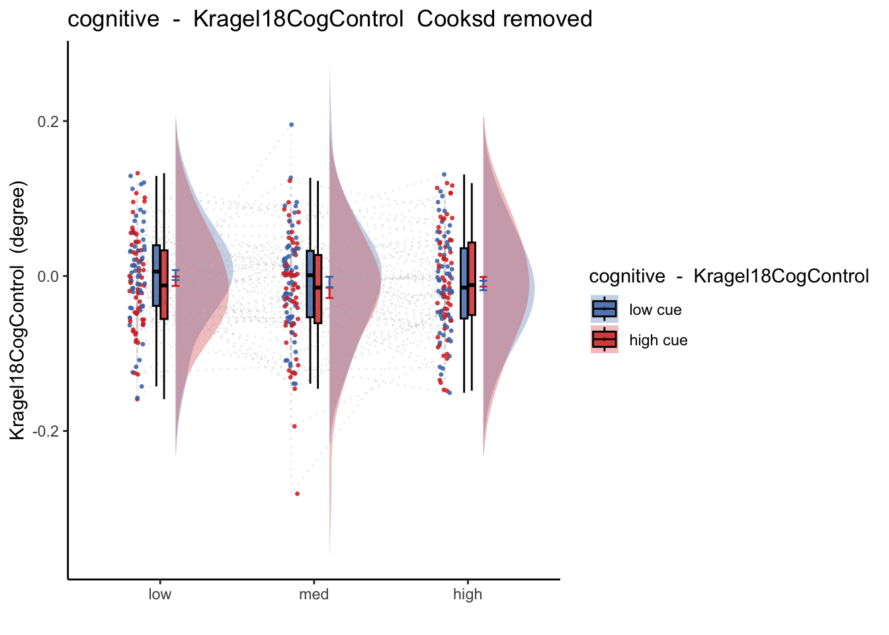


### Session 3: 2x3 stimulus intensity * cue 
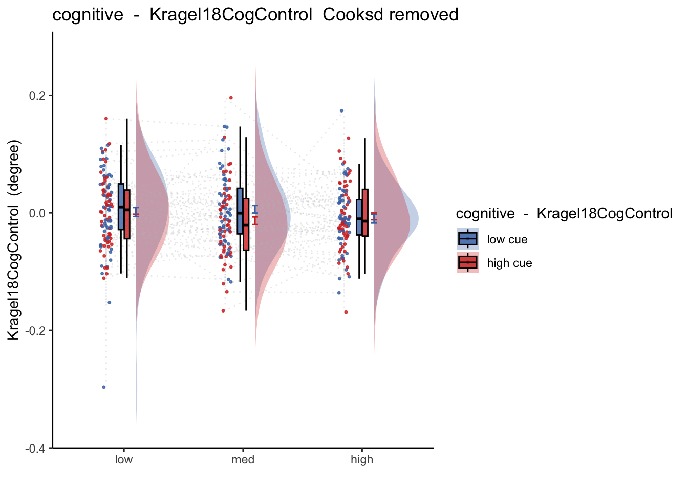


### Session 4: 2x3 stimulus intensity * cue 
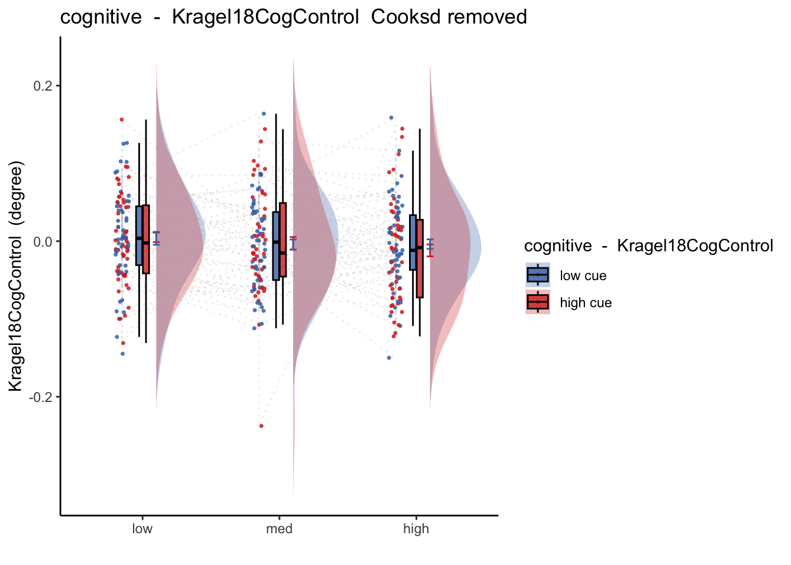


## Cognitive only: Outcome ratings & Kragel 2018

```r
# plot parameters
iv2 = "event04_actual_angle"; iv1 = signature_key
subject = "sub"
ylab = "Outcome rating"; xlab = signature_key
ggtitle = "All stimulus intensity"
alpha = 0.8; lm_method = "lm"
c.sig <- df_merge[df_merge$runtype == "runtype-cognitive",]
df_dropna <- c.sig[!is.na(c.sig[, iv1]) & !is.na(c.sig[, iv2]), ]
subjectwise_2dv <- meanSummary_2dv(
        df_dropna, c(subject), iv1, iv2
        )
    subjectwise_naomit_2dv <- na.omit(subjectwise_2dv)
    g <- ggplot(
        data = subjectwise_naomit_2dv,
        aes(
            x = .data[["DV1_mean_per_sub"]],
            y = .data[["DV2_mean_per_sub"]],
        )
    ) +
        geom_point(
          size = 2,
            alpha = alpha) +
        # geom_abline(
        #     intercept = 0, slope = 1, color = "green",
        #     linetype = "dashed", linewidth = 0.5
        # ) +
        theme(aspect.ratio = 1) +
        #scale_color_manual(values = color_scheme) +
        scale_shape_manual(values = c(16, 17)) +
        xlab(xlab) +
        ylab(ylab) +
        xlim(-0.25, 0.25) +
        ylim(0,100) +
        ggtitle(ggtitle) +
        theme(
            axis.line = element_line(colour = "grey50"),
            panel.background = element_blank(),
            plot.subtitle = ggtext::element_textbox_simple(size = 11)
        ) +
              geom_ribbon(stat = "smooth", method = lm_method, se = TRUE, alpha = 0.1,
              aes(color = NULL)) +
        geom_line(stat = "smooth", method = lm_method, alpha = 0.8, size = 1.5)
```

```
## Warning: Using `size` aesthetic for lines was deprecated in ggplot2 3.4.0.
## ℹ Please use `linewidth` instead.
```

```r
    g
```

```
## `geom_smooth()` using formula = 'y ~ x'
## `geom_smooth()` using formula = 'y ~ x'
```

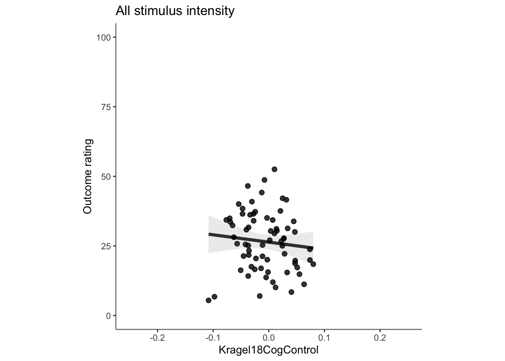

### outcome ratings * cue

```r
c.sig <- df_merge[df_merge$runtype == "runtype-cognitive",]
iv2 = "event04_actual_angle"; iv1 = signature_key
df_dropna <- c.sig[!is.na(c.sig[, iv1]) & !is.na(c.sig[, iv2]), ]
total <-
  plot_twovariable(
    df_dropna, iv1, iv2,
    group = "cuetype", subject = "sub",
    ymin=0, ymax=100, xmin=-.25, xmax=.25,
    ylab = "Outcome rating", xlab = signature_key,
    ggtitle = "all stimulus intensity", 
    color_scheme = c("cuetype-high" ="#011891","cuetype-low" =  "#BBBBBB"), 
    alpha = .8, fit_lm = TRUE, lm_method ="lm"
  )
total + labs(title =paste0("task-",taskname, "- What is the pattern for NPS pos dotproduct and expect ratings? \nHow is does this pattern differ depending on high vs low cues?\n\n")
          )
```

```
## `geom_smooth()` using formula = 'y ~ x'
## `geom_smooth()` using formula = 'y ~ x'
```

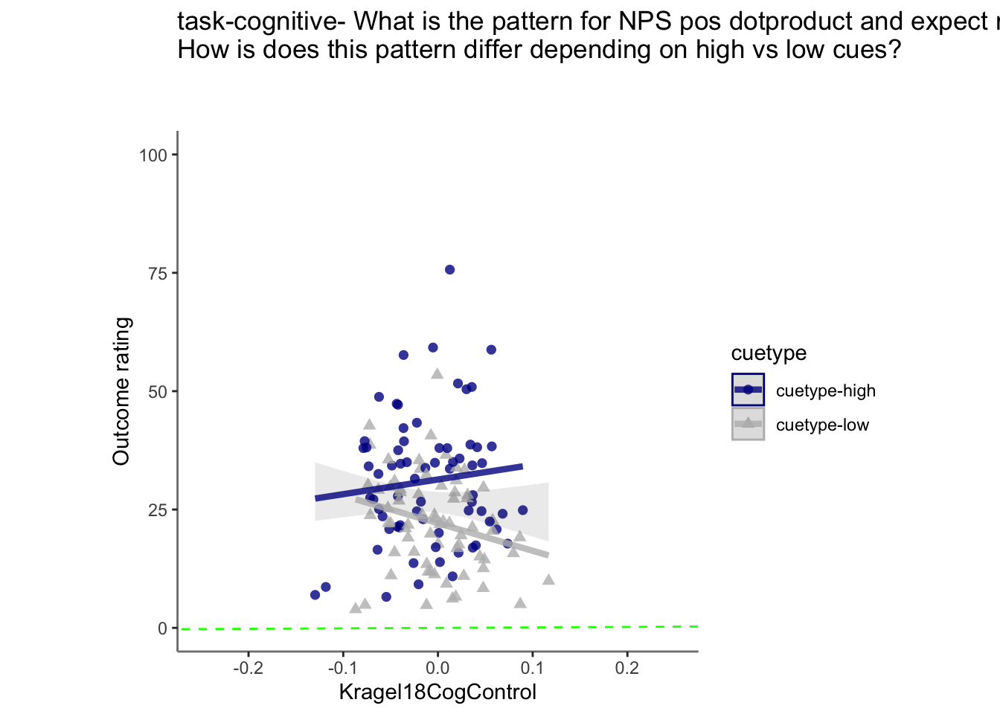
### outcome ratings * stim * cue
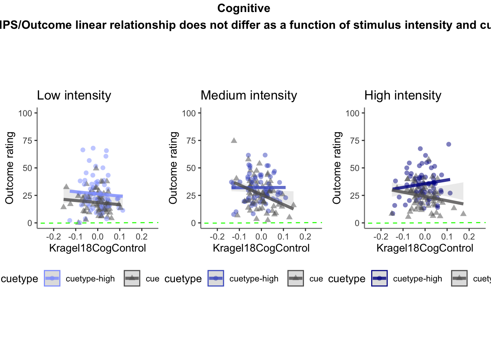


## Cognitive only: Expectation ratings & NPS

```r
c.sig <- df_merge[df_merge$runtype == "runtype-cognitive",]
iv1 = "event02_expect_angle"; iv2 = signature_key
df_dropna <- c.sig[!is.na(c.sig[, iv1]) & !is.na(c.sig[, iv2]), ]
total <-
  plot_twovariable(
    df_dropna, iv1, iv2,
    group = "cuetype", subject = "sub",
    xmin =0, xmax = 100, ymin = -.25, ymax = .25,
    xlab = "expectation rating",
    ylab = signature_key, 
    ggtitle = "all stimulus intensity", 
    color_scheme = c("cuetype-high" ="#011891","cuetype-low" =  "#BBBBBB"), 
    alpha = .8, fit_lm = TRUE, lm_method = "lm"
  )
total + labs(title =paste0("task-",taskname, " - What is the pattern for ", signature_key,"dotproduct and expect ratings? \nHow is does this pattern differ depending on high vs low cues?\n\n"))
```

```
## `geom_smooth()` using formula = 'y ~ x'
## `geom_smooth()` using formula = 'y ~ x'
```

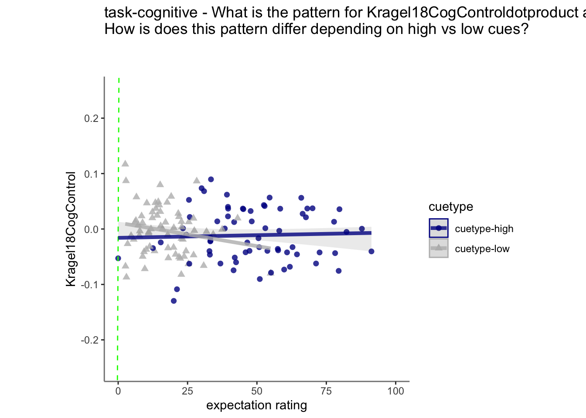


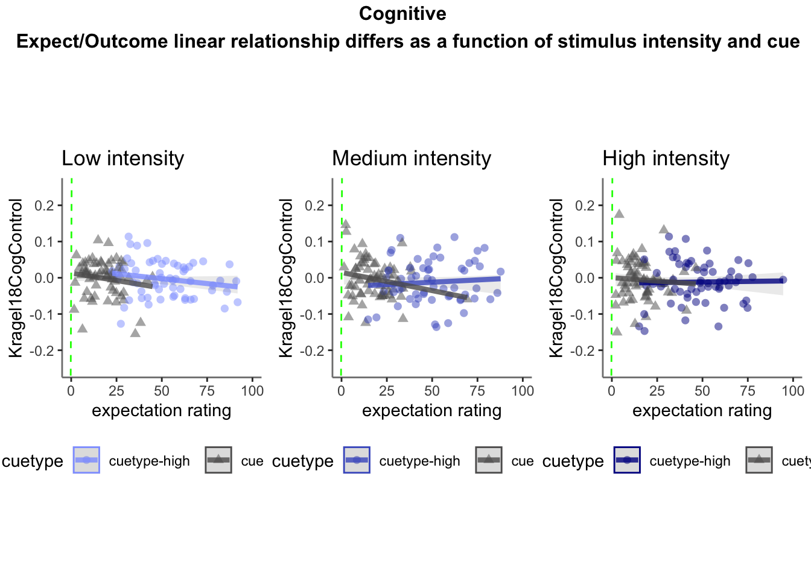


