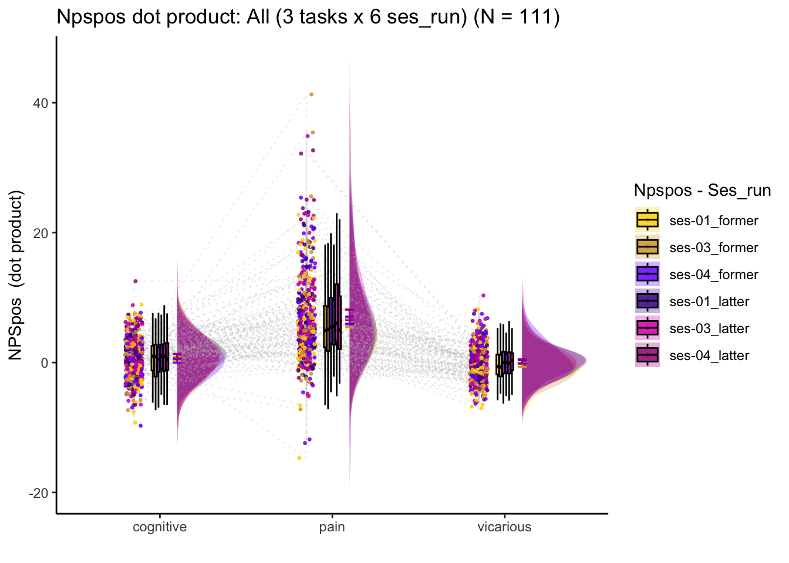

# single trial QC {#singletrialqc}

## What is the purpose of this notebook? {.unlisted .unnumbered}
* The single trials and the univariate maps seems different, in the sense that the NPS extracted values are non-significant for the dummy univariate maps; the single trials are significant. 
* Here, I test whether the order of single trials and session order has signficantly different values for NPS

## Reference {.unlisted .unnumbered}
https://aosmith.rbind.io/2019/04/15/custom-contrasts-emmeans/
https://aosmith.rbind.io/2019/04/15/custom-contrasts-emmeans/#:~:text=Building%20a%20custom%20contrast%20involves,0%20to%20the%20other%20groups.


## functions


## load data {.unlisted .unnumbered}


## trial-order wise {.unlisted .unnumbered}
The purpose is to check whether trial orders have a systematic differences in average BOLD intensity, or more specifically, average NPS responses. 
As we can see, the first trials always have higher NPS responses. 
TODO: run a stats test to see if there a significant difference


### linear model: 
Q. Is this trial effect only prominent in the pain task? 
Q. Is this trial effect only present for the first trial of the run?


```r
pvc$trial_num <- as.numeric(as.factor(pvc$trial))
model <-  lmer(NPSpos ~ task * trial_num + (1|sub), data = pvc)
Anova(model, type = "III")
```

```
## Analysis of Deviance Table (Type III Wald chisquare tests)
## 
## Response: NPSpos
##                   Chisq Df Pr(>Chisq)    
## (Intercept)     15.2078  1  9.630e-05 ***
## task           844.3786  2  < 2.2e-16 ***
## trial_num        2.3815  1     0.1228    
## task:trial_num  22.5566  2  1.264e-05 ***
## ---
## Signif. codes:  0 '***' 0.001 '**' 0.01 '*' 0.05 '.' 0.1 ' ' 1
```


```r
pain = pvc[pvc$runtype == 'runtype-pain',]
pain$trialorder = as.numeric(factor(pain$trial))

# helmert_contrasts
pain$trialorder_levels <- factor(pain$trialorder, 
                                   levels=c(1,2,3,4,5,6,7,8,9,10,11,12))
pain$trial_con  = factor(pain$trialorder_levels)

# contrasts(pain$trial_con) <- contrast_list
model = lmer(NPSpos ~ trial_con + (trial_con|sub), data = pain) #, contrasts = (trial_con = contrast_list))
```

```
## boundary (singular) fit: see help('isSingular')
```

```
## Warning: Model failed to converge with 7 negative eigenvalues: -3.9e-02 -1.4e-01
## -9.2e+00 -2.8e+01 -1.5e+02 -2.3e+02 -7.4e+02
```

```r
summary(model)
```

```
## Linear mixed model fit by REML. t-tests use Satterthwaite's method [
## lmerModLmerTest]
## Formula: NPSpos ~ trial_con + (trial_con | sub)
##    Data: pain
## 
## REML criterion at convergence: 43511.1
## 
## Scaled residuals: 
##     Min      1Q  Median      3Q     Max 
## -5.8255 -0.4983 -0.0031  0.5013  7.0855 
## 
## Random effects:
##  Groups   Name        Variance Std.Dev. Corr                                   
##  sub      (Intercept) 17.2024  4.1476                                          
##           trial_con2   0.2281  0.4776   1.00                                   
##           trial_con3   2.1404  1.4630   0.84 0.84                              
##           trial_con4   3.5478  1.8836   0.76 0.76 0.99                         
##           trial_con5   2.8556  1.6898   0.50 0.50 0.54 0.53                    
##           trial_con6   3.7493  1.9363   0.74 0.74 0.72 0.68 0.81               
##           trial_con7   2.8812  1.6974   0.66 0.66 0.74 0.72 0.44 0.86          
##           trial_con8   1.6353  1.2788   0.69 0.69 0.70 0.67 0.35 0.82 0.99     
##           trial_con9   5.1309  2.2652   0.39 0.39 0.61 0.63 0.67 0.86 0.87 0.80
##           trial_con10  5.9116  2.4314   0.63 0.63 0.87 0.88 0.38 0.74 0.93 0.90
##           trial_con11  7.5595  2.7495   0.48 0.48 0.72 0.76 0.80 0.54 0.27 0.17
##           trial_con12  6.0055  2.4506   0.83 0.83 0.96 0.95 0.56 0.84 0.89 0.86
##  Residual             75.2754  8.6761                                          
##                
##                
##                
##                
##                
##                
##                
##                
##                
##                
##  0.82          
##  0.46 0.45     
##  0.76 0.94 0.61
##                
## Number of obs: 6024, groups:  sub, 109
## 
## Fixed effects:
##              Estimate Std. Error        df t value Pr(>|t|)    
## (Intercept)    9.7297     0.5569  115.0739  17.472  < 2e-16 ***
## trial_con2    -3.2064     0.5496 2818.6851  -5.834 6.01e-09 ***
## trial_con3    -3.1029     0.5658  573.6654  -5.484 6.24e-08 ***
## trial_con4    -2.3149     0.5778  337.9044  -4.007 7.58e-05 ***
## trial_con5    -3.3743     0.5729  387.5107  -5.890 8.38e-09 ***
## trial_con6    -2.6776     0.5795  362.0454  -4.620 5.34e-06 ***
## trial_con7    -3.3685     0.5725  423.0720  -5.884 8.17e-09 ***
## trial_con8    -2.6285     0.5619  746.5279  -4.678 3.44e-06 ***
## trial_con9    -3.5921     0.5925  130.0397  -6.063 1.36e-08 ***
## trial_con10   -2.9773     0.5977  208.3369  -4.981 1.33e-06 ***
## trial_con11   -3.1629     0.6122  146.5644  -5.167 7.66e-07 ***
## trial_con12   -3.8724     0.5972  253.3552  -6.485 4.63e-10 ***
## ---
## Signif. codes:  0 '***' 0.001 '**' 0.01 '*' 0.05 '.' 0.1 ' ' 1
## 
## Correlation of Fixed Effects:
##             (Intr) trl_c2 trl_c3 trl_c4 trl_c5 trl_c6 trl_c7 trl_c8 trl_c9
## trial_con2  -0.430                                                        
## trial_con3  -0.327  0.500                                                 
## trial_con4  -0.296  0.492  0.538                                          
## trial_con5  -0.369  0.488  0.501  0.501                                   
## trial_con6  -0.295  0.491  0.515  0.516  0.529                            
## trial_con7  -0.337  0.492  0.516  0.518  0.493  0.533                     
## trial_con8  -0.372  0.498  0.510  0.508  0.488  0.520  0.531              
## trial_con9  -0.354  0.472  0.504  0.513  0.516  0.544  0.539  0.518       
## trial_con10 -0.275  0.477  0.530  0.545  0.480  0.528  0.547  0.526  0.548
## trial_con11 -0.294  0.463  0.513  0.531  0.532  0.499  0.460  0.450  0.490
## trial_con12 -0.218  0.484  0.540  0.554  0.502  0.541  0.542  0.523  0.539
##             trl_10 trl_11
## trial_con2               
## trial_con3               
## trial_con4               
## trial_con5               
## trial_con6               
## trial_con7               
## trial_con8               
## trial_con9               
## trial_con10              
## trial_con11  0.486       
## trial_con12  0.571  0.516
## optimizer (nloptwrap) convergence code: 0 (OK)
## boundary (singular) fit: see help('isSingular')
```
### trial order emmeans

```
## Note: D.f. calculations have been disabled because the number of observations exceeds 4000.
## To enable adjustments, add the argument 'pbkrtest.limit = 6024' (or larger)
## [or, globally, 'set emm_options(pbkrtest.limit = 6024)' or larger];
## but be warned that this may result in large computation time and memory use.
```

```
##  contrast                         estimate    SE   df t.ratio p.value
##  first trial vs others             3.11615 0.433  262   7.197  <.0001
##  early 6 trials vs later 6 trials  0.33173 0.247  289   1.344  0.9002
##  2nd trial vs others              -0.09928 0.429  294  -0.232  1.0000
##  3rd trial vs others               0.00471 0.416  487   0.011  1.0000
##  4th trial vs others               0.89177 0.421  420   2.116  0.3545
##  5th trial vs others              -0.19151 0.437  270  -0.438  1.0000
##  6th trial vs others               0.58936 0.429  485   1.375  0.8861
##  7th trial vs others              -0.12187 0.434  523  -0.281  1.0000
##  8th trial vs others               0.77264 0.455  238   1.696  0.6762
##  9th trial vs others              -0.25460 0.473  223  -0.538  1.0000
##  10th trial vs others              0.54038 0.503  239   1.075  0.9783
##  11th trial vs 12th trial          6.21207 0.644  104   9.645  <.0001
##  1st trial vs 2nd trial            3.20640 0.550 2819   5.834  <.0001
##  12trial vs 2-11th trial          -0.83184 0.420  531  -1.983  0.4497
## 
## Degrees-of-freedom method: satterthwaite 
## P value adjustment: mvt method for 14 tests
```

```
Discussion:
* 1st trial has high NPS values compared to other consecutive trials, across participants (t(262) = 7.197, p < .0001)
* The next thought was that there would be a linear trend. However, note that 2nd trial is not significantly different from the other trials, t(294) = -0.232, N.S. In other words, there is not linear detrending effect across trials. 
* The last and 2nd-to-last trial (11th trial and 12th trial) are significantly different, t(104) = 9.645, p < .0001.
* However, it's not like the last trial is different from all others. 12th trial is not significantly different from the average of 2-11 trials, t(531) = -1.983, N.S.
```


## run wise {.unlisted .unnumbered}



### linear model: run/ses wise
```
lmer(NPSpos ~ task*ses_run_con + (task|sub), data = pvc)
```

```r
pvc$ses_run_con <- as.factor(pvc$ses_run)
contrasts(pvc$ses_run_con) = contr.poly(6)
model_run <-  lmer(NPSpos ~ task*ses_run_con + (task|sub), data = pvc)
Anova(model_run, type = "III")
```

```
## Analysis of Deviance Table (Type III Wald chisquare tests)
## 
## Response: NPSpos
##                     Chisq Df Pr(>Chisq)    
## (Intercept)       17.8951  1  2.334e-05 ***
## task             165.9115  2  < 2.2e-16 ***
## ses_run_con        6.4109  5   0.268267    
## task:ses_run_con  24.7977 10   0.005742 ** 
## ---
## Signif. codes:  0 '***' 0.001 '**' 0.01 '*' 0.05 '.' 0.1 ' ' 1
```

```r
summary(model_run)
```

```
## Linear mixed model fit by REML. t-tests use Satterthwaite's method [
## lmerModLmerTest]
## Formula: NPSpos ~ task * ses_run_con + (task | sub)
##    Data: pvc
## 
## REML criterion at convergence: 133157.6
## 
## Scaled residuals: 
##     Min      1Q  Median      3Q     Max 
## -7.4195 -0.4787  0.0083  0.5021  8.7483 
## 
## Random effects:
##  Groups   Name          Variance Std.Dev. Corr       
##  sub      (Intercept)    2.394   1.547               
##           taskpain      30.314   5.506    -0.21      
##           taskvicarious  1.656   1.287    -0.62  0.05
##  Residual               53.798   7.335               
## Number of obs: 19428, groups:  sub, 111
## 
## Fixed effects:
##                               Estimate Std. Error         df t value Pr(>|t|)
## (Intercept)                  7.393e-01  1.748e-01  1.079e+02   4.230 4.91e-05
## taskpain                     6.214e+00  5.460e-01  1.070e+02  11.381  < 2e-16
## taskvicarious               -8.269e-01  1.788e-01  1.037e+02  -4.624 1.09e-05
## ses_run_con.L                2.936e-01  2.209e-01  1.914e+04   1.329 0.183807
## ses_run_con.Q                2.045e-01  2.194e-01  1.913e+04   0.932 0.351130
## ses_run_con.C               -3.229e-01  2.230e-01  1.865e+04  -1.448 0.147743
## ses_run_con^4                7.937e-03  2.242e-01  1.822e+04   0.035 0.971757
## ses_run_con^5                2.940e-01  2.222e-01  1.896e+04   1.324 0.185684
## taskpain:ses_run_con.L       1.146e+00  3.246e-01  1.923e+04   3.532 0.000414
## taskvicarious:ses_run_con.L  2.598e-01  3.116e-01  1.904e+04   0.834 0.404407
## taskpain:ses_run_con.Q      -2.301e-01  3.196e-01  1.913e+04  -0.720 0.471593
## taskvicarious:ses_run_con.Q -4.395e-01  3.104e-01  1.915e+04  -1.416 0.156828
## taskpain:ses_run_con.C       7.751e-02  3.297e-01  1.912e+04   0.235 0.814134
## taskvicarious:ses_run_con.C  2.674e-01  3.133e-01  1.820e+04   0.854 0.393297
## taskpain:ses_run_con^4      -4.715e-01  3.309e-01  1.904e+04  -1.425 0.154154
## taskvicarious:ses_run_con^4  1.397e-01  3.142e-01  1.752e+04   0.445 0.656609
## taskpain:ses_run_con^5      -7.010e-01  3.258e-01  1.919e+04  -2.152 0.031423
## taskvicarious:ses_run_con^5 -6.059e-01  3.127e-01  1.875e+04  -1.938 0.052654
##                                
## (Intercept)                 ***
## taskpain                    ***
## taskvicarious               ***
## ses_run_con.L                  
## ses_run_con.Q                  
## ses_run_con.C                  
## ses_run_con^4                  
## ses_run_con^5                  
## taskpain:ses_run_con.L      ***
## taskvicarious:ses_run_con.L    
## taskpain:ses_run_con.Q         
## taskvicarious:ses_run_con.Q    
## taskpain:ses_run_con.C         
## taskvicarious:ses_run_con.C    
## taskpain:ses_run_con^4         
## taskvicarious:ses_run_con^4    
## taskpain:ses_run_con^5      *  
## taskvicarious:ses_run_con^5 .  
## ---
## Signif. codes:  0 '***' 0.001 '**' 0.01 '*' 0.05 '.' 0.1 ' ' 1
```

```
## 
## Correlation matrix not shown by default, as p = 18 > 12.
## Use print(x, correlation=TRUE)  or
##     vcov(x)        if you need it
```

### emmeans run wise

```r
# https://aosmith.rbind.io/2019/04/15/custom-contrasts-emmeans/
emm_options(pbkrtest.limit = 12000, lmerTest.limit = 12000)
emm <- emmeans(model_run,specs = ~task:ses_run_con, pbkrtest.limit = 12000)
```

```
## Note: D.f. calculations have been disabled because the number of observations exceeds 12000.
## To enable adjustments, add the argument 'pbkrtest.limit = 19428' (or larger)
## [or, globally, 'set emm_options(pbkrtest.limit = 19428)' or larger];
## but be warned that this may result in large computation time and memory use.
```

```
## Note: D.f. calculations have been disabled because the number of observations exceeds 12000.
## To enable adjustments, add the argument 'lmerTest.limit = 19428' (or larger)
## [or, globally, 'set emm_options(lmerTest.limit = 19428)' or larger];
## but be warned that this may result in large computation time and memory use.
```

```r
painLinear = c(0,0,0,0,0,0,-0.5976143,-0.3585686, -0.1195229,0.1195229,0.3585686,0.5976143,0,0,0,0,0,0)

contrast(emm, method = list("painlinear" = painLinear),
         adjust = "mvt") 
```

```
##  contrast   estimate    SE  df z.ratio p.value
##  painlinear   -0.141 0.235 Inf  -0.598  0.5495
## 
## Degrees-of-freedom method: asymptotic
```

