# [fMRI] ROI ~ cue * stim {#ch41_painpathway}

## What is the purpose of this notebook? {.unlisted .unnumbered}
* Here, I model NPS dot products as a function of cue, stimulus intensity and expectation ratings.
* One of the findings is that low cues lead to higher NPS dotproducts in the high intensity group, and that this effect becomes non-significant across sessions.
* 03/23/2023: For now, I'm grabbing participants that have complete data, i.e. 18 runs, all three sessions.


## common parameters

```r
main_dir = dirname(dirname(getwd()))
print(main_dir)
```

```
## [1] "/Users/h/Dropbox (Dartmouth College)/projects_dropbox/social_influence_analysis"
```

```r
exclude_list <- "sub-0001|sub-0002|sub-0003|sub-0004|sub-0005|sub-0007|sub-0008|sub-0013|sub-0016|sub-0017|sub-0019|sub-0020|sub-0021|sub-0025|sub-0075"
```


```r
## load brain extracted values {.unlisted .unnumbered}
extraction_fname = '/Users/h/Dropbox/projects_dropbox/social_influence_analysis/analysis/fmri/nilearn/signature_canlabcore/roi-painpathway_sub-all_runtype-pvc_event-stimulus.csv'
brain.df <- load_extraction(fname = extraction_fname)
head(brain.df)
```

```
##   Thal_VPLM_R Thal_VPLM_L     Thal_MD    dpIns_L     dpIns_R   aMCC_MPFC
## 1 -0.40824360  0.05623318  0.39523301 -0.3265142 -0.23427893 -0.35453591
## 2  0.61643428  1.45565188  2.63185191  1.1359142  1.10305393  0.84601259
## 3  0.16190505 -0.51763445 -0.21110538 -0.2966219 -0.34322661 -0.68279624
## 4  0.27362254  0.24603392  1.40747046  0.2938125  0.10848080  0.31231993
## 5 -0.09862687  0.38056991  1.43355429  0.2300755 -0.06363615  0.06286529
## 6  0.07230759  0.23984034  0.06749836  0.3386498  0.04078389  0.02369536
##        sub    ses    run           runtype      task          event     trial
## 1 sub-0002 ses-03 run-01 runtype-vicarious vicarious event-stimulus trial-000
## 2 sub-0002 ses-03 run-01 runtype-vicarious vicarious event-stimulus trial-001
## 3 sub-0002 ses-03 run-01 runtype-vicarious vicarious event-stimulus trial-002
## 4 sub-0002 ses-03 run-01 runtype-vicarious vicarious event-stimulus trial-003
## 5 sub-0002 ses-03 run-01 runtype-vicarious vicarious event-stimulus trial-004
## 6 sub-0002 ses-03 run-01 runtype-vicarious vicarious event-stimulus trial-005
##        cuetype stimintensity
## 1  cuetype-low           low
## 2 cuetype-high           med
## 3 cuetype-high           low
## 4 cuetype-high          high
## 5  cuetype-low           med
## 6  cuetype-low          high
```

```r
## load behavioral data {.unlisted .unnumbered}
beh.df <- load_pvc_beh(datadir = file.path(main_dir, 'data', 'beh', 'beh02_preproc'),
             subject_varkey = "src_subject_id",
             iv = "param_stimulus_type",
             dv = "event04_actual_angle", 
             exclude = exclude_list)
```


## merge two dataframes {.unlisted .unnumbered}

```r
beh.df.sub <- beh.df[,c("sub", "ses", "run", "runtype", "trial", "cuetype", "stimintensity","event02_expect_angle", "event04_actual_angle")]
pvc <- merge(brain.df, beh.df.sub, 
                  by.x = c("sub", "ses", "run", "runtype", "trial", "cuetype", "stimintensity"),
                  by.y = c("sub", "ses", "run", "runtype", "trial", "cuetype", "stimintensity")
                  )
pvc.df <- simple_contrast_singletrial(pvc)
```

## plot task x intensity

```
## ✔ Saving 'ropenscilabs/actions_sandbox/.github/workflows/deploy_bookdown.yml@master' to '.github/workflows/deploy_bookdown.yml'
## ✔ Saving 'ropenscilabs/actions_sandbox/.github/workflows/deploy_bookdown.yml@master' to '.github/workflows/deploy_bookdown.yml'
## Automatically converting the following non-factors to factors: task
## 
## ✔ Saving 'ropenscilabs/actions_sandbox/.github/workflows/deploy_bookdown.yml@master' to '.github/workflows/deploy_bookdown.yml'
## ✔ Saving 'ropenscilabs/actions_sandbox/.github/workflows/deploy_bookdown.yml@master' to '.github/workflows/deploy_bookdown.yml'
## Automatically converting the following non-factors to factors: task
```

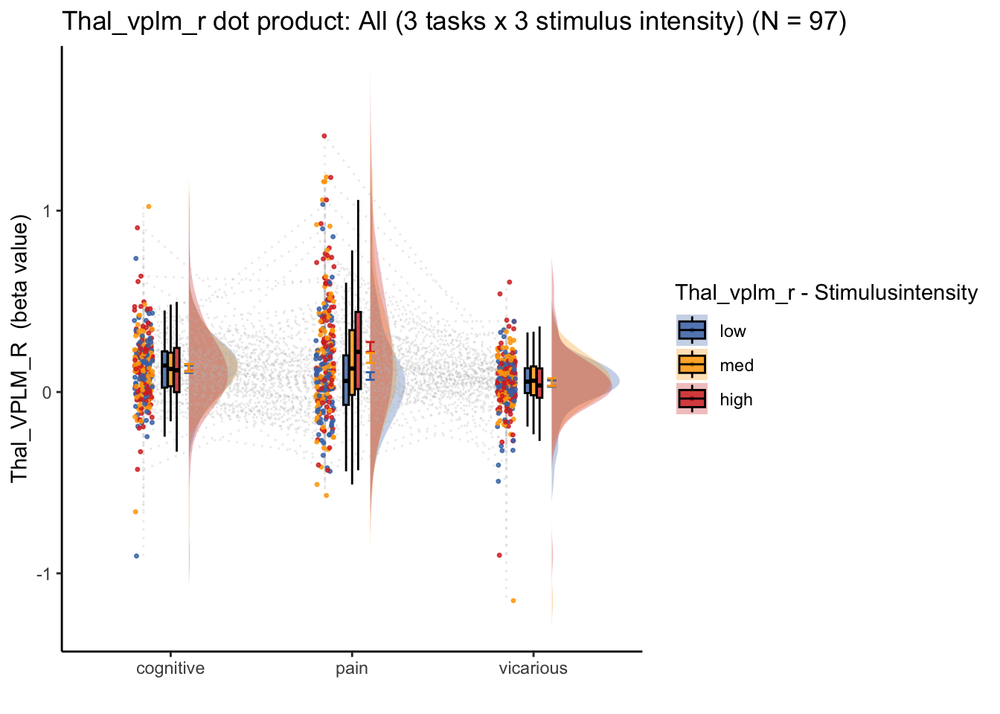

```
## ✔ Saving 'ropenscilabs/actions_sandbox/.github/workflows/deploy_bookdown.yml@master' to '.github/workflows/deploy_bookdown.yml'
## ✔ Saving 'ropenscilabs/actions_sandbox/.github/workflows/deploy_bookdown.yml@master' to '.github/workflows/deploy_bookdown.yml'
## Automatically converting the following non-factors to factors: task
```

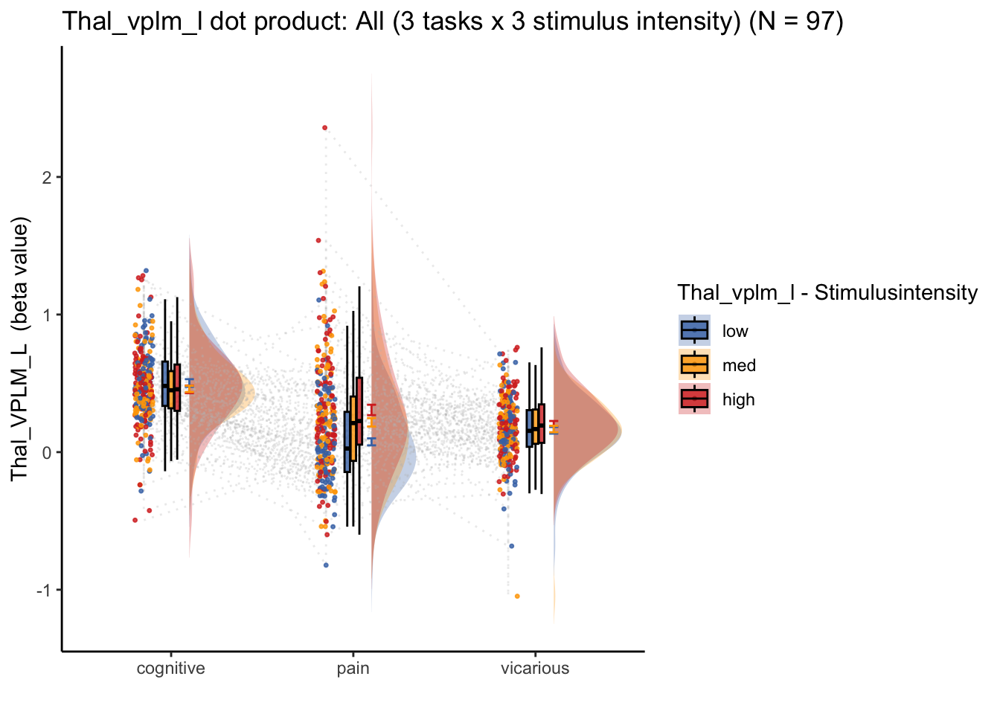

```
## ✔ Saving 'ropenscilabs/actions_sandbox/.github/workflows/deploy_bookdown.yml@master' to '.github/workflows/deploy_bookdown.yml'
## ✔ Saving 'ropenscilabs/actions_sandbox/.github/workflows/deploy_bookdown.yml@master' to '.github/workflows/deploy_bookdown.yml'
## Automatically converting the following non-factors to factors: task
```

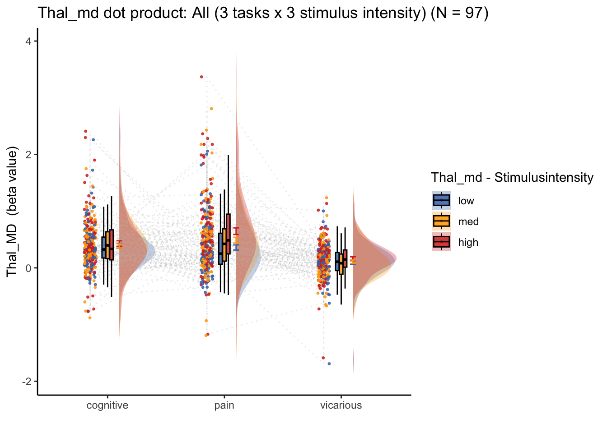

```
## ✔ Saving 'ropenscilabs/actions_sandbox/.github/workflows/deploy_bookdown.yml@master' to '.github/workflows/deploy_bookdown.yml'
## ✔ Saving 'ropenscilabs/actions_sandbox/.github/workflows/deploy_bookdown.yml@master' to '.github/workflows/deploy_bookdown.yml'
## Automatically converting the following non-factors to factors: task
```

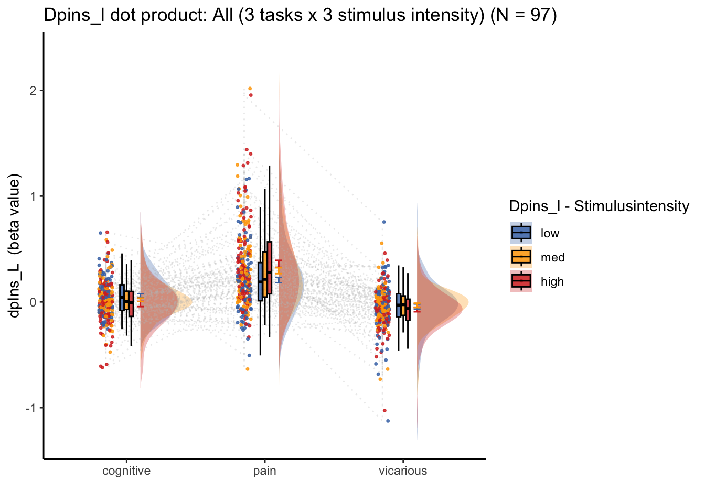

```
## ✔ Saving 'ropenscilabs/actions_sandbox/.github/workflows/deploy_bookdown.yml@master' to '.github/workflows/deploy_bookdown.yml'
## ✔ Saving 'ropenscilabs/actions_sandbox/.github/workflows/deploy_bookdown.yml@master' to '.github/workflows/deploy_bookdown.yml'
## Automatically converting the following non-factors to factors: task
```

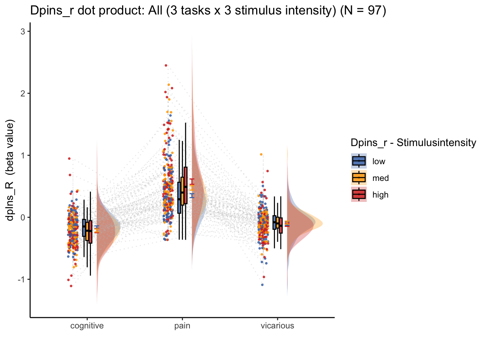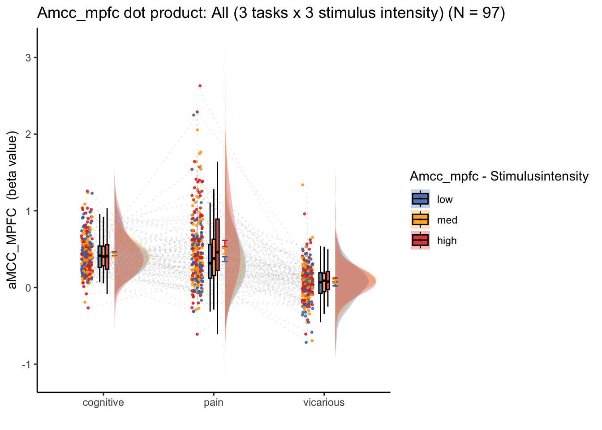

## plot cue x intensity

```
## ✔ Saving 'ropenscilabs/actions_sandbox/.github/workflows/deploy_bookdown.yml@master' to '.github/workflows/deploy_bookdown.yml'
## ✔ Saving 'ropenscilabs/actions_sandbox/.github/workflows/deploy_bookdown.yml@master' to '.github/workflows/deploy_bookdown.yml'
## ✔ Saving 'ropenscilabs/actions_sandbox/.github/workflows/deploy_bookdown.yml@master' to '.github/workflows/deploy_bookdown.yml'
```

```
## [1] "stim_ordered"
```

```
## ✔ Saving
## 'ropenscilabs/actions_sandbox/.github/workflows/deploy_bookdown.yml@master' to
## '.github/workflows/deploy_bookdown.yml'
```

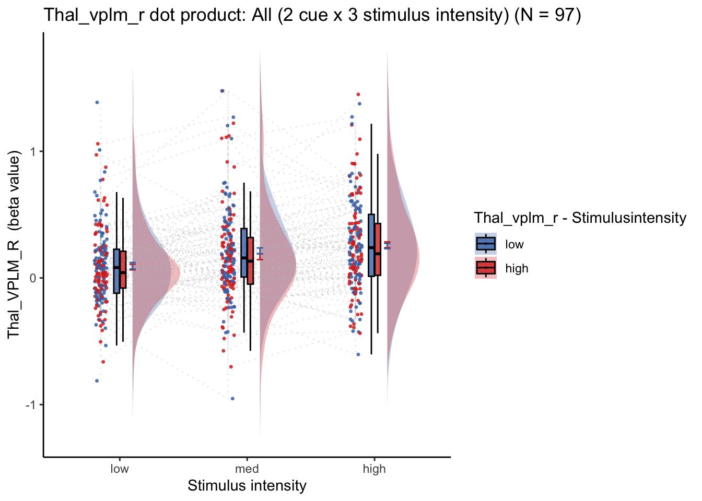

```
## ✔ Saving 'ropenscilabs/actions_sandbox/.github/workflows/deploy_bookdown.yml@master' to '.github/workflows/deploy_bookdown.yml'
## ✔ Saving 'ropenscilabs/actions_sandbox/.github/workflows/deploy_bookdown.yml@master' to '.github/workflows/deploy_bookdown.yml'
```

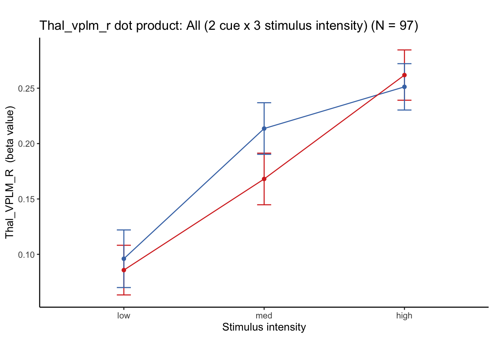

```
## ✔ Saving
## 'ropenscilabs/actions_sandbox/.github/workflows/deploy_bookdown.yml@master' to
## '.github/workflows/deploy_bookdown.yml'
```

```
## [1] "stim_ordered"
```

```
## ✔ Saving
## 'ropenscilabs/actions_sandbox/.github/workflows/deploy_bookdown.yml@master' to
## '.github/workflows/deploy_bookdown.yml'
```

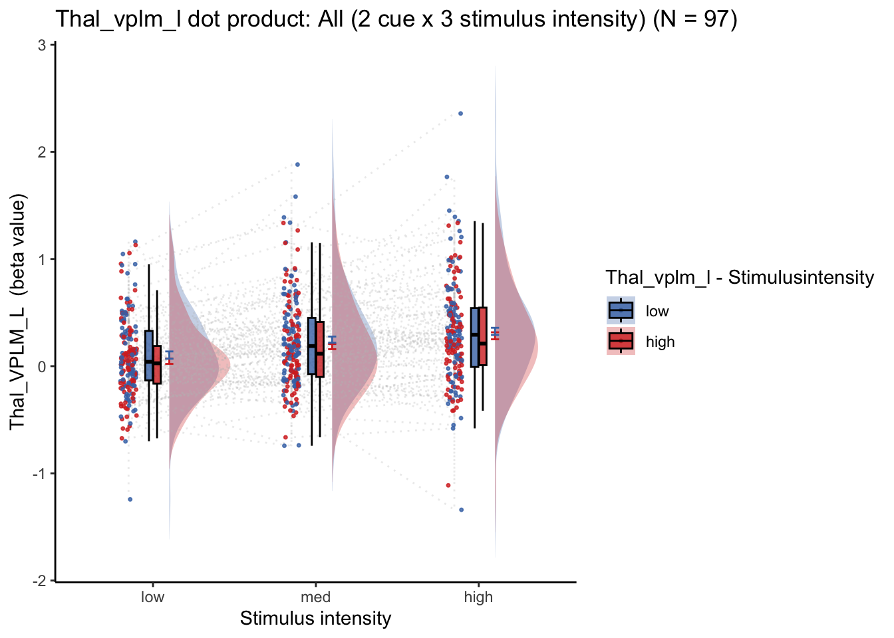

```
## ✔ Saving 'ropenscilabs/actions_sandbox/.github/workflows/deploy_bookdown.yml@master' to '.github/workflows/deploy_bookdown.yml'
## ✔ Saving 'ropenscilabs/actions_sandbox/.github/workflows/deploy_bookdown.yml@master' to '.github/workflows/deploy_bookdown.yml'
```

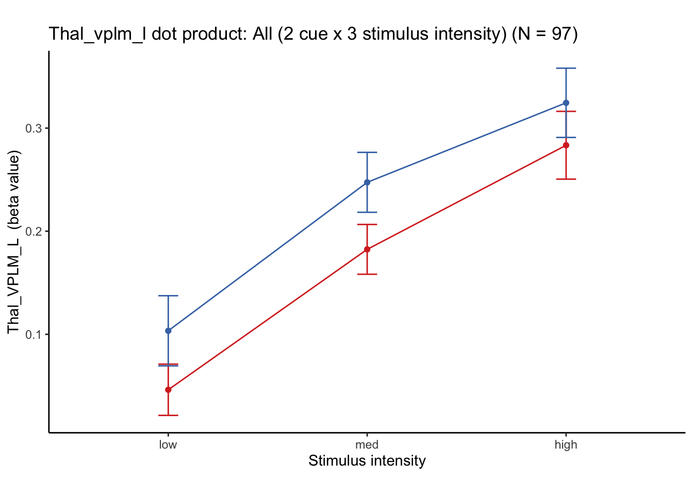

```
## ✔ Saving
## 'ropenscilabs/actions_sandbox/.github/workflows/deploy_bookdown.yml@master' to
## '.github/workflows/deploy_bookdown.yml'
```

```
## [1] "stim_ordered"
```

```
## ✔ Saving
## 'ropenscilabs/actions_sandbox/.github/workflows/deploy_bookdown.yml@master' to
## '.github/workflows/deploy_bookdown.yml'
```

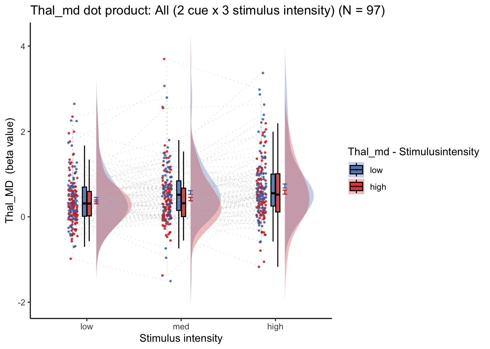

```
## ✔ Saving 'ropenscilabs/actions_sandbox/.github/workflows/deploy_bookdown.yml@master' to '.github/workflows/deploy_bookdown.yml'
## ✔ Saving 'ropenscilabs/actions_sandbox/.github/workflows/deploy_bookdown.yml@master' to '.github/workflows/deploy_bookdown.yml'
```

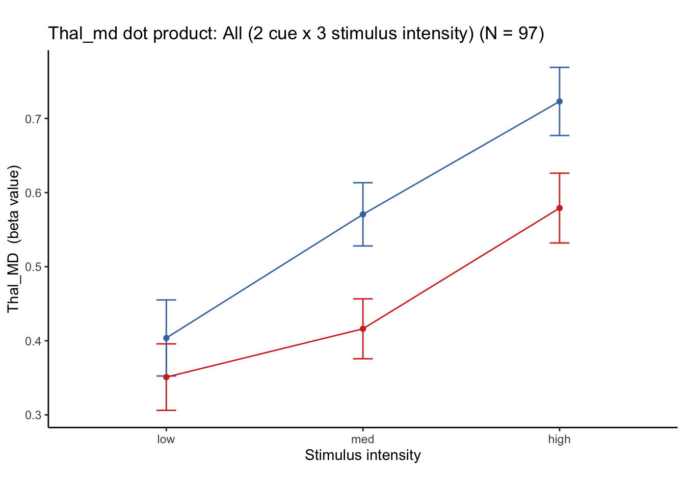

```
## ✔ Saving
## 'ropenscilabs/actions_sandbox/.github/workflows/deploy_bookdown.yml@master' to
## '.github/workflows/deploy_bookdown.yml'
```

```
## [1] "stim_ordered"
```

```
## ✔ Saving
## 'ropenscilabs/actions_sandbox/.github/workflows/deploy_bookdown.yml@master' to
## '.github/workflows/deploy_bookdown.yml'
```

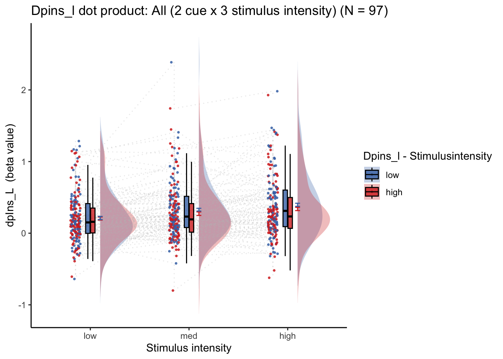

```
## ✔ Saving 'ropenscilabs/actions_sandbox/.github/workflows/deploy_bookdown.yml@master' to '.github/workflows/deploy_bookdown.yml'
## ✔ Saving 'ropenscilabs/actions_sandbox/.github/workflows/deploy_bookdown.yml@master' to '.github/workflows/deploy_bookdown.yml'
```

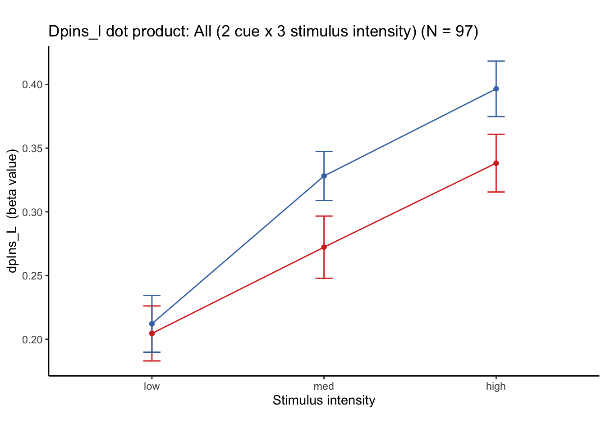

```
## ✔ Saving
## 'ropenscilabs/actions_sandbox/.github/workflows/deploy_bookdown.yml@master' to
## '.github/workflows/deploy_bookdown.yml'
```

```
## [1] "stim_ordered"
```

```
## ✔ Saving
## 'ropenscilabs/actions_sandbox/.github/workflows/deploy_bookdown.yml@master' to
## '.github/workflows/deploy_bookdown.yml'
```

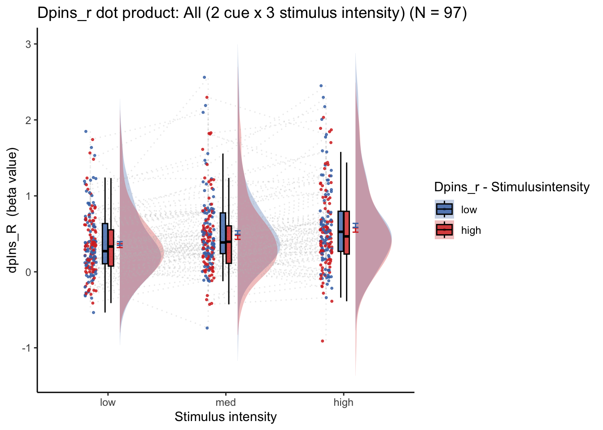

```
## ✔ Saving 'ropenscilabs/actions_sandbox/.github/workflows/deploy_bookdown.yml@master' to '.github/workflows/deploy_bookdown.yml'
## ✔ Saving 'ropenscilabs/actions_sandbox/.github/workflows/deploy_bookdown.yml@master' to '.github/workflows/deploy_bookdown.yml'
```

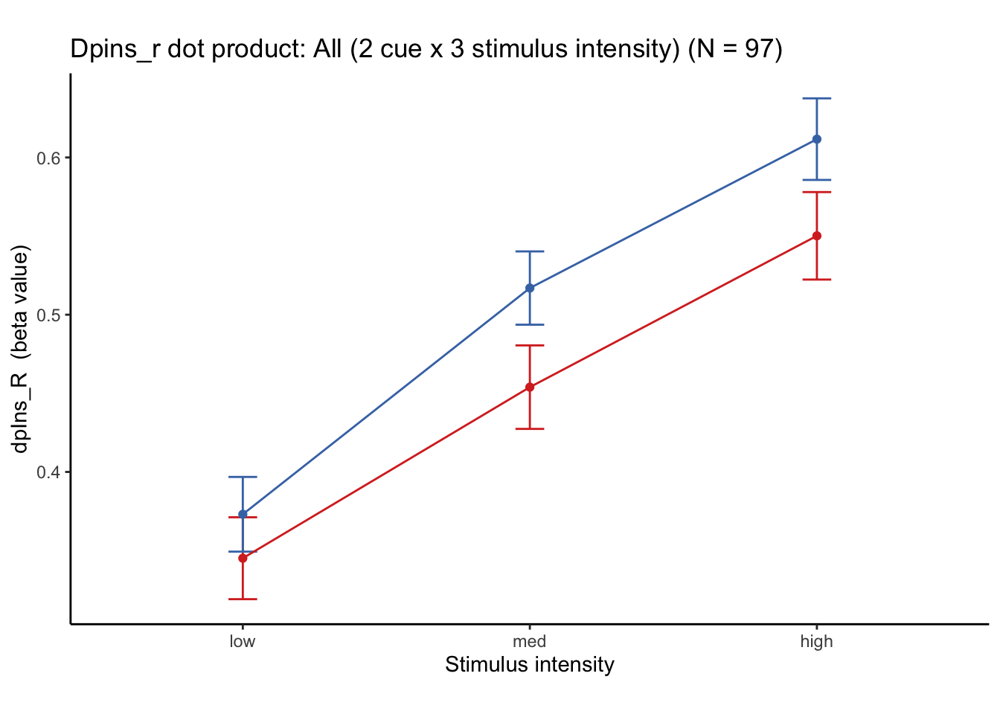

```
## ✔ Saving
## 'ropenscilabs/actions_sandbox/.github/workflows/deploy_bookdown.yml@master' to
## '.github/workflows/deploy_bookdown.yml'
```

```
## [1] "stim_ordered"
```

```
## ✔ Saving
## 'ropenscilabs/actions_sandbox/.github/workflows/deploy_bookdown.yml@master' to
## '.github/workflows/deploy_bookdown.yml'
```

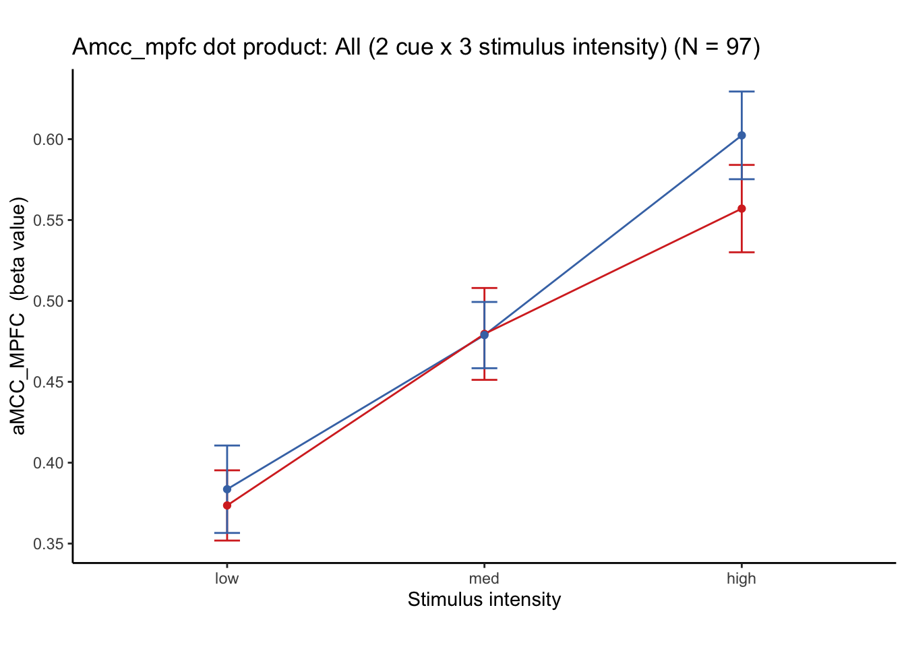

