# CCN figures

* Given that the brain results only includes 80 participants, I'm plotting the behavioral data with identical participants as well
* behavioral results

```
title: "CCN_figures"
author: "Heejung Jung"
date: "2023-04-06"
output: html_document
```


## behavioral outcome ratings ~ expectations * cue
Plot pain outcome rating as a function of expectation rating and cue {.unlisted .unnumbered}

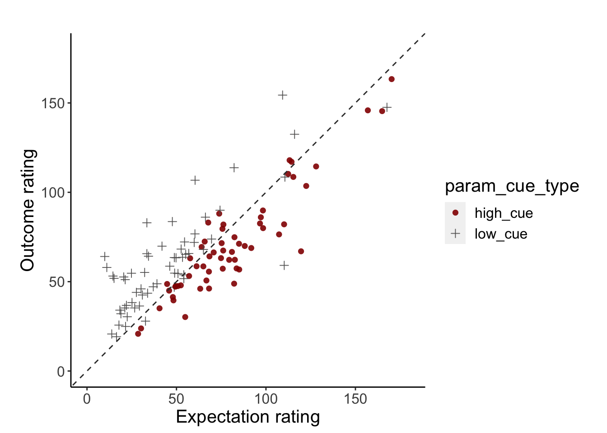

## behavioral demeaned (both)


```
## Warning: Using `size` aesthetic for lines was deprecated in ggplot2 3.4.0.
## ℹ Please use `linewidth` instead.
```

```
## `geom_smooth()` using formula = 'y ~ x'
```

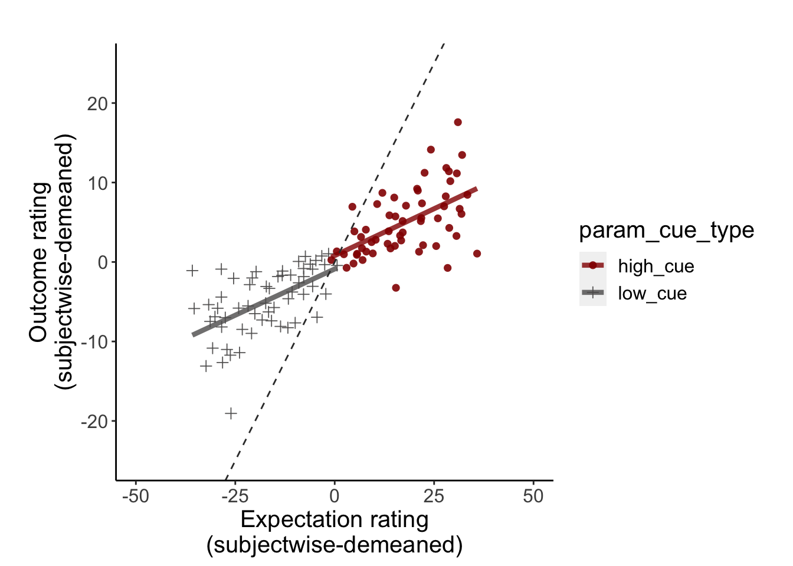
## behavioral only expectaiton deman


```r
# maindata <- pvc %>%
# group_by(src_subject_id, session_id, param_run_num) %>%
# mutate(event04_actual_angle = as.numeric(event04_actual_angle)) %>%
# mutate(event02_expect_angle = as.numeric(event02_expect_angle)) %>%
# mutate(avg_outcome = mean(event04_actual_angle, na.rm = TRUE)) %>%
# mutate(demean_outcome = event04_actual_angle - avg_outcome) %>%
# mutate(avg_expect = mean(event02_expect_angle, na.rm = TRUE)) %>%
# mutate(demean_expect = event02_expect_angle - avg_expect)


sp <- plot_twovariable(
  df = maindata, 
  iv1 = "demean_expect", iv2 = "event04_actual_angle",
  group = "param_cue_type", subject ="src_subject_id", 
  xmin=-50, xmax=50, ymin=0,ymax=180,
  xlab = "Expectation rating\n(subjectwise-demeaned)", ylab = "Outcome rating", 
  ggtitle="", color_scheme = c("high_cue" ="#941100","low_cue" =  "#5D5C5C"), 
  alpha = .9, fit_lm = TRUE, lm_method = "lm", identity_line=FALSE, size=NULL)

# Add description ______________________________________________________________
sp +  

  theme(text = element_text(size = 15)) +theme(aspect.ratio=1) +
  theme(axis.line = element_line(colour = "black"),
      panel.background = element_blank(),
      plot.subtitle = ggtext::element_textbox_simple(size= 11))
```

```
## `geom_smooth()` using formula = 'y ~ x'
```

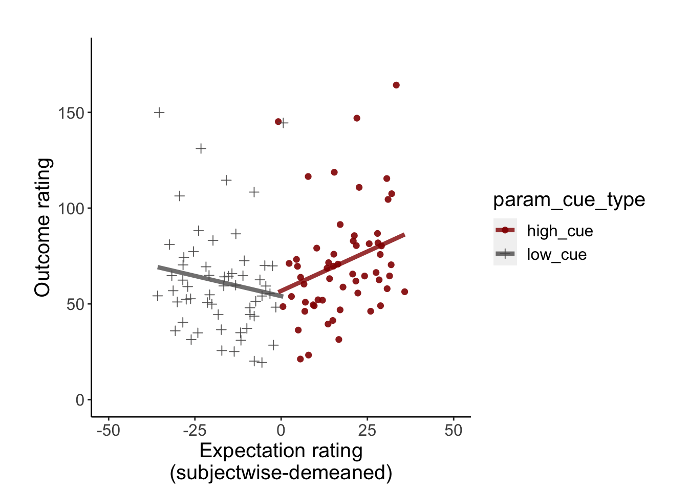

## behavioral :: line plot cue * stim (outcome demena)
### model 04 4-4 lineplot (demean)


## behavioral :: line plots cue * stim * intensity (demean outcome)
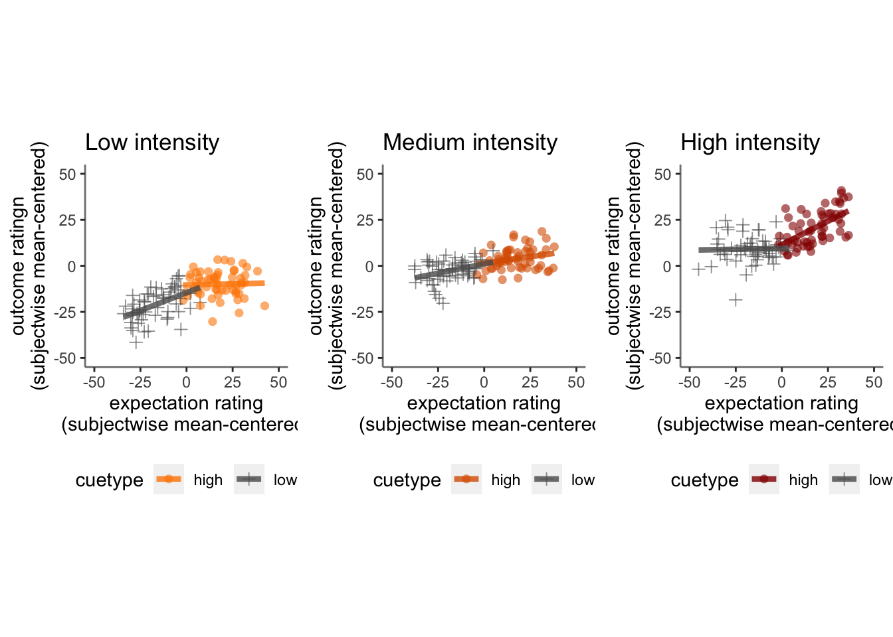
  
## behavioral :: line plots cue * stim * intensity (demean outcome)
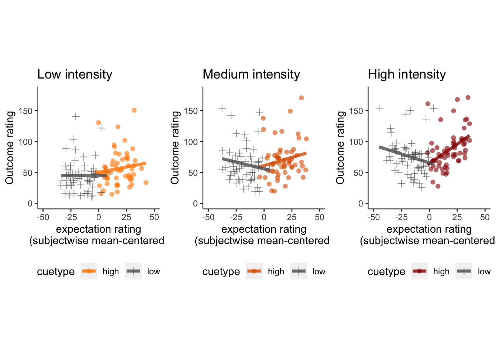

## NPS: stim * cue


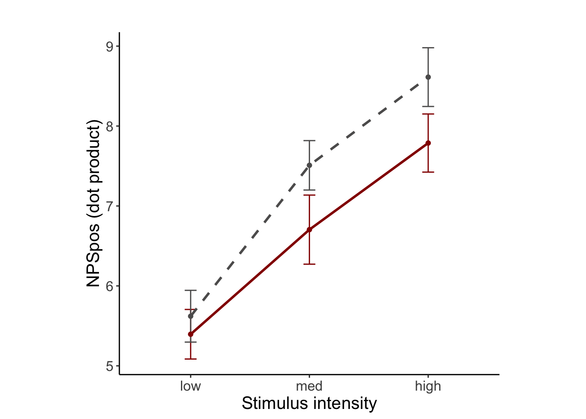
## NPS demeaned: stim*cue

```r
#  [ PLOT ] calculate mean and se  _________________________
NPSmaindata <- data_screen %>%
group_by(sub) %>%
mutate(event04_actual_angle = as.numeric(event04_actual_angle)) %>%
mutate(event02_expect_angle = as.numeric(event02_expect_angle)) %>%
mutate(avg_outcome = mean(event04_actual_angle, na.rm = TRUE)) %>%
mutate(demean_outcome = event04_actual_angle - avg_outcome) %>%
mutate(avg_expect = mean(event02_expect_angle, na.rm = TRUE)) %>%
mutate(demean_expect = event02_expect_angle - avg_expect) 
  # ungroup() %>%

NPS.df <- NPSmaindata %>%
  group_by(sub ) %>%
mutate(NPSpos = as.numeric(NPSpos)) %>%
mutate(avg_NPS = mean(NPSpos, na.rm = TRUE)) %>%
mutate(demean_NPS = NPSpos - avg_NPS)

# pvc <-simple_contrasts_beh(maindata)
LINEIV1 = "stim_ordered"
LINEIV2 = "cue_ordered"
MEAN = "mean_per_sub_norm_mean"
ERROR = "se"
dv_keyword = "actual"
dv = "demean_NPS"
subject = "sub"
model_iv1 = "stim_ordered"
model_iv2 = "cue_ordered"

taskname <- "pain"
NPSstimcue_subjectwise <- meanSummary(NPS.df,
                                      c(subject, model_iv1, model_iv2), dv)
df_dropna <- NPSstimcue_subjectwise[!is.na(NPSstimcue_subjectwise[, "mean_per_sub"]), ]
NPSstimcue_groupwise <- summarySEwithin(
  data = df_dropna,
  measurevar = "mean_per_sub",
  withinvars = c(model_iv1, model_iv2),
  idvar = subject
)
NPSstimcue_groupwise$task <- taskname
DATA = as.data.frame(NPSstimcue_groupwise)
color = c( "#4575B4", "#D73027")
LINEIV1 = "stim_ordered"
LINEIV2 = "cue_ordered"
MEAN = "mean_per_sub_norm_mean"
ERROR = "ci"
dv_keyword = "actual"
p1 = plot_lineplot_twofactor(DATA,
               LINEIV1, LINEIV2, MEAN, ERROR, color, ggtitle = 'pain', ylab = "NPSpos\n(subject/runwise mean-centered" )

p1 +   theme(aspect.ratio=.9) + 
  theme(text = element_text(size = 15)) 
```

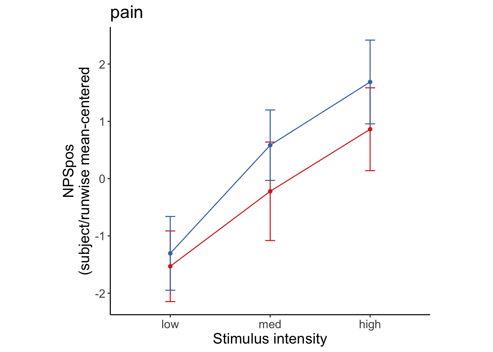


## NPS:ccue * expect (expect demean)
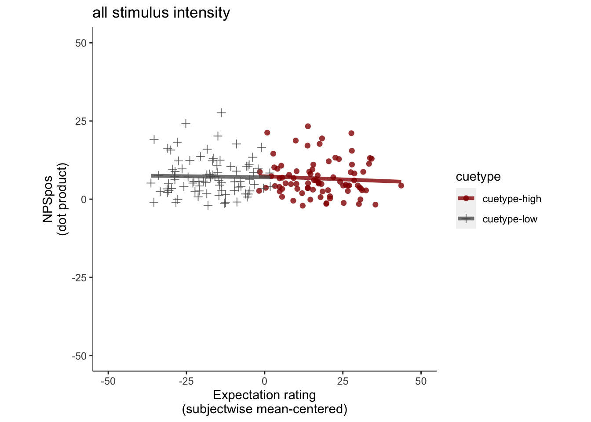
## NPS:ccue * expect (both demean)
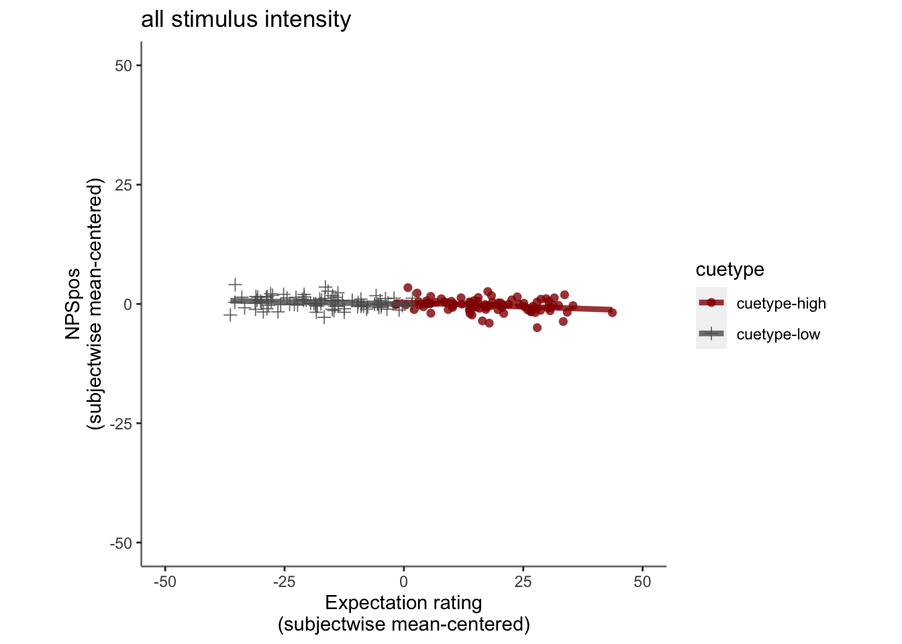

## NPS: stim * cue * expect
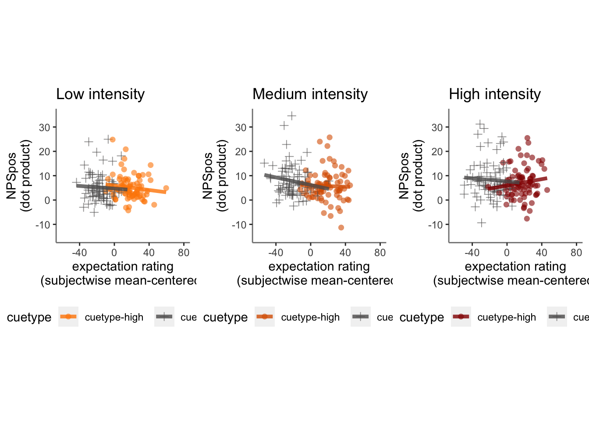


## NPS: stim * cue * expect (demean)
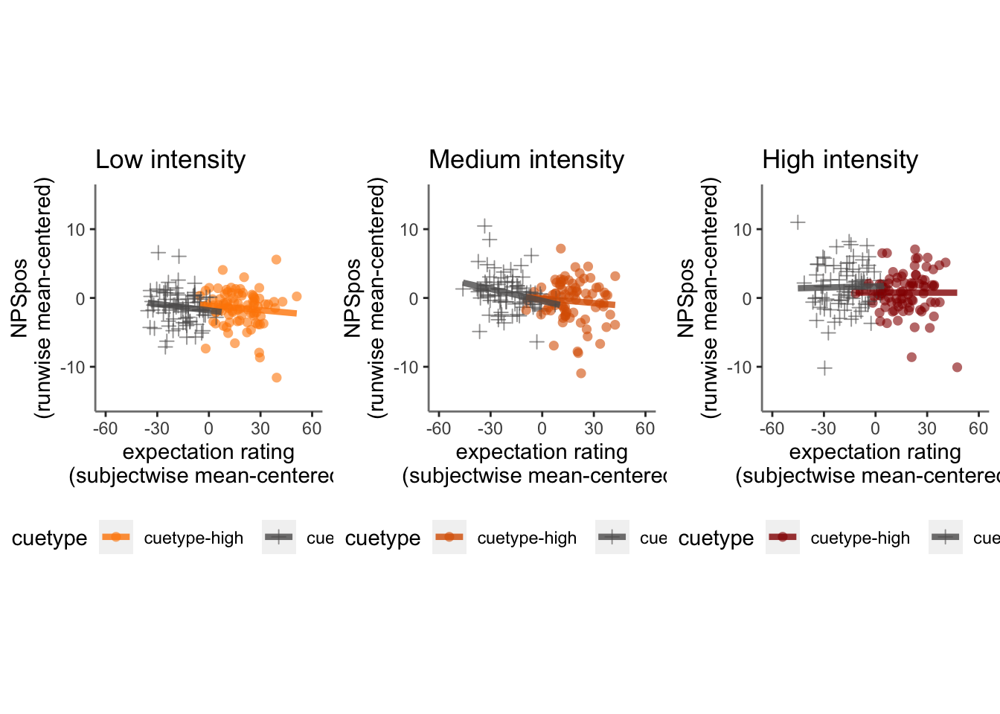

## NPS demeaned (both)

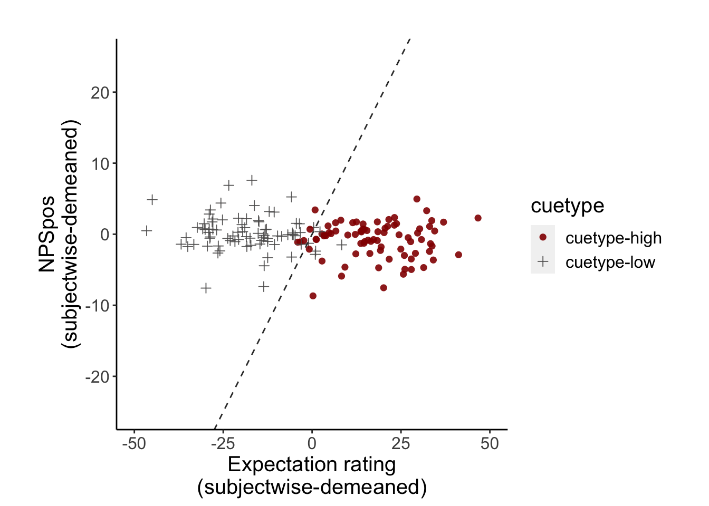

## NPS demeaned cue *expect


```
## `geom_smooth()` using formula = 'y ~ x'
```

```
## Warning: Removed 1 rows containing non-finite values (`stat_smooth()`).
```

```
## Warning: Removed 1 rows containing missing values (`geom_point()`).
```

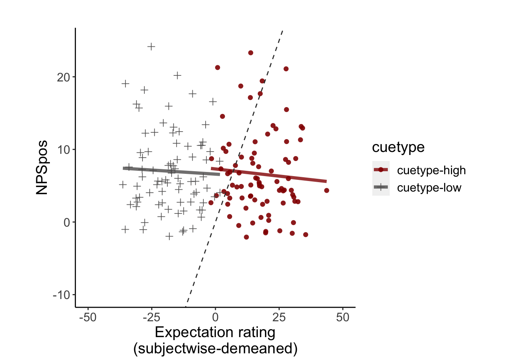


## Behavioral data
### behavioral demeaned (both)


```
## `geom_smooth()` using formula = 'y ~ x'
```

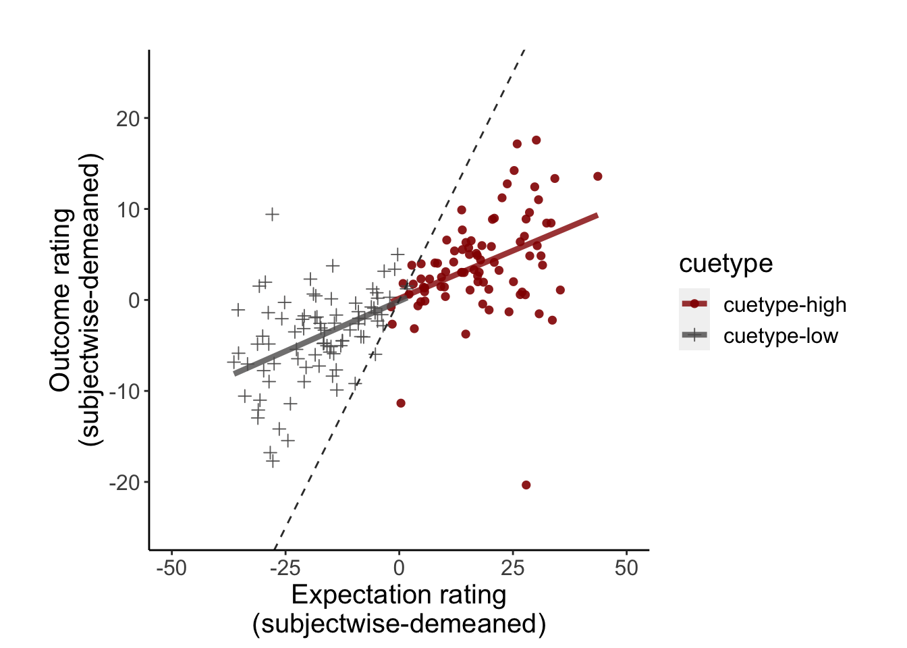

### behavioral lineplots
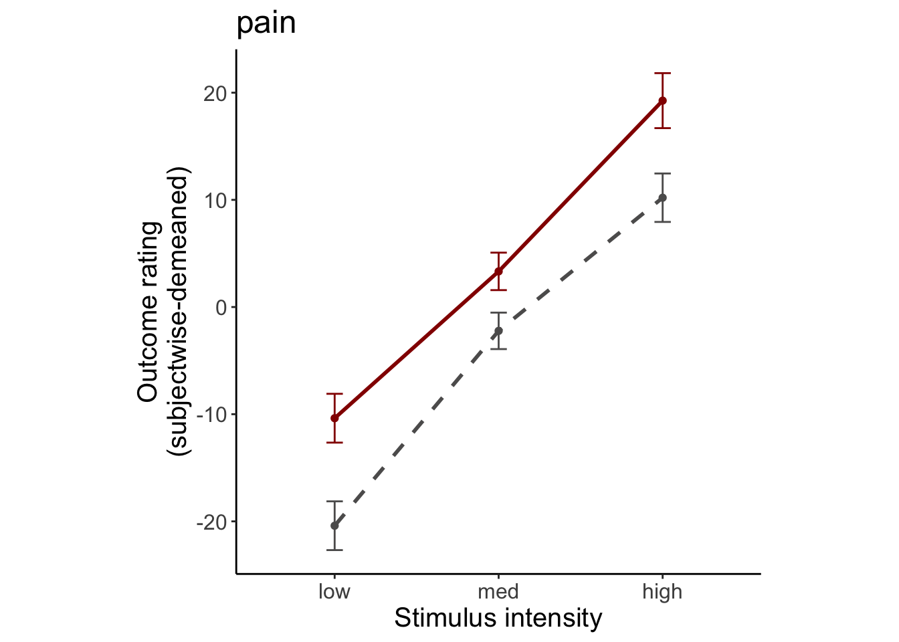


### behavioral cue * stim * expect
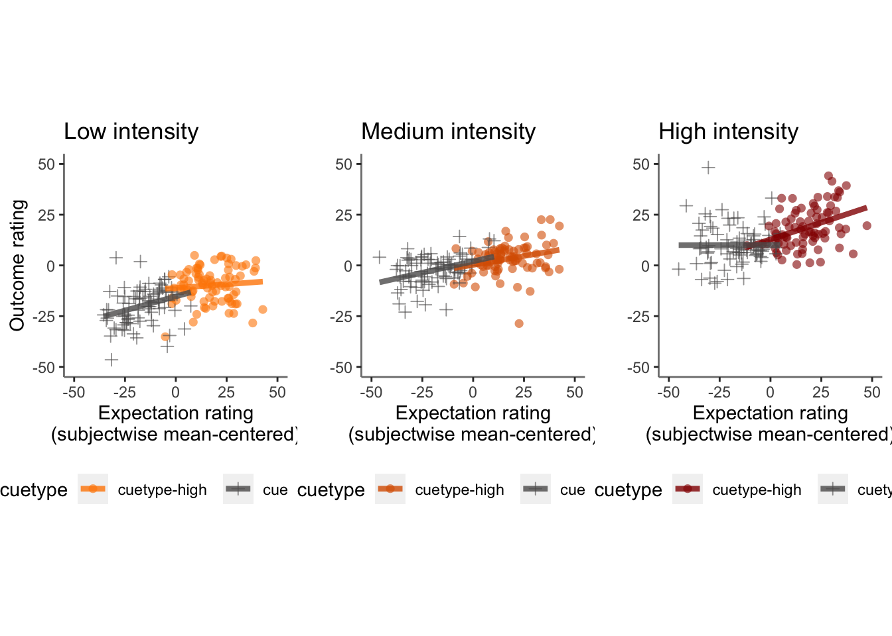
